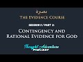

# Contingency and Rational Evidence for God | The Evidence Course | Session 2 / Part 2 (2021-07-14)

## Description

Session 2 Part 2

In an age of information overload and widespread pseudo-intellectualism, understanding the core foundations of Islam is as essential as ever. 

This course comprehensively deconstructs the skeletal structure of prevalent ideologies and concepts such as atheism, scientism, materialism, secularism, and skepticism, in light of an all-encompassing intellectually robust Islamic worldview.

Thought Adventure Support
◄ PayPal - https://www.paypal.com/donate/?hosted_button_id=6KZWK75RB23RN 
◄ YouTube - https://www.youtube.com/c/ThoughtAdventurePodcast/join
◄ PATREON - https://www.patreon.com/thoughtadventurepodcast
____________________________________________________________________

Thought Adventure Social Media
◄ Twitter: https://twitter.com/T_A_Podcast​​ [@T_A_Podcast]
◄ Clubhouse https://www.clubhouse.com/club/thought-adventure-podcast
◄ Spotify: https://open.spotify.com/show/7x4UVfTz9QX8KVdEXquDUC
◄ Facebook: https://m.facebook.com/ThoughtAdventurePodcast
◄ Instagram: https://www.instagram.com/ThoughtAdventurePodcast​

----------------------------------------------------------------

*The Hosts:*
----------------------|
Jake Brancatella, The Muslim Metaphysician

- Youtube: https://www.youtube.com/channel/UCcGQRfTPNyHlXMqckvz2uqQ
- Twitter:  https://twitter.com/MMetaphysician​​ [@MMetaphysician]

----------------------|

Yusuf Ponders, The Pondering Soul

- Youtube: https://www.youtube.com/channel/UCsiDDxy0JXLqM6HBA0MA4NA
- Twitter: https://twitter.com/YusufPonders​​ [@YusufPonders]
- Facebook: https://www.facebook.com/yusufponders​ [@yusufpodners]

----------------------|

Sharif

- Twitter: https://twitter.com/sharifhafezi​​ [@sharifhafezi]

----------------------|

Abdulrahman

- Twitter: https://twitter.com/abdul_now​ [@abdul_now]

----------------------|

Admin

Riyad 
Gmail: hello.tapodcast@gmail.com

#Contigency #Kalam #EvidenceForGod

## Summary of [Contingency and Rational Evidence for God | The Evidence Course | Session 2 / Part 2](https://www.youtube.com/watch?v=_jOj2QylBww)

*This summary is AI generated - there may be inaccuracies. *

### [00:00:00](https://www.youtube.com/watch?v=_jOj2QylBww&t=0) - [00:20:00](https://www.youtube.com/watch?v=_jOj2QylBww&t=1200)

 discusses the concept of contingency and how it applies to the existence of beings in the universe. It concludes that an infinite, independent, and necessary being must exist in order for anything to exist at all.

**[00:00:00](https://www.youtube.com/watch?v=_jOj2QylBww&t=0)* Discusses the concept of contingency, which refers to something being in a possible state rather than in a certain state. The examples given illustrate how something can change its state without necessarily needing a cause, and how something can exist but not have a certain property. The table is an example of something that exists but is not limited by its material components.
* **[00:05:00](https://www.youtube.com/watch?v=_jOj2QylBww&t=300)* Discusses the concept of contingency, which refers to something that has a possible existence that is not determined by its components or attributes.  explains that, in order to identify a particular possible being, something else must be necessary for its existence. The example given is of a red triangle, which requires three sides to exist but could be any color.
* **[00:10:00](https://www.youtube.com/watch?v=_jOj2QylBww&t=600)* Discusses the idea that things in the universe are contingent, which means that they could be arranged in another way. It also discusses the idea that things in the universe are dependent upon something else for their own existence.  finishes by discussing the big bang and how it is a possible reality that could exist in another way.
* **[00:15:00](https://www.youtube.com/watch?v=_jOj2QylBww&t=900)* Discusses the four potential possibilities for how something could come from nothing, and concludes that an infinite regression is impossible. This means that for something to exist, it must have a beginning, which means that nothing exists.
* **[00:20:00](https://www.youtube.com/watch?v=_jOj2QylBww&t=1200)**  the presenter discusses how the existence of contingent beings can be explained, ultimately referring to an infinite, independent, and necessary being as the cause.

<h2>Full transcript with timestamps: CLICK TO EXPAND</h2>

[0:00:15](https://youtu.be/_jOj2QylBww?t=15) rational thinking requires us to sense  
[0:00:17](https://youtu.be/_jOj2QylBww?t=17) the reality as a starting point  
[0:00:19](https://youtu.be/_jOj2QylBww?t=19) the verses of the quran also direct us  
[0:00:22](https://youtu.be/_jOj2QylBww?t=22) to study the reality around us  
[0:00:24](https://youtu.be/_jOj2QylBww?t=24) as a means to understand the existence  
[0:00:25](https://youtu.be/_jOj2QylBww?t=25) of the creator  
[0:00:28](https://youtu.be/_jOj2QylBww?t=28) this leads us to the idea of contingency  
[0:00:33](https://youtu.be/_jOj2QylBww?t=33) in essence identifying something as  
[0:00:35](https://youtu.be/_jOj2QylBww?t=35) contingent  
[0:00:36](https://youtu.be/_jOj2QylBww?t=36) results in us asking the question  
[0:00:40](https://youtu.be/_jOj2QylBww?t=40) why does it exist or primarily what is  
[0:00:43](https://youtu.be/_jOj2QylBww?t=43) the cause  
[0:00:44](https://youtu.be/_jOj2QylBww?t=44) behind its existence  
[0:00:47](https://youtu.be/_jOj2QylBww?t=47) i think it's important that we get into  
[0:00:49](https://youtu.be/_jOj2QylBww?t=49) the discussion and explain what this  
[0:00:50](https://youtu.be/_jOj2QylBww?t=50) term contingent really means  
[0:00:53](https://youtu.be/_jOj2QylBww?t=53) but before i go in and explain directly  
[0:00:55](https://youtu.be/_jOj2QylBww?t=55) what contingent means  
[0:00:56](https://youtu.be/_jOj2QylBww?t=56) i want to give you some examples and  
[0:00:58](https://youtu.be/_jOj2QylBww?t=58) it's through these examples that will  
[0:01:00](https://youtu.be/_jOj2QylBww?t=60) better understand what this term is  
[0:01:03](https://youtu.be/_jOj2QylBww?t=63) so imagine while you're watching this  
[0:01:05](https://youtu.be/_jOj2QylBww?t=65) video  
[0:01:06](https://youtu.be/_jOj2QylBww?t=66) you see a tennis ball flash across the  
[0:01:09](https://youtu.be/_jOj2QylBww?t=69) screen  
[0:01:11](https://youtu.be/_jOj2QylBww?t=71) yours and my natural reaction is to ask  
[0:01:15](https://youtu.be/_jOj2QylBww?t=75) who and what caused that to occur what  
[0:01:18](https://youtu.be/_jOj2QylBww?t=78) caused this tennis ball  
[0:01:19](https://youtu.be/_jOj2QylBww?t=79) to move from one part of the screen to  
[0:01:21](https://youtu.be/_jOj2QylBww?t=81) another  
[0:01:23](https://youtu.be/_jOj2QylBww?t=83) similarly if i hear a knocking on the  
[0:01:26](https://youtu.be/_jOj2QylBww?t=86) door  
[0:01:28](https://youtu.be/_jOj2QylBww?t=88) i'm going to ask the question who's  
[0:01:30](https://youtu.be/_jOj2QylBww?t=90) caused the knocking on the door  
[0:01:33](https://youtu.be/_jOj2QylBww?t=93) what is the cause behind that knocking  
[0:01:34](https://youtu.be/_jOj2QylBww?t=94) on the door  
[0:01:36](https://youtu.be/_jOj2QylBww?t=96) and so with these two examples  
[0:01:40](https://youtu.be/_jOj2QylBww?t=100) we're noticing certain things the first  
[0:01:43](https://youtu.be/_jOj2QylBww?t=103) thing that we notice  
[0:01:44](https://youtu.be/_jOj2QylBww?t=104) is the idea of change when something  
[0:01:48](https://youtu.be/_jOj2QylBww?t=108) changes from one form to another  
[0:01:51](https://youtu.be/_jOj2QylBww?t=111) we ask the question what brought that  
[0:01:54](https://youtu.be/_jOj2QylBww?t=114) change about  
[0:01:55](https://youtu.be/_jOj2QylBww?t=115) the second thing is that these things  
[0:01:58](https://youtu.be/_jOj2QylBww?t=118) don't have to be the way they are  
[0:02:02](https://youtu.be/_jOj2QylBww?t=122) so when a ball moves it doesn't have to  
[0:02:05](https://youtu.be/_jOj2QylBww?t=125) move  
[0:02:06](https://youtu.be/_jOj2QylBww?t=126) but it does move and it might have moved  
[0:02:09](https://youtu.be/_jOj2QylBww?t=129) from a position of  
[0:02:10](https://youtu.be/_jOj2QylBww?t=130) uh stationary position to  
[0:02:14](https://youtu.be/_jOj2QylBww?t=134) motion so there is change and there's  
[0:02:17](https://youtu.be/_jOj2QylBww?t=137) not  
[0:02:17](https://youtu.be/_jOj2QylBww?t=137) just change but it changes in a way they  
[0:02:20](https://youtu.be/_jOj2QylBww?t=140) didn't have to  
[0:02:22](https://youtu.be/_jOj2QylBww?t=142) so when we've identified these two  
[0:02:25](https://youtu.be/_jOj2QylBww?t=145) characteristics  
[0:02:26](https://youtu.be/_jOj2QylBww?t=146) that there is change and that it didn't  
[0:02:28](https://youtu.be/_jOj2QylBww?t=148) have to be that way  
[0:02:31](https://youtu.be/_jOj2QylBww?t=151) when we identify these two things we  
[0:02:33](https://youtu.be/_jOj2QylBww?t=153) inevitably ask  
[0:02:35](https://youtu.be/_jOj2QylBww?t=155) what is the reason for it to do that why  
[0:02:38](https://youtu.be/_jOj2QylBww?t=158) did it change  
[0:02:40](https://youtu.be/_jOj2QylBww?t=160) or in essence what is the cause  
[0:02:44](https://youtu.be/_jOj2QylBww?t=164) that has caused this particular state so  
[0:02:46](https://youtu.be/_jOj2QylBww?t=166) a door  
[0:02:47](https://youtu.be/_jOj2QylBww?t=167) the door is not knocking there is no  
[0:02:50](https://youtu.be/_jOj2QylBww?t=170) sound coming from the door  
[0:02:51](https://youtu.be/_jOj2QylBww?t=171) and suddenly i hear tap tap tap  
[0:02:55](https://youtu.be/_jOj2QylBww?t=175) and there is a knocking and i think to  
[0:02:57](https://youtu.be/_jOj2QylBww?t=177) myself  
[0:02:58](https://youtu.be/_jOj2QylBww?t=178) that's a change in state and so as a  
[0:03:01](https://youtu.be/_jOj2QylBww?t=181) result  
[0:03:02](https://youtu.be/_jOj2QylBww?t=182) and it's not necessary for the door just  
[0:03:05](https://youtu.be/_jOj2QylBww?t=185) make this sound  
[0:03:07](https://youtu.be/_jOj2QylBww?t=187) so i'm going to ask what's caused that  
[0:03:09](https://youtu.be/_jOj2QylBww?t=189) what's the explanation behind it  
[0:03:11](https://youtu.be/_jOj2QylBww?t=191) who caused it therefore we say that it's  
[0:03:15](https://youtu.be/_jOj2QylBww?t=195) in a possible state  
[0:03:17](https://youtu.be/_jOj2QylBww?t=197) knocking is a possibility of the door  
[0:03:20](https://youtu.be/_jOj2QylBww?t=200) the ball moving is a possibility of the  
[0:03:22](https://youtu.be/_jOj2QylBww?t=202) ball  
[0:03:23](https://youtu.be/_jOj2QylBww?t=203) yeah the fact that the ball is  
[0:03:25](https://youtu.be/_jOj2QylBww?t=205) stationary is a possibility  
[0:03:27](https://youtu.be/_jOj2QylBww?t=207) of the the ball as well  
[0:03:30](https://youtu.be/_jOj2QylBww?t=210) let's look at another example let's look  
[0:03:33](https://youtu.be/_jOj2QylBww?t=213) at the example of a table made out of  
[0:03:35](https://youtu.be/_jOj2QylBww?t=215) wood  
[0:03:36](https://youtu.be/_jOj2QylBww?t=216) the wooden table's existence existence  
[0:03:40](https://youtu.be/_jOj2QylBww?t=220) is dependent upon the existence of wood  
[0:03:42](https://youtu.be/_jOj2QylBww?t=222) what it's made out of  
[0:03:43](https://youtu.be/_jOj2QylBww?t=223) i have a wooden table it's made out of  
[0:03:46](https://youtu.be/_jOj2QylBww?t=226) wood  
[0:03:47](https://youtu.be/_jOj2QylBww?t=227) if i had no wood i would have no table  
[0:03:51](https://youtu.be/_jOj2QylBww?t=231) but let's ask the other question  
[0:03:54](https://youtu.be/_jOj2QylBww?t=234) if i had wood does it mean i have a  
[0:03:57](https://youtu.be/_jOj2QylBww?t=237) table  
[0:03:59](https://youtu.be/_jOj2QylBww?t=239) the answer is no why why why can we say  
[0:04:02](https://youtu.be/_jOj2QylBww?t=242) that if i had wood  
[0:04:03](https://youtu.be/_jOj2QylBww?t=243) does not necessarily mean i have a table  
[0:04:05](https://youtu.be/_jOj2QylBww?t=245) that's because  
[0:04:07](https://youtu.be/_jOj2QylBww?t=247) the wood that makes up the table it  
[0:04:09](https://youtu.be/_jOj2QylBww?t=249) could be  
[0:04:10](https://youtu.be/_jOj2QylBww?t=250) in a number of possible states  
[0:04:13](https://youtu.be/_jOj2QylBww?t=253) one of which is a table so that you out  
[0:04:16](https://youtu.be/_jOj2QylBww?t=256) of the wood you could make a chair  
[0:04:17](https://youtu.be/_jOj2QylBww?t=257) out of the wood you could make a make a  
[0:04:19](https://youtu.be/_jOj2QylBww?t=259) wooden bed  
[0:04:21](https://youtu.be/_jOj2QylBww?t=261) out of the wood maybe spoons so simply  
[0:04:24](https://youtu.be/_jOj2QylBww?t=264) having its material components  
[0:04:26](https://youtu.be/_jOj2QylBww?t=266) doesn't necessitate the existence of the  
[0:04:28](https://youtu.be/_jOj2QylBww?t=268) particular form  
[0:04:30](https://youtu.be/_jOj2QylBww?t=270) in this case the table so just because i  
[0:04:32](https://youtu.be/_jOj2QylBww?t=272) have  
[0:04:33](https://youtu.be/_jOj2QylBww?t=273) the word does not necessarily mean i  
[0:04:36](https://youtu.be/_jOj2QylBww?t=276) have the table  
[0:04:37](https://youtu.be/_jOj2QylBww?t=277) because the word could exist in a number  
[0:04:39](https://youtu.be/_jOj2QylBww?t=279) of different  
[0:04:40](https://youtu.be/_jOj2QylBww?t=280) possible states so it and also the other  
[0:04:44](https://youtu.be/_jOj2QylBww?t=284) thing about the  
[0:04:45](https://youtu.be/_jOj2QylBww?t=285) the table is that it's could be bigger  
[0:04:48](https://youtu.be/_jOj2QylBww?t=288) and smaller than it actually maybe is  
[0:04:51](https://youtu.be/_jOj2QylBww?t=291) so it could be four feet wide or it  
[0:04:54](https://youtu.be/_jOj2QylBww?t=294) could be two feet wide  
[0:04:56](https://youtu.be/_jOj2QylBww?t=296) so the table is therefore limited  
[0:05:00](https://youtu.be/_jOj2QylBww?t=300) has a particular set of dimensions  
[0:05:03](https://youtu.be/_jOj2QylBww?t=303) has a specific or set of limits  
[0:05:10](https://youtu.be/_jOj2QylBww?t=310) so by identifying the specific set of  
[0:05:13](https://youtu.be/_jOj2QylBww?t=313) limits  
[0:05:13](https://youtu.be/_jOj2QylBww?t=313) out of a number of possible limits could  
[0:05:15](https://youtu.be/_jOj2QylBww?t=315) be bigger could be smaller  
[0:05:17](https://youtu.be/_jOj2QylBww?t=317) we would validly ask the question why is  
[0:05:20](https://youtu.be/_jOj2QylBww?t=320) it  
[0:05:20](https://youtu.be/_jOj2QylBww?t=320) that size why is the wood  
[0:05:24](https://youtu.be/_jOj2QylBww?t=324) into a table and not a chair  
[0:05:28](https://youtu.be/_jOj2QylBww?t=328) whose does its material components  
[0:05:30](https://youtu.be/_jOj2QylBww?t=330) determine  
[0:05:31](https://youtu.be/_jOj2QylBww?t=331) obviously a particular size or  
[0:05:32](https://youtu.be/_jOj2QylBww?t=332) limitations no it doesn't not  
[0:05:34](https://youtu.be/_jOj2QylBww?t=334) necessarily  
[0:05:35](https://youtu.be/_jOj2QylBww?t=335) if i had loads of wood i could still  
[0:05:37](https://youtu.be/_jOj2QylBww?t=337) make a small table and leave the rest of  
[0:05:39](https://youtu.be/_jOj2QylBww?t=339) the wood away  
[0:05:41](https://youtu.be/_jOj2QylBww?t=341) or does it be in a table mean it has to  
[0:05:43](https://youtu.be/_jOj2QylBww?t=343) be a particular size no it doesn't  
[0:05:46](https://youtu.be/_jOj2QylBww?t=346) so we can have numerous potential sizes  
[0:05:50](https://youtu.be/_jOj2QylBww?t=350) so what we're identifying is that a  
[0:05:52](https://youtu.be/_jOj2QylBww?t=352) particular wooden table  
[0:05:54](https://youtu.be/_jOj2QylBww?t=354) with a particular set of attributes or  
[0:05:56](https://youtu.be/_jOj2QylBww?t=356) limits  
[0:05:57](https://youtu.be/_jOj2QylBww?t=357) could not have been determined by itself  
[0:06:00](https://youtu.be/_jOj2QylBww?t=360) not by it being table  
[0:06:02](https://youtu.be/_jOj2QylBww?t=362) defining its size and it's its trait and  
[0:06:04](https://youtu.be/_jOj2QylBww?t=364) not  
[0:06:05](https://youtu.be/_jOj2QylBww?t=365) by having wood does it define that it  
[0:06:06](https://youtu.be/_jOj2QylBww?t=366) has to be of a certain size and certain  
[0:06:09](https://youtu.be/_jOj2QylBww?t=369) attributes and traits it requires  
[0:06:13](https://youtu.be/_jOj2QylBww?t=373) something other than that the existence  
[0:06:16](https://youtu.be/_jOj2QylBww?t=376) of a table  
[0:06:17](https://youtu.be/_jOj2QylBww?t=377) and something other than the existence  
[0:06:19](https://youtu.be/_jOj2QylBww?t=379) of the wood  
[0:06:20](https://youtu.be/_jOj2QylBww?t=380) in order to determine the existence of a  
[0:06:23](https://youtu.be/_jOj2QylBww?t=383) wooden table  
[0:06:28](https://youtu.be/_jOj2QylBww?t=388) furthermore another point the table  
[0:06:31](https://youtu.be/_jOj2QylBww?t=391) didn't always  
[0:06:32](https://youtu.be/_jOj2QylBww?t=392) have to exist it had a beginning to its  
[0:06:35](https://youtu.be/_jOj2QylBww?t=395) existence  
[0:06:36](https://youtu.be/_jOj2QylBww?t=396) and wasn't eternally existent  
[0:06:39](https://youtu.be/_jOj2QylBww?t=399) so it's possible so it's a possible  
[0:06:42](https://youtu.be/_jOj2QylBww?t=402) existence  
[0:06:43](https://youtu.be/_jOj2QylBww?t=403) i could have been non-existent that's  
[0:06:46](https://youtu.be/_jOj2QylBww?t=406) one of its possible  
[0:06:47](https://youtu.be/_jOj2QylBww?t=407) states of a thing that begins to exist  
[0:06:51](https://youtu.be/_jOj2QylBww?t=411) or it could exist i could  
[0:06:55](https://youtu.be/_jOj2QylBww?t=415) come into existence so contingency this  
[0:06:58](https://youtu.be/_jOj2QylBww?t=418) word  
[0:06:59](https://youtu.be/_jOj2QylBww?t=419) when we come back to it is identifying  
[0:07:01](https://youtu.be/_jOj2QylBww?t=421) that certain things that exist  
[0:07:04](https://youtu.be/_jOj2QylBww?t=424) have a possible existence that's why  
[0:07:06](https://youtu.be/_jOj2QylBww?t=426) they use another word for contingency  
[0:07:08](https://youtu.be/_jOj2QylBww?t=428) like the pos  
[0:07:09](https://youtu.be/_jOj2QylBww?t=429) a possible being here just as a side  
[0:07:11](https://youtu.be/_jOj2QylBww?t=431) point when we say  
[0:07:12](https://youtu.be/_jOj2QylBww?t=432) being we're not saying being like human  
[0:07:15](https://youtu.be/_jOj2QylBww?t=435) being  
[0:07:16](https://youtu.be/_jOj2QylBww?t=436) or you know living being being is that  
[0:07:19](https://youtu.be/_jOj2QylBww?t=439) which exists  
[0:07:20](https://youtu.be/_jOj2QylBww?t=440) yeah and we're saying therefore that  
[0:07:22](https://youtu.be/_jOj2QylBww?t=442) that which exists  
[0:07:24](https://youtu.be/_jOj2QylBww?t=444) is which is contingent is a possible  
[0:07:26](https://youtu.be/_jOj2QylBww?t=446) being it's a possibility  
[0:07:28](https://youtu.be/_jOj2QylBww?t=448) it has a number of possible possibility  
[0:07:31](https://youtu.be/_jOj2QylBww?t=451) because it has a number of possibilities  
[0:07:34](https://youtu.be/_jOj2QylBww?t=454) i  
[0:07:34](https://youtu.be/_jOj2QylBww?t=454) a contingent uh possible being  
[0:07:38](https://youtu.be/_jOj2QylBww?t=458) then there needs to be then we ask the  
[0:07:40](https://youtu.be/_jOj2QylBww?t=460) question  
[0:07:42](https://youtu.be/_jOj2QylBww?t=462) that the possibility pushes us to ask  
[0:07:43](https://youtu.be/_jOj2QylBww?t=463) the question  
[0:07:45](https://youtu.be/_jOj2QylBww?t=465) why is it that possibility as opposed to  
[0:07:48](https://youtu.be/_jOj2QylBww?t=468) any other possibility  
[0:07:49](https://youtu.be/_jOj2QylBww?t=469) let me give you another example because  
[0:07:52](https://youtu.be/_jOj2QylBww?t=472) sometimes these terms  
[0:07:53](https://youtu.be/_jOj2QylBww?t=473) and these ideas can be a little bit  
[0:07:55](https://youtu.be/_jOj2QylBww?t=475) confusing  
[0:07:57](https://youtu.be/_jOj2QylBww?t=477) a red triangle  
[0:08:00](https://youtu.be/_jOj2QylBww?t=480) so three sides are necessary for a  
[0:08:02](https://youtu.be/_jOj2QylBww?t=482) triangle  
[0:08:03](https://youtu.be/_jOj2QylBww?t=483) we have to have three sides in order to  
[0:08:06](https://youtu.be/_jOj2QylBww?t=486) have a triangle you can't have a four  
[0:08:07](https://youtu.be/_jOj2QylBww?t=487) sided triangle  
[0:08:08](https://youtu.be/_jOj2QylBww?t=488) or you can't have a round triangle so  
[0:08:12](https://youtu.be/_jOj2QylBww?t=492) three sides is necessary for the  
[0:08:14](https://youtu.be/_jOj2QylBww?t=494) existence of a triangle  
[0:08:17](https://youtu.be/_jOj2QylBww?t=497) but the fact that it's a red triangle  
[0:08:20](https://youtu.be/_jOj2QylBww?t=500) red is not a necessity  
[0:08:23](https://youtu.be/_jOj2QylBww?t=503) for the existence of a triangle in fact  
[0:08:26](https://youtu.be/_jOj2QylBww?t=506) the triangle could be any colour  
[0:08:27](https://youtu.be/_jOj2QylBww?t=507) could be red yellow blue pink purple  
[0:08:30](https://youtu.be/_jOj2QylBww?t=510) whatever  
[0:08:31](https://youtu.be/_jOj2QylBww?t=511) yeah the rainbow colours it could be any  
[0:08:33](https://youtu.be/_jOj2QylBww?t=513) of these colours  
[0:08:35](https://youtu.be/_jOj2QylBww?t=515) so the fact that the tread triangle or  
[0:08:37](https://youtu.be/_jOj2QylBww?t=517) the triangle is a particular possibility  
[0:08:40](https://youtu.be/_jOj2QylBww?t=520) particular color and makes us identify  
[0:08:43](https://youtu.be/_jOj2QylBww?t=523) that  
[0:08:44](https://youtu.be/_jOj2QylBww?t=524) there is something that has given the  
[0:08:46](https://youtu.be/_jOj2QylBww?t=526) possibility  
[0:08:47](https://youtu.be/_jOj2QylBww?t=527) or actualized its possibility in that  
[0:08:50](https://youtu.be/_jOj2QylBww?t=530) sense  
[0:08:51](https://youtu.be/_jOj2QylBww?t=531) and that thing that actualizes it causes  
[0:08:53](https://youtu.be/_jOj2QylBww?t=533) it to be red as opposed to blue or green  
[0:08:55](https://youtu.be/_jOj2QylBww?t=535) or pink  
[0:08:56](https://youtu.be/_jOj2QylBww?t=536) that thing that causes it can't be a  
[0:08:58](https://youtu.be/_jOj2QylBww?t=538) triangle because it's not in the  
[0:09:00](https://youtu.be/_jOj2QylBww?t=540) definition of a triangle to be red  
[0:09:02](https://youtu.be/_jOj2QylBww?t=542) and it can't be being red because red is  
[0:09:04](https://youtu.be/_jOj2QylBww?t=544) a attribute  
[0:09:06](https://youtu.be/_jOj2QylBww?t=546) of the actual particular triangle so  
[0:09:08](https://youtu.be/_jOj2QylBww?t=548) it's outside of that  
[0:09:09](https://youtu.be/_jOj2QylBww?t=549) shape so what we sense when we talk  
[0:09:13](https://youtu.be/_jOj2QylBww?t=553) about contingent  
[0:09:14](https://youtu.be/_jOj2QylBww?t=554) or possible things beings  
[0:09:17](https://youtu.be/_jOj2QylBww?t=557) is we're we're sensing its dependency  
[0:09:21](https://youtu.be/_jOj2QylBww?t=561) upon something else for its existence so  
[0:09:24](https://youtu.be/_jOj2QylBww?t=564) a red triangle  
[0:09:25](https://youtu.be/_jOj2QylBww?t=565) for it to be red requires somebody to  
[0:09:28](https://youtu.be/_jOj2QylBww?t=568) draw a red triangle yeah as opposed to a  
[0:09:31](https://youtu.be/_jOj2QylBww?t=571) green one  
[0:09:32](https://youtu.be/_jOj2QylBww?t=572) so something has to have caused it yeah  
[0:09:34](https://youtu.be/_jOj2QylBww?t=574) this is what we're we're saying  
[0:09:36](https://youtu.be/_jOj2QylBww?t=576) what we're understanding what we're  
[0:09:38](https://youtu.be/_jOj2QylBww?t=578) sensing and we're sensing from the  
[0:09:39](https://youtu.be/_jOj2QylBww?t=579) possible being  
[0:09:41](https://youtu.be/_jOj2QylBww?t=581) a dependency  
[0:09:44](https://youtu.be/_jOj2QylBww?t=584) so in other words so what we're sensing  
[0:09:46](https://youtu.be/_jOj2QylBww?t=586) is something dependent  
[0:09:47](https://youtu.be/_jOj2QylBww?t=587) in other words contingent  
[0:09:51](https://youtu.be/_jOj2QylBww?t=591) and this is when we identify that things  
[0:09:53](https://youtu.be/_jOj2QylBww?t=593) didn't always have to exist  
[0:09:55](https://youtu.be/_jOj2QylBww?t=595) so if we had we we can say something is  
[0:09:56](https://youtu.be/_jOj2QylBww?t=596) contingent or dependent  
[0:09:58](https://youtu.be/_jOj2QylBww?t=598) if things did not always have to exist  
[0:10:01](https://youtu.be/_jOj2QylBww?t=601) yeah like the movement of the ball  
[0:10:03](https://youtu.be/_jOj2QylBww?t=603) didn't always  
[0:10:05](https://youtu.be/_jOj2QylBww?t=605) exist and it's necessary and it's not  
[0:10:07](https://youtu.be/_jOj2QylBww?t=607) necessary  
[0:10:08](https://youtu.be/_jOj2QylBww?t=608) for the ball to move that the attributes  
[0:10:11](https://youtu.be/_jOj2QylBww?t=611) of a thing  
[0:10:12](https://youtu.be/_jOj2QylBww?t=612) of a being could be something else it  
[0:10:15](https://youtu.be/_jOj2QylBww?t=615) doesn't have to be that way  
[0:10:16](https://youtu.be/_jOj2QylBww?t=616) so the table could have been bigger or  
[0:10:18](https://youtu.be/_jOj2QylBww?t=618) smaller it's not necessary for the table  
[0:10:21](https://youtu.be/_jOj2QylBww?t=621) to be this particular size as opposed to  
[0:10:23](https://youtu.be/_jOj2QylBww?t=623) another size  
[0:10:24](https://youtu.be/_jOj2QylBww?t=624) we can say something's contingent i  
[0:10:26](https://youtu.be/_jOj2QylBww?t=626) dependent  
[0:10:27](https://youtu.be/_jOj2QylBww?t=627) if the thing could be potentially  
[0:10:29](https://youtu.be/_jOj2QylBww?t=629) arranged in another way  
[0:10:32](https://youtu.be/_jOj2QylBww?t=632) if we identify one or all three of these  
[0:10:35](https://youtu.be/_jOj2QylBww?t=635) aspects  
[0:10:36](https://youtu.be/_jOj2QylBww?t=636) of a thing we necessarily ask the  
[0:10:38](https://youtu.be/_jOj2QylBww?t=638) question  
[0:10:39](https://youtu.be/_jOj2QylBww?t=639) what caused it or who determined it  
[0:10:43](https://youtu.be/_jOj2QylBww?t=643) to be that way i what is it dependent  
[0:10:46](https://youtu.be/_jOj2QylBww?t=646) upon  
[0:10:48](https://youtu.be/_jOj2QylBww?t=648) so how does this answer the question  
[0:10:50](https://youtu.be/_jOj2QylBww?t=650) does a creator exist  
[0:10:51](https://youtu.be/_jOj2QylBww?t=651) or not if we identify that things we  
[0:10:55](https://youtu.be/_jOj2QylBww?t=655) sense within the universe and in fact  
[0:10:57](https://youtu.be/_jOj2QylBww?t=657) the universe as a whole is contingent  
[0:11:02](https://youtu.be/_jOj2QylBww?t=662) so that means we're sensing that the  
[0:11:04](https://youtu.be/_jOj2QylBww?t=664) universe or things within the universe  
[0:11:06](https://youtu.be/_jOj2QylBww?t=666) began to exist that they have  
[0:11:09](https://youtu.be/_jOj2QylBww?t=669) attributes that these attributes  
[0:11:13](https://youtu.be/_jOj2QylBww?t=673) are could be other than what they are  
[0:11:16](https://youtu.be/_jOj2QylBww?t=676) yeah that they could be that the things  
[0:11:18](https://youtu.be/_jOj2QylBww?t=678) within the universe and the universe as  
[0:11:20](https://youtu.be/_jOj2QylBww?t=680) well could be arranged in another way  
[0:11:22](https://youtu.be/_jOj2QylBww?t=682) as opposed to the way that we have come  
[0:11:24](https://youtu.be/_jOj2QylBww?t=684) to see it  
[0:11:25](https://youtu.be/_jOj2QylBww?t=685) then we understand that the universe  
[0:11:27](https://youtu.be/_jOj2QylBww?t=687) itself is dependent  
[0:11:30](https://youtu.be/_jOj2QylBww?t=690) i it requires something else to have  
[0:11:32](https://youtu.be/_jOj2QylBww?t=692) determined the existence  
[0:11:34](https://youtu.be/_jOj2QylBww?t=694) of the universe and so  
[0:11:37](https://youtu.be/_jOj2QylBww?t=697) this can be used this argument this  
[0:11:39](https://youtu.be/_jOj2QylBww?t=699) point about contingency can be used in a  
[0:11:41](https://youtu.be/_jOj2QylBww?t=701) number of ways  
[0:11:43](https://youtu.be/_jOj2QylBww?t=703) so i'll give one of the ways and maybe a  
[0:11:45](https://youtu.be/_jOj2QylBww?t=705) couple of other ways as well  
[0:11:47](https://youtu.be/_jOj2QylBww?t=707) firstly let's look at the issue of the  
[0:11:49](https://youtu.be/_jOj2QylBww?t=709) wooden table yeah  
[0:11:50](https://youtu.be/_jOj2QylBww?t=710) so we say the wooden table is a  
[0:11:53](https://youtu.be/_jOj2QylBww?t=713) contingent being it's not  
[0:11:54](https://youtu.be/_jOj2QylBww?t=714) always existed it required something  
[0:11:57](https://youtu.be/_jOj2QylBww?t=717) else for its existence  
[0:11:59](https://youtu.be/_jOj2QylBww?t=719) if we look at it just from a material  
[0:12:00](https://youtu.be/_jOj2QylBww?t=720) course we can say that the  
[0:12:03](https://youtu.be/_jOj2QylBww?t=723) the wooden table for it to exist  
[0:12:05](https://youtu.be/_jOj2QylBww?t=725) required  
[0:12:06](https://youtu.be/_jOj2QylBww?t=726) would to exist we can say that wood does  
[0:12:09](https://youtu.be/_jOj2QylBww?t=729) not  
[0:12:10](https://youtu.be/_jOj2QylBww?t=730) exist unless it had again it's a  
[0:12:12](https://youtu.be/_jOj2QylBww?t=732) contingent being it requires something  
[0:12:14](https://youtu.be/_jOj2QylBww?t=734) else  
[0:12:15](https://youtu.be/_jOj2QylBww?t=735) it hasn't always existed it's limited  
[0:12:17](https://youtu.be/_jOj2QylBww?t=737) it's finite it's dependent on specific  
[0:12:19](https://youtu.be/_jOj2QylBww?t=739) attributes  
[0:12:20](https://youtu.be/_jOj2QylBww?t=740) and it requires trees to exist that's  
[0:12:22](https://youtu.be/_jOj2QylBww?t=742) why we get wood obviously  
[0:12:24](https://youtu.be/_jOj2QylBww?t=744) trees themselves they are limited finite  
[0:12:26](https://youtu.be/_jOj2QylBww?t=746) dependent  
[0:12:27](https://youtu.be/_jOj2QylBww?t=747) they have specific attributes they  
[0:12:29](https://youtu.be/_jOj2QylBww?t=749) require oxygen they require  
[0:12:31](https://youtu.be/_jOj2QylBww?t=751) soil they require require water they  
[0:12:33](https://youtu.be/_jOj2QylBww?t=753) also require sunlight  
[0:12:35](https://youtu.be/_jOj2QylBww?t=755) so they're dependent upon the sun the  
[0:12:38](https://youtu.be/_jOj2QylBww?t=758) sun itself is also a limited being  
[0:12:41](https://youtu.be/_jOj2QylBww?t=761) it has a certain size as a certain shape  
[0:12:44](https://youtu.be/_jOj2QylBww?t=764) as a certain amount of energy has  
[0:12:45](https://youtu.be/_jOj2QylBww?t=765) certain attributes  
[0:12:47](https://youtu.be/_jOj2QylBww?t=767) and also the sun itself is limited or  
[0:12:50](https://youtu.be/_jOj2QylBww?t=770) it's dependent  
[0:12:52](https://youtu.be/_jOj2QylBww?t=772) and it's dependent upon you know what  
[0:12:54](https://youtu.be/_jOj2QylBww?t=774) they say is the the for the sun to exist  
[0:12:56](https://youtu.be/_jOj2QylBww?t=776) you have to have  
[0:12:56](https://youtu.be/_jOj2QylBww?t=776) gas hydrogen gas and the hydrogen gas  
[0:13:00](https://youtu.be/_jOj2QylBww?t=780) comes together in the force of gravity  
[0:13:01](https://youtu.be/_jOj2QylBww?t=781) and there's a fusion  
[0:13:03](https://youtu.be/_jOj2QylBww?t=783) of two atoms now some of this maybe  
[0:13:05](https://youtu.be/_jOj2QylBww?t=785) sounds a lot of scientific  
[0:13:07](https://youtu.be/_jOj2QylBww?t=787) but the point here is not about the  
[0:13:10](https://youtu.be/_jOj2QylBww?t=790) science per se  
[0:13:11](https://youtu.be/_jOj2QylBww?t=791) the point here is about understanding  
[0:13:13](https://youtu.be/_jOj2QylBww?t=793) that limited  
[0:13:15](https://youtu.be/_jOj2QylBww?t=795) things exist with specific attributes  
[0:13:17](https://youtu.be/_jOj2QylBww?t=797) that could be other way  
[0:13:19](https://youtu.be/_jOj2QylBww?t=799) and they began to exist and therefore  
[0:13:21](https://youtu.be/_jOj2QylBww?t=801) and not only did they begin to exist but  
[0:13:23](https://youtu.be/_jOj2QylBww?t=803) they depended upon  
[0:13:24](https://youtu.be/_jOj2QylBww?t=804) something else for its own existence so  
[0:13:26](https://youtu.be/_jOj2QylBww?t=806) we can go back so we can talk about the  
[0:13:28](https://youtu.be/_jOj2QylBww?t=808) fusion of hydrogen atoms  
[0:13:30](https://youtu.be/_jOj2QylBww?t=810) that creates heavier elements this  
[0:13:32](https://youtu.be/_jOj2QylBww?t=812) causes the release of energy  
[0:13:34](https://youtu.be/_jOj2QylBww?t=814) and heat and light which causes us to  
[0:13:36](https://youtu.be/_jOj2QylBww?t=816) have the sun which causes us to have  
[0:13:38](https://youtu.be/_jOj2QylBww?t=818) sunlight and this sunlight gives us  
[0:13:40](https://youtu.be/_jOj2QylBww?t=820) trees that  
[0:13:41](https://youtu.be/_jOj2QylBww?t=821) gives us wood that gives us a wooden  
[0:13:43](https://youtu.be/_jOj2QylBww?t=823) table and we can go back further we can  
[0:13:44](https://youtu.be/_jOj2QylBww?t=824) regress  
[0:13:45](https://youtu.be/_jOj2QylBww?t=825) further and we can say okay where did  
[0:13:48](https://youtu.be/_jOj2QylBww?t=828) this hydrogen where this gas exists and  
[0:13:49](https://youtu.be/_jOj2QylBww?t=829) we can talk about  
[0:13:51](https://youtu.be/_jOj2QylBww?t=831) nebulas that they exist nebulas are  
[0:13:53](https://youtu.be/_jOj2QylBww?t=833) regions in the universe where you have  
[0:13:55](https://youtu.be/_jOj2QylBww?t=835) gas and dust  
[0:13:56](https://youtu.be/_jOj2QylBww?t=836) and they come together in the force of  
[0:13:58](https://youtu.be/_jOj2QylBww?t=838) gravity and we can even ask the question  
[0:14:00](https://youtu.be/_jOj2QylBww?t=840) where did nebulas come from we can talk  
[0:14:02](https://youtu.be/_jOj2QylBww?t=842) about supernovas these are stars that  
[0:14:03](https://youtu.be/_jOj2QylBww?t=843) exploded and therefore  
[0:14:05](https://youtu.be/_jOj2QylBww?t=845) release this gas and dust into the  
[0:14:06](https://youtu.be/_jOj2QylBww?t=846) universe which then comes back together  
[0:14:08](https://youtu.be/_jOj2QylBww?t=848) to form other stars  
[0:14:10](https://youtu.be/_jOj2QylBww?t=850) and we can ask the question about these  
[0:14:12](https://youtu.be/_jOj2QylBww?t=852) supernovas where did they come to  
[0:14:14](https://youtu.be/_jOj2QylBww?t=854) come from what are they dependent upon  
[0:14:15](https://youtu.be/_jOj2QylBww?t=855) they are limited they are finite they're  
[0:14:17](https://youtu.be/_jOj2QylBww?t=857) dependent they have specific attributes  
[0:14:19](https://youtu.be/_jOj2QylBww?t=859) what they depend we can start talking  
[0:14:20](https://youtu.be/_jOj2QylBww?t=860) about maybe the big bang  
[0:14:22](https://youtu.be/_jOj2QylBww?t=862) and again we can look at the big bang we  
[0:14:24](https://youtu.be/_jOj2QylBww?t=864) can say these are  
[0:14:25](https://youtu.be/_jOj2QylBww?t=865) this is a contingent possible reality  
[0:14:29](https://youtu.be/_jOj2QylBww?t=869) that exists  
[0:14:30](https://youtu.be/_jOj2QylBww?t=870) that could exist in another way didn't  
[0:14:31](https://youtu.be/_jOj2QylBww?t=871) have to exist it's not necessary  
[0:14:33](https://youtu.be/_jOj2QylBww?t=873) for us to have a big bank and therefore  
[0:14:35](https://youtu.be/_jOj2QylBww?t=875) a universe and we can ask therefore what  
[0:14:37](https://youtu.be/_jOj2QylBww?t=877) is it dependent upon and we can talk  
[0:14:39](https://youtu.be/_jOj2QylBww?t=879) about  
[0:14:40](https://youtu.be/_jOj2QylBww?t=880) you know quantum singularities and we  
[0:14:42](https://youtu.be/_jOj2QylBww?t=882) can say what does a quantum singularity  
[0:14:44](https://youtu.be/_jOj2QylBww?t=884) depend upon  
[0:14:45](https://youtu.be/_jOj2QylBww?t=885) and we can talk about the you know um  
[0:14:48](https://youtu.be/_jOj2QylBww?t=888) according to one physicist the collision  
[0:14:51](https://youtu.be/_jOj2QylBww?t=891) of membrane structures  
[0:14:52](https://youtu.be/_jOj2QylBww?t=892) and we can say what's the membrane  
[0:14:54](https://youtu.be/_jOj2QylBww?t=894) structures dependent upon they depend  
[0:14:56](https://youtu.be/_jOj2QylBww?t=896) upon the super  
[0:14:57](https://youtu.be/_jOj2QylBww?t=897) string theory and you say what's the  
[0:14:59](https://youtu.be/_jOj2QylBww?t=899) super string theory dependent upon  
[0:15:01](https://youtu.be/_jOj2QylBww?t=901) and we can say super custard theory okay  
[0:15:03](https://youtu.be/_jOj2QylBww?t=903) i'm making it up now  
[0:15:05](https://youtu.be/_jOj2QylBww?t=905) but the point i'm trying to show is that  
[0:15:07](https://youtu.be/_jOj2QylBww?t=907) the the wooden table  
[0:15:09](https://youtu.be/_jOj2QylBww?t=909) there was a series of interdependent  
[0:15:13](https://youtu.be/_jOj2QylBww?t=913) limited contingent beings  
[0:15:17](https://youtu.be/_jOj2QylBww?t=917) each one was dependent upon another  
[0:15:18](https://youtu.be/_jOj2QylBww?t=918) thing that was depend upon another thing  
[0:15:20](https://youtu.be/_jOj2QylBww?t=920) that would depend upon another thing  
[0:15:22](https://youtu.be/_jOj2QylBww?t=922) and so on the question we have  
[0:15:26](https://youtu.be/_jOj2QylBww?t=926) with this is that there are or not the  
[0:15:28](https://youtu.be/_jOj2QylBww?t=928) question but the possibilities that we  
[0:15:30](https://youtu.be/_jOj2QylBww?t=930) have  
[0:15:30](https://youtu.be/_jOj2QylBww?t=930) regards to this is that there are four  
[0:15:33](https://youtu.be/_jOj2QylBww?t=933) potential possibilities  
[0:15:35](https://youtu.be/_jOj2QylBww?t=935) first one there is something that is  
[0:15:38](https://youtu.be/_jOj2QylBww?t=938) limited  
[0:15:40](https://youtu.be/_jOj2QylBww?t=940) but came from absolute nothing  
[0:15:43](https://youtu.be/_jOj2QylBww?t=943) yeah so something started everything off  
[0:15:46](https://youtu.be/_jOj2QylBww?t=946) the second possibility is that there is  
[0:15:49](https://youtu.be/_jOj2QylBww?t=949) an infinite regression  
[0:15:51](https://youtu.be/_jOj2QylBww?t=951) so one thing depends upon another thing  
[0:15:53](https://youtu.be/_jOj2QylBww?t=953) depends upon another thing depends upon  
[0:15:55](https://youtu.be/_jOj2QylBww?t=955) nothing  
[0:15:56](https://youtu.be/_jOj2QylBww?t=956) forever yeah  
[0:16:00](https://youtu.be/_jOj2QylBww?t=960) the third possibility is what we call a  
[0:16:02](https://youtu.be/_jOj2QylBww?t=962) cycle  
[0:16:03](https://youtu.be/_jOj2QylBww?t=963) so maybe something depends upon  
[0:16:04](https://youtu.be/_jOj2QylBww?t=964) something depends upon something  
[0:16:06](https://youtu.be/_jOj2QylBww?t=966) in this cycle so you know some theory  
[0:16:10](https://youtu.be/_jOj2QylBww?t=970) some physicists theorize about this idea  
[0:16:13](https://youtu.be/_jOj2QylBww?t=973) of  
[0:16:13](https://youtu.be/_jOj2QylBww?t=973) the universe explodes out expands gets  
[0:16:16](https://youtu.be/_jOj2QylBww?t=976) to a certain size and then starts to  
[0:16:18](https://youtu.be/_jOj2QylBww?t=978) contract  
[0:16:19](https://youtu.be/_jOj2QylBww?t=979) and comes together into what they call a  
[0:16:22](https://youtu.be/_jOj2QylBww?t=982) big crunch goes to that quantum singular  
[0:16:24](https://youtu.be/_jOj2QylBww?t=984) quantum level singularity and then  
[0:16:26](https://youtu.be/_jOj2QylBww?t=986) explodes back out again  
[0:16:28](https://youtu.be/_jOj2QylBww?t=988) and therefore the universe is in  
[0:16:30](https://youtu.be/_jOj2QylBww?t=990) constant cycle  
[0:16:32](https://youtu.be/_jOj2QylBww?t=992) the fourth possibility is that there  
[0:16:34](https://youtu.be/_jOj2QylBww?t=994) must be  
[0:16:36](https://youtu.be/_jOj2QylBww?t=996) something that's independent to have  
[0:16:39](https://youtu.be/_jOj2QylBww?t=999) initiated this chain  
[0:16:40](https://youtu.be/_jOj2QylBww?t=1000) an independent cause or creator  
[0:16:45](https://youtu.be/_jOj2QylBww?t=1005) so when we look at these four  
[0:16:47](https://youtu.be/_jOj2QylBww?t=1007) possibilities  
[0:16:48](https://youtu.be/_jOj2QylBww?t=1008) and we question the first one could  
[0:16:51](https://youtu.be/_jOj2QylBww?t=1011) something come from nothing  
[0:16:53](https://youtu.be/_jOj2QylBww?t=1013) well we've already said that if  
[0:16:56](https://youtu.be/_jOj2QylBww?t=1016) something is limited  
[0:16:57](https://youtu.be/_jOj2QylBww?t=1017) is finite is dependent then we are  
[0:17:00](https://youtu.be/_jOj2QylBww?t=1020) saying that these things are contingent  
[0:17:02](https://youtu.be/_jOj2QylBww?t=1022) beings we are  
[0:17:03](https://youtu.be/_jOj2QylBww?t=1023) valid not just valid it becomes you know  
[0:17:06](https://youtu.be/_jOj2QylBww?t=1026) necessary for us to ask the question  
[0:17:08](https://youtu.be/_jOj2QylBww?t=1028) what caused its existence  
[0:17:10](https://youtu.be/_jOj2QylBww?t=1030) so how can a limited finite dependent  
[0:17:12](https://youtu.be/_jOj2QylBww?t=1032) thing have no cause for its existence  
[0:17:14](https://youtu.be/_jOj2QylBww?t=1034) just  
[0:17:15](https://youtu.be/_jOj2QylBww?t=1035) exist you know that's the worst form of  
[0:17:18](https://youtu.be/_jOj2QylBww?t=1038) magic that you can have you know when  
[0:17:19](https://youtu.be/_jOj2QylBww?t=1039) people claim  
[0:17:21](https://youtu.be/_jOj2QylBww?t=1041) you know we don't believe in magic and  
[0:17:22](https://youtu.be/_jOj2QylBww?t=1042) we don't believe in superstitions but  
[0:17:24](https://youtu.be/_jOj2QylBww?t=1044) the biggest superstition  
[0:17:25](https://youtu.be/_jOj2QylBww?t=1045) that would exist is that limited finite  
[0:17:28](https://youtu.be/_jOj2QylBww?t=1048) dependent  
[0:17:29](https://youtu.be/_jOj2QylBww?t=1049) things could come from absolute nothing  
[0:17:33](https://youtu.be/_jOj2QylBww?t=1053) by nothing and for no app reason  
[0:17:36](https://youtu.be/_jOj2QylBww?t=1056) whatsoever  
[0:17:37](https://youtu.be/_jOj2QylBww?t=1057) it just is not something that's  
[0:17:38](https://youtu.be/_jOj2QylBww?t=1058) intuitive it breaks the principles of  
[0:17:40](https://youtu.be/_jOj2QylBww?t=1060) causality  
[0:17:42](https://youtu.be/_jOj2QylBww?t=1062) both the axioms of science and the  
[0:17:44](https://youtu.be/_jOj2QylBww?t=1064) components within rational thinking  
[0:17:46](https://youtu.be/_jOj2QylBww?t=1066) so i think it's important that we  
[0:17:47](https://youtu.be/_jOj2QylBww?t=1067) discount that and in  
[0:17:50](https://youtu.be/_jOj2QylBww?t=1070) the third session we'll discuss some of  
[0:17:52](https://youtu.be/_jOj2QylBww?t=1072) these  
[0:17:53](https://youtu.be/_jOj2QylBww?t=1073) contentions to these arguments in more  
[0:17:55](https://youtu.be/_jOj2QylBww?t=1075) detail  
[0:17:56](https://youtu.be/_jOj2QylBww?t=1076) the second possibility is an  
[0:18:00](https://youtu.be/_jOj2QylBww?t=1080) infinite regression so a chain of  
[0:18:02](https://youtu.be/_jOj2QylBww?t=1082) interdependent things  
[0:18:05](https://youtu.be/_jOj2QylBww?t=1085) so the wooden table depends upon wood  
[0:18:08](https://youtu.be/_jOj2QylBww?t=1088) trees sun you know nebulas  
[0:18:12](https://youtu.be/_jOj2QylBww?t=1092) uh supernovas big bang quantum  
[0:18:15](https://youtu.be/_jOj2QylBww?t=1095) singularity  
[0:18:17](https://youtu.be/_jOj2QylBww?t=1097) uh membrane structures quantum string  
[0:18:19](https://youtu.be/_jOj2QylBww?t=1099) theory  
[0:18:20](https://youtu.be/_jOj2QylBww?t=1100) or super string theory etc etc goes back  
[0:18:23](https://youtu.be/_jOj2QylBww?t=1103) forever  
[0:18:25](https://youtu.be/_jOj2QylBww?t=1105) could that be a possibility we'd say no  
[0:18:27](https://youtu.be/_jOj2QylBww?t=1107) and the reason why we'd say no  
[0:18:29](https://youtu.be/_jOj2QylBww?t=1109) is by giving a few simple analogies  
[0:18:33](https://youtu.be/_jOj2QylBww?t=1113) but one analogy that comes to mind is to  
[0:18:37](https://youtu.be/_jOj2QylBww?t=1117) have a row of dominos  
[0:18:39](https://youtu.be/_jOj2QylBww?t=1119) and for the last domino to fall over  
[0:18:42](https://youtu.be/_jOj2QylBww?t=1122) it has to be hit by the previous domino  
[0:18:45](https://youtu.be/_jOj2QylBww?t=1125) that's obvious point you have the last  
[0:18:47](https://youtu.be/_jOj2QylBww?t=1127) dominoes so the second to last domino  
[0:18:49](https://youtu.be/_jOj2QylBww?t=1129) has to hit it and for that domino to  
[0:18:51](https://youtu.be/_jOj2QylBww?t=1131) fall over it has to be hit by  
[0:18:53](https://youtu.be/_jOj2QylBww?t=1133) the domino before that and for that  
[0:18:55](https://youtu.be/_jOj2QylBww?t=1135) domino to fall over has to be hit by the  
[0:18:57](https://youtu.be/_jOj2QylBww?t=1137) domino before that  
[0:18:59](https://youtu.be/_jOj2QylBww?t=1139) now imagine if you had an infinite  
[0:19:01](https://youtu.be/_jOj2QylBww?t=1141) regression of dominoes i an  
[0:19:03](https://youtu.be/_jOj2QylBww?t=1143) infinite chain of dominoes meaning  
[0:19:05](https://youtu.be/_jOj2QylBww?t=1145) there's no beginning domino  
[0:19:08](https://youtu.be/_jOj2QylBww?t=1148) would the last domino fall over in fact  
[0:19:11](https://youtu.be/_jOj2QylBww?t=1151) would any of the dominoes fall over  
[0:19:14](https://youtu.be/_jOj2QylBww?t=1154) answers no if you think about it if you  
[0:19:17](https://youtu.be/_jOj2QylBww?t=1157) have  
[0:19:18](https://youtu.be/_jOj2QylBww?t=1158) to wait an infinite amount of time for  
[0:19:20](https://youtu.be/_jOj2QylBww?t=1160) the last domino to be hit  
[0:19:22](https://youtu.be/_jOj2QylBww?t=1162) none of the dominoes will fall over and  
[0:19:24](https://youtu.be/_jOj2QylBww?t=1164) in fact at every moment there is an  
[0:19:26](https://youtu.be/_jOj2QylBww?t=1166) infinite  
[0:19:26](https://youtu.be/_jOj2QylBww?t=1166) number of dominoes before it i there's  
[0:19:28](https://youtu.be/_jOj2QylBww?t=1168) no beginning domino  
[0:19:30](https://youtu.be/_jOj2QylBww?t=1170) so an infinite regression is impossible  
[0:19:32](https://youtu.be/_jOj2QylBww?t=1172) what does that mean it means that  
[0:19:34](https://youtu.be/_jOj2QylBww?t=1174) for us to have a wooden table we needed  
[0:19:36](https://youtu.be/_jOj2QylBww?t=1176) to have  
[0:19:37](https://youtu.be/_jOj2QylBww?t=1177) wood first for us to have wood first we  
[0:19:40](https://youtu.be/_jOj2QylBww?t=1180) needed to have trees  
[0:19:41](https://youtu.be/_jOj2QylBww?t=1181) for us to have trees we needed to have  
[0:19:44](https://youtu.be/_jOj2QylBww?t=1184) sun so if there's no sun there's no  
[0:19:46](https://youtu.be/_jOj2QylBww?t=1186) trees there's no wood there's no wooden  
[0:19:48](https://youtu.be/_jOj2QylBww?t=1188) table  
[0:19:49](https://youtu.be/_jOj2QylBww?t=1189) if that goes back forever everything  
[0:19:51](https://youtu.be/_jOj2QylBww?t=1191) that doesn't exist is waiting for the  
[0:19:53](https://youtu.be/_jOj2QylBww?t=1193) prior form to exist  
[0:19:54](https://youtu.be/_jOj2QylBww?t=1194) and that doesn't exist until the prior  
[0:19:56](https://youtu.be/_jOj2QylBww?t=1196) form to exist  
[0:19:58](https://youtu.be/_jOj2QylBww?t=1198) and that goes on forever nothing exists  
[0:20:02](https://youtu.be/_jOj2QylBww?t=1202) nothing in nothing can exist in that way  
[0:20:04](https://youtu.be/_jOj2QylBww?t=1204) but the fact that we know things exist  
[0:20:06](https://youtu.be/_jOj2QylBww?t=1206) which are limited finite  
[0:20:08](https://youtu.be/_jOj2QylBww?t=1208) and dependent indicates there must be  
[0:20:11](https://youtu.be/_jOj2QylBww?t=1211) an initiation start to that uh  
[0:20:14](https://youtu.be/_jOj2QylBww?t=1214) that dependent chain or the the the  
[0:20:17](https://youtu.be/_jOj2QylBww?t=1217) cause of the dependent limited things  
[0:20:20](https://youtu.be/_jOj2QylBww?t=1220) now somebody might turn around and say  
[0:20:21](https://youtu.be/_jOj2QylBww?t=1221) what about cycle  
[0:20:23](https://youtu.be/_jOj2QylBww?t=1223) for example we have a water cycle so  
[0:20:27](https://youtu.be/_jOj2QylBww?t=1227) as an example in the water cycle the  
[0:20:29](https://youtu.be/_jOj2QylBww?t=1229) clouds produce rain  
[0:20:31](https://youtu.be/_jOj2QylBww?t=1231) the rain produces water the water  
[0:20:33](https://youtu.be/_jOj2QylBww?t=1233) evaporates to produce more clouds  
[0:20:35](https://youtu.be/_jOj2QylBww?t=1235) and the clouds produce rain and there's  
[0:20:37](https://youtu.be/_jOj2QylBww?t=1237) this cycle of events  
[0:20:39](https://youtu.be/_jOj2QylBww?t=1239) so couldn't that be an explanation  
[0:20:40](https://youtu.be/_jOj2QylBww?t=1240) limited things depend upon other limited  
[0:20:42](https://youtu.be/_jOj2QylBww?t=1242) things depend upon other limited things  
[0:20:44](https://youtu.be/_jOj2QylBww?t=1244) in a cycle of uh in a cyclical  
[0:20:47](https://youtu.be/_jOj2QylBww?t=1247) cycle or cyclical dependency well  
[0:20:51](https://youtu.be/_jOj2QylBww?t=1251) if you think about it and you think  
[0:20:53](https://youtu.be/_jOj2QylBww?t=1253) about going  
[0:20:54](https://youtu.be/_jOj2QylBww?t=1254) backwards in the cycle so you say okay  
[0:20:57](https://youtu.be/_jOj2QylBww?t=1257) before there's rain what do we need we  
[0:21:00](https://youtu.be/_jOj2QylBww?t=1260) need  
[0:21:00](https://youtu.be/_jOj2QylBww?t=1260) clouds so if there's no clouds there's  
[0:21:03](https://youtu.be/_jOj2QylBww?t=1263) no rain  
[0:21:04](https://youtu.be/_jOj2QylBww?t=1264) okay so before clouds what do we need we  
[0:21:06](https://youtu.be/_jOj2QylBww?t=1266) need water that evaporates  
[0:21:08](https://youtu.be/_jOj2QylBww?t=1268) if there's no water there's no clouds  
[0:21:10](https://youtu.be/_jOj2QylBww?t=1270) there's no rain  
[0:21:12](https://youtu.be/_jOj2QylBww?t=1272) but before water what did we need we  
[0:21:15](https://youtu.be/_jOj2QylBww?t=1275) need rain  
[0:21:16](https://youtu.be/_jOj2QylBww?t=1276) so we need rain but there's no rain  
[0:21:18](https://youtu.be/_jOj2QylBww?t=1278) because there's no clouds there's no  
[0:21:20](https://youtu.be/_jOj2QylBww?t=1280) clouds because no waters no water  
[0:21:21](https://youtu.be/_jOj2QylBww?t=1281) there's no rain  
[0:21:22](https://youtu.be/_jOj2QylBww?t=1282) so when we go backwards in the cycle we  
[0:21:24](https://youtu.be/_jOj2QylBww?t=1284) find that nothing exists  
[0:21:27](https://youtu.be/_jOj2QylBww?t=1287) so even if they talk about the big bang  
[0:21:29](https://youtu.be/_jOj2QylBww?t=1289) was dependent upon the big crunch and  
[0:21:31](https://youtu.be/_jOj2QylBww?t=1291) the big crunch was dependent upon the  
[0:21:32](https://youtu.be/_jOj2QylBww?t=1292) big bang  
[0:21:33](https://youtu.be/_jOj2QylBww?t=1293) there's a popular analogy that springs  
[0:21:36](https://youtu.be/_jOj2QylBww?t=1296) to mind  
[0:21:37](https://youtu.be/_jOj2QylBww?t=1297) what comes first the chicken or the egg  
[0:21:41](https://youtu.be/_jOj2QylBww?t=1301) and you think about this well the  
[0:21:43](https://youtu.be/_jOj2QylBww?t=1303) chicken requires an egg and the egg  
[0:21:45](https://youtu.be/_jOj2QylBww?t=1305) requires a chicken  
[0:21:46](https://youtu.be/_jOj2QylBww?t=1306) or it comes into a chicken and  
[0:21:49](https://youtu.be/_jOj2QylBww?t=1309) so you and require the chicken so you  
[0:21:51](https://youtu.be/_jOj2QylBww?t=1311) realize actually nothing  
[0:21:52](https://youtu.be/_jOj2QylBww?t=1312) occurs so this mutual or cyclical  
[0:21:56](https://youtu.be/_jOj2QylBww?t=1316) dependency where limited things depend  
[0:21:58](https://youtu.be/_jOj2QylBww?t=1318) upon other limited things  
[0:21:59](https://youtu.be/_jOj2QylBww?t=1319) does not explain why that cycle exists  
[0:22:02](https://youtu.be/_jOj2QylBww?t=1322) in the first place you still see  
[0:22:03](https://youtu.be/_jOj2QylBww?t=1323) need something outside of that cycle and  
[0:22:06](https://youtu.be/_jOj2QylBww?t=1326) so  
[0:22:07](https://youtu.be/_jOj2QylBww?t=1327) something coming from nothing is an  
[0:22:09](https://youtu.be/_jOj2QylBww?t=1329) irrational approach  
[0:22:11](https://youtu.be/_jOj2QylBww?t=1331) an infinite regression is impossible a  
[0:22:13](https://youtu.be/_jOj2QylBww?t=1333) cyclical dependency cannot explain the  
[0:22:15](https://youtu.be/_jOj2QylBww?t=1335) existence of dependent things  
[0:22:18](https://youtu.be/_jOj2QylBww?t=1338) as in nothing would exist they'd all be  
[0:22:19](https://youtu.be/_jOj2QylBww?t=1339) waiting for the previous form to exist  
[0:22:22](https://youtu.be/_jOj2QylBww?t=1342) in a cycle so the only possible way to  
[0:22:25](https://youtu.be/_jOj2QylBww?t=1345) explain  
[0:22:26](https://youtu.be/_jOj2QylBww?t=1346) the existence of limited dependent  
[0:22:30](https://youtu.be/_jOj2QylBww?t=1350) contingent things  
[0:22:31](https://youtu.be/_jOj2QylBww?t=1351) is to refer to an independent necessary  
[0:22:35](https://youtu.be/_jOj2QylBww?t=1355) eternal being the creator  
[0:22:40](https://youtu.be/_jOj2QylBww?t=1360) so this gives us an understanding  
[0:22:43](https://youtu.be/_jOj2QylBww?t=1363) that you need to have a necessary  
[0:22:45](https://youtu.be/_jOj2QylBww?t=1365) eternal being  
[0:22:46](https://youtu.be/_jOj2QylBww?t=1366) so what's the difference why are we  
[0:22:49](https://youtu.be/_jOj2QylBww?t=1369) giving an exceptionalism here  
[0:22:51](https://youtu.be/_jOj2QylBww?t=1371) saying oh the creator you know we're  
[0:22:53](https://youtu.be/_jOj2QylBww?t=1373) just saying that he's eternal  
[0:22:55](https://youtu.be/_jOj2QylBww?t=1375) no because we said why do we ask the  
[0:22:58](https://youtu.be/_jOj2QylBww?t=1378) question  
[0:22:59](https://youtu.be/_jOj2QylBww?t=1379) what caused something we said there's  
[0:23:02](https://youtu.be/_jOj2QylBww?t=1382) change  
[0:23:03](https://youtu.be/_jOj2QylBww?t=1383) it doesn't have to be like that so  
[0:23:06](https://youtu.be/_jOj2QylBww?t=1386) if we're saying something does not  
[0:23:08](https://youtu.be/_jOj2QylBww?t=1388) change and it has to be like that  
[0:23:11](https://youtu.be/_jOj2QylBww?t=1391) then we wouldn't ask the question what  
[0:23:13](https://youtu.be/_jOj2QylBww?t=1393) caused it we would say  
[0:23:15](https://youtu.be/_jOj2QylBww?t=1395) it exists by its own nature  
[0:23:18](https://youtu.be/_jOj2QylBww?t=1398) so we talk about how limited finite  
[0:23:20](https://youtu.be/_jOj2QylBww?t=1400) dependent things  
[0:23:21](https://youtu.be/_jOj2QylBww?t=1401) cannot depend upon other limited finite  
[0:23:23](https://youtu.be/_jOj2QylBww?t=1403) dependent things  
[0:23:25](https://youtu.be/_jOj2QylBww?t=1405) whether in a cycle or a chain then it  
[0:23:27](https://youtu.be/_jOj2QylBww?t=1407) exists  
[0:23:28](https://youtu.be/_jOj2QylBww?t=1408) only because an infinite unlimited  
[0:23:32](https://youtu.be/_jOj2QylBww?t=1412) independent necessary being exists  
[0:23:35](https://youtu.be/_jOj2QylBww?t=1415) this is whom we call allah  
[0:23:38](https://youtu.be/_jOj2QylBww?t=1418) and in the next video we'll also show  
[0:23:41](https://youtu.be/_jOj2QylBww?t=1421) other implications  
[0:23:42](https://youtu.be/_jOj2QylBww?t=1422) on the discussion about identifying  
[0:23:44](https://youtu.be/_jOj2QylBww?t=1424) contingent  
[0:23:45](https://youtu.be/_jOj2QylBww?t=1425) realities or contingent beings thank you  

