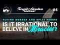

# Is It Irrational to Believe in Miracles? | Thought Adventure Podcast #4 (2021-02-28)

## Description

The concept of miracles is central to the worlds religions, including Islam. Frequently, skeptics, Atheists, and even proponents of other religions charge the notion of miracles and miracles in the Islamic tradition in particular as irrational and absurd. We introduce the topic of miracles and give a response to the claim of incoherence. We then invite guests on to discuss the issue of miracles. 
 
0:00          Introduction and Arguments 
- Guests -
26:22       Karlos Jeffers (Atheist)
1:38:53    Justin (Atheist)
2:02:20    Advaita (N/A)
2:19:44    Pakistani Theist (Muslim)
- Summary -
2:34:50   Final Thoughts

Thought Adventure Support
◄ PayPal - https://www.paypal.com/donate/?hosted_button_id=6KZWK75RB23RN 
◄ YouTube - https://www.youtube.com/c/ThoughtAdventurePodcast/join
◄ PATREON - https://www.patreon.com/thoughtadventurepodcast
____________________________________________________________________

Thought Adventure Social Media
◄ Twitter: https://twitter.com/T_A_Podcast​​ [@T_A_Podcast]
◄ Clubhouse https://www.clubhouse.com/club/thought-adventure-podcast
◄ Spotify: https://open.spotify.com/show/7x4UVfTz9QX8KVdEXquDUC
◄ Facebook: https://m.facebook.com/ThoughtAdventurePodcast
◄ Instagram: https://www.instagram.com/ThoughtAdventurePodcast​

----------------------------------------------------------------

*The Hosts:*
----------------------|
Jake Brancatella, The Muslim Metaphysician

- Youtube: https://www.youtube.com/channel/UCcGQRfTPNyHlXMqckvz2uqQ
- Twitter:  https://twitter.com/MMetaphysician​​ [@MMetaphysician]

----------------------|

Yusuf Ponders, The Pondering Soul

- Youtube: https://www.youtube.com/channel/UCsiDDxy0JXLqM6HBA0MA4NA
- Twitter: https://twitter.com/YusufPonders​​ [@YusufPonders]
- Facebook: https://www.facebook.com/yusufponders​ [@yusufpodners]

----------------------|

Sharif

- Twitter: https://twitter.com/sharifhafezi​​ [@sharifhafezi]

----------------------|

Abdulrahman

- Twitter: https://twitter.com/abdul_now​ [@abdul_now]

----------------------|

Admin

Riyad 
Gmail: hello.tapodcast@gmail.com

#miracle #quran #islam

## Summary of [Is It Irrational to Believe in Miracles? | Thought Adventure Podcast #4](https://www.youtube.com/watch?v=-UlkXwMOaT4)

*This summary is AI generated - there may be inaccuracies. *

### [00:00:00](https://www.youtube.com/watch?v=-UlkXwMOaT4&t=0) - [01:00:00](https://www.youtube.com/watch?v=-UlkXwMOaT4&t=3600)

The Thought Adventure Podcast discusses whether or not belief in miracles is rational. The podcast argues that, while miracles may be beyond the natural world, they're not impossible and should not be looked down upon. The discussion then shifts to whether or not there is a logical contradiction between a law of nature and a miracle. In the end, it is agreed that there is not a contradiction, but that a miracle is simply a break in an observed regularity.

**[00:00:00](https://www.youtube.com/watch?v=-UlkXwMOaT4&t=0)** In this Thought Adventure Podcast, Muslims and non-Muslims discuss whether belief in miracles is irrational. They argue that, while miracles may be beyond the natural world, they're not impossible and should not be looked down upon.
* **[00:05:00](https://www.youtube.com/watch?v=-UlkXwMOaT4&t=300)** The discussion about miracles and the trinity is a complex one, and Brother Yusuf tries to make a case that Christianity is incorrect because of a contradiction in beliefs. He gives an example of a five-foot-tall person being six-foot-tall and concludes that this contradiction is illogical. He also notes that there are rebuttals to this argument.
* **[00:10:00](https://www.youtube.com/watch?v=-UlkXwMOaT4&t=600)** of the article argues that there is a contradiction between what we know about the facts of the universe and what is being claimed in religious texts. He says that this is a fallacy because when you experience something, you can't generalize it to all experiences of that thing. Therefore, when someone argues that a miracle is contradictory, they are only making that claim if all of the questions about miracles are answered. If they are unanswered, then the miracle cannot be considered contradictory.
* **[00:15:00](https://www.youtube.com/watch?v=-UlkXwMOaT4&t=900)** In this thought-provoking video, philosopher Jake Hawkins discusses the concept of miracles and the law of nature. He points out that miracles would only be possible if the natural world were not governed by laws, which is a claim that many atheists and other non-theists find difficult to believe.
* **[00:20:00](https://www.youtube.com/watch?v=-UlkXwMOaT4&t=1200)** The discussion on miracles in the Thought Adventure podcast is focused on whether or not there is a logical contradiction between a law of nature and a miracle. In the end, it is agreed that there is not a contradiction, but that a miracle is simply a break in an observed regularity.
* **[00:25:00](https://www.youtube.com/watch?v=-UlkXwMOaT4&t=1500)* Discusses why it is irrational to believe in miracles, citing insufficient evidence. He then goes on to say that there are certain miracles that can be proven depending on the nature of the claim.
* **[00:30:00](https://www.youtube.com/watch?v=-UlkXwMOaT4&t=1800)* Discusses the concept of a miracle, noting that while they do not believe in them, they do not believe that a law of nature would be violated if one did occur.
* **[00:35:00](https://www.youtube.com/watch?v=-UlkXwMOaT4&t=2100)* Discusses how miracles can be argued as either natural or in the third tier of reality, but due to the limitations of human understanding, it is difficult to say for certain which it is.
* **[00:40:00](https://www.youtube.com/watch?v=-UlkXwMOaT4&t=2400)** The Thought Adventure Podcast discusses how people can justify belief in miracles based on the methodology they are using. If someone can't evidence their claim or belief in the second tier, then they are stuck in the first tier and science will relegate the claim to the second tier. A miracle is something that if god didn't intervene, it wouldn't have happened on its own. To determine whether or not a miracle has occurred, one must have a definition for what laws of nature are and what a miracle is. If the universe has a necessary foundation to it and all universal laws are acts of god, then it is justified to believe in miracles. However, if god changes those laws in a particular way, then it is still possible to identify a miracle through the use of profits.
* **[00:45:00](https://www.youtube.com/watch?v=-UlkXwMOaT4&t=2700)** The Thought Adventure Podcast discusses whether it is rational to believe in miracles. The host argues that, depending on the claim being made, a single, testable prediction can be evidence of the individual's claim being true. In the case of belief in a god, multiple predictions may be needed in order to build a case that the individual is actually from god.
* **[00:50:00](https://www.youtube.com/watch?v=-UlkXwMOaT4&t=3000)** Jake and Carlos discuss the three issues that need to be addressed in order to determine whether or not a miracle could happen. Jake reiterates that anything is possible, and Carlos agrees. Carlos then asks Jake a question about whether or not a miracle is logically possible, and Jake responds that it is.
* **[00:55:00](https://www.youtube.com/watch?v=-UlkXwMOaT4&t=3300)**  the Thought Adventure Podcast discusses the first and second steps of the rational belief in miracles argument. The first step is that there is no logical problem affirming that a religion or claim to guidance from god is irrational. The second step is that when we look at this question about whether or not there is an in principle problem of identifying miracles, presupposes that we believe in a creator and that there are regularities within the universe. For atheists, this proves that there is no reason to believe in a religion or a claim to guidance from god.
### [01:00:00](https://www.youtube.com/watch?v=-UlkXwMOaT4&t=3600) - [02:00:00](https://www.youtube.com/watch?v=-UlkXwMOaT4&t=7200)

 discusses the philosophical argument between those who believe that miracles are possible and those who believe that they are not. The former group argues that because the laws of nature are contingent, miracles are also possible. The latter group argues that because miracles would contradict the laws of nature, they are not possible.  concludes with a discussion of the Qur'an as a miracle.

**[01:00:00](https://www.youtube.com/watch?v=-UlkXwMOaT4&t=3600)* Discusses the concept of reality, arguing that it is either a thing in and of itself (a general nature), or the sum of all contingent beings. He goes on to say that laws of nature may be a necessary existence, but that they are also contingent.
* **[01:05:00](https://www.youtube.com/watch?v=-UlkXwMOaT4&t=3900)* Discusses how we can understand why things are the way they are by looking at them in terms of their necessary existence. He argues that if something is not necessary to its own existence, it cannot be evidence for a necessary being. He goes on to say that as Muslims, we believe that prophets came with miracles that the people could testify to.
* **[01:10:00](https://www.youtube.com/watch?v=-UlkXwMOaT4&t=4200)** Brother Sharif discusses how a person's world view affects their assessment of miracles, and how these commitments question fundamental aspects of reality. He goes on to say that this is why it is important to have a variety of perspectives when discussing miracles, in order to avoid bias.
* **[01:15:00](https://www.youtube.com/watch?v=-UlkXwMOaT4&t=4500)** The Thought Adventure Podcast discusses why it is rational to believe in miracles, and how this belief fits within an Islamic framework. The podcast concludes with a discussion of what Abdul Rahman is saying, and whether or not it matters.
* **[01:20:00](https://www.youtube.com/watch?v=-UlkXwMOaT4&t=4800)** Atheists argue that there is no evidence for the existence of a god, while believers use multiple lines of evidence to substantiate their belief in a creator. The Thought Adventure Podcast discusses the rational basis for belief in miracles within the context of Islam.
* **[01:25:00](https://www.youtube.com/watch?v=-UlkXwMOaT4&t=5100)* Discusses why some people believe that miracles no longer happen in our present time, and why the Quran is considered a miracle.
* **[01:30:00](https://www.youtube.com/watch?v=-UlkXwMOaT4&t=5400)** The Qur'an challenges people to produce a surah or chapter like it, shortest of which is three sentences. If people cannot do this, the Qur'an cannot be from God. Brother Abu Zakaria's channel has many videos about the Qur'an and its claims, including a section on miracles. The Qur'an is a living miracle, with ongoing effects that go beyond human understanding.
* **[01:35:00](https://www.youtube.com/watch?v=-UlkXwMOaT4&t=5700)** In this Thought Adventure Podcast, Carlos asks people whether it is irrational to believe in miracles. Some people argue that it is impossible for miracles to contradict the laws of nature, while others argue that miracles are simply supernatural events that are outside of the realms of possibility.
* **[01:40:00](https://www.youtube.com/watch?v=-UlkXwMOaT4&t=6000)** The discussion on whether or not it is rational to believe in miracles turns to the issue of a logical contradiction between a miracle on the one hand and a law of nature on the other. Yusuf argues that for him, it is not a logical impossibility for a miracle to occur, and it is something he wants to point out because when we talked about the trinity the last time, the first guest brought up the issue of miracles and was saying that these things are irrational and this is something he's heard plenty of other times. Well, you guys believe in miracles which are illogical, and we believe in the trinity so what's your point? They would say that miracles are not analogous to the trinity, and this would lead to the claim that miracles are not a logical impossibility and thus, the trinity fails.
* **[01:45:00](https://www.youtube.com/watch?v=-UlkXwMOaT4&t=6300)** asks Carlos if it is rational to believe in miracles, and Carlos replies that it depends on what is meant by "reality." If reality is what we experience, then it is explainable. If, however, reality is the fundamental cause of everything, then it is un explainable. then asks what the difference is, and Carlos says that experience is what differentiates our views.
* **[01:50:00](https://www.youtube.com/watch?v=-UlkXwMOaT4&t=6600)** While trying to answer the question of whether or not there is a mind or soul outside of a physical brain, Justin argues that it is logically impossible to know for certain. He also argues that, even if such a thing did exist, it would only be an intelligence at a level beyond our own.
* **[01:55:00](https://www.youtube.com/watch?v=-UlkXwMOaT4&t=6900)* Discusses the philosophical argument between physicalists and those who believe in souls or minds in other humans. The physicalist argues that only things with brains can have minds, while the believer in souls or minds in other humans believes that the mind is an eternal, necessary aspect of existence. The physicalist argues that because the mind is a product of thinking, it does not need to be seen to exist. The believer in souls or minds in other humans argues that because all Allah is all-knowing and eternal, he must have a mind, and therefore, humans do as well.
### [02:00:00](https://www.youtube.com/watch?v=-UlkXwMOaT4&t=7200) - [02:40:00](https://www.youtube.com/watch?v=-UlkXwMOaT4&t=9600)

The Thought Adventure Podcast discusses the idea of miracles and how to approach them logically. They point out that there is more nuance to the subject than simply rejecting all miracles. They also discuss the idea of rationality and whether or not it can be grounded in naturalism.

**[02:00:00](https://www.youtube.com/watch?v=-UlkXwMOaT4&t=7200)* Discusses the definition of a miracle, and points out that if there is only one fundamental reality, then miracles would not be possible. He then introduces Jake Jonah, an atheist who does not agree with the definition of a miracle as something that occurs when the world is not left to itself.
* **[02:05:00](https://www.youtube.com/watch?v=-UlkXwMOaT4&t=7500)** The Thought Adventure Podcast discusses whether miracles are rational, and whether they require a god. They argue that miracles are explainable by a necessary being, and that they prove the existence of a prophet.
* **[02:10:00](https://www.youtube.com/watch?v=-UlkXwMOaT4&t=7800)* Discusses how humans desire purpose, and how this is based on our natural tendency to seek guidance. They go on to say that if we want to find purpose in life, we must first understand our origins and why we were created. Once we do this, we can start to understand our role in the world and what is good and bad.
* **[02:15:00](https://www.youtube.com/watch?v=-UlkXwMOaT4&t=8100)** The presenter introduces the topic of miracles and claims that there are no such things as miracles. He explains that the rule that exists even before a thing exists is the law of nature. If a thing occurs in accordance with this law, it cannot be called a miracle. The presenter asks the guest if they believe in god, and the guest responds that they do. The presenter then asks the guest if they believe in miracles, and the guest says that they do not.
* **[02:20:00](https://www.youtube.com/watch?v=-UlkXwMOaT4&t=8400)** Abdullah Abdullah discusses how miracles can be seen as something beyond the laws of nature, challenging continuing beings. He explains that it all depends on the context in which the miracle is being discussed.
* **[02:25:00](https://www.youtube.com/watch?v=-UlkXwMOaT4&t=8700)* Discusses the differences between miracles and scientific explanations, and argues that miracles are not within the purview of science. A Muslim apologist argues that Jonah was in a whale, and this cannot be explained by naturalism. This leads to the apologist concluding that there must be a non-naturalistic explanation for miracles, such as the existence of God. This argument is flawed because it relies on a false premise - that miracles are always beyond naturalistic explanation.
* **[02:30:00](https://www.youtube.com/watch?v=-UlkXwMOaT4&t=9000)* Discusses how an existence cannot be illogical, unless and until its identity is logically contradicting. They go on to say that when atheists use the words "it's a contradiction," they need to present an argument showing why the thing being contradictory is a contradiction.
* **[02:35:00](https://www.youtube.com/watch?v=-UlkXwMOaT4&t=9300)** The Thought Adventure Podcast examines the question of whether or not it is rational to believe in miracles. The hosts discuss how a miracle can be rationalized within the context of a believer's belief system, and how Islamic traditions emphasize the need for miracles to be rationalizable through the foundation of one's beliefs. Finally, Jake discusses his own thoughts on the matter, stating that although belief in miracles is not irrational, it does not automatically justify one's belief in God.
* **[02:40:00](https://www.youtube.com/watch?v=-UlkXwMOaT4&t=9600)** In this Thought Adventure Podcast, the hosts discuss the idea of miracles and how to approach them logically. They point out that there is more nuance to the subject than simply rejecting all miracles. They also discuss the idea of rationality and whether or not it can be grounded in naturalism.

<h2>Full transcript with timestamps: CLICK TO EXPAND</h2>

[0:00:07](https://youtu.be/-UlkXwMOaT4?t=7) i am  
[0:00:39](https://youtu.be/-UlkXwMOaT4?t=39) to discuss on the thought adventure  
[0:00:42](https://youtu.be/-UlkXwMOaT4?t=42) podcast apologies for the slight delay  
[0:00:45](https://youtu.be/-UlkXwMOaT4?t=45) uh we were just waiting for one of the  
[0:00:47](https://youtu.be/-UlkXwMOaT4?t=47) panelists but it doesn't matter now  
[0:00:48](https://youtu.be/-UlkXwMOaT4?t=48) hamdi la he's here  
[0:00:50](https://youtu.be/-UlkXwMOaT4?t=50) so today's show we're going to be  
[0:00:51](https://youtu.be/-UlkXwMOaT4?t=51) talking about flying courses  
[0:00:54](https://youtu.be/-UlkXwMOaT4?t=54) splitting moons whether it is irrational  
[0:00:58](https://youtu.be/-UlkXwMOaT4?t=58) to believe in miracles so  
[0:01:01](https://youtu.be/-UlkXwMOaT4?t=61) if uh some of you listened to last  
[0:01:03](https://youtu.be/-UlkXwMOaT4?t=63) week's oh not last week but two weeks  
[0:01:05](https://youtu.be/-UlkXwMOaT4?t=65) ago the podcast we were discussing  
[0:01:07](https://youtu.be/-UlkXwMOaT4?t=67) about whether the trinity is uh  
[0:01:10](https://youtu.be/-UlkXwMOaT4?t=70) irrational and  
[0:01:12](https://youtu.be/-UlkXwMOaT4?t=72) one of the questions that was raised  
[0:01:14](https://youtu.be/-UlkXwMOaT4?t=74) which we thought we would then  
[0:01:15](https://youtu.be/-UlkXwMOaT4?t=75) discuss and tackle today was this idea  
[0:01:18](https://youtu.be/-UlkXwMOaT4?t=78) that well  
[0:01:19](https://youtu.be/-UlkXwMOaT4?t=79) if you say uh trinity is irrational  
[0:01:22](https://youtu.be/-UlkXwMOaT4?t=82) isn't  
[0:01:23](https://youtu.be/-UlkXwMOaT4?t=83) belief in like the burak the the flying  
[0:01:27](https://youtu.be/-UlkXwMOaT4?t=87) animal that took the prophet sallallahu  
[0:01:29](https://youtu.be/-UlkXwMOaT4?t=89) alaihi wasallam beyond the seven heavens  
[0:01:31](https://youtu.be/-UlkXwMOaT4?t=91) uh in one night isn't that something  
[0:01:34](https://youtu.be/-UlkXwMOaT4?t=94) that's irrational and if you can accept  
[0:01:36](https://youtu.be/-UlkXwMOaT4?t=96) that why can't we accept trinity  
[0:01:38](https://youtu.be/-UlkXwMOaT4?t=98) similarly you have many atheists who  
[0:01:40](https://youtu.be/-UlkXwMOaT4?t=100) will turn around and ask this same  
[0:01:42](https://youtu.be/-UlkXwMOaT4?t=102) type of question in regards to uh you  
[0:01:44](https://youtu.be/-UlkXwMOaT4?t=104) know how can you believe religion is  
[0:01:45](https://youtu.be/-UlkXwMOaT4?t=105) true  
[0:01:46](https://youtu.be/-UlkXwMOaT4?t=106) and they believe in these supernatural  
[0:01:48](https://youtu.be/-UlkXwMOaT4?t=108) you know these  
[0:01:49](https://youtu.be/-UlkXwMOaT4?t=109) you know uh legends and stories about  
[0:01:54](https://youtu.be/-UlkXwMOaT4?t=114) you know miracles and supernatural  
[0:01:56](https://youtu.be/-UlkXwMOaT4?t=116) events etc  
[0:01:57](https://youtu.be/-UlkXwMOaT4?t=117) so what we're asking today is whether  
[0:02:00](https://youtu.be/-UlkXwMOaT4?t=120) belief in miracles is irrational how we  
[0:02:03](https://youtu.be/-UlkXwMOaT4?t=123) should approach it how we should  
[0:02:05](https://youtu.be/-UlkXwMOaT4?t=125) understand it  
[0:02:06](https://youtu.be/-UlkXwMOaT4?t=126) and as always today alhamdulillah we  
[0:02:09](https://youtu.be/-UlkXwMOaT4?t=129) have our our  
[0:02:10](https://youtu.be/-UlkXwMOaT4?t=130) panelists we have uh yusuf pondus from  
[0:02:13](https://youtu.be/-UlkXwMOaT4?t=133) pondering seoul  
[0:02:15](https://youtu.be/-UlkXwMOaT4?t=135) assalamu alaikum  
[0:02:19](https://youtu.be/-UlkXwMOaT4?t=139) how are you doing good good we've also  
[0:02:22](https://youtu.be/-UlkXwMOaT4?t=142) got  
[0:02:22](https://youtu.be/-UlkXwMOaT4?t=142) jake the muslim metaphysician  
[0:02:25](https://youtu.be/-UlkXwMOaT4?t=145) assalamu alaikum it needs to learn how  
[0:02:29](https://youtu.be/-UlkXwMOaT4?t=149) to unmike  
[0:02:51](https://youtu.be/-UlkXwMOaT4?t=171) as always in these conversations we  
[0:02:53](https://youtu.be/-UlkXwMOaT4?t=173) normally have a short introduction for  
[0:02:55](https://youtu.be/-UlkXwMOaT4?t=175) about 20 minutes where we start to talk  
[0:02:56](https://youtu.be/-UlkXwMOaT4?t=176) about the topic area and then  
[0:02:59](https://youtu.be/-UlkXwMOaT4?t=179) what we want is we want people to join  
[0:03:01](https://youtu.be/-UlkXwMOaT4?t=181) muslims or non-muslims preferably  
[0:03:03](https://youtu.be/-UlkXwMOaT4?t=183) non-muslims who want to challenge the  
[0:03:05](https://youtu.be/-UlkXwMOaT4?t=185) ideas  
[0:03:06](https://youtu.be/-UlkXwMOaT4?t=186) debate the discussion uh so i'll be  
[0:03:08](https://youtu.be/-UlkXwMOaT4?t=188) after about 20 minutes or so so please  
[0:03:10](https://youtu.be/-UlkXwMOaT4?t=190) be patient if you want to try join now  
[0:03:12](https://youtu.be/-UlkXwMOaT4?t=192) i think uh the stream yard link should  
[0:03:14](https://youtu.be/-UlkXwMOaT4?t=194) be um  
[0:03:15](https://youtu.be/-UlkXwMOaT4?t=195) put a pinned in the uh comment section  
[0:03:18](https://youtu.be/-UlkXwMOaT4?t=198) but let me just quickly ask the first  
[0:03:20](https://youtu.be/-UlkXwMOaT4?t=200) question actually to brother jake  
[0:03:22](https://youtu.be/-UlkXwMOaT4?t=202) jake why this topic why are we talking  
[0:03:25](https://youtu.be/-UlkXwMOaT4?t=205) about miracles  
[0:03:26](https://youtu.be/-UlkXwMOaT4?t=206) are we not like uh you know on the other  
[0:03:29](https://youtu.be/-UlkXwMOaT4?t=209) topics that we should be getting  
[0:03:30](https://youtu.be/-UlkXwMOaT4?t=210) uh discussing first why is this such an  
[0:03:32](https://youtu.be/-UlkXwMOaT4?t=212) important topic  
[0:03:36](https://youtu.be/-UlkXwMOaT4?t=216) you need to unmute yeah i gotta mute so  
[0:03:40](https://youtu.be/-UlkXwMOaT4?t=220) yeah the reason why this topic is so  
[0:03:42](https://youtu.be/-UlkXwMOaT4?t=222) important  
[0:03:43](https://youtu.be/-UlkXwMOaT4?t=223) um from my perspective is that like you  
[0:03:46](https://youtu.be/-UlkXwMOaT4?t=226) mentioned in the last stream there's  
[0:03:48](https://youtu.be/-UlkXwMOaT4?t=228) there's sort of two issues one is when  
[0:03:50](https://youtu.be/-UlkXwMOaT4?t=230) we were discussing uh discussing the  
[0:03:52](https://youtu.be/-UlkXwMOaT4?t=232) trinity  
[0:03:54](https://youtu.be/-UlkXwMOaT4?t=234) uh sometimes the response we get is well  
[0:03:56](https://youtu.be/-UlkXwMOaT4?t=236) you guys are saying that the trinity is  
[0:03:58](https://youtu.be/-UlkXwMOaT4?t=238) irrational but yet you believe in these  
[0:04:01](https://youtu.be/-UlkXwMOaT4?t=241) strange miracles which are just as  
[0:04:04](https://youtu.be/-UlkXwMOaT4?t=244) irrational as the trinity itself  
[0:04:06](https://youtu.be/-UlkXwMOaT4?t=246) so we want to uh take that criticism on  
[0:04:10](https://youtu.be/-UlkXwMOaT4?t=250) board and combat  
[0:04:11](https://youtu.be/-UlkXwMOaT4?t=251) it to show that we'll actually know the  
[0:04:13](https://youtu.be/-UlkXwMOaT4?t=253) two are not analogous  
[0:04:15](https://youtu.be/-UlkXwMOaT4?t=255) and so maybe we'll go into more detail  
[0:04:16](https://youtu.be/-UlkXwMOaT4?t=256) about that the second thing is that from  
[0:04:20](https://youtu.be/-UlkXwMOaT4?t=260) uh muslims and skeptics typically we get  
[0:04:23](https://youtu.be/-UlkXwMOaT4?t=263) um  
[0:04:23](https://youtu.be/-UlkXwMOaT4?t=263) charged with the idea that the idea of  
[0:04:26](https://youtu.be/-UlkXwMOaT4?t=266) miracles  
[0:04:27](https://youtu.be/-UlkXwMOaT4?t=267) is completely irrational it's illogical  
[0:04:29](https://youtu.be/-UlkXwMOaT4?t=269) because it breaks  
[0:04:30](https://youtu.be/-UlkXwMOaT4?t=270) uh laws of nature and such a thing is  
[0:04:33](https://youtu.be/-UlkXwMOaT4?t=273) impossible  
[0:04:34](https://youtu.be/-UlkXwMOaT4?t=274) um so it's these two ideas as far as i  
[0:04:38](https://youtu.be/-UlkXwMOaT4?t=278) can see  
[0:04:38](https://youtu.be/-UlkXwMOaT4?t=278) that we want to address and combat  
[0:04:43](https://youtu.be/-UlkXwMOaT4?t=283) cool um  
[0:04:46](https://youtu.be/-UlkXwMOaT4?t=286) you know this this question was uh i  
[0:04:48](https://youtu.be/-UlkXwMOaT4?t=288) think it was leveled up  
[0:04:49](https://youtu.be/-UlkXwMOaT4?t=289) in one of the comments to say look you  
[0:04:51](https://youtu.be/-UlkXwMOaT4?t=291) know we're putting the cart before the  
[0:04:53](https://youtu.be/-UlkXwMOaT4?t=293) horse  
[0:04:54](https://youtu.be/-UlkXwMOaT4?t=294) you know we're talking about miracles to  
[0:04:55](https://youtu.be/-UlkXwMOaT4?t=295) atheists and  
[0:04:57](https://youtu.be/-UlkXwMOaT4?t=297) we should be talking about more  
[0:04:58](https://youtu.be/-UlkXwMOaT4?t=298) fundamental  
[0:05:00](https://youtu.be/-UlkXwMOaT4?t=300) you know uh discussions about belief in  
[0:05:03](https://youtu.be/-UlkXwMOaT4?t=303) in allah so why is it that you know this  
[0:05:06](https://youtu.be/-UlkXwMOaT4?t=306) is  
[0:05:06](https://youtu.be/-UlkXwMOaT4?t=306) an issue that needs to be addressed even  
[0:05:08](https://youtu.be/-UlkXwMOaT4?t=308) with atheists  
[0:05:10](https://youtu.be/-UlkXwMOaT4?t=310) yeah well i i think i think they come  
[0:05:13](https://youtu.be/-UlkXwMOaT4?t=313) hand in hand in a way because um  
[0:05:16](https://youtu.be/-UlkXwMOaT4?t=316) the way you look at any  
[0:05:19](https://youtu.be/-UlkXwMOaT4?t=319) claim to a miraculous account or  
[0:05:22](https://youtu.be/-UlkXwMOaT4?t=322) any event for that matter is always  
[0:05:24](https://youtu.be/-UlkXwMOaT4?t=324) going to def depend on your  
[0:05:26](https://youtu.be/-UlkXwMOaT4?t=326) prior metaphysical commitment and your  
[0:05:28](https://youtu.be/-UlkXwMOaT4?t=328) world view as a whole  
[0:05:30](https://youtu.be/-UlkXwMOaT4?t=330) that kind of determines how you are to  
[0:05:33](https://youtu.be/-UlkXwMOaT4?t=333) assess the evidence and make sense of of  
[0:05:36](https://youtu.be/-UlkXwMOaT4?t=336) what's being said  
[0:05:38](https://youtu.be/-UlkXwMOaT4?t=338) so i think i think in a way that comment  
[0:05:40](https://youtu.be/-UlkXwMOaT4?t=340) you're talking about  
[0:05:42](https://youtu.be/-UlkXwMOaT4?t=342) does have a point that there is a more  
[0:05:44](https://youtu.be/-UlkXwMOaT4?t=344) fundamental  
[0:05:45](https://youtu.be/-UlkXwMOaT4?t=345) issue at play here which is the  
[0:05:48](https://youtu.be/-UlkXwMOaT4?t=348) uh uh basically the the the lens  
[0:05:52](https://youtu.be/-UlkXwMOaT4?t=352) through which you're you're you're  
[0:05:53](https://youtu.be/-UlkXwMOaT4?t=353) assessing these matters and your  
[0:05:55](https://youtu.be/-UlkXwMOaT4?t=355) overarching worldview through which you  
[0:05:57](https://youtu.be/-UlkXwMOaT4?t=357) you um  
[0:05:58](https://youtu.be/-UlkXwMOaT4?t=358) you kind of uh investigate the evidence  
[0:06:01](https://youtu.be/-UlkXwMOaT4?t=361) but in order to  
[0:06:02](https://youtu.be/-UlkXwMOaT4?t=362) um i think get to that more fundamental  
[0:06:05](https://youtu.be/-UlkXwMOaT4?t=365) aspect of this discussion i think we  
[0:06:07](https://youtu.be/-UlkXwMOaT4?t=367) need to deal with these questions about  
[0:06:10](https://youtu.be/-UlkXwMOaT4?t=370) miracles very seriously and i think the  
[0:06:12](https://youtu.be/-UlkXwMOaT4?t=372) whole topic of miracles is a very good  
[0:06:14](https://youtu.be/-UlkXwMOaT4?t=374) segue  
[0:06:14](https://youtu.be/-UlkXwMOaT4?t=374) to that uh that kind of discussion about  
[0:06:17](https://youtu.be/-UlkXwMOaT4?t=377) the fundamental  
[0:06:18](https://youtu.be/-UlkXwMOaT4?t=378) nature of reality and these metaphysical  
[0:06:21](https://youtu.be/-UlkXwMOaT4?t=381) and epistemological concerns that we  
[0:06:23](https://youtu.be/-UlkXwMOaT4?t=383) have  
[0:06:24](https://youtu.be/-UlkXwMOaT4?t=384) in our assessment of these uh you know  
[0:06:27](https://youtu.be/-UlkXwMOaT4?t=387) claims  
[0:06:28](https://youtu.be/-UlkXwMOaT4?t=388) uh about extraordinary events  
[0:06:32](https://youtu.be/-UlkXwMOaT4?t=392) okay cool i think the way i uh maybe i  
[0:06:35](https://youtu.be/-UlkXwMOaT4?t=395) also look at this  
[0:06:36](https://youtu.be/-UlkXwMOaT4?t=396) is some some people think this is a  
[0:06:39](https://youtu.be/-UlkXwMOaT4?t=399) defeater for religion  
[0:06:41](https://youtu.be/-UlkXwMOaT4?t=401) so they think that i cannot even  
[0:06:43](https://youtu.be/-UlkXwMOaT4?t=403) acknowledge or accept  
[0:06:45](https://youtu.be/-UlkXwMOaT4?t=405) to believe in any religious claim if a  
[0:06:48](https://youtu.be/-UlkXwMOaT4?t=408) religion  
[0:06:49](https://youtu.be/-UlkXwMOaT4?t=409) claims to adhere to some sort of  
[0:06:51](https://youtu.be/-UlkXwMOaT4?t=411) supernatural event or miraculous event  
[0:06:53](https://youtu.be/-UlkXwMOaT4?t=413) and so if a religion claims that you  
[0:06:56](https://youtu.be/-UlkXwMOaT4?t=416) know the moon split  
[0:06:58](https://youtu.be/-UlkXwMOaT4?t=418) or that you know some other miracle  
[0:06:59](https://youtu.be/-UlkXwMOaT4?t=419) events people walking on water that that  
[0:07:02](https://youtu.be/-UlkXwMOaT4?t=422) automatically dismisses a religious  
[0:07:05](https://youtu.be/-UlkXwMOaT4?t=425) claim and so  
[0:07:06](https://youtu.be/-UlkXwMOaT4?t=426) there's more of a fundamental question  
[0:07:07](https://youtu.be/-UlkXwMOaT4?t=427) that we have to ask is  
[0:07:09](https://youtu.be/-UlkXwMOaT4?t=429) what refutes a religion what can we say  
[0:07:12](https://youtu.be/-UlkXwMOaT4?t=432) is  
[0:07:12](https://youtu.be/-UlkXwMOaT4?t=432) you know makes a religion incompatible  
[0:07:15](https://youtu.be/-UlkXwMOaT4?t=435) uh  
[0:07:16](https://youtu.be/-UlkXwMOaT4?t=436) you know to to reason and rationality  
[0:07:18](https://youtu.be/-UlkXwMOaT4?t=438) becomes illogical  
[0:07:20](https://youtu.be/-UlkXwMOaT4?t=440) is miracles a good argument for that and  
[0:07:22](https://youtu.be/-UlkXwMOaT4?t=442) maybe that goes on to the other question  
[0:07:24](https://youtu.be/-UlkXwMOaT4?t=444) i was going to ask  
[0:07:25](https://youtu.be/-UlkXwMOaT4?t=445) brother yusuf as well which was that  
[0:07:27](https://youtu.be/-UlkXwMOaT4?t=447) obviously last week we talked about the  
[0:07:29](https://youtu.be/-UlkXwMOaT4?t=449) trinity  
[0:07:29](https://youtu.be/-UlkXwMOaT4?t=449) last week last couple of weeks ago we  
[0:07:31](https://youtu.be/-UlkXwMOaT4?t=451) talked about the trinity  
[0:07:32](https://youtu.be/-UlkXwMOaT4?t=452) and we talked about the logical problem  
[0:07:34](https://youtu.be/-UlkXwMOaT4?t=454) of the trinity and we basically  
[0:07:35](https://youtu.be/-UlkXwMOaT4?t=455) in essence i think the conclusion that  
[0:07:37](https://youtu.be/-UlkXwMOaT4?t=457) we're trying to present anyway at least  
[0:07:39](https://youtu.be/-UlkXwMOaT4?t=459) is the trinity by definition  
[0:07:44](https://youtu.be/-UlkXwMOaT4?t=464) is illogical and as a result anybody who  
[0:07:47](https://youtu.be/-UlkXwMOaT4?t=467) claims that christianity promotes this  
[0:07:51](https://youtu.be/-UlkXwMOaT4?t=471) by definition means that the religion  
[0:07:52](https://youtu.be/-UlkXwMOaT4?t=472) itself we would say  
[0:07:54](https://youtu.be/-UlkXwMOaT4?t=474) is is incorrect because there has to be  
[0:07:56](https://youtu.be/-UlkXwMOaT4?t=476) some sort of rational consistency  
[0:07:58](https://youtu.be/-UlkXwMOaT4?t=478) logical consistency  
[0:07:59](https://youtu.be/-UlkXwMOaT4?t=479) regards to this but how do we explain  
[0:08:02](https://youtu.be/-UlkXwMOaT4?t=482) that  
[0:08:03](https://youtu.be/-UlkXwMOaT4?t=483) on the one hand and i don't want to go  
[0:08:05](https://youtu.be/-UlkXwMOaT4?t=485) over the whole discussion about trinity  
[0:08:06](https://youtu.be/-UlkXwMOaT4?t=486) by the way but how do we  
[0:08:08](https://youtu.be/-UlkXwMOaT4?t=488) demarcate the discussion about trinity  
[0:08:11](https://youtu.be/-UlkXwMOaT4?t=491) and miracles are they equivalent can we  
[0:08:14](https://youtu.be/-UlkXwMOaT4?t=494) say okay if we  
[0:08:15](https://youtu.be/-UlkXwMOaT4?t=495) uh you know can accept miracles we can  
[0:08:18](https://youtu.be/-UlkXwMOaT4?t=498) accept trinity if we have to reject  
[0:08:20](https://youtu.be/-UlkXwMOaT4?t=500) trinity then we'd have to reject even  
[0:08:22](https://youtu.be/-UlkXwMOaT4?t=502) claims within islam  
[0:08:23](https://youtu.be/-UlkXwMOaT4?t=503) yeah so so the the issue is is the  
[0:08:25](https://youtu.be/-UlkXwMOaT4?t=505) presence of an explicit contradiction  
[0:08:29](https://youtu.be/-UlkXwMOaT4?t=509) and so you know for example when you're  
[0:08:31](https://youtu.be/-UlkXwMOaT4?t=511) talking about whether or not  
[0:08:32](https://youtu.be/-UlkXwMOaT4?t=512) jesus is god we and we're saying that  
[0:08:35](https://youtu.be/-UlkXwMOaT4?t=515) it's there's a contradiction  
[0:08:36](https://youtu.be/-UlkXwMOaT4?t=516) a logical contradiction and therefore  
[0:08:38](https://youtu.be/-UlkXwMOaT4?t=518) it's illogical  
[0:08:40](https://youtu.be/-UlkXwMOaT4?t=520) or irrational and we're saying that  
[0:08:42](https://youtu.be/-UlkXwMOaT4?t=522) you're holding two contradictory  
[0:08:44](https://youtu.be/-UlkXwMOaT4?t=524) premises you're holding  
[0:08:45](https://youtu.be/-UlkXwMOaT4?t=525) um premise a and premise not a  
[0:08:49](https://youtu.be/-UlkXwMOaT4?t=529) or you know element a element not a  
[0:08:51](https://youtu.be/-UlkXwMOaT4?t=531) simultaneously and these are  
[0:08:53](https://youtu.be/-UlkXwMOaT4?t=533) um incompatible together in the same  
[0:08:55](https://youtu.be/-UlkXwMOaT4?t=535) thing  
[0:08:56](https://youtu.be/-UlkXwMOaT4?t=536) uh so like one of the examples uh we  
[0:08:59](https://youtu.be/-UlkXwMOaT4?t=539) gave can you be  
[0:09:00](https://youtu.be/-UlkXwMOaT4?t=540) um five foot tall if you're six foot  
[0:09:02](https://youtu.be/-UlkXwMOaT4?t=542) tall you know these are mutually  
[0:09:04](https://youtu.be/-UlkXwMOaT4?t=544) exclusive  
[0:09:05](https://youtu.be/-UlkXwMOaT4?t=545) um attributes and so to claim for  
[0:09:09](https://youtu.be/-UlkXwMOaT4?t=549) example that a being is both  
[0:09:11](https://youtu.be/-UlkXwMOaT4?t=551) um all-knowing and not all-knowing at  
[0:09:15](https://youtu.be/-UlkXwMOaT4?t=555) the same time  
[0:09:16](https://youtu.be/-UlkXwMOaT4?t=556) um we're pointing to an explicit  
[0:09:18](https://youtu.be/-UlkXwMOaT4?t=558) contradiction  
[0:09:20](https://youtu.be/-UlkXwMOaT4?t=560) um and therefore leading to this idea  
[0:09:22](https://youtu.be/-UlkXwMOaT4?t=562) that it's logically irrational  
[0:09:24](https://youtu.be/-UlkXwMOaT4?t=564) when it comes to miracles there's no  
[0:09:27](https://youtu.be/-UlkXwMOaT4?t=567) explicit contradiction um being put  
[0:09:31](https://youtu.be/-UlkXwMOaT4?t=571) forward like if you can say  
[0:09:32](https://youtu.be/-UlkXwMOaT4?t=572) for example uh or well the the laws of  
[0:09:35](https://youtu.be/-UlkXwMOaT4?t=575) logic  
[0:09:36](https://youtu.be/-UlkXwMOaT4?t=576) or sorry the laws of physics are xyz  
[0:09:39](https://youtu.be/-UlkXwMOaT4?t=579) so anything that doesn't do that is um  
[0:09:42](https://youtu.be/-UlkXwMOaT4?t=582) illogical you know if you're trying to  
[0:09:44](https://youtu.be/-UlkXwMOaT4?t=584) make this kind of argument  
[0:09:46](https://youtu.be/-UlkXwMOaT4?t=586) um then you might be able to put forward  
[0:09:48](https://youtu.be/-UlkXwMOaT4?t=588) the idea that there is a contradiction  
[0:09:50](https://youtu.be/-UlkXwMOaT4?t=590) but then you've also um you're gonna  
[0:09:52](https://youtu.be/-UlkXwMOaT4?t=592) have rebuttals so that i  
[0:09:53](https://youtu.be/-UlkXwMOaT4?t=593) um you know the laws of uh physics are  
[0:09:56](https://youtu.be/-UlkXwMOaT4?t=596) based on induction they're based on  
[0:09:58](https://youtu.be/-UlkXwMOaT4?t=598) um you're looking at the world you're  
[0:10:01](https://youtu.be/-UlkXwMOaT4?t=601) saying something keeps doing this so  
[0:10:04](https://youtu.be/-UlkXwMOaT4?t=604) therefore it's going to keep doing that  
[0:10:05](https://youtu.be/-UlkXwMOaT4?t=605) but there's nothing necessary about that  
[0:10:07](https://youtu.be/-UlkXwMOaT4?t=607) and so therefore there's no uh necessary  
[0:10:10](https://youtu.be/-UlkXwMOaT4?t=610) con uh contradiction  
[0:10:12](https://youtu.be/-UlkXwMOaT4?t=612) um and you know so the different  
[0:10:14](https://youtu.be/-UlkXwMOaT4?t=614) approaches here  
[0:10:15](https://youtu.be/-UlkXwMOaT4?t=615) um there's different you know they  
[0:10:17](https://youtu.be/-UlkXwMOaT4?t=617) inhabit different categories and then  
[0:10:19](https://youtu.be/-UlkXwMOaT4?t=619) the other issue is there's two ways of  
[0:10:21](https://youtu.be/-UlkXwMOaT4?t=621) approaching this um  
[0:10:23](https://youtu.be/-UlkXwMOaT4?t=623) conversation with regards to miracles so  
[0:10:25](https://youtu.be/-UlkXwMOaT4?t=625) we can say  
[0:10:26](https://youtu.be/-UlkXwMOaT4?t=626) um one kind of argument is to justify  
[0:10:30](https://youtu.be/-UlkXwMOaT4?t=630) your belief because of a miracle  
[0:10:33](https://youtu.be/-UlkXwMOaT4?t=633) so that the miracle therefore would be  
[0:10:34](https://youtu.be/-UlkXwMOaT4?t=634) like the foundation of your belief  
[0:10:37](https://youtu.be/-UlkXwMOaT4?t=637) and you say i've experienced x and so  
[0:10:40](https://youtu.be/-UlkXwMOaT4?t=640) i'm going to believe like for example i  
[0:10:42](https://youtu.be/-UlkXwMOaT4?t=642) saw jesus in a dream so therefore i'm a  
[0:10:45](https://youtu.be/-UlkXwMOaT4?t=645) christian now  
[0:10:46](https://youtu.be/-UlkXwMOaT4?t=646) or you know i i witnessed something  
[0:10:48](https://youtu.be/-UlkXwMOaT4?t=648) crazy um i saw a jinn i saw  
[0:10:50](https://youtu.be/-UlkXwMOaT4?t=650) whatever it is you experience something  
[0:10:53](https://youtu.be/-UlkXwMOaT4?t=653) that you consider to be miraculous and  
[0:10:54](https://youtu.be/-UlkXwMOaT4?t=654) you use that as the basis  
[0:10:56](https://youtu.be/-UlkXwMOaT4?t=656) for your belief in whatever religion it  
[0:10:58](https://youtu.be/-UlkXwMOaT4?t=658) is um you feel  
[0:10:59](https://youtu.be/-UlkXwMOaT4?t=659) uh is justified by that miracle and then  
[0:11:01](https://youtu.be/-UlkXwMOaT4?t=661) um  
[0:11:03](https://youtu.be/-UlkXwMOaT4?t=663) the other problem is is that while the  
[0:11:05](https://youtu.be/-UlkXwMOaT4?t=665) other way of approaching it  
[0:11:06](https://youtu.be/-UlkXwMOaT4?t=666) is not having miracles as the lynch  
[0:11:10](https://youtu.be/-UlkXwMOaT4?t=670) pin or the you know the reason for your  
[0:11:11](https://youtu.be/-UlkXwMOaT4?t=671) belief in that um but rather  
[0:11:14](https://youtu.be/-UlkXwMOaT4?t=674) as a secondary issue and that is you've  
[0:11:17](https://youtu.be/-UlkXwMOaT4?t=677) you've built your belief on a religion  
[0:11:20](https://youtu.be/-UlkXwMOaT4?t=680) um with you know say for example um  
[0:11:22](https://youtu.be/-UlkXwMOaT4?t=682) you're looking at the kalam arguments  
[0:11:24](https://youtu.be/-UlkXwMOaT4?t=684) you're looking at  
[0:11:25](https://youtu.be/-UlkXwMOaT4?t=685) arguments for the uh the oneness of god  
[0:11:27](https://youtu.be/-UlkXwMOaT4?t=687) you're looking at  
[0:11:28](https://youtu.be/-UlkXwMOaT4?t=688) arguments in favor of the quran as uh  
[0:11:30](https://youtu.be/-UlkXwMOaT4?t=690) revelation from god or  
[0:11:32](https://youtu.be/-UlkXwMOaT4?t=692) the prophet muhammad sallallahu alaihi  
[0:11:35](https://youtu.be/-UlkXwMOaT4?t=695) as a prophet  
[0:11:36](https://youtu.be/-UlkXwMOaT4?t=696) you know these arguments would be the  
[0:11:37](https://youtu.be/-UlkXwMOaT4?t=697) foundation and then as a consequence of  
[0:11:40](https://youtu.be/-UlkXwMOaT4?t=700) accepting these  
[0:11:41](https://youtu.be/-UlkXwMOaT4?t=701) you therefore then have these miracles  
[0:11:44](https://youtu.be/-UlkXwMOaT4?t=704) explicitly stated in the quran and the  
[0:11:46](https://youtu.be/-UlkXwMOaT4?t=706) hadith  
[0:11:47](https://youtu.be/-UlkXwMOaT4?t=707) and so then you accept them not as the  
[0:11:50](https://youtu.be/-UlkXwMOaT4?t=710) reason for your belief in the first  
[0:11:52](https://youtu.be/-UlkXwMOaT4?t=712) place but as a consequence of your  
[0:11:54](https://youtu.be/-UlkXwMOaT4?t=714) belief in the scripture as a consequence  
[0:11:55](https://youtu.be/-UlkXwMOaT4?t=715) of your belief in that particular  
[0:11:56](https://youtu.be/-UlkXwMOaT4?t=716) religion  
[0:11:57](https://youtu.be/-UlkXwMOaT4?t=717) um and so you know there's there's a  
[0:12:00](https://youtu.be/-UlkXwMOaT4?t=720) difference here so  
[0:12:01](https://youtu.be/-UlkXwMOaT4?t=721) you might like for example um there was  
[0:12:04](https://youtu.be/-UlkXwMOaT4?t=724) an article someone sent us recently  
[0:12:06](https://youtu.be/-UlkXwMOaT4?t=726) i think surely if you read for it as  
[0:12:07](https://youtu.be/-UlkXwMOaT4?t=727) well possibly um where  
[0:12:09](https://youtu.be/-UlkXwMOaT4?t=729) there's a gentleman he's arguing that uh  
[0:12:11](https://youtu.be/-UlkXwMOaT4?t=731) yeah he's kind of um  
[0:12:12](https://youtu.be/-UlkXwMOaT4?t=732) taking hume a bit further or a bit more  
[0:12:14](https://youtu.be/-UlkXwMOaT4?t=734) he's a bit more extreme than you  
[0:12:16](https://youtu.be/-UlkXwMOaT4?t=736) and that he's saying that it's not  
[0:12:17](https://youtu.be/-UlkXwMOaT4?t=737) possible at all for miracles to  
[0:12:20](https://youtu.be/-UlkXwMOaT4?t=740) happen um and the reason is because  
[0:12:22](https://youtu.be/-UlkXwMOaT4?t=742) there's two steps you've got to take  
[0:12:24](https://youtu.be/-UlkXwMOaT4?t=744) and the um i can't remember the explicit  
[0:12:28](https://youtu.be/-UlkXwMOaT4?t=748) argument he was giving but yeah can you  
[0:12:30](https://youtu.be/-UlkXwMOaT4?t=750) recall that yeah we'll get on to that  
[0:12:32](https://youtu.be/-UlkXwMOaT4?t=752) because i just want to really focus on  
[0:12:33](https://youtu.be/-UlkXwMOaT4?t=753) this particular point though um  
[0:12:35](https://youtu.be/-UlkXwMOaT4?t=755) when you're saying that look because  
[0:12:37](https://youtu.be/-UlkXwMOaT4?t=757) people will say uh  
[0:12:39](https://youtu.be/-UlkXwMOaT4?t=759) i know you've covered it a little bit  
[0:12:40](https://youtu.be/-UlkXwMOaT4?t=760) but i just want to re-emphasize this  
[0:12:42](https://youtu.be/-UlkXwMOaT4?t=762) point  
[0:12:42](https://youtu.be/-UlkXwMOaT4?t=762) when you when you say that there is if  
[0:12:45](https://youtu.be/-UlkXwMOaT4?t=765) there's an  
[0:12:45](https://youtu.be/-UlkXwMOaT4?t=765) obvious contradiction yeah a  
[0:12:48](https://youtu.be/-UlkXwMOaT4?t=768) contradictory statement  
[0:12:49](https://youtu.be/-UlkXwMOaT4?t=769) we can reject but they will say there is  
[0:12:51](https://youtu.be/-UlkXwMOaT4?t=771) a contradiction between what we know  
[0:12:53](https://youtu.be/-UlkXwMOaT4?t=773) about the  
[0:12:54](https://youtu.be/-UlkXwMOaT4?t=774) facts of the universe and  
[0:12:57](https://youtu.be/-UlkXwMOaT4?t=777) you know these claims about  
[0:13:00](https://youtu.be/-UlkXwMOaT4?t=780) you know people walking on water yeah so  
[0:13:04](https://youtu.be/-UlkXwMOaT4?t=784) these are  
[0:13:04](https://youtu.be/-UlkXwMOaT4?t=784) these are clear obvious contradictions  
[0:13:08](https://youtu.be/-UlkXwMOaT4?t=788) between what we know externally  
[0:13:10](https://youtu.be/-UlkXwMOaT4?t=790) and what is being claimed in these  
[0:13:12](https://youtu.be/-UlkXwMOaT4?t=792) religious texts  
[0:13:13](https://youtu.be/-UlkXwMOaT4?t=793) yeah no so that i wouldn't say that  
[0:13:14](https://youtu.be/-UlkXwMOaT4?t=794) that's a contradiction  
[0:13:16](https://youtu.be/-UlkXwMOaT4?t=796) in the sense that like your base because  
[0:13:19](https://youtu.be/-UlkXwMOaT4?t=799) this would be um  
[0:13:20](https://youtu.be/-UlkXwMOaT4?t=800) the black swan fallacy or something um  
[0:13:23](https://youtu.be/-UlkXwMOaT4?t=803) it might not be that one uh but it's a  
[0:13:25](https://youtu.be/-UlkXwMOaT4?t=805) fallacy in the sense that  
[0:13:27](https://youtu.be/-UlkXwMOaT4?t=807) you're saying i've experienced x every  
[0:13:29](https://youtu.be/-UlkXwMOaT4?t=809) time i've seen it  
[0:13:31](https://youtu.be/-UlkXwMOaT4?t=811) so therefore all x's must be equivalent  
[0:13:34](https://youtu.be/-UlkXwMOaT4?t=814) to my experience of them like  
[0:13:35](https://youtu.be/-UlkXwMOaT4?t=815) every time i've seen a sheep it's been a  
[0:13:37](https://youtu.be/-UlkXwMOaT4?t=817) white sheep therefore  
[0:13:38](https://youtu.be/-UlkXwMOaT4?t=818) all sheep are white you can't make this  
[0:13:41](https://youtu.be/-UlkXwMOaT4?t=821) generalization it's a hasty  
[0:13:42](https://youtu.be/-UlkXwMOaT4?t=822) generalization you can't so  
[0:13:44](https://youtu.be/-UlkXwMOaT4?t=824) what so what you're saying is that the  
[0:13:46](https://youtu.be/-UlkXwMOaT4?t=826) laws of the universe  
[0:13:48](https://youtu.be/-UlkXwMOaT4?t=828) are inductively derived yes so we go  
[0:13:51](https://youtu.be/-UlkXwMOaT4?t=831) from  
[0:13:52](https://youtu.be/-UlkXwMOaT4?t=832) specific observation observation one  
[0:13:54](https://youtu.be/-UlkXwMOaT4?t=834) observation two observation three  
[0:13:56](https://youtu.be/-UlkXwMOaT4?t=836) even a thousand observations and then we  
[0:13:58](https://youtu.be/-UlkXwMOaT4?t=838) create a generalized statement okay this  
[0:14:01](https://youtu.be/-UlkXwMOaT4?t=841) is  
[0:14:01](https://youtu.be/-UlkXwMOaT4?t=841) always the true fact of the reality  
[0:14:04](https://youtu.be/-UlkXwMOaT4?t=844) but we don't know it's always the truth  
[0:14:06](https://youtu.be/-UlkXwMOaT4?t=846) back to the reality because we've not  
[0:14:07](https://youtu.be/-UlkXwMOaT4?t=847) observed everything  
[0:14:09](https://youtu.be/-UlkXwMOaT4?t=849) yeah and and we're not finding out in  
[0:14:11](https://youtu.be/-UlkXwMOaT4?t=851) that exploration  
[0:14:12](https://youtu.be/-UlkXwMOaT4?t=852) um everything necessary about what  
[0:14:14](https://youtu.be/-UlkXwMOaT4?t=854) underpins these laws  
[0:14:16](https://youtu.be/-UlkXwMOaT4?t=856) we're basically we're basing it off the  
[0:14:18](https://youtu.be/-UlkXwMOaT4?t=858) experience rather than off the  
[0:14:20](https://youtu.be/-UlkXwMOaT4?t=860) foundation of the thing that gives rise  
[0:14:22](https://youtu.be/-UlkXwMOaT4?t=862) to these laws in the first place  
[0:14:23](https://youtu.be/-UlkXwMOaT4?t=863) and and then but then that begs the  
[0:14:25](https://youtu.be/-UlkXwMOaT4?t=865) question well what is it that's giving  
[0:14:26](https://youtu.be/-UlkXwMOaT4?t=866) rise  
[0:14:27](https://youtu.be/-UlkXwMOaT4?t=867) to these laws now if there is no god  
[0:14:30](https://youtu.be/-UlkXwMOaT4?t=870) then you've just got this kind of big  
[0:14:31](https://youtu.be/-UlkXwMOaT4?t=871) empty space of  
[0:14:33](https://youtu.be/-UlkXwMOaT4?t=873) questions that we we need to answer um  
[0:14:35](https://youtu.be/-UlkXwMOaT4?t=875) and that obviously gives rise to a  
[0:14:37](https://youtu.be/-UlkXwMOaT4?t=877) problem if you're trying to use this  
[0:14:39](https://youtu.be/-UlkXwMOaT4?t=879) in an argument to say that a miracle is  
[0:14:40](https://youtu.be/-UlkXwMOaT4?t=880) necessarily contradictory  
[0:14:42](https://youtu.be/-UlkXwMOaT4?t=882) that well no you can you can only make  
[0:14:44](https://youtu.be/-UlkXwMOaT4?t=884) that claim if you if all of this  
[0:14:46](https://youtu.be/-UlkXwMOaT4?t=886) unknown of all of these unanswered  
[0:14:48](https://youtu.be/-UlkXwMOaT4?t=888) questions had answers to them  
[0:14:50](https://youtu.be/-UlkXwMOaT4?t=890) well by essence of the fact that they're  
[0:14:51](https://youtu.be/-UlkXwMOaT4?t=891) unanswered we you know we don't know  
[0:14:53](https://youtu.be/-UlkXwMOaT4?t=893) anything about  
[0:14:54](https://youtu.be/-UlkXwMOaT4?t=894) the the the necessary fundamental  
[0:14:57](https://youtu.be/-UlkXwMOaT4?t=897) elements that give rise  
[0:14:58](https://youtu.be/-UlkXwMOaT4?t=898) to these we're still exploring this you  
[0:15:00](https://youtu.be/-UlkXwMOaT4?t=900) know it might be  
[0:15:02](https://youtu.be/-UlkXwMOaT4?t=902) um you know impossible to actually ever  
[0:15:04](https://youtu.be/-UlkXwMOaT4?t=904) get to the absolute bottom and  
[0:15:06](https://youtu.be/-UlkXwMOaT4?t=906) we've just got to deal with what's with  
[0:15:07](https://youtu.be/-UlkXwMOaT4?t=907) what's in our horizon  
[0:15:09](https://youtu.be/-UlkXwMOaT4?t=909) um now if but you know that's on the uh  
[0:15:12](https://youtu.be/-UlkXwMOaT4?t=912) the assumption as well that  
[0:15:13](https://youtu.be/-UlkXwMOaT4?t=913) there is no garden that we're just  
[0:15:15](https://youtu.be/-UlkXwMOaT4?t=915) having to deal with the universe  
[0:15:17](https://youtu.be/-UlkXwMOaT4?t=917) based on our limited perspectives now if  
[0:15:19](https://youtu.be/-UlkXwMOaT4?t=919) there is a god  
[0:15:20](https://youtu.be/-UlkXwMOaT4?t=920) um you know he's the one that  
[0:15:22](https://youtu.be/-UlkXwMOaT4?t=922) orchestrated the laws as they were  
[0:15:24](https://youtu.be/-UlkXwMOaT4?t=924) in the first place there's nothing  
[0:15:25](https://youtu.be/-UlkXwMOaT4?t=925) necessary about the laws he made them in  
[0:15:27](https://youtu.be/-UlkXwMOaT4?t=927) a particular way  
[0:15:28](https://youtu.be/-UlkXwMOaT4?t=928) he could make them in another way these  
[0:15:30](https://youtu.be/-UlkXwMOaT4?t=930) are contingent things you know  
[0:15:31](https://youtu.be/-UlkXwMOaT4?t=931) they um can exist in many possible ways  
[0:15:34](https://youtu.be/-UlkXwMOaT4?t=934) there's nothing necessary about them  
[0:15:36](https://youtu.be/-UlkXwMOaT4?t=936) having to be the way they are  
[0:15:37](https://youtu.be/-UlkXwMOaT4?t=937) and so if the one who made the laws in  
[0:15:39](https://youtu.be/-UlkXwMOaT4?t=939) the first place  
[0:15:41](https://youtu.be/-UlkXwMOaT4?t=941) um can you know say for example that  
[0:15:44](https://youtu.be/-UlkXwMOaT4?t=944) um gravity is whatever speed is um  
[0:15:48](https://youtu.be/-UlkXwMOaT4?t=948) meters per second squared uh  
[0:15:49](https://youtu.be/-UlkXwMOaT4?t=949) acceleration then  
[0:15:51](https://youtu.be/-UlkXwMOaT4?t=951) he you know if he wanted to he could  
[0:15:53](https://youtu.be/-UlkXwMOaT4?t=953) change the variables he could you know  
[0:15:55](https://youtu.be/-UlkXwMOaT4?t=955) he could make it other than what it is  
[0:15:57](https://youtu.be/-UlkXwMOaT4?t=957) um and so for that reason there isn't a  
[0:16:00](https://youtu.be/-UlkXwMOaT4?t=960) necessary contradiction  
[0:16:01](https://youtu.be/-UlkXwMOaT4?t=961) now when you're talking about the nature  
[0:16:03](https://youtu.be/-UlkXwMOaT4?t=963) of god this is completely separate fear  
[0:16:06](https://youtu.be/-UlkXwMOaT4?t=966) we're talking of two different  
[0:16:07](https://youtu.be/-UlkXwMOaT4?t=967) categories here we're talking of um  
[0:16:09](https://youtu.be/-UlkXwMOaT4?t=969) you know what what can we say about god  
[0:16:12](https://youtu.be/-UlkXwMOaT4?t=972) and his nature  
[0:16:13](https://youtu.be/-UlkXwMOaT4?t=973) and what can we say about contingent  
[0:16:15](https://youtu.be/-UlkXwMOaT4?t=975) possibilities  
[0:16:16](https://youtu.be/-UlkXwMOaT4?t=976) let me just really separate because we  
[0:16:18](https://youtu.be/-UlkXwMOaT4?t=978) only got a couple of minutes before we  
[0:16:20](https://youtu.be/-UlkXwMOaT4?t=980) want to bring on our first guest  
[0:16:21](https://youtu.be/-UlkXwMOaT4?t=981) let me just bring jake into this so jake  
[0:16:24](https://youtu.be/-UlkXwMOaT4?t=984) you know  
[0:16:24](https://youtu.be/-UlkXwMOaT4?t=984) uh the facts of the universe can they be  
[0:16:27](https://youtu.be/-UlkXwMOaT4?t=987) violated  
[0:16:30](https://youtu.be/-UlkXwMOaT4?t=990) yeah so i just want to give an example  
[0:16:33](https://youtu.be/-UlkXwMOaT4?t=993) of what i think the main  
[0:16:35](https://youtu.be/-UlkXwMOaT4?t=995) thrust of the argument is so we have a  
[0:16:38](https://youtu.be/-UlkXwMOaT4?t=998) miracle on one hand  
[0:16:40](https://youtu.be/-UlkXwMOaT4?t=1000) and we have this other thing called the  
[0:16:41](https://youtu.be/-UlkXwMOaT4?t=1001) law of nature on the other hand right  
[0:16:44](https://youtu.be/-UlkXwMOaT4?t=1004) and the the skeptic or even in the case  
[0:16:46](https://youtu.be/-UlkXwMOaT4?t=1006) of  
[0:16:48](https://youtu.be/-UlkXwMOaT4?t=1008) the christian but the trinity is saying  
[0:16:51](https://youtu.be/-UlkXwMOaT4?t=1011) that  
[0:16:51](https://youtu.be/-UlkXwMOaT4?t=1011) the miracle and the law of nature are  
[0:16:54](https://youtu.be/-UlkXwMOaT4?t=1014) contradicting one another  
[0:16:56](https://youtu.be/-UlkXwMOaT4?t=1016) so in order to even evaluate that we  
[0:16:58](https://youtu.be/-UlkXwMOaT4?t=1018) have to define the terms what a miracle  
[0:17:00](https://youtu.be/-UlkXwMOaT4?t=1020) is  
[0:17:01](https://youtu.be/-UlkXwMOaT4?t=1021) and what a law of nature is and then we  
[0:17:03](https://youtu.be/-UlkXwMOaT4?t=1023) can see whether or not these two things  
[0:17:05](https://youtu.be/-UlkXwMOaT4?t=1025) contradict one another  
[0:17:07](https://youtu.be/-UlkXwMOaT4?t=1027) now i just want to read a quote from uh  
[0:17:10](https://youtu.be/-UlkXwMOaT4?t=1030) jl mackey  
[0:17:11](https://youtu.be/-UlkXwMOaT4?t=1031) who is no friend to theism he's a he was  
[0:17:14](https://youtu.be/-UlkXwMOaT4?t=1034) an atheist uh  
[0:17:16](https://youtu.be/-UlkXwMOaT4?t=1036) philosopher uh in the 20th century  
[0:17:19](https://youtu.be/-UlkXwMOaT4?t=1039) in which he says this what we want to do  
[0:17:21](https://youtu.be/-UlkXwMOaT4?t=1041) here is to contrast the order of nature  
[0:17:24](https://youtu.be/-UlkXwMOaT4?t=1044) with a possible divine or supernatural  
[0:17:27](https://youtu.be/-UlkXwMOaT4?t=1047) intervention  
[0:17:28](https://youtu.be/-UlkXwMOaT4?t=1048) the laws of nature we must say describe  
[0:17:32](https://youtu.be/-UlkXwMOaT4?t=1052) the ways in which the world including of  
[0:17:34](https://youtu.be/-UlkXwMOaT4?t=1054) course  
[0:17:35](https://youtu.be/-UlkXwMOaT4?t=1055) human beings works when left to itself  
[0:17:39](https://youtu.be/-UlkXwMOaT4?t=1059) when not interfered with a miracle  
[0:17:42](https://youtu.be/-UlkXwMOaT4?t=1062) occurs when the world is not left to  
[0:17:44](https://youtu.be/-UlkXwMOaT4?t=1064) itself  
[0:17:45](https://youtu.be/-UlkXwMOaT4?t=1065) when something distinct from the natural  
[0:17:47](https://youtu.be/-UlkXwMOaT4?t=1067) order as a whole  
[0:17:49](https://youtu.be/-UlkXwMOaT4?t=1069) intrudes into it so he's saying is the  
[0:17:52](https://youtu.be/-UlkXwMOaT4?t=1072) the laws of nature describe the the way  
[0:17:55](https://youtu.be/-UlkXwMOaT4?t=1075) the world is  
[0:17:56](https://youtu.be/-UlkXwMOaT4?t=1076) when it's left to its uh natural  
[0:17:59](https://youtu.be/-UlkXwMOaT4?t=1079) phenomenon and the way that the world  
[0:18:00](https://youtu.be/-UlkXwMOaT4?t=1080) actually occurs and works  
[0:18:02](https://youtu.be/-UlkXwMOaT4?t=1082) a miracle occurs obviously he doesn't  
[0:18:05](https://youtu.be/-UlkXwMOaT4?t=1085) believe in miracles but he's saying that  
[0:18:07](https://youtu.be/-UlkXwMOaT4?t=1087) a miracle would occur from a theist  
[0:18:09](https://youtu.be/-UlkXwMOaT4?t=1089) perspective  
[0:18:10](https://youtu.be/-UlkXwMOaT4?t=1090) when the natural world is not left to  
[0:18:12](https://youtu.be/-UlkXwMOaT4?t=1092) the way it is and  
[0:18:14](https://youtu.be/-UlkXwMOaT4?t=1094) i sort of don't really have a an issue  
[0:18:16](https://youtu.be/-UlkXwMOaT4?t=1096) with that  
[0:18:17](https://youtu.be/-UlkXwMOaT4?t=1097) now the claim is that these laws of  
[0:18:20](https://youtu.be/-UlkXwMOaT4?t=1100) nature  
[0:18:21](https://youtu.be/-UlkXwMOaT4?t=1101) cannot be violated and that when god  
[0:18:23](https://youtu.be/-UlkXwMOaT4?t=1103) performs a miracle or a prophet or  
[0:18:25](https://youtu.be/-UlkXwMOaT4?t=1105) whatever the example is  
[0:18:27](https://youtu.be/-UlkXwMOaT4?t=1107) it would be an example in which these  
[0:18:30](https://youtu.be/-UlkXwMOaT4?t=1110) laws of nature are being broken  
[0:18:32](https://youtu.be/-UlkXwMOaT4?t=1112) or um violated now i want to give an  
[0:18:35](https://youtu.be/-UlkXwMOaT4?t=1115) example of  
[0:18:36](https://youtu.be/-UlkXwMOaT4?t=1116) a law of nature which is the first law  
[0:18:39](https://youtu.be/-UlkXwMOaT4?t=1119) of thermodynamics  
[0:18:40](https://youtu.be/-UlkXwMOaT4?t=1120) which says that the which is basically  
[0:18:43](https://youtu.be/-UlkXwMOaT4?t=1123) also called the uh  
[0:18:44](https://youtu.be/-UlkXwMOaT4?t=1124) law of the conservation of energy it  
[0:18:46](https://youtu.be/-UlkXwMOaT4?t=1126) says that  
[0:18:47](https://youtu.be/-UlkXwMOaT4?t=1127) um energy state it's it states that  
[0:18:50](https://youtu.be/-UlkXwMOaT4?t=1130) energy in an isolated system it remains  
[0:18:54](https://youtu.be/-UlkXwMOaT4?t=1134) constant so we've heard frequently that  
[0:18:56](https://youtu.be/-UlkXwMOaT4?t=1136) energy cannot be created or destroyed  
[0:18:58](https://youtu.be/-UlkXwMOaT4?t=1138) and this is what  
[0:19:00](https://youtu.be/-UlkXwMOaT4?t=1140) this is talking about that in an  
[0:19:01](https://youtu.be/-UlkXwMOaT4?t=1141) isolated system  
[0:19:03](https://youtu.be/-UlkXwMOaT4?t=1143) the energy cannot be created or  
[0:19:05](https://youtu.be/-UlkXwMOaT4?t=1145) destroyed it can only transform  
[0:19:07](https://youtu.be/-UlkXwMOaT4?t=1147) from one form to another now a key thing  
[0:19:11](https://youtu.be/-UlkXwMOaT4?t=1151) that i want people to understand from  
[0:19:13](https://youtu.be/-UlkXwMOaT4?t=1153) this definition of this law of nature  
[0:19:16](https://youtu.be/-UlkXwMOaT4?t=1156) is that it refers to isolated systems  
[0:19:19](https://youtu.be/-UlkXwMOaT4?t=1159) so that this law of nature is contingent  
[0:19:22](https://youtu.be/-UlkXwMOaT4?t=1162) upon the system being isolated  
[0:19:24](https://youtu.be/-UlkXwMOaT4?t=1164) now for people who aren't familiar with  
[0:19:26](https://youtu.be/-UlkXwMOaT4?t=1166) this  
[0:19:28](https://youtu.be/-UlkXwMOaT4?t=1168) an isolated system is a system in which  
[0:19:31](https://youtu.be/-UlkXwMOaT4?t=1171) energy and matter cannot be exchanged  
[0:19:34](https://youtu.be/-UlkXwMOaT4?t=1174) so there's no causal influence from  
[0:19:37](https://youtu.be/-UlkXwMOaT4?t=1177) outside of the system  
[0:19:38](https://youtu.be/-UlkXwMOaT4?t=1178) now if we think of our universe  
[0:19:41](https://youtu.be/-UlkXwMOaT4?t=1181) as a total system then the question  
[0:19:44](https://youtu.be/-UlkXwMOaT4?t=1184) would be  
[0:19:45](https://youtu.be/-UlkXwMOaT4?t=1185) whether or not our system is an isolated  
[0:19:47](https://youtu.be/-UlkXwMOaT4?t=1187) system  
[0:19:48](https://youtu.be/-UlkXwMOaT4?t=1188) because in order for the the law to  
[0:19:51](https://youtu.be/-UlkXwMOaT4?t=1191) apply  
[0:19:52](https://youtu.be/-UlkXwMOaT4?t=1192) you have to make a further claim that  
[0:19:54](https://youtu.be/-UlkXwMOaT4?t=1194) our  
[0:19:55](https://youtu.be/-UlkXwMOaT4?t=1195) universe as a whole or whatever system  
[0:19:57](https://youtu.be/-UlkXwMOaT4?t=1197) we're looking at the earth whatever it  
[0:19:59](https://youtu.be/-UlkXwMOaT4?t=1199) is  
[0:20:00](https://youtu.be/-UlkXwMOaT4?t=1200) is in fact an isolated system well  
[0:20:03](https://youtu.be/-UlkXwMOaT4?t=1203) actually you can find nowhere in science  
[0:20:06](https://youtu.be/-UlkXwMOaT4?t=1206) the claim that our universe is an  
[0:20:08](https://youtu.be/-UlkXwMOaT4?t=1208) isolated system  
[0:20:10](https://youtu.be/-UlkXwMOaT4?t=1210) and so because of that the claim that a  
[0:20:13](https://youtu.be/-UlkXwMOaT4?t=1213) miracle  
[0:20:14](https://youtu.be/-UlkXwMOaT4?t=1214) would actually conflict with this law  
[0:20:17](https://youtu.be/-UlkXwMOaT4?t=1217) we can't actually make that claim  
[0:20:19](https://youtu.be/-UlkXwMOaT4?t=1219) because if a miracle were to occur  
[0:20:21](https://youtu.be/-UlkXwMOaT4?t=1221) it would be when the system was open it  
[0:20:24](https://youtu.be/-UlkXwMOaT4?t=1224) wouldn't be isolated  
[0:20:25](https://youtu.be/-UlkXwMOaT4?t=1225) what i mean by that is there would be  
[0:20:27](https://youtu.be/-UlkXwMOaT4?t=1227) causal influence from outside of the  
[0:20:30](https://youtu.be/-UlkXwMOaT4?t=1230) system  
[0:20:31](https://youtu.be/-UlkXwMOaT4?t=1231) now if the if the law and all of  
[0:20:34](https://youtu.be/-UlkXwMOaT4?t=1234) scientific laws  
[0:20:35](https://youtu.be/-UlkXwMOaT4?t=1235) only apply to or are contingent  
[0:20:38](https://youtu.be/-UlkXwMOaT4?t=1238) upon the system being isolated or closed  
[0:20:42](https://youtu.be/-UlkXwMOaT4?t=1242) and if a miracle were to occur the  
[0:20:45](https://youtu.be/-UlkXwMOaT4?t=1245) system  
[0:20:46](https://youtu.be/-UlkXwMOaT4?t=1246) would be open they wouldn't be isolated  
[0:20:49](https://youtu.be/-UlkXwMOaT4?t=1249) then every time a miracle would occur it  
[0:20:51](https://youtu.be/-UlkXwMOaT4?t=1251) couldn't  
[0:20:52](https://youtu.be/-UlkXwMOaT4?t=1252) contradict the law of nature because the  
[0:20:54](https://youtu.be/-UlkXwMOaT4?t=1254) law of nature  
[0:20:55](https://youtu.be/-UlkXwMOaT4?t=1255) doesn't apply in that instance so my  
[0:20:58](https://youtu.be/-UlkXwMOaT4?t=1258) claim is that  
[0:20:59](https://youtu.be/-UlkXwMOaT4?t=1259) not only is there no logical  
[0:21:01](https://youtu.be/-UlkXwMOaT4?t=1261) contradiction between  
[0:21:03](https://youtu.be/-UlkXwMOaT4?t=1263) a miracle and a law of nature but my  
[0:21:05](https://youtu.be/-UlkXwMOaT4?t=1265) claim is there possibly there couldn't  
[0:21:07](https://youtu.be/-UlkXwMOaT4?t=1267) possibly be one  
[0:21:09](https://youtu.be/-UlkXwMOaT4?t=1269) so what you're saying in essence is even  
[0:21:12](https://youtu.be/-UlkXwMOaT4?t=1272) if we accept the laws of nature to be  
[0:21:14](https://youtu.be/-UlkXwMOaT4?t=1274) fixed  
[0:21:15](https://youtu.be/-UlkXwMOaT4?t=1275) yeah it is like saying we're in a room  
[0:21:19](https://youtu.be/-UlkXwMOaT4?t=1279) and within this particular room these  
[0:21:22](https://youtu.be/-UlkXwMOaT4?t=1282) are the particular laws and regulations  
[0:21:24](https://youtu.be/-UlkXwMOaT4?t=1284) yeah but that assumes that all that  
[0:21:26](https://youtu.be/-UlkXwMOaT4?t=1286) exists  
[0:21:28](https://youtu.be/-UlkXwMOaT4?t=1288) and all that exists that has impact upon  
[0:21:30](https://youtu.be/-UlkXwMOaT4?t=1290) the room  
[0:21:31](https://youtu.be/-UlkXwMOaT4?t=1291) is the room itself it's closed but if  
[0:21:34](https://youtu.be/-UlkXwMOaT4?t=1294) somebody's outside of the room  
[0:21:35](https://youtu.be/-UlkXwMOaT4?t=1295) they can then influence what occurs  
[0:21:37](https://youtu.be/-UlkXwMOaT4?t=1297) within the room and change it up  
[0:21:40](https://youtu.be/-UlkXwMOaT4?t=1300) yeah right right yeah and there's no  
[0:21:42](https://youtu.be/-UlkXwMOaT4?t=1302) like i said  
[0:21:43](https://youtu.be/-UlkXwMOaT4?t=1303) we have no observable evidence of a  
[0:21:46](https://youtu.be/-UlkXwMOaT4?t=1306) ideal ideally isolated system anywhere  
[0:21:50](https://youtu.be/-UlkXwMOaT4?t=1310) in the universe  
[0:21:51](https://youtu.be/-UlkXwMOaT4?t=1311) so the claim that our system is or the  
[0:21:55](https://youtu.be/-UlkXwMOaT4?t=1315) universe as a whole  
[0:21:56](https://youtu.be/-UlkXwMOaT4?t=1316) is an isolated system is not a  
[0:21:58](https://youtu.be/-UlkXwMOaT4?t=1318) scientific claim it's a metaphysical  
[0:22:00](https://youtu.be/-UlkXwMOaT4?t=1320) claim  
[0:22:01](https://youtu.be/-UlkXwMOaT4?t=1321) in which most even some theoretical  
[0:22:04](https://youtu.be/-UlkXwMOaT4?t=1324) physicists  
[0:22:05](https://youtu.be/-UlkXwMOaT4?t=1325) wouldn't make this claim because they um  
[0:22:08](https://youtu.be/-UlkXwMOaT4?t=1328) they give some credence to the  
[0:22:10](https://youtu.be/-UlkXwMOaT4?t=1330) possibility of the idea that there could  
[0:22:12](https://youtu.be/-UlkXwMOaT4?t=1332) be other universes  
[0:22:14](https://youtu.be/-UlkXwMOaT4?t=1334) that could causally influence ours and  
[0:22:16](https://youtu.be/-UlkXwMOaT4?t=1336) vice versa  
[0:22:17](https://youtu.be/-UlkXwMOaT4?t=1337) and so if that's the case well then yeah  
[0:22:20](https://youtu.be/-UlkXwMOaT4?t=1340) if something sort of just dropped into  
[0:22:22](https://youtu.be/-UlkXwMOaT4?t=1342) our universe  
[0:22:23](https://youtu.be/-UlkXwMOaT4?t=1343) well if ours if our universe is not an  
[0:22:26](https://youtu.be/-UlkXwMOaT4?t=1346) isolated system  
[0:22:27](https://youtu.be/-UlkXwMOaT4?t=1347) there's no contradiction with the law of  
[0:22:29](https://youtu.be/-UlkXwMOaT4?t=1349) conservation of energy because we  
[0:22:31](https://youtu.be/-UlkXwMOaT4?t=1351) what we're saying is that this is a law  
[0:22:34](https://youtu.be/-UlkXwMOaT4?t=1354) that's contingent  
[0:22:36](https://youtu.be/-UlkXwMOaT4?t=1356) upon the system being isolated and if  
[0:22:38](https://youtu.be/-UlkXwMOaT4?t=1358) such an event were to  
[0:22:40](https://youtu.be/-UlkXwMOaT4?t=1360) occur as a miracle or even interacting  
[0:22:43](https://youtu.be/-UlkXwMOaT4?t=1363) with another universe  
[0:22:44](https://youtu.be/-UlkXwMOaT4?t=1364) the law wouldn't apply because the the  
[0:22:47](https://youtu.be/-UlkXwMOaT4?t=1367) condition that's needed  
[0:22:49](https://youtu.be/-UlkXwMOaT4?t=1369) for the law to apply wouldn't be  
[0:22:51](https://youtu.be/-UlkXwMOaT4?t=1371) fulfilled  
[0:22:58](https://youtu.be/-UlkXwMOaT4?t=1378) [Laughter]  
[0:23:02](https://youtu.be/-UlkXwMOaT4?t=1382) um based on what uh jake and joseph has  
[0:23:06](https://youtu.be/-UlkXwMOaT4?t=1386) said  
[0:23:06](https://youtu.be/-UlkXwMOaT4?t=1386) and i know we've only got like i'm just  
[0:23:08](https://youtu.be/-UlkXwMOaT4?t=1388) going to give you like 30 seconds or so  
[0:23:10](https://youtu.be/-UlkXwMOaT4?t=1390) yeah  
[0:23:10](https://youtu.be/-UlkXwMOaT4?t=1390) because i want to bring on carlos who's  
[0:23:12](https://youtu.be/-UlkXwMOaT4?t=1392) waiting in the background and wants to  
[0:23:14](https://youtu.be/-UlkXwMOaT4?t=1394) join us in the discussion  
[0:23:15](https://youtu.be/-UlkXwMOaT4?t=1395) how would you define a miracle then  
[0:23:19](https://youtu.be/-UlkXwMOaT4?t=1399) um i think a miracle is just a break in  
[0:23:22](https://youtu.be/-UlkXwMOaT4?t=1402) a an observed regularity i i i really  
[0:23:25](https://youtu.be/-UlkXwMOaT4?t=1405) think that's all it is  
[0:23:26](https://youtu.be/-UlkXwMOaT4?t=1406) but i just want to see something real  
[0:23:28](https://youtu.be/-UlkXwMOaT4?t=1408) quick i know you just give me 30 seconds  
[0:23:31](https://youtu.be/-UlkXwMOaT4?t=1411) i think what's important at the outset  
[0:23:33](https://youtu.be/-UlkXwMOaT4?t=1413) here in this discussion is  
[0:23:34](https://youtu.be/-UlkXwMOaT4?t=1414) is to start with a definition of a  
[0:23:36](https://youtu.be/-UlkXwMOaT4?t=1416) miracle and a definition of  
[0:23:39](https://youtu.be/-UlkXwMOaT4?t=1419) a law of nature that's philosophically  
[0:23:41](https://youtu.be/-UlkXwMOaT4?t=1421) useful in the sense that it's not a  
[0:23:43](https://youtu.be/-UlkXwMOaT4?t=1423) question begging definition so if i if i  
[0:23:46](https://youtu.be/-UlkXwMOaT4?t=1426) say that the laws of nature  
[0:23:49](https://youtu.be/-UlkXwMOaT4?t=1429) are necessary connections  
[0:23:53](https://youtu.be/-UlkXwMOaT4?t=1433) that that you know or necessary  
[0:23:55](https://youtu.be/-UlkXwMOaT4?t=1435) connections that follow from certain  
[0:23:56](https://youtu.be/-UlkXwMOaT4?t=1436) universal like there's a universal a  
[0:23:58](https://youtu.be/-UlkXwMOaT4?t=1438) and a universal b once they instantiate  
[0:24:00](https://youtu.be/-UlkXwMOaT4?t=1440) they are necessarily connected  
[0:24:02](https://youtu.be/-UlkXwMOaT4?t=1442) if i give provide that kind of  
[0:24:04](https://youtu.be/-UlkXwMOaT4?t=1444) definition then i'm begging the question  
[0:24:06](https://youtu.be/-UlkXwMOaT4?t=1446) against  
[0:24:06](https://youtu.be/-UlkXwMOaT4?t=1446) miracles and if i provide a definition  
[0:24:08](https://youtu.be/-UlkXwMOaT4?t=1448) of a miracle as in  
[0:24:10](https://youtu.be/-UlkXwMOaT4?t=1450) every single act of god then i'm also  
[0:24:13](https://youtu.be/-UlkXwMOaT4?t=1453) begging the question for miracles  
[0:24:14](https://youtu.be/-UlkXwMOaT4?t=1454) because from a theistic perspective  
[0:24:16](https://youtu.be/-UlkXwMOaT4?t=1456) everything is an act of god so it's  
[0:24:18](https://youtu.be/-UlkXwMOaT4?t=1458) important to start with a useful  
[0:24:20](https://youtu.be/-UlkXwMOaT4?t=1460) definition of both what a miracle is  
[0:24:22](https://youtu.be/-UlkXwMOaT4?t=1462) and what a law of nature is otherwise  
[0:24:26](https://youtu.be/-UlkXwMOaT4?t=1466) like a definition that wouldn't really  
[0:24:28](https://youtu.be/-UlkXwMOaT4?t=1468) uh have any kind of bias  
[0:24:30](https://youtu.be/-UlkXwMOaT4?t=1470) towards either direction so that it  
[0:24:32](https://youtu.be/-UlkXwMOaT4?t=1472) would give you the chance to actually  
[0:24:33](https://youtu.be/-UlkXwMOaT4?t=1473) examine the evidence  
[0:24:35](https://youtu.be/-UlkXwMOaT4?t=1475) and in that sense i think um  
[0:24:38](https://youtu.be/-UlkXwMOaT4?t=1478) i i think it's just really important to  
[0:24:40](https://youtu.be/-UlkXwMOaT4?t=1480) start there  
[0:24:42](https://youtu.be/-UlkXwMOaT4?t=1482) do you mind if i have 30 seconds off  
[0:24:44](https://youtu.be/-UlkXwMOaT4?t=1484) i'll give you 20 seconds all right  
[0:24:47](https://youtu.be/-UlkXwMOaT4?t=1487) so i just really want to kind of hone in  
[0:24:49](https://youtu.be/-UlkXwMOaT4?t=1489) on what abdullah just said that  
[0:24:50](https://youtu.be/-UlkXwMOaT4?t=1490) um that when you look at like  
[0:24:52](https://youtu.be/-UlkXwMOaT4?t=1492) definitions given by people like hume  
[0:24:53](https://youtu.be/-UlkXwMOaT4?t=1493) or people that just basically end up  
[0:24:55](https://youtu.be/-UlkXwMOaT4?t=1495) arguing towards the conclusion that  
[0:24:56](https://youtu.be/-UlkXwMOaT4?t=1496) miracles are not possible  
[0:24:58](https://youtu.be/-UlkXwMOaT4?t=1498) and they usually go off this idea of you  
[0:25:00](https://youtu.be/-UlkXwMOaT4?t=1500) know an intervention by god  
[0:25:02](https://youtu.be/-UlkXwMOaT4?t=1502) um but it's abdul rightly stated that we  
[0:25:04](https://youtu.be/-UlkXwMOaT4?t=1504) believe  
[0:25:05](https://youtu.be/-UlkXwMOaT4?t=1505) that allah is constantly intervening and  
[0:25:08](https://youtu.be/-UlkXwMOaT4?t=1508) sustaining everything at all times  
[0:25:09](https://youtu.be/-UlkXwMOaT4?t=1509) so what that would by definition make  
[0:25:12](https://youtu.be/-UlkXwMOaT4?t=1512) all of creation everything existence  
[0:25:14](https://youtu.be/-UlkXwMOaT4?t=1514) itself a constant miracle  
[0:25:17](https://youtu.be/-UlkXwMOaT4?t=1517) and all what we would refer to as a  
[0:25:19](https://youtu.be/-UlkXwMOaT4?t=1519) miracle  
[0:25:20](https://youtu.be/-UlkXwMOaT4?t=1520) um when they occur the ones that  
[0:25:21](https://youtu.be/-UlkXwMOaT4?t=1521) surprise people isn't so much  
[0:25:24](https://youtu.be/-UlkXwMOaT4?t=1524) um something different it's just it the  
[0:25:26](https://youtu.be/-UlkXwMOaT4?t=1526) only thing that makes it different is  
[0:25:27](https://youtu.be/-UlkXwMOaT4?t=1527) the the phenomenological experience of  
[0:25:29](https://youtu.be/-UlkXwMOaT4?t=1529) it  
[0:25:29](https://youtu.be/-UlkXwMOaT4?t=1529) as amazing and what it does is it sort  
[0:25:31](https://youtu.be/-UlkXwMOaT4?t=1531) of acts as a reminder of god's  
[0:25:34](https://youtu.be/-UlkXwMOaT4?t=1534) existence or god's intervention um  
[0:25:37](https://youtu.be/-UlkXwMOaT4?t=1537) because it stands out because it's  
[0:25:38](https://youtu.be/-UlkXwMOaT4?t=1538) different  
[0:25:39](https://youtu.be/-UlkXwMOaT4?t=1539) and so again it's you know if you're  
[0:25:41](https://youtu.be/-UlkXwMOaT4?t=1541) trying to make it as  
[0:25:42](https://youtu.be/-UlkXwMOaT4?t=1542) the um you know active intervention of  
[0:25:44](https://youtu.be/-UlkXwMOaT4?t=1544) god everything's a miracle  
[0:25:46](https://youtu.be/-UlkXwMOaT4?t=1546) and when you experience one in summary  
[0:25:48](https://youtu.be/-UlkXwMOaT4?t=1548) it's basically a reminder  
[0:25:50](https://youtu.be/-UlkXwMOaT4?t=1550) that existence is miraculous for a  
[0:25:52](https://youtu.be/-UlkXwMOaT4?t=1552) moment in in a particular experience  
[0:25:55](https://youtu.be/-UlkXwMOaT4?t=1555) i've been from uh just as a quick point  
[0:25:57](https://youtu.be/-UlkXwMOaT4?t=1557) for myself i think  
[0:25:58](https://youtu.be/-UlkXwMOaT4?t=1558) you've got 20 seconds so normally what i  
[0:26:02](https://youtu.be/-UlkXwMOaT4?t=1562) use is a non-naturalistic explanation  
[0:26:05](https://youtu.be/-UlkXwMOaT4?t=1565) that a uh a mortgage in arabic  
[0:26:08](https://youtu.be/-UlkXwMOaT4?t=1568) would say miraculous event  
[0:26:11](https://youtu.be/-UlkXwMOaT4?t=1571) inimitable event something that cannot  
[0:26:13](https://youtu.be/-UlkXwMOaT4?t=1573) be imitated  
[0:26:14](https://youtu.be/-UlkXwMOaT4?t=1574) has a non-naturalistic explanation or  
[0:26:16](https://youtu.be/-UlkXwMOaT4?t=1576) it's beyond human productive capacity  
[0:26:19](https://youtu.be/-UlkXwMOaT4?t=1579) if it's like like the quran as an  
[0:26:21](https://youtu.be/-UlkXwMOaT4?t=1581) example i want to bring on  
[0:26:23](https://youtu.be/-UlkXwMOaT4?t=1583) carlos uh now because i know he's been  
[0:26:24](https://youtu.be/-UlkXwMOaT4?t=1584) patiently waiting in the background  
[0:26:26](https://youtu.be/-UlkXwMOaT4?t=1586) hopefully is uh if the admins can  
[0:26:30](https://youtu.be/-UlkXwMOaT4?t=1590) like call us in hi carlos  
[0:26:33](https://youtu.be/-UlkXwMOaT4?t=1593) how are you doing if uh  
[0:26:37](https://youtu.be/-UlkXwMOaT4?t=1597) good evening good evening it's good to  
[0:26:39](https://youtu.be/-UlkXwMOaT4?t=1599) have you good to have you out  
[0:26:40](https://youtu.be/-UlkXwMOaT4?t=1600) i think uh we we spoke a couple of weeks  
[0:26:43](https://youtu.be/-UlkXwMOaT4?t=1603) ago a week and a half ago i think it was  
[0:26:44](https://youtu.be/-UlkXwMOaT4?t=1604) uh last week yeah yeah yeah that's right  
[0:26:47](https://youtu.be/-UlkXwMOaT4?t=1607) that's right that's good so it's good to  
[0:26:49](https://youtu.be/-UlkXwMOaT4?t=1609) have it  
[0:26:49](https://youtu.be/-UlkXwMOaT4?t=1609) i don't know if you want to just give it  
[0:26:50](https://youtu.be/-UlkXwMOaT4?t=1610) a really quick short introduction to  
[0:26:52](https://youtu.be/-UlkXwMOaT4?t=1612) yourself where are you from what you  
[0:26:53](https://youtu.be/-UlkXwMOaT4?t=1613) believe  
[0:26:54](https://youtu.be/-UlkXwMOaT4?t=1614) yeah so i've been on a couple of the uh  
[0:26:57](https://youtu.be/-UlkXwMOaT4?t=1617) muslim debate shows i do enjoy  
[0:26:59](https://youtu.be/-UlkXwMOaT4?t=1619) um interlocking with you guys and  
[0:27:03](https://youtu.be/-UlkXwMOaT4?t=1623) basically putting my own beliefs to the  
[0:27:06](https://youtu.be/-UlkXwMOaT4?t=1626) test  
[0:27:07](https://youtu.be/-UlkXwMOaT4?t=1627) against people that are knowledgeable  
[0:27:09](https://youtu.be/-UlkXwMOaT4?t=1629) and disagree with me so um  
[0:27:11](https://youtu.be/-UlkXwMOaT4?t=1631) as most people that do or have heard me  
[0:27:13](https://youtu.be/-UlkXwMOaT4?t=1633) know that i'm  
[0:27:14](https://youtu.be/-UlkXwMOaT4?t=1634) would be classed as an atheist um i  
[0:27:17](https://youtu.be/-UlkXwMOaT4?t=1637) don't call myself an atheist as  
[0:27:18](https://youtu.be/-UlkXwMOaT4?t=1638) obviously  
[0:27:19](https://youtu.be/-UlkXwMOaT4?t=1639) a separate discussion on the definition  
[0:27:21](https://youtu.be/-UlkXwMOaT4?t=1641) of atheists but for for the most part  
[0:27:23](https://youtu.be/-UlkXwMOaT4?t=1643) i don't believe that there are  
[0:27:25](https://youtu.be/-UlkXwMOaT4?t=1645) sufficient reasons  
[0:27:26](https://youtu.be/-UlkXwMOaT4?t=1646) to believe in god um that could change  
[0:27:29](https://youtu.be/-UlkXwMOaT4?t=1649) but  
[0:27:30](https://youtu.be/-UlkXwMOaT4?t=1650) um you know i don't think there are  
[0:27:32](https://youtu.be/-UlkXwMOaT4?t=1652) enough and i think that's what makes me  
[0:27:34](https://youtu.be/-UlkXwMOaT4?t=1654) an atheist  
[0:27:35](https://youtu.be/-UlkXwMOaT4?t=1655) but i'm not a hard atheist in the same  
[0:27:37](https://youtu.be/-UlkXwMOaT4?t=1657) saying that there are no gods i don't  
[0:27:38](https://youtu.be/-UlkXwMOaT4?t=1658) think i have  
[0:27:39](https://youtu.be/-UlkXwMOaT4?t=1659) enough evidence to make that claim so  
[0:27:43](https://youtu.be/-UlkXwMOaT4?t=1663) yeah sorry carlos i was going to ask you  
[0:27:45](https://youtu.be/-UlkXwMOaT4?t=1665) so on this topic of miracles do you  
[0:27:48](https://youtu.be/-UlkXwMOaT4?t=1668) believe  
[0:27:48](https://youtu.be/-UlkXwMOaT4?t=1668) miracles are rational do you believe  
[0:27:50](https://youtu.be/-UlkXwMOaT4?t=1670) they're irrational  
[0:27:51](https://youtu.be/-UlkXwMOaT4?t=1671) i think it's irrational to to believe in  
[0:27:54](https://youtu.be/-UlkXwMOaT4?t=1674) anything that there's  
[0:27:55](https://youtu.be/-UlkXwMOaT4?t=1675) insufficient evidence for and i think uh  
[0:27:58](https://youtu.be/-UlkXwMOaT4?t=1678) miracles would fall into that category  
[0:28:00](https://youtu.be/-UlkXwMOaT4?t=1680) yeah it depends what obviously you  
[0:28:02](https://youtu.be/-UlkXwMOaT4?t=1682) define as a miracle or no abdullah's  
[0:28:04](https://youtu.be/-UlkXwMOaT4?t=1684) um just defining it first there um  
[0:28:07](https://youtu.be/-UlkXwMOaT4?t=1687) you know because i've never experienced  
[0:28:09](https://youtu.be/-UlkXwMOaT4?t=1689) a miracle  
[0:28:10](https://youtu.be/-UlkXwMOaT4?t=1690) um and i don't necessarily believe that  
[0:28:12](https://youtu.be/-UlkXwMOaT4?t=1692) there's a good enough  
[0:28:14](https://youtu.be/-UlkXwMOaT4?t=1694) justification to believe in them it's  
[0:28:16](https://youtu.be/-UlkXwMOaT4?t=1696) not really for me to define  
[0:28:18](https://youtu.be/-UlkXwMOaT4?t=1698) it's really for me to listen to what a  
[0:28:20](https://youtu.be/-UlkXwMOaT4?t=1700) person's definition of a miracle is  
[0:28:22](https://youtu.be/-UlkXwMOaT4?t=1702) and then go from there really but um i  
[0:28:25](https://youtu.be/-UlkXwMOaT4?t=1705) what i would ask  
[0:28:26](https://youtu.be/-UlkXwMOaT4?t=1706) on the question of a definition would  
[0:28:28](https://youtu.be/-UlkXwMOaT4?t=1708) you say  
[0:28:29](https://youtu.be/-UlkXwMOaT4?t=1709) that a miracle is something that um  
[0:28:32](https://youtu.be/-UlkXwMOaT4?t=1712) can't be explained by science or hasn't  
[0:28:34](https://youtu.be/-UlkXwMOaT4?t=1714) been explained by science or  
[0:28:36](https://youtu.be/-UlkXwMOaT4?t=1716) could be both if i can ask if i can ask  
[0:28:38](https://youtu.be/-UlkXwMOaT4?t=1718) carlos um  
[0:28:39](https://youtu.be/-UlkXwMOaT4?t=1719) i'm gonna answer that but uh because you  
[0:28:41](https://youtu.be/-UlkXwMOaT4?t=1721) said that  
[0:28:42](https://youtu.be/-UlkXwMOaT4?t=1722) for from uh from your perspective  
[0:28:44](https://youtu.be/-UlkXwMOaT4?t=1724) miracles couldn't possibly be proven i  
[0:28:46](https://youtu.be/-UlkXwMOaT4?t=1726) mean there couldn't be sufficient  
[0:28:47](https://youtu.be/-UlkXwMOaT4?t=1727) evidence for miracles  
[0:28:49](https://youtu.be/-UlkXwMOaT4?t=1729) that would like justify you and  
[0:28:50](https://youtu.be/-UlkXwMOaT4?t=1730) believing them i was wondering if you're  
[0:28:52](https://youtu.be/-UlkXwMOaT4?t=1732) saying because this is like  
[0:28:54](https://youtu.be/-UlkXwMOaT4?t=1734) an epistemological concern i i was  
[0:28:56](https://youtu.be/-UlkXwMOaT4?t=1736) wondering if it's an  
[0:28:58](https://youtu.be/-UlkXwMOaT4?t=1738) in-principle epistemological concern in  
[0:29:00](https://youtu.be/-UlkXwMOaT4?t=1740) the sense that we couldn't possibly  
[0:29:02](https://youtu.be/-UlkXwMOaT4?t=1742) have evidence for miracles or whether  
[0:29:04](https://youtu.be/-UlkXwMOaT4?t=1744) it's a you know  
[0:29:05](https://youtu.be/-UlkXwMOaT4?t=1745) just a um and in fact epistemological  
[0:29:09](https://youtu.be/-UlkXwMOaT4?t=1749) concern in the sense that we just  
[0:29:10](https://youtu.be/-UlkXwMOaT4?t=1750) don't uh as it is have evidence for any  
[0:29:14](https://youtu.be/-UlkXwMOaT4?t=1754) miracles  
[0:29:15](https://youtu.be/-UlkXwMOaT4?t=1755) um well i'm saying the latter i'm not  
[0:29:16](https://youtu.be/-UlkXwMOaT4?t=1756) making the claim that there are  
[0:29:18](https://youtu.be/-UlkXwMOaT4?t=1758) uh that miracles can't be proven i don't  
[0:29:21](https://youtu.be/-UlkXwMOaT4?t=1761) believe that i think miracles some  
[0:29:22](https://youtu.be/-UlkXwMOaT4?t=1762) miracles can be proven  
[0:29:24](https://youtu.be/-UlkXwMOaT4?t=1764) depending on the nature of the claim but  
[0:29:26](https://youtu.be/-UlkXwMOaT4?t=1766) what i'm saying is that there isn't  
[0:29:29](https://youtu.be/-UlkXwMOaT4?t=1769) uh sufficient evidence to justify  
[0:29:31](https://youtu.be/-UlkXwMOaT4?t=1771) believing in miracles so until that  
[0:29:33](https://youtu.be/-UlkXwMOaT4?t=1773) changes it's irrational to believe that  
[0:29:36](https://youtu.be/-UlkXwMOaT4?t=1776) miracles  
[0:29:37](https://youtu.be/-UlkXwMOaT4?t=1777) uh exist or are real do you mind me  
[0:29:40](https://youtu.be/-UlkXwMOaT4?t=1780) asking  
[0:29:41](https://youtu.be/-UlkXwMOaT4?t=1781) is like if you got an example in mind of  
[0:29:44](https://youtu.be/-UlkXwMOaT4?t=1784) a particular  
[0:29:45](https://youtu.be/-UlkXwMOaT4?t=1785) sort of miracle that if you were to see  
[0:29:47](https://youtu.be/-UlkXwMOaT4?t=1787) it you  
[0:29:48](https://youtu.be/-UlkXwMOaT4?t=1788) you would accept as a miracle or that  
[0:29:50](https://youtu.be/-UlkXwMOaT4?t=1790) would maybe  
[0:29:51](https://youtu.be/-UlkXwMOaT4?t=1791) uh jog a belief  
[0:29:55](https://youtu.be/-UlkXwMOaT4?t=1795) yeah yeah i mean for me like science  
[0:29:58](https://youtu.be/-UlkXwMOaT4?t=1798) is the best method that we have of  
[0:30:01](https://youtu.be/-UlkXwMOaT4?t=1801) um understanding reality um  
[0:30:04](https://youtu.be/-UlkXwMOaT4?t=1804) so it would probably follow a scientific  
[0:30:07](https://youtu.be/-UlkXwMOaT4?t=1807) method  
[0:30:08](https://youtu.be/-UlkXwMOaT4?t=1808) and science i know i was on a stream  
[0:30:10](https://youtu.be/-UlkXwMOaT4?t=1810) last week where we were discussing can  
[0:30:12](https://youtu.be/-UlkXwMOaT4?t=1812) science prove god and i um i don't know  
[0:30:15](https://youtu.be/-UlkXwMOaT4?t=1815) if anyone saw it but i  
[0:30:16](https://youtu.be/-UlkXwMOaT4?t=1816) i made the claim that science can  
[0:30:20](https://youtu.be/-UlkXwMOaT4?t=1820) not prove god's existence but it can uh  
[0:30:24](https://youtu.be/-UlkXwMOaT4?t=1824) assess miracles um  
[0:30:27](https://youtu.be/-UlkXwMOaT4?t=1827) if you want an example um my my best  
[0:30:30](https://youtu.be/-UlkXwMOaT4?t=1830) example would be  
[0:30:32](https://youtu.be/-UlkXwMOaT4?t=1832) the splitting of the moon because we can  
[0:30:35](https://youtu.be/-UlkXwMOaT4?t=1835) test the moon the moon's there  
[0:30:36](https://youtu.be/-UlkXwMOaT4?t=1836) uh i mean it's 250 000 miles away but  
[0:30:39](https://youtu.be/-UlkXwMOaT4?t=1839) it's there  
[0:30:40](https://youtu.be/-UlkXwMOaT4?t=1840) it can be tested it can be examined and  
[0:30:43](https://youtu.be/-UlkXwMOaT4?t=1843) we can  
[0:30:44](https://youtu.be/-UlkXwMOaT4?t=1844) uh rule rule it out or prove it to be  
[0:30:47](https://youtu.be/-UlkXwMOaT4?t=1847) true  
[0:30:48](https://youtu.be/-UlkXwMOaT4?t=1848) so just to sort of take it further um  
[0:30:50](https://youtu.be/-UlkXwMOaT4?t=1850) science can  
[0:30:52](https://youtu.be/-UlkXwMOaT4?t=1852) uh you know investigate the moon so if  
[0:30:55](https://youtu.be/-UlkXwMOaT4?t=1855) we had evidence through science  
[0:30:58](https://youtu.be/-UlkXwMOaT4?t=1858) the methodology of science to say yes  
[0:31:00](https://youtu.be/-UlkXwMOaT4?t=1860) there is evidence that there was once  
[0:31:02](https://youtu.be/-UlkXwMOaT4?t=1862) split  
[0:31:03](https://youtu.be/-UlkXwMOaT4?t=1863) and we can date it to less than 2 000  
[0:31:05](https://youtu.be/-UlkXwMOaT4?t=1865) years ago  
[0:31:06](https://youtu.be/-UlkXwMOaT4?t=1866) that would serve as good evidence if i  
[0:31:08](https://youtu.be/-UlkXwMOaT4?t=1868) can sorry if i could just  
[0:31:10](https://youtu.be/-UlkXwMOaT4?t=1870) uh chime in there a bit uh so so you're  
[0:31:13](https://youtu.be/-UlkXwMOaT4?t=1873) talking about scientific evidence and  
[0:31:15](https://youtu.be/-UlkXwMOaT4?t=1875) scientific evidence  
[0:31:16](https://youtu.be/-UlkXwMOaT4?t=1876) deals with um like as as like a  
[0:31:19](https://youtu.be/-UlkXwMOaT4?t=1879) a matter of like methodology we have to  
[0:31:22](https://youtu.be/-UlkXwMOaT4?t=1882) start with  
[0:31:23](https://youtu.be/-UlkXwMOaT4?t=1883) definitions and uh your talk right now  
[0:31:26](https://youtu.be/-UlkXwMOaT4?t=1886) we're gonna be dealing with  
[0:31:27](https://youtu.be/-UlkXwMOaT4?t=1887) laws of nature when it comes to science  
[0:31:29](https://youtu.be/-UlkXwMOaT4?t=1889) right because um  
[0:31:31](https://youtu.be/-UlkXwMOaT4?t=1891) i i think that's that's really that  
[0:31:32](https://youtu.be/-UlkXwMOaT4?t=1892) really should be the focal point  
[0:31:34](https://youtu.be/-UlkXwMOaT4?t=1894) here um so what's your understanding of  
[0:31:37](https://youtu.be/-UlkXwMOaT4?t=1897) what a law of nature is  
[0:31:38](https://youtu.be/-UlkXwMOaT4?t=1898) um do you have like a rough definition  
[0:31:41](https://youtu.be/-UlkXwMOaT4?t=1901) just off the top of your head  
[0:31:43](https://youtu.be/-UlkXwMOaT4?t=1903) the law of nature is just uh an  
[0:31:46](https://youtu.be/-UlkXwMOaT4?t=1906) explanation  
[0:31:47](https://youtu.be/-UlkXwMOaT4?t=1907) of a particular way that reality  
[0:31:49](https://youtu.be/-UlkXwMOaT4?t=1909) functions  
[0:31:51](https://youtu.be/-UlkXwMOaT4?t=1911) yeah and what would for you what would  
[0:31:53](https://youtu.be/-UlkXwMOaT4?t=1913) constitute  
[0:31:54](https://youtu.be/-UlkXwMOaT4?t=1914) a break in a law of nature or an  
[0:31:57](https://youtu.be/-UlkXwMOaT4?t=1917) irregularity  
[0:31:59](https://youtu.be/-UlkXwMOaT4?t=1919) in a law of nature evidence  
[0:32:04](https://youtu.be/-UlkXwMOaT4?t=1924) evidence so let's let's like for example  
[0:32:06](https://youtu.be/-UlkXwMOaT4?t=1926) like if you're taking this on like an  
[0:32:08](https://youtu.be/-UlkXwMOaT4?t=1928) inductive basis  
[0:32:09](https://youtu.be/-UlkXwMOaT4?t=1929) so uh we've we've observed regularities  
[0:32:12](https://youtu.be/-UlkXwMOaT4?t=1932) in the universe and these regularities  
[0:32:16](https://youtu.be/-UlkXwMOaT4?t=1936) are  
[0:32:17](https://youtu.be/-UlkXwMOaT4?t=1937) something that um don't have a necessary  
[0:32:19](https://youtu.be/-UlkXwMOaT4?t=1939) logical connection  
[0:32:21](https://youtu.be/-UlkXwMOaT4?t=1941) but we see a followed by b and we see  
[0:32:24](https://youtu.be/-UlkXwMOaT4?t=1944) that very regularly  
[0:32:26](https://youtu.be/-UlkXwMOaT4?t=1946) and that is sufficient for us to uh  
[0:32:29](https://youtu.be/-UlkXwMOaT4?t=1949) to to infer that there is some kind of  
[0:32:32](https://youtu.be/-UlkXwMOaT4?t=1952) law going on here now if if if that's  
[0:32:35](https://youtu.be/-UlkXwMOaT4?t=1955) your basis  
[0:32:36](https://youtu.be/-UlkXwMOaT4?t=1956) for for uh the way the way you're going  
[0:32:39](https://youtu.be/-UlkXwMOaT4?t=1959) to determine that a law of nature  
[0:32:42](https://youtu.be/-UlkXwMOaT4?t=1962) what a law of nature is and on that  
[0:32:44](https://youtu.be/-UlkXwMOaT4?t=1964) basis you're saying  
[0:32:45](https://youtu.be/-UlkXwMOaT4?t=1965) that you have that epistemological  
[0:32:48](https://youtu.be/-UlkXwMOaT4?t=1968) concern that we have this background  
[0:32:49](https://youtu.be/-UlkXwMOaT4?t=1969) knowledge of things occurring in this  
[0:32:51](https://youtu.be/-UlkXwMOaT4?t=1971) regulated way  
[0:32:52](https://youtu.be/-UlkXwMOaT4?t=1972) so i think you would have a scientific  
[0:32:55](https://youtu.be/-UlkXwMOaT4?t=1975) concern here that  
[0:32:57](https://youtu.be/-UlkXwMOaT4?t=1977) once you come up with new evidence which  
[0:32:59](https://youtu.be/-UlkXwMOaT4?t=1979) we do come up with new evidence  
[0:33:01](https://youtu.be/-UlkXwMOaT4?t=1981) uh scientific evidence every day you  
[0:33:03](https://youtu.be/-UlkXwMOaT4?t=1983) would have to be skeptical of  
[0:33:05](https://youtu.be/-UlkXwMOaT4?t=1985) the the the novel evidence as well  
[0:33:07](https://youtu.be/-UlkXwMOaT4?t=1987) because  
[0:33:08](https://youtu.be/-UlkXwMOaT4?t=1988) it's evidence that you haven't observed  
[0:33:11](https://youtu.be/-UlkXwMOaT4?t=1991) so in a sense  
[0:33:12](https://youtu.be/-UlkXwMOaT4?t=1992) it's also a break in some it's some kind  
[0:33:14](https://youtu.be/-UlkXwMOaT4?t=1994) of break in an  
[0:33:15](https://youtu.be/-UlkXwMOaT4?t=1995) irregularity yeah sure um but  
[0:33:18](https://youtu.be/-UlkXwMOaT4?t=1998) you know you in terms of um experience  
[0:33:21](https://youtu.be/-UlkXwMOaT4?t=2001) and phenomena  
[0:33:23](https://youtu.be/-UlkXwMOaT4?t=2003) if it's in the realm of the unknown then  
[0:33:25](https://youtu.be/-UlkXwMOaT4?t=2005) you won't  
[0:33:27](https://youtu.be/-UlkXwMOaT4?t=2007) reach a conclusion unless you've got  
[0:33:29](https://youtu.be/-UlkXwMOaT4?t=2009) good enough reason to reach a conclusion  
[0:33:31](https://youtu.be/-UlkXwMOaT4?t=2011) so obviously  
[0:33:32](https://youtu.be/-UlkXwMOaT4?t=2012) if you see an irregularity in the law of  
[0:33:35](https://youtu.be/-UlkXwMOaT4?t=2015) nature  
[0:33:36](https://youtu.be/-UlkXwMOaT4?t=2016) um you you could  
[0:33:40](https://youtu.be/-UlkXwMOaT4?t=2020) posit a supernatural or external  
[0:33:43](https://youtu.be/-UlkXwMOaT4?t=2023) something external to reality causing it  
[0:33:46](https://youtu.be/-UlkXwMOaT4?t=2026) but because we've not had any evidence  
[0:33:48](https://youtu.be/-UlkXwMOaT4?t=2028) of that you wouldn't  
[0:33:49](https://youtu.be/-UlkXwMOaT4?t=2029) reach that as a conclusion but you would  
[0:33:52](https://youtu.be/-UlkXwMOaT4?t=2032) consider it as a possibility and science  
[0:33:54](https://youtu.be/-UlkXwMOaT4?t=2034) doesn't exclude those kinds of  
[0:33:56](https://youtu.be/-UlkXwMOaT4?t=2036) possibilities for its methodology  
[0:33:59](https://youtu.be/-UlkXwMOaT4?t=2039) can i ask carlos a question because i'm  
[0:34:01](https://youtu.be/-UlkXwMOaT4?t=2041) still i'm still trying to understand  
[0:34:03](https://youtu.be/-UlkXwMOaT4?t=2043) what your view on miracles actually is  
[0:34:06](https://youtu.be/-UlkXwMOaT4?t=2046) um i do asked you earlier if you think  
[0:34:08](https://youtu.be/-UlkXwMOaT4?t=2048) it's an imper  
[0:34:10](https://youtu.be/-UlkXwMOaT4?t=2050) in principle problem or not and so  
[0:34:14](https://youtu.be/-UlkXwMOaT4?t=2054) you're you're going to the issue that  
[0:34:15](https://youtu.be/-UlkXwMOaT4?t=2055) you think that there's not  
[0:34:17](https://youtu.be/-UlkXwMOaT4?t=2057) good evidence for miracles as far as you  
[0:34:19](https://youtu.be/-UlkXwMOaT4?t=2059) can tell thus far  
[0:34:21](https://youtu.be/-UlkXwMOaT4?t=2061) but i think that's kind of putting the  
[0:34:23](https://youtu.be/-UlkXwMOaT4?t=2063) cart before the horse because  
[0:34:25](https://youtu.be/-UlkXwMOaT4?t=2065) what my main concern with this stream is  
[0:34:28](https://youtu.be/-UlkXwMOaT4?t=2068) especially with  
[0:34:29](https://youtu.be/-UlkXwMOaT4?t=2069) skeptics is i want to know if you think  
[0:34:32](https://youtu.be/-UlkXwMOaT4?t=2072) that  
[0:34:32](https://youtu.be/-UlkXwMOaT4?t=2072) the very concept of a miracle and  
[0:34:35](https://youtu.be/-UlkXwMOaT4?t=2075) law of nature contradict so what is your  
[0:34:39](https://youtu.be/-UlkXwMOaT4?t=2079) position on that sorry say that again  
[0:34:44](https://youtu.be/-UlkXwMOaT4?t=2084) does the concept of a miracle if a  
[0:34:46](https://youtu.be/-UlkXwMOaT4?t=2086) miracle too  
[0:34:47](https://youtu.be/-UlkXwMOaT4?t=2087) were to occur would that necessarily  
[0:34:51](https://youtu.be/-UlkXwMOaT4?t=2091) contradict or break a law of nature  
[0:34:54](https://youtu.be/-UlkXwMOaT4?t=2094) um again i don't  
[0:34:57](https://youtu.be/-UlkXwMOaT4?t=2097) believe miracles exist so it's down to  
[0:35:00](https://youtu.be/-UlkXwMOaT4?t=2100) what you're claiming a miracle is and  
[0:35:02](https://youtu.be/-UlkXwMOaT4?t=2102) then we'll go from there like i said  
[0:35:03](https://youtu.be/-UlkXwMOaT4?t=2103) earlier i  
[0:35:04](https://youtu.be/-UlkXwMOaT4?t=2104) i don't have a specific definition  
[0:35:07](https://youtu.be/-UlkXwMOaT4?t=2107) well that's yeah but  
[0:35:10](https://youtu.be/-UlkXwMOaT4?t=2110) you just said earlier that you don't  
[0:35:12](https://youtu.be/-UlkXwMOaT4?t=2112) think that there's good  
[0:35:13](https://youtu.be/-UlkXwMOaT4?t=2113) evidence of miracles so you had to have  
[0:35:15](https://youtu.be/-UlkXwMOaT4?t=2115) some concept of a miracle in mind  
[0:35:18](https://youtu.be/-UlkXwMOaT4?t=2118) and i'm saying and i'll give you an  
[0:35:20](https://youtu.be/-UlkXwMOaT4?t=2120) example so the moon  
[0:35:22](https://youtu.be/-UlkXwMOaT4?t=2122) yeah you believe that's you believe  
[0:35:24](https://youtu.be/-UlkXwMOaT4?t=2124) that's a miracle  
[0:35:25](https://youtu.be/-UlkXwMOaT4?t=2125) yeah so i'm basically going off for your  
[0:35:29](https://youtu.be/-UlkXwMOaT4?t=2129) claim that it's  
[0:35:30](https://youtu.be/-UlkXwMOaT4?t=2130) a miracle and then i'm dealing with that  
[0:35:32](https://youtu.be/-UlkXwMOaT4?t=2132) claim  
[0:35:33](https://youtu.be/-UlkXwMOaT4?t=2133) in in using my epistemology yeah but i'm  
[0:35:36](https://youtu.be/-UlkXwMOaT4?t=2136) what i'm asking though is okay let's  
[0:35:39](https://youtu.be/-UlkXwMOaT4?t=2139) take the splitting of the moon or  
[0:35:40](https://youtu.be/-UlkXwMOaT4?t=2140) any kind of example of a claimed miracle  
[0:35:42](https://youtu.be/-UlkXwMOaT4?t=2142) you want to give  
[0:35:44](https://youtu.be/-UlkXwMOaT4?t=2144) would that necessarily break the law of  
[0:35:46](https://youtu.be/-UlkXwMOaT4?t=2146) nature  
[0:35:49](https://youtu.be/-UlkXwMOaT4?t=2149) um no no not necessarily no  
[0:35:52](https://youtu.be/-UlkXwMOaT4?t=2152) why why do you say no  
[0:35:57](https://youtu.be/-UlkXwMOaT4?t=2157) because it could be part of the unknown  
[0:36:00](https://youtu.be/-UlkXwMOaT4?t=2160) natural world  
[0:36:01](https://youtu.be/-UlkXwMOaT4?t=2161) that we've yet to discover because  
[0:36:02](https://youtu.be/-UlkXwMOaT4?t=2162) obviously we haven't discovered  
[0:36:04](https://youtu.be/-UlkXwMOaT4?t=2164) everything there is to discover about  
[0:36:05](https://youtu.be/-UlkXwMOaT4?t=2165) nature  
[0:36:07](https://youtu.be/-UlkXwMOaT4?t=2167) so let's say it wasn't natural say sorry  
[0:36:11](https://youtu.be/-UlkXwMOaT4?t=2171) let's say it wasn't natural  
[0:36:14](https://youtu.be/-UlkXwMOaT4?t=2174) how would you tell well  
[0:36:17](https://youtu.be/-UlkXwMOaT4?t=2177) this is the thing i'm trying to  
[0:36:19](https://youtu.be/-UlkXwMOaT4?t=2179) understand from you whether or not you  
[0:36:20](https://youtu.be/-UlkXwMOaT4?t=2180) think it's an  
[0:36:21](https://youtu.be/-UlkXwMOaT4?t=2181) in principle problem and you keep going  
[0:36:24](https://youtu.be/-UlkXwMOaT4?t=2184) to the issue of like  
[0:36:26](https://youtu.be/-UlkXwMOaT4?t=2186) the evidence for the miracle sure  
[0:36:30](https://youtu.be/-UlkXwMOaT4?t=2190) so i'm trying to understand for me  
[0:36:31](https://youtu.be/-UlkXwMOaT4?t=2191) because this is my perspective  
[0:36:34](https://youtu.be/-UlkXwMOaT4?t=2194) atheists will say hey you guys believe  
[0:36:36](https://youtu.be/-UlkXwMOaT4?t=2196) in miracles  
[0:36:38](https://youtu.be/-UlkXwMOaT4?t=2198) that contradicts laws of nature  
[0:36:40](https://youtu.be/-UlkXwMOaT4?t=2200) therefore  
[0:36:41](https://youtu.be/-UlkXwMOaT4?t=2201) if the law of nature is true a miracle  
[0:36:43](https://youtu.be/-UlkXwMOaT4?t=2203) cannot occur  
[0:36:44](https://youtu.be/-UlkXwMOaT4?t=2204) because it would contradict the law of  
[0:36:47](https://youtu.be/-UlkXwMOaT4?t=2207) nature  
[0:36:48](https://youtu.be/-UlkXwMOaT4?t=2208) so i'm wondering if you hold that  
[0:36:50](https://youtu.be/-UlkXwMOaT4?t=2210) position or not  
[0:36:51](https://youtu.be/-UlkXwMOaT4?t=2211) no no so as i said earlier um  
[0:36:54](https://youtu.be/-UlkXwMOaT4?t=2214) if something happens that's unknown  
[0:36:58](https://youtu.be/-UlkXwMOaT4?t=2218) is it something that you consider is  
[0:37:01](https://youtu.be/-UlkXwMOaT4?t=2221) unexplained by science or unexplainable  
[0:37:05](https://youtu.be/-UlkXwMOaT4?t=2225) by science well  
[0:37:08](https://youtu.be/-UlkXwMOaT4?t=2228) let's say that it was sorry i mean this  
[0:37:12](https://youtu.be/-UlkXwMOaT4?t=2232) is where we go back to the question  
[0:37:13](https://youtu.be/-UlkXwMOaT4?t=2233) begging definitions because if you say  
[0:37:16](https://youtu.be/-UlkXwMOaT4?t=2236) that i i think what i'm understanding  
[0:37:17](https://youtu.be/-UlkXwMOaT4?t=2237) from you carlos is that  
[0:37:19](https://youtu.be/-UlkXwMOaT4?t=2239) uh like uh going back to the whole in  
[0:37:22](https://youtu.be/-UlkXwMOaT4?t=2242) principle question  
[0:37:23](https://youtu.be/-UlkXwMOaT4?t=2243) what you're saying is that a miracle  
[0:37:25](https://youtu.be/-UlkXwMOaT4?t=2245) should be at least in principle  
[0:37:27](https://youtu.be/-UlkXwMOaT4?t=2247) verifiable through science but then if  
[0:37:29](https://youtu.be/-UlkXwMOaT4?t=2249) it's verifiable through science then  
[0:37:31](https://youtu.be/-UlkXwMOaT4?t=2251) it's natural and you've kind of smuggled  
[0:37:34](https://youtu.be/-UlkXwMOaT4?t=2254) in the world i'm i don't mean in a bad  
[0:37:35](https://youtu.be/-UlkXwMOaT4?t=2255) way i'm just saying you smuggled in the  
[0:37:37](https://youtu.be/-UlkXwMOaT4?t=2257) world  
[0:37:37](https://youtu.be/-UlkXwMOaT4?t=2257) word natural over there it could be and  
[0:37:39](https://youtu.be/-UlkXwMOaT4?t=2259) there could be a natural explanation  
[0:37:41](https://youtu.be/-UlkXwMOaT4?t=2261) that we don't know and science could  
[0:37:43](https://youtu.be/-UlkXwMOaT4?t=2263) possibly explain it  
[0:37:44](https://youtu.be/-UlkXwMOaT4?t=2264) but then we're going to keep going in  
[0:37:46](https://youtu.be/-UlkXwMOaT4?t=2266) circles here because then again it's  
[0:37:47](https://youtu.be/-UlkXwMOaT4?t=2267) natural so we don't have a useful  
[0:37:49](https://youtu.be/-UlkXwMOaT4?t=2269) definition for what a natural event  
[0:37:51](https://youtu.be/-UlkXwMOaT4?t=2271) would be  
[0:37:51](https://youtu.be/-UlkXwMOaT4?t=2271) and what a miraculous event would  
[0:37:53](https://youtu.be/-UlkXwMOaT4?t=2273) because you're saying what a miraculous  
[0:37:55](https://youtu.be/-UlkXwMOaT4?t=2275) event to verify miraculous event i have  
[0:37:57](https://youtu.be/-UlkXwMOaT4?t=2277) to verify it through science but if i  
[0:37:59](https://youtu.be/-UlkXwMOaT4?t=2279) verify it through science  
[0:38:00](https://youtu.be/-UlkXwMOaT4?t=2280) it's natural but if it's natural it's  
[0:38:02](https://youtu.be/-UlkXwMOaT4?t=2282) not a miracle so yeah  
[0:38:06](https://youtu.be/-UlkXwMOaT4?t=2286) so let me try and explain it differently  
[0:38:08](https://youtu.be/-UlkXwMOaT4?t=2288) so the way i look at things is  
[0:38:10](https://youtu.be/-UlkXwMOaT4?t=2290) in like three separate  
[0:38:13](https://youtu.be/-UlkXwMOaT4?t=2293) what's the word tears or realm so you  
[0:38:15](https://youtu.be/-UlkXwMOaT4?t=2295) have the conceptual  
[0:38:18](https://youtu.be/-UlkXwMOaT4?t=2298) you have the external to what's  
[0:38:20](https://youtu.be/-UlkXwMOaT4?t=2300) conceptual  
[0:38:21](https://youtu.be/-UlkXwMOaT4?t=2301) which is nature reality and then you  
[0:38:24](https://youtu.be/-UlkXwMOaT4?t=2304) could have a third tier  
[0:38:25](https://youtu.be/-UlkXwMOaT4?t=2305) or third realm which would be the  
[0:38:28](https://youtu.be/-UlkXwMOaT4?t=2308) supernatural or metaphysical  
[0:38:30](https://youtu.be/-UlkXwMOaT4?t=2310) whatever you want to label it as so  
[0:38:33](https://youtu.be/-UlkXwMOaT4?t=2313) what i'm saying is anything that  
[0:38:37](https://youtu.be/-UlkXwMOaT4?t=2317) happens in nature can be argued  
[0:38:40](https://youtu.be/-UlkXwMOaT4?t=2320) as natural or it could be argued as in  
[0:38:44](https://youtu.be/-UlkXwMOaT4?t=2324) being in the third tier but  
[0:38:46](https://youtu.be/-UlkXwMOaT4?t=2326) because we are stuck in the second tier  
[0:38:49](https://youtu.be/-UlkXwMOaT4?t=2329) in reality  
[0:38:50](https://youtu.be/-UlkXwMOaT4?t=2330) you can only experience things in the  
[0:38:54](https://youtu.be/-UlkXwMOaT4?t=2334) second tier  
[0:38:54](https://youtu.be/-UlkXwMOaT4?t=2334) so how would you tell it's not from the  
[0:38:58](https://youtu.be/-UlkXwMOaT4?t=2338) second tier  
[0:39:00](https://youtu.be/-UlkXwMOaT4?t=2340) yeah so that seems like what you're  
[0:39:02](https://youtu.be/-UlkXwMOaT4?t=2342) saying is  
[0:39:03](https://youtu.be/-UlkXwMOaT4?t=2343) we could like it's there is an in  
[0:39:05](https://youtu.be/-UlkXwMOaT4?t=2345) principle epistemological concern  
[0:39:08](https://youtu.be/-UlkXwMOaT4?t=2348) we don't have the epistemic tools to  
[0:39:10](https://youtu.be/-UlkXwMOaT4?t=2350) assess what a miracle is  
[0:39:12](https://youtu.be/-UlkXwMOaT4?t=2352) so it seems like the conversation  
[0:39:13](https://youtu.be/-UlkXwMOaT4?t=2353) doesn't even get off the ground  
[0:39:15](https://youtu.be/-UlkXwMOaT4?t=2355) because the way you're defining what a  
[0:39:17](https://youtu.be/-UlkXwMOaT4?t=2357) miracle is and the way you're defining  
[0:39:18](https://youtu.be/-UlkXwMOaT4?t=2358) what nature is  
[0:39:19](https://youtu.be/-UlkXwMOaT4?t=2359) seems to kind of restrain the whole  
[0:39:22](https://youtu.be/-UlkXwMOaT4?t=2362) discussion  
[0:39:23](https://youtu.be/-UlkXwMOaT4?t=2363) and you i mean you're just begging the  
[0:39:25](https://youtu.be/-UlkXwMOaT4?t=2365) question from the very start  
[0:39:27](https://youtu.be/-UlkXwMOaT4?t=2367) is that whatever reasoning i could  
[0:39:28](https://youtu.be/-UlkXwMOaT4?t=2368) possibly give you to convince you of a  
[0:39:30](https://youtu.be/-UlkXwMOaT4?t=2370) certain  
[0:39:31](https://youtu.be/-UlkXwMOaT4?t=2371) miraculous account at the end of the day  
[0:39:33](https://youtu.be/-UlkXwMOaT4?t=2373) if you're convinced  
[0:39:34](https://youtu.be/-UlkXwMOaT4?t=2374) it's not going to really be a miracle so  
[0:39:36](https://youtu.be/-UlkXwMOaT4?t=2376) it kind of begs the question for  
[0:39:38](https://youtu.be/-UlkXwMOaT4?t=2378) naturalism  
[0:39:39](https://youtu.be/-UlkXwMOaT4?t=2379) this one's sorry yeah so my first  
[0:39:42](https://youtu.be/-UlkXwMOaT4?t=2382) question was how can you tell the  
[0:39:44](https://youtu.be/-UlkXwMOaT4?t=2384) difference between something that's  
[0:39:45](https://youtu.be/-UlkXwMOaT4?t=2385) natural  
[0:39:46](https://youtu.be/-UlkXwMOaT4?t=2386) and something that's metaphysical how  
[0:39:48](https://youtu.be/-UlkXwMOaT4?t=2388) can you what  
[0:39:49](https://youtu.be/-UlkXwMOaT4?t=2389) what methodology are you using to then  
[0:39:52](https://youtu.be/-UlkXwMOaT4?t=2392) come to the conclusion  
[0:39:53](https://youtu.be/-UlkXwMOaT4?t=2393) that whatever unknown event that you  
[0:39:55](https://youtu.be/-UlkXwMOaT4?t=2395) witnessed or experienced  
[0:39:58](https://youtu.be/-UlkXwMOaT4?t=2398) is not from this second tier  
[0:40:01](https://youtu.be/-UlkXwMOaT4?t=2401) what methodology are you actually using  
[0:40:03](https://youtu.be/-UlkXwMOaT4?t=2403) because if you can't  
[0:40:04](https://youtu.be/-UlkXwMOaT4?t=2404) if you can't do that then you're stuck  
[0:40:07](https://youtu.be/-UlkXwMOaT4?t=2407) in the second and first tier  
[0:40:09](https://youtu.be/-UlkXwMOaT4?t=2409) and if you're stuck in the second and  
[0:40:11](https://youtu.be/-UlkXwMOaT4?t=2411) first here basically what science will  
[0:40:13](https://youtu.be/-UlkXwMOaT4?t=2413) do is say if you  
[0:40:14](https://youtu.be/-UlkXwMOaT4?t=2414) if you can't evidence your claim or your  
[0:40:17](https://youtu.be/-UlkXwMOaT4?t=2417) belief  
[0:40:18](https://youtu.be/-UlkXwMOaT4?t=2418) in the second tier then we'll relegate  
[0:40:21](https://youtu.be/-UlkXwMOaT4?t=2421) your  
[0:40:21](https://youtu.be/-UlkXwMOaT4?t=2421) claim to the first tier and it's just  
[0:40:24](https://youtu.be/-UlkXwMOaT4?t=2424) purely conceptual  
[0:40:25](https://youtu.be/-UlkXwMOaT4?t=2425) conceptual and therefore it's just  
[0:40:27](https://youtu.be/-UlkXwMOaT4?t=2427) imaginary yeah so if it's inexplicable  
[0:40:30](https://youtu.be/-UlkXwMOaT4?t=2430) by  
[0:40:30](https://youtu.be/-UlkXwMOaT4?t=2430) by by nature  
[0:40:34](https://youtu.be/-UlkXwMOaT4?t=2434) basically a miracle would be something  
[0:40:36](https://youtu.be/-UlkXwMOaT4?t=2436) that if god didn't intervene  
[0:40:39](https://youtu.be/-UlkXwMOaT4?t=2439) it wouldn't have happened on its own  
[0:40:41](https://youtu.be/-UlkXwMOaT4?t=2441) through the laws of nature  
[0:40:42](https://youtu.be/-UlkXwMOaT4?t=2442) but in order for me to determine what  
[0:40:44](https://youtu.be/-UlkXwMOaT4?t=2444) that is or whether it's even possible i  
[0:40:46](https://youtu.be/-UlkXwMOaT4?t=2446) have to have a useful definition  
[0:40:48](https://youtu.be/-UlkXwMOaT4?t=2448) for what laws of nature are and for what  
[0:40:50](https://youtu.be/-UlkXwMOaT4?t=2450) a miracle is like based on that if we  
[0:40:52](https://youtu.be/-UlkXwMOaT4?t=2452) have that as a good starting point i can  
[0:40:54](https://youtu.be/-UlkXwMOaT4?t=2454) tell you something like for example the  
[0:40:56](https://youtu.be/-UlkXwMOaT4?t=2456) inimitability of the quran i mean i'm  
[0:40:59](https://youtu.be/-UlkXwMOaT4?t=2459) not prepared to defend that but just as  
[0:41:01](https://youtu.be/-UlkXwMOaT4?t=2461) an example  
[0:41:02](https://youtu.be/-UlkXwMOaT4?t=2462) if we were to tell you that no human  
[0:41:05](https://youtu.be/-UlkXwMOaT4?t=2465) or humans as a whole if they did  
[0:41:08](https://youtu.be/-UlkXwMOaT4?t=2468) gather their resources collectively they  
[0:41:11](https://youtu.be/-UlkXwMOaT4?t=2471) couldn't possibly come up  
[0:41:13](https://youtu.be/-UlkXwMOaT4?t=2473) with something like it just just  
[0:41:16](https://youtu.be/-UlkXwMOaT4?t=2476) that claim on the surface it is trying  
[0:41:19](https://youtu.be/-UlkXwMOaT4?t=2479) to tell  
[0:41:20](https://youtu.be/-UlkXwMOaT4?t=2480) you that your natural resources all put  
[0:41:24](https://youtu.be/-UlkXwMOaT4?t=2484) together  
[0:41:24](https://youtu.be/-UlkXwMOaT4?t=2484) couldn't possibly come up with an  
[0:41:26](https://youtu.be/-UlkXwMOaT4?t=2486) explanation for this  
[0:41:28](https://youtu.be/-UlkXwMOaT4?t=2488) if that is true like if let's say um  
[0:41:32](https://youtu.be/-UlkXwMOaT4?t=2492) literary critics and scholars come  
[0:41:34](https://youtu.be/-UlkXwMOaT4?t=2494) together and they  
[0:41:35](https://youtu.be/-UlkXwMOaT4?t=2495) they they do say that yes this is in  
[0:41:37](https://youtu.be/-UlkXwMOaT4?t=2497) fact true that we couldn't possibly  
[0:41:39](https://youtu.be/-UlkXwMOaT4?t=2499) through  
[0:41:40](https://youtu.be/-UlkXwMOaT4?t=2500) our uh natural means come up with  
[0:41:43](https://youtu.be/-UlkXwMOaT4?t=2503) something like this or our  
[0:41:45](https://youtu.be/-UlkXwMOaT4?t=2505) uh uh our epistemic tools that are  
[0:41:49](https://youtu.be/-UlkXwMOaT4?t=2509) constrained by uh within the the let's  
[0:41:51](https://youtu.be/-UlkXwMOaT4?t=2511) say like the scientific method  
[0:41:53](https://youtu.be/-UlkXwMOaT4?t=2513) are incapable of explaining this  
[0:41:55](https://youtu.be/-UlkXwMOaT4?t=2515) phenomenon  
[0:41:56](https://youtu.be/-UlkXwMOaT4?t=2516) then we are warranted in saying that  
[0:41:59](https://youtu.be/-UlkXwMOaT4?t=2519) okay  
[0:42:00](https://youtu.be/-UlkXwMOaT4?t=2520) this is a miracle but you're not going  
[0:42:02](https://youtu.be/-UlkXwMOaT4?t=2522) to really accept that right because  
[0:42:03](https://youtu.be/-UlkXwMOaT4?t=2523) you're going to say that  
[0:42:04](https://youtu.be/-UlkXwMOaT4?t=2524) no maybe there's something else that's  
[0:42:06](https://youtu.be/-UlkXwMOaT4?t=2526) going to explain it in the future and  
[0:42:07](https://youtu.be/-UlkXwMOaT4?t=2527) it's natural  
[0:42:09](https://youtu.be/-UlkXwMOaT4?t=2529) sure why not carlos can i just uh  
[0:42:12](https://youtu.be/-UlkXwMOaT4?t=2532) call us can i just uh sort of maybe  
[0:42:14](https://youtu.be/-UlkXwMOaT4?t=2534) explain a few points  
[0:42:16](https://youtu.be/-UlkXwMOaT4?t=2536) obviously i think sometimes what we have  
[0:42:18](https://youtu.be/-UlkXwMOaT4?t=2538) to do is we have to sort of  
[0:42:19](https://youtu.be/-UlkXwMOaT4?t=2539) there's two issues here one issue is to  
[0:42:21](https://youtu.be/-UlkXwMOaT4?t=2541) do with whether  
[0:42:23](https://youtu.be/-UlkXwMOaT4?t=2543) in principle can we accept that miracles  
[0:42:26](https://youtu.be/-UlkXwMOaT4?t=2546) could potentially occur  
[0:42:27](https://youtu.be/-UlkXwMOaT4?t=2547) that's one question or is that a logical  
[0:42:30](https://youtu.be/-UlkXwMOaT4?t=2550) contradiction  
[0:42:31](https://youtu.be/-UlkXwMOaT4?t=2551) the second question would be is in  
[0:42:34](https://youtu.be/-UlkXwMOaT4?t=2554) principle  
[0:42:34](https://youtu.be/-UlkXwMOaT4?t=2554) can we assess the potential that a  
[0:42:37](https://youtu.be/-UlkXwMOaT4?t=2557) miracle has occurred  
[0:42:39](https://youtu.be/-UlkXwMOaT4?t=2559) yeah and then there's a third one which  
[0:42:40](https://youtu.be/-UlkXwMOaT4?t=2560) is okay so how do we know which  
[0:42:42](https://youtu.be/-UlkXwMOaT4?t=2562) uh miracles have occurred and which ones  
[0:42:44](https://youtu.be/-UlkXwMOaT4?t=2564) haven't had we make that assessment  
[0:42:47](https://youtu.be/-UlkXwMOaT4?t=2567) going back to the first question or the  
[0:42:49](https://youtu.be/-UlkXwMOaT4?t=2569) foundation question  
[0:42:50](https://youtu.be/-UlkXwMOaT4?t=2570) is we believe that all universal laws  
[0:42:54](https://youtu.be/-UlkXwMOaT4?t=2574) are quote-unquote acts of god yeah the  
[0:42:57](https://youtu.be/-UlkXwMOaT4?t=2577) they  
[0:42:57](https://youtu.be/-UlkXwMOaT4?t=2577) are you know the universe or contingent  
[0:43:00](https://youtu.be/-UlkXwMOaT4?t=2580) realities  
[0:43:01](https://youtu.be/-UlkXwMOaT4?t=2581) has to have a necessary foundation to it  
[0:43:04](https://youtu.be/-UlkXwMOaT4?t=2584) so in origin there is generally  
[0:43:08](https://youtu.be/-UlkXwMOaT4?t=2588) the intervention of god in terms of  
[0:43:10](https://youtu.be/-UlkXwMOaT4?t=2590) creating regularity within the universe  
[0:43:12](https://youtu.be/-UlkXwMOaT4?t=2592) yeah  
[0:43:13](https://youtu.be/-UlkXwMOaT4?t=2593) because it's not necessary for things to  
[0:43:15](https://youtu.be/-UlkXwMOaT4?t=2595) exist within the universe  
[0:43:16](https://youtu.be/-UlkXwMOaT4?t=2596) and have the particular attributes that  
[0:43:18](https://youtu.be/-UlkXwMOaT4?t=2598) they exist the second issue then  
[0:43:20](https://youtu.be/-UlkXwMOaT4?t=2600) is is that okay there is not going to be  
[0:43:22](https://youtu.be/-UlkXwMOaT4?t=2602) a violation now if  
[0:43:24](https://youtu.be/-UlkXwMOaT4?t=2604) god then changes those uh  
[0:43:28](https://youtu.be/-UlkXwMOaT4?t=2608) those laws in a particular way how do we  
[0:43:31](https://youtu.be/-UlkXwMOaT4?t=2611) identify this when we would then  
[0:43:32](https://youtu.be/-UlkXwMOaT4?t=2612) identify this through profits so a  
[0:43:35](https://youtu.be/-UlkXwMOaT4?t=2615) profit would turn around  
[0:43:36](https://youtu.be/-UlkXwMOaT4?t=2616) for example and say look at that moon  
[0:43:39](https://youtu.be/-UlkXwMOaT4?t=2619) i'm going to  
[0:43:39](https://youtu.be/-UlkXwMOaT4?t=2619) will you believe me if it splits and  
[0:43:41](https://youtu.be/-UlkXwMOaT4?t=2621) then he will  
[0:43:43](https://youtu.be/-UlkXwMOaT4?t=2623) what we say by the permission of god  
[0:43:45](https://youtu.be/-UlkXwMOaT4?t=2625) split the moon or raise the dead or walk  
[0:43:47](https://youtu.be/-UlkXwMOaT4?t=2627) on water  
[0:43:48](https://youtu.be/-UlkXwMOaT4?t=2628) he will make that claim to say i'm going  
[0:43:51](https://youtu.be/-UlkXwMOaT4?t=2631) to do  
[0:43:51](https://youtu.be/-UlkXwMOaT4?t=2631) x and he's then going to do x by the  
[0:43:54](https://youtu.be/-UlkXwMOaT4?t=2634) permission of god  
[0:43:55](https://youtu.be/-UlkXwMOaT4?t=2635) as a miracle and as a sign that's  
[0:43:58](https://youtu.be/-UlkXwMOaT4?t=2638) different to saying  
[0:43:59](https://youtu.be/-UlkXwMOaT4?t=2639) i've just seen an event decontextualized  
[0:44:03](https://youtu.be/-UlkXwMOaT4?t=2643) to anybody  
[0:44:04](https://youtu.be/-UlkXwMOaT4?t=2644) claiming that this event will occur and  
[0:44:06](https://youtu.be/-UlkXwMOaT4?t=2646) then suddenly it occurred and then me  
[0:44:08](https://youtu.be/-UlkXwMOaT4?t=2648) trying to retrospectively  
[0:44:10](https://youtu.be/-UlkXwMOaT4?t=2650) uh explain it does that make sense  
[0:44:11](https://youtu.be/-UlkXwMOaT4?t=2651) carlos that there is a distinction here  
[0:44:14](https://youtu.be/-UlkXwMOaT4?t=2654) and there is a way to identify it  
[0:44:16](https://youtu.be/-UlkXwMOaT4?t=2656) if somebody turns around and says  
[0:44:18](https://youtu.be/-UlkXwMOaT4?t=2658) tomorrow i'm going to split the moon and  
[0:44:19](https://youtu.be/-UlkXwMOaT4?t=2659) then tomorrow he splits the moon yeah  
[0:44:22](https://youtu.be/-UlkXwMOaT4?t=2662) and every single test that we do  
[0:44:24](https://youtu.be/-UlkXwMOaT4?t=2664) demonstrates that it was split that  
[0:44:27](https://youtu.be/-UlkXwMOaT4?t=2667) would be a miracle wouldn't it that's  
[0:44:28](https://youtu.be/-UlkXwMOaT4?t=2668) something we could identify  
[0:44:30](https://youtu.be/-UlkXwMOaT4?t=2670) um yes and no so again like i don't  
[0:44:34](https://youtu.be/-UlkXwMOaT4?t=2674) believe in miracles so  
[0:44:36](https://youtu.be/-UlkXwMOaT4?t=2676) um i don't think it's rational to  
[0:44:38](https://youtu.be/-UlkXwMOaT4?t=2678) believe in them but if  
[0:44:40](https://youtu.be/-UlkXwMOaT4?t=2680) if the moon was split and and it  
[0:44:41](https://youtu.be/-UlkXwMOaT4?t=2681) happened then science would probably say  
[0:44:44](https://youtu.be/-UlkXwMOaT4?t=2684) okay we don't we've never experienced  
[0:44:46](https://youtu.be/-UlkXwMOaT4?t=2686) this before  
[0:44:47](https://youtu.be/-UlkXwMOaT4?t=2687) we now need to do some further  
[0:44:49](https://youtu.be/-UlkXwMOaT4?t=2689) investigation and they would they  
[0:44:51](https://youtu.be/-UlkXwMOaT4?t=2691) wouldn't  
[0:44:51](https://youtu.be/-UlkXwMOaT4?t=2691) say it was a miracle they wouldn't  
[0:44:53](https://youtu.be/-UlkXwMOaT4?t=2693) resort to that as a next  
[0:44:55](https://youtu.be/-UlkXwMOaT4?t=2695) as a reasonable conclusion they would  
[0:44:57](https://youtu.be/-UlkXwMOaT4?t=2697) just say  
[0:44:58](https://youtu.be/-UlkXwMOaT4?t=2698) we don't know we need to do some more  
[0:44:59](https://youtu.be/-UlkXwMOaT4?t=2699) work on it  
[0:45:01](https://youtu.be/-UlkXwMOaT4?t=2701) no no the thing i'm saying is this i'm  
[0:45:03](https://youtu.be/-UlkXwMOaT4?t=2703) saying that the universal laws  
[0:45:05](https://youtu.be/-UlkXwMOaT4?t=2705) themselves  
[0:45:06](https://youtu.be/-UlkXwMOaT4?t=2706) are found founded upon a necessary being  
[0:45:09](https://youtu.be/-UlkXwMOaT4?t=2709) upon the creator  
[0:45:10](https://youtu.be/-UlkXwMOaT4?t=2710) yeah so the violation aspect is not a  
[0:45:13](https://youtu.be/-UlkXwMOaT4?t=2713) problem  
[0:45:13](https://youtu.be/-UlkXwMOaT4?t=2713) it can be violated the violation of  
[0:45:16](https://youtu.be/-UlkXwMOaT4?t=2716) regular  
[0:45:19](https://youtu.be/-UlkXwMOaT4?t=2719) is not just something that occurs  
[0:45:21](https://youtu.be/-UlkXwMOaT4?t=2721) randomly or something  
[0:45:23](https://youtu.be/-UlkXwMOaT4?t=2723) an event that occurs it occurs because  
[0:45:25](https://youtu.be/-UlkXwMOaT4?t=2725) somebody a human being  
[0:45:27](https://youtu.be/-UlkXwMOaT4?t=2727) said he's going to do this particular  
[0:45:29](https://youtu.be/-UlkXwMOaT4?t=2729) act in order to  
[0:45:30](https://youtu.be/-UlkXwMOaT4?t=2730) prove that he is a messenger from god so  
[0:45:34](https://youtu.be/-UlkXwMOaT4?t=2734) it's not the case that you know we walk  
[0:45:36](https://youtu.be/-UlkXwMOaT4?t=2736) in a you know we go to the local river  
[0:45:38](https://youtu.be/-UlkXwMOaT4?t=2738) and it's split and we're thinking what's  
[0:45:40](https://youtu.be/-UlkXwMOaT4?t=2740) going on there it's the case that  
[0:45:41](https://youtu.be/-UlkXwMOaT4?t=2741) somebody made a willful  
[0:45:43](https://youtu.be/-UlkXwMOaT4?t=2743) intent that willful intent cannot be  
[0:45:47](https://youtu.be/-UlkXwMOaT4?t=2747) from his own productive capacity so this  
[0:45:50](https://youtu.be/-UlkXwMOaT4?t=2750) is  
[0:45:51](https://youtu.be/-UlkXwMOaT4?t=2751) a yes beyond human capability yeah  
[0:45:54](https://youtu.be/-UlkXwMOaT4?t=2754) because it's beyond human capability and  
[0:45:57](https://youtu.be/-UlkXwMOaT4?t=2757) you've identified that this person has  
[0:45:59](https://youtu.be/-UlkXwMOaT4?t=2759) you know raised the staff or whatever it  
[0:46:01](https://youtu.be/-UlkXwMOaT4?t=2761) is and done the act  
[0:46:03](https://youtu.be/-UlkXwMOaT4?t=2763) and i'm not saying therefore you know we  
[0:46:04](https://youtu.be/-UlkXwMOaT4?t=2764) believe moses did a miracle i'm not  
[0:46:06](https://youtu.be/-UlkXwMOaT4?t=2766) saying anything like that i'm just  
[0:46:07](https://youtu.be/-UlkXwMOaT4?t=2767) saying  
[0:46:08](https://youtu.be/-UlkXwMOaT4?t=2768) if we were to see that we would identify  
[0:46:10](https://youtu.be/-UlkXwMOaT4?t=2770) a miracle it's not the case we're not  
[0:46:12](https://youtu.be/-UlkXwMOaT4?t=2772) going to say well  
[0:46:13](https://youtu.be/-UlkXwMOaT4?t=2773) you know there's an epistemic problem  
[0:46:15](https://youtu.be/-UlkXwMOaT4?t=2775) here of  
[0:46:16](https://youtu.be/-UlkXwMOaT4?t=2776) in principle we don't know if a  
[0:46:17](https://youtu.be/-UlkXwMOaT4?t=2777) violation's taking place he's done  
[0:46:19](https://youtu.be/-UlkXwMOaT4?t=2779) something that we know  
[0:46:20](https://youtu.be/-UlkXwMOaT4?t=2780) because laws are outside of human  
[0:46:22](https://youtu.be/-UlkXwMOaT4?t=2782) productive capacity  
[0:46:24](https://youtu.be/-UlkXwMOaT4?t=2784) natural laws we can only operate within  
[0:46:26](https://youtu.be/-UlkXwMOaT4?t=2786) them so he's done something that's  
[0:46:28](https://youtu.be/-UlkXwMOaT4?t=2788) outside of natural human production  
[0:46:30](https://youtu.be/-UlkXwMOaT4?t=2790) capacity which violates regularity which  
[0:46:32](https://youtu.be/-UlkXwMOaT4?t=2792) he said he would do  
[0:46:34](https://youtu.be/-UlkXwMOaT4?t=2794) and it did happen yeah i get what you're  
[0:46:36](https://youtu.be/-UlkXwMOaT4?t=2796) saying i think the way that science  
[0:46:38](https://youtu.be/-UlkXwMOaT4?t=2798) works  
[0:46:39](https://youtu.be/-UlkXwMOaT4?t=2799) it works on uh  
[0:46:42](https://youtu.be/-UlkXwMOaT4?t=2802) in terms of the unknown in order  
[0:46:45](https://youtu.be/-UlkXwMOaT4?t=2805) obviously when it comes to unknown it  
[0:46:46](https://youtu.be/-UlkXwMOaT4?t=2806) there could be  
[0:46:48](https://youtu.be/-UlkXwMOaT4?t=2808) infinite ways to explain uh  
[0:46:51](https://youtu.be/-UlkXwMOaT4?t=2811) the past data but if you're making  
[0:46:52](https://youtu.be/-UlkXwMOaT4?t=2812) future predictions so  
[0:46:54](https://youtu.be/-UlkXwMOaT4?t=2814) like to your example um if that  
[0:46:57](https://youtu.be/-UlkXwMOaT4?t=2817) prediction was made and then it happened  
[0:46:59](https://youtu.be/-UlkXwMOaT4?t=2819) that would actually be very good  
[0:47:00](https://youtu.be/-UlkXwMOaT4?t=2820) evidence  
[0:47:01](https://youtu.be/-UlkXwMOaT4?t=2821) for what that person claimed they uh it  
[0:47:04](https://youtu.be/-UlkXwMOaT4?t=2824) shows that they understand what they're  
[0:47:05](https://youtu.be/-UlkXwMOaT4?t=2825) talking about  
[0:47:07](https://youtu.be/-UlkXwMOaT4?t=2827) they made a prediction that was novel  
[0:47:09](https://youtu.be/-UlkXwMOaT4?t=2829) it's a future  
[0:47:11](https://youtu.be/-UlkXwMOaT4?t=2831) prediction it's testable because we can  
[0:47:12](https://youtu.be/-UlkXwMOaT4?t=2832) all see it we can test it we can observe  
[0:47:15](https://youtu.be/-UlkXwMOaT4?t=2835) it  
[0:47:15](https://youtu.be/-UlkXwMOaT4?t=2835) um and it's a prediction that's come  
[0:47:17](https://youtu.be/-UlkXwMOaT4?t=2837) true so that's how  
[0:47:19](https://youtu.be/-UlkXwMOaT4?t=2839) science progresses or corrects itself by  
[0:47:22](https://youtu.be/-UlkXwMOaT4?t=2842) making uh novel people putting forth  
[0:47:26](https://youtu.be/-UlkXwMOaT4?t=2846) hypothesis and then it has to be in a  
[0:47:29](https://youtu.be/-UlkXwMOaT4?t=2849) form of a novel testable prediction  
[0:47:31](https://youtu.be/-UlkXwMOaT4?t=2851) if you meet that criteria and as your  
[0:47:33](https://youtu.be/-UlkXwMOaT4?t=2853) example  
[0:47:34](https://youtu.be/-UlkXwMOaT4?t=2854) does do that that would serve as good  
[0:47:36](https://youtu.be/-UlkXwMOaT4?t=2856) evidence for that person  
[0:47:38](https://youtu.be/-UlkXwMOaT4?t=2858) uh and and science would likely  
[0:47:41](https://youtu.be/-UlkXwMOaT4?t=2861) um not accept maybe the whole claim  
[0:47:45](https://youtu.be/-UlkXwMOaT4?t=2865) but would certainly accept that that  
[0:47:47](https://youtu.be/-UlkXwMOaT4?t=2867) person knows what they're talking about  
[0:47:50](https://youtu.be/-UlkXwMOaT4?t=2870) and then they would probably do further  
[0:47:51](https://youtu.be/-UlkXwMOaT4?t=2871) investigation from there  
[0:47:53](https://youtu.be/-UlkXwMOaT4?t=2873) so that that is for me the threshold is  
[0:47:55](https://youtu.be/-UlkXwMOaT4?t=2875) if you  
[0:47:56](https://youtu.be/-UlkXwMOaT4?t=2876) if you can make a claim that uh meets  
[0:47:59](https://youtu.be/-UlkXwMOaT4?t=2879) the  
[0:48:00](https://youtu.be/-UlkXwMOaT4?t=2880) scientific criteria of making novel  
[0:48:02](https://youtu.be/-UlkXwMOaT4?t=2882) testable predictions and you can surpass  
[0:48:04](https://youtu.be/-UlkXwMOaT4?t=2884) that  
[0:48:05](https://youtu.be/-UlkXwMOaT4?t=2885) that's how science progresses  
[0:48:08](https://youtu.be/-UlkXwMOaT4?t=2888) but do you get carlos that if you do  
[0:48:10](https://youtu.be/-UlkXwMOaT4?t=2890) make a normal testable prediction and it  
[0:48:12](https://youtu.be/-UlkXwMOaT4?t=2892) does  
[0:48:13](https://youtu.be/-UlkXwMOaT4?t=2893) work um again we're basically back to  
[0:48:16](https://youtu.be/-UlkXwMOaT4?t=2896) the whole idea that it is natural  
[0:48:18](https://youtu.be/-UlkXwMOaT4?t=2898) because the  
[0:48:18](https://youtu.be/-UlkXwMOaT4?t=2898) novel testable predictions the reason  
[0:48:20](https://youtu.be/-UlkXwMOaT4?t=2900) they work is because they work  
[0:48:22](https://youtu.be/-UlkXwMOaT4?t=2902) you know based on i don't think i don't  
[0:48:24](https://youtu.be/-UlkXwMOaT4?t=2904) think carlos is necessarily saying that  
[0:48:26](https://youtu.be/-UlkXwMOaT4?t=2906) he are looking for a naturalist  
[0:48:28](https://youtu.be/-UlkXwMOaT4?t=2908) explanation i think he's just using  
[0:48:30](https://youtu.be/-UlkXwMOaT4?t=2910) the hypothesis is i'm going to do x  
[0:48:34](https://youtu.be/-UlkXwMOaT4?t=2914) and then we can see that he's done x  
[0:48:37](https://youtu.be/-UlkXwMOaT4?t=2917) therefore it's a sign that this person  
[0:48:39](https://youtu.be/-UlkXwMOaT4?t=2919) is claiming that he's from god  
[0:48:40](https://youtu.be/-UlkXwMOaT4?t=2920) is that right  
[0:48:44](https://youtu.be/-UlkXwMOaT4?t=2924) jump in as well so carlos really quickly  
[0:48:46](https://youtu.be/-UlkXwMOaT4?t=2926) yes the only distinction is obviously  
[0:48:49](https://youtu.be/-UlkXwMOaT4?t=2929) the person making the claim obviously  
[0:48:50](https://youtu.be/-UlkXwMOaT4?t=2930) believes  
[0:48:51](https://youtu.be/-UlkXwMOaT4?t=2931) a bigger truth okay and they've provided  
[0:48:54](https://youtu.be/-UlkXwMOaT4?t=2934) one line of evidence  
[0:48:55](https://youtu.be/-UlkXwMOaT4?t=2935) to support that to be true the  
[0:48:59](https://youtu.be/-UlkXwMOaT4?t=2939) skeptic or the scientist or whoever  
[0:49:01](https://youtu.be/-UlkXwMOaT4?t=2941) who's trying to be convinced  
[0:49:03](https://youtu.be/-UlkXwMOaT4?t=2943) would be convinced of the individual act  
[0:49:06](https://youtu.be/-UlkXwMOaT4?t=2946) that's been proven  
[0:49:07](https://youtu.be/-UlkXwMOaT4?t=2947) but they may not be convinced of the  
[0:49:09](https://youtu.be/-UlkXwMOaT4?t=2949) whole truth and they may need  
[0:49:10](https://youtu.be/-UlkXwMOaT4?t=2950) more lines of evidence more predictions  
[0:49:13](https://youtu.be/-UlkXwMOaT4?t=2953) to be made  
[0:49:14](https://youtu.be/-UlkXwMOaT4?t=2954) to basically build up a case that you  
[0:49:16](https://youtu.be/-UlkXwMOaT4?t=2956) you know you if you come on a crime  
[0:49:18](https://youtu.be/-UlkXwMOaT4?t=2958) scene  
[0:49:19](https://youtu.be/-UlkXwMOaT4?t=2959) and you've got just one line of evidence  
[0:49:23](https://youtu.be/-UlkXwMOaT4?t=2963) it might prove that what that person  
[0:49:25](https://youtu.be/-UlkXwMOaT4?t=2965) they did that crime  
[0:49:27](https://youtu.be/-UlkXwMOaT4?t=2967) but it's not it's it might be  
[0:49:29](https://youtu.be/-UlkXwMOaT4?t=2969) circumstantial or it might not be  
[0:49:31](https://youtu.be/-UlkXwMOaT4?t=2971) sufficient evidence to  
[0:49:32](https://youtu.be/-UlkXwMOaT4?t=2972) actually go ahead and and commit that  
[0:49:36](https://youtu.be/-UlkXwMOaT4?t=2976) person to being guilty  
[0:49:37](https://youtu.be/-UlkXwMOaT4?t=2977) so it you need multiple lines of  
[0:49:40](https://youtu.be/-UlkXwMOaT4?t=2980) evidence  
[0:49:41](https://youtu.be/-UlkXwMOaT4?t=2981) to actually if you're trying to answer a  
[0:49:43](https://youtu.be/-UlkXwMOaT4?t=2983) bigger question like  
[0:49:44](https://youtu.be/-UlkXwMOaT4?t=2984) does god exist and did he give me the  
[0:49:46](https://youtu.be/-UlkXwMOaT4?t=2986) power to split the moon  
[0:49:48](https://youtu.be/-UlkXwMOaT4?t=2988) that's a separate claim that can't be  
[0:49:51](https://youtu.be/-UlkXwMOaT4?t=2991) answered by that one thing  
[0:49:53](https://youtu.be/-UlkXwMOaT4?t=2993) but that one thing does support that  
[0:49:55](https://youtu.be/-UlkXwMOaT4?t=2995) claim does that make sense  
[0:49:58](https://youtu.be/-UlkXwMOaT4?t=2998) yeah i think jake wants to jump in  
[0:50:00](https://youtu.be/-UlkXwMOaT4?t=3000) because i i would want to respond but i  
[0:50:01](https://youtu.be/-UlkXwMOaT4?t=3001) think jake's been  
[0:50:02](https://youtu.be/-UlkXwMOaT4?t=3002) waiting patiently jake yeah yeah because  
[0:50:06](https://youtu.be/-UlkXwMOaT4?t=3006) um i'm still trying to stand i think  
[0:50:09](https://youtu.be/-UlkXwMOaT4?t=3009) brother sharif did a good job of  
[0:50:11](https://youtu.be/-UlkXwMOaT4?t=3011) breaking  
[0:50:12](https://youtu.be/-UlkXwMOaT4?t=3012) down the three separate issues  
[0:50:16](https://youtu.be/-UlkXwMOaT4?t=3016) and i'm just going to reiterate them and  
[0:50:17](https://youtu.be/-UlkXwMOaT4?t=3017) he can correct me if i'm wrong  
[0:50:19](https://youtu.be/-UlkXwMOaT4?t=3019) the first is a sort of ontological issue  
[0:50:23](https://youtu.be/-UlkXwMOaT4?t=3023) that  
[0:50:23](https://youtu.be/-UlkXwMOaT4?t=3023) in principle a miracle and a law of  
[0:50:26](https://youtu.be/-UlkXwMOaT4?t=3026) nature  
[0:50:27](https://youtu.be/-UlkXwMOaT4?t=3027) cannot a miracle would be by  
[0:50:31](https://youtu.be/-UlkXwMOaT4?t=3031) definition breaking a law of nature a  
[0:50:34](https://youtu.be/-UlkXwMOaT4?t=3034) law of nature can't be broken therefore  
[0:50:35](https://youtu.be/-UlkXwMOaT4?t=3035) it could never happen  
[0:50:37](https://youtu.be/-UlkXwMOaT4?t=3037) that's the first thing the second thing  
[0:50:39](https://youtu.be/-UlkXwMOaT4?t=3039) is to concern  
[0:50:40](https://youtu.be/-UlkXwMOaT4?t=3040) what you were saying earlier carlos  
[0:50:42](https://youtu.be/-UlkXwMOaT4?t=3042) about well  
[0:50:43](https://youtu.be/-UlkXwMOaT4?t=3043) if a miracle did happen how in the world  
[0:50:46](https://youtu.be/-UlkXwMOaT4?t=3046) would we even know that it happened  
[0:50:48](https://youtu.be/-UlkXwMOaT4?t=3048) how would we be able to distinguish that  
[0:50:50](https://youtu.be/-UlkXwMOaT4?t=3050) and then the third question is well  
[0:50:52](https://youtu.be/-UlkXwMOaT4?t=3052) if we got beyond that and we set up a  
[0:50:55](https://youtu.be/-UlkXwMOaT4?t=3055) criteria for which  
[0:50:56](https://youtu.be/-UlkXwMOaT4?t=3056) we could know whether or not a miracle  
[0:50:58](https://youtu.be/-UlkXwMOaT4?t=3058) did or could happen  
[0:51:00](https://youtu.be/-UlkXwMOaT4?t=3060) uh and what that would look like then  
[0:51:02](https://youtu.be/-UlkXwMOaT4?t=3062) the third question would be  
[0:51:04](https://youtu.be/-UlkXwMOaT4?t=3064) now we take that criteria apply it to  
[0:51:06](https://youtu.be/-UlkXwMOaT4?t=3066) the  
[0:51:07](https://youtu.be/-UlkXwMOaT4?t=3067) the uh miracles that are claimed to  
[0:51:09](https://youtu.be/-UlkXwMOaT4?t=3069) happen and we test them to see  
[0:51:11](https://youtu.be/-UlkXwMOaT4?t=3071) whether or not they actually have  
[0:51:13](https://youtu.be/-UlkXwMOaT4?t=3073) happened now  
[0:51:16](https://youtu.be/-UlkXwMOaT4?t=3076) i i want to have this as a clear as  
[0:51:18](https://youtu.be/-UlkXwMOaT4?t=3078) conversation as we possibly can because  
[0:51:20](https://youtu.be/-UlkXwMOaT4?t=3080) i want to understand what you're saying  
[0:51:23](https://youtu.be/-UlkXwMOaT4?t=3083) and if you're still stuck on the first  
[0:51:26](https://youtu.be/-UlkXwMOaT4?t=3086) point  
[0:51:27](https://youtu.be/-UlkXwMOaT4?t=3087) i think it would do a disservice of  
[0:51:29](https://youtu.be/-UlkXwMOaT4?t=3089) skipping over  
[0:51:30](https://youtu.be/-UlkXwMOaT4?t=3090) points one and two and moving on to  
[0:51:33](https://youtu.be/-UlkXwMOaT4?t=3093) explaining  
[0:51:34](https://youtu.be/-UlkXwMOaT4?t=3094) uh the third point so i think we have to  
[0:51:37](https://youtu.be/-UlkXwMOaT4?t=3097) take it step by step  
[0:51:39](https://youtu.be/-UlkXwMOaT4?t=3099) do you have a problem with the first  
[0:51:41](https://youtu.be/-UlkXwMOaT4?t=3101) step so  
[0:51:42](https://youtu.be/-UlkXwMOaT4?t=3102) just repeat the first step again for me  
[0:51:47](https://youtu.be/-UlkXwMOaT4?t=3107) the first step is do you think there is  
[0:51:49](https://youtu.be/-UlkXwMOaT4?t=3109) a sort of ontological problem  
[0:51:52](https://youtu.be/-UlkXwMOaT4?t=3112) between a miracle uh occurring and by  
[0:51:56](https://youtu.be/-UlkXwMOaT4?t=3116) definition it would break a law of  
[0:51:58](https://youtu.be/-UlkXwMOaT4?t=3118) nature  
[0:51:58](https://youtu.be/-UlkXwMOaT4?t=3118) and it can't break a law of nature  
[0:52:00](https://youtu.be/-UlkXwMOaT4?t=3120) therefore a miracle could never happen  
[0:52:02](https://youtu.be/-UlkXwMOaT4?t=3122) do you have a pro do you have a problem  
[0:52:05](https://youtu.be/-UlkXwMOaT4?t=3125) with that  
[0:52:06](https://youtu.be/-UlkXwMOaT4?t=3126) first part we don't fully understand the  
[0:52:08](https://youtu.be/-UlkXwMOaT4?t=3128) laws of nature  
[0:52:09](https://youtu.be/-UlkXwMOaT4?t=3129) so um i mean i think in quantum physics  
[0:52:13](https://youtu.be/-UlkXwMOaT4?t=3133) they're looking at particles that can  
[0:52:14](https://youtu.be/-UlkXwMOaT4?t=3134) exist and not exist at the same time  
[0:52:16](https://youtu.be/-UlkXwMOaT4?t=3136) or be in two places at the same time  
[0:52:19](https://youtu.be/-UlkXwMOaT4?t=3139) that would  
[0:52:21](https://youtu.be/-UlkXwMOaT4?t=3141) um defy our understanding of the laws of  
[0:52:23](https://youtu.be/-UlkXwMOaT4?t=3143) nature or even the laws of logic a being  
[0:52:25](https://youtu.be/-UlkXwMOaT4?t=3145) not a  
[0:52:26](https://youtu.be/-UlkXwMOaT4?t=3146) you know so um maybe our laws of logic  
[0:52:30](https://youtu.be/-UlkXwMOaT4?t=3150) only work to a certain extent and and  
[0:52:32](https://youtu.be/-UlkXwMOaT4?t=3152) when you go further out  
[0:52:34](https://youtu.be/-UlkXwMOaT4?t=3154) it starts to break down so like kind of  
[0:52:36](https://youtu.be/-UlkXwMOaT4?t=3156) like a newton's  
[0:52:37](https://youtu.be/-UlkXwMOaT4?t=3157) uh law of gravity it's accurate up to a  
[0:52:41](https://youtu.be/-UlkXwMOaT4?t=3161) certain point and then the further out  
[0:52:43](https://youtu.be/-UlkXwMOaT4?t=3163) you go it breaks down and then you need  
[0:52:45](https://youtu.be/-UlkXwMOaT4?t=3165) einstein's uh uh explanation to  
[0:52:48](https://youtu.be/-UlkXwMOaT4?t=3168) to actually make sense of it so even  
[0:52:52](https://youtu.be/-UlkXwMOaT4?t=3172) i don't even know if i'd necessarily  
[0:52:53](https://youtu.be/-UlkXwMOaT4?t=3173) agree with that  
[0:52:55](https://youtu.be/-UlkXwMOaT4?t=3175) so carlos yeah maybe never really  
[0:52:56](https://youtu.be/-UlkXwMOaT4?t=3176) answered jake's quest  
[0:52:58](https://youtu.be/-UlkXwMOaT4?t=3178) yeah you're jumping to number two he's  
[0:53:01](https://youtu.be/-UlkXwMOaT4?t=3181) asking the number one question  
[0:53:03](https://youtu.be/-UlkXwMOaT4?t=3183) which is in principle is there a  
[0:53:05](https://youtu.be/-UlkXwMOaT4?t=3185) violation is it  
[0:53:06](https://youtu.be/-UlkXwMOaT4?t=3186) logically contradictory to say a miracle  
[0:53:09](https://youtu.be/-UlkXwMOaT4?t=3189) can occur  
[0:53:11](https://youtu.be/-UlkXwMOaT4?t=3191) which therefore breaks a law of nature  
[0:53:13](https://youtu.be/-UlkXwMOaT4?t=3193) whatever however we've approached  
[0:53:15](https://youtu.be/-UlkXwMOaT4?t=3195) the knowledge of the law of nature  
[0:53:18](https://youtu.be/-UlkXwMOaT4?t=3198) because it makes a distinction between  
[0:53:20](https://youtu.be/-UlkXwMOaT4?t=3200) carlos  
[0:53:21](https://youtu.be/-UlkXwMOaT4?t=3201) is it possible for is it logically  
[0:53:23](https://youtu.be/-UlkXwMOaT4?t=3203) possible  
[0:53:24](https://youtu.be/-UlkXwMOaT4?t=3204) for a miracle to occur that's different  
[0:53:28](https://youtu.be/-UlkXwMOaT4?t=3208) than what your question is is it  
[0:53:30](https://youtu.be/-UlkXwMOaT4?t=3210) logically possible for  
[0:53:32](https://youtu.be/-UlkXwMOaT4?t=3212) us to identify what a miracle would be  
[0:53:35](https://youtu.be/-UlkXwMOaT4?t=3215) those are those are two different  
[0:53:37](https://youtu.be/-UlkXwMOaT4?t=3217) questions  
[0:53:38](https://youtu.be/-UlkXwMOaT4?t=3218) one is well maybe the miracle could  
[0:53:40](https://youtu.be/-UlkXwMOaT4?t=3220) happen but how  
[0:53:42](https://youtu.be/-UlkXwMOaT4?t=3222) in the world would we be able to say  
[0:53:44](https://youtu.be/-UlkXwMOaT4?t=3224) okay this is definitely what the miracle  
[0:53:46](https://youtu.be/-UlkXwMOaT4?t=3226) is  
[0:53:47](https://youtu.be/-UlkXwMOaT4?t=3227) and then the first one is is a miracle  
[0:53:51](https://youtu.be/-UlkXwMOaT4?t=3231) even logically possible that's the first  
[0:53:53](https://youtu.be/-UlkXwMOaT4?t=3233) question we're trying to address  
[0:53:55](https://youtu.be/-UlkXwMOaT4?t=3235) okay so yeah basically we're saying  
[0:53:57](https://youtu.be/-UlkXwMOaT4?t=3237) anything's possible  
[0:54:00](https://youtu.be/-UlkXwMOaT4?t=3240) well i don't know i mean do you think it  
[0:54:02](https://youtu.be/-UlkXwMOaT4?t=3242) is possible that's my question  
[0:54:04](https://youtu.be/-UlkXwMOaT4?t=3244) do i think it's possible um do you think  
[0:54:06](https://youtu.be/-UlkXwMOaT4?t=3246) it's logically possible based on the  
[0:54:09](https://youtu.be/-UlkXwMOaT4?t=3249) classical loss  
[0:54:10](https://youtu.be/-UlkXwMOaT4?t=3250) yeah um why not yeah anything we don't  
[0:54:14](https://youtu.be/-UlkXwMOaT4?t=3254) understand  
[0:54:14](https://youtu.be/-UlkXwMOaT4?t=3254) everything so yeah on that basis yeah  
[0:54:16](https://youtu.be/-UlkXwMOaT4?t=3256) it's not logical there's a possibility  
[0:54:18](https://youtu.be/-UlkXwMOaT4?t=3258) here for a miracle  
[0:54:19](https://youtu.be/-UlkXwMOaT4?t=3259) to occur okay so it's so it's logically  
[0:54:22](https://youtu.be/-UlkXwMOaT4?t=3262) possible so we got rid of the first step  
[0:54:24](https://youtu.be/-UlkXwMOaT4?t=3264) now moving on to the second step which i  
[0:54:27](https://youtu.be/-UlkXwMOaT4?t=3267) think is your primary concern and you  
[0:54:29](https://youtu.be/-UlkXwMOaT4?t=3269) can correct me if i'm wrong  
[0:54:30](https://youtu.be/-UlkXwMOaT4?t=3270) your primary concern is that if a  
[0:54:33](https://youtu.be/-UlkXwMOaT4?t=3273) supposed miracle  
[0:54:35](https://youtu.be/-UlkXwMOaT4?t=3275) did happen how in the world would we be  
[0:54:38](https://youtu.be/-UlkXwMOaT4?t=3278) able to differentiate  
[0:54:40](https://youtu.be/-UlkXwMOaT4?t=3280) between that miracle and something that  
[0:54:43](https://youtu.be/-UlkXwMOaT4?t=3283) was  
[0:54:44](https://youtu.be/-UlkXwMOaT4?t=3284) either natural and just we didn't know  
[0:54:46](https://youtu.be/-UlkXwMOaT4?t=3286) how to explain it yet  
[0:54:48](https://youtu.be/-UlkXwMOaT4?t=3288) i think that's what your primary concern  
[0:54:50](https://youtu.be/-UlkXwMOaT4?t=3290) is right yeah correct yeah  
[0:54:53](https://youtu.be/-UlkXwMOaT4?t=3293) okay so i don't i i'm done questioning  
[0:54:56](https://youtu.be/-UlkXwMOaT4?t=3296) with you  
[0:54:57](https://youtu.be/-UlkXwMOaT4?t=3297) because i just wanted to get clear on  
[0:55:00](https://youtu.be/-UlkXwMOaT4?t=3300) okay let's let's take this first step  
[0:55:03](https://youtu.be/-UlkXwMOaT4?t=3303) because you have to understand  
[0:55:04](https://youtu.be/-UlkXwMOaT4?t=3304) a lot of skeptics and atheists will get  
[0:55:07](https://youtu.be/-UlkXwMOaT4?t=3307) so hung up on the first step  
[0:55:09](https://youtu.be/-UlkXwMOaT4?t=3309) and i feel that theists a lot of times  
[0:55:12](https://youtu.be/-UlkXwMOaT4?t=3312) will  
[0:55:12](https://youtu.be/-UlkXwMOaT4?t=3312) try to show examples of a miracle when  
[0:55:15](https://youtu.be/-UlkXwMOaT4?t=3315) it's like no we we have to go back to  
[0:55:17](https://youtu.be/-UlkXwMOaT4?t=3317) the beginning because they're saying  
[0:55:18](https://youtu.be/-UlkXwMOaT4?t=3318) there's an in-principle logical  
[0:55:20](https://youtu.be/-UlkXwMOaT4?t=3320) contradiction  
[0:55:21](https://youtu.be/-UlkXwMOaT4?t=3321) so now i think that we've we've settled  
[0:55:24](https://youtu.be/-UlkXwMOaT4?t=3324) that  
[0:55:24](https://youtu.be/-UlkXwMOaT4?t=3324) i don't know if any of the brothers want  
[0:55:26](https://youtu.be/-UlkXwMOaT4?t=3326) to address the second stage  
[0:55:29](https://youtu.be/-UlkXwMOaT4?t=3329) yeah so i you know i don't know  
[0:55:30](https://youtu.be/-UlkXwMOaT4?t=3330) obviously i don't know if you're  
[0:55:31](https://youtu.be/-UlkXwMOaT4?t=3331) something uh abdullah i want to  
[0:55:33](https://youtu.be/-UlkXwMOaT4?t=3333) as well but i was going to say look when  
[0:55:35](https://youtu.be/-UlkXwMOaT4?t=3335) we when we  
[0:55:36](https://youtu.be/-UlkXwMOaT4?t=3336) identify a miracle see this discussion  
[0:55:39](https://youtu.be/-UlkXwMOaT4?t=3339) about miracle the first  
[0:55:40](https://youtu.be/-UlkXwMOaT4?t=3340) question uh which obviously you agree  
[0:55:43](https://youtu.be/-UlkXwMOaT4?t=3343) with there's no logical problems  
[0:55:44](https://youtu.be/-UlkXwMOaT4?t=3344) means that we cannot say that a religion  
[0:55:47](https://youtu.be/-UlkXwMOaT4?t=3347) or  
[0:55:48](https://youtu.be/-UlkXwMOaT4?t=3348) a claim to guidance from god is  
[0:55:51](https://youtu.be/-UlkXwMOaT4?t=3351) irrational just because it  
[0:55:52](https://youtu.be/-UlkXwMOaT4?t=3352) affirms certain miraculous events yeah  
[0:55:55](https://youtu.be/-UlkXwMOaT4?t=3355) so we can't use that as a way to  
[0:55:57](https://youtu.be/-UlkXwMOaT4?t=3357) critique  
[0:55:58](https://youtu.be/-UlkXwMOaT4?t=3358) and dismiss a religious claim doesn't  
[0:56:00](https://youtu.be/-UlkXwMOaT4?t=3360) mean that we believe  
[0:56:02](https://youtu.be/-UlkXwMOaT4?t=3362) automatically that the miracle is true  
[0:56:04](https://youtu.be/-UlkXwMOaT4?t=3364) we just can't say that it's  
[0:56:05](https://youtu.be/-UlkXwMOaT4?t=3365) internally contradictory to affirm that  
[0:56:09](https://youtu.be/-UlkXwMOaT4?t=3369) so that's the first thing the second  
[0:56:11](https://youtu.be/-UlkXwMOaT4?t=3371) thing is  
[0:56:12](https://youtu.be/-UlkXwMOaT4?t=3372) when we look at this question about uh  
[0:56:16](https://youtu.be/-UlkXwMOaT4?t=3376) you know is there an in principle  
[0:56:17](https://youtu.be/-UlkXwMOaT4?t=3377) problem of identifying  
[0:56:20](https://youtu.be/-UlkXwMOaT4?t=3380) it presupposes that we believe and we we  
[0:56:23](https://youtu.be/-UlkXwMOaT4?t=3383) you know we've proven the existence of a  
[0:56:26](https://youtu.be/-UlkXwMOaT4?t=3386) creator  
[0:56:26](https://youtu.be/-UlkXwMOaT4?t=3386) the existence of a necessary being yeah  
[0:56:29](https://youtu.be/-UlkXwMOaT4?t=3389) because that allows us to understand  
[0:56:32](https://youtu.be/-UlkXwMOaT4?t=3392) that there are regularities within the  
[0:56:34](https://youtu.be/-UlkXwMOaT4?t=3394) universe  
[0:56:35](https://youtu.be/-UlkXwMOaT4?t=3395) and those regularities are imposed upon  
[0:56:38](https://youtu.be/-UlkXwMOaT4?t=3398) the universe  
[0:56:39](https://youtu.be/-UlkXwMOaT4?t=3399) now this is a problem for atheists yeah  
[0:56:41](https://youtu.be/-UlkXwMOaT4?t=3401) i know i'm sort of slightly going around  
[0:56:43](https://youtu.be/-UlkXwMOaT4?t=3403) it but i think we do need to sort of  
[0:56:44](https://youtu.be/-UlkXwMOaT4?t=3404) go around this you know address this  
[0:56:46](https://youtu.be/-UlkXwMOaT4?t=3406) particular issue  
[0:56:47](https://youtu.be/-UlkXwMOaT4?t=3407) which is how do we ensure from an  
[0:56:51](https://youtu.be/-UlkXwMOaT4?t=3411) atheistic point of view that there are  
[0:56:52](https://youtu.be/-UlkXwMOaT4?t=3412) even laws  
[0:56:54](https://youtu.be/-UlkXwMOaT4?t=3414) there are even you know regularities of  
[0:56:56](https://youtu.be/-UlkXwMOaT4?t=3416) patterns within the universe  
[0:56:59](https://youtu.be/-UlkXwMOaT4?t=3419) because as an atheist you would have to  
[0:57:02](https://youtu.be/-UlkXwMOaT4?t=3422) say there is nothing that grounds  
[0:57:04](https://youtu.be/-UlkXwMOaT4?t=3424) regularity within the universe that  
[0:57:07](https://youtu.be/-UlkXwMOaT4?t=3427) literally anything possible could  
[0:57:09](https://youtu.be/-UlkXwMOaT4?t=3429) potentially happen  
[0:57:10](https://youtu.be/-UlkXwMOaT4?t=3430) did you see that that's a problem carlos  
[0:57:14](https://youtu.be/-UlkXwMOaT4?t=3434) um i don't know if i agree with that i  
[0:57:17](https://youtu.be/-UlkXwMOaT4?t=3437) mean  
[0:57:17](https://youtu.be/-UlkXwMOaT4?t=3437) everything's grounded in reality but we  
[0:57:20](https://youtu.be/-UlkXwMOaT4?t=3440) don't understand everything that there  
[0:57:21](https://youtu.be/-UlkXwMOaT4?t=3441) is about reality so  
[0:57:23](https://youtu.be/-UlkXwMOaT4?t=3443) from my perspective anything do you  
[0:57:25](https://youtu.be/-UlkXwMOaT4?t=3445) believe but do you believe the  
[0:57:26](https://youtu.be/-UlkXwMOaT4?t=3446) foundation of reality is understandable  
[0:57:31](https://youtu.be/-UlkXwMOaT4?t=3451) is the foundation of yeah it's  
[0:57:33](https://youtu.be/-UlkXwMOaT4?t=3453) explainable  
[0:57:34](https://youtu.be/-UlkXwMOaT4?t=3454) yeah understandable explainable um  
[0:57:37](https://youtu.be/-UlkXwMOaT4?t=3457) to an approximation yeah yeah so  
[0:57:41](https://youtu.be/-UlkXwMOaT4?t=3461) you believe that if the foundations of  
[0:57:43](https://youtu.be/-UlkXwMOaT4?t=3463) reality of contingent beings  
[0:57:45](https://youtu.be/-UlkXwMOaT4?t=3465) yeah so contingent beings are basically  
[0:57:47](https://youtu.be/-UlkXwMOaT4?t=3467) things that could exist could not exist  
[0:57:49](https://youtu.be/-UlkXwMOaT4?t=3469) could exist in different ways and they  
[0:57:51](https://youtu.be/-UlkXwMOaT4?t=3471) are  
[0:57:51](https://youtu.be/-UlkXwMOaT4?t=3471) impossible beings that if it's  
[0:57:54](https://youtu.be/-UlkXwMOaT4?t=3474) not ultimately explainable then  
[0:57:58](https://youtu.be/-UlkXwMOaT4?t=3478) nothing is explainable  
[0:58:04](https://youtu.be/-UlkXwMOaT4?t=3484) because if you can say that a contingent  
[0:58:06](https://youtu.be/-UlkXwMOaT4?t=3486) being  
[0:58:08](https://youtu.be/-UlkXwMOaT4?t=3488) just pops into existence for no  
[0:58:10](https://youtu.be/-UlkXwMOaT4?t=3490) explanation  
[0:58:12](https://youtu.be/-UlkXwMOaT4?t=3492) and therefore the foundation of reality  
[0:58:14](https://youtu.be/-UlkXwMOaT4?t=3494) ultimately  
[0:58:15](https://youtu.be/-UlkXwMOaT4?t=3495) allows for things to come into existence  
[0:58:18](https://youtu.be/-UlkXwMOaT4?t=3498) without any explanation  
[0:58:20](https://youtu.be/-UlkXwMOaT4?t=3500) then there is no explanation for  
[0:58:22](https://youtu.be/-UlkXwMOaT4?t=3502) anything  
[0:58:24](https://youtu.be/-UlkXwMOaT4?t=3504) does that make sense um  
[0:58:28](https://youtu.be/-UlkXwMOaT4?t=3508) no no because like reality  
[0:58:31](https://youtu.be/-UlkXwMOaT4?t=3511) is reality so it's it can't not be  
[0:58:34](https://youtu.be/-UlkXwMOaT4?t=3514) reacted just by the laws of logic  
[0:58:36](https://youtu.be/-UlkXwMOaT4?t=3516) so everything that happens within  
[0:58:39](https://youtu.be/-UlkXwMOaT4?t=3519) reality  
[0:58:40](https://youtu.be/-UlkXwMOaT4?t=3520) is part of reality by definition yeah  
[0:58:45](https://youtu.be/-UlkXwMOaT4?t=3525) but that's yeah apology right yeah i  
[0:58:47](https://youtu.be/-UlkXwMOaT4?t=3527) mean you're not really saying much  
[0:58:49](https://youtu.be/-UlkXwMOaT4?t=3529) yeah i mean reality is reality on the  
[0:58:52](https://youtu.be/-UlkXwMOaT4?t=3532) existence of god too  
[0:58:53](https://youtu.be/-UlkXwMOaT4?t=3533) i mean god is god reality is reality it  
[0:58:56](https://youtu.be/-UlkXwMOaT4?t=3536) doesn't really it's not i'm not trying  
[0:58:57](https://youtu.be/-UlkXwMOaT4?t=3537) to  
[0:58:58](https://youtu.be/-UlkXwMOaT4?t=3538) it's just not very very useful we're  
[0:59:00](https://youtu.be/-UlkXwMOaT4?t=3540) trying to explain the ultimate nature of  
[0:59:02](https://youtu.be/-UlkXwMOaT4?t=3542) reality of course reality is reality but  
[0:59:04](https://youtu.be/-UlkXwMOaT4?t=3544) sure we're trying to we're trying we're  
[0:59:05](https://youtu.be/-UlkXwMOaT4?t=3545) trying to explain what we see  
[0:59:07](https://youtu.be/-UlkXwMOaT4?t=3547) yeah so for example what some people say  
[0:59:10](https://youtu.be/-UlkXwMOaT4?t=3550) carlos  
[0:59:11](https://youtu.be/-UlkXwMOaT4?t=3551) is there can be things that exist which  
[0:59:14](https://youtu.be/-UlkXwMOaT4?t=3554) have no explanation  
[0:59:16](https://youtu.be/-UlkXwMOaT4?t=3556) and we would say yes there can be the  
[0:59:18](https://youtu.be/-UlkXwMOaT4?t=3558) only thing that exists without  
[0:59:20](https://youtu.be/-UlkXwMOaT4?t=3560) it without an external explanation  
[0:59:23](https://youtu.be/-UlkXwMOaT4?t=3563) would be a necessary being  
[0:59:26](https://youtu.be/-UlkXwMOaT4?t=3566) yeah so the necessary being becomes the  
[0:59:29](https://youtu.be/-UlkXwMOaT4?t=3569) foundation to explain  
[0:59:31](https://youtu.be/-UlkXwMOaT4?t=3571) all other non-necessary things within  
[0:59:34](https://youtu.be/-UlkXwMOaT4?t=3574) the universe  
[0:59:36](https://youtu.be/-UlkXwMOaT4?t=3576) okay but are there any possibility other  
[0:59:38](https://youtu.be/-UlkXwMOaT4?t=3578) possibilities for that  
[0:59:41](https://youtu.be/-UlkXwMOaT4?t=3581) no there is no other possibilities  
[0:59:43](https://youtu.be/-UlkXwMOaT4?t=3583) because existence  
[0:59:45](https://youtu.be/-UlkXwMOaT4?t=3585) those two types of existence there will  
[0:59:47](https://youtu.be/-UlkXwMOaT4?t=3587) be a necessary existence  
[0:59:49](https://youtu.be/-UlkXwMOaT4?t=3589) and there'll be a non-necessary or  
[0:59:51](https://youtu.be/-UlkXwMOaT4?t=3591) contingent existence  
[0:59:52](https://youtu.be/-UlkXwMOaT4?t=3592) those are the two camps that we have but  
[0:59:55](https://youtu.be/-UlkXwMOaT4?t=3595) no  
[0:59:56](https://youtu.be/-UlkXwMOaT4?t=3596) it's either going to be necessary or  
[0:59:58](https://youtu.be/-UlkXwMOaT4?t=3598) it's going to be not necessary it's  
[1:00:00](https://youtu.be/-UlkXwMOaT4?t=3600) either going to be limited or  
[1:00:02](https://youtu.be/-UlkXwMOaT4?t=3602) quote-unquote unlimited well i agree  
[1:00:04](https://youtu.be/-UlkXwMOaT4?t=3604) with that that it can either  
[1:00:05](https://youtu.be/-UlkXwMOaT4?t=3605) it's going to be necessary there has to  
[1:00:08](https://youtu.be/-UlkXwMOaT4?t=3608) be some necessary  
[1:00:09](https://youtu.be/-UlkXwMOaT4?t=3609) existence but you then went on  
[1:00:12](https://youtu.be/-UlkXwMOaT4?t=3612) to say that it has to be a being  
[1:00:16](https://youtu.be/-UlkXwMOaT4?t=3616) as if no when we say yes so when we say  
[1:00:18](https://youtu.be/-UlkXwMOaT4?t=3618) being we're just using the word as in  
[1:00:20](https://youtu.be/-UlkXwMOaT4?t=3620) that which exists  
[1:00:22](https://youtu.be/-UlkXwMOaT4?t=3622) yeah right so we're saying there is a  
[1:00:24](https://youtu.be/-UlkXwMOaT4?t=3624) necessary foundation to reality  
[1:00:26](https://youtu.be/-UlkXwMOaT4?t=3626) that provides an explanation for all  
[1:00:29](https://youtu.be/-UlkXwMOaT4?t=3629) contingent things  
[1:00:31](https://youtu.be/-UlkXwMOaT4?t=3631) yeah right but as a reality is  
[1:00:34](https://youtu.be/-UlkXwMOaT4?t=3634) the foundation that's the argument i'm  
[1:00:36](https://youtu.be/-UlkXwMOaT4?t=3636) making what if reality itself is the  
[1:00:38](https://youtu.be/-UlkXwMOaT4?t=3638) foundation  
[1:00:40](https://youtu.be/-UlkXwMOaT4?t=3640) yeah but we have to define we have to  
[1:00:42](https://youtu.be/-UlkXwMOaT4?t=3642) define what reality is the question  
[1:00:43](https://youtu.be/-UlkXwMOaT4?t=3643) is there is like so is reality  
[1:00:47](https://youtu.be/-UlkXwMOaT4?t=3647) descriptive or is it a thing in and of  
[1:00:50](https://youtu.be/-UlkXwMOaT4?t=3650) itself like  
[1:00:51](https://youtu.be/-UlkXwMOaT4?t=3651) are you talking from say like a  
[1:00:53](https://youtu.be/-UlkXwMOaT4?t=3653) pantheistic sense there that  
[1:00:55](https://youtu.be/-UlkXwMOaT4?t=3655) because we kind of touched on this when  
[1:00:56](https://youtu.be/-UlkXwMOaT4?t=3656) we were having a discussion about um  
[1:00:59](https://youtu.be/-UlkXwMOaT4?t=3659) the the arguments for unnecessary  
[1:01:01](https://youtu.be/-UlkXwMOaT4?t=3661) existence like  
[1:01:02](https://youtu.be/-UlkXwMOaT4?t=3662) we we made mention of the fact where you  
[1:01:04](https://youtu.be/-UlkXwMOaT4?t=3664) have the set of all contingent things  
[1:01:07](https://youtu.be/-UlkXwMOaT4?t=3667) is saying reality itself  
[1:01:10](https://youtu.be/-UlkXwMOaT4?t=3670) putting it into context with regards to  
[1:01:12](https://youtu.be/-UlkXwMOaT4?t=3672) this argument when you say reality  
[1:01:14](https://youtu.be/-UlkXwMOaT4?t=3674) itself could be the necessary existence  
[1:01:16](https://youtu.be/-UlkXwMOaT4?t=3676) are you saying that the the set of all  
[1:01:19](https://youtu.be/-UlkXwMOaT4?t=3679) contingent things  
[1:01:21](https://youtu.be/-UlkXwMOaT4?t=3681) is the necessary existence or are you  
[1:01:24](https://youtu.be/-UlkXwMOaT4?t=3684) referring to reality  
[1:01:25](https://youtu.be/-UlkXwMOaT4?t=3685) in in a way other than this sort of a  
[1:01:28](https://youtu.be/-UlkXwMOaT4?t=3688) pantheistic  
[1:01:29](https://youtu.be/-UlkXwMOaT4?t=3689) idea so reality  
[1:01:32](https://youtu.be/-UlkXwMOaT4?t=3692) when i refer to reality i'm just talking  
[1:01:34](https://youtu.be/-UlkXwMOaT4?t=3694) about existence itself so existence  
[1:01:37](https://youtu.be/-UlkXwMOaT4?t=3697) itself  
[1:01:38](https://youtu.be/-UlkXwMOaT4?t=3698) um is the necessary or could be the  
[1:01:41](https://youtu.be/-UlkXwMOaT4?t=3701) necessary  
[1:01:42](https://youtu.be/-UlkXwMOaT4?t=3702) uh thing or the foundation yeah carlos  
[1:01:45](https://youtu.be/-UlkXwMOaT4?t=3705) let's try and define it specifically if  
[1:01:47](https://youtu.be/-UlkXwMOaT4?t=3707) i turn around and i say what i  
[1:01:48](https://youtu.be/-UlkXwMOaT4?t=3708) sense the the reality quote  
[1:01:50](https://youtu.be/-UlkXwMOaT4?t=3710) quote-unquote i live in  
[1:01:52](https://youtu.be/-UlkXwMOaT4?t=3712) is the sum of all finite things would  
[1:01:54](https://youtu.be/-UlkXwMOaT4?t=3714) you agree with that  
[1:01:55](https://youtu.be/-UlkXwMOaT4?t=3715) is that what you're saying existence is  
[1:01:57](https://youtu.be/-UlkXwMOaT4?t=3717) are you talking about existence as  
[1:01:59](https://youtu.be/-UlkXwMOaT4?t=3719) something separate from the sum of all  
[1:02:00](https://youtu.be/-UlkXwMOaT4?t=3720) things some of all contingency separate  
[1:02:04](https://youtu.be/-UlkXwMOaT4?t=3724) so when you say existence itself is the  
[1:02:07](https://youtu.be/-UlkXwMOaT4?t=3727) foundation  
[1:02:08](https://youtu.be/-UlkXwMOaT4?t=3728) you're not saying that by the word  
[1:02:11](https://youtu.be/-UlkXwMOaT4?t=3731) existence  
[1:02:12](https://youtu.be/-UlkXwMOaT4?t=3732) you mean all existing things  
[1:02:15](https://youtu.be/-UlkXwMOaT4?t=3735) no right so then this is a problem  
[1:02:17](https://youtu.be/-UlkXwMOaT4?t=3737) because now what you're referring to is  
[1:02:19](https://youtu.be/-UlkXwMOaT4?t=3739) a description of of the way something  
[1:02:23](https://youtu.be/-UlkXwMOaT4?t=3743) can exist but you're talking about it  
[1:02:27](https://youtu.be/-UlkXwMOaT4?t=3747) as though it's a thing in and of itself  
[1:02:31](https://youtu.be/-UlkXwMOaT4?t=3751) which then leads to this idea of it  
[1:02:34](https://youtu.be/-UlkXwMOaT4?t=3754) being a distinct  
[1:02:36](https://youtu.be/-UlkXwMOaT4?t=3756) necessary being that isn't the sum of  
[1:02:38](https://youtu.be/-UlkXwMOaT4?t=3758) all contingent things  
[1:02:40](https://youtu.be/-UlkXwMOaT4?t=3760) which ends up sounding a little bit like  
[1:02:41](https://youtu.be/-UlkXwMOaT4?t=3761) what we were talking about when we were  
[1:02:43](https://youtu.be/-UlkXwMOaT4?t=3763) talking about god  
[1:02:44](https://youtu.be/-UlkXwMOaT4?t=3764) but instead of calling it god you're  
[1:02:45](https://youtu.be/-UlkXwMOaT4?t=3765) just calling it existence  
[1:02:48](https://youtu.be/-UlkXwMOaT4?t=3768) but then you're conflating the idea of a  
[1:02:50](https://youtu.be/-UlkXwMOaT4?t=3770) necessary being  
[1:02:51](https://youtu.be/-UlkXwMOaT4?t=3771) with this descriptive idea of existence  
[1:02:56](https://youtu.be/-UlkXwMOaT4?t=3776) yeah what can you tell us what do you  
[1:02:57](https://youtu.be/-UlkXwMOaT4?t=3777) mean by reality because you're saying  
[1:02:59](https://youtu.be/-UlkXwMOaT4?t=3779) it's not the sum of all  
[1:03:00](https://youtu.be/-UlkXwMOaT4?t=3780) contingent beings you're saying the you  
[1:03:03](https://youtu.be/-UlkXwMOaT4?t=3783) have the sum of all contingent beings on  
[1:03:05](https://youtu.be/-UlkXwMOaT4?t=3785) one hand  
[1:03:06](https://youtu.be/-UlkXwMOaT4?t=3786) and then you have something called x  
[1:03:07](https://youtu.be/-UlkXwMOaT4?t=3787) which you're going to call reality on  
[1:03:09](https://youtu.be/-UlkXwMOaT4?t=3789) the other hand  
[1:03:10](https://youtu.be/-UlkXwMOaT4?t=3790) and x is the cause of the sum of all  
[1:03:12](https://youtu.be/-UlkXwMOaT4?t=3792) contingent beings  
[1:03:15](https://youtu.be/-UlkXwMOaT4?t=3795) is that how are you understanding  
[1:03:16](https://youtu.be/-UlkXwMOaT4?t=3796) reality well reality is  
[1:03:19](https://youtu.be/-UlkXwMOaT4?t=3799) i suppose the only other word i could  
[1:03:22](https://youtu.be/-UlkXwMOaT4?t=3802) use for it is just a general  
[1:03:24](https://youtu.be/-UlkXwMOaT4?t=3804) a generic nature so um  
[1:03:27](https://youtu.be/-UlkXwMOaT4?t=3807) it could be the laws of nature  
[1:03:30](https://youtu.be/-UlkXwMOaT4?t=3810) and the way that nature functions that  
[1:03:33](https://youtu.be/-UlkXwMOaT4?t=3813) might be the necessary existence  
[1:03:37](https://youtu.be/-UlkXwMOaT4?t=3817) but would you agree that laws of nature  
[1:03:40](https://youtu.be/-UlkXwMOaT4?t=3820) are contingent things as well  
[1:03:42](https://youtu.be/-UlkXwMOaT4?t=3822) they're not necessary they could be the  
[1:03:45](https://youtu.be/-UlkXwMOaT4?t=3825) another way yeah but  
[1:03:48](https://youtu.be/-UlkXwMOaT4?t=3828) i'm just giving you possibilities also  
[1:03:51](https://youtu.be/-UlkXwMOaT4?t=3831) yeah  
[1:03:51](https://youtu.be/-UlkXwMOaT4?t=3831) but but the issue is is that like you're  
[1:03:55](https://youtu.be/-UlkXwMOaT4?t=3835) you're pointing at things um  
[1:03:58](https://youtu.be/-UlkXwMOaT4?t=3838) like did you get my criticism with  
[1:04:00](https://youtu.be/-UlkXwMOaT4?t=3840) regards to your using  
[1:04:02](https://youtu.be/-UlkXwMOaT4?t=3842) the word existence in its descriptive  
[1:04:05](https://youtu.be/-UlkXwMOaT4?t=3845) sense to then  
[1:04:06](https://youtu.be/-UlkXwMOaT4?t=3846) talk about it with regards to as  
[1:04:10](https://youtu.be/-UlkXwMOaT4?t=3850) as a as its itself some sort of distinct  
[1:04:12](https://youtu.be/-UlkXwMOaT4?t=3852) being  
[1:04:14](https://youtu.be/-UlkXwMOaT4?t=3854) um because you're using it one minute  
[1:04:18](https://youtu.be/-UlkXwMOaT4?t=3858) because you're using it one minute you  
[1:04:19](https://youtu.be/-UlkXwMOaT4?t=3859) were saying what if existence is  
[1:04:21](https://youtu.be/-UlkXwMOaT4?t=3861) um itself the necessary  
[1:04:25](https://youtu.be/-UlkXwMOaT4?t=3865) thing um so but the problem is  
[1:04:28](https://youtu.be/-UlkXwMOaT4?t=3868) when we're talking about like something  
[1:04:30](https://youtu.be/-UlkXwMOaT4?t=3870) existing we're talking about a quality  
[1:04:32](https://youtu.be/-UlkXwMOaT4?t=3872) of a thing like  
[1:04:33](https://youtu.be/-UlkXwMOaT4?t=3873) if this phone exists you know it's a  
[1:04:37](https://youtu.be/-UlkXwMOaT4?t=3877) descriptive elements the the fact that  
[1:04:40](https://youtu.be/-UlkXwMOaT4?t=3880) it exists  
[1:04:42](https://youtu.be/-UlkXwMOaT4?t=3882) uh isn't and a separate entity separate  
[1:04:45](https://youtu.be/-UlkXwMOaT4?t=3885) from this  
[1:04:45](https://youtu.be/-UlkXwMOaT4?t=3885) it's a way of describing this thing yeah  
[1:04:49](https://youtu.be/-UlkXwMOaT4?t=3889) and if it doesn't exist if i throw it  
[1:04:51](https://youtu.be/-UlkXwMOaT4?t=3891) into a volcano and it ceases to exist  
[1:04:53](https://youtu.be/-UlkXwMOaT4?t=3893) we say it lacks existence this isn't to  
[1:04:56](https://youtu.be/-UlkXwMOaT4?t=3896) talk about existence  
[1:04:57](https://youtu.be/-UlkXwMOaT4?t=3897) as an entity with independent existence  
[1:05:01](https://youtu.be/-UlkXwMOaT4?t=3901) yeah this is this is a descriptive term  
[1:05:04](https://youtu.be/-UlkXwMOaT4?t=3904) like  
[1:05:04](https://youtu.be/-UlkXwMOaT4?t=3904) you know if you call something red or  
[1:05:06](https://youtu.be/-UlkXwMOaT4?t=3906) that's a red book that's a yellow  
[1:05:08](https://youtu.be/-UlkXwMOaT4?t=3908) book you know this person's tall  
[1:05:10](https://youtu.be/-UlkXwMOaT4?t=3910) dispense is short  
[1:05:11](https://youtu.be/-UlkXwMOaT4?t=3911) carlos i'm worried just regardless if if  
[1:05:14](https://youtu.be/-UlkXwMOaT4?t=3914) we're if we're just  
[1:05:15](https://youtu.be/-UlkXwMOaT4?t=3915) if there are too many people jumping in  
[1:05:16](https://youtu.be/-UlkXwMOaT4?t=3916) here and you feel like you're getting  
[1:05:18](https://youtu.be/-UlkXwMOaT4?t=3918) ganged up on  
[1:05:19](https://youtu.be/-UlkXwMOaT4?t=3919) no no no no i think we might be  
[1:05:22](https://youtu.be/-UlkXwMOaT4?t=3922) diverting a little bit from the top of  
[1:05:23](https://youtu.be/-UlkXwMOaT4?t=3923) this  
[1:05:23](https://youtu.be/-UlkXwMOaT4?t=3923) exactly precisely what i wanted  
[1:05:27](https://youtu.be/-UlkXwMOaT4?t=3927) but the reason why colors are sort of  
[1:05:29](https://youtu.be/-UlkXwMOaT4?t=3929) slightly dark and i did say it was maybe  
[1:05:31](https://youtu.be/-UlkXwMOaT4?t=3931) a slight diversion is because  
[1:05:33](https://youtu.be/-UlkXwMOaT4?t=3933) if you understand that the sum of  
[1:05:36](https://youtu.be/-UlkXwMOaT4?t=3936) contingent beings  
[1:05:37](https://youtu.be/-UlkXwMOaT4?t=3937) yeah and we need to really define and  
[1:05:39](https://youtu.be/-UlkXwMOaT4?t=3939) get get down to what we mean by  
[1:05:40](https://youtu.be/-UlkXwMOaT4?t=3940) contingent so continued basically means  
[1:05:43](https://youtu.be/-UlkXwMOaT4?t=3943) it it doesn't it's not synonymous with  
[1:05:46](https://youtu.be/-UlkXwMOaT4?t=3946) dependent  
[1:05:47](https://youtu.be/-UlkXwMOaT4?t=3947) dependency is the conclusion of  
[1:05:49](https://youtu.be/-UlkXwMOaT4?t=3949) contingency contingency basically means  
[1:05:52](https://youtu.be/-UlkXwMOaT4?t=3952) its explanation of why exists the way it  
[1:05:55](https://youtu.be/-UlkXwMOaT4?t=3955) does  
[1:05:55](https://youtu.be/-UlkXwMOaT4?t=3955) is not self-contained like when we say a  
[1:05:58](https://youtu.be/-UlkXwMOaT4?t=3958) red triangle  
[1:06:00](https://youtu.be/-UlkXwMOaT4?t=3960) the fact that the triangle is red is not  
[1:06:02](https://youtu.be/-UlkXwMOaT4?t=3962) contained  
[1:06:03](https://youtu.be/-UlkXwMOaT4?t=3963) in the existence of a triangle yeah  
[1:06:06](https://youtu.be/-UlkXwMOaT4?t=3966) whereas if we  
[1:06:06](https://youtu.be/-UlkXwMOaT4?t=3966) turn around and say a triangle has three  
[1:06:08](https://youtu.be/-UlkXwMOaT4?t=3968) sides we say well that's  
[1:06:10](https://youtu.be/-UlkXwMOaT4?t=3970) existent within the very definition of  
[1:06:12](https://youtu.be/-UlkXwMOaT4?t=3972) what triangle is  
[1:06:14](https://youtu.be/-UlkXwMOaT4?t=3974) yeah so when we identify  
[1:06:17](https://youtu.be/-UlkXwMOaT4?t=3977) something is not necessary to its own  
[1:06:19](https://youtu.be/-UlkXwMOaT4?t=3979) existence like  
[1:06:21](https://youtu.be/-UlkXwMOaT4?t=3981) laws of the universe yeah uh or laws of  
[1:06:24](https://youtu.be/-UlkXwMOaT4?t=3984) nature  
[1:06:25](https://youtu.be/-UlkXwMOaT4?t=3985) or bodies that exist within nature or  
[1:06:28](https://youtu.be/-UlkXwMOaT4?t=3988) you know energy yeah equals mt squared  
[1:06:31](https://youtu.be/-UlkXwMOaT4?t=3991) why can't it be equals mc  
[1:06:33](https://youtu.be/-UlkXwMOaT4?t=3993) cubed yeah all of these things are  
[1:06:36](https://youtu.be/-UlkXwMOaT4?t=3996) contingent realities carlos  
[1:06:38](https://youtu.be/-UlkXwMOaT4?t=3998) and because of contingent realities  
[1:06:39](https://youtu.be/-UlkXwMOaT4?t=3999) that's why i asked the first question  
[1:06:41](https://youtu.be/-UlkXwMOaT4?t=4001) do all contingent realities is a  
[1:06:44](https://youtu.be/-UlkXwMOaT4?t=4004) necessary explanation  
[1:06:46](https://youtu.be/-UlkXwMOaT4?t=4006) that grounds them and if there is then  
[1:06:49](https://youtu.be/-UlkXwMOaT4?t=4009) there is a necessary  
[1:06:50](https://youtu.be/-UlkXwMOaT4?t=4010) being for it otherwise the opposite of  
[1:06:54](https://youtu.be/-UlkXwMOaT4?t=4014) that would be to say that  
[1:06:56](https://youtu.be/-UlkXwMOaT4?t=4016) things that exist but don't have an  
[1:06:57](https://youtu.be/-UlkXwMOaT4?t=4017) explanation as to why they exist  
[1:07:00](https://youtu.be/-UlkXwMOaT4?t=4020) even in and of themselves just do  
[1:07:04](https://youtu.be/-UlkXwMOaT4?t=4024) by by some sort of magic by  
[1:07:06](https://youtu.be/-UlkXwMOaT4?t=4026) non-explanation  
[1:07:08](https://youtu.be/-UlkXwMOaT4?t=4028) so the foundation of reality is not  
[1:07:09](https://youtu.be/-UlkXwMOaT4?t=4029) explainable whereas i think we agree the  
[1:07:11](https://youtu.be/-UlkXwMOaT4?t=4031) foundation of reality has to be  
[1:07:13](https://youtu.be/-UlkXwMOaT4?t=4033) explainable  
[1:07:14](https://youtu.be/-UlkXwMOaT4?t=4034) and the only explanation would be from a  
[1:07:16](https://youtu.be/-UlkXwMOaT4?t=4036) necessary and not another type of  
[1:07:18](https://youtu.be/-UlkXwMOaT4?t=4038) contingent being  
[1:07:21](https://youtu.be/-UlkXwMOaT4?t=4041) yeah yeah i just don't think you can  
[1:07:23](https://youtu.be/-UlkXwMOaT4?t=4043) come to any  
[1:07:24](https://youtu.be/-UlkXwMOaT4?t=4044) reasonable conclusion because if you go  
[1:07:26](https://youtu.be/-UlkXwMOaT4?t=4046) back to what i was saying before about  
[1:07:27](https://youtu.be/-UlkXwMOaT4?t=4047) the three tiers  
[1:07:29](https://youtu.be/-UlkXwMOaT4?t=4049) like what you're talking about is  
[1:07:30](https://youtu.be/-UlkXwMOaT4?t=4050) something that lies in the third tier  
[1:07:32](https://youtu.be/-UlkXwMOaT4?t=4052) what i would refer to as you know the  
[1:07:35](https://youtu.be/-UlkXwMOaT4?t=4055) fundamental nature of reality or  
[1:07:37](https://youtu.be/-UlkXwMOaT4?t=4057) you know truth of the capital t you know  
[1:07:40](https://youtu.be/-UlkXwMOaT4?t=4060) just  
[1:07:41](https://youtu.be/-UlkXwMOaT4?t=4061) onto logical trees that's in that third  
[1:07:43](https://youtu.be/-UlkXwMOaT4?t=4063) tier and in order to  
[1:07:45](https://youtu.be/-UlkXwMOaT4?t=4065) to um come to any reasonable conclusion  
[1:07:49](https://youtu.be/-UlkXwMOaT4?t=4069) on what the answer to that is you need  
[1:07:52](https://youtu.be/-UlkXwMOaT4?t=4072) evidence from that third tier  
[1:07:55](https://youtu.be/-UlkXwMOaT4?t=4075) yeah no no no yes sir really quickly  
[1:07:58](https://youtu.be/-UlkXwMOaT4?t=4078) sorry  
[1:07:58](https://youtu.be/-UlkXwMOaT4?t=4078) carlos i think we can agree that there's  
[1:08:01](https://youtu.be/-UlkXwMOaT4?t=4081) a necessary foundation to reality  
[1:08:02](https://youtu.be/-UlkXwMOaT4?t=4082) whether you believe it's a conscious  
[1:08:04](https://youtu.be/-UlkXwMOaT4?t=4084) being or not  
[1:08:05](https://youtu.be/-UlkXwMOaT4?t=4085) in essence what we agreeing upon is that  
[1:08:08](https://youtu.be/-UlkXwMOaT4?t=4088) the reason why  
[1:08:09](https://youtu.be/-UlkXwMOaT4?t=4089) contingent beings behave that the way  
[1:08:11](https://youtu.be/-UlkXwMOaT4?t=4091) that they do the reason why we have the  
[1:08:13](https://youtu.be/-UlkXwMOaT4?t=4093) laws of nature  
[1:08:15](https://youtu.be/-UlkXwMOaT4?t=4095) the way they are is because this  
[1:08:17](https://youtu.be/-UlkXwMOaT4?t=4097) necessary existence or necessary  
[1:08:19](https://youtu.be/-UlkXwMOaT4?t=4099) foundation  
[1:08:20](https://youtu.be/-UlkXwMOaT4?t=4100) this necessary x as we're going to call  
[1:08:22](https://youtu.be/-UlkXwMOaT4?t=4102) it is the thing that's causing this  
[1:08:25](https://youtu.be/-UlkXwMOaT4?t=4105) it's not us it's not the nature of the  
[1:08:27](https://youtu.be/-UlkXwMOaT4?t=4107) thing itself  
[1:08:28](https://youtu.be/-UlkXwMOaT4?t=4108) i contingent things it's not nature  
[1:08:30](https://youtu.be/-UlkXwMOaT4?t=4110) that's causing its own  
[1:08:31](https://youtu.be/-UlkXwMOaT4?t=4111) you know rules and laws and regulations  
[1:08:34](https://youtu.be/-UlkXwMOaT4?t=4114) it's rather this necessary x that's  
[1:08:36](https://youtu.be/-UlkXwMOaT4?t=4116) causing it if the necessary  
[1:08:38](https://youtu.be/-UlkXwMOaT4?t=4118) x if a person turns around and says to  
[1:08:41](https://youtu.be/-UlkXwMOaT4?t=4121) you  
[1:08:42](https://youtu.be/-UlkXwMOaT4?t=4122) i am going to make a change to  
[1:08:45](https://youtu.be/-UlkXwMOaT4?t=4125) contingent realities  
[1:08:47](https://youtu.be/-UlkXwMOaT4?t=4127) yeah and the reason why i'm going to do  
[1:08:49](https://youtu.be/-UlkXwMOaT4?t=4129) that is because necessary x  
[1:08:51](https://youtu.be/-UlkXwMOaT4?t=4131) who defines that contingent reality will  
[1:08:55](https://youtu.be/-UlkXwMOaT4?t=4135) allow me to make this change and then  
[1:08:58](https://youtu.be/-UlkXwMOaT4?t=4138) this person does the action you're now  
[1:09:01](https://youtu.be/-UlkXwMOaT4?t=4141) identifying that that person  
[1:09:03](https://youtu.be/-UlkXwMOaT4?t=4143) has done something which has a  
[1:09:05](https://youtu.be/-UlkXwMOaT4?t=4145) non-contingent or non-naturalistic  
[1:09:07](https://youtu.be/-UlkXwMOaT4?t=4147) explanation  
[1:09:08](https://youtu.be/-UlkXwMOaT4?t=4148) meaning it's beyond the contingent thing  
[1:09:10](https://youtu.be/-UlkXwMOaT4?t=4150) and the only explanation then would be  
[1:09:13](https://youtu.be/-UlkXwMOaT4?t=4153) is that this person has got a you know  
[1:09:16](https://youtu.be/-UlkXwMOaT4?t=4156) violation if you want to call it of  
[1:09:18](https://youtu.be/-UlkXwMOaT4?t=4158) regularity or a non-naturalistic or  
[1:09:20](https://youtu.be/-UlkXwMOaT4?t=4160) beyond human productive capacity  
[1:09:22](https://youtu.be/-UlkXwMOaT4?t=4162) and therefore it must be from the  
[1:09:24](https://youtu.be/-UlkXwMOaT4?t=4164) necessary being or necessary x  
[1:09:27](https://youtu.be/-UlkXwMOaT4?t=4167) yeah does that make sense yeah that's  
[1:09:29](https://youtu.be/-UlkXwMOaT4?t=4169) not unreasonable  
[1:09:31](https://youtu.be/-UlkXwMOaT4?t=4171) that that type of prediction would serve  
[1:09:33](https://youtu.be/-UlkXwMOaT4?t=4173) as good evidence for the claim being  
[1:09:34](https://youtu.be/-UlkXwMOaT4?t=4174) made  
[1:09:35](https://youtu.be/-UlkXwMOaT4?t=4175) yeah one thing's really important as  
[1:09:37](https://youtu.be/-UlkXwMOaT4?t=4177) well carlos  
[1:09:39](https://youtu.be/-UlkXwMOaT4?t=4179) is as muslims we don't just believe that  
[1:09:41](https://youtu.be/-UlkXwMOaT4?t=4181) prophets  
[1:09:42](https://youtu.be/-UlkXwMOaT4?t=4182) came with like some you know strange you  
[1:09:45](https://youtu.be/-UlkXwMOaT4?t=4185) know  
[1:09:45](https://youtu.be/-UlkXwMOaT4?t=4185) uh extraordinary event we believe that  
[1:09:48](https://youtu.be/-UlkXwMOaT4?t=4188) the the  
[1:09:49](https://youtu.be/-UlkXwMOaT4?t=4189) the miracle that they brought was a  
[1:09:52](https://youtu.be/-UlkXwMOaT4?t=4192) miracle that the people could  
[1:09:54](https://youtu.be/-UlkXwMOaT4?t=4194) testify to yeah i they could understand  
[1:09:57](https://youtu.be/-UlkXwMOaT4?t=4197) because they knew what was within human  
[1:10:00](https://youtu.be/-UlkXwMOaT4?t=4200) productive capacity  
[1:10:01](https://youtu.be/-UlkXwMOaT4?t=4201) and the knowledge levels at that time  
[1:10:03](https://youtu.be/-UlkXwMOaT4?t=4203) and they  
[1:10:04](https://youtu.be/-UlkXwMOaT4?t=4204) the prophets brought numerous examples  
[1:10:08](https://youtu.be/-UlkXwMOaT4?t=4208) to demonstrate that miracles it wasn't  
[1:10:10](https://youtu.be/-UlkXwMOaT4?t=4210) just one-off they  
[1:10:11](https://youtu.be/-UlkXwMOaT4?t=4211) the prophets would say i'm going to do x  
[1:10:13](https://youtu.be/-UlkXwMOaT4?t=4213) to prove that i'm a prophet  
[1:10:15](https://youtu.be/-UlkXwMOaT4?t=4215) and then the people could assess it and  
[1:10:18](https://youtu.be/-UlkXwMOaT4?t=4218) then he would  
[1:10:18](https://youtu.be/-UlkXwMOaT4?t=4218) say i'm now going to re-emphasize this  
[1:10:21](https://youtu.be/-UlkXwMOaT4?t=4221) point i'm going to prove another  
[1:10:22](https://youtu.be/-UlkXwMOaT4?t=4222) this another miraculous non-naturalistic  
[1:10:25](https://youtu.be/-UlkXwMOaT4?t=4225) explanation event that's going to take  
[1:10:27](https://youtu.be/-UlkXwMOaT4?t=4227) place  
[1:10:27](https://youtu.be/-UlkXwMOaT4?t=4227) and then he would do it bitterness by  
[1:10:29](https://youtu.be/-UlkXwMOaT4?t=4229) the permission of god and then  
[1:10:31](https://youtu.be/-UlkXwMOaT4?t=4231) people could recognize it so therefore  
[1:10:33](https://youtu.be/-UlkXwMOaT4?t=4233) there was  
[1:10:34](https://youtu.be/-UlkXwMOaT4?t=4234) clearly you know repetition and a  
[1:10:37](https://youtu.be/-UlkXwMOaT4?t=4237) challenge to a people who could  
[1:10:38](https://youtu.be/-UlkXwMOaT4?t=4238) recognize  
[1:10:40](https://youtu.be/-UlkXwMOaT4?t=4240) that this event cannot be within  
[1:10:43](https://youtu.be/-UlkXwMOaT4?t=4243) human productive capacity or cannot be  
[1:10:45](https://youtu.be/-UlkXwMOaT4?t=4245) explained by naturalistic explanations  
[1:10:47](https://youtu.be/-UlkXwMOaT4?t=4247) as they understood the regularity at  
[1:10:49](https://youtu.be/-UlkXwMOaT4?t=4249) that time  
[1:10:51](https://youtu.be/-UlkXwMOaT4?t=4251) yeah fair enough i mean as i say you  
[1:10:53](https://youtu.be/-UlkXwMOaT4?t=4253) know i gave  
[1:10:54](https://youtu.be/-UlkXwMOaT4?t=4254) yousef an example of the moon and how  
[1:10:57](https://youtu.be/-UlkXwMOaT4?t=4257) science can actually  
[1:10:59](https://youtu.be/-UlkXwMOaT4?t=4259) um it falls in the purview of science  
[1:11:01](https://youtu.be/-UlkXwMOaT4?t=4261) because  
[1:11:02](https://youtu.be/-UlkXwMOaT4?t=4262) it's a a supernatural claim about  
[1:11:05](https://youtu.be/-UlkXwMOaT4?t=4265) something  
[1:11:06](https://youtu.be/-UlkXwMOaT4?t=4266) in the natural world the moon so if we  
[1:11:09](https://youtu.be/-UlkXwMOaT4?t=4269) because the moon  
[1:11:12](https://youtu.be/-UlkXwMOaT4?t=4272) could have we don't i don't base my  
[1:11:14](https://youtu.be/-UlkXwMOaT4?t=4274) faith  
[1:11:15](https://youtu.be/-UlkXwMOaT4?t=4275) in islam because the moon split  
[1:11:18](https://youtu.be/-UlkXwMOaT4?t=4278) reports about the moon split yeah i  
[1:11:20](https://youtu.be/-UlkXwMOaT4?t=4280) don't know  
[1:11:22](https://youtu.be/-UlkXwMOaT4?t=4282) islam sorry so i'm not claiming that i'm  
[1:11:24](https://youtu.be/-UlkXwMOaT4?t=4284) just referring to the claim itself so  
[1:11:26](https://youtu.be/-UlkXwMOaT4?t=4286) anything that branches off of that  
[1:11:28](https://youtu.be/-UlkXwMOaT4?t=4288) is neither here nor there we're just  
[1:11:29](https://youtu.be/-UlkXwMOaT4?t=4289) dealing with the claim itself so  
[1:11:32](https://youtu.be/-UlkXwMOaT4?t=4292) on the basis of a moon being split if  
[1:11:34](https://youtu.be/-UlkXwMOaT4?t=4294) science  
[1:11:35](https://youtu.be/-UlkXwMOaT4?t=4295) studied the moon and found that it was  
[1:11:37](https://youtu.be/-UlkXwMOaT4?t=4297) once split  
[1:11:38](https://youtu.be/-UlkXwMOaT4?t=4298) in the way that you understand it in the  
[1:11:41](https://youtu.be/-UlkXwMOaT4?t=4301) way that it  
[1:11:42](https://youtu.be/-UlkXwMOaT4?t=4302) you know obviously it was predicted to  
[1:11:43](https://youtu.be/-UlkXwMOaT4?t=4303) you yeah yeah so if that was  
[1:11:46](https://youtu.be/-UlkXwMOaT4?t=4306) we loved it are you trying to say carlos  
[1:11:48](https://youtu.be/-UlkXwMOaT4?t=4308) we've got  
[1:11:49](https://youtu.be/-UlkXwMOaT4?t=4309) are you trying to say cars we've got  
[1:11:50](https://youtu.be/-UlkXwMOaT4?t=4310) powerful telescopes so we're going to  
[1:11:52](https://youtu.be/-UlkXwMOaT4?t=4312) try and see the crack in the moon  
[1:11:53](https://youtu.be/-UlkXwMOaT4?t=4313) and if we can see the crack in the moon  
[1:11:55](https://youtu.be/-UlkXwMOaT4?t=4315) therefore that's evidence that it could  
[1:11:56](https://youtu.be/-UlkXwMOaT4?t=4316) have split  
[1:11:58](https://youtu.be/-UlkXwMOaT4?t=4318) i'm not saying that that we do or don't  
[1:12:00](https://youtu.be/-UlkXwMOaT4?t=4320) have the technology  
[1:12:01](https://youtu.be/-UlkXwMOaT4?t=4321) because we obviously have studied the  
[1:12:03](https://youtu.be/-UlkXwMOaT4?t=4323) moon we know what it consists of  
[1:12:05](https://youtu.be/-UlkXwMOaT4?t=4325) we can we can test those kind of things  
[1:12:07](https://youtu.be/-UlkXwMOaT4?t=4327) with i think was it  
[1:12:08](https://youtu.be/-UlkXwMOaT4?t=4328) the same kind of things that you can  
[1:12:09](https://youtu.be/-UlkXwMOaT4?t=4329) test earthquakes for  
[1:12:11](https://youtu.be/-UlkXwMOaT4?t=4331) but to be honest like it whether we have  
[1:12:14](https://youtu.be/-UlkXwMOaT4?t=4334) the technology or not the point  
[1:12:16](https://youtu.be/-UlkXwMOaT4?t=4336) i'm making is that because the moon  
[1:12:18](https://youtu.be/-UlkXwMOaT4?t=4338) exists in the natural world  
[1:12:20](https://youtu.be/-UlkXwMOaT4?t=4340) it can be tested by science and your  
[1:12:23](https://youtu.be/-UlkXwMOaT4?t=4343) your claim can be proven true through a  
[1:12:27](https://youtu.be/-UlkXwMOaT4?t=4347) methodological way what if the moon was  
[1:12:29](https://youtu.be/-UlkXwMOaT4?t=4349) split and put  
[1:12:30](https://youtu.be/-UlkXwMOaT4?t=4350) back together so that you didn't see a  
[1:12:32](https://youtu.be/-UlkXwMOaT4?t=4352) crack  
[1:12:33](https://youtu.be/-UlkXwMOaT4?t=4353) yeah that's still that within the yeah  
[1:12:36](https://youtu.be/-UlkXwMOaT4?t=4356) that doesn't change my argument but i  
[1:12:39](https://youtu.be/-UlkXwMOaT4?t=4359) mean yeah it does because you wouldn't  
[1:12:40](https://youtu.be/-UlkXwMOaT4?t=4360) you wouldn't be able to investigate it  
[1:12:42](https://youtu.be/-UlkXwMOaT4?t=4362) meaning that it was for that  
[1:12:44](https://youtu.be/-UlkXwMOaT4?t=4364) the people at that time to witness it  
[1:12:48](https://youtu.be/-UlkXwMOaT4?t=4368) yeah our faith is not basically it's  
[1:12:50](https://youtu.be/-UlkXwMOaT4?t=4370) it's yeah it's slightly annoying for the  
[1:12:52](https://youtu.be/-UlkXwMOaT4?t=4372) empiricist  
[1:12:53](https://youtu.be/-UlkXwMOaT4?t=4373) that needs something like this in order  
[1:12:55](https://youtu.be/-UlkXwMOaT4?t=4375) to believe  
[1:12:56](https://youtu.be/-UlkXwMOaT4?t=4376) um but you know like for example as  
[1:12:59](https://youtu.be/-UlkXwMOaT4?t=4379) sheriff was saying  
[1:13:00](https://youtu.be/-UlkXwMOaT4?t=4380) we've come to believe this independently  
[1:13:02](https://youtu.be/-UlkXwMOaT4?t=4382) so whether or not like even if you went  
[1:13:04](https://youtu.be/-UlkXwMOaT4?t=4384) to the moon and scoured every square  
[1:13:05](https://youtu.be/-UlkXwMOaT4?t=4385) inch of it and couldn't find a crack  
[1:13:07](https://youtu.be/-UlkXwMOaT4?t=4387) that wouldn't affect my faith in islam  
[1:13:10](https://youtu.be/-UlkXwMOaT4?t=4390) because of the fact that it's still  
[1:13:12](https://youtu.be/-UlkXwMOaT4?t=4392) possible that that miracle  
[1:13:13](https://youtu.be/-UlkXwMOaT4?t=4393) was done in such a way so that the moon  
[1:13:15](https://youtu.be/-UlkXwMOaT4?t=4395) would split and then put back together  
[1:13:17](https://youtu.be/-UlkXwMOaT4?t=4397) so that it was in the same condition it  
[1:13:19](https://youtu.be/-UlkXwMOaT4?t=4399) was prior to the splitting  
[1:13:20](https://youtu.be/-UlkXwMOaT4?t=4400) um that's still like  
[1:13:23](https://youtu.be/-UlkXwMOaT4?t=4403) something to carlos because i think  
[1:13:25](https://youtu.be/-UlkXwMOaT4?t=4405) we've gotten like like um  
[1:13:27](https://youtu.be/-UlkXwMOaT4?t=4407) well i think what brother sharif  
[1:13:28](https://youtu.be/-UlkXwMOaT4?t=4408) established here is that i think what he  
[1:13:30](https://youtu.be/-UlkXwMOaT4?t=4410) was trying to establish if i get him  
[1:13:31](https://youtu.be/-UlkXwMOaT4?t=4411) right  
[1:13:32](https://youtu.be/-UlkXwMOaT4?t=4412) if i understand what he was saying is  
[1:13:33](https://youtu.be/-UlkXwMOaT4?t=4413) that the laws of nature are contingent  
[1:13:35](https://youtu.be/-UlkXwMOaT4?t=4415) upon the necessary being  
[1:13:37](https://youtu.be/-UlkXwMOaT4?t=4417) and and and by being we don't  
[1:13:39](https://youtu.be/-UlkXwMOaT4?t=4419) necessarily mean something that is um  
[1:13:41](https://youtu.be/-UlkXwMOaT4?t=4421) conscious uh as he explained so there's  
[1:13:43](https://youtu.be/-UlkXwMOaT4?t=4423) a necessary act  
[1:13:44](https://youtu.be/-UlkXwMOaT4?t=4424) although obviously we believe in a  
[1:13:46](https://youtu.be/-UlkXwMOaT4?t=4426) conscious being we of course of course  
[1:13:48](https://youtu.be/-UlkXwMOaT4?t=4428) yeah so we're going to get someone in  
[1:13:49](https://youtu.be/-UlkXwMOaT4?t=4429) the comments for the sake of the  
[1:13:51](https://youtu.be/-UlkXwMOaT4?t=4431) argument yeah  
[1:13:52](https://youtu.be/-UlkXwMOaT4?t=4432) yeah for the sake of the argument so we  
[1:13:54](https://youtu.be/-UlkXwMOaT4?t=4434) believe in a necessary x the laws of  
[1:13:56](https://youtu.be/-UlkXwMOaT4?t=4436) nature are contingent on  
[1:13:57](https://youtu.be/-UlkXwMOaT4?t=4437) the necessary x so depending on what the  
[1:14:00](https://youtu.be/-UlkXwMOaT4?t=4440) necessary x  
[1:14:01](https://youtu.be/-UlkXwMOaT4?t=4441) does or causes uh that's going to  
[1:14:04](https://youtu.be/-UlkXwMOaT4?t=4444) reflect in the laws of nature but i  
[1:14:06](https://youtu.be/-UlkXwMOaT4?t=4446) think there's a there's a deeper point  
[1:14:07](https://youtu.be/-UlkXwMOaT4?t=4447) here because we don't want to get  
[1:14:08](https://youtu.be/-UlkXwMOaT4?t=4448) too off track and this is i think where  
[1:14:11](https://youtu.be/-UlkXwMOaT4?t=4451) brother  
[1:14:12](https://youtu.be/-UlkXwMOaT4?t=4452) uh colin's criticism actually uh comes  
[1:14:15](https://youtu.be/-UlkXwMOaT4?t=4455) in right  
[1:14:16](https://youtu.be/-UlkXwMOaT4?t=4456) the the i think if if i could just  
[1:14:19](https://youtu.be/-UlkXwMOaT4?t=4459) explain to you that what i was going to  
[1:14:21](https://youtu.be/-UlkXwMOaT4?t=4461) say is i just need to switch my  
[1:14:22](https://youtu.be/-UlkXwMOaT4?t=4462) headphones because uh  
[1:14:23](https://youtu.be/-UlkXwMOaT4?t=4463) i need to uh i'm going to go on mute  
[1:14:25](https://youtu.be/-UlkXwMOaT4?t=4465) keep talking i'm just going to go on  
[1:14:26](https://youtu.be/-UlkXwMOaT4?t=4466) mute for a second  
[1:14:27](https://youtu.be/-UlkXwMOaT4?t=4467) okay okay so so the the basic point  
[1:14:30](https://youtu.be/-UlkXwMOaT4?t=4470) here i think should be this that uh  
[1:14:34](https://youtu.be/-UlkXwMOaT4?t=4474) your assessment of a miracle is going to  
[1:14:36](https://youtu.be/-UlkXwMOaT4?t=4476) depend  
[1:14:38](https://youtu.be/-UlkXwMOaT4?t=4478) on your world view and how you choose  
[1:14:41](https://youtu.be/-UlkXwMOaT4?t=4481) to to to you know uh assess  
[1:14:45](https://youtu.be/-UlkXwMOaT4?t=4485) these these uh uh these these events or  
[1:14:48](https://youtu.be/-UlkXwMOaT4?t=4488) these claims it's going to depend on  
[1:14:49](https://youtu.be/-UlkXwMOaT4?t=4489) your prior commitments  
[1:14:51](https://youtu.be/-UlkXwMOaT4?t=4491) and the questions these f these  
[1:14:53](https://youtu.be/-UlkXwMOaT4?t=4493) questions about the fundamental nature  
[1:14:55](https://youtu.be/-UlkXwMOaT4?t=4495) of reality are significant  
[1:14:57](https://youtu.be/-UlkXwMOaT4?t=4497) because they directly influence how  
[1:15:00](https://youtu.be/-UlkXwMOaT4?t=4500) you're going to  
[1:15:01](https://youtu.be/-UlkXwMOaT4?t=4501) uh uh uh you know look at these miracles  
[1:15:04](https://youtu.be/-UlkXwMOaT4?t=4504) and if i  
[1:15:05](https://youtu.be/-UlkXwMOaT4?t=4505) like to give you a a simple thought  
[1:15:07](https://youtu.be/-UlkXwMOaT4?t=4507) experiment  
[1:15:08](https://youtu.be/-UlkXwMOaT4?t=4508) if you were uh to you know  
[1:15:12](https://youtu.be/-UlkXwMOaT4?t=4512) be if you were able to teleport outside  
[1:15:15](https://youtu.be/-UlkXwMOaT4?t=4515) of of of space-time and see the this  
[1:15:17](https://youtu.be/-UlkXwMOaT4?t=4517) necessary thing and you witnessed god  
[1:15:20](https://youtu.be/-UlkXwMOaT4?t=4520) in all his glory and you were you you  
[1:15:22](https://youtu.be/-UlkXwMOaT4?t=4522) you were able to  
[1:15:24](https://youtu.be/-UlkXwMOaT4?t=4524) to reach like 100 certainty  
[1:15:27](https://youtu.be/-UlkXwMOaT4?t=4527) about the existence of god and the  
[1:15:29](https://youtu.be/-UlkXwMOaT4?t=4529) omnipotence of god  
[1:15:30](https://youtu.be/-UlkXwMOaT4?t=4530) and and his creative capacity and you  
[1:15:34](https://youtu.be/-UlkXwMOaT4?t=4534) came back here on earth and you heard  
[1:15:36](https://youtu.be/-UlkXwMOaT4?t=4536) about this flying horse  
[1:15:38](https://youtu.be/-UlkXwMOaT4?t=4538) you wouldn't necessarily believe in it  
[1:15:40](https://youtu.be/-UlkXwMOaT4?t=4540) but it wouldn't be that far-fetched  
[1:15:42](https://youtu.be/-UlkXwMOaT4?t=4542) because you already believe in a  
[1:15:45](https://youtu.be/-UlkXwMOaT4?t=4545) creative agent who has the capacity  
[1:15:49](https://youtu.be/-UlkXwMOaT4?t=4549) to do whatever he wants to do so the  
[1:15:52](https://youtu.be/-UlkXwMOaT4?t=4552) point i'm trying to make here is that  
[1:15:54](https://youtu.be/-UlkXwMOaT4?t=4554) within that world view if you do believe  
[1:15:56](https://youtu.be/-UlkXwMOaT4?t=4556) in god in the thought experiment  
[1:15:58](https://youtu.be/-UlkXwMOaT4?t=4558) obviously you're 100 certain  
[1:16:01](https://youtu.be/-UlkXwMOaT4?t=4561) but bringing that back to reality if we  
[1:16:04](https://youtu.be/-UlkXwMOaT4?t=4564) can be  
[1:16:05](https://youtu.be/-UlkXwMOaT4?t=4565) rationally justified in our belief in an  
[1:16:08](https://youtu.be/-UlkXwMOaT4?t=4568) omnipotent  
[1:16:08](https://youtu.be/-UlkXwMOaT4?t=4568) being then these reports it doesn't make  
[1:16:11](https://youtu.be/-UlkXwMOaT4?t=4571) them  
[1:16:12](https://youtu.be/-UlkXwMOaT4?t=4572) uh believable or rational it doesn't  
[1:16:14](https://youtu.be/-UlkXwMOaT4?t=4574) make us rationally justified to believe  
[1:16:16](https://youtu.be/-UlkXwMOaT4?t=4576) in any claim  
[1:16:18](https://youtu.be/-UlkXwMOaT4?t=4578) about a flying horse or a talking snake  
[1:16:20](https://youtu.be/-UlkXwMOaT4?t=4580) or whatever but  
[1:16:21](https://youtu.be/-UlkXwMOaT4?t=4581) it does make the these claims less  
[1:16:24](https://youtu.be/-UlkXwMOaT4?t=4584) far-fetched in the sense that that's not  
[1:16:26](https://youtu.be/-UlkXwMOaT4?t=4586) a big deal  
[1:16:26](https://youtu.be/-UlkXwMOaT4?t=4586) and that's why from within an islamic  
[1:16:28](https://youtu.be/-UlkXwMOaT4?t=4588) perspective and this is where i'm going  
[1:16:30](https://youtu.be/-UlkXwMOaT4?t=4590) back to what you said carlos about  
[1:16:32](https://youtu.be/-UlkXwMOaT4?t=4592) um you know that miraculous event  
[1:16:34](https://youtu.be/-UlkXwMOaT4?t=4594) happening if the guy predicted he's  
[1:16:36](https://youtu.be/-UlkXwMOaT4?t=4596) gonna do x and then he does  
[1:16:38](https://youtu.be/-UlkXwMOaT4?t=4598) x it would verify this particular event  
[1:16:41](https://youtu.be/-UlkXwMOaT4?t=4601) and you would be justifying  
[1:16:42](https://youtu.be/-UlkXwMOaT4?t=4602) that this okay this spooky thing  
[1:16:44](https://youtu.be/-UlkXwMOaT4?t=4604) happened but wouldn't necessarily verify  
[1:16:47](https://youtu.be/-UlkXwMOaT4?t=4607) his other claims  
[1:16:49](https://youtu.be/-UlkXwMOaT4?t=4609) i totally agree with you from within an  
[1:16:51](https://youtu.be/-UlkXwMOaT4?t=4611) islamic paradigm a miracle  
[1:16:53](https://youtu.be/-UlkXwMOaT4?t=4613) isn't something that on its own proves  
[1:16:57](https://youtu.be/-UlkXwMOaT4?t=4617) the religion  
[1:16:58](https://youtu.be/-UlkXwMOaT4?t=4618) there could be several miraculous  
[1:17:00](https://youtu.be/-UlkXwMOaT4?t=4620) accounts or several strange  
[1:17:02](https://youtu.be/-UlkXwMOaT4?t=4622) things that happen in the world and we  
[1:17:03](https://youtu.be/-UlkXwMOaT4?t=4623) would just say they're unexplainable  
[1:17:05](https://youtu.be/-UlkXwMOaT4?t=4625) miracles in in in this strict sense of  
[1:17:08](https://youtu.be/-UlkXwMOaT4?t=4628) the world are  
[1:17:10](https://youtu.be/-UlkXwMOaT4?t=4630) the word are a more peripheral thing  
[1:17:12](https://youtu.be/-UlkXwMOaT4?t=4632) that are a byproduct of your belief in  
[1:17:15](https://youtu.be/-UlkXwMOaT4?t=4635) the religion  
[1:17:16](https://youtu.be/-UlkXwMOaT4?t=4636) for example if if we were to talk about  
[1:17:18](https://youtu.be/-UlkXwMOaT4?t=4638) the  
[1:17:19](https://youtu.be/-UlkXwMOaT4?t=4639) miraculous accounts that are reported to  
[1:17:21](https://youtu.be/-UlkXwMOaT4?t=4641) have happened with  
[1:17:22](https://youtu.be/-UlkXwMOaT4?t=4642) uh with jesus prophet asa from a  
[1:17:25](https://youtu.be/-UlkXwMOaT4?t=4645) christian perspective  
[1:17:27](https://youtu.be/-UlkXwMOaT4?t=4647) and uh we let's let's grant that he rose  
[1:17:30](https://youtu.be/-UlkXwMOaT4?t=4650) from the dead  
[1:17:32](https://youtu.be/-UlkXwMOaT4?t=4652) he he did all these miracles he did and  
[1:17:34](https://youtu.be/-UlkXwMOaT4?t=4654) he made all the claims that the  
[1:17:36](https://youtu.be/-UlkXwMOaT4?t=4656) christians  
[1:17:37](https://youtu.be/-UlkXwMOaT4?t=4657) think he made that wouldn't make me  
[1:17:41](https://youtu.be/-UlkXwMOaT4?t=4661) believe that he is safula the son of god  
[1:17:45](https://youtu.be/-UlkXwMOaT4?t=4665) right why because miracles have to be  
[1:17:47](https://youtu.be/-UlkXwMOaT4?t=4667) assessed  
[1:17:48](https://youtu.be/-UlkXwMOaT4?t=4668) within the overall theology that's being  
[1:17:51](https://youtu.be/-UlkXwMOaT4?t=4671) presented  
[1:17:52](https://youtu.be/-UlkXwMOaT4?t=4672) and if the theology that is being  
[1:17:55](https://youtu.be/-UlkXwMOaT4?t=4675) presented  
[1:17:56](https://youtu.be/-UlkXwMOaT4?t=4676) is incoherent and is not in line with  
[1:17:59](https://youtu.be/-UlkXwMOaT4?t=4679) our with the reason that helps us arrive  
[1:18:02](https://youtu.be/-UlkXwMOaT4?t=4682) at the existence of god  
[1:18:04](https://youtu.be/-UlkXwMOaT4?t=4684) and gives us a rational basis to believe  
[1:18:06](https://youtu.be/-UlkXwMOaT4?t=4686) in god  
[1:18:07](https://youtu.be/-UlkXwMOaT4?t=4687) then the miracles aren't going to do  
[1:18:09](https://youtu.be/-UlkXwMOaT4?t=4689) much work because as you said it could  
[1:18:10](https://youtu.be/-UlkXwMOaT4?t=4690) just be an  
[1:18:11](https://youtu.be/-UlkXwMOaT4?t=4691) unexplainable irregularity or it can  
[1:18:14](https://youtu.be/-UlkXwMOaT4?t=4694) just be a one-time thing that doesn't  
[1:18:15](https://youtu.be/-UlkXwMOaT4?t=4695) justify the overall claims of the person  
[1:18:18](https://youtu.be/-UlkXwMOaT4?t=4698) so just in principle i think carlos if  
[1:18:21](https://youtu.be/-UlkXwMOaT4?t=4701) you can understand this it would be  
[1:18:23](https://youtu.be/-UlkXwMOaT4?t=4703) very helpful at least we can reach some  
[1:18:25](https://youtu.be/-UlkXwMOaT4?t=4705) common ground you can see that at least  
[1:18:27](https://youtu.be/-UlkXwMOaT4?t=4707) from within  
[1:18:28](https://youtu.be/-UlkXwMOaT4?t=4708) our perspective there is no  
[1:18:30](https://youtu.be/-UlkXwMOaT4?t=4710) inconsistency  
[1:18:32](https://youtu.be/-UlkXwMOaT4?t=4712) in belief in miracles because we believe  
[1:18:34](https://youtu.be/-UlkXwMOaT4?t=4714) we are rationally justified in our  
[1:18:36](https://youtu.be/-UlkXwMOaT4?t=4716) belief in an omnipotent creator  
[1:18:39](https://youtu.be/-UlkXwMOaT4?t=4719) and we believe that our religion is  
[1:18:41](https://youtu.be/-UlkXwMOaT4?t=4721) perfectly in line  
[1:18:43](https://youtu.be/-UlkXwMOaT4?t=4723) with the rational basis of our belief in  
[1:18:46](https://youtu.be/-UlkXwMOaT4?t=4726) god  
[1:18:47](https://youtu.be/-UlkXwMOaT4?t=4727) therefore we have more of a cumulative  
[1:18:49](https://youtu.be/-UlkXwMOaT4?t=4729) case  
[1:18:50](https://youtu.be/-UlkXwMOaT4?t=4730) that takes us to the truth of islam  
[1:18:53](https://youtu.be/-UlkXwMOaT4?t=4733) and these miracles are more of a  
[1:18:55](https://youtu.be/-UlkXwMOaT4?t=4735) peripheral thing  
[1:18:56](https://youtu.be/-UlkXwMOaT4?t=4736) that just come along with it like if i  
[1:18:58](https://youtu.be/-UlkXwMOaT4?t=4738) were to see  
[1:19:00](https://youtu.be/-UlkXwMOaT4?t=4740) a a an image right now in the sky of  
[1:19:03](https://youtu.be/-UlkXwMOaT4?t=4743) let's say a hindu god telling me hey i'm  
[1:19:04](https://youtu.be/-UlkXwMOaT4?t=4744) the true god  
[1:19:06](https://youtu.be/-UlkXwMOaT4?t=4746) i would not believe that because it  
[1:19:07](https://youtu.be/-UlkXwMOaT4?t=4747) doesn't comport to the rational basis  
[1:19:10](https://youtu.be/-UlkXwMOaT4?t=4750) of my belief in god so um yeah  
[1:19:13](https://youtu.be/-UlkXwMOaT4?t=4753) i think does that mean does that make  
[1:19:15](https://youtu.be/-UlkXwMOaT4?t=4755) sense carlos because what abdul rahman  
[1:19:16](https://youtu.be/-UlkXwMOaT4?t=4756) is saying is saying  
[1:19:18](https://youtu.be/-UlkXwMOaT4?t=4758) we approach a very systematic way  
[1:19:21](https://youtu.be/-UlkXwMOaT4?t=4761) of our belief so we what as muslims what  
[1:19:25](https://youtu.be/-UlkXwMOaT4?t=4765) we tend to do  
[1:19:26](https://youtu.be/-UlkXwMOaT4?t=4766) is we ask the first question why is it  
[1:19:28](https://youtu.be/-UlkXwMOaT4?t=4768) important to have belief  
[1:19:30](https://youtu.be/-UlkXwMOaT4?t=4770) any belief yeah whether secular  
[1:19:32](https://youtu.be/-UlkXwMOaT4?t=4772) religious then we ask the next question  
[1:19:34](https://youtu.be/-UlkXwMOaT4?t=4774) is what is the nature of reality  
[1:19:37](https://youtu.be/-UlkXwMOaT4?t=4777) is there a creator or not and then once  
[1:19:39](https://youtu.be/-UlkXwMOaT4?t=4779) we establish that there's a creator that  
[1:19:41](https://youtu.be/-UlkXwMOaT4?t=4781) exists  
[1:19:42](https://youtu.be/-UlkXwMOaT4?t=4782) then the next question i with the you  
[1:19:44](https://youtu.be/-UlkXwMOaT4?t=4784) know the  
[1:19:45](https://youtu.be/-UlkXwMOaT4?t=4785) conscious you know has a will and  
[1:19:46](https://youtu.be/-UlkXwMOaT4?t=4786) intentionality to create  
[1:19:48](https://youtu.be/-UlkXwMOaT4?t=4788) then the next question is well what's  
[1:19:49](https://youtu.be/-UlkXwMOaT4?t=4789) the what is it that the creator wants  
[1:19:51](https://youtu.be/-UlkXwMOaT4?t=4791) from me  
[1:19:52](https://youtu.be/-UlkXwMOaT4?t=4792) yeah how do i know that well people  
[1:19:55](https://youtu.be/-UlkXwMOaT4?t=4795) claim to have a message of communication  
[1:19:57](https://youtu.be/-UlkXwMOaT4?t=4797) and so then i start to test whether that  
[1:19:59](https://youtu.be/-UlkXwMOaT4?t=4799) message that they have  
[1:20:01](https://youtu.be/-UlkXwMOaT4?t=4801) concords with the rational understanding  
[1:20:03](https://youtu.be/-UlkXwMOaT4?t=4803) that there must be a  
[1:20:04](https://youtu.be/-UlkXwMOaT4?t=4804) creator a singular creator and also  
[1:20:08](https://youtu.be/-UlkXwMOaT4?t=4808) in addition to that we believe that they  
[1:20:11](https://youtu.be/-UlkXwMOaT4?t=4811) bring  
[1:20:12](https://youtu.be/-UlkXwMOaT4?t=4812) a sign or a miraculous  
[1:20:15](https://youtu.be/-UlkXwMOaT4?t=4815) event which has beyond which is beyond  
[1:20:18](https://youtu.be/-UlkXwMOaT4?t=4818) human productive capacity  
[1:20:19](https://youtu.be/-UlkXwMOaT4?t=4819) and has no naturalistic explanation for  
[1:20:22](https://youtu.be/-UlkXwMOaT4?t=4822) why it came about  
[1:20:23](https://youtu.be/-UlkXwMOaT4?t=4823) we then use that as a way to  
[1:20:25](https://youtu.be/-UlkXwMOaT4?t=4825) substantiate this person's claim  
[1:20:28](https://youtu.be/-UlkXwMOaT4?t=4828) so we have this process that we we go  
[1:20:30](https://youtu.be/-UlkXwMOaT4?t=4830) towards  
[1:20:31](https://youtu.be/-UlkXwMOaT4?t=4831) i don't know if that that makes sense  
[1:20:32](https://youtu.be/-UlkXwMOaT4?t=4832) carlos  
[1:20:34](https://youtu.be/-UlkXwMOaT4?t=4834) yeah can you still hear me yeah yeah can  
[1:20:36](https://youtu.be/-UlkXwMOaT4?t=4836) hear you yeah  
[1:20:37](https://youtu.be/-UlkXwMOaT4?t=4837) cool yeah uh yeah i understand what  
[1:20:40](https://youtu.be/-UlkXwMOaT4?t=4840) you're saying  
[1:20:42](https://youtu.be/-UlkXwMOaT4?t=4842) um i think you know if atheists come  
[1:20:45](https://youtu.be/-UlkXwMOaT4?t=4845) along and say  
[1:20:46](https://youtu.be/-UlkXwMOaT4?t=4846) you know where is your evidence for god  
[1:20:47](https://youtu.be/-UlkXwMOaT4?t=4847) and then you you give  
[1:20:49](https://youtu.be/-UlkXwMOaT4?t=4849) one example of why you you believe what  
[1:20:52](https://youtu.be/-UlkXwMOaT4?t=4852) you believe  
[1:20:53](https://youtu.be/-UlkXwMOaT4?t=4853) um normally they say well that's not  
[1:20:55](https://youtu.be/-UlkXwMOaT4?t=4855) convincing enough and obviously  
[1:20:57](https://youtu.be/-UlkXwMOaT4?t=4857) i think it's it's a fault on on the part  
[1:20:59](https://youtu.be/-UlkXwMOaT4?t=4859) of the atheist because  
[1:21:00](https://youtu.be/-UlkXwMOaT4?t=4860) like i said before you need multiple  
[1:21:02](https://youtu.be/-UlkXwMOaT4?t=4862) lines of evidence to answer big  
[1:21:04](https://youtu.be/-UlkXwMOaT4?t=4864) questions like the existence of god  
[1:21:06](https://youtu.be/-UlkXwMOaT4?t=4866) so it's a if they just thinks that you  
[1:21:10](https://youtu.be/-UlkXwMOaT4?t=4870) believe  
[1:21:10](https://youtu.be/-UlkXwMOaT4?t=4870) on a whim or on one line of evidence  
[1:21:14](https://youtu.be/-UlkXwMOaT4?t=4874) and i i think that's a wrong way to go  
[1:21:16](https://youtu.be/-UlkXwMOaT4?t=4876) about things so  
[1:21:17](https://youtu.be/-UlkXwMOaT4?t=4877) you know the fact that you're saying you  
[1:21:18](https://youtu.be/-UlkXwMOaT4?t=4878) have other reasons  
[1:21:20](https://youtu.be/-UlkXwMOaT4?t=4880) for why you believe it's rational then i  
[1:21:22](https://youtu.be/-UlkXwMOaT4?t=4882) would expect that um  
[1:21:24](https://youtu.be/-UlkXwMOaT4?t=4884) and i would i myself would want to  
[1:21:27](https://youtu.be/-UlkXwMOaT4?t=4887) investigate each  
[1:21:28](https://youtu.be/-UlkXwMOaT4?t=4888) line of evidence that you have on its  
[1:21:30](https://youtu.be/-UlkXwMOaT4?t=4890) own merits  
[1:21:31](https://youtu.be/-UlkXwMOaT4?t=4891) and you know when i you know give the  
[1:21:34](https://youtu.be/-UlkXwMOaT4?t=4894) example of the moon that is  
[1:21:35](https://youtu.be/-UlkXwMOaT4?t=4895) me examining it on its own merits  
[1:21:39](https://youtu.be/-UlkXwMOaT4?t=4899) regardless of what the answer is to the  
[1:21:41](https://youtu.be/-UlkXwMOaT4?t=4901) bigger question  
[1:21:42](https://youtu.be/-UlkXwMOaT4?t=4902) um you just uh go through the claims one  
[1:21:45](https://youtu.be/-UlkXwMOaT4?t=4905) by one  
[1:21:46](https://youtu.be/-UlkXwMOaT4?t=4906) can you can you prove it to be true or  
[1:21:49](https://youtu.be/-UlkXwMOaT4?t=4909) or  
[1:21:49](https://youtu.be/-UlkXwMOaT4?t=4909) is it reasonable to be true um  
[1:21:53](https://youtu.be/-UlkXwMOaT4?t=4913) and then you move on to the next and you  
[1:21:54](https://youtu.be/-UlkXwMOaT4?t=4914) go for a systematic way  
[1:21:57](https://youtu.be/-UlkXwMOaT4?t=4917) or approving them see carla carlos for  
[1:22:00](https://youtu.be/-UlkXwMOaT4?t=4920) us  
[1:22:00](https://youtu.be/-UlkXwMOaT4?t=4920) and just so you're really clear about  
[1:22:02](https://youtu.be/-UlkXwMOaT4?t=4922) this we believe there's  
[1:22:04](https://youtu.be/-UlkXwMOaT4?t=4924) there's like two types of miracles if  
[1:22:06](https://youtu.be/-UlkXwMOaT4?t=4926) you want to say or two types of signs  
[1:22:08](https://youtu.be/-UlkXwMOaT4?t=4928) one which is time and place specific and  
[1:22:11](https://youtu.be/-UlkXwMOaT4?t=4931) one which is universal  
[1:22:13](https://youtu.be/-UlkXwMOaT4?t=4933) now things like uh what jesus  
[1:22:16](https://youtu.be/-UlkXwMOaT4?t=4936) islam did or prophet musa al-islam did  
[1:22:19](https://youtu.be/-UlkXwMOaT4?t=4939) or what occurred within the time of the  
[1:22:21](https://youtu.be/-UlkXwMOaT4?t=4941) prophet muhammad  
[1:22:24](https://youtu.be/-UlkXwMOaT4?t=4944) like you know like the night journey  
[1:22:28](https://youtu.be/-UlkXwMOaT4?t=4948) as an example yeah these are time and  
[1:22:30](https://youtu.be/-UlkXwMOaT4?t=4950) split place specific so they may be a  
[1:22:32](https://youtu.be/-UlkXwMOaT4?t=4952) sign for those people who are able to  
[1:22:34](https://youtu.be/-UlkXwMOaT4?t=4954) witness it since the reality there and  
[1:22:37](https://youtu.be/-UlkXwMOaT4?t=4957) then  
[1:22:38](https://youtu.be/-UlkXwMOaT4?t=4958) but they're not necessarily evidence for  
[1:22:40](https://youtu.be/-UlkXwMOaT4?t=4960) us per se  
[1:22:41](https://youtu.be/-UlkXwMOaT4?t=4961) yeah we still have because there's no  
[1:22:43](https://youtu.be/-UlkXwMOaT4?t=4963) way we're going to be able to assess  
[1:22:44](https://youtu.be/-UlkXwMOaT4?t=4964) whether the moon's split or not  
[1:22:46](https://youtu.be/-UlkXwMOaT4?t=4966) there's no scientific investigation no  
[1:22:49](https://youtu.be/-UlkXwMOaT4?t=4969) telescopes because as jake mentioned  
[1:22:51](https://youtu.be/-UlkXwMOaT4?t=4971) it could be the case that god put it  
[1:22:53](https://youtu.be/-UlkXwMOaT4?t=4973) back together in a way where there's no  
[1:22:55](https://youtu.be/-UlkXwMOaT4?t=4975) sign that it's split in the first place  
[1:22:57](https://youtu.be/-UlkXwMOaT4?t=4977) so what we do is we investigate the  
[1:22:59](https://youtu.be/-UlkXwMOaT4?t=4979) quran because we say the quran  
[1:23:01](https://youtu.be/-UlkXwMOaT4?t=4981) was a more a miraculous event  
[1:23:04](https://youtu.be/-UlkXwMOaT4?t=4984) which was beyond human productive  
[1:23:06](https://youtu.be/-UlkXwMOaT4?t=4986) capacity something that we can sense  
[1:23:08](https://youtu.be/-UlkXwMOaT4?t=4988) today  
[1:23:08](https://youtu.be/-UlkXwMOaT4?t=4988) something that we can test and observe  
[1:23:12](https://youtu.be/-UlkXwMOaT4?t=4992) and try to challenge for ourselves  
[1:23:15](https://youtu.be/-UlkXwMOaT4?t=4995) whether it's within human productive  
[1:23:16](https://youtu.be/-UlkXwMOaT4?t=4996) capacity there's numerous ways of  
[1:23:18](https://youtu.be/-UlkXwMOaT4?t=4998) arguing this obviously beyond maybe this  
[1:23:20](https://youtu.be/-UlkXwMOaT4?t=5000) particular stream  
[1:23:22](https://youtu.be/-UlkXwMOaT4?t=5002) um but uh yeah i don't know if i  
[1:23:25](https://youtu.be/-UlkXwMOaT4?t=5005) have to add something to that uh yeah  
[1:23:27](https://youtu.be/-UlkXwMOaT4?t=5007) because the the the  
[1:23:29](https://youtu.be/-UlkXwMOaT4?t=5009) what i was saying earlier uh carlos  
[1:23:31](https://youtu.be/-UlkXwMOaT4?t=5011) about the the  
[1:23:33](https://youtu.be/-UlkXwMOaT4?t=5013) the other line of reasoning or the  
[1:23:34](https://youtu.be/-UlkXwMOaT4?t=5014) rational foundation for belief in islam  
[1:23:37](https://youtu.be/-UlkXwMOaT4?t=5017) which is prior to  
[1:23:38](https://youtu.be/-UlkXwMOaT4?t=5018) these miracles uh that rational  
[1:23:41](https://youtu.be/-UlkXwMOaT4?t=5021) foundation doesn't  
[1:23:42](https://youtu.be/-UlkXwMOaT4?t=5022) necessarily have to be miraculous in the  
[1:23:45](https://youtu.be/-UlkXwMOaT4?t=5025) traditional understanding of the word uh  
[1:23:48](https://youtu.be/-UlkXwMOaT4?t=5028) and this is where we go back to the  
[1:23:50](https://youtu.be/-UlkXwMOaT4?t=5030) definition of miraculous because there  
[1:23:51](https://youtu.be/-UlkXwMOaT4?t=5031) is a different usage of what miraculous  
[1:23:53](https://youtu.be/-UlkXwMOaT4?t=5033) really  
[1:23:54](https://youtu.be/-UlkXwMOaT4?t=5034) uh of what the word miracle can really  
[1:23:56](https://youtu.be/-UlkXwMOaT4?t=5036) refer to  
[1:23:57](https://youtu.be/-UlkXwMOaT4?t=5037) within an islamic context and the word  
[1:24:01](https://youtu.be/-UlkXwMOaT4?t=5041) in the quran that's  
[1:24:02](https://youtu.be/-UlkXwMOaT4?t=5042) used is normally sign i think it's used  
[1:24:05](https://youtu.be/-UlkXwMOaT4?t=5045) more than miracle  
[1:24:06](https://youtu.be/-UlkXwMOaT4?t=5046) and the word sign which is equally used  
[1:24:08](https://youtu.be/-UlkXwMOaT4?t=5048) to these miraculous events that we're  
[1:24:10](https://youtu.be/-UlkXwMOaT4?t=5050) speaking about here which  
[1:24:12](https://youtu.be/-UlkXwMOaT4?t=5052) are irregularities in in in  
[1:24:15](https://youtu.be/-UlkXwMOaT4?t=5055) in a chain of causation or in nature and  
[1:24:18](https://youtu.be/-UlkXwMOaT4?t=5058) it's also used in a sen  
[1:24:20](https://youtu.be/-UlkXwMOaT4?t=5060) that in reference to nature as a whole  
[1:24:23](https://youtu.be/-UlkXwMOaT4?t=5063) so  
[1:24:24](https://youtu.be/-UlkXwMOaT4?t=5064) uh obviously if we were to use that  
[1:24:26](https://youtu.be/-UlkXwMOaT4?t=5066) definition it would be a question  
[1:24:27](https://youtu.be/-UlkXwMOaT4?t=5067) begging definition but from that other  
[1:24:29](https://youtu.be/-UlkXwMOaT4?t=5069) understanding  
[1:24:30](https://youtu.be/-UlkXwMOaT4?t=5070) the fact that anything exists at all is  
[1:24:32](https://youtu.be/-UlkXwMOaT4?t=5072) a sign to point to god and that's  
[1:24:34](https://youtu.be/-UlkXwMOaT4?t=5074) basically what we do and what we the  
[1:24:37](https://youtu.be/-UlkXwMOaT4?t=5077) the the the basic understanding we  
[1:24:39](https://youtu.be/-UlkXwMOaT4?t=5079) utilize in these con  
[1:24:41](https://youtu.be/-UlkXwMOaT4?t=5081) contingency arguments generally in  
[1:24:42](https://youtu.be/-UlkXwMOaT4?t=5082) cosmological arguments when we point to  
[1:24:44](https://youtu.be/-UlkXwMOaT4?t=5084) the observable wor  
[1:24:46](https://youtu.be/-UlkXwMOaT4?t=5086) world as a sign and we make an inference  
[1:24:49](https://youtu.be/-UlkXwMOaT4?t=5089) to the unobservable  
[1:24:50](https://youtu.be/-UlkXwMOaT4?t=5090) uh uh god uh i mean obviously  
[1:24:54](https://youtu.be/-UlkXwMOaT4?t=5094) the line of reasoning is is is very  
[1:24:56](https://youtu.be/-UlkXwMOaT4?t=5096) nuanced but that's the the  
[1:24:58](https://youtu.be/-UlkXwMOaT4?t=5098) general idea so this foundation upon  
[1:25:00](https://youtu.be/-UlkXwMOaT4?t=5100) which we build our  
[1:25:02](https://youtu.be/-UlkXwMOaT4?t=5102) belief in islam doesn't necessarily have  
[1:25:06](https://youtu.be/-UlkXwMOaT4?t=5106) to be miraculous in that sense  
[1:25:08](https://youtu.be/-UlkXwMOaT4?t=5108) it's a rational foundation because we  
[1:25:11](https://youtu.be/-UlkXwMOaT4?t=5111) believe that if  
[1:25:12](https://youtu.be/-UlkXwMOaT4?t=5112) we can rationally arrive at the  
[1:25:14](https://youtu.be/-UlkXwMOaT4?t=5114) existence of this necessary being  
[1:25:16](https://youtu.be/-UlkXwMOaT4?t=5116) he gave us these rational faculties our  
[1:25:19](https://youtu.be/-UlkXwMOaT4?t=5119) rational faculties  
[1:25:21](https://youtu.be/-UlkXwMOaT4?t=5121) should directly lead to him so if these  
[1:25:24](https://youtu.be/-UlkXwMOaT4?t=5124) this this line of reasoning that we use  
[1:25:26](https://youtu.be/-UlkXwMOaT4?t=5126) to arrive at god  
[1:25:28](https://youtu.be/-UlkXwMOaT4?t=5128) is in correspondence with the teachings  
[1:25:30](https://youtu.be/-UlkXwMOaT4?t=5130) of islam  
[1:25:31](https://youtu.be/-UlkXwMOaT4?t=5131) with the core doctrines of islam then  
[1:25:33](https://youtu.be/-UlkXwMOaT4?t=5133) that is sufficient reason  
[1:25:35](https://youtu.be/-UlkXwMOaT4?t=5135) for us to accept it as a  
[1:25:39](https://youtu.be/-UlkXwMOaT4?t=5139) true revelation from god and based on  
[1:25:42](https://youtu.be/-UlkXwMOaT4?t=5142) that you can  
[1:25:43](https://youtu.be/-UlkXwMOaT4?t=5143) you can you know add other building  
[1:25:44](https://youtu.be/-UlkXwMOaT4?t=5144) blocks and get to the  
[1:25:46](https://youtu.be/-UlkXwMOaT4?t=5146) other uh issues of miracles but the  
[1:25:48](https://youtu.be/-UlkXwMOaT4?t=5148) point here is that  
[1:25:49](https://youtu.be/-UlkXwMOaT4?t=5149) within this broader context believing in  
[1:25:53](https://youtu.be/-UlkXwMOaT4?t=5153) miracles really  
[1:25:54](https://youtu.be/-UlkXwMOaT4?t=5154) isn't irrational um it's actually more  
[1:25:57](https://youtu.be/-UlkXwMOaT4?t=5157) of a trivial issue from from  
[1:25:59](https://youtu.be/-UlkXwMOaT4?t=5159) from a general atheistic or more  
[1:26:01](https://youtu.be/-UlkXwMOaT4?t=5161) specifically an islamic perspective  
[1:26:02](https://youtu.be/-UlkXwMOaT4?t=5162) because for christians  
[1:26:04](https://youtu.be/-UlkXwMOaT4?t=5164) i think they um they refer to the  
[1:26:07](https://youtu.be/-UlkXwMOaT4?t=5167) miracles that jesus  
[1:26:08](https://youtu.be/-UlkXwMOaT4?t=5168) did as something that is kind of proof  
[1:26:11](https://youtu.be/-UlkXwMOaT4?t=5171) of the soundness of their theology which  
[1:26:13](https://youtu.be/-UlkXwMOaT4?t=5173) i think we would just reject  
[1:26:17](https://youtu.be/-UlkXwMOaT4?t=5177) you mind if i ask a question carlos so  
[1:26:20](https://youtu.be/-UlkXwMOaT4?t=5180) you you know the the story about um  
[1:26:23](https://youtu.be/-UlkXwMOaT4?t=5183) moses  
[1:26:25](https://youtu.be/-UlkXwMOaT4?t=5185) and him approaching the pharaoh  
[1:26:28](https://youtu.be/-UlkXwMOaT4?t=5188) can i ask you would you consider the  
[1:26:31](https://youtu.be/-UlkXwMOaT4?t=5191) pharaoh to have been  
[1:26:33](https://youtu.be/-UlkXwMOaT4?t=5193) a rational actor or an irrational actor  
[1:26:37](https://youtu.be/-UlkXwMOaT4?t=5197) so you know he's he's been approached by  
[1:26:40](https://youtu.be/-UlkXwMOaT4?t=5200) moses  
[1:26:41](https://youtu.be/-UlkXwMOaT4?t=5201) uh who's been known to be a particular  
[1:26:43](https://youtu.be/-UlkXwMOaT4?t=5203) kind of person  
[1:26:44](https://youtu.be/-UlkXwMOaT4?t=5204) um he warns him listen there's going to  
[1:26:47](https://youtu.be/-UlkXwMOaT4?t=5207) be  
[1:26:47](https://youtu.be/-UlkXwMOaT4?t=5207) a number of plagues occurring  
[1:26:51](https://youtu.be/-UlkXwMOaT4?t=5211) and then one after the other they keep  
[1:26:53](https://youtu.be/-UlkXwMOaT4?t=5213) happening he keeps coming back  
[1:26:54](https://youtu.be/-UlkXwMOaT4?t=5214) um you know he performs miracles in  
[1:26:56](https://youtu.be/-UlkXwMOaT4?t=5216) front of him so he turns  
[1:26:58](https://youtu.be/-UlkXwMOaT4?t=5218) his staff into a snake and he pulls his  
[1:27:01](https://youtu.be/-UlkXwMOaT4?t=5221) hand out from  
[1:27:02](https://youtu.be/-UlkXwMOaT4?t=5222) his cloak and it shines his light um  
[1:27:05](https://youtu.be/-UlkXwMOaT4?t=5225) and then obviously you've got the  
[1:27:06](https://youtu.be/-UlkXwMOaT4?t=5226) plagues occurring and you've just got  
[1:27:08](https://youtu.be/-UlkXwMOaT4?t=5228) this like  
[1:27:08](https://youtu.be/-UlkXwMOaT4?t=5228) this guy who keeps going away keeps  
[1:27:10](https://youtu.be/-UlkXwMOaT4?t=5230) coming back keeps saying listen this is  
[1:27:11](https://youtu.be/-UlkXwMOaT4?t=5231) going to happen  
[1:27:12](https://youtu.be/-UlkXwMOaT4?t=5232) you need to start listening to me and  
[1:27:14](https://youtu.be/-UlkXwMOaT4?t=5234) you know he's a reasonable man he talks  
[1:27:15](https://youtu.be/-UlkXwMOaT4?t=5235) politely he walks away he keeps coming  
[1:27:17](https://youtu.be/-UlkXwMOaT4?t=5237) back  
[1:27:18](https://youtu.be/-UlkXwMOaT4?t=5238) um do you think that the pharaoh  
[1:27:21](https://youtu.be/-UlkXwMOaT4?t=5241) was justified in being uh  
[1:27:25](https://youtu.be/-UlkXwMOaT4?t=5245) i don't even know if we'd call him  
[1:27:26](https://youtu.be/-UlkXwMOaT4?t=5246) skeptical um from our own tradition we'd  
[1:27:29](https://youtu.be/-UlkXwMOaT4?t=5249) say he wasn't it wasn't even that he was  
[1:27:30](https://youtu.be/-UlkXwMOaT4?t=5250) skeptical he was it was that he was  
[1:27:32](https://youtu.be/-UlkXwMOaT4?t=5252) arrogant  
[1:27:33](https://youtu.be/-UlkXwMOaT4?t=5253) so the truth was apparent to him he just  
[1:27:35](https://youtu.be/-UlkXwMOaT4?t=5255) couldn't accept it  
[1:27:37](https://youtu.be/-UlkXwMOaT4?t=5257) um but like kind of dismissing that  
[1:27:40](https://youtu.be/-UlkXwMOaT4?t=5260) element um would you say that the  
[1:27:43](https://youtu.be/-UlkXwMOaT4?t=5263) pharaoh was a rational actor or  
[1:27:44](https://youtu.be/-UlkXwMOaT4?t=5264) irrational  
[1:27:45](https://youtu.be/-UlkXwMOaT4?t=5265) would you see yourself acting in the  
[1:27:47](https://youtu.be/-UlkXwMOaT4?t=5267) same way as the pharaoh  
[1:27:48](https://youtu.be/-UlkXwMOaT4?t=5268) in so far as you dismiss moses as a  
[1:27:50](https://youtu.be/-UlkXwMOaT4?t=5270) prophet and dismiss the idea of god  
[1:27:53](https://youtu.be/-UlkXwMOaT4?t=5273) despite all of the signs  
[1:27:57](https://youtu.be/-UlkXwMOaT4?t=5277) that were being given to him you know  
[1:27:59](https://youtu.be/-UlkXwMOaT4?t=5279) based on  
[1:28:00](https://youtu.be/-UlkXwMOaT4?t=5280) yeah so i mean no it's a short answer  
[1:28:04](https://youtu.be/-UlkXwMOaT4?t=5284) um no he's not rational um  
[1:28:09](https://youtu.be/-UlkXwMOaT4?t=5289) so so yeah no no he's not being rational  
[1:28:13](https://youtu.be/-UlkXwMOaT4?t=5293) in in denying that when moses keeps  
[1:28:16](https://youtu.be/-UlkXwMOaT4?t=5296) making predictions  
[1:28:18](https://youtu.be/-UlkXwMOaT4?t=5298) and proving them to be true in reality  
[1:28:21](https://youtu.be/-UlkXwMOaT4?t=5301) to then deny reality is irrational  
[1:28:25](https://youtu.be/-UlkXwMOaT4?t=5305) so if you were the pharaoh would you  
[1:28:28](https://youtu.be/-UlkXwMOaT4?t=5308) have been like  
[1:28:30](https://youtu.be/-UlkXwMOaT4?t=5310) allahu akbar or would you have  
[1:28:34](https://youtu.be/-UlkXwMOaT4?t=5314) remained atheistic  
[1:28:38](https://youtu.be/-UlkXwMOaT4?t=5318) no i would have just taken him seriously  
[1:28:39](https://youtu.be/-UlkXwMOaT4?t=5319) so um  
[1:28:41](https://youtu.be/-UlkXwMOaT4?t=5321) i would have not necessarily um i still  
[1:28:44](https://youtu.be/-UlkXwMOaT4?t=5324) i've still withhold belief in the  
[1:28:46](https://youtu.be/-UlkXwMOaT4?t=5326) overall um  
[1:28:48](https://youtu.be/-UlkXwMOaT4?t=5328) the overall question of what you know  
[1:28:51](https://youtu.be/-UlkXwMOaT4?t=5331) god's existence or what have you but  
[1:28:53](https://youtu.be/-UlkXwMOaT4?t=5333) in the in the fact that he makes a claim  
[1:28:56](https://youtu.be/-UlkXwMOaT4?t=5336) he comes back  
[1:28:56](https://youtu.be/-UlkXwMOaT4?t=5336) it happens he makes another claim he  
[1:28:58](https://youtu.be/-UlkXwMOaT4?t=5338) comes back  
[1:28:59](https://youtu.be/-UlkXwMOaT4?t=5339) all of those things that are happening  
[1:29:01](https://youtu.be/-UlkXwMOaT4?t=5341) are happening in reality and  
[1:29:03](https://youtu.be/-UlkXwMOaT4?t=5343) and i accept reality for what it is um  
[1:29:06](https://youtu.be/-UlkXwMOaT4?t=5346) those are the things that are real and  
[1:29:08](https://youtu.be/-UlkXwMOaT4?t=5348) if those things are being predicted and  
[1:29:10](https://youtu.be/-UlkXwMOaT4?t=5350) then happening in reality  
[1:29:11](https://youtu.be/-UlkXwMOaT4?t=5351) if you deny reality i would say that's a  
[1:29:14](https://youtu.be/-UlkXwMOaT4?t=5354) rational  
[1:29:14](https://youtu.be/-UlkXwMOaT4?t=5354) to do that okay so sorry  
[1:29:18](https://youtu.be/-UlkXwMOaT4?t=5358) you know what it is i think uh we've  
[1:29:21](https://youtu.be/-UlkXwMOaT4?t=5361) taken up carlos's time quite a lot and i  
[1:29:23](https://youtu.be/-UlkXwMOaT4?t=5363) think there is somebody waiting  
[1:29:24](https://youtu.be/-UlkXwMOaT4?t=5364) yeah so i don't know if you want to just  
[1:29:27](https://youtu.be/-UlkXwMOaT4?t=5367) quickly uh  
[1:29:28](https://youtu.be/-UlkXwMOaT4?t=5368) sorry can i just ask you one quick  
[1:29:29](https://youtu.be/-UlkXwMOaT4?t=5369) question yeah  
[1:29:33](https://youtu.be/-UlkXwMOaT4?t=5373) yeah yeah you can ask yourself  
[1:29:36](https://youtu.be/-UlkXwMOaT4?t=5376) so yeah this dude was just one question  
[1:29:38](https://youtu.be/-UlkXwMOaT4?t=5378) i wanted to  
[1:29:39](https://youtu.be/-UlkXwMOaT4?t=5379) to ask myself so why do you think that  
[1:29:42](https://youtu.be/-UlkXwMOaT4?t=5382) uh miracles no longer happen  
[1:29:45](https://youtu.be/-UlkXwMOaT4?t=5385) in our present time and why do you think  
[1:29:47](https://youtu.be/-UlkXwMOaT4?t=5387) it was isolated to the people of that  
[1:29:48](https://youtu.be/-UlkXwMOaT4?t=5388) time  
[1:29:49](https://youtu.be/-UlkXwMOaT4?t=5389) we believe the quran is a miracle  
[1:29:52](https://youtu.be/-UlkXwMOaT4?t=5392) literally  
[1:29:53](https://youtu.be/-UlkXwMOaT4?t=5393) a miracle it's beyond human productive  
[1:29:55](https://youtu.be/-UlkXwMOaT4?t=5395) capacity  
[1:29:57](https://youtu.be/-UlkXwMOaT4?t=5397) any human being can actually go and try  
[1:29:59](https://youtu.be/-UlkXwMOaT4?t=5399) the  
[1:30:00](https://youtu.be/-UlkXwMOaT4?t=5400) the quran challenges human beings says  
[1:30:02](https://youtu.be/-UlkXwMOaT4?t=5402) if you don't believe that the quran is  
[1:30:03](https://youtu.be/-UlkXwMOaT4?t=5403) from god  
[1:30:04](https://youtu.be/-UlkXwMOaT4?t=5404) produce a surah a chapter like it the  
[1:30:07](https://youtu.be/-UlkXwMOaT4?t=5407) shortest chapter is three sentences long  
[1:30:10](https://youtu.be/-UlkXwMOaT4?t=5410) all we have to do in order to  
[1:30:12](https://youtu.be/-UlkXwMOaT4?t=5412) demonstrate the falsity of the quran  
[1:30:14](https://youtu.be/-UlkXwMOaT4?t=5414) is to produce three sentences similar to  
[1:30:17](https://youtu.be/-UlkXwMOaT4?t=5417) the genre  
[1:30:18](https://youtu.be/-UlkXwMOaT4?t=5418) which is uh the musicality if you want  
[1:30:20](https://youtu.be/-UlkXwMOaT4?t=5420) to use the style of the quran  
[1:30:22](https://youtu.be/-UlkXwMOaT4?t=5422) and at the level of the rhetoric the  
[1:30:25](https://youtu.be/-UlkXwMOaT4?t=5425) balurha of the quran 2  
[1:30:28](https://youtu.be/-UlkXwMOaT4?t=5428) so you know we believe that all or you  
[1:30:30](https://youtu.be/-UlkXwMOaT4?t=5430) could even weaken so if you say  
[1:30:32](https://youtu.be/-UlkXwMOaT4?t=5432) a verse of quran could have been you  
[1:30:34](https://youtu.be/-UlkXwMOaT4?t=5434) know out of the seven thousands or so  
[1:30:35](https://youtu.be/-UlkXwMOaT4?t=5435) verses that  
[1:30:36](https://youtu.be/-UlkXwMOaT4?t=5436) a verse of quran a particular word could  
[1:30:38](https://youtu.be/-UlkXwMOaT4?t=5438) have been replaced with another synonym  
[1:30:40](https://youtu.be/-UlkXwMOaT4?t=5440) which would have made it better or  
[1:30:42](https://youtu.be/-UlkXwMOaT4?t=5442) demonstrated that  
[1:30:44](https://youtu.be/-UlkXwMOaT4?t=5444) the syntax was uh incorrect you know the  
[1:30:47](https://youtu.be/-UlkXwMOaT4?t=5447) word ordering it could have been ordered  
[1:30:48](https://youtu.be/-UlkXwMOaT4?t=5448) in another way  
[1:30:49](https://youtu.be/-UlkXwMOaT4?t=5449) that uh this is the that that if you're  
[1:30:53](https://youtu.be/-UlkXwMOaT4?t=5453) able to do that you'd able to  
[1:30:54](https://youtu.be/-UlkXwMOaT4?t=5454) demonstrate the quran was not  
[1:30:56](https://youtu.be/-UlkXwMOaT4?t=5456) uh inimitable it's something within  
[1:30:57](https://youtu.be/-UlkXwMOaT4?t=5457) human productive capacity so  
[1:30:59](https://youtu.be/-UlkXwMOaT4?t=5459) that's the answer and and another uh  
[1:31:02](https://youtu.be/-UlkXwMOaT4?t=5462) point as well we do believe  
[1:31:03](https://youtu.be/-UlkXwMOaT4?t=5463) that there are going to be miracles as  
[1:31:05](https://youtu.be/-UlkXwMOaT4?t=5465) well so we don't believe they're gonna  
[1:31:06](https://youtu.be/-UlkXwMOaT4?t=5466) stop  
[1:31:07](https://youtu.be/-UlkXwMOaT4?t=5467) um completely so when the antichrist  
[1:31:09](https://youtu.be/-UlkXwMOaT4?t=5469) arrives  
[1:31:10](https://youtu.be/-UlkXwMOaT4?t=5470) one of the key points uh of being able  
[1:31:12](https://youtu.be/-UlkXwMOaT4?t=5472) to recognize him  
[1:31:13](https://youtu.be/-UlkXwMOaT4?t=5473) um is that he's gonna be performing  
[1:31:15](https://youtu.be/-UlkXwMOaT4?t=5475) specific kinds of  
[1:31:17](https://youtu.be/-UlkXwMOaT4?t=5477) miracles he's going to bring people um  
[1:31:20](https://youtu.be/-UlkXwMOaT4?t=5480) one of them i think off the top of my  
[1:31:22](https://youtu.be/-UlkXwMOaT4?t=5482) head someone's going to get chopped in  
[1:31:23](https://youtu.be/-UlkXwMOaT4?t=5483) half  
[1:31:23](https://youtu.be/-UlkXwMOaT4?t=5483) and he's going to bring them back  
[1:31:24](https://youtu.be/-UlkXwMOaT4?t=5484) together and he's going to bring  
[1:31:27](https://youtu.be/-UlkXwMOaT4?t=5487) people that have been passed or it's  
[1:31:29](https://youtu.be/-UlkXwMOaT4?t=5489) going to make it seem like people who  
[1:31:30](https://youtu.be/-UlkXwMOaT4?t=5490) have passed away he's going to bring  
[1:31:32](https://youtu.be/-UlkXwMOaT4?t=5492) them forward so people can talk to them  
[1:31:33](https://youtu.be/-UlkXwMOaT4?t=5493) like dead relatives  
[1:31:34](https://youtu.be/-UlkXwMOaT4?t=5494) um you know there's going to be a number  
[1:31:36](https://youtu.be/-UlkXwMOaT4?t=5496) of things occurring  
[1:31:38](https://youtu.be/-UlkXwMOaT4?t=5498) um which we would consider miraculous so  
[1:31:40](https://youtu.be/-UlkXwMOaT4?t=5500) they will occur  
[1:31:41](https://youtu.be/-UlkXwMOaT4?t=5501) prophecies as well right like that have  
[1:31:43](https://youtu.be/-UlkXwMOaT4?t=5503) already occurred  
[1:31:48](https://youtu.be/-UlkXwMOaT4?t=5508) has some very good videos about uh so  
[1:31:50](https://youtu.be/-UlkXwMOaT4?t=5510) the prophets  
[1:31:51](https://youtu.be/-UlkXwMOaT4?t=5511) that have already occurred claims claims  
[1:31:53](https://youtu.be/-UlkXwMOaT4?t=5513) about history  
[1:31:54](https://youtu.be/-UlkXwMOaT4?t=5514) that are unique to the quran i'd advise  
[1:31:57](https://youtu.be/-UlkXwMOaT4?t=5517) you to check  
[1:31:58](https://youtu.be/-UlkXwMOaT4?t=5518) out brother uh abu zakaria's channel i'm  
[1:32:00](https://youtu.be/-UlkXwMOaT4?t=5520) not sure what the channel is  
[1:32:01](https://youtu.be/-UlkXwMOaT4?t=5521) one message i think is something many  
[1:32:04](https://youtu.be/-UlkXwMOaT4?t=5524) profits many problems many profits one  
[1:32:06](https://youtu.be/-UlkXwMOaT4?t=5526) message  
[1:32:07](https://youtu.be/-UlkXwMOaT4?t=5527) amazing channel that that deals with  
[1:32:09](https://youtu.be/-UlkXwMOaT4?t=5529) many of these things  
[1:32:10](https://youtu.be/-UlkXwMOaT4?t=5530) so in essence sorry carlos go and carry  
[1:32:14](https://youtu.be/-UlkXwMOaT4?t=5534) it too  
[1:32:15](https://youtu.be/-UlkXwMOaT4?t=5535) yeah we'll just we've got two minutes  
[1:32:17](https://youtu.be/-UlkXwMOaT4?t=5537) and then we'll wrap it up and then um  
[1:32:20](https://youtu.be/-UlkXwMOaT4?t=5540) obviously not trying to guess it's eight  
[1:32:21](https://youtu.be/-UlkXwMOaT4?t=5541) times go ahead carlos  
[1:32:24](https://youtu.be/-UlkXwMOaT4?t=5544) yeah because because my question is why  
[1:32:26](https://youtu.be/-UlkXwMOaT4?t=5546) don't we see miracles today i mean  
[1:32:28](https://youtu.be/-UlkXwMOaT4?t=5548) you've talked about miracles potentially  
[1:32:29](https://youtu.be/-UlkXwMOaT4?t=5549) potentially happening in the future  
[1:32:31](https://youtu.be/-UlkXwMOaT4?t=5551) and the the milk of the quran which  
[1:32:33](https://youtu.be/-UlkXwMOaT4?t=5553) happened  
[1:32:34](https://youtu.be/-UlkXwMOaT4?t=5554) at the time of the prophet muhammad so  
[1:32:37](https://youtu.be/-UlkXwMOaT4?t=5557) it doesn't really answer my question i'm  
[1:32:39](https://youtu.be/-UlkXwMOaT4?t=5559) asking why don't you see miracles today  
[1:32:42](https://youtu.be/-UlkXwMOaT4?t=5562) it's a living miracle though yeah a  
[1:32:43](https://youtu.be/-UlkXwMOaT4?t=5563) living miracle it's an  
[1:32:45](https://youtu.be/-UlkXwMOaT4?t=5565) ongoing miracle that is different than  
[1:32:47](https://youtu.be/-UlkXwMOaT4?t=5567) any other  
[1:32:48](https://youtu.be/-UlkXwMOaT4?t=5568) religious claim  
[1:32:51](https://youtu.be/-UlkXwMOaT4?t=5571) and i would also say uh that like i  
[1:32:54](https://youtu.be/-UlkXwMOaT4?t=5574) mentioned at the beginning everything is  
[1:32:55](https://youtu.be/-UlkXwMOaT4?t=5575) a miracle why is there existence i i  
[1:32:57](https://youtu.be/-UlkXwMOaT4?t=5577) consider all things miraculous  
[1:32:58](https://youtu.be/-UlkXwMOaT4?t=5578) um yeah and the the another point is is  
[1:33:01](https://youtu.be/-UlkXwMOaT4?t=5581) that  
[1:33:02](https://youtu.be/-UlkXwMOaT4?t=5582) what you're specifically saying is why  
[1:33:03](https://youtu.be/-UlkXwMOaT4?t=5583) haven't you experienced the miracle  
[1:33:05](https://youtu.be/-UlkXwMOaT4?t=5585) and that's not to say that you won't um  
[1:33:09](https://youtu.be/-UlkXwMOaT4?t=5589) you may very well yeah carlos there was  
[1:33:11](https://youtu.be/-UlkXwMOaT4?t=5591) one he's a he's quite a you know  
[1:33:13](https://youtu.be/-UlkXwMOaT4?t=5593) relatively famous uh muslim scholar  
[1:33:15](https://youtu.be/-UlkXwMOaT4?t=5595) who was a convert to islam and  
[1:33:18](https://youtu.be/-UlkXwMOaT4?t=5598) he heard about this quranic challenge he  
[1:33:20](https://youtu.be/-UlkXwMOaT4?t=5600) heard about the fact that the quran  
[1:33:22](https://youtu.be/-UlkXwMOaT4?t=5602) claims to be a miracle so if we  
[1:33:24](https://youtu.be/-UlkXwMOaT4?t=5604) understand a miracle as being  
[1:33:25](https://youtu.be/-UlkXwMOaT4?t=5605) beyond human productive capacity or in  
[1:33:28](https://youtu.be/-UlkXwMOaT4?t=5608) other words  
[1:33:29](https://youtu.be/-UlkXwMOaT4?t=5609) has a non-naturalist explanation then  
[1:33:31](https://youtu.be/-UlkXwMOaT4?t=5611) the quran  
[1:33:33](https://youtu.be/-UlkXwMOaT4?t=5613) claimed to be beyond human productive  
[1:33:35](https://youtu.be/-UlkXwMOaT4?t=5615) capacity and doesn't have any  
[1:33:36](https://youtu.be/-UlkXwMOaT4?t=5616) naturalistic explanation  
[1:33:38](https://youtu.be/-UlkXwMOaT4?t=5618) so he heard about this and he actually  
[1:33:40](https://youtu.be/-UlkXwMOaT4?t=5620) went and studied arabic in order to say  
[1:33:42](https://youtu.be/-UlkXwMOaT4?t=5622) well look let me try and assess  
[1:33:44](https://youtu.be/-UlkXwMOaT4?t=5624) whether this really is beyond human  
[1:33:47](https://youtu.be/-UlkXwMOaT4?t=5627) productive capacity can i challenge it  
[1:33:48](https://youtu.be/-UlkXwMOaT4?t=5628) could i weaken it could i  
[1:33:50](https://youtu.be/-UlkXwMOaT4?t=5630) produce a free sentences similar to it  
[1:33:54](https://youtu.be/-UlkXwMOaT4?t=5634) and he went and he engaged in this  
[1:33:55](https://youtu.be/-UlkXwMOaT4?t=5635) process and he was unable to do it and  
[1:33:57](https://youtu.be/-UlkXwMOaT4?t=5637) he actually converted to islam so  
[1:33:59](https://youtu.be/-UlkXwMOaT4?t=5639) to say that why don't we witness miracle  
[1:34:02](https://youtu.be/-UlkXwMOaT4?t=5642) that's the whole reason why we have the  
[1:34:04](https://youtu.be/-UlkXwMOaT4?t=5644) why we believe the quran now some people  
[1:34:07](https://youtu.be/-UlkXwMOaT4?t=5647) might say well yeah but how can  
[1:34:08](https://youtu.be/-UlkXwMOaT4?t=5648) language be a miracle well what you find  
[1:34:11](https://youtu.be/-UlkXwMOaT4?t=5651) about  
[1:34:12](https://youtu.be/-UlkXwMOaT4?t=5652) moses which you said if you lived at  
[1:34:13](https://youtu.be/-UlkXwMOaT4?t=5653) that time you would have accepted him as  
[1:34:15](https://youtu.be/-UlkXwMOaT4?t=5655) do miraculous events and therefore a  
[1:34:17](https://youtu.be/-UlkXwMOaT4?t=5657) sign from god  
[1:34:18](https://youtu.be/-UlkXwMOaT4?t=5658) is that those were generally visual  
[1:34:20](https://youtu.be/-UlkXwMOaT4?t=5660) miracles they were things that you could  
[1:34:22](https://youtu.be/-UlkXwMOaT4?t=5662) see  
[1:34:22](https://youtu.be/-UlkXwMOaT4?t=5662) sense through your eyesight with the  
[1:34:24](https://youtu.be/-UlkXwMOaT4?t=5664) quran it's an auditory miracle it's  
[1:34:26](https://youtu.be/-UlkXwMOaT4?t=5666) something that you sense for another  
[1:34:27](https://youtu.be/-UlkXwMOaT4?t=5667) sense organ which is your ear you're  
[1:34:29](https://youtu.be/-UlkXwMOaT4?t=5669) able to assess  
[1:34:30](https://youtu.be/-UlkXwMOaT4?t=5670) you know it's particular genre it's  
[1:34:32](https://youtu.be/-UlkXwMOaT4?t=5672) particular rhetoric  
[1:34:34](https://youtu.be/-UlkXwMOaT4?t=5674) that it's using how it's constructing  
[1:34:36](https://youtu.be/-UlkXwMOaT4?t=5676) language it's word ordering  
[1:34:38](https://youtu.be/-UlkXwMOaT4?t=5678) word choice you know other features  
[1:34:40](https://youtu.be/-UlkXwMOaT4?t=5680) linguistic features within the quran  
[1:34:42](https://youtu.be/-UlkXwMOaT4?t=5682) that you can sense through  
[1:34:43](https://youtu.be/-UlkXwMOaT4?t=5683) listening to it or reading it off the  
[1:34:45](https://youtu.be/-UlkXwMOaT4?t=5685) page for your eyesight  
[1:34:46](https://youtu.be/-UlkXwMOaT4?t=5686) and then you can investigate test it and  
[1:34:48](https://youtu.be/-UlkXwMOaT4?t=5688) obs uh you know try to challenge it  
[1:34:50](https://youtu.be/-UlkXwMOaT4?t=5690) to see whether you can produce something  
[1:34:52](https://youtu.be/-UlkXwMOaT4?t=5692) like it so  
[1:34:55](https://youtu.be/-UlkXwMOaT4?t=5695) it i think it fits within what we  
[1:34:57](https://youtu.be/-UlkXwMOaT4?t=5697) describe  
[1:34:58](https://youtu.be/-UlkXwMOaT4?t=5698) as a miracle beyond human productive  
[1:35:01](https://youtu.be/-UlkXwMOaT4?t=5701) capacity  
[1:35:02](https://youtu.be/-UlkXwMOaT4?t=5702) and a challenge just to end with this  
[1:35:03](https://youtu.be/-UlkXwMOaT4?t=5703) very quick to make the weaker claim that  
[1:35:06](https://youtu.be/-UlkXwMOaT4?t=5706) it's not as if uh what we're claiming  
[1:35:08](https://youtu.be/-UlkXwMOaT4?t=5708) carlos is that you have to go out and  
[1:35:10](https://youtu.be/-UlkXwMOaT4?t=5710) investigate these things yourself in  
[1:35:11](https://youtu.be/-UlkXwMOaT4?t=5711) order to become a muslim uh  
[1:35:14](https://youtu.be/-UlkXwMOaT4?t=5714) that that's actually the entire point is  
[1:35:16](https://youtu.be/-UlkXwMOaT4?t=5716) that what these miracles are  
[1:35:19](https://youtu.be/-UlkXwMOaT4?t=5719) kind of like attached to is a rational  
[1:35:22](https://youtu.be/-UlkXwMOaT4?t=5722) foundation that can be assessed through  
[1:35:24](https://youtu.be/-UlkXwMOaT4?t=5724) reason  
[1:35:25](https://youtu.be/-UlkXwMOaT4?t=5725) so what what we're saying is that  
[1:35:28](https://youtu.be/-UlkXwMOaT4?t=5728) even the weaker claim that that that you  
[1:35:30](https://youtu.be/-UlkXwMOaT4?t=5730) can become a muslim  
[1:35:32](https://youtu.be/-UlkXwMOaT4?t=5732) on the basis that not islam is entirely  
[1:35:35](https://youtu.be/-UlkXwMOaT4?t=5735) miraculous in the sense that you  
[1:35:37](https://youtu.be/-UlkXwMOaT4?t=5737) you have like visual and auditory  
[1:35:39](https://youtu.be/-UlkXwMOaT4?t=5739) miracles that you can verify right this  
[1:35:41](https://youtu.be/-UlkXwMOaT4?t=5741) instant  
[1:35:42](https://youtu.be/-UlkXwMOaT4?t=5742) but in the sense that it comports with  
[1:35:44](https://youtu.be/-UlkXwMOaT4?t=5744) your rational  
[1:35:45](https://youtu.be/-UlkXwMOaT4?t=5745) assessment of the world let's say it  
[1:35:48](https://youtu.be/-UlkXwMOaT4?t=5748) does and  
[1:35:49](https://youtu.be/-UlkXwMOaT4?t=5749) and on that basis that is sufficient  
[1:35:52](https://youtu.be/-UlkXwMOaT4?t=5752) reason for you to accept miracles  
[1:35:54](https://youtu.be/-UlkXwMOaT4?t=5754) and we can answer the question of the  
[1:35:57](https://youtu.be/-UlkXwMOaT4?t=5757) stream here is it irrational to believe  
[1:35:58](https://youtu.be/-UlkXwMOaT4?t=5758) in miracles well  
[1:36:00](https://youtu.be/-UlkXwMOaT4?t=5760) if you have a rational basis for  
[1:36:01](https://youtu.be/-UlkXwMOaT4?t=5761) believing in islam that it would not be  
[1:36:03](https://youtu.be/-UlkXwMOaT4?t=5763) irrational to believe in the miracles  
[1:36:05](https://youtu.be/-UlkXwMOaT4?t=5765) that islam reports  
[1:36:08](https://youtu.be/-UlkXwMOaT4?t=5768) cool uh carlos i don't know if you've  
[1:36:10](https://youtu.be/-UlkXwMOaT4?t=5770) got any uh final  
[1:36:13](https://youtu.be/-UlkXwMOaT4?t=5773) uh quick points before you know thank  
[1:36:15](https://youtu.be/-UlkXwMOaT4?t=5775) you for coming  
[1:36:16](https://youtu.be/-UlkXwMOaT4?t=5776) really appreciate you coming hopefully  
[1:36:19](https://youtu.be/-UlkXwMOaT4?t=5779) you'll come on again uh  
[1:36:20](https://youtu.be/-UlkXwMOaT4?t=5780) in future podcasts as well be excellent  
[1:36:22](https://youtu.be/-UlkXwMOaT4?t=5782) everyone  
[1:36:24](https://youtu.be/-UlkXwMOaT4?t=5784) yeah and i love speaking with you guys  
[1:36:26](https://youtu.be/-UlkXwMOaT4?t=5786) well it's just it's good  
[1:36:27](https://youtu.be/-UlkXwMOaT4?t=5787) it's good uh it's good knowledge sorry  
[1:36:30](https://youtu.be/-UlkXwMOaT4?t=5790) um  
[1:36:30](https://youtu.be/-UlkXwMOaT4?t=5790) but i'd say for me like my own purpose  
[1:36:34](https://youtu.be/-UlkXwMOaT4?t=5794) in life  
[1:36:34](https://youtu.be/-UlkXwMOaT4?t=5794) is to believe as many three things as  
[1:36:36](https://youtu.be/-UlkXwMOaT4?t=5796) possible and  
[1:36:38](https://youtu.be/-UlkXwMOaT4?t=5798) rid myself of any false beliefs i have  
[1:36:41](https://youtu.be/-UlkXwMOaT4?t=5801) challenge any existing beliefs i have  
[1:36:43](https://youtu.be/-UlkXwMOaT4?t=5803) and listen to new perspectives and i  
[1:36:46](https://youtu.be/-UlkXwMOaT4?t=5806) think that we  
[1:36:47](https://youtu.be/-UlkXwMOaT4?t=5807) need to have a filter a good enough  
[1:36:51](https://youtu.be/-UlkXwMOaT4?t=5811) way a mechanism of filtering out all of  
[1:36:54](https://youtu.be/-UlkXwMOaT4?t=5814) the things  
[1:36:54](https://youtu.be/-UlkXwMOaT4?t=5814) that shouldn't be leave and you know  
[1:36:57](https://youtu.be/-UlkXwMOaT4?t=5817) it's an ongoing process but now i  
[1:36:59](https://youtu.be/-UlkXwMOaT4?t=5819) appreciate  
[1:37:00](https://youtu.be/-UlkXwMOaT4?t=5820) that the the time that you take and  
[1:37:02](https://youtu.be/-UlkXwMOaT4?t=5822) speak with me and answer my questions  
[1:37:03](https://youtu.be/-UlkXwMOaT4?t=5823) and uh i'll listen to the rest of the  
[1:37:05](https://youtu.be/-UlkXwMOaT4?t=5825) stream thank you appreciate you being  
[1:37:07](https://youtu.be/-UlkXwMOaT4?t=5827) yeah thanks for coming on again yeah so  
[1:37:10](https://youtu.be/-UlkXwMOaT4?t=5830) um okay guys have a good night  
[1:37:13](https://youtu.be/-UlkXwMOaT4?t=5833) thank you carlos so just as another  
[1:37:16](https://youtu.be/-UlkXwMOaT4?t=5836) point  
[1:37:16](https://youtu.be/-UlkXwMOaT4?t=5836) uh hopefully carlos is also listening  
[1:37:18](https://youtu.be/-UlkXwMOaT4?t=5838) he's there and there's a really good  
[1:37:19](https://youtu.be/-UlkXwMOaT4?t=5839) question that yourself  
[1:37:21](https://youtu.be/-UlkXwMOaT4?t=5841) mentioned which was if you saw the signs  
[1:37:23](https://youtu.be/-UlkXwMOaT4?t=5843) at moses this time musa alayhi salam's  
[1:37:25](https://youtu.be/-UlkXwMOaT4?t=5845) time  
[1:37:26](https://youtu.be/-UlkXwMOaT4?t=5846) would you accept it as a miracle and  
[1:37:28](https://youtu.be/-UlkXwMOaT4?t=5848) what was really interesting is that  
[1:37:30](https://youtu.be/-UlkXwMOaT4?t=5850) when the challenge you know the the  
[1:37:32](https://youtu.be/-UlkXwMOaT4?t=5852) stick that turned into a snake  
[1:37:34](https://youtu.be/-UlkXwMOaT4?t=5854) pharaoh said oh that's within human  
[1:37:36](https://youtu.be/-UlkXwMOaT4?t=5856) productive capacity magicians can do the  
[1:37:38](https://youtu.be/-UlkXwMOaT4?t=5858) same thing our magicians could do the  
[1:37:41](https://youtu.be/-UlkXwMOaT4?t=5861) same thing  
[1:37:41](https://youtu.be/-UlkXwMOaT4?t=5861) and for an ordinary lay person it may be  
[1:37:44](https://youtu.be/-UlkXwMOaT4?t=5864) very difficult to assess  
[1:37:45](https://youtu.be/-UlkXwMOaT4?t=5865) between what the what is quote unquote  
[1:37:48](https://youtu.be/-UlkXwMOaT4?t=5868) magic magicians and what human beings uh  
[1:37:52](https://youtu.be/-UlkXwMOaT4?t=5872) uh can do uh and what is actually a  
[1:37:55](https://youtu.be/-UlkXwMOaT4?t=5875) miracle a marriage is a  
[1:37:57](https://youtu.be/-UlkXwMOaT4?t=5877) so what happened was we found that uh  
[1:37:59](https://youtu.be/-UlkXwMOaT4?t=5879) the  
[1:38:00](https://youtu.be/-UlkXwMOaT4?t=5880) the quranic narrative talks about sorry  
[1:38:02](https://youtu.be/-UlkXwMOaT4?t=5882) justin's distracting me  
[1:38:03](https://youtu.be/-UlkXwMOaT4?t=5883) the quranic narrative explains how  
[1:38:07](https://youtu.be/-UlkXwMOaT4?t=5887) on a particular day we had the the  
[1:38:10](https://youtu.be/-UlkXwMOaT4?t=5890) the magicians were brought before all of  
[1:38:12](https://youtu.be/-UlkXwMOaT4?t=5892) the people  
[1:38:13](https://youtu.be/-UlkXwMOaT4?t=5893) in order to uh test the particular claim  
[1:38:17](https://youtu.be/-UlkXwMOaT4?t=5897) yeah and the magicians were the first  
[1:38:20](https://youtu.be/-UlkXwMOaT4?t=5900) ones to believe  
[1:38:21](https://youtu.be/-UlkXwMOaT4?t=5901) in the miracle of muslim  
[1:38:24](https://youtu.be/-UlkXwMOaT4?t=5904) they were the experts they knew what was  
[1:38:27](https://youtu.be/-UlkXwMOaT4?t=5907) within human productive capacity  
[1:38:29](https://youtu.be/-UlkXwMOaT4?t=5909) and therefore they're able to assess in  
[1:38:31](https://youtu.be/-UlkXwMOaT4?t=5911) the same way  
[1:38:33](https://youtu.be/-UlkXwMOaT4?t=5913) we have experts in arabic language who  
[1:38:35](https://youtu.be/-UlkXwMOaT4?t=5915) can assess  
[1:38:36](https://youtu.be/-UlkXwMOaT4?t=5916) whether the quran was within human  
[1:38:37](https://youtu.be/-UlkXwMOaT4?t=5917) productive capacity  
[1:38:39](https://youtu.be/-UlkXwMOaT4?t=5919) or whether it wasn't and so  
[1:38:42](https://youtu.be/-UlkXwMOaT4?t=5922) you know in a way we can affirm the fact  
[1:38:44](https://youtu.be/-UlkXwMOaT4?t=5924) that if the expertise say that this is  
[1:38:46](https://youtu.be/-UlkXwMOaT4?t=5926) outside of human productive capacity  
[1:38:48](https://youtu.be/-UlkXwMOaT4?t=5928) this outside of human knowledge  
[1:38:50](https://youtu.be/-UlkXwMOaT4?t=5930) capabilities  
[1:38:51](https://youtu.be/-UlkXwMOaT4?t=5931) then then we can uh uh we can accept  
[1:38:54](https://youtu.be/-UlkXwMOaT4?t=5934) that  
[1:38:54](https://youtu.be/-UlkXwMOaT4?t=5934) justin welcome so i like  
[1:39:03](https://youtu.be/-UlkXwMOaT4?t=5943) justin we're talking about miracles yeah  
[1:39:06](https://youtu.be/-UlkXwMOaT4?t=5946) yeah  
[1:39:06](https://youtu.be/-UlkXwMOaT4?t=5946) i heard i was in the chat arguing with  
[1:39:09](https://youtu.be/-UlkXwMOaT4?t=5949) cyrus  
[1:39:10](https://youtu.be/-UlkXwMOaT4?t=5950) kind of went off subject but uh people  
[1:39:12](https://youtu.be/-UlkXwMOaT4?t=5952) told me  
[1:39:13](https://youtu.be/-UlkXwMOaT4?t=5953) jump on so i jumped on  
[1:39:16](https://youtu.be/-UlkXwMOaT4?t=5956) so what are your views is miracles  
[1:39:18](https://youtu.be/-UlkXwMOaT4?t=5958) irrational  
[1:39:20](https://youtu.be/-UlkXwMOaT4?t=5960) well the other night i heard jake uh  
[1:39:22](https://youtu.be/-UlkXwMOaT4?t=5962) define what he believes as miracles  
[1:39:24](https://youtu.be/-UlkXwMOaT4?t=5964) and how it is impossible for miracles to  
[1:39:27](https://youtu.be/-UlkXwMOaT4?t=5967) actually contradict  
[1:39:29](https://youtu.be/-UlkXwMOaT4?t=5969) uh the laws of nature and i am in  
[1:39:31](https://youtu.be/-UlkXwMOaT4?t=5971) complete agreements with that  
[1:39:33](https://youtu.be/-UlkXwMOaT4?t=5973) um now the other way yeah the  
[1:39:36](https://youtu.be/-UlkXwMOaT4?t=5976) the way that other people would define  
[1:39:38](https://youtu.be/-UlkXwMOaT4?t=5978) miracles as some supernatural  
[1:39:40](https://youtu.be/-UlkXwMOaT4?t=5980) magical you know something that happens  
[1:39:44](https://youtu.be/-UlkXwMOaT4?t=5984) that's that's outside of the realms of  
[1:39:46](https://youtu.be/-UlkXwMOaT4?t=5986) possibility your probability i  
[1:39:48](https://youtu.be/-UlkXwMOaT4?t=5988) i dismissed that which i think you guys  
[1:39:51](https://youtu.be/-UlkXwMOaT4?t=5991) would too  
[1:39:53](https://youtu.be/-UlkXwMOaT4?t=5993) yeah well carlos i mean this is the  
[1:39:55](https://youtu.be/-UlkXwMOaT4?t=5995) point i want to bring up is that carlos  
[1:39:58](https://youtu.be/-UlkXwMOaT4?t=5998) uh agreed with us that the sort of  
[1:40:01](https://youtu.be/-UlkXwMOaT4?t=6001) ontological problem  
[1:40:03](https://youtu.be/-UlkXwMOaT4?t=6003) of a logical contradiction between  
[1:40:07](https://youtu.be/-UlkXwMOaT4?t=6007) a miracle on the one hand and a law of  
[1:40:09](https://youtu.be/-UlkXwMOaT4?t=6009) nature on the other  
[1:40:11](https://youtu.be/-UlkXwMOaT4?t=6011) he agreed that for him it's not a  
[1:40:14](https://youtu.be/-UlkXwMOaT4?t=6014) logical  
[1:40:14](https://youtu.be/-UlkXwMOaT4?t=6014) impossibility for a miracle to occur and  
[1:40:17](https://youtu.be/-UlkXwMOaT4?t=6017) it's something i want to point out  
[1:40:18](https://youtu.be/-UlkXwMOaT4?t=6018) because  
[1:40:20](https://youtu.be/-UlkXwMOaT4?t=6020) when we talked about the trinity the  
[1:40:21](https://youtu.be/-UlkXwMOaT4?t=6021) last time and the first guest  
[1:40:24](https://youtu.be/-UlkXwMOaT4?t=6024) brought up the issue of miracles and was  
[1:40:26](https://youtu.be/-UlkXwMOaT4?t=6026) saying well  
[1:40:27](https://youtu.be/-UlkXwMOaT4?t=6027) you believe in these things which are  
[1:40:29](https://youtu.be/-UlkXwMOaT4?t=6029) irrational and this is something i've  
[1:40:30](https://youtu.be/-UlkXwMOaT4?t=6030) heard  
[1:40:31](https://youtu.be/-UlkXwMOaT4?t=6031) plenty other times so i'm not just  
[1:40:33](https://youtu.be/-UlkXwMOaT4?t=6033) picking on this one guy because i've  
[1:40:34](https://youtu.be/-UlkXwMOaT4?t=6034) heard it on the other chats  
[1:40:36](https://youtu.be/-UlkXwMOaT4?t=6036) well you guys believe in miracles which  
[1:40:38](https://youtu.be/-UlkXwMOaT4?t=6038) are illogical  
[1:40:40](https://youtu.be/-UlkXwMOaT4?t=6040) and we believe in the trinity so what's  
[1:40:42](https://youtu.be/-UlkXwMOaT4?t=6042) your point  
[1:40:43](https://youtu.be/-UlkXwMOaT4?t=6043) is basically what they would say and i  
[1:40:46](https://youtu.be/-UlkXwMOaT4?t=6046) think we  
[1:40:46](https://youtu.be/-UlkXwMOaT4?t=6046) we try to establish at minimum that  
[1:40:49](https://youtu.be/-UlkXwMOaT4?t=6049) they're not analogous  
[1:40:50](https://youtu.be/-UlkXwMOaT4?t=6050) now that doesn't mean that we  
[1:40:52](https://youtu.be/-UlkXwMOaT4?t=6052) necessarily proved in this stream  
[1:40:55](https://youtu.be/-UlkXwMOaT4?t=6055) uh specific miracles we introduced a  
[1:40:57](https://youtu.be/-UlkXwMOaT4?t=6057) couple and people can go research them  
[1:41:00](https://youtu.be/-UlkXwMOaT4?t=6060) but the the main point was at minimum to  
[1:41:03](https://youtu.be/-UlkXwMOaT4?t=6063) establish  
[1:41:04](https://youtu.be/-UlkXwMOaT4?t=6064) that the concept of miracles is not  
[1:41:06](https://youtu.be/-UlkXwMOaT4?t=6066) inherently  
[1:41:07](https://youtu.be/-UlkXwMOaT4?t=6067) a logical impossibility and therefore  
[1:41:11](https://youtu.be/-UlkXwMOaT4?t=6071) if we were successful in doing that the  
[1:41:13](https://youtu.be/-UlkXwMOaT4?t=6073) claim that  
[1:41:14](https://youtu.be/-UlkXwMOaT4?t=6074) miracles are analogous to the trinity  
[1:41:17](https://youtu.be/-UlkXwMOaT4?t=6077) fails and we still are on firm ground to  
[1:41:20](https://youtu.be/-UlkXwMOaT4?t=6080) deny the trinity because it is  
[1:41:22](https://youtu.be/-UlkXwMOaT4?t=6082) from our perspective and this is what i  
[1:41:25](https://youtu.be/-UlkXwMOaT4?t=6085) argue for a logical impossibility  
[1:41:28](https://youtu.be/-UlkXwMOaT4?t=6088) and therefore is not the same as a  
[1:41:30](https://youtu.be/-UlkXwMOaT4?t=6090) miracle  
[1:41:31](https://youtu.be/-UlkXwMOaT4?t=6091) so i just wanted to make that point  
[1:41:33](https://youtu.be/-UlkXwMOaT4?t=6093) because i think it's uh  
[1:41:35](https://youtu.be/-UlkXwMOaT4?t=6095) something that we needed to make clear  
[1:41:37](https://youtu.be/-UlkXwMOaT4?t=6097) given the last stream  
[1:41:39](https://youtu.be/-UlkXwMOaT4?t=6099) and that attempted analogy  
[1:41:42](https://youtu.be/-UlkXwMOaT4?t=6102) yeah and just to read out this comment  
[1:41:43](https://youtu.be/-UlkXwMOaT4?t=6103) as well um the cult of truth is  
[1:41:46](https://youtu.be/-UlkXwMOaT4?t=6106) i've got it on the screen here so there  
[1:41:47](https://youtu.be/-UlkXwMOaT4?t=6107) is no need for the theists to  
[1:41:48](https://youtu.be/-UlkXwMOaT4?t=6108) investigate the means by which  
[1:41:50](https://youtu.be/-UlkXwMOaT4?t=6110) god split the moon uh this is because  
[1:41:52](https://youtu.be/-UlkXwMOaT4?t=6112) the thesis realizes that every event in  
[1:41:54](https://youtu.be/-UlkXwMOaT4?t=6114) the natural world  
[1:41:55](https://youtu.be/-UlkXwMOaT4?t=6115) is a creation of god so this kind of  
[1:41:57](https://youtu.be/-UlkXwMOaT4?t=6117) touches again on that point  
[1:41:58](https://youtu.be/-UlkXwMOaT4?t=6118) um that everything by the definition of  
[1:42:00](https://youtu.be/-UlkXwMOaT4?t=6120) you know um  
[1:42:02](https://youtu.be/-UlkXwMOaT4?t=6122) an intervention of god uh would fall  
[1:42:04](https://youtu.be/-UlkXwMOaT4?t=6124) under this idea of the miracle  
[1:42:05](https://youtu.be/-UlkXwMOaT4?t=6125) and i guess that's kind of one of the  
[1:42:07](https://youtu.be/-UlkXwMOaT4?t=6127) things that sort of  
[1:42:08](https://youtu.be/-UlkXwMOaT4?t=6128) ended up um leading me towards a  
[1:42:11](https://youtu.be/-UlkXwMOaT4?t=6131) religion  
[1:42:12](https://youtu.be/-UlkXwMOaT4?t=6132) in general was just this like um this  
[1:42:15](https://youtu.be/-UlkXwMOaT4?t=6135) sense  
[1:42:16](https://youtu.be/-UlkXwMOaT4?t=6136) of the the miraculous nature of like  
[1:42:18](https://youtu.be/-UlkXwMOaT4?t=6138) existence itself  
[1:42:19](https://youtu.be/-UlkXwMOaT4?t=6139) uh it always ended up striking me in awe  
[1:42:22](https://youtu.be/-UlkXwMOaT4?t=6142) and  
[1:42:23](https://youtu.be/-UlkXwMOaT4?t=6143) i ended up being unable to deny the  
[1:42:25](https://youtu.be/-UlkXwMOaT4?t=6145) existence of a god because everything  
[1:42:27](https://youtu.be/-UlkXwMOaT4?t=6147) just screamed out  
[1:42:28](https://youtu.be/-UlkXwMOaT4?t=6148) to me as as from a naturalist  
[1:42:30](https://youtu.be/-UlkXwMOaT4?t=6150) perspective uh  
[1:42:31](https://youtu.be/-UlkXwMOaT4?t=6151) yusuf that's gonna sound like question  
[1:42:33](https://youtu.be/-UlkXwMOaT4?t=6153) begging  
[1:42:34](https://youtu.be/-UlkXwMOaT4?t=6154) um yeah yeah yeah because yeah i mean  
[1:42:38](https://youtu.be/-UlkXwMOaT4?t=6158) basically because if the discussion is  
[1:42:40](https://youtu.be/-UlkXwMOaT4?t=6160) about how we can be rational and  
[1:42:42](https://youtu.be/-UlkXwMOaT4?t=6162) believing about certain  
[1:42:43](https://youtu.be/-UlkXwMOaT4?t=6163) miracles i think what the question is  
[1:42:45](https://youtu.be/-UlkXwMOaT4?t=6165) basically asking is how we can verify  
[1:42:47](https://youtu.be/-UlkXwMOaT4?t=6167) miracles and if you're saying that while  
[1:42:49](https://youtu.be/-UlkXwMOaT4?t=6169) everything is a miracle then yeah yeah  
[1:42:50](https://youtu.be/-UlkXwMOaT4?t=6170) yeah definitely  
[1:42:52](https://youtu.be/-UlkXwMOaT4?t=6172) it's it's more it ties to the wisdom of  
[1:42:55](https://youtu.be/-UlkXwMOaT4?t=6175) god and things like that so it's like  
[1:42:56](https://youtu.be/-UlkXwMOaT4?t=6176) things have um the inherent  
[1:43:00](https://youtu.be/-UlkXwMOaT4?t=6180) structure of something that appears to  
[1:43:02](https://youtu.be/-UlkXwMOaT4?t=6182) have been created by wisdom not of  
[1:43:04](https://youtu.be/-UlkXwMOaT4?t=6184) random chance uh so when you're looking  
[1:43:06](https://youtu.be/-UlkXwMOaT4?t=6186) at the human body  
[1:43:07](https://youtu.be/-UlkXwMOaT4?t=6187) you see like robots and like you look at  
[1:43:10](https://youtu.be/-UlkXwMOaT4?t=6190) it  
[1:43:11](https://youtu.be/-UlkXwMOaT4?t=6191) you wouldn't see like as complicated as  
[1:43:13](https://youtu.be/-UlkXwMOaT4?t=6193) they are and say  
[1:43:14](https://youtu.be/-UlkXwMOaT4?t=6194) as of that oh well you know this was  
[1:43:16](https://youtu.be/-UlkXwMOaT4?t=6196) created randomly  
[1:43:17](https://youtu.be/-UlkXwMOaT4?t=6197) over a long period of time whereas you  
[1:43:19](https://youtu.be/-UlkXwMOaT4?t=6199) look at the human body you look at any  
[1:43:20](https://youtu.be/-UlkXwMOaT4?t=6200) living structure  
[1:43:22](https://youtu.be/-UlkXwMOaT4?t=6202) and the the complex nature of it is do  
[1:43:24](https://youtu.be/-UlkXwMOaT4?t=6204) you guys believe  
[1:43:25](https://youtu.be/-UlkXwMOaT4?t=6205) uh like a lot of the times people will  
[1:43:26](https://youtu.be/-UlkXwMOaT4?t=6206) like win the lottery and they'll be like  
[1:43:28](https://youtu.be/-UlkXwMOaT4?t=6208) it's a miracle do you guys actually like  
[1:43:30](https://youtu.be/-UlkXwMOaT4?t=6210) believe that  
[1:43:30](https://youtu.be/-UlkXwMOaT4?t=6210) that that could even be a miracle no  
[1:43:34](https://youtu.be/-UlkXwMOaT4?t=6214) no no would you just  
[1:43:38](https://youtu.be/-UlkXwMOaT4?t=6218) are miracles probable no  
[1:43:42](https://youtu.be/-UlkXwMOaT4?t=6222) they're logically possible probable  
[1:43:46](https://youtu.be/-UlkXwMOaT4?t=6226) i mean the prior probability of any  
[1:43:48](https://youtu.be/-UlkXwMOaT4?t=6228) miraculous event is very low i mean  
[1:43:50](https://youtu.be/-UlkXwMOaT4?t=6230) that's why  
[1:43:51](https://youtu.be/-UlkXwMOaT4?t=6231) because like just because i'm a theist  
[1:43:53](https://youtu.be/-UlkXwMOaT4?t=6233) but if someone comes to me right now and  
[1:43:54](https://youtu.be/-UlkXwMOaT4?t=6234) says there's a flying horse right  
[1:43:56](https://youtu.be/-UlkXwMOaT4?t=6236) outside the house i'm not gonna believe  
[1:43:57](https://youtu.be/-UlkXwMOaT4?t=6237) him  
[1:43:57](https://youtu.be/-UlkXwMOaT4?t=6237) because the prior probability which is  
[1:44:00](https://youtu.be/-UlkXwMOaT4?t=6240) the probability of something being true  
[1:44:02](https://youtu.be/-UlkXwMOaT4?t=6242) prior to investigating the evidence of  
[1:44:05](https://youtu.be/-UlkXwMOaT4?t=6245) miracles  
[1:44:06](https://youtu.be/-UlkXwMOaT4?t=6246) is very low i mean it should be that's  
[1:44:08](https://youtu.be/-UlkXwMOaT4?t=6248) the point of it being a miracle  
[1:44:10](https://youtu.be/-UlkXwMOaT4?t=6250) if it was very believable it would kind  
[1:44:13](https://youtu.be/-UlkXwMOaT4?t=6253) of defeat the purpose of a miracle  
[1:44:14](https://youtu.be/-UlkXwMOaT4?t=6254) that's that's that's  
[1:44:15](https://youtu.be/-UlkXwMOaT4?t=6255) uh yeah the reason the reason i ask and  
[1:44:18](https://youtu.be/-UlkXwMOaT4?t=6258) when it comes to that probability is i i  
[1:44:20](https://youtu.be/-UlkXwMOaT4?t=6260) started reading a book  
[1:44:21](https://youtu.be/-UlkXwMOaT4?t=6261) it's called the uh um  
[1:44:24](https://youtu.be/-UlkXwMOaT4?t=6264) the probability of god something like  
[1:44:27](https://youtu.be/-UlkXwMOaT4?t=6267) that  
[1:44:28](https://youtu.be/-UlkXwMOaT4?t=6268) how they use mathematics to prove that  
[1:44:30](https://youtu.be/-UlkXwMOaT4?t=6270) god exists i think it's christian book  
[1:44:32](https://youtu.be/-UlkXwMOaT4?t=6272) but the very first sentence of the book  
[1:44:34](https://youtu.be/-UlkXwMOaT4?t=6274) states that um before i in  
[1:44:36](https://youtu.be/-UlkXwMOaT4?t=6276) before you get done reading this  
[1:44:37](https://youtu.be/-UlkXwMOaT4?t=6277) sentence right now there is a  
[1:44:38](https://youtu.be/-UlkXwMOaT4?t=6278) probability  
[1:44:39](https://youtu.be/-UlkXwMOaT4?t=6279) that a mediterranean donkey is going to  
[1:44:42](https://youtu.be/-UlkXwMOaT4?t=6282) basically kick you in the face  
[1:44:44](https://youtu.be/-UlkXwMOaT4?t=6284) um is basically going to come out of  
[1:44:45](https://youtu.be/-UlkXwMOaT4?t=6285) nowhere and there's a probability that  
[1:44:47](https://youtu.be/-UlkXwMOaT4?t=6287) that's going to happen  
[1:44:48](https://youtu.be/-UlkXwMOaT4?t=6288) so why i mentioned the whole lottery  
[1:44:51](https://youtu.be/-UlkXwMOaT4?t=6291) thing is that  
[1:44:52](https://youtu.be/-UlkXwMOaT4?t=6292) what what method do you guys use to  
[1:44:54](https://youtu.be/-UlkXwMOaT4?t=6294) differ and use to differentiate  
[1:44:56](https://youtu.be/-UlkXwMOaT4?t=6296) one probable thing from another probable  
[1:44:58](https://youtu.be/-UlkXwMOaT4?t=6298) thing  
[1:44:59](https://youtu.be/-UlkXwMOaT4?t=6299) thing is justin is that we don't uh this  
[1:45:01](https://youtu.be/-UlkXwMOaT4?t=6301) is why i asked the original question to  
[1:45:03](https://youtu.be/-UlkXwMOaT4?t=6303) carlos a  
[1:45:04](https://youtu.be/-UlkXwMOaT4?t=6304) while ago now which is that is the  
[1:45:06](https://youtu.be/-UlkXwMOaT4?t=6306) foundation of reality explainable or  
[1:45:08](https://youtu.be/-UlkXwMOaT4?t=6308) unexplainable  
[1:45:10](https://youtu.be/-UlkXwMOaT4?t=6310) if we believe that the foundation of  
[1:45:11](https://youtu.be/-UlkXwMOaT4?t=6311) reality is explainable i contingent  
[1:45:14](https://youtu.be/-UlkXwMOaT4?t=6314) things have an explanation for their  
[1:45:15](https://youtu.be/-UlkXwMOaT4?t=6315) existence  
[1:45:17](https://youtu.be/-UlkXwMOaT4?t=6317) then this idea of probability uh  
[1:45:21](https://youtu.be/-UlkXwMOaT4?t=6321) you know or chance goes out of the  
[1:45:23](https://youtu.be/-UlkXwMOaT4?t=6323) window in that context  
[1:45:25](https://youtu.be/-UlkXwMOaT4?t=6325) there is nothing that just simply  
[1:45:27](https://youtu.be/-UlkXwMOaT4?t=6327) happens with no explanation  
[1:45:32](https://youtu.be/-UlkXwMOaT4?t=6332) uh basically trying to break down  
[1:45:34](https://youtu.be/-UlkXwMOaT4?t=6334) reality and describe the fundamentals  
[1:45:36](https://youtu.be/-UlkXwMOaT4?t=6336) what what the fundamentals of reality  
[1:45:40](https://youtu.be/-UlkXwMOaT4?t=6340) reality is the fundamental reality i  
[1:45:42](https://youtu.be/-UlkXwMOaT4?t=6342) would agree with with most of what  
[1:45:44](https://youtu.be/-UlkXwMOaT4?t=6344) carlos was saying  
[1:45:45](https://youtu.be/-UlkXwMOaT4?t=6345) uh as in reality is the causal principle  
[1:45:49](https://youtu.be/-UlkXwMOaT4?t=6349) the reality is the uncaused cause the  
[1:45:51](https://youtu.be/-UlkXwMOaT4?t=6351) eternal  
[1:45:52](https://youtu.be/-UlkXwMOaT4?t=6352) um transcendent um  
[1:45:56](https://youtu.be/-UlkXwMOaT4?t=6356) omni omni omnipresent uh existence  
[1:46:00](https://youtu.be/-UlkXwMOaT4?t=6360) itself  
[1:46:00](https://youtu.be/-UlkXwMOaT4?t=6360) reality is that that that is equivalent  
[1:46:03](https://youtu.be/-UlkXwMOaT4?t=6363) to  
[1:46:04](https://youtu.be/-UlkXwMOaT4?t=6364) god and what creation is to god  
[1:46:07](https://youtu.be/-UlkXwMOaT4?t=6367) experience space time and matter is  
[1:46:09](https://youtu.be/-UlkXwMOaT4?t=6369) equivalent  
[1:46:10](https://youtu.be/-UlkXwMOaT4?t=6370) to creation when it comes to reality in  
[1:46:12](https://youtu.be/-UlkXwMOaT4?t=6372) god  
[1:46:14](https://youtu.be/-UlkXwMOaT4?t=6374) but how how would you define reality  
[1:46:16](https://youtu.be/-UlkXwMOaT4?t=6376) though what do you mean by reality  
[1:46:19](https://youtu.be/-UlkXwMOaT4?t=6379) reality is is where where we get our  
[1:46:23](https://youtu.be/-UlkXwMOaT4?t=6383) experiences from  
[1:46:24](https://youtu.be/-UlkXwMOaT4?t=6384) reality  
[1:46:30](https://youtu.be/-UlkXwMOaT4?t=6390) for some reason i never say that and the  
[1:46:32](https://youtu.be/-UlkXwMOaT4?t=6392) theist always goes right  
[1:46:34](https://youtu.be/-UlkXwMOaT4?t=6394) well he said reality is i've never ever  
[1:46:36](https://youtu.be/-UlkXwMOaT4?t=6396) said that yeah  
[1:46:37](https://youtu.be/-UlkXwMOaT4?t=6397) so we already kind of  
[1:46:40](https://youtu.be/-UlkXwMOaT4?t=6400) um went over that a little bit before  
[1:46:42](https://youtu.be/-UlkXwMOaT4?t=6402) with the velasquez carlos  
[1:46:44](https://youtu.be/-UlkXwMOaT4?t=6404) yeah i i guess i guess the point is  
[1:46:46](https://youtu.be/-UlkXwMOaT4?t=6406) justin the theist believes in a reality  
[1:46:49](https://youtu.be/-UlkXwMOaT4?t=6409) you believe in a reality too so the  
[1:46:50](https://youtu.be/-UlkXwMOaT4?t=6410) label reality is quite meaningless i  
[1:46:52](https://youtu.be/-UlkXwMOaT4?t=6412) mean  
[1:46:52](https://youtu.be/-UlkXwMOaT4?t=6412) we're talking about what the nature of  
[1:46:54](https://youtu.be/-UlkXwMOaT4?t=6414) reality is if you're saying reality is  
[1:46:56](https://youtu.be/-UlkXwMOaT4?t=6416) what  
[1:46:56](https://youtu.be/-UlkXwMOaT4?t=6416) while we agree well we can get a hell of  
[1:47:00](https://youtu.be/-UlkXwMOaT4?t=6420) a conversation  
[1:47:00](https://youtu.be/-UlkXwMOaT4?t=6420) about what what makes god like what what  
[1:47:04](https://youtu.be/-UlkXwMOaT4?t=6424) are the compartmentalization  
[1:47:06](https://youtu.be/-UlkXwMOaT4?t=6426) like what are what contains  
[1:47:09](https://youtu.be/-UlkXwMOaT4?t=6429) what god is contains what your reality  
[1:47:12](https://youtu.be/-UlkXwMOaT4?t=6432) is  
[1:47:12](https://youtu.be/-UlkXwMOaT4?t=6432) like we can't break this down anymore  
[1:47:14](https://youtu.be/-UlkXwMOaT4?t=6434) we're already at the most fundamental  
[1:47:16](https://youtu.be/-UlkXwMOaT4?t=6436) level  
[1:47:16](https://youtu.be/-UlkXwMOaT4?t=6436) so it would be irrelevant for me to keep  
[1:47:18](https://youtu.be/-UlkXwMOaT4?t=6438) asking you questions about what makes up  
[1:47:20](https://youtu.be/-UlkXwMOaT4?t=6440) that or  
[1:47:21](https://youtu.be/-UlkXwMOaT4?t=6441) what makes up that so that's what i'm  
[1:47:23](https://youtu.be/-UlkXwMOaT4?t=6443) saying with reality there is no more  
[1:47:25](https://youtu.be/-UlkXwMOaT4?t=6445) breaking it down that is  
[1:47:26](https://youtu.be/-UlkXwMOaT4?t=6446) it are you are you like are you saying  
[1:47:29](https://youtu.be/-UlkXwMOaT4?t=6449) that you're agnostic about what reality  
[1:47:31](https://youtu.be/-UlkXwMOaT4?t=6451) is  
[1:47:32](https://youtu.be/-UlkXwMOaT4?t=6452) it could be god it could be otherwise  
[1:47:33](https://youtu.be/-UlkXwMOaT4?t=6453) and that reality could be totally wrong  
[1:47:35](https://youtu.be/-UlkXwMOaT4?t=6455) you guys could be right  
[1:47:36](https://youtu.be/-UlkXwMOaT4?t=6456) no but it's not that you're right or  
[1:47:38](https://youtu.be/-UlkXwMOaT4?t=6458) wrong you're it's that you're not really  
[1:47:39](https://youtu.be/-UlkXwMOaT4?t=6459) making a positive claim because the word  
[1:47:41](https://youtu.be/-UlkXwMOaT4?t=6461) reality isn't really useful as and it  
[1:47:43](https://youtu.be/-UlkXwMOaT4?t=6463) doesn't  
[1:47:44](https://youtu.be/-UlkXwMOaT4?t=6464) really give us any information to work  
[1:47:46](https://youtu.be/-UlkXwMOaT4?t=6466) with it's  
[1:47:47](https://youtu.be/-UlkXwMOaT4?t=6467) reality everybody believes reality  
[1:47:49](https://youtu.be/-UlkXwMOaT4?t=6469) exists but what  
[1:47:51](https://youtu.be/-UlkXwMOaT4?t=6471) what's the nature of the reality you're  
[1:47:53](https://youtu.be/-UlkXwMOaT4?t=6473) talking about i don't even get the  
[1:47:54](https://youtu.be/-UlkXwMOaT4?t=6474) question reality exists because that  
[1:47:56](https://youtu.be/-UlkXwMOaT4?t=6476) would be  
[1:47:57](https://youtu.be/-UlkXwMOaT4?t=6477) existence exists okay fine so there is  
[1:48:00](https://youtu.be/-UlkXwMOaT4?t=6480) existence and we agree but  
[1:48:01](https://youtu.be/-UlkXwMOaT4?t=6481) what we're talking about is the  
[1:48:02](https://youtu.be/-UlkXwMOaT4?t=6482) fundamental nature of that what  
[1:48:04](https://youtu.be/-UlkXwMOaT4?t=6484) differentiates your view  
[1:48:06](https://youtu.be/-UlkXwMOaT4?t=6486) from mine that's called experience we  
[1:48:09](https://youtu.be/-UlkXwMOaT4?t=6489) share a reality we have different  
[1:48:10](https://youtu.be/-UlkXwMOaT4?t=6490) experiences  
[1:48:11](https://youtu.be/-UlkXwMOaT4?t=6491) no he's asking what's the ontological  
[1:48:13](https://youtu.be/-UlkXwMOaT4?t=6493) difference yeah  
[1:48:15](https://youtu.be/-UlkXwMOaT4?t=6495) you're describing so what you're  
[1:48:18](https://youtu.be/-UlkXwMOaT4?t=6498) describing that's different  
[1:48:20](https://youtu.be/-UlkXwMOaT4?t=6500) it seems like you're saying you're it  
[1:48:21](https://youtu.be/-UlkXwMOaT4?t=6501) seems like you're giving an ultimate  
[1:48:24](https://youtu.be/-UlkXwMOaT4?t=6504) ultimate account i know you're not being  
[1:48:25](https://youtu.be/-UlkXwMOaT4?t=6505) detailed about it but you're saying just  
[1:48:27](https://youtu.be/-UlkXwMOaT4?t=6507) the ultimate uh explanation for what  
[1:48:30](https://youtu.be/-UlkXwMOaT4?t=6510) exists or for contingent  
[1:48:32](https://youtu.be/-UlkXwMOaT4?t=6512) reality is reality and i think  
[1:48:35](https://youtu.be/-UlkXwMOaT4?t=6515) being charitable uh to you and ensure i  
[1:48:38](https://youtu.be/-UlkXwMOaT4?t=6518) would interpret that as like you're  
[1:48:40](https://youtu.be/-UlkXwMOaT4?t=6520) saying there is  
[1:48:40](https://youtu.be/-UlkXwMOaT4?t=6520) a fundamental layer of reality that  
[1:48:43](https://youtu.be/-UlkXwMOaT4?t=6523) accounts for reality  
[1:48:45](https://youtu.be/-UlkXwMOaT4?t=6525) uh i think i mean that would be a better  
[1:48:47](https://youtu.be/-UlkXwMOaT4?t=6527) interpretation  
[1:48:48](https://youtu.be/-UlkXwMOaT4?t=6528) reality is reality though but that's the  
[1:48:51](https://youtu.be/-UlkXwMOaT4?t=6531) point that's  
[1:48:52](https://youtu.be/-UlkXwMOaT4?t=6532) that's exactly why the word reality  
[1:48:54](https://youtu.be/-UlkXwMOaT4?t=6534) isn't very useful here i don't know what  
[1:48:55](https://youtu.be/-UlkXwMOaT4?t=6535) you mean by it  
[1:48:56](https://youtu.be/-UlkXwMOaT4?t=6536) do you just mean like the the material  
[1:48:59](https://youtu.be/-UlkXwMOaT4?t=6539) world  
[1:49:01](https://youtu.be/-UlkXwMOaT4?t=6541) no the material world is what's  
[1:49:02](https://youtu.be/-UlkXwMOaT4?t=6542) contained within reality  
[1:49:04](https://youtu.be/-UlkXwMOaT4?t=6544) like for example if we were to talk  
[1:49:06](https://youtu.be/-UlkXwMOaT4?t=6546) about the universe well every  
[1:49:08](https://youtu.be/-UlkXwMOaT4?t=6548) most people believe and i disagree with  
[1:49:10](https://youtu.be/-UlkXwMOaT4?t=6550) it that everything is the universe that  
[1:49:12](https://youtu.be/-UlkXwMOaT4?t=6552) this table  
[1:49:13](https://youtu.be/-UlkXwMOaT4?t=6553) is part of the universe i would disagree  
[1:49:15](https://youtu.be/-UlkXwMOaT4?t=6555) this table that  
[1:49:16](https://youtu.be/-UlkXwMOaT4?t=6556) the phone's sitting on is a containment  
[1:49:20](https://youtu.be/-UlkXwMOaT4?t=6560) of the universe the universe if i was to  
[1:49:23](https://youtu.be/-UlkXwMOaT4?t=6563) walk into a room and go to a bookshelf  
[1:49:25](https://youtu.be/-UlkXwMOaT4?t=6565) and pick up a book i'm not going to say  
[1:49:27](https://youtu.be/-UlkXwMOaT4?t=6567) that i'm going to read the room  
[1:49:28](https://youtu.be/-UlkXwMOaT4?t=6568) i'm going to say i'm going to read the  
[1:49:29](https://youtu.be/-UlkXwMOaT4?t=6569) book because the book was not part of  
[1:49:32](https://youtu.be/-UlkXwMOaT4?t=6572) the room  
[1:49:32](https://youtu.be/-UlkXwMOaT4?t=6572) the book and the table are both within  
[1:49:35](https://youtu.be/-UlkXwMOaT4?t=6575) the universe or within the room  
[1:49:37](https://youtu.be/-UlkXwMOaT4?t=6577) and the universe is within reality  
[1:49:41](https://youtu.be/-UlkXwMOaT4?t=6581) now now i know what the room is but  
[1:49:43](https://youtu.be/-UlkXwMOaT4?t=6583) what's reality  
[1:49:46](https://youtu.be/-UlkXwMOaT4?t=6586) existence so do but then that's because  
[1:49:50](https://youtu.be/-UlkXwMOaT4?t=6590) reality is sort of synonymous with  
[1:49:51](https://youtu.be/-UlkXwMOaT4?t=6591) existence so then  
[1:49:53](https://youtu.be/-UlkXwMOaT4?t=6593) this becomes a tautology again i just  
[1:49:55](https://youtu.be/-UlkXwMOaT4?t=6595) don't get it yeah because you can't  
[1:49:56](https://youtu.be/-UlkXwMOaT4?t=6596) break it down anymore that's what i've  
[1:49:58](https://youtu.be/-UlkXwMOaT4?t=6598) said multiple times and we're still here  
[1:50:00](https://youtu.be/-UlkXwMOaT4?t=6600) trying to break it down  
[1:50:01](https://youtu.be/-UlkXwMOaT4?t=6601) i don't know but the point is you  
[1:50:02](https://youtu.be/-UlkXwMOaT4?t=6602) haven't given any kind of useful  
[1:50:05](https://youtu.be/-UlkXwMOaT4?t=6605) information  
[1:50:05](https://youtu.be/-UlkXwMOaT4?t=6605) to break down you're just saying is it  
[1:50:08](https://youtu.be/-UlkXwMOaT4?t=6608) space and time  
[1:50:10](https://youtu.be/-UlkXwMOaT4?t=6610) do you mean no no no space space time  
[1:50:12](https://youtu.be/-UlkXwMOaT4?t=6612) and matter  
[1:50:13](https://youtu.be/-UlkXwMOaT4?t=6613) and experience derives from reality  
[1:50:15](https://youtu.be/-UlkXwMOaT4?t=6615) which is the uncaused cause the very  
[1:50:17](https://youtu.be/-UlkXwMOaT4?t=6617) fundamental  
[1:50:18](https://youtu.be/-UlkXwMOaT4?t=6618) the fundamental thing the the causal  
[1:50:20](https://youtu.be/-UlkXwMOaT4?t=6620) principle is reality  
[1:50:22](https://youtu.be/-UlkXwMOaT4?t=6622) okay perfect so you agree in a necessary  
[1:50:24](https://youtu.be/-UlkXwMOaT4?t=6624) foundation of reality so  
[1:50:26](https://youtu.be/-UlkXwMOaT4?t=6626) let's just cut to the chase you accept  
[1:50:28](https://youtu.be/-UlkXwMOaT4?t=6628) stage one cosmological arguments  
[1:50:30](https://youtu.be/-UlkXwMOaT4?t=6630) there is a necessary foundation of  
[1:50:32](https://youtu.be/-UlkXwMOaT4?t=6632) reality now can we ask any questions  
[1:50:34](https://youtu.be/-UlkXwMOaT4?t=6634) about that  
[1:50:36](https://youtu.be/-UlkXwMOaT4?t=6636) nature or are you are you are you saying  
[1:50:38](https://youtu.be/-UlkXwMOaT4?t=6638) there is a  
[1:50:39](https://youtu.be/-UlkXwMOaT4?t=6639) fundamental nature of reality but i  
[1:50:41](https://youtu.be/-UlkXwMOaT4?t=6641) can't say anything about it i just don't  
[1:50:43](https://youtu.be/-UlkXwMOaT4?t=6643) know what it is  
[1:50:44](https://youtu.be/-UlkXwMOaT4?t=6644) well i i i'm not you said before okay so  
[1:50:46](https://youtu.be/-UlkXwMOaT4?t=6646) we've already accepted the  
[1:50:48](https://youtu.be/-UlkXwMOaT4?t=6648) the kalam is that what you said stage  
[1:50:51](https://youtu.be/-UlkXwMOaT4?t=6651) one which is basically takes you  
[1:50:53](https://youtu.be/-UlkXwMOaT4?t=6653) to a necessary being basically necessary  
[1:50:55](https://youtu.be/-UlkXwMOaT4?t=6655) existence doesn't have to be god  
[1:50:57](https://youtu.be/-UlkXwMOaT4?t=6657) stage two of stage two of these  
[1:50:59](https://youtu.be/-UlkXwMOaT4?t=6659) arguments is when we ask  
[1:51:02](https://youtu.be/-UlkXwMOaT4?t=6662) further questions and try to identify  
[1:51:03](https://youtu.be/-UlkXwMOaT4?t=6663) whether it's god or not but  
[1:51:05](https://youtu.be/-UlkXwMOaT4?t=6665) so you accept stage one cosmological  
[1:51:07](https://youtu.be/-UlkXwMOaT4?t=6667) arguments and  
[1:51:08](https://youtu.be/-UlkXwMOaT4?t=6668) you're saying there is a fundamental  
[1:51:09](https://youtu.be/-UlkXwMOaT4?t=6669) nature now i think the next question  
[1:51:11](https://youtu.be/-UlkXwMOaT4?t=6671) would be  
[1:51:11](https://youtu.be/-UlkXwMOaT4?t=6671) can we say anything about that  
[1:51:13](https://youtu.be/-UlkXwMOaT4?t=6673) fundamental nature of reality  
[1:51:14](https://youtu.be/-UlkXwMOaT4?t=6674) is it natural you don't think so you're  
[1:51:18](https://youtu.be/-UlkXwMOaT4?t=6678) so are you are you are you agnostic  
[1:51:20](https://youtu.be/-UlkXwMOaT4?t=6680) about in the sense that it could  
[1:51:21](https://youtu.be/-UlkXwMOaT4?t=6681) literally be god or something natural or  
[1:51:24](https://youtu.be/-UlkXwMOaT4?t=6684) just literally anything um yes  
[1:51:28](https://youtu.be/-UlkXwMOaT4?t=6688) as long as as long as the perspective  
[1:51:31](https://youtu.be/-UlkXwMOaT4?t=6691) spaghetti  
[1:51:37](https://youtu.be/-UlkXwMOaT4?t=6697) certain things about it yeah because  
[1:51:40](https://youtu.be/-UlkXwMOaT4?t=6700) because sharif is asking him whether it  
[1:51:41](https://youtu.be/-UlkXwMOaT4?t=6701) could be a trinity and he said no so i  
[1:51:43](https://youtu.be/-UlkXwMOaT4?t=6703) guess you can say certain things about  
[1:51:45](https://youtu.be/-UlkXwMOaT4?t=6705) it  
[1:51:45](https://youtu.be/-UlkXwMOaT4?t=6705) i mean even in the negative sense at  
[1:51:47](https://youtu.be/-UlkXwMOaT4?t=6707) least in the negative yeah in a positive  
[1:51:49](https://youtu.be/-UlkXwMOaT4?t=6709) sense you could say that yeah in the  
[1:51:50](https://youtu.be/-UlkXwMOaT4?t=6710) negative sense you could say it couldn't  
[1:51:52](https://youtu.be/-UlkXwMOaT4?t=6712) be this  
[1:51:53](https://youtu.be/-UlkXwMOaT4?t=6713) because of this reason you can rule  
[1:51:54](https://youtu.be/-UlkXwMOaT4?t=6714) things out polytheism yeah you can rule  
[1:51:57](https://youtu.be/-UlkXwMOaT4?t=6717) any polytheistic  
[1:51:58](https://youtu.be/-UlkXwMOaT4?t=6718) or tri-theistic or trinitarian view  
[1:52:02](https://youtu.be/-UlkXwMOaT4?t=6722) of a god you can rule those out right  
[1:52:03](https://youtu.be/-UlkXwMOaT4?t=6723) out of the way  
[1:52:07](https://youtu.be/-UlkXwMOaT4?t=6727) well let me give you a positive claim  
[1:52:09](https://youtu.be/-UlkXwMOaT4?t=6729) that you would agree with  
[1:52:10](https://youtu.be/-UlkXwMOaT4?t=6730) it is  
[1:52:13](https://youtu.be/-UlkXwMOaT4?t=6733) it has causal power that's a positive  
[1:52:15](https://youtu.be/-UlkXwMOaT4?t=6735) claim would you agree that it has causal  
[1:52:17](https://youtu.be/-UlkXwMOaT4?t=6737) power it has causal power  
[1:52:20](https://youtu.be/-UlkXwMOaT4?t=6740) the ability for other things or at least  
[1:52:22](https://youtu.be/-UlkXwMOaT4?t=6742) the power to sustain the world because  
[1:52:24](https://youtu.be/-UlkXwMOaT4?t=6744) it is the foundation  
[1:52:25](https://youtu.be/-UlkXwMOaT4?t=6745) yes yes yes yes that is we can say some  
[1:52:28](https://youtu.be/-UlkXwMOaT4?t=6748) things right so it has  
[1:52:30](https://youtu.be/-UlkXwMOaT4?t=6750) causal power it has power  
[1:52:33](https://youtu.be/-UlkXwMOaT4?t=6753) it's a source of power right so we can  
[1:52:36](https://youtu.be/-UlkXwMOaT4?t=6756) make some positive claims about it now  
[1:52:37](https://youtu.be/-UlkXwMOaT4?t=6757) i think the fundamental question here  
[1:52:40](https://youtu.be/-UlkXwMOaT4?t=6760) will be  
[1:52:42](https://youtu.be/-UlkXwMOaT4?t=6762) how far can we go not far enough to say  
[1:52:45](https://youtu.be/-UlkXwMOaT4?t=6765) that there's a  
[1:52:46](https://youtu.be/-UlkXwMOaT4?t=6766) mine that exists outside of a physical  
[1:52:49](https://youtu.be/-UlkXwMOaT4?t=6769) brain how far  
[1:52:50](https://youtu.be/-UlkXwMOaT4?t=6770) how far do you need to go to say that  
[1:52:52](https://youtu.be/-UlkXwMOaT4?t=6772) there are  
[1:52:53](https://youtu.be/-UlkXwMOaT4?t=6773) other minds i know you don't like this  
[1:52:54](https://youtu.be/-UlkXwMOaT4?t=6774) question but because um  
[1:52:56](https://youtu.be/-UlkXwMOaT4?t=6776) there are other minds i thought we were  
[1:52:58](https://youtu.be/-UlkXwMOaT4?t=6778) talking about god no  
[1:53:00](https://youtu.be/-UlkXwMOaT4?t=6780) because the question is related you're  
[1:53:01](https://youtu.be/-UlkXwMOaT4?t=6781) saying you can't make a claim about it  
[1:53:03](https://youtu.be/-UlkXwMOaT4?t=6783) that it has  
[1:53:05](https://youtu.be/-UlkXwMOaT4?t=6785) a mind because for some reason we  
[1:53:07](https://youtu.be/-UlkXwMOaT4?t=6787) couldn't possibly investigate that but  
[1:53:10](https://youtu.be/-UlkXwMOaT4?t=6790) by that same logic you couldn't  
[1:53:11](https://youtu.be/-UlkXwMOaT4?t=6791) investigate whether i had a mind  
[1:53:13](https://youtu.be/-UlkXwMOaT4?t=6793) but yeah but now we're shifting the goal  
[1:53:15](https://youtu.be/-UlkXwMOaT4?t=6795) post now i'm talking about something  
[1:53:16](https://youtu.be/-UlkXwMOaT4?t=6796) else  
[1:53:17](https://youtu.be/-UlkXwMOaT4?t=6797) no i'm just i'm just it's the stage so  
[1:53:19](https://youtu.be/-UlkXwMOaT4?t=6799) if you you can  
[1:53:20](https://youtu.be/-UlkXwMOaT4?t=6800) for example if it's possible to  
[1:53:22](https://youtu.be/-UlkXwMOaT4?t=6802) acknowledge the existence of other minds  
[1:53:24](https://youtu.be/-UlkXwMOaT4?t=6804) i  
[1:53:25](https://youtu.be/-UlkXwMOaT4?t=6805) i'm a mind then yeah that's the  
[1:53:28](https://youtu.be/-UlkXwMOaT4?t=6808) necessary step in order to be able to  
[1:53:29](https://youtu.be/-UlkXwMOaT4?t=6809) even say  
[1:53:30](https://youtu.be/-UlkXwMOaT4?t=6810) that there's this ultimate mind do you  
[1:53:32](https://youtu.be/-UlkXwMOaT4?t=6812) do you have a  
[1:53:33](https://youtu.be/-UlkXwMOaT4?t=6813) guess what i'm asking justin just just  
[1:53:35](https://youtu.be/-UlkXwMOaT4?t=6815) to clarify just to clarify what i'm  
[1:53:36](https://youtu.be/-UlkXwMOaT4?t=6816) asking basically is  
[1:53:38](https://youtu.be/-UlkXwMOaT4?t=6818) what is it about this fundamental layer  
[1:53:41](https://youtu.be/-UlkXwMOaT4?t=6821) of reality  
[1:53:42](https://youtu.be/-UlkXwMOaT4?t=6822) that uh is so different about  
[1:53:46](https://youtu.be/-UlkXwMOaT4?t=6826) uh that that's so different in the sense  
[1:53:48](https://youtu.be/-UlkXwMOaT4?t=6828) that we couldn't possibly  
[1:53:50](https://youtu.be/-UlkXwMOaT4?t=6830) uh attribute a mind to it while you  
[1:53:52](https://youtu.be/-UlkXwMOaT4?t=6832) could attribute a mind to me it's the  
[1:53:54](https://youtu.be/-UlkXwMOaT4?t=6834) brain  
[1:53:55](https://youtu.be/-UlkXwMOaT4?t=6835) yes you have a physical brain we have  
[1:53:57](https://youtu.be/-UlkXwMOaT4?t=6837) never ever demonstrated a mind existing  
[1:53:59](https://youtu.be/-UlkXwMOaT4?t=6839) outside of a physical brain  
[1:54:01](https://youtu.be/-UlkXwMOaT4?t=6841) of some sort justin did you come to the  
[1:54:05](https://youtu.be/-UlkXwMOaT4?t=6845) conclusion that abdulrahman has a  
[1:54:06](https://youtu.be/-UlkXwMOaT4?t=6846) physical brain and therefore a mind  
[1:54:08](https://youtu.be/-UlkXwMOaT4?t=6848) because you saw his brain  
[1:54:10](https://youtu.be/-UlkXwMOaT4?t=6850) i'm agnostic on that  
[1:54:13](https://youtu.be/-UlkXwMOaT4?t=6853) but you have to assume a physicalist  
[1:54:15](https://youtu.be/-UlkXwMOaT4?t=6855) theory of mind in order  
[1:54:16](https://youtu.be/-UlkXwMOaT4?t=6856) to actually definitively make the claim  
[1:54:18](https://youtu.be/-UlkXwMOaT4?t=6858) that something with the mind has to have  
[1:54:20](https://youtu.be/-UlkXwMOaT4?t=6860) a brain i mean no but  
[1:54:22](https://youtu.be/-UlkXwMOaT4?t=6862) i'm not so so i'm not making a positive  
[1:54:25](https://youtu.be/-UlkXwMOaT4?t=6865) claim in the sense that that is true i'm  
[1:54:27](https://youtu.be/-UlkXwMOaT4?t=6867) saying that using induction  
[1:54:29](https://youtu.be/-UlkXwMOaT4?t=6869) all that we've ever been able to do is  
[1:54:31](https://youtu.be/-UlkXwMOaT4?t=6871) see that  
[1:54:32](https://youtu.be/-UlkXwMOaT4?t=6872) minds exist within physical brains at  
[1:54:34](https://youtu.be/-UlkXwMOaT4?t=6874) the intelligence level that we're  
[1:54:35](https://youtu.be/-UlkXwMOaT4?t=6875) speaking of right now  
[1:54:36](https://youtu.be/-UlkXwMOaT4?t=6876) we could say plants you know there's  
[1:54:38](https://youtu.be/-UlkXwMOaT4?t=6878) certain trees that stop growing acorns  
[1:54:40](https://youtu.be/-UlkXwMOaT4?t=6880) when they have an infestation of  
[1:54:42](https://youtu.be/-UlkXwMOaT4?t=6882) squirrels to get the squirrels to go  
[1:54:43](https://youtu.be/-UlkXwMOaT4?t=6883) away  
[1:54:44](https://youtu.be/-UlkXwMOaT4?t=6884) they move to other trees and then they  
[1:54:45](https://youtu.be/-UlkXwMOaT4?t=6885) start growing stuff again they don't  
[1:54:46](https://youtu.be/-UlkXwMOaT4?t=6886) have a physical brain  
[1:54:48](https://youtu.be/-UlkXwMOaT4?t=6888) but when we're talking about an  
[1:54:49](https://youtu.be/-UlkXwMOaT4?t=6889) intelligence of some sort like  
[1:54:51](https://youtu.be/-UlkXwMOaT4?t=6891) like we have or something that would be  
[1:54:53](https://youtu.be/-UlkXwMOaT4?t=6893) more intelligent than us  
[1:54:54](https://youtu.be/-UlkXwMOaT4?t=6894) as an i.e a god i i've never seen a  
[1:54:57](https://youtu.be/-UlkXwMOaT4?t=6897) brain  
[1:54:58](https://youtu.be/-UlkXwMOaT4?t=6898) out or uh a mind outside of a physical  
[1:55:00](https://youtu.be/-UlkXwMOaT4?t=6900) brain no i'm  
[1:55:01](https://youtu.be/-UlkXwMOaT4?t=6901) see i'm not trying to argue like about  
[1:55:03](https://youtu.be/-UlkXwMOaT4?t=6903) like the philosophy of mind with you and  
[1:55:05](https://youtu.be/-UlkXwMOaT4?t=6905) how we come to these conclusions i'm  
[1:55:06](https://youtu.be/-UlkXwMOaT4?t=6906) trying to say in order to  
[1:55:08](https://youtu.be/-UlkXwMOaT4?t=6908) to to say what you're saying you have to  
[1:55:10](https://youtu.be/-UlkXwMOaT4?t=6910) assume  
[1:55:11](https://youtu.be/-UlkXwMOaT4?t=6911) i okay not assume in the sense that you  
[1:55:13](https://youtu.be/-UlkXwMOaT4?t=6913) don't have reasons for it but you have  
[1:55:15](https://youtu.be/-UlkXwMOaT4?t=6915) to bring to the table  
[1:55:16](https://youtu.be/-UlkXwMOaT4?t=6916) a physicalist reductionist theory of  
[1:55:19](https://youtu.be/-UlkXwMOaT4?t=6919) mind  
[1:55:20](https://youtu.be/-UlkXwMOaT4?t=6920) that you know says that only things with  
[1:55:23](https://youtu.be/-UlkXwMOaT4?t=6923) brains can have minds right  
[1:55:25](https://youtu.be/-UlkXwMOaT4?t=6925) that's your line of reasoning which is  
[1:55:28](https://youtu.be/-UlkXwMOaT4?t=6928) the reason you're saying we can't say  
[1:55:30](https://youtu.be/-UlkXwMOaT4?t=6930) anything  
[1:55:30](https://youtu.be/-UlkXwMOaT4?t=6930) with regard to the mentality or the  
[1:55:34](https://youtu.be/-UlkXwMOaT4?t=6934) mental activity of  
[1:55:35](https://youtu.be/-UlkXwMOaT4?t=6935) the fundamental nature of reality but if  
[1:55:37](https://youtu.be/-UlkXwMOaT4?t=6937) i have a different  
[1:55:39](https://youtu.be/-UlkXwMOaT4?t=6939) understanding or if i come from with  
[1:55:41](https://youtu.be/-UlkXwMOaT4?t=6941) from from a different  
[1:55:42](https://youtu.be/-UlkXwMOaT4?t=6942) philosophy of mind then uh maybe i could  
[1:55:46](https://youtu.be/-UlkXwMOaT4?t=6946) say something else  
[1:55:47](https://youtu.be/-UlkXwMOaT4?t=6947) maybe based on the criteria that i put  
[1:55:49](https://youtu.be/-UlkXwMOaT4?t=6949) for what  
[1:55:50](https://youtu.be/-UlkXwMOaT4?t=6950) counts for something that has mental  
[1:55:52](https://youtu.be/-UlkXwMOaT4?t=6952) activity is very different from your  
[1:55:54](https://youtu.be/-UlkXwMOaT4?t=6954) physicalist account and on that basis i  
[1:55:56](https://youtu.be/-UlkXwMOaT4?t=6956) can make a claim  
[1:55:57](https://youtu.be/-UlkXwMOaT4?t=6957) about the fundamental age of reality  
[1:55:59](https://youtu.be/-UlkXwMOaT4?t=6959) maybe sure but how much more baggage  
[1:56:02](https://youtu.be/-UlkXwMOaT4?t=6962) does your view  
[1:56:03](https://youtu.be/-UlkXwMOaT4?t=6963) come compared to mine um but with that  
[1:56:06](https://youtu.be/-UlkXwMOaT4?t=6966) that's both bag and we both have baggage  
[1:56:08](https://youtu.be/-UlkXwMOaT4?t=6968) you're coming with the physicalist  
[1:56:09](https://youtu.be/-UlkXwMOaT4?t=6969) understanding  
[1:56:10](https://youtu.be/-UlkXwMOaT4?t=6970) i'm coming with a different question my  
[1:56:11](https://youtu.be/-UlkXwMOaT4?t=6971) question wasn't does  
[1:56:13](https://youtu.be/-UlkXwMOaT4?t=6973) does our claims have baggage i said how  
[1:56:15](https://youtu.be/-UlkXwMOaT4?t=6975) much more baggage  
[1:56:16](https://youtu.be/-UlkXwMOaT4?t=6976) does yours come from so how are you  
[1:56:18](https://youtu.be/-UlkXwMOaT4?t=6978) defining mega chair how are you using  
[1:56:19](https://youtu.be/-UlkXwMOaT4?t=6979) baggage  
[1:56:20](https://youtu.be/-UlkXwMOaT4?t=6980) extra extra presuppositions or extra  
[1:56:22](https://youtu.be/-UlkXwMOaT4?t=6982) things that we need to investigate  
[1:56:24](https://youtu.be/-UlkXwMOaT4?t=6984) oh yeah i wouldn't want any of those i  
[1:56:26](https://youtu.be/-UlkXwMOaT4?t=6986) mean in the sense that i wouldn't want  
[1:56:27](https://youtu.be/-UlkXwMOaT4?t=6987) any assumptions that couldn't possibly  
[1:56:29](https://youtu.be/-UlkXwMOaT4?t=6989) be justified what i'm saying is  
[1:56:31](https://youtu.be/-UlkXwMOaT4?t=6991) whatever claims i'm gonna make need to  
[1:56:32](https://youtu.be/-UlkXwMOaT4?t=6992) be justifiable claims so i agree that we  
[1:56:35](https://youtu.be/-UlkXwMOaT4?t=6995) shouldn't  
[1:56:35](https://youtu.be/-UlkXwMOaT4?t=6995) come with baggage in the sense that we  
[1:56:37](https://youtu.be/-UlkXwMOaT4?t=6997) bring forward  
[1:56:38](https://youtu.be/-UlkXwMOaT4?t=6998) unjustified assumptions what i'm saying  
[1:56:40](https://youtu.be/-UlkXwMOaT4?t=7000) is if i bring  
[1:56:42](https://youtu.be/-UlkXwMOaT4?t=7002) if i have a justified philosophy of mind  
[1:56:46](https://youtu.be/-UlkXwMOaT4?t=7006) that or theory of mind that allows for  
[1:56:48](https://youtu.be/-UlkXwMOaT4?t=7008) me to  
[1:56:49](https://youtu.be/-UlkXwMOaT4?t=7009) invest to attribute  
[1:56:52](https://youtu.be/-UlkXwMOaT4?t=7012) a a mental activity to something that  
[1:56:55](https://youtu.be/-UlkXwMOaT4?t=7015) you  
[1:56:56](https://youtu.be/-UlkXwMOaT4?t=7016) couldn't possibly uh say  
[1:56:59](https://youtu.be/-UlkXwMOaT4?t=7019) the same for because of your physicalist  
[1:57:01](https://youtu.be/-UlkXwMOaT4?t=7021) presupposition  
[1:57:02](https://youtu.be/-UlkXwMOaT4?t=7022) then then what i'm saying is right now  
[1:57:04](https://youtu.be/-UlkXwMOaT4?t=7024) we're coming from different perspectives  
[1:57:06](https://youtu.be/-UlkXwMOaT4?t=7026) and i can say  
[1:57:07](https://youtu.be/-UlkXwMOaT4?t=7027) more things about about the fundamental  
[1:57:10](https://youtu.be/-UlkXwMOaT4?t=7030) nature of reality so what all hinges  
[1:57:12](https://youtu.be/-UlkXwMOaT4?t=7032) on this debate about consciousness and  
[1:57:15](https://youtu.be/-UlkXwMOaT4?t=7035) philosophy of mind  
[1:57:16](https://youtu.be/-UlkXwMOaT4?t=7036) justin i think the the issue that you're  
[1:57:18](https://youtu.be/-UlkXwMOaT4?t=7038) doing is you're trying to say that  
[1:57:20](https://youtu.be/-UlkXwMOaT4?t=7040) the reason why no mind exists is because  
[1:57:22](https://youtu.be/-UlkXwMOaT4?t=7042) i see a physical person  
[1:57:24](https://youtu.be/-UlkXwMOaT4?t=7044) and what we're saying is something  
[1:57:25](https://youtu.be/-UlkXwMOaT4?t=7045) slightly different we're saying the  
[1:57:26](https://youtu.be/-UlkXwMOaT4?t=7046) reason why we believe there's a  
[1:57:28](https://youtu.be/-UlkXwMOaT4?t=7048) conscious being that's a necessary  
[1:57:30](https://youtu.be/-UlkXwMOaT4?t=7050) foundation  
[1:57:31](https://youtu.be/-UlkXwMOaT4?t=7051) is the same way we would come to the  
[1:57:33](https://youtu.be/-UlkXwMOaT4?t=7053) conclusion that there was a conscious  
[1:57:34](https://youtu.be/-UlkXwMOaT4?t=7054) being that wrote a book  
[1:57:36](https://youtu.be/-UlkXwMOaT4?t=7056) even if though i didn't physically see  
[1:57:37](https://youtu.be/-UlkXwMOaT4?t=7057) the person writing the book  
[1:57:39](https://youtu.be/-UlkXwMOaT4?t=7059) because what i'm sensing is the fact  
[1:57:41](https://youtu.be/-UlkXwMOaT4?t=7061) that these this book  
[1:57:43](https://youtu.be/-UlkXwMOaT4?t=7063) contains contingent things that are not  
[1:57:45](https://youtu.be/-UlkXwMOaT4?t=7065) necessary to  
[1:57:47](https://youtu.be/-UlkXwMOaT4?t=7067) produce the words in the order to create  
[1:57:50](https://youtu.be/-UlkXwMOaT4?t=7070) the particular meaning  
[1:57:51](https://youtu.be/-UlkXwMOaT4?t=7071) yeah so the words could have been  
[1:57:53](https://youtu.be/-UlkXwMOaT4?t=7073) arranged in a  
[1:57:55](https://youtu.be/-UlkXwMOaT4?t=7075) potentially infinite number of ways but  
[1:57:57](https://youtu.be/-UlkXwMOaT4?t=7077) because it's arranged in this particular  
[1:57:59](https://youtu.be/-UlkXwMOaT4?t=7079) way  
[1:58:00](https://youtu.be/-UlkXwMOaT4?t=7080) it required somebody to determine it and  
[1:58:02](https://youtu.be/-UlkXwMOaT4?t=7082) somebody to have intentionality  
[1:58:04](https://youtu.be/-UlkXwMOaT4?t=7084) so in the same way this is what we're  
[1:58:06](https://youtu.be/-UlkXwMOaT4?t=7086) saying about the universe  
[1:58:08](https://youtu.be/-UlkXwMOaT4?t=7088) we're saying that the universe is a  
[1:58:09](https://youtu.be/-UlkXwMOaT4?t=7089) contingent reality which means that it  
[1:58:10](https://youtu.be/-UlkXwMOaT4?t=7090) could have been  
[1:58:11](https://youtu.be/-UlkXwMOaT4?t=7091) another way it could have been an  
[1:58:13](https://youtu.be/-UlkXwMOaT4?t=7093) infinite potential infinite other ways  
[1:58:15](https://youtu.be/-UlkXwMOaT4?t=7095) yeah  
[1:58:16](https://youtu.be/-UlkXwMOaT4?t=7096) within potentially infinite number of  
[1:58:18](https://youtu.be/-UlkXwMOaT4?t=7098) different laws  
[1:58:19](https://youtu.be/-UlkXwMOaT4?t=7099) the fact that it has this one out of a  
[1:58:22](https://youtu.be/-UlkXwMOaT4?t=7102) number of possibilities  
[1:58:23](https://youtu.be/-UlkXwMOaT4?t=7103) means something must have selected it  
[1:58:26](https://youtu.be/-UlkXwMOaT4?t=7106) yeah and therefore we're using the same  
[1:58:28](https://youtu.be/-UlkXwMOaT4?t=7108) process  
[1:58:29](https://youtu.be/-UlkXwMOaT4?t=7109) regards to um uh you know coming to the  
[1:58:32](https://youtu.be/-UlkXwMOaT4?t=7112) conclusion that  
[1:58:33](https://youtu.be/-UlkXwMOaT4?t=7113) you know consciousness or minds exist in  
[1:58:35](https://youtu.be/-UlkXwMOaT4?t=7115) other human beings  
[1:58:36](https://youtu.be/-UlkXwMOaT4?t=7116) you know i don't need to like i said if  
[1:58:38](https://youtu.be/-UlkXwMOaT4?t=7118) i've got something written on a piece of  
[1:58:40](https://youtu.be/-UlkXwMOaT4?t=7120) paper i don't need to turn around and  
[1:58:41](https://youtu.be/-UlkXwMOaT4?t=7121) say well i've got to physically see the  
[1:58:42](https://youtu.be/-UlkXwMOaT4?t=7122) guy's brain  
[1:58:44](https://youtu.be/-UlkXwMOaT4?t=7124) to know that the mind produced that  
[1:58:46](https://youtu.be/-UlkXwMOaT4?t=7126) that's not how we  
[1:58:47](https://youtu.be/-UlkXwMOaT4?t=7127) come to the conclusion in the same way  
[1:58:49](https://youtu.be/-UlkXwMOaT4?t=7129) you know i don't need to  
[1:58:50](https://youtu.be/-UlkXwMOaT4?t=7130) physically see you to know that you are  
[1:58:54](https://youtu.be/-UlkXwMOaT4?t=7134) in existence that has a mind because i  
[1:58:56](https://youtu.be/-UlkXwMOaT4?t=7136) see  
[1:58:56](https://youtu.be/-UlkXwMOaT4?t=7136) pixels of you and i know it's not  
[1:58:59](https://youtu.be/-UlkXwMOaT4?t=7139) necessary for these pixels to exist  
[1:59:01](https://youtu.be/-UlkXwMOaT4?t=7141) and to construct the language so i come  
[1:59:03](https://youtu.be/-UlkXwMOaT4?t=7143) to the rational conclusion  
[1:59:05](https://youtu.be/-UlkXwMOaT4?t=7145) through uh for rational entailment that  
[1:59:08](https://youtu.be/-UlkXwMOaT4?t=7148) you exist and you have a mind  
[1:59:10](https://youtu.be/-UlkXwMOaT4?t=7150) so yourself really quickly i think we're  
[1:59:12](https://youtu.be/-UlkXwMOaT4?t=7152) gonna have to move on just because i  
[1:59:13](https://youtu.be/-UlkXwMOaT4?t=7153) think we've got somebody else on  
[1:59:14](https://youtu.be/-UlkXwMOaT4?t=7154) sure  
[1:59:19](https://youtu.be/-UlkXwMOaT4?t=7159) um the comment below so i'm gonna read  
[1:59:21](https://youtu.be/-UlkXwMOaT4?t=7161) it and then just kind of add  
[1:59:22](https://youtu.be/-UlkXwMOaT4?t=7162) a little bit to it so by the way the  
[1:59:23](https://youtu.be/-UlkXwMOaT4?t=7163) word mind is ambiguous at best  
[1:59:25](https://youtu.be/-UlkXwMOaT4?t=7165) it is wrong islamic islamically uh to  
[1:59:28](https://youtu.be/-UlkXwMOaT4?t=7168) attribute that to allah  
[1:59:30](https://youtu.be/-UlkXwMOaT4?t=7170) subhanahu wa tala allah does not need to  
[1:59:32](https://youtu.be/-UlkXwMOaT4?t=7172) mind things i  
[1:59:34](https://youtu.be/-UlkXwMOaT4?t=7174) think or calculate things he already  
[1:59:35](https://youtu.be/-UlkXwMOaT4?t=7175) knows everything so when you're thinking  
[1:59:37](https://youtu.be/-UlkXwMOaT4?t=7177) of  
[1:59:37](https://youtu.be/-UlkXwMOaT4?t=7177) a human mind there's probably a really  
[1:59:40](https://youtu.be/-UlkXwMOaT4?t=7180) really good point to kind of acknowledge  
[1:59:41](https://youtu.be/-UlkXwMOaT4?t=7181) this  
[1:59:42](https://youtu.be/-UlkXwMOaT4?t=7182) the whole function of a human back mind  
[1:59:44](https://youtu.be/-UlkXwMOaT4?t=7184) is this processing of  
[1:59:45](https://youtu.be/-UlkXwMOaT4?t=7185) thinking through problems and trying to  
[1:59:48](https://youtu.be/-UlkXwMOaT4?t=7188) come to  
[1:59:49](https://youtu.be/-UlkXwMOaT4?t=7189) understand things um when we're talking  
[1:59:51](https://youtu.be/-UlkXwMOaT4?t=7191) about allah  
[1:59:53](https://youtu.be/-UlkXwMOaT4?t=7193) and we're talking about something that  
[1:59:54](https://youtu.be/-UlkXwMOaT4?t=7194) is all-knowing so there's no  
[1:59:56](https://youtu.be/-UlkXwMOaT4?t=7196) um thinking process in the way that we  
[1:59:59](https://youtu.be/-UlkXwMOaT4?t=7199) have one  
[1:59:59](https://youtu.be/-UlkXwMOaT4?t=7199) um which is also eternal yeah yeah yeah  
[2:00:03](https://youtu.be/-UlkXwMOaT4?t=7203) and so with this um whether or not the  
[2:00:07](https://youtu.be/-UlkXwMOaT4?t=7207) word mind  
[2:00:08](https://youtu.be/-UlkXwMOaT4?t=7208) is is a good descriptor um for what god  
[2:00:12](https://youtu.be/-UlkXwMOaT4?t=7212) is um is is questionable um  
[2:00:15](https://youtu.be/-UlkXwMOaT4?t=7215) but yes all i was saying is  
[2:00:17](https://youtu.be/-UlkXwMOaT4?t=7217) intentionality that it's not just some  
[2:00:18](https://youtu.be/-UlkXwMOaT4?t=7218) sort of materialistic  
[2:00:20](https://youtu.be/-UlkXwMOaT4?t=7220) force yeah that had to do the thing that  
[2:00:22](https://youtu.be/-UlkXwMOaT4?t=7222) it did  
[2:00:23](https://youtu.be/-UlkXwMOaT4?t=7223) yeah because even that would require an  
[2:00:25](https://youtu.be/-UlkXwMOaT4?t=7225) explanation because why did you have to  
[2:00:26](https://youtu.be/-UlkXwMOaT4?t=7226) do  
[2:00:27](https://youtu.be/-UlkXwMOaT4?t=7227) this as opposed to that so then you  
[2:00:30](https://youtu.be/-UlkXwMOaT4?t=7230) rolling into a competition  
[2:00:31](https://youtu.be/-UlkXwMOaT4?t=7231) because you're falling into a contingent  
[2:00:33](https://youtu.be/-UlkXwMOaT4?t=7233) being then isn't it  
[2:00:35](https://youtu.be/-UlkXwMOaT4?t=7235) you'd have to have some sort of  
[2:00:36](https://youtu.be/-UlkXwMOaT4?t=7236) intentionality regardless of that just  
[2:00:39](https://youtu.be/-UlkXwMOaT4?t=7239) i appreciate you coming on really really  
[2:00:41](https://youtu.be/-UlkXwMOaT4?t=7241) do yeah um  
[2:00:42](https://youtu.be/-UlkXwMOaT4?t=7242) the only thing is because you've agreed  
[2:00:45](https://youtu.be/-UlkXwMOaT4?t=7245) that miracles  
[2:00:46](https://youtu.be/-UlkXwMOaT4?t=7246) is not irrational or illogical to  
[2:00:48](https://youtu.be/-UlkXwMOaT4?t=7248) believe i hear you  
[2:00:50](https://youtu.be/-UlkXwMOaT4?t=7250) uh and we've slightly gone off topic and  
[2:00:52](https://youtu.be/-UlkXwMOaT4?t=7252) people are thinking why have we gone  
[2:00:54](https://youtu.be/-UlkXwMOaT4?t=7254) completely but obviously because we've  
[2:00:55](https://youtu.be/-UlkXwMOaT4?t=7255) had these discussions so justin you're  
[2:00:56](https://youtu.be/-UlkXwMOaT4?t=7256) going to say  
[2:00:58](https://youtu.be/-UlkXwMOaT4?t=7258) i'm just going to say you guys need to  
[2:00:59](https://youtu.be/-UlkXwMOaT4?t=7259) make an episode about the omniscience  
[2:01:01](https://youtu.be/-UlkXwMOaT4?t=7261) paradox and i'll come on here and  
[2:01:03](https://youtu.be/-UlkXwMOaT4?t=7263) destroy every single one of you  
[2:01:09](https://youtu.be/-UlkXwMOaT4?t=7269) thanks for having me on guys all right i  
[2:01:11](https://youtu.be/-UlkXwMOaT4?t=7271) appreciate you justin hopefully we'll  
[2:01:13](https://youtu.be/-UlkXwMOaT4?t=7273) bring you we'll bring you on for part  
[2:01:14](https://youtu.be/-UlkXwMOaT4?t=7274) two of the contingency discussion  
[2:01:16](https://youtu.be/-UlkXwMOaT4?t=7276) that we're going to have all right yeah  
[2:01:18](https://youtu.be/-UlkXwMOaT4?t=7278) all right level two  
[2:01:20](https://youtu.be/-UlkXwMOaT4?t=7280) uh cool appreciate that see you just  
[2:01:23](https://youtu.be/-UlkXwMOaT4?t=7283) live  
[2:01:26](https://youtu.be/-UlkXwMOaT4?t=7286) so i think we've got another guest  
[2:01:27](https://youtu.be/-UlkXwMOaT4?t=7287) that's uh waiting in the wings  
[2:01:30](https://youtu.be/-UlkXwMOaT4?t=7290) by the way i'm ready for the omniscient  
[2:01:32](https://youtu.be/-UlkXwMOaT4?t=7292) paradox i'm ready for that  
[2:01:36](https://youtu.be/-UlkXwMOaT4?t=7296) so uh we've got i think  
[2:01:40](https://youtu.be/-UlkXwMOaT4?t=7300) uh advaita is that right  
[2:01:43](https://youtu.be/-UlkXwMOaT4?t=7303) uh somebody else oh salah i thought we  
[2:01:46](https://youtu.be/-UlkXwMOaT4?t=7306) had advaita come on  
[2:01:47](https://youtu.be/-UlkXwMOaT4?t=7307) uh he came on after salad  
[2:01:51](https://youtu.be/-UlkXwMOaT4?t=7311) oh okay so salah first and then we're  
[2:01:53](https://youtu.be/-UlkXwMOaT4?t=7313) going to have advaita later on  
[2:01:59](https://youtu.be/-UlkXwMOaT4?t=7319) he's there  
[2:02:02](https://youtu.be/-UlkXwMOaT4?t=7322) if salah is not on we'll have to go to  
[2:02:04](https://youtu.be/-UlkXwMOaT4?t=7324) the other guests  
[2:02:06](https://youtu.be/-UlkXwMOaT4?t=7326) you need to um i think he might not even  
[2:02:08](https://youtu.be/-UlkXwMOaT4?t=7328) know his mutes  
[2:02:09](https://youtu.be/-UlkXwMOaT4?t=7329) oh my muted seller you gotta unmute your  
[2:02:12](https://youtu.be/-UlkXwMOaT4?t=7332) mic bro  
[2:02:15](https://youtu.be/-UlkXwMOaT4?t=7335) maybe he's not there so we okay  
[2:02:23](https://youtu.be/-UlkXwMOaT4?t=7343) how are you i'm good i'm gonna how are  
[2:02:25](https://youtu.be/-UlkXwMOaT4?t=7345) you guys  
[2:02:27](https://youtu.be/-UlkXwMOaT4?t=7347) you're muslim advaita no i'm not  
[2:02:31](https://youtu.be/-UlkXwMOaT4?t=7351) oh you're not muslim okay could you just  
[2:02:33](https://youtu.be/-UlkXwMOaT4?t=7353) uh  
[2:02:34](https://youtu.be/-UlkXwMOaT4?t=7354) introduce yourself what do you believe  
[2:02:36](https://youtu.be/-UlkXwMOaT4?t=7356) in where are you from  
[2:02:38](https://youtu.be/-UlkXwMOaT4?t=7358) i'm from india and i'm more of  
[2:02:41](https://youtu.be/-UlkXwMOaT4?t=7361) a philosophy guy it's like a non-duality  
[2:02:46](https://youtu.be/-UlkXwMOaT4?t=7366) and so so there there is this philosophy  
[2:02:50](https://youtu.be/-UlkXwMOaT4?t=7370) of advaita vedanta that is like  
[2:02:53](https://youtu.be/-UlkXwMOaT4?t=7373) but i don't believe in the virantha part  
[2:02:55](https://youtu.be/-UlkXwMOaT4?t=7375) of it that comes from the vedas  
[2:02:57](https://youtu.be/-UlkXwMOaT4?t=7377) that believes in god and  
[2:03:01](https://youtu.be/-UlkXwMOaT4?t=7381) this is all the stuff i don't believe in  
[2:03:04](https://youtu.be/-UlkXwMOaT4?t=7384) that but i believe in the advaita part  
[2:03:06](https://youtu.be/-UlkXwMOaT4?t=7386) of that that is  
[2:03:08](https://youtu.be/-UlkXwMOaT4?t=7388) the known duality there is just one  
[2:03:10](https://youtu.be/-UlkXwMOaT4?t=7390) ultimate  
[2:03:11](https://youtu.be/-UlkXwMOaT4?t=7391) reality or one ultimate consciousness or  
[2:03:14](https://youtu.be/-UlkXwMOaT4?t=7394) one ultimate  
[2:03:15](https://youtu.be/-UlkXwMOaT4?t=7395) matter whatever it is it's just one  
[2:03:19](https://youtu.be/-UlkXwMOaT4?t=7399) [Music]  
[2:03:21](https://youtu.be/-UlkXwMOaT4?t=7401) yeah advaita we're talking today about  
[2:03:23](https://youtu.be/-UlkXwMOaT4?t=7403) whether  
[2:03:24](https://youtu.be/-UlkXwMOaT4?t=7404) belief in miracles is it irrational or  
[2:03:27](https://youtu.be/-UlkXwMOaT4?t=7407) not have you got any thoughts about the  
[2:03:28](https://youtu.be/-UlkXwMOaT4?t=7408) subject today  
[2:03:30](https://youtu.be/-UlkXwMOaT4?t=7410) so uh i would like to before i put my  
[2:03:35](https://youtu.be/-UlkXwMOaT4?t=7415) put my thoughts on that i would like you  
[2:03:37](https://youtu.be/-UlkXwMOaT4?t=7417) guys to explain  
[2:03:38](https://youtu.be/-UlkXwMOaT4?t=7418) what you call a miracle  
[2:03:45](https://youtu.be/-UlkXwMOaT4?t=7425) jake jonah well i what was this question  
[2:03:49](https://youtu.be/-UlkXwMOaT4?t=7429) what's the matter called a miracle in  
[2:03:51](https://youtu.be/-UlkXwMOaT4?t=7431) definition yeah so the mirror  
[2:03:53](https://youtu.be/-UlkXwMOaT4?t=7433) the the definition i gave earlier give  
[2:03:56](https://youtu.be/-UlkXwMOaT4?t=7436) me one second  
[2:03:58](https://youtu.be/-UlkXwMOaT4?t=7438) um and this is from an atheist and  
[2:04:00](https://youtu.be/-UlkXwMOaT4?t=7440) that's why i try to give an  
[2:04:01](https://youtu.be/-UlkXwMOaT4?t=7441) unbiased source is that a miracle occurs  
[2:04:04](https://youtu.be/-UlkXwMOaT4?t=7444) when the world is not left to itself  
[2:04:06](https://youtu.be/-UlkXwMOaT4?t=7446) when something distinct from the natural  
[2:04:08](https://youtu.be/-UlkXwMOaT4?t=7448) order as a whole intrudes into it  
[2:04:11](https://youtu.be/-UlkXwMOaT4?t=7451) obviously that's going to be a problem  
[2:04:12](https://youtu.be/-UlkXwMOaT4?t=7452) for you as far as i can tell because  
[2:04:15](https://youtu.be/-UlkXwMOaT4?t=7455) if there only really is one uh  
[2:04:18](https://youtu.be/-UlkXwMOaT4?t=7458) fundamental reality in that sense that  
[2:04:21](https://youtu.be/-UlkXwMOaT4?t=7461) everything is pretty much the same  
[2:04:23](https://youtu.be/-UlkXwMOaT4?t=7463) that i don't see how that definition  
[2:04:25](https://youtu.be/-UlkXwMOaT4?t=7465) would work for you  
[2:04:27](https://youtu.be/-UlkXwMOaT4?t=7467) yep yep so  
[2:04:30](https://youtu.be/-UlkXwMOaT4?t=7470) so maybe you can explain how you  
[2:04:33](https://youtu.be/-UlkXwMOaT4?t=7473) understand it but  
[2:04:34](https://youtu.be/-UlkXwMOaT4?t=7474) um if you want okay  
[2:04:38](https://youtu.be/-UlkXwMOaT4?t=7478) so i would say from the journal  
[2:04:42](https://youtu.be/-UlkXwMOaT4?t=7482) general definition of the miracle what  
[2:04:45](https://youtu.be/-UlkXwMOaT4?t=7485) it's generally or correctly understood i  
[2:04:48](https://youtu.be/-UlkXwMOaT4?t=7488) would not agree  
[2:04:49](https://youtu.be/-UlkXwMOaT4?t=7489) that miracles can happen  
[2:04:52](https://youtu.be/-UlkXwMOaT4?t=7492) uh at max what can happen is that  
[2:04:56](https://youtu.be/-UlkXwMOaT4?t=7496) we do not understand a particular  
[2:04:58](https://youtu.be/-UlkXwMOaT4?t=7498) phenomena that  
[2:04:59](https://youtu.be/-UlkXwMOaT4?t=7499) occurs uh but  
[2:05:02](https://youtu.be/-UlkXwMOaT4?t=7502) they in in this nature there is nothing  
[2:05:05](https://youtu.be/-UlkXwMOaT4?t=7505) that can  
[2:05:06](https://youtu.be/-UlkXwMOaT4?t=7506) go against the nature  
[2:05:11](https://youtu.be/-UlkXwMOaT4?t=7511) well yeah we don't believe anything can  
[2:05:12](https://youtu.be/-UlkXwMOaT4?t=7512) go against nature in that sense either i  
[2:05:15](https://youtu.be/-UlkXwMOaT4?t=7515) tried to explain  
[2:05:16](https://youtu.be/-UlkXwMOaT4?t=7516) um that natural laws in the way that  
[2:05:19](https://youtu.be/-UlkXwMOaT4?t=7519) they're  
[2:05:20](https://youtu.be/-UlkXwMOaT4?t=7520) explained in science are predicated on  
[2:05:23](https://youtu.be/-UlkXwMOaT4?t=7523) the  
[2:05:24](https://youtu.be/-UlkXwMOaT4?t=7524) idea of isolated systems and  
[2:05:27](https://youtu.be/-UlkXwMOaT4?t=7527) from our perspective if a miracle occurs  
[2:05:29](https://youtu.be/-UlkXwMOaT4?t=7529) the system wouldn't be isolated so  
[2:05:31](https://youtu.be/-UlkXwMOaT4?t=7531) therefore  
[2:05:32](https://youtu.be/-UlkXwMOaT4?t=7532) it wouldn't break the law the law just  
[2:05:34](https://youtu.be/-UlkXwMOaT4?t=7534) simply wouldn't apply because  
[2:05:36](https://youtu.be/-UlkXwMOaT4?t=7536) it's conditional upon something that  
[2:05:38](https://youtu.be/-UlkXwMOaT4?t=7538) isn't met  
[2:05:40](https://youtu.be/-UlkXwMOaT4?t=7540) yeah so i i would say yes  
[2:05:44](https://youtu.be/-UlkXwMOaT4?t=7544) at max yeah so i'm just repeating myself  
[2:05:47](https://youtu.be/-UlkXwMOaT4?t=7547) i  
[2:05:48](https://youtu.be/-UlkXwMOaT4?t=7548) would say that we might not understand  
[2:05:50](https://youtu.be/-UlkXwMOaT4?t=7550) what's going on but that doesn't mean  
[2:05:51](https://youtu.be/-UlkXwMOaT4?t=7551) it's a miracle  
[2:05:53](https://youtu.be/-UlkXwMOaT4?t=7553) well we would agree with you i mean we  
[2:05:55](https://youtu.be/-UlkXwMOaT4?t=7555) don't have a problem with that if  
[2:05:57](https://youtu.be/-UlkXwMOaT4?t=7557) yeah just because you don't understand  
[2:05:59](https://youtu.be/-UlkXwMOaT4?t=7559) it doesn't necessarily mean  
[2:06:01](https://youtu.be/-UlkXwMOaT4?t=7561) it's a miracle it couldn't it could be  
[2:06:03](https://youtu.be/-UlkXwMOaT4?t=7563) or could not be  
[2:06:05](https://youtu.be/-UlkXwMOaT4?t=7565) yeah i guess because i have seen some  
[2:06:07](https://youtu.be/-UlkXwMOaT4?t=7567) some of the guys sustaining  
[2:06:09](https://youtu.be/-UlkXwMOaT4?t=7569) miracles as a phenomenon that we don't  
[2:06:12](https://youtu.be/-UlkXwMOaT4?t=7572) understand yet  
[2:06:14](https://youtu.be/-UlkXwMOaT4?t=7574) so no we wouldn't yeah we we wouldn't  
[2:06:17](https://youtu.be/-UlkXwMOaT4?t=7577) say that no  
[2:06:18](https://youtu.be/-UlkXwMOaT4?t=7578) yeah yeah because i have seen some of my  
[2:06:21](https://youtu.be/-UlkXwMOaT4?t=7581) muslim friends  
[2:06:22](https://youtu.be/-UlkXwMOaT4?t=7582) saying that there are many things that  
[2:06:25](https://youtu.be/-UlkXwMOaT4?t=7585) we don't understand yet and  
[2:06:27](https://youtu.be/-UlkXwMOaT4?t=7587) that's why they we call them miracles  
[2:06:30](https://youtu.be/-UlkXwMOaT4?t=7590) no no that's not yeah advaita that's not  
[2:06:33](https://youtu.be/-UlkXwMOaT4?t=7593) even the islamic definition of a miracle  
[2:06:36](https://youtu.be/-UlkXwMOaT4?t=7596) i'm not saying the islamic whether it's  
[2:06:39](https://youtu.be/-UlkXwMOaT4?t=7599) islamic i'm sorry  
[2:06:40](https://youtu.be/-UlkXwMOaT4?t=7600) i'm just saying you can turn around to  
[2:06:42](https://youtu.be/-UlkXwMOaT4?t=7602) your muslim friends and you can say  
[2:06:43](https://youtu.be/-UlkXwMOaT4?t=7603) actually that's not the correct  
[2:06:44](https://youtu.be/-UlkXwMOaT4?t=7604) definition  
[2:06:45](https://youtu.be/-UlkXwMOaT4?t=7605) something that's unexplainable you can  
[2:06:46](https://youtu.be/-UlkXwMOaT4?t=7606) turn around and say the correct  
[2:06:48](https://youtu.be/-UlkXwMOaT4?t=7608) definition is something  
[2:06:49](https://youtu.be/-UlkXwMOaT4?t=7609) inimitable something beyond human  
[2:06:52](https://youtu.be/-UlkXwMOaT4?t=7612) productive capacity  
[2:06:53](https://youtu.be/-UlkXwMOaT4?t=7613) or something that has a non-naturalistic  
[2:06:56](https://youtu.be/-UlkXwMOaT4?t=7616) explanation  
[2:06:57](https://youtu.be/-UlkXwMOaT4?t=7617) that's what we would define as a as a  
[2:06:59](https://youtu.be/-UlkXwMOaT4?t=7619) miracle or marge is a  
[2:07:00](https://youtu.be/-UlkXwMOaT4?t=7620) something that challenges people in  
[2:07:02](https://youtu.be/-UlkXwMOaT4?t=7622) terms of their knowledge of expertise in  
[2:07:04](https://youtu.be/-UlkXwMOaT4?t=7624) a particular area  
[2:07:05](https://youtu.be/-UlkXwMOaT4?t=7625) so that they can identify that this was  
[2:07:08](https://youtu.be/-UlkXwMOaT4?t=7628) beyond human productive capacity  
[2:07:10](https://youtu.be/-UlkXwMOaT4?t=7630) so we don't and i think i tried to  
[2:07:11](https://youtu.be/-UlkXwMOaT4?t=7631) mention it to justin but i think we got  
[2:07:13](https://youtu.be/-UlkXwMOaT4?t=7633) a little bit lost in the discussion  
[2:07:15](https://youtu.be/-UlkXwMOaT4?t=7635) but we don't believe that there are  
[2:07:16](https://youtu.be/-UlkXwMOaT4?t=7636) things which are quote-unquote random  
[2:07:18](https://youtu.be/-UlkXwMOaT4?t=7638) which have no explanation we believe  
[2:07:20](https://youtu.be/-UlkXwMOaT4?t=7640) that everything  
[2:07:21](https://youtu.be/-UlkXwMOaT4?t=7641) has an explanation in god and so there  
[2:07:24](https://youtu.be/-UlkXwMOaT4?t=7644) are no probabilities per se  
[2:07:26](https://youtu.be/-UlkXwMOaT4?t=7646) probabilities themselves are explained  
[2:07:28](https://youtu.be/-UlkXwMOaT4?t=7648) by god but rather  
[2:07:30](https://youtu.be/-UlkXwMOaT4?t=7650) if it's outside of our control it's  
[2:07:32](https://youtu.be/-UlkXwMOaT4?t=7652) within god's control  
[2:07:33](https://youtu.be/-UlkXwMOaT4?t=7653) and if something occurs that's beyond  
[2:07:36](https://youtu.be/-UlkXwMOaT4?t=7656) human control  
[2:07:37](https://youtu.be/-UlkXwMOaT4?t=7657) and human productive capacity which  
[2:07:40](https://youtu.be/-UlkXwMOaT4?t=7660) breaks the regularity in the norms  
[2:07:42](https://youtu.be/-UlkXwMOaT4?t=7662) and cannot be explained by other  
[2:07:44](https://youtu.be/-UlkXwMOaT4?t=7664) quote-unquote natural law  
[2:07:45](https://youtu.be/-UlkXwMOaT4?t=7665) then that's within god's control and  
[2:07:47](https://youtu.be/-UlkXwMOaT4?t=7667) therefore god caused that thing to occur  
[2:07:50](https://youtu.be/-UlkXwMOaT4?t=7670) what do you mean by god's control  
[2:07:55](https://youtu.be/-UlkXwMOaT4?t=7675) uh what do we mean by god's good so we  
[2:07:57](https://youtu.be/-UlkXwMOaT4?t=7677) believe that  
[2:07:59](https://youtu.be/-UlkXwMOaT4?t=7679) what we we live in a universe we live in  
[2:08:01](https://youtu.be/-UlkXwMOaT4?t=7681) a reality  
[2:08:02](https://youtu.be/-UlkXwMOaT4?t=7682) the reality that we sense are things  
[2:08:04](https://youtu.be/-UlkXwMOaT4?t=7684) that are limited  
[2:08:05](https://youtu.be/-UlkXwMOaT4?t=7685) finite and they're also dependent yeah  
[2:08:08](https://youtu.be/-UlkXwMOaT4?t=7688) and the way that they have their  
[2:08:10](https://youtu.be/-UlkXwMOaT4?t=7690) attributes and their qualities  
[2:08:11](https://youtu.be/-UlkXwMOaT4?t=7691) are not explained by themselves they're  
[2:08:14](https://youtu.be/-UlkXwMOaT4?t=7694) explained by  
[2:08:15](https://youtu.be/-UlkXwMOaT4?t=7695) other things that help explain it yeah  
[2:08:18](https://youtu.be/-UlkXwMOaT4?t=7698) so we call these things contingent  
[2:08:20](https://youtu.be/-UlkXwMOaT4?t=7700) these contingent realities they need an  
[2:08:23](https://youtu.be/-UlkXwMOaT4?t=7703) explanation  
[2:08:24](https://youtu.be/-UlkXwMOaT4?t=7704) and the explanation cannot be explained  
[2:08:26](https://youtu.be/-UlkXwMOaT4?t=7706) by other contingent realities because  
[2:08:28](https://youtu.be/-UlkXwMOaT4?t=7708) those would also need an explanation and  
[2:08:31](https://youtu.be/-UlkXwMOaT4?t=7711) you'd have this problem of an infinite  
[2:08:32](https://youtu.be/-UlkXwMOaT4?t=7712) regress  
[2:08:33](https://youtu.be/-UlkXwMOaT4?t=7713) so to avoid an infinite regress you say  
[2:08:35](https://youtu.be/-UlkXwMOaT4?t=7715) you have to have a  
[2:08:37](https://youtu.be/-UlkXwMOaT4?t=7717) foundation something that's eternal  
[2:08:39](https://youtu.be/-UlkXwMOaT4?t=7719) something that doesn't need an  
[2:08:40](https://youtu.be/-UlkXwMOaT4?t=7720) explanation outside of itself  
[2:08:42](https://youtu.be/-UlkXwMOaT4?t=7722) and that's what we're going to call the  
[2:08:44](https://youtu.be/-UlkXwMOaT4?t=7724) necessary foundation or a necessary  
[2:08:46](https://youtu.be/-UlkXwMOaT4?t=7726) being  
[2:08:47](https://youtu.be/-UlkXwMOaT4?t=7727) and it's this necessary being or  
[2:08:48](https://youtu.be/-UlkXwMOaT4?t=7728) necessary foundation that we believe  
[2:08:50](https://youtu.be/-UlkXwMOaT4?t=7730) explains all contingent reality explains  
[2:08:53](https://youtu.be/-UlkXwMOaT4?t=7733) why and causes the laws of the universe  
[2:08:56](https://youtu.be/-UlkXwMOaT4?t=7736) to exist at the way that they exist  
[2:08:58](https://youtu.be/-UlkXwMOaT4?t=7738) and so any miracle is not  
[2:09:02](https://youtu.be/-UlkXwMOaT4?t=7742) a violation of what we are doing but  
[2:09:04](https://youtu.be/-UlkXwMOaT4?t=7744) rather  
[2:09:05](https://youtu.be/-UlkXwMOaT4?t=7745) any miracle is because this necessary  
[2:09:07](https://youtu.be/-UlkXwMOaT4?t=7747) being  
[2:09:08](https://youtu.be/-UlkXwMOaT4?t=7748) changes for an instance the regularity  
[2:09:12](https://youtu.be/-UlkXwMOaT4?t=7752) that he imposed upon the system  
[2:09:14](https://youtu.be/-UlkXwMOaT4?t=7754) from the outside why would uh  
[2:09:17](https://youtu.be/-UlkXwMOaT4?t=7757) that god do why would he  
[2:09:20](https://youtu.be/-UlkXwMOaT4?t=7760) does that so we believe that he does  
[2:09:23](https://youtu.be/-UlkXwMOaT4?t=7763) that  
[2:09:24](https://youtu.be/-UlkXwMOaT4?t=7764) in order to prove uh two human beings  
[2:09:28](https://youtu.be/-UlkXwMOaT4?t=7768) that there is a prophet that is truly a  
[2:09:31](https://youtu.be/-UlkXwMOaT4?t=7771) profit from god  
[2:09:32](https://youtu.be/-UlkXwMOaT4?t=7772) so we don't believe that this is just  
[2:09:34](https://youtu.be/-UlkXwMOaT4?t=7774) you know simply uh  
[2:09:36](https://youtu.be/-UlkXwMOaT4?t=7776) it just happens for no explanation we  
[2:09:38](https://youtu.be/-UlkXwMOaT4?t=7778) believe that god sends down profits  
[2:09:41](https://youtu.be/-UlkXwMOaT4?t=7781) and with the prophets he sends them  
[2:09:43](https://youtu.be/-UlkXwMOaT4?t=7783) signs and those signs are things which  
[2:09:45](https://youtu.be/-UlkXwMOaT4?t=7785) cannot be done by other human beings so  
[2:09:48](https://youtu.be/-UlkXwMOaT4?t=7788) it's an indication that  
[2:09:49](https://youtu.be/-UlkXwMOaT4?t=7789) he's been sent by this necessary being  
[2:09:51](https://youtu.be/-UlkXwMOaT4?t=7791) who can do this act  
[2:09:54](https://youtu.be/-UlkXwMOaT4?t=7794) so by the definition you you  
[2:09:57](https://youtu.be/-UlkXwMOaT4?t=7797) so are you trying to say correct me if  
[2:10:00](https://youtu.be/-UlkXwMOaT4?t=7800) i'm wrong you're saying that  
[2:10:01](https://youtu.be/-UlkXwMOaT4?t=7801) it can only happen uh when  
[2:10:05](https://youtu.be/-UlkXwMOaT4?t=7805) when a prophet is present  
[2:10:08](https://youtu.be/-UlkXwMOaT4?t=7808) well we generally say we talk about a  
[2:10:10](https://youtu.be/-UlkXwMOaT4?t=7810) specific type of  
[2:10:11](https://youtu.be/-UlkXwMOaT4?t=7811) miraculous event we call it mojism we  
[2:10:13](https://youtu.be/-UlkXwMOaT4?t=7813) say yeah this is for the prophets and  
[2:10:15](https://youtu.be/-UlkXwMOaT4?t=7815) the messengers  
[2:10:17](https://youtu.be/-UlkXwMOaT4?t=7817) so if if so right now currently as  
[2:10:20](https://youtu.be/-UlkXwMOaT4?t=7820) if uh if i understand correctly the  
[2:10:23](https://youtu.be/-UlkXwMOaT4?t=7823) islam  
[2:10:24](https://youtu.be/-UlkXwMOaT4?t=7824) islam's position is that there are no  
[2:10:27](https://youtu.be/-UlkXwMOaT4?t=7827) more prophets coming in  
[2:10:29](https://youtu.be/-UlkXwMOaT4?t=7829) so you're saying that there are no more  
[2:10:32](https://youtu.be/-UlkXwMOaT4?t=7832) uh we believe in one last miracle we  
[2:10:35](https://youtu.be/-UlkXwMOaT4?t=7835) believe that there is one miracle which  
[2:10:37](https://youtu.be/-UlkXwMOaT4?t=7837) as jake mentioned earlier is called the  
[2:10:39](https://youtu.be/-UlkXwMOaT4?t=7839) living miracle  
[2:10:40](https://youtu.be/-UlkXwMOaT4?t=7840) which is because there are no more  
[2:10:42](https://youtu.be/-UlkXwMOaT4?t=7842) prophets  
[2:10:44](https://youtu.be/-UlkXwMOaT4?t=7844) that the miracle the sign and the  
[2:10:46](https://youtu.be/-UlkXwMOaT4?t=7846) evidence for the prophethood of  
[2:10:48](https://youtu.be/-UlkXwMOaT4?t=7848) muhammad sallallahu alaihi wasallam has  
[2:10:51](https://youtu.be/-UlkXwMOaT4?t=7851) to be ev  
[2:10:52](https://youtu.be/-UlkXwMOaT4?t=7852) has to be to the to the end of time  
[2:10:54](https://youtu.be/-UlkXwMOaT4?t=7854) basically to the end of human time  
[2:10:56](https://youtu.be/-UlkXwMOaT4?t=7856) yeah so that miracle we believe is the  
[2:10:59](https://youtu.be/-UlkXwMOaT4?t=7859) quran  
[2:11:00](https://youtu.be/-UlkXwMOaT4?t=7860) itself  
[2:11:03](https://youtu.be/-UlkXwMOaT4?t=7863) so we believe that the quran is beyond  
[2:11:05](https://youtu.be/-UlkXwMOaT4?t=7865) human productive capacity  
[2:11:08](https://youtu.be/-UlkXwMOaT4?t=7868) okay and how do we adjust that  
[2:11:12](https://youtu.be/-UlkXwMOaT4?t=7872) so it's it's a it's we're going to have  
[2:11:15](https://youtu.be/-UlkXwMOaT4?t=7875) a whole stream of probably on this topic  
[2:11:18](https://youtu.be/-UlkXwMOaT4?t=7878) but in essence yeah so in essence what  
[2:11:20](https://youtu.be/-UlkXwMOaT4?t=7880) we're saying is is that  
[2:11:22](https://youtu.be/-UlkXwMOaT4?t=7882) any person who claims loads of people  
[2:11:25](https://youtu.be/-UlkXwMOaT4?t=7885) claim that they're from god and that  
[2:11:26](https://youtu.be/-UlkXwMOaT4?t=7886) they've got a communication and a  
[2:11:28](https://youtu.be/-UlkXwMOaT4?t=7888) message  
[2:11:28](https://youtu.be/-UlkXwMOaT4?t=7888) we're not just going to accept their  
[2:11:30](https://youtu.be/-UlkXwMOaT4?t=7890) claim and even if we say that miracles  
[2:11:32](https://youtu.be/-UlkXwMOaT4?t=7892) are logically possible there's no  
[2:11:34](https://youtu.be/-UlkXwMOaT4?t=7894) illogical aspect to it doesn't just  
[2:11:36](https://youtu.be/-UlkXwMOaT4?t=7896) therefore means that we're going to  
[2:11:37](https://youtu.be/-UlkXwMOaT4?t=7897) accept  
[2:11:38](https://youtu.be/-UlkXwMOaT4?t=7898) anybody's claim that something uh a  
[2:11:40](https://youtu.be/-UlkXwMOaT4?t=7900) miraculous event has occurred  
[2:11:42](https://youtu.be/-UlkXwMOaT4?t=7902) rather what we're going to do is we're  
[2:11:43](https://youtu.be/-UlkXwMOaT4?t=7903) going to say well what's your evidence  
[2:11:45](https://youtu.be/-UlkXwMOaT4?t=7905) how you're claiming to be from god what  
[2:11:48](https://youtu.be/-UlkXwMOaT4?t=7908) evidence that you are from god  
[2:11:50](https://youtu.be/-UlkXwMOaT4?t=7910) and if this then person then is able to  
[2:11:52](https://youtu.be/-UlkXwMOaT4?t=7912) produce something  
[2:11:53](https://youtu.be/-UlkXwMOaT4?t=7913) which is beyond human productive  
[2:11:54](https://youtu.be/-UlkXwMOaT4?t=7914) capacity and has no naturalist  
[2:11:56](https://youtu.be/-UlkXwMOaT4?t=7916) explanation  
[2:11:57](https://youtu.be/-UlkXwMOaT4?t=7917) then the only explanation is a  
[2:11:59](https://youtu.be/-UlkXwMOaT4?t=7919) supernatural explanation i  
[2:12:01](https://youtu.be/-UlkXwMOaT4?t=7921) from this existent being this this  
[2:12:02](https://youtu.be/-UlkXwMOaT4?t=7922) creator discord  
[2:12:06](https://youtu.be/-UlkXwMOaT4?t=7926) that make sense at vader so it's  
[2:12:08](https://youtu.be/-UlkXwMOaT4?t=7928) evidential we have to have  
[2:12:09](https://youtu.be/-UlkXwMOaT4?t=7929) evidence for every proposition we hold  
[2:12:11](https://youtu.be/-UlkXwMOaT4?t=7931) in belief i  
[2:12:12](https://youtu.be/-UlkXwMOaT4?t=7932) understand but there are too many  
[2:12:14](https://youtu.be/-UlkXwMOaT4?t=7934) questions in this one like  
[2:12:18](https://youtu.be/-UlkXwMOaT4?t=7938) why a prophet is required to talk to  
[2:12:20](https://youtu.be/-UlkXwMOaT4?t=7940) human beings  
[2:12:21](https://youtu.be/-UlkXwMOaT4?t=7941) why the contact is required in the first  
[2:12:24](https://youtu.be/-UlkXwMOaT4?t=7944) place  
[2:12:25](https://youtu.be/-UlkXwMOaT4?t=7945) and there are too many questions in that  
[2:12:28](https://youtu.be/-UlkXwMOaT4?t=7948) like you said they're prophets right  
[2:12:30](https://youtu.be/-UlkXwMOaT4?t=7950) and and then yeah there's a lot of  
[2:12:33](https://youtu.be/-UlkXwMOaT4?t=7953) questions so obviously  
[2:12:34](https://youtu.be/-UlkXwMOaT4?t=7954) why do we in essence we say profits are  
[2:12:36](https://youtu.be/-UlkXwMOaT4?t=7956) sent as  
[2:12:38](https://youtu.be/-UlkXwMOaT4?t=7958) in order to provide guidance on how  
[2:12:40](https://youtu.be/-UlkXwMOaT4?t=7960) human beings live  
[2:12:41](https://youtu.be/-UlkXwMOaT4?t=7961) the guidance that they're bringing to on  
[2:12:43](https://youtu.be/-UlkXwMOaT4?t=7963) how human beings should live and worship  
[2:12:45](https://youtu.be/-UlkXwMOaT4?t=7965) is brought because this is  
[2:12:47](https://youtu.be/-UlkXwMOaT4?t=7967) god has brought this to human beings why  
[2:12:50](https://youtu.be/-UlkXwMOaT4?t=7970) do we seek guidance because we are  
[2:12:52](https://youtu.be/-UlkXwMOaT4?t=7972) created with the very nature that wants  
[2:12:55](https://youtu.be/-UlkXwMOaT4?t=7975) guidance  
[2:12:55](https://youtu.be/-UlkXwMOaT4?t=7975) that wants salvation wants to understand  
[2:12:58](https://youtu.be/-UlkXwMOaT4?t=7978) our purpose of  
[2:12:59](https://youtu.be/-UlkXwMOaT4?t=7979) life and the only way to really  
[2:13:00](https://youtu.be/-UlkXwMOaT4?t=7980) understand our purpose of life  
[2:13:02](https://youtu.be/-UlkXwMOaT4?t=7982) is to understand whether we were where  
[2:13:05](https://youtu.be/-UlkXwMOaT4?t=7985) we came from  
[2:13:06](https://youtu.be/-UlkXwMOaT4?t=7986) whether we were created or not and where  
[2:13:09](https://youtu.be/-UlkXwMOaT4?t=7989) we're going after we die  
[2:13:10](https://youtu.be/-UlkXwMOaT4?t=7990) once you answer those two questions then  
[2:13:13](https://youtu.be/-UlkXwMOaT4?t=7993) you can understand your purpose  
[2:13:14](https://youtu.be/-UlkXwMOaT4?t=7994) what is it is what is good what is bad  
[2:13:18](https://youtu.be/-UlkXwMOaT4?t=7998) how to worship how to stay away from  
[2:13:20](https://youtu.be/-UlkXwMOaT4?t=8000) things that  
[2:13:21](https://youtu.be/-UlkXwMOaT4?t=8001) you know are incorrect yeah okay okay so  
[2:13:24](https://youtu.be/-UlkXwMOaT4?t=8004) now now my point is so all the humans  
[2:13:28](https://youtu.be/-UlkXwMOaT4?t=8008) all the human beings you're saying are  
[2:13:31](https://youtu.be/-UlkXwMOaT4?t=8011) created for just one purpose  
[2:13:33](https://youtu.be/-UlkXwMOaT4?t=8013) they all have one purpose a common  
[2:13:35](https://youtu.be/-UlkXwMOaT4?t=8015) purpose  
[2:13:37](https://youtu.be/-UlkXwMOaT4?t=8017) so i'm saying this i'm saying let's not  
[2:13:40](https://youtu.be/-UlkXwMOaT4?t=8020) even presume  
[2:13:41](https://youtu.be/-UlkXwMOaT4?t=8021) purpose but in order to understand  
[2:13:44](https://youtu.be/-UlkXwMOaT4?t=8024) we desire purpose yeah so i think we can  
[2:13:47](https://youtu.be/-UlkXwMOaT4?t=8027) say all human beings desire  
[2:13:49](https://youtu.be/-UlkXwMOaT4?t=8029) to seek purpose that's the question  
[2:13:52](https://youtu.be/-UlkXwMOaT4?t=8032) issue the next  
[2:13:53](https://youtu.be/-UlkXwMOaT4?t=8033) question is well how do i come to the  
[2:13:55](https://youtu.be/-UlkXwMOaT4?t=8035) conclusion that purpose exists  
[2:13:59](https://youtu.be/-UlkXwMOaT4?t=8039) okay let's say we desire purpose uh  
[2:14:02](https://youtu.be/-UlkXwMOaT4?t=8042) it's okay i i can't do not  
[2:14:05](https://youtu.be/-UlkXwMOaT4?t=8045) did you not desire purpose advaita  
[2:14:09](https://youtu.be/-UlkXwMOaT4?t=8049) no you don't desire purpose  
[2:14:12](https://youtu.be/-UlkXwMOaT4?t=8052) you just want to live your life  
[2:14:13](https://youtu.be/-UlkXwMOaT4?t=8053) aimlessly i i i  
[2:14:16](https://youtu.be/-UlkXwMOaT4?t=8056) i i i mean by live my life i change  
[2:14:19](https://youtu.be/-UlkXwMOaT4?t=8059) forms  
[2:14:20](https://youtu.be/-UlkXwMOaT4?t=8060) i always existed i will always exist  
[2:14:23](https://youtu.be/-UlkXwMOaT4?t=8063) but in this life do you want to achieve  
[2:14:25](https://youtu.be/-UlkXwMOaT4?t=8065) purpose  
[2:14:26](https://youtu.be/-UlkXwMOaT4?t=8066) do you want it quite off topic  
[2:14:30](https://youtu.be/-UlkXwMOaT4?t=8070) it's probably better so if you go into  
[2:14:34](https://youtu.be/-UlkXwMOaT4?t=8074) that that would be a totally different  
[2:14:36](https://youtu.be/-UlkXwMOaT4?t=8076) philosophy okay so  
[2:14:38](https://youtu.be/-UlkXwMOaT4?t=8078) the point is when you're saying  
[2:14:42](https://youtu.be/-UlkXwMOaT4?t=8082) whether i desire a purpose or not  
[2:14:46](https://youtu.be/-UlkXwMOaT4?t=8086) depends on the time sometimes i  
[2:14:49](https://youtu.be/-UlkXwMOaT4?t=8089) do desire purpose sometimes i do not  
[2:14:56](https://youtu.be/-UlkXwMOaT4?t=8096) i was just going to say because we're  
[2:14:57](https://youtu.be/-UlkXwMOaT4?t=8097) getting off topic i mean the stream's  
[2:15:00](https://youtu.be/-UlkXwMOaT4?t=8100) supposed to be about miracles and uh  
[2:15:02](https://youtu.be/-UlkXwMOaT4?t=8102) yeah we do  
[2:15:03](https://youtu.be/-UlkXwMOaT4?t=8103) we do we do want to move on to the next  
[2:15:05](https://youtu.be/-UlkXwMOaT4?t=8105) guest shortly but  
[2:15:06](https://youtu.be/-UlkXwMOaT4?t=8106) is there anything else you have to or  
[2:15:09](https://youtu.be/-UlkXwMOaT4?t=8109) that you would like to say about  
[2:15:11](https://youtu.be/-UlkXwMOaT4?t=8111) the miracle topic that before you go  
[2:15:14](https://youtu.be/-UlkXwMOaT4?t=8114) yeah so whatever what i would say is  
[2:15:17](https://youtu.be/-UlkXwMOaT4?t=8117) the miracles in general i won't agree  
[2:15:20](https://youtu.be/-UlkXwMOaT4?t=8120) with that miracles  
[2:15:23](https://youtu.be/-UlkXwMOaT4?t=8123) what i can say is there's one thing that  
[2:15:25](https://youtu.be/-UlkXwMOaT4?t=8125) always exists  
[2:15:27](https://youtu.be/-UlkXwMOaT4?t=8127) is the rule uh a one rule that  
[2:15:30](https://youtu.be/-UlkXwMOaT4?t=8130) that exists even before a thing exists  
[2:15:33](https://youtu.be/-UlkXwMOaT4?t=8133) the rule exists  
[2:15:35](https://youtu.be/-UlkXwMOaT4?t=8135) what i mean by that is let's say in a  
[2:15:37](https://youtu.be/-UlkXwMOaT4?t=8137) periodic table  
[2:15:39](https://youtu.be/-UlkXwMOaT4?t=8139) there there there are many elements  
[2:15:42](https://youtu.be/-UlkXwMOaT4?t=8142) that you don't know they exist  
[2:15:45](https://youtu.be/-UlkXwMOaT4?t=8145) but you can make places for those  
[2:15:48](https://youtu.be/-UlkXwMOaT4?t=8148) elements  
[2:15:49](https://youtu.be/-UlkXwMOaT4?t=8149) what are discovered or been  
[2:15:52](https://youtu.be/-UlkXwMOaT4?t=8152) invented in a form of set up for  
[2:15:54](https://youtu.be/-UlkXwMOaT4?t=8154) something where they will grow  
[2:15:56](https://youtu.be/-UlkXwMOaT4?t=8156) and even before you find them or they  
[2:15:59](https://youtu.be/-UlkXwMOaT4?t=8159) are  
[2:15:59](https://youtu.be/-UlkXwMOaT4?t=8159) discovered or whatever happens they come  
[2:16:01](https://youtu.be/-UlkXwMOaT4?t=8161) into existence  
[2:16:03](https://youtu.be/-UlkXwMOaT4?t=8163) you know how they behave so  
[2:16:06](https://youtu.be/-UlkXwMOaT4?t=8166) that rule all exists even before that  
[2:16:09](https://youtu.be/-UlkXwMOaT4?t=8169) particular thing exists  
[2:16:10](https://youtu.be/-UlkXwMOaT4?t=8170) so when you say miracle  
[2:16:14](https://youtu.be/-UlkXwMOaT4?t=8174) there is no such thing as miracle  
[2:16:17](https://youtu.be/-UlkXwMOaT4?t=8177) there are rules that exist in this  
[2:16:19](https://youtu.be/-UlkXwMOaT4?t=8179) universe  
[2:16:21](https://youtu.be/-UlkXwMOaT4?t=8181) and if that even has to happen  
[2:16:24](https://youtu.be/-UlkXwMOaT4?t=8184) at some time it cannot go against  
[2:16:27](https://youtu.be/-UlkXwMOaT4?t=8187) that particular rule even if someone  
[2:16:31](https://youtu.be/-UlkXwMOaT4?t=8191) wants or someone doesn't want because  
[2:16:33](https://youtu.be/-UlkXwMOaT4?t=8193) nobody can change the rules of the  
[2:16:35](https://youtu.be/-UlkXwMOaT4?t=8195) universe  
[2:16:37](https://youtu.be/-UlkXwMOaT4?t=8197) yeah so you're just saying when a thing  
[2:16:39](https://youtu.be/-UlkXwMOaT4?t=8199) happens that we would  
[2:16:41](https://youtu.be/-UlkXwMOaT4?t=8201) normally call or somebody might think is  
[2:16:43](https://youtu.be/-UlkXwMOaT4?t=8203) a miracle  
[2:16:44](https://youtu.be/-UlkXwMOaT4?t=8204) it's not a miracle it's just something  
[2:16:46](https://youtu.be/-UlkXwMOaT4?t=8206) that  
[2:16:47](https://youtu.be/-UlkXwMOaT4?t=8207) um is in line with a rule that we don't  
[2:16:51](https://youtu.be/-UlkXwMOaT4?t=8211) really understand of the universe right  
[2:16:54](https://youtu.be/-UlkXwMOaT4?t=8214) yes so it's a law that we haven't  
[2:16:56](https://youtu.be/-UlkXwMOaT4?t=8216) discovered yet it's it's a law or a  
[2:16:59](https://youtu.be/-UlkXwMOaT4?t=8219) mathematical equation we haven't found  
[2:17:00](https://youtu.be/-UlkXwMOaT4?t=8220) it  
[2:17:02](https://youtu.be/-UlkXwMOaT4?t=8222) so it happened it will fit in that  
[2:17:05](https://youtu.be/-UlkXwMOaT4?t=8225) equation  
[2:17:06](https://youtu.be/-UlkXwMOaT4?t=8226) uh if it does it in a particular  
[2:17:09](https://youtu.be/-UlkXwMOaT4?t=8229) equation  
[2:17:10](https://youtu.be/-UlkXwMOaT4?t=8230) then it cannot is in this universe  
[2:17:14](https://youtu.be/-UlkXwMOaT4?t=8234) yeah i mean we wouldn't yeah because  
[2:17:16](https://youtu.be/-UlkXwMOaT4?t=8236) we're gonna we're closer we need to we  
[2:17:17](https://youtu.be/-UlkXwMOaT4?t=8237) need to end here but i just want to want  
[2:17:18](https://youtu.be/-UlkXwMOaT4?t=8238) to ask you if you can answer me just  
[2:17:20](https://youtu.be/-UlkXwMOaT4?t=8240) real quick  
[2:17:21](https://youtu.be/-UlkXwMOaT4?t=8241) uh within this moment that you're you're  
[2:17:23](https://youtu.be/-UlkXwMOaT4?t=8243) uh you're proposing do you believe like  
[2:17:25](https://youtu.be/-UlkXwMOaT4?t=8245) is there a god like is  
[2:17:27](https://youtu.be/-UlkXwMOaT4?t=8247) god basically existence  
[2:17:30](https://youtu.be/-UlkXwMOaT4?t=8250) so when you say god does it mean does  
[2:17:33](https://youtu.be/-UlkXwMOaT4?t=8253) that mean  
[2:17:34](https://youtu.be/-UlkXwMOaT4?t=8254) it keeps recording is there is there any  
[2:17:37](https://youtu.be/-UlkXwMOaT4?t=8257) intelligence or consciousness within  
[2:17:39](https://youtu.be/-UlkXwMOaT4?t=8259) like you know this one existence  
[2:17:42](https://youtu.be/-UlkXwMOaT4?t=8262) so even if it's there uh yeah so it  
[2:17:46](https://youtu.be/-UlkXwMOaT4?t=8266) can exist um so okay so so just just to  
[2:17:49](https://youtu.be/-UlkXwMOaT4?t=8269) say this just to wrap  
[2:17:50](https://youtu.be/-UlkXwMOaT4?t=8270) up i think what what you're saying here  
[2:17:52](https://youtu.be/-UlkXwMOaT4?t=8272) is that you could be saying one of two  
[2:17:54](https://youtu.be/-UlkXwMOaT4?t=8274) things  
[2:17:54](https://youtu.be/-UlkXwMOaT4?t=8274) either there is there is an intelligence  
[2:17:57](https://youtu.be/-UlkXwMOaT4?t=8277) behind all this  
[2:17:59](https://youtu.be/-UlkXwMOaT4?t=8279) it's it's all one fine but there is  
[2:18:01](https://youtu.be/-UlkXwMOaT4?t=8281) there is some kind of  
[2:18:02](https://youtu.be/-UlkXwMOaT4?t=8282) intelligent driving force behind nature  
[2:18:05](https://youtu.be/-UlkXwMOaT4?t=8285) and that's just the way it works the  
[2:18:07](https://youtu.be/-UlkXwMOaT4?t=8287) laws of nature are the way it works  
[2:18:09](https://youtu.be/-UlkXwMOaT4?t=8289) if there is an intelligence then what  
[2:18:11](https://youtu.be/-UlkXwMOaT4?t=8291) you're basically saying  
[2:18:12](https://youtu.be/-UlkXwMOaT4?t=8292) you're basically proposing a spinosan  
[2:18:14](https://youtu.be/-UlkXwMOaT4?t=8294) understanding of what  
[2:18:16](https://youtu.be/-UlkXwMOaT4?t=8296) the universe is some sort of uh  
[2:18:19](https://youtu.be/-UlkXwMOaT4?t=8299) pantheistic understanding of what god is  
[2:18:21](https://youtu.be/-UlkXwMOaT4?t=8301) and in that sense uh i mean many  
[2:18:24](https://youtu.be/-UlkXwMOaT4?t=8304) critiques can be can be  
[2:18:26](https://youtu.be/-UlkXwMOaT4?t=8306) launched against that but generally  
[2:18:27](https://youtu.be/-UlkXwMOaT4?t=8307) speaking if there is intelligence and  
[2:18:29](https://youtu.be/-UlkXwMOaT4?t=8309) there is intentionality then basically  
[2:18:32](https://youtu.be/-UlkXwMOaT4?t=8312) what what is a law of nature is just a  
[2:18:34](https://youtu.be/-UlkXwMOaT4?t=8314) choice of nature  
[2:18:35](https://youtu.be/-UlkXwMOaT4?t=8315) to do what it does and it could refrain  
[2:18:37](https://youtu.be/-UlkXwMOaT4?t=8317) from that at every  
[2:18:38](https://youtu.be/-UlkXwMOaT4?t=8318) at any specific moment and that's what  
[2:18:40](https://youtu.be/-UlkXwMOaT4?t=8320) we would call a miracle  
[2:18:42](https://youtu.be/-UlkXwMOaT4?t=8322) if you're proposing non-intelligence  
[2:18:44](https://youtu.be/-UlkXwMOaT4?t=8324) then what you're saying is that nature  
[2:18:46](https://youtu.be/-UlkXwMOaT4?t=8326) is just nature  
[2:18:47](https://youtu.be/-UlkXwMOaT4?t=8327) and things happen the way they are and  
[2:18:49](https://youtu.be/-UlkXwMOaT4?t=8329) that's what we were talking about in the  
[2:18:50](https://youtu.be/-UlkXwMOaT4?t=8330) beginning in terms of a  
[2:18:51](https://youtu.be/-UlkXwMOaT4?t=8331) question begging definition of what  
[2:18:54](https://youtu.be/-UlkXwMOaT4?t=8334) nature is so i think either way  
[2:18:56](https://youtu.be/-UlkXwMOaT4?t=8336) um i mean it's it's just not you either  
[2:18:58](https://youtu.be/-UlkXwMOaT4?t=8338) agree with us or it's just the other  
[2:19:00](https://youtu.be/-UlkXwMOaT4?t=8340) definition is not very helpful  
[2:19:02](https://youtu.be/-UlkXwMOaT4?t=8342) i think we could just leave it at that  
[2:19:04](https://youtu.be/-UlkXwMOaT4?t=8344) advaita  
[2:19:06](https://youtu.be/-UlkXwMOaT4?t=8346) unfortunately your mind is not very  
[2:19:07](https://youtu.be/-UlkXwMOaT4?t=8347) clear uh to the audience  
[2:19:09](https://youtu.be/-UlkXwMOaT4?t=8349) uh on the stream uh but we really do  
[2:19:12](https://youtu.be/-UlkXwMOaT4?t=8352) appreciate you coming on  
[2:19:13](https://youtu.be/-UlkXwMOaT4?t=8353) and you know we would want you to come  
[2:19:16](https://youtu.be/-UlkXwMOaT4?t=8356) back on  
[2:19:17](https://youtu.be/-UlkXwMOaT4?t=8357) uh future streams as well uh hopefully  
[2:19:19](https://youtu.be/-UlkXwMOaT4?t=8359) you'll get  
[2:19:20](https://youtu.be/-UlkXwMOaT4?t=8360) the mic and everything will be sorted  
[2:19:22](https://youtu.be/-UlkXwMOaT4?t=8362) out at that time i don't know if you  
[2:19:23](https://youtu.be/-UlkXwMOaT4?t=8363) want to say any  
[2:19:24](https://youtu.be/-UlkXwMOaT4?t=8364) one or two quick last words before you  
[2:19:26](https://youtu.be/-UlkXwMOaT4?t=8366) leave yeah just keep it below  
[2:19:28](https://youtu.be/-UlkXwMOaT4?t=8368) 30 seconds over there yeah i say sorry  
[2:19:30](https://youtu.be/-UlkXwMOaT4?t=8370) i'll keep in mind that next time my  
[2:19:33](https://youtu.be/-UlkXwMOaT4?t=8373) mic works properly thank you thank you  
[2:19:35](https://youtu.be/-UlkXwMOaT4?t=8375) guys thank you thank you  
[2:19:36](https://youtu.be/-UlkXwMOaT4?t=8376) thank you very much for your time  
[2:19:37](https://youtu.be/-UlkXwMOaT4?t=8377) appreciate that yeah  
[2:19:39](https://youtu.be/-UlkXwMOaT4?t=8379) i think we've got uh another gift  
[2:19:42](https://youtu.be/-UlkXwMOaT4?t=8382) actually uh  
[2:19:43](https://youtu.be/-UlkXwMOaT4?t=8383) um and  
[2:19:47](https://youtu.be/-UlkXwMOaT4?t=8387) yeah so we got another guest uh i don't  
[2:19:49](https://youtu.be/-UlkXwMOaT4?t=8389) know the name of this guest sorry  
[2:19:51](https://youtu.be/-UlkXwMOaT4?t=8391) pakistani theist oh pakistani theist  
[2:19:54](https://youtu.be/-UlkXwMOaT4?t=8394) okay assalamu alaikum brothers  
[2:20:00](https://youtu.be/-UlkXwMOaT4?t=8400) i think you are taking non-muslims  
[2:20:03](https://youtu.be/-UlkXwMOaT4?t=8403) so we're talking about non-muslims don't  
[2:20:07](https://youtu.be/-UlkXwMOaT4?t=8407) worry  
[2:20:08](https://youtu.be/-UlkXwMOaT4?t=8408) yeah so my take on this is quite simple  
[2:20:10](https://youtu.be/-UlkXwMOaT4?t=8410) so  
[2:20:11](https://youtu.be/-UlkXwMOaT4?t=8411) how i see miracles is how you initially  
[2:20:15](https://youtu.be/-UlkXwMOaT4?t=8415) defined miracles so i see miracles as  
[2:20:18](https://youtu.be/-UlkXwMOaT4?t=8418) something else like  
[2:20:18](https://youtu.be/-UlkXwMOaT4?t=8418) telephones which were in stone age  
[2:20:22](https://youtu.be/-UlkXwMOaT4?t=8422) were deemed miracle  
[2:20:25](https://youtu.be/-UlkXwMOaT4?t=8425) so if we brought our telephones to the  
[2:20:28](https://youtu.be/-UlkXwMOaT4?t=8428) stone age they would deem uh our  
[2:20:31](https://youtu.be/-UlkXwMOaT4?t=8431) telephones  
[2:20:32](https://youtu.be/-UlkXwMOaT4?t=8432) as you know uh miracles so that's how i  
[2:20:35](https://youtu.be/-UlkXwMOaT4?t=8435) see miracles  
[2:20:36](https://youtu.be/-UlkXwMOaT4?t=8436) but yeah miracles uh  
[2:20:39](https://youtu.be/-UlkXwMOaT4?t=8439) quite broad term so if you are talking  
[2:20:43](https://youtu.be/-UlkXwMOaT4?t=8443) about in theology  
[2:20:44](https://youtu.be/-UlkXwMOaT4?t=8444) so that's how uh the the conversation  
[2:20:48](https://youtu.be/-UlkXwMOaT4?t=8448) has  
[2:20:48](https://youtu.be/-UlkXwMOaT4?t=8448) uh shaped definition of miracle  
[2:20:51](https://youtu.be/-UlkXwMOaT4?t=8451) quite uh profoundly so  
[2:20:55](https://youtu.be/-UlkXwMOaT4?t=8455) so i won't you know me  
[2:21:00](https://youtu.be/-UlkXwMOaT4?t=8460) alter definition which we are  
[2:21:03](https://youtu.be/-UlkXwMOaT4?t=8463) uh which are which we are sticking to  
[2:21:06](https://youtu.be/-UlkXwMOaT4?t=8466) right now so  
[2:21:08](https://youtu.be/-UlkXwMOaT4?t=8468) so that's uh what what do you mean uh  
[2:21:12](https://youtu.be/-UlkXwMOaT4?t=8472) pakistani theos what's your name sorry  
[2:21:14](https://youtu.be/-UlkXwMOaT4?t=8474) what's this it's not pakistani theater  
[2:21:16](https://youtu.be/-UlkXwMOaT4?t=8476) you don't mind me asking your real name  
[2:21:19](https://youtu.be/-UlkXwMOaT4?t=8479) do you or john's calling yeah  
[2:21:22](https://youtu.be/-UlkXwMOaT4?t=8482) sure you can call me abdullah abdullah  
[2:21:25](https://youtu.be/-UlkXwMOaT4?t=8485) okay abdullah  
[2:21:26](https://youtu.be/-UlkXwMOaT4?t=8486) so abdullah what do you mean by the fact  
[2:21:28](https://youtu.be/-UlkXwMOaT4?t=8488) that a phone  
[2:21:29](https://youtu.be/-UlkXwMOaT4?t=8489) in stone ages would be a miracle because  
[2:21:32](https://youtu.be/-UlkXwMOaT4?t=8492) obviously it would be a miracle of time  
[2:21:33](https://youtu.be/-UlkXwMOaT4?t=8493) travel  
[2:21:34](https://youtu.be/-UlkXwMOaT4?t=8494) exactly so uh in my worldview  
[2:21:38](https://youtu.be/-UlkXwMOaT4?t=8498) miracle has a lot of different  
[2:21:41](https://youtu.be/-UlkXwMOaT4?t=8501) you know you can go with anything when  
[2:21:44](https://youtu.be/-UlkXwMOaT4?t=8504) you use the term  
[2:21:45](https://youtu.be/-UlkXwMOaT4?t=8505) uh as as a student of linguistics i  
[2:21:48](https://youtu.be/-UlkXwMOaT4?t=8508) understand that  
[2:21:49](https://youtu.be/-UlkXwMOaT4?t=8509) you know words can have quite different  
[2:21:52](https://youtu.be/-UlkXwMOaT4?t=8512) you know uh  
[2:21:54](https://youtu.be/-UlkXwMOaT4?t=8514) you know different uh pragmatic  
[2:21:57](https://youtu.be/-UlkXwMOaT4?t=8517) you know definitions or you can have a  
[2:22:00](https://youtu.be/-UlkXwMOaT4?t=8520) variety of definitions for  
[2:22:02](https://youtu.be/-UlkXwMOaT4?t=8522) uh you know a single word so it all  
[2:22:04](https://youtu.be/-UlkXwMOaT4?t=8524) depends on the context so  
[2:22:07](https://youtu.be/-UlkXwMOaT4?t=8527) in what context you're using miracle so  
[2:22:10](https://youtu.be/-UlkXwMOaT4?t=8530) it all depends on the context so i think  
[2:22:13](https://youtu.be/-UlkXwMOaT4?t=8533) uh what jake and the other brothers have  
[2:22:15](https://youtu.be/-UlkXwMOaT4?t=8535) mentioned  
[2:22:16](https://youtu.be/-UlkXwMOaT4?t=8536) is uh i know cj can correct me but in  
[2:22:19](https://youtu.be/-UlkXwMOaT4?t=8539) essence what we're saying is something  
[2:22:20](https://youtu.be/-UlkXwMOaT4?t=8540) that  
[2:22:22](https://youtu.be/-UlkXwMOaT4?t=8542) doesn't fit within the regularity  
[2:22:25](https://youtu.be/-UlkXwMOaT4?t=8545) or the laws of the universe or in other  
[2:22:27](https://youtu.be/-UlkXwMOaT4?t=8547) words something that has a  
[2:22:29](https://youtu.be/-UlkXwMOaT4?t=8549) non-naturalistic explanation so we're  
[2:22:31](https://youtu.be/-UlkXwMOaT4?t=8551) not talking about  
[2:22:32](https://youtu.be/-UlkXwMOaT4?t=8552) you know somebody winning the lottery or  
[2:22:36](https://youtu.be/-UlkXwMOaT4?t=8556) a person um recovering from stage four  
[2:22:39](https://youtu.be/-UlkXwMOaT4?t=8559) cancer  
[2:22:40](https://youtu.be/-UlkXwMOaT4?t=8560) yeah that's not what we'd call a miracle  
[2:22:43](https://youtu.be/-UlkXwMOaT4?t=8563) because there's still a naturalist  
[2:22:44](https://youtu.be/-UlkXwMOaT4?t=8564) explanation for these things i  
[2:22:46](https://youtu.be/-UlkXwMOaT4?t=8566) understand you mentioned  
[2:22:49](https://youtu.be/-UlkXwMOaT4?t=8569) imitable you mentioned imitable uh term  
[2:22:52](https://youtu.be/-UlkXwMOaT4?t=8572) imitable meaning that  
[2:22:54](https://youtu.be/-UlkXwMOaT4?t=8574) uh it cannot it it challenges uh are  
[2:22:57](https://youtu.be/-UlkXwMOaT4?t=8577) our limited uh contingent beings it  
[2:23:00](https://youtu.be/-UlkXwMOaT4?t=8580) actually challenges continuing beings  
[2:23:02](https://youtu.be/-UlkXwMOaT4?t=8582) rash are you know limited beings so  
[2:23:06](https://youtu.be/-UlkXwMOaT4?t=8586) it is beyond uh anything  
[2:23:09](https://youtu.be/-UlkXwMOaT4?t=8589) so basically it's beyond anything so  
[2:23:13](https://youtu.be/-UlkXwMOaT4?t=8593) you yeah yeah yeah exactly so i  
[2:23:16](https://youtu.be/-UlkXwMOaT4?t=8596) understand  
[2:23:17](https://youtu.be/-UlkXwMOaT4?t=8597) uh where you're coming from so what i  
[2:23:19](https://youtu.be/-UlkXwMOaT4?t=8599) was proposing  
[2:23:20](https://youtu.be/-UlkXwMOaT4?t=8600) is that it all depends on how you  
[2:23:23](https://youtu.be/-UlkXwMOaT4?t=8603) actually  
[2:23:24](https://youtu.be/-UlkXwMOaT4?t=8604) uh contextualize the word so  
[2:23:28](https://youtu.be/-UlkXwMOaT4?t=8608) i could be you know saying sunday that  
[2:23:30](https://youtu.be/-UlkXwMOaT4?t=8610) it's just a miracle how  
[2:23:32](https://youtu.be/-UlkXwMOaT4?t=8612) you know manchester united won the match  
[2:23:34](https://youtu.be/-UlkXwMOaT4?t=8614) so one  
[2:23:35](https://youtu.be/-UlkXwMOaT4?t=8615) it all depends on the context so that's  
[2:23:37](https://youtu.be/-UlkXwMOaT4?t=8617) all  
[2:23:39](https://youtu.be/-UlkXwMOaT4?t=8619) no it's no miracle when man united win  
[2:23:41](https://youtu.be/-UlkXwMOaT4?t=8621) the match they're always  
[2:23:46](https://youtu.be/-UlkXwMOaT4?t=8626) but yeah so yeah you're right but  
[2:23:47](https://youtu.be/-UlkXwMOaT4?t=8627) obviously in this context i think what  
[2:23:49](https://youtu.be/-UlkXwMOaT4?t=8629) we're trying to say is we're saying it  
[2:23:51](https://youtu.be/-UlkXwMOaT4?t=8631) in the context of uh you know a  
[2:23:53](https://youtu.be/-UlkXwMOaT4?t=8633) miraculous event or something that  
[2:23:55](https://youtu.be/-UlkXwMOaT4?t=8635) cannot be explained  
[2:23:56](https://youtu.be/-UlkXwMOaT4?t=8636) by nature something that requires a  
[2:23:58](https://youtu.be/-UlkXwMOaT4?t=8638) supernatural explanation  
[2:24:00](https://youtu.be/-UlkXwMOaT4?t=8640) in order to let me ask the question i  
[2:24:02](https://youtu.be/-UlkXwMOaT4?t=8642) can ask this question a simple question  
[2:24:04](https://youtu.be/-UlkXwMOaT4?t=8644) yeah you've got jk i'll answer it so i  
[2:24:07](https://youtu.be/-UlkXwMOaT4?t=8647) have a simple question  
[2:24:09](https://youtu.be/-UlkXwMOaT4?t=8649) if we had scientists at a time of the  
[2:24:12](https://youtu.be/-UlkXwMOaT4?t=8652) prophet  
[2:24:13](https://youtu.be/-UlkXwMOaT4?t=8653) or any prophet and they had  
[2:24:16](https://youtu.be/-UlkXwMOaT4?t=8656) all the equipments and all the tools to  
[2:24:19](https://youtu.be/-UlkXwMOaT4?t=8659) you know uh experiment  
[2:24:24](https://youtu.be/-UlkXwMOaT4?t=8664) the miracles would they be able to  
[2:24:26](https://youtu.be/-UlkXwMOaT4?t=8666) experiment  
[2:24:28](https://youtu.be/-UlkXwMOaT4?t=8668) them under their limited scientific  
[2:24:30](https://youtu.be/-UlkXwMOaT4?t=8670) framework  
[2:24:32](https://youtu.be/-UlkXwMOaT4?t=8672) what do you mean would they be able to  
[2:24:34](https://youtu.be/-UlkXwMOaT4?t=8674) experiment them would they be able to  
[2:24:37](https://youtu.be/-UlkXwMOaT4?t=8677) notif uh or identify what the cause is  
[2:24:40](https://youtu.be/-UlkXwMOaT4?t=8680) is that what your question is  
[2:24:42](https://youtu.be/-UlkXwMOaT4?t=8682) yeah like how they you know uh  
[2:24:46](https://youtu.be/-UlkXwMOaT4?t=8686) investigate no i don't think they would  
[2:24:49](https://youtu.be/-UlkXwMOaT4?t=8689) be able to no  
[2:24:51](https://youtu.be/-UlkXwMOaT4?t=8691) because the miracle the miracles outside  
[2:24:53](https://youtu.be/-UlkXwMOaT4?t=8693) of their  
[2:24:54](https://youtu.be/-UlkXwMOaT4?t=8694) paradigm so like the example of the  
[2:24:56](https://youtu.be/-UlkXwMOaT4?t=8696) telephone like  
[2:24:58](https://youtu.be/-UlkXwMOaT4?t=8698) if they went back and we had a uh  
[2:25:01](https://youtu.be/-UlkXwMOaT4?t=8701) a time machine and we went back and  
[2:25:03](https://youtu.be/-UlkXwMOaT4?t=8703) showed people this phone  
[2:25:05](https://youtu.be/-UlkXwMOaT4?t=8705) people might think people might think  
[2:25:07](https://youtu.be/-UlkXwMOaT4?t=8707) it's a  
[2:25:08](https://youtu.be/-UlkXwMOaT4?t=8708) miracle they're saying wow what is this  
[2:25:11](https://youtu.be/-UlkXwMOaT4?t=8711) cell phone i mean this  
[2:25:13](https://youtu.be/-UlkXwMOaT4?t=8713) is really strange they might think it's  
[2:25:15](https://youtu.be/-UlkXwMOaT4?t=8715) a miracle  
[2:25:16](https://youtu.be/-UlkXwMOaT4?t=8716) right but in actuality it's it wouldn't  
[2:25:19](https://youtu.be/-UlkXwMOaT4?t=8719) be a miracle  
[2:25:20](https://youtu.be/-UlkXwMOaT4?t=8720) other than the point of the time machine  
[2:25:23](https://youtu.be/-UlkXwMOaT4?t=8723) maybe  
[2:25:24](https://youtu.be/-UlkXwMOaT4?t=8724) but i mean the difference is that  
[2:25:28](https://youtu.be/-UlkXwMOaT4?t=8728) if you went back and the same thing what  
[2:25:31](https://youtu.be/-UlkXwMOaT4?t=8731) we say about the quran no matter how  
[2:25:32](https://youtu.be/-UlkXwMOaT4?t=8732) much  
[2:25:33](https://youtu.be/-UlkXwMOaT4?t=8733) scientific you will not be able to  
[2:25:35](https://youtu.be/-UlkXwMOaT4?t=8735) produce something like it  
[2:25:37](https://youtu.be/-UlkXwMOaT4?t=8737) that's the claim uh likewise certain  
[2:25:40](https://youtu.be/-UlkXwMOaT4?t=8740) miracles in the past that the prophets  
[2:25:42](https://youtu.be/-UlkXwMOaT4?t=8742) performed  
[2:25:44](https://youtu.be/-UlkXwMOaT4?t=8744) with any sort of technological or  
[2:25:46](https://youtu.be/-UlkXwMOaT4?t=8746) scientific advancement  
[2:25:47](https://youtu.be/-UlkXwMOaT4?t=8747) it doesn't matter they won't be able to  
[2:25:50](https://youtu.be/-UlkXwMOaT4?t=8750) investigate it because  
[2:25:52](https://youtu.be/-UlkXwMOaT4?t=8752) the miracle itself is out of the purview  
[2:25:54](https://youtu.be/-UlkXwMOaT4?t=8754) of science  
[2:25:56](https://youtu.be/-UlkXwMOaT4?t=8756) that's the whole point of it in essence  
[2:25:58](https://youtu.be/-UlkXwMOaT4?t=8758) what  
[2:25:59](https://youtu.be/-UlkXwMOaT4?t=8759) what you would do when you're  
[2:26:00](https://youtu.be/-UlkXwMOaT4?t=8760) investigating quote unquote a miracle a  
[2:26:03](https://youtu.be/-UlkXwMOaT4?t=8763) sign  
[2:26:04](https://youtu.be/-UlkXwMOaT4?t=8764) for prophethood is you're trying to say  
[2:26:07](https://youtu.be/-UlkXwMOaT4?t=8767) can this be explained by nature is there  
[2:26:09](https://youtu.be/-UlkXwMOaT4?t=8769) a naturalist explanation to this  
[2:26:12](https://youtu.be/-UlkXwMOaT4?t=8772) if there's no naturalist explanation  
[2:26:15](https://youtu.be/-UlkXwMOaT4?t=8775) then you have to say well  
[2:26:16](https://youtu.be/-UlkXwMOaT4?t=8776) okay there is still an explanation but  
[2:26:18](https://youtu.be/-UlkXwMOaT4?t=8778) the explanation is supernatural  
[2:26:20](https://youtu.be/-UlkXwMOaT4?t=8780) because we've already proven that god  
[2:26:22](https://youtu.be/-UlkXwMOaT4?t=8782) exists through a rational process this  
[2:26:24](https://youtu.be/-UlkXwMOaT4?t=8784) is presupposing this  
[2:26:26](https://youtu.be/-UlkXwMOaT4?t=8786) then the only explanation would be okay  
[2:26:28](https://youtu.be/-UlkXwMOaT4?t=8788) god this necessary being  
[2:26:30](https://youtu.be/-UlkXwMOaT4?t=8790) is the thing that causes the universe to  
[2:26:33](https://youtu.be/-UlkXwMOaT4?t=8793) exist  
[2:26:34](https://youtu.be/-UlkXwMOaT4?t=8794) and the universe to operate according to  
[2:26:35](https://youtu.be/-UlkXwMOaT4?t=8795) a system so it's  
[2:26:37](https://youtu.be/-UlkXwMOaT4?t=8797) therefore god that has caused this thing  
[2:26:40](https://youtu.be/-UlkXwMOaT4?t=8800) not to  
[2:26:41](https://youtu.be/-UlkXwMOaT4?t=8801) uh follow this quote-unquote  
[2:26:42](https://youtu.be/-UlkXwMOaT4?t=8802) naturalistic pattern yeah  
[2:26:44](https://youtu.be/-UlkXwMOaT4?t=8804) yeah ultimately it comes down to the  
[2:26:46](https://youtu.be/-UlkXwMOaT4?t=8806) metaphysical explanation of  
[2:26:48](https://youtu.be/-UlkXwMOaT4?t=8808) the miracle if i'm correct  
[2:26:51](https://youtu.be/-UlkXwMOaT4?t=8811) in phrasing that yeah what do you mean  
[2:26:54](https://youtu.be/-UlkXwMOaT4?t=8814) by metaphysical explanation  
[2:26:56](https://youtu.be/-UlkXwMOaT4?t=8816) sorry america  
[2:27:00](https://youtu.be/-UlkXwMOaT4?t=8820) yeah in the fact that uh which cannot be  
[2:27:02](https://youtu.be/-UlkXwMOaT4?t=8822) natural uh you know in a natural world  
[2:27:06](https://youtu.be/-UlkXwMOaT4?t=8826) so or may not be yeah so so  
[2:27:09](https://youtu.be/-UlkXwMOaT4?t=8829) abdullah scientists are not gonna  
[2:27:11](https://youtu.be/-UlkXwMOaT4?t=8831) investigate  
[2:27:12](https://youtu.be/-UlkXwMOaT4?t=8832) what the naturalist explanation is maybe  
[2:27:16](https://youtu.be/-UlkXwMOaT4?t=8836) the most all a scientist can do is  
[2:27:18](https://youtu.be/-UlkXwMOaT4?t=8838) investigate and find that there is no  
[2:27:20](https://youtu.be/-UlkXwMOaT4?t=8840) naturalist  
[2:27:21](https://youtu.be/-UlkXwMOaT4?t=8841) explanation yeah so for example when isa  
[2:27:24](https://youtu.be/-UlkXwMOaT4?t=8844) al-islam  
[2:27:25](https://youtu.be/-UlkXwMOaT4?t=8845) healed the sick brought people back from  
[2:27:27](https://youtu.be/-UlkXwMOaT4?t=8847) the dead  
[2:27:28](https://youtu.be/-UlkXwMOaT4?t=8848) there was no naturalist explanation for  
[2:27:30](https://youtu.be/-UlkXwMOaT4?t=8850) that because it wasn't even contained  
[2:27:32](https://youtu.be/-UlkXwMOaT4?t=8852) within the knowledge set  
[2:27:33](https://youtu.be/-UlkXwMOaT4?t=8853) of the people at that time in order to  
[2:27:35](https://youtu.be/-UlkXwMOaT4?t=8855) do those particular actions  
[2:27:37](https://youtu.be/-UlkXwMOaT4?t=8857) so therefore the only explanation would  
[2:27:39](https://youtu.be/-UlkXwMOaT4?t=8859) be a non-naturally  
[2:27:41](https://youtu.be/-UlkXwMOaT4?t=8861) naturalistic explanation as to how jesus  
[2:27:43](https://youtu.be/-UlkXwMOaT4?t=8863) is  
[2:27:44](https://youtu.be/-UlkXwMOaT4?t=8864) islam brought people back from the dead  
[2:27:46](https://youtu.be/-UlkXwMOaT4?t=8866) i  
[2:27:47](https://youtu.be/-UlkXwMOaT4?t=8867) god uh gave him the capacity to do this  
[2:27:50](https://youtu.be/-UlkXwMOaT4?t=8870) or it was done by the permission of god  
[2:27:52](https://youtu.be/-UlkXwMOaT4?t=8872) etc  
[2:27:56](https://youtu.be/-UlkXwMOaT4?t=8876) does that make sense uh  
[2:28:00](https://youtu.be/-UlkXwMOaT4?t=8880) yeah it makes sense yeah it made sense  
[2:28:03](https://youtu.be/-UlkXwMOaT4?t=8883) because  
[2:28:04](https://youtu.be/-UlkXwMOaT4?t=8884) recently i was going through you know  
[2:28:06](https://youtu.be/-UlkXwMOaT4?t=8886) some atheists who were  
[2:28:08](https://youtu.be/-UlkXwMOaT4?t=8888) you know uh just poking fun at  
[2:28:13](https://youtu.be/-UlkXwMOaT4?t=8893) so they actually was saying that how you  
[2:28:16](https://youtu.be/-UlkXwMOaT4?t=8896) know jonah could be in  
[2:28:17](https://youtu.be/-UlkXwMOaT4?t=8897) a fish stomach so i saw an apologist  
[2:28:21](https://youtu.be/-UlkXwMOaT4?t=8901) a muslim apologist he jumped in and he  
[2:28:24](https://youtu.be/-UlkXwMOaT4?t=8904) said that  
[2:28:24](https://youtu.be/-UlkXwMOaT4?t=8904) it was not a fish it was a uh whale  
[2:28:28](https://youtu.be/-UlkXwMOaT4?t=8908) which uh and he used all scientific you  
[2:28:31](https://youtu.be/-UlkXwMOaT4?t=8911) know  
[2:28:31](https://youtu.be/-UlkXwMOaT4?t=8911) data and he tried to justify that  
[2:28:35](https://youtu.be/-UlkXwMOaT4?t=8915) the wrong way so i was also  
[2:28:38](https://youtu.be/-UlkXwMOaT4?t=8918) quite skeptic about that approach so  
[2:28:41](https://youtu.be/-UlkXwMOaT4?t=8921) you know this discussion has quite  
[2:28:44](https://youtu.be/-UlkXwMOaT4?t=8924) helped me  
[2:28:45](https://youtu.be/-UlkXwMOaT4?t=8925) a lot with this you know  
[2:28:48](https://youtu.be/-UlkXwMOaT4?t=8928) explaining it's really yeah abdullah is  
[2:28:50](https://youtu.be/-UlkXwMOaT4?t=8930) really important when we're talking  
[2:28:52](https://youtu.be/-UlkXwMOaT4?t=8932) about  
[2:28:52](https://youtu.be/-UlkXwMOaT4?t=8932) miracles you're right it's a different  
[2:28:55](https://youtu.be/-UlkXwMOaT4?t=8935) uh  
[2:28:56](https://youtu.be/-UlkXwMOaT4?t=8936) knowledge set we don't need to explain  
[2:28:58](https://youtu.be/-UlkXwMOaT4?t=8938) miracles by  
[2:28:59](https://youtu.be/-UlkXwMOaT4?t=8939) naturalistic causation the very  
[2:29:02](https://youtu.be/-UlkXwMOaT4?t=8942) definition of a miracle  
[2:29:03](https://youtu.be/-UlkXwMOaT4?t=8943) is it's beyond naturalistic causation so  
[2:29:06](https://youtu.be/-UlkXwMOaT4?t=8946) we're not looking at  
[2:29:07](https://youtu.be/-UlkXwMOaT4?t=8947) for example the moon split okay so let's  
[2:29:10](https://youtu.be/-UlkXwMOaT4?t=8950) look for the crack in the moon  
[2:29:11](https://youtu.be/-UlkXwMOaT4?t=8951) yeah to prove it to prove the miracle or  
[2:29:15](https://youtu.be/-UlkXwMOaT4?t=8955) we have to explain how a whale could  
[2:29:17](https://youtu.be/-UlkXwMOaT4?t=8957) swallow a human being or a fish or  
[2:29:19](https://youtu.be/-UlkXwMOaT4?t=8959) creature swallowed a human being  
[2:29:20](https://youtu.be/-UlkXwMOaT4?t=8960) or how is it that human a human being  
[2:29:23](https://youtu.be/-UlkXwMOaT4?t=8963) could travel faster than like we don't  
[2:29:25](https://youtu.be/-UlkXwMOaT4?t=8965) need  
[2:29:25](https://youtu.be/-UlkXwMOaT4?t=8965) any naturalist explanation because we're  
[2:29:27](https://youtu.be/-UlkXwMOaT4?t=8967) saying it's a violation  
[2:29:29](https://youtu.be/-UlkXwMOaT4?t=8969) of natural law it's for violation it has  
[2:29:32](https://youtu.be/-UlkXwMOaT4?t=8972) no naturalist explanation  
[2:29:34](https://youtu.be/-UlkXwMOaT4?t=8974) by bringing in naturalist explanation  
[2:29:36](https://youtu.be/-UlkXwMOaT4?t=8976) you cause more problems  
[2:29:38](https://youtu.be/-UlkXwMOaT4?t=8978) because that's when they'll say all  
[2:29:40](https://youtu.be/-UlkXwMOaT4?t=8980) right well actually you've got the  
[2:29:42](https://youtu.be/-UlkXwMOaT4?t=8982) science wrong  
[2:29:43](https://youtu.be/-UlkXwMOaT4?t=8983) you know the apparently the the whale's  
[2:29:45](https://youtu.be/-UlkXwMOaT4?t=8985) throat  
[2:29:46](https://youtu.be/-UlkXwMOaT4?t=8986) is like the size of that yeah so how's  
[2:29:48](https://youtu.be/-UlkXwMOaT4?t=8988) the human being gonna get through that  
[2:29:50](https://youtu.be/-UlkXwMOaT4?t=8990) so you know  
[2:29:50](https://youtu.be/-UlkXwMOaT4?t=8990) you're gonna create more problems it's  
[2:29:52](https://youtu.be/-UlkXwMOaT4?t=8992) simply something that has no naturalist  
[2:29:54](https://youtu.be/-UlkXwMOaT4?t=8994) explanation which therefore means  
[2:29:56](https://youtu.be/-UlkXwMOaT4?t=8996) that we're not looking to for science to  
[2:29:59](https://youtu.be/-UlkXwMOaT4?t=8999) answer  
[2:30:00](https://youtu.be/-UlkXwMOaT4?t=9000) how this miracle occurred yeah and  
[2:30:03](https://youtu.be/-UlkXwMOaT4?t=9003) that's not the question that we're  
[2:30:04](https://youtu.be/-UlkXwMOaT4?t=9004) looking at  
[2:30:06](https://youtu.be/-UlkXwMOaT4?t=9006) yeah i was gonna say i don't know if  
[2:30:09](https://youtu.be/-UlkXwMOaT4?t=9009) somebody could put uh what i just  
[2:30:11](https://youtu.be/-UlkXwMOaT4?t=9011) commented on in the chat i put the  
[2:30:13](https://youtu.be/-UlkXwMOaT4?t=9013) definition of miracle  
[2:30:15](https://youtu.be/-UlkXwMOaT4?t=9015) it's the first thing you pull up uh on  
[2:30:17](https://youtu.be/-UlkXwMOaT4?t=9017) google by oxford  
[2:30:19](https://youtu.be/-UlkXwMOaT4?t=9019) it says a surprising and welcome event  
[2:30:21](https://youtu.be/-UlkXwMOaT4?t=9021) that is not explicable by natural or  
[2:30:23](https://youtu.be/-UlkXwMOaT4?t=9023) scientific laws  
[2:30:25](https://youtu.be/-UlkXwMOaT4?t=9025) and is therefore considered to be the  
[2:30:27](https://youtu.be/-UlkXwMOaT4?t=9027) work of a divine agency so this is what  
[2:30:29](https://youtu.be/-UlkXwMOaT4?t=9029) we're saying  
[2:30:30](https://youtu.be/-UlkXwMOaT4?t=9030) it's something  
[2:30:33](https://youtu.be/-UlkXwMOaT4?t=9033) yeah it cannot be explained by natural  
[2:30:36](https://youtu.be/-UlkXwMOaT4?t=9036) or scientific laws  
[2:30:37](https://youtu.be/-UlkXwMOaT4?t=9037) so if you're claiming that it's a  
[2:30:39](https://youtu.be/-UlkXwMOaT4?t=9039) miracle and then  
[2:30:41](https://youtu.be/-UlkXwMOaT4?t=9041) the person who actually believes in it  
[2:30:43](https://youtu.be/-UlkXwMOaT4?t=9043) is trying to use science to explain it  
[2:30:46](https://youtu.be/-UlkXwMOaT4?t=9046) they're already doing something wrong  
[2:30:49](https://youtu.be/-UlkXwMOaT4?t=9049) yeah yeah i get your point  
[2:30:53](https://youtu.be/-UlkXwMOaT4?t=9053) yeah so so even if we go with jonah  
[2:30:57](https://youtu.be/-UlkXwMOaT4?t=9057) if you go with jonah then we can say  
[2:30:59](https://youtu.be/-UlkXwMOaT4?t=9059) that jonah was inside a fish  
[2:31:02](https://youtu.be/-UlkXwMOaT4?t=9062) we we don't need to justify it and use  
[2:31:04](https://youtu.be/-UlkXwMOaT4?t=9064) you know  
[2:31:05](https://youtu.be/-UlkXwMOaT4?t=9065) uh it was inside he was inside you know  
[2:31:07](https://youtu.be/-UlkXwMOaT4?t=9067) a whale  
[2:31:08](https://youtu.be/-UlkXwMOaT4?t=9068) so yeah and the quran doesn't i don't  
[2:31:11](https://youtu.be/-UlkXwMOaT4?t=9071) think quran actually mentions a whale  
[2:31:13](https://youtu.be/-UlkXwMOaT4?t=9073) anyway  
[2:31:14](https://youtu.be/-UlkXwMOaT4?t=9074) uh but yeah it could be a creature that  
[2:31:17](https://youtu.be/-UlkXwMOaT4?t=9077) was created by  
[2:31:18](https://youtu.be/-UlkXwMOaT4?t=9078) allah for that particular purpose  
[2:31:22](https://youtu.be/-UlkXwMOaT4?t=9082) you know uh and you know it occurred  
[2:31:25](https://youtu.be/-UlkXwMOaT4?t=9085) by the will of allah which goes against  
[2:31:28](https://youtu.be/-UlkXwMOaT4?t=9088) anything that we could possibly  
[2:31:30](https://youtu.be/-UlkXwMOaT4?t=9090) uh conceptualize in our own minds  
[2:31:33](https://youtu.be/-UlkXwMOaT4?t=9093) so there's nothing any uh there's  
[2:31:35](https://youtu.be/-UlkXwMOaT4?t=9095) nothing  
[2:31:36](https://youtu.be/-UlkXwMOaT4?t=9096) we we're not here to explain miracles by  
[2:31:39](https://youtu.be/-UlkXwMOaT4?t=9099) naturalistic  
[2:31:40](https://youtu.be/-UlkXwMOaT4?t=9100) laws because that's wrong but what is  
[2:31:43](https://youtu.be/-UlkXwMOaT4?t=9103) important is to be able to explain that  
[2:31:45](https://youtu.be/-UlkXwMOaT4?t=9105) and  
[2:31:45](https://youtu.be/-UlkXwMOaT4?t=9105) the violation of natural laws is not  
[2:31:49](https://youtu.be/-UlkXwMOaT4?t=9109) in and of itself a a logical  
[2:31:52](https://youtu.be/-UlkXwMOaT4?t=9112) contradiction  
[2:31:53](https://youtu.be/-UlkXwMOaT4?t=9113) nor should it be as a basis to simply  
[2:31:56](https://youtu.be/-UlkXwMOaT4?t=9116) dismiss  
[2:31:57](https://youtu.be/-UlkXwMOaT4?t=9117) a claim from a religion so if we as  
[2:32:00](https://youtu.be/-UlkXwMOaT4?t=9120) muslims claim that  
[2:32:02](https://youtu.be/-UlkXwMOaT4?t=9122) you know was inside this creature within  
[2:32:05](https://youtu.be/-UlkXwMOaT4?t=9125) the sea  
[2:32:06](https://youtu.be/-UlkXwMOaT4?t=9126) that in and of itself shouldn't be you  
[2:32:08](https://youtu.be/-UlkXwMOaT4?t=9128) know an atheist around say ah  
[2:32:10](https://youtu.be/-UlkXwMOaT4?t=9130) well that can't be right yeah or you  
[2:32:12](https://youtu.be/-UlkXwMOaT4?t=9132) know somebody who's not muslim says oh  
[2:32:13](https://youtu.be/-UlkXwMOaT4?t=9133) that can't be right  
[2:32:14](https://youtu.be/-UlkXwMOaT4?t=9134) therefore the religion is false it's not  
[2:32:17](https://youtu.be/-UlkXwMOaT4?t=9137) the right basis by which to assess  
[2:32:19](https://youtu.be/-UlkXwMOaT4?t=9139) whether something's right or wrong and  
[2:32:21](https://youtu.be/-UlkXwMOaT4?t=9141) in the same way myself and the other  
[2:32:23](https://youtu.be/-UlkXwMOaT4?t=9143) brothers here  
[2:32:24](https://youtu.be/-UlkXwMOaT4?t=9144) we don't criticize christianity because  
[2:32:27](https://youtu.be/-UlkXwMOaT4?t=9147) they believe that  
[2:32:28](https://youtu.be/-UlkXwMOaT4?t=9148) jesus islam walked on water yeah we do  
[2:32:31](https://youtu.be/-UlkXwMOaT4?t=9151) you know that's for us that's just a  
[2:32:34](https://youtu.be/-UlkXwMOaT4?t=9154) possible claim  
[2:32:35](https://youtu.be/-UlkXwMOaT4?t=9155) for somebody who claims to have a  
[2:32:37](https://youtu.be/-UlkXwMOaT4?t=9157) miracle yeah that's not  
[2:32:39](https://youtu.be/-UlkXwMOaT4?t=9159) logically contradictory it doesn't mean  
[2:32:41](https://youtu.be/-UlkXwMOaT4?t=9161) we necessarily affirm it  
[2:32:43](https://youtu.be/-UlkXwMOaT4?t=9163) you know because obviously we need valid  
[2:32:44](https://youtu.be/-UlkXwMOaT4?t=9164) testimonial evidence to affirm it  
[2:32:47](https://youtu.be/-UlkXwMOaT4?t=9167) but it doesn't necessarily mean that it  
[2:32:50](https://youtu.be/-UlkXwMOaT4?t=9170) therefore  
[2:32:50](https://youtu.be/-UlkXwMOaT4?t=9170) is false yeah so it just remains  
[2:32:54](https://youtu.be/-UlkXwMOaT4?t=9174) unproven yeah i think yeah  
[2:32:58](https://youtu.be/-UlkXwMOaT4?t=9178) yeah it's just lust  
[2:33:03](https://youtu.be/-UlkXwMOaT4?t=9183) no i'm just going to say it um we keep  
[2:33:06](https://youtu.be/-UlkXwMOaT4?t=9186) doing this so we  
[2:33:07](https://youtu.be/-UlkXwMOaT4?t=9187) we need to really wrap up it's been uh  
[2:33:09](https://youtu.be/-UlkXwMOaT4?t=9189) two and a half hours i need to go as  
[2:33:11](https://youtu.be/-UlkXwMOaT4?t=9191) well um  
[2:33:12](https://youtu.be/-UlkXwMOaT4?t=9192) so just last point you know i just want  
[2:33:14](https://youtu.be/-UlkXwMOaT4?t=9194) to touch upon  
[2:33:15](https://youtu.be/-UlkXwMOaT4?t=9195) really quick 20 seconds just quick just  
[2:33:17](https://youtu.be/-UlkXwMOaT4?t=9197) quick so now so the last point was that  
[2:33:19](https://youtu.be/-UlkXwMOaT4?t=9199) when i hear some atheists they actually  
[2:33:22](https://youtu.be/-UlkXwMOaT4?t=9202) quite pull up this quite  
[2:33:24](https://youtu.be/-UlkXwMOaT4?t=9204) an old contention that you know how al  
[2:33:26](https://youtu.be/-UlkXwMOaT4?t=9206) barak  
[2:33:27](https://youtu.be/-UlkXwMOaT4?t=9207) is illogical so when i hear this that an  
[2:33:30](https://youtu.be/-UlkXwMOaT4?t=9210) existence is illogical that actually  
[2:33:33](https://youtu.be/-UlkXwMOaT4?t=9213) strikes my mind and  
[2:33:35](https://youtu.be/-UlkXwMOaT4?t=9215) and i'm you know in the thought that ah  
[2:33:38](https://youtu.be/-UlkXwMOaT4?t=9218) existence cannot be illogical unknown  
[2:33:41](https://youtu.be/-UlkXwMOaT4?t=9221) unless and until its identity  
[2:33:45](https://youtu.be/-UlkXwMOaT4?t=9225) is you know logically contradicting so  
[2:33:47](https://youtu.be/-UlkXwMOaT4?t=9227) yeah how am i  
[2:33:48](https://youtu.be/-UlkXwMOaT4?t=9228) scaring specifically in the thing that  
[2:33:51](https://youtu.be/-UlkXwMOaT4?t=9231) is contradictory  
[2:33:52](https://youtu.be/-UlkXwMOaT4?t=9232) simply saying i have never experienced  
[2:33:54](https://youtu.be/-UlkXwMOaT4?t=9234) it we've got no evidence that's not  
[2:33:56](https://youtu.be/-UlkXwMOaT4?t=9236) a contradiction that's just the lack of  
[2:33:58](https://youtu.be/-UlkXwMOaT4?t=9238) evidence for a positive belief  
[2:34:01](https://youtu.be/-UlkXwMOaT4?t=9241) um in a particular thing according to  
[2:34:03](https://youtu.be/-UlkXwMOaT4?t=9243) what they need  
[2:34:04](https://youtu.be/-UlkXwMOaT4?t=9244) um so it's introduced like if you're  
[2:34:06](https://youtu.be/-UlkXwMOaT4?t=9246) gonna say it's a contradiction  
[2:34:08](https://youtu.be/-UlkXwMOaT4?t=9248) bring forward an argument show me  
[2:34:09](https://youtu.be/-UlkXwMOaT4?t=9249) explicitly with the syllogism  
[2:34:12](https://youtu.be/-UlkXwMOaT4?t=9252) premise one premise two conclusion blah  
[2:34:15](https://youtu.be/-UlkXwMOaT4?t=9255) showing explicitly why this thing is a  
[2:34:17](https://youtu.be/-UlkXwMOaT4?t=9257) contradiction um  
[2:34:18](https://youtu.be/-UlkXwMOaT4?t=9258) and then obviously we can move forward  
[2:34:20](https://youtu.be/-UlkXwMOaT4?t=9260) from there but just saying it people use  
[2:34:22](https://youtu.be/-UlkXwMOaT4?t=9262) these words  
[2:34:23](https://youtu.be/-UlkXwMOaT4?t=9263) like they'll say oh it's a contradiction  
[2:34:25](https://youtu.be/-UlkXwMOaT4?t=9265) well where give me the argument  
[2:34:27](https://youtu.be/-UlkXwMOaT4?t=9267) how is it just using the word isn't  
[2:34:29](https://youtu.be/-UlkXwMOaT4?t=9269) enough  
[2:34:30](https://youtu.be/-UlkXwMOaT4?t=9270) to prove the point and you've got to  
[2:34:32](https://youtu.be/-UlkXwMOaT4?t=9272) you've got to show that explicitly but  
[2:34:34](https://youtu.be/-UlkXwMOaT4?t=9274) i i think we should leave it there for  
[2:34:36](https://youtu.be/-UlkXwMOaT4?t=9276) the moment um  
[2:34:37](https://youtu.be/-UlkXwMOaT4?t=9277) for joining us today  
[2:34:43](https://youtu.be/-UlkXwMOaT4?t=9283) and uh we hope we see you on uh future  
[2:34:45](https://youtu.be/-UlkXwMOaT4?t=9285) streams again  
[2:34:51](https://youtu.be/-UlkXwMOaT4?t=9291) i don't know if any brothers want the  
[2:34:52](https://youtu.be/-UlkXwMOaT4?t=9292) last word yourself or jake  
[2:34:56](https://youtu.be/-UlkXwMOaT4?t=9296) um i i thought there was somebody  
[2:34:59](https://youtu.be/-UlkXwMOaT4?t=9299) i wanted to say something real quick if  
[2:35:01](https://youtu.be/-UlkXwMOaT4?t=9301) i can  
[2:35:02](https://youtu.be/-UlkXwMOaT4?t=9302) um about about the so i mean just  
[2:35:05](https://youtu.be/-UlkXwMOaT4?t=9305) generally about the question is it  
[2:35:07](https://youtu.be/-UlkXwMOaT4?t=9307) irrational i just i i'm not sure if we  
[2:35:09](https://youtu.be/-UlkXwMOaT4?t=9309) emphasize enough that  
[2:35:10](https://youtu.be/-UlkXwMOaT4?t=9310) it can be irrational believing in  
[2:35:12](https://youtu.be/-UlkXwMOaT4?t=9312) miracles and not every miraculous  
[2:35:14](https://youtu.be/-UlkXwMOaT4?t=9314) account  
[2:35:15](https://youtu.be/-UlkXwMOaT4?t=9315) is something that is rational to believe  
[2:35:17](https://youtu.be/-UlkXwMOaT4?t=9317) in  
[2:35:18](https://youtu.be/-UlkXwMOaT4?t=9318) i think we should have more from an  
[2:35:19](https://youtu.be/-UlkXwMOaT4?t=9319) islamic perspective it's more of a  
[2:35:22](https://youtu.be/-UlkXwMOaT4?t=9322) top-down than bottom-up approach towards  
[2:35:24](https://youtu.be/-UlkXwMOaT4?t=9324) believing in miracles because the  
[2:35:26](https://youtu.be/-UlkXwMOaT4?t=9326) epistemic concerns  
[2:35:28](https://youtu.be/-UlkXwMOaT4?t=9328) that we do share with atheists of how we  
[2:35:30](https://youtu.be/-UlkXwMOaT4?t=9330) can know that something is true  
[2:35:32](https://youtu.be/-UlkXwMOaT4?t=9332) is there within the islamic context so  
[2:35:35](https://youtu.be/-UlkXwMOaT4?t=9335) it is important for  
[2:35:36](https://youtu.be/-UlkXwMOaT4?t=9336) for it to be within a a in a  
[2:35:38](https://youtu.be/-UlkXwMOaT4?t=9338) contextualized  
[2:35:40](https://youtu.be/-UlkXwMOaT4?t=9340) uh rational framework for us to believe  
[2:35:43](https://youtu.be/-UlkXwMOaT4?t=9343) in these accounts as a uh byproduct or  
[2:35:47](https://youtu.be/-UlkXwMOaT4?t=9347) consequence of our rational basis for  
[2:35:49](https://youtu.be/-UlkXwMOaT4?t=9349) belief and we have several examples  
[2:35:51](https://youtu.be/-UlkXwMOaT4?t=9351) within scripture  
[2:35:52](https://youtu.be/-UlkXwMOaT4?t=9352) of miracles supposed miracles that were  
[2:35:55](https://youtu.be/-UlkXwMOaT4?t=9355) done by  
[2:35:56](https://youtu.be/-UlkXwMOaT4?t=9356) uh by uh liars and false prophets for  
[2:35:59](https://youtu.be/-UlkXwMOaT4?t=9359) example assamedi  
[2:36:00](https://youtu.be/-UlkXwMOaT4?t=9360) in the story of uh prophet musa and uh  
[2:36:03](https://youtu.be/-UlkXwMOaT4?t=9363) the the the magicians of pharaoh for  
[2:36:06](https://youtu.be/-UlkXwMOaT4?t=9366) example if they  
[2:36:07](https://youtu.be/-UlkXwMOaT4?t=9367) went and doing went doing all these  
[2:36:09](https://youtu.be/-UlkXwMOaT4?t=9369) tricks in the streets then should we  
[2:36:10](https://youtu.be/-UlkXwMOaT4?t=9370) just believe everything we  
[2:36:11](https://youtu.be/-UlkXwMOaT4?t=9371) they say no so on that basis i think  
[2:36:14](https://youtu.be/-UlkXwMOaT4?t=9374) it's very important to  
[2:36:15](https://youtu.be/-UlkXwMOaT4?t=9375) point to the fact that within the  
[2:36:17](https://youtu.be/-UlkXwMOaT4?t=9377) islamic context  
[2:36:18](https://youtu.be/-UlkXwMOaT4?t=9378) a miracle should only be uh  
[2:36:22](https://youtu.be/-UlkXwMOaT4?t=9382) rationalizable through the foundation of  
[2:36:25](https://youtu.be/-UlkXwMOaT4?t=9385) your belief  
[2:36:26](https://youtu.be/-UlkXwMOaT4?t=9386) and that it's not always rational to  
[2:36:28](https://youtu.be/-UlkXwMOaT4?t=9388) believe in miracles and miracles alone  
[2:36:30](https://youtu.be/-UlkXwMOaT4?t=9390) do not justify your belief finally the  
[2:36:33](https://youtu.be/-UlkXwMOaT4?t=9393) quran  
[2:36:34](https://youtu.be/-UlkXwMOaT4?t=9394) is special why because all prophets have  
[2:36:36](https://youtu.be/-UlkXwMOaT4?t=9396) come  
[2:36:37](https://youtu.be/-UlkXwMOaT4?t=9397) with a message from god and miracles  
[2:36:41](https://youtu.be/-UlkXwMOaT4?t=9401) that that kind of add  
[2:36:44](https://youtu.be/-UlkXwMOaT4?t=9404) justification to their message in the  
[2:36:46](https://youtu.be/-UlkXwMOaT4?t=9406) case of the quran what we claim  
[2:36:48](https://youtu.be/-UlkXwMOaT4?t=9408) is those two were put together and the  
[2:36:50](https://youtu.be/-UlkXwMOaT4?t=9410) message  
[2:36:51](https://youtu.be/-UlkXwMOaT4?t=9411) is the miracle in the sense that  
[2:36:54](https://youtu.be/-UlkXwMOaT4?t=9414) you can assess its coherence and believe  
[2:36:57](https://youtu.be/-UlkXwMOaT4?t=9417) in god on that basis  
[2:36:58](https://youtu.be/-UlkXwMOaT4?t=9418) and also at the same time you have  
[2:37:02](https://youtu.be/-UlkXwMOaT4?t=9422) a timeless access to its uh claim  
[2:37:05](https://youtu.be/-UlkXwMOaT4?t=9425) of being uh inimitable and miraculous  
[2:37:08](https://youtu.be/-UlkXwMOaT4?t=9428) and that's what from our perspective is  
[2:37:11](https://youtu.be/-UlkXwMOaT4?t=9431) very unique about the quranic claim of  
[2:37:13](https://youtu.be/-UlkXwMOaT4?t=9433) inimitability and i think  
[2:37:16](https://youtu.be/-UlkXwMOaT4?t=9436) yeah an example of um an irrational  
[2:37:19](https://youtu.be/-UlkXwMOaT4?t=9439) miracle for example if someone came to  
[2:37:20](https://youtu.be/-UlkXwMOaT4?t=9440) you and said  
[2:37:21](https://youtu.be/-UlkXwMOaT4?t=9441) i've just seen a miracle i've saw a man  
[2:37:23](https://youtu.be/-UlkXwMOaT4?t=9443) going back to sherry's good example  
[2:37:25](https://youtu.be/-UlkXwMOaT4?t=9445) i saw a man and he was five foot and  
[2:37:27](https://youtu.be/-UlkXwMOaT4?t=9447) eight foot simultaneously  
[2:37:29](https://youtu.be/-UlkXwMOaT4?t=9449) it's like at that point you can say that  
[2:37:31](https://youtu.be/-UlkXwMOaT4?t=9451) that's an irrational miracle because  
[2:37:32](https://youtu.be/-UlkXwMOaT4?t=9452) it's clay  
[2:37:33](https://youtu.be/-UlkXwMOaT4?t=9453) it's claiming that two contradictory  
[2:37:35](https://youtu.be/-UlkXwMOaT4?t=9455) positions  
[2:37:36](https://youtu.be/-UlkXwMOaT4?t=9456) um are there or you know this person was  
[2:37:39](https://youtu.be/-UlkXwMOaT4?t=9459) um  
[2:37:39](https://youtu.be/-UlkXwMOaT4?t=9459) i saw this person and he was existing  
[2:37:41](https://youtu.be/-UlkXwMOaT4?t=9461) and not existing simultaneously  
[2:37:44](https://youtu.be/-UlkXwMOaT4?t=9464) or you know these kind of things they  
[2:37:46](https://youtu.be/-UlkXwMOaT4?t=9466) would fall under the um  
[2:37:48](https://youtu.be/-UlkXwMOaT4?t=9468) the the specific realm of a  
[2:37:51](https://youtu.be/-UlkXwMOaT4?t=9471) contradiction  
[2:37:52](https://youtu.be/-UlkXwMOaT4?t=9472) to opposition i mean i mean even or or  
[2:37:54](https://youtu.be/-UlkXwMOaT4?t=9474) the non-contradictory stuff  
[2:37:56](https://youtu.be/-UlkXwMOaT4?t=9476) without a basis for believing in it so  
[2:37:58](https://youtu.be/-UlkXwMOaT4?t=9478) if someone told me they  
[2:38:00](https://youtu.be/-UlkXwMOaT4?t=9480) uh believe in uh like i think maybe  
[2:38:03](https://youtu.be/-UlkXwMOaT4?t=9483) i'll give you questions i'll give you an  
[2:38:05](https://youtu.be/-UlkXwMOaT4?t=9485) example of drop man a few years ago  
[2:38:07](https://youtu.be/-UlkXwMOaT4?t=9487) uh in the 1990s i think it was uh  
[2:38:10](https://youtu.be/-UlkXwMOaT4?t=9490) there was a hindu statue that was seen  
[2:38:13](https://youtu.be/-UlkXwMOaT4?t=9493) to  
[2:38:14](https://youtu.be/-UlkXwMOaT4?t=9494) drink milk i don't know  
[2:38:18](https://youtu.be/-UlkXwMOaT4?t=9498) yeah and there were people like oh my  
[2:38:20](https://youtu.be/-UlkXwMOaT4?t=9500) gosh this is a miracle and i think what  
[2:38:22](https://youtu.be/-UlkXwMOaT4?t=9502) you're saying abdulrahman  
[2:38:23](https://youtu.be/-UlkXwMOaT4?t=9503) is well hold on does that fit within our  
[2:38:26](https://youtu.be/-UlkXwMOaT4?t=9506) understanding about the nature of  
[2:38:28](https://youtu.be/-UlkXwMOaT4?t=9508) reality and the belief in a creator  
[2:38:30](https://youtu.be/-UlkXwMOaT4?t=9510) that's singular  
[2:38:32](https://youtu.be/-UlkXwMOaT4?t=9512) yeah because yeah you might come across  
[2:38:34](https://youtu.be/-UlkXwMOaT4?t=9514) something quote-unquote miraculous  
[2:38:36](https://youtu.be/-UlkXwMOaT4?t=9516) you know or something that i personally  
[2:38:38](https://youtu.be/-UlkXwMOaT4?t=9518) cannot explain  
[2:38:39](https://youtu.be/-UlkXwMOaT4?t=9519) they found an explanation by the way it  
[2:38:41](https://youtu.be/-UlkXwMOaT4?t=9521) was a naturalistic explanation  
[2:38:43](https://youtu.be/-UlkXwMOaT4?t=9523) but if somebody comes across something  
[2:38:44](https://youtu.be/-UlkXwMOaT4?t=9524) which is miraculous  
[2:38:46](https://youtu.be/-UlkXwMOaT4?t=9526) it doesn't make their claim necessarily  
[2:38:49](https://youtu.be/-UlkXwMOaT4?t=9529) true  
[2:38:49](https://youtu.be/-UlkXwMOaT4?t=9529) from god if the foundation of it  
[2:38:53](https://youtu.be/-UlkXwMOaT4?t=9533) is irrational yeah like belief in more  
[2:38:55](https://youtu.be/-UlkXwMOaT4?t=9535) than one god  
[2:38:57](https://youtu.be/-UlkXwMOaT4?t=9537) yeah jake uh we're gonna have to move on  
[2:38:59](https://youtu.be/-UlkXwMOaT4?t=9539) so i'll remember jake you wanna  
[2:39:00](https://youtu.be/-UlkXwMOaT4?t=9540) just sort of summarize your own thoughts  
[2:39:03](https://youtu.be/-UlkXwMOaT4?t=9543) yeah yeah so i mean the the question  
[2:39:07](https://youtu.be/-UlkXwMOaT4?t=9547) of the stream was whether or not uh  
[2:39:08](https://youtu.be/-UlkXwMOaT4?t=9548) belief in miracles is  
[2:39:10](https://youtu.be/-UlkXwMOaT4?t=9550) irrational i think we established even  
[2:39:13](https://youtu.be/-UlkXwMOaT4?t=9553) with carlos the first  
[2:39:14](https://youtu.be/-UlkXwMOaT4?t=9554) guest that he agreed with us that in  
[2:39:18](https://youtu.be/-UlkXwMOaT4?t=9558) principle  
[2:39:18](https://youtu.be/-UlkXwMOaT4?t=9558) they're not necessarily illogical  
[2:39:21](https://youtu.be/-UlkXwMOaT4?t=9561) there's not a  
[2:39:22](https://youtu.be/-UlkXwMOaT4?t=9562) immediate contradiction between a  
[2:39:25](https://youtu.be/-UlkXwMOaT4?t=9565) miracle on the one hand  
[2:39:26](https://youtu.be/-UlkXwMOaT4?t=9566) and a law of nature on the other hand  
[2:39:28](https://youtu.be/-UlkXwMOaT4?t=9568) which from my perspective that's the  
[2:39:31](https://youtu.be/-UlkXwMOaT4?t=9571) the claim that i get uh is like this  
[2:39:33](https://youtu.be/-UlkXwMOaT4?t=9573) typical  
[2:39:34](https://youtu.be/-UlkXwMOaT4?t=9574) internet ace motif uh i i get it  
[2:39:38](https://youtu.be/-UlkXwMOaT4?t=9578) constantly online  
[2:39:39](https://youtu.be/-UlkXwMOaT4?t=9579) and then the second thing is by  
[2:39:41](https://youtu.be/-UlkXwMOaT4?t=9581) demonstrating that  
[2:39:43](https://youtu.be/-UlkXwMOaT4?t=9583) there is no immediate conflict  
[2:39:46](https://youtu.be/-UlkXwMOaT4?t=9586) between a miracle on the one hand and a  
[2:39:48](https://youtu.be/-UlkXwMOaT4?t=9588) law of nature on the other hand  
[2:39:50](https://youtu.be/-UlkXwMOaT4?t=9590) the claim of the trinity being somewhat  
[2:39:54](https://youtu.be/-UlkXwMOaT4?t=9594) analogous with a miracle we can dispel  
[2:39:56](https://youtu.be/-UlkXwMOaT4?t=9596) that and say no  
[2:39:57](https://youtu.be/-UlkXwMOaT4?t=9597) we can still believe in the reality of  
[2:40:00](https://youtu.be/-UlkXwMOaT4?t=9600) miracles and reject the trinity  
[2:40:03](https://youtu.be/-UlkXwMOaT4?t=9603) just because we reject the trinity  
[2:40:05](https://youtu.be/-UlkXwMOaT4?t=9605) doesn't necessitate that we therefore  
[2:40:07](https://youtu.be/-UlkXwMOaT4?t=9607) have to be consistent  
[2:40:08](https://youtu.be/-UlkXwMOaT4?t=9608) and reject all miracles um and so  
[2:40:12](https://youtu.be/-UlkXwMOaT4?t=9612) those two things are what i had  
[2:40:14](https://youtu.be/-UlkXwMOaT4?t=9614) consistently in mind  
[2:40:15](https://youtu.be/-UlkXwMOaT4?t=9615) i think even our atheist guests both are  
[2:40:18](https://youtu.be/-UlkXwMOaT4?t=9618) justin  
[2:40:19](https://youtu.be/-UlkXwMOaT4?t=9619) and carlos agreed that in principle  
[2:40:22](https://youtu.be/-UlkXwMOaT4?t=9622) miracles are not  
[2:40:23](https://youtu.be/-UlkXwMOaT4?t=9623) logically contradictory so i think that  
[2:40:25](https://youtu.be/-UlkXwMOaT4?t=9625) suffices  
[2:40:26](https://youtu.be/-UlkXwMOaT4?t=9626) um as this stream being a success  
[2:40:30](https://youtu.be/-UlkXwMOaT4?t=9630) uh yourself i don't know if you've got  
[2:40:31](https://youtu.be/-UlkXwMOaT4?t=9631) any quick thoughts that you want to sum  
[2:40:33](https://youtu.be/-UlkXwMOaT4?t=9633) up  
[2:40:34](https://youtu.be/-UlkXwMOaT4?t=9634) yeah it's just it's literally that it's  
[2:40:35](https://youtu.be/-UlkXwMOaT4?t=9635) um i think  
[2:40:37](https://youtu.be/-UlkXwMOaT4?t=9637) jake's summed up pretty well that you  
[2:40:39](https://youtu.be/-UlkXwMOaT4?t=9639) can talk about  
[2:40:40](https://youtu.be/-UlkXwMOaT4?t=9640) um miracles like basically  
[2:40:44](https://youtu.be/-UlkXwMOaT4?t=9644) talking about miracles in an absolute  
[2:40:46](https://youtu.be/-UlkXwMOaT4?t=9646) sense just because you don't accept one  
[2:40:48](https://youtu.be/-UlkXwMOaT4?t=9648) kind of miracle um or one claim of a  
[2:40:51](https://youtu.be/-UlkXwMOaT4?t=9651) particular sort of miracle  
[2:40:52](https://youtu.be/-UlkXwMOaT4?t=9652) that you have to reject every possible  
[2:40:55](https://youtu.be/-UlkXwMOaT4?t=9655) miracle it's  
[2:40:55](https://youtu.be/-UlkXwMOaT4?t=9655) there's more nuance to it than that um  
[2:40:58](https://youtu.be/-UlkXwMOaT4?t=9658) and i think  
[2:40:59](https://youtu.be/-UlkXwMOaT4?t=9659) it shows lack of thought on the subject  
[2:41:02](https://youtu.be/-UlkXwMOaT4?t=9662) matter  
[2:41:02](https://youtu.be/-UlkXwMOaT4?t=9662) um if you're saying that because you're  
[2:41:04](https://youtu.be/-UlkXwMOaT4?t=9664) rejecting this then oh  
[2:41:06](https://youtu.be/-UlkXwMOaT4?t=9666) why do you accept the barack or why do  
[2:41:07](https://youtu.be/-UlkXwMOaT4?t=9667) you accept uh the splitting of the moon  
[2:41:10](https://youtu.be/-UlkXwMOaT4?t=9670) there there is a rational or reasonable  
[2:41:14](https://youtu.be/-UlkXwMOaT4?t=9674) criteria for why you can accept one and  
[2:41:17](https://youtu.be/-UlkXwMOaT4?t=9677) uh reject the other  
[2:41:18](https://youtu.be/-UlkXwMOaT4?t=9678) um and that again just fully kind of is  
[2:41:21](https://youtu.be/-UlkXwMOaT4?t=9681) underpinned by this idea of explicit  
[2:41:23](https://youtu.be/-UlkXwMOaT4?t=9683) contradictions  
[2:41:24](https://youtu.be/-UlkXwMOaT4?t=9684) um within the framework of the thing um  
[2:41:27](https://youtu.be/-UlkXwMOaT4?t=9687) that's being put forward so  
[2:41:28](https://youtu.be/-UlkXwMOaT4?t=9688) you know with the trinity thing if you  
[2:41:30](https://youtu.be/-UlkXwMOaT4?t=9690) go back to watch our previous stream  
[2:41:32](https://youtu.be/-UlkXwMOaT4?t=9692) um the last one we did on on whether or  
[2:41:34](https://youtu.be/-UlkXwMOaT4?t=9694) not the trinity is coherent  
[2:41:36](https://youtu.be/-UlkXwMOaT4?t=9696) you you see a you know an in-depth  
[2:41:38](https://youtu.be/-UlkXwMOaT4?t=9698) rationalist of why we would say that  
[2:41:40](https://youtu.be/-UlkXwMOaT4?t=9700) this is logical  
[2:41:41](https://youtu.be/-UlkXwMOaT4?t=9701) or illogical sorry or a logical problem  
[2:41:44](https://youtu.be/-UlkXwMOaT4?t=9704) um and then at that point obviously you  
[2:41:46](https://youtu.be/-UlkXwMOaT4?t=9706) can make this appeal to mystery  
[2:41:48](https://youtu.be/-UlkXwMOaT4?t=9708) um if you want to but you that appeal to  
[2:41:51](https://youtu.be/-UlkXwMOaT4?t=9711) mystery  
[2:41:52](https://youtu.be/-UlkXwMOaT4?t=9712) um has to in some way  
[2:41:55](https://youtu.be/-UlkXwMOaT4?t=9715) uh admit that the you know the  
[2:41:58](https://youtu.be/-UlkXwMOaT4?t=9718) appearance of  
[2:41:58](https://youtu.be/-UlkXwMOaT4?t=9718) a logical problem to some degree um and  
[2:42:01](https://youtu.be/-UlkXwMOaT4?t=9721) obviously  
[2:42:02](https://youtu.be/-UlkXwMOaT4?t=9722) that whole pulling this card i wanted to  
[2:42:04](https://youtu.be/-UlkXwMOaT4?t=9724) pull it out i've been waiting for that  
[2:42:08](https://youtu.be/-UlkXwMOaT4?t=9728) it's literally it's it's an  
[2:42:10](https://youtu.be/-UlkXwMOaT4?t=9730) acknowledgement off the fact that there  
[2:42:11](https://youtu.be/-UlkXwMOaT4?t=9731) is a problem that needs to be  
[2:42:13](https://youtu.be/-UlkXwMOaT4?t=9733) answered and that they they have a lack  
[2:42:14](https://youtu.be/-UlkXwMOaT4?t=9734) of an answer for it um obviously  
[2:42:16](https://youtu.be/-UlkXwMOaT4?t=9736) the the issue there is whether or not  
[2:42:18](https://youtu.be/-UlkXwMOaT4?t=9738) this particular problem  
[2:42:20](https://youtu.be/-UlkXwMOaT4?t=9740) is explicitly um illogical  
[2:42:23](https://youtu.be/-UlkXwMOaT4?t=9743) or it's just that we i lack  
[2:42:26](https://youtu.be/-UlkXwMOaT4?t=9746) you know the problem of ignorance as  
[2:42:28](https://youtu.be/-UlkXwMOaT4?t=9748) they say um would  
[2:42:30](https://youtu.be/-UlkXwMOaT4?t=9750) again kind of be this appeal to you it's  
[2:42:31](https://youtu.be/-UlkXwMOaT4?t=9751) it's funny yourself what you said there  
[2:42:33](https://youtu.be/-UlkXwMOaT4?t=9753) reminds me of a discussion that dawkins  
[2:42:36](https://youtu.be/-UlkXwMOaT4?t=9756) had he had an interview i think with  
[2:42:38](https://youtu.be/-UlkXwMOaT4?t=9758) matthias and  
[2:42:39](https://youtu.be/-UlkXwMOaT4?t=9759) a few years back and he was trying to  
[2:42:41](https://youtu.be/-UlkXwMOaT4?t=9761) say oh how  
[2:42:43](https://youtu.be/-UlkXwMOaT4?t=9763) stupid are muslims who believe in the  
[2:42:45](https://youtu.be/-UlkXwMOaT4?t=9765) black and the part of sallam ascended to  
[2:42:47](https://youtu.be/-UlkXwMOaT4?t=9767) heaven and things like that  
[2:42:49](https://youtu.be/-UlkXwMOaT4?t=9769) and one muslim in the audience he simply  
[2:42:50](https://youtu.be/-UlkXwMOaT4?t=9770) asked him the question he goes what's  
[2:42:52](https://youtu.be/-UlkXwMOaT4?t=9772) more  
[2:42:53](https://youtu.be/-UlkXwMOaT4?t=9773) incredulous the entire universe  
[2:42:56](https://youtu.be/-UlkXwMOaT4?t=9776) from nothing yeah or somebody on a  
[2:42:59](https://youtu.be/-UlkXwMOaT4?t=9779) barack or a horse flying horse yeah  
[2:43:02](https://youtu.be/-UlkXwMOaT4?t=9782) because obviously a universe entire  
[2:43:05](https://youtu.be/-UlkXwMOaT4?t=9785) universe from absolute  
[2:43:06](https://youtu.be/-UlkXwMOaT4?t=9786) nothing is completely incredulous and it  
[2:43:09](https://youtu.be/-UlkXwMOaT4?t=9789) reminds me of a quote i think it's a  
[2:43:11](https://youtu.be/-UlkXwMOaT4?t=9791) quote from a particular atheist  
[2:43:12](https://youtu.be/-UlkXwMOaT4?t=9792) philosopher i  
[2:43:13](https://youtu.be/-UlkXwMOaT4?t=9793) can't remember the particular name and  
[2:43:14](https://youtu.be/-UlkXwMOaT4?t=9794) now and he basically said if you grant  
[2:43:17](https://youtu.be/-UlkXwMOaT4?t=9797) me one miracle  
[2:43:18](https://youtu.be/-UlkXwMOaT4?t=9798) i will explain everything yeah i will  
[2:43:21](https://youtu.be/-UlkXwMOaT4?t=9801) explain  
[2:43:22](https://youtu.be/-UlkXwMOaT4?t=9802) the rest so i think that's in essence  
[2:43:23](https://youtu.be/-UlkXwMOaT4?t=9803) what they do uh  
[2:43:25](https://youtu.be/-UlkXwMOaT4?t=9805) for everybody listening next week we  
[2:43:28](https://youtu.be/-UlkXwMOaT4?t=9808) will talk  
[2:43:28](https://youtu.be/-UlkXwMOaT4?t=9808) next week next uh two weeks time we will  
[2:43:30](https://youtu.be/-UlkXwMOaT4?t=9810) be talking about i think uh  
[2:43:32](https://youtu.be/-UlkXwMOaT4?t=9812) consciousness and rationality can they  
[2:43:35](https://youtu.be/-UlkXwMOaT4?t=9815) be grounded on  
[2:43:36](https://youtu.be/-UlkXwMOaT4?t=9816) under naturalism uh so please uh look  
[2:43:39](https://youtu.be/-UlkXwMOaT4?t=9819) out for that if there are changes we'll  
[2:43:41](https://youtu.be/-UlkXwMOaT4?t=9821) make some changes but  
[2:43:42](https://youtu.be/-UlkXwMOaT4?t=9822) we're going to discuss that next week  
[2:43:44](https://youtu.be/-UlkXwMOaT4?t=9824) just o'clock  
[2:43:46](https://youtu.be/-UlkXwMOaT4?t=9826) to the brothers on the panel so  
[2:43:47](https://youtu.be/-UlkXwMOaT4?t=9827) everybody who phoned in and  
[2:43:49](https://youtu.be/-UlkXwMOaT4?t=9829) had a discussion with us as well really  
[2:43:50](https://youtu.be/-UlkXwMOaT4?t=9830) do appreciate that hopefully other  
[2:43:52](https://youtu.be/-UlkXwMOaT4?t=9832) people found that beneficial  
[2:44:00](https://youtu.be/-UlkXwMOaT4?t=9840) where's the outro  
[2:44:06](https://youtu.be/-UlkXwMOaT4?t=9846) [Music]  
[2:44:16](https://youtu.be/-UlkXwMOaT4?t=9856) ah  

