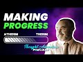

# Making Progress with an Atheist Philosopher | Podcast Highlights (2021-11-26)

## Description

In this clip from our discussion with atheist philosopher Alex Malpass, the conclusion of a long discussion about the PSR and contingency arguments seems to come to a fruitful conclusion where actual progress is made!

Thought Adventure Support
◄ PayPal - https://www.paypal.com/donate/?hosted_button_id=6KZWK75RB23RN 
◄ YouTube - https://www.youtube.com/c/ThoughtAdventurePodcast/join
◄ PATREON - https://www.patreon.com/thoughtadventurepodcast
____________________________________________________________________

Thought Adventure Social Media
◄ Twitter: https://twitter.com/T_A_Podcast​​ [@T_A_Podcast]
◄ Clubhouse https://www.clubhouse.com/club/thought-adventure-podcast
◄ Spotify: https://open.spotify.com/show/7x4UVfTz9QX8KVdEXquDUC
◄ Facebook: https://m.facebook.com/ThoughtAdventurePodcast
◄ Instagram: https://www.instagram.com/ThoughtAdventurePodcast​

----------------------------------------------------------------

*The Hosts:*
----------------------|
Jake Brancatella, The Muslim Metaphysician

- Youtube: https://www.youtube.com/channel/UCcGQRfTPNyHlXMqckvz2uqQ
- Twitter:  https://twitter.com/MMetaphysician​​ [@MMetaphysician]

----------------------|

Yusuf Ponders, The Pondering Soul

- Youtube: https://www.youtube.com/channel/UCsiDDxy0JXLqM6HBA0MA4NA
- Twitter: https://twitter.com/YusufPonders​​ [@YusufPonders]
- Facebook: https://www.facebook.com/yusufponders​ [@yusufpodners]

----------------------|

Sharif

- Twitter: https://twitter.com/sharifhafezi​​ [@sharifhafezi]

----------------------|

Abdulrahman

- Twitter: https://twitter.com/abdul_now​ [@abdul_now]

----------------------|

Admin

Riyad 
Gmail: hello.tapodcast@gmail.com

## Summary of [Making Progress with an Atheist Philosopher | Podcast Highlights](https://www.youtube.com/watch?v=-WLQ5nteiQk)

*This summary is AI generated - there may be inaccuracies. *

### [00:00:00](https://www.youtube.com/watch?v=-WLQ5nteiQk&t=0) - [00:10:00](https://www.youtube.com/watch?v=-WLQ5nteiQk&t=600)

the atheist philosopher discusses how his view of the natural world differs from that of a theist. He argues that, because the theist believes in a god who creates the natural world, their view of the natural world is not as objective as ours. He further argues that, if we agree that necessary things do not have explanation, then we have made progress in the conversation.

**[00:00:00](https://www.youtube.com/watch?v=-WLQ5nteiQk&t=0)**  highlights the progress that has been made in a conversation between an atheist philosopher and someone who believes in abstract necessary things. The philosopher points out that, on his view, a concrete thing is necessary, but this does not explain anything if the thing is necessarily existent. The other person concedes that, on this view, a concrete thing must exist, but argues that this is not significant because necessarily necessary truths do not have explanations.
* **[00:05:00](https://www.youtube.com/watch?v=-WLQ5nteiQk&t=300)* Discusses the difference between a necessary being and an entity that exists necessarily but has no explanation. The philosopher argues that on his view, God exists necessarily but has no explanation. The other philosopher argues that there is something necessary about the nature of God that doesn't call for an explanation.
* **[00:10:00](https://www.youtube.com/watch?v=-WLQ5nteiQk&t=600)**  an atheist philosopher discusses how his view of the natural world differs from the view of a theist. He argues that, because the theist believes in a god who creates the natural world, their view of the natural world is not as objective as ours. He further argues that, if we agree that necessary things do not have explanation, then we have made progress in the conversation.

<h2>Full transcript with timestamps: CLICK TO EXPAND</h2>

[0:00:00](https://youtu.be/-WLQ5nteiQk?t=0) i don't think we i don't think we  
[0:00:02](https://youtu.be/-WLQ5nteiQk?t=2) necessarily and no pun intended started  
[0:00:04](https://youtu.be/-WLQ5nteiQk?t=4) there we i don't think we started there  
[0:00:06](https://youtu.be/-WLQ5nteiQk?t=6) so i think  
[0:00:08](https://youtu.be/-WLQ5nteiQk?t=8) we've made progress in in the  
[0:00:10](https://youtu.be/-WLQ5nteiQk?t=10) conversation that's just that's now i  
[0:00:12](https://youtu.be/-WLQ5nteiQk?t=12) look at it  
[0:00:20](https://youtu.be/-WLQ5nteiQk?t=20) right so then in that case  
[0:00:23](https://youtu.be/-WLQ5nteiQk?t=23) um there's a possible world in which  
[0:00:25](https://youtu.be/-WLQ5nteiQk?t=25) only abstract necessary things exist  
[0:00:29](https://youtu.be/-WLQ5nteiQk?t=29) and no concrete  
[0:00:31](https://youtu.be/-WLQ5nteiQk?t=31) um nothing concrete exists  
[0:00:34](https://youtu.be/-WLQ5nteiQk?t=34) uh yeah okay sure  
[0:00:37](https://youtu.be/-WLQ5nteiQk?t=37) i mean  
[0:00:37](https://youtu.be/-WLQ5nteiQk?t=37) i  
[0:00:39](https://youtu.be/-WLQ5nteiQk?t=39) i'm playing the game a bit an artist i'm  
[0:00:41](https://youtu.be/-WLQ5nteiQk?t=41) just wondering  
[0:00:48](https://youtu.be/-WLQ5nteiQk?t=48) where there's no beginning to time  
[0:00:51](https://youtu.be/-WLQ5nteiQk?t=51) every possible world overlaps with the  
[0:00:53](https://youtu.be/-WLQ5nteiQk?t=53) actual world  
[0:00:54](https://youtu.be/-WLQ5nteiQk?t=54) so  
[0:00:55](https://youtu.be/-WLQ5nteiQk?t=55) i mean unless the actual world at no  
[0:00:58](https://youtu.be/-WLQ5nteiQk?t=58) point contains any concrete things  
[0:01:00](https://youtu.be/-WLQ5nteiQk?t=60) then  
[0:01:01](https://youtu.be/-WLQ5nteiQk?t=61) um there isn't a possible world where  
[0:01:04](https://youtu.be/-WLQ5nteiQk?t=64) at no point is there a concrete thing  
[0:01:06](https://youtu.be/-WLQ5nteiQk?t=66) like if there's some concrete thing at  
[0:01:07](https://youtu.be/-WLQ5nteiQk?t=67) some point in the actual world then it's  
[0:01:09](https://youtu.be/-WLQ5nteiQk?t=69) not possible this is an entirely empty  
[0:01:12](https://youtu.be/-WLQ5nteiQk?t=72) world no concrete things in it but ah so  
[0:01:15](https://youtu.be/-WLQ5nteiQk?t=75) so that's so that yeah so then that's my  
[0:01:18](https://youtu.be/-WLQ5nteiQk?t=78) point is then that means that something  
[0:01:21](https://youtu.be/-WLQ5nteiQk?t=81) concrete is necessary  
[0:01:25](https://youtu.be/-WLQ5nteiQk?t=85) um  
[0:01:26](https://youtu.be/-WLQ5nteiQk?t=86) huh  
[0:01:28](https://youtu.be/-WLQ5nteiQk?t=88) i mean it follows that if there's  
[0:01:30](https://youtu.be/-WLQ5nteiQk?t=90) something concrete then it's necessary  
[0:01:32](https://youtu.be/-WLQ5nteiQk?t=92) that there's something hungry that's  
[0:01:33](https://youtu.be/-WLQ5nteiQk?t=93) true it doesn't follow it doesn't  
[0:01:36](https://youtu.be/-WLQ5nteiQk?t=96) i don't have to hold that there is but  
[0:01:37](https://youtu.be/-WLQ5nteiQk?t=97) um yeah i think that's right on the  
[0:01:39](https://youtu.be/-WLQ5nteiQk?t=99) aristotelian view that's right that  
[0:01:41](https://youtu.be/-WLQ5nteiQk?t=101) there's there couldn't be an empty world  
[0:01:42](https://youtu.be/-WLQ5nteiQk?t=102) unless the actual world is an empty  
[0:01:44](https://youtu.be/-WLQ5nteiQk?t=104) world  
[0:01:45](https://youtu.be/-WLQ5nteiQk?t=105) uh  
[0:01:46](https://youtu.be/-WLQ5nteiQk?t=106) right but then if that's the case then  
[0:01:48](https://youtu.be/-WLQ5nteiQk?t=108) now you have something necessary that's  
[0:01:50](https://youtu.be/-WLQ5nteiQk?t=110) concrete and now we go all the way back  
[0:01:53](https://youtu.be/-WLQ5nteiQk?t=113) to step one in which your your theory is  
[0:01:56](https://youtu.be/-WLQ5nteiQk?t=116) now radically different no no no no no  
[0:01:57](https://youtu.be/-WLQ5nteiQk?t=117) no no no  
[0:01:59](https://youtu.be/-WLQ5nteiQk?t=119) i don't have that there's a necessary  
[0:02:01](https://youtu.be/-WLQ5nteiQk?t=121) concrete thing but i think it's  
[0:02:02](https://youtu.be/-WLQ5nteiQk?t=122) necessary that there's something  
[0:02:04](https://youtu.be/-WLQ5nteiQk?t=124) concrete but each of those things could  
[0:02:05](https://youtu.be/-WLQ5nteiQk?t=125) be contingent it's just that there  
[0:02:07](https://youtu.be/-WLQ5nteiQk?t=127) couldn't be no  
[0:02:10](https://youtu.be/-WLQ5nteiQk?t=130) concrete things  
[0:02:11](https://youtu.be/-WLQ5nteiQk?t=131) right but it doesn't mean there is one  
[0:02:12](https://youtu.be/-WLQ5nteiQk?t=132) concrete thing that's necessary it's  
[0:02:14](https://youtu.be/-WLQ5nteiQk?t=134) just not  
[0:02:15](https://youtu.be/-WLQ5nteiQk?t=135) not individual but the  
[0:02:17](https://youtu.be/-WLQ5nteiQk?t=137) thing exists yeah but the genus i'm  
[0:02:19](https://youtu.be/-WLQ5nteiQk?t=139) saying  
[0:02:21](https://youtu.be/-WLQ5nteiQk?t=141) so when we're talking  
[0:02:22](https://youtu.be/-WLQ5nteiQk?t=142) or something what do you mean by the  
[0:02:23](https://youtu.be/-WLQ5nteiQk?t=143) genus  
[0:02:25](https://youtu.be/-WLQ5nteiQk?t=145) you mean the type  
[0:02:26](https://youtu.be/-WLQ5nteiQk?t=146) yeah the category of concrete  
[0:02:30](https://youtu.be/-WLQ5nteiQk?t=150) some of the category of something being  
[0:02:32](https://youtu.be/-WLQ5nteiQk?t=152) concrete  
[0:02:33](https://youtu.be/-WLQ5nteiQk?t=153) that's necessary  
[0:02:35](https://youtu.be/-WLQ5nteiQk?t=155) yeah so i'm not saying that therefore  
[0:02:36](https://youtu.be/-WLQ5nteiQk?t=156) you're forced into  
[0:02:38](https://youtu.be/-WLQ5nteiQk?t=158) oh a particular molecule or a pen yeah  
[0:02:41](https://youtu.be/-WLQ5nteiQk?t=161) yeah  
[0:02:42](https://youtu.be/-WLQ5nteiQk?t=162) i'm not saying that i'm not saying that  
[0:02:44](https://youtu.be/-WLQ5nteiQk?t=164) but  
[0:02:45](https://youtu.be/-WLQ5nteiQk?t=165) there  
[0:02:46](https://youtu.be/-WLQ5nteiQk?t=166) the  
[0:02:47](https://youtu.be/-WLQ5nteiQk?t=167) the category of concrete existence would  
[0:02:50](https://youtu.be/-WLQ5nteiQk?t=170) then be necessary  
[0:02:53](https://youtu.be/-WLQ5nteiQk?t=173) yeah okay well that's compatible with me  
[0:02:54](https://youtu.be/-WLQ5nteiQk?t=174) saying every concrete thing contingently  
[0:02:56](https://youtu.be/-WLQ5nteiQk?t=176) exists  
[0:02:58](https://youtu.be/-WLQ5nteiQk?t=178) yeah  
[0:02:59](https://youtu.be/-WLQ5nteiQk?t=179) right but now  
[0:03:01](https://youtu.be/-WLQ5nteiQk?t=181) to me it seems like you're getting a bit  
[0:03:04](https://youtu.be/-WLQ5nteiQk?t=184) closer to  
[0:03:05](https://youtu.be/-WLQ5nteiQk?t=185) the view that we're trying to represent  
[0:03:11](https://youtu.be/-WLQ5nteiQk?t=191) maybe a little bit but i'm not sure that  
[0:03:13](https://youtu.be/-WLQ5nteiQk?t=193) is significantly closer because  
[0:03:16](https://youtu.be/-WLQ5nteiQk?t=196) um  
[0:03:19](https://youtu.be/-WLQ5nteiQk?t=199) let's so let me see if i can retrace the  
[0:03:21](https://youtu.be/-WLQ5nteiQk?t=201) steps where we just got got to  
[0:03:23](https://youtu.be/-WLQ5nteiQk?t=203) make sure because maybe i'm missing this  
[0:03:25](https://youtu.be/-WLQ5nteiQk?t=205) but  
[0:03:25](https://youtu.be/-WLQ5nteiQk?t=205) um  
[0:03:28](https://youtu.be/-WLQ5nteiQk?t=208) what i i was advancing that view that  
[0:03:31](https://youtu.be/-WLQ5nteiQk?t=211) there's a beginning sequence of  
[0:03:32](https://youtu.be/-WLQ5nteiQk?t=212) contingent propositions let's say  
[0:03:34](https://youtu.be/-WLQ5nteiQk?t=214) contingent concretely existing things or  
[0:03:36](https://youtu.be/-WLQ5nteiQk?t=216) something  
[0:03:37](https://youtu.be/-WLQ5nteiQk?t=217) um  
[0:03:39](https://youtu.be/-WLQ5nteiQk?t=219) and you said well  
[0:03:42](https://youtu.be/-WLQ5nteiQk?t=222) that view suffers from this problem that  
[0:03:44](https://youtu.be/-WLQ5nteiQk?t=224) it can't explain why there's something  
[0:03:45](https://youtu.be/-WLQ5nteiQk?t=225) other than nothing  
[0:03:47](https://youtu.be/-WLQ5nteiQk?t=227) um  
[0:03:50](https://youtu.be/-WLQ5nteiQk?t=230) and then  
[0:03:51](https://youtu.be/-WLQ5nteiQk?t=231) you said well on our view there's  
[0:03:54](https://youtu.be/-WLQ5nteiQk?t=234) a necessary  
[0:03:55](https://youtu.be/-WLQ5nteiQk?t=235) concrete thing  
[0:03:57](https://youtu.be/-WLQ5nteiQk?t=237) um  
[0:03:58](https://youtu.be/-WLQ5nteiQk?t=238) then i said well problem with that is it  
[0:04:00](https://youtu.be/-WLQ5nteiQk?t=240) doesn't explain anything if it's a  
[0:04:01](https://youtu.be/-WLQ5nteiQk?t=241) necessarily existing concrete thing  
[0:04:05](https://youtu.be/-WLQ5nteiQk?t=245) and now you're saying well on the  
[0:04:06](https://youtu.be/-WLQ5nteiQk?t=246) aristotelian view it's necessary that  
[0:04:09](https://youtu.be/-WLQ5nteiQk?t=249) some concrete thing  
[0:04:10](https://youtu.be/-WLQ5nteiQk?t=250) exists  
[0:04:12](https://youtu.be/-WLQ5nteiQk?t=252) brackets if it's actually true that some  
[0:04:14](https://youtu.be/-WLQ5nteiQk?t=254) concrete thing exists whatever  
[0:04:17](https://youtu.be/-WLQ5nteiQk?t=257) um  
[0:04:17](https://youtu.be/-WLQ5nteiQk?t=257) what's the significance of that  
[0:04:19](https://youtu.be/-WLQ5nteiQk?t=259) concession  
[0:04:21](https://youtu.be/-WLQ5nteiQk?t=261) how does that  
[0:04:23](https://youtu.be/-WLQ5nteiQk?t=263) i'm not sure how it deals with them  
[0:04:24](https://youtu.be/-WLQ5nteiQk?t=264) because my rebuttal to your point was  
[0:04:27](https://youtu.be/-WLQ5nteiQk?t=267) you're not explaining anything if you've  
[0:04:30](https://youtu.be/-WLQ5nteiQk?t=270) got a necessarily existent  
[0:04:32](https://youtu.be/-WLQ5nteiQk?t=272) concrete thing because necessarily  
[0:04:35](https://youtu.be/-WLQ5nteiQk?t=275) necessary truths don't have explanations  
[0:04:39](https://youtu.be/-WLQ5nteiQk?t=279) yeah and i'm not sure that you're  
[0:04:41](https://youtu.be/-WLQ5nteiQk?t=281) disagreeing with me about that or not  
[0:04:45](https://youtu.be/-WLQ5nteiQk?t=285) yeah cause i originally i originally was  
[0:04:48](https://youtu.be/-WLQ5nteiQk?t=288) well i shouldn't say originally but the  
[0:04:50](https://youtu.be/-WLQ5nteiQk?t=290) step in the discussion i wanted to go  
[0:04:52](https://youtu.be/-WLQ5nteiQk?t=292) back to is when i was talking about  
[0:04:55](https://youtu.be/-WLQ5nteiQk?t=295) uh a possible world in which abstract  
[0:04:57](https://youtu.be/-WLQ5nteiQk?t=297) objects it exists but no concrete object  
[0:05:00](https://youtu.be/-WLQ5nteiQk?t=300) exists  
[0:05:01](https://youtu.be/-WLQ5nteiQk?t=301) originally you said yes but then you  
[0:05:03](https://youtu.be/-WLQ5nteiQk?t=303) thought given your aristotelian view of  
[0:05:05](https://youtu.be/-WLQ5nteiQk?t=305) what you were yeah i'm going to be  
[0:05:07](https://youtu.be/-WLQ5nteiQk?t=307) representing yeah if you're representing  
[0:05:10](https://youtu.be/-WLQ5nteiQk?t=310) if you're sticking to that then you're  
[0:05:12](https://youtu.be/-WLQ5nteiQk?t=312) saying no no that's not really going to  
[0:05:13](https://youtu.be/-WLQ5nteiQk?t=313) work so then  
[0:05:15](https://youtu.be/-WLQ5nteiQk?t=315) if the change but before we get to that  
[0:05:18](https://youtu.be/-WLQ5nteiQk?t=318) bit just whilst we were still on the  
[0:05:19](https://youtu.be/-WLQ5nteiQk?t=319) point that when i because you said on  
[0:05:22](https://youtu.be/-WLQ5nteiQk?t=322) our view necessarily existing concrete  
[0:05:23](https://youtu.be/-WLQ5nteiQk?t=323) thing exists and i said i don't  
[0:05:25](https://youtu.be/-WLQ5nteiQk?t=325) understand how that provides any  
[0:05:26](https://youtu.be/-WLQ5nteiQk?t=326) explanation i'm i before we start  
[0:05:28](https://youtu.be/-WLQ5nteiQk?t=328) talking about whether i think  
[0:05:31](https://youtu.be/-WLQ5nteiQk?t=331) there could be no concrete things i'm  
[0:05:33](https://youtu.be/-WLQ5nteiQk?t=333) just not clear whether whether you  
[0:05:34](https://youtu.be/-WLQ5nteiQk?t=334) agreed with that reply or whether you  
[0:05:36](https://youtu.be/-WLQ5nteiQk?t=336) disagreed with it  
[0:05:38](https://youtu.be/-WLQ5nteiQk?t=338) uh agreed with what that necessary  
[0:05:41](https://youtu.be/-WLQ5nteiQk?t=341) necessary troops don't have explanations  
[0:05:43](https://youtu.be/-WLQ5nteiQk?t=343) do you agree with that  
[0:05:46](https://youtu.be/-WLQ5nteiQk?t=346) um  
[0:05:46](https://youtu.be/-WLQ5nteiQk?t=346) [Music]  
[0:05:48](https://youtu.be/-WLQ5nteiQk?t=348) in a sense that i don't really like the  
[0:05:51](https://youtu.be/-WLQ5nteiQk?t=351) explanation idea  
[0:05:53](https://youtu.be/-WLQ5nteiQk?t=353) so  
[0:05:54](https://youtu.be/-WLQ5nteiQk?t=354) if there's an entity x  
[0:05:57](https://youtu.be/-WLQ5nteiQk?t=357) that's concrete  
[0:05:58](https://youtu.be/-WLQ5nteiQk?t=358) and exists  
[0:06:00](https://youtu.be/-WLQ5nteiQk?t=360) and that's a necessary truth  
[0:06:03](https://youtu.be/-WLQ5nteiQk?t=363) nothing explains that exists  
[0:06:06](https://youtu.be/-WLQ5nteiQk?t=366) because necessary truth  
[0:06:08](https://youtu.be/-WLQ5nteiQk?t=368) right  
[0:06:10](https://youtu.be/-WLQ5nteiQk?t=370) no there's nothing we just  
[0:06:12](https://youtu.be/-WLQ5nteiQk?t=372) yeah there's nothing there's nothing  
[0:06:13](https://youtu.be/-WLQ5nteiQk?t=373) outside of the thing itself no that's  
[0:06:15](https://youtu.be/-WLQ5nteiQk?t=375) explaining okay no  
[0:06:17](https://youtu.be/-WLQ5nteiQk?t=377) so originally the criticism was i can't  
[0:06:20](https://youtu.be/-WLQ5nteiQk?t=380) explain why something rather than  
[0:06:22](https://youtu.be/-WLQ5nteiQk?t=382) nothing exists  
[0:06:24](https://youtu.be/-WLQ5nteiQk?t=384) and you're and i said well what happens  
[0:06:26](https://youtu.be/-WLQ5nteiQk?t=386) on your theory and you said well on our  
[0:06:28](https://youtu.be/-WLQ5nteiQk?t=388) theory god exists necessarily but now i  
[0:06:32](https://youtu.be/-WLQ5nteiQk?t=392) think i just can see that nothing  
[0:06:33](https://youtu.be/-WLQ5nteiQk?t=393) explains that so how  
[0:06:36](https://youtu.be/-WLQ5nteiQk?t=396) can we because now i'm showing that  
[0:06:37](https://youtu.be/-WLQ5nteiQk?t=397) you're winding up in the same place  
[0:06:40](https://youtu.be/-WLQ5nteiQk?t=400) but before we talk about that how it  
[0:06:42](https://youtu.be/-WLQ5nteiQk?t=402) still feels like you haven't  
[0:06:44](https://youtu.be/-WLQ5nteiQk?t=404) are you agreeing then that your theory  
[0:06:45](https://youtu.be/-WLQ5nteiQk?t=405) doesn't have an explanatory advantage  
[0:06:47](https://youtu.be/-WLQ5nteiQk?t=407) because it doesn't explain away why it  
[0:06:50](https://youtu.be/-WLQ5nteiQk?t=410) doesn't have anything to say about why  
[0:06:52](https://youtu.be/-WLQ5nteiQk?t=412) there's something rather than nothing  
[0:06:54](https://youtu.be/-WLQ5nteiQk?t=414) positing a being that exists necessarily  
[0:06:56](https://youtu.be/-WLQ5nteiQk?t=416) with no explanation  
[0:06:58](https://youtu.be/-WLQ5nteiQk?t=418) can't explain why something exists  
[0:06:59](https://youtu.be/-WLQ5nteiQk?t=419) rather than nothing can it  
[0:07:02](https://youtu.be/-WLQ5nteiQk?t=422) um  
[0:07:04](https://youtu.be/-WLQ5nteiQk?t=424) well  
[0:07:06](https://youtu.be/-WLQ5nteiQk?t=426) when you say why is there something  
[0:07:08](https://youtu.be/-WLQ5nteiQk?t=428) rather than nothing right and we're  
[0:07:10](https://youtu.be/-WLQ5nteiQk?t=430) including  
[0:07:11](https://youtu.be/-WLQ5nteiQk?t=431) uh concrete existence in that  
[0:07:14](https://youtu.be/-WLQ5nteiQk?t=434) i'm saying that if god is the necessary  
[0:07:16](https://youtu.be/-WLQ5nteiQk?t=436) being  
[0:07:17](https://youtu.be/-WLQ5nteiQk?t=437) and he exists in all possible worlds  
[0:07:20](https://youtu.be/-WLQ5nteiQk?t=440) yeah that x in the sense explains the  
[0:07:23](https://youtu.be/-WLQ5nteiQk?t=443) question of why there couldn't be  
[0:07:25](https://youtu.be/-WLQ5nteiQk?t=445) non-existence  
[0:07:27](https://youtu.be/-WLQ5nteiQk?t=447) but nothing explains why he exists so  
[0:07:30](https://youtu.be/-WLQ5nteiQk?t=450) it's only to take one step back  
[0:07:32](https://youtu.be/-WLQ5nteiQk?t=452) kind of explanation and then you find  
[0:07:34](https://youtu.be/-WLQ5nteiQk?t=454) that you're because if i say look it's  
[0:07:36](https://youtu.be/-WLQ5nteiQk?t=456) just a brute contingency that something  
[0:07:38](https://youtu.be/-WLQ5nteiQk?t=458) exists then you might rightly complain  
[0:07:40](https://youtu.be/-WLQ5nteiQk?t=460) that well take one further step back why  
[0:07:43](https://youtu.be/-WLQ5nteiQk?t=463) does that brute contingency exist i said  
[0:07:44](https://youtu.be/-WLQ5nteiQk?t=464) well no reason at all and you say ah  
[0:07:46](https://youtu.be/-WLQ5nteiQk?t=466) there's no reason then it's no good to  
[0:07:48](https://youtu.be/-WLQ5nteiQk?t=468) just give me one step of explanation  
[0:07:51](https://youtu.be/-WLQ5nteiQk?t=471) away from the kind of precipice of there  
[0:07:53](https://youtu.be/-WLQ5nteiQk?t=473) being no explanation beyond that but it  
[0:07:55](https://youtu.be/-WLQ5nteiQk?t=475) seems to me exactly what you've done by  
[0:07:57](https://youtu.be/-WLQ5nteiQk?t=477) just giving me you know just some object  
[0:07:59](https://youtu.be/-WLQ5nteiQk?t=479) exists necessarily but nothing explains  
[0:08:02](https://youtu.be/-WLQ5nteiQk?t=482) that  
[0:08:03](https://youtu.be/-WLQ5nteiQk?t=483) i mean if anything is is unsatisfying  
[0:08:05](https://youtu.be/-WLQ5nteiQk?t=485) explanation it must be that  
[0:08:08](https://youtu.be/-WLQ5nteiQk?t=488) mind if i jump in here because this is  
[0:08:09](https://youtu.be/-WLQ5nteiQk?t=489) this is great i mean i've been listening  
[0:08:10](https://youtu.be/-WLQ5nteiQk?t=490) this is this is awesome but so i think  
[0:08:13](https://youtu.be/-WLQ5nteiQk?t=493) at this point so i i think the the most  
[0:08:15](https://youtu.be/-WLQ5nteiQk?t=495) important  
[0:08:16](https://youtu.be/-WLQ5nteiQk?t=496) point here is that well  
[0:08:18](https://youtu.be/-WLQ5nteiQk?t=498) it seems like this is going to boil down  
[0:08:21](https://youtu.be/-WLQ5nteiQk?t=501) to the fact that on both views i'm not  
[0:08:23](https://youtu.be/-WLQ5nteiQk?t=503) saying you're necessarily committed to  
[0:08:24](https://youtu.be/-WLQ5nteiQk?t=504) this alex i'm just saying as far as the  
[0:08:26](https://youtu.be/-WLQ5nteiQk?t=506) discussion is concerned both these are  
[0:08:27](https://youtu.be/-WLQ5nteiQk?t=507) going to commit to something necessary  
[0:08:30](https://youtu.be/-WLQ5nteiQk?t=510) but right now there's the there's so  
[0:08:32](https://youtu.be/-WLQ5nteiQk?t=512) there's the question of the overall  
[0:08:33](https://youtu.be/-WLQ5nteiQk?t=513) theory  
[0:08:34](https://youtu.be/-WLQ5nteiQk?t=514) and wait how is there a difference  
[0:08:36](https://youtu.be/-WLQ5nteiQk?t=516) you're saying that there's something  
[0:08:37](https://youtu.be/-WLQ5nteiQk?t=517) necessary  
[0:08:38](https://youtu.be/-WLQ5nteiQk?t=518) has no explanation i'm saying there's  
[0:08:40](https://youtu.be/-WLQ5nteiQk?t=520) something necessary it has no  
[0:08:41](https://youtu.be/-WLQ5nteiQk?t=521) explanation  
[0:08:43](https://youtu.be/-WLQ5nteiQk?t=523) but  
[0:08:44](https://youtu.be/-WLQ5nteiQk?t=524) i'm not really sure that's the case so  
[0:08:45](https://youtu.be/-WLQ5nteiQk?t=525) first of all there's there is the  
[0:08:47](https://youtu.be/-WLQ5nteiQk?t=527) question of whether self-explanation  
[0:08:49](https://youtu.be/-WLQ5nteiQk?t=529) makes any sense and that's that's  
[0:08:50](https://youtu.be/-WLQ5nteiQk?t=530) controversial so we can either accept  
[0:08:52](https://youtu.be/-WLQ5nteiQk?t=532) that there is self-explanation or say  
[0:08:54](https://youtu.be/-WLQ5nteiQk?t=534) that something doesn't need an  
[0:08:56](https://youtu.be/-WLQ5nteiQk?t=536) explanation  
[0:08:57](https://youtu.be/-WLQ5nteiQk?t=537) now if we go for the latter something  
[0:09:00](https://youtu.be/-WLQ5nteiQk?t=540) doesn't need an explanation  
[0:09:02](https://youtu.be/-WLQ5nteiQk?t=542) we can either say it doesn't need an  
[0:09:04](https://youtu.be/-WLQ5nteiQk?t=544) explanation  
[0:09:06](https://youtu.be/-WLQ5nteiQk?t=546) by  
[0:09:06](https://youtu.be/-WLQ5nteiQk?t=546) a virtue of it  
[0:09:09](https://youtu.be/-WLQ5nteiQk?t=549) being necessary period and that can like  
[0:09:12](https://youtu.be/-WLQ5nteiQk?t=552) literally be the tree right outside my  
[0:09:14](https://youtu.be/-WLQ5nteiQk?t=554) door it just doesn't need an explanation  
[0:09:16](https://youtu.be/-WLQ5nteiQk?t=556) just that's just it or we can say that  
[0:09:19](https://youtu.be/-WLQ5nteiQk?t=559) there is something about the nature of  
[0:09:23](https://youtu.be/-WLQ5nteiQk?t=563) this thing  
[0:09:24](https://youtu.be/-WLQ5nteiQk?t=564) that doesn't call for an explanation in  
[0:09:28](https://youtu.be/-WLQ5nteiQk?t=568) a similar way although the analogy isn't  
[0:09:30](https://youtu.be/-WLQ5nteiQk?t=570) perfect so like an analytic truth like a  
[0:09:32](https://youtu.be/-WLQ5nteiQk?t=572) equals a  
[0:09:33](https://youtu.be/-WLQ5nteiQk?t=573) you're not going to ask for an  
[0:09:34](https://youtu.be/-WLQ5nteiQk?t=574) explanation for that now it's obviously  
[0:09:37](https://youtu.be/-WLQ5nteiQk?t=577) difficult to think of something like  
[0:09:38](https://youtu.be/-WLQ5nteiQk?t=578) that in in in the concrete world right  
[0:09:41](https://youtu.be/-WLQ5nteiQk?t=581) because it's not an analytic truth but  
[0:09:43](https://youtu.be/-WLQ5nteiQk?t=583) then  
[0:09:44](https://youtu.be/-WLQ5nteiQk?t=584) at least what we're saying is  
[0:09:46](https://youtu.be/-WLQ5nteiQk?t=586) that  
[0:09:47](https://youtu.be/-WLQ5nteiQk?t=587) these are two views and we're thinking  
[0:09:49](https://youtu.be/-WLQ5nteiQk?t=589) of the explanatory power  
[0:09:52](https://youtu.be/-WLQ5nteiQk?t=592) on one view  
[0:09:54](https://youtu.be/-WLQ5nteiQk?t=594) so  
[0:09:55](https://youtu.be/-WLQ5nteiQk?t=595) so on one view there's there's just  
[0:09:58](https://youtu.be/-WLQ5nteiQk?t=598) a rock that's self-explanatory on the  
[0:10:00](https://youtu.be/-WLQ5nteiQk?t=600) other view we're saying no no it's  
[0:10:03](https://youtu.be/-WLQ5nteiQk?t=603) it's something that self-explanatory or  
[0:10:04](https://youtu.be/-WLQ5nteiQk?t=604) something that doesn't require  
[0:10:05](https://youtu.be/-WLQ5nteiQk?t=605) explanation but in order for it to be  
[0:10:07](https://youtu.be/-WLQ5nteiQk?t=607) that  
[0:10:08](https://youtu.be/-WLQ5nteiQk?t=608) it's not that nature it's not it's not a  
[0:10:10](https://youtu.be/-WLQ5nteiQk?t=610) rock it's something that is in a  
[0:10:12](https://youtu.be/-WLQ5nteiQk?t=612) different category than these things  
[0:10:15](https://youtu.be/-WLQ5nteiQk?t=615) around us that you know the natural  
[0:10:17](https://youtu.be/-WLQ5nteiQk?t=617) world that does call for an explanation  
[0:10:19](https://youtu.be/-WLQ5nteiQk?t=619) so i it might be a bit tricky like in  
[0:10:21](https://youtu.be/-WLQ5nteiQk?t=621) the sense that when we look at a theory  
[0:10:22](https://youtu.be/-WLQ5nteiQk?t=622) from the outside okay well it explains  
[0:10:25](https://youtu.be/-WLQ5nteiQk?t=625) it that one explains it fine we're good  
[0:10:27](https://youtu.be/-WLQ5nteiQk?t=627) we're it's a stalemate but then i mean  
[0:10:30](https://youtu.be/-WLQ5nteiQk?t=630) in a sense you could say that about like  
[0:10:31](https://youtu.be/-WLQ5nteiQk?t=631) a solipsist versus an external world  
[0:10:33](https://youtu.be/-WLQ5nteiQk?t=633) realist well i mean he explains  
[0:10:35](https://youtu.be/-WLQ5nteiQk?t=635) everything i mean  
[0:10:36](https://youtu.be/-WLQ5nteiQk?t=636) yeah but look  
[0:10:39](https://youtu.be/-WLQ5nteiQk?t=639) here's  
[0:10:40](https://youtu.be/-WLQ5nteiQk?t=640) i mean if if what you're saying is  
[0:10:43](https://youtu.be/-WLQ5nteiQk?t=643) on our theistic theory the difference is  
[0:10:47](https://youtu.be/-WLQ5nteiQk?t=647) we've got  
[0:10:48](https://youtu.be/-WLQ5nteiQk?t=648) a thing  
[0:10:50](https://youtu.be/-WLQ5nteiQk?t=650) god whose nature  
[0:10:52](https://youtu.be/-WLQ5nteiQk?t=652) gives it the  
[0:10:53](https://youtu.be/-WLQ5nteiQk?t=653) i mean  
[0:10:55](https://youtu.be/-WLQ5nteiQk?t=655) just to be quick about it to get out of  
[0:10:57](https://youtu.be/-WLQ5nteiQk?t=657) jail free card i don't mean anything  
[0:10:58](https://youtu.be/-WLQ5nteiQk?t=658) offensive balance it's not any  
[0:11:00](https://youtu.be/-WLQ5nteiQk?t=660) accusation of deception or anything like  
[0:11:01](https://youtu.be/-WLQ5nteiQk?t=661) that but like the reason why this is  
[0:11:03](https://youtu.be/-WLQ5nteiQk?t=663) different from the other things is its  
[0:11:05](https://youtu.be/-WLQ5nteiQk?t=665) nature if i press further on that isn't  
[0:11:07](https://youtu.be/-WLQ5nteiQk?t=667) it really just that its nature is that  
[0:11:09](https://youtu.be/-WLQ5nteiQk?t=669) it exists necessarily i mean and and  
[0:11:12](https://youtu.be/-WLQ5nteiQk?t=672) then now what we're talking about is  
[0:11:13](https://youtu.be/-WLQ5nteiQk?t=673) just actually it's just not a contingent  
[0:11:16](https://youtu.be/-WLQ5nteiQk?t=676) proposition i mean i'm okay with  
[0:11:18](https://youtu.be/-WLQ5nteiQk?t=678) necessary propositions not having  
[0:11:20](https://youtu.be/-WLQ5nteiQk?t=680) explanations so like  
[0:11:22](https://youtu.be/-WLQ5nteiQk?t=682) that's fine it's just that if if all you  
[0:11:24](https://youtu.be/-WLQ5nteiQk?t=684) mean by its nature  
[0:11:26](https://youtu.be/-WLQ5nteiQk?t=686) being special is that it's a necessarily  
[0:11:28](https://youtu.be/-WLQ5nteiQk?t=688) existing thing then i just don't see how  
[0:11:30](https://youtu.be/-WLQ5nteiQk?t=690) that progresses dialectic anywhere  
[0:11:32](https://youtu.be/-WLQ5nteiQk?t=692) because  
[0:11:33](https://youtu.be/-WLQ5nteiQk?t=693) if what we're saying is the reason why  
[0:11:34](https://youtu.be/-WLQ5nteiQk?t=694) there's something rather than nothing is  
[0:11:36](https://youtu.be/-WLQ5nteiQk?t=696) because something exists necessarily  
[0:11:38](https://youtu.be/-WLQ5nteiQk?t=698) then you can't be an advantage in terms  
[0:11:40](https://youtu.be/-WLQ5nteiQk?t=700) of explanation because aren't we just  
[0:11:42](https://youtu.be/-WLQ5nteiQk?t=702) agreeing that necessary things don't  
[0:11:44](https://youtu.be/-WLQ5nteiQk?t=704) have explanation so positing another  
[0:11:46](https://youtu.be/-WLQ5nteiQk?t=706) necessary thing can't help you in terms  
[0:11:48](https://youtu.be/-WLQ5nteiQk?t=708) of explanation because it's just yeah  
[0:11:49](https://youtu.be/-WLQ5nteiQk?t=709) well i don't know  
[0:11:51](https://youtu.be/-WLQ5nteiQk?t=711) i guess we are agreeing one second hold  
[0:11:53](https://youtu.be/-WLQ5nteiQk?t=713) on a second i'm direct man i think if  
[0:11:56](https://youtu.be/-WLQ5nteiQk?t=716) we're agreeing on that we've made  
[0:11:58](https://youtu.be/-WLQ5nteiQk?t=718) progress  
[0:12:00](https://youtu.be/-WLQ5nteiQk?t=720) as far as i'm concerned in the  
[0:12:02](https://youtu.be/-WLQ5nteiQk?t=722) conversation because i don't think we i  
[0:12:04](https://youtu.be/-WLQ5nteiQk?t=724) don't think we necessarily and no pun  
[0:12:07](https://youtu.be/-WLQ5nteiQk?t=727) intended started there we i don't think  
[0:12:09](https://youtu.be/-WLQ5nteiQk?t=729) we started there so i think  
[0:12:11](https://youtu.be/-WLQ5nteiQk?t=731) we've made progress in in the  
[0:12:13](https://youtu.be/-WLQ5nteiQk?t=733) conversation that's just i look at it  

