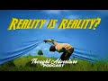

# Reality Is Reality!? | Podcast Highlight (2021-03-09)

## Description

In this clip, Justin (Atheist) has a friendly chat with the panelists about the ultimate nature of reality. They question whether we can be rationally justified in making positive claims about the nature and properties of this necessary existence.

A focal question here revolves around a certain catchphrase that has been gaining popularity as of late: "reality is reality!". Is this a sufficiently meaningful response? Is it philosophically useful to appeal to vague notions of a brute contingency as an ultimate explanation for reality?

This back-and-forth very  briefly touches on some of these issues.

Full video: https://youtu.be/-UlkXwMOaT4 

Thought Adventure Support
◄ PayPal - https://www.paypal.com/donate/?hosted_button_id=6KZWK75RB23RN 
◄ YouTube - https://www.youtube.com/c/ThoughtAdventurePodcast/join
◄ PATREON - https://www.patreon.com/thoughtadventurepodcast
____________________________________________________________________

Thought Adventure Social Media
◄ Twitter: https://twitter.com/T_A_Podcast​​ [@T_A_Podcast]
◄ Clubhouse https://www.clubhouse.com/club/thought-adventure-podcast
◄ Spotify: https://open.spotify.com/show/7x4UVfTz9QX8KVdEXquDUC
◄ Facebook: https://m.facebook.com/ThoughtAdventurePodcast
◄ Instagram: https://www.instagram.com/ThoughtAdventurePodcast​

----------------------------------------------------------------

*The Hosts:*
----------------------|
Jake Brancatella, The Muslim Metaphysician

- Youtube: https://www.youtube.com/channel/UCcGQRfTPNyHlXMqckvz2uqQ
- Twitter:  https://twitter.com/MMetaphysician​​ [@MMetaphysician]

----------------------|

Yusuf Ponders, The Pondering Soul

- Youtube: https://www.youtube.com/channel/UCsiDDxy0JXLqM6HBA0MA4NA
- Twitter: https://twitter.com/YusufPonders​​ [@YusufPonders]
- Facebook: https://www.facebook.com/yusufponders​ [@yusufpodners]

----------------------|

Sharif

- Twitter: https://twitter.com/sharifhafezi​​ [@sharifhafezi]

----------------------|

Abdulrahman

- Twitter: https://twitter.com/abdul_now​ [@abdul_now]

----------------------|

Admin

Riyad 
Gmail: hello.tapodcast@gmail.com

#reality

## Summary of [Reality Is Reality!? | Podcast Highlight](https://www.youtube.com/watch?v=KRuUq0dCrmA)

*This summary is AI generated - there may be inaccuracies. *

### [00:00:00](https://www.youtube.com/watch?v=KRuUq0dCrmA&t=0) - [00:10:00](https://www.youtube.com/watch?v=KRuUq0dCrmA&t=600)

 the author discusses the difference between reality and what people believe reality to be. He argues that reality is what everyone believes it to be, and that it doesn't really give us any information to work with. He goes on to say that reality exists because that would be existence exists, and that the fundamental nature of that what differentiates your view from mine is called experience we share a reality. then asks the listener if they accept stage one cosmological arguments, which take one to a necessary being. The listener says that they do, and that as long as the perspective is natural, they are fine with it. then asks the listener if they are agnostic about whether reality is natural or not, to which the listener says that as long as the perspective is natural, they are okay with it.
 discusses the idea of god, specifically discussing whether or not it has a mind. It concludes by saying that, in order to make a claim about the mentality or mental activity of a god, one must assume a physicalist theory of mind.

**[00:00:00](https://www.youtube.com/watch?v=KRuUq0dCrmA&t=0)* Discusses the difference between reality and what people believe reality to be. says that reality is what everyone believes it to be, and that it doesn't really give us any information to work with. He goes on to say that reality exists because that would be existence exists, and that the fundamental nature of that what differentiates your view from mine is called experience we share a reality. then asks the listener if they accept stage one cosmological arguments, which take one to a necessary being. The listener says that they do, and that as long as the perspective is natural, they are fine with it. then asks the listener if they are agnostic about whether reality is natural or not, to which the listener says that as long as the perspective is natural, they are okay with it.
* **[00:05:00](https://www.youtube.com/watch?v=KRuUq0dCrmA&t=300)* Discusses the idea of god, specifically discussing whether or not it has a mind. It concludes by saying that, in order to make a claim about the mentality or mental activity of a god, one must assume a physicalist theory of mind.
* **[00:10:00](https://www.youtube.com/watch?v=KRuUq0dCrmA&t=600)** In this podcast, Justin discusses the difference between reality and reality-based theories. Reality is based on justified assumptions, while reality-based theories rely on evidence and reasoning. He argues that the reason why we believe there is a consciousness or mind in other human beings is the same way we would come to the conclusion that there was a conscious being that wrote a book. Even if we don't see the author's brain, we can still infer their mind based on the fact that the book contains contingent things that are not necessary to produce the words in the order to create the particular meaning. Justin believes that the word 'mind' is ambiguous at best and may not be a good descriptor for what God is, but he still agrees that intentionality is not just some sort of materialistic force that had to do the thing that it did.

<h2>Full transcript with timestamps: CLICK TO EXPAND</h2>

[0:00:10](https://youtu.be/KRuUq0dCrmA?t=10) i guess the point is justin the theist  
[0:00:12](https://youtu.be/KRuUq0dCrmA?t=12) believes in a reality  
[0:00:13](https://youtu.be/KRuUq0dCrmA?t=13) you believe in a reality too so the  
[0:00:15](https://youtu.be/KRuUq0dCrmA?t=15) label reality is quite meaningless i  
[0:00:17](https://youtu.be/KRuUq0dCrmA?t=17) mean  
[0:00:17](https://youtu.be/KRuUq0dCrmA?t=17) we're talking about what the nature of  
[0:00:18](https://youtu.be/KRuUq0dCrmA?t=18) reality is if you're saying reality is  
[0:00:21](https://youtu.be/KRuUq0dCrmA?t=21) what  
[0:00:21](https://youtu.be/KRuUq0dCrmA?t=21) while we agree well we can get very  
[0:00:24](https://youtu.be/KRuUq0dCrmA?t=24) conversation about what what makes god  
[0:00:28](https://youtu.be/KRuUq0dCrmA?t=28) like what what are the  
[0:00:29](https://youtu.be/KRuUq0dCrmA?t=29) compartmentalization like what are  
[0:00:31](https://youtu.be/KRuUq0dCrmA?t=31) what contains what god is  
[0:00:35](https://youtu.be/KRuUq0dCrmA?t=35) well it contains what your reality is  
[0:00:37](https://youtu.be/KRuUq0dCrmA?t=37) like we can't break this down anymore  
[0:00:39](https://youtu.be/KRuUq0dCrmA?t=39) we're already at the most fundamental  
[0:00:40](https://youtu.be/KRuUq0dCrmA?t=40) level  
[0:00:41](https://youtu.be/KRuUq0dCrmA?t=41) so it would be irrelevant for me to keep  
[0:00:43](https://youtu.be/KRuUq0dCrmA?t=43) asking you questions about what makes up  
[0:00:45](https://youtu.be/KRuUq0dCrmA?t=45) that or  
[0:00:45](https://youtu.be/KRuUq0dCrmA?t=45) what makes up that so that's what i'm  
[0:00:48](https://youtu.be/KRuUq0dCrmA?t=48) saying with reality there is no more  
[0:00:50](https://youtu.be/KRuUq0dCrmA?t=50) breaking it down that is it  
[0:00:52](https://youtu.be/KRuUq0dCrmA?t=52) are you are you like are you saying that  
[0:00:54](https://youtu.be/KRuUq0dCrmA?t=54) you're agnostic about what reality is it  
[0:00:56](https://youtu.be/KRuUq0dCrmA?t=56) could be god it could be otherwise in  
[0:00:58](https://youtu.be/KRuUq0dCrmA?t=58) that reality it could be totally wrong  
[0:01:00](https://youtu.be/KRuUq0dCrmA?t=60) you guys could be right no but it's not  
[0:01:02](https://youtu.be/KRuUq0dCrmA?t=62) that you're right or wrong you're it's  
[0:01:03](https://youtu.be/KRuUq0dCrmA?t=63) that you're not really making a positive  
[0:01:05](https://youtu.be/KRuUq0dCrmA?t=65) claim because the word reality  
[0:01:06](https://youtu.be/KRuUq0dCrmA?t=66) isn't really useful as and it doesn't  
[0:01:09](https://youtu.be/KRuUq0dCrmA?t=69) really give us any information to work  
[0:01:11](https://youtu.be/KRuUq0dCrmA?t=71) with  
[0:01:12](https://youtu.be/KRuUq0dCrmA?t=72) it's reality everybody believes reality  
[0:01:14](https://youtu.be/KRuUq0dCrmA?t=74) exists but what  
[0:01:16](https://youtu.be/KRuUq0dCrmA?t=76) what's the nature of the reality you're  
[0:01:17](https://youtu.be/KRuUq0dCrmA?t=77) talking about i don't even get the  
[0:01:19](https://youtu.be/KRuUq0dCrmA?t=79) question  
[0:01:20](https://youtu.be/KRuUq0dCrmA?t=80) reality exists because that would be  
[0:01:22](https://youtu.be/KRuUq0dCrmA?t=82) existence exists  
[0:01:23](https://youtu.be/KRuUq0dCrmA?t=83) okay fine so there is existence and we  
[0:01:25](https://youtu.be/KRuUq0dCrmA?t=85) agree but what we're talking about is  
[0:01:27](https://youtu.be/KRuUq0dCrmA?t=87) the fundamental nature of that what  
[0:01:29](https://youtu.be/KRuUq0dCrmA?t=89) differentiates your view  
[0:01:31](https://youtu.be/KRuUq0dCrmA?t=91) from mine that's called experience we  
[0:01:34](https://youtu.be/KRuUq0dCrmA?t=94) share a reality we have different  
[0:01:35](https://youtu.be/KRuUq0dCrmA?t=95) experiences  
[0:01:36](https://youtu.be/KRuUq0dCrmA?t=96) no he's asking what's the ontological  
[0:01:38](https://youtu.be/KRuUq0dCrmA?t=98) difference  
[0:01:39](https://youtu.be/KRuUq0dCrmA?t=99) yeah what you're describing so what  
[0:01:42](https://youtu.be/KRuUq0dCrmA?t=102) you're describing that's different  
[0:01:45](https://youtu.be/KRuUq0dCrmA?t=105) it seems like you're saying you're it  
[0:01:46](https://youtu.be/KRuUq0dCrmA?t=106) seems like you're giving an ultimate  
[0:01:48](https://youtu.be/KRuUq0dCrmA?t=108) ultimate account i know you're not being  
[0:01:50](https://youtu.be/KRuUq0dCrmA?t=110) detailed about it but you're saying just  
[0:01:52](https://youtu.be/KRuUq0dCrmA?t=112) the ultimate uh explanation for what  
[0:01:55](https://youtu.be/KRuUq0dCrmA?t=115) exists or for contingent  
[0:01:57](https://youtu.be/KRuUq0dCrmA?t=117) reality is reality and i think  
[0:02:00](https://youtu.be/KRuUq0dCrmA?t=120) being charitable uh to you and sure i  
[0:02:03](https://youtu.be/KRuUq0dCrmA?t=123) would interpret that as like you're  
[0:02:04](https://youtu.be/KRuUq0dCrmA?t=124) saying there is a fundamental layer of  
[0:02:07](https://youtu.be/KRuUq0dCrmA?t=127) reality that  
[0:02:08](https://youtu.be/KRuUq0dCrmA?t=128) accounts for reality uh  
[0:02:11](https://youtu.be/KRuUq0dCrmA?t=131) i think i mean that would be a better  
[0:02:12](https://youtu.be/KRuUq0dCrmA?t=132) interpretation reality is reality though  
[0:02:16](https://youtu.be/KRuUq0dCrmA?t=136) but that's the point that's that's  
[0:02:17](https://youtu.be/KRuUq0dCrmA?t=137) exactly why the word reality isn't very  
[0:02:19](https://youtu.be/KRuUq0dCrmA?t=139) useful here i don't know what you mean  
[0:02:20](https://youtu.be/KRuUq0dCrmA?t=140) by it  
[0:02:21](https://youtu.be/KRuUq0dCrmA?t=141) do you just mean like the the material  
[0:02:24](https://youtu.be/KRuUq0dCrmA?t=144) world  
[0:02:25](https://youtu.be/KRuUq0dCrmA?t=145) no the material world is what's  
[0:02:27](https://youtu.be/KRuUq0dCrmA?t=147) contained within reality  
[0:02:29](https://youtu.be/KRuUq0dCrmA?t=149) like for example if we were to talk  
[0:02:30](https://youtu.be/KRuUq0dCrmA?t=150) about the universe well every  
[0:02:32](https://youtu.be/KRuUq0dCrmA?t=152) most people believe and i disagree with  
[0:02:34](https://youtu.be/KRuUq0dCrmA?t=154) it that everything is the universe  
[0:02:36](https://youtu.be/KRuUq0dCrmA?t=156) that this table is part of the universe  
[0:02:39](https://youtu.be/KRuUq0dCrmA?t=159) i would disagree  
[0:02:40](https://youtu.be/KRuUq0dCrmA?t=160) this table that the phone's sitting on  
[0:02:43](https://youtu.be/KRuUq0dCrmA?t=163) is  
[0:02:44](https://youtu.be/KRuUq0dCrmA?t=164) a containment of the universe the  
[0:02:46](https://youtu.be/KRuUq0dCrmA?t=166) universe  
[0:02:47](https://youtu.be/KRuUq0dCrmA?t=167) if i was to walk into a room and go to a  
[0:02:49](https://youtu.be/KRuUq0dCrmA?t=169) bookshelf  
[0:02:50](https://youtu.be/KRuUq0dCrmA?t=170) and pick up a book i'm not going to say  
[0:02:52](https://youtu.be/KRuUq0dCrmA?t=172) that i'm going to read the room  
[0:02:53](https://youtu.be/KRuUq0dCrmA?t=173) i'm going to say i'm going to read the  
[0:02:54](https://youtu.be/KRuUq0dCrmA?t=174) book because the book was not part of  
[0:02:56](https://youtu.be/KRuUq0dCrmA?t=176) the room  
[0:02:57](https://youtu.be/KRuUq0dCrmA?t=177) the book and the table are both within  
[0:03:00](https://youtu.be/KRuUq0dCrmA?t=180) the universe or within the room  
[0:03:02](https://youtu.be/KRuUq0dCrmA?t=182) and the universe is within reality  
[0:03:06](https://youtu.be/KRuUq0dCrmA?t=186) yeah now now i know what the room is but  
[0:03:08](https://youtu.be/KRuUq0dCrmA?t=188) what's reality  
[0:03:11](https://youtu.be/KRuUq0dCrmA?t=191) existence so do but then that's because  
[0:03:14](https://youtu.be/KRuUq0dCrmA?t=194) reality is sort of synonymous with  
[0:03:16](https://youtu.be/KRuUq0dCrmA?t=196) existence so then this becomes a  
[0:03:18](https://youtu.be/KRuUq0dCrmA?t=198) tautology again i i just don't get it  
[0:03:20](https://youtu.be/KRuUq0dCrmA?t=200) yeah because you can't break it down  
[0:03:22](https://youtu.be/KRuUq0dCrmA?t=202) anymore and that's what i've said  
[0:03:23](https://youtu.be/KRuUq0dCrmA?t=203) multiple times and we're still here  
[0:03:24](https://youtu.be/KRuUq0dCrmA?t=204) trying to break it down  
[0:03:26](https://youtu.be/KRuUq0dCrmA?t=206) i don't know but the point is you  
[0:03:27](https://youtu.be/KRuUq0dCrmA?t=207) haven't given any kind of useful  
[0:03:29](https://youtu.be/KRuUq0dCrmA?t=209) information  
[0:03:30](https://youtu.be/KRuUq0dCrmA?t=210) to break down you're just you're just  
[0:03:32](https://youtu.be/KRuUq0dCrmA?t=212) saying is it space and time  
[0:03:34](https://youtu.be/KRuUq0dCrmA?t=214) do you mean no no no space space time  
[0:03:37](https://youtu.be/KRuUq0dCrmA?t=217) and matter  
[0:03:38](https://youtu.be/KRuUq0dCrmA?t=218) and experience derives from reality  
[0:03:40](https://youtu.be/KRuUq0dCrmA?t=220) which is the uncaused cause the very  
[0:03:42](https://youtu.be/KRuUq0dCrmA?t=222) fundamental  
[0:03:43](https://youtu.be/KRuUq0dCrmA?t=223) the fundamental thing the causal  
[0:03:45](https://youtu.be/KRuUq0dCrmA?t=225) principle is reality  
[0:03:46](https://youtu.be/KRuUq0dCrmA?t=226) okay perfect so you agree in a necessary  
[0:03:48](https://youtu.be/KRuUq0dCrmA?t=228) foundation of reality so  
[0:03:50](https://youtu.be/KRuUq0dCrmA?t=230) let's just cut to the chase you accept  
[0:03:53](https://youtu.be/KRuUq0dCrmA?t=233) stage one cosmological arguments there  
[0:03:55](https://youtu.be/KRuUq0dCrmA?t=235) is a necessary foundation of reality  
[0:03:58](https://youtu.be/KRuUq0dCrmA?t=238) now can we ask any questions about that  
[0:04:01](https://youtu.be/KRuUq0dCrmA?t=241) nature or are you are you are you saying  
[0:04:03](https://youtu.be/KRuUq0dCrmA?t=243) there is a  
[0:04:04](https://youtu.be/KRuUq0dCrmA?t=244) fundamental nature of reality but i  
[0:04:06](https://youtu.be/KRuUq0dCrmA?t=246) can't say anything about it i just don't  
[0:04:08](https://youtu.be/KRuUq0dCrmA?t=248) know what it is  
[0:04:08](https://youtu.be/KRuUq0dCrmA?t=248) well i i i'm not you said before okay so  
[0:04:11](https://youtu.be/KRuUq0dCrmA?t=251) we've already accepted the  
[0:04:13](https://youtu.be/KRuUq0dCrmA?t=253) the kalam is that what you said stage  
[0:04:16](https://youtu.be/KRuUq0dCrmA?t=256) one which is basically takes you  
[0:04:18](https://youtu.be/KRuUq0dCrmA?t=258) to a necessary being basically necessary  
[0:04:20](https://youtu.be/KRuUq0dCrmA?t=260) existence doesn't have to be god  
[0:04:22](https://youtu.be/KRuUq0dCrmA?t=262) stage two stage two of these arguments  
[0:04:25](https://youtu.be/KRuUq0dCrmA?t=265) is when we ask  
[0:04:26](https://youtu.be/KRuUq0dCrmA?t=266) further questions and try to identify  
[0:04:28](https://youtu.be/KRuUq0dCrmA?t=268) whether it's god or not but  
[0:04:30](https://youtu.be/KRuUq0dCrmA?t=270) so you accept stage one cosmological  
[0:04:31](https://youtu.be/KRuUq0dCrmA?t=271) arguments and  
[0:04:33](https://youtu.be/KRuUq0dCrmA?t=273) you're saying there is a fundamental  
[0:04:34](https://youtu.be/KRuUq0dCrmA?t=274) nature now i think the next question  
[0:04:35](https://youtu.be/KRuUq0dCrmA?t=275) would be can we say  
[0:04:37](https://youtu.be/KRuUq0dCrmA?t=277) anything about that fundamental nature  
[0:04:38](https://youtu.be/KRuUq0dCrmA?t=278) of reality is it natural  
[0:04:41](https://youtu.be/KRuUq0dCrmA?t=281) you don't think so you're so are you are  
[0:04:43](https://youtu.be/KRuUq0dCrmA?t=283) you are you agnostic about it in the  
[0:04:45](https://youtu.be/KRuUq0dCrmA?t=285) sense that it could  
[0:04:46](https://youtu.be/KRuUq0dCrmA?t=286) literally be god or something natural or  
[0:04:49](https://youtu.be/KRuUq0dCrmA?t=289) just literally anything um yes  
[0:04:52](https://youtu.be/KRuUq0dCrmA?t=292) as long as as long as the perspective  
[0:05:02](https://youtu.be/KRuUq0dCrmA?t=302) certain things about it yeah because  
[0:05:04](https://youtu.be/KRuUq0dCrmA?t=304) because sharif is asking him whether it  
[0:05:06](https://youtu.be/KRuUq0dCrmA?t=306) could be a trinity and he said no so i  
[0:05:08](https://youtu.be/KRuUq0dCrmA?t=308) guess you can say certain things about  
[0:05:09](https://youtu.be/KRuUq0dCrmA?t=309) it  
[0:05:10](https://youtu.be/KRuUq0dCrmA?t=310) i mean even in the negative sense in the  
[0:05:12](https://youtu.be/KRuUq0dCrmA?t=312) negative yeah in a positive sense you  
[0:05:14](https://youtu.be/KRuUq0dCrmA?t=314) could say that yeah in the negative  
[0:05:16](https://youtu.be/KRuUq0dCrmA?t=316) sense you could say it couldn't be this  
[0:05:17](https://youtu.be/KRuUq0dCrmA?t=317) because of this reason you can rule  
[0:05:19](https://youtu.be/KRuUq0dCrmA?t=319) things out polytheism yeah you can rule  
[0:05:21](https://youtu.be/KRuUq0dCrmA?t=321) any polytheistic  
[0:05:23](https://youtu.be/KRuUq0dCrmA?t=323) or tri-theistic or trinitarian view  
[0:05:26](https://youtu.be/KRuUq0dCrmA?t=326) of a god you can rule those out right  
[0:05:28](https://youtu.be/KRuUq0dCrmA?t=328) out of the way  
[0:05:32](https://youtu.be/KRuUq0dCrmA?t=332) well let me give you a positive claim  
[0:05:33](https://youtu.be/KRuUq0dCrmA?t=333) that you would agree with  
[0:05:35](https://youtu.be/KRuUq0dCrmA?t=335) it is  
[0:05:38](https://youtu.be/KRuUq0dCrmA?t=338) it has causal power that's a positive  
[0:05:40](https://youtu.be/KRuUq0dCrmA?t=340) claim would you agree that it has causal  
[0:05:42](https://youtu.be/KRuUq0dCrmA?t=342) power  
[0:05:42](https://youtu.be/KRuUq0dCrmA?t=342) it has causal power the ability  
[0:05:46](https://youtu.be/KRuUq0dCrmA?t=346) or at least not power to sustain the  
[0:05:48](https://youtu.be/KRuUq0dCrmA?t=348) world because it is the foundation  
[0:05:50](https://youtu.be/KRuUq0dCrmA?t=350) yes yes yes yes that is we can say some  
[0:05:53](https://youtu.be/KRuUq0dCrmA?t=353) things right so it  
[0:05:54](https://youtu.be/KRuUq0dCrmA?t=354) has causal power it has it's source of  
[0:05:57](https://youtu.be/KRuUq0dCrmA?t=357) power  
[0:05:59](https://youtu.be/KRuUq0dCrmA?t=359) right so we can make some positive  
[0:06:01](https://youtu.be/KRuUq0dCrmA?t=361) claims about it now i think  
[0:06:03](https://youtu.be/KRuUq0dCrmA?t=363) the fundamental question here will be  
[0:06:06](https://youtu.be/KRuUq0dCrmA?t=366) how far can we go not far enough to say  
[0:06:10](https://youtu.be/KRuUq0dCrmA?t=370) that there's a  
[0:06:11](https://youtu.be/KRuUq0dCrmA?t=371) mind that exists outside of a physical  
[0:06:13](https://youtu.be/KRuUq0dCrmA?t=373) brain how far  
[0:06:15](https://youtu.be/KRuUq0dCrmA?t=375) how far do you need to go to say that  
[0:06:17](https://youtu.be/KRuUq0dCrmA?t=377) there are other minds i know you don't  
[0:06:19](https://youtu.be/KRuUq0dCrmA?t=379) like this question but  
[0:06:20](https://youtu.be/KRuUq0dCrmA?t=380) because um there are other minds i  
[0:06:22](https://youtu.be/KRuUq0dCrmA?t=382) thought we were talking about god  
[0:06:24](https://youtu.be/KRuUq0dCrmA?t=384) no because the question is related  
[0:06:26](https://youtu.be/KRuUq0dCrmA?t=386) you're saying you can't make a claim  
[0:06:28](https://youtu.be/KRuUq0dCrmA?t=388) about it that it has  
[0:06:29](https://youtu.be/KRuUq0dCrmA?t=389) a mind because for some reason we  
[0:06:32](https://youtu.be/KRuUq0dCrmA?t=392) couldn't possibly investigate that  
[0:06:34](https://youtu.be/KRuUq0dCrmA?t=394) but by that same logic you couldn't  
[0:06:36](https://youtu.be/KRuUq0dCrmA?t=396) investigate whether i had a mind  
[0:06:38](https://youtu.be/KRuUq0dCrmA?t=398) but yeah but now we're shifting the goal  
[0:06:39](https://youtu.be/KRuUq0dCrmA?t=399) post now i'm talking about something  
[0:06:41](https://youtu.be/KRuUq0dCrmA?t=401) else  
[0:06:41](https://youtu.be/KRuUq0dCrmA?t=401) no i'm just i'm just it's the stage so  
[0:06:44](https://youtu.be/KRuUq0dCrmA?t=404) if you you can  
[0:06:45](https://youtu.be/KRuUq0dCrmA?t=405) for example if it's possible to  
[0:06:47](https://youtu.be/KRuUq0dCrmA?t=407) acknowledge the existence of other minds  
[0:06:49](https://youtu.be/KRuUq0dCrmA?t=409) i i'm a mind then yeah that's the  
[0:06:52](https://youtu.be/KRuUq0dCrmA?t=412) necessary step in order to be able to  
[0:06:54](https://youtu.be/KRuUq0dCrmA?t=414) even say  
[0:06:55](https://youtu.be/KRuUq0dCrmA?t=415) that there's this ultimate mind do you  
[0:06:57](https://youtu.be/KRuUq0dCrmA?t=417) do you have a  
[0:06:58](https://youtu.be/KRuUq0dCrmA?t=418) guess what i'm asking justin just just  
[0:06:59](https://youtu.be/KRuUq0dCrmA?t=419) to clarify just to clarify what i'm  
[0:07:01](https://youtu.be/KRuUq0dCrmA?t=421) asking basically is  
[0:07:02](https://youtu.be/KRuUq0dCrmA?t=422) what is it about this fundamental layer  
[0:07:05](https://youtu.be/KRuUq0dCrmA?t=425) of reality  
[0:07:07](https://youtu.be/KRuUq0dCrmA?t=427) that uh is so different about  
[0:07:10](https://youtu.be/KRuUq0dCrmA?t=430) uh that is so different in the sense  
[0:07:13](https://youtu.be/KRuUq0dCrmA?t=433) that we couldn't possibly  
[0:07:15](https://youtu.be/KRuUq0dCrmA?t=435) attribute a mind to it while you could  
[0:07:17](https://youtu.be/KRuUq0dCrmA?t=437) attribute a mind to me it's the brain  
[0:07:19](https://youtu.be/KRuUq0dCrmA?t=439) yes you have a physical brain we have  
[0:07:22](https://youtu.be/KRuUq0dCrmA?t=442) never ever demonstrated a mind existing  
[0:07:24](https://youtu.be/KRuUq0dCrmA?t=444) outside of a physical brain  
[0:07:26](https://youtu.be/KRuUq0dCrmA?t=446) of some sort justice  
[0:07:29](https://youtu.be/KRuUq0dCrmA?t=449) justin did you come to the conclusion  
[0:07:30](https://youtu.be/KRuUq0dCrmA?t=450) that abdulrahman is a physical brain and  
[0:07:32](https://youtu.be/KRuUq0dCrmA?t=452) therefore a mind because you saw his  
[0:07:33](https://youtu.be/KRuUq0dCrmA?t=453) brain  
[0:07:34](https://youtu.be/KRuUq0dCrmA?t=454) i'm agnostic on that  
[0:07:37](https://youtu.be/KRuUq0dCrmA?t=457) but you have to assume a physicalist  
[0:07:40](https://youtu.be/KRuUq0dCrmA?t=460) theory of mind in order  
[0:07:41](https://youtu.be/KRuUq0dCrmA?t=461) to actually definitively make the claim  
[0:07:43](https://youtu.be/KRuUq0dCrmA?t=463) that something with the mind has to have  
[0:07:45](https://youtu.be/KRuUq0dCrmA?t=465) a brain i mean no but i'm not  
[0:07:48](https://youtu.be/KRuUq0dCrmA?t=468) so so i'm not making a positive claim in  
[0:07:51](https://youtu.be/KRuUq0dCrmA?t=471) the sense that that is true i'm saying  
[0:07:52](https://youtu.be/KRuUq0dCrmA?t=472) that using induction  
[0:07:54](https://youtu.be/KRuUq0dCrmA?t=474) all that we've ever been able to do is  
[0:07:56](https://youtu.be/KRuUq0dCrmA?t=476) see that  
[0:07:57](https://youtu.be/KRuUq0dCrmA?t=477) minds exist within physical brains at  
[0:07:59](https://youtu.be/KRuUq0dCrmA?t=479) the intelligence level that we're  
[0:08:00](https://youtu.be/KRuUq0dCrmA?t=480) speaking of right now  
[0:08:01](https://youtu.be/KRuUq0dCrmA?t=481) we could say plants you know there's  
[0:08:03](https://youtu.be/KRuUq0dCrmA?t=483) certain trees that stop growing acorns  
[0:08:05](https://youtu.be/KRuUq0dCrmA?t=485) when they have an infestation of  
[0:08:06](https://youtu.be/KRuUq0dCrmA?t=486) squirrels to get the squirrels to go  
[0:08:08](https://youtu.be/KRuUq0dCrmA?t=488) away  
[0:08:08](https://youtu.be/KRuUq0dCrmA?t=488) they move to other trees and then they  
[0:08:10](https://youtu.be/KRuUq0dCrmA?t=490) start growing stuff again they don't  
[0:08:11](https://youtu.be/KRuUq0dCrmA?t=491) have a physical  
[0:08:12](https://youtu.be/KRuUq0dCrmA?t=492) brain but when we're talking about an  
[0:08:14](https://youtu.be/KRuUq0dCrmA?t=494) intelligence of some sort like  
[0:08:16](https://youtu.be/KRuUq0dCrmA?t=496) like we have or something that would be  
[0:08:17](https://youtu.be/KRuUq0dCrmA?t=497) more intelligent than us  
[0:08:19](https://youtu.be/KRuUq0dCrmA?t=499) as an i.e a god i've never seen a brain  
[0:08:23](https://youtu.be/KRuUq0dCrmA?t=503) out or a mind outside of a physical  
[0:08:25](https://youtu.be/KRuUq0dCrmA?t=505) brain no i'm  
[0:08:26](https://youtu.be/KRuUq0dCrmA?t=506) see i'm not trying to argue like about  
[0:08:28](https://youtu.be/KRuUq0dCrmA?t=508) like the philosophy of mind with you and  
[0:08:30](https://youtu.be/KRuUq0dCrmA?t=510) how we come to these conclusions i'm  
[0:08:31](https://youtu.be/KRuUq0dCrmA?t=511) trying to say in order to  
[0:08:32](https://youtu.be/KRuUq0dCrmA?t=512) to to say what you're saying you have to  
[0:08:35](https://youtu.be/KRuUq0dCrmA?t=515) assume  
[0:08:36](https://youtu.be/KRuUq0dCrmA?t=516) i okay not assume in the sense that you  
[0:08:38](https://youtu.be/KRuUq0dCrmA?t=518) don't have reasons for it but you have  
[0:08:39](https://youtu.be/KRuUq0dCrmA?t=519) to  
[0:08:40](https://youtu.be/KRuUq0dCrmA?t=520) bring to the table a physicalist  
[0:08:42](https://youtu.be/KRuUq0dCrmA?t=522) reductionist theory of mind  
[0:08:44](https://youtu.be/KRuUq0dCrmA?t=524) that you know says that only things with  
[0:08:48](https://youtu.be/KRuUq0dCrmA?t=528) brains can have  
[0:08:49](https://youtu.be/KRuUq0dCrmA?t=529) minds right that's your line of  
[0:08:51](https://youtu.be/KRuUq0dCrmA?t=531) reasoning  
[0:08:52](https://youtu.be/KRuUq0dCrmA?t=532) which is the reason you're saying we  
[0:08:54](https://youtu.be/KRuUq0dCrmA?t=534) can't say anything  
[0:08:55](https://youtu.be/KRuUq0dCrmA?t=535) with regard to the mentality or the  
[0:08:58](https://youtu.be/KRuUq0dCrmA?t=538) mental activity of  
[0:09:00](https://youtu.be/KRuUq0dCrmA?t=540) the fundamental nature of reality but if  
[0:09:02](https://youtu.be/KRuUq0dCrmA?t=542) i have a different  
[0:09:03](https://youtu.be/KRuUq0dCrmA?t=543) understanding or if i come from with  
[0:09:05](https://youtu.be/KRuUq0dCrmA?t=545) from from a different  
[0:09:07](https://youtu.be/KRuUq0dCrmA?t=547) philosophy of mind then  
[0:09:10](https://youtu.be/KRuUq0dCrmA?t=550) maybe i could say something else maybe  
[0:09:12](https://youtu.be/KRuUq0dCrmA?t=552) based on the criteria that i put  
[0:09:14](https://youtu.be/KRuUq0dCrmA?t=554) for what counts for something that has  
[0:09:16](https://youtu.be/KRuUq0dCrmA?t=556) mental activity  
[0:09:17](https://youtu.be/KRuUq0dCrmA?t=557) is very different from your physicalist  
[0:09:19](https://youtu.be/KRuUq0dCrmA?t=559) account and on that basis i can make a  
[0:09:21](https://youtu.be/KRuUq0dCrmA?t=561) claim  
[0:09:22](https://youtu.be/KRuUq0dCrmA?t=562) about the fundamental age of reality  
[0:09:24](https://youtu.be/KRuUq0dCrmA?t=564) maybe sure but how much more baggage  
[0:09:26](https://youtu.be/KRuUq0dCrmA?t=566) does your view  
[0:09:27](https://youtu.be/KRuUq0dCrmA?t=567) come compared to mine um but with that  
[0:09:31](https://youtu.be/KRuUq0dCrmA?t=571) that's both bag and we both have baggage  
[0:09:32](https://youtu.be/KRuUq0dCrmA?t=572) you're coming with the physical  
[0:09:34](https://youtu.be/KRuUq0dCrmA?t=574) understanding  
[0:09:34](https://youtu.be/KRuUq0dCrmA?t=574) i'm coming with my question my question  
[0:09:36](https://youtu.be/KRuUq0dCrmA?t=576) wasn't does does our  
[0:09:38](https://youtu.be/KRuUq0dCrmA?t=578) claims have baggage i said how much more  
[0:09:40](https://youtu.be/KRuUq0dCrmA?t=580) baggage does yours come  
[0:09:42](https://youtu.be/KRuUq0dCrmA?t=582) so how are you defining baggage here how  
[0:09:44](https://youtu.be/KRuUq0dCrmA?t=584) are using baggage  
[0:09:45](https://youtu.be/KRuUq0dCrmA?t=585) extra extra presuppositions or extra  
[0:09:47](https://youtu.be/KRuUq0dCrmA?t=587) things that we need to investigate  
[0:09:49](https://youtu.be/KRuUq0dCrmA?t=589) oh yeah i wouldn't want any of those i  
[0:09:50](https://youtu.be/KRuUq0dCrmA?t=590) mean in the sense that i wouldn't want  
[0:09:52](https://youtu.be/KRuUq0dCrmA?t=592) any assumptions that couldn't possibly  
[0:09:54](https://youtu.be/KRuUq0dCrmA?t=594) be justified what i'm saying is  
[0:09:56](https://youtu.be/KRuUq0dCrmA?t=596) whatever claims i'm gonna make need to  
[0:09:57](https://youtu.be/KRuUq0dCrmA?t=597) be justifiable claims so i agree that we  
[0:09:59](https://youtu.be/KRuUq0dCrmA?t=599) shouldn't  
[0:10:00](https://youtu.be/KRuUq0dCrmA?t=600) come with baggage in the sense that we  
[0:10:02](https://youtu.be/KRuUq0dCrmA?t=602) bring forward  
[0:10:03](https://youtu.be/KRuUq0dCrmA?t=603) unjustified assumptions what i'm saying  
[0:10:05](https://youtu.be/KRuUq0dCrmA?t=605) is if i bring  
[0:10:07](https://youtu.be/KRuUq0dCrmA?t=607) if i have a justified philosophy of mind  
[0:10:10](https://youtu.be/KRuUq0dCrmA?t=610) that or theory of mind that allows for  
[0:10:13](https://youtu.be/KRuUq0dCrmA?t=613) me to  
[0:10:14](https://youtu.be/KRuUq0dCrmA?t=614) invest to attribute uh a  
[0:10:18](https://youtu.be/KRuUq0dCrmA?t=618) mental activity to something that you  
[0:10:20](https://youtu.be/KRuUq0dCrmA?t=620) couldn't possibly  
[0:10:22](https://youtu.be/KRuUq0dCrmA?t=622) uh uh say the same for  
[0:10:25](https://youtu.be/KRuUq0dCrmA?t=625) because of your physicalist  
[0:10:26](https://youtu.be/KRuUq0dCrmA?t=626) presupposition then then what i'm saying  
[0:10:28](https://youtu.be/KRuUq0dCrmA?t=628) is  
[0:10:29](https://youtu.be/KRuUq0dCrmA?t=629) right now we're coming from different  
[0:10:30](https://youtu.be/KRuUq0dCrmA?t=630) perspectives and i can say more things  
[0:10:33](https://youtu.be/KRuUq0dCrmA?t=633) about uh about the fundamental nature of  
[0:10:35](https://youtu.be/KRuUq0dCrmA?t=635) reality so what all hinges  
[0:10:37](https://youtu.be/KRuUq0dCrmA?t=637) on this debate about consciousness and  
[0:10:39](https://youtu.be/KRuUq0dCrmA?t=639) philosophy of mind  
[0:10:41](https://youtu.be/KRuUq0dCrmA?t=641) justin i think the issue that you're  
[0:10:43](https://youtu.be/KRuUq0dCrmA?t=643) doing is you're trying to say that  
[0:10:44](https://youtu.be/KRuUq0dCrmA?t=644) the reason why i know mind exists is  
[0:10:46](https://youtu.be/KRuUq0dCrmA?t=646) because i see a physical person  
[0:10:49](https://youtu.be/KRuUq0dCrmA?t=649) and what we're saying is something  
[0:10:50](https://youtu.be/KRuUq0dCrmA?t=650) slightly different we're saying the  
[0:10:51](https://youtu.be/KRuUq0dCrmA?t=651) reason why we believe there's a  
[0:10:52](https://youtu.be/KRuUq0dCrmA?t=652) conscious being  
[0:10:54](https://youtu.be/KRuUq0dCrmA?t=654) that's an essay foundation is the same  
[0:10:57](https://youtu.be/KRuUq0dCrmA?t=657) way we would come to the conclusion that  
[0:10:58](https://youtu.be/KRuUq0dCrmA?t=658) there was a conscious being that wrote a  
[0:11:00](https://youtu.be/KRuUq0dCrmA?t=660) book  
[0:11:01](https://youtu.be/KRuUq0dCrmA?t=661) even if though i didn't physically see  
[0:11:02](https://youtu.be/KRuUq0dCrmA?t=662) the person writing the book  
[0:11:04](https://youtu.be/KRuUq0dCrmA?t=664) because what i'm sensing is the fact  
[0:11:06](https://youtu.be/KRuUq0dCrmA?t=666) that these this book  
[0:11:08](https://youtu.be/KRuUq0dCrmA?t=668) contains contingent things that are not  
[0:11:10](https://youtu.be/KRuUq0dCrmA?t=670) necessary to  
[0:11:11](https://youtu.be/KRuUq0dCrmA?t=671) produce the words in the order to create  
[0:11:15](https://youtu.be/KRuUq0dCrmA?t=675) the particular meaning  
[0:11:16](https://youtu.be/KRuUq0dCrmA?t=676) yeah so the words could have been  
[0:11:18](https://youtu.be/KRuUq0dCrmA?t=678) arranged in a  
[0:11:19](https://youtu.be/KRuUq0dCrmA?t=679) potentially infinite number of ways but  
[0:11:22](https://youtu.be/KRuUq0dCrmA?t=682) because it's arranged in this particular  
[0:11:24](https://youtu.be/KRuUq0dCrmA?t=684) way  
[0:11:24](https://youtu.be/KRuUq0dCrmA?t=684) it required somebody to determine it and  
[0:11:27](https://youtu.be/KRuUq0dCrmA?t=687) somebody to  
[0:11:28](https://youtu.be/KRuUq0dCrmA?t=688) have intentionality so in the same way  
[0:11:30](https://youtu.be/KRuUq0dCrmA?t=690) this is what we're saying about the  
[0:11:31](https://youtu.be/KRuUq0dCrmA?t=691) universe  
[0:11:32](https://youtu.be/KRuUq0dCrmA?t=692) we're saying that the universe is a  
[0:11:34](https://youtu.be/KRuUq0dCrmA?t=694) contingent reality which means that it  
[0:11:35](https://youtu.be/KRuUq0dCrmA?t=695) could have been another way  
[0:11:37](https://youtu.be/KRuUq0dCrmA?t=697) it could have been an infinite potential  
[0:11:39](https://youtu.be/KRuUq0dCrmA?t=699) infinite other ways  
[0:11:40](https://youtu.be/KRuUq0dCrmA?t=700) yeah within potentially infinite number  
[0:11:42](https://youtu.be/KRuUq0dCrmA?t=702) of different laws  
[0:11:44](https://youtu.be/KRuUq0dCrmA?t=704) the fact that it has this one out of a  
[0:11:46](https://youtu.be/KRuUq0dCrmA?t=706) number of possibilities  
[0:11:48](https://youtu.be/KRuUq0dCrmA?t=708) means something must have selected it  
[0:11:50](https://youtu.be/KRuUq0dCrmA?t=710) yeah and therefore we're using the same  
[0:11:52](https://youtu.be/KRuUq0dCrmA?t=712) process  
[0:11:54](https://youtu.be/KRuUq0dCrmA?t=714) regards to um uh you know coming to the  
[0:11:57](https://youtu.be/KRuUq0dCrmA?t=717) conclusion that  
[0:11:58](https://youtu.be/KRuUq0dCrmA?t=718) you know consciousness or minds exist in  
[0:12:00](https://youtu.be/KRuUq0dCrmA?t=720) other human beings  
[0:12:01](https://youtu.be/KRuUq0dCrmA?t=721) you know i don't need to like i said if  
[0:12:03](https://youtu.be/KRuUq0dCrmA?t=723) i've got something written on a piece of  
[0:12:04](https://youtu.be/KRuUq0dCrmA?t=724) paper i don't need to turn around and  
[0:12:06](https://youtu.be/KRuUq0dCrmA?t=726) say well i've got to physically see the  
[0:12:07](https://youtu.be/KRuUq0dCrmA?t=727) guy's brain  
[0:12:08](https://youtu.be/KRuUq0dCrmA?t=728) to know that the mind produced that  
[0:12:11](https://youtu.be/KRuUq0dCrmA?t=731) that's not how we  
[0:12:12](https://youtu.be/KRuUq0dCrmA?t=732) come to the conclusion in the same way  
[0:12:14](https://youtu.be/KRuUq0dCrmA?t=734) you know i don't need to  
[0:12:15](https://youtu.be/KRuUq0dCrmA?t=735) physically see you to know that you are  
[0:12:18](https://youtu.be/KRuUq0dCrmA?t=738) in existence that has a mind because i  
[0:12:21](https://youtu.be/KRuUq0dCrmA?t=741) see  
[0:12:21](https://youtu.be/KRuUq0dCrmA?t=741) pixels of you and i know it's not  
[0:12:24](https://youtu.be/KRuUq0dCrmA?t=744) necessary for these pixels to exist  
[0:12:26](https://youtu.be/KRuUq0dCrmA?t=746) and to construct the language so i come  
[0:12:28](https://youtu.be/KRuUq0dCrmA?t=748) to the rational conclusion  
[0:12:30](https://youtu.be/KRuUq0dCrmA?t=750) through uh for rational entailment that  
[0:12:33](https://youtu.be/KRuUq0dCrmA?t=753) you exist and you have a mind  
[0:12:35](https://youtu.be/KRuUq0dCrmA?t=755) so yourself really quickly i think we're  
[0:12:36](https://youtu.be/KRuUq0dCrmA?t=756) gonna have to move on just because i  
[0:12:37](https://youtu.be/KRuUq0dCrmA?t=757) think we've got somebody else on  
[0:12:39](https://youtu.be/KRuUq0dCrmA?t=759) sure and you don't mind i'll let you  
[0:12:42](https://youtu.be/KRuUq0dCrmA?t=762) just  
[0:12:43](https://youtu.be/KRuUq0dCrmA?t=763) add to this um the comment below so i'm  
[0:12:45](https://youtu.be/KRuUq0dCrmA?t=765) going to read it and then just kind of  
[0:12:47](https://youtu.be/KRuUq0dCrmA?t=767) add a little bit to it so by the way the  
[0:12:48](https://youtu.be/KRuUq0dCrmA?t=768) word mind is ambiguous at best  
[0:12:50](https://youtu.be/KRuUq0dCrmA?t=770) it is wrong islamic islamically uh to  
[0:12:53](https://youtu.be/KRuUq0dCrmA?t=773) attribute that  
[0:12:54](https://youtu.be/KRuUq0dCrmA?t=774) to allah subhanahu wa allah does not  
[0:12:56](https://youtu.be/KRuUq0dCrmA?t=776) need  
[0:12:57](https://youtu.be/KRuUq0dCrmA?t=777) to mind things i think or calculate  
[0:12:59](https://youtu.be/KRuUq0dCrmA?t=779) things he already knows everything so  
[0:13:01](https://youtu.be/KRuUq0dCrmA?t=781) when you're thinking of a human mind  
[0:13:03](https://youtu.be/KRuUq0dCrmA?t=783) there's probably a really really good  
[0:13:05](https://youtu.be/KRuUq0dCrmA?t=785) point to kind of acknowledge this  
[0:13:07](https://youtu.be/KRuUq0dCrmA?t=787) the the whole function of a human mind  
[0:13:09](https://youtu.be/KRuUq0dCrmA?t=789) is this processing of  
[0:13:10](https://youtu.be/KRuUq0dCrmA?t=790) thinking through problems and trying to  
[0:13:13](https://youtu.be/KRuUq0dCrmA?t=793) come to under  
[0:13:14](https://youtu.be/KRuUq0dCrmA?t=794) understand things um when we're talking  
[0:13:16](https://youtu.be/KRuUq0dCrmA?t=796) about allah  
[0:13:17](https://youtu.be/KRuUq0dCrmA?t=797) and we're talking about something that  
[0:13:19](https://youtu.be/KRuUq0dCrmA?t=799) is all knowing so there's no  
[0:13:21](https://youtu.be/KRuUq0dCrmA?t=801) um thinking process in the way that we  
[0:13:23](https://youtu.be/KRuUq0dCrmA?t=803) have one  
[0:13:24](https://youtu.be/KRuUq0dCrmA?t=804) um which is awesome yeah yeah yeah  
[0:13:28](https://youtu.be/KRuUq0dCrmA?t=808) and so with this um whether or not the  
[0:13:31](https://youtu.be/KRuUq0dCrmA?t=811) word  
[0:13:32](https://youtu.be/KRuUq0dCrmA?t=812) mind is a is a good descriptor  
[0:13:35](https://youtu.be/KRuUq0dCrmA?t=815) um for what god is um is is is  
[0:13:38](https://youtu.be/KRuUq0dCrmA?t=818) questionable  
[0:13:39](https://youtu.be/KRuUq0dCrmA?t=819) um but yes all i was saying is  
[0:13:42](https://youtu.be/KRuUq0dCrmA?t=822) intentionality that it's not just some  
[0:13:43](https://youtu.be/KRuUq0dCrmA?t=823) sort of materialistic force  
[0:13:45](https://youtu.be/KRuUq0dCrmA?t=825) that had to do the thing that it did  
[0:13:48](https://youtu.be/KRuUq0dCrmA?t=828) yeah because even then that would  
[0:13:49](https://youtu.be/KRuUq0dCrmA?t=829) require an explanation because why did  
[0:13:51](https://youtu.be/KRuUq0dCrmA?t=831) you have to do this as opposed to that  
[0:13:53](https://youtu.be/KRuUq0dCrmA?t=833) so then you rolling into a condition  
[0:13:56](https://youtu.be/KRuUq0dCrmA?t=836) because then you're falling into a  
[0:13:57](https://youtu.be/KRuUq0dCrmA?t=837) contingent being then isn't it  
[0:13:59](https://youtu.be/KRuUq0dCrmA?t=839) you'd have to have some sort of  
[0:14:01](https://youtu.be/KRuUq0dCrmA?t=841) intentionality regardless of that justin  
[0:14:04](https://youtu.be/KRuUq0dCrmA?t=844) i appreciate you coming on really really  
[0:14:06](https://youtu.be/KRuUq0dCrmA?t=846) do yeah um  
[0:14:07](https://youtu.be/KRuUq0dCrmA?t=847) the only thing is because you've agreed  
[0:14:10](https://youtu.be/KRuUq0dCrmA?t=850) that  
[0:14:10](https://youtu.be/KRuUq0dCrmA?t=850) miracles is not irrational or illogical  
[0:14:13](https://youtu.be/KRuUq0dCrmA?t=853) to believe  
[0:14:13](https://youtu.be/KRuUq0dCrmA?t=853) i hear you and we've slightly gone off  
[0:14:24](https://youtu.be/KRuUq0dCrmA?t=864) topic  

