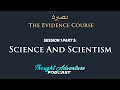

# Science and Scientism | The Evidence Course | Session 1 / Part 3 (2021-06-23)

## Description

Session 1 Part 3

In an age of information overload and widespread pseudo-intellectualism, understanding the core foundations of Islam is as essential as ever. 

This course comprehensively deconstructs the skeletal structure of prevalent ideologies and concepts such as atheism, scientism, materialism, secularism, and skepticism, in light of an all-encompassing intellectually robust Islamic worldview.

Thought Adventure Support
◄ PayPal - https://www.paypal.com/donate/?hosted_button_id=6KZWK75RB23RN 
◄ YouTube - https://www.youtube.com/c/ThoughtAdventurePodcast/join
◄ PATREON - https://www.patreon.com/thoughtadventurepodcast
____________________________________________________________________

Thought Adventure Social Media
◄ Twitter: https://twitter.com/T_A_Podcast​​ [@T_A_Podcast]
◄ Clubhouse https://www.clubhouse.com/club/thought-adventure-podcast
◄ Spotify: https://open.spotify.com/show/7x4UVfTz9QX8KVdEXquDUC
◄ Facebook: https://m.facebook.com/ThoughtAdventurePodcast
◄ Instagram: https://www.instagram.com/ThoughtAdventurePodcast​

----------------------------------------------------------------

*The Hosts:*
----------------------|
Jake Brancatella, The Muslim Metaphysician

- Youtube: https://www.youtube.com/channel/UCcGQRfTPNyHlXMqckvz2uqQ
- Twitter:  https://twitter.com/MMetaphysician​​ [@MMetaphysician]

----------------------|

Yusuf Ponders, The Pondering Soul

- Youtube: https://www.youtube.com/channel/UCsiDDxy0JXLqM6HBA0MA4NA
- Twitter: https://twitter.com/YusufPonders​​ [@YusufPonders]
- Facebook: https://www.facebook.com/yusufponders​ [@yusufpodners]

----------------------|

Sharif

- Twitter: https://twitter.com/sharifhafezi​​ [@sharifhafezi]

----------------------|

Abdulrahman

- Twitter: https://twitter.com/abdul_now​ [@abdul_now]

----------------------|

Admin

Riyad 
Gmail: hello.tapodcast@gmail.com

## Summary of [Science and Scientism | The Evidence Course | Session 1 / Part 3](https://www.youtube.com/watch?v=twjPt1cOHKE)

*This summary is AI generated - there may be inaccuracies. *

### [00:00:00](https://www.youtube.com/watch?v=twjPt1cOHKE&t=0) - [00:25:00](https://www.youtube.com/watch?v=twjPt1cOHKE&t=1500)

 discusses how science and scientism are two different approaches to studying evidence. The first problem with scientism is that it is self-refuting, as stated by the examples given. The second problem is that certain things we are sure about without the use of science, like the existence of great grandmothers, are inductively derived.

**[00:00:00](https://www.youtube.com/watch?v=twjPt1cOHKE&t=0)* Discusses the Mona Lisa, which is one of the most expensive paintings in the world. The painting is studied using the scientific method, which allows for a high degree of certainty about the artist, the time period, and the location of the painting. However, questions about the painting's aesthetic reception and the experienc
* **[00:05:00](https://www.youtube.com/watch?v=twjPt1cOHKE&t=300)**  science and scientism are discussed. The first problem with this approach is that it's self-refuting, as stated by the examples given. The second problem is that certain things we are sure about without the use of science, like the existence of great grandmothers, are inductively derived.
* **[00:10:00](https://www.youtube.com/watch?v=twjPt1cOHKE&t=600)* Discusses the difference between induction and deduction. induction is a process where you go from the particular to the generalized, while deduction is the process of going from the general to a particular conclusion.  provides an example of induction and deduction in the context of a scientific theory, explaining that induction is possible but deduction is not, as the evidence set may not be exhaustive. Scientific theories cannot be certain, as they are based on incomplete evidence.
* **[00:15:00](https://www.youtube.com/watch?v=twjPt1cOHKE&t=900)** Karl Popper, an empiricist philosopher, discusses the inductive nature of science and the fact that causality cannot be proven. He states that a statement can only be said to be valid until evidence has falsified it.
* **[00:20:00](https://www.youtube.com/watch?v=twjPt1cOHKE&t=1200)* Discusses how science relies on assumptions, including the assumption that causality exists. It also discusses how, without causality, it would be impossible to know whether future events will resemble past experiences, and how science can only make assumptions about certain things. Finally, the video discusses the idea that, even if something does not fit within the scientific method, it can still be proven.
* **[00:25:00](https://www.youtube.com/watch?v=twjPt1cOHKE&t=1500)**  a course instructor discusses how rationality can be used to approach evidence for the belief in the creator.

<h2>Full transcript with timestamps: CLICK TO EXPAND</h2>

[0:00:15](https://youtu.be/twjPt1cOHKE?t=15) have a think about the famous painting  
[0:00:17](https://youtu.be/twjPt1cOHKE?t=17) called mona lisa  
[0:00:18](https://youtu.be/twjPt1cOHKE?t=18) and it's known throughout the world it's  
[0:00:20](https://youtu.be/twjPt1cOHKE?t=20) one of the most if not the  
[0:00:22](https://youtu.be/twjPt1cOHKE?t=22) most expensive painting in the world  
[0:00:25](https://youtu.be/twjPt1cOHKE?t=25) now let's approach our understanding of  
[0:00:28](https://youtu.be/twjPt1cOHKE?t=28) this painting of the mona lisa  
[0:00:30](https://youtu.be/twjPt1cOHKE?t=30) through using the scientific method what  
[0:00:34](https://youtu.be/twjPt1cOHKE?t=34) conclusions are we going to come to  
[0:00:35](https://youtu.be/twjPt1cOHKE?t=35) using the scientific method well as we  
[0:00:38](https://youtu.be/twjPt1cOHKE?t=38) mentioned the scientific method  
[0:00:40](https://youtu.be/twjPt1cOHKE?t=40) is really good at understanding the  
[0:00:42](https://youtu.be/twjPt1cOHKE?t=42) observable detestable and the repeatable  
[0:00:45](https://youtu.be/twjPt1cOHKE?t=45) so we can work out maybe what type of  
[0:00:48](https://youtu.be/twjPt1cOHKE?t=48) colors were used  
[0:00:49](https://youtu.be/twjPt1cOHKE?t=49) what was the composition of the paints  
[0:00:51](https://youtu.be/twjPt1cOHKE?t=51) what was the composition of the material  
[0:00:53](https://youtu.be/twjPt1cOHKE?t=53) that was used for the canvas  
[0:00:55](https://youtu.be/twjPt1cOHKE?t=55) or even the frame these are things  
[0:00:57](https://youtu.be/twjPt1cOHKE?t=57) within our direct  
[0:00:59](https://youtu.be/twjPt1cOHKE?t=59) observation within the experimental  
[0:01:01](https://youtu.be/twjPt1cOHKE?t=61) field  
[0:01:02](https://youtu.be/twjPt1cOHKE?t=62) but we have to ask ourselves the  
[0:01:04](https://youtu.be/twjPt1cOHKE?t=64) question what's outside  
[0:01:06](https://youtu.be/twjPt1cOHKE?t=66) of the scientific method what's outside  
[0:01:08](https://youtu.be/twjPt1cOHKE?t=68) of the experimental field  
[0:01:10](https://youtu.be/twjPt1cOHKE?t=70) and therefore the empirical approach the  
[0:01:13](https://youtu.be/twjPt1cOHKE?t=73) obvious question  
[0:01:15](https://youtu.be/twjPt1cOHKE?t=75) is the painter science although  
[0:01:18](https://youtu.be/twjPt1cOHKE?t=78) incredibly useful  
[0:01:20](https://youtu.be/twjPt1cOHKE?t=80) when it comes to those things which are  
[0:01:21](https://youtu.be/twjPt1cOHKE?t=81) directly sensible and testable and  
[0:01:23](https://youtu.be/twjPt1cOHKE?t=83) repeatable  
[0:01:25](https://youtu.be/twjPt1cOHKE?t=85) cannot be used to determine matters  
[0:01:27](https://youtu.be/twjPt1cOHKE?t=87) which are outside of its scope  
[0:01:30](https://youtu.be/twjPt1cOHKE?t=90) and the directly observable and the  
[0:01:32](https://youtu.be/twjPt1cOHKE?t=92) directly sensible  
[0:01:34](https://youtu.be/twjPt1cOHKE?t=94) does that mean that because we can't  
[0:01:36](https://youtu.be/twjPt1cOHKE?t=96) prove it for a scientific approach  
[0:01:39](https://youtu.be/twjPt1cOHKE?t=99) that the painter does not exist  
[0:01:42](https://youtu.be/twjPt1cOHKE?t=102) obviously the painter exists in fact we  
[0:01:44](https://youtu.be/twjPt1cOHKE?t=104) know  
[0:01:45](https://youtu.be/twjPt1cOHKE?t=105) who that painter is of the mona lisa  
[0:01:47](https://youtu.be/twjPt1cOHKE?t=107) it's leonardo da vinci  
[0:01:49](https://youtu.be/twjPt1cOHKE?t=109) at the beginning of the 16th century in  
[0:01:51](https://youtu.be/twjPt1cOHKE?t=111) fact  
[0:01:52](https://youtu.be/twjPt1cOHKE?t=112) all of this we know with a high degree  
[0:01:55](https://youtu.be/twjPt1cOHKE?t=115) of certainty i  
[0:01:56](https://youtu.be/twjPt1cOHKE?t=116) who the person was and roughly or quite  
[0:01:59](https://youtu.be/twjPt1cOHKE?t=119) you know confidently  
[0:02:00](https://youtu.be/twjPt1cOHKE?t=120) when it was which period of time at  
[0:02:03](https://youtu.be/twjPt1cOHKE?t=123) least which century it took place  
[0:02:05](https://youtu.be/twjPt1cOHKE?t=125) and all of these answers that we can  
[0:02:07](https://youtu.be/twjPt1cOHKE?t=127) understand with a high degree of  
[0:02:09](https://youtu.be/twjPt1cOHKE?t=129) certainty  
[0:02:10](https://youtu.be/twjPt1cOHKE?t=130) comes outside of experimentation and the  
[0:02:12](https://youtu.be/twjPt1cOHKE?t=132) scientific method  
[0:02:15](https://youtu.be/twjPt1cOHKE?t=135) similarly when we look at the painting  
[0:02:18](https://youtu.be/twjPt1cOHKE?t=138) and maybe some people might say it's  
[0:02:19](https://youtu.be/twjPt1cOHKE?t=139) beautiful  
[0:02:20](https://youtu.be/twjPt1cOHKE?t=140) exquisite other people might say oh it's  
[0:02:22](https://youtu.be/twjPt1cOHKE?t=142) ugly i  
[0:02:23](https://youtu.be/twjPt1cOHKE?t=143) what is our aesthetic reception for this  
[0:02:26](https://youtu.be/twjPt1cOHKE?t=146) particular painting  
[0:02:28](https://youtu.be/twjPt1cOHKE?t=148) does it move us to emotion and what type  
[0:02:31](https://youtu.be/twjPt1cOHKE?t=151) of emotion  
[0:02:32](https://youtu.be/twjPt1cOHKE?t=152) these questions again are outside of  
[0:02:36](https://youtu.be/twjPt1cOHKE?t=156) science yeah it doesn't mean that we  
[0:02:38](https://youtu.be/twjPt1cOHKE?t=158) don't have  
[0:02:39](https://youtu.be/twjPt1cOHKE?t=159) emotions that we don't have an  
[0:02:41](https://youtu.be/twjPt1cOHKE?t=161) appreciation of what we think is  
[0:02:42](https://youtu.be/twjPt1cOHKE?t=162) beautiful or what we think is  
[0:02:44](https://youtu.be/twjPt1cOHKE?t=164) ugly and that's you know and some people  
[0:02:47](https://youtu.be/twjPt1cOHKE?t=167) might say well  
[0:02:48](https://youtu.be/twjPt1cOHKE?t=168) maybe we can through science maybe we  
[0:02:51](https://youtu.be/twjPt1cOHKE?t=171) can  
[0:02:52](https://youtu.be/twjPt1cOHKE?t=172) you know look at a brain scan and look  
[0:02:54](https://youtu.be/twjPt1cOHKE?t=174) at regions of the brain that are being  
[0:02:55](https://youtu.be/twjPt1cOHKE?t=175) highlighted  
[0:02:56](https://youtu.be/twjPt1cOHKE?t=176) but just simply highlighting regions of  
[0:02:59](https://youtu.be/twjPt1cOHKE?t=179) the brain  
[0:03:00](https://youtu.be/twjPt1cOHKE?t=180) doesn't say what type of emotions all  
[0:03:03](https://youtu.be/twjPt1cOHKE?t=183) more importantly the experience of that  
[0:03:06](https://youtu.be/twjPt1cOHKE?t=186) emotions  
[0:03:07](https://youtu.be/twjPt1cOHKE?t=187) because the experience of emotions is  
[0:03:09](https://youtu.be/twjPt1cOHKE?t=189) very personal  
[0:03:10](https://youtu.be/twjPt1cOHKE?t=190) to each individual and this comes to  
[0:03:12](https://youtu.be/twjPt1cOHKE?t=192) another question  
[0:03:14](https://youtu.be/twjPt1cOHKE?t=194) with regards to consciousness how do you  
[0:03:16](https://youtu.be/twjPt1cOHKE?t=196) know  
[0:03:17](https://youtu.be/twjPt1cOHKE?t=197) that i am a conscious being do you know  
[0:03:20](https://youtu.be/twjPt1cOHKE?t=200) it  
[0:03:21](https://youtu.be/twjPt1cOHKE?t=201) by simply studying the science of my  
[0:03:23](https://youtu.be/twjPt1cOHKE?t=203) brain activity  
[0:03:25](https://youtu.be/twjPt1cOHKE?t=205) if you haven't studied my brain activity  
[0:03:27](https://youtu.be/twjPt1cOHKE?t=207) does that mean  
[0:03:28](https://youtu.be/twjPt1cOHKE?t=208) that you are unsure whether i'm a  
[0:03:30](https://youtu.be/twjPt1cOHKE?t=210) conscious being or not  
[0:03:33](https://youtu.be/twjPt1cOHKE?t=213) in fact some people might say okay not  
[0:03:34](https://youtu.be/twjPt1cOHKE?t=214) only can we do brain scans  
[0:03:37](https://youtu.be/twjPt1cOHKE?t=217) but also we can look at action  
[0:03:38](https://youtu.be/twjPt1cOHKE?t=218) potentials of neurons these are  
[0:03:40](https://youtu.be/twjPt1cOHKE?t=220) electrical signals that travel across  
[0:03:42](https://youtu.be/twjPt1cOHKE?t=222) the neurons of the brain  
[0:03:44](https://youtu.be/twjPt1cOHKE?t=224) or that we can you know understand  
[0:03:48](https://youtu.be/twjPt1cOHKE?t=228) and test what type of chemicals are  
[0:03:50](https://youtu.be/twjPt1cOHKE?t=230) being released at the presynaptic neuro  
[0:03:52](https://youtu.be/twjPt1cOHKE?t=232) known as trans neurotransmitters  
[0:03:56](https://youtu.be/twjPt1cOHKE?t=236) yet none of this explains what it means  
[0:03:58](https://youtu.be/twjPt1cOHKE?t=238) to be me  
[0:04:00](https://youtu.be/twjPt1cOHKE?t=240) what it means to experience something  
[0:04:02](https://youtu.be/twjPt1cOHKE?t=242) whether that's a painting  
[0:04:04](https://youtu.be/twjPt1cOHKE?t=244) whether that's poetry or something else  
[0:04:07](https://youtu.be/twjPt1cOHKE?t=247) i  
[0:04:07](https://youtu.be/twjPt1cOHKE?t=247) what it feels to be consciously aware  
[0:04:11](https://youtu.be/twjPt1cOHKE?t=251) many scientists and philosophers are  
[0:04:14](https://youtu.be/twjPt1cOHKE?t=254) aware of this problem of consciousness  
[0:04:16](https://youtu.be/twjPt1cOHKE?t=256) even just how to define what the term  
[0:04:19](https://youtu.be/twjPt1cOHKE?t=259) consciousness is  
[0:04:20](https://youtu.be/twjPt1cOHKE?t=260) from a purely materialistic explanation  
[0:04:23](https://youtu.be/twjPt1cOHKE?t=263) this is why they call it  
[0:04:24](https://youtu.be/twjPt1cOHKE?t=264) the hard problem of science  
[0:04:26](https://youtu.be/twjPt1cOHKE?t=266) consciousness being the hard problem of  
[0:04:28](https://youtu.be/twjPt1cOHKE?t=268) science  
[0:04:29](https://youtu.be/twjPt1cOHKE?t=269) and some might say well you know in the  
[0:04:31](https://youtu.be/twjPt1cOHKE?t=271) future  
[0:04:32](https://youtu.be/twjPt1cOHKE?t=272) we will work it out we will be able to  
[0:04:34](https://youtu.be/twjPt1cOHKE?t=274) define  
[0:04:36](https://youtu.be/twjPt1cOHKE?t=276) through the use of empiricism and  
[0:04:38](https://youtu.be/twjPt1cOHKE?t=278) science that consciousness exists  
[0:04:42](https://youtu.be/twjPt1cOHKE?t=282) that will be able to determine that a  
[0:04:44](https://youtu.be/twjPt1cOHKE?t=284) person is conscious  
[0:04:45](https://youtu.be/twjPt1cOHKE?t=285) or not you know in terms of and what it  
[0:04:48](https://youtu.be/twjPt1cOHKE?t=288) means to be conscious for that  
[0:04:49](https://youtu.be/twjPt1cOHKE?t=289) individual  
[0:04:51](https://youtu.be/twjPt1cOHKE?t=291) but even if they say in the future we'll  
[0:04:53](https://youtu.be/twjPt1cOHKE?t=293) be able to determine this  
[0:04:55](https://youtu.be/twjPt1cOHKE?t=295) it doesn't deny the fact that we can be  
[0:04:58](https://youtu.be/twjPt1cOHKE?t=298) sure to now and understand and  
[0:05:00](https://youtu.be/twjPt1cOHKE?t=300) comprehend now  
[0:05:01](https://youtu.be/twjPt1cOHKE?t=301) that a person is conscious or not  
[0:05:03](https://youtu.be/twjPt1cOHKE?t=303) hopefully you're still conscious  
[0:05:05](https://youtu.be/twjPt1cOHKE?t=305) uh watching these videos so  
[0:05:09](https://youtu.be/twjPt1cOHKE?t=309) whether we look at the painting example  
[0:05:11](https://youtu.be/twjPt1cOHKE?t=311) whether we look at the consciousness  
[0:05:13](https://youtu.be/twjPt1cOHKE?t=313) example  
[0:05:14](https://youtu.be/twjPt1cOHKE?t=314) these are two relatively simple examples  
[0:05:17](https://youtu.be/twjPt1cOHKE?t=317) that demonstrated the limited  
[0:05:18](https://youtu.be/twjPt1cOHKE?t=318) applicability of science  
[0:05:21](https://youtu.be/twjPt1cOHKE?t=321) that is not to say that science isn't a  
[0:05:23](https://youtu.be/twjPt1cOHKE?t=323) useful tool  
[0:05:24](https://youtu.be/twjPt1cOHKE?t=324) and like i said you know it's been very  
[0:05:26](https://youtu.be/twjPt1cOHKE?t=326) useful it's helped us develop medicine  
[0:05:29](https://youtu.be/twjPt1cOHKE?t=329) surgery space travel telecommunications  
[0:05:32](https://youtu.be/twjPt1cOHKE?t=332) but rather and also it was utilized by  
[0:05:35](https://youtu.be/twjPt1cOHKE?t=335) the muslims of the past as well  
[0:05:36](https://youtu.be/twjPt1cOHKE?t=336) famous muslim scientists including  
[0:05:39](https://youtu.be/twjPt1cOHKE?t=339) people who say  
[0:05:40](https://youtu.be/twjPt1cOHKE?t=340) that ibn haitham the famous muslim  
[0:05:42](https://youtu.be/twjPt1cOHKE?t=342) scientists of the past  
[0:05:44](https://youtu.be/twjPt1cOHKE?t=344) helped create in part or help formulate  
[0:05:47](https://youtu.be/twjPt1cOHKE?t=347) in part the scientific method but the  
[0:05:50](https://youtu.be/twjPt1cOHKE?t=350) problem  
[0:05:51](https://youtu.be/twjPt1cOHKE?t=351) now is not the fact that people are  
[0:05:53](https://youtu.be/twjPt1cOHKE?t=353) using science  
[0:05:54](https://youtu.be/twjPt1cOHKE?t=354) it's the fact that they approach all  
[0:05:57](https://youtu.be/twjPt1cOHKE?t=357) questions with the use of science  
[0:05:59](https://youtu.be/twjPt1cOHKE?t=359) and claim that anything that's not  
[0:06:01](https://youtu.be/twjPt1cOHKE?t=361) scientific  
[0:06:03](https://youtu.be/twjPt1cOHKE?t=363) and empirically verifiable is therefore  
[0:06:06](https://youtu.be/twjPt1cOHKE?t=366) unprovable untestable or  
[0:06:10](https://youtu.be/twjPt1cOHKE?t=370) doesn't exist and this is what we call  
[0:06:13](https://youtu.be/twjPt1cOHKE?t=373) scientism  
[0:06:15](https://youtu.be/twjPt1cOHKE?t=375) in one definition it's described as  
[0:06:18](https://youtu.be/twjPt1cOHKE?t=378) totalizing the view of science  
[0:06:20](https://youtu.be/twjPt1cOHKE?t=380) as if it were capable of describing all  
[0:06:22](https://youtu.be/twjPt1cOHKE?t=382) reality  
[0:06:23](https://youtu.be/twjPt1cOHKE?t=383) and knowledge or as if it were the only  
[0:06:26](https://youtu.be/twjPt1cOHKE?t=386) true way  
[0:06:27](https://youtu.be/twjPt1cOHKE?t=387) to acquire knowledge about reality and  
[0:06:29](https://youtu.be/twjPt1cOHKE?t=389) the nature of things  
[0:06:31](https://youtu.be/twjPt1cOHKE?t=391) so statements like science is the only  
[0:06:33](https://youtu.be/twjPt1cOHKE?t=393) way to know truth  
[0:06:35](https://youtu.be/twjPt1cOHKE?t=395) or science will answer all questions  
[0:06:38](https://youtu.be/twjPt1cOHKE?t=398) these statements  
[0:06:39](https://youtu.be/twjPt1cOHKE?t=399) are actually non-scientific statements  
[0:06:43](https://youtu.be/twjPt1cOHKE?t=403) i want you to follow this point when a  
[0:06:45](https://youtu.be/twjPt1cOHKE?t=405) person turns around and says  
[0:06:47](https://youtu.be/twjPt1cOHKE?t=407) all answers or all ideas are derived  
[0:06:50](https://youtu.be/twjPt1cOHKE?t=410) from science all science will answer all  
[0:06:52](https://youtu.be/twjPt1cOHKE?t=412) questions  
[0:06:53](https://youtu.be/twjPt1cOHKE?t=413) is that a testifiable scientific  
[0:06:57](https://youtu.be/twjPt1cOHKE?t=417) you know statement so are they using  
[0:06:59](https://youtu.be/twjPt1cOHKE?t=419) science to justify science  
[0:07:01](https://youtu.be/twjPt1cOHKE?t=421) if they are then it's a circular  
[0:07:03](https://youtu.be/twjPt1cOHKE?t=423) argument what we term tautology  
[0:07:06](https://youtu.be/twjPt1cOHKE?t=426) so these are non-scientific statements  
[0:07:09](https://youtu.be/twjPt1cOHKE?t=429) they are better known as  
[0:07:10](https://youtu.be/twjPt1cOHKE?t=430) metaphysical statements statements that  
[0:07:13](https://youtu.be/twjPt1cOHKE?t=433) are accepted or assumed  
[0:07:15](https://youtu.be/twjPt1cOHKE?t=435) to be true so in essence  
[0:07:18](https://youtu.be/twjPt1cOHKE?t=438) when a person says that only science can  
[0:07:21](https://youtu.be/twjPt1cOHKE?t=441) answer all questions  
[0:07:23](https://youtu.be/twjPt1cOHKE?t=443) that's actually a self-refuting argument  
[0:07:26](https://youtu.be/twjPt1cOHKE?t=446) yeah and that's the first problem with  
[0:07:28](https://youtu.be/twjPt1cOHKE?t=448) this approach with  
[0:07:28](https://youtu.be/twjPt1cOHKE?t=448) scientism the second problem as we've  
[0:07:31](https://youtu.be/twjPt1cOHKE?t=451) described in the examples above  
[0:07:34](https://youtu.be/twjPt1cOHKE?t=454) is that we know certain things and and  
[0:07:37](https://youtu.be/twjPt1cOHKE?t=457) are very sure about these things  
[0:07:39](https://youtu.be/twjPt1cOHKE?t=459) but without the scientific method like  
[0:07:42](https://youtu.be/twjPt1cOHKE?t=462) for example  
[0:07:43](https://youtu.be/twjPt1cOHKE?t=463) you know if i was to ask the question do  
[0:07:45](https://youtu.be/twjPt1cOHKE?t=465) you believe that your great  
[0:07:47](https://youtu.be/twjPt1cOHKE?t=467) great great great great great great  
[0:07:50](https://youtu.be/twjPt1cOHKE?t=470) grandmother  
[0:07:51](https://youtu.be/twjPt1cOHKE?t=471) existed everybody will say yes  
[0:07:54](https://youtu.be/twjPt1cOHKE?t=474) irrespective of whether we knew who that  
[0:07:56](https://youtu.be/twjPt1cOHKE?t=476) great great great great  
[0:07:58](https://youtu.be/twjPt1cOHKE?t=478) great grandmother was irrespective if we  
[0:08:01](https://youtu.be/twjPt1cOHKE?t=481) had a number of people claiming to be or  
[0:08:03](https://youtu.be/twjPt1cOHKE?t=483) potentially could be our great great  
[0:08:05](https://youtu.be/twjPt1cOHKE?t=485) great great grandmother  
[0:08:07](https://youtu.be/twjPt1cOHKE?t=487) irrespective whether we even you know  
[0:08:09](https://youtu.be/twjPt1cOHKE?t=489) have a grave to test  
[0:08:10](https://youtu.be/twjPt1cOHKE?t=490) the dna in order to determine this so  
[0:08:13](https://youtu.be/twjPt1cOHKE?t=493) irrespective of any scientific arguments  
[0:08:15](https://youtu.be/twjPt1cOHKE?t=495) to justify this  
[0:08:16](https://youtu.be/twjPt1cOHKE?t=496) great great great great great  
[0:08:18](https://youtu.be/twjPt1cOHKE?t=498) grandmother existence  
[0:08:20](https://youtu.be/twjPt1cOHKE?t=500) we know we had one so again it proves  
[0:08:23](https://youtu.be/twjPt1cOHKE?t=503) this point which is that  
[0:08:24](https://youtu.be/twjPt1cOHKE?t=504) there are certain things we are 100 sure  
[0:08:27](https://youtu.be/twjPt1cOHKE?t=507) about without the use of science  
[0:08:31](https://youtu.be/twjPt1cOHKE?t=511) furthermore the scientific method in the  
[0:08:33](https://youtu.be/twjPt1cOHKE?t=513) vast majority of cases  
[0:08:35](https://youtu.be/twjPt1cOHKE?t=515) leads to what we term inductive  
[0:08:37](https://youtu.be/twjPt1cOHKE?t=517) conclusions  
[0:08:38](https://youtu.be/twjPt1cOHKE?t=518) and i think we need to explain what  
[0:08:40](https://youtu.be/twjPt1cOHKE?t=520) induction means here  
[0:08:42](https://youtu.be/twjPt1cOHKE?t=522) but just before i do i believe it's also  
[0:08:44](https://youtu.be/twjPt1cOHKE?t=524) important to explain  
[0:08:46](https://youtu.be/twjPt1cOHKE?t=526) and gain a bit more crystal  
[0:08:47](https://youtu.be/twjPt1cOHKE?t=527) understanding of what exactly we mean by  
[0:08:50](https://youtu.be/twjPt1cOHKE?t=530) the scientific method  
[0:08:52](https://youtu.be/twjPt1cOHKE?t=532) now if we cast our minds back to when  
[0:08:54](https://youtu.be/twjPt1cOHKE?t=534) we're at school  
[0:08:55](https://youtu.be/twjPt1cOHKE?t=535) or maybe those people do science at  
[0:08:57](https://youtu.be/twjPt1cOHKE?t=537) university  
[0:08:59](https://youtu.be/twjPt1cOHKE?t=539) and we were asked to write up a  
[0:09:01](https://youtu.be/twjPt1cOHKE?t=541) scientific experiment  
[0:09:03](https://youtu.be/twjPt1cOHKE?t=543) then there was a very specific way in  
[0:09:06](https://youtu.be/twjPt1cOHKE?t=546) how this scientific experiment had to be  
[0:09:08](https://youtu.be/twjPt1cOHKE?t=548) written up  
[0:09:09](https://youtu.be/twjPt1cOHKE?t=549) and this is called the scientific method  
[0:09:12](https://youtu.be/twjPt1cOHKE?t=552) and that is  
[0:09:13](https://youtu.be/twjPt1cOHKE?t=553) you would have an aim you would have a  
[0:09:15](https://youtu.be/twjPt1cOHKE?t=555) method  
[0:09:16](https://youtu.be/twjPt1cOHKE?t=556) you would have results and you'd also  
[0:09:19](https://youtu.be/twjPt1cOHKE?t=559) have a conclusion  
[0:09:21](https://youtu.be/twjPt1cOHKE?t=561) so what was the aim the aim identified  
[0:09:23](https://youtu.be/twjPt1cOHKE?t=563) the purpose of the experiment  
[0:09:26](https://youtu.be/twjPt1cOHKE?t=566) what you wanted to find out the aim also  
[0:09:29](https://youtu.be/twjPt1cOHKE?t=569) may have included a hypothesis  
[0:09:31](https://youtu.be/twjPt1cOHKE?t=571) you know what you may see and also the  
[0:09:34](https://youtu.be/twjPt1cOHKE?t=574) aim defined for  
[0:09:36](https://youtu.be/twjPt1cOHKE?t=576) us what variables we were looking to  
[0:09:38](https://youtu.be/twjPt1cOHKE?t=578) test  
[0:09:39](https://youtu.be/twjPt1cOHKE?t=579) the method the method was explaining  
[0:09:42](https://youtu.be/twjPt1cOHKE?t=582) how we isolated the various variables  
[0:09:46](https://youtu.be/twjPt1cOHKE?t=586) and what conditions and causes we  
[0:09:48](https://youtu.be/twjPt1cOHKE?t=588) subjected them to  
[0:09:50](https://youtu.be/twjPt1cOHKE?t=590) or we observed them in what types of  
[0:09:52](https://youtu.be/twjPt1cOHKE?t=592) conditions  
[0:09:53](https://youtu.be/twjPt1cOHKE?t=593) the results was the data we obtained  
[0:09:56](https://youtu.be/twjPt1cOHKE?t=596) from this experiment  
[0:09:57](https://youtu.be/twjPt1cOHKE?t=597) yeah or these observations and the  
[0:10:00](https://youtu.be/twjPt1cOHKE?t=600) conclusion  
[0:10:01](https://youtu.be/twjPt1cOHKE?t=601) was an understanding of what that  
[0:10:03](https://youtu.be/twjPt1cOHKE?t=603) relationship was between our observation  
[0:10:06](https://youtu.be/twjPt1cOHKE?t=606) and the results and whether this  
[0:10:08](https://youtu.be/twjPt1cOHKE?t=608) confirmed our hypothesis  
[0:10:11](https://youtu.be/twjPt1cOHKE?t=611) or denied our hypothesis now it sounds a  
[0:10:14](https://youtu.be/twjPt1cOHKE?t=614) bit complicated but let me break it down  
[0:10:15](https://youtu.be/twjPt1cOHKE?t=615) even further  
[0:10:16](https://youtu.be/twjPt1cOHKE?t=616) imagine if we were to do an experiment  
[0:10:18](https://youtu.be/twjPt1cOHKE?t=618) and talk about maybe the boiling point  
[0:10:20](https://youtu.be/twjPt1cOHKE?t=620) of water  
[0:10:20](https://youtu.be/twjPt1cOHKE?t=620) very simple experiment we all know what  
[0:10:22](https://youtu.be/twjPt1cOHKE?t=622) the boiling point of water is but let's  
[0:10:23](https://youtu.be/twjPt1cOHKE?t=623) say  
[0:10:24](https://youtu.be/twjPt1cOHKE?t=624) we wanted to prove this point so we  
[0:10:27](https://youtu.be/twjPt1cOHKE?t=627) would  
[0:10:27](https://youtu.be/twjPt1cOHKE?t=627) define you know in our aim that we want  
[0:10:30](https://youtu.be/twjPt1cOHKE?t=630) to look at the boiling point of water  
[0:10:32](https://youtu.be/twjPt1cOHKE?t=632) we would define in our method the method  
[0:10:34](https://youtu.be/twjPt1cOHKE?t=634) of  
[0:10:35](https://youtu.be/twjPt1cOHKE?t=635) achieving this so we'd say we'll take  
[0:10:38](https://youtu.be/twjPt1cOHKE?t=638) pure water  
[0:10:39](https://youtu.be/twjPt1cOHKE?t=639) at room conditions at one atmosphere  
[0:10:42](https://youtu.be/twjPt1cOHKE?t=642) we will subject it to heat using maybe a  
[0:10:45](https://youtu.be/twjPt1cOHKE?t=645) bunsen burner  
[0:10:46](https://youtu.be/twjPt1cOHKE?t=646) and we'll record the temperature with a  
[0:10:48](https://youtu.be/twjPt1cOHKE?t=648) thermometer  
[0:10:49](https://youtu.be/twjPt1cOHKE?t=649) and then we would record and we would do  
[0:10:52](https://youtu.be/twjPt1cOHKE?t=652) this experiment where we  
[0:10:54](https://youtu.be/twjPt1cOHKE?t=654) heated the water up and record that it  
[0:10:57](https://youtu.be/twjPt1cOHKE?t=657) boiled at 100 degrees celsius  
[0:10:59](https://youtu.be/twjPt1cOHKE?t=659) we would then test it and repeat it so  
[0:11:01](https://youtu.be/twjPt1cOHKE?t=661) we would repeat this process  
[0:11:03](https://youtu.be/twjPt1cOHKE?t=663) in order to get maybe further  
[0:11:05](https://youtu.be/twjPt1cOHKE?t=665) confirmations that could have been  
[0:11:06](https://youtu.be/twjPt1cOHKE?t=666) a uh you know an  
[0:11:10](https://youtu.be/twjPt1cOHKE?t=670) incorrect or an abnormal reading so we  
[0:11:12](https://youtu.be/twjPt1cOHKE?t=672) want to test it so we test it again  
[0:11:14](https://youtu.be/twjPt1cOHKE?t=674) and maybe after the fifth time we find  
[0:11:17](https://youtu.be/twjPt1cOHKE?t=677) that water balls at 100 degrees celsius  
[0:11:19](https://youtu.be/twjPt1cOHKE?t=679) we can say okay in our conclusions  
[0:11:22](https://youtu.be/twjPt1cOHKE?t=682) we can say that when we subjected water  
[0:11:26](https://youtu.be/twjPt1cOHKE?t=686) to heat we found that it boiled at 100  
[0:11:29](https://youtu.be/twjPt1cOHKE?t=689) degrees celsius this is our conclusion  
[0:11:32](https://youtu.be/twjPt1cOHKE?t=692) now that conclusion  
[0:11:35](https://youtu.be/twjPt1cOHKE?t=695) on the issue of water is what we call  
[0:11:38](https://youtu.be/twjPt1cOHKE?t=698) an induced conclusion or inductive  
[0:11:41](https://youtu.be/twjPt1cOHKE?t=701) process or inductive conclusion  
[0:11:43](https://youtu.be/twjPt1cOHKE?t=703) so let us explain what do we mean by  
[0:11:45](https://youtu.be/twjPt1cOHKE?t=705) induction and the opposite of that or  
[0:11:47](https://youtu.be/twjPt1cOHKE?t=707) the  
[0:11:48](https://youtu.be/twjPt1cOHKE?t=708) the other aspect of that is called  
[0:11:50](https://youtu.be/twjPt1cOHKE?t=710) deduction  
[0:11:51](https://youtu.be/twjPt1cOHKE?t=711) so induction is understood where you go  
[0:11:54](https://youtu.be/twjPt1cOHKE?t=714) from the particular  
[0:11:56](https://youtu.be/twjPt1cOHKE?t=716) to the generalized give you a very  
[0:11:59](https://youtu.be/twjPt1cOHKE?t=719) famous example example that's always  
[0:12:00](https://youtu.be/twjPt1cOHKE?t=720) found in all different books  
[0:12:02](https://youtu.be/twjPt1cOHKE?t=722) where it talks about induction is the  
[0:12:04](https://youtu.be/twjPt1cOHKE?t=724) example of  
[0:12:05](https://youtu.be/twjPt1cOHKE?t=725) swans what color of swans  
[0:12:08](https://youtu.be/twjPt1cOHKE?t=728) so maybe you go out and you'll see once  
[0:12:10](https://youtu.be/twjPt1cOHKE?t=730) one  
[0:12:11](https://youtu.be/twjPt1cOHKE?t=731) two swans three swans 999 swans and all  
[0:12:16](https://youtu.be/twjPt1cOHKE?t=736) of them  
[0:12:17](https://youtu.be/twjPt1cOHKE?t=737) 999 were all white so you took  
[0:12:20](https://youtu.be/twjPt1cOHKE?t=740) particular  
[0:12:21](https://youtu.be/twjPt1cOHKE?t=741) observations and then you said as your  
[0:12:24](https://youtu.be/twjPt1cOHKE?t=744) conclusion  
[0:12:25](https://youtu.be/twjPt1cOHKE?t=745) all swans are white so going from the  
[0:12:28](https://youtu.be/twjPt1cOHKE?t=748) particular to the generalized  
[0:12:31](https://youtu.be/twjPt1cOHKE?t=751) but what about the one thousandths one  
[0:12:35](https://youtu.be/twjPt1cOHKE?t=755) yeah maybe you come across later on your  
[0:12:36](https://youtu.be/twjPt1cOHKE?t=756) on a you know another swan a thousand  
[0:12:39](https://youtu.be/twjPt1cOHKE?t=759) swan  
[0:12:39](https://youtu.be/twjPt1cOHKE?t=759) and you find it's black so what you find  
[0:12:43](https://youtu.be/twjPt1cOHKE?t=763) with the problem with induction  
[0:12:45](https://youtu.be/twjPt1cOHKE?t=765) is that induction when you go from  
[0:12:46](https://youtu.be/twjPt1cOHKE?t=766) particular  
[0:12:48](https://youtu.be/twjPt1cOHKE?t=768) to to the general there may be some  
[0:12:51](https://youtu.be/twjPt1cOHKE?t=771) evidence that you are unaware of there  
[0:12:53](https://youtu.be/twjPt1cOHKE?t=773) may be some observation that you've not  
[0:12:55](https://youtu.be/twjPt1cOHKE?t=775) come across  
[0:12:56](https://youtu.be/twjPt1cOHKE?t=776) which therefore defeats or undermines  
[0:13:00](https://youtu.be/twjPt1cOHKE?t=780) the whole of your conclusion  
[0:13:01](https://youtu.be/twjPt1cOHKE?t=781) so scientific theories or even when  
[0:13:05](https://youtu.be/twjPt1cOHKE?t=785) people turn around and say talk about  
[0:13:06](https://youtu.be/twjPt1cOHKE?t=786) scientific facts  
[0:13:07](https://youtu.be/twjPt1cOHKE?t=787) are not really facts per se they're not  
[0:13:10](https://youtu.be/twjPt1cOHKE?t=790) hundred percent  
[0:13:11](https://youtu.be/twjPt1cOHKE?t=791) but rather they are induced they are  
[0:13:13](https://youtu.be/twjPt1cOHKE?t=793) things which are  
[0:13:15](https://youtu.be/twjPt1cOHKE?t=795) uh you know based upon uh  
[0:13:19](https://youtu.be/twjPt1cOHKE?t=799) may be true or valid based upon the  
[0:13:21](https://youtu.be/twjPt1cOHKE?t=801) current data set  
[0:13:22](https://youtu.be/twjPt1cOHKE?t=802) that you have deduction works the other  
[0:13:25](https://youtu.be/twjPt1cOHKE?t=805) way around  
[0:13:26](https://youtu.be/twjPt1cOHKE?t=806) deduction is when you go to from the  
[0:13:27](https://youtu.be/twjPt1cOHKE?t=807) general and you come to a particular  
[0:13:29](https://youtu.be/twjPt1cOHKE?t=809) conclusion  
[0:13:30](https://youtu.be/twjPt1cOHKE?t=810) so again the famous example is all men  
[0:13:33](https://youtu.be/twjPt1cOHKE?t=813) are mortal  
[0:13:34](https://youtu.be/twjPt1cOHKE?t=814) general statement socrates is a man  
[0:13:38](https://youtu.be/twjPt1cOHKE?t=818) therefore socrates is mortal so you've  
[0:13:42](https://youtu.be/twjPt1cOHKE?t=822) gone from the general  
[0:13:43](https://youtu.be/twjPt1cOHKE?t=823) or men immortal to a specific conclusion  
[0:13:46](https://youtu.be/twjPt1cOHKE?t=826) socrates is therefore  
[0:13:47](https://youtu.be/twjPt1cOHKE?t=827) mortal so this would what we call a  
[0:13:50](https://youtu.be/twjPt1cOHKE?t=830) deduction  
[0:13:52](https://youtu.be/twjPt1cOHKE?t=832) so with regards to the issue of the  
[0:13:53](https://youtu.be/twjPt1cOHKE?t=833) water boiling  
[0:13:55](https://youtu.be/twjPt1cOHKE?t=835) how do we know that the water boils at  
[0:13:57](https://youtu.be/twjPt1cOHKE?t=837) 100 degrees celsius  
[0:13:59](https://youtu.be/twjPt1cOHKE?t=839) as a generalized statement based upon  
[0:14:02](https://youtu.be/twjPt1cOHKE?t=842) four observations  
[0:14:03](https://youtu.be/twjPt1cOHKE?t=843) even if we you know say a thousand  
[0:14:06](https://youtu.be/twjPt1cOHKE?t=846) observations  
[0:14:07](https://youtu.be/twjPt1cOHKE?t=847) or a million observations how do we know  
[0:14:10](https://youtu.be/twjPt1cOHKE?t=850) the one millionth  
[0:14:11](https://youtu.be/twjPt1cOHKE?t=851) and one time when we observe water  
[0:14:14](https://youtu.be/twjPt1cOHKE?t=854) actually boils different that's because  
[0:14:17](https://youtu.be/twjPt1cOHKE?t=857) whenever we say a statement like all  
[0:14:19](https://youtu.be/twjPt1cOHKE?t=859) water balls at 100 degrees celsius  
[0:14:22](https://youtu.be/twjPt1cOHKE?t=862) what we're saying is that all water that  
[0:14:24](https://youtu.be/twjPt1cOHKE?t=864) existed  
[0:14:25](https://youtu.be/twjPt1cOHKE?t=865) that does exist and that will exist  
[0:14:28](https://youtu.be/twjPt1cOHKE?t=868) boils 100 degrees celsius  
[0:14:30](https://youtu.be/twjPt1cOHKE?t=870) but we can't make that statement and the  
[0:14:32](https://youtu.be/twjPt1cOHKE?t=872) reason why we can't make that statement  
[0:14:33](https://youtu.be/twjPt1cOHKE?t=873) is because we've not sensed all water  
[0:14:35](https://youtu.be/twjPt1cOHKE?t=875) that has existed  
[0:14:37](https://youtu.be/twjPt1cOHKE?t=877) that does exist and that will exist in  
[0:14:40](https://youtu.be/twjPt1cOHKE?t=880) the future  
[0:14:42](https://youtu.be/twjPt1cOHKE?t=882) therefore we've generalized this and  
[0:14:44](https://youtu.be/twjPt1cOHKE?t=884) that's where one of the key problems  
[0:14:46](https://youtu.be/twjPt1cOHKE?t=886) regardless of  
[0:14:47](https://youtu.be/twjPt1cOHKE?t=887) science is that science cannot be or  
[0:14:49](https://youtu.be/twjPt1cOHKE?t=889) cannot lead to certainty  
[0:14:51](https://youtu.be/twjPt1cOHKE?t=891) by scientific theories unless you've  
[0:14:53](https://youtu.be/twjPt1cOHKE?t=893) totally observed  
[0:14:54](https://youtu.be/twjPt1cOHKE?t=894) the reality of the particular subject  
[0:14:57](https://youtu.be/twjPt1cOHKE?t=897) matter at hand  
[0:14:58](https://youtu.be/twjPt1cOHKE?t=898) so even things like the theory of  
[0:15:00](https://youtu.be/twjPt1cOHKE?t=900) gravity  
[0:15:01](https://youtu.be/twjPt1cOHKE?t=901) the laws of nature known as like for  
[0:15:04](https://youtu.be/twjPt1cOHKE?t=904) example the laws of thermodynamics now  
[0:15:06](https://youtu.be/twjPt1cOHKE?t=906) they're termed laws  
[0:15:07](https://youtu.be/twjPt1cOHKE?t=907) the idea would be that they're set in  
[0:15:09](https://youtu.be/twjPt1cOHKE?t=909) stone they cannot change  
[0:15:11](https://youtu.be/twjPt1cOHKE?t=911) all of these things are induced  
[0:15:15](https://youtu.be/twjPt1cOHKE?t=915) they're true or they're valid but based  
[0:15:18](https://youtu.be/twjPt1cOHKE?t=918) upon a limited set of data even if it's  
[0:15:21](https://youtu.be/twjPt1cOHKE?t=921) a million evidences or a billion  
[0:15:23](https://youtu.be/twjPt1cOHKE?t=923) evidences  
[0:15:24](https://youtu.be/twjPt1cOHKE?t=924) so science can never lead to 100 and as  
[0:15:27](https://youtu.be/twjPt1cOHKE?t=927) a side point regards to evolution  
[0:15:29](https://youtu.be/twjPt1cOHKE?t=929) it's the same thing you find people like  
[0:15:31](https://youtu.be/twjPt1cOHKE?t=931) you know atheists richard dawkins others  
[0:15:34](https://youtu.be/twjPt1cOHKE?t=934) who say yes evolution is an absolute  
[0:15:37](https://youtu.be/twjPt1cOHKE?t=937) fact  
[0:15:38](https://youtu.be/twjPt1cOHKE?t=938) it's a scientific fact but really if you  
[0:15:40](https://youtu.be/twjPt1cOHKE?t=940) identify  
[0:15:42](https://youtu.be/twjPt1cOHKE?t=942) what science is than the philosophy  
[0:15:43](https://youtu.be/twjPt1cOHKE?t=943) behind science you realize that science  
[0:15:46](https://youtu.be/twjPt1cOHKE?t=946) doesn't deal in facts and  
[0:15:49](https://youtu.be/twjPt1cOHKE?t=949) this isn't something that you know isn't  
[0:15:52](https://youtu.be/twjPt1cOHKE?t=952) aware from certain people either  
[0:15:54](https://youtu.be/twjPt1cOHKE?t=954) philosophers of science  
[0:15:55](https://youtu.be/twjPt1cOHKE?t=955) people like bertrand russell carl popper  
[0:15:58](https://youtu.be/twjPt1cOHKE?t=958) yeah  
[0:15:58](https://youtu.be/twjPt1cOHKE?t=958) and also the famous 18th century  
[0:16:00](https://youtu.be/twjPt1cOHKE?t=960) empiricist philosopher known as david  
[0:16:02](https://youtu.be/twjPt1cOHKE?t=962) hume  
[0:16:03](https://youtu.be/twjPt1cOHKE?t=963) they all understood the the inductive or  
[0:16:06](https://youtu.be/twjPt1cOHKE?t=966) the indefinite nature  
[0:16:07](https://youtu.be/twjPt1cOHKE?t=967) of science karl popper in fact  
[0:16:10](https://youtu.be/twjPt1cOHKE?t=970) he came he was an empiricist and he came  
[0:16:13](https://youtu.be/twjPt1cOHKE?t=973) and he looked at this idea  
[0:16:15](https://youtu.be/twjPt1cOHKE?t=975) of science not being able to establish  
[0:16:17](https://youtu.be/twjPt1cOHKE?t=977) truths and he started to talk about  
[0:16:19](https://youtu.be/twjPt1cOHKE?t=979) how actually science should be in the  
[0:16:21](https://youtu.be/twjPt1cOHKE?t=981) busi not the not the  
[0:16:23](https://youtu.be/twjPt1cOHKE?t=983) business of dealing with truths but  
[0:16:25](https://youtu.be/twjPt1cOHKE?t=985) rather the business of  
[0:16:26](https://youtu.be/twjPt1cOHKE?t=986) falsifying statements and that's where  
[0:16:29](https://youtu.be/twjPt1cOHKE?t=989) he came up with the idea of  
[0:16:30](https://youtu.be/twjPt1cOHKE?t=990) falsificationism  
[0:16:31](https://youtu.be/twjPt1cOHKE?t=991) or the falsifiability he said that  
[0:16:34](https://youtu.be/twjPt1cOHKE?t=994) science due to its inductive nature can  
[0:16:36](https://youtu.be/twjPt1cOHKE?t=996) never be gen  
[0:16:37](https://youtu.be/twjPt1cOHKE?t=997) can never make true generalized  
[0:16:40](https://youtu.be/twjPt1cOHKE?t=1000) statements  
[0:16:41](https://youtu.be/twjPt1cOHKE?t=1001) what we therefore can't say is that  
[0:16:44](https://youtu.be/twjPt1cOHKE?t=1004) water boils at 100 degrees celsius  
[0:16:46](https://youtu.be/twjPt1cOHKE?t=1006) but what we according to karl popper can  
[0:16:48](https://youtu.be/twjPt1cOHKE?t=1008) say is that  
[0:16:50](https://youtu.be/twjPt1cOHKE?t=1010) water boiling a hundred degrees celsius  
[0:16:52](https://youtu.be/twjPt1cOHKE?t=1012) is a  
[0:16:53](https://youtu.be/twjPt1cOHKE?t=1013) valid proposition a valid statement that  
[0:16:56](https://youtu.be/twjPt1cOHKE?t=1016) has not  
[0:16:57](https://youtu.be/twjPt1cOHKE?t=1017) yet been falsified so this is his  
[0:16:59](https://youtu.be/twjPt1cOHKE?t=1019) position  
[0:17:00](https://youtu.be/twjPt1cOHKE?t=1020) that a statement can't be said to be  
[0:17:02](https://youtu.be/twjPt1cOHKE?t=1022) true it can only be said to be  
[0:17:04](https://youtu.be/twjPt1cOHKE?t=1024) valid until evidence has falsified it  
[0:17:07](https://youtu.be/twjPt1cOHKE?t=1027) and if there's no evidence that's  
[0:17:08](https://youtu.be/twjPt1cOHKE?t=1028) falsified it  
[0:17:09](https://youtu.be/twjPt1cOHKE?t=1029) it remains a valid statement so we can  
[0:17:12](https://youtu.be/twjPt1cOHKE?t=1032) see that actually  
[0:17:14](https://youtu.be/twjPt1cOHKE?t=1034) when we look at and understand science  
[0:17:17](https://youtu.be/twjPt1cOHKE?t=1037) and in terms of the evidences and the  
[0:17:19](https://youtu.be/twjPt1cOHKE?t=1039) conclusions that they're not 100  
[0:17:21](https://youtu.be/twjPt1cOHKE?t=1041) but there's more to it than this the  
[0:17:23](https://youtu.be/twjPt1cOHKE?t=1043) scientific method is built on  
[0:17:25](https://youtu.be/twjPt1cOHKE?t=1045) specific axioms axioms here means  
[0:17:29](https://youtu.be/twjPt1cOHKE?t=1049) you know assumptions that we have to  
[0:17:31](https://youtu.be/twjPt1cOHKE?t=1051) accept  
[0:17:32](https://youtu.be/twjPt1cOHKE?t=1052) one of those axioms that science is  
[0:17:34](https://youtu.be/twjPt1cOHKE?t=1054) built upon is the idea that causality  
[0:17:36](https://youtu.be/twjPt1cOHKE?t=1056) exists so for example when i want to  
[0:17:39](https://youtu.be/twjPt1cOHKE?t=1059) work out the boiling point of water  
[0:17:42](https://youtu.be/twjPt1cOHKE?t=1062) what do i do i assume that  
[0:17:45](https://youtu.be/twjPt1cOHKE?t=1065) heat will cause the boiling point so  
[0:17:48](https://youtu.be/twjPt1cOHKE?t=1068) even prior to engaging in the scientific  
[0:17:50](https://youtu.be/twjPt1cOHKE?t=1070) experiment i'm going to place a flame or  
[0:17:53](https://youtu.be/twjPt1cOHKE?t=1073) fire or heat  
[0:17:55](https://youtu.be/twjPt1cOHKE?t=1075) underneath the water either cause would  
[0:17:58](https://youtu.be/twjPt1cOHKE?t=1078) be the heat  
[0:17:58](https://youtu.be/twjPt1cOHKE?t=1078) and the effect would be the boiling  
[0:18:00](https://youtu.be/twjPt1cOHKE?t=1080) point  
[0:18:02](https://youtu.be/twjPt1cOHKE?t=1082) but what was really interesting to note  
[0:18:05](https://youtu.be/twjPt1cOHKE?t=1085) and this is what david hume himself  
[0:18:06](https://youtu.be/twjPt1cOHKE?t=1086) noted  
[0:18:07](https://youtu.be/twjPt1cOHKE?t=1087) is that causality cannot be proven  
[0:18:11](https://youtu.be/twjPt1cOHKE?t=1091) it has to be assumed see  
[0:18:14](https://youtu.be/twjPt1cOHKE?t=1094) when you put water or heat beneath a  
[0:18:17](https://youtu.be/twjPt1cOHKE?t=1097) water  
[0:18:18](https://youtu.be/twjPt1cOHKE?t=1098) you notice an effect yeah you notice  
[0:18:20](https://youtu.be/twjPt1cOHKE?t=1100) something resulting  
[0:18:21](https://youtu.be/twjPt1cOHKE?t=1101) so you have two events heat and boiling  
[0:18:24](https://youtu.be/twjPt1cOHKE?t=1104) of water  
[0:18:26](https://youtu.be/twjPt1cOHKE?t=1106) but our mind makes the connection  
[0:18:29](https://youtu.be/twjPt1cOHKE?t=1109) of the causality or the the relationship  
[0:18:31](https://youtu.be/twjPt1cOHKE?t=1111) between the heat and the water  
[0:18:33](https://youtu.be/twjPt1cOHKE?t=1113) otherwise it's just an observation they  
[0:18:36](https://youtu.be/twjPt1cOHKE?t=1116) assume he  
[0:18:37](https://youtu.be/twjPt1cOHKE?t=1117) he gave an example of this uh of a  
[0:18:40](https://youtu.be/twjPt1cOHKE?t=1120) of a billiard table maybe modern day  
[0:18:42](https://youtu.be/twjPt1cOHKE?t=1122) example would be a pool table  
[0:18:45](https://youtu.be/twjPt1cOHKE?t=1125) and he said imagine if you had a person  
[0:18:47](https://youtu.be/twjPt1cOHKE?t=1127) who had never seen  
[0:18:48](https://youtu.be/twjPt1cOHKE?t=1128) a pool table in his life and  
[0:18:52](https://youtu.be/twjPt1cOHKE?t=1132) he sees the white ball traveling towards  
[0:18:54](https://youtu.be/twjPt1cOHKE?t=1134) the black ball what would he expect  
[0:18:56](https://youtu.be/twjPt1cOHKE?t=1136) what's his expectation  
[0:18:59](https://youtu.be/twjPt1cOHKE?t=1139) now because he's never seen this event  
[0:19:01](https://youtu.be/twjPt1cOHKE?t=1141) occur he doesn't know what to expect  
[0:19:03](https://youtu.be/twjPt1cOHKE?t=1143) could be that the white ball bounces off  
[0:19:05](https://youtu.be/twjPt1cOHKE?t=1145) the black ball  
[0:19:06](https://youtu.be/twjPt1cOHKE?t=1146) it could be that the white ball you know  
[0:19:10](https://youtu.be/twjPt1cOHKE?t=1150) smashes through the black ball it could  
[0:19:12](https://youtu.be/twjPt1cOHKE?t=1152) be that the white ball  
[0:19:13](https://youtu.be/twjPt1cOHKE?t=1153) passes directly through the black ball  
[0:19:16](https://youtu.be/twjPt1cOHKE?t=1156) or it could be  
[0:19:17](https://youtu.be/twjPt1cOHKE?t=1157) that the black ball bounces off and  
[0:19:19](https://youtu.be/twjPt1cOHKE?t=1159) moves in another direction  
[0:19:21](https://youtu.be/twjPt1cOHKE?t=1161) there's a number of potential  
[0:19:23](https://youtu.be/twjPt1cOHKE?t=1163) possibilities  
[0:19:24](https://youtu.be/twjPt1cOHKE?t=1164) so david hume in the billiard ball  
[0:19:26](https://youtu.be/twjPt1cOHKE?t=1166) example he said well he  
[0:19:28](https://youtu.be/twjPt1cOHKE?t=1168) sees this event and he sees the  
[0:19:30](https://youtu.be/twjPt1cOHKE?t=1170) blackball move  
[0:19:31](https://youtu.be/twjPt1cOHKE?t=1171) after being hit by the white bull so he  
[0:19:33](https://youtu.be/twjPt1cOHKE?t=1173) does it a second time  
[0:19:35](https://youtu.be/twjPt1cOHKE?t=1175) now the question becomes what would he  
[0:19:38](https://youtu.be/twjPt1cOHKE?t=1178) expect when he repeats this  
[0:19:40](https://youtu.be/twjPt1cOHKE?t=1180) the second time even with all the  
[0:19:42](https://youtu.be/twjPt1cOHKE?t=1182) variables the same  
[0:19:43](https://youtu.be/twjPt1cOHKE?t=1183) our intuitive understanding would be  
[0:19:46](https://youtu.be/twjPt1cOHKE?t=1186) that the black ball will move  
[0:19:47](https://youtu.be/twjPt1cOHKE?t=1187) meaning that the second event will  
[0:19:49](https://youtu.be/twjPt1cOHKE?t=1189) resemble and follow  
[0:19:51](https://youtu.be/twjPt1cOHKE?t=1191) the past event david hume said that's an  
[0:19:53](https://youtu.be/twjPt1cOHKE?t=1193) assumption  
[0:19:55](https://youtu.be/twjPt1cOHKE?t=1195) the assumption being that future events  
[0:19:59](https://youtu.be/twjPt1cOHKE?t=1199) follow the same pattern as past  
[0:20:01](https://youtu.be/twjPt1cOHKE?t=1201) experiences  
[0:20:03](https://youtu.be/twjPt1cOHKE?t=1203) because the same number of potential  
[0:20:05](https://youtu.be/twjPt1cOHKE?t=1205) possibilities still exist  
[0:20:07](https://youtu.be/twjPt1cOHKE?t=1207) the white ball could bounce off the  
[0:20:09](https://youtu.be/twjPt1cOHKE?t=1209) black ball the black ball could be  
[0:20:10](https://youtu.be/twjPt1cOHKE?t=1210) disintegrated  
[0:20:12](https://youtu.be/twjPt1cOHKE?t=1212) the white ball could go straight through  
[0:20:13](https://youtu.be/twjPt1cOHKE?t=1213) the black ball or the black ball could  
[0:20:15](https://youtu.be/twjPt1cOHKE?t=1215) move  
[0:20:15](https://youtu.be/twjPt1cOHKE?t=1215) the same number of potential  
[0:20:18](https://youtu.be/twjPt1cOHKE?t=1218) possibilities could still occur  
[0:20:20](https://youtu.be/twjPt1cOHKE?t=1220) so he said david hume using this example  
[0:20:22](https://youtu.be/twjPt1cOHKE?t=1222) he's explaining this point which is that  
[0:20:24](https://youtu.be/twjPt1cOHKE?t=1224) you can't know for certain that  
[0:20:26](https://youtu.be/twjPt1cOHKE?t=1226) causality exists  
[0:20:28](https://youtu.be/twjPt1cOHKE?t=1228) and you can't know that definitely  
[0:20:30](https://youtu.be/twjPt1cOHKE?t=1230) future events  
[0:20:31](https://youtu.be/twjPt1cOHKE?t=1231) will resemble past experiences but this  
[0:20:34](https://youtu.be/twjPt1cOHKE?t=1234) is exactly how science works  
[0:20:36](https://youtu.be/twjPt1cOHKE?t=1236) science has to work by saying future  
[0:20:39](https://youtu.be/twjPt1cOHKE?t=1239) events  
[0:20:40](https://youtu.be/twjPt1cOHKE?t=1240) will resemble past experiences otherwise  
[0:20:42](https://youtu.be/twjPt1cOHKE?t=1242) there would be no science  
[0:20:44](https://youtu.be/twjPt1cOHKE?t=1244) and causality has to be assumed  
[0:20:46](https://youtu.be/twjPt1cOHKE?t=1246) otherwise we would not do any  
[0:20:47](https://youtu.be/twjPt1cOHKE?t=1247) experiments  
[0:20:49](https://youtu.be/twjPt1cOHKE?t=1249) and maybe just to give you another quick  
[0:20:51](https://youtu.be/twjPt1cOHKE?t=1251) example of this  
[0:20:54](https://youtu.be/twjPt1cOHKE?t=1254) they discovered stars that were orbiting  
[0:20:58](https://youtu.be/twjPt1cOHKE?t=1258) in galaxies and they orbited around a  
[0:21:01](https://youtu.be/twjPt1cOHKE?t=1261) central mass known  
[0:21:02](https://youtu.be/twjPt1cOHKE?t=1262) as a super black hole or supermassive  
[0:21:03](https://youtu.be/twjPt1cOHKE?t=1263) black hole  
[0:21:05](https://youtu.be/twjPt1cOHKE?t=1265) and they noticed that the stars on the  
[0:21:06](https://youtu.be/twjPt1cOHKE?t=1266) very edges of these galaxies that were  
[0:21:08](https://youtu.be/twjPt1cOHKE?t=1268) orbiting  
[0:21:09](https://youtu.be/twjPt1cOHKE?t=1269) were going too fast they were going the  
[0:21:12](https://youtu.be/twjPt1cOHKE?t=1272) same speed as  
[0:21:13](https://youtu.be/twjPt1cOHKE?t=1273) stars that were orbiting closer to the  
[0:21:16](https://youtu.be/twjPt1cOHKE?t=1276) core  
[0:21:17](https://youtu.be/twjPt1cOHKE?t=1277) and so they said well hold on according  
[0:21:20](https://youtu.be/twjPt1cOHKE?t=1280) to our theories and the law of gravity  
[0:21:22](https://youtu.be/twjPt1cOHKE?t=1282) that shouldn't be the case if you swing  
[0:21:24](https://youtu.be/twjPt1cOHKE?t=1284) a ball on a string too fast what's going  
[0:21:27](https://youtu.be/twjPt1cOHKE?t=1287) to happen  
[0:21:28](https://youtu.be/twjPt1cOHKE?t=1288) the string is going to break and the  
[0:21:29](https://youtu.be/twjPt1cOHKE?t=1289) ball is going to fly out  
[0:21:31](https://youtu.be/twjPt1cOHKE?t=1291) into the air they're saying this is what  
[0:21:33](https://youtu.be/twjPt1cOHKE?t=1293) should happen regards to  
[0:21:35](https://youtu.be/twjPt1cOHKE?t=1295) stars that are orbiting on the edges  
[0:21:37](https://youtu.be/twjPt1cOHKE?t=1297) they should be slower  
[0:21:39](https://youtu.be/twjPt1cOHKE?t=1299) in order to maintain its orbit but  
[0:21:42](https://youtu.be/twjPt1cOHKE?t=1302) they're not the  
[0:21:43](https://youtu.be/twjPt1cOHKE?t=1303) the fast and so they had two options  
[0:21:47](https://youtu.be/twjPt1cOHKE?t=1307) either change the theory of gravity  
[0:21:51](https://youtu.be/twjPt1cOHKE?t=1311) so change you know how we understand how  
[0:21:53](https://youtu.be/twjPt1cOHKE?t=1313) gravity works  
[0:21:54](https://youtu.be/twjPt1cOHKE?t=1314) or the second option was to say  
[0:21:58](https://youtu.be/twjPt1cOHKE?t=1318) there must be something causing gravity  
[0:22:01](https://youtu.be/twjPt1cOHKE?t=1321) to exist in order to allow this to exist  
[0:22:04](https://youtu.be/twjPt1cOHKE?t=1324) and what they said is well hold on  
[0:22:06](https://youtu.be/twjPt1cOHKE?t=1326) gravity we generally accept it generally  
[0:22:09](https://youtu.be/twjPt1cOHKE?t=1329) works even though it's inductive  
[0:22:11](https://youtu.be/twjPt1cOHKE?t=1331) so they changed oh they're not changing  
[0:22:14](https://youtu.be/twjPt1cOHKE?t=1334) they  
[0:22:14](https://youtu.be/twjPt1cOHKE?t=1334) developed a new idea that there is a new  
[0:22:17](https://youtu.be/twjPt1cOHKE?t=1337) form of matter  
[0:22:19](https://youtu.be/twjPt1cOHKE?t=1339) that exists within the universe and they  
[0:22:20](https://youtu.be/twjPt1cOHKE?t=1340) call this dark matter and it's this dark  
[0:22:22](https://youtu.be/twjPt1cOHKE?t=1342) matter that we cannot see we cannot  
[0:22:24](https://youtu.be/twjPt1cOHKE?t=1344) taste we cannot touch  
[0:22:26](https://youtu.be/twjPt1cOHKE?t=1346) but is exerting effects upon the  
[0:22:29](https://youtu.be/twjPt1cOHKE?t=1349) orbits of stars within galaxies so  
[0:22:33](https://youtu.be/twjPt1cOHKE?t=1353) this is just an example that shows how  
[0:22:36](https://youtu.be/twjPt1cOHKE?t=1356) causality is  
[0:22:37](https://youtu.be/twjPt1cOHKE?t=1357) necessary for science to work without  
[0:22:39](https://youtu.be/twjPt1cOHKE?t=1359) causality  
[0:22:41](https://youtu.be/twjPt1cOHKE?t=1361) science doesn't work so to quickly sum  
[0:22:43](https://youtu.be/twjPt1cOHKE?t=1363) up  
[0:22:44](https://youtu.be/twjPt1cOHKE?t=1364) science those who claim that science  
[0:22:47](https://youtu.be/twjPt1cOHKE?t=1367) answers all questions  
[0:22:48](https://youtu.be/twjPt1cOHKE?t=1368) that's not even a statement that can be  
[0:22:52](https://youtu.be/twjPt1cOHKE?t=1372) verifiable by science 2 science leads to  
[0:22:55](https://youtu.be/twjPt1cOHKE?t=1375) indeterminate  
[0:22:57](https://youtu.be/twjPt1cOHKE?t=1377) indefinite conclusions due to its  
[0:22:59](https://youtu.be/twjPt1cOHKE?t=1379) inductive nature  
[0:23:00](https://youtu.be/twjPt1cOHKE?t=1380) so you can never be 100 sure even with  
[0:23:03](https://youtu.be/twjPt1cOHKE?t=1383) most well-established scientific  
[0:23:04](https://youtu.be/twjPt1cOHKE?t=1384) theories  
[0:23:06](https://youtu.be/twjPt1cOHKE?t=1386) thirdly science has to assume certain  
[0:23:08](https://youtu.be/twjPt1cOHKE?t=1388) axioms  
[0:23:10](https://youtu.be/twjPt1cOHKE?t=1390) like causality like that the future  
[0:23:12](https://youtu.be/twjPt1cOHKE?t=1392) events  
[0:23:13](https://youtu.be/twjPt1cOHKE?t=1393) will follow past experiences and that  
[0:23:16](https://youtu.be/twjPt1cOHKE?t=1396) there are fixed patterns within nature  
[0:23:18](https://youtu.be/twjPt1cOHKE?t=1398) that causality cannot be proven but  
[0:23:22](https://youtu.be/twjPt1cOHKE?t=1402) assumed within the scientific method  
[0:23:24](https://youtu.be/twjPt1cOHKE?t=1404) itself  
[0:23:24](https://youtu.be/twjPt1cOHKE?t=1404) and finally that even if something  
[0:23:27](https://youtu.be/twjPt1cOHKE?t=1407) doesn't fit within the scientific method  
[0:23:30](https://youtu.be/twjPt1cOHKE?t=1410) that doesn't mean that the subject  
[0:23:32](https://youtu.be/twjPt1cOHKE?t=1412) matter cannot be proven  
[0:23:34](https://youtu.be/twjPt1cOHKE?t=1414) and this is summed up by imam ghazali in  
[0:23:37](https://youtu.be/twjPt1cOHKE?t=1417) his al mustafa  
[0:23:38](https://youtu.be/twjPt1cOHKE?t=1418) where he refutes the empiricists of his  
[0:23:40](https://youtu.be/twjPt1cOHKE?t=1420) day and i'll just summarize what  
[0:23:43](https://youtu.be/twjPt1cOHKE?t=1423) imam ghazali said in his book al mustafa  
[0:23:46](https://youtu.be/twjPt1cOHKE?t=1426) he explained that you can't just simply  
[0:23:49](https://youtu.be/twjPt1cOHKE?t=1429) say that the only truth we know is  
[0:23:51](https://youtu.be/twjPt1cOHKE?t=1431) developed by what we experience he said  
[0:23:53](https://youtu.be/twjPt1cOHKE?t=1433) there are other truths  
[0:23:54](https://youtu.be/twjPt1cOHKE?t=1434) for example that we know 1000 is greater  
[0:23:57](https://youtu.be/twjPt1cOHKE?t=1437) than one  
[0:23:59](https://youtu.be/twjPt1cOHKE?t=1439) yeah these are known as synthetic  
[0:24:01](https://youtu.be/twjPt1cOHKE?t=1441) propositions  
[0:24:02](https://youtu.be/twjPt1cOHKE?t=1442) in mathematics which are determined or  
[0:24:05](https://youtu.be/twjPt1cOHKE?t=1445) through a deductive process  
[0:24:07](https://youtu.be/twjPt1cOHKE?t=1447) he said we know that baghdad exists even  
[0:24:09](https://youtu.be/twjPt1cOHKE?t=1449) if we've never entered baghdad the city  
[0:24:11](https://youtu.be/twjPt1cOHKE?t=1451) of baghdad  
[0:24:12](https://youtu.be/twjPt1cOHKE?t=1452) yeah that all that china exists even  
[0:24:14](https://youtu.be/twjPt1cOHKE?t=1454) though we've never been there  
[0:24:16](https://youtu.be/twjPt1cOHKE?t=1456) that historical events occurred like for  
[0:24:18](https://youtu.be/twjPt1cOHKE?t=1458) example maybe  
[0:24:19](https://youtu.be/twjPt1cOHKE?t=1459) you know we could say world war ii we  
[0:24:21](https://youtu.be/twjPt1cOHKE?t=1461) know existed even though i didn't live  
[0:24:22](https://youtu.be/twjPt1cOHKE?t=1462) there  
[0:24:23](https://youtu.be/twjPt1cOHKE?t=1463) because there is also another form of  
[0:24:25](https://youtu.be/twjPt1cOHKE?t=1465) knowledge known as historical narratives  
[0:24:28](https://youtu.be/twjPt1cOHKE?t=1468) yet historical narratives can establish  
[0:24:30](https://youtu.be/twjPt1cOHKE?t=1470) that certain things exist  
[0:24:32](https://youtu.be/twjPt1cOHKE?t=1472) or narrations that china exists or that  
[0:24:35](https://youtu.be/twjPt1cOHKE?t=1475) baghdad exists  
[0:24:36](https://youtu.be/twjPt1cOHKE?t=1476) and so imam khazali explained that there  
[0:24:38](https://youtu.be/twjPt1cOHKE?t=1478) are three ways to know  
[0:24:40](https://youtu.be/twjPt1cOHKE?t=1480) one is for experience so we don't deny  
[0:24:43](https://youtu.be/twjPt1cOHKE?t=1483) that we do  
[0:24:43](https://youtu.be/twjPt1cOHKE?t=1483) we can come to certain knowledge for  
[0:24:45](https://youtu.be/twjPt1cOHKE?t=1485) experience second  
[0:24:47](https://youtu.be/twjPt1cOHKE?t=1487) is that we can come to certain types of  
[0:24:48](https://youtu.be/twjPt1cOHKE?t=1488) knowledge through historical narrations  
[0:24:51](https://youtu.be/twjPt1cOHKE?t=1491) and thirdly we can come to certain types  
[0:24:54](https://youtu.be/twjPt1cOHKE?t=1494) of knowledge through deductive arguments  
[0:24:56](https://youtu.be/twjPt1cOHKE?t=1496) or synthetic propositions like in  
[0:24:57](https://youtu.be/twjPt1cOHKE?t=1497) mathematics  
[0:24:59](https://youtu.be/twjPt1cOHKE?t=1499) this now allows us to move on to the  
[0:25:01](https://youtu.be/twjPt1cOHKE?t=1501) subject of what is rational thinking  
[0:25:03](https://youtu.be/twjPt1cOHKE?t=1503) and its components and how we can use  
[0:25:06](https://youtu.be/twjPt1cOHKE?t=1506) this method  
[0:25:07](https://youtu.be/twjPt1cOHKE?t=1507) to approach the evidence for the belief  
[0:25:09](https://youtu.be/twjPt1cOHKE?t=1509) in the creator  
[0:25:20](https://youtu.be/twjPt1cOHKE?t=1520) you  

