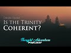

# The Review: Is the Trinity Coherent? Vin from Vin and Sori vs. The Muslim Metaphysician (2021-04-07)

## Description

In this video, Yusuf Ponders from Pondering Soul and Abdul from the Thought Adventure Podcast join The Muslim Metaphysician to review a recent debate he had with Vin from the Vin and Sori YouTube Channel. The debate was held on The EA Show and the link to the debate can be found below.

Full debate: https://www.youtube.com/watch?v=2j7dUW936TM

Thought Adventure Support
◄ PayPal - https://www.paypal.com/donate/?hosted_button_id=6KZWK75RB23RN 
◄ YouTube - https://www.youtube.com/c/ThoughtAdventurePodcast/join
◄ PATREON - https://www.patreon.com/thoughtadventurepodcast
____________________________________________________________________

Thought Adventure Social Media
◄ Twitter: https://twitter.com/T_A_Podcast​​ [@T_A_Podcast]
◄ Clubhouse https://www.clubhouse.com/club/thought-adventure-podcast
◄ Spotify: https://open.spotify.com/show/7x4UVfTz9QX8KVdEXquDUC
◄ Facebook: https://m.facebook.com/ThoughtAdventurePodcast
◄ Instagram: https://www.instagram.com/ThoughtAdventurePodcast​

----------------------------------------------------------------

*The Hosts:*
----------------------|
Jake Brancatella, The Muslim Metaphysician

- Youtube: https://www.youtube.com/channel/UCcGQRfTPNyHlXMqckvz2uqQ
- Twitter:  https://twitter.com/MMetaphysician​​ [@MMetaphysician]

----------------------|

Yusuf Ponders, The Pondering Soul

- Youtube: https://www.youtube.com/channel/UCsiDDxy0JXLqM6HBA0MA4NA
- Twitter: https://twitter.com/YusufPonders​​ [@YusufPonders]
- Facebook: https://www.facebook.com/yusufponders​ [@yusufpodners]

----------------------|

Sharif

- Twitter: https://twitter.com/sharifhafezi​​ [@sharifhafezi]

----------------------|

Abdulrahman

- Twitter: https://twitter.com/abdul_now​ [@abdul_now]

----------------------|

Admin

Riyad 
Gmail: hello.tapodcast@gmail.com

#trinitty #refutation #debate

## Summary of [The Review: Is the Trinity Coherent? Vin from Vin and Sori vs. The Muslim Metaphysician](https://www.youtube.com/watch?v=mW1EVGitSsc)

*This summary is AI generated - there may be inaccuracies. *

### [00:00:00](https://www.youtube.com/watch?v=mW1EVGitSsc&t=0) - [01:00:00](https://www.youtube.com/watch?v=mW1EVGitSsc&t=3600)

Vin from Vin and Sori debates The Muslim Metaphysician about the Trinity. Vin argues that the Trinity is coherent, while the Muslim Metaphysician argues that it is not. Vin says that the Trinity is coherent because it follows steps in arguments, and that conceding here means to concede to the whole thing. Yusuf points out that this is problematic because it means because Vin doesn't like calling people dishonest, he must be ignorant of the arguments. Vin then goes on to say that if Jake thinks the slide Jake's concession to this slide has any influence on the fact that the whole formulation of it might or might not be contradictory, then Jake is mistaken.

**[00:00:00](https://www.youtube.com/watch?v=mW1EVGitSsc&t=0)**  reviews a debate between a Christian YouTuber, Vin, and a Muslim Metaphysician, Yusuf Ponders. Vin argues that the Trinity is logically incoherent, and Yusuf Ponders points out that Christians believe there is a distinction between the being and the person of Jesus Christ. Vin appears nervous and out of his depth, and Jake seems calm and collected throughout the debate.
* **[00:05:00](https://www.youtube.com/watch?v=mW1EVGitSsc&t=300)** The Trinity debate between Vin and Abdul goes south when Abdul accuses Vin of dishonestly representing Christianity. Vin tries to defend himself, but doesn't seem to understand the logical problem of the Trinity.
* **[00:10:00](https://www.youtube.com/watch?v=mW1EVGitSsc&t=600)* Discusses the Trinity and Vin's attempt to win the debate by dismissing Islam as a legitimate belief system. Vin puts forward snide remarks and appears to be manipulating his opponents, which ultimately fails.
* **[00:15:00](https://www.youtube.com/watch?v=mW1EVGitSsc&t=900)* Discusses a debate between Vin and Sori, two Christians, and a Muslim philosopher, concerning the coherence of the Trinity. Vin is nervous, and the Muslim philosopher points out that this is indicative of Vin's lack of understanding of the Trinity. Vin tries to explain that the Trinity is a category distinction, but this does not solve the logical problem of the trinity. Vin then says that the Trinity is like a table, with one being (God) as another category (persons), and that this is missing information. The Muslim philosopher points out that this is a flawed analogy because it fails to account for the relation between the beings and persons within the Trinity.
* **[00:20:00](https://www.youtube.com/watch?v=mW1EVGitSsc&t=1200)**  Vin from Vin and Sori argues against the Muslim Metaphysician. Vin argues that the Trinity is coherent, and that there is no contradiction yet between what Christians are saying about God and what Muslims are saying about Allah. Jake from Jake and Tom vs. The Muslim Metaphysician tries to argue against Vin, but eventually concedes that there may be some contradictions, but that they are not yet problematic.
* **[00:25:00](https://www.youtube.com/watch?v=mW1EVGitSsc&t=1500)**  Vin from Vin and Sori debates The Muslim Metaphysician on the Trinity. Vin argues that the Trinity is coherent, while the Muslim Metaphysician argues that it is not. Vin says that the Trinity is coherent because it follows steps in arguments, and that conceding here means to concede to the whole thing. Yusuf points out that this is problematic because it means because Vin doesn't like calling people dishonest, he must be ignorant of the arguments. Vin then goes on to say that if Jake thinks the slide Jake's concession to this slide has any influence on the fact that the whole formulation of it might or might not be contradictory, then Jake is mistaken.
* **[00:30:00](https://www.youtube.com/watch?v=mW1EVGitSsc&t=1800)**  Vin and Sori discuss the concept of the Trinity and how it can be logically contradictory. Vin points out that there is a possibility that the Trinity could be logically contradictory and that leibniz's law could be a problem with the concept. Vin then discusses how leibniz's law could be used to argue against the Trinity.
* **[00:35:00](https://www.youtube.com/watch?v=mW1EVGitSsc&t=2100)**  examines the inconsistency of Vin's arguments concerning the coherence of the Trinity. Vin first argues that the Trinity is not universally accepted among philosophers, but then later claims that it is a universal belief for Christians. However, this assertion is flawed, as there are philosophers who do not accept the Trinity. Furthermore, Vin switches his argument to claim that if a philosopher does not agree with leibniz's law of non-contradiction, they are not a proper philosopher. This is a poor analogy, as there are many philosophers who do not accept leibniz's law. As a result, Vin's arguments do not have any grounding in reality, and instead rely on personal beliefs. This makes it difficult to have meaningful interfaith dialogue.
* **[00:40:00](https://www.youtube.com/watch?v=mW1EVGitSsc&t=2400)** Vin from Vin and Sori debates The Muslim Metaphysician about the cogency of the Trinity. The Muslim Metaphysician argues that the Trinity is incoherent because it relies on undefined terms and contradictions. Vin responds by pointing out that the Trinity is not universally accepted and that even Leibniz's law is not universally accepted by all philosophers. This conversation appears to be a dead end, as Vin does not offer a compelling argument against the Trinity.
* **[00:45:00](https://www.youtube.com/watch?v=mW1EVGitSsc&t=2700)**  is a debate between Vin and Sori, both of whom are atheists, and a Muslim philosopher. Vin argues that the law of non-contradiction cannot be accepted, and that any discussion with him would be fruitless. The Muslim philosopher counters that this is not a serious discussion, and that Vin should instead focus on more substantive points. Vin then argues that, as a Christian, he does not have the same problem as many Muslims do when it comes to understanding the Bible.
* **[00:50:00](https://www.youtube.com/watch?v=mW1EVGitSsc&t=3000)* Discusses surveys of Christian beliefs, and illustrates that a majority of Christians hold heretical beliefs. Vin argues that because Christians don't need scholars or other guidance to understand scripture, they do not have the same problem that many of their Muslim friends do. However, Jake points out that this is a false statement, and that a majority of Christians do not believe in subordinating the Father to Jesus.
* **[00:55:00](https://www.youtube.com/watch?v=mW1EVGitSsc&t=3300)** , Vin from Vin and Sori vs. The Muslim Metaphysician, Vin makes the argument that the Trinity is not coherent. Vin does not understand what leibniz's law is and does not understand the point of leibniz's law. Vin makes the argument that if one accepts leibniz's law, then they must also accept the law of identity. Vin does not seem to understand what the law of identity is or how it works.
### [01:00:00](https://www.youtube.com/watch?v=mW1EVGitSsc&t=3600) - [02:00:00](https://www.youtube.com/watch?v=mW1EVGitSsc&t=7200)

 Vin and Sori debate the concept of the Trinity. Vin argues that the Trinity is incoherent because the Father, Son, and Holy Spirit are all considered to be identity statements. The Muslim Metaphysician argues that the Trinity is coherent because the Father, Son, and Holy Spirit are three persons who are one in essence.

**[01:00:00](https://www.youtube.com/watch?v=mW1EVGitSsc&t=3600)** , Vin from Vin and Sori vs. The Muslim Metaphysician challenges the notion that the Trinity is coherent. Vin argues that, because leibniz's law of identity is a necessary logical law, rejecting it necessitates rejecting the law of non-contradiction, which leads to the conclusion that there is no point in debating the issue.
* **[01:05:00](https://www.youtube.com/watch?v=mW1EVGitSsc&t=3900)* Discusses the concept of logical necessity and its application to the Christian doctrine of omnipresence. Vin argues that logical necessity does not apply to God, and that this is why the law of thermodynamics is not a logical necessity. He also argues that logical necessity is not universally accepted, and that this is why omnipresence is not a logical necessity. This leads Vin to the conclusion that I surrendered the debate.
* **[01:10:00](https://www.youtube.com/watch?v=mW1EVGitSsc&t=4200)**  Vin from Vin and Sori vs. The Muslim Metaphysician argues that the Trinity is not logically coherent because there is a distinction between being in person and saying there is one being, three persons, which is not immediately contradictory. However, Craig says the one being is the trinity and the three persons are parts of the trinity, which is not a contradiction.
* **[01:15:00](https://www.youtube.com/watch?v=mW1EVGitSsc&t=4500)* Discusses Vin's argument that the Trinity is incoherent, because he thinks that's all you need to say to put the debate to rest. Yusuf points out that Vin does not understand the logical problem of the Trinity, and Vin responds by claiming that he did not surrender the discussion. If Vin were watching the video later, he would still make the same claims, because he does not understand the difference between an argument for something badly and the thing itself.
* **[01:20:00](https://www.youtube.com/watch?v=mW1EVGitSsc&t=4800)** , Vin and Sori debate the Trinity with Muslim philosopher Yusuf Islam. Vin argues that there is a problem with the Trinity, and that Christian theologians and philosophers are aware of it. Jake says that Vin is trying to escape the discussion by saying that there is no solution. Vin responds that Jake is being too hard on himself, and that all of Jake's analogies are flawed.
* **[01:25:00](https://www.youtube.com/watch?v=mW1EVGitSsc&t=5100)** The Christian Vin claims that it is always wrong to accept worship from humans, but this is not always the case. For example, in Matthew 28, Jesus says that God accepts worship from humans.
* **[01:30:00](https://www.youtube.com/watch?v=mW1EVGitSsc&t=5400)**  Vin from Vin and Sori debates The Muslim Metaphysician. Vin argues that it is possible that the Trinity is coherent, and the Muslim Metaphysician says that it is not. Vin then provides a lengthy explanation of relative identity trinitarianism, which the Muslim Metaphysician still does not understand. Vin concludes the debate by saying that the Trinity was a big eye-opener for him and that he now knows more about it than the Muslim Metaphysician.
* **[01:35:00](https://www.youtube.com/watch?v=mW1EVGitSsc&t=5700)* Discusses the logic problem of the Trinity, which is that it is difficult to understand how God is three persons with one essence. Vin from Vin and Sori argues that the doctrine of the Trinity is based on a faulty understanding of relative identity, and that it is not logically sound. Jake from Islam Metaphysician rebuttals these claims, explaining that relative identity is a valid concept that is taken from a number of sources within the Bible, including the book of Romans.
* **[01:40:00](https://www.youtube.com/watch?v=mW1EVGitSsc&t=6000)**  Vin from Vin and Sori debates The Muslim Metaphysician. Vin argues that the Trinity is incoherent because the Father, Son, and Holy Spirit are all considered to be identity statements. The Muslim Metaphysician argues that the Trinity is coherent because the Father, Son, and Holy Spirit are three persons who are one in essence.
* **[01:45:00](https://www.youtube.com/watch?v=mW1EVGitSsc&t=6300)** <>
* **[01:50:00](https://www.youtube.com/watch?v=mW1EVGitSsc&t=6600)** Vin and Sori debate the Trinity, with Vin arguing that it is not coherent. Vin points out that Jake, who is not familiar with relative identity trinitarianism, is not equipped to have the conversation. Jake then asks Vin where he got the distinction between nature and person from, which Vin claims he never said. Vin then argues that Jake is presenting himself as the person who has never said that. Jake objects, saying that Vin is arguing in a direction no one is going in, apart from Vin. Vin then points out that there are Christians in the comments and they are making it out as if Vin is being biased. Vin argues that he is very clever and cleverly changes Jake's words to make it seem like he said something different than he actually did. Jake objects, saying that Vin is derailing the conversation. Vin then allows the Christians to go, and tells Jake that he will let him go if they are going to go a and do that.
* **[01:55:00](https://www.youtube.com/watch?v=mW1EVGitSsc&t=6900)* Discusses a debate between Vin and Sori, two Christian apologists, regarding the Trinity. Vin makes a distinction between the categories of in person and on the internet, and argues that the Trinity is not coherent. This led to a heated debate between Vin and Jake, in which Vin was largely unsuccessful. Vin's main argument was that the Trinity is not coherent, and that Jake did not present anything significant for four minutes. Jake then attempted to question Vin, but this effort was unsuccessful. Vin's final argument was that brotherly critique is more beneficial than attacking one's brothers.
### [02:00:00](https://www.youtube.com/watch?v=mW1EVGitSsc&t=7200) - [02:55:00](https://www.youtube.com/watch?v=mW1EVGitSsc&t=10500)

 is a debate between Vin from Vin and Sori and a Muslim philosopher about the Trinity. Vin argues that the Trinity is coherent because it is made up of three beings who are identical, while the Muslim philosopher argues that identity is a statement about personhood and that the Trinity is incoherent because it makes distinctions between God the Father and God the Son that are not found in the Bible. In the end, Vin concedes that identity is a relation and that when two things are identical, they are also equal.

**[02:00:00](https://www.youtube.com/watch?v=mW1EVGitSsc&t=7200)* Discusses the Trinity, and Vin makes the claim that the Father, Son, and Holy Spirit are "not three eternals but one eternal." He later concedes that he may have misspoken and that Gregory of Mancianis was actually the president of the Council of Constantinople in 381. Michael later tries to use this as an argument to discredit Vin, but Vin responds by pointing out that Michael was actually the president of the Council of Nicaea in 325. This argument leads to a disagreement and Michael eventually resorts to derailing Vin's argument.
* **[02:05:00](https://www.youtube.com/watch?v=mW1EVGitSsc&t=7500)**  Vin and Sori debate a Muslim metaphysician about the Trinity. The Muslim metaphysician argues that the Trinity is incoherent because it makes distinctions between God the Father and God the Son that are not found in the Bible. Vin and Sori argue that the Trinity is coherent because it is a doctrine that was formulated by mathematicians and it is found in the Bible.
* **[02:10:00](https://www.youtube.com/watch?v=mW1EVGitSsc&t=7800)**  Vin from Vin and Sori debates with The Muslim Metaphysician about the concept of identity. Vin argues that identity is a universal thing that applies to all different things, while The Muslim Metaphysician claims that identity is a statement about personhood. Vin eventually loses confidence in himself and contradicts himself, proving that he does not understand what identity means.
* **[02:15:00](https://www.youtube.com/watch?v=mW1EVGitSsc&t=8100)**  Vin and Sori debate whether the Trinity is coherent. Vin argues that the Trinity is coherent because it is made up of three beings who are identical, which falls within the semantic domain of identity. Jake disagrees, pointing out that personhood does not fall within the semantic domain of identity. Vin then goes on to explain classical identity theory, which states that identity is to be found in nature, person, and both nature and person. Jake admits that this is correct, but argues that the Trinity does not offer anything new to the discussion. Vin concludes the video by stating that, even if the Trinity does not offer anything new to the discussion, it still deserves to be questioned because philosophers are renowned for their disagreements.
* **[02:20:00](https://www.youtube.com/watch?v=mW1EVGitSsc&t=8400)**  Vin takes on Muslim philosopher Sori in a debate about the Trinity. Sori argues that identity is a relation, and that two things cannot be identical if they differ at any time or differ timelessly in the case of God. Vin tries to explain identity using examples of English grammar, but Sori interrupts and insists that Justin control him. Vin finally concedes that identity is a relation, and that when two things are identical, they are also equal.
* **[02:25:00](https://www.youtube.com/watch?v=mW1EVGitSsc&t=8700)** The Trinity is coherent, as each individual member is identical to the one being of God. However, Jake makes the opposite assertion, that identity statements are being made about the persons being the one being of God, which contradicts what he just said.
* **[02:30:00](https://www.youtube.com/watch?v=mW1EVGitSsc&t=9000)* Discusses the Trinity doctrine and Vin's assertion that the father, son, and holy spirit are all identical. Vin then contradicts himself, and Jake tries to get Vin to admit his mistake.
* **[02:35:00](https://www.youtube.com/watch?v=mW1EVGitSsc&t=9300)** The Trinity is debated by theologians and Vin from Vin and Sori vs. The Muslim Metaphysician believes that it is more than an appearance and an actual contradiction. The theologians in the main believe that it is more than an appearance and an actual contradiction. Vin from Vin and Sori vs. The Muslim Metaphysician believes that the logical problem of the Trinity results in an actual contradiction instead of a merely apparent one. This makes Vin from Vin and Sori vs. The Muslim Metaphysician the winner of the debate.
* **[02:40:00](https://www.youtube.com/watch?v=mW1EVGitSsc&t=9600)* Discusses the debate between Vin and Sori, and the conclusion that Vin came to: that the Trinity is coherent. Vin's main argument was that he has more than two Christian friends, and that all of them agreed that the Trinity is incoherent. However, Jake points out that Vin avoided discussing the Trinity with Jake, and Jake argues that this shows that Vin does not have a strong argument.
* **[02:45:00](https://www.youtube.com/watch?v=mW1EVGitSsc&t=9900)**  clip shows Vin asking a Muslim philosopher whether the Trinity is logically contradictory. The philosopher explains that the Trinity is coherent, and that this means that it does not entail a contradiction. Vin is then shown an academic debate in which the same topic is discussed. The debate shows that the Trinity is coherent, and that this does not entail a contradiction.
* **[02:50:00](https://www.youtube.com/watch?v=mW1EVGitSsc&t=10200)** Craig argues that the Trinity is coherent, but Vin claims that the Trinity is logically incoherent. Vin does not provide a valid response to Craig's claim, and instead resorts to insults.
* **[02:55:00](https://www.youtube.com/watch?v=mW1EVGitSsc&t=10500)**  presents a discussion between Vin and Sori about the Trinity and concludes with Vin asking for forgiveness for any lapses. Vin then encourages viewers to check out Yusuf Ponder's Pondering Soul YouTube channel, which features Vin and Sori as well as Brother Ahmed.

<h2>Full transcript with timestamps: CLICK TO EXPAND</h2>

[0:00:05](https://youtu.be/mW1EVGitSsc?t=5) [Music]  
[0:00:19](https://youtu.be/mW1EVGitSsc?t=19) sweet little intro that bro  
[0:00:23](https://youtu.be/mW1EVGitSsc?t=23) assalamu alaikum everyone must have met  
[0:00:26](https://youtu.be/mW1EVGitSsc?t=26) a physician and i got my  
[0:00:28](https://youtu.be/mW1EVGitSsc?t=28) got my two friends here with me from tap  
[0:00:31](https://youtu.be/mW1EVGitSsc?t=31) uh we got yusuf ponders and uh  
[0:00:33](https://youtu.be/mW1EVGitSsc?t=33) brother abdul here and uh just to catch  
[0:00:36](https://youtu.be/mW1EVGitSsc?t=36) you guys up on  
[0:00:37](https://youtu.be/mW1EVGitSsc?t=37) speed of what's what's happened i  
[0:00:39](https://youtu.be/mW1EVGitSsc?t=39) recently had a debate  
[0:00:40](https://youtu.be/mW1EVGitSsc?t=40) with a christian youtuber named vin uh  
[0:00:44](https://youtu.be/mW1EVGitSsc?t=44) from  
[0:00:44](https://youtu.be/mW1EVGitSsc?t=44) vin and sorry channel so people can  
[0:00:47](https://youtu.be/mW1EVGitSsc?t=47) go take a look at it i have a disc in  
[0:00:50](https://youtu.be/mW1EVGitSsc?t=50) the description of the video  
[0:00:51](https://youtu.be/mW1EVGitSsc?t=51) i have a link to the original um  
[0:00:54](https://youtu.be/mW1EVGitSsc?t=54) debate if people didn't watch it yet i  
[0:00:57](https://youtu.be/mW1EVGitSsc?t=57) suggest you go watch it after this  
[0:01:00](https://youtu.be/mW1EVGitSsc?t=60) um but what we're gonna do is we're  
[0:01:02](https://youtu.be/mW1EVGitSsc?t=62) gonna play clips  
[0:01:03](https://youtu.be/mW1EVGitSsc?t=63) from the debate and go through it uh try  
[0:01:06](https://youtu.be/mW1EVGitSsc?t=66) to get through as much as we can  
[0:01:08](https://youtu.be/mW1EVGitSsc?t=68) with making you know the the most  
[0:01:11](https://youtu.be/mW1EVGitSsc?t=71) important points that we feel  
[0:01:13](https://youtu.be/mW1EVGitSsc?t=73) need to be addressed um but before we do  
[0:01:16](https://youtu.be/mW1EVGitSsc?t=76) that  
[0:01:17](https://youtu.be/mW1EVGitSsc?t=77) i want to give a little bit of  
[0:01:18](https://youtu.be/mW1EVGitSsc?t=78) background story to  
[0:01:20](https://youtu.be/mW1EVGitSsc?t=80) how this debate came about and  
[0:01:23](https://youtu.be/mW1EVGitSsc?t=83) uh why it happened so what happened is  
[0:01:26](https://youtu.be/mW1EVGitSsc?t=86) is that  
[0:01:27](https://youtu.be/mW1EVGitSsc?t=87) for those who don't know on the ea show  
[0:01:30](https://youtu.be/mW1EVGitSsc?t=90) uh the host there was an atheist his  
[0:01:32](https://youtu.be/mW1EVGitSsc?t=92) name's justin  
[0:01:34](https://youtu.be/mW1EVGitSsc?t=94) um he just recently became a muslim  
[0:01:37](https://youtu.be/mW1EVGitSsc?t=97) alhamdulillah and um  
[0:01:40](https://youtu.be/mW1EVGitSsc?t=100) yeah and he was in contact with vin also  
[0:01:43](https://youtu.be/mW1EVGitSsc?t=103) brother abdul was in contact with van  
[0:01:46](https://youtu.be/mW1EVGitSsc?t=106) even some other christians behind the  
[0:01:48](https://youtu.be/mW1EVGitSsc?t=108) scenes because when justin was an  
[0:01:50](https://youtu.be/mW1EVGitSsc?t=110) atheist  
[0:01:50](https://youtu.be/mW1EVGitSsc?t=110) he posted a um a group post  
[0:01:54](https://youtu.be/mW1EVGitSsc?t=114) i don't know what group it was but vin  
[0:01:56](https://youtu.be/mW1EVGitSsc?t=116) saw it  
[0:01:57](https://youtu.be/mW1EVGitSsc?t=117) it was justin was basically using the  
[0:02:00](https://youtu.be/mW1EVGitSsc?t=120) lpt or arguing against the logical  
[0:02:03](https://youtu.be/mW1EVGitSsc?t=123) incoherence  
[0:02:05](https://youtu.be/mW1EVGitSsc?t=125) of the trinity showing what it was and  
[0:02:07](https://youtu.be/mW1EVGitSsc?t=127) vin responded to it  
[0:02:09](https://youtu.be/mW1EVGitSsc?t=129) and um he made a post on it and then  
[0:02:13](https://youtu.be/mW1EVGitSsc?t=133) after that he had messages back and  
[0:02:15](https://youtu.be/mW1EVGitSsc?t=135) forth with abdul  
[0:02:16](https://youtu.be/mW1EVGitSsc?t=136) um justin and a few other people  
[0:02:20](https://youtu.be/mW1EVGitSsc?t=140) and within that he actually called me  
[0:02:22](https://youtu.be/mW1EVGitSsc?t=142) dishonest  
[0:02:23](https://youtu.be/mW1EVGitSsc?t=143) and said that i was being dishonest in  
[0:02:26](https://youtu.be/mW1EVGitSsc?t=146) my presentation  
[0:02:27](https://youtu.be/mW1EVGitSsc?t=147) uh i was for some reason leaving out  
[0:02:31](https://youtu.be/mW1EVGitSsc?t=151) that christians believe that there's a  
[0:02:32](https://youtu.be/mW1EVGitSsc?t=152) distinction between being in person  
[0:02:34](https://youtu.be/mW1EVGitSsc?t=154) as if i didn't know that um and people  
[0:02:37](https://youtu.be/mW1EVGitSsc?t=157) can go and look because on my video  
[0:02:39](https://youtu.be/mW1EVGitSsc?t=159) series on the trinity  
[0:02:41](https://youtu.be/mW1EVGitSsc?t=161) i explained that very clearly in the  
[0:02:43](https://youtu.be/mW1EVGitSsc?t=163) prior video  
[0:02:44](https://youtu.be/mW1EVGitSsc?t=164) but vin thought it was dishonest some  
[0:02:47](https://youtu.be/mW1EVGitSsc?t=167) for some reason that  
[0:02:48](https://youtu.be/mW1EVGitSsc?t=168) um i didn't make that clear um and then  
[0:02:51](https://youtu.be/mW1EVGitSsc?t=171) he repeated it again  
[0:02:52](https://youtu.be/mW1EVGitSsc?t=172) in the debate but after that  
[0:02:56](https://youtu.be/mW1EVGitSsc?t=176) for about the past six months or so um  
[0:02:59](https://youtu.be/mW1EVGitSsc?t=179) we've been trying to schedule a debate  
[0:03:01](https://youtu.be/mW1EVGitSsc?t=181) with vin and it seemed to me  
[0:03:04](https://youtu.be/mW1EVGitSsc?t=184) as if he was ducking me because he was  
[0:03:06](https://youtu.be/mW1EVGitSsc?t=186) posting videos on youtube and  
[0:03:08](https://youtu.be/mW1EVGitSsc?t=188) all the time doing these things and yet  
[0:03:10](https://youtu.be/mW1EVGitSsc?t=190) he wasn't responding to the messages  
[0:03:13](https://youtu.be/mW1EVGitSsc?t=193) from christians muslims and atheists  
[0:03:15](https://youtu.be/mW1EVGitSsc?t=195) trying to reach out to him  
[0:03:16](https://youtu.be/mW1EVGitSsc?t=196) to put this together uh and then he  
[0:03:19](https://youtu.be/mW1EVGitSsc?t=199) finally  
[0:03:20](https://youtu.be/mW1EVGitSsc?t=200) surfaced a couple days ago and um  
[0:03:24](https://youtu.be/mW1EVGitSsc?t=204) agreed to have the discussion on  
[0:03:25](https://youtu.be/mW1EVGitSsc?t=205) justin's channel  
[0:03:27](https://youtu.be/mW1EVGitSsc?t=207) and uh so that happened and then this  
[0:03:29](https://youtu.be/mW1EVGitSsc?t=209) video here is going to be a review of  
[0:03:30](https://youtu.be/mW1EVGitSsc?t=210) that so um before we get started with  
[0:03:33](https://youtu.be/mW1EVGitSsc?t=213) the eclipse  
[0:03:34](https://youtu.be/mW1EVGitSsc?t=214) abdullah yusuf do you guys have anything  
[0:03:36](https://youtu.be/mW1EVGitSsc?t=216) you want to add as far as an  
[0:03:38](https://youtu.be/mW1EVGitSsc?t=218) introduction to the video  
[0:03:40](https://youtu.be/mW1EVGitSsc?t=220) yeah so i had a little watch of your  
[0:03:43](https://youtu.be/mW1EVGitSsc?t=223) thingy videos as well not too long ago  
[0:03:45](https://youtu.be/mW1EVGitSsc?t=225) and you you definitely make mention of  
[0:03:47](https://youtu.be/mW1EVGitSsc?t=227) the distinction between  
[0:03:48](https://youtu.be/mW1EVGitSsc?t=228) uh the being and the person um in your  
[0:03:51](https://youtu.be/mW1EVGitSsc?t=231) critiques of christianity i think  
[0:03:53](https://youtu.be/mW1EVGitSsc?t=233) you probably mentioned that consistently  
[0:03:55](https://youtu.be/mW1EVGitSsc?t=235) in every video  
[0:03:56](https://youtu.be/mW1EVGitSsc?t=236) um so i'm not 100 sure how he would have  
[0:04:00](https://youtu.be/mW1EVGitSsc?t=240) um made that claim um  
[0:04:04](https://youtu.be/mW1EVGitSsc?t=244) either he wasn't paying attention but  
[0:04:06](https://youtu.be/mW1EVGitSsc?t=246) saying this and as we're gonna see  
[0:04:08](https://youtu.be/mW1EVGitSsc?t=248) when we start watching the video um it  
[0:04:10](https://youtu.be/mW1EVGitSsc?t=250) just came across  
[0:04:11](https://youtu.be/mW1EVGitSsc?t=251) like he was very much out of his depths  
[0:04:14](https://youtu.be/mW1EVGitSsc?t=254) and he was very nervous  
[0:04:15](https://youtu.be/mW1EVGitSsc?t=255) um and you get this impression almost  
[0:04:18](https://youtu.be/mW1EVGitSsc?t=258) instantly  
[0:04:19](https://youtu.be/mW1EVGitSsc?t=259) um the moment he's on he has these  
[0:04:22](https://youtu.be/mW1EVGitSsc?t=262) little awkward comments  
[0:04:24](https://youtu.be/mW1EVGitSsc?t=264) um and he seems very jittery  
[0:04:27](https://youtu.be/mW1EVGitSsc?t=267) and there's you'll see as well there's a  
[0:04:29](https://youtu.be/mW1EVGitSsc?t=269) moment where it's like right at the  
[0:04:31](https://youtu.be/mW1EVGitSsc?t=271) beginning  
[0:04:32](https://youtu.be/mW1EVGitSsc?t=272) jake looks as chilled and as cool as a  
[0:04:34](https://youtu.be/mW1EVGitSsc?t=274) cucumber  
[0:04:35](https://youtu.be/mW1EVGitSsc?t=275) and um and you even you're laughing  
[0:04:37](https://youtu.be/mW1EVGitSsc?t=277) you're like i didn't say that i didn't  
[0:04:39](https://youtu.be/mW1EVGitSsc?t=279) say that  
[0:04:39](https://youtu.be/mW1EVGitSsc?t=279) and he's and like he's basically saying  
[0:04:43](https://youtu.be/mW1EVGitSsc?t=283) that you've already  
[0:04:44](https://youtu.be/mW1EVGitSsc?t=284) lost the debate you've already conceded  
[0:04:47](https://youtu.be/mW1EVGitSsc?t=287) um  
[0:04:47](https://youtu.be/mW1EVGitSsc?t=287) which if that was the case why did he  
[0:04:49](https://youtu.be/mW1EVGitSsc?t=289) carry on like why didn't he just end it  
[0:04:51](https://youtu.be/mW1EVGitSsc?t=291) there  
[0:04:52](https://youtu.be/mW1EVGitSsc?t=292) um and you were just pointing out quite  
[0:04:54](https://youtu.be/mW1EVGitSsc?t=294) rightfully that that wasn't what you did  
[0:04:56](https://youtu.be/mW1EVGitSsc?t=296) um and we'll see because he even says  
[0:04:57](https://youtu.be/mW1EVGitSsc?t=297) watch it from the beginning so  
[0:04:59](https://youtu.be/mW1EVGitSsc?t=299) ensure that we'll uh we'll take his  
[0:05:01](https://youtu.be/mW1EVGitSsc?t=301) advice now and  
[0:05:02](https://youtu.be/mW1EVGitSsc?t=302) we'll show and it it just it was so  
[0:05:06](https://youtu.be/mW1EVGitSsc?t=306) clearly a mis application of what you  
[0:05:09](https://youtu.be/mW1EVGitSsc?t=309) had said  
[0:05:10](https://youtu.be/mW1EVGitSsc?t=310) in reply to what he had said um but he  
[0:05:12](https://youtu.be/mW1EVGitSsc?t=312) he's  
[0:05:13](https://youtu.be/mW1EVGitSsc?t=313) telling you to calm down he's like calm  
[0:05:15](https://youtu.be/mW1EVGitSsc?t=315) down calm down  
[0:05:16](https://youtu.be/mW1EVGitSsc?t=316) but he's looking frustrated he's looking  
[0:05:19](https://youtu.be/mW1EVGitSsc?t=319) very  
[0:05:20](https://youtu.be/mW1EVGitSsc?t=320) um upset and like nervous  
[0:05:23](https://youtu.be/mW1EVGitSsc?t=323) and again jittery and he's got a lot of  
[0:05:25](https://youtu.be/mW1EVGitSsc?t=325) these awkward hand movements in that and  
[0:05:27](https://youtu.be/mW1EVGitSsc?t=327) it's just it was a bit of uh it just  
[0:05:30](https://youtu.be/mW1EVGitSsc?t=330) kind of  
[0:05:31](https://youtu.be/mW1EVGitSsc?t=331) deteriorated pretty much from the  
[0:05:34](https://youtu.be/mW1EVGitSsc?t=334) the entry point and i don't think we're  
[0:05:36](https://youtu.be/mW1EVGitSsc?t=336) gonna be able to go through the whole  
[0:05:37](https://youtu.be/mW1EVGitSsc?t=337) thing  
[0:05:38](https://youtu.be/mW1EVGitSsc?t=338) i don't think we even really need to  
[0:05:39](https://youtu.be/mW1EVGitSsc?t=339) because the the last  
[0:05:41](https://youtu.be/mW1EVGitSsc?t=341) half at least anyway it was an absolute  
[0:05:44](https://youtu.be/mW1EVGitSsc?t=344) um  
[0:05:45](https://youtu.be/mW1EVGitSsc?t=345) state in terms of like what was meant to  
[0:05:48](https://youtu.be/mW1EVGitSsc?t=348) be a discussion  
[0:05:49](https://youtu.be/mW1EVGitSsc?t=349) um and yeah  
[0:05:52](https://youtu.be/mW1EVGitSsc?t=352) i think probably maybe we could say to  
[0:05:56](https://youtu.be/mW1EVGitSsc?t=356) jake  
[0:05:56](https://youtu.be/mW1EVGitSsc?t=356) you could have tried to have been karma  
[0:05:58](https://youtu.be/mW1EVGitSsc?t=358) with him but i think it was at such a  
[0:06:00](https://youtu.be/mW1EVGitSsc?t=360) point  
[0:06:01](https://youtu.be/mW1EVGitSsc?t=361) um where it was just i don't know how  
[0:06:03](https://youtu.be/mW1EVGitSsc?t=363) much better it would have been even if  
[0:06:04](https://youtu.be/mW1EVGitSsc?t=364) you were um  
[0:06:06](https://youtu.be/mW1EVGitSsc?t=366) and i couldn't understand how it would  
[0:06:08](https://youtu.be/mW1EVGitSsc?t=368) have been frustrating talking to him  
[0:06:09](https://youtu.be/mW1EVGitSsc?t=369) but i think you did try at least like  
[0:06:12](https://youtu.be/mW1EVGitSsc?t=372) you could see at the beginning  
[0:06:13](https://youtu.be/mW1EVGitSsc?t=373) you were like collected and then it just  
[0:06:16](https://youtu.be/mW1EVGitSsc?t=376) he kept  
[0:06:17](https://youtu.be/mW1EVGitSsc?t=377) doing these dishonest kind of um  
[0:06:20](https://youtu.be/mW1EVGitSsc?t=380) things confusing things using vague  
[0:06:23](https://youtu.be/mW1EVGitSsc?t=383) notions  
[0:06:24](https://youtu.be/mW1EVGitSsc?t=384) he'd drift from referring to one kind of  
[0:06:26](https://youtu.be/mW1EVGitSsc?t=386) thing  
[0:06:27](https://youtu.be/mW1EVGitSsc?t=387) when he was talking about this universal  
[0:06:29](https://youtu.be/mW1EVGitSsc?t=389) uh principles or universally accepted  
[0:06:31](https://youtu.be/mW1EVGitSsc?t=391) principles  
[0:06:32](https://youtu.be/mW1EVGitSsc?t=392) he'd start talking about one thing there  
[0:06:33](https://youtu.be/mW1EVGitSsc?t=393) and then he'd move on and  
[0:06:35](https://youtu.be/mW1EVGitSsc?t=395) completely change category so when he  
[0:06:37](https://youtu.be/mW1EVGitSsc?t=397) was directing it to you it was like  
[0:06:38](https://youtu.be/mW1EVGitSsc?t=398) give me something where all philosophers  
[0:06:41](https://youtu.be/mW1EVGitSsc?t=401) agree  
[0:06:42](https://youtu.be/mW1EVGitSsc?t=402) on this and then he would switch from  
[0:06:44](https://youtu.be/mW1EVGitSsc?t=404) asking for all philosophers to just  
[0:06:46](https://youtu.be/mW1EVGitSsc?t=406) won and with the leibniz lawyer you  
[0:06:47](https://youtu.be/mW1EVGitSsc?t=407) could have just had live nets  
[0:06:49](https://youtu.be/mW1EVGitSsc?t=409) the law was named after him he  
[0:06:51](https://youtu.be/mW1EVGitSsc?t=411) considered it  
[0:06:52](https://youtu.be/mW1EVGitSsc?t=412) universal um so that would have been  
[0:06:54](https://youtu.be/mW1EVGitSsc?t=414) enough but yeah  
[0:06:55](https://youtu.be/mW1EVGitSsc?t=415) i won't go too much into obviously we'll  
[0:06:57](https://youtu.be/mW1EVGitSsc?t=417) um we'll go through the video and we'll  
[0:06:59](https://youtu.be/mW1EVGitSsc?t=419) start covering these points yeah  
[0:07:02](https://youtu.be/mW1EVGitSsc?t=422) abdul you have anything yeah i just want  
[0:07:05](https://youtu.be/mW1EVGitSsc?t=425) to say that about the the video that  
[0:07:07](https://youtu.be/mW1EVGitSsc?t=427) um that he commented on initially about  
[0:07:10](https://youtu.be/mW1EVGitSsc?t=430) the logical problem of trinity  
[0:07:12](https://youtu.be/mW1EVGitSsc?t=432) he did call you dishonest and um and uh  
[0:07:16](https://youtu.be/mW1EVGitSsc?t=436) the problem is i sent him the other  
[0:07:17](https://youtu.be/mW1EVGitSsc?t=437) videos where you make the being person  
[0:07:19](https://youtu.be/mW1EVGitSsc?t=439) distinction first i told him in text  
[0:07:21](https://youtu.be/mW1EVGitSsc?t=441) which he's seen  
[0:07:22](https://youtu.be/mW1EVGitSsc?t=442) and i sent him the other videos where  
[0:07:24](https://youtu.be/mW1EVGitSsc?t=444) you make the being person distinction i  
[0:07:25](https://youtu.be/mW1EVGitSsc?t=445) told him this is a series where  
[0:07:27](https://youtu.be/mW1EVGitSsc?t=447) if jake actually presents models that  
[0:07:30](https://youtu.be/mW1EVGitSsc?t=450) try to solve the logical problem of the  
[0:07:32](https://youtu.be/mW1EVGitSsc?t=452) trinity  
[0:07:33](https://youtu.be/mW1EVGitSsc?t=453) and the problem i have is that he never  
[0:07:34](https://youtu.be/mW1EVGitSsc?t=454) replied to that and so when you accuse  
[0:07:36](https://youtu.be/mW1EVGitSsc?t=456) some  
[0:07:37](https://youtu.be/mW1EVGitSsc?t=457) someone of something as seriously as  
[0:07:38](https://youtu.be/mW1EVGitSsc?t=458) dishonestly  
[0:07:40](https://youtu.be/mW1EVGitSsc?t=460) you're accused of being dishonest and  
[0:07:42](https://youtu.be/mW1EVGitSsc?t=462) then you're given evidence that they're  
[0:07:43](https://youtu.be/mW1EVGitSsc?t=463) not being dishonest  
[0:07:45](https://youtu.be/mW1EVGitSsc?t=465) i expected vin to respond and say okay i  
[0:07:47](https://youtu.be/mW1EVGitSsc?t=467) take that back he wasn't dishonest  
[0:07:49](https://youtu.be/mW1EVGitSsc?t=469) right but uh i realized and i've  
[0:07:53](https://youtu.be/mW1EVGitSsc?t=473) i've always liked vin to be honest and  
[0:07:55](https://youtu.be/mW1EVGitSsc?t=475) and vin  
[0:07:56](https://youtu.be/mW1EVGitSsc?t=476) i've considered him a friend and none of  
[0:07:58](https://youtu.be/mW1EVGitSsc?t=478) this is personal really but  
[0:08:01](https://youtu.be/mW1EVGitSsc?t=481) some of these things are disappointing  
[0:08:02](https://youtu.be/mW1EVGitSsc?t=482) because he's been making sweeping  
[0:08:04](https://youtu.be/mW1EVGitSsc?t=484) generalizations about muslims  
[0:08:06](https://youtu.be/mW1EVGitSsc?t=486) to me in private as well he's been  
[0:08:07](https://youtu.be/mW1EVGitSsc?t=487) telling me you muslims whenever you go  
[0:08:10](https://youtu.be/mW1EVGitSsc?t=490) out there  
[0:08:11](https://youtu.be/mW1EVGitSsc?t=491) you may you you lie and you dishonestly  
[0:08:14](https://youtu.be/mW1EVGitSsc?t=494) represent christianity  
[0:08:16](https://youtu.be/mW1EVGitSsc?t=496) he made he made a a similar comment  
[0:08:18](https://youtu.be/mW1EVGitSsc?t=498) publicly on my friend's page a few days  
[0:08:20](https://youtu.be/mW1EVGitSsc?t=500) ago  
[0:08:21](https://youtu.be/mW1EVGitSsc?t=501) and uh and the problem is when when you  
[0:08:25](https://youtu.be/mW1EVGitSsc?t=505) make that kind of  
[0:08:26](https://youtu.be/mW1EVGitSsc?t=506) accusation and you're shown that that  
[0:08:28](https://youtu.be/mW1EVGitSsc?t=508) isn't the case  
[0:08:29](https://youtu.be/mW1EVGitSsc?t=509) you should come back and have something  
[0:08:31](https://youtu.be/mW1EVGitSsc?t=511) to say i haven't experienced that with  
[0:08:33](https://youtu.be/mW1EVGitSsc?t=513) vin  
[0:08:34](https://youtu.be/mW1EVGitSsc?t=514) and and and the issue is  
[0:08:38](https://youtu.be/mW1EVGitSsc?t=518) aside from that the issue is uh it  
[0:08:40](https://youtu.be/mW1EVGitSsc?t=520) doesn't seem like vin really understood  
[0:08:41](https://youtu.be/mW1EVGitSsc?t=521) what a logical problem the trinity is to  
[0:08:43](https://youtu.be/mW1EVGitSsc?t=523) be honest because  
[0:08:44](https://youtu.be/mW1EVGitSsc?t=524) the way jake laid it out in that video  
[0:08:47](https://youtu.be/mW1EVGitSsc?t=527) was  
[0:08:47](https://youtu.be/mW1EVGitSsc?t=527) really the logical problem of the  
[0:08:49](https://youtu.be/mW1EVGitSsc?t=529) trinity as  
[0:08:51](https://youtu.be/mW1EVGitSsc?t=531) uh referred to by christian theologians  
[0:08:55](https://youtu.be/mW1EVGitSsc?t=535) and philosophers which  
[0:08:56](https://youtu.be/mW1EVGitSsc?t=536) it's a term coined by them not by jake  
[0:08:58](https://youtu.be/mW1EVGitSsc?t=538) and and  
[0:09:00](https://youtu.be/mW1EVGitSsc?t=540) that literally was the logical problem  
[0:09:02](https://youtu.be/mW1EVGitSsc?t=542) of the trinity  
[0:09:03](https://youtu.be/mW1EVGitSsc?t=543) and the fact that he thinks that there's  
[0:09:05](https://youtu.be/mW1EVGitSsc?t=545) an aspect of dishonesty there  
[0:09:07](https://youtu.be/mW1EVGitSsc?t=547) shows at least at least to me it shows  
[0:09:10](https://youtu.be/mW1EVGitSsc?t=550) that he doesn't  
[0:09:11](https://youtu.be/mW1EVGitSsc?t=551) he's not familiar with what the logical  
[0:09:12](https://youtu.be/mW1EVGitSsc?t=552) problem the trinity is and i think this  
[0:09:14](https://youtu.be/mW1EVGitSsc?t=554) debate actually demonstrated that  
[0:09:16](https://youtu.be/mW1EVGitSsc?t=556) like um conclusively yeah which touches  
[0:09:19](https://youtu.be/mW1EVGitSsc?t=559) also on what i said there about it  
[0:09:21](https://youtu.be/mW1EVGitSsc?t=561) him being sort of out of his depth a  
[0:09:23](https://youtu.be/mW1EVGitSsc?t=563) little bit um which would make sense and  
[0:09:25](https://youtu.be/mW1EVGitSsc?t=565) sort of explain his  
[0:09:26](https://youtu.be/mW1EVGitSsc?t=566) jitteriness and his nervousness um  
[0:09:30](https://youtu.be/mW1EVGitSsc?t=570) at the moment because this is my first  
[0:09:33](https://youtu.be/mW1EVGitSsc?t=573) experience of him  
[0:09:34](https://youtu.be/mW1EVGitSsc?t=574) i've not really seen much of him before  
[0:09:36](https://youtu.be/mW1EVGitSsc?t=576) yeah me too i i didn't really  
[0:09:38](https://youtu.be/mW1EVGitSsc?t=578) see much of him at all i just heard his  
[0:09:39](https://youtu.be/mW1EVGitSsc?t=579) name a few times but i don't really know  
[0:09:42](https://youtu.be/mW1EVGitSsc?t=582) him at all  
[0:09:43](https://youtu.be/mW1EVGitSsc?t=583) um yeah and the other thing abdul is he  
[0:09:45](https://youtu.be/mW1EVGitSsc?t=585) he he repeated it in the  
[0:09:47](https://youtu.be/mW1EVGitSsc?t=587) discussion again he said that oh jake  
[0:09:50](https://youtu.be/mW1EVGitSsc?t=590) you didn't mention being  
[0:09:51](https://youtu.be/mW1EVGitSsc?t=591) person distinction in the video so  
[0:09:53](https://youtu.be/mW1EVGitSsc?t=593) you're being dishonest  
[0:09:54](https://youtu.be/mW1EVGitSsc?t=594) so he kind of repeated the same  
[0:09:56](https://youtu.be/mW1EVGitSsc?t=596) accusation even live in the discussion  
[0:10:00](https://youtu.be/mW1EVGitSsc?t=600) yeah doubled down on it but what do you  
[0:10:02](https://youtu.be/mW1EVGitSsc?t=602) say we got uh get right into it um  
[0:10:05](https://youtu.be/mW1EVGitSsc?t=605) yes if you said that you wanted to start  
[0:10:06](https://youtu.be/mW1EVGitSsc?t=606) with the uh the comment he made about  
[0:10:09](https://youtu.be/mW1EVGitSsc?t=609) yeah just that that really obvious uh  
[0:10:11](https://youtu.be/mW1EVGitSsc?t=611) comment yeah  
[0:10:12](https://youtu.be/mW1EVGitSsc?t=612) he mentions your hat and he's like oh i  
[0:10:14](https://youtu.be/mW1EVGitSsc?t=614) thought you know  
[0:10:15](https://youtu.be/mW1EVGitSsc?t=615) and then he talks about the secular uh  
[0:10:18](https://youtu.be/mW1EVGitSsc?t=618) make  
[0:10:18](https://youtu.be/mW1EVGitSsc?t=618) america secular hat i mean we'll pull it  
[0:10:21](https://youtu.be/mW1EVGitSsc?t=621) up we'll let him say  
[0:10:22](https://youtu.be/mW1EVGitSsc?t=622) himself uh i think what was it about the  
[0:10:24](https://youtu.be/mW1EVGitSsc?t=624) four minute mark  
[0:10:26](https://youtu.be/mW1EVGitSsc?t=626) yeah 453 somewhere around there  
[0:10:32](https://youtu.be/mW1EVGitSsc?t=632) i don't assume i don't assume one second  
[0:10:35](https://youtu.be/mW1EVGitSsc?t=635) let me uh  
[0:10:37](https://youtu.be/mW1EVGitSsc?t=637) yeah that should be good around there is  
[0:10:40](https://youtu.be/mW1EVGitSsc?t=640) this coming through  
[0:10:42](https://youtu.be/mW1EVGitSsc?t=642) maybe you can get a uh make america  
[0:10:44](https://youtu.be/mW1EVGitSsc?t=644) soria hat  
[0:10:46](https://youtu.be/mW1EVGitSsc?t=646) [Laughter]  
[0:10:49](https://youtu.be/mW1EVGitSsc?t=649) you're a baby you got to get into the  
[0:10:51](https://youtu.be/mW1EVGitSsc?t=651) fifth bar get into the thick and then  
[0:10:52](https://youtu.be/mW1EVGitSsc?t=652) that that'll that'll change  
[0:10:54](https://youtu.be/mW1EVGitSsc?t=654) where you you won't be a muslim that's a  
[0:10:57](https://youtu.be/mW1EVGitSsc?t=657) different topic okay see it's just  
[0:11:00](https://youtu.be/mW1EVGitSsc?t=660) it's such a cringe opening  
[0:11:04](https://youtu.be/mW1EVGitSsc?t=664) move and like to just go uh well  
[0:11:07](https://youtu.be/mW1EVGitSsc?t=667) you know you won't be a muslim normal  
[0:11:09](https://youtu.be/mW1EVGitSsc?t=669) haha oh now let's go on  
[0:11:11](https://youtu.be/mW1EVGitSsc?t=671) and then to just kind of if we play that  
[0:11:12](https://youtu.be/mW1EVGitSsc?t=672) again to try as quickly as possible to  
[0:11:14](https://youtu.be/mW1EVGitSsc?t=674) move from that statement  
[0:11:16](https://youtu.be/mW1EVGitSsc?t=676) you're you're a baby you got to get into  
[0:11:18](https://youtu.be/mW1EVGitSsc?t=678) the fifth get into the thick and then  
[0:11:20](https://youtu.be/mW1EVGitSsc?t=680) that that'll  
[0:11:20](https://youtu.be/mW1EVGitSsc?t=680) that'll change where you you won't be a  
[0:11:23](https://youtu.be/mW1EVGitSsc?t=683) muslim  
[0:11:24](https://youtu.be/mW1EVGitSsc?t=684) that's a different topic okay uh i  
[0:11:27](https://youtu.be/mW1EVGitSsc?t=687) wanted to do a quick  
[0:11:28](https://youtu.be/mW1EVGitSsc?t=688) that's a different topic okay i wanted  
[0:11:29](https://youtu.be/mW1EVGitSsc?t=689) to actually say something like that  
[0:11:31](https://youtu.be/mW1EVGitSsc?t=691) because vin does this  
[0:11:32](https://youtu.be/mW1EVGitSsc?t=692) a lot and like this is a discussion  
[0:11:34](https://youtu.be/mW1EVGitSsc?t=694) about the trinity this is discussing the  
[0:11:36](https://youtu.be/mW1EVGitSsc?t=696) trinity  
[0:11:37](https://youtu.be/mW1EVGitSsc?t=697) and vin wants to like from the outset  
[0:11:41](https://youtu.be/mW1EVGitSsc?t=701) say something about islam to be like you  
[0:11:44](https://youtu.be/mW1EVGitSsc?t=704) know what  
[0:11:44](https://youtu.be/mW1EVGitSsc?t=704) if i'm going down i'm pulling you down  
[0:11:46](https://youtu.be/mW1EVGitSsc?t=706) with me yeah poisoning  
[0:11:48](https://youtu.be/mW1EVGitSsc?t=708) yeah he's poisoning the well and he's  
[0:11:50](https://youtu.be/mW1EVGitSsc?t=710) making it seem as if  
[0:11:52](https://youtu.be/mW1EVGitSsc?t=712) like he made a remark in the middle of  
[0:11:53](https://youtu.be/mW1EVGitSsc?t=713) the video about you know the bible is  
[0:11:55](https://youtu.be/mW1EVGitSsc?t=715) sufficient for me and he i've seen him  
[0:11:57](https://youtu.be/mW1EVGitSsc?t=717) made this remarks  
[0:11:58](https://youtu.be/mW1EVGitSsc?t=718) make this remark several times that as a  
[0:11:59](https://youtu.be/mW1EVGitSsc?t=719) christian the bible is sufficient for me  
[0:12:01](https://youtu.be/mW1EVGitSsc?t=721) but muslims need the quran  
[0:12:03](https://youtu.be/mW1EVGitSsc?t=723) you know going off on these tangents and  
[0:12:05](https://youtu.be/mW1EVGitSsc?t=725) red herrings that have  
[0:12:06](https://youtu.be/mW1EVGitSsc?t=726) absolutely nothing to do with the debate  
[0:12:09](https://youtu.be/mW1EVGitSsc?t=729) if you want to have a debate about  
[0:12:10](https://youtu.be/mW1EVGitSsc?t=730) scripture  
[0:12:11](https://youtu.be/mW1EVGitSsc?t=731) and talk about muslim sources and and  
[0:12:14](https://youtu.be/mW1EVGitSsc?t=734) what the sources of revelation are and  
[0:12:15](https://youtu.be/mW1EVGitSsc?t=735) compare them to the christian sources  
[0:12:17](https://youtu.be/mW1EVGitSsc?t=737) sure that might be relevant uh  
[0:12:20](https://youtu.be/mW1EVGitSsc?t=740) although although you'd probably have to  
[0:12:22](https://youtu.be/mW1EVGitSsc?t=742) approach it in a more uh  
[0:12:24](https://youtu.be/mW1EVGitSsc?t=744) objective way where you're not really  
[0:12:25](https://youtu.be/mW1EVGitSsc?t=745) being where you're being civil and not  
[0:12:28](https://youtu.be/mW1EVGitSsc?t=748) really uh  
[0:12:28](https://youtu.be/mW1EVGitSsc?t=748) trying to ridicule your your  
[0:12:31](https://youtu.be/mW1EVGitSsc?t=751) interlocutors  
[0:12:32](https://youtu.be/mW1EVGitSsc?t=752) beliefs but then the the the point is  
[0:12:35](https://youtu.be/mW1EVGitSsc?t=755) that  
[0:12:35](https://youtu.be/mW1EVGitSsc?t=755) vin does this and this is important to  
[0:12:37](https://youtu.be/mW1EVGitSsc?t=757) note i want to get into the substance of  
[0:12:39](https://youtu.be/mW1EVGitSsc?t=759) the debate but the the reason why  
[0:12:41](https://youtu.be/mW1EVGitSsc?t=761) this needs to be mentioned is that vin's  
[0:12:44](https://youtu.be/mW1EVGitSsc?t=764) approach is not  
[0:12:46](https://youtu.be/mW1EVGitSsc?t=766) really about substance vin makes a lot  
[0:12:49](https://youtu.be/mW1EVGitSsc?t=769) of snide remarks  
[0:12:51](https://youtu.be/mW1EVGitSsc?t=771) through the debate and he has this  
[0:12:54](https://youtu.be/mW1EVGitSsc?t=774) you know he he he puts on this this this  
[0:12:57](https://youtu.be/mW1EVGitSsc?t=777) um these mannerisms that  
[0:13:00](https://youtu.be/mW1EVGitSsc?t=780) give you the impression that you know i  
[0:13:04](https://youtu.be/mW1EVGitSsc?t=784) know what i'm talking about i'm  
[0:13:05](https://youtu.be/mW1EVGitSsc?t=785) dominating  
[0:13:06](https://youtu.be/mW1EVGitSsc?t=786) and he makes these snide remarks in the  
[0:13:09](https://youtu.be/mW1EVGitSsc?t=789) middle of the debate  
[0:13:10](https://youtu.be/mW1EVGitSsc?t=790) like he turned to his partner and be  
[0:13:13](https://youtu.be/mW1EVGitSsc?t=793) like you see see i told you or and he'd  
[0:13:15](https://youtu.be/mW1EVGitSsc?t=795) have this big grin on his face that  
[0:13:17](https://youtu.be/mW1EVGitSsc?t=797) you know what i got you man and for me i  
[0:13:20](https://youtu.be/mW1EVGitSsc?t=800) think  
[0:13:21](https://youtu.be/mW1EVGitSsc?t=801) for i've seen vin speak a lot and i  
[0:13:24](https://youtu.be/mW1EVGitSsc?t=804) think this is  
[0:13:25](https://youtu.be/mW1EVGitSsc?t=805) vin's like fundamental strategy  
[0:13:29](https://youtu.be/mW1EVGitSsc?t=809) his it's his prime approach to  
[0:13:33](https://youtu.be/mW1EVGitSsc?t=813) winning debates he it's it's it's it's  
[0:13:36](https://youtu.be/mW1EVGitSsc?t=816) i don't want to say this in a bad way  
[0:13:37](https://youtu.be/mW1EVGitSsc?t=817) but it is manipulative  
[0:13:39](https://youtu.be/mW1EVGitSsc?t=819) and and and it's it's it's basically  
[0:13:42](https://youtu.be/mW1EVGitSsc?t=822) what he did here because we're going to  
[0:13:43](https://youtu.be/mW1EVGitSsc?t=823) go through the debate and i think  
[0:13:45](https://youtu.be/mW1EVGitSsc?t=825) substance wise what vin had to offer was  
[0:13:47](https://youtu.be/mW1EVGitSsc?t=827) very little and we're gonna yeah  
[0:13:49](https://youtu.be/mW1EVGitSsc?t=829) we're gonna list the points that were  
[0:13:51](https://youtu.be/mW1EVGitSsc?t=831) actually of substance  
[0:13:53](https://youtu.be/mW1EVGitSsc?t=833) as they relate to the topic of this  
[0:13:55](https://youtu.be/mW1EVGitSsc?t=835) debate also  
[0:13:56](https://youtu.be/mW1EVGitSsc?t=836) so the thing is is i don't even want to  
[0:13:59](https://youtu.be/mW1EVGitSsc?t=839) attribute this  
[0:14:00](https://youtu.be/mW1EVGitSsc?t=840) uh to like an innate part of his  
[0:14:03](https://youtu.be/mW1EVGitSsc?t=843) character necessarily i don't think  
[0:14:05](https://youtu.be/mW1EVGitSsc?t=845) for me when i was watching it it doesn't  
[0:14:07](https://youtu.be/mW1EVGitSsc?t=847) seem like this is him  
[0:14:09](https://youtu.be/mW1EVGitSsc?t=849) in his normal state of being i think it  
[0:14:11](https://youtu.be/mW1EVGitSsc?t=851) was a concept  
[0:14:13](https://youtu.be/mW1EVGitSsc?t=853) it's like a sport you want to win the  
[0:14:14](https://youtu.be/mW1EVGitSsc?t=854) debate right it's it's  
[0:14:16](https://youtu.be/mW1EVGitSsc?t=856) um i don't think he's i don't think vin  
[0:14:18](https://youtu.be/mW1EVGitSsc?t=858) is a bad guy  
[0:14:20](https://youtu.be/mW1EVGitSsc?t=860) and i said i like vin right but then vin  
[0:14:22](https://youtu.be/mW1EVGitSsc?t=862) wants to win a debate  
[0:14:23](https://youtu.be/mW1EVGitSsc?t=863) and i think in in certain debates  
[0:14:27](https://youtu.be/mW1EVGitSsc?t=867) he'll want to win it at any expense yeah  
[0:14:29](https://youtu.be/mW1EVGitSsc?t=869) i think it just  
[0:14:30](https://youtu.be/mW1EVGitSsc?t=870) really failed this time because jake  
[0:14:32](https://youtu.be/mW1EVGitSsc?t=872) wasn't having any of it  
[0:14:33](https://youtu.be/mW1EVGitSsc?t=873) yeah and i think it's probably important  
[0:14:35](https://youtu.be/mW1EVGitSsc?t=875) to sort of stress here i can understand  
[0:14:37](https://youtu.be/mW1EVGitSsc?t=877) why he wants to win it obviously like  
[0:14:40](https://youtu.be/mW1EVGitSsc?t=880) it's  
[0:14:40](https://youtu.be/mW1EVGitSsc?t=880) not um completely digress from  
[0:14:44](https://youtu.be/mW1EVGitSsc?t=884) the you know the whole purpose of him  
[0:14:46](https://youtu.be/mW1EVGitSsc?t=886) wanting to  
[0:14:47](https://youtu.be/mW1EVGitSsc?t=887) discuss this at all he he's a an uh  
[0:14:50](https://youtu.be/mW1EVGitSsc?t=890) you know a very sincere christian i  
[0:14:52](https://youtu.be/mW1EVGitSsc?t=892) think he really does believe in  
[0:14:53](https://youtu.be/mW1EVGitSsc?t=893) in his doctrine it is important to him  
[0:14:55](https://youtu.be/mW1EVGitSsc?t=895) he does believe  
[0:14:57](https://youtu.be/mW1EVGitSsc?t=897) jesus is his god um and so obviously  
[0:15:00](https://youtu.be/mW1EVGitSsc?t=900) there's a lot at stake here in this  
[0:15:01](https://youtu.be/mW1EVGitSsc?t=901) discussion  
[0:15:02](https://youtu.be/mW1EVGitSsc?t=902) um and so i i get it you know he wants  
[0:15:06](https://youtu.be/mW1EVGitSsc?t=906) this  
[0:15:06](https://youtu.be/mW1EVGitSsc?t=906) to be you know without any flaw without  
[0:15:10](https://youtu.be/mW1EVGitSsc?t=910) any um  
[0:15:11](https://youtu.be/mW1EVGitSsc?t=911) problem in it uh because it is  
[0:15:13](https://youtu.be/mW1EVGitSsc?t=913) fundamental to his belief and if  
[0:15:15](https://youtu.be/mW1EVGitSsc?t=915) if there is any problem obviously this  
[0:15:17](https://youtu.be/mW1EVGitSsc?t=917) is gonna sort of start to  
[0:15:18](https://youtu.be/mW1EVGitSsc?t=918) to wither away um so there is something  
[0:15:22](https://youtu.be/mW1EVGitSsc?t=922) at stake here  
[0:15:22](https://youtu.be/mW1EVGitSsc?t=922) there you know there is uh and not just  
[0:15:25](https://youtu.be/mW1EVGitSsc?t=925) something arbitrary but something  
[0:15:27](https://youtu.be/mW1EVGitSsc?t=927) important fundamental to his life to his  
[0:15:29](https://youtu.be/mW1EVGitSsc?t=929) family life to his social life  
[0:15:32](https://youtu.be/mW1EVGitSsc?t=932) um and so i i get that and  
[0:15:35](https://youtu.be/mW1EVGitSsc?t=935) obviously as we're gonna see now as  
[0:15:37](https://youtu.be/mW1EVGitSsc?t=937) we're going through you can see he's  
[0:15:38](https://youtu.be/mW1EVGitSsc?t=938) nervous  
[0:15:39](https://youtu.be/mW1EVGitSsc?t=939) you can see he's he's um and i get this  
[0:15:42](https://youtu.be/mW1EVGitSsc?t=942) as well like  
[0:15:43](https://youtu.be/mW1EVGitSsc?t=943) i'm i get nervous with like debate  
[0:15:46](https://youtu.be/mW1EVGitSsc?t=946) um atmospheres as well i prefer uh  
[0:15:49](https://youtu.be/mW1EVGitSsc?t=949) you know more relaxed discussions and  
[0:15:52](https://youtu.be/mW1EVGitSsc?t=952) back and forth and  
[0:15:53](https://youtu.be/mW1EVGitSsc?t=953) having the time to be able to think  
[0:15:54](https://youtu.be/mW1EVGitSsc?t=954) about what you want to say so you don't  
[0:15:56](https://youtu.be/mW1EVGitSsc?t=956) say something silly that's more my style  
[0:16:00](https://youtu.be/mW1EVGitSsc?t=960) in charlotte i'm going to try and get  
[0:16:02](https://youtu.be/mW1EVGitSsc?t=962) myself to a position where  
[0:16:03](https://youtu.be/mW1EVGitSsc?t=963) i can maybe do debates but i i don't  
[0:16:05](https://youtu.be/mW1EVGitSsc?t=965) want to get into them  
[0:16:06](https://youtu.be/mW1EVGitSsc?t=966) at a moment where i i get nervous  
[0:16:08](https://youtu.be/mW1EVGitSsc?t=968) because i know this is the kind of  
[0:16:10](https://youtu.be/mW1EVGitSsc?t=970) thing that happens when you do get into  
[0:16:12](https://youtu.be/mW1EVGitSsc?t=972) debates when they make you nervous  
[0:16:14](https://youtu.be/mW1EVGitSsc?t=974) that things deteriorate very quickly and  
[0:16:16](https://youtu.be/mW1EVGitSsc?t=976) it becomes more of a  
[0:16:18](https://youtu.be/mW1EVGitSsc?t=978) thing about ego um oh yeah  
[0:16:23](https://youtu.be/mW1EVGitSsc?t=983) you wanted to add no um no nothing  
[0:16:26](https://youtu.be/mW1EVGitSsc?t=986) really  
[0:16:26](https://youtu.be/mW1EVGitSsc?t=986) um if you want to go to  
[0:16:30](https://youtu.be/mW1EVGitSsc?t=990) uh the second one which was around 11  
[0:16:33](https://youtu.be/mW1EVGitSsc?t=993) 21 on the video where he brings up this  
[0:16:37](https://youtu.be/mW1EVGitSsc?t=997) this supposed um his model explaining  
[0:16:41](https://youtu.be/mW1EVGitSsc?t=1001) that there's one in  
[0:16:42](https://youtu.be/mW1EVGitSsc?t=1002) a and three and b and then he asked me  
[0:16:44](https://youtu.be/mW1EVGitSsc?t=1004) if it's a contradiction and then later  
[0:16:47](https://youtu.be/mW1EVGitSsc?t=1007) says that by me saying no that i  
[0:16:49](https://youtu.be/mW1EVGitSsc?t=1009) conceded the debate  
[0:16:50](https://youtu.be/mW1EVGitSsc?t=1010) which was complete dishonesty on his  
[0:16:52](https://youtu.be/mW1EVGitSsc?t=1012) part  
[0:16:53](https://youtu.be/mW1EVGitSsc?t=1013) yeah i think we should get into the  
[0:16:54](https://youtu.be/mW1EVGitSsc?t=1014) substance of the debate now  
[0:16:56](https://youtu.be/mW1EVGitSsc?t=1016) so that's i think this is where it  
[0:16:58](https://youtu.be/mW1EVGitSsc?t=1018) starts right his presentation and of  
[0:17:00](https://youtu.be/mW1EVGitSsc?t=1020) course  
[0:17:01](https://youtu.be/mW1EVGitSsc?t=1021) it's obvious that this isn't a  
[0:17:02](https://youtu.be/mW1EVGitSsc?t=1022) contradiction this isn't where the  
[0:17:05](https://youtu.be/mW1EVGitSsc?t=1025) contradiction comes into play now later  
[0:17:08](https://youtu.be/mW1EVGitSsc?t=1028) on  
[0:17:09](https://youtu.be/mW1EVGitSsc?t=1029) um and you acknowledge that of course  
[0:17:10](https://youtu.be/mW1EVGitSsc?t=1030) everybody acknowledges that  
[0:17:12](https://youtu.be/mW1EVGitSsc?t=1032) this being this category distinction  
[0:17:14](https://youtu.be/mW1EVGitSsc?t=1034) here uh  
[0:17:15](https://youtu.be/mW1EVGitSsc?t=1035) in this slide there's no contradiction  
[0:17:17](https://youtu.be/mW1EVGitSsc?t=1037) whatsoever it's when you link them  
[0:17:19](https://youtu.be/mW1EVGitSsc?t=1039) together and make the relation between  
[0:17:21](https://youtu.be/mW1EVGitSsc?t=1041) the being and person  
[0:17:22](https://youtu.be/mW1EVGitSsc?t=1042) clear as it should be within uh  
[0:17:25](https://youtu.be/mW1EVGitSsc?t=1045) trinitarian formulations  
[0:17:26](https://youtu.be/mW1EVGitSsc?t=1046) that's when the cr the the contradiction  
[0:17:29](https://youtu.be/mW1EVGitSsc?t=1049) comes into play  
[0:17:30](https://youtu.be/mW1EVGitSsc?t=1050) yeah and i think and doesn't realize  
[0:17:32](https://youtu.be/mW1EVGitSsc?t=1052) that because i think vin asks you the  
[0:17:34](https://youtu.be/mW1EVGitSsc?t=1054) question later on  
[0:17:35](https://youtu.be/mW1EVGitSsc?t=1055) he says you conceded you say no i  
[0:17:37](https://youtu.be/mW1EVGitSsc?t=1057) haven't the reason you say no i haven't  
[0:17:39](https://youtu.be/mW1EVGitSsc?t=1059) is because you're referring  
[0:17:40](https://youtu.be/mW1EVGitSsc?t=1060) to his entire uh his entire uh  
[0:17:44](https://youtu.be/mW1EVGitSsc?t=1064) uh presentation the reason you should be  
[0:17:46](https://youtu.be/mW1EVGitSsc?t=1066) referring to his entire presentation is  
[0:17:48](https://youtu.be/mW1EVGitSsc?t=1068) because it was in response to  
[0:17:49](https://youtu.be/mW1EVGitSsc?t=1069) the context of the way you guys were  
[0:17:51](https://youtu.be/mW1EVGitSsc?t=1071) talking is with regard to leibn's law of  
[0:17:54](https://youtu.be/mW1EVGitSsc?t=1074) identity  
[0:17:54](https://youtu.be/mW1EVGitSsc?t=1074) right now leibniz leibniz law of  
[0:17:57](https://youtu.be/mW1EVGitSsc?t=1077) identity doesn't come into play here  
[0:18:00](https://youtu.be/mW1EVGitSsc?t=1080) if vin was asking you about this slide  
[0:18:03](https://youtu.be/mW1EVGitSsc?t=1083) then vin doesn't understand  
[0:18:05](https://youtu.be/mW1EVGitSsc?t=1085) how leibniz's law applies to the trinity  
[0:18:08](https://youtu.be/mW1EVGitSsc?t=1088) because it comes later on  
[0:18:10](https://youtu.be/mW1EVGitSsc?t=1090) if he wasn't and he was asking you about  
[0:18:12](https://youtu.be/mW1EVGitSsc?t=1092) the whole thing i think he knows you  
[0:18:14](https://youtu.be/mW1EVGitSsc?t=1094) didn't concede that  
[0:18:15](https://youtu.be/mW1EVGitSsc?t=1095) the whole thing is not a contradiction  
[0:18:18](https://youtu.be/mW1EVGitSsc?t=1098) yeah he's just being dishonest  
[0:18:21](https://youtu.be/mW1EVGitSsc?t=1101) it might not even be that it might be  
[0:18:23](https://youtu.be/mW1EVGitSsc?t=1103) because he he's  
[0:18:24](https://youtu.be/mW1EVGitSsc?t=1104) we're going to get to it um but there's  
[0:18:27](https://youtu.be/mW1EVGitSsc?t=1107) a moment where he says  
[0:18:28](https://youtu.be/mW1EVGitSsc?t=1108) that this is just like a table form  
[0:18:32](https://youtu.be/mW1EVGitSsc?t=1112) and what follows it is a verbalized form  
[0:18:34](https://youtu.be/mW1EVGitSsc?t=1114) of that  
[0:18:35](https://youtu.be/mW1EVGitSsc?t=1115) so he's making this distinction that  
[0:18:38](https://youtu.be/mW1EVGitSsc?t=1118) from this  
[0:18:39](https://youtu.be/mW1EVGitSsc?t=1119) table that that necessarily infers  
[0:18:42](https://youtu.be/mW1EVGitSsc?t=1122) the particular doctrine he's putting  
[0:18:43](https://youtu.be/mW1EVGitSsc?t=1123) forward um  
[0:18:45](https://youtu.be/mW1EVGitSsc?t=1125) and that's not the case because this is  
[0:18:47](https://youtu.be/mW1EVGitSsc?t=1127) missing lots of information  
[0:18:48](https://youtu.be/mW1EVGitSsc?t=1128) there's you know it's it it literally  
[0:18:51](https://youtu.be/mW1EVGitSsc?t=1131) has only the the bare bones  
[0:18:53](https://youtu.be/mW1EVGitSsc?t=1133) you've got like the one category being  
[0:18:55](https://youtu.be/mW1EVGitSsc?t=1135) another category persons and then  
[0:18:57](https://youtu.be/mW1EVGitSsc?t=1137) you've got numbers and names in those  
[0:19:00](https://youtu.be/mW1EVGitSsc?t=1140) columns  
[0:19:01](https://youtu.be/mW1EVGitSsc?t=1141) um but you know there's that as  
[0:19:04](https://youtu.be/mW1EVGitSsc?t=1144) we know there's cons um i don't know i  
[0:19:07](https://youtu.be/mW1EVGitSsc?t=1147) couldn't even tell you how many but  
[0:19:08](https://youtu.be/mW1EVGitSsc?t=1148) there's a lot of heresies that have  
[0:19:10](https://youtu.be/mW1EVGitSsc?t=1150) developed from  
[0:19:11](https://youtu.be/mW1EVGitSsc?t=1151) just this simple look at this and then  
[0:19:13](https://youtu.be/mW1EVGitSsc?t=1153) trying to  
[0:19:14](https://youtu.be/mW1EVGitSsc?t=1154) um move from that to how do we  
[0:19:18](https://youtu.be/mW1EVGitSsc?t=1158) understand that with reference to  
[0:19:19](https://youtu.be/mW1EVGitSsc?t=1159) scripture  
[0:19:20](https://youtu.be/mW1EVGitSsc?t=1160) so you know you've got this thing and  
[0:19:23](https://youtu.be/mW1EVGitSsc?t=1163) there's a problem i think vin thinks  
[0:19:26](https://youtu.be/mW1EVGitSsc?t=1166) that this  
[0:19:26](https://youtu.be/mW1EVGitSsc?t=1166) category distinction solves the logical  
[0:19:29](https://youtu.be/mW1EVGitSsc?t=1169) problem of the trinity  
[0:19:30](https://youtu.be/mW1EVGitSsc?t=1170) i'm quite sure he does because if if you  
[0:19:33](https://youtu.be/mW1EVGitSsc?t=1173) if you uh  
[0:19:34](https://youtu.be/mW1EVGitSsc?t=1174) remember what we were talking about  
[0:19:35](https://youtu.be/mW1EVGitSsc?t=1175) earlier and his video response to jake  
[0:19:38](https://youtu.be/mW1EVGitSsc?t=1178) he thought that the reason jake was  
[0:19:40](https://youtu.be/mW1EVGitSsc?t=1180) being dishonest was because he left out  
[0:19:42](https://youtu.be/mW1EVGitSsc?t=1182) the being person distinction  
[0:19:44](https://youtu.be/mW1EVGitSsc?t=1184) as if this being person distinction is  
[0:19:47](https://youtu.be/mW1EVGitSsc?t=1187) in and of itself yeah he thinks that's  
[0:19:48](https://youtu.be/mW1EVGitSsc?t=1188) the same  
[0:19:50](https://youtu.be/mW1EVGitSsc?t=1190) yeah he thinks it's the solution but  
[0:19:52](https://youtu.be/mW1EVGitSsc?t=1192) that's that's not what it's just the  
[0:19:53](https://youtu.be/mW1EVGitSsc?t=1193) starting point  
[0:19:55](https://youtu.be/mW1EVGitSsc?t=1195) i mean so yeah yeah i think you should  
[0:19:57](https://youtu.be/mW1EVGitSsc?t=1197) play it play in context where you talk  
[0:19:59](https://youtu.be/mW1EVGitSsc?t=1199) about the law  
[0:20:00](https://youtu.be/mW1EVGitSsc?t=1200) yeah and then yeah i mean and then he  
[0:20:03](https://youtu.be/mW1EVGitSsc?t=1203) says you can see it because i know well  
[0:20:06](https://youtu.be/mW1EVGitSsc?t=1206) it gets to that um eventually so we can  
[0:20:08](https://youtu.be/mW1EVGitSsc?t=1208) kind of we've already prefaced it so we  
[0:20:10](https://youtu.be/mW1EVGitSsc?t=1210) know  
[0:20:10](https://youtu.be/mW1EVGitSsc?t=1210) like whoever's watching now you know  
[0:20:12](https://youtu.be/mW1EVGitSsc?t=1212) they're gonna know what it is they need  
[0:20:14](https://youtu.be/mW1EVGitSsc?t=1214) to listen out for  
[0:20:14](https://youtu.be/mW1EVGitSsc?t=1214) specifically and we'll just just keep in  
[0:20:17](https://youtu.be/mW1EVGitSsc?t=1217) mind  
[0:20:18](https://youtu.be/mW1EVGitSsc?t=1218) because whoever's watching keep in mind  
[0:20:21](https://youtu.be/mW1EVGitSsc?t=1221) that vin what he's going to want to say  
[0:20:23](https://youtu.be/mW1EVGitSsc?t=1223) or what he wants to say even in the  
[0:20:25](https://youtu.be/mW1EVGitSsc?t=1225) video  
[0:20:26](https://youtu.be/mW1EVGitSsc?t=1226) is that vin's jake's concession with  
[0:20:29](https://youtu.be/mW1EVGitSsc?t=1229) regard to that category distinction  
[0:20:31](https://youtu.be/mW1EVGitSsc?t=1231) that's the one he was referring to and  
[0:20:33](https://youtu.be/mW1EVGitSsc?t=1233) jake was like lying or something when he  
[0:20:35](https://youtu.be/mW1EVGitSsc?t=1235) said he didn't concede  
[0:20:37](https://youtu.be/mW1EVGitSsc?t=1237) jake very rightly said he didn't concede  
[0:20:40](https://youtu.be/mW1EVGitSsc?t=1240) because this was in reference to  
[0:20:42](https://youtu.be/mW1EVGitSsc?t=1242) leibniz's law  
[0:20:43](https://youtu.be/mW1EVGitSsc?t=1243) which is concerned with the entire  
[0:20:45](https://youtu.be/mW1EVGitSsc?t=1245) formulation not that initial category  
[0:20:47](https://youtu.be/mW1EVGitSsc?t=1247) distinction  
[0:20:48](https://youtu.be/mW1EVGitSsc?t=1248) yeah so so you just need to uh be like  
[0:20:51](https://youtu.be/mW1EVGitSsc?t=1251) uh  
[0:20:52](https://youtu.be/mW1EVGitSsc?t=1252) because i had to listen to this again by  
[0:20:54](https://youtu.be/mW1EVGitSsc?t=1254) the way i thought jake was wrong  
[0:20:55](https://youtu.be/mW1EVGitSsc?t=1255) initially when he said  
[0:20:56](https://youtu.be/mW1EVGitSsc?t=1256) he didn't concede but then i went back  
[0:20:58](https://youtu.be/mW1EVGitSsc?t=1258) and looking at the context  
[0:21:00](https://youtu.be/mW1EVGitSsc?t=1260) it's quite obvious what they're talking  
[0:21:01](https://youtu.be/mW1EVGitSsc?t=1261) about so let's let's see yeah and and  
[0:21:03](https://youtu.be/mW1EVGitSsc?t=1263) just to kind of  
[0:21:03](https://youtu.be/mW1EVGitSsc?t=1263) uh preface so the the gap between where  
[0:21:06](https://youtu.be/mW1EVGitSsc?t=1266) we were  
[0:21:07](https://youtu.be/mW1EVGitSsc?t=1267) um he brings up his slides uh and to  
[0:21:10](https://youtu.be/mW1EVGitSsc?t=1270) begin with he just  
[0:21:11](https://youtu.be/mW1EVGitSsc?t=1271) explains what the logical law of  
[0:21:13](https://youtu.be/mW1EVGitSsc?t=1273) non-contradiction is um yeah  
[0:21:16](https://youtu.be/mW1EVGitSsc?t=1276) like uh something cannot be a and the  
[0:21:19](https://youtu.be/mW1EVGitSsc?t=1279) negation of a simultaneously  
[0:21:21](https://youtu.be/mW1EVGitSsc?t=1281) um that probably would have sufficient  
[0:21:23](https://youtu.be/mW1EVGitSsc?t=1283) he gave like a nice  
[0:21:24](https://youtu.be/mW1EVGitSsc?t=1284) um sort of extended explanation off that  
[0:21:29](https://youtu.be/mW1EVGitSsc?t=1289) uh and then here uh i think  
[0:21:33](https://youtu.be/mW1EVGitSsc?t=1293) he he brings up uh this table so we'll  
[0:21:36](https://youtu.be/mW1EVGitSsc?t=1296) probably  
[0:21:36](https://youtu.be/mW1EVGitSsc?t=1296) i'll start at 11. yeah that's fine  
[0:21:40](https://youtu.be/mW1EVGitSsc?t=1300) bismuth billion for rock there's  
[0:21:41](https://youtu.be/mW1EVGitSsc?t=1301) probably i don't know 30 trillion rocks  
[0:21:43](https://youtu.be/mW1EVGitSsc?t=1303) and universes right  
[0:21:45](https://youtu.be/mW1EVGitSsc?t=1305) um and we got eight billion humans there  
[0:21:47](https://youtu.be/mW1EVGitSsc?t=1307) is only one being of allah we agree  
[0:21:50](https://youtu.be/mW1EVGitSsc?t=1310) yep but christians say that instead of  
[0:21:53](https://youtu.be/mW1EVGitSsc?t=1313) being  
[0:21:53](https://youtu.be/mW1EVGitSsc?t=1313) unipersonal that god is tri-personal  
[0:21:58](https://youtu.be/mW1EVGitSsc?t=1318) now i'd like to ask everybody we talked  
[0:22:00](https://youtu.be/mW1EVGitSsc?t=1320) about a  
[0:22:01](https://youtu.be/mW1EVGitSsc?t=1321) and not a and b and not b and what  
[0:22:03](https://youtu.be/mW1EVGitSsc?t=1323) contradictions are  
[0:22:05](https://youtu.be/mW1EVGitSsc?t=1325) what christians are saying is that god  
[0:22:07](https://youtu.be/mW1EVGitSsc?t=1327) is one in a  
[0:22:08](https://youtu.be/mW1EVGitSsc?t=1328) and three in b isn't that true  
[0:22:12](https://youtu.be/mW1EVGitSsc?t=1332) uh one and a and three and b um  
[0:22:17](https://youtu.be/mW1EVGitSsc?t=1337) if if you want to use those terms yeah  
[0:22:20](https://youtu.be/mW1EVGitSsc?t=1340) okay  
[0:22:21](https://youtu.be/mW1EVGitSsc?t=1341) uh because a is b some people aren't  
[0:22:23](https://youtu.be/mW1EVGitSsc?t=1343) some people aren't  
[0:22:24](https://youtu.be/mW1EVGitSsc?t=1344) uh comfortable with it for example if  
[0:22:26](https://youtu.be/mW1EVGitSsc?t=1346) people go to my channel and watch my  
[0:22:28](https://youtu.be/mW1EVGitSsc?t=1348) most recent  
[0:22:29](https://youtu.be/mW1EVGitSsc?t=1349) interview with a christian scholar i  
[0:22:31](https://youtu.be/mW1EVGitSsc?t=1351) asked him specifically about this  
[0:22:33](https://youtu.be/mW1EVGitSsc?t=1353) and he wasn't really too happy with the  
[0:22:36](https://youtu.be/mW1EVGitSsc?t=1356) word being because he thought it was too  
[0:22:38](https://youtu.be/mW1EVGitSsc?t=1358) vague so maybe that's something we can  
[0:22:39](https://youtu.be/mW1EVGitSsc?t=1359) get into but if you're fine with it  
[0:22:42](https://youtu.be/mW1EVGitSsc?t=1362) that's fine  
[0:22:43](https://youtu.be/mW1EVGitSsc?t=1363) okay so what we're saying is that we're  
[0:22:44](https://youtu.be/mW1EVGitSsc?t=1364) one and a and three and b is that true  
[0:22:46](https://youtu.be/mW1EVGitSsc?t=1366) is that what christians are saying about  
[0:22:47](https://youtu.be/mW1EVGitSsc?t=1367) the trinity yeah  
[0:22:50](https://youtu.be/mW1EVGitSsc?t=1370) so there's no contradiction is there uh  
[0:22:53](https://youtu.be/mW1EVGitSsc?t=1373) not  
[0:22:54](https://youtu.be/mW1EVGitSsc?t=1374) yet no okay so then  
[0:22:57](https://youtu.be/mW1EVGitSsc?t=1377) uh when you go to slide  
[0:23:00](https://youtu.be/mW1EVGitSsc?t=1380) just to kind of hone in on that  
[0:23:03](https://youtu.be/mW1EVGitSsc?t=1383) so he's uh let's just go back a couple  
[0:23:06](https://youtu.be/mW1EVGitSsc?t=1386) of seconds yeah he said so there's  
[0:23:08](https://youtu.be/mW1EVGitSsc?t=1388) no contradiction is there and i said not  
[0:23:10](https://youtu.be/mW1EVGitSsc?t=1390) yet no  
[0:23:11](https://youtu.be/mW1EVGitSsc?t=1391) and then when you when you fast forward  
[0:23:13](https://youtu.be/mW1EVGitSsc?t=1393) when he goes on to the next slide  
[0:23:15](https://youtu.be/mW1EVGitSsc?t=1395) um and and he mentions this uh it's  
[0:23:18](https://youtu.be/mW1EVGitSsc?t=1398) somewhere around the 19 minute mark i  
[0:23:20](https://youtu.be/mW1EVGitSsc?t=1400) think where  
[0:23:21](https://youtu.be/mW1EVGitSsc?t=1401) we have this uh where he says well i  
[0:23:24](https://youtu.be/mW1EVGitSsc?t=1404) conceded  
[0:23:25](https://youtu.be/mW1EVGitSsc?t=1405) somehow that the formulation is not  
[0:23:27](https://youtu.be/mW1EVGitSsc?t=1407) logically contradiction  
[0:23:29](https://youtu.be/mW1EVGitSsc?t=1409) contradictory he's referring back to  
[0:23:31](https://youtu.be/mW1EVGitSsc?t=1411) this point where i said  
[0:23:32](https://youtu.be/mW1EVGitSsc?t=1412) based on this slide of simply saying one  
[0:23:36](https://youtu.be/mW1EVGitSsc?t=1416) being three persons  
[0:23:37](https://youtu.be/mW1EVGitSsc?t=1417) without any context of what that means  
[0:23:40](https://youtu.be/mW1EVGitSsc?t=1420) and how they relate to one another  
[0:23:42](https://youtu.be/mW1EVGitSsc?t=1422) no not yet but i already anticipated  
[0:23:44](https://youtu.be/mW1EVGitSsc?t=1424) that it was going to happen shortly  
[0:23:45](https://youtu.be/mW1EVGitSsc?t=1425) after that  
[0:23:46](https://youtu.be/mW1EVGitSsc?t=1426) and when it did then i said that it was  
[0:23:49](https://youtu.be/mW1EVGitSsc?t=1429) contradictory and problematic  
[0:23:51](https://youtu.be/mW1EVGitSsc?t=1431) and then he said well i said it wasn't  
[0:23:53](https://youtu.be/mW1EVGitSsc?t=1433) before and he tried to make it seem like  
[0:23:55](https://youtu.be/mW1EVGitSsc?t=1435) i was contradicting myself  
[0:23:57](https://youtu.be/mW1EVGitSsc?t=1437) but i wasn't and i think that i think he  
[0:23:59](https://youtu.be/mW1EVGitSsc?t=1439) honestly  
[0:24:00](https://youtu.be/mW1EVGitSsc?t=1440) knew what he was doing and he was being  
[0:24:02](https://youtu.be/mW1EVGitSsc?t=1442) dishonest and the reason i said  
[0:24:04](https://youtu.be/mW1EVGitSsc?t=1444) that say that is because he was  
[0:24:06](https://youtu.be/mW1EVGitSsc?t=1446) dishonest several of the times  
[0:24:08](https://youtu.be/mW1EVGitSsc?t=1448) throughout the discussion to where i can  
[0:24:10](https://youtu.be/mW1EVGitSsc?t=1450) see a trend now  
[0:24:11](https://youtu.be/mW1EVGitSsc?t=1451) and i think that he was purposely doing  
[0:24:13](https://youtu.be/mW1EVGitSsc?t=1453) that i'll uh  
[0:24:15](https://youtu.be/mW1EVGitSsc?t=1455) for the sake of just being um uh  
[0:24:19](https://youtu.be/mW1EVGitSsc?t=1459) i don't want to say devil's advocate but  
[0:24:21](https://youtu.be/mW1EVGitSsc?t=1461) and for the sake of just kind of  
[0:24:23](https://youtu.be/mW1EVGitSsc?t=1463) fighting for the opposition insider for  
[0:24:25](https://youtu.be/mW1EVGitSsc?t=1465) a second i'm going to say that i'd only  
[0:24:27](https://youtu.be/mW1EVGitSsc?t=1467) i don't think he was necessarily um  
[0:24:30](https://youtu.be/mW1EVGitSsc?t=1470) being dishonest  
[0:24:31](https://youtu.be/mW1EVGitSsc?t=1471) i think he comes across to someone who  
[0:24:33](https://youtu.be/mW1EVGitSsc?t=1473) really does believe  
[0:24:35](https://youtu.be/mW1EVGitSsc?t=1475) what he's saying um and i i think this  
[0:24:37](https://youtu.be/mW1EVGitSsc?t=1477) is tied to him being anxious about  
[0:24:39](https://youtu.be/mW1EVGitSsc?t=1479) getting into this discussion with you  
[0:24:41](https://youtu.be/mW1EVGitSsc?t=1481) um because when you're nervous when  
[0:24:44](https://youtu.be/mW1EVGitSsc?t=1484) you're sort of in this  
[0:24:45](https://youtu.be/mW1EVGitSsc?t=1485) fight and flight mode um you're just  
[0:24:48](https://youtu.be/mW1EVGitSsc?t=1488) kind of  
[0:24:48](https://youtu.be/mW1EVGitSsc?t=1488) reacting on instinct and i i was getting  
[0:24:52](https://youtu.be/mW1EVGitSsc?t=1492) the impression that he did think  
[0:24:54](https://youtu.be/mW1EVGitSsc?t=1494) because he one of his issues is he's  
[0:24:58](https://youtu.be/mW1EVGitSsc?t=1498) constantly making uh these movements  
[0:25:01](https://youtu.be/mW1EVGitSsc?t=1501) from one category to another category  
[0:25:03](https://youtu.be/mW1EVGitSsc?t=1503) um and he he doesn't seem to be able to  
[0:25:06](https://youtu.be/mW1EVGitSsc?t=1506) recognize that he's making these  
[0:25:07](https://youtu.be/mW1EVGitSsc?t=1507) movements  
[0:25:08](https://youtu.be/mW1EVGitSsc?t=1508) to separate things and i think this is  
[0:25:10](https://youtu.be/mW1EVGitSsc?t=1510) another example of that  
[0:25:11](https://youtu.be/mW1EVGitSsc?t=1511) and we're going to see this when he  
[0:25:12](https://youtu.be/mW1EVGitSsc?t=1512) starts talking about philosophers  
[0:25:14](https://youtu.be/mW1EVGitSsc?t=1514) whether or not all philosophers say this  
[0:25:16](https://youtu.be/mW1EVGitSsc?t=1516) and then he moves on to talk about um he  
[0:25:19](https://youtu.be/mW1EVGitSsc?t=1519) changes the  
[0:25:20](https://youtu.be/mW1EVGitSsc?t=1520) the group to just christians when he's  
[0:25:22](https://youtu.be/mW1EVGitSsc?t=1522) talking about his own  
[0:25:23](https://youtu.be/mW1EVGitSsc?t=1523) particular version of that um so i i  
[0:25:26](https://youtu.be/mW1EVGitSsc?t=1526) and obviously this is his opinion um  
[0:25:29](https://youtu.be/mW1EVGitSsc?t=1529) i'm gonna say that i don't think he's  
[0:25:32](https://youtu.be/mW1EVGitSsc?t=1532) actively trying to be dishonest here  
[0:25:33](https://youtu.be/mW1EVGitSsc?t=1533) i think he's just confused um and  
[0:25:37](https://youtu.be/mW1EVGitSsc?t=1537) hasn't noticed this so like when you're  
[0:25:39](https://youtu.be/mW1EVGitSsc?t=1539) he he doesn't see  
[0:25:40](https://youtu.be/mW1EVGitSsc?t=1540) how there's there's steps in the  
[0:25:42](https://youtu.be/mW1EVGitSsc?t=1542) arguments  
[0:25:43](https://youtu.be/mW1EVGitSsc?t=1543) and how you saying that um  
[0:25:46](https://youtu.be/mW1EVGitSsc?t=1546) in step one which is that you know this  
[0:25:48](https://youtu.be/mW1EVGitSsc?t=1548) graph bit that he's  
[0:25:49](https://youtu.be/mW1EVGitSsc?t=1549) uh sorry this table that he's showing  
[0:25:51](https://youtu.be/mW1EVGitSsc?t=1551) you by saying that  
[0:25:52](https://youtu.be/mW1EVGitSsc?t=1552) this part is fine because you haven't  
[0:25:55](https://youtu.be/mW1EVGitSsc?t=1555) yet moved  
[0:25:56](https://youtu.be/mW1EVGitSsc?t=1556) on to steps following this the ones to  
[0:25:59](https://youtu.be/mW1EVGitSsc?t=1559) come  
[0:26:00](https://youtu.be/mW1EVGitSsc?t=1560) he thinks that conceding here means to  
[0:26:02](https://youtu.be/mW1EVGitSsc?t=1562) concede to the whole thing  
[0:26:04](https://youtu.be/mW1EVGitSsc?t=1564) yeah but yusuf that's kind of like  
[0:26:07](https://youtu.be/mW1EVGitSsc?t=1567) either way it's really bad  
[0:26:08](https://youtu.be/mW1EVGitSsc?t=1568) because it means because i i don't like  
[0:26:11](https://youtu.be/mW1EVGitSsc?t=1571) calling people dishonest either but  
[0:26:12](https://youtu.be/mW1EVGitSsc?t=1572) unless we have good reason to  
[0:26:15](https://youtu.be/mW1EVGitSsc?t=1575) vin is a smart guy and he uh he's he can  
[0:26:19](https://youtu.be/mW1EVGitSsc?t=1579) he understands you know these these  
[0:26:21](https://youtu.be/mW1EVGitSsc?t=1581) arguments when you  
[0:26:22](https://youtu.be/mW1EVGitSsc?t=1582) when you lay it out to him he he he is  
[0:26:25](https://youtu.be/mW1EVGitSsc?t=1585) able to follow your  
[0:26:26](https://youtu.be/mW1EVGitSsc?t=1586) your line of reasoning and so  
[0:26:29](https://youtu.be/mW1EVGitSsc?t=1589) if it isn't dishonesty which i certainly  
[0:26:32](https://youtu.be/mW1EVGitSsc?t=1592) hope it isn't  
[0:26:32](https://youtu.be/mW1EVGitSsc?t=1592) then it's ignorance because if he thinks  
[0:26:37](https://youtu.be/mW1EVGitSsc?t=1597) yeah yeah then he shouldn't be in this  
[0:26:39](https://youtu.be/mW1EVGitSsc?t=1599) debate because with all due respect to  
[0:26:41](https://youtu.be/mW1EVGitSsc?t=1601) vin  
[0:26:42](https://youtu.be/mW1EVGitSsc?t=1602) jake has these discussions with phds  
[0:26:44](https://youtu.be/mW1EVGitSsc?t=1604) people's  
[0:26:45](https://youtu.be/mW1EVGitSsc?t=1605) people who are specialized in the field  
[0:26:48](https://youtu.be/mW1EVGitSsc?t=1608) and if you're going to come to to a  
[0:26:50](https://youtu.be/mW1EVGitSsc?t=1610) debate uh with someone who  
[0:26:53](https://youtu.be/mW1EVGitSsc?t=1613) who has discussions at that level and  
[0:26:54](https://youtu.be/mW1EVGitSsc?t=1614) who's actually uh  
[0:26:56](https://youtu.be/mW1EVGitSsc?t=1616) like specialized in the field and who's  
[0:26:58](https://youtu.be/mW1EVGitSsc?t=1618) who's  
[0:26:59](https://youtu.be/mW1EVGitSsc?t=1619) doing his phd on topics that are related  
[0:27:02](https://youtu.be/mW1EVGitSsc?t=1622) to this  
[0:27:02](https://youtu.be/mW1EVGitSsc?t=1622) then then i think uh you should be a bit  
[0:27:05](https://youtu.be/mW1EVGitSsc?t=1625) more equipped than that so if he thinks  
[0:27:06](https://youtu.be/mW1EVGitSsc?t=1626) that this  
[0:27:07](https://youtu.be/mW1EVGitSsc?t=1627) slide jake's concession to this slide  
[0:27:10](https://youtu.be/mW1EVGitSsc?t=1630) jake conceding that  
[0:27:12](https://youtu.be/mW1EVGitSsc?t=1632) this isn't a a contradiction has any  
[0:27:15](https://youtu.be/mW1EVGitSsc?t=1635) influence  
[0:27:16](https://youtu.be/mW1EVGitSsc?t=1636) on the you know the fact that the whole  
[0:27:20](https://youtu.be/mW1EVGitSsc?t=1640) uh formulation of it might or might not  
[0:27:22](https://youtu.be/mW1EVGitSsc?t=1642) be contradictory  
[0:27:24](https://youtu.be/mW1EVGitSsc?t=1644) or relates in any way shape or form to  
[0:27:26](https://youtu.be/mW1EVGitSsc?t=1646) leibniz's law  
[0:27:28](https://youtu.be/mW1EVGitSsc?t=1648) that's a problem because it's only in  
[0:27:30](https://youtu.be/mW1EVGitSsc?t=1650) the next slide where we say  
[0:27:31](https://youtu.be/mW1EVGitSsc?t=1651) because jake actually mentioned this to  
[0:27:33](https://youtu.be/mW1EVGitSsc?t=1653) him he said  
[0:27:34](https://youtu.be/mW1EVGitSsc?t=1654) the being if you say one being well the  
[0:27:36](https://youtu.be/mW1EVGitSsc?t=1656) being can be the father's being alone  
[0:27:38](https://youtu.be/mW1EVGitSsc?t=1658) and the persons might not be related to  
[0:27:41](https://youtu.be/mW1EVGitSsc?t=1661) the being  
[0:27:42](https://youtu.be/mW1EVGitSsc?t=1662) so i have to this isn't enough i have to  
[0:27:44](https://youtu.be/mW1EVGitSsc?t=1664) see how you link them  
[0:27:46](https://youtu.be/mW1EVGitSsc?t=1666) in order for us to to to get yeah and  
[0:27:49](https://youtu.be/mW1EVGitSsc?t=1669) also  
[0:27:49](https://youtu.be/mW1EVGitSsc?t=1669) and if another example is william lane  
[0:27:52](https://youtu.be/mW1EVGitSsc?t=1672) craig's model the trinity just gonna  
[0:27:54](https://youtu.be/mW1EVGitSsc?t=1674) briefly explain it  
[0:27:55](https://youtu.be/mW1EVGitSsc?t=1675) of how it's not initially contradictory  
[0:27:58](https://youtu.be/mW1EVGitSsc?t=1678) is that william lane craig believes that  
[0:28:01](https://youtu.be/mW1EVGitSsc?t=1681) the one being or the one true god  
[0:28:04](https://youtu.be/mW1EVGitSsc?t=1684) is the trinity as a whole so father son  
[0:28:07](https://youtu.be/mW1EVGitSsc?t=1687) and spirit  
[0:28:07](https://youtu.be/mW1EVGitSsc?t=1687) together as a whole are the one being of  
[0:28:10](https://youtu.be/mW1EVGitSsc?t=1690) god  
[0:28:11](https://youtu.be/mW1EVGitSsc?t=1691) and each one of the persons is part of  
[0:28:15](https://youtu.be/mW1EVGitSsc?t=1695) that one  
[0:28:16](https://youtu.be/mW1EVGitSsc?t=1696) being in the same way that a skeleton  
[0:28:19](https://youtu.be/mW1EVGitSsc?t=1699) is part of a cat so it's not  
[0:28:22](https://youtu.be/mW1EVGitSsc?t=1702) contradictory at that point because  
[0:28:24](https://youtu.be/mW1EVGitSsc?t=1704) you're there's a part whole relationship  
[0:28:27](https://youtu.be/mW1EVGitSsc?t=1707) but then of course that has other  
[0:28:29](https://youtu.be/mW1EVGitSsc?t=1709) problems like partialism and  
[0:28:31](https://youtu.be/mW1EVGitSsc?t=1711) the claim that orthodoxy has said that  
[0:28:33](https://youtu.be/mW1EVGitSsc?t=1713) each one of the persons  
[0:28:35](https://youtu.be/mW1EVGitSsc?t=1715) is fully god how do you explain that on  
[0:28:38](https://youtu.be/mW1EVGitSsc?t=1718) craig's model but i'm saying  
[0:28:40](https://youtu.be/mW1EVGitSsc?t=1720) that's an example of which there's one  
[0:28:43](https://youtu.be/mW1EVGitSsc?t=1723) being three persons in a sense  
[0:28:44](https://youtu.be/mW1EVGitSsc?t=1724) but the one being is just a collection  
[0:28:47](https://youtu.be/mW1EVGitSsc?t=1727) of the three persons together  
[0:28:49](https://youtu.be/mW1EVGitSsc?t=1729) and they are parts of that one being now  
[0:28:52](https://youtu.be/mW1EVGitSsc?t=1732) that's not an  
[0:28:53](https://youtu.be/mW1EVGitSsc?t=1733) outright contradiction but it has other  
[0:28:56](https://youtu.be/mW1EVGitSsc?t=1736) theological problems  
[0:28:58](https://youtu.be/mW1EVGitSsc?t=1738) and that's why vin doesn't understand  
[0:29:00](https://youtu.be/mW1EVGitSsc?t=1740) that he doesn't understand the different  
[0:29:02](https://youtu.be/mW1EVGitSsc?t=1742) ways  
[0:29:03](https://youtu.be/mW1EVGitSsc?t=1743) to conceive of the one being three  
[0:29:05](https://youtu.be/mW1EVGitSsc?t=1745) persons  
[0:29:06](https://youtu.be/mW1EVGitSsc?t=1746) and so he doesn't know why i am  
[0:29:09](https://youtu.be/mW1EVGitSsc?t=1749) being cautious and saying no not yet  
[0:29:12](https://youtu.be/mW1EVGitSsc?t=1752) because i want to see what you're going  
[0:29:13](https://youtu.be/mW1EVGitSsc?t=1753) to say  
[0:29:14](https://youtu.be/mW1EVGitSsc?t=1754) because if he said if he took if he took  
[0:29:16](https://youtu.be/mW1EVGitSsc?t=1756) craig's position  
[0:29:17](https://youtu.be/mW1EVGitSsc?t=1757) i would attack it from this angle of  
[0:29:19](https://youtu.be/mW1EVGitSsc?t=1759) saying well it's theologically  
[0:29:21](https://youtu.be/mW1EVGitSsc?t=1761) problematic  
[0:29:22](https://youtu.be/mW1EVGitSsc?t=1762) um even if it's not outright  
[0:29:25](https://youtu.be/mW1EVGitSsc?t=1765) contradictory  
[0:29:26](https://youtu.be/mW1EVGitSsc?t=1766) so that's the issue is that i waited to  
[0:29:29](https://youtu.be/mW1EVGitSsc?t=1769) see what was on the next slide of what  
[0:29:31](https://youtu.be/mW1EVGitSsc?t=1771) vin was going to present  
[0:29:33](https://youtu.be/mW1EVGitSsc?t=1773) when he presented a form of relative  
[0:29:35](https://youtu.be/mW1EVGitSsc?t=1775) identity trinitarianism  
[0:29:37](https://youtu.be/mW1EVGitSsc?t=1777) then in my opinion that's when it  
[0:29:39](https://youtu.be/mW1EVGitSsc?t=1779) becomes contradictory  
[0:29:40](https://youtu.be/mW1EVGitSsc?t=1780) because it violates classical identity  
[0:29:43](https://youtu.be/mW1EVGitSsc?t=1783) um  
[0:29:44](https://youtu.be/mW1EVGitSsc?t=1784) yeah but i think i think we should  
[0:29:46](https://youtu.be/mW1EVGitSsc?t=1786) actually go to  
[0:29:48](https://youtu.be/mW1EVGitSsc?t=1788) 13 mark 13 30 uh because  
[0:29:52](https://youtu.be/mW1EVGitSsc?t=1792) before we go to where he says i'm  
[0:29:54](https://youtu.be/mW1EVGitSsc?t=1794) contradicting myself basically  
[0:29:56](https://youtu.be/mW1EVGitSsc?t=1796) i'd like to go to 1330 to where he  
[0:29:59](https://youtu.be/mW1EVGitSsc?t=1799) clearly says that he rejects leibniz's  
[0:30:01](https://youtu.be/mW1EVGitSsc?t=1801) law  
[0:30:02](https://youtu.be/mW1EVGitSsc?t=1802) do you mind because i think we should  
[0:30:04](https://youtu.be/mW1EVGitSsc?t=1804) get to that but we should go to 19  
[0:30:06](https://youtu.be/mW1EVGitSsc?t=1806) first just to show you go back if you  
[0:30:08](https://youtu.be/mW1EVGitSsc?t=1808) want to yeah and then we'll  
[0:30:09](https://youtu.be/mW1EVGitSsc?t=1809) so we'll go to the 90 so we'll just play  
[0:30:11](https://youtu.be/mW1EVGitSsc?t=1811) this bit here where he says  
[0:30:13](https://youtu.be/mW1EVGitSsc?t=1813) yeah go to 1910. so there's no  
[0:30:15](https://youtu.be/mW1EVGitSsc?t=1815) contradiction is there  
[0:30:17](https://youtu.be/mW1EVGitSsc?t=1817) uh is that where one and a and three and  
[0:30:20](https://youtu.be/mW1EVGitSsc?t=1820) d is that true  
[0:30:21](https://youtu.be/mW1EVGitSsc?t=1821) is that what christians are saying about  
[0:30:22](https://youtu.be/mW1EVGitSsc?t=1822) the trinity yeah  
[0:30:25](https://youtu.be/mW1EVGitSsc?t=1825) so there's no contradiction is there uh  
[0:30:28](https://youtu.be/mW1EVGitSsc?t=1828) not yet no all right so you're saying  
[0:30:31](https://youtu.be/mW1EVGitSsc?t=1831) not  
[0:30:32](https://youtu.be/mW1EVGitSsc?t=1832) no not yet no and this is specifically  
[0:30:34](https://youtu.be/mW1EVGitSsc?t=1834) because there's  
[0:30:35](https://youtu.be/mW1EVGitSsc?t=1835) countless different ways that this um  
[0:30:38](https://youtu.be/mW1EVGitSsc?t=1838) can be interpreted  
[0:30:40](https://youtu.be/mW1EVGitSsc?t=1840) and so you want to be careful because  
[0:30:42](https://youtu.be/mW1EVGitSsc?t=1842) there's going to be specific  
[0:30:44](https://youtu.be/mW1EVGitSsc?t=1844) um responses that you would make  
[0:30:47](https://youtu.be/mW1EVGitSsc?t=1847) depending on how he's going to interpret  
[0:30:49](https://youtu.be/mW1EVGitSsc?t=1849) this  
[0:30:49](https://youtu.be/mW1EVGitSsc?t=1849) now um so it's best philosophically to  
[0:30:52](https://youtu.be/mW1EVGitSsc?t=1852) just wait  
[0:30:53](https://youtu.be/mW1EVGitSsc?t=1853) to see what he says before you start  
[0:30:56](https://youtu.be/mW1EVGitSsc?t=1856) levying oh well you've made a  
[0:30:57](https://youtu.be/mW1EVGitSsc?t=1857) contradiction  
[0:30:58](https://youtu.be/mW1EVGitSsc?t=1858) because he's not explicitly stated  
[0:30:59](https://youtu.be/mW1EVGitSsc?t=1859) anything contradictory yet  
[0:31:01](https://youtu.be/mW1EVGitSsc?t=1861) um so when it goes to 19 minutes what  
[0:31:04](https://youtu.be/mW1EVGitSsc?t=1864) you're talking about so so  
[0:31:07](https://youtu.be/mW1EVGitSsc?t=1867) was that you then all this other video  
[0:31:10](https://youtu.be/mW1EVGitSsc?t=1870) uh no that was the video go ahead  
[0:31:12](https://youtu.be/mW1EVGitSsc?t=1872) here's here's the thing i'm more than  
[0:31:14](https://youtu.be/mW1EVGitSsc?t=1874) happy if you  
[0:31:15](https://youtu.be/mW1EVGitSsc?t=1875) if you want to eschew leibniz's law i'm  
[0:31:18](https://youtu.be/mW1EVGitSsc?t=1878) more than happy with that  
[0:31:20](https://youtu.be/mW1EVGitSsc?t=1880) well i'm fine with that because you just  
[0:31:21](https://youtu.be/mW1EVGitSsc?t=1881) you just conceded  
[0:31:23](https://youtu.be/mW1EVGitSsc?t=1883) that the formulation here is not  
[0:31:24](https://youtu.be/mW1EVGitSsc?t=1884) logically contradictory  
[0:31:26](https://youtu.be/mW1EVGitSsc?t=1886) no it isn't it didn't i didn't concede  
[0:31:28](https://youtu.be/mW1EVGitSsc?t=1888) you didn't come on vin  
[0:31:29](https://youtu.be/mW1EVGitSsc?t=1889) i mean ten minutes ago 10 minutes ago  
[0:31:31](https://youtu.be/mW1EVGitSsc?t=1891) putting words in my mouth i never said  
[0:31:33](https://youtu.be/mW1EVGitSsc?t=1893) that no re-watch the video  
[0:31:35](https://youtu.be/mW1EVGitSsc?t=1895) i never i never said that it wasn't a  
[0:31:37](https://youtu.be/mW1EVGitSsc?t=1897) logical concept  
[0:31:38](https://youtu.be/mW1EVGitSsc?t=1898) calm down so what's been referring to  
[0:31:41](https://youtu.be/mW1EVGitSsc?t=1901) here  
[0:31:42](https://youtu.be/mW1EVGitSsc?t=1902) that's what i want to understand is it  
[0:31:43](https://youtu.be/mW1EVGitSsc?t=1903) the being person distinction if it is  
[0:31:46](https://youtu.be/mW1EVGitSsc?t=1906) what does it have to do with uh the  
[0:31:49](https://youtu.be/mW1EVGitSsc?t=1909) problem that arises through leibniz's  
[0:31:51](https://youtu.be/mW1EVGitSsc?t=1911) law  
[0:31:51](https://youtu.be/mW1EVGitSsc?t=1911) yet like at this point because remember  
[0:31:54](https://youtu.be/mW1EVGitSsc?t=1914) the context  
[0:31:56](https://youtu.be/mW1EVGitSsc?t=1916) leibniz is law right and then then vin  
[0:31:59](https://youtu.be/mW1EVGitSsc?t=1919) said yeah i'm okay with it because you  
[0:32:00](https://youtu.be/mW1EVGitSsc?t=1920) conceded  
[0:32:01](https://youtu.be/mW1EVGitSsc?t=1921) but then what does the concession have  
[0:32:03](https://youtu.be/mW1EVGitSsc?t=1923) to do with how  
[0:32:05](https://youtu.be/mW1EVGitSsc?t=1925) law ties in to the logical problem well  
[0:32:07](https://youtu.be/mW1EVGitSsc?t=1927) the reason why he's back on this slide  
[0:32:10](https://youtu.be/mW1EVGitSsc?t=1930) if you check if you check you'll see he  
[0:32:13](https://youtu.be/mW1EVGitSsc?t=1933) actually goes to the other slide  
[0:32:15](https://youtu.be/mW1EVGitSsc?t=1935) then when i address it and say it's a  
[0:32:18](https://youtu.be/mW1EVGitSsc?t=1938) contradiction  
[0:32:19](https://youtu.be/mW1EVGitSsc?t=1939) he goes back to the previous slide to  
[0:32:21](https://youtu.be/mW1EVGitSsc?t=1941) say no jake  
[0:32:22](https://youtu.be/mW1EVGitSsc?t=1942) you said it wasn't a contradiction  
[0:32:25](https://youtu.be/mW1EVGitSsc?t=1945) that's what he did  
[0:32:26](https://youtu.be/mW1EVGitSsc?t=1946) so yeah and he's saying this formulation  
[0:32:28](https://youtu.be/mW1EVGitSsc?t=1948) pointing at the screen so  
[0:32:30](https://youtu.be/mW1EVGitSsc?t=1950) so is he talking about the category  
[0:32:32](https://youtu.be/mW1EVGitSsc?t=1952) distinction i don't get it  
[0:32:35](https://youtu.be/mW1EVGitSsc?t=1955) what i'm saying what i'm saying is when  
[0:32:38](https://youtu.be/mW1EVGitSsc?t=1958) i claim that  
[0:32:39](https://youtu.be/mW1EVGitSsc?t=1959) the slide that it appears on the screen  
[0:32:41](https://youtu.be/mW1EVGitSsc?t=1961) now  
[0:32:42](https://youtu.be/mW1EVGitSsc?t=1962) which was the fourth slide i believe  
[0:32:45](https://youtu.be/mW1EVGitSsc?t=1965) when i say that that's contradictory he  
[0:32:48](https://youtu.be/mW1EVGitSsc?t=1968) goes  
[0:32:48](https://youtu.be/mW1EVGitSsc?t=1968) back to the previous one to say no you  
[0:32:51](https://youtu.be/mW1EVGitSsc?t=1971) said this one wasn't  
[0:32:52](https://youtu.be/mW1EVGitSsc?t=1972) as if that means that the fourth one  
[0:32:55](https://youtu.be/mW1EVGitSsc?t=1975) cannot be contradictory  
[0:32:57](https://youtu.be/mW1EVGitSsc?t=1977) that's that's that's why i'm saying it's  
[0:33:00](https://youtu.be/mW1EVGitSsc?t=1980) dishonesty  
[0:33:01](https://youtu.be/mW1EVGitSsc?t=1981) because vin as you said i would i would  
[0:33:05](https://youtu.be/mW1EVGitSsc?t=1985) rather call him dishonest than say that  
[0:33:07](https://youtu.be/mW1EVGitSsc?t=1987) he's  
[0:33:08](https://youtu.be/mW1EVGitSsc?t=1988) that foolish to make such a basic  
[0:33:11](https://youtu.be/mW1EVGitSsc?t=1991) mistake  
[0:33:13](https://youtu.be/mW1EVGitSsc?t=1993) i i've been a smart guy i don't think  
[0:33:15](https://youtu.be/mW1EVGitSsc?t=1995) he's uh  
[0:33:16](https://youtu.be/mW1EVGitSsc?t=1996) yeah so there's um  
[0:33:20](https://youtu.be/mW1EVGitSsc?t=2000) 325 so if you've got it if you go to if  
[0:33:23](https://youtu.be/mW1EVGitSsc?t=2003) you go to 3  
[0:33:24](https://youtu.be/mW1EVGitSsc?t=2004) 30 13 30 when i say he rejected it  
[0:33:28](https://youtu.be/mW1EVGitSsc?t=2008) that's when the conversation kind of  
[0:33:30](https://youtu.be/mW1EVGitSsc?t=2010) ensued when i was saying that it was a  
[0:33:31](https://youtu.be/mW1EVGitSsc?t=2011) logical problem  
[0:33:33](https://youtu.be/mW1EVGitSsc?t=2013) and then we talked about it for a couple  
[0:33:35](https://youtu.be/mW1EVGitSsc?t=2015) minutes and then he went back to the  
[0:33:36](https://youtu.be/mW1EVGitSsc?t=2016) other slide  
[0:33:38](https://youtu.be/mW1EVGitSsc?t=2018) he says that if two things are identical  
[0:33:41](https://youtu.be/mW1EVGitSsc?t=2021) okay then they must not differ in any  
[0:33:44](https://youtu.be/mW1EVGitSsc?t=2024) way in terms of their properties  
[0:33:46](https://youtu.be/mW1EVGitSsc?t=2026) and we can go into more examples i i  
[0:33:48](https://youtu.be/mW1EVGitSsc?t=2028) reject this  
[0:33:50](https://youtu.be/mW1EVGitSsc?t=2030) okay so you so you so you reject  
[0:33:52](https://youtu.be/mW1EVGitSsc?t=2032) leibniz's law  
[0:33:54](https://youtu.be/mW1EVGitSsc?t=2034) um what we're doing is we're talking  
[0:33:57](https://youtu.be/mW1EVGitSsc?t=2037) about  
[0:33:58](https://youtu.be/mW1EVGitSsc?t=2038) this is not the uh leidmance's law  
[0:34:01](https://youtu.be/mW1EVGitSsc?t=2041) problem with the trinity this is a  
[0:34:02](https://youtu.be/mW1EVGitSsc?t=2042) logical contradiction  
[0:34:06](https://youtu.be/mW1EVGitSsc?t=2046) yeah so if you notice i i asked him if  
[0:34:09](https://youtu.be/mW1EVGitSsc?t=2049) he rejects it  
[0:34:10](https://youtu.be/mW1EVGitSsc?t=2050) well first he said it without me even  
[0:34:12](https://youtu.be/mW1EVGitSsc?t=2052) asking he said i reject that law i  
[0:34:13](https://youtu.be/mW1EVGitSsc?t=2053) reject his law  
[0:34:15](https://youtu.be/mW1EVGitSsc?t=2055) and then i said so you're rejecting  
[0:34:17](https://youtu.be/mW1EVGitSsc?t=2057) leibniz's law and he said  
[0:34:19](https://youtu.be/mW1EVGitSsc?t=2059) so people need to keep that in mind  
[0:34:22](https://youtu.be/mW1EVGitSsc?t=2062) because  
[0:34:22](https://youtu.be/mW1EVGitSsc?t=2062) later on uh it's gonna come up when we  
[0:34:25](https://youtu.be/mW1EVGitSsc?t=2065) get into the discussion when i'm reading  
[0:34:28](https://youtu.be/mW1EVGitSsc?t=2068) uh when i finally got a chance to make  
[0:34:30](https://youtu.be/mW1EVGitSsc?t=2070) my argument  
[0:34:31](https://youtu.be/mW1EVGitSsc?t=2071) about an hour into the video and i'm  
[0:34:33](https://youtu.be/mW1EVGitSsc?t=2073) reading from william lane craig's quote  
[0:34:35](https://youtu.be/mW1EVGitSsc?t=2075) um it's gonna come back so i just wanted  
[0:34:38](https://youtu.be/mW1EVGitSsc?t=2078) to point that out  
[0:34:40](https://youtu.be/mW1EVGitSsc?t=2080) yeah and because there's also an issue  
[0:34:43](https://youtu.be/mW1EVGitSsc?t=2083) here so he's saying  
[0:34:44](https://youtu.be/mW1EVGitSsc?t=2084) this is the uh you know the problem the  
[0:34:46](https://youtu.be/mW1EVGitSsc?t=2086) logical coherence of the trinity not of  
[0:34:48](https://youtu.be/mW1EVGitSsc?t=2088) leibniz  
[0:34:50](https://youtu.be/mW1EVGitSsc?t=2090) law but the thing is is that like this  
[0:34:53](https://youtu.be/mW1EVGitSsc?t=2093) is part of the critique of why it's a  
[0:34:56](https://youtu.be/mW1EVGitSsc?t=2096) logical contradiction  
[0:34:57](https://youtu.be/mW1EVGitSsc?t=2097) so the fact that he's just kind of like  
[0:34:59](https://youtu.be/mW1EVGitSsc?t=2099) throwing this  
[0:35:00](https://youtu.be/mW1EVGitSsc?t=2100) out of the window is rather convenient  
[0:35:03](https://youtu.be/mW1EVGitSsc?t=2103) because it seems rather than  
[0:35:05](https://youtu.be/mW1EVGitSsc?t=2105) um trying to get into a discussion  
[0:35:06](https://youtu.be/mW1EVGitSsc?t=2106) because i i feel like what should have  
[0:35:08](https://youtu.be/mW1EVGitSsc?t=2108) happened here it's like  
[0:35:09](https://youtu.be/mW1EVGitSsc?t=2109) you reject the law okay let's get into a  
[0:35:12](https://youtu.be/mW1EVGitSsc?t=2112) discussion  
[0:35:12](https://youtu.be/mW1EVGitSsc?t=2112) about why you reject the law but instead  
[0:35:15](https://youtu.be/mW1EVGitSsc?t=2115) of that as you'll see now  
[0:35:16](https://youtu.be/mW1EVGitSsc?t=2116) he moves on to this strange sort of like  
[0:35:20](https://youtu.be/mW1EVGitSsc?t=2120) discussion about whether or not it's  
[0:35:22](https://youtu.be/mW1EVGitSsc?t=2122) universally accepted by philosophers  
[0:35:24](https://youtu.be/mW1EVGitSsc?t=2124) which to me is just superfluous like  
[0:35:25](https://youtu.be/mW1EVGitSsc?t=2125) somewhat and and then he's sort of  
[0:35:28](https://youtu.be/mW1EVGitSsc?t=2128) moving from the idea of philosophers  
[0:35:30](https://youtu.be/mW1EVGitSsc?t=2130) when he's talking to you and getting you  
[0:35:32](https://youtu.be/mW1EVGitSsc?t=2132) to establish something where all you  
[0:35:33](https://youtu.be/mW1EVGitSsc?t=2133) needed to do  
[0:35:34](https://youtu.be/mW1EVGitSsc?t=2134) was just say leibniz because he's like  
[0:35:36](https://youtu.be/mW1EVGitSsc?t=2136) give me one philosopher  
[0:35:37](https://youtu.be/mW1EVGitSsc?t=2137) who believes it's a universal law and  
[0:35:39](https://youtu.be/mW1EVGitSsc?t=2139) it's like leibniz that's why it's called  
[0:35:41](https://youtu.be/mW1EVGitSsc?t=2141) leibniz's law  
[0:35:42](https://youtu.be/mW1EVGitSsc?t=2142) he was a christian he put this forward  
[0:35:44](https://youtu.be/mW1EVGitSsc?t=2144) and he said  
[0:35:45](https://youtu.be/mW1EVGitSsc?t=2145) you know there's no no no i think he  
[0:35:48](https://youtu.be/mW1EVGitSsc?t=2148) meant he meant that it's not universal  
[0:35:50](https://youtu.be/mW1EVGitSsc?t=2150) as in there are philosophers who believe  
[0:35:51](https://youtu.be/mW1EVGitSsc?t=2151) it but then there are those who don't  
[0:35:53](https://youtu.be/mW1EVGitSsc?t=2153) so that's what he is yeah but the  
[0:35:56](https://youtu.be/mW1EVGitSsc?t=2156) problem with that as well is that  
[0:35:57](https://youtu.be/mW1EVGitSsc?t=2157) there's philosophers that don't accept  
[0:35:59](https://youtu.be/mW1EVGitSsc?t=2159) the law i mean i don't i don't i i yeah  
[0:36:01](https://youtu.be/mW1EVGitSsc?t=2161) yeah yeah yeah  
[0:36:03](https://youtu.be/mW1EVGitSsc?t=2163) why have this argument because yeah yeah  
[0:36:05](https://youtu.be/mW1EVGitSsc?t=2165) because he's saying that  
[0:36:07](https://youtu.be/mW1EVGitSsc?t=2167) he's accepting the law of  
[0:36:08](https://youtu.be/mW1EVGitSsc?t=2168) non-contradiction and then saying that  
[0:36:10](https://youtu.be/mW1EVGitSsc?t=2170) this doesn't contradict it so he's fine  
[0:36:14](https://youtu.be/mW1EVGitSsc?t=2174) with this law even though there's  
[0:36:15](https://youtu.be/mW1EVGitSsc?t=2175) philosophers exactly that's where  
[0:36:17](https://youtu.be/mW1EVGitSsc?t=2177) that's where the inconsistency is  
[0:36:18](https://youtu.be/mW1EVGitSsc?t=2178) because if his standard  
[0:36:21](https://youtu.be/mW1EVGitSsc?t=2181) is universal acceptance amongst either  
[0:36:24](https://youtu.be/mW1EVGitSsc?t=2184) everybody or a particular group i.e  
[0:36:26](https://youtu.be/mW1EVGitSsc?t=2186) philosophers and logicians  
[0:36:28](https://youtu.be/mW1EVGitSsc?t=2188) then vin that which of which i explained  
[0:36:30](https://youtu.be/mW1EVGitSsc?t=2190) to him  
[0:36:31](https://youtu.be/mW1EVGitSsc?t=2191) it you wouldn't have firm ground based  
[0:36:34](https://youtu.be/mW1EVGitSsc?t=2194) on that principle than to accept  
[0:36:36](https://youtu.be/mW1EVGitSsc?t=2196) law of non-contradiction yeah because  
[0:36:38](https://youtu.be/mW1EVGitSsc?t=2198) there are people who disagree  
[0:36:40](https://youtu.be/mW1EVGitSsc?t=2200) with that yeah and he's changed you'll  
[0:36:42](https://youtu.be/mW1EVGitSsc?t=2202) see now when we play the video  
[0:36:44](https://youtu.be/mW1EVGitSsc?t=2204) he changes the um  
[0:36:47](https://youtu.be/mW1EVGitSsc?t=2207) what he expects from you to himself so  
[0:36:49](https://youtu.be/mW1EVGitSsc?t=2209) with you  
[0:36:50](https://youtu.be/mW1EVGitSsc?t=2210) he's like you need to show me where  
[0:36:52](https://youtu.be/mW1EVGitSsc?t=2212) philosophers all agree with this  
[0:36:53](https://youtu.be/mW1EVGitSsc?t=2213) universally but then when he's talking  
[0:36:55](https://youtu.be/mW1EVGitSsc?t=2215) about himself  
[0:36:56](https://youtu.be/mW1EVGitSsc?t=2216) he he changes the um the the limit to  
[0:37:00](https://youtu.be/mW1EVGitSsc?t=2220) just christians  
[0:37:01](https://youtu.be/mW1EVGitSsc?t=2221) and then he does the no scott no true  
[0:37:02](https://youtu.be/mW1EVGitSsc?t=2222) scotsman's fallacy  
[0:37:04](https://youtu.be/mW1EVGitSsc?t=2224) where if you mention a christian that  
[0:37:06](https://youtu.be/mW1EVGitSsc?t=2226) doesn't happen to agree with his  
[0:37:07](https://youtu.be/mW1EVGitSsc?t=2227) evaluation  
[0:37:08](https://youtu.be/mW1EVGitSsc?t=2228) of it they're not proper christians it's  
[0:37:10](https://youtu.be/mW1EVGitSsc?t=2230) like oh well that's convenient so  
[0:37:11](https://youtu.be/mW1EVGitSsc?t=2231) basically all you need to do i can just  
[0:37:14](https://youtu.be/mW1EVGitSsc?t=2234) say because we could have done the same  
[0:37:15](https://youtu.be/mW1EVGitSsc?t=2235) thing we could have said  
[0:37:16](https://youtu.be/mW1EVGitSsc?t=2236) well if there's a philosopher that  
[0:37:17](https://youtu.be/mW1EVGitSsc?t=2237) doesn't agree with leibniz's law  
[0:37:19](https://youtu.be/mW1EVGitSsc?t=2239) he's not a proper philosopher he's i  
[0:37:22](https://youtu.be/mW1EVGitSsc?t=2242) mean like well  
[0:37:22](https://youtu.be/mW1EVGitSsc?t=2242) like it doesn't matter there's  
[0:37:23](https://youtu.be/mW1EVGitSsc?t=2243) philosophers who don't agree with the  
[0:37:25](https://youtu.be/mW1EVGitSsc?t=2245) trinity so i mean whatever  
[0:37:27](https://youtu.be/mW1EVGitSsc?t=2247) yeah it's just an irrelevant point and  
[0:37:30](https://youtu.be/mW1EVGitSsc?t=2250) that i don't know because vin made these  
[0:37:33](https://youtu.be/mW1EVGitSsc?t=2253) kind of  
[0:37:35](https://youtu.be/mW1EVGitSsc?t=2255) very poor arguments i don't know  
[0:37:38](https://youtu.be/mW1EVGitSsc?t=2258) i'm kind of on the fence that sometimes  
[0:37:40](https://youtu.be/mW1EVGitSsc?t=2260) i think it's dishonesty and at other  
[0:37:42](https://youtu.be/mW1EVGitSsc?t=2262) times  
[0:37:42](https://youtu.be/mW1EVGitSsc?t=2262) i think it's such pure incompetence that  
[0:37:44](https://youtu.be/mW1EVGitSsc?t=2264) he actually thinks  
[0:37:46](https://youtu.be/mW1EVGitSsc?t=2266) what he's saying is a good point i i  
[0:37:48](https://youtu.be/mW1EVGitSsc?t=2268) don't know yeah but this is what i'm  
[0:37:50](https://youtu.be/mW1EVGitSsc?t=2270) saying  
[0:37:50](https://youtu.be/mW1EVGitSsc?t=2270) more the more the more foundational  
[0:37:53](https://youtu.be/mW1EVGitSsc?t=2273) point here is  
[0:37:54](https://youtu.be/mW1EVGitSsc?t=2274) just to just to try to honestly  
[0:37:56](https://youtu.be/mW1EVGitSsc?t=2276) inaccurate represent vin with regard to  
[0:37:58](https://youtu.be/mW1EVGitSsc?t=2278) what you just said youssef  
[0:37:59](https://youtu.be/mW1EVGitSsc?t=2279) i i with regard to christians and what  
[0:38:02](https://youtu.be/mW1EVGitSsc?t=2282) universal beliefs they have i think he  
[0:38:04](https://youtu.be/mW1EVGitSsc?t=2284) was referring specifically to  
[0:38:05](https://youtu.be/mW1EVGitSsc?t=2285) trinitarians so he's saying you can't be  
[0:38:07](https://youtu.be/mW1EVGitSsc?t=2287) a tyrion or not believe a certain thing  
[0:38:08](https://youtu.be/mW1EVGitSsc?t=2288) it's a universal belief  
[0:38:10](https://youtu.be/mW1EVGitSsc?t=2290) but but i mean  
[0:38:14](https://youtu.be/mW1EVGitSsc?t=2294) it was a comparison it was about because  
[0:38:16](https://youtu.be/mW1EVGitSsc?t=2296) he was using he was using that as an  
[0:38:18](https://youtu.be/mW1EVGitSsc?t=2298) analogy to what was actually being  
[0:38:21](https://youtu.be/mW1EVGitSsc?t=2301) spoken of  
[0:38:22](https://youtu.be/mW1EVGitSsc?t=2302) and it wasn't analogous that's the yeah  
[0:38:24](https://youtu.be/mW1EVGitSsc?t=2304) it was a bad analogy  
[0:38:25](https://youtu.be/mW1EVGitSsc?t=2305) that's why i said it's not universal  
[0:38:28](https://youtu.be/mW1EVGitSsc?t=2308) yeah the more foundational problem for  
[0:38:29](https://youtu.be/mW1EVGitSsc?t=2309) me here is  
[0:38:30](https://youtu.be/mW1EVGitSsc?t=2310) we're having a discussion an interfaith  
[0:38:32](https://youtu.be/mW1EVGitSsc?t=2312) discussion about the coherence of  
[0:38:34](https://youtu.be/mW1EVGitSsc?t=2314) the trinity the coherence of a  
[0:38:36](https://youtu.be/mW1EVGitSsc?t=2316) particular conception of god  
[0:38:38](https://youtu.be/mW1EVGitSsc?t=2318) now right now if you're gonna come and  
[0:38:41](https://youtu.be/mW1EVGitSsc?t=2321) right from the outset  
[0:38:42](https://youtu.be/mW1EVGitSsc?t=2322) you're gonna say that oh well you know  
[0:38:44](https://youtu.be/mW1EVGitSsc?t=2324) what i reject this law and that law  
[0:38:46](https://youtu.be/mW1EVGitSsc?t=2326) because it is not accepted universally  
[0:38:48](https://youtu.be/mW1EVGitSsc?t=2328) amongst philosophers how are we expected  
[0:38:51](https://youtu.be/mW1EVGitSsc?t=2331) to have  
[0:38:51](https://youtu.be/mW1EVGitSsc?t=2331) any kind of meaningful interfaith  
[0:38:53](https://youtu.be/mW1EVGitSsc?t=2333) dialogues in the first place  
[0:38:55](https://youtu.be/mW1EVGitSsc?t=2335) i can be speaking to a hindu and okay  
[0:38:57](https://youtu.be/mW1EVGitSsc?t=2337) let's come and talk about the coherence  
[0:38:59](https://youtu.be/mW1EVGitSsc?t=2339) of your world view  
[0:39:00](https://youtu.be/mW1EVGitSsc?t=2340) and you can just reject all the laws of  
[0:39:01](https://youtu.be/mW1EVGitSsc?t=2341) logic or someone who believes in a  
[0:39:03](https://youtu.be/mW1EVGitSsc?t=2343) spaghetti monster or something  
[0:39:05](https://youtu.be/mW1EVGitSsc?t=2345) and you know what since it's not  
[0:39:06](https://youtu.be/mW1EVGitSsc?t=2346) universally accepted then i can believe  
[0:39:08](https://youtu.be/mW1EVGitSsc?t=2348) in something that is regarded by  
[0:39:11](https://youtu.be/mW1EVGitSsc?t=2351) the majority of human beings and  
[0:39:13](https://youtu.be/mW1EVGitSsc?t=2353) universally accepted by  
[0:39:15](https://youtu.be/mW1EVGitSsc?t=2355) the majority of human beings i mean  
[0:39:17](https://youtu.be/mW1EVGitSsc?t=2357) universally accepted in the sense that  
[0:39:18](https://youtu.be/mW1EVGitSsc?t=2358) the laws of  
[0:39:19](https://youtu.be/mW1EVGitSsc?t=2359) logic are universally applicable i can  
[0:39:22](https://youtu.be/mW1EVGitSsc?t=2362) just reject that  
[0:39:23](https://youtu.be/mW1EVGitSsc?t=2363) and be rationally justified in my belief  
[0:39:26](https://youtu.be/mW1EVGitSsc?t=2366) i mean how is that not a case of special  
[0:39:29](https://youtu.be/mW1EVGitSsc?t=2369) pleading  
[0:39:30](https://youtu.be/mW1EVGitSsc?t=2370) that when you and and and and i just  
[0:39:33](https://youtu.be/mW1EVGitSsc?t=2373) don't find that useful i mean if  
[0:39:34](https://youtu.be/mW1EVGitSsc?t=2374) if you're going to have that approach  
[0:39:35](https://youtu.be/mW1EVGitSsc?t=2375) it's fine as a personal belief so you  
[0:39:37](https://youtu.be/mW1EVGitSsc?t=2377) have that personal belief  
[0:39:39](https://youtu.be/mW1EVGitSsc?t=2379) you just want to put that law law of  
[0:39:40](https://youtu.be/mW1EVGitSsc?t=2380) logic aside that's okay  
[0:39:42](https://youtu.be/mW1EVGitSsc?t=2382) for you personally but if you're gonna  
[0:39:44](https://youtu.be/mW1EVGitSsc?t=2384) come to a forum and you want to  
[0:39:46](https://youtu.be/mW1EVGitSsc?t=2386) intellectually defend your  
[0:39:47](https://youtu.be/mW1EVGitSsc?t=2387) belief and there you have to use some  
[0:39:50](https://youtu.be/mW1EVGitSsc?t=2390) kind of irrational common ground you  
[0:39:52](https://youtu.be/mW1EVGitSsc?t=2392) have to use certain logical  
[0:39:54](https://youtu.be/mW1EVGitSsc?t=2394) tools and frameworks in order to come to  
[0:39:57](https://youtu.be/mW1EVGitSsc?t=2397) a meaningful discussion  
[0:39:58](https://youtu.be/mW1EVGitSsc?t=2398) but if you're just gonna reject it and  
[0:40:00](https://youtu.be/mW1EVGitSsc?t=2400) not get in to get into a discussion  
[0:40:02](https://youtu.be/mW1EVGitSsc?t=2402) about whether you're rationally  
[0:40:03](https://youtu.be/mW1EVGitSsc?t=2403) justified  
[0:40:04](https://youtu.be/mW1EVGitSsc?t=2404) in rejecting it and holding to your  
[0:40:06](https://youtu.be/mW1EVGitSsc?t=2406) belief then how is that conducive to any  
[0:40:08](https://youtu.be/mW1EVGitSsc?t=2408) kind of a meaningful discussion about  
[0:40:10](https://youtu.be/mW1EVGitSsc?t=2410) this i just don't get it  
[0:40:11](https://youtu.be/mW1EVGitSsc?t=2411) it's as if whatever you say whatever you  
[0:40:13](https://youtu.be/mW1EVGitSsc?t=2413) say muslims  
[0:40:14](https://youtu.be/mW1EVGitSsc?t=2414) about the about trinitarianism is just  
[0:40:18](https://youtu.be/mW1EVGitSsc?t=2418) meaningless because you know what i  
[0:40:20](https://youtu.be/mW1EVGitSsc?t=2420) reject  
[0:40:22](https://youtu.be/mW1EVGitSsc?t=2422) this law i reject that law so we don't  
[0:40:24](https://youtu.be/mW1EVGitSsc?t=2424) have any kind of a common ground  
[0:40:26](https://youtu.be/mW1EVGitSsc?t=2426) we can't have a meaningful discussion at  
[0:40:27](https://youtu.be/mW1EVGitSsc?t=2427) this but hey  
[0:40:30](https://youtu.be/mW1EVGitSsc?t=2430) i can i can i can ridicule your  
[0:40:33](https://youtu.be/mW1EVGitSsc?t=2433) uh approach to to to to trinitarianism  
[0:40:37](https://youtu.be/mW1EVGitSsc?t=2437) as irrational or or you know dishonest  
[0:40:41](https://youtu.be/mW1EVGitSsc?t=2441) if you can if you can ridicule it if you  
[0:40:43](https://youtu.be/mW1EVGitSsc?t=2443) can say that the muslim  
[0:40:44](https://youtu.be/mW1EVGitSsc?t=2444) has an incoherent or irrational approach  
[0:40:47](https://youtu.be/mW1EVGitSsc?t=2447) to  
[0:40:48](https://youtu.be/mW1EVGitSsc?t=2448) deconstructing deconstructing the  
[0:40:50](https://youtu.be/mW1EVGitSsc?t=2450) christian conception of god  
[0:40:52](https://youtu.be/mW1EVGitSsc?t=2452) that on what basis are you doing that  
[0:40:54](https://youtu.be/mW1EVGitSsc?t=2454) isn't it reason so  
[0:40:55](https://youtu.be/mW1EVGitSsc?t=2455) where is the common ground how can we  
[0:40:57](https://youtu.be/mW1EVGitSsc?t=2457) have the discussion in the first place  
[0:40:58](https://youtu.be/mW1EVGitSsc?t=2458) man  
[0:40:59](https://youtu.be/mW1EVGitSsc?t=2459) if you're gonna just if there's no  
[0:41:00](https://youtu.be/mW1EVGitSsc?t=2460) common ground of logic and reason  
[0:41:02](https://youtu.be/mW1EVGitSsc?t=2462) i mean i just don't get how we can get  
[0:41:04](https://youtu.be/mW1EVGitSsc?t=2464) off the ground yeah it just ends up  
[0:41:06](https://youtu.be/mW1EVGitSsc?t=2466) being a bit  
[0:41:06](https://youtu.be/mW1EVGitSsc?t=2466) of a superfluous tangent and he takes it  
[0:41:10](https://youtu.be/mW1EVGitSsc?t=2470) on this sort of  
[0:41:11](https://youtu.be/mW1EVGitSsc?t=2471) red herring um and it's yeah  
[0:41:15](https://youtu.be/mW1EVGitSsc?t=2475) because we need to play that part to be  
[0:41:16](https://youtu.be/mW1EVGitSsc?t=2476) honest because no i think we should i  
[0:41:18](https://youtu.be/mW1EVGitSsc?t=2478) think we should because it's  
[0:41:20](https://youtu.be/mW1EVGitSsc?t=2480) it's showcasing what happened in the  
[0:41:22](https://youtu.be/mW1EVGitSsc?t=2482) debate which is the whole point of this  
[0:41:23](https://youtu.be/mW1EVGitSsc?t=2483) it's like  
[0:41:25](https://youtu.be/mW1EVGitSsc?t=2485) let's we've just been explaining it  
[0:41:26](https://youtu.be/mW1EVGitSsc?t=2486) let's show people so they can put two  
[0:41:28](https://youtu.be/mW1EVGitSsc?t=2488) and two together  
[0:41:29](https://youtu.be/mW1EVGitSsc?t=2489) with what we've been saying and they can  
[0:41:31](https://youtu.be/mW1EVGitSsc?t=2491) see it happening um  
[0:41:33](https://youtu.be/mW1EVGitSsc?t=2493) i think what do you reckon i just don't  
[0:41:35](https://youtu.be/mW1EVGitSsc?t=2495) have a minute mark for that so i don't  
[0:41:37](https://youtu.be/mW1EVGitSsc?t=2497) know where it is  
[0:41:38](https://youtu.be/mW1EVGitSsc?t=2498) it's here it's it's not happening  
[0:41:40](https://youtu.be/mW1EVGitSsc?t=2500) because what we're doing what we're  
[0:41:41](https://youtu.be/mW1EVGitSsc?t=2501) doing is we're talking about  
[0:41:43](https://youtu.be/mW1EVGitSsc?t=2503) this is not the uh leidmins law problem  
[0:41:45](https://youtu.be/mW1EVGitSsc?t=2505) of the trinity this is a logical  
[0:41:47](https://youtu.be/mW1EVGitSsc?t=2507) contradiction  
[0:41:48](https://youtu.be/mW1EVGitSsc?t=2508) right leibniz's law is a is a feature of  
[0:41:51](https://youtu.be/mW1EVGitSsc?t=2511) classical logic and identity  
[0:41:53](https://youtu.be/mW1EVGitSsc?t=2513) yeah but but it but it is not a  
[0:41:55](https://youtu.be/mW1EVGitSsc?t=2515) universally believed law  
[0:41:57](https://youtu.be/mW1EVGitSsc?t=2517) yes it is no it's not well when you  
[0:42:00](https://youtu.be/mW1EVGitSsc?t=2520) when you present when you present then  
[0:42:03](https://youtu.be/mW1EVGitSsc?t=2523) jake should comment on this part because  
[0:42:05](https://youtu.be/mW1EVGitSsc?t=2525) it seems like  
[0:42:05](https://youtu.be/mW1EVGitSsc?t=2525) like what vin is saying is that the  
[0:42:07](https://youtu.be/mW1EVGitSsc?t=2527) logical problem of the trinity has  
[0:42:09](https://youtu.be/mW1EVGitSsc?t=2529) nothing to do with leibniz's law  
[0:42:11](https://youtu.be/mW1EVGitSsc?t=2531) it seems that like that would that's  
[0:42:13](https://youtu.be/mW1EVGitSsc?t=2533) what vin is trying to say  
[0:42:16](https://youtu.be/mW1EVGitSsc?t=2536) also the issue of like  
[0:42:19](https://youtu.be/mW1EVGitSsc?t=2539) how vague a term this was and  
[0:42:22](https://youtu.be/mW1EVGitSsc?t=2542) how when he says it he doesn't say  
[0:42:25](https://youtu.be/mW1EVGitSsc?t=2545) it with the meaning that is um  
[0:42:28](https://youtu.be/mW1EVGitSsc?t=2548) you know the first impression meaning of  
[0:42:30](https://youtu.be/mW1EVGitSsc?t=2550) the word when you say universal  
[0:42:32](https://youtu.be/mW1EVGitSsc?t=2552) law you say it's not a universal law  
[0:42:35](https://youtu.be/mW1EVGitSsc?t=2555) what you  
[0:42:36](https://youtu.be/mW1EVGitSsc?t=2556) you assume from that is that it's  
[0:42:38](https://youtu.be/mW1EVGitSsc?t=2558) something that  
[0:42:39](https://youtu.be/mW1EVGitSsc?t=2559) everyone accepts yeah and then there's  
[0:42:42](https://youtu.be/mW1EVGitSsc?t=2562) there's the other version of  
[0:42:44](https://youtu.be/mW1EVGitSsc?t=2564) whether or not everyone accepts it  
[0:42:45](https://youtu.be/mW1EVGitSsc?t=2565) doesn't matter but whether or not  
[0:42:47](https://youtu.be/mW1EVGitSsc?t=2567) the people who do accept it consider it  
[0:42:50](https://youtu.be/mW1EVGitSsc?t=2570) a universal law  
[0:42:51](https://youtu.be/mW1EVGitSsc?t=2571) so there's those two i mean i mean the  
[0:42:53](https://youtu.be/mW1EVGitSsc?t=2573) thing is the thing is he accepts the law  
[0:42:54](https://youtu.be/mW1EVGitSsc?t=2574) of non-contradiction right  
[0:42:56](https://youtu.be/mW1EVGitSsc?t=2576) so he's saying that yeah yeah let's talk  
[0:42:58](https://youtu.be/mW1EVGitSsc?t=2578) about contradictions  
[0:42:59](https://youtu.be/mW1EVGitSsc?t=2579) but let's not talk about the other one  
[0:43:00](https://youtu.be/mW1EVGitSsc?t=2580) because it's not universally accepted  
[0:43:02](https://youtu.be/mW1EVGitSsc?t=2582) but why why were you talking about law  
[0:43:04](https://youtu.be/mW1EVGitSsc?t=2584) of non-contradiction it's not adversely  
[0:43:05](https://youtu.be/mW1EVGitSsc?t=2585) accepted either  
[0:43:06](https://youtu.be/mW1EVGitSsc?t=2586) by your standard universally accepted  
[0:43:14](https://youtu.be/mW1EVGitSsc?t=2594) rather than talking about universally  
[0:43:15](https://youtu.be/mW1EVGitSsc?t=2595) accepted um  
[0:43:17](https://youtu.be/mW1EVGitSsc?t=2597) in the sense because he doesn't preface  
[0:43:19](https://youtu.be/mW1EVGitSsc?t=2599) it with universally accepted  
[0:43:21](https://youtu.be/mW1EVGitSsc?t=2601) amongst theists or universally accepted  
[0:43:23](https://youtu.be/mW1EVGitSsc?t=2603) amongst christians or  
[0:43:24](https://youtu.be/mW1EVGitSsc?t=2604) whatever he doesn't begin with that he's  
[0:43:26](https://youtu.be/mW1EVGitSsc?t=2606) just saying it's not universally  
[0:43:27](https://youtu.be/mW1EVGitSsc?t=2607) accepted  
[0:43:28](https://youtu.be/mW1EVGitSsc?t=2608) and then he moves when he's talking to  
[0:43:30](https://youtu.be/mW1EVGitSsc?t=2610) you to say  
[0:43:31](https://youtu.be/mW1EVGitSsc?t=2611) it's not universally accepted among  
[0:43:33](https://youtu.be/mW1EVGitSsc?t=2613) philosophers  
[0:43:34](https://youtu.be/mW1EVGitSsc?t=2614) and then he says um and not only that  
[0:43:37](https://youtu.be/mW1EVGitSsc?t=2617) he's moving it further  
[0:43:39](https://youtu.be/mW1EVGitSsc?t=2619) and he so even when he's talking about  
[0:43:41](https://youtu.be/mW1EVGitSsc?t=2621) leibniz's law he's talking about a law  
[0:43:43](https://youtu.be/mW1EVGitSsc?t=2623) and then at the example that he gives  
[0:43:44](https://youtu.be/mW1EVGitSsc?t=2624) when he moves on to christians he goes  
[0:43:46](https://youtu.be/mW1EVGitSsc?t=2626) i'll give you an example i'll give you  
[0:43:47](https://youtu.be/mW1EVGitSsc?t=2627) an example we'll see it now  
[0:43:48](https://youtu.be/mW1EVGitSsc?t=2628) um he says all christians um believe  
[0:43:52](https://youtu.be/mW1EVGitSsc?t=2632) that that table you know that there's uh  
[0:43:55](https://youtu.be/mW1EVGitSsc?t=2635) one being and three persons  
[0:43:56](https://youtu.be/mW1EVGitSsc?t=2636) but that's not that's not like a law of  
[0:43:59](https://youtu.be/mW1EVGitSsc?t=2639) logic  
[0:44:00](https://youtu.be/mW1EVGitSsc?t=2640) that's an idea and he even makes  
[0:44:02](https://youtu.be/mW1EVGitSsc?t=2642) reference to the fact that it was an  
[0:44:03](https://youtu.be/mW1EVGitSsc?t=2643) idea and not a law and so that you know  
[0:44:07](https://youtu.be/mW1EVGitSsc?t=2647) these are two  
[0:44:08](https://youtu.be/mW1EVGitSsc?t=2648) different things with within two  
[0:44:10](https://youtu.be/mW1EVGitSsc?t=2650) different groups of people  
[0:44:11](https://youtu.be/mW1EVGitSsc?t=2651) it's it's not even it's it's not  
[0:44:13](https://youtu.be/mW1EVGitSsc?t=2653) analogous in any way  
[0:44:15](https://youtu.be/mW1EVGitSsc?t=2655) and it just it gets really confusing and  
[0:44:17](https://youtu.be/mW1EVGitSsc?t=2657) bogged down on something really silly  
[0:44:18](https://youtu.be/mW1EVGitSsc?t=2658) we'll see now  
[0:44:20](https://youtu.be/mW1EVGitSsc?t=2660) i'm interested  
[0:44:23](https://youtu.be/mW1EVGitSsc?t=2663) let me just read what leibniz's law is  
[0:44:25](https://youtu.be/mW1EVGitSsc?t=2665) and you can say if you reject with it or  
[0:44:27](https://youtu.be/mW1EVGitSsc?t=2667) not  
[0:44:27](https://youtu.be/mW1EVGitSsc?t=2667) i don't know which is it's what should  
[0:44:29](https://youtu.be/mW1EVGitSsc?t=2669) have happened and then  
[0:44:30](https://youtu.be/mW1EVGitSsc?t=2670) the conversation should have gone into  
[0:44:32](https://youtu.be/mW1EVGitSsc?t=2672) if you don't accept  
[0:44:34](https://youtu.be/mW1EVGitSsc?t=2674) leibniz's law let's talk about why  
[0:44:37](https://youtu.be/mW1EVGitSsc?t=2677) why not and then if you can give  
[0:44:39](https://youtu.be/mW1EVGitSsc?t=2679) sufficient reasons to explain  
[0:44:40](https://youtu.be/mW1EVGitSsc?t=2680) why you shouldn't and and to keep a  
[0:44:43](https://youtu.be/mW1EVGitSsc?t=2683) consistent  
[0:44:45](https://youtu.be/mW1EVGitSsc?t=2685) thinking from that to why you're  
[0:44:47](https://youtu.be/mW1EVGitSsc?t=2687) accepting  
[0:44:48](https://youtu.be/mW1EVGitSsc?t=2688) um yeah but the only reason the only  
[0:44:51](https://youtu.be/mW1EVGitSsc?t=2691) reason he gave  
[0:44:53](https://youtu.be/mW1EVGitSsc?t=2693) was that it's because it's not  
[0:44:54](https://youtu.be/mW1EVGitSsc?t=2694) universally accepted  
[0:44:56](https://youtu.be/mW1EVGitSsc?t=2696) and that's my point because that's his  
[0:44:58](https://youtu.be/mW1EVGitSsc?t=2698) only reason  
[0:44:59](https://youtu.be/mW1EVGitSsc?t=2699) if we actually take that principle then  
[0:45:01](https://youtu.be/mW1EVGitSsc?t=2701) he shouldn't accept law of  
[0:45:03](https://youtu.be/mW1EVGitSsc?t=2703) non-contradiction  
[0:45:04](https://youtu.be/mW1EVGitSsc?t=2704) or any other logical law yeah and if if  
[0:45:07](https://youtu.be/mW1EVGitSsc?t=2707) that's how it worked  
[0:45:08](https://youtu.be/mW1EVGitSsc?t=2708) how are we ever going to have a  
[0:45:09](https://youtu.be/mW1EVGitSsc?t=2709) discussion about anything i mean just  
[0:45:12](https://youtu.be/mW1EVGitSsc?t=2712) right from the outside i can say hey  
[0:45:14](https://youtu.be/mW1EVGitSsc?t=2714) this particular  
[0:45:15](https://youtu.be/mW1EVGitSsc?t=2715) law which is the law of  
[0:45:16](https://youtu.be/mW1EVGitSsc?t=2716) non-contradiction that we use to reason  
[0:45:18](https://youtu.be/mW1EVGitSsc?t=2718) like about everything in life i don't  
[0:45:20](https://youtu.be/mW1EVGitSsc?t=2720) accept that so the debate is over  
[0:45:22](https://youtu.be/mW1EVGitSsc?t=2722) it's all good i mean that's basically  
[0:45:24](https://youtu.be/mW1EVGitSsc?t=2724) what vin is doing so why are we having a  
[0:45:25](https://youtu.be/mW1EVGitSsc?t=2725) discussion i mean on what  
[0:45:26](https://youtu.be/mW1EVGitSsc?t=2726) it's the same problem we had with that  
[0:45:28](https://youtu.be/mW1EVGitSsc?t=2728) first guy um was it the second podcast  
[0:45:30](https://youtu.be/mW1EVGitSsc?t=2730) we were talking about the trinity  
[0:45:31](https://youtu.be/mW1EVGitSsc?t=2731) he came on and he was like yeah he just  
[0:45:34](https://youtu.be/mW1EVGitSsc?t=2734) didn't accept  
[0:45:34](https://youtu.be/mW1EVGitSsc?t=2734) anything like you can say anything about  
[0:45:37](https://youtu.be/mW1EVGitSsc?t=2737) god but then he was like  
[0:45:39](https://youtu.be/mW1EVGitSsc?t=2739) constantly arguing against what we were  
[0:45:41](https://youtu.be/mW1EVGitSsc?t=2741) saying it's like well  
[0:45:44](https://youtu.be/mW1EVGitSsc?t=2744) it's it's annoying it's an annoying  
[0:45:46](https://youtu.be/mW1EVGitSsc?t=2746) position to try and have a conversation  
[0:45:47](https://youtu.be/mW1EVGitSsc?t=2747) with  
[0:45:48](https://youtu.be/mW1EVGitSsc?t=2748) because it's like they get to say  
[0:45:49](https://youtu.be/mW1EVGitSsc?t=2749) whatever they want and it's fine and  
[0:45:52](https://youtu.be/mW1EVGitSsc?t=2752) everything's  
[0:45:52](https://youtu.be/mW1EVGitSsc?t=2752) like unquestionable but whatever you say  
[0:45:55](https://youtu.be/mW1EVGitSsc?t=2755) is wrong  
[0:45:56](https://youtu.be/mW1EVGitSsc?t=2756) if it happens to go against anything  
[0:45:58](https://youtu.be/mW1EVGitSsc?t=2758) that they've already said  
[0:46:00](https://youtu.be/mW1EVGitSsc?t=2760) and it's that's not a discussion at that  
[0:46:01](https://youtu.be/mW1EVGitSsc?t=2761) point that's just i already think i'm  
[0:46:03](https://youtu.be/mW1EVGitSsc?t=2763) right  
[0:46:04](https://youtu.be/mW1EVGitSsc?t=2764) and everything i say is going to be  
[0:46:05](https://youtu.be/mW1EVGitSsc?t=2765) right as a default of that  
[0:46:07](https://youtu.be/mW1EVGitSsc?t=2767) and if you oppose me on anything then  
[0:46:09](https://youtu.be/mW1EVGitSsc?t=2769) you have to be wrong  
[0:46:10](https://youtu.be/mW1EVGitSsc?t=2770) but it's like it's a self uh defeating  
[0:46:14](https://youtu.be/mW1EVGitSsc?t=2774) position to hold because it's it it's  
[0:46:16](https://youtu.be/mW1EVGitSsc?t=2776) sort of  
[0:46:17](https://youtu.be/mW1EVGitSsc?t=2777) it it's it's holding certain laws within  
[0:46:19](https://youtu.be/mW1EVGitSsc?t=2779) it but we'll we'll see now so  
[0:46:21](https://youtu.be/mW1EVGitSsc?t=2781) oh was that you call the video again  
[0:46:24](https://youtu.be/mW1EVGitSsc?t=2784) i i didn't say anything but would you  
[0:46:26](https://youtu.be/mW1EVGitSsc?t=2786) want to continue with you just wanted to  
[0:46:28](https://youtu.be/mW1EVGitSsc?t=2788) play  
[0:46:29](https://youtu.be/mW1EVGitSsc?t=2789) how far are you going it's just a couple  
[0:46:31](https://youtu.be/mW1EVGitSsc?t=2791) of minutes just to kind of  
[0:46:32](https://youtu.be/mW1EVGitSsc?t=2792) see this play just just give me two  
[0:46:34](https://youtu.be/mW1EVGitSsc?t=2794) seconds when it when when it's your turn  
[0:46:36](https://youtu.be/mW1EVGitSsc?t=2796) to present  
[0:46:37](https://youtu.be/mW1EVGitSsc?t=2797) right then you can show us leiden's law  
[0:46:39](https://youtu.be/mW1EVGitSsc?t=2799) and then every philosopher that says  
[0:46:40](https://youtu.be/mW1EVGitSsc?t=2800) that this is a universally agreed upon  
[0:46:42](https://youtu.be/mW1EVGitSsc?t=2802) principle  
[0:46:43](https://youtu.be/mW1EVGitSsc?t=2803) so i guess this is important as well he  
[0:46:45](https://youtu.be/mW1EVGitSsc?t=2805) that's what he means by universal  
[0:46:47](https://youtu.be/mW1EVGitSsc?t=2807) universally agreed upon principle but  
[0:46:50](https://youtu.be/mW1EVGitSsc?t=2810) honestly bro  
[0:46:50](https://youtu.be/mW1EVGitSsc?t=2810) i don't even think we need to go much  
[0:46:52](https://youtu.be/mW1EVGitSsc?t=2812) further with this point because i i  
[0:46:55](https://youtu.be/mW1EVGitSsc?t=2815) think we need to we need to get through  
[0:46:56](https://youtu.be/mW1EVGitSsc?t=2816) more substance here we need to go back  
[0:46:58](https://youtu.be/mW1EVGitSsc?t=2818) we got to go to the other stuff  
[0:47:02](https://youtu.be/mW1EVGitSsc?t=2822) go ahead because he says um let me find  
[0:47:05](https://youtu.be/mW1EVGitSsc?t=2825) where i  
[0:47:05](https://youtu.be/mW1EVGitSsc?t=2825) noted it so he was at that point he's  
[0:47:08](https://youtu.be/mW1EVGitSsc?t=2828) saying that you  
[0:47:09](https://youtu.be/mW1EVGitSsc?t=2829) uh when it's your turn to speak you can  
[0:47:12](https://youtu.be/mW1EVGitSsc?t=2832) do  
[0:47:12](https://youtu.be/mW1EVGitSsc?t=2832) it you can talk about what you want um  
[0:47:14](https://youtu.be/mW1EVGitSsc?t=2834) but there was a point in the video  
[0:47:17](https://youtu.be/mW1EVGitSsc?t=2837) uh where he actually what point are we  
[0:47:19](https://youtu.be/mW1EVGitSsc?t=2839) on now what minute 14 minutes  
[0:47:22](https://youtu.be/mW1EVGitSsc?t=2842) uh i don't know but my my concern bro to  
[0:47:24](https://youtu.be/mW1EVGitSsc?t=2844) be honest with you is  
[0:47:26](https://youtu.be/mW1EVGitSsc?t=2846) i don't want to beat a dead horse and  
[0:47:27](https://youtu.be/mW1EVGitSsc?t=2847) there's so many other points that i want  
[0:47:29](https://youtu.be/mW1EVGitSsc?t=2849) to get to that's the problem yeah yeah  
[0:47:30](https://youtu.be/mW1EVGitSsc?t=2850) sure no  
[0:47:31](https://youtu.be/mW1EVGitSsc?t=2851) i did i'll just kind of say it then so  
[0:47:33](https://youtu.be/mW1EVGitSsc?t=2853) at the beginning when he started his  
[0:47:35](https://youtu.be/mW1EVGitSsc?t=2855) presentation you stopped him for a  
[0:47:36](https://youtu.be/mW1EVGitSsc?t=2856) minute  
[0:47:37](https://youtu.be/mW1EVGitSsc?t=2857) and said hold on do you mind what is  
[0:47:39](https://youtu.be/mW1EVGitSsc?t=2859) this is it you gonna do this  
[0:47:40](https://youtu.be/mW1EVGitSsc?t=2860) and then i'll have my turn to speak at  
[0:47:42](https://youtu.be/mW1EVGitSsc?t=2862) the end or do you want it to be a  
[0:47:43](https://youtu.be/mW1EVGitSsc?t=2863) conversation  
[0:47:44](https://youtu.be/mW1EVGitSsc?t=2864) he's like no it's cool man let's talk  
[0:47:46](https://youtu.be/mW1EVGitSsc?t=2866) and he's like  
[0:47:47](https://youtu.be/mW1EVGitSsc?t=2867) you know he was saying that it was okay  
[0:47:49](https://youtu.be/mW1EVGitSsc?t=2869) to be a conversation  
[0:47:50](https://youtu.be/mW1EVGitSsc?t=2870) but then when it starts getting into the  
[0:47:52](https://youtu.be/mW1EVGitSsc?t=2872) the meat and potatoes  
[0:47:54](https://youtu.be/mW1EVGitSsc?t=2874) uh he's like no no no you've got to wait  
[0:47:56](https://youtu.be/mW1EVGitSsc?t=2876) till your your turn  
[0:47:57](https://youtu.be/mW1EVGitSsc?t=2877) and i think you even start to mention um  
[0:48:00](https://youtu.be/mW1EVGitSsc?t=2880) at some point as well it's like well it  
[0:48:02](https://youtu.be/mW1EVGitSsc?t=2882) doesn't seem like you actually want me  
[0:48:03](https://youtu.be/mW1EVGitSsc?t=2883) to talk about the contradiction  
[0:48:05](https://youtu.be/mW1EVGitSsc?t=2885) like you're just it's closing all the  
[0:48:07](https://youtu.be/mW1EVGitSsc?t=2887) doors that lead to that conversation  
[0:48:09](https://youtu.be/mW1EVGitSsc?t=2889) one last quick point look at look at the  
[0:48:12](https://youtu.be/mW1EVGitSsc?t=2892) uh you know the criteria he's putting  
[0:48:15](https://youtu.be/mW1EVGitSsc?t=2895) for for you know how you can  
[0:48:16](https://youtu.be/mW1EVGitSsc?t=2896) successfully critique his position he's  
[0:48:18](https://youtu.be/mW1EVGitSsc?t=2898) saying i'm gonna finish and then later  
[0:48:20](https://youtu.be/mW1EVGitSsc?t=2900) on you can move to your point where  
[0:48:22](https://youtu.be/mW1EVGitSsc?t=2902) you're gonna show me how leibniz's law  
[0:48:24](https://youtu.be/mW1EVGitSsc?t=2904) is a universally accepted law among  
[0:48:25](https://youtu.be/mW1EVGitSsc?t=2905) philosophers  
[0:48:26](https://youtu.be/mW1EVGitSsc?t=2906) imagine any discussion worked like that  
[0:48:28](https://youtu.be/mW1EVGitSsc?t=2908) that you know what you can critique my  
[0:48:30](https://youtu.be/mW1EVGitSsc?t=2910) position but first  
[0:48:31](https://youtu.be/mW1EVGitSsc?t=2911) show me how the laws of logic that  
[0:48:34](https://youtu.be/mW1EVGitSsc?t=2914) you're going to use to critique my  
[0:48:35](https://youtu.be/mW1EVGitSsc?t=2915) position  
[0:48:35](https://youtu.be/mW1EVGitSsc?t=2915) are universally accepted amongst all  
[0:48:38](https://youtu.be/mW1EVGitSsc?t=2918) philosophers i mean  
[0:48:39](https://youtu.be/mW1EVGitSsc?t=2919) no discussion would get off the ground  
[0:48:41](https://youtu.be/mW1EVGitSsc?t=2921) no discussion would get off the ground  
[0:48:43](https://youtu.be/mW1EVGitSsc?t=2923) this is not a serious discussion he  
[0:48:44](https://youtu.be/mW1EVGitSsc?t=2924) didn't come here to have a real  
[0:48:45](https://youtu.be/mW1EVGitSsc?t=2925) discussion  
[0:48:46](https://youtu.be/mW1EVGitSsc?t=2926) and we could turn it on him and say the  
[0:48:47](https://youtu.be/mW1EVGitSsc?t=2927) same thing it's like all right well no  
[0:48:50](https://youtu.be/mW1EVGitSsc?t=2930) we're not even going to bother letting  
[0:48:51](https://youtu.be/mW1EVGitSsc?t=2931) you even give your presentation until  
[0:48:52](https://youtu.be/mW1EVGitSsc?t=2932) you can show us  
[0:48:54](https://youtu.be/mW1EVGitSsc?t=2934) that there's a position that the  
[0:48:56](https://youtu.be/mW1EVGitSsc?t=2936) position you're putting forward  
[0:48:57](https://youtu.be/mW1EVGitSsc?t=2937) is universally accepted among the  
[0:49:00](https://youtu.be/mW1EVGitSsc?t=2940) philosophers and we could even go even  
[0:49:02](https://youtu.be/mW1EVGitSsc?t=2942) further and say among the christians and  
[0:49:04](https://youtu.be/mW1EVGitSsc?t=2944) i've got some interesting um  
[0:49:06](https://youtu.be/mW1EVGitSsc?t=2946) documents to share as well when we sort  
[0:49:07](https://youtu.be/mW1EVGitSsc?t=2947) of get into that um but this is more in  
[0:49:09](https://youtu.be/mW1EVGitSsc?t=2949) response  
[0:49:10](https://youtu.be/mW1EVGitSsc?t=2950) to what he starts to say towards uh  
[0:49:13](https://youtu.be/mW1EVGitSsc?t=2953) the the end um i think 23 minute mark  
[0:49:17](https://youtu.be/mW1EVGitSsc?t=2957) and he says  
[0:49:18](https://youtu.be/mW1EVGitSsc?t=2958) as a christian i don't have uh the  
[0:49:20](https://youtu.be/mW1EVGitSsc?t=2960) problem that many of you muslims have  
[0:49:22](https://youtu.be/mW1EVGitSsc?t=2962) i i have the bible and all i need to do  
[0:49:24](https://youtu.be/mW1EVGitSsc?t=2964) is sit and read it and  
[0:49:25](https://youtu.be/mW1EVGitSsc?t=2965) he says a lot he says that a lot like in  
[0:49:28](https://youtu.be/mW1EVGitSsc?t=2968) the middle of a discussion that has  
[0:49:29](https://youtu.be/mW1EVGitSsc?t=2969) nothing to do with the discussion but  
[0:49:30](https://youtu.be/mW1EVGitSsc?t=2970) you know what let me score a point  
[0:49:32](https://youtu.be/mW1EVGitSsc?t=2972) but it's funny because it there's even  
[0:49:34](https://youtu.be/mW1EVGitSsc?t=2974) there's documentation by the christians  
[0:49:36](https://youtu.be/mW1EVGitSsc?t=2976) themselves that completely refutes this  
[0:49:37](https://youtu.be/mW1EVGitSsc?t=2977) nonsense we'll get to that when we get  
[0:49:38](https://youtu.be/mW1EVGitSsc?t=2978) to it yeah  
[0:49:41](https://youtu.be/mW1EVGitSsc?t=2981) what do you want to go to next uh  
[0:49:44](https://youtu.be/mW1EVGitSsc?t=2984) i want to jump to  
[0:49:47](https://youtu.be/mW1EVGitSsc?t=2987) 24 uh 40 where  
[0:49:50](https://youtu.be/mW1EVGitSsc?t=2990) 24 40. yeah so  
[0:49:54](https://youtu.be/mW1EVGitSsc?t=2994) do you mind because the bit that i was  
[0:49:56](https://youtu.be/mW1EVGitSsc?t=2996) just mentioning there is at 23 15.  
[0:49:58](https://youtu.be/mW1EVGitSsc?t=2998) um so i could quickly go through you can  
[0:50:01](https://youtu.be/mW1EVGitSsc?t=3001) stop there start there yeah  
[0:50:05](https://youtu.be/mW1EVGitSsc?t=3005) 23.  
[0:50:09](https://youtu.be/mW1EVGitSsc?t=3009) scripture for god himself says by isaiah  
[0:50:11](https://youtu.be/mW1EVGitSsc?t=3011) the prophet  
[0:50:12](https://youtu.be/mW1EVGitSsc?t=3012) yes it behooves say it i too for the  
[0:50:15](https://youtu.be/mW1EVGitSsc?t=3015) tokens of  
[0:50:16](https://youtu.be/mW1EVGitSsc?t=3016) truth are more exact as drawn from  
[0:50:18](https://youtu.be/mW1EVGitSsc?t=3018) scripture  
[0:50:19](https://youtu.be/mW1EVGitSsc?t=3019) than from other sources end quote the  
[0:50:22](https://youtu.be/mW1EVGitSsc?t=3022) reason that that is important  
[0:50:23](https://youtu.be/mW1EVGitSsc?t=3023) is because um as a christian i do not  
[0:50:27](https://youtu.be/mW1EVGitSsc?t=3027) have  
[0:50:27](https://youtu.be/mW1EVGitSsc?t=3027) and uh you know god is witness  
[0:50:31](https://youtu.be/mW1EVGitSsc?t=3031) i do not have the problem that many of  
[0:50:33](https://youtu.be/mW1EVGitSsc?t=3033) my muslim friends do because the quran  
[0:50:35](https://youtu.be/mW1EVGitSsc?t=3035) is insufficient to give you a complete  
[0:50:36](https://youtu.be/mW1EVGitSsc?t=3036) theology you need a hadith you need one  
[0:50:40](https://youtu.be/mW1EVGitSsc?t=3040) a christian can take his bible and sit  
[0:50:42](https://youtu.be/mW1EVGitSsc?t=3042) down  
[0:50:43](https://youtu.be/mW1EVGitSsc?t=3043) and do theology he doesn't need a  
[0:50:46](https://youtu.be/mW1EVGitSsc?t=3046) scholar  
[0:50:46](https://youtu.be/mW1EVGitSsc?t=3046) and he doesn't need a uh counsel to  
[0:50:49](https://youtu.be/mW1EVGitSsc?t=3049) define for him the nature of god  
[0:50:51](https://youtu.be/mW1EVGitSsc?t=3051) now well this is the  
[0:50:54](https://youtu.be/mW1EVGitSsc?t=3054) most wrong statement that he could have  
[0:50:56](https://youtu.be/mW1EVGitSsc?t=3056) ever made  
[0:50:57](https://youtu.be/mW1EVGitSsc?t=3057) because it that this is a problem but  
[0:50:59](https://youtu.be/mW1EVGitSsc?t=3059) let's not uh sorry  
[0:51:01](https://youtu.be/mW1EVGitSsc?t=3061) sorry i i just just as just my opinion  
[0:51:03](https://youtu.be/mW1EVGitSsc?t=3063) let's not respond to it because again  
[0:51:05](https://youtu.be/mW1EVGitSsc?t=3065) it's irrelevant  
[0:51:06](https://youtu.be/mW1EVGitSsc?t=3066) but then imagine we were having a  
[0:51:07](https://youtu.be/mW1EVGitSsc?t=3067) discussion about scripture like  
[0:51:09](https://youtu.be/mW1EVGitSsc?t=3069) imagine having discussion with vin about  
[0:51:10](https://youtu.be/mW1EVGitSsc?t=3070) like you know textual criticism or  
[0:51:12](https://youtu.be/mW1EVGitSsc?t=3072) something  
[0:51:12](https://youtu.be/mW1EVGitSsc?t=3072) and in the middle of discussion i'm like  
[0:51:14](https://youtu.be/mW1EVGitSsc?t=3074) you know i don't have the  
[0:51:16](https://youtu.be/mW1EVGitSsc?t=3076) problem that my christian friends have  
[0:51:17](https://youtu.be/mW1EVGitSsc?t=3077) with their trinity because i worship one  
[0:51:19](https://youtu.be/mW1EVGitSsc?t=3079) god  
[0:51:21](https://youtu.be/mW1EVGitSsc?t=3081) but you know how does that relate to a  
[0:51:22](https://youtu.be/mW1EVGitSsc?t=3082) discussion about you know textual  
[0:51:24](https://youtu.be/mW1EVGitSsc?t=3084) criticism in scripture  
[0:51:25](https://youtu.be/mW1EVGitSsc?t=3085) i mean i i just don't get it you're just  
[0:51:27](https://youtu.be/mW1EVGitSsc?t=3087) trying to score a cheap point  
[0:51:29](https://youtu.be/mW1EVGitSsc?t=3089) really because that's right that's right  
[0:51:30](https://youtu.be/mW1EVGitSsc?t=3090) he knows jake is not going to go into a  
[0:51:32](https://youtu.be/mW1EVGitSsc?t=3092) discussion about that  
[0:51:33](https://youtu.be/mW1EVGitSsc?t=3093) but you know just for the audience guys  
[0:51:34](https://youtu.be/mW1EVGitSsc?t=3094) i want you know to know that muslims  
[0:51:36](https://youtu.be/mW1EVGitSsc?t=3096) have this problem  
[0:51:37](https://youtu.be/mW1EVGitSsc?t=3097) even though we don't have the time to go  
[0:51:38](https://youtu.be/mW1EVGitSsc?t=3098) into it but just trust me it's a problem  
[0:51:40](https://youtu.be/mW1EVGitSsc?t=3100) it's a very very very bad very bad  
[0:51:42](https://youtu.be/mW1EVGitSsc?t=3102) tactic i know what you mean but  
[0:51:44](https://youtu.be/mW1EVGitSsc?t=3104) i still think we can because that's it  
[0:51:46](https://youtu.be/mW1EVGitSsc?t=3106) there's two documents here that we can  
[0:51:48](https://youtu.be/mW1EVGitSsc?t=3108) reference because  
[0:51:49](https://youtu.be/mW1EVGitSsc?t=3109) it's it's it's relevant because he's  
[0:51:51](https://youtu.be/mW1EVGitSsc?t=3111) mentioned it so it's relevant in terms  
[0:51:52](https://youtu.be/mW1EVGitSsc?t=3112) of what's critiquing it  
[0:51:53](https://youtu.be/mW1EVGitSsc?t=3113) it's not relevant to the debate that  
[0:51:55](https://youtu.be/mW1EVGitSsc?t=3115) they're having in any way this is a  
[0:51:57](https://youtu.be/mW1EVGitSsc?t=3117) non-sequitur it's  
[0:51:58](https://youtu.be/mW1EVGitSsc?t=3118) oh not non-secretary it's a red herring  
[0:51:59](https://youtu.be/mW1EVGitSsc?t=3119) again which like he's  
[0:52:01](https://youtu.be/mW1EVGitSsc?t=3121) he's firing these out one after the  
[0:52:03](https://youtu.be/mW1EVGitSsc?t=3123) other he's he's got so many of those but  
[0:52:05](https://youtu.be/mW1EVGitSsc?t=3125) that's  
[0:52:06](https://youtu.be/mW1EVGitSsc?t=3126) that's the thing is if we start if we  
[0:52:08](https://youtu.be/mW1EVGitSsc?t=3128) start to address  
[0:52:10](https://youtu.be/mW1EVGitSsc?t=3130) all of these kind of points we're not  
[0:52:13](https://youtu.be/mW1EVGitSsc?t=3133) going to get anywhere i mean  
[0:52:14](https://youtu.be/mW1EVGitSsc?t=3134) yeah if you don't mind i'll go through  
[0:52:16](https://youtu.be/mW1EVGitSsc?t=3136) this one quickly um  
[0:52:18](https://youtu.be/mW1EVGitSsc?t=3138) it's it's basically just a document so  
[0:52:20](https://youtu.be/mW1EVGitSsc?t=3140) let's go through this real quickly then  
[0:52:22](https://youtu.be/mW1EVGitSsc?t=3142) later on just focus on the substance of  
[0:52:24](https://youtu.be/mW1EVGitSsc?t=3144) yeah  
[0:52:24](https://youtu.be/mW1EVGitSsc?t=3144) yeah yeah okay okay because because  
[0:52:26](https://youtu.be/mW1EVGitSsc?t=3146) that's that's what i want to do mainly  
[0:52:28](https://youtu.be/mW1EVGitSsc?t=3148) with this because  
[0:52:29](https://youtu.be/mW1EVGitSsc?t=3149) i want to point out vin only made  
[0:52:32](https://youtu.be/mW1EVGitSsc?t=3152) like a couple relevant points and then i  
[0:52:35](https://youtu.be/mW1EVGitSsc?t=3155) want to show what my response to those  
[0:52:37](https://youtu.be/mW1EVGitSsc?t=3157) were and how vin never really responded  
[0:52:39](https://youtu.be/mW1EVGitSsc?t=3159) i think yeah that those are the main  
[0:52:41](https://youtu.be/mW1EVGitSsc?t=3161) things i want to get to because  
[0:52:43](https://youtu.be/mW1EVGitSsc?t=3163) i think that might have slipped by a lot  
[0:52:44](https://youtu.be/mW1EVGitSsc?t=3164) of people yeah i  
[0:52:46](https://youtu.be/mW1EVGitSsc?t=3166) guess why i want to mention this now as  
[0:52:48](https://youtu.be/mW1EVGitSsc?t=3168) well is especially after abdul rahman  
[0:52:50](https://youtu.be/mW1EVGitSsc?t=3170) says he says this a lot  
[0:52:52](https://youtu.be/mW1EVGitSsc?t=3172) and if there are christians that really  
[0:52:53](https://youtu.be/mW1EVGitSsc?t=3173) do think that this is a great  
[0:52:55](https://youtu.be/mW1EVGitSsc?t=3175) point um it couldn't be any more  
[0:52:58](https://youtu.be/mW1EVGitSsc?t=3178) false could you share my screen again  
[0:53:02](https://youtu.be/mW1EVGitSsc?t=3182) no it's because i've had to use a  
[0:53:04](https://youtu.be/mW1EVGitSsc?t=3184) different tab okay go ahead stop sharing  
[0:53:06](https://youtu.be/mW1EVGitSsc?t=3186) that one so i could share this one  
[0:53:08](https://youtu.be/mW1EVGitSsc?t=3188) uh so this is an article this is  
[0:53:10](https://youtu.be/mW1EVGitSsc?t=3190) christians what do you believe  
[0:53:12](https://youtu.be/mW1EVGitSsc?t=3192) probably a heresy about jesus says  
[0:53:14](https://youtu.be/mW1EVGitSsc?t=3194) survey so they  
[0:53:15](https://youtu.be/mW1EVGitSsc?t=3195) they basically they went around asking a  
[0:53:17](https://youtu.be/mW1EVGitSsc?t=3197) bunch of christians what they believe  
[0:53:18](https://youtu.be/mW1EVGitSsc?t=3198) and most of them hold heretical beliefs  
[0:53:22](https://youtu.be/mW1EVGitSsc?t=3202) and so this opinion oh you know all you  
[0:53:25](https://youtu.be/mW1EVGitSsc?t=3205) need is the bible you don't need  
[0:53:26](https://youtu.be/mW1EVGitSsc?t=3206) no scholars you don't need no one else  
[0:53:29](https://youtu.be/mW1EVGitSsc?t=3209) like anyone could just sit there  
[0:53:30](https://youtu.be/mW1EVGitSsc?t=3210) read the bible and come to the exact  
[0:53:33](https://youtu.be/mW1EVGitSsc?t=3213) same understanding as every other  
[0:53:34](https://youtu.be/mW1EVGitSsc?t=3214) christian  
[0:53:35](https://youtu.be/mW1EVGitSsc?t=3215) it's it couldn't be any more wrong a  
[0:53:37](https://youtu.be/mW1EVGitSsc?t=3217) majority of us adults 59  
[0:53:39](https://youtu.be/mW1EVGitSsc?t=3219) say the holy spirit is a force not a  
[0:53:42](https://youtu.be/mW1EVGitSsc?t=3222) personal being  
[0:53:43](https://youtu.be/mW1EVGitSsc?t=3223) um they also said that jesus was the  
[0:53:46](https://youtu.be/mW1EVGitSsc?t=3226) first  
[0:53:46](https://youtu.be/mW1EVGitSsc?t=3226) and greatest created by god the father  
[0:53:49](https://youtu.be/mW1EVGitSsc?t=3229) um and then there are results show a  
[0:53:51](https://youtu.be/mW1EVGitSsc?t=3231) pressing need  
[0:53:52](https://youtu.be/mW1EVGitSsc?t=3232) for christians to be taught christiology  
[0:53:55](https://youtu.be/mW1EVGitSsc?t=3235) especially as the outcome has gotten  
[0:53:56](https://youtu.be/mW1EVGitSsc?t=3236) worse  
[0:53:57](https://youtu.be/mW1EVGitSsc?t=3237) uh since 2016. there is a general lack  
[0:54:00](https://youtu.be/mW1EVGitSsc?t=3240) of teaching today  
[0:54:01](https://youtu.be/mW1EVGitSsc?t=3241) on the person of christ uh and here it  
[0:54:03](https://youtu.be/mW1EVGitSsc?t=3243) says although  
[0:54:06](https://youtu.be/mW1EVGitSsc?t=3246) all these beliefs are contrary to the  
[0:54:08](https://youtu.be/mW1EVGitSsc?t=3248) historic christian faith  
[0:54:10](https://youtu.be/mW1EVGitSsc?t=3250) um citing romans for example  
[0:54:13](https://youtu.be/mW1EVGitSsc?t=3253) while an overwhelming 97 of  
[0:54:16](https://youtu.be/mW1EVGitSsc?t=3256) evangelicals do believe that there is  
[0:54:18](https://youtu.be/mW1EVGitSsc?t=3258) one true god in three persons  
[0:54:20](https://youtu.be/mW1EVGitSsc?t=3260) three out of four of them attempt to  
[0:54:23](https://youtu.be/mW1EVGitSsc?t=3263) give jesus  
[0:54:24](https://youtu.be/mW1EVGitSsc?t=3264) first place honors even though that  
[0:54:26](https://youtu.be/mW1EVGitSsc?t=3266) belief has been rejected by the church  
[0:54:28](https://youtu.be/mW1EVGitSsc?t=3268) down through the centuries so three  
[0:54:31](https://youtu.be/mW1EVGitSsc?t=3271) quarters  
[0:54:32](https://youtu.be/mW1EVGitSsc?t=3272) of the christians and and here it's i  
[0:54:34](https://youtu.be/mW1EVGitSsc?t=3274) think it's even the evangelicals  
[0:54:37](https://youtu.be/mW1EVGitSsc?t=3277) specifically  
[0:54:39](https://youtu.be/mW1EVGitSsc?t=3279) so like 75 of evangelicals  
[0:54:43](https://youtu.be/mW1EVGitSsc?t=3283) put jesus at the top of that hierarchy  
[0:54:45](https://youtu.be/mW1EVGitSsc?t=3285) even though the bible even clearly  
[0:54:47](https://youtu.be/mW1EVGitSsc?t=3287) states  
[0:54:48](https://youtu.be/mW1EVGitSsc?t=3288) um the opposite that it's it's the uh  
[0:54:51](https://youtu.be/mW1EVGitSsc?t=3291) you know the none is greater than the  
[0:54:52](https://youtu.be/mW1EVGitSsc?t=3292) father but you know  
[0:54:54](https://youtu.be/mW1EVGitSsc?t=3294) it's the idea that like  
[0:54:57](https://youtu.be/mW1EVGitSsc?t=3297) the christians don't um need some sort  
[0:55:00](https://youtu.be/mW1EVGitSsc?t=3300) of guidance or help  
[0:55:01](https://youtu.be/mW1EVGitSsc?t=3301) the bible's a big book um they you know  
[0:55:04](https://youtu.be/mW1EVGitSsc?t=3304) it's difficult to read all  
[0:55:06](https://youtu.be/mW1EVGitSsc?t=3306) of it it's very dry um and they they if  
[0:55:09](https://youtu.be/mW1EVGitSsc?t=3309) they  
[0:55:09](https://youtu.be/mW1EVGitSsc?t=3309) come up to certain opinions they need a  
[0:55:11](https://youtu.be/mW1EVGitSsc?t=3311) teacher there  
[0:55:12](https://youtu.be/mW1EVGitSsc?t=3312) to help them through these problems they  
[0:55:15](https://youtu.be/mW1EVGitSsc?t=3315) need the ulama  
[0:55:16](https://youtu.be/mW1EVGitSsc?t=3316) they need uh you know their own versions  
[0:55:18](https://youtu.be/mW1EVGitSsc?t=3318) of that it's it's really  
[0:55:20](https://youtu.be/mW1EVGitSsc?t=3320) oh yeah uh can you share the one second  
[0:55:23](https://youtu.be/mW1EVGitSsc?t=3323) i'll bring up that video again  
[0:55:29](https://youtu.be/mW1EVGitSsc?t=3329) there you go and where did do you want  
[0:55:32](https://youtu.be/mW1EVGitSsc?t=3332) to  
[0:55:32](https://youtu.be/mW1EVGitSsc?t=3332) play it from here or from somewhere else  
[0:55:34](https://youtu.be/mW1EVGitSsc?t=3334) um 24  
[0:55:36](https://youtu.be/mW1EVGitSsc?t=3336) 40 is good because vin makes a point  
[0:55:39](https://youtu.be/mW1EVGitSsc?t=3339) here  
[0:55:40](https://youtu.be/mW1EVGitSsc?t=3340) um he makes another huge error when it  
[0:55:43](https://youtu.be/mW1EVGitSsc?t=3343) comes to leibniz's law he doesn't  
[0:55:45](https://youtu.be/mW1EVGitSsc?t=3345) understand what it is so  
[0:55:47](https://youtu.be/mW1EVGitSsc?t=3347) i want you to play it oh yeah that that  
[0:55:49](https://youtu.be/mW1EVGitSsc?t=3349) was huge that was  
[0:55:50](https://youtu.be/mW1EVGitSsc?t=3350) that was the highlight for me done your  
[0:55:53](https://youtu.be/mW1EVGitSsc?t=3353) presentation  
[0:55:54](https://youtu.be/mW1EVGitSsc?t=3354) because i want to understand what your  
[0:55:56](https://youtu.be/mW1EVGitSsc?t=3356) position actually is  
[0:55:57](https://youtu.be/mW1EVGitSsc?t=3357) so i mentioned leibniz's law before i'll  
[0:56:00](https://youtu.be/mW1EVGitSsc?t=3360) read  
[0:56:01](https://youtu.be/mW1EVGitSsc?t=3361) a formulation of what it is formulation  
[0:56:04](https://youtu.be/mW1EVGitSsc?t=3364) of leibniz's law  
[0:56:05](https://youtu.be/mW1EVGitSsc?t=3365) is that x and y are identical if and  
[0:56:08](https://youtu.be/mW1EVGitSsc?t=3368) only if  
[0:56:08](https://youtu.be/mW1EVGitSsc?t=3368) any predicate or property p possessed by  
[0:56:12](https://youtu.be/mW1EVGitSsc?t=3372) x is also possessed by y and vice versa  
[0:56:15](https://youtu.be/mW1EVGitSsc?t=3375) do you agree with this or not well if  
[0:56:18](https://youtu.be/mW1EVGitSsc?t=3378) you're talking about  
[0:56:19](https://youtu.be/mW1EVGitSsc?t=3379) property as in the brute ontology then  
[0:56:21](https://youtu.be/mW1EVGitSsc?t=3381) fine  
[0:56:22](https://youtu.be/mW1EVGitSsc?t=3382) but if you're trying to have that bleed  
[0:56:24](https://youtu.be/mW1EVGitSsc?t=3384) over into persons then obviously i  
[0:56:25](https://youtu.be/mW1EVGitSsc?t=3385) disagree with that  
[0:56:26](https://youtu.be/mW1EVGitSsc?t=3386) so it depends on how you're defining  
[0:56:28](https://youtu.be/mW1EVGitSsc?t=3388) property persons have properties don't  
[0:56:30](https://youtu.be/mW1EVGitSsc?t=3390) they  
[0:56:30](https://youtu.be/mW1EVGitSsc?t=3390) okay pause the video properties  
[0:56:34](https://youtu.be/mW1EVGitSsc?t=3394) so vin vin when i ask him if he agrees  
[0:56:36](https://youtu.be/mW1EVGitSsc?t=3396) with leibniz's law he says  
[0:56:38](https://youtu.be/mW1EVGitSsc?t=3398) well it depends if you're talking about  
[0:56:40](https://youtu.be/mW1EVGitSsc?t=3400) the brute ontology of the being  
[0:56:43](https://youtu.be/mW1EVGitSsc?t=3403) then yes but if you're talking about the  
[0:56:45](https://youtu.be/mW1EVGitSsc?t=3405) persons then no  
[0:56:47](https://youtu.be/mW1EVGitSsc?t=3407) so he doesn't even understand what  
[0:56:50](https://youtu.be/mW1EVGitSsc?t=3410) leibniz's law is to because  
[0:56:52](https://youtu.be/mW1EVGitSsc?t=3412) to make a distinction and say well one  
[0:56:54](https://youtu.be/mW1EVGitSsc?t=3414) is applicable to one and not the other  
[0:56:57](https://youtu.be/mW1EVGitSsc?t=3417) he doesn't know what it means i mean i i  
[0:57:00](https://youtu.be/mW1EVGitSsc?t=3420) can't see  
[0:57:01](https://youtu.be/mW1EVGitSsc?t=3421) any way out of you know giving him an  
[0:57:03](https://youtu.be/mW1EVGitSsc?t=3423) excuse  
[0:57:04](https://youtu.be/mW1EVGitSsc?t=3424) other than to say that he simply doesn't  
[0:57:07](https://youtu.be/mW1EVGitSsc?t=3427) understand  
[0:57:08](https://youtu.be/mW1EVGitSsc?t=3428) what the law of identity is or what  
[0:57:10](https://youtu.be/mW1EVGitSsc?t=3430) leibniz's law is  
[0:57:11](https://youtu.be/mW1EVGitSsc?t=3431) even after i just explained it to him  
[0:57:13](https://youtu.be/mW1EVGitSsc?t=3433) what it is it's something that is  
[0:57:15](https://youtu.be/mW1EVGitSsc?t=3435) universal that applies to any any being  
[0:57:18](https://youtu.be/mW1EVGitSsc?t=3438) whatsoever  
[0:57:19](https://youtu.be/mW1EVGitSsc?t=3439) any category any property now when  
[0:57:22](https://youtu.be/mW1EVGitSsc?t=3442) when we're comparing two things and he  
[0:57:25](https://youtu.be/mW1EVGitSsc?t=3445) says well  
[0:57:26](https://youtu.be/mW1EVGitSsc?t=3446) it only applies to being but not persons  
[0:57:29](https://youtu.be/mW1EVGitSsc?t=3449) it shows that he doesn't understand what  
[0:57:31](https://youtu.be/mW1EVGitSsc?t=3451) the point of leibniz's law is  
[0:57:33](https://youtu.be/mW1EVGitSsc?t=3453) because it's meant to also apply to  
[0:57:35](https://youtu.be/mW1EVGitSsc?t=3455) persons and any other two things that  
[0:57:37](https://youtu.be/mW1EVGitSsc?t=3457) are being compared  
[0:57:43](https://youtu.be/mW1EVGitSsc?t=3463) so i mean you know to me  
[0:57:48](https://youtu.be/mW1EVGitSsc?t=3468) vin the the main problem in talking  
[0:57:51](https://youtu.be/mW1EVGitSsc?t=3471) about the substance of it is he  
[0:57:53](https://youtu.be/mW1EVGitSsc?t=3473) he doesn't understand what a logical law  
[0:57:55](https://youtu.be/mW1EVGitSsc?t=3475) is he doesn't understand what leibniz's  
[0:57:57](https://youtu.be/mW1EVGitSsc?t=3477) law is  
[0:57:58](https://youtu.be/mW1EVGitSsc?t=3478) um and he didn't even understand my  
[0:58:01](https://youtu.be/mW1EVGitSsc?t=3481) argument which eventually hopefully  
[0:58:02](https://youtu.be/mW1EVGitSsc?t=3482) we'll get to later on  
[0:58:04](https://youtu.be/mW1EVGitSsc?t=3484) of of what exactly that is um  
[0:58:08](https://youtu.be/mW1EVGitSsc?t=3488) if you scroll forward unless you guys  
[0:58:10](https://youtu.be/mW1EVGitSsc?t=3490) have another comment  
[0:58:11](https://youtu.be/mW1EVGitSsc?t=3491) on that um no i mean it's to me this is  
[0:58:15](https://youtu.be/mW1EVGitSsc?t=3495) just  
[0:58:16](https://youtu.be/mW1EVGitSsc?t=3496) i mean embarrassing i i just don't know  
[0:58:18](https://youtu.be/mW1EVGitSsc?t=3498) i mean why would you come into this  
[0:58:19](https://youtu.be/mW1EVGitSsc?t=3499) debate  
[0:58:20](https://youtu.be/mW1EVGitSsc?t=3500) not knowing what the law of identity is  
[0:58:24](https://youtu.be/mW1EVGitSsc?t=3504) and how identity works because this is  
[0:58:26](https://youtu.be/mW1EVGitSsc?t=3506) that's what it's all about man i mean  
[0:58:28](https://youtu.be/mW1EVGitSsc?t=3508) well this is a thing maybe he  
[0:58:30](https://youtu.be/mW1EVGitSsc?t=3510) he thinks he does and so you can't know  
[0:58:32](https://youtu.be/mW1EVGitSsc?t=3512) what you don't know and  
[0:58:34](https://youtu.be/mW1EVGitSsc?t=3514) so he this kind of gap in his knowledge  
[0:58:37](https://youtu.be/mW1EVGitSsc?t=3517) here i guess it's just me and then he  
[0:58:38](https://youtu.be/mW1EVGitSsc?t=3518) repeats  
[0:58:39](https://youtu.be/mW1EVGitSsc?t=3519) he repeats the same thing like two  
[0:58:40](https://youtu.be/mW1EVGitSsc?t=3520) minutes later um  
[0:58:42](https://youtu.be/mW1EVGitSsc?t=3522) some of these points because i want to  
[0:58:44](https://youtu.be/mW1EVGitSsc?t=3524) get to a lot of them some of them i i  
[0:58:46](https://youtu.be/mW1EVGitSsc?t=3526) guess i'm just gonna have to read  
[0:58:47](https://youtu.be/mW1EVGitSsc?t=3527) and say what my point is and people can  
[0:58:49](https://youtu.be/mW1EVGitSsc?t=3529) watch it uh because  
[0:58:51](https://youtu.be/mW1EVGitSsc?t=3531) we're not going to be able to play  
[0:58:52](https://youtu.be/mW1EVGitSsc?t=3532) everything but two minutes later  
[0:58:54](https://youtu.be/mW1EVGitSsc?t=3534) he basically repeats the same remark  
[0:58:56](https://youtu.be/mW1EVGitSsc?t=3536) about leibniz's law he says that um  
[0:59:00](https://youtu.be/mW1EVGitSsc?t=3540) basically it's a flawed analogy because  
[0:59:02](https://youtu.be/mW1EVGitSsc?t=3542) i'm comparing humans to god  
[0:59:04](https://youtu.be/mW1EVGitSsc?t=3544) when it has nothing to to do with that  
[0:59:06](https://youtu.be/mW1EVGitSsc?t=3546) it's whether or not  
[0:59:08](https://youtu.be/mW1EVGitSsc?t=3548) you actually believe in the law of him  
[0:59:09](https://youtu.be/mW1EVGitSsc?t=3549) and you think that it's applicable or  
[0:59:11](https://youtu.be/mW1EVGitSsc?t=3551) not  
[0:59:12](https://youtu.be/mW1EVGitSsc?t=3552) um and then he says that he doesn't  
[0:59:15](https://youtu.be/mW1EVGitSsc?t=3555) accept it because  
[0:59:16](https://youtu.be/mW1EVGitSsc?t=3556) i haven't proven that it's universally  
[0:59:18](https://youtu.be/mW1EVGitSsc?t=3558) accepted by philosophers  
[0:59:20](https://youtu.be/mW1EVGitSsc?t=3560) well going back to the same point the  
[0:59:22](https://youtu.be/mW1EVGitSsc?t=3562) law of non-contradiction is not  
[0:59:24](https://youtu.be/mW1EVGitSsc?t=3564) universally accepted by philosophers  
[0:59:26](https://youtu.be/mW1EVGitSsc?t=3566) so if that's your criteria then you are  
[0:59:29](https://youtu.be/mW1EVGitSsc?t=3569) being inconsistent  
[0:59:31](https://youtu.be/mW1EVGitSsc?t=3571) and i just i can't believe that he  
[0:59:33](https://youtu.be/mW1EVGitSsc?t=3573) actually thinks it's a good argument if  
[0:59:35](https://youtu.be/mW1EVGitSsc?t=3575) he does  
[0:59:35](https://youtu.be/mW1EVGitSsc?t=3575) then he was just not ready for this  
[0:59:37](https://youtu.be/mW1EVGitSsc?t=3577) discussion i think this is probably  
[0:59:39](https://youtu.be/mW1EVGitSsc?t=3579) key here as well so this is the the  
[0:59:43](https://youtu.be/mW1EVGitSsc?t=3583) literally the linchpin to the the whole  
[0:59:45](https://youtu.be/mW1EVGitSsc?t=3585) debate if he  
[0:59:46](https://youtu.be/mW1EVGitSsc?t=3586) wants to reject leibniz's law  
[0:59:49](https://youtu.be/mW1EVGitSsc?t=3589) of identity he has to give a better  
[0:59:52](https://youtu.be/mW1EVGitSsc?t=3592) reason  
[0:59:53](https://youtu.be/mW1EVGitSsc?t=3593) than the one he's given and you know  
[0:59:56](https://youtu.be/mW1EVGitSsc?t=3596) obviously he can go away do some reading  
[0:59:57](https://youtu.be/mW1EVGitSsc?t=3597) and try and find a better reason um or  
[1:00:00](https://youtu.be/mW1EVGitSsc?t=3600) just  
[1:00:00](https://youtu.be/mW1EVGitSsc?t=3600) even if he just goes into it and look  
[1:00:02](https://youtu.be/mW1EVGitSsc?t=3602) into it like with an open mind  
[1:00:05](https://youtu.be/mW1EVGitSsc?t=3605) trying to discover what that means and  
[1:00:06](https://youtu.be/mW1EVGitSsc?t=3606) whether or not he should actually accept  
[1:00:08](https://youtu.be/mW1EVGitSsc?t=3608) it  
[1:00:08](https://youtu.be/mW1EVGitSsc?t=3608) and he he has to realize that his  
[1:00:12](https://youtu.be/mW1EVGitSsc?t=3612) position  
[1:00:12](https://youtu.be/mW1EVGitSsc?t=3612) for rejecting that necessitates that he  
[1:00:14](https://youtu.be/mW1EVGitSsc?t=3614) also rejects  
[1:00:15](https://youtu.be/mW1EVGitSsc?t=3615) the law of non-contradiction which means  
[1:00:17](https://youtu.be/mW1EVGitSsc?t=3617) that we shouldn't there's no point even  
[1:00:19](https://youtu.be/mW1EVGitSsc?t=3619) having this discussion  
[1:00:20](https://youtu.be/mW1EVGitSsc?t=3620) because it's just neglec negating logic  
[1:00:23](https://youtu.be/mW1EVGitSsc?t=3623) altogether  
[1:00:24](https://youtu.be/mW1EVGitSsc?t=3624) yeah unless you unless he retracts that  
[1:00:26](https://youtu.be/mW1EVGitSsc?t=3626) reason  
[1:00:27](https://youtu.be/mW1EVGitSsc?t=3627) yeah and then gives a better reason a  
[1:00:29](https://youtu.be/mW1EVGitSsc?t=3629) different reason for why he's rejecting  
[1:00:31](https://youtu.be/mW1EVGitSsc?t=3631) leibniz's law but  
[1:00:32](https://youtu.be/mW1EVGitSsc?t=3632) as far as i could tell that was his main  
[1:00:34](https://youtu.be/mW1EVGitSsc?t=3634) thing he's like prove that it's  
[1:00:35](https://youtu.be/mW1EVGitSsc?t=3635) universally accepted by philosophy  
[1:00:37](https://youtu.be/mW1EVGitSsc?t=3637) yeah yeah like you you mentioned you  
[1:00:40](https://youtu.be/mW1EVGitSsc?t=3640) mentioned this to him  
[1:00:41](https://youtu.be/mW1EVGitSsc?t=3641) you mentioned this to him uh jake that  
[1:00:43](https://youtu.be/mW1EVGitSsc?t=3643) uh  
[1:00:44](https://youtu.be/mW1EVGitSsc?t=3644) peter van in wagon actually defends it  
[1:00:46](https://youtu.be/mW1EVGitSsc?t=3646) right i mean why would the guy  
[1:00:48](https://youtu.be/mW1EVGitSsc?t=3648) go through the trouble of defending it  
[1:00:50](https://youtu.be/mW1EVGitSsc?t=3650) if you could just you know  
[1:00:51](https://youtu.be/mW1EVGitSsc?t=3651) say it's not universally accepted and  
[1:00:54](https://youtu.be/mW1EVGitSsc?t=3654) and uh and and what's it called um  
[1:00:58](https://youtu.be/mW1EVGitSsc?t=3658) and he defends relative identity  
[1:00:59](https://youtu.be/mW1EVGitSsc?t=3659) trinitarian trinitarianism right  
[1:01:02](https://youtu.be/mW1EVGitSsc?t=3662) which which is which is related so i  
[1:01:04](https://youtu.be/mW1EVGitSsc?t=3664) think the problem is i mean  
[1:01:05](https://youtu.be/mW1EVGitSsc?t=3665) i know you're going to go through this  
[1:01:06](https://youtu.be/mW1EVGitSsc?t=3666) but the problem is that's really where  
[1:01:08](https://youtu.be/mW1EVGitSsc?t=3668) the debate ended  
[1:01:10](https://youtu.be/mW1EVGitSsc?t=3670) i mean if you think of what points what  
[1:01:11](https://youtu.be/mW1EVGitSsc?t=3671) points he made he made he made the being  
[1:01:14](https://youtu.be/mW1EVGitSsc?t=3674) category distinction  
[1:01:15](https://youtu.be/mW1EVGitSsc?t=3675) when he moved to the next slide that's  
[1:01:17](https://youtu.be/mW1EVGitSsc?t=3677) where the crux of the issue is oh  
[1:01:18](https://youtu.be/mW1EVGitSsc?t=3678) i reject the law of identity debate over  
[1:01:21](https://youtu.be/mW1EVGitSsc?t=3681) i win  
[1:01:21](https://youtu.be/mW1EVGitSsc?t=3681) and then he was really loud for the rest  
[1:01:23](https://youtu.be/mW1EVGitSsc?t=3683) of the day i'm not sure what else he  
[1:01:24](https://youtu.be/mW1EVGitSsc?t=3684) said of substance  
[1:01:25](https://youtu.be/mW1EVGitSsc?t=3685) but that's it that's where he doesn't  
[1:01:27](https://youtu.be/mW1EVGitSsc?t=3687) want to move from there that's the point  
[1:01:28](https://youtu.be/mW1EVGitSsc?t=3688) he doesn't want to discuss  
[1:01:30](https://youtu.be/mW1EVGitSsc?t=3690) he just he just thinks it's sufficient  
[1:01:32](https://youtu.be/mW1EVGitSsc?t=3692) for him to very assertively say that you  
[1:01:34](https://youtu.be/mW1EVGitSsc?t=3694) know  
[1:01:35](https://youtu.be/mW1EVGitSsc?t=3695) my rejection of leibniz's law is  
[1:01:38](https://youtu.be/mW1EVGitSsc?t=3698) sufficient  
[1:01:39](https://youtu.be/mW1EVGitSsc?t=3699) to put this debate to rest it's just i  
[1:01:40](https://youtu.be/mW1EVGitSsc?t=3700) just yes  
[1:01:42](https://youtu.be/mW1EVGitSsc?t=3702) yeah and i i'm just gonna continually  
[1:01:45](https://youtu.be/mW1EVGitSsc?t=3705) demonstrate  
[1:01:45](https://youtu.be/mW1EVGitSsc?t=3705) hopefully that vin doesn't understand  
[1:01:48](https://youtu.be/mW1EVGitSsc?t=3708) what a necessary logical law is  
[1:01:51](https://youtu.be/mW1EVGitSsc?t=3711) versus a contingent fact he doesn't  
[1:01:53](https://youtu.be/mW1EVGitSsc?t=3713) understand  
[1:01:54](https://youtu.be/mW1EVGitSsc?t=3714) he doesn't understand the differences so  
[1:01:56](https://youtu.be/mW1EVGitSsc?t=3716) i want to go to  
[1:01:58](https://youtu.be/mW1EVGitSsc?t=3718) and and there were guys we're just  
[1:02:00](https://youtu.be/mW1EVGitSsc?t=3720) giving you a little taste of it i have  
[1:02:02](https://youtu.be/mW1EVGitSsc?t=3722) so many notes and people can contact me  
[1:02:04](https://youtu.be/mW1EVGitSsc?t=3724) if they want them you know  
[1:02:06](https://youtu.be/mW1EVGitSsc?t=3726) there's there's like five examples of  
[1:02:09](https://youtu.be/mW1EVGitSsc?t=3729) this of where he  
[1:02:10](https://youtu.be/mW1EVGitSsc?t=3730) he tries to draw an analogy between  
[1:02:12](https://youtu.be/mW1EVGitSsc?t=3732) rejecting leibniz's law  
[1:02:15](https://youtu.be/mW1EVGitSsc?t=3735) and god being unique and he says that  
[1:02:17](https://youtu.be/mW1EVGitSsc?t=3737) they're the same thing  
[1:02:18](https://youtu.be/mW1EVGitSsc?t=3738) he doesn't understand the difference  
[1:02:20](https://youtu.be/mW1EVGitSsc?t=3740) between a necessary logical law  
[1:02:23](https://youtu.be/mW1EVGitSsc?t=3743) and a contingent fact and one example is  
[1:02:26](https://youtu.be/mW1EVGitSsc?t=3746) at the 30 minute 10 second mark  
[1:02:30](https://youtu.be/mW1EVGitSsc?t=3750) if you want to go there there was  
[1:02:32](https://youtu.be/mW1EVGitSsc?t=3752) another one before that but i think this  
[1:02:34](https://youtu.be/mW1EVGitSsc?t=3754) one is clearer for people to see  
[1:02:36](https://youtu.be/mW1EVGitSsc?t=3756) um where he brings up he asked me about  
[1:02:38](https://youtu.be/mW1EVGitSsc?t=3758) creation  
[1:02:39](https://youtu.be/mW1EVGitSsc?t=3759) um and so you can play that 30-10 is  
[1:02:42](https://youtu.be/mW1EVGitSsc?t=3762) around there  
[1:02:44](https://youtu.be/mW1EVGitSsc?t=3764) it's not a logical law well i could i  
[1:02:47](https://youtu.be/mW1EVGitSsc?t=3767) can create a logical formulation right  
[1:02:49](https://youtu.be/mW1EVGitSsc?t=3769) i could say premise a everything that  
[1:02:51](https://youtu.be/mW1EVGitSsc?t=3771) exists  
[1:02:52](https://youtu.be/mW1EVGitSsc?t=3772) has been created premise b since god  
[1:02:55](https://youtu.be/mW1EVGitSsc?t=3775) exists he must be created  
[1:02:57](https://youtu.be/mW1EVGitSsc?t=3777) that's not a that's not yeah this is  
[1:03:02](https://youtu.be/mW1EVGitSsc?t=3782) he created a necessary logical law  
[1:03:05](https://youtu.be/mW1EVGitSsc?t=3785) by saying i mean it's just  
[1:03:08](https://youtu.be/mW1EVGitSsc?t=3788) can i just say can i just say something  
[1:03:10](https://youtu.be/mW1EVGitSsc?t=3790) so listen so  
[1:03:11](https://youtu.be/mW1EVGitSsc?t=3791) everything that exists is created god  
[1:03:14](https://youtu.be/mW1EVGitSsc?t=3794) exists therefore god has created  
[1:03:16](https://youtu.be/mW1EVGitSsc?t=3796) that's valid but premise is not a  
[1:03:19](https://youtu.be/mW1EVGitSsc?t=3799) logical law  
[1:03:20](https://youtu.be/mW1EVGitSsc?t=3800) it being valid doesn't make premise one  
[1:03:23](https://youtu.be/mW1EVGitSsc?t=3803) a logical law  
[1:03:24](https://youtu.be/mW1EVGitSsc?t=3804) vin seems to be making several errors  
[1:03:26](https://youtu.be/mW1EVGitSsc?t=3806) here first of all  
[1:03:27](https://youtu.be/mW1EVGitSsc?t=3807) he seems to think that a logical  
[1:03:29](https://youtu.be/mW1EVGitSsc?t=3809) syllogism  
[1:03:30](https://youtu.be/mW1EVGitSsc?t=3810) is synonymous with a logical law the  
[1:03:33](https://youtu.be/mW1EVGitSsc?t=3813) second thing is he seems to think  
[1:03:35](https://youtu.be/mW1EVGitSsc?t=3815) that a contingent property is synonymous  
[1:03:39](https://youtu.be/mW1EVGitSsc?t=3819) with  
[1:03:40](https://youtu.be/mW1EVGitSsc?t=3820) a law of logic a necessary law of logic  
[1:03:43](https://youtu.be/mW1EVGitSsc?t=3823) it seems to i mean this is to be honest  
[1:03:45](https://youtu.be/mW1EVGitSsc?t=3825) quite it's super cringe man because the  
[1:03:47](https://youtu.be/mW1EVGitSsc?t=3827) way he said it as well he got so  
[1:03:48](https://youtu.be/mW1EVGitSsc?t=3828) confident  
[1:03:49](https://youtu.be/mW1EVGitSsc?t=3829) he said and he but the thing is it's he  
[1:03:51](https://youtu.be/mW1EVGitSsc?t=3831) even said um well i can make a logic  
[1:03:53](https://youtu.be/mW1EVGitSsc?t=3833) what did he say logical formula let me  
[1:03:54](https://youtu.be/mW1EVGitSsc?t=3834) play that again  
[1:03:56](https://youtu.be/mW1EVGitSsc?t=3836) right it's not a logic a unique  
[1:03:58](https://youtu.be/mW1EVGitSsc?t=3838) exception to that law  
[1:04:01](https://youtu.be/mW1EVGitSsc?t=3841) it's not a logical law well i can i can  
[1:04:05](https://youtu.be/mW1EVGitSsc?t=3845) create a logical formulation right  
[1:04:06](https://youtu.be/mW1EVGitSsc?t=3846) i can create a logical formulation of  
[1:04:09](https://youtu.be/mW1EVGitSsc?t=3849) that so  
[1:04:10](https://youtu.be/mW1EVGitSsc?t=3850) just because you can put forward a  
[1:04:11](https://youtu.be/mW1EVGitSsc?t=3851) formulation that is logically  
[1:04:13](https://youtu.be/mW1EVGitSsc?t=3853) coherent or valid um obviously it's not  
[1:04:16](https://youtu.be/mW1EVGitSsc?t=3856) sound but just because you've made a  
[1:04:18](https://youtu.be/mW1EVGitSsc?t=3858) valid argument  
[1:04:19](https://youtu.be/mW1EVGitSsc?t=3859) you've not then demonstrated that you've  
[1:04:22](https://youtu.be/mW1EVGitSsc?t=3862) created  
[1:04:23](https://youtu.be/mW1EVGitSsc?t=3863) like you said there like a necessary  
[1:04:25](https://youtu.be/mW1EVGitSsc?t=3865) logical law in any way  
[1:04:26](https://youtu.be/mW1EVGitSsc?t=3866) and i think i i think i get what he  
[1:04:28](https://youtu.be/mW1EVGitSsc?t=3868) means by law here like you can have a  
[1:04:30](https://youtu.be/mW1EVGitSsc?t=3870) law of nature for example but it seems  
[1:04:32](https://youtu.be/mW1EVGitSsc?t=3872) he doesn't understand that these laws of  
[1:04:34](https://youtu.be/mW1EVGitSsc?t=3874) nature are contingent  
[1:04:35](https://youtu.be/mW1EVGitSsc?t=3875) it seems like yeah that's another  
[1:04:37](https://youtu.be/mW1EVGitSsc?t=3877) example he gave i skipped that one where  
[1:04:39](https://youtu.be/mW1EVGitSsc?t=3879) he actually  
[1:04:40](https://youtu.be/mW1EVGitSsc?t=3880) said uh he the example he gave was  
[1:04:44](https://youtu.be/mW1EVGitSsc?t=3884) the law of thermodynamics and he said  
[1:04:46](https://youtu.be/mW1EVGitSsc?t=3886) well  
[1:04:47](https://youtu.be/mW1EVGitSsc?t=3887) that doesn't apply to god or something  
[1:04:49](https://youtu.be/mW1EVGitSsc?t=3889) like that like  
[1:04:50](https://youtu.be/mW1EVGitSsc?t=3890) yeah yeah he doesn't understand because  
[1:04:53](https://youtu.be/mW1EVGitSsc?t=3893) again and i'll just without playing the  
[1:04:55](https://youtu.be/mW1EVGitSsc?t=3895) video vin  
[1:04:56](https://youtu.be/mW1EVGitSsc?t=3896) look up look up any law of  
[1:04:59](https://youtu.be/mW1EVGitSsc?t=3899) thermodynamics  
[1:05:00](https://youtu.be/mW1EVGitSsc?t=3900) it's actually a contingent law because  
[1:05:02](https://youtu.be/mW1EVGitSsc?t=3902) it says  
[1:05:04](https://youtu.be/mW1EVGitSsc?t=3904) if the system is isolated  
[1:05:07](https://youtu.be/mW1EVGitSsc?t=3907) than such and such so even  
[1:05:10](https://youtu.be/mW1EVGitSsc?t=3910) even the expression of the law is a  
[1:05:13](https://youtu.be/mW1EVGitSsc?t=3913) contingent law  
[1:05:14](https://youtu.be/mW1EVGitSsc?t=3914) that is based on whether or not the  
[1:05:16](https://youtu.be/mW1EVGitSsc?t=3916) system is isolated or  
[1:05:18](https://youtu.be/mW1EVGitSsc?t=3918) open so i mean keeping in mind keeping  
[1:05:21](https://youtu.be/mW1EVGitSsc?t=3921) in mind  
[1:05:22](https://youtu.be/mW1EVGitSsc?t=3922) keeping in mind that you don't even need  
[1:05:24](https://youtu.be/mW1EVGitSsc?t=3924) that formulation to know it's contingent  
[1:05:26](https://youtu.be/mW1EVGitSsc?t=3926) i mean  
[1:05:26](https://youtu.be/mW1EVGitSsc?t=3926) even if even if the law is you know in  
[1:05:29](https://youtu.be/mW1EVGitSsc?t=3929) in all of space time a certain property  
[1:05:32](https://youtu.be/mW1EVGitSsc?t=3932) occurs  
[1:05:33](https://youtu.be/mW1EVGitSsc?t=3933) that doesn't make it a necessary law of  
[1:05:36](https://youtu.be/mW1EVGitSsc?t=3936) logic it's just  
[1:05:37](https://youtu.be/mW1EVGitSsc?t=3937) the way the phys physical reality works  
[1:05:41](https://youtu.be/mW1EVGitSsc?t=3941) right so these physical laws are not  
[1:05:43](https://youtu.be/mW1EVGitSsc?t=3943) regarded as  
[1:05:45](https://youtu.be/mW1EVGitSsc?t=3945) on the same and how could it be how  
[1:05:48](https://youtu.be/mW1EVGitSsc?t=3948) could it even be necessary  
[1:05:50](https://youtu.be/mW1EVGitSsc?t=3950) on classical theism which vin brought up  
[1:05:52](https://youtu.be/mW1EVGitSsc?t=3952) because under classical theism  
[1:05:54](https://youtu.be/mW1EVGitSsc?t=3954) god could have existed alone by himself  
[1:05:57](https://youtu.be/mW1EVGitSsc?t=3957) without  
[1:05:58](https://youtu.be/mW1EVGitSsc?t=3958) any of these supposed um laws of physics  
[1:06:01](https://youtu.be/mW1EVGitSsc?t=3961) god didn't have to create now if vin  
[1:06:04](https://youtu.be/mW1EVGitSsc?t=3964) says that it's some  
[1:06:05](https://youtu.be/mW1EVGitSsc?t=3965) kind of necessary law well then that  
[1:06:07](https://youtu.be/mW1EVGitSsc?t=3967) means god didn't have free will to  
[1:06:09](https://youtu.be/mW1EVGitSsc?t=3969) choose to create or not  
[1:06:10](https://youtu.be/mW1EVGitSsc?t=3970) i mean it just results in an absurdity  
[1:06:14](https://youtu.be/mW1EVGitSsc?t=3974) yeah exactly i don't know what he's  
[1:06:16](https://youtu.be/mW1EVGitSsc?t=3976) trying to achieve with that  
[1:06:17](https://youtu.be/mW1EVGitSsc?t=3977) no he just the reality of yusuf is  
[1:06:20](https://youtu.be/mW1EVGitSsc?t=3980) i think he genuinely do at this point i  
[1:06:23](https://youtu.be/mW1EVGitSsc?t=3983) don't think he's being dishonest  
[1:06:24](https://youtu.be/mW1EVGitSsc?t=3984) i think he genuinely doesn't even  
[1:06:26](https://youtu.be/mW1EVGitSsc?t=3986) understand  
[1:06:27](https://youtu.be/mW1EVGitSsc?t=3987) the difference between a contingent fact  
[1:06:30](https://youtu.be/mW1EVGitSsc?t=3990) and a logical necessary law  
[1:06:33](https://youtu.be/mW1EVGitSsc?t=3993) which is which is really the part i  
[1:06:34](https://youtu.be/mW1EVGitSsc?t=3994) don't know i don't know if it's still  
[1:06:36](https://youtu.be/mW1EVGitSsc?t=3996) coming or if you played it  
[1:06:37](https://youtu.be/mW1EVGitSsc?t=3997) there's the the omni presence part which  
[1:06:39](https://youtu.be/mW1EVGitSsc?t=3999) as well yeah i i stripped that one if  
[1:06:41](https://youtu.be/mW1EVGitSsc?t=4001) you want to go do it yeah i have the  
[1:06:44](https://youtu.be/mW1EVGitSsc?t=4004) time i mean you could just comment on it  
[1:06:46](https://youtu.be/mW1EVGitSsc?t=4006) very quickly because it's  
[1:06:47](https://youtu.be/mW1EVGitSsc?t=4007) again it's not yeah i mean he uses the  
[1:06:49](https://youtu.be/mW1EVGitSsc?t=4009) same one  
[1:06:50](https://youtu.be/mW1EVGitSsc?t=4010) um i think it was it was around the 27th  
[1:06:54](https://youtu.be/mW1EVGitSsc?t=4014) minute mark  
[1:06:55](https://youtu.be/mW1EVGitSsc?t=4015) um and instead of answering my question  
[1:06:58](https://youtu.be/mW1EVGitSsc?t=4018) about leibniz's law he says that it's  
[1:07:00](https://youtu.be/mW1EVGitSsc?t=4020) analogous to god's omnipresence somehow  
[1:07:03](https://youtu.be/mW1EVGitSsc?t=4023) and that i'm rejecting the application  
[1:07:06](https://youtu.be/mW1EVGitSsc?t=4026) of the law  
[1:07:07](https://youtu.be/mW1EVGitSsc?t=4027) well he says i'm referring to himself  
[1:07:10](https://youtu.be/mW1EVGitSsc?t=4030) he's rejecting the application of the  
[1:07:12](https://youtu.be/mW1EVGitSsc?t=4032) law  
[1:07:13](https://youtu.be/mW1EVGitSsc?t=4033) when it comes to the almighty he uses  
[1:07:15](https://youtu.be/mW1EVGitSsc?t=4035) omnipresence  
[1:07:16](https://youtu.be/mW1EVGitSsc?t=4036) and the law of thermodynamics as an  
[1:07:19](https://youtu.be/mW1EVGitSsc?t=4039) example that because they don't  
[1:07:21](https://youtu.be/mW1EVGitSsc?t=4041) apply to god or something like that that  
[1:07:23](https://youtu.be/mW1EVGitSsc?t=4043) it's not a  
[1:07:24](https://youtu.be/mW1EVGitSsc?t=4044) law because it isn't universally  
[1:07:26](https://youtu.be/mW1EVGitSsc?t=4046) accepted i mean it's  
[1:07:28](https://youtu.be/mW1EVGitSsc?t=4048) it's just absurd i mean if you think  
[1:07:31](https://youtu.be/mW1EVGitSsc?t=4051) that omnipresence  
[1:07:32](https://youtu.be/mW1EVGitSsc?t=4052) or the law of thermodynamics is  
[1:07:35](https://youtu.be/mW1EVGitSsc?t=4055) analogous to the question of  
[1:07:36](https://youtu.be/mW1EVGitSsc?t=4056) whether or not logical necessary laws  
[1:07:39](https://youtu.be/mW1EVGitSsc?t=4059) like non-contradiction identity and  
[1:07:41](https://youtu.be/mW1EVGitSsc?t=4061) excluded middle  
[1:07:42](https://youtu.be/mW1EVGitSsc?t=4062) apply to god i mean you just don't  
[1:07:46](https://youtu.be/mW1EVGitSsc?t=4066) understand  
[1:07:46](https://youtu.be/mW1EVGitSsc?t=4066) what the what a logical law actually is  
[1:07:49](https://youtu.be/mW1EVGitSsc?t=4069) it's yeah it might mean what he might he  
[1:07:52](https://youtu.be/mW1EVGitSsc?t=4072) might mean like  
[1:07:53](https://youtu.be/mW1EVGitSsc?t=4073) he puts these different locations on the  
[1:07:55](https://youtu.be/mW1EVGitSsc?t=4075) map right he might mean that like you  
[1:07:57](https://youtu.be/mW1EVGitSsc?t=4077) know  
[1:07:57](https://youtu.be/mW1EVGitSsc?t=4077) if i say that i'm both here and not here  
[1:08:00](https://youtu.be/mW1EVGitSsc?t=4080) at the same time in the same way that's  
[1:08:01](https://youtu.be/mW1EVGitSsc?t=4081) a contradiction  
[1:08:02](https://youtu.be/mW1EVGitSsc?t=4082) right that's not what harmony presence  
[1:08:04](https://youtu.be/mW1EVGitSsc?t=4084) is nobody's saying that yeah exactly  
[1:08:06](https://youtu.be/mW1EVGitSsc?t=4086) and it's funny as well because you can  
[1:08:07](https://youtu.be/mW1EVGitSsc?t=4087) see here with this example he gave in  
[1:08:09](https://youtu.be/mW1EVGitSsc?t=4089) this presentation he's like got three  
[1:08:11](https://youtu.be/mW1EVGitSsc?t=4091) points  
[1:08:11](https://youtu.be/mW1EVGitSsc?t=4091) it was such like a conveniently chosen  
[1:08:15](https://youtu.be/mW1EVGitSsc?t=4095) number as well like oh three and the  
[1:08:17](https://youtu.be/mW1EVGitSsc?t=4097) thing is omnipresence means  
[1:08:19](https://youtu.be/mW1EVGitSsc?t=4099) like that there's a a presence  
[1:08:21](https://youtu.be/mW1EVGitSsc?t=4101) everywhere  
[1:08:22](https://youtu.be/mW1EVGitSsc?t=4102) and so if there's a there if there's a  
[1:08:24](https://youtu.be/mW1EVGitSsc?t=4104) presence everywhere  
[1:08:27](https://youtu.be/mW1EVGitSsc?t=4107) yeah yeah and so there's not a a gap in  
[1:08:30](https://youtu.be/mW1EVGitSsc?t=4110) his presence  
[1:08:31](https://youtu.be/mW1EVGitSsc?t=4111) which this example is is giving um  
[1:08:34](https://youtu.be/mW1EVGitSsc?t=4114) so it's not it was just such a weird  
[1:08:38](https://youtu.be/mW1EVGitSsc?t=4118) like convenient example to sort of like  
[1:08:41](https://youtu.be/mW1EVGitSsc?t=4121) play towards his whole  
[1:08:42](https://youtu.be/mW1EVGitSsc?t=4122) trinity thing a little bit a bit weird  
[1:08:46](https://youtu.be/mW1EVGitSsc?t=4126) and he he i mean there's so many other  
[1:08:49](https://youtu.be/mW1EVGitSsc?t=4129) points of which he kind of repeats the  
[1:08:51](https://youtu.be/mW1EVGitSsc?t=4131) same mistake about  
[1:08:52](https://youtu.be/mW1EVGitSsc?t=4132) because it's not a ver universally  
[1:08:54](https://youtu.be/mW1EVGitSsc?t=4134) accepted law therefore he's going to  
[1:08:56](https://youtu.be/mW1EVGitSsc?t=4136) reject it i mean  
[1:08:58](https://youtu.be/mW1EVGitSsc?t=4138) that same point over and over again is  
[1:09:01](https://youtu.be/mW1EVGitSsc?t=4141) like a drum beat  
[1:09:02](https://youtu.be/mW1EVGitSsc?t=4142) yeah but there was another point um  
[1:09:06](https://youtu.be/mW1EVGitSsc?t=4146) scrolling a lot further down in the  
[1:09:08](https://youtu.be/mW1EVGitSsc?t=4148) debate um  
[1:09:10](https://youtu.be/mW1EVGitSsc?t=4150) around the 45 minute mark 45 minutes and  
[1:09:13](https://youtu.be/mW1EVGitSsc?t=4153) 28 seconds  
[1:09:15](https://youtu.be/mW1EVGitSsc?t=4155) where he claims that i surrendered the  
[1:09:16](https://youtu.be/mW1EVGitSsc?t=4156) debate  
[1:09:18](https://youtu.be/mW1EVGitSsc?t=4158) i don't believe in the doctrine of  
[1:09:19](https://youtu.be/mW1EVGitSsc?t=4159) omnipresence that's a separate  
[1:09:20](https://youtu.be/mW1EVGitSsc?t=4160) discussion i do  
[1:09:21](https://youtu.be/mW1EVGitSsc?t=4161) but there's okay i don't understand it  
[1:09:24](https://youtu.be/mW1EVGitSsc?t=4164) the way you do  
[1:09:25](https://youtu.be/mW1EVGitSsc?t=4165) i i well i i know how you understand it  
[1:09:27](https://youtu.be/mW1EVGitSsc?t=4167) but here's what i'm saying sorry  
[1:09:29](https://youtu.be/mW1EVGitSsc?t=4169) sorry sorry can you please pause can you  
[1:09:31](https://youtu.be/mW1EVGitSsc?t=4171) please pause i mean why that approach  
[1:09:33](https://youtu.be/mW1EVGitSsc?t=4173) finn like why  
[1:09:34](https://youtu.be/mW1EVGitSsc?t=4174) why why are you trying to score points  
[1:09:36](https://youtu.be/mW1EVGitSsc?t=4176) like that why couldn't he just ask okay  
[1:09:38](https://youtu.be/mW1EVGitSsc?t=4178) okay let's talk about omnipresence and  
[1:09:39](https://youtu.be/mW1EVGitSsc?t=4179) how it relates to this but what  
[1:09:41](https://youtu.be/mW1EVGitSsc?t=4181) if you don't believe in the law in  
[1:09:43](https://youtu.be/mW1EVGitSsc?t=4183) omnipresence that's a separate  
[1:09:44](https://youtu.be/mW1EVGitSsc?t=4184) discussion  
[1:09:45](https://youtu.be/mW1EVGitSsc?t=4185) he's trying to trap you he's trying to  
[1:09:46](https://youtu.be/mW1EVGitSsc?t=4186) hold you like verbally hostage right  
[1:09:48](https://youtu.be/mW1EVGitSsc?t=4188) so yeah a point that's just that's not  
[1:09:51](https://youtu.be/mW1EVGitSsc?t=4191) that's not  
[1:09:51](https://youtu.be/mW1EVGitSsc?t=4191) that's not conducive to any fruitful  
[1:09:53](https://youtu.be/mW1EVGitSsc?t=4193) discussion and i don't think you can  
[1:09:55](https://youtu.be/mW1EVGitSsc?t=4195) have  
[1:09:55](https://youtu.be/mW1EVGitSsc?t=4195) a reasonable discussion honestly at  
[1:09:57](https://youtu.be/mW1EVGitSsc?t=4197) least not a debate i've had good  
[1:09:58](https://youtu.be/mW1EVGitSsc?t=4198) discussions with men in private  
[1:10:00](https://youtu.be/mW1EVGitSsc?t=4200) but at least not a debate because  
[1:10:02](https://youtu.be/mW1EVGitSsc?t=4202) because you  
[1:10:03](https://youtu.be/mW1EVGitSsc?t=4203) literally i can't deconstruct his points  
[1:10:06](https://youtu.be/mW1EVGitSsc?t=4206) as we are  
[1:10:06](https://youtu.be/mW1EVGitSsc?t=4206) now in a discussion because he's not  
[1:10:09](https://youtu.be/mW1EVGitSsc?t=4209) going to let you  
[1:10:10](https://youtu.be/mW1EVGitSsc?t=4210) but you did very well jake i don't know  
[1:10:11](https://youtu.be/mW1EVGitSsc?t=4211) how you did to be honest but you kind of  
[1:10:13](https://youtu.be/mW1EVGitSsc?t=4213) um  
[1:10:14](https://youtu.be/mW1EVGitSsc?t=4214) you kind of did that during the debate i  
[1:10:16](https://youtu.be/mW1EVGitSsc?t=4216) wouldn't be able to  
[1:10:17](https://youtu.be/mW1EVGitSsc?t=4217) yeah yeah i think as well  
[1:10:21](https://youtu.be/mW1EVGitSsc?t=4221) we mentioned this in that after  
[1:10:22](https://youtu.be/mW1EVGitSsc?t=4222) discussion as well once the debate had  
[1:10:24](https://youtu.be/mW1EVGitSsc?t=4224) finished  
[1:10:25](https://youtu.be/mW1EVGitSsc?t=4225) um that if you were going to have a  
[1:10:27](https://youtu.be/mW1EVGitSsc?t=4227) discussion with him again in the future  
[1:10:29](https://youtu.be/mW1EVGitSsc?t=4229) although i don't think it'd be fruitful  
[1:10:30](https://youtu.be/mW1EVGitSsc?t=4230) or point for uh have a point at all  
[1:10:33](https://youtu.be/mW1EVGitSsc?t=4233) um the only people that there'd be a  
[1:10:35](https://youtu.be/mW1EVGitSsc?t=4235) benefit for or maybe his  
[1:10:37](https://youtu.be/mW1EVGitSsc?t=4237) followers um is if you had a timed  
[1:10:40](https://youtu.be/mW1EVGitSsc?t=4240) debate  
[1:10:41](https://youtu.be/mW1EVGitSsc?t=4241) where yeah it's an no yeah  
[1:10:44](https://youtu.be/mW1EVGitSsc?t=4244) it's impossible he has a certain amount  
[1:10:46](https://youtu.be/mW1EVGitSsc?t=4246) of time to say what he's going to say  
[1:10:48](https://youtu.be/mW1EVGitSsc?t=4248) and then you've got a certain amount of  
[1:10:49](https://youtu.be/mW1EVGitSsc?t=4249) time to say what you're going to say  
[1:10:50](https://youtu.be/mW1EVGitSsc?t=4250) there's no interrupting  
[1:10:51](https://youtu.be/mW1EVGitSsc?t=4251) it like you the person's removed from  
[1:10:53](https://youtu.be/mW1EVGitSsc?t=4253) the screen so that there isn't even an  
[1:10:55](https://youtu.be/mW1EVGitSsc?t=4255) opportunity for him  
[1:10:56](https://youtu.be/mW1EVGitSsc?t=4256) to throw off the conversation you know  
[1:10:59](https://youtu.be/mW1EVGitSsc?t=4259) like if you were to take me off now  
[1:11:02](https://youtu.be/mW1EVGitSsc?t=4262) i couldn't say anything to you know get  
[1:11:04](https://youtu.be/mW1EVGitSsc?t=4264) in the way of that i couldn't do  
[1:11:06](https://youtu.be/mW1EVGitSsc?t=4266) anything on the screen to sort of  
[1:11:07](https://youtu.be/mW1EVGitSsc?t=4267) distract anyone  
[1:11:08](https://youtu.be/mW1EVGitSsc?t=4268) like he needs to be out of the way  
[1:11:11](https://youtu.be/mW1EVGitSsc?t=4271) whenever you have yeah you can't have a  
[1:11:14](https://youtu.be/mW1EVGitSsc?t=4274) conversation with him it's  
[1:11:15](https://youtu.be/mW1EVGitSsc?t=4275) he's got to be timed you're exactly  
[1:11:17](https://youtu.be/mW1EVGitSsc?t=4277) right yeah um  
[1:11:19](https://youtu.be/mW1EVGitSsc?t=4279) but yeah the the main point is coming up  
[1:11:21](https://youtu.be/mW1EVGitSsc?t=4281) that i was referring to when you play it  
[1:11:23](https://youtu.be/mW1EVGitSsc?t=4283) now  
[1:11:23](https://youtu.be/mW1EVGitSsc?t=4283) is what i was talking about okay yeah  
[1:11:27](https://youtu.be/mW1EVGitSsc?t=4287) when i see a person say you believe in  
[1:11:29](https://youtu.be/mW1EVGitSsc?t=4289) three gods because you believe god is  
[1:11:30](https://youtu.be/mW1EVGitSsc?t=4290) fully present in texas nebraska and new  
[1:11:32](https://youtu.be/mW1EVGitSsc?t=4292) york i say no you're wrong  
[1:11:34](https://youtu.be/mW1EVGitSsc?t=4294) your human logic is flawed and you have  
[1:11:36](https://youtu.be/mW1EVGitSsc?t=4296) to subordinate your mind  
[1:11:38](https://youtu.be/mW1EVGitSsc?t=4298) to scripture now can i say something on  
[1:11:40](https://youtu.be/mW1EVGitSsc?t=4300) that as well  
[1:11:41](https://youtu.be/mW1EVGitSsc?t=4301) that's that's not that's not even logic  
[1:11:45](https://youtu.be/mW1EVGitSsc?t=4305) because there's not just nebraska in  
[1:11:47](https://youtu.be/mW1EVGitSsc?t=4307) texas and pennsylvania there's  
[1:11:49](https://youtu.be/mW1EVGitSsc?t=4309) like what there's every other place  
[1:11:53](https://youtu.be/mW1EVGitSsc?t=4313) like it gets to a point where it's like  
[1:11:54](https://youtu.be/mW1EVGitSsc?t=4314) well if you're saying god is omnipresent  
[1:11:56](https://youtu.be/mW1EVGitSsc?t=4316) yeah then you're saying that there's a  
[1:11:57](https://youtu.be/mW1EVGitSsc?t=4317) presence in every point in space  
[1:12:00](https://youtu.be/mW1EVGitSsc?t=4320) yeah then there's there's like an  
[1:12:01](https://youtu.be/mW1EVGitSsc?t=4321) infinite number in his analogy there  
[1:12:04](https://youtu.be/mW1EVGitSsc?t=4324) would be an infinite number of persons i  
[1:12:06](https://youtu.be/mW1EVGitSsc?t=4326) mean what  
[1:12:06](https://youtu.be/mW1EVGitSsc?t=4326) it doesn't make any sense the  
[1:12:08](https://youtu.be/mW1EVGitSsc?t=4328) application  
[1:12:10](https://youtu.be/mW1EVGitSsc?t=4330) yeah again  
[1:12:14](https://youtu.be/mW1EVGitSsc?t=4334) again please if you're in the audience  
[1:12:16](https://youtu.be/mW1EVGitSsc?t=4336) please watch the beginning of this show  
[1:12:18](https://youtu.be/mW1EVGitSsc?t=4338) i went down and we talked about what an  
[1:12:21](https://youtu.be/mW1EVGitSsc?t=4341) actual formal logical contradiction  
[1:12:23](https://youtu.be/mW1EVGitSsc?t=4343) actually was we all agree and then we  
[1:12:26](https://youtu.be/mW1EVGitSsc?t=4346) talked about  
[1:12:27](https://youtu.be/mW1EVGitSsc?t=4347) column a and column b is their  
[1:12:29](https://youtu.be/mW1EVGitSsc?t=4349) contradiction he said no  
[1:12:30](https://youtu.be/mW1EVGitSsc?t=4350) column a had being as one for allah and  
[1:12:33](https://youtu.be/mW1EVGitSsc?t=4353) column b  
[1:12:33](https://youtu.be/mW1EVGitSsc?t=4353) had persons as three so  
[1:12:37](https://youtu.be/mW1EVGitSsc?t=4357) i mean that that's pretty much the  
[1:12:39](https://youtu.be/mW1EVGitSsc?t=4359) that's when you surrendered the entire  
[1:12:40](https://youtu.be/mW1EVGitSsc?t=4360) discussion jay  
[1:12:42](https://youtu.be/mW1EVGitSsc?t=4362) so see yeah so so this is what i'm  
[1:12:45](https://youtu.be/mW1EVGitSsc?t=4365) saying up though this is why i'm telling  
[1:12:47](https://youtu.be/mW1EVGitSsc?t=4367) you  
[1:12:47](https://youtu.be/mW1EVGitSsc?t=4367) if you watch going back he thinks that  
[1:12:51](https://youtu.be/mW1EVGitSsc?t=4371) just because that  
[1:12:52](https://youtu.be/mW1EVGitSsc?t=4372) i said that one being three persons  
[1:12:55](https://youtu.be/mW1EVGitSsc?t=4375) isn't immediately contradictory yet  
[1:12:57](https://youtu.be/mW1EVGitSsc?t=4377) until you explain the relationship  
[1:12:59](https://youtu.be/mW1EVGitSsc?t=4379) between them  
[1:13:00](https://youtu.be/mW1EVGitSsc?t=4380) he thinks at that point alone that i've  
[1:13:02](https://youtu.be/mW1EVGitSsc?t=4382) conceded the debate  
[1:13:04](https://youtu.be/mW1EVGitSsc?t=4384) well i'm sorry to tell you this you  
[1:13:06](https://youtu.be/mW1EVGitSsc?t=4386) better go and tell  
[1:13:07](https://youtu.be/mW1EVGitSsc?t=4387) all your christian friends the ones that  
[1:13:09](https://youtu.be/mW1EVGitSsc?t=4389) are actually writing on the subject  
[1:13:12](https://youtu.be/mW1EVGitSsc?t=4392) the phd's the the theologians and  
[1:13:14](https://youtu.be/mW1EVGitSsc?t=4394) philosophers writing on the logical  
[1:13:16](https://youtu.be/mW1EVGitSsc?t=4396) problem of the trinity  
[1:13:17](https://youtu.be/mW1EVGitSsc?t=4397) because they're writing hundreds of  
[1:13:18](https://youtu.be/mW1EVGitSsc?t=4398) pages on it so if it was just about  
[1:13:21](https://youtu.be/mW1EVGitSsc?t=4401) saying oh there's a distinction between  
[1:13:23](https://youtu.be/mW1EVGitSsc?t=4403) being in person  
[1:13:24](https://youtu.be/mW1EVGitSsc?t=4404) and there's no contradiction we could  
[1:13:26](https://youtu.be/mW1EVGitSsc?t=4406) all pack up and go home  
[1:13:28](https://youtu.be/mW1EVGitSsc?t=4408) i mean it's just silly it's a silly  
[1:13:31](https://youtu.be/mW1EVGitSsc?t=4411) point i mean  
[1:13:32](https://youtu.be/mW1EVGitSsc?t=4412) honestly that means jake that means that  
[1:13:35](https://youtu.be/mW1EVGitSsc?t=4415) that's a slide he was referring to  
[1:13:36](https://youtu.be/mW1EVGitSsc?t=4416) earlier  
[1:13:37](https://youtu.be/mW1EVGitSsc?t=4417) that's why i told you that man yeah  
[1:13:39](https://youtu.be/mW1EVGitSsc?t=4419) that's why yeah yeah but  
[1:13:41](https://youtu.be/mW1EVGitSsc?t=4421) i just don't get it i just don't get it  
[1:13:43](https://youtu.be/mW1EVGitSsc?t=4423) because he thinks  
[1:13:45](https://youtu.be/mW1EVGitSsc?t=4425) he thinks all he needed to do was to get  
[1:13:48](https://youtu.be/mW1EVGitSsc?t=4428) me to say that there's a  
[1:13:49](https://youtu.be/mW1EVGitSsc?t=4429) distinction between being in person and  
[1:13:52](https://youtu.be/mW1EVGitSsc?t=4432) saying there's one being three persons  
[1:13:54](https://youtu.be/mW1EVGitSsc?t=4434) isn't immediately contradictory without  
[1:13:56](https://youtu.be/mW1EVGitSsc?t=4436) explaining the relationship between them  
[1:13:59](https://youtu.be/mW1EVGitSsc?t=4439) that therefore i've lost the discussion  
[1:14:01](https://youtu.be/mW1EVGitSsc?t=4441) or debate but as i explained with  
[1:14:03](https://youtu.be/mW1EVGitSsc?t=4443) william lane craig earlier  
[1:14:04](https://youtu.be/mW1EVGitSsc?t=4444) craig says the one being is the trinity  
[1:14:07](https://youtu.be/mW1EVGitSsc?t=4447) and the three persons  
[1:14:09](https://youtu.be/mW1EVGitSsc?t=4449) are parts of the trinity well that's not  
[1:14:12](https://youtu.be/mW1EVGitSsc?t=4452) really a  
[1:14:13](https://youtu.be/mW1EVGitSsc?t=4453) contradiction because just like me i  
[1:14:16](https://youtu.be/mW1EVGitSsc?t=4456) have one body  
[1:14:17](https://youtu.be/mW1EVGitSsc?t=4457) i have one flesh body and i have more  
[1:14:20](https://youtu.be/mW1EVGitSsc?t=4460) than three parts but i  
[1:14:21](https://youtu.be/mW1EVGitSsc?t=4461) i can name three i have two arms and a  
[1:14:23](https://youtu.be/mW1EVGitSsc?t=4463) head  
[1:14:24](https://youtu.be/mW1EVGitSsc?t=4464) now if i say that there's one being  
[1:14:28](https://youtu.be/mW1EVGitSsc?t=4468) which is the the whole body and there's  
[1:14:30](https://youtu.be/mW1EVGitSsc?t=4470) three parts two arms and a head  
[1:14:32](https://youtu.be/mW1EVGitSsc?t=4472) is that contradictory no because they're  
[1:14:35](https://youtu.be/mW1EVGitSsc?t=4475) parts  
[1:14:36](https://youtu.be/mW1EVGitSsc?t=4476) of the one being but the contradiction  
[1:14:39](https://youtu.be/mW1EVGitSsc?t=4479) comes when vin  
[1:14:40](https://youtu.be/mW1EVGitSsc?t=4480) says that the parts are identical to the  
[1:14:44](https://youtu.be/mW1EVGitSsc?t=4484) whole  
[1:14:44](https://youtu.be/mW1EVGitSsc?t=4484) but and they're also not identical to  
[1:14:47](https://youtu.be/mW1EVGitSsc?t=4487) each other  
[1:14:48](https://youtu.be/mW1EVGitSsc?t=4488) that's where by the way by the way this  
[1:14:50](https://youtu.be/mW1EVGitSsc?t=4490) is also  
[1:14:51](https://youtu.be/mW1EVGitSsc?t=4491) this is also uh related to the part  
[1:14:53](https://youtu.be/mW1EVGitSsc?t=4493) where he talked about the quran and the  
[1:14:55](https://youtu.be/mW1EVGitSsc?t=4495) eternality of god's word he thinks that  
[1:14:58](https://youtu.be/mW1EVGitSsc?t=4498) that's somehow analogous and that  
[1:14:59](https://youtu.be/mW1EVGitSsc?t=4499) somehow leads to some kind of a logical  
[1:15:01](https://youtu.be/mW1EVGitSsc?t=4501) incoherence  
[1:15:02](https://youtu.be/mW1EVGitSsc?t=4502) because he thinks that's all you need to  
[1:15:04](https://youtu.be/mW1EVGitSsc?t=4504) say because the fact that he thinks that  
[1:15:06](https://youtu.be/mW1EVGitSsc?t=4506) the being  
[1:15:07](https://youtu.be/mW1EVGitSsc?t=4507) person distinction is sufficient to put  
[1:15:09](https://youtu.be/mW1EVGitSsc?t=4509) the debate  
[1:15:10](https://youtu.be/mW1EVGitSsc?t=4510) you know to rest means that i mean i  
[1:15:13](https://youtu.be/mW1EVGitSsc?t=4513) understand on that basis how he thinks  
[1:15:15](https://youtu.be/mW1EVGitSsc?t=4515) that that the idea that  
[1:15:17](https://youtu.be/mW1EVGitSsc?t=4517) god's word is eternal can result in the  
[1:15:20](https://youtu.be/mW1EVGitSsc?t=4520) same kind of incoherence  
[1:15:21](https://youtu.be/mW1EVGitSsc?t=4521) and when you responded and said it's not  
[1:15:23](https://youtu.be/mW1EVGitSsc?t=4523) a person he thinks it's not related he  
[1:15:25](https://youtu.be/mW1EVGitSsc?t=4525) said i didn't say it's a person  
[1:15:27](https://youtu.be/mW1EVGitSsc?t=4527) he he doesn't understand how it is in no  
[1:15:30](https://youtu.be/mW1EVGitSsc?t=4530) way shape or form analogous to the  
[1:15:32](https://youtu.be/mW1EVGitSsc?t=4532) logical problem  
[1:15:32](https://youtu.be/mW1EVGitSsc?t=4532) of the trinity because he doesn't  
[1:15:34](https://youtu.be/mW1EVGitSsc?t=4534) understand the logical problem of the  
[1:15:36](https://youtu.be/mW1EVGitSsc?t=4536) trinity  
[1:15:36](https://youtu.be/mW1EVGitSsc?t=4536) he thinks that that slide of of the  
[1:15:39](https://youtu.be/mW1EVGitSsc?t=4539) category distinctions is where it ends  
[1:15:40](https://youtu.be/mW1EVGitSsc?t=4540) but  
[1:15:41](https://youtu.be/mW1EVGitSsc?t=4541) he thinks i surrendered he thinks i  
[1:15:43](https://youtu.be/mW1EVGitSsc?t=4543) surrendered her debate there and that's  
[1:15:45](https://youtu.be/mW1EVGitSsc?t=4545) the thing  
[1:15:46](https://youtu.be/mW1EVGitSsc?t=4546) is that i'm struggling here because  
[1:15:49](https://youtu.be/mW1EVGitSsc?t=4549) i i'm struggling between dishonesty or  
[1:15:52](https://youtu.be/mW1EVGitSsc?t=4552) whether or not he believes it and it's  
[1:15:54](https://youtu.be/mW1EVGitSsc?t=4554) he's so incompetent  
[1:15:56](https://youtu.be/mW1EVGitSsc?t=4556) i don't know but i i either way either  
[1:15:58](https://youtu.be/mW1EVGitSsc?t=4558) way  
[1:15:59](https://youtu.be/mW1EVGitSsc?t=4559) it's just a huge problem so  
[1:16:03](https://youtu.be/mW1EVGitSsc?t=4563) yeah yusuf i don't know if you want to  
[1:16:05](https://youtu.be/mW1EVGitSsc?t=4565) comment before before we go on to the  
[1:16:07](https://youtu.be/mW1EVGitSsc?t=4567) next one the next question i  
[1:16:09](https://youtu.be/mW1EVGitSsc?t=4569) i'm honestly looking at it i i can't  
[1:16:12](https://youtu.be/mW1EVGitSsc?t=4572) move away from this position that i  
[1:16:14](https://youtu.be/mW1EVGitSsc?t=4574) think he really believes what he's  
[1:16:15](https://youtu.be/mW1EVGitSsc?t=4575) saying  
[1:16:16](https://youtu.be/mW1EVGitSsc?t=4576) i think even even the silly stuff like  
[1:16:18](https://youtu.be/mW1EVGitSsc?t=4578) this  
[1:16:20](https://youtu.be/mW1EVGitSsc?t=4580) yeah okay yeah i think he believes it  
[1:16:23](https://youtu.be/mW1EVGitSsc?t=4583) like it let's just watch just yeah i  
[1:16:25](https://youtu.be/mW1EVGitSsc?t=4585) mean we'll give another  
[1:16:27](https://youtu.be/mW1EVGitSsc?t=4587) yeah when you're done with that we'll  
[1:16:29](https://youtu.be/mW1EVGitSsc?t=4589) give another example and  
[1:16:30](https://youtu.be/mW1EVGitSsc?t=4590) at the 47 minute mark in 30 seconds  
[1:16:34](https://youtu.be/mW1EVGitSsc?t=4594) where again he compares accepting  
[1:16:37](https://youtu.be/mW1EVGitSsc?t=4597) worship to a logical law  
[1:16:39](https://youtu.be/mW1EVGitSsc?t=4599) another time demonstrating he doesn't  
[1:16:41](https://youtu.be/mW1EVGitSsc?t=4601) know what a logical law is  
[1:16:43](https://youtu.be/mW1EVGitSsc?t=4603) yeah anyways so being as one for allah  
[1:16:46](https://youtu.be/mW1EVGitSsc?t=4606) and  
[1:16:46](https://youtu.be/mW1EVGitSsc?t=4606) actually was like he's looking  
[1:16:50](https://youtu.be/mW1EVGitSsc?t=4610) frustrated like he i'm not  
[1:16:53](https://youtu.be/mW1EVGitSsc?t=4613) i'm just not getting the impression that  
[1:16:55](https://youtu.be/mW1EVGitSsc?t=4615) he's when he's saying he's he thinks  
[1:16:57](https://youtu.be/mW1EVGitSsc?t=4617) he's lying  
[1:16:58](https://youtu.be/mW1EVGitSsc?t=4618) oh he knows he's lying like i i'm just  
[1:17:00](https://youtu.be/mW1EVGitSsc?t=4620) getting this idea that he's  
[1:17:02](https://youtu.be/mW1EVGitSsc?t=4622) frustrated he thinks his belief is  
[1:17:05](https://youtu.be/mW1EVGitSsc?t=4625) is clear succinct and obviously true  
[1:17:08](https://youtu.be/mW1EVGitSsc?t=4628) and he's just he's getting frustrated  
[1:17:09](https://youtu.be/mW1EVGitSsc?t=4629) that you're not just conceding  
[1:17:11](https://youtu.be/mW1EVGitSsc?t=4631) now and just like handing you know like  
[1:17:14](https://youtu.be/mW1EVGitSsc?t=4634) a trophy over to him and like  
[1:17:17](https://youtu.be/mW1EVGitSsc?t=4637) and taking your christie and shahada and  
[1:17:18](https://youtu.be/mW1EVGitSsc?t=4638) all of that and we talked about what an  
[1:17:20](https://youtu.be/mW1EVGitSsc?t=4640) actual  
[1:17:21](https://youtu.be/mW1EVGitSsc?t=4641) formal logical contradiction actually  
[1:17:23](https://youtu.be/mW1EVGitSsc?t=4643) was  
[1:17:24](https://youtu.be/mW1EVGitSsc?t=4644) we all agreed and then we talked about  
[1:17:27](https://youtu.be/mW1EVGitSsc?t=4647) column a and column d  
[1:17:28](https://youtu.be/mW1EVGitSsc?t=4648) is their contradiction he said no column  
[1:17:30](https://youtu.be/mW1EVGitSsc?t=4650) a had being as one for allah and column  
[1:17:33](https://youtu.be/mW1EVGitSsc?t=4653) b  
[1:17:33](https://youtu.be/mW1EVGitSsc?t=4653) had persons as three so  
[1:17:37](https://youtu.be/mW1EVGitSsc?t=4657) i mean that that's pretty much the  
[1:17:38](https://youtu.be/mW1EVGitSsc?t=4658) that's when you surrendered the entire  
[1:17:40](https://youtu.be/mW1EVGitSsc?t=4660) discussion jay  
[1:17:41](https://youtu.be/mW1EVGitSsc?t=4661) i didn't surrender anything so let's get  
[1:17:43](https://youtu.be/mW1EVGitSsc?t=4663) back to it's  
[1:17:44](https://youtu.be/mW1EVGitSsc?t=4664) yeah i'm just not getting that  
[1:17:45](https://youtu.be/mW1EVGitSsc?t=4665) impression and  
[1:17:48](https://youtu.be/mW1EVGitSsc?t=4668) the thing is as well like if that was  
[1:17:50](https://youtu.be/mW1EVGitSsc?t=4670) where  
[1:17:51](https://youtu.be/mW1EVGitSsc?t=4671) the you know you surrendered the entire  
[1:17:54](https://youtu.be/mW1EVGitSsc?t=4674) discussion i guess this may be your  
[1:17:56](https://youtu.be/mW1EVGitSsc?t=4676) point in your favor jake  
[1:17:59](https://youtu.be/mW1EVGitSsc?t=4679) it's abdul rahman in there but i i guess  
[1:18:03](https://youtu.be/mW1EVGitSsc?t=4683) this is a point in your favor if he  
[1:18:04](https://youtu.be/mW1EVGitSsc?t=4684) really did believe that  
[1:18:06](https://youtu.be/mW1EVGitSsc?t=4686) why did he continue with the discussion  
[1:18:13](https://youtu.be/mW1EVGitSsc?t=4693) why did he wait until 20 30 minutes  
[1:18:15](https://youtu.be/mW1EVGitSsc?t=4695) later to say  
[1:18:16](https://youtu.be/mW1EVGitSsc?t=4696) you know exactly he should have just  
[1:18:18](https://youtu.be/mW1EVGitSsc?t=4698) said it then and said all right  
[1:18:19](https://youtu.be/mW1EVGitSsc?t=4699) have a good day i mean yeah like because  
[1:18:23](https://youtu.be/mW1EVGitSsc?t=4703) i guess that would be a point in your  
[1:18:24](https://youtu.be/mW1EVGitSsc?t=4704) favor i guess unless he was because of  
[1:18:26](https://youtu.be/mW1EVGitSsc?t=4706) his nerves  
[1:18:27](https://youtu.be/mW1EVGitSsc?t=4707) okay and then just working towards my  
[1:18:29](https://youtu.be/mW1EVGitSsc?t=4709) favor again um  
[1:18:30](https://youtu.be/mW1EVGitSsc?t=4710) because of his nerves he was he just  
[1:18:32](https://youtu.be/mW1EVGitSsc?t=4712) like  
[1:18:34](https://youtu.be/mW1EVGitSsc?t=4714) got a bit confused and overlooked oh  
[1:18:35](https://youtu.be/mW1EVGitSsc?t=4715) this is how he does this this is a good  
[1:18:37](https://youtu.be/mW1EVGitSsc?t=4717) question yusuf and and nobody's to know  
[1:18:39](https://youtu.be/mW1EVGitSsc?t=4719) the answer to this  
[1:18:40](https://youtu.be/mW1EVGitSsc?t=4720) but if then if vin is yeah if vin is  
[1:18:42](https://youtu.be/mW1EVGitSsc?t=4722) watching this  
[1:18:44](https://youtu.be/mW1EVGitSsc?t=4724) or if he's going to watch it afterwards  
[1:18:46](https://youtu.be/mW1EVGitSsc?t=4726) do you think  
[1:18:47](https://youtu.be/mW1EVGitSsc?t=4727) after him watching this and pointing  
[1:18:49](https://youtu.be/mW1EVGitSsc?t=4729) these things out that he'll still  
[1:18:51](https://youtu.be/mW1EVGitSsc?t=4731) make the same claims and if he does at  
[1:18:54](https://youtu.be/mW1EVGitSsc?t=4734) that point  
[1:18:55](https://youtu.be/mW1EVGitSsc?t=4735) then i think it's got to be dishonesty  
[1:18:58](https://youtu.be/mW1EVGitSsc?t=4738) or some kind of  
[1:18:59](https://youtu.be/mW1EVGitSsc?t=4739) cognitive problem i don't know for me i  
[1:19:02](https://youtu.be/mW1EVGitSsc?t=4742) think it's enough  
[1:19:04](https://youtu.be/mW1EVGitSsc?t=4744) so and i know this because i've got the  
[1:19:07](https://youtu.be/mW1EVGitSsc?t=4747) same problem sometimes like  
[1:19:09](https://youtu.be/mW1EVGitSsc?t=4749) i i'll i'll say something and half of  
[1:19:12](https://youtu.be/mW1EVGitSsc?t=4752) the time because of the person that  
[1:19:13](https://youtu.be/mW1EVGitSsc?t=4753) you're saying it to you get a bit sort  
[1:19:15](https://youtu.be/mW1EVGitSsc?t=4755) of caught up in the thing  
[1:19:16](https://youtu.be/mW1EVGitSsc?t=4756) what i think would be necessary for him  
[1:19:18](https://youtu.be/mW1EVGitSsc?t=4758) inshallah he's watching this  
[1:19:20](https://youtu.be/mW1EVGitSsc?t=4760) um yeah and inshallah what i think he  
[1:19:24](https://youtu.be/mW1EVGitSsc?t=4764) needs to do  
[1:19:26](https://youtu.be/mW1EVGitSsc?t=4766) is just and this doesn't require him to  
[1:19:28](https://youtu.be/mW1EVGitSsc?t=4768) become muslim  
[1:19:29](https://youtu.be/mW1EVGitSsc?t=4769) so this is the point here this doesn't  
[1:19:32](https://youtu.be/mW1EVGitSsc?t=4772) mean you know  
[1:19:33](https://youtu.be/mW1EVGitSsc?t=4773) if he just admits that he made these  
[1:19:34](https://youtu.be/mW1EVGitSsc?t=4774) mistakes that oh no  
[1:19:36](https://youtu.be/mW1EVGitSsc?t=4776) now he's a muslim because there's a  
[1:19:38](https://youtu.be/mW1EVGitSsc?t=4778) distinction between  
[1:19:39](https://youtu.be/mW1EVGitSsc?t=4779) arguing for something badly and the  
[1:19:42](https://youtu.be/mW1EVGitSsc?t=4782) thing  
[1:19:43](https://youtu.be/mW1EVGitSsc?t=4783) that you're you know the conclusion  
[1:19:44](https://youtu.be/mW1EVGitSsc?t=4784) itself whether or not that is true or  
[1:19:47](https://youtu.be/mW1EVGitSsc?t=4787) false  
[1:19:48](https://youtu.be/mW1EVGitSsc?t=4788) a bad argument for a true conclusion  
[1:19:51](https://youtu.be/mW1EVGitSsc?t=4791) doesn't make that true conclusion false  
[1:19:54](https://youtu.be/mW1EVGitSsc?t=4794) so even if he's right  
[1:19:55](https://youtu.be/mW1EVGitSsc?t=4795) even if christianity is true and even if  
[1:19:58](https://youtu.be/mW1EVGitSsc?t=4798) the trinity is actually coherent or blah  
[1:20:01](https://youtu.be/mW1EVGitSsc?t=4801) blah blah  
[1:20:02](https://youtu.be/mW1EVGitSsc?t=4802) all of that could still be possible and  
[1:20:04](https://youtu.be/mW1EVGitSsc?t=4804) he could still recognize that he made  
[1:20:06](https://youtu.be/mW1EVGitSsc?t=4806) these huge errors  
[1:20:08](https://youtu.be/mW1EVGitSsc?t=4808) throughout this yeah thank you thank you  
[1:20:10](https://youtu.be/mW1EVGitSsc?t=4810) thank you for making that point yusuf  
[1:20:12](https://youtu.be/mW1EVGitSsc?t=4812) because i wanted to say something  
[1:20:13](https://youtu.be/mW1EVGitSsc?t=4813) similar like jake  
[1:20:14](https://youtu.be/mW1EVGitSsc?t=4814) normally has this approach with  
[1:20:15](https://youtu.be/mW1EVGitSsc?t=4815) christians and i've seen him explicitly  
[1:20:17](https://youtu.be/mW1EVGitSsc?t=4817) tell  
[1:20:19](https://youtu.be/mW1EVGitSsc?t=4819) some of our christian friends that you  
[1:20:21](https://youtu.be/mW1EVGitSsc?t=4821) know it's not like i  
[1:20:23](https://youtu.be/mW1EVGitSsc?t=4823) once you can see that there is an  
[1:20:25](https://youtu.be/mW1EVGitSsc?t=4825) apparent logical problem and we get into  
[1:20:26](https://youtu.be/mW1EVGitSsc?t=4826) a discussion  
[1:20:28](https://youtu.be/mW1EVGitSsc?t=4828) about it that christianity is false or  
[1:20:30](https://youtu.be/mW1EVGitSsc?t=4830) even if we  
[1:20:32](https://youtu.be/mW1EVGitSsc?t=4832) even if you say that there's no solution  
[1:20:34](https://youtu.be/mW1EVGitSsc?t=4834) it doesn't mean you need to  
[1:20:35](https://youtu.be/mW1EVGitSsc?t=4835) leave christianity i mean it might to  
[1:20:38](https://youtu.be/mW1EVGitSsc?t=4838) some but that's not  
[1:20:40](https://youtu.be/mW1EVGitSsc?t=4840) the point of the discussion the point is  
[1:20:43](https://youtu.be/mW1EVGitSsc?t=4843) let's look at the apparent logical  
[1:20:45](https://youtu.be/mW1EVGitSsc?t=4845) problem of the trinity which  
[1:20:47](https://youtu.be/mW1EVGitSsc?t=4847) christian philosophers and theologians  
[1:20:49](https://youtu.be/mW1EVGitSsc?t=4849) recognize  
[1:20:50](https://youtu.be/mW1EVGitSsc?t=4850) and let's discuss it together let's try  
[1:20:52](https://youtu.be/mW1EVGitSsc?t=4852) to solve it but as  
[1:20:54](https://youtu.be/mW1EVGitSsc?t=4854) as jake put it through the debate  
[1:20:56](https://youtu.be/mW1EVGitSsc?t=4856) christians  
[1:20:57](https://youtu.be/mW1EVGitSsc?t=4857) christian theologians and philosophers  
[1:20:59](https://youtu.be/mW1EVGitSsc?t=4859) are saying that there is a problem here  
[1:21:00](https://youtu.be/mW1EVGitSsc?t=4860) is a solution  
[1:21:01](https://youtu.be/mW1EVGitSsc?t=4861) but vin is saying looking at the board  
[1:21:04](https://youtu.be/mW1EVGitSsc?t=4864) and saying there isn't even a problem up  
[1:21:06](https://youtu.be/mW1EVGitSsc?t=4866) there  
[1:21:06](https://youtu.be/mW1EVGitSsc?t=4866) and that's what a lot of people do and i  
[1:21:08](https://youtu.be/mW1EVGitSsc?t=4868) think part of that might be a bit of a  
[1:21:09](https://youtu.be/mW1EVGitSsc?t=4869) defense mechanism but we're not trying  
[1:21:11](https://youtu.be/mW1EVGitSsc?t=4871) to say that  
[1:21:12](https://youtu.be/mW1EVGitSsc?t=4872) because there's a problem that you need  
[1:21:14](https://youtu.be/mW1EVGitSsc?t=4874) to leave christianity or something  
[1:21:15](https://youtu.be/mW1EVGitSsc?t=4875) what we're saying is that let's let's  
[1:21:17](https://youtu.be/mW1EVGitSsc?t=4877) have a discussion about it of course  
[1:21:18](https://youtu.be/mW1EVGitSsc?t=4878) we'd like for you  
[1:21:20](https://youtu.be/mW1EVGitSsc?t=4880) to become muslims that's not the point  
[1:21:21](https://youtu.be/mW1EVGitSsc?t=4881) the point is that the fact that there is  
[1:21:24](https://youtu.be/mW1EVGitSsc?t=4884) a discussion going on back and forth and  
[1:21:26](https://youtu.be/mW1EVGitSsc?t=4886) that we see a problem with your  
[1:21:27](https://youtu.be/mW1EVGitSsc?t=4887) conception of god  
[1:21:29](https://youtu.be/mW1EVGitSsc?t=4889) you see a problem with our conception of  
[1:21:30](https://youtu.be/mW1EVGitSsc?t=4890) god doesn't mean that you know  
[1:21:34](https://youtu.be/mW1EVGitSsc?t=4894) right after the discussion is over if we  
[1:21:35](https://youtu.be/mW1EVGitSsc?t=4895) don't find a solution  
[1:21:37](https://youtu.be/mW1EVGitSsc?t=4897) that's it you know yeah so i think  
[1:21:38](https://youtu.be/mW1EVGitSsc?t=4898) that's that's that that's  
[1:21:40](https://youtu.be/mW1EVGitSsc?t=4900) that kind of sparks a defense mechanism  
[1:21:42](https://youtu.be/mW1EVGitSsc?t=4902) this idea that you know if this argument  
[1:21:44](https://youtu.be/mW1EVGitSsc?t=4904) succeeds i'm done  
[1:21:45](https://youtu.be/mW1EVGitSsc?t=4905) yeah he needs to have a little quiet  
[1:21:47](https://youtu.be/mW1EVGitSsc?t=4907) moment in  
[1:21:49](https://youtu.be/mW1EVGitSsc?t=4909) a room by himself in the middle of the  
[1:21:52](https://youtu.be/mW1EVGitSsc?t=4912) night  
[1:21:53](https://youtu.be/mW1EVGitSsc?t=4913) and have a little moment between him and  
[1:21:56](https://youtu.be/mW1EVGitSsc?t=4916) god  
[1:21:57](https://youtu.be/mW1EVGitSsc?t=4917) where he reflects on  
[1:22:00](https://youtu.be/mW1EVGitSsc?t=4920) basically the things that we've been  
[1:22:02](https://youtu.be/mW1EVGitSsc?t=4922) sort of pointing out here  
[1:22:03](https://youtu.be/mW1EVGitSsc?t=4923) and whether or not his nervousness  
[1:22:07](https://youtu.be/mW1EVGitSsc?t=4927) because he's he's going to be fully  
[1:22:08](https://youtu.be/mW1EVGitSsc?t=4928) aware  
[1:22:08](https://youtu.be/mW1EVGitSsc?t=4928) of you know if he was nervous in that  
[1:22:11](https://youtu.be/mW1EVGitSsc?t=4931) and  
[1:22:13](https://youtu.be/mW1EVGitSsc?t=4933) how jittery he came across and how  
[1:22:16](https://youtu.be/mW1EVGitSsc?t=4936) you know to what degree his ego was  
[1:22:18](https://youtu.be/mW1EVGitSsc?t=4938) playing a part on and  
[1:22:19](https://youtu.be/mW1EVGitSsc?t=4939) he needs to reflect on this because i  
[1:22:21](https://youtu.be/mW1EVGitSsc?t=4941) think it's his ego that's sort of  
[1:22:23](https://youtu.be/mW1EVGitSsc?t=4943) getting in the way of him sort of  
[1:22:25](https://youtu.be/mW1EVGitSsc?t=4945) acknowledging his mistakes  
[1:22:27](https://youtu.be/mW1EVGitSsc?t=4947) um and you know the confusion that's  
[1:22:30](https://youtu.be/mW1EVGitSsc?t=4950) sort of arising out of this dialogue  
[1:22:32](https://youtu.be/mW1EVGitSsc?t=4952) as a result of that um so i guess we  
[1:22:35](https://youtu.be/mW1EVGitSsc?t=4955) don't even have to  
[1:22:35](https://youtu.be/mW1EVGitSsc?t=4955) refer to it necessarily as deceit  
[1:22:39](https://youtu.be/mW1EVGitSsc?t=4959) um or if we aren't going to call it to  
[1:22:41](https://youtu.be/mW1EVGitSsc?t=4961) see i'd say he's deceiving himself  
[1:22:44](https://youtu.be/mW1EVGitSsc?t=4964) like he's you know so i like that  
[1:22:47](https://youtu.be/mW1EVGitSsc?t=4967) approach  
[1:22:49](https://youtu.be/mW1EVGitSsc?t=4969) yeah yeah yeah if you go um to 47  
[1:22:53](https://youtu.be/mW1EVGitSsc?t=4973) 30 i have is the next clip where again  
[1:22:56](https://youtu.be/mW1EVGitSsc?t=4976) he makes an error  
[1:22:57](https://youtu.be/mW1EVGitSsc?t=4977) about what a logical law is can play  
[1:23:02](https://youtu.be/mW1EVGitSsc?t=4982) yep okay i'm going to make a statement  
[1:23:04](https://youtu.be/mW1EVGitSsc?t=4984) you tell me if it's true or false  
[1:23:06](https://youtu.be/mW1EVGitSsc?t=4986) it is always wrong to accept worship  
[1:23:08](https://youtu.be/mW1EVGitSsc?t=4988) from people  
[1:23:12](https://youtu.be/mW1EVGitSsc?t=4992) as a human i just made a a naked  
[1:23:16](https://youtu.be/mW1EVGitSsc?t=4996) statement  
[1:23:17](https://youtu.be/mW1EVGitSsc?t=4997) are you saying that it's wrong wait no  
[1:23:20](https://youtu.be/mW1EVGitSsc?t=5000) jake are you saying it's wrong for  
[1:23:22](https://youtu.be/mW1EVGitSsc?t=5002) everybody in the created order but right  
[1:23:24](https://youtu.be/mW1EVGitSsc?t=5004) for your god  
[1:23:25](https://youtu.be/mW1EVGitSsc?t=5005) that's special pleading it's not a logic  
[1:23:29](https://youtu.be/mW1EVGitSsc?t=5009) so so i went to i want to respond  
[1:23:32](https://youtu.be/mW1EVGitSsc?t=5012) and so people what people don't see is  
[1:23:35](https://youtu.be/mW1EVGitSsc?t=5015) and  
[1:23:36](https://youtu.be/mW1EVGitSsc?t=5016) abdul as as you're saying  
[1:23:40](https://youtu.be/mW1EVGitSsc?t=5020) not not to big up myself but the exact  
[1:23:43](https://youtu.be/mW1EVGitSsc?t=5023) same points that i'm making now  
[1:23:45](https://youtu.be/mW1EVGitSsc?t=5025) i was making at the time it happened in  
[1:23:47](https://youtu.be/mW1EVGitSsc?t=5027) the debate when he  
[1:23:48](https://youtu.be/mW1EVGitSsc?t=5028) when he said that and i said vin it's  
[1:23:50](https://youtu.be/mW1EVGitSsc?t=5030) not a logical law  
[1:23:51](https://youtu.be/mW1EVGitSsc?t=5031) you know and i was you know getting  
[1:23:53](https://youtu.be/mW1EVGitSsc?t=5033) frustrated at that point because  
[1:23:56](https://youtu.be/mW1EVGitSsc?t=5036) i i felt like and especially when he's  
[1:23:58](https://youtu.be/mW1EVGitSsc?t=5038) smiling like that  
[1:23:59](https://youtu.be/mW1EVGitSsc?t=5039) it seems like either he's so it's not  
[1:24:02](https://youtu.be/mW1EVGitSsc?t=5042) just the smile  
[1:24:03](https://youtu.be/mW1EVGitSsc?t=5043) it's like you know leaning in into the  
[1:24:06](https://youtu.be/mW1EVGitSsc?t=5046) game  
[1:24:06](https://youtu.be/mW1EVGitSsc?t=5046) yeah yeah yeah yeah that's  
[1:24:09](https://youtu.be/mW1EVGitSsc?t=5049) that's looking for like approval but um  
[1:24:13](https://youtu.be/mW1EVGitSsc?t=5053) just play that again that it's wrong  
[1:24:17](https://youtu.be/mW1EVGitSsc?t=5057) jake are you saying it's wrong for  
[1:24:19](https://youtu.be/mW1EVGitSsc?t=5059) everybody in the created order but right  
[1:24:21](https://youtu.be/mW1EVGitSsc?t=5061) for your god  
[1:24:22](https://youtu.be/mW1EVGitSsc?t=5062) that's special pleading jake i think i  
[1:24:25](https://youtu.be/mW1EVGitSsc?t=5065) i think not enough information was a  
[1:24:28](https://youtu.be/mW1EVGitSsc?t=5068) good answer there but i think you should  
[1:24:29](https://youtu.be/mW1EVGitSsc?t=5069) have just said no  
[1:24:30](https://youtu.be/mW1EVGitSsc?t=5070) i mean i mean because because no it is  
[1:24:33](https://youtu.be/mW1EVGitSsc?t=5073) not always if he's making an absolute  
[1:24:35](https://youtu.be/mW1EVGitSsc?t=5075) statement  
[1:24:39](https://youtu.be/mW1EVGitSsc?t=5079) yeah yeah not enough information is the  
[1:24:41](https://youtu.be/mW1EVGitSsc?t=5081) right answer but  
[1:24:42](https://youtu.be/mW1EVGitSsc?t=5082) but i just i i don't i don't  
[1:24:46](https://youtu.be/mW1EVGitSsc?t=5086) let's just move on he doesn't he doesn't  
[1:24:48](https://youtu.be/mW1EVGitSsc?t=5088) know what a logical law is that's the  
[1:24:50](https://youtu.be/mW1EVGitSsc?t=5090) problem  
[1:24:51](https://youtu.be/mW1EVGitSsc?t=5091) yeah because every analogy he gives is  
[1:24:53](https://youtu.be/mW1EVGitSsc?t=5093) absolutely flawed  
[1:24:56](https://youtu.be/mW1EVGitSsc?t=5096) and just this idea because the thing is  
[1:24:58](https://youtu.be/mW1EVGitSsc?t=5098) as well like you can see he's trying to  
[1:25:00](https://youtu.be/mW1EVGitSsc?t=5100) bait you into this  
[1:25:02](https://youtu.be/mW1EVGitSsc?t=5102) when he's like he's giving something  
[1:25:04](https://youtu.be/mW1EVGitSsc?t=5104) that's super vague  
[1:25:06](https://youtu.be/mW1EVGitSsc?t=5106) and the you know the rational response  
[1:25:09](https://youtu.be/mW1EVGitSsc?t=5109) to that is this is too vague  
[1:25:10](https://youtu.be/mW1EVGitSsc?t=5110) you need to be a bit more specific with  
[1:25:12](https://youtu.be/mW1EVGitSsc?t=5112) that what do you mean  
[1:25:13](https://youtu.be/mW1EVGitSsc?t=5113) that's right that's why jake jake's  
[1:25:15](https://youtu.be/mW1EVGitSsc?t=5115) cautious approach to his answers like  
[1:25:18](https://youtu.be/mW1EVGitSsc?t=5118) like it's not enough information so why  
[1:25:20](https://youtu.be/mW1EVGitSsc?t=5120) don't you why don't you try to respond  
[1:25:21](https://youtu.be/mW1EVGitSsc?t=5121) to jake and like give him more  
[1:25:23](https://youtu.be/mW1EVGitSsc?t=5123) information  
[1:25:24](https://youtu.be/mW1EVGitSsc?t=5124) yeah i just follow from that that it's  
[1:25:26](https://youtu.be/mW1EVGitSsc?t=5126) special pleading either because with  
[1:25:28](https://youtu.be/mW1EVGitSsc?t=5128) you know within the whole concept is  
[1:25:29](https://youtu.be/mW1EVGitSsc?t=5129) that allah is a distinct  
[1:25:32](https://youtu.be/mW1EVGitSsc?t=5132) being with unique features and that  
[1:25:36](https://youtu.be/mW1EVGitSsc?t=5136) there's sufficient reason to hold uh  
[1:25:40](https://youtu.be/mW1EVGitSsc?t=5140) allah as  
[1:25:41](https://youtu.be/mW1EVGitSsc?t=5141) being this this kind of unique being the  
[1:25:43](https://youtu.be/mW1EVGitSsc?t=5143) whole thing's particular  
[1:25:45](https://youtu.be/mW1EVGitSsc?t=5145) of course it's not special pleading but  
[1:25:47](https://youtu.be/mW1EVGitSsc?t=5147) i think the issue is you see he's  
[1:25:49](https://youtu.be/mW1EVGitSsc?t=5149) if the answer to that question was yes  
[1:25:51](https://youtu.be/mW1EVGitSsc?t=5151) like if the answer to the question was  
[1:25:53](https://youtu.be/mW1EVGitSsc?t=5153) yes what sorry what was the question  
[1:25:54](https://youtu.be/mW1EVGitSsc?t=5154) again  
[1:25:55](https://youtu.be/mW1EVGitSsc?t=5155) uh uh it is always wrong  
[1:25:59](https://youtu.be/mW1EVGitSsc?t=5159) to what okay okay worship  
[1:26:03](https://youtu.be/mW1EVGitSsc?t=5163) except accept worship and you notice  
[1:26:06](https://youtu.be/mW1EVGitSsc?t=5166) i already anticipated what he was trying  
[1:26:08](https://youtu.be/mW1EVGitSsc?t=5168) to get at  
[1:26:09](https://youtu.be/mW1EVGitSsc?t=5169) that's why i said yeah i i paused and i  
[1:26:12](https://youtu.be/mW1EVGitSsc?t=5172) said  
[1:26:12](https://youtu.be/mW1EVGitSsc?t=5172) if you're a human because  
[1:26:16](https://youtu.be/mW1EVGitSsc?t=5176) yeah yeah yeah it was just yeah yeah  
[1:26:19](https://youtu.be/mW1EVGitSsc?t=5179) if for the sake of argument the answer  
[1:26:21](https://youtu.be/mW1EVGitSsc?t=5181) to that question was yes  
[1:26:22](https://youtu.be/mW1EVGitSsc?t=5182) it is always wrong to accept worship  
[1:26:25](https://youtu.be/mW1EVGitSsc?t=5185) from humans  
[1:26:26](https://youtu.be/mW1EVGitSsc?t=5186) then that would be if that is an  
[1:26:29](https://youtu.be/mW1EVGitSsc?t=5189) absolute law  
[1:26:30](https://youtu.be/mW1EVGitSsc?t=5190) then us saying that god accepts worship  
[1:26:34](https://youtu.be/mW1EVGitSsc?t=5194) from people  
[1:26:35](https://youtu.be/mW1EVGitSsc?t=5195) is a problem and that's kind of the  
[1:26:36](https://youtu.be/mW1EVGitSsc?t=5196) point so since the laws of logic  
[1:26:39](https://youtu.be/mW1EVGitSsc?t=5199) are absolute and are universal and are  
[1:26:42](https://youtu.be/mW1EVGitSsc?t=5202) applicable  
[1:26:43](https://youtu.be/mW1EVGitSsc?t=5203) in all possible worlds that's why it's a  
[1:26:46](https://youtu.be/mW1EVGitSsc?t=5206) problem  
[1:26:47](https://youtu.be/mW1EVGitSsc?t=5207) so if the answer to your question was  
[1:26:49](https://youtu.be/mW1EVGitSsc?t=5209) yes  
[1:26:50](https://youtu.be/mW1EVGitSsc?t=5210) it is always wrong for the sake of  
[1:26:52](https://youtu.be/mW1EVGitSsc?t=5212) argument and we said that  
[1:26:54](https://youtu.be/mW1EVGitSsc?t=5214) god accepts worship from people then  
[1:26:56](https://youtu.be/mW1EVGitSsc?t=5216) we'd that would be a logical problem  
[1:26:58](https://youtu.be/mW1EVGitSsc?t=5218) and and that's kind of the whole point  
[1:27:01](https://youtu.be/mW1EVGitSsc?t=5221) but it isn't  
[1:27:02](https://youtu.be/mW1EVGitSsc?t=5222) always wrong or for uh to accept worship  
[1:27:05](https://youtu.be/mW1EVGitSsc?t=5225) from humans because god can accept  
[1:27:07](https://youtu.be/mW1EVGitSsc?t=5227) worship from humans yeah i mean  
[1:27:08](https://youtu.be/mW1EVGitSsc?t=5228) logical necessary laws apply to  
[1:27:11](https://youtu.be/mW1EVGitSsc?t=5231) all possible worlds i mean there's a  
[1:27:14](https://youtu.be/mW1EVGitSsc?t=5234) possible world in which god exists alone  
[1:27:16](https://youtu.be/mW1EVGitSsc?t=5236) by himself  
[1:27:17](https://youtu.be/mW1EVGitSsc?t=5237) therefore this idea of worship  
[1:27:20](https://youtu.be/mW1EVGitSsc?t=5240) is just not analogous to what we're  
[1:27:22](https://youtu.be/mW1EVGitSsc?t=5242) talking about  
[1:27:23](https://youtu.be/mW1EVGitSsc?t=5243) and vin doesn't understand that yep  
[1:27:29](https://youtu.be/mW1EVGitSsc?t=5249) with his thinking face on  
[1:27:33](https://youtu.be/mW1EVGitSsc?t=5253) that's a philosopher's pose if i've ever  
[1:27:35](https://youtu.be/mW1EVGitSsc?t=5255) seen one  
[1:27:37](https://youtu.be/mW1EVGitSsc?t=5257) yeah so um  
[1:27:41](https://youtu.be/mW1EVGitSsc?t=5261) yeah where are we at here so i mean vin  
[1:27:44](https://youtu.be/mW1EVGitSsc?t=5264) also  
[1:27:44](https://youtu.be/mW1EVGitSsc?t=5264) he did a couple straw mans um there was  
[1:27:48](https://youtu.be/mW1EVGitSsc?t=5268) a point where he said that  
[1:27:49](https://youtu.be/mW1EVGitSsc?t=5269) i claimed that there was no explicit  
[1:27:53](https://youtu.be/mW1EVGitSsc?t=5273) statement  
[1:27:53](https://youtu.be/mW1EVGitSsc?t=5273) about the trinity in the bible and then  
[1:27:56](https://youtu.be/mW1EVGitSsc?t=5276) he went to  
[1:27:57](https://youtu.be/mW1EVGitSsc?t=5277) matthew 28 when actually what i said was  
[1:28:00](https://youtu.be/mW1EVGitSsc?t=5280) because he started questioning about the  
[1:28:01](https://youtu.be/mW1EVGitSsc?t=5281) quran  
[1:28:02](https://youtu.be/mW1EVGitSsc?t=5282) he started asking me hey jake can you  
[1:28:05](https://youtu.be/mW1EVGitSsc?t=5285) show me in the quran where it says  
[1:28:07](https://youtu.be/mW1EVGitSsc?t=5287) all the laws of logic apply to god and  
[1:28:09](https://youtu.be/mW1EVGitSsc?t=5289) like  
[1:28:11](https://youtu.be/mW1EVGitSsc?t=5291) really then no of course not i mean  
[1:28:13](https://youtu.be/mW1EVGitSsc?t=5293) after we  
[1:28:14](https://youtu.be/mW1EVGitSsc?t=5294) you know skipped around about it for a  
[1:28:15](https://youtu.be/mW1EVGitSsc?t=5295) while and then i said well vin if that's  
[1:28:18](https://youtu.be/mW1EVGitSsc?t=5298) what you're looking for  
[1:28:19](https://youtu.be/mW1EVGitSsc?t=5299) it would be like me saying can you show  
[1:28:21](https://youtu.be/mW1EVGitSsc?t=5301) me  
[1:28:22](https://youtu.be/mW1EVGitSsc?t=5302) in the bible explicitly where it says  
[1:28:24](https://youtu.be/mW1EVGitSsc?t=5304) god is a trinity and i said it exactly  
[1:28:26](https://youtu.be/mW1EVGitSsc?t=5306) like that  
[1:28:27](https://youtu.be/mW1EVGitSsc?t=5307) he responded and brought me to matthew  
[1:28:28](https://youtu.be/mW1EVGitSsc?t=5308) 28 and then when he  
[1:28:30](https://youtu.be/mW1EVGitSsc?t=5310) concluded with his explanation of it he  
[1:28:33](https://youtu.be/mW1EVGitSsc?t=5313) said  
[1:28:34](https://youtu.be/mW1EVGitSsc?t=5314) jake said that i can find nowhere in the  
[1:28:37](https://youtu.be/mW1EVGitSsc?t=5317) bible  
[1:28:37](https://youtu.be/mW1EVGitSsc?t=5317) an explicit statement about the trinity  
[1:28:42](https://youtu.be/mW1EVGitSsc?t=5322) he changed it yeah he changed it me  
[1:28:45](https://youtu.be/mW1EVGitSsc?t=5325) being very specific and anal as he was  
[1:28:48](https://youtu.be/mW1EVGitSsc?t=5328) being  
[1:28:49](https://youtu.be/mW1EVGitSsc?t=5329) and saying well then this is absurd to  
[1:28:52](https://youtu.be/mW1EVGitSsc?t=5332) expect that  
[1:28:53](https://youtu.be/mW1EVGitSsc?t=5333) to him changing it to something else and  
[1:28:56](https://youtu.be/mW1EVGitSsc?t=5336) attacking a straw man  
[1:29:00](https://youtu.be/mW1EVGitSsc?t=5340) and then jake jake explicitly says i  
[1:29:02](https://youtu.be/mW1EVGitSsc?t=5342) mean in other places i i don't know vin  
[1:29:04](https://youtu.be/mW1EVGitSsc?t=5344) would know this that that  
[1:29:05](https://youtu.be/mW1EVGitSsc?t=5345) i mean he's not one of these muslims who  
[1:29:06](https://youtu.be/mW1EVGitSsc?t=5346) says you can't derive like  
[1:29:08](https://youtu.be/mW1EVGitSsc?t=5348) at least the divinity of of jesus i  
[1:29:10](https://youtu.be/mW1EVGitSsc?t=5350) don't know if he says about the trinity  
[1:29:12](https://youtu.be/mW1EVGitSsc?t=5352) but i think his position is that you can  
[1:29:14](https://youtu.be/mW1EVGitSsc?t=5354) derive these things or you can you can  
[1:29:16](https://youtu.be/mW1EVGitSsc?t=5356) get it from the bible but but it's just  
[1:29:18](https://youtu.be/mW1EVGitSsc?t=5358) frustrating that  
[1:29:19](https://youtu.be/mW1EVGitSsc?t=5359) that he kept going on so at least let  
[1:29:21](https://youtu.be/mW1EVGitSsc?t=5361) jake explain like this is a problem like  
[1:29:24](https://youtu.be/mW1EVGitSsc?t=5364) then let jake explain what he meant by  
[1:29:27](https://youtu.be/mW1EVGitSsc?t=5367) that and accept his explanation  
[1:29:29](https://youtu.be/mW1EVGitSsc?t=5369) the most frustrating part in the entire  
[1:29:31](https://youtu.be/mW1EVGitSsc?t=5371) debate for me  
[1:29:32](https://youtu.be/mW1EVGitSsc?t=5372) wasn't this it was when you said  
[1:29:36](https://youtu.be/mW1EVGitSsc?t=5376) that you don't know where vin got his  
[1:29:38](https://youtu.be/mW1EVGitSsc?t=5378) formulation  
[1:29:40](https://youtu.be/mW1EVGitSsc?t=5380) and then he completely blew that up  
[1:29:43](https://youtu.be/mW1EVGitSsc?t=5383) jake simply meant that he doesn't know i  
[1:29:46](https://youtu.be/mW1EVGitSsc?t=5386) said he's not sure where he got it from  
[1:29:48](https://youtu.be/mW1EVGitSsc?t=5388) whether he got it from athanasius or or  
[1:29:50](https://youtu.be/mW1EVGitSsc?t=5390) or someone else or he  
[1:29:52](https://youtu.be/mW1EVGitSsc?t=5392) thought it up himself and then jake  
[1:29:55](https://youtu.be/mW1EVGitSsc?t=5395) it's just like he wants to capitalize on  
[1:29:57](https://youtu.be/mW1EVGitSsc?t=5397) anything he can capitalize on  
[1:29:58](https://youtu.be/mW1EVGitSsc?t=5398) and he kept going on and on and you were  
[1:30:00](https://youtu.be/mW1EVGitSsc?t=5400) trying to clarify  
[1:30:02](https://youtu.be/mW1EVGitSsc?t=5402) in the middle you actually told him is  
[1:30:03](https://youtu.be/mW1EVGitSsc?t=5403) it possible that you got it from  
[1:30:05](https://youtu.be/mW1EVGitSsc?t=5405) was it uh was it van in wagon or someone  
[1:30:07](https://youtu.be/mW1EVGitSsc?t=5407) you said someone else you mentioned  
[1:30:09](https://youtu.be/mW1EVGitSsc?t=5409) someone's name is it possible he didn't  
[1:30:11](https://youtu.be/mW1EVGitSsc?t=5411) answer  
[1:30:11](https://youtu.be/mW1EVGitSsc?t=5411) but that question itself that you asked  
[1:30:13](https://youtu.be/mW1EVGitSsc?t=5413) him should clarify what you meant that  
[1:30:15](https://youtu.be/mW1EVGitSsc?t=5415) you just didn't know where he got it  
[1:30:17](https://youtu.be/mW1EVGitSsc?t=5417) from  
[1:30:17](https://youtu.be/mW1EVGitSsc?t=5417) you're not saying that it's nonsense  
[1:30:19](https://youtu.be/mW1EVGitSsc?t=5419) obviously you know it's not nonsense  
[1:30:20](https://youtu.be/mW1EVGitSsc?t=5420) because you know this formulation it's a  
[1:30:22](https://youtu.be/mW1EVGitSsc?t=5422) standard formulation  
[1:30:23](https://youtu.be/mW1EVGitSsc?t=5423) and keep in mind and keep in mind that  
[1:30:26](https://youtu.be/mW1EVGitSsc?t=5426) his criticism of  
[1:30:27](https://youtu.be/mW1EVGitSsc?t=5427) islam and the quran of saying he doesn't  
[1:30:30](https://youtu.be/mW1EVGitSsc?t=5430) need to go to  
[1:30:31](https://youtu.be/mW1EVGitSsc?t=5431) sources outside of the bible then if i  
[1:30:34](https://youtu.be/mW1EVGitSsc?t=5434) kept that in mind i would assume well  
[1:30:36](https://youtu.be/mW1EVGitSsc?t=5436) then then your obvious answer would be  
[1:30:38](https://youtu.be/mW1EVGitSsc?t=5438) the bible  
[1:30:38](https://youtu.be/mW1EVGitSsc?t=5438) but you went to athanasius and the  
[1:30:40](https://youtu.be/mW1EVGitSsc?t=5440) athanasian creed  
[1:30:42](https://youtu.be/mW1EVGitSsc?t=5442) which is really funny as well because  
[1:30:44](https://youtu.be/mW1EVGitSsc?t=5444) good point yeah yeah  
[1:30:46](https://youtu.be/mW1EVGitSsc?t=5446) so i mean if if i were to assume  
[1:30:49](https://youtu.be/mW1EVGitSsc?t=5449) i would say well vin probably just got  
[1:30:51](https://youtu.be/mW1EVGitSsc?t=5451) it from the bible but you're saying you  
[1:30:52](https://youtu.be/mW1EVGitSsc?t=5452) got it from the anthony creed  
[1:30:54](https://youtu.be/mW1EVGitSsc?t=5454) you're also saying that christians just  
[1:30:56](https://youtu.be/mW1EVGitSsc?t=5456) basically believed this  
[1:30:58](https://youtu.be/mW1EVGitSsc?t=5458) from the beginning and if that's the  
[1:30:59](https://youtu.be/mW1EVGitSsc?t=5459) case then there's many different  
[1:31:01](https://youtu.be/mW1EVGitSsc?t=5461) christian scholars  
[1:31:02](https://youtu.be/mW1EVGitSsc?t=5462) where you could have read this and it  
[1:31:04](https://youtu.be/mW1EVGitSsc?t=5464) could have piqued your interest and you  
[1:31:05](https://youtu.be/mW1EVGitSsc?t=5465) understood it  
[1:31:06](https://youtu.be/mW1EVGitSsc?t=5466) so i mean but then vin vin said this  
[1:31:10](https://youtu.be/mW1EVGitSsc?t=5470) because he he did anything and this is  
[1:31:13](https://youtu.be/mW1EVGitSsc?t=5473) why i'm saying it's  
[1:31:14](https://youtu.be/mW1EVGitSsc?t=5474) it's a dishonest tactic he did these  
[1:31:17](https://youtu.be/mW1EVGitSsc?t=5477) type of things to go on these two three  
[1:31:20](https://youtu.be/mW1EVGitSsc?t=5480) four minute  
[1:31:21](https://youtu.be/mW1EVGitSsc?t=5481) excursions to evade talking about the  
[1:31:24](https://youtu.be/mW1EVGitSsc?t=5484) actual substance of the debate  
[1:31:26](https://youtu.be/mW1EVGitSsc?t=5486) yeah yeah at all that was obvious but  
[1:31:28](https://youtu.be/mW1EVGitSsc?t=5488) that's a good point by the way because i  
[1:31:30](https://youtu.be/mW1EVGitSsc?t=5490) mean if  
[1:31:31](https://youtu.be/mW1EVGitSsc?t=5491) if the bible is sufficient then why are  
[1:31:33](https://youtu.be/mW1EVGitSsc?t=5493) you referring to athanasius or anyone  
[1:31:35](https://youtu.be/mW1EVGitSsc?t=5495) else why are you actually  
[1:31:36](https://youtu.be/mW1EVGitSsc?t=5496) providing us with this formulation which  
[1:31:38](https://youtu.be/mW1EVGitSsc?t=5498) is not explicitly from the bible  
[1:31:41](https://youtu.be/mW1EVGitSsc?t=5501) that which which is which is a later uh  
[1:31:45](https://youtu.be/mW1EVGitSsc?t=5505) uh formalization of the trinity if it  
[1:31:47](https://youtu.be/mW1EVGitSsc?t=5507) isn't i think that that's that's a good  
[1:31:48](https://youtu.be/mW1EVGitSsc?t=5508) point although again it's not  
[1:31:50](https://youtu.be/mW1EVGitSsc?t=5510) relevant to the topic of the debate it's  
[1:31:52](https://youtu.be/mW1EVGitSsc?t=5512) really funny i used to be on this forum  
[1:31:54](https://youtu.be/mW1EVGitSsc?t=5514) and um i think the whole forum was just  
[1:31:57](https://youtu.be/mW1EVGitSsc?t=5517) about philosophy  
[1:31:58](https://youtu.be/mW1EVGitSsc?t=5518) and uh there was this one christian who  
[1:32:02](https://youtu.be/mW1EVGitSsc?t=5522) would his whole  
[1:32:05](https://youtu.be/mW1EVGitSsc?t=5525) being on this forum was just to sort of  
[1:32:08](https://youtu.be/mW1EVGitSsc?t=5528) like proselytize the people and uh  
[1:32:12](https://youtu.be/mW1EVGitSsc?t=5532) he would constantly come on and then get  
[1:32:14](https://youtu.be/mW1EVGitSsc?t=5534) banned because obviously it's not  
[1:32:15](https://youtu.be/mW1EVGitSsc?t=5535) allowed on  
[1:32:16](https://youtu.be/mW1EVGitSsc?t=5536) uh philosophy forums um to just  
[1:32:18](https://youtu.be/mW1EVGitSsc?t=5538) probabilitize it the whole point is he's  
[1:32:20](https://youtu.be/mW1EVGitSsc?t=5540) supposed to kind of engage in a  
[1:32:21](https://youtu.be/mW1EVGitSsc?t=5541) discussion  
[1:32:22](https://youtu.be/mW1EVGitSsc?t=5542) and hit that wasn't his style and he  
[1:32:23](https://youtu.be/mW1EVGitSsc?t=5543) would message you  
[1:32:25](https://youtu.be/mW1EVGitSsc?t=5545) and um the way he would speak to you it  
[1:32:28](https://youtu.be/mW1EVGitSsc?t=5548) was like  
[1:32:29](https://youtu.be/mW1EVGitSsc?t=5549) what was that um example in philosophy  
[1:32:31](https://youtu.be/mW1EVGitSsc?t=5551) where you've got like a guy on the other  
[1:32:33](https://youtu.be/mW1EVGitSsc?t=5553) side  
[1:32:33](https://youtu.be/mW1EVGitSsc?t=5553) and it's like a robot sort of action  
[1:32:36](https://youtu.be/mW1EVGitSsc?t=5556) someone says something to you and they  
[1:32:37](https://youtu.be/mW1EVGitSsc?t=5557) just give you  
[1:32:38](https://youtu.be/mW1EVGitSsc?t=5558) and he wouldn't he'd never speak for  
[1:32:39](https://youtu.be/mW1EVGitSsc?t=5559) himself he would only ever talk through  
[1:32:41](https://youtu.be/mW1EVGitSsc?t=5561) the bible  
[1:32:42](https://youtu.be/mW1EVGitSsc?t=5562) so like he like if you ever asked him a  
[1:32:44](https://youtu.be/mW1EVGitSsc?t=5564) question he'd be like the bible says  
[1:32:47](https://youtu.be/mW1EVGitSsc?t=5567) and then he'd give like a quote and that  
[1:32:48](https://youtu.be/mW1EVGitSsc?t=5568) was everything no matter what it was you  
[1:32:51](https://youtu.be/mW1EVGitSsc?t=5571) would talk to him about  
[1:32:52](https://youtu.be/mW1EVGitSsc?t=5572) he had something and he would just let  
[1:32:54](https://youtu.be/mW1EVGitSsc?t=5574) the bible constantly speak  
[1:32:56](https://youtu.be/mW1EVGitSsc?t=5576) for him um so it's like you know  
[1:32:59](https://youtu.be/mW1EVGitSsc?t=5579) obviously you can  
[1:33:00](https://youtu.be/mW1EVGitSsc?t=5580) you can do that's very difficult but he  
[1:33:02](https://youtu.be/mW1EVGitSsc?t=5582) did he wasn't doing that he was  
[1:33:03](https://youtu.be/mW1EVGitSsc?t=5583) referring to other things it's always  
[1:33:05](https://youtu.be/mW1EVGitSsc?t=5585) really funny  
[1:33:05](https://youtu.be/mW1EVGitSsc?t=5585) considering what he was saying  
[1:33:07](https://youtu.be/mW1EVGitSsc?t=5587) considering considering what he said  
[1:33:09](https://youtu.be/mW1EVGitSsc?t=5589) yeah yeah  
[1:33:09](https://youtu.be/mW1EVGitSsc?t=5589) [Music]  
[1:33:11](https://youtu.be/mW1EVGitSsc?t=5591) so where do you want to go next from  
[1:33:13](https://youtu.be/mW1EVGitSsc?t=5593) here um  
[1:33:15](https://youtu.be/mW1EVGitSsc?t=5595) i want to go to the point where i  
[1:33:16](https://youtu.be/mW1EVGitSsc?t=5596) actually finally got to give my argument  
[1:33:18](https://youtu.be/mW1EVGitSsc?t=5598) which was  
[1:33:19](https://youtu.be/mW1EVGitSsc?t=5599) 58.45 i asked vin  
[1:33:22](https://youtu.be/mW1EVGitSsc?t=5602) if he knew what relative identity  
[1:33:24](https://youtu.be/mW1EVGitSsc?t=5604) trinitarianism was which is  
[1:33:26](https://youtu.be/mW1EVGitSsc?t=5606) the position he was defending he  
[1:33:28](https://youtu.be/mW1EVGitSsc?t=5608) admitted he didn't know what it was  
[1:33:30](https://youtu.be/mW1EVGitSsc?t=5610) and then i went on for like a a four  
[1:33:32](https://youtu.be/mW1EVGitSsc?t=5612) minute explanation  
[1:33:34](https://youtu.be/mW1EVGitSsc?t=5614) of what it actually was and how it  
[1:33:36](https://youtu.be/mW1EVGitSsc?t=5616) relates to the topic  
[1:33:38](https://youtu.be/mW1EVGitSsc?t=5618) and i think for me personally like  
[1:33:41](https://youtu.be/mW1EVGitSsc?t=5621) this part and the next 20 minutes was  
[1:33:44](https://youtu.be/mW1EVGitSsc?t=5624) actually where the debate was and then  
[1:33:47](https://youtu.be/mW1EVGitSsc?t=5627) totally imploded and that's why he said  
[1:33:50](https://youtu.be/mW1EVGitSsc?t=5630) that he had to leave  
[1:33:52](https://youtu.be/mW1EVGitSsc?t=5632) yeah but i guess this is as well  
[1:33:55](https://youtu.be/mW1EVGitSsc?t=5635) um more evidence that he was just sort  
[1:33:57](https://youtu.be/mW1EVGitSsc?t=5637) of ignorant  
[1:33:58](https://youtu.be/mW1EVGitSsc?t=5638) of it yeah oh yeah because no idea so  
[1:34:01](https://youtu.be/mW1EVGitSsc?t=5641) but then this goes against this whole  
[1:34:04](https://youtu.be/mW1EVGitSsc?t=5644) deceptive thing  
[1:34:05](https://youtu.be/mW1EVGitSsc?t=5645) um or trying to deceive the viewers in  
[1:34:07](https://youtu.be/mW1EVGitSsc?t=5647) the sense that i think well i think it  
[1:34:08](https://youtu.be/mW1EVGitSsc?t=5648) was  
[1:34:09](https://youtu.be/mW1EVGitSsc?t=5649) part it was at some points deception  
[1:34:12](https://youtu.be/mW1EVGitSsc?t=5652) like  
[1:34:12](https://youtu.be/mW1EVGitSsc?t=5652) in the case of when we were talking the  
[1:34:15](https://youtu.be/mW1EVGitSsc?t=5655) example we just gave about the  
[1:34:16](https://youtu.be/mW1EVGitSsc?t=5656) the um him saying well where does it say  
[1:34:19](https://youtu.be/mW1EVGitSsc?t=5659) in the  
[1:34:20](https://youtu.be/mW1EVGitSsc?t=5660) quran logic applies to god and this sort  
[1:34:22](https://youtu.be/mW1EVGitSsc?t=5662) of  
[1:34:23](https://youtu.be/mW1EVGitSsc?t=5663) very literal anachronistic way that  
[1:34:26](https://youtu.be/mW1EVGitSsc?t=5666) that i think those type of things were  
[1:34:29](https://youtu.be/mW1EVGitSsc?t=5669) deceptive  
[1:34:30](https://youtu.be/mW1EVGitSsc?t=5670) and that he did them purposefully  
[1:34:32](https://youtu.be/mW1EVGitSsc?t=5672) because he did it  
[1:34:34](https://youtu.be/mW1EVGitSsc?t=5674) several times throughout the discussion  
[1:34:36](https://youtu.be/mW1EVGitSsc?t=5676) and he would say oh jake said this and  
[1:34:37](https://youtu.be/mW1EVGitSsc?t=5677) then jake never said that  
[1:34:39](https://youtu.be/mW1EVGitSsc?t=5679) so when he always did that he said it as  
[1:34:42](https://youtu.be/mW1EVGitSsc?t=5682) if  
[1:34:43](https://youtu.be/mW1EVGitSsc?t=5683) there was like something explicit in the  
[1:34:44](https://youtu.be/mW1EVGitSsc?t=5684) bible yeah about  
[1:34:47](https://youtu.be/mW1EVGitSsc?t=5687) the logic exactly yeah which is not but  
[1:34:50](https://youtu.be/mW1EVGitSsc?t=5690) um  
[1:34:51](https://youtu.be/mW1EVGitSsc?t=5691) yeah so in this part to me it was it was  
[1:34:53](https://youtu.be/mW1EVGitSsc?t=5693) a big eye-opener  
[1:34:54](https://youtu.be/mW1EVGitSsc?t=5694) um where when he didn't even know what  
[1:34:56](https://youtu.be/mW1EVGitSsc?t=5696) relative identity trinitarianism was  
[1:34:59](https://youtu.be/mW1EVGitSsc?t=5699) or is and um when i went on to give my  
[1:35:02](https://youtu.be/mW1EVGitSsc?t=5702) explanation when he finally let me talk  
[1:35:04](https://youtu.be/mW1EVGitSsc?t=5704) for like four minutes  
[1:35:05](https://youtu.be/mW1EVGitSsc?t=5705) um he had no good answer to it and this  
[1:35:08](https://youtu.be/mW1EVGitSsc?t=5708) is the part where  
[1:35:09](https://youtu.be/mW1EVGitSsc?t=5709) it's really embarrassing this is the  
[1:35:11](https://youtu.be/mW1EVGitSsc?t=5711) most embarrassing part  
[1:35:14](https://youtu.be/mW1EVGitSsc?t=5714) where he tried to say that william lane  
[1:35:16](https://youtu.be/mW1EVGitSsc?t=5716) craig was not critiquing the model that  
[1:35:19](https://youtu.be/mW1EVGitSsc?t=5719) he represented  
[1:35:20](https://youtu.be/mW1EVGitSsc?t=5720) because he didn't even understand what  
[1:35:22](https://youtu.be/mW1EVGitSsc?t=5722) craig was saying and he doesn't even  
[1:35:24](https://youtu.be/mW1EVGitSsc?t=5724) understand his own position  
[1:35:25](https://youtu.be/mW1EVGitSsc?t=5725) but let's get to that because that's  
[1:35:27](https://youtu.be/mW1EVGitSsc?t=5727) really important so yeah i think he's  
[1:35:28](https://youtu.be/mW1EVGitSsc?t=5728) oversimplified  
[1:35:29](https://youtu.be/mW1EVGitSsc?t=5729) the whole thing and he's sort of just  
[1:35:31](https://youtu.be/mW1EVGitSsc?t=5731) come in assuming that  
[1:35:33](https://youtu.be/mW1EVGitSsc?t=5733) it's it's literally hinges on that  
[1:35:35](https://youtu.be/mW1EVGitSsc?t=5735) beginning bit and so i don't think he's  
[1:35:37](https://youtu.be/mW1EVGitSsc?t=5737) really gone  
[1:35:37](https://youtu.be/mW1EVGitSsc?t=5737) and done much further reading beyond  
[1:35:39](https://youtu.be/mW1EVGitSsc?t=5739) that on this particular issue  
[1:35:41](https://youtu.be/mW1EVGitSsc?t=5741) because you didn't feel like it needed  
[1:35:42](https://youtu.be/mW1EVGitSsc?t=5742) to exactly  
[1:35:44](https://youtu.be/mW1EVGitSsc?t=5744) and then obviously these problems start  
[1:35:45](https://youtu.be/mW1EVGitSsc?t=5745) to sort of transpire first play  
[1:35:47](https://youtu.be/mW1EVGitSsc?t=5747) yeah figure it out if you get stuck  
[1:35:49](https://youtu.be/mW1EVGitSsc?t=5749) you're not going to answer the question  
[1:35:50](https://youtu.be/mW1EVGitSsc?t=5750) let's go come on  
[1:35:52](https://youtu.be/mW1EVGitSsc?t=5752) i get stuck and i'm not going to answer  
[1:35:53](https://youtu.be/mW1EVGitSsc?t=5753) the questions  
[1:35:56](https://youtu.be/mW1EVGitSsc?t=5756) oh the absolute irony of that comment  
[1:35:59](https://youtu.be/mW1EVGitSsc?t=5759) quran talk about logic i mean this is  
[1:36:01](https://youtu.be/mW1EVGitSsc?t=5761) ridiculous  
[1:36:03](https://youtu.be/mW1EVGitSsc?t=5763) it doesn't the bible does though the  
[1:36:04](https://youtu.be/mW1EVGitSsc?t=5764) bible does it it's ridiculous  
[1:36:06](https://youtu.be/mW1EVGitSsc?t=5766) okay so i'll get back i'll get back to  
[1:36:08](https://youtu.be/mW1EVGitSsc?t=5768) trying to address your presentation  
[1:36:10](https://youtu.be/mW1EVGitSsc?t=5770) so your presentation ben let me ask you  
[1:36:12](https://youtu.be/mW1EVGitSsc?t=5772) a question do you know what relative  
[1:36:14](https://youtu.be/mW1EVGitSsc?t=5774) identity trinitarianism is  
[1:36:17](https://youtu.be/mW1EVGitSsc?t=5777) uh i'm probably familiar with the  
[1:36:20](https://youtu.be/mW1EVGitSsc?t=5780) concept  
[1:36:20](https://youtu.be/mW1EVGitSsc?t=5780) go ahead and explicate it for me so do  
[1:36:23](https://youtu.be/mW1EVGitSsc?t=5783) you know what it is or you don't know  
[1:36:24](https://youtu.be/mW1EVGitSsc?t=5784) what it is  
[1:36:26](https://youtu.be/mW1EVGitSsc?t=5786) i'm not familiar with that specific  
[1:36:27](https://youtu.be/mW1EVGitSsc?t=5787) terminology but go ahead and explain it  
[1:36:29](https://youtu.be/mW1EVGitSsc?t=5789) okay so you're not couldn't just say no  
[1:36:31](https://youtu.be/mW1EVGitSsc?t=5791) i mean  
[1:36:31](https://youtu.be/mW1EVGitSsc?t=5791) relative identity trinitarianism  
[1:36:34](https://youtu.be/mW1EVGitSsc?t=5794) you presented he even had to like throw  
[1:36:37](https://youtu.be/mW1EVGitSsc?t=5797) in a few big words that explicate it for  
[1:36:39](https://youtu.be/mW1EVGitSsc?t=5799) me  
[1:36:39](https://youtu.be/mW1EVGitSsc?t=5799) tell me just like  
[1:36:43](https://youtu.be/mW1EVGitSsc?t=5803) yeah you could you just said no i don't  
[1:36:45](https://youtu.be/mW1EVGitSsc?t=5805) well that's it in the same  
[1:36:47](https://youtu.be/mW1EVGitSsc?t=5807) seven premises that you presented it  
[1:36:49](https://youtu.be/mW1EVGitSsc?t=5809) people can look it up for themselves  
[1:36:52](https://youtu.be/mW1EVGitSsc?t=5812) how i originally expressed the lpt or  
[1:36:54](https://youtu.be/mW1EVGitSsc?t=5814) the logic problem of the trinity  
[1:36:56](https://youtu.be/mW1EVGitSsc?t=5816) uh what vin has done and  
[1:37:00](https://youtu.be/mW1EVGitSsc?t=5820) i don't know i guess it's based on his  
[1:37:01](https://youtu.be/mW1EVGitSsc?t=5821) own thoughts he has reformulated in such  
[1:37:04](https://youtu.be/mW1EVGitSsc?t=5824) a way to understand  
[1:37:06](https://youtu.be/mW1EVGitSsc?t=5826) that one is referring to being the  
[1:37:08](https://youtu.be/mW1EVGitSsc?t=5828) others are referring to person  
[1:37:10](https://youtu.be/mW1EVGitSsc?t=5830) they're the same being but they're not  
[1:37:11](https://youtu.be/mW1EVGitSsc?t=5831) the same person this is something that  
[1:37:13](https://youtu.be/mW1EVGitSsc?t=5833) explained by people like peter van in  
[1:37:16](https://youtu.be/mW1EVGitSsc?t=5836) wagon  
[1:37:17](https://youtu.be/mW1EVGitSsc?t=5837) in the text uh philosophical and  
[1:37:19](https://youtu.be/mW1EVGitSsc?t=5839) theological essays on the trinity that's  
[1:37:21](https://youtu.be/mW1EVGitSsc?t=5841) published by oxford  
[1:37:22](https://youtu.be/mW1EVGitSsc?t=5842) so people can go and look at that now  
[1:37:25](https://youtu.be/mW1EVGitSsc?t=5845) the reason that i bring it up  
[1:37:27](https://youtu.be/mW1EVGitSsc?t=5847) because the part where where where vin  
[1:37:29](https://youtu.be/mW1EVGitSsc?t=5849) uh  
[1:37:30](https://youtu.be/mW1EVGitSsc?t=5850) went on that like 10 minute uh you know  
[1:37:33](https://youtu.be/mW1EVGitSsc?t=5853) appeal about  
[1:37:34](https://youtu.be/mW1EVGitSsc?t=5854) jake saying he didn't know where he got  
[1:37:36](https://youtu.be/mW1EVGitSsc?t=5856) presentation from was  
[1:37:38](https://youtu.be/mW1EVGitSsc?t=5858) was related to what jake just said but  
[1:37:40](https://youtu.be/mW1EVGitSsc?t=5860) jake said  
[1:37:41](https://youtu.be/mW1EVGitSsc?t=5861) i i don't know where he got it from he  
[1:37:42](https://youtu.be/mW1EVGitSsc?t=5862) said it in a very normal way he didn't  
[1:37:44](https://youtu.be/mW1EVGitSsc?t=5864) say in a way that you know  
[1:37:45](https://youtu.be/mW1EVGitSsc?t=5865) doesn't know he's talking about and then  
[1:37:46](https://youtu.be/mW1EVGitSsc?t=5866) he and then he affirmed  
[1:37:49](https://youtu.be/mW1EVGitSsc?t=5869) that other people say it so clearly he's  
[1:37:52](https://youtu.be/mW1EVGitSsc?t=5872) not saying it's nonsense just please  
[1:37:53](https://youtu.be/mW1EVGitSsc?t=5873) rewind a few seconds and let him say it  
[1:37:55](https://youtu.be/mW1EVGitSsc?t=5875) again yeah i don't think that then just  
[1:37:58](https://youtu.be/mW1EVGitSsc?t=5878) made it up  
[1:37:59](https://youtu.be/mW1EVGitSsc?t=5879) yeah in person this is something that  
[1:38:01](https://youtu.be/mW1EVGitSsc?t=5881) explained by people like peter van impe  
[1:38:07](https://youtu.be/mW1EVGitSsc?t=5887) thoughts he has reform okay unitarianism  
[1:38:11](https://youtu.be/mW1EVGitSsc?t=5891) is basically what you presented in the  
[1:38:13](https://youtu.be/mW1EVGitSsc?t=5893) same seven premises that you presented  
[1:38:16](https://youtu.be/mW1EVGitSsc?t=5896) it  
[1:38:16](https://youtu.be/mW1EVGitSsc?t=5896) people can look it up for themselves um  
[1:38:19](https://youtu.be/mW1EVGitSsc?t=5899) how i originally  
[1:38:20](https://youtu.be/mW1EVGitSsc?t=5900) expressed the lpt or the logical problem  
[1:38:22](https://youtu.be/mW1EVGitSsc?t=5902) of the trinity  
[1:38:23](https://youtu.be/mW1EVGitSsc?t=5903) uh what vin has done and  
[1:38:27](https://youtu.be/mW1EVGitSsc?t=5907) i don't know i guess it's based on his  
[1:38:29](https://youtu.be/mW1EVGitSsc?t=5909) own thoughts he has reformulated in such  
[1:38:31](https://youtu.be/mW1EVGitSsc?t=5911) a way to understand  
[1:38:33](https://youtu.be/mW1EVGitSsc?t=5913) that one is referring to being the  
[1:38:35](https://youtu.be/mW1EVGitSsc?t=5915) others are referring to person  
[1:38:37](https://youtu.be/mW1EVGitSsc?t=5917) they're the same being but they're not  
[1:38:38](https://youtu.be/mW1EVGitSsc?t=5918) the same person this is something that  
[1:38:40](https://youtu.be/mW1EVGitSsc?t=5920) explained by people listening so then  
[1:38:44](https://youtu.be/mW1EVGitSsc?t=5924) right now he starts moving so he's  
[1:38:46](https://youtu.be/mW1EVGitSsc?t=5926) trying to go to get a reference to  
[1:38:47](https://youtu.be/mW1EVGitSsc?t=5927) defend himself against  
[1:38:48](https://youtu.be/mW1EVGitSsc?t=5928) what he thinks is an accusation and then  
[1:38:50](https://youtu.be/mW1EVGitSsc?t=5930) he's not listening to the rest of the  
[1:38:51](https://youtu.be/mW1EVGitSsc?t=5931) part where you say that it's referenced  
[1:38:53](https://youtu.be/mW1EVGitSsc?t=5933) by  
[1:38:54](https://youtu.be/mW1EVGitSsc?t=5934) van in wagon so clearly you don't think  
[1:38:56](https://youtu.be/mW1EVGitSsc?t=5936) that it's like  
[1:38:57](https://youtu.be/mW1EVGitSsc?t=5937) a made-up formulation but yeah carry on  
[1:39:00](https://youtu.be/mW1EVGitSsc?t=5940) yeah and he you can see like he's he  
[1:39:03](https://youtu.be/mW1EVGitSsc?t=5943) went  
[1:39:03](https://youtu.be/mW1EVGitSsc?t=5943) through his eyebrows to get the  
[1:39:04](https://youtu.be/mW1EVGitSsc?t=5944) reference right yeah right  
[1:39:07](https://youtu.be/mW1EVGitSsc?t=5947) he was looking frustrated and then when  
[1:39:08](https://youtu.be/mW1EVGitSsc?t=5948) you mentioned that his eyebrows went up  
[1:39:10](https://youtu.be/mW1EVGitSsc?t=5950) like he got offended  
[1:39:12](https://youtu.be/mW1EVGitSsc?t=5952) yeah yeah can you look  
[1:39:16](https://youtu.be/mW1EVGitSsc?t=5956) but like his eyebrows are down he's he  
[1:39:18](https://youtu.be/mW1EVGitSsc?t=5958) doesn't look crazy  
[1:39:19](https://youtu.be/mW1EVGitSsc?t=5959) he doesn't look that in it and then  
[1:39:22](https://youtu.be/mW1EVGitSsc?t=5962) what vin has done and  
[1:39:25](https://youtu.be/mW1EVGitSsc?t=5965) i don't know i guess it's based on his  
[1:39:27](https://youtu.be/mW1EVGitSsc?t=5967) own thoughts he has reached  
[1:39:29](https://youtu.be/mW1EVGitSsc?t=5969) it's funny so because his eyebrows  
[1:39:30](https://youtu.be/mW1EVGitSsc?t=5970) raised even before you said  
[1:39:33](https://youtu.be/mW1EVGitSsc?t=5973) like it's based on his own force like  
[1:39:35](https://youtu.be/mW1EVGitSsc?t=5975) look at the moment that his eyebrows  
[1:39:36](https://youtu.be/mW1EVGitSsc?t=5976) raised yeah yeah i said i don't know i  
[1:39:38](https://youtu.be/mW1EVGitSsc?t=5978) guess  
[1:39:40](https://youtu.be/mW1EVGitSsc?t=5980) i mean i mean yeah so that that this one  
[1:39:42](https://youtu.be/mW1EVGitSsc?t=5982) this went off on the whole tangent as  
[1:39:44](https://youtu.be/mW1EVGitSsc?t=5984) well  
[1:39:45](https://youtu.be/mW1EVGitSsc?t=5985) i mean this point took us on that would  
[1:39:47](https://youtu.be/mW1EVGitSsc?t=5987) that was the most frustrating part  
[1:39:49](https://youtu.be/mW1EVGitSsc?t=5989) of the debate for me yeah and if you can  
[1:39:51](https://youtu.be/mW1EVGitSsc?t=5991) i i think you might want to skip forward  
[1:39:53](https://youtu.be/mW1EVGitSsc?t=5993) because  
[1:39:54](https://youtu.be/mW1EVGitSsc?t=5994) um i go through the explanation and  
[1:39:58](https://youtu.be/mW1EVGitSsc?t=5998) people can go back and watch it and  
[1:39:59](https://youtu.be/mW1EVGitSsc?t=5999) maybe i'll do a little bit  
[1:40:01](https://youtu.be/mW1EVGitSsc?t=6001) here but it was about four minutes long  
[1:40:04](https://youtu.be/mW1EVGitSsc?t=6004) but  
[1:40:04](https://youtu.be/mW1EVGitSsc?t=6004) after my entire explanation um  
[1:40:08](https://youtu.be/mW1EVGitSsc?t=6008) i want you to see what vin's response to  
[1:40:10](https://youtu.be/mW1EVGitSsc?t=6010) it is so it's at  
[1:40:11](https://youtu.be/mW1EVGitSsc?t=6011) a minute uh or sorry an hour four  
[1:40:14](https://youtu.be/mW1EVGitSsc?t=6014) minutes and 30 seconds  
[1:40:16](https://youtu.be/mW1EVGitSsc?t=6016) vin starts to respond  
[1:40:23](https://youtu.be/mW1EVGitSsc?t=6023) uh hour 40 uh four minutes or hour and  
[1:40:26](https://youtu.be/mW1EVGitSsc?t=6026) forty  
[1:40:27](https://youtu.be/mW1EVGitSsc?t=6027) four and then thirty seconds yeah thirty  
[1:40:31](https://youtu.be/mW1EVGitSsc?t=6031) yeah wondering if you can step up to the  
[1:40:34](https://youtu.be/mW1EVGitSsc?t=6034) plate  
[1:40:34](https://youtu.be/mW1EVGitSsc?t=6034) and if you have any example of that well  
[1:40:37](https://youtu.be/mW1EVGitSsc?t=6037) well  
[1:40:38](https://youtu.be/mW1EVGitSsc?t=6038) a couple things uh the adjective  
[1:40:40](https://youtu.be/mW1EVGitSsc?t=6040) spurious was used  
[1:40:42](https://youtu.be/mW1EVGitSsc?t=6042) and the phrase no utility outside of  
[1:40:44](https://youtu.be/mW1EVGitSsc?t=6044) christianity was used in those quotes  
[1:40:46](https://youtu.be/mW1EVGitSsc?t=6046) um please read back where william lane  
[1:40:49](https://youtu.be/mW1EVGitSsc?t=6049) craig said it was a contradiction of  
[1:40:51](https://youtu.be/mW1EVGitSsc?t=6051) logic  
[1:40:52](https://youtu.be/mW1EVGitSsc?t=6052) okay i'll read it i'll read it for you  
[1:40:54](https://youtu.be/mW1EVGitSsc?t=6054) again now wait wait wait wait jake  
[1:40:56](https://youtu.be/mW1EVGitSsc?t=6056) now i already got him jake big bro you  
[1:40:58](https://youtu.be/mW1EVGitSsc?t=6058) got to admit i let you i let you go for  
[1:41:00](https://youtu.be/mW1EVGitSsc?t=6060) a while right  
[1:41:01](https://youtu.be/mW1EVGitSsc?t=6061) yeah you still had it again i asked you  
[1:41:03](https://youtu.be/mW1EVGitSsc?t=6063) a very specific question  
[1:41:05](https://youtu.be/mW1EVGitSsc?t=6065) now i asked you something very specific  
[1:41:07](https://youtu.be/mW1EVGitSsc?t=6067) a bunch of times and you generalized it  
[1:41:08](https://youtu.be/mW1EVGitSsc?t=6068) so please slow down and listen very  
[1:41:10](https://youtu.be/mW1EVGitSsc?t=6070) closely  
[1:41:11](https://youtu.be/mW1EVGitSsc?t=6071) i'm going to repeat the questions again  
[1:41:12](https://youtu.be/mW1EVGitSsc?t=6072) yeah the adjective spurious was used  
[1:41:15](https://youtu.be/mW1EVGitSsc?t=6075) and the term uh does not have utility  
[1:41:17](https://youtu.be/mW1EVGitSsc?t=6077) outside of christianity with youth  
[1:41:18](https://youtu.be/mW1EVGitSsc?t=6078) right yeah there were others here here's  
[1:41:21](https://youtu.be/mW1EVGitSsc?t=6081) here's what i want  
[1:41:22](https://youtu.be/mW1EVGitSsc?t=6082) show me where wlc all you need to read  
[1:41:26](https://youtu.be/mW1EVGitSsc?t=6086) is where he says and it is logically  
[1:41:28](https://youtu.be/mW1EVGitSsc?t=6088) contradictory  
[1:41:29](https://youtu.be/mW1EVGitSsc?t=6089) that's all you need to read us he says  
[1:41:31](https://youtu.be/mW1EVGitSsc?t=6091) logical incoherence  
[1:41:33](https://youtu.be/mW1EVGitSsc?t=6093) okay show me logically contradictory  
[1:41:35](https://youtu.be/mW1EVGitSsc?t=6095) please  
[1:41:36](https://youtu.be/mW1EVGitSsc?t=6096) what's the difference between logical  
[1:41:38](https://youtu.be/mW1EVGitSsc?t=6098) incoherence and logical contradictory  
[1:41:40](https://youtu.be/mW1EVGitSsc?t=6100) okay so  
[1:41:41](https://youtu.be/mW1EVGitSsc?t=6101) so i'm just wondering that's an honest  
[1:41:43](https://youtu.be/mW1EVGitSsc?t=6103) question wait wait first plank is he  
[1:41:44](https://youtu.be/mW1EVGitSsc?t=6104) doesn't use that term does he  
[1:41:46](https://youtu.be/mW1EVGitSsc?t=6106) he says logical incoherence yes okay  
[1:41:49](https://youtu.be/mW1EVGitSsc?t=6109) wait wait wait  
[1:41:50](https://youtu.be/mW1EVGitSsc?t=6110) does he use the term logically  
[1:41:51](https://youtu.be/mW1EVGitSsc?t=6111) contradictory yes or no  
[1:41:53](https://youtu.be/mW1EVGitSsc?t=6113) he uses the term logical incoherence  
[1:41:56](https://youtu.be/mW1EVGitSsc?t=6116) that's right  
[1:41:57](https://youtu.be/mW1EVGitSsc?t=6117) my brother i need you to help me then i  
[1:42:00](https://youtu.be/mW1EVGitSsc?t=6120) let you  
[1:42:01](https://youtu.be/mW1EVGitSsc?t=6121) let you i let you we'll talk about the  
[1:42:04](https://youtu.be/mW1EVGitSsc?t=6124) difference in a moment i  
[1:42:05](https://youtu.be/mW1EVGitSsc?t=6125) i let you go the whole time didn't  
[1:42:06](https://youtu.be/mW1EVGitSsc?t=6126) interrupt you once i was a really good  
[1:42:08](https://youtu.be/mW1EVGitSsc?t=6128) guy  
[1:42:09](https://youtu.be/mW1EVGitSsc?t=6129) now jake i'm asking you a yes or no  
[1:42:11](https://youtu.be/mW1EVGitSsc?t=6131) question please  
[1:42:12](https://youtu.be/mW1EVGitSsc?t=6132) answer my question did wlc or the  
[1:42:15](https://youtu.be/mW1EVGitSsc?t=6135) brother before you mentioned did  
[1:42:17](https://youtu.be/mW1EVGitSsc?t=6137) any of them use the term logically  
[1:42:19](https://youtu.be/mW1EVGitSsc?t=6139) contradictory yes or no  
[1:42:20](https://youtu.be/mW1EVGitSsc?t=6140) no they said logical incoherence okay  
[1:42:22](https://youtu.be/mW1EVGitSsc?t=6142) now please  
[1:42:24](https://youtu.be/mW1EVGitSsc?t=6144) please re okay so nobody said it was  
[1:42:26](https://youtu.be/mW1EVGitSsc?t=6146) logically contradictory please re-read  
[1:42:28](https://youtu.be/mW1EVGitSsc?t=6148) to us  
[1:42:29](https://youtu.be/mW1EVGitSsc?t=6149) uh the the segment where he said  
[1:42:31](https://youtu.be/mW1EVGitSsc?t=6151) incoherent  
[1:42:33](https://youtu.be/mW1EVGitSsc?t=6153) okay so he said if these declarations  
[1:42:35](https://youtu.be/mW1EVGitSsc?t=6155) are intended to imply  
[1:42:37](https://youtu.be/mW1EVGitSsc?t=6157) that statements like the father is god  
[1:42:40](https://youtu.be/mW1EVGitSsc?t=6160) are identity statements  
[1:42:42](https://youtu.be/mW1EVGitSsc?t=6162) then they threaten the doctrine of the  
[1:42:44](https://youtu.be/mW1EVGitSsc?t=6164) trinity with logical incoherence  
[1:42:46](https://youtu.be/mW1EVGitSsc?t=6166) i agree i can go on further okay now  
[1:42:49](https://youtu.be/mW1EVGitSsc?t=6169) stop stop stop  
[1:42:50](https://youtu.be/mW1EVGitSsc?t=6170) i agree with that statement from william  
[1:42:52](https://youtu.be/mW1EVGitSsc?t=6172) lane craig in so far  
[1:42:54](https://youtu.be/mW1EVGitSsc?t=6174) as if you're trying to collapse the  
[1:42:56](https://youtu.be/mW1EVGitSsc?t=6176) persons of the father-son spirit  
[1:42:58](https://youtu.be/mW1EVGitSsc?t=6178) into the being as if they were  
[1:42:59](https://youtu.be/mW1EVGitSsc?t=6179) unipersonal then it absolutely threatens  
[1:43:02](https://youtu.be/mW1EVGitSsc?t=6182) the doctrine of the trinity  
[1:43:03](https://youtu.be/mW1EVGitSsc?t=6183) now you asked you made a statement  
[1:43:07](https://youtu.be/mW1EVGitSsc?t=6187) i got my okay  
[1:43:10](https://youtu.be/mW1EVGitSsc?t=6190) yeah it's probably hard for you to hear  
[1:43:11](https://youtu.be/mW1EVGitSsc?t=6191) me so  
[1:43:14](https://youtu.be/mW1EVGitSsc?t=6194) when i when i read back the quote to him  
[1:43:17](https://youtu.be/mW1EVGitSsc?t=6197) and i'll i'll just read it in front of  
[1:43:19](https://youtu.be/mW1EVGitSsc?t=6199) me because it says  
[1:43:23](https://youtu.be/mW1EVGitSsc?t=6203) yeah um me see because i don't want to  
[1:43:24](https://youtu.be/mW1EVGitSsc?t=6204) get it wrong he said if these decker  
[1:43:27](https://youtu.be/mW1EVGitSsc?t=6207) declarations are intended to imply that  
[1:43:29](https://youtu.be/mW1EVGitSsc?t=6209) statements like the father  
[1:43:30](https://youtu.be/mW1EVGitSsc?t=6210) is god are identity statements  
[1:43:34](https://youtu.be/mW1EVGitSsc?t=6214) then they threaten the doctrine of the  
[1:43:36](https://youtu.be/mW1EVGitSsc?t=6216) trinity with logical incoherence  
[1:43:38](https://youtu.be/mW1EVGitSsc?t=6218) and vin said i agree but you'll see  
[1:43:41](https://youtu.be/mW1EVGitSsc?t=6221) that then no you actually don't agree  
[1:43:43](https://youtu.be/mW1EVGitSsc?t=6223) because  
[1:43:44](https://youtu.be/mW1EVGitSsc?t=6224) your presentation is claiming and making  
[1:43:48](https://youtu.be/mW1EVGitSsc?t=6228) identity statements when you say the  
[1:43:51](https://youtu.be/mW1EVGitSsc?t=6231) father is god  
[1:43:52](https://youtu.be/mW1EVGitSsc?t=6232) you are saying that the father is  
[1:43:54](https://youtu.be/mW1EVGitSsc?t=6234) identical to god  
[1:43:56](https://youtu.be/mW1EVGitSsc?t=6236) when you say that the son is god you are  
[1:43:58](https://youtu.be/mW1EVGitSsc?t=6238) saying that the son is identical to god  
[1:44:01](https://youtu.be/mW1EVGitSsc?t=6241) these are identity statements but vin  
[1:44:03](https://youtu.be/mW1EVGitSsc?t=6243) doesn't even recognize that  
[1:44:04](https://youtu.be/mW1EVGitSsc?t=6244) so he doesn't see that william lane  
[1:44:07](https://youtu.be/mW1EVGitSsc?t=6247) craig  
[1:44:08](https://youtu.be/mW1EVGitSsc?t=6248) is actually attempting to refute vin's  
[1:44:10](https://youtu.be/mW1EVGitSsc?t=6250) position  
[1:44:12](https://youtu.be/mW1EVGitSsc?t=6252) but that becomes more clear later on  
[1:44:14](https://youtu.be/mW1EVGitSsc?t=6254) because then  
[1:44:15](https://youtu.be/mW1EVGitSsc?t=6255) vin winds up contradicting himself and  
[1:44:17](https://youtu.be/mW1EVGitSsc?t=6257) and we'll see that  
[1:44:21](https://youtu.be/mW1EVGitSsc?t=6261) am i pressing play here or skipping yeah  
[1:44:23](https://youtu.be/mW1EVGitSsc?t=6263) you can press play yep  
[1:44:25](https://youtu.be/mW1EVGitSsc?t=6265) version of the trinity maybe from my  
[1:44:26](https://youtu.be/mW1EVGitSsc?t=6266) head or or something like that  
[1:44:28](https://youtu.be/mW1EVGitSsc?t=6268) i wanted to say that i don't know where  
[1:44:29](https://youtu.be/mW1EVGitSsc?t=6269) you got it from you don't know where i  
[1:44:31](https://youtu.be/mW1EVGitSsc?t=6271) got it from  
[1:44:32](https://youtu.be/mW1EVGitSsc?t=6272) i have no idea  
[1:44:38](https://youtu.be/mW1EVGitSsc?t=6278) then i was not with you in your studies  
[1:44:41](https://youtu.be/mW1EVGitSsc?t=6281) to say  
[1:44:41](https://youtu.be/mW1EVGitSsc?t=6281) you read this he's not listening to you  
[1:44:44](https://youtu.be/mW1EVGitSsc?t=6284) you're clarifying you're clarifying what  
[1:44:46](https://youtu.be/mW1EVGitSsc?t=6286) you meant he's like  
[1:44:47](https://youtu.be/mW1EVGitSsc?t=6287) i don't know where you got it from  
[1:44:48](https://youtu.be/mW1EVGitSsc?t=6288) because i wasn't with you  
[1:44:51](https://youtu.be/mW1EVGitSsc?t=6291) he's not he's doing that little beavers  
[1:44:53](https://youtu.be/mW1EVGitSsc?t=6293) and butthead giggle as well have you  
[1:44:54](https://youtu.be/mW1EVGitSsc?t=6294) heard it yeah  
[1:44:55](https://youtu.be/mW1EVGitSsc?t=6295) i was not with you  
[1:44:59](https://youtu.be/mW1EVGitSsc?t=6299) yeah yeah it's frustrating yeah  
[1:45:02](https://youtu.be/mW1EVGitSsc?t=6302) but i mean he goes on with this whole  
[1:45:05](https://youtu.be/mW1EVGitSsc?t=6305) tangent for like  
[1:45:06](https://youtu.be/mW1EVGitSsc?t=6306) a few minutes so i don't know if how  
[1:45:08](https://youtu.be/mW1EVGitSsc?t=6308) much you could play a little bit more  
[1:45:10](https://youtu.be/mW1EVGitSsc?t=6310) and then play a little bit we won't play  
[1:45:12](https://youtu.be/mW1EVGitSsc?t=6312) all of it  
[1:45:12](https://youtu.be/mW1EVGitSsc?t=6312) because yeah you have no idea okay you  
[1:45:15](https://youtu.be/mW1EVGitSsc?t=6315) meaning meaning again i was not with you  
[1:45:18](https://youtu.be/mW1EVGitSsc?t=6318) in your studies  
[1:45:19](https://youtu.be/mW1EVGitSsc?t=6319) to say you read this or you understood  
[1:45:22](https://youtu.be/mW1EVGitSsc?t=6322) it this way and it's  
[1:45:24](https://youtu.be/mW1EVGitSsc?t=6324) also it's impossible to get a point in  
[1:45:26](https://youtu.be/mW1EVGitSsc?t=6326) this this this scene is important i mean  
[1:45:27](https://youtu.be/mW1EVGitSsc?t=6327) we can go on for a few seconds but but  
[1:45:29](https://youtu.be/mW1EVGitSsc?t=6329) what i'm saying  
[1:45:30](https://youtu.be/mW1EVGitSsc?t=6330) is it's impossible for you to make your  
[1:45:32](https://youtu.be/mW1EVGitSsc?t=6332) point  
[1:45:33](https://youtu.be/mW1EVGitSsc?t=6333) he's not listening and yeah and once  
[1:45:35](https://youtu.be/mW1EVGitSsc?t=6335) again and again  
[1:45:36](https://youtu.be/mW1EVGitSsc?t=6336) yeah and then abdul you'll see at 108  
[1:45:39](https://youtu.be/mW1EVGitSsc?t=6339) where are we at now 107. okay  
[1:45:43](https://youtu.be/mW1EVGitSsc?t=6343) play at least from here until about a  
[1:45:46](https://youtu.be/mW1EVGitSsc?t=6346) minute  
[1:45:47](https://youtu.be/mW1EVGitSsc?t=6347) uh or an hour and nine minutes at least  
[1:45:49](https://youtu.be/mW1EVGitSsc?t=6349) till that point because  
[1:45:51](https://youtu.be/mW1EVGitSsc?t=6351) during the next minute after i'm saying  
[1:45:54](https://youtu.be/mW1EVGitSsc?t=6354) what i'm saying now  
[1:45:55](https://youtu.be/mW1EVGitSsc?t=6355) he says that uh jake wanted to know  
[1:45:58](https://youtu.be/mW1EVGitSsc?t=6358) where vin gets this distinction between  
[1:46:01](https://youtu.be/mW1EVGitSsc?t=6361) being and person from  
[1:46:03](https://youtu.be/mW1EVGitSsc?t=6363) that's what he says when i never asked  
[1:46:05](https://youtu.be/mW1EVGitSsc?t=6365) that at all which is a complete  
[1:46:07](https://youtu.be/mW1EVGitSsc?t=6367) straw man and misrepresentation but go  
[1:46:10](https://youtu.be/mW1EVGitSsc?t=6370) ahead yeah  
[1:46:13](https://youtu.be/mW1EVGitSsc?t=6373) let me just mentally prepare myself to  
[1:46:15](https://youtu.be/mW1EVGitSsc?t=6375) press play yeah  
[1:46:16](https://youtu.be/mW1EVGitSsc?t=6376) go ahead you sure now okay  
[1:46:20](https://youtu.be/mW1EVGitSsc?t=6380) and what people are ladies and gentlemen  
[1:46:22](https://youtu.be/mW1EVGitSsc?t=6382) what you're looking at is what's known  
[1:46:23](https://youtu.be/mW1EVGitSsc?t=6383) as the athenation creed  
[1:46:25](https://youtu.be/mW1EVGitSsc?t=6385) okay so brother is extremely well read  
[1:46:29](https://youtu.be/mW1EVGitSsc?t=6389) but apparently he's never read the  
[1:46:30](https://youtu.be/mW1EVGitSsc?t=6390) anthony creed because he doesn't know  
[1:46:32](https://youtu.be/mW1EVGitSsc?t=6392) what he's doing  
[1:46:32](https://youtu.be/mW1EVGitSsc?t=6392) when did i say vin when did i say that i  
[1:46:34](https://youtu.be/mW1EVGitSsc?t=6394) didn't understand creed  
[1:46:36](https://youtu.be/mW1EVGitSsc?t=6396) well you said you didn't know where i  
[1:46:37](https://youtu.be/mW1EVGitSsc?t=6397) got my formulation from i said  
[1:46:39](https://youtu.be/mW1EVGitSsc?t=6399) i said to you that i don't know where  
[1:46:42](https://youtu.be/mW1EVGitSsc?t=6402) exactly you came up with this idea from  
[1:46:44](https://youtu.be/mW1EVGitSsc?t=6404) that's what i said okay  
[1:46:46](https://youtu.be/mW1EVGitSsc?t=6406) okay and then is it possible is it  
[1:46:48](https://youtu.be/mW1EVGitSsc?t=6408) possible that you could  
[1:46:49](https://youtu.be/mW1EVGitSsc?t=6409) please read my selection only  
[1:46:55](https://youtu.be/mW1EVGitSsc?t=6415) and it's it's really and he's trying to  
[1:46:58](https://youtu.be/mW1EVGitSsc?t=6418) make it  
[1:46:58](https://youtu.be/mW1EVGitSsc?t=6418) sorry it's even more aggravating  
[1:47:02](https://youtu.be/mW1EVGitSsc?t=6422) when someone is constantly interrupting  
[1:47:06](https://youtu.be/mW1EVGitSsc?t=6426) and not letting someone make a point  
[1:47:09](https://youtu.be/mW1EVGitSsc?t=6429) while making the claim  
[1:47:11](https://youtu.be/mW1EVGitSsc?t=6431) that that's what the other person's  
[1:47:12](https://youtu.be/mW1EVGitSsc?t=6432) doing and like he does this  
[1:47:14](https://youtu.be/mW1EVGitSsc?t=6434) especially towards the last hour like  
[1:47:18](https://youtu.be/mW1EVGitSsc?t=6438) it gets to a point where it's just like  
[1:47:19](https://youtu.be/mW1EVGitSsc?t=6439) it's hurting your heart you're just  
[1:47:20](https://youtu.be/mW1EVGitSsc?t=6440) hearing him again  
[1:47:22](https://youtu.be/mW1EVGitSsc?t=6442) waiting not listening interrupting and  
[1:47:23](https://youtu.be/mW1EVGitSsc?t=6443) then and then projecting  
[1:47:25](https://youtu.be/mW1EVGitSsc?t=6445) all of this onto jake and then seeking  
[1:47:28](https://youtu.be/mW1EVGitSsc?t=6448) confirmation from the misses  
[1:47:29](https://youtu.be/mW1EVGitSsc?t=6449) like yeah and he's trying to make it  
[1:47:33](https://youtu.be/mW1EVGitSsc?t=6453) seem like  
[1:47:33](https://youtu.be/mW1EVGitSsc?t=6453) jake is cutting him off which i mean it  
[1:47:35](https://youtu.be/mW1EVGitSsc?t=6455) might be it is vin's turn to talk but  
[1:47:38](https://youtu.be/mW1EVGitSsc?t=6458) right now this point he said jake is  
[1:47:40](https://youtu.be/mW1EVGitSsc?t=6460) just trying to tell him vince stop  
[1:47:42](https://youtu.be/mW1EVGitSsc?t=6462) that's not what i'm saying man  
[1:47:44](https://youtu.be/mW1EVGitSsc?t=6464) there's no point going on this room  
[1:47:46](https://youtu.be/mW1EVGitSsc?t=6466) that's not my point  
[1:47:48](https://youtu.be/mW1EVGitSsc?t=6468) like if i say you know um i don't know  
[1:47:52](https://youtu.be/mW1EVGitSsc?t=6472) where you got it from and what i mean by  
[1:47:53](https://youtu.be/mW1EVGitSsc?t=6473) that is that and you even make it clear  
[1:47:56](https://youtu.be/mW1EVGitSsc?t=6476) you weren't there when he received  
[1:47:59](https://youtu.be/mW1EVGitSsc?t=6479) this information and so you don't know  
[1:48:01](https://youtu.be/mW1EVGitSsc?t=6481) whether it was from a book  
[1:48:03](https://youtu.be/mW1EVGitSsc?t=6483) from a teacher from the internet from a  
[1:48:05](https://youtu.be/mW1EVGitSsc?t=6485) youtuber you have to understand  
[1:48:06](https://youtu.be/mW1EVGitSsc?t=6486) that he did say all he needs is the  
[1:48:08](https://youtu.be/mW1EVGitSsc?t=6488) bible so he could have just got it from  
[1:48:10](https://youtu.be/mW1EVGitSsc?t=6490) the bible but then he goes to  
[1:48:11](https://youtu.be/mW1EVGitSsc?t=6491) afghanistan creed  
[1:48:13](https://youtu.be/mW1EVGitSsc?t=6493) and jake explicitly stated after saying  
[1:48:15](https://youtu.be/mW1EVGitSsc?t=6495) he does he  
[1:48:16](https://youtu.be/mW1EVGitSsc?t=6496) maybe he thought it up he explicitly  
[1:48:18](https://youtu.be/mW1EVGitSsc?t=6498) stated other people who mention it so  
[1:48:20](https://youtu.be/mW1EVGitSsc?t=6500) jake knows that it's mentioned it's not  
[1:48:21](https://youtu.be/mW1EVGitSsc?t=6501) he's not saying it's like it's like uh  
[1:48:23](https://youtu.be/mW1EVGitSsc?t=6503) nonsense or anything  
[1:48:24](https://youtu.be/mW1EVGitSsc?t=6504) and then and the problem is he he i mean  
[1:48:28](https://youtu.be/mW1EVGitSsc?t=6508) uses this to go off on a tangent when  
[1:48:30](https://youtu.be/mW1EVGitSsc?t=6510) jake just finished  
[1:48:31](https://youtu.be/mW1EVGitSsc?t=6511) a four minute presentation about the  
[1:48:34](https://youtu.be/mW1EVGitSsc?t=6514) actual problem  
[1:48:36](https://youtu.be/mW1EVGitSsc?t=6516) and like i was like okay we're gonna get  
[1:48:37](https://youtu.be/mW1EVGitSsc?t=6517) into the substance of this and  
[1:48:40](https://youtu.be/mW1EVGitSsc?t=6520) vin is gonna interact with it and break  
[1:48:42](https://youtu.be/mW1EVGitSsc?t=6522) it down but no  
[1:48:43](https://youtu.be/mW1EVGitSsc?t=6523) we're talking about how jake said vin  
[1:48:46](https://youtu.be/mW1EVGitSsc?t=6526) thought  
[1:48:46](https://youtu.be/mW1EVGitSsc?t=6526) the formulation up when jake didn't even  
[1:48:48](https://youtu.be/mW1EVGitSsc?t=6528) mean that  
[1:48:49](https://youtu.be/mW1EVGitSsc?t=6529) yeah i get a  
[1:48:53](https://youtu.be/mW1EVGitSsc?t=6533) hit in my stomach listening to this kind  
[1:48:54](https://youtu.be/mW1EVGitSsc?t=6534) of stuff yeah go just go ahead  
[1:48:59](https://youtu.be/mW1EVGitSsc?t=6539) was that the video what was that jake  
[1:49:02](https://youtu.be/mW1EVGitSsc?t=6542) you don't know what was the video  
[1:49:03](https://youtu.be/mW1EVGitSsc?t=6543) okay is it possible that you could have  
[1:49:06](https://youtu.be/mW1EVGitSsc?t=6546) read peter van in wagon jake please  
[1:49:09](https://youtu.be/mW1EVGitSsc?t=6549) let me read my selection exactly right  
[1:49:11](https://youtu.be/mW1EVGitSsc?t=6551) everybody can see that  
[1:49:13](https://youtu.be/mW1EVGitSsc?t=6553) let me read my selection can i read my  
[1:49:15](https://youtu.be/mW1EVGitSsc?t=6555) selection  
[1:49:16](https://youtu.be/mW1EVGitSsc?t=6556) okay so he he says i don't know where  
[1:49:19](https://youtu.be/mW1EVGitSsc?t=6559) vin got his uh his information from i  
[1:49:21](https://youtu.be/mW1EVGitSsc?t=6561) don't know where he got it from yeah why  
[1:49:22](https://youtu.be/mW1EVGitSsc?t=6562) would i lie  
[1:49:23](https://youtu.be/mW1EVGitSsc?t=6563) i'm not gonna lie i mean  
[1:49:27](https://youtu.be/mW1EVGitSsc?t=6567) that's between you and allah yeah  
[1:49:29](https://youtu.be/mW1EVGitSsc?t=6569) cringey statement  
[1:49:31](https://youtu.be/mW1EVGitSsc?t=6571) i do this all the time and it's just i  
[1:49:33](https://youtu.be/mW1EVGitSsc?t=6573) don't i don't like it  
[1:49:34](https://youtu.be/mW1EVGitSsc?t=6574) it didn't even sound like it didn't even  
[1:49:36](https://youtu.be/mW1EVGitSsc?t=6576) sound that confident when he says it  
[1:49:38](https://youtu.be/mW1EVGitSsc?t=6578) like  
[1:49:38](https://youtu.be/mW1EVGitSsc?t=6578) i don't know where vin got his uh his  
[1:49:40](https://youtu.be/mW1EVGitSsc?t=6580) information from i don't know where he  
[1:49:41](https://youtu.be/mW1EVGitSsc?t=6581) got it from yeah why would i lie  
[1:49:43](https://youtu.be/mW1EVGitSsc?t=6583) i'm not gonna lie so well that beavers  
[1:49:46](https://youtu.be/mW1EVGitSsc?t=6586) but  
[1:49:46](https://youtu.be/mW1EVGitSsc?t=6586) laugh again that's between you and allah  
[1:49:50](https://youtu.be/mW1EVGitSsc?t=6590) okay this is where  
[1:49:53](https://youtu.be/mW1EVGitSsc?t=6593) yeah so okay using him of dishonesty and  
[1:49:56](https://youtu.be/mW1EVGitSsc?t=6596) the same thing  
[1:49:57](https://youtu.be/mW1EVGitSsc?t=6597) in the world he's been doing it quite  
[1:49:59](https://youtu.be/mW1EVGitSsc?t=6599) frequently saying muslims out there are  
[1:50:01](https://youtu.be/mW1EVGitSsc?t=6601) lying i mean come on man  
[1:50:03](https://youtu.be/mW1EVGitSsc?t=6603) no look at oh mashallah he's pulling out  
[1:50:07](https://youtu.be/mW1EVGitSsc?t=6607) all the quality poses on this one in it  
[1:50:11](https://youtu.be/mW1EVGitSsc?t=6611) [Laughter]  
[1:50:17](https://youtu.be/mW1EVGitSsc?t=6617) dude you've been doing this all night  
[1:50:19](https://youtu.be/mW1EVGitSsc?t=6619) you're just just freaking quality poses  
[1:50:21](https://youtu.be/mW1EVGitSsc?t=6621) throughout the whole thing  
[1:50:23](https://youtu.be/mW1EVGitSsc?t=6623) yeah man god bless him i'm not gonna let  
[1:50:26](https://youtu.be/mW1EVGitSsc?t=6626) him in here  
[1:50:28](https://youtu.be/mW1EVGitSsc?t=6628) here's the astonishing you must not be  
[1:50:29](https://youtu.be/mW1EVGitSsc?t=6629) familiar with the creed that please let  
[1:50:30](https://youtu.be/mW1EVGitSsc?t=6630) me read it  
[1:50:31](https://youtu.be/mW1EVGitSsc?t=6631) vin you weren't even familiar with  
[1:50:33](https://youtu.be/mW1EVGitSsc?t=6633) relative identity trinitarianism so  
[1:50:35](https://youtu.be/mW1EVGitSsc?t=6635) let's be honest you're not even equipped  
[1:50:36](https://youtu.be/mW1EVGitSsc?t=6636) for the conversation jake  
[1:50:38](https://youtu.be/mW1EVGitSsc?t=6638) let me you're not agreeing jake can i  
[1:50:40](https://youtu.be/mW1EVGitSsc?t=6640) read  
[1:50:41](https://youtu.be/mW1EVGitSsc?t=6641) you're not equipped for the combo can i  
[1:50:44](https://youtu.be/mW1EVGitSsc?t=6644) read now  
[1:50:45](https://youtu.be/mW1EVGitSsc?t=6645) yeah you can do it okay so jake wanted  
[1:50:47](https://youtu.be/mW1EVGitSsc?t=6647) to know where i got this idea  
[1:50:50](https://youtu.be/mW1EVGitSsc?t=6650) that there's a distinction  
[1:50:53](https://youtu.be/mW1EVGitSsc?t=6653) so this is the part this is the key part  
[1:50:56](https://youtu.be/mW1EVGitSsc?t=6656) here you gotta  
[1:50:57](https://youtu.be/mW1EVGitSsc?t=6657) just give it back five seconds and then  
[1:51:00](https://youtu.be/mW1EVGitSsc?t=6660) that's this is the key part he says  
[1:51:02](https://youtu.be/mW1EVGitSsc?t=6662) well jake wanted to know where i got the  
[1:51:05](https://youtu.be/mW1EVGitSsc?t=6665) distinction between being  
[1:51:06](https://youtu.be/mW1EVGitSsc?t=6666) in person from this is what he says and  
[1:51:09](https://youtu.be/mW1EVGitSsc?t=6669) i never said it  
[1:51:11](https://youtu.be/mW1EVGitSsc?t=6671) she's enabling him as well you're not  
[1:51:13](https://youtu.be/mW1EVGitSsc?t=6673) equipped for that combo then  
[1:51:14](https://youtu.be/mW1EVGitSsc?t=6674) jake can i read now yeah you can read  
[1:51:17](https://youtu.be/mW1EVGitSsc?t=6677) well okay  
[1:51:18](https://youtu.be/mW1EVGitSsc?t=6678) just wanted to know where i got this  
[1:51:20](https://youtu.be/mW1EVGitSsc?t=6680) idea that there's a distinction between  
[1:51:22](https://youtu.be/mW1EVGitSsc?t=6682) the nature and persons of god where do  
[1:51:24](https://youtu.be/mW1EVGitSsc?t=6684) you get this from  
[1:51:25](https://youtu.be/mW1EVGitSsc?t=6685) now i never said that he's presenting  
[1:51:27](https://youtu.be/mW1EVGitSsc?t=6687) himself as the person who's never said  
[1:51:29](https://youtu.be/mW1EVGitSsc?t=6689) that  
[1:51:30](https://youtu.be/mW1EVGitSsc?t=6690) now now jake we only need the bible  
[1:51:32](https://youtu.be/mW1EVGitSsc?t=6692) here's the ethanesian creation  
[1:51:34](https://youtu.be/mW1EVGitSsc?t=6694) [Music]  
[1:51:37](https://youtu.be/mW1EVGitSsc?t=6697) he says that jake wanted to know it  
[1:51:40](https://youtu.be/mW1EVGitSsc?t=6700) changed from  
[1:51:41](https://youtu.be/mW1EVGitSsc?t=6701) well jake acted like i was making this  
[1:51:43](https://youtu.be/mW1EVGitSsc?t=6703) up to  
[1:51:44](https://youtu.be/mW1EVGitSsc?t=6704) jake didn't know about the atha nation  
[1:51:46](https://youtu.be/mW1EVGitSsc?t=6706) creed to  
[1:51:47](https://youtu.be/mW1EVGitSsc?t=6707) now jake was asking me where i got this  
[1:51:50](https://youtu.be/mW1EVGitSsc?t=6710) distinction between  
[1:51:52](https://youtu.be/mW1EVGitSsc?t=6712) nature and person from when did i ever  
[1:51:55](https://youtu.be/mW1EVGitSsc?t=6715) say that  
[1:51:56](https://youtu.be/mW1EVGitSsc?t=6716) i mean it's just ridiculous this is  
[1:51:58](https://youtu.be/mW1EVGitSsc?t=6718) absolute straw man  
[1:52:01](https://youtu.be/mW1EVGitSsc?t=6721) and you can't stop him you just you  
[1:52:02](https://youtu.be/mW1EVGitSsc?t=6722) can't stop him yeah play a play yeah  
[1:52:04](https://youtu.be/mW1EVGitSsc?t=6724) and because this is the thing like i can  
[1:52:06](https://youtu.be/mW1EVGitSsc?t=6726) understand if  
[1:52:07](https://youtu.be/mW1EVGitSsc?t=6727) someone's making a a genuine point about  
[1:52:11](https://youtu.be/mW1EVGitSsc?t=6731) something you  
[1:52:11](https://youtu.be/mW1EVGitSsc?t=6731) said it's very frustrating when  
[1:52:13](https://youtu.be/mW1EVGitSsc?t=6733) someone's interrupting you  
[1:52:15](https://youtu.be/mW1EVGitSsc?t=6735) but if you're listening to someone  
[1:52:17](https://youtu.be/mW1EVGitSsc?t=6737) completely  
[1:52:18](https://youtu.be/mW1EVGitSsc?t=6738) reconfigure and transform the content of  
[1:52:22](https://youtu.be/mW1EVGitSsc?t=6742) whatever you've been  
[1:52:23](https://youtu.be/mW1EVGitSsc?t=6743) claiming throughout the discussion so  
[1:52:25](https://youtu.be/mW1EVGitSsc?t=6745) something else  
[1:52:26](https://youtu.be/mW1EVGitSsc?t=6746) and it's quite obvious especially to  
[1:52:28](https://youtu.be/mW1EVGitSsc?t=6748) anyone who's watching  
[1:52:29](https://youtu.be/mW1EVGitSsc?t=6749) that that isn't what you meant and  
[1:52:31](https://youtu.be/mW1EVGitSsc?t=6751) that's not what you said and  
[1:52:32](https://youtu.be/mW1EVGitSsc?t=6752) not only that he's like transforming it  
[1:52:35](https://youtu.be/mW1EVGitSsc?t=6755) according to his understanding as well  
[1:52:37](https://youtu.be/mW1EVGitSsc?t=6757) several times then it's you  
[1:52:40](https://youtu.be/mW1EVGitSsc?t=6760) that is a perfectly valid point in which  
[1:52:42](https://youtu.be/mW1EVGitSsc?t=6762) you can interrupt  
[1:52:44](https://youtu.be/mW1EVGitSsc?t=6764) and say hold on that's not my point  
[1:52:46](https://youtu.be/mW1EVGitSsc?t=6766) there's no point going into this  
[1:52:48](https://youtu.be/mW1EVGitSsc?t=6768) because it's irrelevant because that's  
[1:52:49](https://youtu.be/mW1EVGitSsc?t=6769) not what i was saying that's not what i  
[1:52:51](https://youtu.be/mW1EVGitSsc?t=6771) meant  
[1:52:51](https://youtu.be/mW1EVGitSsc?t=6771) you're arguing you're going in a  
[1:52:54](https://youtu.be/mW1EVGitSsc?t=6774) direction no one's going in  
[1:52:56](https://youtu.be/mW1EVGitSsc?t=6776) apart from you here apparently like at  
[1:52:58](https://youtu.be/mW1EVGitSsc?t=6778) that point it's fine to interject  
[1:53:00](https://youtu.be/mW1EVGitSsc?t=6780) but there was a lot there was some  
[1:53:01](https://youtu.be/mW1EVGitSsc?t=6781) christians in the the comments  
[1:53:03](https://youtu.be/mW1EVGitSsc?t=6783) and they were making it out as if like  
[1:53:06](https://youtu.be/mW1EVGitSsc?t=6786) pointing out that  
[1:53:07](https://youtu.be/mW1EVGitSsc?t=6787) this moment was okay to interrupt him  
[1:53:11](https://youtu.be/mW1EVGitSsc?t=6791) is was somehow some sort of favoritism  
[1:53:14](https://youtu.be/mW1EVGitSsc?t=6794) yeah and then and this is the this is  
[1:53:16](https://youtu.be/mW1EVGitSsc?t=6796) the point use if it's coming up within  
[1:53:18](https://youtu.be/mW1EVGitSsc?t=6798) the next minute  
[1:53:19](https://youtu.be/mW1EVGitSsc?t=6799) of where he tells justin you gotta  
[1:53:22](https://youtu.be/mW1EVGitSsc?t=6802) moderate and then i get upset i call  
[1:53:24](https://youtu.be/mW1EVGitSsc?t=6804) vinnie charlotte  
[1:53:25](https://youtu.be/mW1EVGitSsc?t=6805) and then it kind of devolved but the  
[1:53:28](https://youtu.be/mW1EVGitSsc?t=6808) next  
[1:53:29](https://youtu.be/mW1EVGitSsc?t=6809) 10 minutes i think we should kind of  
[1:53:32](https://youtu.be/mW1EVGitSsc?t=6812) just go through it because that's where  
[1:53:34](https://youtu.be/mW1EVGitSsc?t=6814) i think the crux of  
[1:53:35](https://youtu.be/mW1EVGitSsc?t=6815) after vin calms down if he ever does but  
[1:53:38](https://youtu.be/mW1EVGitSsc?t=6818) the next 10 minutes is really where the  
[1:53:41](https://youtu.be/mW1EVGitSsc?t=6821) crux of the discussion  
[1:53:42](https://youtu.be/mW1EVGitSsc?t=6822) is where i think vin doesn't understand  
[1:53:46](https://youtu.be/mW1EVGitSsc?t=6826) what's going on in the objection but go  
[1:53:48](https://youtu.be/mW1EVGitSsc?t=6828) ahead  
[1:53:53](https://youtu.be/mW1EVGitSsc?t=6833) oh i'm pressing the stream yard screen  
[1:53:55](https://youtu.be/mW1EVGitSsc?t=6835) another video when you  
[1:53:56](https://youtu.be/mW1EVGitSsc?t=6836) when you miss when you keep misquoting  
[1:53:58](https://youtu.be/mW1EVGitSsc?t=6838) me  
[1:54:01](https://youtu.be/mW1EVGitSsc?t=6841) you keep putting words in my mouth so i  
[1:54:04](https://youtu.be/mW1EVGitSsc?t=6844) will keep you guys from over talking to  
[1:54:06](https://youtu.be/mW1EVGitSsc?t=6846) each other  
[1:54:06](https://youtu.be/mW1EVGitSsc?t=6846) but when somebody says something the  
[1:54:08](https://youtu.be/mW1EVGitSsc?t=6848) claiming that somebody else  
[1:54:10](https://youtu.be/mW1EVGitSsc?t=6850) says there's a lot to call that out and  
[1:54:12](https://youtu.be/mW1EVGitSsc?t=6852) what you're doing  
[1:54:14](https://youtu.be/mW1EVGitSsc?t=6854) you're very clever and you're very  
[1:54:16](https://youtu.be/mW1EVGitSsc?t=6856) clever then you're very clever  
[1:54:18](https://youtu.be/mW1EVGitSsc?t=6858) what you do vin no you're equipped as a  
[1:54:21](https://youtu.be/mW1EVGitSsc?t=6861) you're equipped as a charlatan  
[1:54:24](https://youtu.be/mW1EVGitSsc?t=6864) but the point again then the point is  
[1:54:26](https://youtu.be/mW1EVGitSsc?t=6866) what you do very cleverly and i'll give  
[1:54:28](https://youtu.be/mW1EVGitSsc?t=6868) it to you you're very excited  
[1:54:30](https://youtu.be/mW1EVGitSsc?t=6870) what you do what you do then what you do  
[1:54:32](https://youtu.be/mW1EVGitSsc?t=6872) stop him  
[1:54:33](https://youtu.be/mW1EVGitSsc?t=6873) then what you do is i say something  
[1:54:36](https://youtu.be/mW1EVGitSsc?t=6876) and then you take my words you change  
[1:54:38](https://youtu.be/mW1EVGitSsc?t=6878) them slightly  
[1:54:40](https://youtu.be/mW1EVGitSsc?t=6880) say that i said this and then you  
[1:54:41](https://youtu.be/mW1EVGitSsc?t=6881) present something to the contrary  
[1:54:44](https://youtu.be/mW1EVGitSsc?t=6884) i let him go yeah but here's the thing i  
[1:54:47](https://youtu.be/mW1EVGitSsc?t=6887) didn't moderate earlier when you  
[1:54:48](https://youtu.be/mW1EVGitSsc?t=6888) derailed the conversation so i'm going  
[1:54:50](https://youtu.be/mW1EVGitSsc?t=6890) to let them go  
[1:54:50](https://youtu.be/mW1EVGitSsc?t=6890) i i okay well if we're going to go ahead  
[1:54:52](https://youtu.be/mW1EVGitSsc?t=6892) and then we're going to do that  
[1:54:53](https://youtu.be/mW1EVGitSsc?t=6893) right go ahead okay  
[1:54:59](https://youtu.be/mW1EVGitSsc?t=6899) this is where it gets really messed up  
[1:55:00](https://youtu.be/mW1EVGitSsc?t=6900) and i just want to say because  
[1:55:02](https://youtu.be/mW1EVGitSsc?t=6902) i felt really bad after this debate  
[1:55:04](https://youtu.be/mW1EVGitSsc?t=6904) because i played a role in setting this  
[1:55:06](https://youtu.be/mW1EVGitSsc?t=6906) up  
[1:55:07](https://youtu.be/mW1EVGitSsc?t=6907) and if you watch if you if you if you  
[1:55:09](https://youtu.be/mW1EVGitSsc?t=6909) watch jake's debates on his channel  
[1:55:11](https://youtu.be/mW1EVGitSsc?t=6911) he has very respectful debates with top  
[1:55:14](https://youtu.be/mW1EVGitSsc?t=6914) academics and i didn't know this was  
[1:55:17](https://youtu.be/mW1EVGitSsc?t=6917) going to turn out like this i was  
[1:55:18](https://youtu.be/mW1EVGitSsc?t=6918) expecting this for to be a good  
[1:55:19](https://youtu.be/mW1EVGitSsc?t=6919) discussion  
[1:55:20](https://youtu.be/mW1EVGitSsc?t=6920) bro this affected everyone everyone  
[1:55:23](https://youtu.be/mW1EVGitSsc?t=6923) like yeah and even the comment section  
[1:55:25](https://youtu.be/mW1EVGitSsc?t=6925) went to hell i guess yeah  
[1:55:27](https://youtu.be/mW1EVGitSsc?t=6927) the reason the reason you but you need  
[1:55:29](https://youtu.be/mW1EVGitSsc?t=6929) to you need to you guys need to focus on  
[1:55:31](https://youtu.be/mW1EVGitSsc?t=6931) the reason it's going  
[1:55:32](https://youtu.be/mW1EVGitSsc?t=6932) to this look it's look how long it's  
[1:55:34](https://youtu.be/mW1EVGitSsc?t=6934) been right now where jake is trying to  
[1:55:35](https://youtu.be/mW1EVGitSsc?t=6935) stop vin from speaking  
[1:55:37](https://youtu.be/mW1EVGitSsc?t=6937) because he wants to go off on a tangent  
[1:55:39](https://youtu.be/mW1EVGitSsc?t=6939) about something  
[1:55:40](https://youtu.be/mW1EVGitSsc?t=6940) jake didn't say at all and and and what  
[1:55:43](https://youtu.be/mW1EVGitSsc?t=6943) what minute is it right now it's  
[1:55:45](https://youtu.be/mW1EVGitSsc?t=6945) once it's a minute yeah an hour an hour  
[1:55:48](https://youtu.be/mW1EVGitSsc?t=6948) and ten minutes and  
[1:55:49](https://youtu.be/mW1EVGitSsc?t=6949) we and and and all the substance  
[1:55:52](https://youtu.be/mW1EVGitSsc?t=6952) of the debate is that vin made a  
[1:55:55](https://youtu.be/mW1EVGitSsc?t=6955) distinction between  
[1:55:56](https://youtu.be/mW1EVGitSsc?t=6956) the categories being in person went on  
[1:55:59](https://youtu.be/mW1EVGitSsc?t=6959) to say he rejects labyrinth's law of  
[1:56:01](https://youtu.be/mW1EVGitSsc?t=6961) identity  
[1:56:01](https://youtu.be/mW1EVGitSsc?t=6961) and that's it jake presented something  
[1:56:04](https://youtu.be/mW1EVGitSsc?t=6964) for four minutes he's been trying to  
[1:56:05](https://youtu.be/mW1EVGitSsc?t=6965) question him  
[1:56:06](https://youtu.be/mW1EVGitSsc?t=6966) and for one hour and 10 minutes we got  
[1:56:08](https://youtu.be/mW1EVGitSsc?t=6968) nowhere  
[1:56:11](https://youtu.be/mW1EVGitSsc?t=6971) so that's why the discussion went to  
[1:56:13](https://youtu.be/mW1EVGitSsc?t=6973) this and i was like this is a disaster  
[1:56:15](https://youtu.be/mW1EVGitSsc?t=6975) jay can't get a word in but yeah yeah  
[1:56:18](https://youtu.be/mW1EVGitSsc?t=6978) i think somewhere during this as well  
[1:56:21](https://youtu.be/mW1EVGitSsc?t=6981) i went from not being a moderator to  
[1:56:24](https://youtu.be/mW1EVGitSsc?t=6984) becoming a moderator i think justin  
[1:56:25](https://youtu.be/mW1EVGitSsc?t=6985) might have made me one like mid  
[1:56:27](https://youtu.be/mW1EVGitSsc?t=6987) debate and um and i i i was so  
[1:56:31](https://youtu.be/mW1EVGitSsc?t=6991) frustrated  
[1:56:32](https://youtu.be/mW1EVGitSsc?t=6992) watching this like i had a huge headache  
[1:56:36](https://youtu.be/mW1EVGitSsc?t=6996) i was tired of it and like i think at  
[1:56:38](https://youtu.be/mW1EVGitSsc?t=6998) one point i was even like  
[1:56:39](https://youtu.be/mW1EVGitSsc?t=6999) cut this it needs to end now and then it  
[1:56:42](https://youtu.be/mW1EVGitSsc?t=7002) went on for even longer and it was like  
[1:56:44](https://youtu.be/mW1EVGitSsc?t=7004) nah  
[1:56:45](https://youtu.be/mW1EVGitSsc?t=7005) by the way an important import something  
[1:56:47](https://youtu.be/mW1EVGitSsc?t=7007) important to say is that  
[1:56:48](https://youtu.be/mW1EVGitSsc?t=7008) all our christian friends like kind of  
[1:56:52](https://youtu.be/mW1EVGitSsc?t=7012) saw right through this i mean none of  
[1:56:53](https://youtu.be/mW1EVGitSsc?t=7013) them said anything bad about finn or  
[1:56:54](https://youtu.be/mW1EVGitSsc?t=7014) anything but then they they saw that  
[1:56:56](https://youtu.be/mW1EVGitSsc?t=7016) finn ruined the debate with the  
[1:56:58](https://youtu.be/mW1EVGitSsc?t=7018) exception of one friend  
[1:57:00](https://youtu.be/mW1EVGitSsc?t=7020) to be honest yeah everybody else  
[1:57:04](https://youtu.be/mW1EVGitSsc?t=7024) saw right through this and even in the  
[1:57:05](https://youtu.be/mW1EVGitSsc?t=7025) comments section you can see i i think  
[1:57:07](https://youtu.be/mW1EVGitSsc?t=7027) some people in the comment section were  
[1:57:08](https://youtu.be/mW1EVGitSsc?t=7028) supporting bin i'm talking about  
[1:57:10](https://youtu.be/mW1EVGitSsc?t=7030) our immediate circle everybody saw right  
[1:57:12](https://youtu.be/mW1EVGitSsc?t=7032) through this even people who i expected  
[1:57:14](https://youtu.be/mW1EVGitSsc?t=7034) to be like  
[1:57:15](https://youtu.be/mW1EVGitSsc?t=7035) you know vin did well or something  
[1:57:17](https://youtu.be/mW1EVGitSsc?t=7037) because of how loud he was throughout  
[1:57:18](https://youtu.be/mW1EVGitSsc?t=7038) the whole debate  
[1:57:19](https://youtu.be/mW1EVGitSsc?t=7039) but everybody saw right through this so  
[1:57:21](https://youtu.be/mW1EVGitSsc?t=7041) i'm at least i'm happy  
[1:57:25](https://youtu.be/mW1EVGitSsc?t=7045) like in real time everything we're  
[1:57:27](https://youtu.be/mW1EVGitSsc?t=7047) saying now i was  
[1:57:28](https://youtu.be/mW1EVGitSsc?t=7048) pointing out in real time every step of  
[1:57:31](https://youtu.be/mW1EVGitSsc?t=7051) the way when vin was doing this  
[1:57:33](https://youtu.be/mW1EVGitSsc?t=7053) you know that's why people could see it  
[1:57:35](https://youtu.be/mW1EVGitSsc?t=7055) but some people may not be able to do  
[1:57:37](https://youtu.be/mW1EVGitSsc?t=7057) that  
[1:57:38](https://youtu.be/mW1EVGitSsc?t=7058) and vin could get away with it in a  
[1:57:39](https://youtu.be/mW1EVGitSsc?t=7059) discussion yeah  
[1:57:41](https://youtu.be/mW1EVGitSsc?t=7061) yeah and it's very frustrating when  
[1:57:42](https://youtu.be/mW1EVGitSsc?t=7062) people go oh you're only  
[1:57:44](https://youtu.be/mW1EVGitSsc?t=7064) um saying this because you're a bunch of  
[1:57:46](https://youtu.be/mW1EVGitSsc?t=7066) mozzies and you got  
[1:57:47](https://youtu.be/mW1EVGitSsc?t=7067) each other's back it's like bro  
[1:57:50](https://youtu.be/mW1EVGitSsc?t=7070) the thing is is when a brother's not  
[1:57:52](https://youtu.be/mW1EVGitSsc?t=7072) doing well and it's clear  
[1:57:54](https://youtu.be/mW1EVGitSsc?t=7074) that we're the first people to jump on  
[1:57:56](https://youtu.be/mW1EVGitSsc?t=7076) that and say listen  
[1:57:58](https://youtu.be/mW1EVGitSsc?t=7078) this ain't the best approach because  
[1:58:00](https://youtu.be/mW1EVGitSsc?t=7080) it's it's all about like  
[1:58:02](https://youtu.be/mW1EVGitSsc?t=7082) presenting this properly and if  
[1:58:03](https://youtu.be/mW1EVGitSsc?t=7083) someone's doing a bad job you don't want  
[1:58:05](https://youtu.be/mW1EVGitSsc?t=7085) to  
[1:58:05](https://youtu.be/mW1EVGitSsc?t=7085) tell them they've done a good job so  
[1:58:07](https://youtu.be/mW1EVGitSsc?t=7087) that they keep going on making the same  
[1:58:09](https://youtu.be/mW1EVGitSsc?t=7089) blaming mistakes so this idea that we  
[1:58:11](https://youtu.be/mW1EVGitSsc?t=7091) don't critique our brothers  
[1:58:13](https://youtu.be/mW1EVGitSsc?t=7093) when they're making huge flaws or errors  
[1:58:16](https://youtu.be/mW1EVGitSsc?t=7096) or this  
[1:58:16](https://youtu.be/mW1EVGitSsc?t=7096) or that is absurd it's absolutely absurd  
[1:58:19](https://youtu.be/mW1EVGitSsc?t=7099) it's not beneficial for the dollar at  
[1:58:20](https://youtu.be/mW1EVGitSsc?t=7100) all  
[1:58:21](https://youtu.be/mW1EVGitSsc?t=7101) um and if anything we have more of a  
[1:58:24](https://youtu.be/mW1EVGitSsc?t=7104) motivation to critique them and call  
[1:58:26](https://youtu.be/mW1EVGitSsc?t=7106) them up on  
[1:58:26](https://youtu.be/mW1EVGitSsc?t=7106) their mistakes than the enemies  
[1:58:31](https://youtu.be/mW1EVGitSsc?t=7111) it's it's just a tiring point uh so how  
[1:58:34](https://youtu.be/mW1EVGitSsc?t=7114) do you want me to play here or do you  
[1:58:35](https://youtu.be/mW1EVGitSsc?t=7115) want me to skip  
[1:58:36](https://youtu.be/mW1EVGitSsc?t=7116) to um give me one second where are we at  
[1:58:39](https://youtu.be/mW1EVGitSsc?t=7119) now  
[1:58:40](https://youtu.be/mW1EVGitSsc?t=7120) one uh one hour ten minutes and  
[1:58:43](https://youtu.be/mW1EVGitSsc?t=7123) six seconds yeah we're only halfway  
[1:58:46](https://youtu.be/mW1EVGitSsc?t=7126) through  
[1:58:46](https://youtu.be/mW1EVGitSsc?t=7126) nearly two hours and how long do you  
[1:58:48](https://youtu.be/mW1EVGitSsc?t=7128) want to do no i mean no no the  
[1:58:50](https://youtu.be/mW1EVGitSsc?t=7130) um we only need to get from here  
[1:58:53](https://youtu.be/mW1EVGitSsc?t=7133) until like 1 30.  
[1:58:57](https://youtu.be/mW1EVGitSsc?t=7137) so we don't even need to do the last  
[1:58:58](https://youtu.be/mW1EVGitSsc?t=7138) half hour because vin pieced out and  
[1:59:00](https://youtu.be/mW1EVGitSsc?t=7140) then  
[1:59:00](https://youtu.be/mW1EVGitSsc?t=7140) i just did my you know like debate  
[1:59:04](https://youtu.be/mW1EVGitSsc?t=7144) review on the debate  
[1:59:06](https://youtu.be/mW1EVGitSsc?t=7146) so it's only these next 10 minutes are  
[1:59:08](https://youtu.be/mW1EVGitSsc?t=7148) really  
[1:59:11](https://youtu.be/mW1EVGitSsc?t=7151) impressed face up yeah it's only really  
[1:59:15](https://youtu.be/mW1EVGitSsc?t=7155) the next 10 minutes and then one other  
[1:59:17](https://youtu.be/mW1EVGitSsc?t=7157) part that's important so just  
[1:59:19](https://youtu.be/mW1EVGitSsc?t=7159) see if we could power through the next  
[1:59:20](https://youtu.be/mW1EVGitSsc?t=7160) 10 minutes the only  
[1:59:22](https://youtu.be/mW1EVGitSsc?t=7162) two time speed or 1.5 uh do one and a  
[1:59:25](https://youtu.be/mW1EVGitSsc?t=7165) half  
[1:59:26](https://youtu.be/mW1EVGitSsc?t=7166) yeah that's what we're doing  
[1:59:30](https://youtu.be/mW1EVGitSsc?t=7170) okay jake you're gonna let me read  
[1:59:32](https://youtu.be/mW1EVGitSsc?t=7172) here's the animation tree my brother  
[1:59:34](https://youtu.be/mW1EVGitSsc?t=7174) jake must not be familiar with it  
[1:59:35](https://youtu.be/mW1EVGitSsc?t=7175) whosoever will be saved before all  
[1:59:36](https://youtu.be/mW1EVGitSsc?t=7176) things that is necessary to go to the  
[1:59:38](https://youtu.be/mW1EVGitSsc?t=7178) catholic faith which faith except  
[1:59:39](https://youtu.be/mW1EVGitSsc?t=7179) everyone do keep the whole and undefiled  
[1:59:40](https://youtu.be/mW1EVGitSsc?t=7180) without thou  
[1:59:41](https://youtu.be/mW1EVGitSsc?t=7181) shalt perish everlasting and the  
[1:59:42](https://youtu.be/mW1EVGitSsc?t=7182) catholic faith is this that we should  
[1:59:44](https://youtu.be/mW1EVGitSsc?t=7184) worship one god in trinity and trinity  
[1:59:45](https://youtu.be/mW1EVGitSsc?t=7185) and union community  
[1:59:46](https://youtu.be/mW1EVGitSsc?t=7186) neither confounding the persons or  
[1:59:47](https://youtu.be/mW1EVGitSsc?t=7187) dividing the substance  
[1:59:49](https://youtu.be/mW1EVGitSsc?t=7189) for there is one person of the father  
[1:59:50](https://youtu.be/mW1EVGitSsc?t=7190) another of the son another of the holy  
[1:59:52](https://youtu.be/mW1EVGitSsc?t=7192) spirit but the godhead of the father the  
[1:59:53](https://youtu.be/mW1EVGitSsc?t=7193) son of the holy spirit is all one the  
[1:59:54](https://youtu.be/mW1EVGitSsc?t=7194) glory equals the majesty of eternal  
[1:59:55](https://youtu.be/mW1EVGitSsc?t=7195) such as the father is such as the son  
[1:59:57](https://youtu.be/mW1EVGitSsc?t=7197) and such as the holy spirit the father  
[1:59:58](https://youtu.be/mW1EVGitSsc?t=7198) unfortunately the son of  
[1:59:59](https://youtu.be/mW1EVGitSsc?t=7199) the holy spirit created the father  
[2:00:00](https://youtu.be/mW1EVGitSsc?t=7200) incomprehensible stunning confidence is  
[2:00:01](https://youtu.be/mW1EVGitSsc?t=7201) very comprehensible the father eternal  
[2:00:02](https://youtu.be/mW1EVGitSsc?t=7202) is our holy spirit  
[2:00:03](https://youtu.be/mW1EVGitSsc?t=7203) and yet there are not three eternals but  
[2:00:04](https://youtu.be/mW1EVGitSsc?t=7204) one eternal so this whole thing i'll  
[2:00:06](https://youtu.be/mW1EVGitSsc?t=7206) give you a god from this  
[2:00:08](https://youtu.be/mW1EVGitSsc?t=7208) no this is the afternoon  
[2:00:12](https://youtu.be/mW1EVGitSsc?t=7212) i thought it was you talking again i  
[2:00:13](https://youtu.be/mW1EVGitSsc?t=7213) keep getting excuse  
[2:00:15](https://youtu.be/mW1EVGitSsc?t=7215) me this is the anti-nation creed from  
[2:00:16](https://youtu.be/mW1EVGitSsc?t=7216) the fourth century okay so second from  
[2:00:18](https://youtu.be/mW1EVGitSsc?t=7218) the fourth century  
[2:00:19](https://youtu.be/mW1EVGitSsc?t=7219) secondly uh eighth century sorry sorry  
[2:00:21](https://youtu.be/mW1EVGitSsc?t=7221) um secondly secondly  
[2:00:23](https://youtu.be/mW1EVGitSsc?t=7223) he said that well you said gregory  
[2:00:24](https://youtu.be/mW1EVGitSsc?t=7224) mancianis was the president of the uh  
[2:00:26](https://youtu.be/mW1EVGitSsc?t=7226) council of mexico i would have  
[2:00:27](https://youtu.be/mW1EVGitSsc?t=7227) never said that he doesn't if he can't  
[2:00:29](https://youtu.be/mW1EVGitSsc?t=7229) when did i  
[2:00:31](https://youtu.be/mW1EVGitSsc?t=7231) yeah so so this is the point here  
[2:00:33](https://youtu.be/mW1EVGitSsc?t=7233) because  
[2:00:34](https://youtu.be/mW1EVGitSsc?t=7234) vin doesn't even know and he didn't even  
[2:00:36](https://youtu.be/mW1EVGitSsc?t=7236) realize because  
[2:00:37](https://youtu.be/mW1EVGitSsc?t=7237) he quoted the athanasian creed in his  
[2:00:40](https://youtu.be/mW1EVGitSsc?t=7240) first original  
[2:00:41](https://youtu.be/mW1EVGitSsc?t=7241) which was the genesis of this whole  
[2:00:43](https://youtu.be/mW1EVGitSsc?t=7243) thing and his response to  
[2:00:44](https://youtu.be/mW1EVGitSsc?t=7244) uh justin was him just basically reading  
[2:00:47](https://youtu.be/mW1EVGitSsc?t=7247) the atha nation creed and saying  
[2:00:48](https://youtu.be/mW1EVGitSsc?t=7248) there's a distinction between being in  
[2:00:50](https://youtu.be/mW1EVGitSsc?t=7250) person and that's it the argument's  
[2:00:51](https://youtu.be/mW1EVGitSsc?t=7251) stupid  
[2:00:52](https://youtu.be/mW1EVGitSsc?t=7252) um he didn't even realize and he still  
[2:00:55](https://youtu.be/mW1EVGitSsc?t=7255) doesn't know that  
[2:00:56](https://youtu.be/mW1EVGitSsc?t=7256) the atha nation creed we don't even  
[2:00:58](https://youtu.be/mW1EVGitSsc?t=7258) actually know who wrote it  
[2:00:59](https://youtu.be/mW1EVGitSsc?t=7259) vin thinks that athanasius wrote it in  
[2:01:02](https://youtu.be/mW1EVGitSsc?t=7262) the fourth century  
[2:01:03](https://youtu.be/mW1EVGitSsc?t=7263) but it's actually an eighth century  
[2:01:05](https://youtu.be/mW1EVGitSsc?t=7265) document that was penned  
[2:01:07](https://youtu.be/mW1EVGitSsc?t=7267) in athanasius's name that we don't even  
[2:01:09](https://youtu.be/mW1EVGitSsc?t=7269) know that he actually wrote it  
[2:01:11](https://youtu.be/mW1EVGitSsc?t=7271) i mean and this is christian scholarship  
[2:01:13](https://youtu.be/mW1EVGitSsc?t=7273) will tell you this  
[2:01:14](https://youtu.be/mW1EVGitSsc?t=7274) so vin didn't even know that i had to  
[2:01:16](https://youtu.be/mW1EVGitSsc?t=7276) correct him he thought it was fourth  
[2:01:17](https://youtu.be/mW1EVGitSsc?t=7277) century  
[2:01:18](https://youtu.be/mW1EVGitSsc?t=7278) but go ahead i think let me just put it  
[2:01:21](https://youtu.be/mW1EVGitSsc?t=7281) back a couple of seconds because he did  
[2:01:23](https://youtu.be/mW1EVGitSsc?t=7283) um he makes an accusation against me  
[2:01:25](https://youtu.be/mW1EVGitSsc?t=7285) that i made a mistake about  
[2:01:27](https://youtu.be/mW1EVGitSsc?t=7287) saint gregory um claiming that he was  
[2:01:30](https://youtu.be/mW1EVGitSsc?t=7290) the president  
[2:01:31](https://youtu.be/mW1EVGitSsc?t=7291) at the council of nicaea when he was  
[2:01:32](https://youtu.be/mW1EVGitSsc?t=7292) really the president  
[2:01:34](https://youtu.be/mW1EVGitSsc?t=7294) at the council of constantinople when i  
[2:01:37](https://youtu.be/mW1EVGitSsc?t=7297) know that but and he wasn't in this  
[2:01:38](https://youtu.be/mW1EVGitSsc?t=7298) discussion  
[2:01:39](https://youtu.be/mW1EVGitSsc?t=7299) he's saying that i supposedly said it in  
[2:01:41](https://youtu.be/mW1EVGitSsc?t=7301) another debate and discussion  
[2:01:43](https://youtu.be/mW1EVGitSsc?t=7303) maybe i misspoke and said nicea instead  
[2:01:46](https://youtu.be/mW1EVGitSsc?t=7306) of constantinople  
[2:01:47](https://youtu.be/mW1EVGitSsc?t=7307) but i know it was constantinople in 381  
[2:01:50](https://youtu.be/mW1EVGitSsc?t=7310) and i pointed that out even in the video  
[2:01:52](https://youtu.be/mW1EVGitSsc?t=7312) in fact  
[2:01:52](https://youtu.be/mW1EVGitSsc?t=7312) he was the president of the council  
[2:01:55](https://youtu.be/mW1EVGitSsc?t=7315) until  
[2:01:56](https://youtu.be/mW1EVGitSsc?t=7316) he basically got fed up and he left but  
[2:01:59](https://youtu.be/mW1EVGitSsc?t=7319) go ahead yeah so i'll just put it back  
[2:02:01](https://youtu.be/mW1EVGitSsc?t=7321) because he does concede when you say  
[2:02:03](https://youtu.be/mW1EVGitSsc?t=7323) eighth century pretty quickly  
[2:02:05](https://youtu.be/mW1EVGitSsc?t=7325) yeah he concedes because i think they've  
[2:02:07](https://youtu.be/mW1EVGitSsc?t=7327) got google there so they're looking it  
[2:02:09](https://youtu.be/mW1EVGitSsc?t=7329) up  
[2:02:11](https://youtu.be/mW1EVGitSsc?t=7331) this is the anthony creed from the  
[2:02:12](https://youtu.be/mW1EVGitSsc?t=7332) fourth century okay so second from the  
[2:02:14](https://youtu.be/mW1EVGitSsc?t=7334) fourth century  
[2:02:15](https://youtu.be/mW1EVGitSsc?t=7335) secondly uh eighth century  
[2:02:19](https://youtu.be/mW1EVGitSsc?t=7339) he was looking down when he said that is  
[2:02:21](https://youtu.be/mW1EVGitSsc?t=7341) he looking at a tablet or something or  
[2:02:23](https://youtu.be/mW1EVGitSsc?t=7343) i don't know because i think i said it  
[2:02:26](https://youtu.be/mW1EVGitSsc?t=7346) earlier  
[2:02:26](https://youtu.be/mW1EVGitSsc?t=7346) at another point and i think they  
[2:02:28](https://youtu.be/mW1EVGitSsc?t=7348) probably already looked it up  
[2:02:29](https://youtu.be/mW1EVGitSsc?t=7349) i think i think he had a notepad as well  
[2:02:31](https://youtu.be/mW1EVGitSsc?t=7351) because he's got a pen in his hand that  
[2:02:32](https://youtu.be/mW1EVGitSsc?t=7352) he was writing  
[2:02:33](https://youtu.be/mW1EVGitSsc?t=7353) yeah so when he said eighth century he'd  
[2:02:36](https://youtu.be/mW1EVGitSsc?t=7356) conceded without even looking at his  
[2:02:37](https://youtu.be/mW1EVGitSsc?t=7357) computer screen so i think it wasn't  
[2:02:39](https://youtu.be/mW1EVGitSsc?t=7359) from google i think he knew it was  
[2:02:40](https://youtu.be/mW1EVGitSsc?t=7360) eighth century  
[2:02:41](https://youtu.be/mW1EVGitSsc?t=7361) yeah so i'm wondering why he said fourth  
[2:02:45](https://youtu.be/mW1EVGitSsc?t=7365) michael  
[2:02:46](https://youtu.be/mW1EVGitSsc?t=7366) he said that well you said gregory of  
[2:02:47](https://youtu.be/mW1EVGitSsc?t=7367) mancianis was the president of the uh  
[2:02:49](https://youtu.be/mW1EVGitSsc?t=7369) council of nicaea  
[2:02:50](https://youtu.be/mW1EVGitSsc?t=7370) i never said that yeah you did no i  
[2:02:52](https://youtu.be/mW1EVGitSsc?t=7372) didn't when did i say that here i i will  
[2:02:53](https://youtu.be/mW1EVGitSsc?t=7373) post the link  
[2:02:54](https://youtu.be/mW1EVGitSsc?t=7374) to that discussion gregory of naziana  
[2:02:56](https://youtu.be/mW1EVGitSsc?t=7376) supporting 329 accounts and ico 65.  
[2:02:58](https://youtu.be/mW1EVGitSsc?t=7378) you're not going to take  
[2:03:04](https://youtu.be/mW1EVGitSsc?t=7384) jake's videos and jake's videos are all  
[2:03:06](https://youtu.be/mW1EVGitSsc?t=7386) very informative but what he got out of  
[2:03:08](https://youtu.be/mW1EVGitSsc?t=7388) it he took out that sentence  
[2:03:10](https://youtu.be/mW1EVGitSsc?t=7390) where jake might have misspoke so he can  
[2:03:12](https://youtu.be/mW1EVGitSsc?t=7392) use it in this debate i mean come on man  
[2:03:14](https://youtu.be/mW1EVGitSsc?t=7394) i mean it's clear from jake's debates  
[2:03:16](https://youtu.be/mW1EVGitSsc?t=7396) that he's very well informed on this  
[2:03:18](https://youtu.be/mW1EVGitSsc?t=7398) way more informed than vince can be but  
[2:03:20](https://youtu.be/mW1EVGitSsc?t=7400) then he gets that one point  
[2:03:22](https://youtu.be/mW1EVGitSsc?t=7402) from jake's video to use it in this  
[2:03:24](https://youtu.be/mW1EVGitSsc?t=7404) debate that's just  
[2:03:25](https://youtu.be/mW1EVGitSsc?t=7405) uh i don't know did he post the link  
[2:03:29](https://youtu.be/mW1EVGitSsc?t=7409) where's this it doesn't even matter i  
[2:03:30](https://youtu.be/mW1EVGitSsc?t=7410) mean i mean i know he didn't i know he  
[2:03:32](https://youtu.be/mW1EVGitSsc?t=7412) doesn't but it's just the point he's  
[2:03:33](https://youtu.be/mW1EVGitSsc?t=7413) like  
[2:03:33](https://youtu.be/mW1EVGitSsc?t=7413) he's making himself it's important and  
[2:03:36](https://youtu.be/mW1EVGitSsc?t=7416) but it obviously wasn't that important  
[2:03:37](https://youtu.be/mW1EVGitSsc?t=7417) because he didn't follow it up  
[2:03:39](https://youtu.be/mW1EVGitSsc?t=7419) yeah corrected him on the spot so  
[2:03:44](https://youtu.be/mW1EVGitSsc?t=7424) it's clear that yeah santanopal he was  
[2:03:47](https://youtu.be/mW1EVGitSsc?t=7427) president constantinople he said nicea  
[2:03:49](https://youtu.be/mW1EVGitSsc?t=7429) oh maybe i'm a spokesman i'm not perfect  
[2:03:50](https://youtu.be/mW1EVGitSsc?t=7430) i'm not pronouncing it  
[2:03:54](https://youtu.be/mW1EVGitSsc?t=7434) getting back with the slide exercise  
[2:03:58](https://youtu.be/mW1EVGitSsc?t=7438) so i think as well because at this point  
[2:04:01](https://youtu.be/mW1EVGitSsc?t=7441) you were very frustrated um  
[2:04:06](https://youtu.be/mW1EVGitSsc?t=7446) well because because i can't i can't  
[2:04:08](https://youtu.be/mW1EVGitSsc?t=7448) talk  
[2:04:09](https://youtu.be/mW1EVGitSsc?t=7449) to people i know i know for a fact that  
[2:04:11](https://youtu.be/mW1EVGitSsc?t=7451) he was actually the president  
[2:04:13](https://youtu.be/mW1EVGitSsc?t=7453) at constantinople i know that so if i  
[2:04:16](https://youtu.be/mW1EVGitSsc?t=7456) said that  
[2:04:17](https://youtu.be/mW1EVGitSsc?t=7457) in another discussion i just misspoke i  
[2:04:20](https://youtu.be/mW1EVGitSsc?t=7460) knew yeah i know  
[2:04:21](https://youtu.be/mW1EVGitSsc?t=7461) who he is the thing is though i think he  
[2:04:23](https://youtu.be/mW1EVGitSsc?t=7463) was waiting  
[2:04:24](https://youtu.be/mW1EVGitSsc?t=7464) at least for you to start giving him  
[2:04:27](https://youtu.be/mW1EVGitSsc?t=7467) digs back  
[2:04:28](https://youtu.be/mW1EVGitSsc?t=7468) because at this point this it's here  
[2:04:30](https://youtu.be/mW1EVGitSsc?t=7470) where it all starts going downhill  
[2:04:31](https://youtu.be/mW1EVGitSsc?t=7471) because you you've gotten to the point  
[2:04:32](https://youtu.be/mW1EVGitSsc?t=7472) where  
[2:04:32](https://youtu.be/mW1EVGitSsc?t=7472) you got to understand the reason why it  
[2:04:35](https://youtu.be/mW1EVGitSsc?t=7475) went downhill here  
[2:04:37](https://youtu.be/mW1EVGitSsc?t=7477) is because mind you it's after my  
[2:04:39](https://youtu.be/mW1EVGitSsc?t=7479) four-minute explanation of when i give  
[2:04:41](https://youtu.be/mW1EVGitSsc?t=7481) my argument  
[2:04:42](https://youtu.be/mW1EVGitSsc?t=7482) vin realizes he can't respond to it so  
[2:04:44](https://youtu.be/mW1EVGitSsc?t=7484) he tries to totally just  
[2:04:46](https://youtu.be/mW1EVGitSsc?t=7486) derail that's when it goes downhill no  
[2:04:48](https://youtu.be/mW1EVGitSsc?t=7488) no no  
[2:04:49](https://youtu.be/mW1EVGitSsc?t=7489) but he's using now you're like sly  
[2:04:52](https://youtu.be/mW1EVGitSsc?t=7492) remarks back to him  
[2:04:53](https://youtu.be/mW1EVGitSsc?t=7493) uh yeah as as motivation to sort of  
[2:04:57](https://youtu.be/mW1EVGitSsc?t=7497) make this uh roll down the hill into a  
[2:05:00](https://youtu.be/mW1EVGitSsc?t=7500) fire pit even quicker  
[2:05:02](https://youtu.be/mW1EVGitSsc?t=7502) um because i guess that at that point  
[2:05:03](https://youtu.be/mW1EVGitSsc?t=7503) once it gets to the point that it gets  
[2:05:05](https://youtu.be/mW1EVGitSsc?t=7505) to  
[2:05:06](https://youtu.be/mW1EVGitSsc?t=7506) he's got the motivation to just leave  
[2:05:08](https://youtu.be/mW1EVGitSsc?t=7508) then and then just kind of point and go  
[2:05:10](https://youtu.be/mW1EVGitSsc?t=7510) look i told you look what he's doing  
[2:05:12](https://youtu.be/mW1EVGitSsc?t=7512) he's he's being very unreasonable it's  
[2:05:14](https://youtu.be/mW1EVGitSsc?t=7514) like bro you've just spent  
[2:05:15](https://youtu.be/mW1EVGitSsc?t=7515) the past hour and a half oh no hour and  
[2:05:18](https://youtu.be/mW1EVGitSsc?t=7518) 10 minutes  
[2:05:19](https://youtu.be/mW1EVGitSsc?t=7519) like just talking  
[2:05:22](https://youtu.be/mW1EVGitSsc?t=7522) in the most convoluted and annoying way  
[2:05:25](https://youtu.be/mW1EVGitSsc?t=7525) and  
[2:05:25](https://youtu.be/mW1EVGitSsc?t=7525) constantly trying to poison the world  
[2:05:27](https://youtu.be/mW1EVGitSsc?t=7527) and constantly giving sly digs and then  
[2:05:28](https://youtu.be/mW1EVGitSsc?t=7528) at the end you start giving them back  
[2:05:31](https://youtu.be/mW1EVGitSsc?t=7531) and then it's like oh wow how dare he  
[2:05:36](https://youtu.be/mW1EVGitSsc?t=7536) so seriously stop interrupting seriously  
[2:05:41](https://youtu.be/mW1EVGitSsc?t=7541) what did i miss he was president  
[2:05:43](https://youtu.be/mW1EVGitSsc?t=7543) constantinople he was president  
[2:05:45](https://youtu.be/mW1EVGitSsc?t=7545) constantinople he said  
[2:05:46](https://youtu.be/mW1EVGitSsc?t=7546) oh maybe i'm a spokesman i'm not  
[2:05:47](https://youtu.be/mW1EVGitSsc?t=7547) different okay  
[2:05:49](https://youtu.be/mW1EVGitSsc?t=7549) so seriously stop interrupting spurious  
[2:05:51](https://youtu.be/mW1EVGitSsc?t=7551) was used um  
[2:05:53](https://youtu.be/mW1EVGitSsc?t=7553) but he agreed there's no uh logical  
[2:05:55](https://youtu.be/mW1EVGitSsc?t=7555) contradictory uh charge in any of the  
[2:05:56](https://youtu.be/mW1EVGitSsc?t=7556) things that he wrote that he read  
[2:05:58](https://youtu.be/mW1EVGitSsc?t=7558) here in the afternation creed which  
[2:05:59](https://youtu.be/mW1EVGitSsc?t=7559) predated both jake and i um we see  
[2:06:01](https://youtu.be/mW1EVGitSsc?t=7561) clearly here that the formulation of  
[2:06:02](https://youtu.be/mW1EVGitSsc?t=7562) being in person and the distinctions  
[2:06:04](https://youtu.be/mW1EVGitSsc?t=7564) that are made there  
[2:06:04](https://youtu.be/mW1EVGitSsc?t=7564) are the doctrine of the christian church  
[2:06:06](https://youtu.be/mW1EVGitSsc?t=7566) mathematicians told us he got this from  
[2:06:07](https://youtu.be/mW1EVGitSsc?t=7567) the scripture which is clearly  
[2:06:08](https://youtu.be/mW1EVGitSsc?t=7568) hallucinated in matthew 28 which is why  
[2:06:09](https://youtu.be/mW1EVGitSsc?t=7569) my friend jake refused to answer the  
[2:06:10](https://youtu.be/mW1EVGitSsc?t=7570) question  
[2:06:11](https://youtu.be/mW1EVGitSsc?t=7571) that's why there was that long pause  
[2:06:13](https://youtu.be/mW1EVGitSsc?t=7573) because you've been asking the question  
[2:06:14](https://youtu.be/mW1EVGitSsc?t=7574) ask me ask me the question again what's  
[2:06:16](https://youtu.be/mW1EVGitSsc?t=7576) your question what is the proper name of  
[2:06:17](https://youtu.be/mW1EVGitSsc?t=7577) god the father in the bible  
[2:06:19](https://youtu.be/mW1EVGitSsc?t=7579) what does that have to do with the  
[2:06:19](https://youtu.be/mW1EVGitSsc?t=7579) debate that's what i'm saying he says he  
[2:06:21](https://youtu.be/mW1EVGitSsc?t=7581) said ask me the question then i asked  
[2:06:22](https://youtu.be/mW1EVGitSsc?t=7582) him the question that he died because  
[2:06:23](https://youtu.be/mW1EVGitSsc?t=7583) i'm asking you what does it have to do  
[2:06:24](https://youtu.be/mW1EVGitSsc?t=7584) with it that's what i'm trying to  
[2:06:25](https://youtu.be/mW1EVGitSsc?t=7585) understand  
[2:06:26](https://youtu.be/mW1EVGitSsc?t=7586) you're not mentioning this you're  
[2:06:27](https://youtu.be/mW1EVGitSsc?t=7587) watching this wait you're asking me on  
[2:06:28](https://youtu.be/mW1EVGitSsc?t=7588) an answer to you  
[2:06:29](https://youtu.be/mW1EVGitSsc?t=7589) yes you're asking me yeah so this  
[2:06:31](https://youtu.be/mW1EVGitSsc?t=7591) weirded me out a bit because  
[2:06:32](https://youtu.be/mW1EVGitSsc?t=7592) he says what's the proper name of god  
[2:06:34](https://youtu.be/mW1EVGitSsc?t=7594) the father in the bible that that  
[2:06:36](https://youtu.be/mW1EVGitSsc?t=7596) seemed really random to me like when you  
[2:06:40](https://youtu.be/mW1EVGitSsc?t=7600) said ask me the question i  
[2:06:41](https://youtu.be/mW1EVGitSsc?t=7601) assumed he was going to ask you  
[2:06:42](https://youtu.be/mW1EVGitSsc?t=7602) something that he'd already said  
[2:06:45](https://youtu.be/mW1EVGitSsc?t=7605) and then this came out out of the  
[2:06:47](https://youtu.be/mW1EVGitSsc?t=7607) woodworks like i don't  
[2:06:48](https://youtu.be/mW1EVGitSsc?t=7608) did i miss some at all it just seemed  
[2:06:51](https://youtu.be/mW1EVGitSsc?t=7611) random  
[2:06:54](https://youtu.be/mW1EVGitSsc?t=7614) yeah can you hear me it was completely  
[2:06:57](https://youtu.be/mW1EVGitSsc?t=7617) unrelated i mean  
[2:06:58](https://youtu.be/mW1EVGitSsc?t=7618) that doesn't that's what jake is saying  
[2:07:00](https://youtu.be/mW1EVGitSsc?t=7620) he might as well have said  
[2:07:02](https://youtu.be/mW1EVGitSsc?t=7622) ask me the question ask me the question  
[2:07:04](https://youtu.be/mW1EVGitSsc?t=7624) he's like right what's your favorite  
[2:07:05](https://youtu.be/mW1EVGitSsc?t=7625) color  
[2:07:06](https://youtu.be/mW1EVGitSsc?t=7626) what yeah yeah answering why are you not  
[2:07:09](https://youtu.be/mW1EVGitSsc?t=7629) answering it's like  
[2:07:10](https://youtu.be/mW1EVGitSsc?t=7630) well because i thought you were going to  
[2:07:12](https://youtu.be/mW1EVGitSsc?t=7632) ask me a question that was related  
[2:07:14](https://youtu.be/mW1EVGitSsc?t=7634) to the bleeming yeah covers the hour of  
[2:07:17](https://youtu.be/mW1EVGitSsc?t=7637) conversation we've just been having  
[2:07:19](https://youtu.be/mW1EVGitSsc?t=7639) not not um somewhat inconsequential to  
[2:07:22](https://youtu.be/mW1EVGitSsc?t=7642) the whole  
[2:07:22](https://youtu.be/mW1EVGitSsc?t=7642) yeah exactly i think at this point we  
[2:07:24](https://youtu.be/mW1EVGitSsc?t=7644) need to power through because it's it's  
[2:07:26](https://youtu.be/mW1EVGitSsc?t=7646) just it's pretty obvious just let it  
[2:07:29](https://youtu.be/mW1EVGitSsc?t=7649) play and go till  
[2:07:30](https://youtu.be/mW1EVGitSsc?t=7650) like uh 120.  
[2:07:34](https://youtu.be/mW1EVGitSsc?t=7654) that's eight minutes bro yeah put it on  
[2:07:39](https://youtu.be/mW1EVGitSsc?t=7659) no i'm asking what does it have to do  
[2:07:41](https://youtu.be/mW1EVGitSsc?t=7661) with what i'm actually saying i'm not  
[2:07:42](https://youtu.be/mW1EVGitSsc?t=7662) making any claim about the name of god  
[2:07:43](https://youtu.be/mW1EVGitSsc?t=7663) you and i are having a discussion on the  
[2:07:44](https://youtu.be/mW1EVGitSsc?t=7664) trinity matthew 28  
[2:07:45](https://youtu.be/mW1EVGitSsc?t=7665) okay earlier can i interact with your  
[2:07:48](https://youtu.be/mW1EVGitSsc?t=7668) what you just read from the  
[2:07:49](https://youtu.be/mW1EVGitSsc?t=7669) nation creation okay well well first  
[2:07:51](https://youtu.be/mW1EVGitSsc?t=7671) first first is athanasius version of the  
[2:07:52](https://youtu.be/mW1EVGitSsc?t=7672) trinity  
[2:07:53](https://youtu.be/mW1EVGitSsc?t=7673) identical to my version of the trinity  
[2:07:55](https://youtu.be/mW1EVGitSsc?t=7675) uh i have to actually say  
[2:07:57](https://youtu.be/mW1EVGitSsc?t=7677) i'm not well read enough to make that  
[2:07:58](https://youtu.be/mW1EVGitSsc?t=7678) statement definitively i can't say that  
[2:08:00](https://youtu.be/mW1EVGitSsc?t=7680) because  
[2:08:00](https://youtu.be/mW1EVGitSsc?t=7680) because this is what this is this is  
[2:08:01](https://youtu.be/mW1EVGitSsc?t=7681) this one wait is it true or false that  
[2:08:03](https://youtu.be/mW1EVGitSsc?t=7683) the nation makes a distinction between  
[2:08:04](https://youtu.be/mW1EVGitSsc?t=7684) lucia and persia  
[2:08:05](https://youtu.be/mW1EVGitSsc?t=7685) well this is i'll answer you this is  
[2:08:07](https://youtu.be/mW1EVGitSsc?t=7687) supposedly and it's called the  
[2:08:08](https://youtu.be/mW1EVGitSsc?t=7688) affination creed but we don't actually  
[2:08:09](https://youtu.be/mW1EVGitSsc?t=7689) know that athanasius  
[2:08:10](https://youtu.be/mW1EVGitSsc?t=7690) wrote it so that i'm not doing anything  
[2:08:11](https://youtu.be/mW1EVGitSsc?t=7691) i'm not gonna ask you i didn't ask who  
[2:08:12](https://youtu.be/mW1EVGitSsc?t=7692) wrote it  
[2:08:14](https://youtu.be/mW1EVGitSsc?t=7694) if that didn't write this because it's  
[2:08:15](https://youtu.be/mW1EVGitSsc?t=7695) actually an eighth century document okay  
[2:08:17](https://youtu.be/mW1EVGitSsc?t=7697) then i cannot commit to whether or not  
[2:08:18](https://youtu.be/mW1EVGitSsc?t=7698) the nation that's fine i don't care  
[2:08:20](https://youtu.be/mW1EVGitSsc?t=7700) about that the person who wrote that  
[2:08:21](https://youtu.be/mW1EVGitSsc?t=7701) creed he believes in the same person she  
[2:08:22](https://youtu.be/mW1EVGitSsc?t=7702) used me is that true  
[2:08:28](https://youtu.be/mW1EVGitSsc?t=7708) yeah because he said he was asking about  
[2:08:31](https://youtu.be/mW1EVGitSsc?t=7711) athanasius and then when i said well i  
[2:08:33](https://youtu.be/mW1EVGitSsc?t=7713) can't tell you based on this because we  
[2:08:34](https://youtu.be/mW1EVGitSsc?t=7714) don't know that he actually wrote it  
[2:08:36](https://youtu.be/mW1EVGitSsc?t=7716) then he said well that's fine i don't  
[2:08:37](https://youtu.be/mW1EVGitSsc?t=7717) care about athanasius well that's what  
[2:08:39](https://youtu.be/mW1EVGitSsc?t=7719) you're  
[2:08:39](https://youtu.be/mW1EVGitSsc?t=7719) you're just asking me about athanasius  
[2:08:41](https://youtu.be/mW1EVGitSsc?t=7721) but go ahead play it  
[2:08:44](https://youtu.be/mW1EVGitSsc?t=7724) so back to that will the thing that i  
[2:08:46](https://youtu.be/mW1EVGitSsc?t=7726) quoted from william craig he actually  
[2:08:47](https://youtu.be/mW1EVGitSsc?t=7727) mentions the athanasian creed okay  
[2:08:48](https://youtu.be/mW1EVGitSsc?t=7728) so again he said the so-called affinity  
[2:08:50](https://youtu.be/mW1EVGitSsc?t=7730) creed which is an eighth century  
[2:08:51](https://youtu.be/mW1EVGitSsc?t=7731) document  
[2:08:52](https://youtu.be/mW1EVGitSsc?t=7732) enjoins christians to acknowledge and  
[2:08:53](https://youtu.be/mW1EVGitSsc?t=7733) this is a quote every person by himself  
[2:08:55](https://youtu.be/mW1EVGitSsc?t=7735) to be god and lord  
[2:08:56](https://youtu.be/mW1EVGitSsc?t=7736) if these declarations are intended to  
[2:08:57](https://youtu.be/mW1EVGitSsc?t=7737) imply that the statements the father is  
[2:08:58](https://youtu.be/mW1EVGitSsc?t=7738) god are identity statements which in  
[2:09:00](https://youtu.be/mW1EVGitSsc?t=7740) vince formulation they are  
[2:09:01](https://youtu.be/mW1EVGitSsc?t=7741) then they threaten yes they are then  
[2:09:02](https://youtu.be/mW1EVGitSsc?t=7742) they not then they which is an identity  
[2:09:04](https://youtu.be/mW1EVGitSsc?t=7744) statement  
[2:09:06](https://youtu.be/mW1EVGitSsc?t=7746) no it doesn't then it shows i think we  
[2:09:08](https://youtu.be/mW1EVGitSsc?t=7748) should uh put this puzzle  
[2:09:10](https://youtu.be/mW1EVGitSsc?t=7750) yeah put it at normal speed and put it  
[2:09:13](https://youtu.be/mW1EVGitSsc?t=7753) back like 20  
[2:09:14](https://youtu.be/mW1EVGitSsc?t=7754) 30 seconds this is the crunch of the  
[2:09:17](https://youtu.be/mW1EVGitSsc?t=7757) discussion  
[2:09:18](https://youtu.be/mW1EVGitSsc?t=7758) right here because i'm really weird at  
[2:09:19](https://youtu.be/mW1EVGitSsc?t=7759) normal speed now always does  
[2:09:21](https://youtu.be/mW1EVGitSsc?t=7761) yeah joins christians to acknowledge  
[2:09:24](https://youtu.be/mW1EVGitSsc?t=7764) and this is a quote every person by  
[2:09:26](https://youtu.be/mW1EVGitSsc?t=7766) himself to be god and lord  
[2:09:28](https://youtu.be/mW1EVGitSsc?t=7768) if these declarations are intended to  
[2:09:31](https://youtu.be/mW1EVGitSsc?t=7771) imply that the statements  
[2:09:32](https://youtu.be/mW1EVGitSsc?t=7772) the father is god are identity  
[2:09:35](https://youtu.be/mW1EVGitSsc?t=7775) statements  
[2:09:36](https://youtu.be/mW1EVGitSsc?t=7776) which in vince formulation they are then  
[2:09:38](https://youtu.be/mW1EVGitSsc?t=7778) they  
[2:09:39](https://youtu.be/mW1EVGitSsc?t=7779) threaten yes they are then they are  
[2:09:41](https://youtu.be/mW1EVGitSsc?t=7781) written  
[2:09:42](https://youtu.be/mW1EVGitSsc?t=7782) then they which is an identity statement  
[2:09:45](https://youtu.be/mW1EVGitSsc?t=7785) your identity  
[2:09:45](https://youtu.be/mW1EVGitSsc?t=7785) has an identical yours pause pause pause  
[2:09:49](https://youtu.be/mW1EVGitSsc?t=7789) he said they're not identity statements  
[2:09:51](https://youtu.be/mW1EVGitSsc?t=7791) they're  
[2:09:52](https://youtu.be/mW1EVGitSsc?t=7792) statements about person so again he  
[2:09:56](https://youtu.be/mW1EVGitSsc?t=7796) doesn't he doesn't even understand what  
[2:09:58](https://youtu.be/mW1EVGitSsc?t=7798) identification  
[2:09:59](https://youtu.be/mW1EVGitSsc?t=7799) is yeah because when you say  
[2:10:02](https://youtu.be/mW1EVGitSsc?t=7802) what's called an is of identity there's  
[2:10:04](https://youtu.be/mW1EVGitSsc?t=7804) two types of is  
[2:10:05](https://youtu.be/mW1EVGitSsc?t=7805) in english is of identity or is of  
[2:10:07](https://youtu.be/mW1EVGitSsc?t=7807) predication  
[2:10:09](https://youtu.be/mW1EVGitSsc?t=7809) when you say for example that jake is  
[2:10:11](https://youtu.be/mW1EVGitSsc?t=7811) the muslim metaphysician  
[2:10:13](https://youtu.be/mW1EVGitSsc?t=7813) you are saying that those two things are  
[2:10:15](https://youtu.be/mW1EVGitSsc?t=7815) identical  
[2:10:16](https://youtu.be/mW1EVGitSsc?t=7816) jake is identical to the muslim  
[2:10:18](https://youtu.be/mW1EVGitSsc?t=7818) metaphysician  
[2:10:19](https://youtu.be/mW1EVGitSsc?t=7819) if i say that jake is happy or something  
[2:10:23](https://youtu.be/mW1EVGitSsc?t=7823) like that  
[2:10:23](https://youtu.be/mW1EVGitSsc?t=7823) this is an is of predication it's it's  
[2:10:26](https://youtu.be/mW1EVGitSsc?t=7826) an attribute that i'm using  
[2:10:28](https://youtu.be/mW1EVGitSsc?t=7828) to describe me now vin doesn't  
[2:10:30](https://youtu.be/mW1EVGitSsc?t=7830) understand what identity means  
[2:10:32](https://youtu.be/mW1EVGitSsc?t=7832) he thinks that when i read the quote  
[2:10:34](https://youtu.be/mW1EVGitSsc?t=7834) from william lane craig  
[2:10:36](https://youtu.be/mW1EVGitSsc?t=7836) that he's not actually critiquing his  
[2:10:38](https://youtu.be/mW1EVGitSsc?t=7838) position  
[2:10:39](https://youtu.be/mW1EVGitSsc?t=7839) when every other christian who knows the  
[2:10:41](https://youtu.be/mW1EVGitSsc?t=7841) subject that i've spoken to  
[2:10:43](https://youtu.be/mW1EVGitSsc?t=7843) agreed with me now they might not agree  
[2:10:45](https://youtu.be/mW1EVGitSsc?t=7845) with william lane craig's  
[2:10:48](https://youtu.be/mW1EVGitSsc?t=7848) um rejection of relative identity  
[2:10:50](https://youtu.be/mW1EVGitSsc?t=7850) trinitarianism because some people hold  
[2:10:52](https://youtu.be/mW1EVGitSsc?t=7852) it  
[2:10:53](https://youtu.be/mW1EVGitSsc?t=7853) but to deny that he is critiquing it is  
[2:10:56](https://youtu.be/mW1EVGitSsc?t=7856) just  
[2:10:56](https://youtu.be/mW1EVGitSsc?t=7856) pure ignorance and vin makes the  
[2:10:59](https://youtu.be/mW1EVGitSsc?t=7859) statement here  
[2:11:00](https://youtu.be/mW1EVGitSsc?t=7860) about identity statement refers to  
[2:11:03](https://youtu.be/mW1EVGitSsc?t=7863) person  
[2:11:04](https://youtu.be/mW1EVGitSsc?t=7864) he thinks it's some kind of like  
[2:11:05](https://youtu.be/mW1EVGitSsc?t=7865) semantic thing  
[2:11:07](https://youtu.be/mW1EVGitSsc?t=7867) yeah oh a person is this or a person is  
[2:11:10](https://youtu.be/mW1EVGitSsc?t=7870) that  
[2:11:10](https://youtu.be/mW1EVGitSsc?t=7870) vin doesn't understand that identity is  
[2:11:12](https://youtu.be/mW1EVGitSsc?t=7872) a universal thing that applies to all  
[2:11:14](https://youtu.be/mW1EVGitSsc?t=7874) different things  
[2:11:15](https://youtu.be/mW1EVGitSsc?t=7875) it could apply to a rock it could apply  
[2:11:18](https://youtu.be/mW1EVGitSsc?t=7878) to a goat  
[2:11:19](https://youtu.be/mW1EVGitSsc?t=7879) it doesn't have to do with a person it  
[2:11:21](https://youtu.be/mW1EVGitSsc?t=7881) has to do with being  
[2:11:24](https://youtu.be/mW1EVGitSsc?t=7884) yeah this was one of the most  
[2:11:25](https://youtu.be/mW1EVGitSsc?t=7885) embarrassing parts for me because if you  
[2:11:27](https://youtu.be/mW1EVGitSsc?t=7887) you're coming into a debate about the  
[2:11:29](https://youtu.be/mW1EVGitSsc?t=7889) logical problem the trinity you don't  
[2:11:31](https://youtu.be/mW1EVGitSsc?t=7891) know what what identity is i think  
[2:11:33](https://youtu.be/mW1EVGitSsc?t=7893) that's just  
[2:11:34](https://youtu.be/mW1EVGitSsc?t=7894) i don't know man i i i it's embarrassing  
[2:11:37](https://youtu.be/mW1EVGitSsc?t=7897) really bad but go ahead and play it  
[2:11:39](https://youtu.be/mW1EVGitSsc?t=7899) unless you want to say something you  
[2:11:40](https://youtu.be/mW1EVGitSsc?t=7900) said  
[2:11:41](https://youtu.be/mW1EVGitSsc?t=7901) no i was just going to say i i think  
[2:11:42](https://youtu.be/mW1EVGitSsc?t=7902) again this is just highlighting that  
[2:11:44](https://youtu.be/mW1EVGitSsc?t=7904) he he's ignorant of the problems and so  
[2:11:48](https://youtu.be/mW1EVGitSsc?t=7908) this sort of shows his confidence or the  
[2:11:51](https://youtu.be/mW1EVGitSsc?t=7911) reason  
[2:11:52](https://youtu.be/mW1EVGitSsc?t=7912) for his confidence at least anyway  
[2:11:53](https://youtu.be/mW1EVGitSsc?t=7913) because  
[2:11:55](https://youtu.be/mW1EVGitSsc?t=7915) yeah subhanallah are you say are you  
[2:11:57](https://youtu.be/mW1EVGitSsc?t=7917) saying this is done in kruger  
[2:12:00](https://youtu.be/mW1EVGitSsc?t=7920) uh yeah that's probably the best way of  
[2:12:04](https://youtu.be/mW1EVGitSsc?t=7924) saying it he's  
[2:12:05](https://youtu.be/mW1EVGitSsc?t=7925) he's a like he's he's gone he's dipped  
[2:12:07](https://youtu.be/mW1EVGitSsc?t=7927) his toes  
[2:12:08](https://youtu.be/mW1EVGitSsc?t=7928) into a subject and he's not hit the peak  
[2:12:11](https://youtu.be/mW1EVGitSsc?t=7931) yet  
[2:12:13](https://youtu.be/mW1EVGitSsc?t=7933) and so he's he's gotten a lot of  
[2:12:14](https://youtu.be/mW1EVGitSsc?t=7934) confidence because he's sort of  
[2:12:16](https://youtu.be/mW1EVGitSsc?t=7936) increased his knowledge base um yeah  
[2:12:20](https://youtu.be/mW1EVGitSsc?t=7940) but it's it's a result of him only  
[2:12:21](https://youtu.be/mW1EVGitSsc?t=7941) having dipped his toes into it  
[2:12:23](https://youtu.be/mW1EVGitSsc?t=7943) and i think yeah and you can sort of or  
[2:12:26](https://youtu.be/mW1EVGitSsc?t=7946) maybe he's  
[2:12:27](https://youtu.be/mW1EVGitSsc?t=7947) he's he's just at the peak because  
[2:12:30](https://youtu.be/mW1EVGitSsc?t=7950) he he often comes across as a little bit  
[2:12:32](https://youtu.be/mW1EVGitSsc?t=7952) unconfident in certain bits as well  
[2:12:35](https://youtu.be/mW1EVGitSsc?t=7955) where is he where it's like a bit  
[2:12:36](https://youtu.be/mW1EVGitSsc?t=7956) awkward and he makes these sort of  
[2:12:39](https://youtu.be/mW1EVGitSsc?t=7959) sly remarks and uh yeah  
[2:12:42](https://youtu.be/mW1EVGitSsc?t=7962) i thought oh man now like i did i mean  
[2:12:47](https://youtu.be/mW1EVGitSsc?t=7967) no it doesn't then then this shows you  
[2:12:49](https://youtu.be/mW1EVGitSsc?t=7969) don't even know what identity means  
[2:12:51](https://youtu.be/mW1EVGitSsc?t=7971) identity is not limited identity is not  
[2:12:54](https://youtu.be/mW1EVGitSsc?t=7974) see it said he was saying don't  
[2:12:57](https://youtu.be/mW1EVGitSsc?t=7977) interrupt dawn interrupts but he doesn't  
[2:12:58](https://youtu.be/mW1EVGitSsc?t=7978) hold to his own principle here like  
[2:13:00](https://youtu.be/mW1EVGitSsc?t=7980) you know what identity means identity is  
[2:13:03](https://youtu.be/mW1EVGitSsc?t=7983) not limited  
[2:13:04](https://youtu.be/mW1EVGitSsc?t=7984) identity is not limited to being or  
[2:13:07](https://youtu.be/mW1EVGitSsc?t=7987) person my brother i never said well jake  
[2:13:09](https://youtu.be/mW1EVGitSsc?t=7989) hold on this is important this is  
[2:13:11](https://youtu.be/mW1EVGitSsc?t=7991) actually important  
[2:13:12](https://youtu.be/mW1EVGitSsc?t=7992) did i ever say it was limited that way  
[2:13:14](https://youtu.be/mW1EVGitSsc?t=7994) you just he literally just  
[2:13:16](https://youtu.be/mW1EVGitSsc?t=7996) said that it's it's limited to a  
[2:13:19](https://youtu.be/mW1EVGitSsc?t=7999) person he said yes it's a person yeah  
[2:13:21](https://youtu.be/mW1EVGitSsc?t=8001) yeah so committee statements  
[2:13:23](https://youtu.be/mW1EVGitSsc?t=8003) which invents formulation they are then  
[2:13:26](https://youtu.be/mW1EVGitSsc?t=8006) they threaten yes they are then they  
[2:13:28](https://youtu.be/mW1EVGitSsc?t=8008) know they're  
[2:13:39](https://youtu.be/mW1EVGitSsc?t=8019) so again when i say their identity  
[2:13:41](https://youtu.be/mW1EVGitSsc?t=8021) statements he says  
[2:13:42](https://youtu.be/mW1EVGitSsc?t=8022) they're statements of being which he  
[2:13:44](https://youtu.be/mW1EVGitSsc?t=8024) thinks because they're supposed  
[2:13:46](https://youtu.be/mW1EVGitSsc?t=8026) statements of being that they can't be  
[2:13:48](https://youtu.be/mW1EVGitSsc?t=8028) identity statements  
[2:13:49](https://youtu.be/mW1EVGitSsc?t=8029) and then and then he goes on to say  
[2:13:51](https://youtu.be/mW1EVGitSsc?t=8031) they're not statements of  
[2:13:52](https://youtu.be/mW1EVGitSsc?t=8032) um identity their statements uh  
[2:13:56](https://youtu.be/mW1EVGitSsc?t=8036) the the identity  
[2:13:59](https://youtu.be/mW1EVGitSsc?t=8039) identity is the statement of personhood  
[2:14:01](https://youtu.be/mW1EVGitSsc?t=8041) exactly  
[2:14:02](https://youtu.be/mW1EVGitSsc?t=8042) so he contrasts them and he says it  
[2:14:04](https://youtu.be/mW1EVGitSsc?t=8044) can't be because it's a statement of  
[2:14:06](https://youtu.be/mW1EVGitSsc?t=8046) being  
[2:14:06](https://youtu.be/mW1EVGitSsc?t=8046) which josie doesn't understand what  
[2:14:08](https://youtu.be/mW1EVGitSsc?t=8048) identity is but then when i catch him  
[2:14:10](https://youtu.be/mW1EVGitSsc?t=8050) out and i'm very fortunate  
[2:14:13](https://youtu.be/mW1EVGitSsc?t=8053) then he flip flops and goes back yeah  
[2:14:15](https://youtu.be/mW1EVGitSsc?t=8055) and you can see it it's within a second  
[2:14:17](https://youtu.be/mW1EVGitSsc?t=8057) deal and it  
[2:14:18](https://youtu.be/mW1EVGitSsc?t=8058) he this is my life threatened yes they  
[2:14:22](https://youtu.be/mW1EVGitSsc?t=8062) are then they know they're written  
[2:14:24](https://youtu.be/mW1EVGitSsc?t=8064) they're statements of being then they  
[2:14:26](https://youtu.be/mW1EVGitSsc?t=8066) which is an identity statement it's  
[2:14:28](https://youtu.be/mW1EVGitSsc?t=8068) your identity so  
[2:14:31](https://youtu.be/mW1EVGitSsc?t=8071) you said statement with regards to being  
[2:14:34](https://youtu.be/mW1EVGitSsc?t=8074) and he said  
[2:14:35](https://youtu.be/mW1EVGitSsc?t=8075) no identity has to do with person  
[2:14:38](https://youtu.be/mW1EVGitSsc?t=8078) and then watch an explicit statement i  
[2:14:40](https://youtu.be/mW1EVGitSsc?t=8080) mean yeah yeah  
[2:14:41](https://youtu.be/mW1EVGitSsc?t=8081) yeah it's it's it's ex he's he's making  
[2:14:45](https://youtu.be/mW1EVGitSsc?t=8085) the claim that identity by necessity  
[2:14:48](https://youtu.be/mW1EVGitSsc?t=8088) can't  
[2:14:49](https://youtu.be/mW1EVGitSsc?t=8089) be to do with being because it's to do  
[2:14:51](https://youtu.be/mW1EVGitSsc?t=8091) with personhood  
[2:14:52](https://youtu.be/mW1EVGitSsc?t=8092) it gets worse he contradicts himself  
[2:14:54](https://youtu.be/mW1EVGitSsc?t=8094) again but go ahead  
[2:14:55](https://youtu.be/mW1EVGitSsc?t=8095) ben then this shows you don't even know  
[2:14:56](https://youtu.be/mW1EVGitSsc?t=8096) what identity means  
[2:14:58](https://youtu.be/mW1EVGitSsc?t=8098) identity is not limited identity is not  
[2:15:01](https://youtu.be/mW1EVGitSsc?t=8101) limited  
[2:15:02](https://youtu.be/mW1EVGitSsc?t=8102) to being or person my brother i never  
[2:15:05](https://youtu.be/mW1EVGitSsc?t=8105) said  
[2:15:05](https://youtu.be/mW1EVGitSsc?t=8105) well jake hold on this is important this  
[2:15:07](https://youtu.be/mW1EVGitSsc?t=8107) is actually important it is important  
[2:15:09](https://youtu.be/mW1EVGitSsc?t=8109) finn very important did i ever say it  
[2:15:11](https://youtu.be/mW1EVGitSsc?t=8111) was limited that way  
[2:15:12](https://youtu.be/mW1EVGitSsc?t=8112) yes literally the last thing you said  
[2:15:15](https://youtu.be/mW1EVGitSsc?t=8115) the very last thing subhanallah  
[2:15:20](https://youtu.be/mW1EVGitSsc?t=8120) you just said that it's pride to person  
[2:15:22](https://youtu.be/mW1EVGitSsc?t=8122) and not being  
[2:15:24](https://youtu.be/mW1EVGitSsc?t=8124) in the context of the chart that i  
[2:15:26](https://youtu.be/mW1EVGitSsc?t=8126) showed you  
[2:15:27](https://youtu.be/mW1EVGitSsc?t=8127) was there a distinction in identity  
[2:15:30](https://youtu.be/mW1EVGitSsc?t=8130) between  
[2:15:31](https://youtu.be/mW1EVGitSsc?t=8131) yesterday vin let me explain to you what  
[2:15:33](https://youtu.be/mW1EVGitSsc?t=8133) identity can you  
[2:15:34](https://youtu.be/mW1EVGitSsc?t=8134) answer the question you don't understand  
[2:15:37](https://youtu.be/mW1EVGitSsc?t=8137) what identity means okay here's what  
[2:15:38](https://youtu.be/mW1EVGitSsc?t=8138) we're going to do  
[2:15:39](https://youtu.be/mW1EVGitSsc?t=8139) let me explain if you if you let me  
[2:15:41](https://youtu.be/mW1EVGitSsc?t=8141) answer my questions  
[2:15:42](https://youtu.be/mW1EVGitSsc?t=8142) see this this is where it just really  
[2:15:44](https://youtu.be/mW1EVGitSsc?t=8144) starts getting really annoying because  
[2:15:46](https://youtu.be/mW1EVGitSsc?t=8146) you're both just sort of  
[2:15:47](https://youtu.be/mW1EVGitSsc?t=8147) talking over each other yeah but it gets  
[2:15:50](https://youtu.be/mW1EVGitSsc?t=8150) worse because  
[2:15:52](https://youtu.be/mW1EVGitSsc?t=8152) vin brings up his chart or his slides to  
[2:15:55](https://youtu.be/mW1EVGitSsc?t=8155) try to back him up but then with that  
[2:15:57](https://youtu.be/mW1EVGitSsc?t=8157) and it makes it worse it makes it worse  
[2:15:59](https://youtu.be/mW1EVGitSsc?t=8159) because the very thing that he was  
[2:16:01](https://youtu.be/mW1EVGitSsc?t=8161) talking about  
[2:16:02](https://youtu.be/mW1EVGitSsc?t=8162) he says he makes identity statements  
[2:16:05](https://youtu.be/mW1EVGitSsc?t=8165) about the being because he uses the word  
[2:16:07](https://youtu.be/mW1EVGitSsc?t=8167) identical  
[2:16:07](https://youtu.be/mW1EVGitSsc?t=8167) identical yeah yeah but go ahead it's  
[2:16:10](https://youtu.be/mW1EVGitSsc?t=8170) gonna happen  
[2:16:11](https://youtu.be/mW1EVGitSsc?t=8171) let me explain to you what identity  
[2:16:13](https://youtu.be/mW1EVGitSsc?t=8173) actually means to me  
[2:16:15](https://youtu.be/mW1EVGitSsc?t=8175) you don't understand what identity means  
[2:16:17](https://youtu.be/mW1EVGitSsc?t=8177) then jake it's clear to me  
[2:16:18](https://youtu.be/mW1EVGitSsc?t=8178) you said that identity was the person  
[2:16:22](https://youtu.be/mW1EVGitSsc?t=8182) explain it to me after you answered my  
[2:16:24](https://youtu.be/mW1EVGitSsc?t=8184) question right that's all you have to do  
[2:16:25](https://youtu.be/mW1EVGitSsc?t=8185) answer my question  
[2:16:26](https://youtu.be/mW1EVGitSsc?t=8186) and then you can go to your explanation  
[2:16:28](https://youtu.be/mW1EVGitSsc?t=8188) isn't it true that in the semantic  
[2:16:30](https://youtu.be/mW1EVGitSsc?t=8190) domain of identity  
[2:16:32](https://youtu.be/mW1EVGitSsc?t=8192) that personhood falls within the  
[2:16:34](https://youtu.be/mW1EVGitSsc?t=8194) semantic domain of identity yes or no  
[2:16:37](https://youtu.be/mW1EVGitSsc?t=8197) yeah so does being yep i agree  
[2:16:40](https://youtu.be/mW1EVGitSsc?t=8200) but but so that's a yes right did he say  
[2:16:43](https://youtu.be/mW1EVGitSsc?t=8203) he says  
[2:16:44](https://youtu.be/mW1EVGitSsc?t=8204) he says he agrees that's what i'm saying  
[2:16:45](https://youtu.be/mW1EVGitSsc?t=8205) he contradicted himself because i said  
[2:16:47](https://youtu.be/mW1EVGitSsc?t=8207) yeah but both of them do  
[2:16:49](https://youtu.be/mW1EVGitSsc?t=8209) so he's asking you that question as if  
[2:16:51](https://youtu.be/mW1EVGitSsc?t=8211) it's you who denied that personhood  
[2:16:54](https://youtu.be/mW1EVGitSsc?t=8214) falls under the semantic domain of  
[2:16:56](https://youtu.be/mW1EVGitSsc?t=8216) identity yeah  
[2:16:57](https://youtu.be/mW1EVGitSsc?t=8217) i was just saying vin don't stop there  
[2:16:59](https://youtu.be/mW1EVGitSsc?t=8219) it also applies to person my brother  
[2:17:02](https://youtu.be/mW1EVGitSsc?t=8222) my brother yeah yeah yeah that  
[2:17:05](https://youtu.be/mW1EVGitSsc?t=8225) personhood falls within the semantic  
[2:17:07](https://youtu.be/mW1EVGitSsc?t=8227) domain of identity yes or no  
[2:17:10](https://youtu.be/mW1EVGitSsc?t=8230) so does being yep i agree  
[2:17:13](https://youtu.be/mW1EVGitSsc?t=8233) but but so that's a yes right they both  
[2:17:15](https://youtu.be/mW1EVGitSsc?t=8235) do yeah  
[2:17:16](https://youtu.be/mW1EVGitSsc?t=8236) yep so in the context of my chart i was  
[2:17:19](https://youtu.be/mW1EVGitSsc?t=8239) using the application of identity in the  
[2:17:21](https://youtu.be/mW1EVGitSsc?t=8241) personal  
[2:17:22](https://youtu.be/mW1EVGitSsc?t=8242) sense isn't that true uh  
[2:17:25](https://youtu.be/mW1EVGitSsc?t=8245) yes but not merely that use it for me no  
[2:17:28](https://youtu.be/mW1EVGitSsc?t=8248) no no no i did not  
[2:17:29](https://youtu.be/mW1EVGitSsc?t=8249) you're using that i do okay so can i  
[2:17:32](https://youtu.be/mW1EVGitSsc?t=8252) explain why i think you are  
[2:17:38](https://youtu.be/mW1EVGitSsc?t=8258) so he says no he did not and now when he  
[2:17:40](https://youtu.be/mW1EVGitSsc?t=8260) goes to the chart  
[2:17:42](https://youtu.be/mW1EVGitSsc?t=8262) it's clear that he actually did watch  
[2:17:44](https://youtu.be/mW1EVGitSsc?t=8264) this yeah  
[2:17:46](https://youtu.be/mW1EVGitSsc?t=8266) i explained why i think you're using it  
[2:17:48](https://youtu.be/mW1EVGitSsc?t=8268) as an idea  
[2:17:49](https://youtu.be/mW1EVGitSsc?t=8269) hold on let jake give an explanation  
[2:17:53](https://youtu.be/mW1EVGitSsc?t=8273) well hold on hold on when he says  
[2:17:54](https://youtu.be/mW1EVGitSsc?t=8274) explanation he says why i think you are  
[2:17:56](https://youtu.be/mW1EVGitSsc?t=8276) so i'm going to make something very  
[2:17:58](https://youtu.be/mW1EVGitSsc?t=8278) clear because i need to explain what i  
[2:18:00](https://youtu.be/mW1EVGitSsc?t=8280) mean by identity then listen hold on  
[2:18:02](https://youtu.be/mW1EVGitSsc?t=8282) what do you mean yes we are right so  
[2:18:04](https://youtu.be/mW1EVGitSsc?t=8284) this is what i want to clarify then you  
[2:18:06](https://youtu.be/mW1EVGitSsc?t=8286) can go  
[2:18:07](https://youtu.be/mW1EVGitSsc?t=8287) jake and i both agree that within the  
[2:18:10](https://youtu.be/mW1EVGitSsc?t=8290) semantic domain  
[2:18:11](https://youtu.be/mW1EVGitSsc?t=8291) of the term identity it can mean nature  
[2:18:14](https://youtu.be/mW1EVGitSsc?t=8294) it can also mean person and it can mean  
[2:18:17](https://youtu.be/mW1EVGitSsc?t=8297) both i agree  
[2:18:18](https://youtu.be/mW1EVGitSsc?t=8298) what i was doing was i was applying the  
[2:18:20](https://youtu.be/mW1EVGitSsc?t=8300) term identity  
[2:18:22](https://youtu.be/mW1EVGitSsc?t=8302) to the persons of the trinity that's  
[2:18:24](https://youtu.be/mW1EVGitSsc?t=8304) what i was doing  
[2:18:25](https://youtu.be/mW1EVGitSsc?t=8305) jake admitted that that's within the  
[2:18:27](https://youtu.be/mW1EVGitSsc?t=8307) semantic domain now if jake doesn't want  
[2:18:29](https://youtu.be/mW1EVGitSsc?t=8309) to use identity the same way  
[2:18:31](https://youtu.be/mW1EVGitSsc?t=8311) that's completely fine but i'm referring  
[2:18:32](https://youtu.be/mW1EVGitSsc?t=8312) to the chart that i did at the beginning  
[2:18:34](https://youtu.be/mW1EVGitSsc?t=8314) with my presentation  
[2:18:35](https://youtu.be/mW1EVGitSsc?t=8315) okay i'm contributing i'm  
[2:18:38](https://youtu.be/mW1EVGitSsc?t=8318) need two minutes to break down for you  
[2:18:41](https://youtu.be/mW1EVGitSsc?t=8321) and the audience  
[2:18:42](https://youtu.be/mW1EVGitSsc?t=8322) what identity is so please just let me  
[2:18:44](https://youtu.be/mW1EVGitSsc?t=8324) explain it okay well  
[2:18:45](https://youtu.be/mW1EVGitSsc?t=8325) well identity is to you no no i'm going  
[2:18:48](https://youtu.be/mW1EVGitSsc?t=8328) to explain what identity  
[2:18:50](https://youtu.be/mW1EVGitSsc?t=8330) is in the understanding of philosophers  
[2:18:52](https://youtu.be/mW1EVGitSsc?t=8332) and logicians that's what i'm going to  
[2:18:54](https://youtu.be/mW1EVGitSsc?t=8334) explain  
[2:18:54](https://youtu.be/mW1EVGitSsc?t=8334) not all philosophers right yes i do well  
[2:18:57](https://youtu.be/mW1EVGitSsc?t=8337) it's the point of even saying that it  
[2:18:58](https://youtu.be/mW1EVGitSsc?t=8338) offers nothing to the discussion  
[2:19:00](https://youtu.be/mW1EVGitSsc?t=8340) pointing out that there's some annoying  
[2:19:02](https://youtu.be/mW1EVGitSsc?t=8342) philosopher somewhere  
[2:19:04](https://youtu.be/mW1EVGitSsc?t=8344) this is like every subject every subject  
[2:19:08](https://youtu.be/mW1EVGitSsc?t=8348) there's a philosopher that disagrees on  
[2:19:09](https://youtu.be/mW1EVGitSsc?t=8349) something they're renowned  
[2:19:11](https://youtu.be/mW1EVGitSsc?t=8351) for like you'll have something that  
[2:19:13](https://youtu.be/mW1EVGitSsc?t=8353) everyone agrees on and then the  
[2:19:14](https://youtu.be/mW1EVGitSsc?t=8354) philosopher will just come along for the  
[2:19:16](https://youtu.be/mW1EVGitSsc?t=8356) sake of it and go but hold on a second  
[2:19:18](https://youtu.be/mW1EVGitSsc?t=8358) if everyone agrees in this yeah there's  
[2:19:20](https://youtu.be/mW1EVGitSsc?t=8360) probably a reason here why we should  
[2:19:22](https://youtu.be/mW1EVGitSsc?t=8362) question it so i'm gonna for the sake of  
[2:19:24](https://youtu.be/mW1EVGitSsc?t=8364) it disagree with it just to open up the  
[2:19:26](https://youtu.be/mW1EVGitSsc?t=8366) dialogue  
[2:19:27](https://youtu.be/mW1EVGitSsc?t=8367) like so what yeah that's annoying yeah  
[2:19:30](https://youtu.be/mW1EVGitSsc?t=8370) yeah my after we get to 120 which is  
[2:19:33](https://youtu.be/mW1EVGitSsc?t=8373) just two more minutes  
[2:19:35](https://youtu.be/mW1EVGitSsc?t=8375) there's only one more point which is on  
[2:19:37](https://youtu.be/mW1EVGitSsc?t=8377) what you said yusuf which is literally  
[2:19:39](https://youtu.be/mW1EVGitSsc?t=8379) like 10 seconds  
[2:19:40](https://youtu.be/mW1EVGitSsc?t=8380) and then that's it we can close the  
[2:19:41](https://youtu.be/mW1EVGitSsc?t=8381) stream so go ahead someone explained  
[2:19:44](https://youtu.be/mW1EVGitSsc?t=8384) certain philosophy  
[2:19:45](https://youtu.be/mW1EVGitSsc?t=8385) this is what this is what this is what  
[2:19:47](https://youtu.be/mW1EVGitSsc?t=8387) classical identity  
[2:19:48](https://youtu.be/mW1EVGitSsc?t=8388) and i'm reading from my notes here  
[2:19:50](https://youtu.be/mW1EVGitSsc?t=8390) because i don't want to make a mistake  
[2:19:51](https://youtu.be/mW1EVGitSsc?t=8391) because  
[2:19:52](https://youtu.be/mW1EVGitSsc?t=8392) you jump all over me so identify  
[2:20:00](https://youtu.be/mW1EVGitSsc?t=8400) and then he takes the opportunity to try  
[2:20:02](https://youtu.be/mW1EVGitSsc?t=8402) to do it right here  
[2:20:03](https://youtu.be/mW1EVGitSsc?t=8403) yeah city is a relation okay  
[2:20:07](https://youtu.be/mW1EVGitSsc?t=8407) vin you don't even know what i did and  
[2:20:09](https://youtu.be/mW1EVGitSsc?t=8409) the little victory drink of his  
[2:20:11](https://youtu.be/mW1EVGitSsc?t=8411) yeah no no he he keeps drinking because  
[2:20:14](https://youtu.be/mW1EVGitSsc?t=8414) he's nervous dude  
[2:20:15](https://youtu.be/mW1EVGitSsc?t=8415) he if you if you go back and watch the  
[2:20:17](https://youtu.be/mW1EVGitSsc?t=8417) whole debate  
[2:20:18](https://youtu.be/mW1EVGitSsc?t=8418) he's constantly moving he's constantly  
[2:20:20](https://youtu.be/mW1EVGitSsc?t=8420) jittery he's i don't think there's  
[2:20:22](https://youtu.be/mW1EVGitSsc?t=8422) anything in that kind of  
[2:20:23](https://youtu.be/mW1EVGitSsc?t=8423) right he's he keeps drinking it yeah he  
[2:20:26](https://youtu.be/mW1EVGitSsc?t=8426) noticed once i started giving my  
[2:20:28](https://youtu.be/mW1EVGitSsc?t=8428) argument that's the time he's drinking  
[2:20:30](https://youtu.be/mW1EVGitSsc?t=8430) the most  
[2:20:31](https://youtu.be/mW1EVGitSsc?t=8431) from my notes here because i don't want  
[2:20:32](https://youtu.be/mW1EVGitSsc?t=8432) to make a mistake because you jump all  
[2:20:34](https://youtu.be/mW1EVGitSsc?t=8434) over me  
[2:20:35](https://youtu.be/mW1EVGitSsc?t=8435) so identity is a relation okay  
[2:20:38](https://youtu.be/mW1EVGitSsc?t=8438) vin you don't even know what identity is  
[2:20:41](https://youtu.be/mW1EVGitSsc?t=8441) my brother okay hold on hold on let's  
[2:20:42](https://youtu.be/mW1EVGitSsc?t=8442) not listen  
[2:20:47](https://youtu.be/mW1EVGitSsc?t=8447) oh this is the cringiest bit where he's  
[2:20:50](https://youtu.be/mW1EVGitSsc?t=8450) like justin you gotta control your boy  
[2:20:51](https://youtu.be/mW1EVGitSsc?t=8451) man  
[2:20:52](https://youtu.be/mW1EVGitSsc?t=8452) yeah yeah yeah but it but in the next  
[2:20:55](https://youtu.be/mW1EVGitSsc?t=8455) minute it gets  
[2:20:56](https://youtu.be/mW1EVGitSsc?t=8456) really bad because vin just in this  
[2:20:58](https://youtu.be/mW1EVGitSsc?t=8458) point to me  
[2:20:59](https://youtu.be/mW1EVGitSsc?t=8459) this is where vin loses the whole debate  
[2:21:02](https://youtu.be/mW1EVGitSsc?t=8462) go ahead  
[2:21:02](https://youtu.be/mW1EVGitSsc?t=8462) identity come on man so you allow me to  
[2:21:05](https://youtu.be/mW1EVGitSsc?t=8465) explain it  
[2:21:06](https://youtu.be/mW1EVGitSsc?t=8466) identity is a relation okay it means to  
[2:21:09](https://youtu.be/mW1EVGitSsc?t=8469) be the same or  
[2:21:10](https://youtu.be/mW1EVGitSsc?t=8470) numerically identical there's that  
[2:21:13](https://youtu.be/mW1EVGitSsc?t=8473) moment as well where it's like  
[2:21:15](https://youtu.be/mW1EVGitSsc?t=8475) his smile is sort of faint and then it  
[2:21:18](https://youtu.be/mW1EVGitSsc?t=8478) wears off  
[2:21:22](https://youtu.be/mW1EVGitSsc?t=8482) like almost instantly because you can  
[2:21:23](https://youtu.be/mW1EVGitSsc?t=8483) see he's putting on this like  
[2:21:26](https://youtu.be/mW1EVGitSsc?t=8486) like i'm trying to be and there's  
[2:21:27](https://youtu.be/mW1EVGitSsc?t=8487) another bit where he's like um  
[2:21:30](https://youtu.be/mW1EVGitSsc?t=8490) he does this sort of feigned niceness  
[2:21:33](https://youtu.be/mW1EVGitSsc?t=8493) to sort of i guess make up for like  
[2:21:38](https://youtu.be/mW1EVGitSsc?t=8498) how like a horrible discussion this has  
[2:21:41](https://youtu.be/mW1EVGitSsc?t=8501) been  
[2:21:42](https://youtu.be/mW1EVGitSsc?t=8502) and yeah and then like and he's it it  
[2:21:45](https://youtu.be/mW1EVGitSsc?t=8505) looks like he's trying to force this  
[2:21:46](https://youtu.be/mW1EVGitSsc?t=8506) smile so that he looks like someone  
[2:21:48](https://youtu.be/mW1EVGitSsc?t=8508) who's like  
[2:21:48](https://youtu.be/mW1EVGitSsc?t=8508) chilled and happy and then like you just  
[2:21:50](https://youtu.be/mW1EVGitSsc?t=8510) see it drop instantly  
[2:21:52](https://youtu.be/mW1EVGitSsc?t=8512) and it's like you know this isn't a  
[2:21:53](https://youtu.be/mW1EVGitSsc?t=8513) sincere smile man let's not listen  
[2:21:56](https://youtu.be/mW1EVGitSsc?t=8516) from like identity identity  
[2:21:59](https://youtu.be/mW1EVGitSsc?t=8519) boy truly boy man he's interrupting me  
[2:22:04](https://youtu.be/mW1EVGitSsc?t=8524) and he wants justin to control me  
[2:22:08](https://youtu.be/mW1EVGitSsc?t=8528) it's crazy right so here he's smiling  
[2:22:10](https://youtu.be/mW1EVGitSsc?t=8530) watch it just drop  
[2:22:11](https://youtu.be/mW1EVGitSsc?t=8531) explaining this are you gonna allow me  
[2:22:12](https://youtu.be/mW1EVGitSsc?t=8532) to explain it identity is a relation  
[2:22:15](https://youtu.be/mW1EVGitSsc?t=8535) okay it means to be that moment there  
[2:22:18](https://youtu.be/mW1EVGitSsc?t=8538) man  
[2:22:18](https://youtu.be/mW1EVGitSsc?t=8538) like just  
[2:22:22](https://youtu.be/mW1EVGitSsc?t=8542) like he's not enjoying this either  
[2:22:26](https://youtu.be/mW1EVGitSsc?t=8546) like the same or numerically identical  
[2:22:30](https://youtu.be/mW1EVGitSsc?t=8550) when two things are being compared  
[2:22:32](https://youtu.be/mW1EVGitSsc?t=8552) okay they they really dizzled each other  
[2:22:34](https://youtu.be/mW1EVGitSsc?t=8554) then as well it's  
[2:22:35](https://youtu.be/mW1EVGitSsc?t=8555) like this both of them at the same time  
[2:22:37](https://youtu.be/mW1EVGitSsc?t=8557) watch  
[2:22:38](https://youtu.be/mW1EVGitSsc?t=8558) like as if they were the same or  
[2:22:41](https://youtu.be/mW1EVGitSsc?t=8561) numerically identical when two things  
[2:22:45](https://youtu.be/mW1EVGitSsc?t=8565) would be compared okay the second the  
[2:22:48](https://youtu.be/mW1EVGitSsc?t=8568) second thing is  
[2:22:49](https://youtu.be/mW1EVGitSsc?t=8569) identity is transitive this means that  
[2:22:52](https://youtu.be/mW1EVGitSsc?t=8572) if a is identical to b  
[2:22:54](https://youtu.be/mW1EVGitSsc?t=8574) and b is identical to c then it follows  
[2:22:56](https://youtu.be/mW1EVGitSsc?t=8576) that a is identical to c  
[2:22:59](https://youtu.be/mW1EVGitSsc?t=8579) identity is also symmetrical which means  
[2:23:02](https://youtu.be/mW1EVGitSsc?t=8582) if  
[2:23:02](https://youtu.be/mW1EVGitSsc?t=8582) a is identical to b then b is identical  
[2:23:05](https://youtu.be/mW1EVGitSsc?t=8585) to a  
[2:23:06](https://youtu.be/mW1EVGitSsc?t=8586) identity is also reflexive which means  
[2:23:08](https://youtu.be/mW1EVGitSsc?t=8588) it's a relation that can only apply to a  
[2:23:10](https://youtu.be/mW1EVGitSsc?t=8590) thing in itself  
[2:23:12](https://youtu.be/mW1EVGitSsc?t=8592) an example of this in english grammar is  
[2:23:14](https://youtu.be/mW1EVGitSsc?t=8594) the word myself  
[2:23:15](https://youtu.be/mW1EVGitSsc?t=8595) okay the the last thing which is what we  
[2:23:18](https://youtu.be/mW1EVGitSsc?t=8598) talked about  
[2:23:19](https://youtu.be/mW1EVGitSsc?t=8599) leibniz's law assumes what's called  
[2:23:22](https://youtu.be/mW1EVGitSsc?t=8602) indiscernibility okay this means that  
[2:23:25](https://youtu.be/mW1EVGitSsc?t=8605) two things cannot be identical  
[2:23:27](https://youtu.be/mW1EVGitSsc?t=8607) if they differ at any time or differ  
[2:23:30](https://youtu.be/mW1EVGitSsc?t=8610) timelessly  
[2:23:31](https://youtu.be/mW1EVGitSsc?t=8611) in the case of god now the formulation  
[2:23:34](https://youtu.be/mW1EVGitSsc?t=8614) of eidnitz's law  
[2:23:35](https://youtu.be/mW1EVGitSsc?t=8615) is that x and y are identical if  
[2:23:38](https://youtu.be/mW1EVGitSsc?t=8618) and only if any predicate or property p  
[2:23:41](https://youtu.be/mW1EVGitSsc?t=8621) possessed by  
[2:23:42](https://youtu.be/mW1EVGitSsc?t=8622) x is also possessed by y and vice versa  
[2:23:46](https://youtu.be/mW1EVGitSsc?t=8626) so this these explanation of what  
[2:23:49](https://youtu.be/mW1EVGitSsc?t=8629) identity is  
[2:23:50](https://youtu.be/mW1EVGitSsc?t=8630) it can apply to things like person and  
[2:23:53](https://youtu.be/mW1EVGitSsc?t=8633) being when i say that you are making an  
[2:23:55](https://youtu.be/mW1EVGitSsc?t=8635) identity claim  
[2:23:57](https://youtu.be/mW1EVGitSsc?t=8637) about the father being god when you say  
[2:23:59](https://youtu.be/mW1EVGitSsc?t=8639) that the father  
[2:24:00](https://youtu.be/mW1EVGitSsc?t=8640) is god you are saying that the father is  
[2:24:04](https://youtu.be/mW1EVGitSsc?t=8644) meaning identical to god and then you  
[2:24:06](https://youtu.be/mW1EVGitSsc?t=8646) also say that the son  
[2:24:08](https://youtu.be/mW1EVGitSsc?t=8648) is god meaning that he's identical to  
[2:24:10](https://youtu.be/mW1EVGitSsc?t=8650) god  
[2:24:11](https://youtu.be/mW1EVGitSsc?t=8651) the holy spirit is god meaning that he  
[2:24:14](https://youtu.be/mW1EVGitSsc?t=8654) is identical to god  
[2:24:15](https://youtu.be/mW1EVGitSsc?t=8655) so you are making and and god in that  
[2:24:18](https://youtu.be/mW1EVGitSsc?t=8658) equation by your own chart  
[2:24:20](https://youtu.be/mW1EVGitSsc?t=8660) equals the being of god in which each  
[2:24:23](https://youtu.be/mW1EVGitSsc?t=8663) one of the persons  
[2:24:24](https://youtu.be/mW1EVGitSsc?t=8664) individually are identical to the one  
[2:24:27](https://youtu.be/mW1EVGitSsc?t=8667) so if you go back if you just listen  
[2:24:30](https://youtu.be/mW1EVGitSsc?t=8670) really closely when i say  
[2:24:31](https://youtu.be/mW1EVGitSsc?t=8671) the father is god is an identity  
[2:24:33](https://youtu.be/mW1EVGitSsc?t=8673) statement the son is god is an identity  
[2:24:35](https://youtu.be/mW1EVGitSsc?t=8675) statement  
[2:24:36](https://youtu.be/mW1EVGitSsc?t=8676) the holy spirit is god is an identity  
[2:24:38](https://youtu.be/mW1EVGitSsc?t=8678) statement  
[2:24:39](https://youtu.be/mW1EVGitSsc?t=8679) he says sure just  
[2:24:42](https://youtu.be/mW1EVGitSsc?t=8682) just we'll just roll it back like 20  
[2:24:44](https://youtu.be/mW1EVGitSsc?t=8684) seconds even though that's  
[2:24:45](https://youtu.be/mW1EVGitSsc?t=8685) everything that he just denied  
[2:24:49](https://youtu.be/mW1EVGitSsc?t=8689) he claimed about the father being god  
[2:24:51](https://youtu.be/mW1EVGitSsc?t=8691) when you say that the father  
[2:24:53](https://youtu.be/mW1EVGitSsc?t=8693) is god you are saying that the father is  
[2:24:56](https://youtu.be/mW1EVGitSsc?t=8696) meaning identical to god and then you  
[2:24:59](https://youtu.be/mW1EVGitSsc?t=8699) also say that the son  
[2:25:00](https://youtu.be/mW1EVGitSsc?t=8700) is god meaning that he's identical to  
[2:25:03](https://youtu.be/mW1EVGitSsc?t=8703) god  
[2:25:04](https://youtu.be/mW1EVGitSsc?t=8704) the holy spirit is god meaning that he  
[2:25:06](https://youtu.be/mW1EVGitSsc?t=8706) is identical to god  
[2:25:09](https://youtu.be/mW1EVGitSsc?t=8709) and he says sure he says sure right here  
[2:25:14](https://youtu.be/mW1EVGitSsc?t=8714) so you are making and and god in that  
[2:25:16](https://youtu.be/mW1EVGitSsc?t=8716) equation by your  
[2:25:17](https://youtu.be/mW1EVGitSsc?t=8717) own chart equals the being of god in  
[2:25:20](https://youtu.be/mW1EVGitSsc?t=8720) which each one of the persons  
[2:25:22](https://youtu.be/mW1EVGitSsc?t=8722) individually are identical to the one  
[2:25:24](https://youtu.be/mW1EVGitSsc?t=8724) being of god  
[2:25:26](https://youtu.be/mW1EVGitSsc?t=8726) which means that you are making identity  
[2:25:28](https://youtu.be/mW1EVGitSsc?t=8728) statements  
[2:25:29](https://youtu.be/mW1EVGitSsc?t=8729) about these persons being the one being  
[2:25:32](https://youtu.be/mW1EVGitSsc?t=8732) of god  
[2:25:33](https://youtu.be/mW1EVGitSsc?t=8733) whoa whoa whoa whoa jake jake  
[2:25:36](https://youtu.be/mW1EVGitSsc?t=8736) i'm gonna do my shared screen again this  
[2:25:38](https://youtu.be/mW1EVGitSsc?t=8738) is this is unbelievable  
[2:25:41](https://youtu.be/mW1EVGitSsc?t=8741) i was like man this brother really has  
[2:25:42](https://youtu.be/mW1EVGitSsc?t=8742) not been paying attention to me  
[2:25:45](https://youtu.be/mW1EVGitSsc?t=8745) that moment yeah go ahead oh  
[2:25:49](https://youtu.be/mW1EVGitSsc?t=8749) jake i am show me what i was wrong about  
[2:25:51](https://youtu.be/mW1EVGitSsc?t=8751) here here well well here's here's where  
[2:25:53](https://youtu.be/mW1EVGitSsc?t=8753) you're wrong  
[2:25:54](https://youtu.be/mW1EVGitSsc?t=8754) and i'm going to quote it to be the same  
[2:25:57](https://youtu.be/mW1EVGitSsc?t=8757) thing  
[2:25:59](https://youtu.be/mW1EVGitSsc?t=8759) that was the first definition you gave  
[2:26:00](https://youtu.be/mW1EVGitSsc?t=8760) us within the semantic domain of the  
[2:26:02](https://youtu.be/mW1EVGitSsc?t=8762) term identity  
[2:26:03](https://youtu.be/mW1EVGitSsc?t=8763) okay numeric this is clearly identical  
[2:26:07](https://youtu.be/mW1EVGitSsc?t=8767) yep  
[2:26:08](https://youtu.be/mW1EVGitSsc?t=8768) they are numerically identical here we  
[2:26:09](https://youtu.be/mW1EVGitSsc?t=8769) go uh the father's being is the most  
[2:26:11](https://youtu.be/mW1EVGitSsc?t=8771) high divinity the sun's being is  
[2:26:13](https://youtu.be/mW1EVGitSsc?t=8773) identical  
[2:26:14](https://youtu.be/mW1EVGitSsc?t=8774) i am  
[2:26:18](https://youtu.be/mW1EVGitSsc?t=8778) oh my god it's it's it's strange as well  
[2:26:22](https://youtu.be/mW1EVGitSsc?t=8782) because he's saying that  
[2:26:23](https://youtu.be/mW1EVGitSsc?t=8783) like it's the opposite of what you've  
[2:26:25](https://youtu.be/mW1EVGitSsc?t=8785) just been saying  
[2:26:27](https://youtu.be/mW1EVGitSsc?t=8787) exactly after he says this shows he  
[2:26:30](https://youtu.be/mW1EVGitSsc?t=8790) doesn't pay attention  
[2:26:31](https://youtu.be/mW1EVGitSsc?t=8791) yeah and it's like bro like  
[2:26:34](https://youtu.be/mW1EVGitSsc?t=8794) just to make it clear yeah so we're  
[2:26:36](https://youtu.be/mW1EVGitSsc?t=8796) gonna watch his now we'll put it back  
[2:26:39](https://youtu.be/mW1EVGitSsc?t=8799) and just let him say let you say what  
[2:26:40](https://youtu.be/mW1EVGitSsc?t=8800) you've just said again and  
[2:26:42](https://youtu.be/mW1EVGitSsc?t=8802) anyone who's watching now just keep an  
[2:26:44](https://youtu.be/mW1EVGitSsc?t=8804) eye on this so he's making it sound like  
[2:26:47](https://youtu.be/mW1EVGitSsc?t=8807) everything that jake has just been  
[2:26:48](https://youtu.be/mW1EVGitSsc?t=8808) saying maybe you zoned out  
[2:26:50](https://youtu.be/mW1EVGitSsc?t=8810) but this is important so just keep an  
[2:26:52](https://youtu.be/mW1EVGitSsc?t=8812) eye everything that jake has just been  
[2:26:54](https://youtu.be/mW1EVGitSsc?t=8814) saying  
[2:26:55](https://youtu.be/mW1EVGitSsc?t=8815) is the opposite of what he's saying now  
[2:26:57](https://youtu.be/mW1EVGitSsc?t=8817) that the sun is identical to the fire  
[2:26:59](https://youtu.be/mW1EVGitSsc?t=8819) even though i just said that and he just  
[2:27:01](https://youtu.be/mW1EVGitSsc?t=8821) agreed to it but then he  
[2:27:02](https://youtu.be/mW1EVGitSsc?t=8822) said you're claiming i'm making identity  
[2:27:05](https://youtu.be/mW1EVGitSsc?t=8825) statements no no no no no when you just  
[2:27:07](https://youtu.be/mW1EVGitSsc?t=8827) said yes two seconds ago  
[2:27:09](https://youtu.be/mW1EVGitSsc?t=8829) and now you go and read it and you're  
[2:27:10](https://youtu.be/mW1EVGitSsc?t=8830) reading identity statements  
[2:27:12](https://youtu.be/mW1EVGitSsc?t=8832) yeah i ironically identical to what you  
[2:27:15](https://youtu.be/mW1EVGitSsc?t=8835) said  
[2:27:15](https://youtu.be/mW1EVGitSsc?t=8835) yeah exactly it said the same  
[2:27:19](https://youtu.be/mW1EVGitSsc?t=8839) thing i am saying that the father son  
[2:27:22](https://youtu.be/mW1EVGitSsc?t=8842) and holy spirit are the same  
[2:27:24](https://youtu.be/mW1EVGitSsc?t=8844) thing and as identical you said  
[2:27:27](https://youtu.be/mW1EVGitSsc?t=8847) identical  
[2:27:28](https://youtu.be/mW1EVGitSsc?t=8848) all right so let's go back  
[2:27:32](https://youtu.be/mW1EVGitSsc?t=8852) in which each one of the persons  
[2:27:33](https://youtu.be/mW1EVGitSsc?t=8853) individually are identical to the one  
[2:27:36](https://youtu.be/mW1EVGitSsc?t=8856) being of god  
[2:27:37](https://youtu.be/mW1EVGitSsc?t=8857) which means that you are making identity  
[2:27:40](https://youtu.be/mW1EVGitSsc?t=8860) statements  
[2:27:41](https://youtu.be/mW1EVGitSsc?t=8861) about these persons being the one being  
[2:27:43](https://youtu.be/mW1EVGitSsc?t=8863) of god  
[2:27:44](https://youtu.be/mW1EVGitSsc?t=8864) and are identical for making them  
[2:27:47](https://youtu.be/mW1EVGitSsc?t=8867) property p  
[2:27:47](https://youtu.be/mW1EVGitSsc?t=8867) and in the case of god now the  
[2:27:50](https://youtu.be/mW1EVGitSsc?t=8870) formulation of  
[2:27:51](https://youtu.be/mW1EVGitSsc?t=8871) ibn's law is that x and y are identical  
[2:27:55](https://youtu.be/mW1EVGitSsc?t=8875) if and only if any predicator property p  
[2:27:58](https://youtu.be/mW1EVGitSsc?t=8878) possessed by x is also possessed by y  
[2:28:01](https://youtu.be/mW1EVGitSsc?t=8881) and vice versa so this these explanation  
[2:28:05](https://youtu.be/mW1EVGitSsc?t=8885) of  
[2:28:05](https://youtu.be/mW1EVGitSsc?t=8885) which is funny because he says he  
[2:28:07](https://youtu.be/mW1EVGitSsc?t=8887) rejects  
[2:28:08](https://youtu.be/mW1EVGitSsc?t=8888) leibniz's law yeah but then isn't by  
[2:28:12](https://youtu.be/mW1EVGitSsc?t=8892) end up when he like concedes to this bit  
[2:28:15](https://youtu.be/mW1EVGitSsc?t=8895) is that is that not him agreeing to  
[2:28:16](https://youtu.be/mW1EVGitSsc?t=8896) leibniz's law  
[2:28:18](https://youtu.be/mW1EVGitSsc?t=8898) yeah yeah he's he contradicts himself  
[2:28:21](https://youtu.be/mW1EVGitSsc?t=8901) yeah it's almost as if yeah  
[2:28:23](https://youtu.be/mW1EVGitSsc?t=8903) yeah the logical it's almost as if he's  
[2:28:26](https://youtu.be/mW1EVGitSsc?t=8906) trying to rationalize it right now  
[2:28:27](https://youtu.be/mW1EVGitSsc?t=8907) using the law yeah but then he rejected  
[2:28:30](https://youtu.be/mW1EVGitSsc?t=8910) you know what you know what i think  
[2:28:31](https://youtu.be/mW1EVGitSsc?t=8911) really happened what i think really  
[2:28:32](https://youtu.be/mW1EVGitSsc?t=8912) happened and and  
[2:28:33](https://youtu.be/mW1EVGitSsc?t=8913) once this little bit is over i'm gonna  
[2:28:36](https://youtu.be/mW1EVGitSsc?t=8916) close it out with this explanation but  
[2:28:38](https://youtu.be/mW1EVGitSsc?t=8918) what i think happened is  
[2:28:40](https://youtu.be/mW1EVGitSsc?t=8920) vin came in with a particular model  
[2:28:43](https://youtu.be/mW1EVGitSsc?t=8923) it is something that's represented in  
[2:28:45](https://youtu.be/mW1EVGitSsc?t=8925) the literature but  
[2:28:47](https://youtu.be/mW1EVGitSsc?t=8927) it is a um it is a minority view that  
[2:28:51](https://youtu.be/mW1EVGitSsc?t=8931) doesn't mean that it's incorrect but  
[2:28:53](https://youtu.be/mW1EVGitSsc?t=8933) most analytic christian philosophers  
[2:28:55](https://youtu.be/mW1EVGitSsc?t=8935) disagree with it because it goes against  
[2:28:58](https://youtu.be/mW1EVGitSsc?t=8938) classical logic and identity and that's  
[2:29:00](https://youtu.be/mW1EVGitSsc?t=8940) what william lane craig is critiquing  
[2:29:02](https://youtu.be/mW1EVGitSsc?t=8942) now what really set vin off i think he  
[2:29:05](https://youtu.be/mW1EVGitSsc?t=8945) didn't say this but i think  
[2:29:07](https://youtu.be/mW1EVGitSsc?t=8947) that vin likes dr craig and that when i  
[2:29:10](https://youtu.be/mW1EVGitSsc?t=8950) was reading a quote from him that made  
[2:29:12](https://youtu.be/mW1EVGitSsc?t=8952) it seem like he was contradicting vin  
[2:29:15](https://youtu.be/mW1EVGitSsc?t=8955) and criticizing vin's view  
[2:29:17](https://youtu.be/mW1EVGitSsc?t=8957) he got defensive about it and tried to  
[2:29:20](https://youtu.be/mW1EVGitSsc?t=8960) say no  
[2:29:21](https://youtu.be/mW1EVGitSsc?t=8961) dr craig is saying something else but  
[2:29:24](https://youtu.be/mW1EVGitSsc?t=8964) then when it became more clear that dr  
[2:29:26](https://youtu.be/mW1EVGitSsc?t=8966) craig  
[2:29:27](https://youtu.be/mW1EVGitSsc?t=8967) was actually critiquing his view and  
[2:29:29](https://youtu.be/mW1EVGitSsc?t=8969) that i was backing that up  
[2:29:31](https://youtu.be/mW1EVGitSsc?t=8971) then vin was all out of whack and he  
[2:29:33](https://youtu.be/mW1EVGitSsc?t=8973) didn't know what to do he just was going  
[2:29:34](https://youtu.be/mW1EVGitSsc?t=8974) back and forth  
[2:29:37](https://youtu.be/mW1EVGitSsc?t=8977) i think this is what he was doing when  
[2:29:38](https://youtu.be/mW1EVGitSsc?t=8978) he was writing his notes  
[2:29:50](https://youtu.be/mW1EVGitSsc?t=8990) what identity is it can apply to things  
[2:29:53](https://youtu.be/mW1EVGitSsc?t=8993) like  
[2:29:53](https://youtu.be/mW1EVGitSsc?t=8993) person and being when i say that you are  
[2:29:57](https://youtu.be/mW1EVGitSsc?t=8997) making an identity claim  
[2:29:58](https://youtu.be/mW1EVGitSsc?t=8998) about the father being god when you say  
[2:30:01](https://youtu.be/mW1EVGitSsc?t=9001) that the father  
[2:30:02](https://youtu.be/mW1EVGitSsc?t=9002) is god you are saying that the father is  
[2:30:05](https://youtu.be/mW1EVGitSsc?t=9005) meaning identical to god right so  
[2:30:08](https://youtu.be/mW1EVGitSsc?t=9008) the father is that is identical to god  
[2:30:11](https://youtu.be/mW1EVGitSsc?t=9011) and then you also say that the son  
[2:30:13](https://youtu.be/mW1EVGitSsc?t=9013) is god meaning that he's identical to  
[2:30:16](https://youtu.be/mW1EVGitSsc?t=9016) god  
[2:30:16](https://youtu.be/mW1EVGitSsc?t=9016) the holy spirit is god meaning that he  
[2:30:19](https://youtu.be/mW1EVGitSsc?t=9019) is identical to god  
[2:30:20](https://youtu.be/mW1EVGitSsc?t=9020) so you are making and and god in that  
[2:30:23](https://youtu.be/mW1EVGitSsc?t=9023) equation by your own chart  
[2:30:25](https://youtu.be/mW1EVGitSsc?t=9025) equals the being of god in which each  
[2:30:28](https://youtu.be/mW1EVGitSsc?t=9028) one of the persons  
[2:30:29](https://youtu.be/mW1EVGitSsc?t=9029) individually are identical to the one  
[2:30:31](https://youtu.be/mW1EVGitSsc?t=9031) being of god  
[2:30:33](https://youtu.be/mW1EVGitSsc?t=9033) which means that you are making identity  
[2:30:35](https://youtu.be/mW1EVGitSsc?t=9035) statements  
[2:30:36](https://youtu.be/mW1EVGitSsc?t=9036) about these persons being the one being  
[2:30:39](https://youtu.be/mW1EVGitSsc?t=9039) of god  
[2:30:40](https://youtu.be/mW1EVGitSsc?t=9040) whoa whoa whoa i don't even understand  
[2:30:42](https://youtu.be/mW1EVGitSsc?t=9042) what he's going whoa whoa whoa whoa  
[2:30:44](https://youtu.be/mW1EVGitSsc?t=9044) yeah because he just agreed to it and  
[2:30:46](https://youtu.be/mW1EVGitSsc?t=9046) then when i formulated it and  
[2:30:47](https://youtu.be/mW1EVGitSsc?t=9047) and put them together then he said whoa  
[2:30:49](https://youtu.be/mW1EVGitSsc?t=9049) whoa whoa whoa but then when he goes to  
[2:30:51](https://youtu.be/mW1EVGitSsc?t=9051) read it he contradicts himself again  
[2:30:53](https://youtu.be/mW1EVGitSsc?t=9053) hey jake i'm gonna do my shared screen  
[2:30:56](https://youtu.be/mW1EVGitSsc?t=9056) again this is this is unbelievable  
[2:30:58](https://youtu.be/mW1EVGitSsc?t=9058) this shows me i was like man this  
[2:30:59](https://youtu.be/mW1EVGitSsc?t=9059) brother really has not been paying  
[2:31:01](https://youtu.be/mW1EVGitSsc?t=9061) attention to me at  
[2:31:02](https://youtu.be/mW1EVGitSsc?t=9062) all i am paying attention i know  
[2:31:05](https://youtu.be/mW1EVGitSsc?t=9065) i'm the one that's not paying attention  
[2:31:07](https://youtu.be/mW1EVGitSsc?t=9067) vin doesn't even realize he's  
[2:31:08](https://youtu.be/mW1EVGitSsc?t=9068) contradicting himself  
[2:31:10](https://youtu.be/mW1EVGitSsc?t=9070) go ahead i am show me what i was wrong  
[2:31:12](https://youtu.be/mW1EVGitSsc?t=9072) about it  
[2:31:13](https://youtu.be/mW1EVGitSsc?t=9073) here here well well here's where you're  
[2:31:15](https://youtu.be/mW1EVGitSsc?t=9075) wrong and i'm gonna quote it  
[2:31:17](https://youtu.be/mW1EVGitSsc?t=9077) to be the same thing yeah  
[2:31:20](https://youtu.be/mW1EVGitSsc?t=9080) that was the first definition you gave  
[2:31:22](https://youtu.be/mW1EVGitSsc?t=9082) us within the semantic domain of the  
[2:31:23](https://youtu.be/mW1EVGitSsc?t=9083) term identity  
[2:31:25](https://youtu.be/mW1EVGitSsc?t=9085) okay numerically identical yep they are  
[2:31:27](https://youtu.be/mW1EVGitSsc?t=9087) numerically identical here we go  
[2:31:29](https://youtu.be/mW1EVGitSsc?t=9089) uh the father's being is the most high  
[2:31:31](https://youtu.be/mW1EVGitSsc?t=9091) divinity the such being is identical  
[2:31:33](https://youtu.be/mW1EVGitSsc?t=9093) i am saying whoa whoa  
[2:31:36](https://youtu.be/mW1EVGitSsc?t=9096) [Music]  
[2:31:37](https://youtu.be/mW1EVGitSsc?t=9097) whoa whoa whoa whoa pause  
[2:31:41](https://youtu.be/mW1EVGitSsc?t=9101) the father's being is identical when he  
[2:31:44](https://youtu.be/mW1EVGitSsc?t=9104) just said that  
[2:31:45](https://youtu.be/mW1EVGitSsc?t=9105) identical or identicality if that's a  
[2:31:48](https://youtu.be/mW1EVGitSsc?t=9108) word  
[2:31:49](https://youtu.be/mW1EVGitSsc?t=9109) doesn't apply to being it applied to  
[2:31:51](https://youtu.be/mW1EVGitSsc?t=9111) person before remember  
[2:31:53](https://youtu.be/mW1EVGitSsc?t=9113) it applied to the person but not the  
[2:31:54](https://youtu.be/mW1EVGitSsc?t=9114) being  
[2:31:56](https://youtu.be/mW1EVGitSsc?t=9116) but it's actually the opposite  
[2:32:00](https://youtu.be/mW1EVGitSsc?t=9120) go ahead play that the father son and  
[2:32:03](https://youtu.be/mW1EVGitSsc?t=9123) holy spirit are the same  
[2:32:04](https://youtu.be/mW1EVGitSsc?t=9124) thing and as identical you said  
[2:32:07](https://youtu.be/mW1EVGitSsc?t=9127) identical  
[2:32:08](https://youtu.be/mW1EVGitSsc?t=9128) please please please he said identical  
[2:32:10](https://youtu.be/mW1EVGitSsc?t=9130) then please please you just  
[2:32:11](https://youtu.be/mW1EVGitSsc?t=9131) you just exposed yourself you said  
[2:32:13](https://youtu.be/mW1EVGitSsc?t=9133) identical no  
[2:32:14](https://youtu.be/mW1EVGitSsc?t=9134) jake this is why you haven't been  
[2:32:16](https://youtu.be/mW1EVGitSsc?t=9136) listening to me because you're saying  
[2:32:17](https://youtu.be/mW1EVGitSsc?t=9137) the sons being is identical to the  
[2:32:20](https://youtu.be/mW1EVGitSsc?t=9140) fathers you're making  
[2:32:21](https://youtu.be/mW1EVGitSsc?t=9141) an identity statement justin are you  
[2:32:24](https://youtu.be/mW1EVGitSsc?t=9144) going to moderate this thing at all  
[2:32:27](https://youtu.be/mW1EVGitSsc?t=9147) yeah and then this is when he gets emote  
[2:32:29](https://youtu.be/mW1EVGitSsc?t=9149) he's he starts  
[2:32:30](https://youtu.be/mW1EVGitSsc?t=9150) saying that we're both emotional and he  
[2:32:32](https://youtu.be/mW1EVGitSsc?t=9152) goes off on justin  
[2:32:34](https://youtu.be/mW1EVGitSsc?t=9154) but i mean vin exposes  
[2:32:39](https://youtu.be/mW1EVGitSsc?t=9159) yeah i mean listen dude he exposed  
[2:32:41](https://youtu.be/mW1EVGitSsc?t=9161) himself in the sense  
[2:32:43](https://youtu.be/mW1EVGitSsc?t=9163) he didn't know what he was talking about  
[2:32:45](https://youtu.be/mW1EVGitSsc?t=9165) he wasn't prepared for the discussion he  
[2:32:47](https://youtu.be/mW1EVGitSsc?t=9167) didn't know what identity was  
[2:32:48](https://youtu.be/mW1EVGitSsc?t=9168) he didn't know what the logical laws  
[2:32:50](https://youtu.be/mW1EVGitSsc?t=9170) were he didn't even realize  
[2:32:52](https://youtu.be/mW1EVGitSsc?t=9172) what view he was representing and he  
[2:32:54](https://youtu.be/mW1EVGitSsc?t=9174) starts now  
[2:32:55](https://youtu.be/mW1EVGitSsc?t=9175) he's trying to pull justin in it because  
[2:32:58](https://youtu.be/mW1EVGitSsc?t=9178) he's between a rock and a hard place so  
[2:33:00](https://youtu.be/mW1EVGitSsc?t=9180) yeah  
[2:33:00](https://youtu.be/mW1EVGitSsc?t=9180) he's just grasping at straws to try to  
[2:33:02](https://youtu.be/mW1EVGitSsc?t=9182) do something to get  
[2:33:04](https://youtu.be/mW1EVGitSsc?t=9184) out of this he feels the magnitude of  
[2:33:06](https://youtu.be/mW1EVGitSsc?t=9186) the point here the bit he does there in  
[2:33:08](https://youtu.be/mW1EVGitSsc?t=9188) the middle see in the middle of these  
[2:33:10](https://youtu.be/mW1EVGitSsc?t=9190) blunders that he's been doing like  
[2:33:12](https://youtu.be/mW1EVGitSsc?t=9192) every minute of this entire debate that  
[2:33:15](https://youtu.be/mW1EVGitSsc?t=9195) bit where he's like whoa whoa  
[2:33:16](https://youtu.be/mW1EVGitSsc?t=9196) you know his brother is not listening  
[2:33:18](https://youtu.be/mW1EVGitSsc?t=9198) that that bit that's where he tries to  
[2:33:20](https://youtu.be/mW1EVGitSsc?t=9200) like you know get the audience on his  
[2:33:22](https://youtu.be/mW1EVGitSsc?t=9202) side you know  
[2:33:23](https://youtu.be/mW1EVGitSsc?t=9203) and give the impression that he's about  
[2:33:25](https://youtu.be/mW1EVGitSsc?t=9205) to you know make some kind of a  
[2:33:26](https://youtu.be/mW1EVGitSsc?t=9206) revelation  
[2:33:28](https://youtu.be/mW1EVGitSsc?t=9208) and and that that just you know goes  
[2:33:31](https://youtu.be/mW1EVGitSsc?t=9211) over some people's heads because you  
[2:33:32](https://youtu.be/mW1EVGitSsc?t=9212) know he has to  
[2:33:33](https://youtu.be/mW1EVGitSsc?t=9213) he makes that noise and then his point  
[2:33:36](https://youtu.be/mW1EVGitSsc?t=9216) literally contradicts what he just said  
[2:33:39](https://youtu.be/mW1EVGitSsc?t=9219) but then you know the demeanor of it is  
[2:33:41](https://youtu.be/mW1EVGitSsc?t=9221) just  
[2:33:43](https://youtu.be/mW1EVGitSsc?t=9223) kind of he he tries to cover up with  
[2:33:46](https://youtu.be/mW1EVGitSsc?t=9226) that  
[2:33:47](https://youtu.be/mW1EVGitSsc?t=9227) yeah finn  
[2:33:50](https://youtu.be/mW1EVGitSsc?t=9230) blood what's going on like  
[2:33:53](https://youtu.be/mW1EVGitSsc?t=9233) surely like i i hope he does watch this  
[2:33:56](https://youtu.be/mW1EVGitSsc?t=9236) and i hope  
[2:33:57](https://youtu.be/mW1EVGitSsc?t=9237) he's hearing this now like even after  
[2:34:00](https://youtu.be/mW1EVGitSsc?t=9240) we've shown you this  
[2:34:02](https://youtu.be/mW1EVGitSsc?t=9242) and we've gone back and replayed it  
[2:34:05](https://youtu.be/mW1EVGitSsc?t=9245) go back watch it again five ten times if  
[2:34:08](https://youtu.be/mW1EVGitSsc?t=9248) you need to but just  
[2:34:09](https://youtu.be/mW1EVGitSsc?t=9249) please for the love of god  
[2:34:13](https://youtu.be/mW1EVGitSsc?t=9253) like aim at truth here like this  
[2:34:16](https://youtu.be/mW1EVGitSsc?t=9256) admitting this now again to reiterate  
[2:34:20](https://youtu.be/mW1EVGitSsc?t=9260) doesn't mean christianity isn't true  
[2:34:23](https://youtu.be/mW1EVGitSsc?t=9263) it doesn't mean you have to take your  
[2:34:24](https://youtu.be/mW1EVGitSsc?t=9264) shahada it doesn't mean you have to  
[2:34:25](https://youtu.be/mW1EVGitSsc?t=9265) become a muslim  
[2:34:26](https://youtu.be/mW1EVGitSsc?t=9266) it it you know it's this isn't even  
[2:34:29](https://youtu.be/mW1EVGitSsc?t=9269) about  
[2:34:30](https://youtu.be/mW1EVGitSsc?t=9270) jake at this point it doesn't mean  
[2:34:31](https://youtu.be/mW1EVGitSsc?t=9271) jake's the winner although it  
[2:34:33](https://youtu.be/mW1EVGitSsc?t=9273) technically  
[2:34:33](https://youtu.be/mW1EVGitSsc?t=9273) it kind of does but like that's not the  
[2:34:36](https://youtu.be/mW1EVGitSsc?t=9276) point here the point is  
[2:34:37](https://youtu.be/mW1EVGitSsc?t=9277) specifically for for your own sake bro  
[2:34:40](https://youtu.be/mW1EVGitSsc?t=9280) for your own sake at least please just  
[2:34:42](https://youtu.be/mW1EVGitSsc?t=9282) recognize that  
[2:34:44](https://youtu.be/mW1EVGitSsc?t=9284) there was a mistake here and  
[2:34:48](https://youtu.be/mW1EVGitSsc?t=9288) yeah man and then the next 10 minutes he  
[2:34:51](https://youtu.be/mW1EVGitSsc?t=9291) he goes off on the rails  
[2:34:53](https://youtu.be/mW1EVGitSsc?t=9293) um attacking me attacking justin then  
[2:34:57](https://youtu.be/mW1EVGitSsc?t=9297) they go back and forth  
[2:34:59](https://youtu.be/mW1EVGitSsc?t=9299) he threatens to leave he he says he's  
[2:35:01](https://youtu.be/mW1EVGitSsc?t=9301) going to leave like five times before he  
[2:35:04](https://youtu.be/mW1EVGitSsc?t=9304) finally does  
[2:35:05](https://youtu.be/mW1EVGitSsc?t=9305) um but the the one last point of a clip  
[2:35:07](https://youtu.be/mW1EVGitSsc?t=9307) i wanted to play and then we could give  
[2:35:09](https://youtu.be/mW1EVGitSsc?t=9309) like our final thoughts on it  
[2:35:11](https://youtu.be/mW1EVGitSsc?t=9311) was uh at 1 30 30 which is just like 30  
[2:35:15](https://youtu.be/mW1EVGitSsc?t=9315) seconds long  
[2:35:17](https://youtu.be/mW1EVGitSsc?t=9317) uh one thing do you mind if i just check  
[2:35:19](https://youtu.be/mW1EVGitSsc?t=9319) to see oh no the  
[2:35:20](https://youtu.be/mW1EVGitSsc?t=9320) at this point he just derails it anymore  
[2:35:22](https://youtu.be/mW1EVGitSsc?t=9322) yeah he goes just went off i didn't  
[2:35:24](https://youtu.be/mW1EVGitSsc?t=9324) interrupt him  
[2:35:25](https://youtu.be/mW1EVGitSsc?t=9325) oh okay hold on wait wait moderate  
[2:35:27](https://youtu.be/mW1EVGitSsc?t=9327) please start  
[2:35:28](https://youtu.be/mW1EVGitSsc?t=9328) insulting me on my show  
[2:35:30](https://youtu.be/mW1EVGitSsc?t=9330) [Laughter]  
[2:35:38](https://youtu.be/mW1EVGitSsc?t=9338) don't don't even play the next part  
[2:35:40](https://youtu.be/mW1EVGitSsc?t=9340) because justin  
[2:35:41](https://youtu.be/mW1EVGitSsc?t=9341) gets upset you know and yeah  
[2:35:45](https://youtu.be/mW1EVGitSsc?t=9345) yeah yeah just just skip to 1 30 30  
[2:35:48](https://youtu.be/mW1EVGitSsc?t=9348) which you know justin because he would  
[2:35:52](https://youtu.be/mW1EVGitSsc?t=9352) justin could tell look dude you've been  
[2:35:54](https://youtu.be/mW1EVGitSsc?t=9354) acting like this the whole night  
[2:35:55](https://youtu.be/mW1EVGitSsc?t=9355) and now you're cornered and you're  
[2:35:57](https://youtu.be/mW1EVGitSsc?t=9357) trying to pull justin into it and blame  
[2:35:59](https://youtu.be/mW1EVGitSsc?t=9359) him for not moderating  
[2:36:01](https://youtu.be/mW1EVGitSsc?t=9361) when i wasn't even doing anything wrong  
[2:36:03](https://youtu.be/mW1EVGitSsc?t=9363) at that point  
[2:36:04](https://youtu.be/mW1EVGitSsc?t=9364) it was just bad man yeah but go to 1 30  
[2:36:08](https://youtu.be/mW1EVGitSsc?t=9368) 30  
[2:36:08](https://youtu.be/mW1EVGitSsc?t=9368) and this is the last clip  
[2:36:12](https://youtu.be/mW1EVGitSsc?t=9372) statement that christian theologians  
[2:36:14](https://youtu.be/mW1EVGitSsc?t=9374) trinitarian theologians  
[2:36:16](https://youtu.be/mW1EVGitSsc?t=9376) in the main believe that it is more than  
[2:36:19](https://youtu.be/mW1EVGitSsc?t=9379) an  
[2:36:19](https://youtu.be/mW1EVGitSsc?t=9379) appearance and an actual contradiction  
[2:36:23](https://youtu.be/mW1EVGitSsc?t=9383) none other than the ones that left  
[2:36:24](https://youtu.be/mW1EVGitSsc?t=9384) trinitarianism because of it thank you  
[2:36:26](https://youtu.be/mW1EVGitSsc?t=9386) thank you thank you so this is ben this  
[2:36:28](https://youtu.be/mW1EVGitSsc?t=9388) is the thing you guys appreciate it this  
[2:36:30](https://youtu.be/mW1EVGitSsc?t=9390) is the thing  
[2:36:30](https://youtu.be/mW1EVGitSsc?t=9390) are you just kidding this is the the  
[2:36:33](https://youtu.be/mW1EVGitSsc?t=9393) logical problem  
[2:36:34](https://youtu.be/mW1EVGitSsc?t=9394) the longest he just wants you to sort of  
[2:36:37](https://youtu.be/mW1EVGitSsc?t=9397) he's just getting ready to say that i  
[2:36:39](https://youtu.be/mW1EVGitSsc?t=9399) just conceded the debate  
[2:36:41](https://youtu.be/mW1EVGitSsc?t=9401) by admitting that no trinitarians  
[2:36:44](https://youtu.be/mW1EVGitSsc?t=9404) think that the tr the logical problem of  
[2:36:47](https://youtu.be/mW1EVGitSsc?t=9407) the trinity  
[2:36:48](https://youtu.be/mW1EVGitSsc?t=9408) results in an actual contradiction  
[2:36:51](https://youtu.be/mW1EVGitSsc?t=9411) instead of a merely apparent one  
[2:36:53](https://youtu.be/mW1EVGitSsc?t=9413) well then if you think that's like  
[2:36:55](https://youtu.be/mW1EVGitSsc?t=9415) saying well vin i win the debate by  
[2:36:57](https://youtu.be/mW1EVGitSsc?t=9417) saying that all muslims who are truly  
[2:36:59](https://youtu.be/mW1EVGitSsc?t=9419) muslims  
[2:37:00](https://youtu.be/mW1EVGitSsc?t=9420) they believe in allah i mean that is the  
[2:37:02](https://youtu.be/mW1EVGitSsc?t=9422) ridiculous it's like we're having a  
[2:37:04](https://youtu.be/mW1EVGitSsc?t=9424) discussion is the quran the word of god  
[2:37:06](https://youtu.be/mW1EVGitSsc?t=9426) and i'm like  
[2:37:07](https://youtu.be/mW1EVGitSsc?t=9427) vin is there a muslim or a muslim  
[2:37:09](https://youtu.be/mW1EVGitSsc?t=9429) scholar who believes that the quran is  
[2:37:11](https://youtu.be/mW1EVGitSsc?t=9431) not the word of god  
[2:37:12](https://youtu.be/mW1EVGitSsc?t=9432) and the vin says no and i'm like there  
[2:37:15](https://youtu.be/mW1EVGitSsc?t=9435) you go you've conceded  
[2:37:21](https://youtu.be/mW1EVGitSsc?t=9441) desperation man and and that's what i  
[2:37:24](https://youtu.be/mW1EVGitSsc?t=9444) mean  
[2:37:25](https://youtu.be/mW1EVGitSsc?t=9445) does he actually believe that that is  
[2:37:27](https://youtu.be/mW1EVGitSsc?t=9447) what  
[2:37:28](https://youtu.be/mW1EVGitSsc?t=9448) wins the debate i don't know but the  
[2:37:30](https://youtu.be/mW1EVGitSsc?t=9450) thing here is like  
[2:37:32](https://youtu.be/mW1EVGitSsc?t=9452) he's he's asking you a question and so  
[2:37:35](https://youtu.be/mW1EVGitSsc?t=9455) then  
[2:37:35](https://youtu.be/mW1EVGitSsc?t=9455) you answer and and then he's like  
[2:37:38](https://youtu.be/mW1EVGitSsc?t=9458) he's not allowing you to to say anything  
[2:37:41](https://youtu.be/mW1EVGitSsc?t=9461) else like  
[2:37:41](https://youtu.be/mW1EVGitSsc?t=9461) basically oh the only involvement in  
[2:37:43](https://youtu.be/mW1EVGitSsc?t=9463) this is  
[2:37:45](https://youtu.be/mW1EVGitSsc?t=9465) is it's one way like at this point he  
[2:37:47](https://youtu.be/mW1EVGitSsc?t=9467) just wants to be able to have the stage  
[2:37:49](https://youtu.be/mW1EVGitSsc?t=9469) and then just get you to just confirm  
[2:37:52](https://youtu.be/mW1EVGitSsc?t=9472) something or  
[2:37:52](https://youtu.be/mW1EVGitSsc?t=9472) to express some sort of agreement  
[2:37:54](https://youtu.be/mW1EVGitSsc?t=9474) without any relevance to whether or not  
[2:37:56](https://youtu.be/mW1EVGitSsc?t=9476) then he makes a lot of noise which yeah  
[2:38:00](https://youtu.be/mW1EVGitSsc?t=9480) but then he also it also seems like he  
[2:38:02](https://youtu.be/mW1EVGitSsc?t=9482) he thinks the logical problem of the  
[2:38:04](https://youtu.be/mW1EVGitSsc?t=9484) trinity  
[2:38:05](https://youtu.be/mW1EVGitSsc?t=9485) is is like can only mean that like it is  
[2:38:07](https://youtu.be/mW1EVGitSsc?t=9487) an actual problem i mean when christians  
[2:38:09](https://youtu.be/mW1EVGitSsc?t=9489) say that  
[2:38:10](https://youtu.be/mW1EVGitSsc?t=9490) there's a logical problem of the trinity  
[2:38:12](https://youtu.be/mW1EVGitSsc?t=9492) they are saying it's an apparent problem  
[2:38:14](https://youtu.be/mW1EVGitSsc?t=9494) i mean the logical problem is an  
[2:38:16](https://youtu.be/mW1EVGitSsc?t=9496) apparent problem now whether it's an  
[2:38:17](https://youtu.be/mW1EVGitSsc?t=9497) actual problem  
[2:38:19](https://youtu.be/mW1EVGitSsc?t=9499) or uh whether it can move from an actual  
[2:38:21](https://youtu.be/mW1EVGitSsc?t=9501) problem to an apparent problem  
[2:38:22](https://youtu.be/mW1EVGitSsc?t=9502) should be the discussion and the fact  
[2:38:25](https://youtu.be/mW1EVGitSsc?t=9505) that the christians  
[2:38:26](https://youtu.be/mW1EVGitSsc?t=9506) trinitarians obviously don't believe  
[2:38:28](https://youtu.be/mW1EVGitSsc?t=9508) it's a logical problem has nothing to do  
[2:38:30](https://youtu.be/mW1EVGitSsc?t=9510) with the discussion  
[2:38:31](https://youtu.be/mW1EVGitSsc?t=9511) he's like thank you you've conceded the  
[2:38:33](https://youtu.be/mW1EVGitSsc?t=9513) debate because trinitarians  
[2:38:35](https://youtu.be/mW1EVGitSsc?t=9515) basically think the trinity is true yeah  
[2:38:37](https://youtu.be/mW1EVGitSsc?t=9517) i mean yeah i mean if that were the case  
[2:38:39](https://youtu.be/mW1EVGitSsc?t=9519) finn i would have given you the debate  
[2:38:41](https://youtu.be/mW1EVGitSsc?t=9521) from the beginning because you're a  
[2:38:42](https://youtu.be/mW1EVGitSsc?t=9522) trinitarian  
[2:38:43](https://youtu.be/mW1EVGitSsc?t=9523) yeah you don't believe it's a lot an  
[2:38:44](https://youtu.be/mW1EVGitSsc?t=9524) actual contradiction  
[2:38:46](https://youtu.be/mW1EVGitSsc?t=9526) all right then we could have just put we  
[2:38:48](https://youtu.be/mW1EVGitSsc?t=9528) could have put the thumbnail up and said  
[2:38:50](https://youtu.be/mW1EVGitSsc?t=9530) you know what trinitarian theologians  
[2:38:54](https://youtu.be/mW1EVGitSsc?t=9534) believe in the trinity  
[2:38:56](https://youtu.be/mW1EVGitSsc?t=9536) okay game over i mean like  
[2:38:59](https://youtu.be/mW1EVGitSsc?t=9539) i i that's why yusuf i'm trying to give  
[2:39:02](https://youtu.be/mW1EVGitSsc?t=9542) him more credit for his intellect  
[2:39:05](https://youtu.be/mW1EVGitSsc?t=9545) while while i say this is deceptive  
[2:39:08](https://youtu.be/mW1EVGitSsc?t=9548) because i just have a difficult  
[2:39:10](https://youtu.be/mW1EVGitSsc?t=9550) time believing that somebody actually  
[2:39:12](https://youtu.be/mW1EVGitSsc?t=9552) believes  
[2:39:13](https://youtu.be/mW1EVGitSsc?t=9553) that that is what wins the debate  
[2:39:16](https://youtu.be/mW1EVGitSsc?t=9556) that that's it's so hard for me to  
[2:39:19](https://youtu.be/mW1EVGitSsc?t=9559) swallow  
[2:39:20](https://youtu.be/mW1EVGitSsc?t=9560) yeah coming from from anybody especially  
[2:39:22](https://youtu.be/mW1EVGitSsc?t=9562) somebody like vin  
[2:39:23](https://youtu.be/mW1EVGitSsc?t=9563) i had more high hopes for him than that  
[2:39:26](https://youtu.be/mW1EVGitSsc?t=9566) well  
[2:39:27](https://youtu.be/mW1EVGitSsc?t=9567) i guess this is just where the whole the  
[2:39:29](https://youtu.be/mW1EVGitSsc?t=9569) nfc thing  
[2:39:30](https://youtu.be/mW1EVGitSsc?t=9570) comes in like when it's kind of got a  
[2:39:31](https://youtu.be/mW1EVGitSsc?t=9571) hold of you  
[2:39:33](https://youtu.be/mW1EVGitSsc?t=9573) and it's like they're squeezing on it's  
[2:39:39](https://youtu.be/mW1EVGitSsc?t=9579) i don't know man i don't know yeah but  
[2:39:41](https://youtu.be/mW1EVGitSsc?t=9581) that i mean  
[2:39:42](https://youtu.be/mW1EVGitSsc?t=9582) that was the last clip for me um  
[2:39:46](https://youtu.be/mW1EVGitSsc?t=9586) i don't know if you guys have anything  
[2:39:47](https://youtu.be/mW1EVGitSsc?t=9587) you want to add in sort of wrapping this  
[2:39:49](https://youtu.be/mW1EVGitSsc?t=9589) up we've been going for two and a half  
[2:39:51](https://youtu.be/mW1EVGitSsc?t=9591) hours people are going to question well  
[2:39:53](https://youtu.be/mW1EVGitSsc?t=9593) why did we go so long  
[2:39:54](https://youtu.be/mW1EVGitSsc?t=9594) i think what people need to understand  
[2:39:57](https://youtu.be/mW1EVGitSsc?t=9597) if they're not content creators  
[2:39:59](https://youtu.be/mW1EVGitSsc?t=9599) when you do a review of something and  
[2:40:01](https://youtu.be/mW1EVGitSsc?t=9601) you're playing clips  
[2:40:02](https://youtu.be/mW1EVGitSsc?t=9602) and then you're commenting on it it  
[2:40:05](https://youtu.be/mW1EVGitSsc?t=9605) takes  
[2:40:06](https://youtu.be/mW1EVGitSsc?t=9606) longer than the actual content of the  
[2:40:08](https://youtu.be/mW1EVGitSsc?t=9608) video  
[2:40:09](https://youtu.be/mW1EVGitSsc?t=9609) anyone who doesn't realize that is just  
[2:40:11](https://youtu.be/mW1EVGitSsc?t=9611) not  
[2:40:12](https://youtu.be/mW1EVGitSsc?t=9612) you know just doesn't understand how  
[2:40:14](https://youtu.be/mW1EVGitSsc?t=9614) these things work so when you play  
[2:40:16](https://youtu.be/mW1EVGitSsc?t=9616) something to do commentary on it  
[2:40:17](https://youtu.be/mW1EVGitSsc?t=9617) it takes longer and honestly we could  
[2:40:20](https://youtu.be/mW1EVGitSsc?t=9620) have gone on for another  
[2:40:21](https://youtu.be/mW1EVGitSsc?t=9621) five hours with yeah we had to close out  
[2:40:24](https://youtu.be/mW1EVGitSsc?t=9624) the reason  
[2:40:25](https://youtu.be/mW1EVGitSsc?t=9625) why the review needed to be done in the  
[2:40:26](https://youtu.be/mW1EVGitSsc?t=9626) first place i mean  
[2:40:28](https://youtu.be/mW1EVGitSsc?t=9628) i think from the debate itself everybody  
[2:40:31](https://youtu.be/mW1EVGitSsc?t=9631) could see through what  
[2:40:32](https://youtu.be/mW1EVGitSsc?t=9632) vin was doing i mean even in the  
[2:40:33](https://youtu.be/mW1EVGitSsc?t=9633) comments section it was obvious and a  
[2:40:35](https://youtu.be/mW1EVGitSsc?t=9635) lot of  
[2:40:36](https://youtu.be/mW1EVGitSsc?t=9636) all of our christians friends with the  
[2:40:37](https://youtu.be/mW1EVGitSsc?t=9637) exception of juan  
[2:40:39](https://youtu.be/mW1EVGitSsc?t=9639) noted the same but i think the point of  
[2:40:42](https://youtu.be/mW1EVGitSsc?t=9642) of of uh the review is that  
[2:40:45](https://youtu.be/mW1EVGitSsc?t=9645) in order can you clarify that it's  
[2:40:47](https://youtu.be/mW1EVGitSsc?t=9647) you've got more than two christian  
[2:40:49](https://youtu.be/mW1EVGitSsc?t=9649) friends because i can see someone going  
[2:40:50](https://youtu.be/mW1EVGitSsc?t=9650) now  
[2:40:51](https://youtu.be/mW1EVGitSsc?t=9651) like they've only got two they've only  
[2:40:53](https://youtu.be/mW1EVGitSsc?t=9653) got christian friends we've got a bunch  
[2:40:55](https://youtu.be/mW1EVGitSsc?t=9655) of christmas one  
[2:40:56](https://youtu.be/mW1EVGitSsc?t=9656) we've got a bunch of christian friends  
[2:40:57](https://youtu.be/mW1EVGitSsc?t=9657) in our inner sort of online circle  
[2:41:00](https://youtu.be/mW1EVGitSsc?t=9660) and pretty much all of them agreed  
[2:41:02](https://youtu.be/mW1EVGitSsc?t=9662) except for one  
[2:41:03](https://youtu.be/mW1EVGitSsc?t=9663) yeah but you've not got a total of two  
[2:41:06](https://youtu.be/mW1EVGitSsc?t=9666) so there's no no  
[2:41:07](https://youtu.be/mW1EVGitSsc?t=9667) agreed we've got a few and in the  
[2:41:11](https://youtu.be/mW1EVGitSsc?t=9671) comment section as well there were a few  
[2:41:12](https://youtu.be/mW1EVGitSsc?t=9672) six  
[2:41:13](https://youtu.be/mW1EVGitSsc?t=9673) uh christians on the live the bay and  
[2:41:15](https://youtu.be/mW1EVGitSsc?t=9675) the live  
[2:41:16](https://youtu.be/mW1EVGitSsc?t=9676) chat who were who were also expressing  
[2:41:18](https://youtu.be/mW1EVGitSsc?t=9678) the same thing although also some were  
[2:41:20](https://youtu.be/mW1EVGitSsc?t=9680) supporting him but then  
[2:41:21](https://youtu.be/mW1EVGitSsc?t=9681) so i think it's clear to see what vin  
[2:41:23](https://youtu.be/mW1EVGitSsc?t=9683) was doing  
[2:41:24](https://youtu.be/mW1EVGitSsc?t=9684) it's easy to see what van was doing in  
[2:41:26](https://youtu.be/mW1EVGitSsc?t=9686) the debate and jake didn't really let  
[2:41:27](https://youtu.be/mW1EVGitSsc?t=9687) him have his way and he was pointing  
[2:41:29](https://youtu.be/mW1EVGitSsc?t=9689) that out and of course it was clear i  
[2:41:31](https://youtu.be/mW1EVGitSsc?t=9691) think that  
[2:41:32](https://youtu.be/mW1EVGitSsc?t=9692) the reason the debate went down he went  
[2:41:34](https://youtu.be/mW1EVGitSsc?t=9694) downhill is is because of  
[2:41:36](https://youtu.be/mW1EVGitSsc?t=9696) vin's approach to it but then the reason  
[2:41:39](https://youtu.be/mW1EVGitSsc?t=9699) this breakdown is important i think  
[2:41:41](https://youtu.be/mW1EVGitSsc?t=9701) is because you can't see what you can't  
[2:41:43](https://youtu.be/mW1EVGitSsc?t=9703) see from the debate on its own like just  
[2:41:45](https://youtu.be/mW1EVGitSsc?t=9705) watching it live  
[2:41:47](https://youtu.be/mW1EVGitSsc?t=9707) is actually how badly he lost like like  
[2:41:50](https://youtu.be/mW1EVGitSsc?t=9710) like to the extent to which you know  
[2:41:55](https://youtu.be/mW1EVGitSsc?t=9715) he literally offered nothing like  
[2:41:58](https://youtu.be/mW1EVGitSsc?t=9718) just the presentation and i reject the  
[2:42:00](https://youtu.be/mW1EVGitSsc?t=9720) the law  
[2:42:02](https://youtu.be/mW1EVGitSsc?t=9722) that's it the debate is over then a  
[2:42:04](https://youtu.be/mW1EVGitSsc?t=9724) while later i  
[2:42:05](https://youtu.be/mW1EVGitSsc?t=9725) reject it so so i accept it and then and  
[2:42:08](https://youtu.be/mW1EVGitSsc?t=9728) then james said that he's the second  
[2:42:10](https://youtu.be/mW1EVGitSsc?t=9730) christian friend yeah uh yeah  
[2:42:14](https://youtu.be/mW1EVGitSsc?t=9734) sorry james is one of our uh our  
[2:42:16](https://youtu.be/mW1EVGitSsc?t=9736) christian friends in that inner circle  
[2:42:17](https://youtu.be/mW1EVGitSsc?t=9737) we're talking about but then i think the  
[2:42:18](https://youtu.be/mW1EVGitSsc?t=9738) reason it's important to point  
[2:42:20](https://youtu.be/mW1EVGitSsc?t=9740) out the reason this video is important  
[2:42:21](https://youtu.be/mW1EVGitSsc?t=9741) is because not a lot of people can see  
[2:42:24](https://youtu.be/mW1EVGitSsc?t=9744) actually how badly he did and how  
[2:42:28](https://youtu.be/mW1EVGitSsc?t=9748) how how obvious it was that he was  
[2:42:31](https://youtu.be/mW1EVGitSsc?t=9751) avoiding uh you know uh tackling this  
[2:42:35](https://youtu.be/mW1EVGitSsc?t=9755) topic and  
[2:42:35](https://youtu.be/mW1EVGitSsc?t=9755) and and and discussing it with uh with  
[2:42:37](https://youtu.be/mW1EVGitSsc?t=9757) jake like  
[2:42:39](https://youtu.be/mW1EVGitSsc?t=9759) uh the way jake normally addresses this  
[2:42:41](https://youtu.be/mW1EVGitSsc?t=9761) with other christians  
[2:42:42](https://youtu.be/mW1EVGitSsc?t=9762) because i think if that was done uh i  
[2:42:46](https://youtu.be/mW1EVGitSsc?t=9766) mean i i  
[2:42:46](https://youtu.be/mW1EVGitSsc?t=9766) he wouldn't have had a chance it's not  
[2:42:48](https://youtu.be/mW1EVGitSsc?t=9768) like he had a chance through the debate  
[2:42:49](https://youtu.be/mW1EVGitSsc?t=9769) but  
[2:42:50](https://youtu.be/mW1EVGitSsc?t=9770) you can't really see it you can't really  
[2:42:52](https://youtu.be/mW1EVGitSsc?t=9772) see it you can't really see how bad it  
[2:42:54](https://youtu.be/mW1EVGitSsc?t=9774) was  
[2:42:54](https://youtu.be/mW1EVGitSsc?t=9774) unless this is broken down the reason  
[2:42:56](https://youtu.be/mW1EVGitSsc?t=9776) the re once you break it down  
[2:42:58](https://youtu.be/mW1EVGitSsc?t=9778) you actually see that substance wise vin  
[2:43:01](https://youtu.be/mW1EVGitSsc?t=9781) literally didn't make more than like  
[2:43:03](https://youtu.be/mW1EVGitSsc?t=9783) two points that were relevant in the  
[2:43:05](https://youtu.be/mW1EVGitSsc?t=9785) debate which was  
[2:43:06](https://youtu.be/mW1EVGitSsc?t=9786) part of his initial uh part of his  
[2:43:09](https://youtu.be/mW1EVGitSsc?t=9789) opening presentation  
[2:43:10](https://youtu.be/mW1EVGitSsc?t=9790) which one of our christian friends said  
[2:43:12](https://youtu.be/mW1EVGitSsc?t=9792) that he thought the opening the  
[2:43:13](https://youtu.be/mW1EVGitSsc?t=9793) presentation i think was good i mean i  
[2:43:15](https://youtu.be/mW1EVGitSsc?t=9795) think  
[2:43:15](https://youtu.be/mW1EVGitSsc?t=9795) that breakdown it was useful it wasn't  
[2:43:18](https://youtu.be/mW1EVGitSsc?t=9798) really you know a revelation because  
[2:43:20](https://youtu.be/mW1EVGitSsc?t=9800) everybody knows about these distinctions  
[2:43:21](https://youtu.be/mW1EVGitSsc?t=9801) but it was useful  
[2:43:23](https://youtu.be/mW1EVGitSsc?t=9803) then he should have you know defended  
[2:43:25](https://youtu.be/mW1EVGitSsc?t=9805) his model from there and discussed it  
[2:43:27](https://youtu.be/mW1EVGitSsc?t=9807) not just you know all right that's it  
[2:43:29](https://youtu.be/mW1EVGitSsc?t=9809) there's no problem and from then on just  
[2:43:31](https://youtu.be/mW1EVGitSsc?t=9811) try to avoid  
[2:43:32](https://youtu.be/mW1EVGitSsc?t=9812) any kind of critique so i think the  
[2:43:34](https://youtu.be/mW1EVGitSsc?t=9814) reason this this breakdown is important  
[2:43:36](https://youtu.be/mW1EVGitSsc?t=9816) for that reason of course  
[2:43:37](https://youtu.be/mW1EVGitSsc?t=9817) yeah there's a catch 22 here as well  
[2:43:41](https://youtu.be/mW1EVGitSsc?t=9821) the people that weren't able to see  
[2:43:44](https://youtu.be/mW1EVGitSsc?t=9824) during the debate um and  
[2:43:47](https://youtu.be/mW1EVGitSsc?t=9827) were supporting him still despite the  
[2:43:50](https://youtu.be/mW1EVGitSsc?t=9830) absolute  
[2:43:51](https://youtu.be/mW1EVGitSsc?t=9831) absurdity of supporting him at this  
[2:43:53](https://youtu.be/mW1EVGitSsc?t=9833) point um  
[2:43:55](https://youtu.be/mW1EVGitSsc?t=9835) was this a waste of time is the next big  
[2:43:58](https://youtu.be/mW1EVGitSsc?t=9838) question  
[2:43:58](https://youtu.be/mW1EVGitSsc?t=9838) like are they likely if they were going  
[2:44:00](https://youtu.be/mW1EVGitSsc?t=9840) to just sort of jump on his  
[2:44:02](https://youtu.be/mW1EVGitSsc?t=9842) bandwagon it was it was a waste of time  
[2:44:04](https://youtu.be/mW1EVGitSsc?t=9844) that's why this actually  
[2:44:06](https://youtu.be/mW1EVGitSsc?t=9846) brings something out of it so i think  
[2:44:08](https://youtu.be/mW1EVGitSsc?t=9848) that's why this review is important as  
[2:44:09](https://youtu.be/mW1EVGitSsc?t=9849) well so good point  
[2:44:10](https://youtu.be/mW1EVGitSsc?t=9850) or even this review like if if they  
[2:44:13](https://youtu.be/mW1EVGitSsc?t=9853) weren't likely to  
[2:44:14](https://youtu.be/mW1EVGitSsc?t=9854) understand and listen during that debate  
[2:44:17](https://youtu.be/mW1EVGitSsc?t=9857) which i think is  
[2:44:18](https://youtu.be/mW1EVGitSsc?t=9858) something that was quite clear in and of  
[2:44:20](https://youtu.be/mW1EVGitSsc?t=9860) itself like  
[2:44:21](https://youtu.be/mW1EVGitSsc?t=9861) are they likely going to have been  
[2:44:22](https://youtu.be/mW1EVGitSsc?t=9862) convinced it'd be nice to hear in the  
[2:44:24](https://youtu.be/mW1EVGitSsc?t=9864) comments section  
[2:44:25](https://youtu.be/mW1EVGitSsc?t=9865) if you were someone who watched the  
[2:44:27](https://youtu.be/mW1EVGitSsc?t=9867) debate and  
[2:44:29](https://youtu.be/mW1EVGitSsc?t=9869) were at one point on his side for  
[2:44:31](https://youtu.be/mW1EVGitSsc?t=9871) whatever reason in the heat at the  
[2:44:32](https://youtu.be/mW1EVGitSsc?t=9872) moment  
[2:44:33](https://youtu.be/mW1EVGitSsc?t=9873) um has watching this changed your mind  
[2:44:36](https://youtu.be/mW1EVGitSsc?t=9876) if so leave a comment and let us know  
[2:44:38](https://youtu.be/mW1EVGitSsc?t=9878) because i want to see i want to know if  
[2:44:39](https://youtu.be/mW1EVGitSsc?t=9879) there's  
[2:44:40](https://youtu.be/mW1EVGitSsc?t=9880) there's anyone that's been convinced by  
[2:44:42](https://youtu.be/mW1EVGitSsc?t=9882) this  
[2:44:43](https://youtu.be/mW1EVGitSsc?t=9883) um although you know that wouldn't have  
[2:44:46](https://youtu.be/mW1EVGitSsc?t=9886) otherwise if it hadn't been present just  
[2:44:48](https://youtu.be/mW1EVGitSsc?t=9888) out of interest  
[2:44:49](https://youtu.be/mW1EVGitSsc?t=9889) um but jake did you say you wanted me to  
[2:44:52](https://youtu.be/mW1EVGitSsc?t=9892) play that  
[2:44:52](https://youtu.be/mW1EVGitSsc?t=9892) yeah i wanted you to play that because  
[2:44:55](https://youtu.be/mW1EVGitSsc?t=9895) there's this one other point that i  
[2:44:56](https://youtu.be/mW1EVGitSsc?t=9896) forgot to mention  
[2:44:57](https://youtu.be/mW1EVGitSsc?t=9897) when vin was making that distinction  
[2:44:59](https://youtu.be/mW1EVGitSsc?t=9899) earlier about logical  
[2:45:01](https://youtu.be/mW1EVGitSsc?t=9901) incoherence and logically contradictory  
[2:45:04](https://youtu.be/mW1EVGitSsc?t=9904) we played that clip  
[2:45:05](https://youtu.be/mW1EVGitSsc?t=9905) and this it was from when he asked well  
[2:45:07](https://youtu.be/mW1EVGitSsc?t=9907) did wlc ever say that it was logically  
[2:45:10](https://youtu.be/mW1EVGitSsc?t=9910) contradictory  
[2:45:11](https://youtu.be/mW1EVGitSsc?t=9911) i think vin doesn't know what that means  
[2:45:14](https://youtu.be/mW1EVGitSsc?t=9914) well he doesn't even know what a law of  
[2:45:15](https://youtu.be/mW1EVGitSsc?t=9915) logic  
[2:45:15](https://youtu.be/mW1EVGitSsc?t=9915) is and this was the quote it says if  
[2:45:17](https://youtu.be/mW1EVGitSsc?t=9917) these declarations are intended to  
[2:45:20](https://youtu.be/mW1EVGitSsc?t=9920) imply that the statements remember what  
[2:45:23](https://youtu.be/mW1EVGitSsc?t=9923) we just talked about with vin this was  
[2:45:24](https://youtu.be/mW1EVGitSsc?t=9924) his detriment  
[2:45:26](https://youtu.be/mW1EVGitSsc?t=9926) imply that statements like the father is  
[2:45:29](https://youtu.be/mW1EVGitSsc?t=9929) god  
[2:45:30](https://youtu.be/mW1EVGitSsc?t=9930) are identity statements then they  
[2:45:33](https://youtu.be/mW1EVGitSsc?t=9933) threaten the doctrine of the trinity  
[2:45:35](https://youtu.be/mW1EVGitSsc?t=9935) with logical  
[2:45:36](https://youtu.be/mW1EVGitSsc?t=9936) incoherence and he said oh no it's  
[2:45:39](https://youtu.be/mW1EVGitSsc?t=9939) it's it's not logically contradictory  
[2:45:41](https://youtu.be/mW1EVGitSsc?t=9941) it's logical incoherence  
[2:45:43](https://youtu.be/mW1EVGitSsc?t=9943) and yusuf if you could pull up  
[2:45:46](https://youtu.be/mW1EVGitSsc?t=9946) the the ea show actual debate video  
[2:45:50](https://youtu.be/mW1EVGitSsc?t=9950) and scroll down scroll before you bring  
[2:45:53](https://youtu.be/mW1EVGitSsc?t=9953) up that other one  
[2:45:54](https://youtu.be/mW1EVGitSsc?t=9954) scroll down to the description and see  
[2:45:56](https://youtu.be/mW1EVGitSsc?t=9956) what the title of the discussion was  
[2:45:59](https://youtu.be/mW1EVGitSsc?t=9959) because in the description of the video  
[2:46:03](https://youtu.be/mW1EVGitSsc?t=9963) underneath the you know relatively at  
[2:46:06](https://youtu.be/mW1EVGitSsc?t=9966) the  
[2:46:06](https://youtu.be/mW1EVGitSsc?t=9966) beginning it tells you what the  
[2:46:09](https://youtu.be/mW1EVGitSsc?t=9969) discussion  
[2:46:10](https://youtu.be/mW1EVGitSsc?t=9970) was supposed to be about and it actually  
[2:46:12](https://youtu.be/mW1EVGitSsc?t=9972) mentions  
[2:46:13](https://youtu.be/mW1EVGitSsc?t=9973) coherence of the trinity and i don't  
[2:46:16](https://youtu.be/mW1EVGitSsc?t=9976) know if vin maybe  
[2:46:17](https://youtu.be/mW1EVGitSsc?t=9977) is naive to it but that's what the whole  
[2:46:19](https://youtu.be/mW1EVGitSsc?t=9979) thing was about so  
[2:46:21](https://youtu.be/mW1EVGitSsc?t=9981) let's see i'm just adding you to the  
[2:46:24](https://youtu.be/mW1EVGitSsc?t=9984) stream now  
[2:46:27](https://youtu.be/mW1EVGitSsc?t=9987) so go so scroll down  
[2:46:30](https://youtu.be/mW1EVGitSsc?t=9990) uh just slightly okay right there so  
[2:46:33](https://youtu.be/mW1EVGitSsc?t=9993) where it says the ea show muslim  
[2:46:35](https://youtu.be/mW1EVGitSsc?t=9995) metaphysician and  
[2:46:37](https://youtu.be/mW1EVGitSsc?t=9997) and sorry discuss the coherence  
[2:46:40](https://youtu.be/mW1EVGitSsc?t=10000) of the trinity so even if  
[2:46:43](https://youtu.be/mW1EVGitSsc?t=10003) even if we wanted to grant vin for the  
[2:46:45](https://youtu.be/mW1EVGitSsc?t=10005) sake of argument  
[2:46:47](https://youtu.be/mW1EVGitSsc?t=10007) that coherence or incoherence is  
[2:46:49](https://youtu.be/mW1EVGitSsc?t=10009) different  
[2:46:50](https://youtu.be/mW1EVGitSsc?t=10010) different than logically contradictory  
[2:46:53](https://youtu.be/mW1EVGitSsc?t=10013) even if we wanted to grant that  
[2:46:54](https://youtu.be/mW1EVGitSsc?t=10014) to vin for the sake of argument the  
[2:46:57](https://youtu.be/mW1EVGitSsc?t=10017) discussion was  
[2:46:58](https://youtu.be/mW1EVGitSsc?t=10018) the coherence of the trinity or lack  
[2:47:01](https://youtu.be/mW1EVGitSsc?t=10021) thereof  
[2:47:02](https://youtu.be/mW1EVGitSsc?t=10022) which is what i'm claiming now let's go  
[2:47:05](https://youtu.be/mW1EVGitSsc?t=10025) and play the video  
[2:47:07](https://youtu.be/mW1EVGitSsc?t=10027) of an actual academic who i disagree  
[2:47:10](https://youtu.be/mW1EVGitSsc?t=10030) with  
[2:47:11](https://youtu.be/mW1EVGitSsc?t=10031) but i respect and i've had on my show  
[2:47:13](https://youtu.be/mW1EVGitSsc?t=10033) after debating him twice  
[2:47:15](https://youtu.be/mW1EVGitSsc?t=10035) in which he in the same debate format  
[2:47:18](https://youtu.be/mW1EVGitSsc?t=10038) and  
[2:47:19](https://youtu.be/mW1EVGitSsc?t=10039) same debate title is is the trinity  
[2:47:22](https://youtu.be/mW1EVGitSsc?t=10042) coherent  
[2:47:23](https://youtu.be/mW1EVGitSsc?t=10043) he actually in the very beginning  
[2:47:25](https://youtu.be/mW1EVGitSsc?t=10045) addresses that question  
[2:47:27](https://youtu.be/mW1EVGitSsc?t=10047) and tells you what coherence is about  
[2:47:30](https://youtu.be/mW1EVGitSsc?t=10050) and he relays it to  
[2:47:31](https://youtu.be/mW1EVGitSsc?t=10051) logical contradictions so go ahead and  
[2:47:34](https://youtu.be/mW1EVGitSsc?t=10054) play it  
[2:47:37](https://youtu.be/mW1EVGitSsc?t=10057) the sort of the philosophical deep  
[2:47:40](https://youtu.be/mW1EVGitSsc?t=10060) waters but hopefully everyone can sort  
[2:47:41](https://youtu.be/mW1EVGitSsc?t=10061) of keep up what we're saying  
[2:47:43](https://youtu.be/mW1EVGitSsc?t=10063) um yeah so i will be sort of defending  
[2:47:46](https://youtu.be/mW1EVGitSsc?t=10066) the case that the trinity is coherent  
[2:47:48](https://youtu.be/mW1EVGitSsc?t=10068) and so for me i think the most important  
[2:47:50](https://youtu.be/mW1EVGitSsc?t=10070) thing is to understand our terms  
[2:47:52](https://youtu.be/mW1EVGitSsc?t=10072) so what we mean by coherent and what we  
[2:47:54](https://youtu.be/mW1EVGitSsc?t=10074) mean by the trinity or the doctrine of  
[2:47:56](https://youtu.be/mW1EVGitSsc?t=10076) trinity  
[2:47:57](https://youtu.be/mW1EVGitSsc?t=10077) um so firstly coherence um i believe  
[2:48:00](https://youtu.be/mW1EVGitSsc?t=10080) something  
[2:48:02](https://youtu.be/mW1EVGitSsc?t=10082) is coherent um specifically  
[2:48:05](https://youtu.be/mW1EVGitSsc?t=10085) for those who maybe got thrown off of  
[2:48:06](https://youtu.be/mW1EVGitSsc?t=10086) that la uh the last year i believe  
[2:48:08](https://youtu.be/mW1EVGitSsc?t=10088) if something's coherent yeah i believe  
[2:48:11](https://youtu.be/mW1EVGitSsc?t=10091) if something's coherent  
[2:48:12](https://youtu.be/mW1EVGitSsc?t=10092) particularly a sentence um  
[2:48:16](https://youtu.be/mW1EVGitSsc?t=10096) um specifically a sentence um if  
[2:48:19](https://youtu.be/mW1EVGitSsc?t=10099) it's expresses a proposition um that  
[2:48:22](https://youtu.be/mW1EVGitSsc?t=10102) does not entail a contradiction  
[2:48:24](https://youtu.be/mW1EVGitSsc?t=10104) and so the reverse of that would be a  
[2:48:26](https://youtu.be/mW1EVGitSsc?t=10106) sentence is incoherent  
[2:48:28](https://youtu.be/mW1EVGitSsc?t=10108) um if it does express um a proposition  
[2:48:31](https://youtu.be/mW1EVGitSsc?t=10111) that  
[2:48:31](https://youtu.be/mW1EVGitSsc?t=10111) entails a contradiction so an example  
[2:48:34](https://youtu.be/mW1EVGitSsc?t=10114) would be the sentence  
[2:48:35](https://youtu.be/mW1EVGitSsc?t=10115) um that there is a married bachelor the  
[2:48:37](https://youtu.be/mW1EVGitSsc?t=10117) reason why that's incoherent is because  
[2:48:39](https://youtu.be/mW1EVGitSsc?t=10119) it expresses  
[2:48:40](https://youtu.be/mW1EVGitSsc?t=10120) a proposition that entails a  
[2:48:41](https://youtu.be/mW1EVGitSsc?t=10121) contradiction so the proposition um that  
[2:48:44](https://youtu.be/mW1EVGitSsc?t=10124) there is a  
[2:48:45](https://youtu.be/mW1EVGitSsc?t=10125) man who is married and unmarried and  
[2:48:47](https://youtu.be/mW1EVGitSsc?t=10127) things like that so um to sort of show  
[2:48:49](https://youtu.be/mW1EVGitSsc?t=10129) that  
[2:48:49](https://youtu.be/mW1EVGitSsc?t=10129) my case i'm putting forward is  
[2:48:51](https://youtu.be/mW1EVGitSsc?t=10131) incoherent um you'll have to sort of say  
[2:48:53](https://youtu.be/mW1EVGitSsc?t=10133) well  
[2:48:54](https://youtu.be/mW1EVGitSsc?t=10134) actually in the sentences that you  
[2:48:55](https://youtu.be/mW1EVGitSsc?t=10135) uttered um there was a  
[2:48:57](https://youtu.be/mW1EVGitSsc?t=10137) intelligence of a contradiction um so  
[2:48:59](https://youtu.be/mW1EVGitSsc?t=10139) okay let me go through what i mean  
[2:49:02](https://youtu.be/mW1EVGitSsc?t=10142) so so he explains in in the context of  
[2:49:05](https://youtu.be/mW1EVGitSsc?t=10145) the debate  
[2:49:05](https://youtu.be/mW1EVGitSsc?t=10145) it's the debate is is the trinity  
[2:49:08](https://youtu.be/mW1EVGitSsc?t=10148) coherent he explains what that means and  
[2:49:12](https://youtu.be/mW1EVGitSsc?t=10152) he relates it to  
[2:49:13](https://youtu.be/mW1EVGitSsc?t=10153) logical contradiction so there's not  
[2:49:16](https://youtu.be/mW1EVGitSsc?t=10156) this  
[2:49:16](https://youtu.be/mW1EVGitSsc?t=10156) vast difference in what vin was claiming  
[2:49:19](https://youtu.be/mW1EVGitSsc?t=10159) between the two  
[2:49:20](https://youtu.be/mW1EVGitSsc?t=10160) and even if you wanted to for the sake  
[2:49:22](https://youtu.be/mW1EVGitSsc?t=10162) of argument say that there is a  
[2:49:23](https://youtu.be/mW1EVGitSsc?t=10163) difference  
[2:49:24](https://youtu.be/mW1EVGitSsc?t=10164) then the discussion and the description  
[2:49:26](https://youtu.be/mW1EVGitSsc?t=10166) and everybody could see it is  
[2:49:29](https://youtu.be/mW1EVGitSsc?t=10169) is the trinity coherent that was the  
[2:49:31](https://youtu.be/mW1EVGitSsc?t=10171) discussion topic  
[2:49:32](https://youtu.be/mW1EVGitSsc?t=10172) and he could have if he wanted to as  
[2:49:34](https://youtu.be/mW1EVGitSsc?t=10174) well have made an effort to explain  
[2:49:37](https://youtu.be/mW1EVGitSsc?t=10177) why he thought that there was this big  
[2:49:40](https://youtu.be/mW1EVGitSsc?t=10180) difference  
[2:49:40](https://youtu.be/mW1EVGitSsc?t=10180) because it it was as if the way he was  
[2:49:43](https://youtu.be/mW1EVGitSsc?t=10183) going on about it it was as if there was  
[2:49:44](https://youtu.be/mW1EVGitSsc?t=10184) no connection between  
[2:49:46](https://youtu.be/mW1EVGitSsc?t=10186) the idea of coherence or incoherence and  
[2:49:49](https://youtu.be/mW1EVGitSsc?t=10189) the idea of something being  
[2:49:50](https://youtu.be/mW1EVGitSsc?t=10190) contradictory it you know is it as if  
[2:49:53](https://youtu.be/mW1EVGitSsc?t=10193) there's there was there was no bridge to  
[2:49:55](https://youtu.be/mW1EVGitSsc?t=10195) be made between these two concepts  
[2:49:57](https://youtu.be/mW1EVGitSsc?t=10197) whatsoever and their worlds of heart and  
[2:49:59](https://youtu.be/mW1EVGitSsc?t=10199) the fact that you've even made  
[2:50:01](https://youtu.be/mW1EVGitSsc?t=10201) this sort of um attempt to say that  
[2:50:04](https://youtu.be/mW1EVGitSsc?t=10204) they're in any way synonymous  
[2:50:06](https://youtu.be/mW1EVGitSsc?t=10206) is itself somehow like absolutely you're  
[2:50:08](https://youtu.be/mW1EVGitSsc?t=10208) right if he's gonna say that it's uh  
[2:50:10](https://youtu.be/mW1EVGitSsc?t=10210) that that the logical incoherence is not  
[2:50:12](https://youtu.be/mW1EVGitSsc?t=10212) a problem  
[2:50:14](https://youtu.be/mW1EVGitSsc?t=10214) again a good way to go about this would  
[2:50:16](https://youtu.be/mW1EVGitSsc?t=10216) be to have a discussion about that  
[2:50:18](https://youtu.be/mW1EVGitSsc?t=10218) uh jake what does it mean for something  
[2:50:20](https://youtu.be/mW1EVGitSsc?t=10220) to be logically coherent  
[2:50:22](https://youtu.be/mW1EVGitSsc?t=10222) or incoherent calm down don't try to  
[2:50:24](https://youtu.be/mW1EVGitSsc?t=10224) just score a point and say did he say  
[2:50:25](https://youtu.be/mW1EVGitSsc?t=10225) contradictory did he say contradictory  
[2:50:27](https://youtu.be/mW1EVGitSsc?t=10227) that's it i mean that's not  
[2:50:29](https://youtu.be/mW1EVGitSsc?t=10229) that that discussion with you and that  
[2:50:30](https://youtu.be/mW1EVGitSsc?t=10230) was a death that was move of desperation  
[2:50:33](https://youtu.be/mW1EVGitSsc?t=10233) honestly yeah that was the move of  
[2:50:34](https://youtu.be/mW1EVGitSsc?t=10234) desperation by then  
[2:50:36](https://youtu.be/mW1EVGitSsc?t=10236) and looking at that discussion with you  
[2:50:38](https://youtu.be/mW1EVGitSsc?t=10238) and dr josh i mean that was an amazing  
[2:50:40](https://youtu.be/mW1EVGitSsc?t=10240) discussion you had two discussions with  
[2:50:42](https://youtu.be/mW1EVGitSsc?t=10242) him  
[2:50:42](https://youtu.be/mW1EVGitSsc?t=10242) and i mean that's the kind of discussion  
[2:50:44](https://youtu.be/mW1EVGitSsc?t=10244) you want to have right  
[2:50:46](https://youtu.be/mW1EVGitSsc?t=10246) it's not just with that one particular  
[2:50:48](https://youtu.be/mW1EVGitSsc?t=10248) doctor you've had loads of really good  
[2:50:50](https://youtu.be/mW1EVGitSsc?t=10250) discussions there's one um what's the  
[2:50:54](https://youtu.be/mW1EVGitSsc?t=10254) yeah and this is a guy bo branson but  
[2:50:56](https://youtu.be/mW1EVGitSsc?t=10256) this is a guy dr josh  
[2:50:58](https://youtu.be/mW1EVGitSsc?t=10258) who's he's a trinitarian christian his  
[2:51:01](https://youtu.be/mW1EVGitSsc?t=10261) phd  
[2:51:02](https://youtu.be/mW1EVGitSsc?t=10262) was actually on a logical problem within  
[2:51:05](https://youtu.be/mW1EVGitSsc?t=10265) the trinity which was  
[2:51:06](https://youtu.be/mW1EVGitSsc?t=10266) the the tri-theist objection and how to  
[2:51:09](https://youtu.be/mW1EVGitSsc?t=10269) defend against  
[2:51:10](https://youtu.be/mW1EVGitSsc?t=10270) uh tritheism now we had a discussion  
[2:51:13](https://youtu.be/mW1EVGitSsc?t=10273) i debated him twice once on the uh  
[2:51:16](https://youtu.be/mW1EVGitSsc?t=10276) incarnation once on the trinity  
[2:51:18](https://youtu.be/mW1EVGitSsc?t=10278) that one was on the trinity and  
[2:51:20](https://youtu.be/mW1EVGitSsc?t=10280) subsequently after that  
[2:51:22](https://youtu.be/mW1EVGitSsc?t=10282) we have been in constant contact  
[2:51:24](https://youtu.be/mW1EVGitSsc?t=10284) exchanging friendly messages  
[2:51:26](https://youtu.be/mW1EVGitSsc?t=10286) he's just come on my show on my youtube  
[2:51:29](https://youtu.be/mW1EVGitSsc?t=10289) channel  
[2:51:30](https://youtu.be/mW1EVGitSsc?t=10290) for an interview in which i allowed him  
[2:51:33](https://youtu.be/mW1EVGitSsc?t=10293) to explain his view  
[2:51:35](https://youtu.be/mW1EVGitSsc?t=10295) i gave him very little pushback and yet  
[2:51:38](https://youtu.be/mW1EVGitSsc?t=10298) i'm somehow  
[2:51:39](https://youtu.be/mW1EVGitSsc?t=10299) dishonest i'm the least muslim i'm sorry  
[2:51:42](https://youtu.be/mW1EVGitSsc?t=10302) to say  
[2:51:43](https://youtu.be/mW1EVGitSsc?t=10303) not to prop myself up but i invite and  
[2:51:46](https://youtu.be/mW1EVGitSsc?t=10306) to maybe some muslims not like this i  
[2:51:49](https://youtu.be/mW1EVGitSsc?t=10309) invite  
[2:51:49](https://youtu.be/mW1EVGitSsc?t=10309) christian scholars on to explain their  
[2:51:52](https://youtu.be/mW1EVGitSsc?t=10312) view  
[2:51:53](https://youtu.be/mW1EVGitSsc?t=10313) of christian theology and i give them a  
[2:51:57](https://youtu.be/mW1EVGitSsc?t=10317) fair shake i don't  
[2:51:58](https://youtu.be/mW1EVGitSsc?t=10318) just debate them i interview them and  
[2:52:00](https://youtu.be/mW1EVGitSsc?t=10320) say hey this is your view why don't you  
[2:52:02](https://youtu.be/mW1EVGitSsc?t=10322) come on and explain it to the audience  
[2:52:04](https://youtu.be/mW1EVGitSsc?t=10324) and at the same time i make my own  
[2:52:06](https://youtu.be/mW1EVGitSsc?t=10326) individual videos  
[2:52:07](https://youtu.be/mW1EVGitSsc?t=10327) maybe critiquing some of their ideas but  
[2:52:10](https://youtu.be/mW1EVGitSsc?t=10330) i'll  
[2:52:11](https://youtu.be/mW1EVGitSsc?t=10331) i invite them on and give them a voice  
[2:52:13](https://youtu.be/mW1EVGitSsc?t=10333) to explain  
[2:52:14](https://youtu.be/mW1EVGitSsc?t=10334) their view i'm not dishonestly not  
[2:52:17](https://youtu.be/mW1EVGitSsc?t=10337) allowing  
[2:52:18](https://youtu.be/mW1EVGitSsc?t=10338) the true trinitarian voice to be heard  
[2:52:20](https://youtu.be/mW1EVGitSsc?t=10340) or if i have something hide  
[2:52:22](https://youtu.be/mW1EVGitSsc?t=10342) i mean this is just an absurd um claim  
[2:52:25](https://youtu.be/mW1EVGitSsc?t=10345) from vin it started out that way  
[2:52:27](https://youtu.be/mW1EVGitSsc?t=10347) seemed like he went in with it and then  
[2:52:29](https://youtu.be/mW1EVGitSsc?t=10349) he wound up being the thing that he was  
[2:52:30](https://youtu.be/mW1EVGitSsc?t=10350) critiquing critiquing me  
[2:52:32](https://youtu.be/mW1EVGitSsc?t=10352) so but yeah objection didn't it  
[2:52:36](https://youtu.be/mW1EVGitSsc?t=10356) yeah so i think um go ahead go on  
[2:52:39](https://youtu.be/mW1EVGitSsc?t=10359) yeah no no i was just gonna say sorry  
[2:52:42](https://youtu.be/mW1EVGitSsc?t=10362) about that  
[2:52:43](https://youtu.be/mW1EVGitSsc?t=10363) the last thing i was going to say is  
[2:52:44](https://youtu.be/mW1EVGitSsc?t=10364) just this this last line from craig  
[2:52:47](https://youtu.be/mW1EVGitSsc?t=10367) to point out because vin didn't think  
[2:52:48](https://youtu.be/mW1EVGitSsc?t=10368) that craig was criticizing  
[2:52:50](https://youtu.be/mW1EVGitSsc?t=10370) relative identity trinitarianism or the  
[2:52:53](https://youtu.be/mW1EVGitSsc?t=10373) idea that  
[2:52:54](https://youtu.be/mW1EVGitSsc?t=10374) the father and the son could be the same  
[2:52:56](https://youtu.be/mW1EVGitSsc?t=10376) being but different persons  
[2:52:57](https://youtu.be/mW1EVGitSsc?t=10377) just listen to this one thing that he  
[2:52:59](https://youtu.be/mW1EVGitSsc?t=10379) says finally  
[2:53:00](https://youtu.be/mW1EVGitSsc?t=10380) even granted relative identity its  
[2:53:03](https://youtu.be/mW1EVGitSsc?t=10383) application to trinitarian doctrine  
[2:53:06](https://youtu.be/mW1EVGitSsc?t=10386) involves highly dubious assumptions so  
[2:53:09](https://youtu.be/mW1EVGitSsc?t=10389) he says relative identity trinitarianism  
[2:53:11](https://youtu.be/mW1EVGitSsc?t=10391) and its application to trinitarian  
[2:53:13](https://youtu.be/mW1EVGitSsc?t=10393) doctrine  
[2:53:14](https://youtu.be/mW1EVGitSsc?t=10394) involves highly dubious assumptions now  
[2:53:17](https://youtu.be/mW1EVGitSsc?t=10397) what are those highly dubious  
[2:53:19](https://youtu.be/mW1EVGitSsc?t=10399) assumptions  
[2:53:20](https://youtu.be/mW1EVGitSsc?t=10400) he goes on to tell you and those highly  
[2:53:22](https://youtu.be/mW1EVGitSsc?t=10402) dubious assumptions  
[2:53:23](https://youtu.be/mW1EVGitSsc?t=10403) are exactly what vin is claiming he says  
[2:53:26](https://youtu.be/mW1EVGitSsc?t=10406) for example it must be supposed  
[2:53:30](https://youtu.be/mW1EVGitSsc?t=10410) that x and y meaning the father and the  
[2:53:33](https://youtu.be/mW1EVGitSsc?t=10413) son  
[2:53:34](https://youtu.be/mW1EVGitSsc?t=10414) can be the identical being without being  
[2:53:37](https://youtu.be/mW1EVGitSsc?t=10417) the identical person  
[2:53:40](https://youtu.be/mW1EVGitSsc?t=10420) so he says that's what the highly  
[2:53:41](https://youtu.be/mW1EVGitSsc?t=10421) dubious assumption is  
[2:53:43](https://youtu.be/mW1EVGitSsc?t=10423) is to presuppose that such a thing is  
[2:53:46](https://youtu.be/mW1EVGitSsc?t=10426) possible  
[2:53:47](https://youtu.be/mW1EVGitSsc?t=10427) to say that the father and the son can  
[2:53:50](https://youtu.be/mW1EVGitSsc?t=10430) be  
[2:53:50](https://youtu.be/mW1EVGitSsc?t=10430) the identical being but be different  
[2:53:53](https://youtu.be/mW1EVGitSsc?t=10433) persons  
[2:53:55](https://youtu.be/mW1EVGitSsc?t=10435) so vin william lane craig was critiquing  
[2:53:58](https://youtu.be/mW1EVGitSsc?t=10438) you  
[2:53:58](https://youtu.be/mW1EVGitSsc?t=10438) you don't have to accept that uh that  
[2:54:01](https://youtu.be/mW1EVGitSsc?t=10441) view that he  
[2:54:02](https://youtu.be/mW1EVGitSsc?t=10442) you could say he's wrong but you cannot  
[2:54:04](https://youtu.be/mW1EVGitSsc?t=10444) deny that he  
[2:54:06](https://youtu.be/mW1EVGitSsc?t=10446) was actually critiquing your view  
[2:54:08](https://youtu.be/mW1EVGitSsc?t=10448) because he was and he was saying it  
[2:54:10](https://youtu.be/mW1EVGitSsc?t=10450) threatens the doctrine of the trinity  
[2:54:12](https://youtu.be/mW1EVGitSsc?t=10452) with logical incoherence but since vin  
[2:54:14](https://youtu.be/mW1EVGitSsc?t=10454) could never acknowledge the point  
[2:54:16](https://youtu.be/mW1EVGitSsc?t=10456) he never gave a valid response to the  
[2:54:18](https://youtu.be/mW1EVGitSsc?t=10458) actual claim  
[2:54:20](https://youtu.be/mW1EVGitSsc?t=10460) yeah and and so this is the thing as  
[2:54:21](https://youtu.be/mW1EVGitSsc?t=10461) well like if he's  
[2:54:23](https://youtu.be/mW1EVGitSsc?t=10463) it's fine if he disagrees with william  
[2:54:25](https://youtu.be/mW1EVGitSsc?t=10465) lane craig  
[2:54:26](https://youtu.be/mW1EVGitSsc?t=10466) and again if even if he does this  
[2:54:28](https://youtu.be/mW1EVGitSsc?t=10468) doesn't make christianity false it  
[2:54:30](https://youtu.be/mW1EVGitSsc?t=10470) doesn't  
[2:54:31](https://youtu.be/mW1EVGitSsc?t=10471) destroy you know that that whole  
[2:54:33](https://youtu.be/mW1EVGitSsc?t=10473) religion  
[2:54:34](https://youtu.be/mW1EVGitSsc?t=10474) it all it's simply a recognition of is a  
[2:54:37](https://youtu.be/mW1EVGitSsc?t=10477) mistake on his part  
[2:54:38](https://youtu.be/mW1EVGitSsc?t=10478) that's it and it's it's not the biggest  
[2:54:40](https://youtu.be/mW1EVGitSsc?t=10480) mistake it's not gonna be career ending  
[2:54:42](https://youtu.be/mW1EVGitSsc?t=10482) for him  
[2:54:43](https://youtu.be/mW1EVGitSsc?t=10483) it's not gonna like you know make him  
[2:54:45](https://youtu.be/mW1EVGitSsc?t=10485) lose all of his  
[2:54:46](https://youtu.be/mW1EVGitSsc?t=10486) following you know he's not going to  
[2:54:48](https://youtu.be/mW1EVGitSsc?t=10488) become the enemy of the state that  
[2:54:50](https://youtu.be/mW1EVGitSsc?t=10490) there's  
[2:54:50](https://youtu.be/mW1EVGitSsc?t=10490) all if anything he's got nothing but to  
[2:54:53](https://youtu.be/mW1EVGitSsc?t=10493) gain like at least  
[2:54:54](https://youtu.be/mW1EVGitSsc?t=10494) he'd maybe even open the opportunity to  
[2:54:57](https://youtu.be/mW1EVGitSsc?t=10497) have a genuine discussion on this  
[2:54:59](https://youtu.be/mW1EVGitSsc?t=10499) in the future and personally i don't  
[2:55:01](https://youtu.be/mW1EVGitSsc?t=10501) think there's any point  
[2:55:02](https://youtu.be/mW1EVGitSsc?t=10502) continuing discussing him or talking to  
[2:55:06](https://youtu.be/mW1EVGitSsc?t=10506) him  
[2:55:06](https://youtu.be/mW1EVGitSsc?t=10506) um if he can't do that if he's unable  
[2:55:09](https://youtu.be/mW1EVGitSsc?t=10509) even if he after watching this and maybe  
[2:55:12](https://youtu.be/mW1EVGitSsc?t=10512) we made it a bit different like  
[2:55:13](https://youtu.be/mW1EVGitSsc?t=10513) you know like for example i made um a  
[2:55:16](https://youtu.be/mW1EVGitSsc?t=10516) few slide  
[2:55:17](https://youtu.be/mW1EVGitSsc?t=10517) remarks about it uh when when he was  
[2:55:19](https://youtu.be/mW1EVGitSsc?t=10519) laughing um so forgive me if that has  
[2:55:22](https://youtu.be/mW1EVGitSsc?t=10522) been an impediment  
[2:55:23](https://youtu.be/mW1EVGitSsc?t=10523) um to you coming to an understanding of  
[2:55:26](https://youtu.be/mW1EVGitSsc?t=10526) your your mistake in this regard  
[2:55:28](https://youtu.be/mW1EVGitSsc?t=10528) this is we do genuinely want you to move  
[2:55:32](https://youtu.be/mW1EVGitSsc?t=10532) towards a more coherent position  
[2:55:33](https://youtu.be/mW1EVGitSsc?t=10533) even if you disagree with us even if at  
[2:55:36](https://youtu.be/mW1EVGitSsc?t=10536) the end of it  
[2:55:37](https://youtu.be/mW1EVGitSsc?t=10537) you're you're still a christian and  
[2:55:38](https://youtu.be/mW1EVGitSsc?t=10538) we're still muslims and  
[2:55:40](https://youtu.be/mW1EVGitSsc?t=10540) we still have like i'm really not  
[2:55:42](https://youtu.be/mW1EVGitSsc?t=10542) bothered about people  
[2:55:43](https://youtu.be/mW1EVGitSsc?t=10543) having disagreements with us you know  
[2:55:45](https://youtu.be/mW1EVGitSsc?t=10545) khadr of allah whatever allah wills  
[2:55:47](https://youtu.be/mW1EVGitSsc?t=10547) no one can guide other than allah so  
[2:55:50](https://youtu.be/mW1EVGitSsc?t=10550) whoever  
[2:55:52](https://youtu.be/mW1EVGitSsc?t=10552) whatever position you end up holding in  
[2:55:54](https://youtu.be/mW1EVGitSsc?t=10554) the end that's fine  
[2:55:56](https://youtu.be/mW1EVGitSsc?t=10556) but just please just  
[2:55:59](https://youtu.be/mW1EVGitSsc?t=10559) look at the way you were engaging have a  
[2:56:01](https://youtu.be/mW1EVGitSsc?t=10561) watch of  
[2:56:02](https://youtu.be/mW1EVGitSsc?t=10562) jake's other debates and see how he um  
[2:56:06](https://youtu.be/mW1EVGitSsc?t=10566) you know acts as an interlocutor with  
[2:56:08](https://youtu.be/mW1EVGitSsc?t=10568) everyone and then ask yourself the  
[2:56:10](https://youtu.be/mW1EVGitSsc?t=10570) question  
[2:56:11](https://youtu.be/mW1EVGitSsc?t=10571) why it devolved in your conversation  
[2:56:14](https://youtu.be/mW1EVGitSsc?t=10574) specifically with you  
[2:56:15](https://youtu.be/mW1EVGitSsc?t=10575) and not with every other one like yeah i  
[2:56:18](https://youtu.be/mW1EVGitSsc?t=10578) mean i think it was  
[2:56:19](https://youtu.be/mW1EVGitSsc?t=10579) first of course it's nothing personal  
[2:56:20](https://youtu.be/mW1EVGitSsc?t=10580) and i think i mean i i i  
[2:56:23](https://youtu.be/mW1EVGitSsc?t=10583) like vin i've always liked him i mean i  
[2:56:25](https://youtu.be/mW1EVGitSsc?t=10585) didn't like the debate  
[2:56:26](https://youtu.be/mW1EVGitSsc?t=10586) but it's nothing personal i think we  
[2:56:28](https://youtu.be/mW1EVGitSsc?t=10588) just needed to break it down  
[2:56:30](https://youtu.be/mW1EVGitSsc?t=10590) uh because it is educational anyway for  
[2:56:32](https://youtu.be/mW1EVGitSsc?t=10592) for everybody and i think yeah i think  
[2:56:34](https://youtu.be/mW1EVGitSsc?t=10594) we've done a good job so yeah yep  
[2:56:37](https://youtu.be/mW1EVGitSsc?t=10597) i've i'm uh i'm all dried up in terms of  
[2:56:40](https://youtu.be/mW1EVGitSsc?t=10600) commentary now  
[2:56:41](https://youtu.be/mW1EVGitSsc?t=10601) yeah no no we're good so yeah guys i  
[2:56:44](https://youtu.be/mW1EVGitSsc?t=10604) just want to give a quick  
[2:56:45](https://youtu.be/mW1EVGitSsc?t=10605) shout out to somebody here that became a  
[2:56:48](https://youtu.be/mW1EVGitSsc?t=10608) uh  
[2:56:49](https://youtu.be/mW1EVGitSsc?t=10609) paid subscriber uh brother ahmed  
[2:56:54](https://youtu.be/mW1EVGitSsc?t=10614) um ahmed xrp  
[2:56:57](https://youtu.be/mW1EVGitSsc?t=10617) just join the channel so yeah if you  
[2:56:59](https://youtu.be/mW1EVGitSsc?t=10619) guys are interested in supporting me and  
[2:57:02](https://youtu.be/mW1EVGitSsc?t=10622) my channel  
[2:57:02](https://youtu.be/mW1EVGitSsc?t=10622) you can click the join button and uh get  
[2:57:05](https://youtu.be/mW1EVGitSsc?t=10625) special perks  
[2:57:07](https://youtu.be/mW1EVGitSsc?t=10627) um if you become a paid subscriber on  
[2:57:09](https://youtu.be/mW1EVGitSsc?t=10629) youtube but yeah i just wanted to give a  
[2:57:11](https://youtu.be/mW1EVGitSsc?t=10631) quick shout out to  
[2:57:12](https://youtu.be/mW1EVGitSsc?t=10632) brother ahmed there um and do uh  
[2:57:15](https://youtu.be/mW1EVGitSsc?t=10635) check out yusuf ponder's pondering soul  
[2:57:18](https://youtu.be/mW1EVGitSsc?t=10638) youtube channel if you guys haven't seen  
[2:57:20](https://youtu.be/mW1EVGitSsc?t=10640) it already  
[2:57:21](https://youtu.be/mW1EVGitSsc?t=10641) and all three of us are involved in tap  
[2:57:24](https://youtu.be/mW1EVGitSsc?t=10644) which is the thought adventure podcast  
[2:57:26](https://youtu.be/mW1EVGitSsc?t=10646) so if you guys haven't checked that out  
[2:57:28](https://youtu.be/mW1EVGitSsc?t=10648) by now i don't know what's wrong with  
[2:57:30](https://youtu.be/mW1EVGitSsc?t=10650) you but  
[2:57:31](https://youtu.be/mW1EVGitSsc?t=10651) go over there subscribe check out our  
[2:57:32](https://youtu.be/mW1EVGitSsc?t=10652) videos start watching our stuff all  
[2:57:34](https://youtu.be/mW1EVGitSsc?t=10654) right guys but um yeah seriously  
[2:57:38](https://youtu.be/mW1EVGitSsc?t=10658) check out um check out brother youssef's  
[2:57:40](https://youtu.be/mW1EVGitSsc?t=10660) personal channel  
[2:57:42](https://youtu.be/mW1EVGitSsc?t=10662) um he's doing some good stuff there  
[2:57:43](https://youtu.be/mW1EVGitSsc?t=10663) masha allah and definitely check out  
[2:57:45](https://youtu.be/mW1EVGitSsc?t=10665) tap we do have an episode coming this  
[2:57:48](https://youtu.be/mW1EVGitSsc?t=10668) sunday  
[2:57:49](https://youtu.be/mW1EVGitSsc?t=10669) and it wasn't planned this way because i  
[2:57:50](https://youtu.be/mW1EVGitSsc?t=10670) didn't even know i was going to debate  
[2:57:52](https://youtu.be/mW1EVGitSsc?t=10672) vin but it's on the logical problem of  
[2:57:54](https://youtu.be/mW1EVGitSsc?t=10674) the incarnation  
[2:57:55](https://youtu.be/mW1EVGitSsc?t=10675) so do uh consider checking that out uh  
[2:57:58](https://youtu.be/mW1EVGitSsc?t=10678) with that being said guys you guys have  
[2:58:00](https://youtu.be/mW1EVGitSsc?t=10680) any last and  
[2:58:01](https://youtu.be/mW1EVGitSsc?t=10681) final words before i end the stream  
[2:58:04](https://youtu.be/mW1EVGitSsc?t=10684) uh no just mela accept this from us  
[2:58:08](https://youtu.be/mW1EVGitSsc?t=10688) um may forgive us for any lapse that we  
[2:58:10](https://youtu.be/mW1EVGitSsc?t=10690) made or any  
[2:58:11](https://youtu.be/mW1EVGitSsc?t=10691) um i think like when we were laughing  
[2:58:14](https://youtu.be/mW1EVGitSsc?t=10694) for example or  
[2:58:15](https://youtu.be/mW1EVGitSsc?t=10695) when we were poking fun maybe we  
[2:58:17](https://youtu.be/mW1EVGitSsc?t=10697) shouldn't have done that in particular  
[2:58:18](https://youtu.be/mW1EVGitSsc?t=10698) um but i'm not going to bother trying to  
[2:58:22](https://youtu.be/mW1EVGitSsc?t=10702) excuse it  
[2:58:23](https://youtu.be/mW1EVGitSsc?t=10703) um forgive us for our mistakes whatever  
[2:58:25](https://youtu.be/mW1EVGitSsc?t=10705) good we did came from him whatever bad  
[2:58:27](https://youtu.be/mW1EVGitSsc?t=10707) we did came from ourselves  
[2:58:29](https://youtu.be/mW1EVGitSsc?t=10709) um and yeah may he guide us all on the  
[2:58:31](https://youtu.be/mW1EVGitSsc?t=10711) the path to truth and we're good close  
[2:58:33](https://youtu.be/mW1EVGitSsc?t=10713) to him i mean  
[2:58:34](https://youtu.be/mW1EVGitSsc?t=10714) i mean alhamdulillah yeah and um  
[2:58:37](https://youtu.be/mW1EVGitSsc?t=10717) with that being said guys until next  
[2:58:39](https://youtu.be/mW1EVGitSsc?t=10719) time inshallah  
[2:58:50](https://youtu.be/mW1EVGitSsc?t=10730) [Music]  

