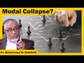

# Dr Al-Massari: Modal Collapse?! (2022-01-23 18:26:34+00:00)

## Description

حلقات ودروس الشيخ الدكتور محمد بن عبدالله المسعري
Study Circles of Professor Dr. Muhammad AL-MASSARI

Dr. Muhammad AL-MASSARI
Modal Collapse

## Transcript

[0:00:00](https://youtu.be/K9ZEKZKenjw?t=0) [Music]  
[0:00:24](https://youtu.be/K9ZEKZKenjw?t=24) welcome everyone  
[0:00:26](https://youtu.be/K9ZEKZKenjw?t=26) to yeah  
[0:00:30](https://youtu.be/K9ZEKZKenjw?t=30) logical matters we can  
[0:00:32](https://youtu.be/K9ZEKZKenjw?t=32) discuss it in english  
[0:00:34](https://youtu.be/K9ZEKZKenjw?t=34) uh it's going to be arguments  
[0:00:36](https://youtu.be/K9ZEKZKenjw?t=36) all array of arguments from atheism to  
[0:00:40](https://youtu.be/K9ZEKZKenjw?t=40) uh dsm  
[0:00:42](https://youtu.be/K9ZEKZKenjw?t=42) how do we check if revelation is true  
[0:00:45](https://youtu.be/K9ZEKZKenjw?t=45) uh all of these philosophical arguments  
[0:00:47](https://youtu.be/K9ZEKZKenjw?t=47) that uh  
[0:00:49](https://youtu.be/K9ZEKZKenjw?t=49) uh  
[0:00:51](https://youtu.be/K9ZEKZKenjw?t=51) are known to theologians okay um should  
[0:00:54](https://youtu.be/K9ZEKZKenjw?t=54) be today we're gonna talk about model  
[0:00:56](https://youtu.be/K9ZEKZKenjw?t=56) collapse um should we start with that  
[0:00:59](https://youtu.be/K9ZEKZKenjw?t=59) like um i i read the definition or what  
[0:01:01](https://youtu.be/K9ZEKZKenjw?t=61) what is meant by by model collapse  
[0:01:04](https://youtu.be/K9ZEKZKenjw?t=64) there's this video here also for the  
[0:01:07](https://youtu.be/K9ZEKZKenjw?t=67) uh the viewer has taken look to the  
[0:01:09](https://youtu.be/K9ZEKZKenjw?t=69) video  
[0:01:10](https://youtu.be/K9ZEKZKenjw?t=70) it's not bad it's a as as expected from  
[0:01:12](https://youtu.be/K9ZEKZKenjw?t=72) videos for the public it will be more in  
[0:01:14](https://youtu.be/K9ZEKZKenjw?t=74) a simplified language but the speaker  
[0:01:16](https://youtu.be/K9ZEKZKenjw?t=76) seems to be reasonably qualified and  
[0:01:18](https://youtu.be/K9ZEKZKenjw?t=78) he tried to display things as good as it  
[0:01:21](https://youtu.be/K9ZEKZKenjw?t=81) can be done  
[0:01:22](https://youtu.be/K9ZEKZKenjw?t=82) in just a public video  
[0:01:25](https://youtu.be/K9ZEKZKenjw?t=85) because some some of these things are  
[0:01:27](https://youtu.be/K9ZEKZKenjw?t=87) best done in in and writing in  
[0:01:29](https://youtu.be/K9ZEKZKenjw?t=89) very precise and technical writing but  
[0:01:32](https://youtu.be/K9ZEKZKenjw?t=92) anyway  
[0:01:34](https://youtu.be/K9ZEKZKenjw?t=94) still we can we can present something  
[0:01:36](https://youtu.be/K9ZEKZKenjw?t=96) orally  
[0:01:37](https://youtu.be/K9ZEKZKenjw?t=97) reasonably simplified for the general  
[0:01:39](https://youtu.be/K9ZEKZKenjw?t=99) public and for the interested people  
[0:01:41](https://youtu.be/K9ZEKZKenjw?t=101) yeah go ahead yeah continue  
[0:01:44](https://youtu.be/K9ZEKZKenjw?t=104) uh so we we could start with the  
[0:01:47](https://youtu.be/K9ZEKZKenjw?t=107) picture and we can read it  
[0:01:51](https://youtu.be/K9ZEKZKenjw?t=111) and go from there is that okay yeah  
[0:01:55](https://youtu.be/K9ZEKZKenjw?t=115) okay  
[0:01:56](https://youtu.be/K9ZEKZKenjw?t=116) uh  
[0:01:59](https://youtu.be/K9ZEKZKenjw?t=119) knights was check your dms please  
[0:02:05](https://youtu.be/K9ZEKZKenjw?t=125) all right  
[0:02:07](https://youtu.be/K9ZEKZKenjw?t=127) i sent it to you on discord do you want  
[0:02:08](https://youtu.be/K9ZEKZKenjw?t=128) to read the premise and we can start  
[0:02:10](https://youtu.be/K9ZEKZKenjw?t=130) with the shaykh  
[0:02:12](https://youtu.be/K9ZEKZKenjw?t=132) uh with the professor that's okay that's  
[0:02:14](https://youtu.be/K9ZEKZKenjw?t=134) it on discord  
[0:02:25](https://youtu.be/K9ZEKZKenjw?t=145) where's the aloneness argument do you  
[0:02:26](https://youtu.be/K9ZEKZKenjw?t=146) want to talk about this arguably  
[0:02:29](https://youtu.be/K9ZEKZKenjw?t=149) um  
[0:02:30](https://youtu.be/K9ZEKZKenjw?t=150) if you can be a bit louder  
[0:02:33](https://youtu.be/K9ZEKZKenjw?t=153) let's just send the aloneness argument  
[0:02:35](https://youtu.be/K9ZEKZKenjw?t=155) yeah yes  
[0:02:37](https://youtu.be/K9ZEKZKenjw?t=157) hi that argument  
[0:02:38](https://youtu.be/K9ZEKZKenjw?t=158) well it's it's a form of the model  
[0:02:40](https://youtu.be/K9ZEKZKenjw?t=160) collapse  
[0:02:41](https://youtu.be/K9ZEKZKenjw?t=161) and then we can introduce another one  
[0:02:44](https://youtu.be/K9ZEKZKenjw?t=164) after we go through this one to see how  
[0:02:46](https://youtu.be/K9ZEKZKenjw?t=166) it goes  
[0:02:51](https://youtu.be/K9ZEKZKenjw?t=171) the video says but it's another approach  
[0:02:54](https://youtu.be/K9ZEKZKenjw?t=174) okay yes  
[0:02:56](https://youtu.be/K9ZEKZKenjw?t=176) okay this is the unknown's argument like  
[0:02:59](https://youtu.be/K9ZEKZKenjw?t=179) um okay goes on premise one god could  
[0:03:02](https://youtu.be/K9ZEKZKenjw?t=182) have been alone  
[0:03:03](https://youtu.be/K9ZEKZKenjw?t=183) premise 2 necessarily god has contingent  
[0:03:06](https://youtu.be/K9ZEKZKenjw?t=186) knowledge  
[0:03:07](https://youtu.be/K9ZEKZKenjw?t=187) premise 3 this contingent knowledge is  
[0:03:10](https://youtu.be/K9ZEKZKenjw?t=190) either only intrinsic partly intrinsic  
[0:03:14](https://youtu.be/K9ZEKZKenjw?t=194) and partly extrinsic  
[0:03:15](https://youtu.be/K9ZEKZKenjw?t=195) or wholly extrinsic premise 4  
[0:03:19](https://youtu.be/K9ZEKZKenjw?t=199) it can be neither partly history sick  
[0:03:21](https://youtu.be/K9ZEKZKenjw?t=201) and partly extrinsic or all the  
[0:03:24](https://youtu.be/K9ZEKZKenjw?t=204) extrinsic  
[0:03:26](https://youtu.be/K9ZEKZKenjw?t=206) premise 5  
[0:03:27](https://youtu.be/K9ZEKZKenjw?t=207) what is it whatever is holy intrinsic to  
[0:03:29](https://youtu.be/K9ZEKZKenjw?t=209) god is either an essential feature or an  
[0:03:32](https://youtu.be/K9ZEKZKenjw?t=212) accident  
[0:03:34](https://youtu.be/K9ZEKZKenjw?t=214) premise 6 whatever is contingent cannot  
[0:03:36](https://youtu.be/K9ZEKZKenjw?t=216) be an essential feature of god  
[0:03:39](https://youtu.be/K9ZEKZKenjw?t=219) premise 7 if classical theism is true  
[0:03:42](https://youtu.be/K9ZEKZKenjw?t=222) it's not possible for god to have  
[0:03:44](https://youtu.be/K9ZEKZKenjw?t=224) accidents conclusion therefore classical  
[0:03:46](https://youtu.be/K9ZEKZKenjw?t=226) theism is false  
[0:03:51](https://youtu.be/K9ZEKZKenjw?t=231) that's the problem how are the events is  
[0:03:54](https://youtu.be/K9ZEKZKenjw?t=234) can can god have accident doesn't have  
[0:03:56](https://youtu.be/K9ZEKZKenjw?t=236) accidents on i think it  
[0:03:59](https://youtu.be/K9ZEKZKenjw?t=239) it's best really to go  
[0:04:01](https://youtu.be/K9ZEKZKenjw?t=241) to start  
[0:04:02](https://youtu.be/K9ZEKZKenjw?t=242) all of this summarize also a long  
[0:04:04](https://youtu.be/K9ZEKZKenjw?t=244) history of discussion over maybe two and  
[0:04:06](https://youtu.be/K9ZEKZKenjw?t=246) a half millennia or something like that  
[0:04:07](https://youtu.be/K9ZEKZKenjw?t=247) from our time starting with aristotle  
[0:04:10](https://youtu.be/K9ZEKZKenjw?t=250) plato and socrates where things started  
[0:04:12](https://youtu.be/K9ZEKZKenjw?t=252) to be articulated more technically  
[0:04:15](https://youtu.be/K9ZEKZKenjw?t=255) uh people are discussing obviously the  
[0:04:17](https://youtu.be/K9ZEKZKenjw?t=257) sophists were discussing things about  
[0:04:19](https://youtu.be/K9ZEKZKenjw?t=259) truth and not truth and general things  
[0:04:21](https://youtu.be/K9ZEKZKenjw?t=261) very sorry things then then socrates  
[0:04:23](https://youtu.be/K9ZEKZKenjw?t=263) started uh  
[0:04:24](https://youtu.be/K9ZEKZKenjw?t=264) really the philosophical discourse that  
[0:04:26](https://youtu.be/K9ZEKZKenjw?t=266) that the issues of of rationality as i  
[0:04:29](https://youtu.be/K9ZEKZKenjw?t=269) should be should be uh should be uh  
[0:04:33](https://youtu.be/K9ZEKZKenjw?t=273) more the the  
[0:04:34](https://youtu.be/K9ZEKZKenjw?t=274) the sophists will rely obviously on on  
[0:04:37](https://youtu.be/K9ZEKZKenjw?t=277) the non-uniqueness of language and the  
[0:04:39](https://youtu.be/K9ZEKZKenjw?t=279) possibility of the certain expressions  
[0:04:41](https://youtu.be/K9ZEKZKenjw?t=281) or or  
[0:04:42](https://youtu.be/K9ZEKZKenjw?t=282) or phrases may have multiple meaning and  
[0:04:44](https://youtu.be/K9ZEKZKenjw?t=284) the stress may be in a certain area  
[0:04:46](https://youtu.be/K9ZEKZKenjw?t=286) essentially if you make things informal  
[0:04:49](https://youtu.be/K9ZEKZKenjw?t=289) or not essentially but important part of  
[0:04:51](https://youtu.be/K9ZEKZKenjw?t=291) it if you write things in a formal  
[0:04:52](https://youtu.be/K9ZEKZKenjw?t=292) language it is very important to know uh  
[0:04:56](https://youtu.be/K9ZEKZKenjw?t=296) the various operators what they are  
[0:04:57](https://youtu.be/K9ZEKZKenjw?t=297) acting upon to use parenthesis usually  
[0:04:59](https://youtu.be/K9ZEKZKenjw?t=299) hypothesis in the common language you  
[0:05:01](https://youtu.be/K9ZEKZKenjw?t=301) don't use parenthesis we we do it in  
[0:05:05](https://youtu.be/K9ZEKZKenjw?t=305) starting from the context more or less  
[0:05:08](https://youtu.be/K9ZEKZKenjw?t=308) and sometimes it's not clear and this  
[0:05:09](https://youtu.be/K9ZEKZKenjw?t=309) will lead leads usually to so-called  
[0:05:11](https://youtu.be/K9ZEKZKenjw?t=311) sophisticated arguments that nothing can  
[0:05:13](https://youtu.be/K9ZEKZKenjw?t=313) be proven and everything care everything  
[0:05:15](https://youtu.be/K9ZEKZKenjw?t=315) can be proven to be false and through at  
[0:05:18](https://youtu.be/K9ZEKZKenjw?t=318) the same time and things like that  
[0:05:20](https://youtu.be/K9ZEKZKenjw?t=320) and that  
[0:05:21](https://youtu.be/K9ZEKZKenjw?t=321) led to the development of the formal  
[0:05:23](https://youtu.be/K9ZEKZKenjw?t=323) formal  
[0:05:24](https://youtu.be/K9ZEKZKenjw?t=324) uh  
[0:05:25](https://youtu.be/K9ZEKZKenjw?t=325) formal  
[0:05:27](https://youtu.be/K9ZEKZKenjw?t=327) various formal forms of logic classical  
[0:05:30](https://youtu.be/K9ZEKZKenjw?t=330) logic proportion  
[0:05:34](https://youtu.be/K9ZEKZKenjw?t=334) and various modal logics which have been  
[0:05:37](https://youtu.be/K9ZEKZKenjw?t=337) developed in a formal way relatively  
[0:05:39](https://youtu.be/K9ZEKZKenjw?t=339) recently they were not known  
[0:05:41](https://youtu.be/K9ZEKZKenjw?t=341) directly in this form of informalized  
[0:05:43](https://youtu.be/K9ZEKZKenjw?t=343) form in an ancient time  
[0:05:46](https://youtu.be/K9ZEKZKenjw?t=346) and then now things have developed that  
[0:05:48](https://youtu.be/K9ZEKZKenjw?t=348) that's that people just talk about god  
[0:05:50](https://youtu.be/K9ZEKZKenjw?t=350) and so on before defining what god means  
[0:05:53](https://youtu.be/K9ZEKZKenjw?t=353) so so  
[0:05:54](https://youtu.be/K9ZEKZKenjw?t=354) if we start with that we end nowhere  
[0:05:56](https://youtu.be/K9ZEKZKenjw?t=356) this is all uh i think the best thing is  
[0:05:58](https://youtu.be/K9ZEKZKenjw?t=358) that to go to square zero  
[0:06:00](https://youtu.be/K9ZEKZKenjw?t=360) square zero meaning in the first circle  
[0:06:02](https://youtu.be/K9ZEKZKenjw?t=362) this course  
[0:06:03](https://youtu.be/K9ZEKZKenjw?t=363) my definition of square zero is to start  
[0:06:06](https://youtu.be/K9ZEKZKenjw?t=366) with the with the cast uh kogi to  
[0:06:09](https://youtu.be/K9ZEKZKenjw?t=369) ergosome  
[0:06:10](https://youtu.be/K9ZEKZKenjw?t=370) i think therefore i exist obviously it's  
[0:06:12](https://youtu.be/K9ZEKZKenjw?t=372) phrased in a wrong way it is it's not  
[0:06:14](https://youtu.be/K9ZEKZKenjw?t=374) it's it's not a conclusion it is it's  
[0:06:16](https://youtu.be/K9ZEKZKenjw?t=376) easily expressing that  
[0:06:18](https://youtu.be/K9ZEKZKenjw?t=378) the  
[0:06:19](https://youtu.be/K9ZEKZKenjw?t=379) fact that i perceive my own existence is  
[0:06:21](https://youtu.be/K9ZEKZKenjw?t=381) immediately  
[0:06:23](https://youtu.be/K9ZEKZKenjw?t=383) uh present in my in my consciousness in  
[0:06:25](https://youtu.be/K9ZEKZKenjw?t=385) my mind that's it it is the it says the  
[0:06:28](https://youtu.be/K9ZEKZKenjw?t=388) necessity of internal perception in  
[0:06:30](https://youtu.be/K9ZEKZKenjw?t=390) arabic they call it  
[0:06:32](https://youtu.be/K9ZEKZKenjw?t=392) on  
[0:06:33](https://youtu.be/K9ZEKZKenjw?t=393) uh  
[0:06:34](https://youtu.be/K9ZEKZKenjw?t=394) external perception is the usual  
[0:06:35](https://youtu.be/K9ZEKZKenjw?t=395) perception excess or perception but  
[0:06:38](https://youtu.be/K9ZEKZKenjw?t=398) internal perception of the system  
[0:06:40](https://youtu.be/K9ZEKZKenjw?t=400) leads to this  
[0:06:41](https://youtu.be/K9ZEKZKenjw?t=401) recognition that i exist there's  
[0:06:43](https://youtu.be/K9ZEKZKenjw?t=403) something called i i can't refer to  
[0:06:45](https://youtu.be/K9ZEKZKenjw?t=405) myself as an i obviously this is a  
[0:06:47](https://youtu.be/K9ZEKZKenjw?t=407) symbol summary of developments over 2000  
[0:06:51](https://youtu.be/K9ZEKZKenjw?t=411) years before the cut summarize this way  
[0:06:53](https://youtu.be/K9ZEKZKenjw?t=413) this is like this is an absolute  
[0:06:55](https://youtu.be/K9ZEKZKenjw?t=415) starting point we have to start from  
[0:06:56](https://youtu.be/K9ZEKZKenjw?t=416) this if we want to be uh on firm footing  
[0:07:00](https://youtu.be/K9ZEKZKenjw?t=420) i suggest the cards but obviously the  
[0:07:02](https://youtu.be/K9ZEKZKenjw?t=422) card did not continue the project he  
[0:07:04](https://youtu.be/K9ZEKZKenjw?t=424) started there  
[0:07:05](https://youtu.be/K9ZEKZKenjw?t=425) and then jumped quickly to  
[0:07:07](https://youtu.be/K9ZEKZKenjw?t=427) to uh to a form of dermatological god  
[0:07:10](https://youtu.be/K9ZEKZKenjw?t=430) proof and other things  
[0:07:12](https://youtu.be/K9ZEKZKenjw?t=432) and the philosopher after that because  
[0:07:15](https://youtu.be/K9ZEKZKenjw?t=435) challenged by hume's uh doubt about uh  
[0:07:18](https://youtu.be/K9ZEKZKenjw?t=438) about claiming that the concept of  
[0:07:20](https://youtu.be/K9ZEKZKenjw?t=440) necessary existing being is is  
[0:07:23](https://youtu.be/K9ZEKZKenjw?t=443) contra which is  
[0:07:24](https://youtu.be/K9ZEKZKenjw?t=444) god's supposed to be unsuccessful  
[0:07:25](https://youtu.be/K9ZEKZKenjw?t=445) existing being  
[0:07:26](https://youtu.be/K9ZEKZKenjw?t=446) because he his existence did not start  
[0:07:29](https://youtu.be/K9ZEKZKenjw?t=449) in time so that's the difference  
[0:07:30](https://youtu.be/K9ZEKZKenjw?t=450) essentially what people have been in in  
[0:07:32](https://youtu.be/K9ZEKZKenjw?t=452) some amorphous in their mind that  
[0:07:34](https://youtu.be/K9ZEKZKenjw?t=454) anything starting in time is no  
[0:07:36](https://youtu.be/K9ZEKZKenjw?t=456) selection because it could have not  
[0:07:37](https://youtu.be/K9ZEKZKenjw?t=457) existed so and the other thing is that  
[0:07:40](https://youtu.be/K9ZEKZKenjw?t=460) social existing being  
[0:07:43](https://youtu.be/K9ZEKZKenjw?t=463) uh could not have started in time uh and  
[0:07:46](https://youtu.be/K9ZEKZKenjw?t=466) the is incredible you cannot conceive  
[0:07:47](https://youtu.be/K9ZEKZKenjw?t=467) any time he was where he could he was  
[0:07:50](https://youtu.be/K9ZEKZKenjw?t=470) not in existence so he said this concept  
[0:07:52](https://youtu.be/K9ZEKZKenjw?t=472) is contradictory and this challenge the  
[0:07:55](https://youtu.be/K9ZEKZKenjw?t=475) the existing philosopher his time  
[0:07:56](https://youtu.be/K9ZEKZKenjw?t=476) especially khan took the challenge and  
[0:07:58](https://youtu.be/K9ZEKZKenjw?t=478) then and he said this the statement of  
[0:08:01](https://youtu.be/K9ZEKZKenjw?t=481) uh of the account  
[0:08:03](https://youtu.be/K9ZEKZKenjw?t=483) has awakened him from his dogmatic  
[0:08:04](https://youtu.be/K9ZEKZKenjw?t=484) slumber he was  
[0:08:06](https://youtu.be/K9ZEKZKenjw?t=486) he regard himself as a sleep  
[0:08:09](https://youtu.be/K9ZEKZKenjw?t=489) relying on the classical dogmatism not  
[0:08:12](https://youtu.be/K9ZEKZKenjw?t=492) not the rheumatism of of the scholastic  
[0:08:14](https://youtu.be/K9ZEKZKenjw?t=494) because the scholastic has become like  
[0:08:16](https://youtu.be/K9ZEKZKenjw?t=496) uh at the time of the cut more release  
[0:08:18](https://youtu.be/K9ZEKZKenjw?t=498) and distribute it was only done  
[0:08:20](https://youtu.be/K9ZEKZKenjw?t=500) like  
[0:08:21](https://youtu.be/K9ZEKZKenjw?t=501) only only the church and the people in  
[0:08:24](https://youtu.be/K9ZEKZKenjw?t=504) the education were concerned with  
[0:08:26](https://youtu.be/K9ZEKZKenjw?t=506) scholastic philosophy more or less but  
[0:08:29](https://youtu.be/K9ZEKZKenjw?t=509) the the people outside the crowd spinoza  
[0:08:32](https://youtu.be/K9ZEKZKenjw?t=512) and all others they consider other  
[0:08:34](https://youtu.be/K9ZEKZKenjw?t=514) things trying to get  
[0:08:36](https://youtu.be/K9ZEKZKenjw?t=516) get things on a russian rationalistic  
[0:08:38](https://youtu.be/K9ZEKZKenjw?t=518) footing  
[0:08:41](https://youtu.be/K9ZEKZKenjw?t=521) and that's that's what he meant is his  
[0:08:43](https://youtu.be/K9ZEKZKenjw?t=523) dogmatic slumber he thought he said  
[0:08:45](https://youtu.be/K9ZEKZKenjw?t=525) basically a certain statement of  
[0:08:46](https://youtu.be/K9ZEKZKenjw?t=526) rational previous russian and  
[0:08:48](https://youtu.be/K9ZEKZKenjw?t=528) scholastism are  
[0:08:49](https://youtu.be/K9ZEKZKenjw?t=529) absolute and well established and they  
[0:08:51](https://youtu.be/K9ZEKZKenjw?t=531) did not be reconsidered so he was forced  
[0:08:53](https://youtu.be/K9ZEKZKenjw?t=533) to reconsider the issue of epistemology  
[0:08:56](https://youtu.be/K9ZEKZKenjw?t=536) and then  
[0:08:57](https://youtu.be/K9ZEKZKenjw?t=537) uh  
[0:08:58](https://youtu.be/K9ZEKZKenjw?t=538) in in his in his approach he did not  
[0:09:02](https://youtu.be/K9ZEKZKenjw?t=542) do very much justice to uh to issues of  
[0:09:05](https://youtu.be/K9ZEKZKenjw?t=545) ontology  
[0:09:06](https://youtu.be/K9ZEKZKenjw?t=546) so so the stress of western philosophy  
[0:09:09](https://youtu.be/K9ZEKZKenjw?t=549) was essentially until late in the  
[0:09:11](https://youtu.be/K9ZEKZKenjw?t=551) past century 20th century was  
[0:09:13](https://youtu.be/K9ZEKZKenjw?t=553) essentially an epistemology more or less  
[0:09:15](https://youtu.be/K9ZEKZKenjw?t=555) on epistemology there's ontology and so  
[0:09:17](https://youtu.be/K9ZEKZKenjw?t=557) on but it was just took a backseat  
[0:09:20](https://youtu.be/K9ZEKZKenjw?t=560) but i believe uh the right approach is  
[0:09:22](https://youtu.be/K9ZEKZKenjw?t=562) to have were both connected from the  
[0:09:24](https://youtu.be/K9ZEKZKenjw?t=564) beginning  
[0:09:25](https://youtu.be/K9ZEKZKenjw?t=565) and the  
[0:09:26](https://youtu.be/K9ZEKZKenjw?t=566) the and then go step by step in a  
[0:09:28](https://youtu.be/K9ZEKZKenjw?t=568) cautious way  
[0:09:30](https://youtu.be/K9ZEKZKenjw?t=570) uh starting from the cast let us do main  
[0:09:33](https://youtu.be/K9ZEKZKenjw?t=573) steps and then maybe we need more more  
[0:09:35](https://youtu.be/K9ZEKZKenjw?t=575) sessions not this this session will not  
[0:09:36](https://youtu.be/K9ZEKZKenjw?t=576) obviously enough clearly things we are  
[0:09:39](https://youtu.be/K9ZEKZKenjw?t=579) where people are struggling of over  
[0:09:41](https://youtu.be/K9ZEKZKenjw?t=581) several millions will not be will not be  
[0:09:43](https://youtu.be/K9ZEKZKenjw?t=583) addressed adequately in in just a couple  
[0:09:45](https://youtu.be/K9ZEKZKenjw?t=585) of hours but let us at this  
[0:09:47](https://youtu.be/K9ZEKZKenjw?t=587) just skeleton today and then we go maybe  
[0:09:50](https://youtu.be/K9ZEKZKenjw?t=590) more and more debit target so from this  
[0:09:53](https://youtu.be/K9ZEKZKenjw?t=593) this i recognize my or i perceive my own  
[0:09:56](https://youtu.be/K9ZEKZKenjw?t=596) existence  
[0:09:57](https://youtu.be/K9ZEKZKenjw?t=597) necessarily immediately  
[0:09:59](https://youtu.be/K9ZEKZKenjw?t=599) and a priori  
[0:10:01](https://youtu.be/K9ZEKZKenjw?t=601) is fundamental we can't have a starting  
[0:10:03](https://youtu.be/K9ZEKZKenjw?t=603) point because otherwise i have to doubt  
[0:10:05](https://youtu.be/K9ZEKZKenjw?t=605) my own existence but the mere doubt  
[0:10:09](https://youtu.be/K9ZEKZKenjw?t=609) prove that i exist and the doubting  
[0:10:11](https://youtu.be/K9ZEKZKenjw?t=611) entity so it is it's impossible to go  
[0:10:15](https://youtu.be/K9ZEKZKenjw?t=615) to go anywhere without admitting that as  
[0:10:17](https://youtu.be/K9ZEKZKenjw?t=617) an absolutely  
[0:10:19](https://youtu.be/K9ZEKZKenjw?t=619) necessity given  
[0:10:21](https://youtu.be/K9ZEKZKenjw?t=621) so that's the first step  
[0:10:23](https://youtu.be/K9ZEKZKenjw?t=623) that's step number one  
[0:10:25](https://youtu.be/K9ZEKZKenjw?t=625) okay so  
[0:10:27](https://youtu.be/K9ZEKZKenjw?t=627) let me see  
[0:10:31](https://youtu.be/K9ZEKZKenjw?t=631) from that  
[0:10:34](https://youtu.be/K9ZEKZKenjw?t=634) certain things are recognized by  
[0:10:36](https://youtu.be/K9ZEKZKenjw?t=636) internal even always on our internal  
[0:10:38](https://youtu.be/K9ZEKZKenjw?t=638) perception i'm just making the main  
[0:10:40](https://youtu.be/K9ZEKZKenjw?t=640) immense obstacles that that needs to be  
[0:10:43](https://youtu.be/K9ZEKZKenjw?t=643) further analyzed and discussed and some  
[0:10:44](https://youtu.be/K9ZEKZKenjw?t=644) philosophical discussions over the  
[0:10:46](https://youtu.be/K9ZEKZKenjw?t=646) extensive pages the implication of that  
[0:10:49](https://youtu.be/K9ZEKZKenjw?t=649) and concerning my own the eye that  
[0:10:52](https://youtu.be/K9ZEKZKenjw?t=652) then that was perceived by necessity  
[0:10:54](https://youtu.be/K9ZEKZKenjw?t=654) immediately  
[0:10:56](https://youtu.be/K9ZEKZKenjw?t=656) that i and this consciousness entails  
[0:10:58](https://youtu.be/K9ZEKZKenjw?t=658) also the necessity of reasons which are  
[0:11:00](https://youtu.be/K9ZEKZKenjw?t=660) built in in this in this kind of  
[0:11:01](https://youtu.be/K9ZEKZKenjw?t=661) consciousness like the impossibility of  
[0:11:03](https://youtu.be/K9ZEKZKenjw?t=663) contradictions obviously when i express  
[0:11:05](https://youtu.be/K9ZEKZKenjw?t=665) that fragile the impossibility of a  
[0:11:07](https://youtu.be/K9ZEKZKenjw?t=667) square  
[0:11:08](https://youtu.be/K9ZEKZKenjw?t=668) circle  
[0:11:10](https://youtu.be/K9ZEKZKenjw?t=670) that means that i have come the whole i  
[0:11:13](https://youtu.be/K9ZEKZKenjw?t=673) as a person have come through the  
[0:11:15](https://youtu.be/K9ZEKZKenjw?t=675) definition of a circle i've seen a  
[0:11:17](https://youtu.be/K9ZEKZKenjw?t=677) picture of a circle as picture of a  
[0:11:19](https://youtu.be/K9ZEKZKenjw?t=679) square and i can visualize both but it's  
[0:11:22](https://youtu.be/K9ZEKZKenjw?t=682) impossible to realize a square circle  
[0:11:24](https://youtu.be/K9ZEKZKenjw?t=684) and impossible mathematically it can be  
[0:11:25](https://youtu.be/K9ZEKZKenjw?t=685) proven that it's an impossibility it  
[0:11:27](https://youtu.be/K9ZEKZKenjw?t=687) doesn't exist all of that all of that  
[0:11:29](https://youtu.be/K9ZEKZKenjw?t=689) summarized just in the simple sense that  
[0:11:32](https://youtu.be/K9ZEKZKenjw?t=692) that the word  
[0:11:33](https://youtu.be/K9ZEKZKenjw?t=693) or the order or the concept of a squared  
[0:11:36](https://youtu.be/K9ZEKZKenjw?t=696) circle always exists in a language as a  
[0:11:38](https://youtu.be/K9ZEKZKenjw?t=698) linguistic expression or in a meta  
[0:11:41](https://youtu.be/K9ZEKZKenjw?t=701) language but it it  
[0:11:43](https://youtu.be/K9ZEKZKenjw?t=703) indicate  
[0:11:44](https://youtu.be/K9ZEKZKenjw?t=704) it doesn't it doesn't uh indicate any  
[0:11:47](https://youtu.be/K9ZEKZKenjw?t=707) existence it's an impossibility  
[0:11:49](https://youtu.be/K9ZEKZKenjw?t=709) so it's very well possible that we may  
[0:11:51](https://youtu.be/K9ZEKZKenjw?t=711) have a sentence  
[0:11:52](https://youtu.be/K9ZEKZKenjw?t=712) let's say we have we have an expression  
[0:11:54](https://youtu.be/K9ZEKZKenjw?t=714) or  
[0:11:55](https://youtu.be/K9ZEKZKenjw?t=715) or our concept consisting of one word or  
[0:11:58](https://youtu.be/K9ZEKZKenjw?t=718) two words doesn't matter  
[0:12:00](https://youtu.be/K9ZEKZKenjw?t=720) uh which refers to nothing it's a it  
[0:12:03](https://youtu.be/K9ZEKZKenjw?t=723) refers to something which is impossible  
[0:12:04](https://youtu.be/K9ZEKZKenjw?t=724) cannot exist we know that by necessity  
[0:12:07](https://youtu.be/K9ZEKZKenjw?t=727) from uh  
[0:12:08](https://youtu.be/K9ZEKZKenjw?t=728) being aware about their own  
[0:12:09](https://youtu.be/K9ZEKZKenjw?t=729) consciousness under what's own mind  
[0:12:12](https://youtu.be/K9ZEKZKenjw?t=732) but obviously you see a lot of input is  
[0:12:14](https://youtu.be/K9ZEKZKenjw?t=734) there language  
[0:12:16](https://youtu.be/K9ZEKZKenjw?t=736) uh  
[0:12:16](https://youtu.be/K9ZEKZKenjw?t=736) geometry and so on for for a single  
[0:12:19](https://youtu.be/K9ZEKZKenjw?t=739) person until you can phrase that and  
[0:12:22](https://youtu.be/K9ZEKZKenjw?t=742) make sense out of it you must have  
[0:12:24](https://youtu.be/K9ZEKZKenjw?t=744) developed like over a decade of  
[0:12:25](https://youtu.be/K9ZEKZKenjw?t=745) education primary education secondary uh  
[0:12:29](https://youtu.be/K9ZEKZKenjw?t=749) or mental education secondary maybe  
[0:12:31](https://youtu.be/K9ZEKZKenjw?t=751) university uh  
[0:12:32](https://youtu.be/K9ZEKZKenjw?t=752) level education either  
[0:12:35](https://youtu.be/K9ZEKZKenjw?t=755) foreign so you need like 10-15 years to  
[0:12:38](https://youtu.be/K9ZEKZKenjw?t=758) get there  
[0:12:39](https://youtu.be/K9ZEKZKenjw?t=759) humanity needed two two thousand years  
[0:12:42](https://youtu.be/K9ZEKZKenjw?t=762) to get there so don't don't be fooled by  
[0:12:44](https://youtu.be/K9ZEKZKenjw?t=764) that it is kind similar  
[0:12:46](https://youtu.be/K9ZEKZKenjw?t=766) expressed like that and we understand  
[0:12:48](https://youtu.be/K9ZEKZKenjw?t=768) each other that it is so obvious it is  
[0:12:50](https://youtu.be/K9ZEKZKenjw?t=770) it may it's a certain time it may have  
[0:12:52](https://youtu.be/K9ZEKZKenjw?t=772) not been that obvious  
[0:12:54](https://youtu.be/K9ZEKZKenjw?t=774) even issues of mathematics may have not  
[0:12:56](https://youtu.be/K9ZEKZKenjw?t=776) been over you you you you may have come  
[0:12:59](https://youtu.be/K9ZEKZKenjw?t=779) across the so-called  
[0:13:00](https://youtu.be/K9ZEKZKenjw?t=780) the  
[0:13:01](https://youtu.be/K9ZEKZKenjw?t=781) the  
[0:13:02](https://youtu.be/K9ZEKZKenjw?t=782) the paradox of the arrow that are  
[0:13:05](https://youtu.be/K9ZEKZKenjw?t=785) rotated to the arrow if i shoot an arrow  
[0:13:07](https://youtu.be/K9ZEKZKenjw?t=787) towards you  
[0:13:09](https://youtu.be/K9ZEKZKenjw?t=789) then according to some sophists or the  
[0:13:11](https://youtu.be/K9ZEKZKenjw?t=791) pro the people did not understand the  
[0:13:13](https://youtu.be/K9ZEKZKenjw?t=793) problem of limit and how to sum infinite  
[0:13:15](https://youtu.be/K9ZEKZKenjw?t=795) series at that time then the arrow must  
[0:13:18](https://youtu.be/K9ZEKZKenjw?t=798) take half of the distance  
[0:13:20](https://youtu.be/K9ZEKZKenjw?t=800) and then after  
[0:13:21](https://youtu.be/K9ZEKZKenjw?t=801) getting getting the half distance you  
[0:13:23](https://youtu.be/K9ZEKZKenjw?t=803) need to get the half the next day at the  
[0:13:25](https://youtu.be/K9ZEKZKenjw?t=805) remaining distance so a quarter and a  
[0:13:26](https://youtu.be/K9ZEKZKenjw?t=806) quarter of a quarter and so on so  
[0:13:28](https://youtu.be/K9ZEKZKenjw?t=808) according to that it will never reach  
[0:13:30](https://youtu.be/K9ZEKZKenjw?t=810) you but we know that it teach you if i  
[0:13:32](https://youtu.be/K9ZEKZKenjw?t=812) shoot and i'll throw you or a bullet i  
[0:13:34](https://youtu.be/K9ZEKZKenjw?t=814) will i'm going to kill you if i if you  
[0:13:36](https://youtu.be/K9ZEKZKenjw?t=816) aim properly so clearly there's some  
[0:13:38](https://youtu.be/K9ZEKZKenjw?t=818) fallacy the father says that because the  
[0:13:40](https://youtu.be/K9ZEKZKenjw?t=820) people did not at that time when they  
[0:13:42](https://youtu.be/K9ZEKZKenjw?t=822) put that paradox in it's not their  
[0:13:43](https://youtu.be/K9ZEKZKenjw?t=823) contradiction with the paradox  
[0:13:46](https://youtu.be/K9ZEKZKenjw?t=826) because the verbal description in this  
[0:13:48](https://youtu.be/K9ZEKZKenjw?t=828) symbol language does not represent the  
[0:13:50](https://youtu.be/K9ZEKZKenjw?t=830) reality which we see the  
[0:13:52](https://youtu.be/K9ZEKZKenjw?t=832) day in day out otherwise battles would  
[0:13:54](https://youtu.be/K9ZEKZKenjw?t=834) not have been fought and people not have  
[0:13:56](https://youtu.be/K9ZEKZKenjw?t=836) been killed by arrows so definitely  
[0:13:59](https://youtu.be/K9ZEKZKenjw?t=839) there's some something wrong there  
[0:14:00](https://youtu.be/K9ZEKZKenjw?t=840) something wrong is that there was no  
[0:14:02](https://youtu.be/K9ZEKZKenjw?t=842) real concept of how to make an infinite  
[0:14:04](https://youtu.be/K9ZEKZKenjw?t=844) sum and and  
[0:14:06](https://youtu.be/K9ZEKZKenjw?t=846) define convergence and diverges and  
[0:14:08](https://youtu.be/K9ZEKZKenjw?t=848) these things mathematics later developed  
[0:14:10](https://youtu.be/K9ZEKZKenjw?t=850) that and we have we for that it's very  
[0:14:13](https://youtu.be/K9ZEKZKenjw?t=853) trivial we know this is half plus  
[0:14:14](https://youtu.be/K9ZEKZKenjw?t=854) quarter plus eight etcetera the total  
[0:14:17](https://youtu.be/K9ZEKZKenjw?t=857) sum is equal one the total yourself so  
[0:14:19](https://youtu.be/K9ZEKZKenjw?t=859) it is it's not a problem for us it's  
[0:14:21](https://youtu.be/K9ZEKZKenjw?t=861) almost like a  
[0:14:22](https://youtu.be/K9ZEKZKenjw?t=862) not a not necessarily high school  
[0:14:24](https://youtu.be/K9ZEKZKenjw?t=864) problem but maybe first year university  
[0:14:26](https://youtu.be/K9ZEKZKenjw?t=866) problem and everyone regard that  
[0:14:28](https://youtu.be/K9ZEKZKenjw?t=868) everyone will laugh that the ancient  
[0:14:30](https://youtu.be/K9ZEKZKenjw?t=870) have a problem with that regardless as  
[0:14:31](https://youtu.be/K9ZEKZKenjw?t=871) paradoxical  
[0:14:33](https://youtu.be/K9ZEKZKenjw?t=873) so i'm just saying that as when we speak  
[0:14:35](https://youtu.be/K9ZEKZKenjw?t=875) about that intelligent perception of  
[0:14:37](https://youtu.be/K9ZEKZKenjw?t=877) these things this is that's the  
[0:14:38](https://youtu.be/K9ZEKZKenjw?t=878) summarizing enormous development of of  
[0:14:41](https://youtu.be/K9ZEKZKenjw?t=881) humanity as a humanity over thousands of  
[0:14:43](https://youtu.be/K9ZEKZKenjw?t=883) years and over a single person the one  
[0:14:45](https://youtu.be/K9ZEKZKenjw?t=885) who was speaking to you now and you your  
[0:14:47](https://youtu.be/K9ZEKZKenjw?t=887) cell phone you think about what i am  
[0:14:48](https://youtu.be/K9ZEKZKenjw?t=888) talking about uh  
[0:14:50](https://youtu.be/K9ZEKZKenjw?t=890) over over 10-15 years of sophistication  
[0:14:54](https://youtu.be/K9ZEKZKenjw?t=894) so it's not trivial  
[0:14:55](https://youtu.be/K9ZEKZKenjw?t=895) that's to summarize many things so we  
[0:14:57](https://youtu.be/K9ZEKZKenjw?t=897) have to sometimes to go back and  
[0:15:00](https://youtu.be/K9ZEKZKenjw?t=900) question ourselves  
[0:15:01](https://youtu.be/K9ZEKZKenjw?t=901) what's going on how we get get there  
[0:15:03](https://youtu.be/K9ZEKZKenjw?t=903) we get there most likely through  
[0:15:05](https://youtu.be/K9ZEKZKenjw?t=905) accumulated knowledge and common sense  
[0:15:08](https://youtu.be/K9ZEKZKenjw?t=908) so whatever we conclude what whatever we  
[0:15:10](https://youtu.be/K9ZEKZKenjw?t=910) get anywhere we should be always  
[0:15:12](https://youtu.be/K9ZEKZKenjw?t=912) checking back and making sure that we  
[0:15:14](https://youtu.be/K9ZEKZKenjw?t=914) did not negate common sense completely  
[0:15:16](https://youtu.be/K9ZEKZKenjw?t=916) but we improve on it and  
[0:15:19](https://youtu.be/K9ZEKZKenjw?t=919) and  
[0:15:20](https://youtu.be/K9ZEKZKenjw?t=920) try to find its border and limitation  
[0:15:23](https://youtu.be/K9ZEKZKenjw?t=923) but if we come to a situation where we  
[0:15:26](https://youtu.be/K9ZEKZKenjw?t=926) regard what common sense  
[0:15:28](https://youtu.be/K9ZEKZKenjw?t=928) and the majority of human beings who are  
[0:15:30](https://youtu.be/K9ZEKZKenjw?t=930) supposed to be rational beings agreed  
[0:15:32](https://youtu.be/K9ZEKZKenjw?t=932) upon that is completely negated there  
[0:15:34](https://youtu.be/K9ZEKZKenjw?t=934) must be some problem with that what we  
[0:15:36](https://youtu.be/K9ZEKZKenjw?t=936) achieved through there must be some  
[0:15:37](https://youtu.be/K9ZEKZKenjw?t=937) fallacy there  
[0:15:38](https://youtu.be/K9ZEKZKenjw?t=938) some some  
[0:15:40](https://youtu.be/K9ZEKZKenjw?t=940) expression which is not defined probably  
[0:15:43](https://youtu.be/K9ZEKZKenjw?t=943) some  
[0:15:45](https://youtu.be/K9ZEKZKenjw?t=945) some shooting over the border of the  
[0:15:46](https://youtu.be/K9ZEKZKenjw?t=946) saturn some some fallacy of  
[0:15:48](https://youtu.be/K9ZEKZKenjw?t=948) generalization or categoric fallacy so  
[0:15:50](https://youtu.be/K9ZEKZKenjw?t=950) we have to be critical going back and  
[0:15:52](https://youtu.be/K9ZEKZKenjw?t=952) forth so that's my suggestion how to get  
[0:15:55](https://youtu.be/K9ZEKZKenjw?t=955) through with these problems  
[0:15:56](https://youtu.be/K9ZEKZKenjw?t=956) so we have come to that now  
[0:15:59](https://youtu.be/K9ZEKZKenjw?t=959) we perceive  
[0:16:01](https://youtu.be/K9ZEKZKenjw?t=961) internally that the external world  
[0:16:02](https://youtu.be/K9ZEKZKenjw?t=962) exists  
[0:16:04](https://youtu.be/K9ZEKZKenjw?t=964) this could be an illusion that's the  
[0:16:05](https://youtu.be/K9ZEKZKenjw?t=965) first step because what we have is only  
[0:16:07](https://youtu.be/K9ZEKZKenjw?t=967) what we have internally what we see as  
[0:16:10](https://youtu.be/K9ZEKZKenjw?t=970) we claim it is an external world we see  
[0:16:12](https://youtu.be/K9ZEKZKenjw?t=972) i see this wall  
[0:16:16](https://youtu.be/K9ZEKZKenjw?t=976) and support the whole is the extent  
[0:16:17](https://youtu.be/K9ZEKZKenjw?t=977) outside of my being it's another entity  
[0:16:20](https://youtu.be/K9ZEKZKenjw?t=980) but that's what what i really perceive  
[0:16:21](https://youtu.be/K9ZEKZKenjw?t=981) is that what inside my consciousness the  
[0:16:24](https://youtu.be/K9ZEKZKenjw?t=984) representation of the wall or the  
[0:16:26](https://youtu.be/K9ZEKZKenjw?t=986) phenomenon as present in my  
[0:16:28](https://youtu.be/K9ZEKZKenjw?t=988) unconsciousness  
[0:16:31](https://youtu.be/K9ZEKZKenjw?t=991) that  
[0:16:34](https://youtu.be/K9ZEKZKenjw?t=994) by necessity it's there and by necessity  
[0:16:36](https://youtu.be/K9ZEKZKenjw?t=996) i know it is something different than my  
[0:16:37](https://youtu.be/K9ZEKZKenjw?t=997) myself so it says what what we call  
[0:16:40](https://youtu.be/K9ZEKZKenjw?t=1000) external what what is this relation to  
[0:16:42](https://youtu.be/K9ZEKZKenjw?t=1002) something really separated from my  
[0:16:44](https://youtu.be/K9ZEKZKenjw?t=1004) existence outside  
[0:16:46](https://youtu.be/K9ZEKZKenjw?t=1006) what it could be there are two ways to  
[0:16:48](https://youtu.be/K9ZEKZKenjw?t=1008) to  
[0:16:49](https://youtu.be/K9ZEKZKenjw?t=1009) to approach that  
[0:16:51](https://youtu.be/K9ZEKZKenjw?t=1011) does it represent something really  
[0:16:53](https://youtu.be/K9ZEKZKenjw?t=1013) outside my intellectual my body itself  
[0:16:55](https://youtu.be/K9ZEKZKenjw?t=1015) is outside by my entity i recognize that  
[0:16:57](https://youtu.be/K9ZEKZKenjw?t=1017) when when i look at my own legs i know  
[0:16:59](https://youtu.be/K9ZEKZKenjw?t=1019) it is my own legs  
[0:17:01](https://youtu.be/K9ZEKZKenjw?t=1021) and it's my own body because i can  
[0:17:03](https://youtu.be/K9ZEKZKenjw?t=1023) relate it through through causing pain  
[0:17:05](https://youtu.be/K9ZEKZKenjw?t=1025) and and touching it and pinching it and  
[0:17:07](https://youtu.be/K9ZEKZKenjw?t=1027) so on maybe but  
[0:17:09](https://youtu.be/K9ZEKZKenjw?t=1029) i know it is not my the same like i  
[0:17:11](https://youtu.be/K9ZEKZKenjw?t=1031) because it's very well conceivable and  
[0:17:13](https://youtu.be/K9ZEKZKenjw?t=1033) we see in the reality that many people  
[0:17:15](https://youtu.be/K9ZEKZKenjw?t=1035) having a cut leg until the they identify  
[0:17:17](https://youtu.be/K9ZEKZKenjw?t=1037) yeah they suffer some painless one but  
[0:17:19](https://youtu.be/K9ZEKZKenjw?t=1039) nothing like their their the perception  
[0:17:22](https://youtu.be/K9ZEKZKenjw?t=1042) of their own self that i still exist he  
[0:17:24](https://youtu.be/K9ZEKZKenjw?t=1044) will represent himself before cutting  
[0:17:26](https://youtu.be/K9ZEKZKenjw?t=1046) the leg and after that i am jim i am  
[0:17:28](https://youtu.be/K9ZEKZKenjw?t=1048) lisa jondo  
[0:17:30](https://youtu.be/K9ZEKZKenjw?t=1050) classical john doe name used in  
[0:17:32](https://youtu.be/K9ZEKZKenjw?t=1052) programming and things like that i am  
[0:17:34](https://youtu.be/K9ZEKZKenjw?t=1054) john doe before and after oh i have a  
[0:17:36](https://youtu.be/K9ZEKZKenjw?t=1056) pain now i lost a leg but he still  
[0:17:38](https://youtu.be/K9ZEKZKenjw?t=1058) there's him john doe  
[0:17:40](https://youtu.be/K9ZEKZKenjw?t=1060) so this is something external the body  
[0:17:42](https://youtu.be/K9ZEKZKenjw?t=1062) is stiller than the eye what's the  
[0:17:43](https://youtu.be/K9ZEKZKenjw?t=1063) nation of the body and the eye there's a  
[0:17:45](https://youtu.be/K9ZEKZKenjw?t=1065) very complex issue of  
[0:17:47](https://youtu.be/K9ZEKZKenjw?t=1067) of philosophy of the soul and philosophy  
[0:17:49](https://youtu.be/K9ZEKZKenjw?t=1069) of the mind and also psychology  
[0:17:51](https://youtu.be/K9ZEKZKenjw?t=1071) psychiatry we don't want to go to these  
[0:17:52](https://youtu.be/K9ZEKZKenjw?t=1072) fine details but  
[0:17:54](https://youtu.be/K9ZEKZKenjw?t=1074) that is external is  
[0:17:56](https://youtu.be/K9ZEKZKenjw?t=1076) is perceived by necessity  
[0:17:58](https://youtu.be/K9ZEKZKenjw?t=1078) now there's another approach  
[0:18:01](https://youtu.be/K9ZEKZKenjw?t=1081) which claims that it's  
[0:18:04](https://youtu.be/K9ZEKZKenjw?t=1084) in the mind it is present but it's  
[0:18:06](https://youtu.be/K9ZEKZKenjw?t=1086) actually planted in the mind by some  
[0:18:08](https://youtu.be/K9ZEKZKenjw?t=1088) other  
[0:18:10](https://youtu.be/K9ZEKZKenjw?t=1090) obviously must be done some kind of  
[0:18:12](https://youtu.be/K9ZEKZKenjw?t=1092) conscious being  
[0:18:14](https://youtu.be/K9ZEKZKenjw?t=1094) and  
[0:18:15](https://youtu.be/K9ZEKZKenjw?t=1095) this may be like something like like an  
[0:18:17](https://youtu.be/K9ZEKZKenjw?t=1097) evil computer like an evil entity or  
[0:18:19](https://youtu.be/K9ZEKZKenjw?t=1099) non-evil entity and some people prefer  
[0:18:22](https://youtu.be/K9ZEKZKenjw?t=1102) to call it a subconscious  
[0:18:24](https://youtu.be/K9ZEKZKenjw?t=1104) and some people should call it like the  
[0:18:26](https://youtu.be/K9ZEKZKenjw?t=1106) metrics like you know some of you have  
[0:18:27](https://youtu.be/K9ZEKZKenjw?t=1107) seen the movie of the metrics but does  
[0:18:30](https://youtu.be/K9ZEKZKenjw?t=1110) not negate that these entities that that  
[0:18:32](https://youtu.be/K9ZEKZKenjw?t=1112) what i perceive  
[0:18:33](https://youtu.be/K9ZEKZKenjw?t=1113) and they've been planted in my mind  
[0:18:35](https://youtu.be/K9ZEKZKenjw?t=1115) somehow by this entity is still an  
[0:18:37](https://youtu.be/K9ZEKZKenjw?t=1117) external to my being so we can't call it  
[0:18:39](https://youtu.be/K9ZEKZKenjw?t=1119) cell external world so it extends of an  
[0:18:41](https://youtu.be/K9ZEKZKenjw?t=1121) external world is there either because  
[0:18:44](https://youtu.be/K9ZEKZKenjw?t=1124) really external entities exist outside  
[0:18:46](https://youtu.be/K9ZEKZKenjw?t=1126) my being  
[0:18:48](https://youtu.be/K9ZEKZKenjw?t=1128) which is the standard one which we  
[0:18:49](https://youtu.be/K9ZEKZKenjw?t=1129) should we should we should assume  
[0:18:51](https://youtu.be/K9ZEKZKenjw?t=1131) by default or  
[0:18:53](https://youtu.be/K9ZEKZKenjw?t=1133) it is  
[0:18:54](https://youtu.be/K9ZEKZKenjw?t=1134) only a illusions created in my mind by  
[0:18:57](https://youtu.be/K9ZEKZKenjw?t=1137) another obviously by necessity it has to  
[0:18:59](https://youtu.be/K9ZEKZKenjw?t=1139) be also a conscious  
[0:19:01](https://youtu.be/K9ZEKZKenjw?t=1141) sufficiently capable and overwhelming  
[0:19:04](https://youtu.be/K9ZEKZKenjw?t=1144) and capable of shielding himself itself  
[0:19:06](https://youtu.be/K9ZEKZKenjw?t=1146) for me and uh surrounding me what the  
[0:19:09](https://youtu.be/K9ZEKZKenjw?t=1149) people call the matrix you know some of  
[0:19:11](https://youtu.be/K9ZEKZKenjw?t=1151) you may have seen this movie called the  
[0:19:12](https://youtu.be/K9ZEKZKenjw?t=1152) metrics which made us say a blunder of  
[0:19:15](https://youtu.be/K9ZEKZKenjw?t=1155) the holy she could not deal with the  
[0:19:16](https://youtu.be/K9ZEKZKenjw?t=1156) issue probably and ended into especially  
[0:19:19](https://youtu.be/K9ZEKZKenjw?t=1159) in the second part into a joke but the  
[0:19:21](https://youtu.be/K9ZEKZKenjw?t=1161) first part was a bit  
[0:19:23](https://youtu.be/K9ZEKZKenjw?t=1163) but obviously  
[0:19:24](https://youtu.be/K9ZEKZKenjw?t=1164) the people doing that did not have the  
[0:19:25](https://youtu.be/K9ZEKZKenjw?t=1165) philosophical education nor the  
[0:19:27](https://youtu.be/K9ZEKZKenjw?t=1167) sophistication to follow it but they  
[0:19:29](https://youtu.be/K9ZEKZKenjw?t=1169) have to make a movie so the people can  
[0:19:31](https://youtu.be/K9ZEKZKenjw?t=1171) enjoy something to see so they they run  
[0:19:33](https://youtu.be/K9ZEKZKenjw?t=1173) from contradiction to another  
[0:19:34](https://youtu.be/K9ZEKZKenjw?t=1174) contradiction if if you have seen the  
[0:19:37](https://youtu.be/K9ZEKZKenjw?t=1177) movie this matrix but in any case  
[0:19:40](https://youtu.be/K9ZEKZKenjw?t=1180) this avenue will not discuss now leave  
[0:19:42](https://youtu.be/K9ZEKZKenjw?t=1182) it at the side because this will lead us  
[0:19:44](https://youtu.be/K9ZEKZKenjw?t=1184) the same final conclusion like this as a  
[0:19:47](https://youtu.be/K9ZEKZKenjw?t=1187) other approach because there's no escape  
[0:19:50](https://youtu.be/K9ZEKZKenjw?t=1190) this or this someone who says another  
[0:19:52](https://youtu.be/K9ZEKZKenjw?t=1192) third approach actually is that  
[0:19:55](https://youtu.be/K9ZEKZKenjw?t=1195) these uh these what i perceive as  
[0:19:57](https://youtu.be/K9ZEKZKenjw?t=1197) external and necessary different for  
[0:19:59](https://youtu.be/K9ZEKZKenjw?t=1199) myself is there without any cause  
[0:20:01](https://youtu.be/K9ZEKZKenjw?t=1201) without any reason  
[0:20:03](https://youtu.be/K9ZEKZKenjw?t=1203) completely uncaused  
[0:20:08](https://youtu.be/K9ZEKZKenjw?t=1208) i could conceive rationally that's a  
[0:20:09](https://youtu.be/K9ZEKZKenjw?t=1209) possibility  
[0:20:11](https://youtu.be/K9ZEKZKenjw?t=1211) neither there's a matrix nor is it the  
[0:20:13](https://youtu.be/K9ZEKZKenjw?t=1213) external word so i'm alone in the  
[0:20:14](https://youtu.be/K9ZEKZKenjw?t=1214) universe  
[0:20:16](https://youtu.be/K9ZEKZKenjw?t=1216) but this will lead obviously to either  
[0:20:19](https://youtu.be/K9ZEKZKenjw?t=1219) entering into mental institution or  
[0:20:21](https://youtu.be/K9ZEKZKenjw?t=1221) further analysis if i am the only entity  
[0:20:24](https://youtu.be/K9ZEKZKenjw?t=1224) in existence  
[0:20:26](https://youtu.be/K9ZEKZKenjw?t=1226) and now than my my perception of myself  
[0:20:28](https://youtu.be/K9ZEKZKenjw?t=1228) that i started existing in time by  
[0:20:30](https://youtu.be/K9ZEKZKenjw?t=1230) because my parents met that's only  
[0:20:31](https://youtu.be/K9ZEKZKenjw?t=1231) imagination is not that is an illusion  
[0:20:34](https://youtu.be/K9ZEKZKenjw?t=1234) so  
[0:20:35](https://youtu.be/K9ZEKZKenjw?t=1235) then  
[0:20:36](https://youtu.be/K9ZEKZKenjw?t=1236) we will go down an infinite regress of  
[0:20:38](https://youtu.be/K9ZEKZKenjw?t=1238) illusions or  
[0:20:40](https://youtu.be/K9ZEKZKenjw?t=1240) i i must be them all that exists  
[0:20:43](https://youtu.be/K9ZEKZKenjw?t=1243) without any cause  
[0:20:45](https://youtu.be/K9ZEKZKenjw?t=1245) and in some sense necessary but this  
[0:20:47](https://youtu.be/K9ZEKZKenjw?t=1247) contradicts my own perception that i am  
[0:20:49](https://youtu.be/K9ZEKZKenjw?t=1249) not necessary that i'm contingent so it  
[0:20:51](https://youtu.be/K9ZEKZKenjw?t=1251) leads to never ending contradiction that  
[0:20:53](https://youtu.be/K9ZEKZKenjw?t=1253) can air contradiction be could i see and  
[0:20:55](https://youtu.be/K9ZEKZKenjw?t=1255) we go never ending circle that's it  
[0:20:57](https://youtu.be/K9ZEKZKenjw?t=1257) essentially maybe the state of the mind  
[0:20:59](https://youtu.be/K9ZEKZKenjw?t=1259) of some poor people who are the mental  
[0:21:01](https://youtu.be/K9ZEKZKenjw?t=1261) institution  
[0:21:02](https://youtu.be/K9ZEKZKenjw?t=1262) what leads you to thinking your  
[0:21:03](https://youtu.be/K9ZEKZKenjw?t=1263) necessary professor  
[0:21:05](https://youtu.be/K9ZEKZKenjw?t=1265) if you are the only an entity in  
[0:21:08](https://youtu.be/K9ZEKZKenjw?t=1268) existence  
[0:21:09](https://youtu.be/K9ZEKZKenjw?t=1269) and you exist  
[0:21:11](https://youtu.be/K9ZEKZKenjw?t=1271) then  
[0:21:12](https://youtu.be/K9ZEKZKenjw?t=1272) it has to be necessarily existing  
[0:21:16](https://youtu.be/K9ZEKZKenjw?t=1276) why and you have you have no beginning  
[0:21:19](https://youtu.be/K9ZEKZKenjw?t=1279) because you exist  
[0:21:21](https://youtu.be/K9ZEKZKenjw?t=1281) that's good you pursue yourself as  
[0:21:22](https://youtu.be/K9ZEKZKenjw?t=1282) existence you just you just said you  
[0:21:24](https://youtu.be/K9ZEKZKenjw?t=1284) exist that's compatible with you because  
[0:21:26](https://youtu.be/K9ZEKZKenjw?t=1286) the issue that you exist and you  
[0:21:27](https://youtu.be/K9ZEKZKenjw?t=1287) recognize yourself as an existence and  
[0:21:29](https://youtu.be/K9ZEKZKenjw?t=1289) you have now established that all that's  
[0:21:31](https://youtu.be/K9ZEKZKenjw?t=1291) in your is is  
[0:21:33](https://youtu.be/K9ZEKZKenjw?t=1293) emerging uh  
[0:21:35](https://youtu.be/K9ZEKZKenjw?t=1295) emerging completely completely uh  
[0:21:38](https://youtu.be/K9ZEKZKenjw?t=1298) spontaneously without any external thing  
[0:21:41](https://youtu.be/K9ZEKZKenjw?t=1301) as i i perceive them in the first  
[0:21:42](https://youtu.be/K9ZEKZKenjw?t=1302) instance i perceive as extender the wall  
[0:21:44](https://youtu.be/K9ZEKZKenjw?t=1304) is in front of me or the computer or  
[0:21:47](https://youtu.be/K9ZEKZKenjw?t=1307) yourself i'm talking to you that you're  
[0:21:48](https://youtu.be/K9ZEKZKenjw?t=1308) external different than my my eye  
[0:21:51](https://youtu.be/K9ZEKZKenjw?t=1311) and i can i i  
[0:21:53](https://youtu.be/K9ZEKZKenjw?t=1313) assume and and  
[0:21:55](https://youtu.be/K9ZEKZKenjw?t=1315) reasonably that  
[0:21:57](https://youtu.be/K9ZEKZKenjw?t=1317) if i cease to exist you are still there  
[0:21:59](https://youtu.be/K9ZEKZKenjw?t=1319) because you may be younger than myself  
[0:22:01](https://youtu.be/K9ZEKZKenjw?t=1321) or if you're one of your citizens to  
[0:22:02](https://youtu.be/K9ZEKZKenjw?t=1322) exist i'm still here so completely  
[0:22:04](https://youtu.be/K9ZEKZKenjw?t=1324) independent existing entities you are  
[0:22:06](https://youtu.be/K9ZEKZKenjw?t=1326) rather entitled than myself  
[0:22:08](https://youtu.be/K9ZEKZKenjw?t=1328) but if that's all imagination  
[0:22:11](https://youtu.be/K9ZEKZKenjw?t=1331) and it is not  
[0:22:12](https://youtu.be/K9ZEKZKenjw?t=1332) created by a matrix nor it is really by  
[0:22:15](https://youtu.be/K9ZEKZKenjw?t=1335) external reality than the other one it  
[0:22:17](https://youtu.be/K9ZEKZKenjw?t=1337) is just spontaneously there without any  
[0:22:19](https://youtu.be/K9ZEKZKenjw?t=1339) reason whatsoever  
[0:22:22](https://youtu.be/K9ZEKZKenjw?t=1342) i understood like half of that then that  
[0:22:24](https://youtu.be/K9ZEKZKenjw?t=1344) is that i  
[0:22:26](https://youtu.be/K9ZEKZKenjw?t=1346) has no beginning and no end  
[0:22:29](https://youtu.be/K9ZEKZKenjw?t=1349) and axe please can you wait until the  
[0:22:31](https://youtu.be/K9ZEKZKenjw?t=1351) professor finished then you can  
[0:22:33](https://youtu.be/K9ZEKZKenjw?t=1353) talk about the discussion so  
[0:22:35](https://youtu.be/K9ZEKZKenjw?t=1355) i'm just mentioning the three possible  
[0:22:37](https://youtu.be/K9ZEKZKenjw?t=1357) avenues when we start from absolute zero  
[0:22:40](https://youtu.be/K9ZEKZKenjw?t=1360) that avenue must be effect but if you  
[0:22:42](https://youtu.be/K9ZEKZKenjw?t=1362) use your uh the same  
[0:22:44](https://youtu.be/K9ZEKZKenjw?t=1364) irrational or mind capacity which  
[0:22:47](https://youtu.be/K9ZEKZKenjw?t=1367) recognize itself as i  
[0:22:50](https://youtu.be/K9ZEKZKenjw?t=1370) that will conclude that  
[0:22:52](https://youtu.be/K9ZEKZKenjw?t=1372) this this i has no beginning  
[0:22:54](https://youtu.be/K9ZEKZKenjw?t=1374) unnecessarily no end and the perception  
[0:22:57](https://youtu.be/K9ZEKZKenjw?t=1377) of time is also an illusion  
[0:22:59](https://youtu.be/K9ZEKZKenjw?t=1379) so that's all what is there is myself  
[0:23:02](https://youtu.be/K9ZEKZKenjw?t=1382) and exists and must will be necessarily  
[0:23:04](https://youtu.be/K9ZEKZKenjw?t=1384) existing  
[0:23:07](https://youtu.be/K9ZEKZKenjw?t=1387) containing everything in itself that's  
[0:23:08](https://youtu.be/K9ZEKZKenjw?t=1388) dominican is really existing containing  
[0:23:10](https://youtu.be/K9ZEKZKenjw?t=1390) all this condition of being in itself  
[0:23:13](https://youtu.be/K9ZEKZKenjw?t=1393) completely  
[0:23:16](https://youtu.be/K9ZEKZKenjw?t=1396) okay we're gonna just move to audiences  
[0:23:19](https://youtu.be/K9ZEKZKenjw?t=1399) and think about it yes  
[0:23:28](https://youtu.be/K9ZEKZKenjw?t=1408) i think that guy was uh joking so i  
[0:23:30](https://youtu.be/K9ZEKZKenjw?t=1410) moved him down yeah  
[0:23:33](https://youtu.be/K9ZEKZKenjw?t=1413) i would say this third one will will  
[0:23:35](https://youtu.be/K9ZEKZKenjw?t=1415) lead you to contradiction that if you  
[0:23:37](https://youtu.be/K9ZEKZKenjw?t=1417) are in closing of all your things of all  
[0:23:39](https://youtu.be/K9ZEKZKenjw?t=1419) things  
[0:23:41](https://youtu.be/K9ZEKZKenjw?t=1421) then  
[0:23:43](https://youtu.be/K9ZEKZKenjw?t=1423) necessity of reason dictate that this i  
[0:23:46](https://youtu.be/K9ZEKZKenjw?t=1426) which is conscious of its own being i am  
[0:23:50](https://youtu.be/K9ZEKZKenjw?t=1430) must be  
[0:23:52](https://youtu.be/K9ZEKZKenjw?t=1432) uh  
[0:23:54](https://youtu.be/K9ZEKZKenjw?t=1434) because it's necessarily existing it's  
[0:23:56](https://youtu.be/K9ZEKZKenjw?t=1436) all listening existence that knowledge  
[0:23:58](https://youtu.be/K9ZEKZKenjw?t=1438) must be more than that  
[0:24:01](https://youtu.be/K9ZEKZKenjw?t=1441) it must be it might it must be a  
[0:24:03](https://youtu.be/K9ZEKZKenjw?t=1443) comprehensive of anything possible  
[0:24:07](https://youtu.be/K9ZEKZKenjw?t=1447) but how come it is not able to do to  
[0:24:10](https://youtu.be/K9ZEKZKenjw?t=1450) establish the issue of these these these  
[0:24:12](https://youtu.be/K9ZEKZKenjw?t=1452) these illusions are are caused by  
[0:24:14](https://youtu.be/K9ZEKZKenjw?t=1454) something or uncaused or possibly  
[0:24:16](https://youtu.be/K9ZEKZKenjw?t=1456) uncaused and how they come how come they  
[0:24:18](https://youtu.be/K9ZEKZKenjw?t=1458) care because spontaneously  
[0:24:22](https://youtu.be/K9ZEKZKenjw?t=1462) so they seem seem to be a debug  
[0:24:24](https://youtu.be/K9ZEKZKenjw?t=1464) obviously someone has to flesh that more  
[0:24:26](https://youtu.be/K9ZEKZKenjw?t=1466) and more in detail out but it seems to  
[0:24:27](https://youtu.be/K9ZEKZKenjw?t=1467) me that my  
[0:24:29](https://youtu.be/K9ZEKZKenjw?t=1469) my my  
[0:24:30](https://youtu.be/K9ZEKZKenjw?t=1470) my my my consciousness my my mind is is  
[0:24:34](https://youtu.be/K9ZEKZKenjw?t=1474) is not infinite is limited is unable to  
[0:24:37](https://youtu.be/K9ZEKZKenjw?t=1477) and does not seem that is that was  
[0:24:39](https://youtu.be/K9ZEKZKenjw?t=1479) befitting for what we can call as  
[0:24:41](https://youtu.be/K9ZEKZKenjw?t=1481) necessarily existing being which has no  
[0:24:43](https://youtu.be/K9ZEKZKenjw?t=1483) beginning and no end which have all  
[0:24:44](https://youtu.be/K9ZEKZKenjw?t=1484) conditional existence in itself  
[0:24:46](https://youtu.be/K9ZEKZKenjw?t=1486) so how come that there is a limitation  
[0:24:48](https://youtu.be/K9ZEKZKenjw?t=1488) on its perception  
[0:24:50](https://youtu.be/K9ZEKZKenjw?t=1490) is its own internal perception this is  
[0:24:52](https://youtu.be/K9ZEKZKenjw?t=1492) knowledge you expect that to be at least  
[0:24:54](https://youtu.be/K9ZEKZKenjw?t=1494) having so  
[0:24:57](https://youtu.be/K9ZEKZKenjw?t=1497) vast knowledge of itself much better  
[0:24:59](https://youtu.be/K9ZEKZKenjw?t=1499) knowledge than that  
[0:25:04](https://youtu.be/K9ZEKZKenjw?t=1504) obeys an argument a fortune  
[0:25:07](https://youtu.be/K9ZEKZKenjw?t=1507) argument  
[0:25:08](https://youtu.be/K9ZEKZKenjw?t=1508) but that's not further so that's the  
[0:25:11](https://youtu.be/K9ZEKZKenjw?t=1511) third avenue as i would say this is the  
[0:25:12](https://youtu.be/K9ZEKZKenjw?t=1512) mental institution avenue i think we  
[0:25:14](https://youtu.be/K9ZEKZKenjw?t=1514) agree this would the avenue of the of  
[0:25:17](https://youtu.be/K9ZEKZKenjw?t=1517) the matrix  
[0:25:18](https://youtu.be/K9ZEKZKenjw?t=1518) ultimately ends really in an external  
[0:25:20](https://youtu.be/K9ZEKZKenjw?t=1520) world as reality and because this  
[0:25:22](https://youtu.be/K9ZEKZKenjw?t=1522) metrics will lead to either infinite  
[0:25:24](https://youtu.be/K9ZEKZKenjw?t=1524) regress or it is an ultimate being which  
[0:25:26](https://youtu.be/K9ZEKZKenjw?t=1526) created externality there's no need for  
[0:25:28](https://youtu.be/K9ZEKZKenjw?t=1528) for it to do it in my uh to do to make  
[0:25:31](https://youtu.be/K9ZEKZKenjw?t=1531) it an illusion to myself  
[0:25:33](https://youtu.be/K9ZEKZKenjw?t=1533) because if he can do that he can't do it  
[0:25:35](https://youtu.be/K9ZEKZKenjw?t=1535) outside either way so if it has  
[0:25:37](https://youtu.be/K9ZEKZKenjw?t=1537) sufficient power to do that then it has  
[0:25:38](https://youtu.be/K9ZEKZKenjw?t=1538) sufficient mode to do the other one but  
[0:25:40](https://youtu.be/K9ZEKZKenjw?t=1540) this is an avenue which is a little bit  
[0:25:43](https://youtu.be/K9ZEKZKenjw?t=1543) uh the benefit of the avenue of the  
[0:25:44](https://youtu.be/K9ZEKZKenjw?t=1544) matrix is that ultimately the matrix is  
[0:25:47](https://youtu.be/K9ZEKZKenjw?t=1547) a is a bigger mind and and this one is  
[0:25:50](https://youtu.be/K9ZEKZKenjw?t=1550) either contained in  
[0:25:51](https://youtu.be/K9ZEKZKenjw?t=1551) all what it does is  
[0:25:53](https://youtu.be/K9ZEKZKenjw?t=1553) instigated by another entity or by  
[0:25:55](https://youtu.be/K9ZEKZKenjw?t=1555) itself and by itself it has to be the  
[0:25:58](https://youtu.be/K9ZEKZKenjw?t=1558) without beginning and end it has to be  
[0:26:00](https://youtu.be/K9ZEKZKenjw?t=1560) perfect and complete  
[0:26:02](https://youtu.be/K9ZEKZKenjw?t=1562) by several arguments to that  
[0:26:04](https://youtu.be/K9ZEKZKenjw?t=1564) argument of the mental institution  
[0:26:08](https://youtu.be/K9ZEKZKenjw?t=1568) that has to be fleshed out i would say  
[0:26:09](https://youtu.be/K9ZEKZKenjw?t=1569) we can discount these two  
[0:26:11](https://youtu.be/K9ZEKZKenjw?t=1571) i think most human beings agree and we  
[0:26:13](https://youtu.be/K9ZEKZKenjw?t=1573) agree that they will say well that you  
[0:26:15](https://youtu.be/K9ZEKZKenjw?t=1575) are different myself and i said that for  
[0:26:17](https://youtu.be/K9ZEKZKenjw?t=1577) you and you have different parents and  
[0:26:19](https://youtu.be/K9ZEKZKenjw?t=1579) you have started to exist through the  
[0:26:21](https://youtu.be/K9ZEKZKenjw?t=1581) coming of your parents and if they would  
[0:26:23](https://youtu.be/K9ZEKZKenjw?t=1583) not have come and married you would not  
[0:26:24](https://youtu.be/K9ZEKZKenjw?t=1584) have came to existence et cetera  
[0:26:28](https://youtu.be/K9ZEKZKenjw?t=1588) the conclusion that follows basically is  
[0:26:30](https://youtu.be/K9ZEKZKenjw?t=1590) just that even though  
[0:26:32](https://youtu.be/K9ZEKZKenjw?t=1592) if even if if my  
[0:26:33](https://youtu.be/K9ZEKZKenjw?t=1593) experience is probable  
[0:26:36](https://youtu.be/K9ZEKZKenjw?t=1596) and i only you know i can only  
[0:26:39](https://youtu.be/K9ZEKZKenjw?t=1599) prove  
[0:26:40](https://youtu.be/K9ZEKZKenjw?t=1600) my kind of own existence it wouldn't  
[0:26:42](https://youtu.be/K9ZEKZKenjw?t=1602) still follow that  
[0:26:44](https://youtu.be/K9ZEKZKenjw?t=1604) there isn't something external out there  
[0:26:46](https://youtu.be/K9ZEKZKenjw?t=1606) whether if that's all if it is the only  
[0:26:47](https://youtu.be/K9ZEKZKenjw?t=1607) thing in existence is that i  
[0:26:50](https://youtu.be/K9ZEKZKenjw?t=1610) then we we we are in trouble then  
[0:26:53](https://youtu.be/K9ZEKZKenjw?t=1613) because  
[0:26:54](https://youtu.be/K9ZEKZKenjw?t=1614) this will we can construct internal  
[0:26:56](https://youtu.be/K9ZEKZKenjw?t=1616) contradiction but it has to be fleshed  
[0:26:58](https://youtu.be/K9ZEKZKenjw?t=1618) out maybe you have to think you have to  
[0:27:00](https://youtu.be/K9ZEKZKenjw?t=1620) analyze and see  
[0:27:02](https://youtu.be/K9ZEKZKenjw?t=1622) maybe we can  
[0:27:03](https://youtu.be/K9ZEKZKenjw?t=1623) read some memoirs of someone who was in  
[0:27:05](https://youtu.be/K9ZEKZKenjw?t=1625) the mental institution and  
[0:27:08](https://youtu.be/K9ZEKZKenjw?t=1628) was cured and came out and wrote what  
[0:27:10](https://youtu.be/K9ZEKZKenjw?t=1630) was his his dreams and visions of the  
[0:27:13](https://youtu.be/K9ZEKZKenjw?t=1633) reality when he was there  
[0:27:15](https://youtu.be/K9ZEKZKenjw?t=1635) it may go to such an extreme possibly we  
[0:27:17](https://youtu.be/K9ZEKZKenjw?t=1637) don't know  
[0:27:18](https://youtu.be/K9ZEKZKenjw?t=1638) because seem to be we we have no concept  
[0:27:20](https://youtu.be/K9ZEKZKenjw?t=1640) for how these the people who are in in  
[0:27:22](https://youtu.be/K9ZEKZKenjw?t=1642) the mental institution uh envisage the  
[0:27:24](https://youtu.be/K9ZEKZKenjw?t=1644) world  
[0:27:25](https://youtu.be/K9ZEKZKenjw?t=1645) some of them really believe for example  
[0:27:27](https://youtu.be/K9ZEKZKenjw?t=1647) that that some of them believe that he's  
[0:27:28](https://youtu.be/K9ZEKZKenjw?t=1648) got another belief that he's napoleon  
[0:27:30](https://youtu.be/K9ZEKZKenjw?t=1650) and all these things we know about these  
[0:27:32](https://youtu.be/K9ZEKZKenjw?t=1652) stories i don't think all of these  
[0:27:34](https://youtu.be/K9ZEKZKenjw?t=1654) stories are fabricated nor it is made by  
[0:27:36](https://youtu.be/K9ZEKZKenjw?t=1656) our internal uh the deceptive mind  
[0:27:44](https://youtu.be/K9ZEKZKenjw?t=1664) we will go in we will go in a mental  
[0:27:46](https://youtu.be/K9ZEKZKenjw?t=1666) state ourselves we go this avenue the  
[0:27:48](https://youtu.be/K9ZEKZKenjw?t=1668) average of the vibrations does not let  
[0:27:50](https://youtu.be/K9ZEKZKenjw?t=1670) the mental state but at least the more  
[0:27:52](https://youtu.be/K9ZEKZKenjw?t=1672) complicated way it was a supreme being  
[0:27:54](https://youtu.be/K9ZEKZKenjw?t=1674) which is supreme mind  
[0:27:56](https://youtu.be/K9ZEKZKenjw?t=1676) it really there now the external one is  
[0:27:58](https://youtu.be/K9ZEKZKenjw?t=1678) that what we should have the problem is  
[0:28:00](https://youtu.be/K9ZEKZKenjw?t=1680) there is somebody in mind we might  
[0:28:02](https://youtu.be/K9ZEKZKenjw?t=1682) that's one but let's assume there's an  
[0:28:04](https://youtu.be/K9ZEKZKenjw?t=1684) external world  
[0:28:06](https://youtu.be/K9ZEKZKenjw?t=1686) that that what what what we find in  
[0:28:09](https://youtu.be/K9ZEKZKenjw?t=1689) internally in our consciousness uh  
[0:28:11](https://youtu.be/K9ZEKZKenjw?t=1691) representing it  
[0:28:13](https://youtu.be/K9ZEKZKenjw?t=1693) it is it is not exactly external world  
[0:28:14](https://youtu.be/K9ZEKZKenjw?t=1694) itself but it is an image of it or a  
[0:28:17](https://youtu.be/K9ZEKZKenjw?t=1697) representation of it sufficiently well  
[0:28:20](https://youtu.be/K9ZEKZKenjw?t=1700) representation representing that in in  
[0:28:22](https://youtu.be/K9ZEKZKenjw?t=1702) some sense or another  
[0:28:24](https://youtu.be/K9ZEKZKenjw?t=1704) also open the problem is what the  
[0:28:25](https://youtu.be/K9ZEKZKenjw?t=1705) meaning of color and so on color  
[0:28:27](https://youtu.be/K9ZEKZKenjw?t=1707) represents certain frequency of the  
[0:28:28](https://youtu.be/K9ZEKZKenjw?t=1708) light and all these things and we call  
[0:28:31](https://youtu.be/K9ZEKZKenjw?t=1711) it color and we perceive it internally  
[0:28:33](https://youtu.be/K9ZEKZKenjw?t=1713) that's the how this external reality is  
[0:28:35](https://youtu.be/K9ZEKZKenjw?t=1715) is mapped  
[0:28:37](https://youtu.be/K9ZEKZKenjw?t=1717) internally but we can assume safely it  
[0:28:39](https://youtu.be/K9ZEKZKenjw?t=1719) is it is mapped  
[0:28:42](https://youtu.be/K9ZEKZKenjw?t=1722) reasonably in such a way that different  
[0:28:44](https://youtu.be/K9ZEKZKenjw?t=1724) things are mapped differently and the  
[0:28:45](https://youtu.be/K9ZEKZKenjw?t=1725) same thing the same entity is mapped  
[0:28:48](https://youtu.be/K9ZEKZKenjw?t=1728) exactly the same  
[0:28:49](https://youtu.be/K9ZEKZKenjw?t=1729) well does that mapping protect the  
[0:28:52](https://youtu.be/K9ZEKZKenjw?t=1732) relation of identities  
[0:28:54](https://youtu.be/K9ZEKZKenjw?t=1734) the principle of identity  
[0:28:55](https://youtu.be/K9ZEKZKenjw?t=1735) and  
[0:28:56](https://youtu.be/K9ZEKZKenjw?t=1736) and  
[0:28:57](https://youtu.be/K9ZEKZKenjw?t=1737) makes good sense so there's a there's at  
[0:28:59](https://youtu.be/K9ZEKZKenjw?t=1739) least at least one to one correspondence  
[0:29:02](https://youtu.be/K9ZEKZKenjw?t=1742) not necessarily completely subjective  
[0:29:04](https://youtu.be/K9ZEKZKenjw?t=1744) rejective  
[0:29:06](https://youtu.be/K9ZEKZKenjw?t=1746) but at least one to one  
[0:29:08](https://youtu.be/K9ZEKZKenjw?t=1748) so we can be safe that we're gonna see  
[0:29:11](https://youtu.be/K9ZEKZKenjw?t=1751) this wall in my room it's different than  
[0:29:12](https://youtu.be/K9ZEKZKenjw?t=1752) the wall i saw in my friend's house it's  
[0:29:14](https://youtu.be/K9ZEKZKenjw?t=1754) different one  
[0:29:15](https://youtu.be/K9ZEKZKenjw?t=1755) i can perceive it and i can distinguish  
[0:29:17](https://youtu.be/K9ZEKZKenjw?t=1757) between them so distinguished  
[0:29:20](https://youtu.be/K9ZEKZKenjw?t=1760) are represented honestly and correctly  
[0:29:23](https://youtu.be/K9ZEKZKenjw?t=1763) so then we have the external world then  
[0:29:26](https://youtu.be/K9ZEKZKenjw?t=1766) then we have now we have uh  
[0:29:29](https://youtu.be/K9ZEKZKenjw?t=1769) we have uh casually mentioned that  
[0:29:32](https://youtu.be/K9ZEKZKenjw?t=1772) distinguished mark said that we're  
[0:29:34](https://youtu.be/K9ZEKZKenjw?t=1774) talking about so-called attributes or  
[0:29:35](https://youtu.be/K9ZEKZKenjw?t=1775) properties this is the word property  
[0:29:40](https://youtu.be/K9ZEKZKenjw?t=1780) and then we come to actions because this  
[0:29:42](https://youtu.be/K9ZEKZKenjw?t=1782) is also a fundamental uh  
[0:29:44](https://youtu.be/K9ZEKZKenjw?t=1784) elementary elementary concept which is  
[0:29:47](https://youtu.be/K9ZEKZKenjw?t=1787) as as as perceived immediately with my  
[0:29:50](https://youtu.be/K9ZEKZKenjw?t=1790) consciousness or  
[0:29:51](https://youtu.be/K9ZEKZKenjw?t=1791) my  
[0:29:52](https://youtu.be/K9ZEKZKenjw?t=1792) mind as my own access almost as my own  
[0:29:56](https://youtu.be/K9ZEKZKenjw?t=1796) existence  
[0:29:58](https://youtu.be/K9ZEKZKenjw?t=1798) is that  
[0:30:00](https://youtu.be/K9ZEKZKenjw?t=1800) an entity which has no attributes and no  
[0:30:02](https://youtu.be/K9ZEKZKenjw?t=1802) probabilities  
[0:30:04](https://youtu.be/K9ZEKZKenjw?t=1804) just pure intellectual existence without  
[0:30:06](https://youtu.be/K9ZEKZKenjw?t=1806) any other attributes does not seem to be  
[0:30:09](https://youtu.be/K9ZEKZKenjw?t=1809) rationally conceivable  
[0:30:10](https://youtu.be/K9ZEKZKenjw?t=1810) actually it is a  
[0:30:12](https://youtu.be/K9ZEKZKenjw?t=1812) it's impossible  
[0:30:14](https://youtu.be/K9ZEKZKenjw?t=1814) for me for myself for example i know i  
[0:30:16](https://youtu.be/K9ZEKZKenjw?t=1816) exist yeah i recognize my existence but  
[0:30:18](https://youtu.be/K9ZEKZKenjw?t=1818) i recognize that i am rational  
[0:30:21](https://youtu.be/K9ZEKZKenjw?t=1821) i'm rational entity i recognize that  
[0:30:24](https://youtu.be/K9ZEKZKenjw?t=1824) that i  
[0:30:25](https://youtu.be/K9ZEKZKenjw?t=1825) i have certain certain uh attributes  
[0:30:29](https://youtu.be/K9ZEKZKenjw?t=1829) internal attributes leave the external  
[0:30:30](https://youtu.be/K9ZEKZKenjw?t=1830) one but external word like the body  
[0:30:32](https://youtu.be/K9ZEKZKenjw?t=1832) calarife recognizes on my body i am  
[0:30:35](https://youtu.be/K9ZEKZKenjw?t=1835) darker someone is whiter and things like  
[0:30:37](https://youtu.be/K9ZEKZKenjw?t=1837) that but and also things in the external  
[0:30:39](https://youtu.be/K9ZEKZKenjw?t=1839) world we recognize that have things  
[0:30:41](https://youtu.be/K9ZEKZKenjw?t=1841) called color have certain  
[0:30:42](https://youtu.be/K9ZEKZKenjw?t=1842) attribute temperature and things like  
[0:30:44](https://youtu.be/K9ZEKZKenjw?t=1844) that  
[0:30:45](https://youtu.be/K9ZEKZKenjw?t=1845) properties  
[0:30:46](https://youtu.be/K9ZEKZKenjw?t=1846) the definition of world is that  
[0:30:48](https://youtu.be/K9ZEKZKenjw?t=1848) what specify or uh ad certain for  
[0:30:53](https://youtu.be/K9ZEKZKenjw?t=1853) is is really a fundamental concept but  
[0:30:56](https://youtu.be/K9ZEKZKenjw?t=1856) but we try to  
[0:30:57](https://youtu.be/K9ZEKZKenjw?t=1857) by expressing in in in some sentences we  
[0:31:01](https://youtu.be/K9ZEKZKenjw?t=1861) try to to bring that clear to the mind  
[0:31:04](https://youtu.be/K9ZEKZKenjw?t=1864) it is something which characterizes an  
[0:31:06](https://youtu.be/K9ZEKZKenjw?t=1866) entity  
[0:31:07](https://youtu.be/K9ZEKZKenjw?t=1867) it cannot be envisaged without an entity  
[0:31:10](https://youtu.be/K9ZEKZKenjw?t=1870) by definition  
[0:31:11](https://youtu.be/K9ZEKZKenjw?t=1871) an attribute or a property  
[0:31:13](https://youtu.be/K9ZEKZKenjw?t=1873) belongs to an entity and is carried by  
[0:31:16](https://youtu.be/K9ZEKZKenjw?t=1876) the entity in that sense it belongs to  
[0:31:18](https://youtu.be/K9ZEKZKenjw?t=1878) entity it  
[0:31:20](https://youtu.be/K9ZEKZKenjw?t=1880) it is  
[0:31:21](https://youtu.be/K9ZEKZKenjw?t=1881) what what we should call it cannot be  
[0:31:23](https://youtu.be/K9ZEKZKenjw?t=1883) simulated from an entity it's  
[0:31:25](https://youtu.be/K9ZEKZKenjw?t=1885) essentially connected panel says it  
[0:31:27](https://youtu.be/K9ZEKZKenjw?t=1887) there is no way to invisi otherwise we  
[0:31:29](https://youtu.be/K9ZEKZKenjw?t=1889) have  
[0:31:30](https://youtu.be/K9ZEKZKenjw?t=1890) we we otherwise we we have uh  
[0:31:33](https://youtu.be/K9ZEKZKenjw?t=1893) we have violated the definition of  
[0:31:35](https://youtu.be/K9ZEKZKenjw?t=1895) probability by definition it is like  
[0:31:36](https://youtu.be/K9ZEKZKenjw?t=1896) that  
[0:31:37](https://youtu.be/K9ZEKZKenjw?t=1897) but definition is like that  
[0:31:40](https://youtu.be/K9ZEKZKenjw?t=1900) so uh the  
[0:31:42](https://youtu.be/K9ZEKZKenjw?t=1902) the the question of of an entity with  
[0:31:44](https://youtu.be/K9ZEKZKenjw?t=1904) this attributes that the entity is  
[0:31:46](https://youtu.be/K9ZEKZKenjw?t=1906) composed of whenever uh that anything or  
[0:31:48](https://youtu.be/K9ZEKZKenjw?t=1908) in an entities converge with a sense or  
[0:31:51](https://youtu.be/K9ZEKZKenjw?t=1911) or an entity without any attributes a  
[0:31:53](https://youtu.be/K9ZEKZKenjw?t=1913) pure entity or something like that and  
[0:31:55](https://youtu.be/K9ZEKZKenjw?t=1915) attributes is wrong because it is not  
[0:31:58](https://youtu.be/K9ZEKZKenjw?t=1918) composed it's no composition this is a  
[0:32:00](https://youtu.be/K9ZEKZKenjw?t=1920) necessity concept concept  
[0:32:02](https://youtu.be/K9ZEKZKenjw?t=1922) connection based on the  
[0:32:04](https://youtu.be/K9ZEKZKenjw?t=1924) uh based on the  
[0:32:06](https://youtu.be/K9ZEKZKenjw?t=1926) uh on the definition it's by definition  
[0:32:09](https://youtu.be/K9ZEKZKenjw?t=1929) per definition like that so  
[0:32:11](https://youtu.be/K9ZEKZKenjw?t=1931) the fact that a being necessary or  
[0:32:14](https://youtu.be/K9ZEKZKenjw?t=1934) otherwise god or otherwise having  
[0:32:15](https://youtu.be/K9ZEKZKenjw?t=1935) attributes  
[0:32:17](https://youtu.be/K9ZEKZKenjw?t=1937) does not negate simplicity does not mean  
[0:32:19](https://youtu.be/K9ZEKZKenjw?t=1939) he is composed composes something else  
[0:32:22](https://youtu.be/K9ZEKZKenjw?t=1942) so that's that's the first point to be  
[0:32:24](https://youtu.be/K9ZEKZKenjw?t=1944) clarified so attributes and  
[0:32:34](https://youtu.be/K9ZEKZKenjw?t=1954) classified as a composition that this  
[0:32:36](https://youtu.be/K9ZEKZKenjw?t=1956) entity which has five six attributes is  
[0:32:39](https://youtu.be/K9ZEKZKenjw?t=1959) not composed of five six things plus  
[0:32:41](https://youtu.be/K9ZEKZKenjw?t=1961) a nucleus which has nothing whatsoever  
[0:32:44](https://youtu.be/K9ZEKZKenjw?t=1964) attributed to it that does not exist  
[0:32:46](https://youtu.be/K9ZEKZKenjw?t=1966) that says and a pure what they called in  
[0:32:48](https://youtu.be/K9ZEKZKenjw?t=1968) arabic that a pure  
[0:32:51](https://youtu.be/K9ZEKZKenjw?t=1971) a sense or being without any attribute  
[0:32:54](https://youtu.be/K9ZEKZKenjw?t=1974) whatsoever is an impossibility exactly  
[0:32:56](https://youtu.be/K9ZEKZKenjw?t=1976) like a square circle  
[0:32:58](https://youtu.be/K9ZEKZKenjw?t=1978) we can phrase it we can use a researcher  
[0:33:01](https://youtu.be/K9ZEKZKenjw?t=1981) we call that that  
[0:33:02](https://youtu.be/K9ZEKZKenjw?t=1982) in arabic that the pure or community  
[0:33:05](https://youtu.be/K9ZEKZKenjw?t=1985) abstracted that it is just  
[0:33:07](https://youtu.be/K9ZEKZKenjw?t=1987) a just  
[0:33:08](https://youtu.be/K9ZEKZKenjw?t=1988) a linguistic expression made  
[0:33:12](https://youtu.be/K9ZEKZKenjw?t=1992) to allow us to study that and establish  
[0:33:14](https://youtu.be/K9ZEKZKenjw?t=1994) it doesn't exist or does it make any  
[0:33:16](https://youtu.be/K9ZEKZKenjw?t=1996) sense is it impossibility it's not  
[0:33:17](https://youtu.be/K9ZEKZKenjw?t=1997) that's all what it's what it is does it  
[0:33:19](https://youtu.be/K9ZEKZKenjw?t=1999) make any sense is it coherent to uncover  
[0:33:21](https://youtu.be/K9ZEKZKenjw?t=2001) that's wrong  
[0:33:22](https://youtu.be/K9ZEKZKenjw?t=2002) exactly like that we can construct  
[0:33:25](https://youtu.be/K9ZEKZKenjw?t=2005) something like the square circle a  
[0:33:26](https://youtu.be/K9ZEKZKenjw?t=2006) circle which has the attribute who means  
[0:33:28](https://youtu.be/K9ZEKZKenjw?t=2008) square is impossible so we conclude but  
[0:33:31](https://youtu.be/K9ZEKZKenjw?t=2011) it does not prevent us from  
[0:33:32](https://youtu.be/K9ZEKZKenjw?t=2012) linguistically formulating that so we  
[0:33:34](https://youtu.be/K9ZEKZKenjw?t=2014) have to be cautious in these things so  
[0:33:36](https://youtu.be/K9ZEKZKenjw?t=2016) the issue of attribute and entity  
[0:33:39](https://youtu.be/K9ZEKZKenjw?t=2019) but also we perceive in the universe on  
[0:33:41](https://youtu.be/K9ZEKZKenjw?t=2021) ourselves also that says this is called  
[0:33:43](https://youtu.be/K9ZEKZKenjw?t=2023) actions  
[0:33:46](https://youtu.be/K9ZEKZKenjw?t=2026) like in the external world we see  
[0:33:48](https://youtu.be/K9ZEKZKenjw?t=2028) something started to move after it was  
[0:33:49](https://youtu.be/K9ZEKZKenjw?t=2029) not moving am i lifting his hand his  
[0:33:52](https://youtu.be/K9ZEKZKenjw?t=2032) hand was uh was his side  
[0:33:55](https://youtu.be/K9ZEKZKenjw?t=2035) and he's lifting it  
[0:33:56](https://youtu.be/K9ZEKZKenjw?t=2036) something start moving  
[0:33:58](https://youtu.be/K9ZEKZKenjw?t=2038) relative to us where everything is  
[0:34:00](https://youtu.be/K9ZEKZKenjw?t=2040) negative to us and we or the coordinate  
[0:34:03](https://youtu.be/K9ZEKZKenjw?t=2043) system we use our own coordinate system  
[0:34:05](https://youtu.be/K9ZEKZKenjw?t=2045) all the time then later on we will  
[0:34:06](https://youtu.be/K9ZEKZKenjw?t=2046) discuss the issue of coordinate system  
[0:34:08](https://youtu.be/K9ZEKZKenjw?t=2048) changing and so on we will go to space  
[0:34:09](https://youtu.be/K9ZEKZKenjw?t=2049) and time  
[0:34:10](https://youtu.be/K9ZEKZKenjw?t=2050) then we have  
[0:34:12](https://youtu.be/K9ZEKZKenjw?t=2052) this matter of action it's related to  
[0:34:13](https://youtu.be/K9ZEKZKenjw?t=2053) time but we'll come to that but when we  
[0:34:16](https://youtu.be/K9ZEKZKenjw?t=2056) look at action for ourself  
[0:34:20](https://youtu.be/K9ZEKZKenjw?t=2060) i know for myself for example that i  
[0:34:23](https://youtu.be/K9ZEKZKenjw?t=2063) decided with relax  
[0:34:25](https://youtu.be/K9ZEKZKenjw?t=2065) to to have this halacha fix at that time  
[0:34:28](https://youtu.be/K9ZEKZKenjw?t=2068) i could have decided otherwise this  
[0:34:30](https://youtu.be/K9ZEKZKenjw?t=2070) weekend i have i'm receiving family  
[0:34:32](https://youtu.be/K9ZEKZKenjw?t=2072) members i would rather postpone to next  
[0:34:35](https://youtu.be/K9ZEKZKenjw?t=2075) weekend i haven't realized even but i  
[0:34:36](https://youtu.be/K9ZEKZKenjw?t=2076) didn't decide to say so i decided to  
[0:34:39](https://youtu.be/K9ZEKZKenjw?t=2079) hold  
[0:34:40](https://youtu.be/K9ZEKZKenjw?t=2080) uh this this this discussion uh  
[0:34:43](https://youtu.be/K9ZEKZKenjw?t=2083) circle or this this clubhouse uh meeting  
[0:34:47](https://youtu.be/K9ZEKZKenjw?t=2087) or on  
[0:34:48](https://youtu.be/K9ZEKZKenjw?t=2088) today and not cancel it i could have  
[0:34:50](https://youtu.be/K9ZEKZKenjw?t=2090) decided otherwise  
[0:34:52](https://youtu.be/K9ZEKZKenjw?t=2092) deciding or not deciding otherwise  
[0:34:55](https://youtu.be/K9ZEKZKenjw?t=2095) meaning i have done it to i i feel  
[0:34:58](https://youtu.be/K9ZEKZKenjw?t=2098) my necessity that i have the free of  
[0:35:00](https://youtu.be/K9ZEKZKenjw?t=2100) choice i could have that otherwise i am  
[0:35:02](https://youtu.be/K9ZEKZKenjw?t=2102) a free agent i can i can have the  
[0:35:04](https://youtu.be/K9ZEKZKenjw?t=2104) freedom of choice  
[0:35:05](https://youtu.be/K9ZEKZKenjw?t=2105) this may be an illusion also but that  
[0:35:07](https://youtu.be/K9ZEKZKenjw?t=2107) has to be proven the one who claims that  
[0:35:09](https://youtu.be/K9ZEKZKenjw?t=2109) illusion has to prove it  
[0:35:12](https://youtu.be/K9ZEKZKenjw?t=2112) because my immediate perception is that  
[0:35:14](https://youtu.be/K9ZEKZKenjw?t=2114) i am free agent i have  
[0:35:17](https://youtu.be/K9ZEKZKenjw?t=2117) does not  
[0:35:18](https://youtu.be/K9ZEKZKenjw?t=2118) preclude that there are external  
[0:35:19](https://youtu.be/K9ZEKZKenjw?t=2119) conditions which are dictating that to  
[0:35:21](https://youtu.be/K9ZEKZKenjw?t=2121) me without me being conscious about that  
[0:35:22](https://youtu.be/K9ZEKZKenjw?t=2122) exactly like the matrix maybe but that's  
[0:35:25](https://youtu.be/K9ZEKZKenjw?t=2125) another issue  
[0:35:26](https://youtu.be/K9ZEKZKenjw?t=2126) still internally immediate perception  
[0:35:30](https://youtu.be/K9ZEKZKenjw?t=2130) show me that there is something which we  
[0:35:31](https://youtu.be/K9ZEKZKenjw?t=2131) can't uh  
[0:35:32](https://youtu.be/K9ZEKZKenjw?t=2132) action by freedom meaning i am a free  
[0:35:34](https://youtu.be/K9ZEKZKenjw?t=2134) there is a there is a  
[0:35:35](https://youtu.be/K9ZEKZKenjw?t=2135) i have an attribute of being a free  
[0:35:37](https://youtu.be/K9ZEKZKenjw?t=2137) agent  
[0:35:38](https://youtu.be/K9ZEKZKenjw?t=2138) the one who can choose to do something  
[0:35:41](https://youtu.be/K9ZEKZKenjw?t=2141) or otherwise not to do  
[0:35:43](https://youtu.be/K9ZEKZKenjw?t=2143) he has a choice  
[0:35:44](https://youtu.be/K9ZEKZKenjw?t=2144) obviously  
[0:35:45](https://youtu.be/K9ZEKZKenjw?t=2145) clearly  
[0:35:46](https://youtu.be/K9ZEKZKenjw?t=2146) everyone perceived that in himself that  
[0:35:48](https://youtu.be/K9ZEKZKenjw?t=2148) my freedom is not unlimited without any  
[0:35:51](https://youtu.be/K9ZEKZKenjw?t=2151) border there is a certain external  
[0:35:53](https://youtu.be/K9ZEKZKenjw?t=2153) condition and says there but still i  
[0:35:56](https://youtu.be/K9ZEKZKenjw?t=2156) have i have  
[0:35:57](https://youtu.be/K9ZEKZKenjw?t=2157) i perceive by necessity that i have a  
[0:36:00](https://youtu.be/K9ZEKZKenjw?t=2160) certain wide area mild or small as well  
[0:36:03](https://youtu.be/K9ZEKZKenjw?t=2163) as you wish that is a finite area of  
[0:36:05](https://youtu.be/K9ZEKZKenjw?t=2165) choices and which can move freely inside  
[0:36:08](https://youtu.be/K9ZEKZKenjw?t=2168) it and spontaneously i can decide to do  
[0:36:11](https://youtu.be/K9ZEKZKenjw?t=2171) uh which i would otherwise could have  
[0:36:13](https://youtu.be/K9ZEKZKenjw?t=2173) been deciding not to do  
[0:36:16](https://youtu.be/K9ZEKZKenjw?t=2176) so the concept of free agent or freedom  
[0:36:18](https://youtu.be/K9ZEKZKenjw?t=2178) is fundamental it's as fundamental as  
[0:36:21](https://youtu.be/K9ZEKZKenjw?t=2181) the  
[0:36:22](https://youtu.be/K9ZEKZKenjw?t=2182) existence  
[0:36:23](https://youtu.be/K9ZEKZKenjw?t=2183) uh is is  
[0:36:26](https://youtu.be/K9ZEKZKenjw?t=2186) fundamental as uh  
[0:36:29](https://youtu.be/K9ZEKZKenjw?t=2189) the issue of necessities is fundamental  
[0:36:31](https://youtu.be/K9ZEKZKenjw?t=2191) as the mathematical description of  
[0:36:33](https://youtu.be/K9ZEKZKenjw?t=2193) circles and so on which obviously  
[0:36:34](https://youtu.be/K9ZEKZKenjw?t=2194) relates to space and time we come later  
[0:36:36](https://youtu.be/K9ZEKZKenjw?t=2196) but we took we advanced it because we  
[0:36:38](https://youtu.be/K9ZEKZKenjw?t=2198) need examples and we are not starting  
[0:36:40](https://youtu.be/K9ZEKZKenjw?t=2200) from absolute zero really we're starting  
[0:36:42](https://youtu.be/K9ZEKZKenjw?t=2202) we pretend to be a starting starting map  
[0:36:44](https://youtu.be/K9ZEKZKenjw?t=2204) solicitor but we're starting a huge  
[0:36:46](https://youtu.be/K9ZEKZKenjw?t=2206) amount of accumulation of information  
[0:36:48](https://youtu.be/K9ZEKZKenjw?t=2208) and experiences of humanity over several  
[0:36:51](https://youtu.be/K9ZEKZKenjw?t=2211) thousands of years and as of my self  
[0:36:54](https://youtu.be/K9ZEKZKenjw?t=2214) personality over decades of of life  
[0:36:57](https://youtu.be/K9ZEKZKenjw?t=2217) so so we use examples which has not been  
[0:37:00](https://youtu.be/K9ZEKZKenjw?t=2220) defined before because we agree everyone  
[0:37:02](https://youtu.be/K9ZEKZKenjw?t=2222) knows the definition and he has almost  
[0:37:04](https://youtu.be/K9ZEKZKenjw?t=2224) everyone has has met that before or  
[0:37:06](https://youtu.be/K9ZEKZKenjw?t=2226) everyone who is involved in these kind  
[0:37:08](https://youtu.be/K9ZEKZKenjw?t=2228) of discourses like the square circle as  
[0:37:10](https://youtu.be/K9ZEKZKenjw?t=2230) well maybe uh  
[0:37:12](https://youtu.be/K9ZEKZKenjw?t=2232) people in the amazon did not have even a  
[0:37:14](https://youtu.be/K9ZEKZKenjw?t=2234) concept of circle or square maybe i said  
[0:37:16](https://youtu.be/K9ZEKZKenjw?t=2236) because they don't have this level of  
[0:37:18](https://youtu.be/K9ZEKZKenjw?t=2238) sophisticated mathematics and  
[0:37:19](https://youtu.be/K9ZEKZKenjw?t=2239) development but generally most human  
[0:37:22](https://youtu.be/K9ZEKZKenjw?t=2242) beings especially educated ones who  
[0:37:24](https://youtu.be/K9ZEKZKenjw?t=2244) reach the university level who share  
[0:37:26](https://youtu.be/K9ZEKZKenjw?t=2246) luckily at our time tens and hundreds of  
[0:37:28](https://youtu.be/K9ZEKZKenjw?t=2248) millions  
[0:37:29](https://youtu.be/K9ZEKZKenjw?t=2249) do have these concepts and they can  
[0:37:30](https://youtu.be/K9ZEKZKenjw?t=2250) understand  
[0:37:32](https://youtu.be/K9ZEKZKenjw?t=2252) so we have this  
[0:37:33](https://youtu.be/K9ZEKZKenjw?t=2253) the the the fact that we have  
[0:37:36](https://youtu.be/K9ZEKZKenjw?t=2256) that that we have uh this definition of  
[0:37:38](https://youtu.be/K9ZEKZKenjw?t=2258) free agent and that's freedom is a  
[0:37:40](https://youtu.be/K9ZEKZKenjw?t=2260) fundamental concept which has to be  
[0:37:42](https://youtu.be/K9ZEKZKenjw?t=2262) taken under the contrary as with the  
[0:37:44](https://youtu.be/K9ZEKZKenjw?t=2264) content of concept as existence whether  
[0:37:46](https://youtu.be/K9ZEKZKenjw?t=2266) it's over being of probability and also  
[0:37:49](https://youtu.be/K9ZEKZKenjw?t=2269) of  
[0:37:50](https://youtu.be/K9ZEKZKenjw?t=2270) being a free agent this attribute of  
[0:37:52](https://youtu.be/K9ZEKZKenjw?t=2272) being a free agent and free agency is is  
[0:37:55](https://youtu.be/K9ZEKZKenjw?t=2275) is something which we perceive from  
[0:37:57](https://youtu.be/K9ZEKZKenjw?t=2277) ourselves  
[0:37:58](https://youtu.be/K9ZEKZKenjw?t=2278) even if we are is only even if we are  
[0:38:00](https://youtu.be/K9ZEKZKenjw?t=2280) only in a uh  
[0:38:02](https://youtu.be/K9ZEKZKenjw?t=2282) if it's an illusion and if we are  
[0:38:04](https://youtu.be/K9ZEKZKenjw?t=2284) deceived it's a deception of some  
[0:38:06](https://youtu.be/K9ZEKZKenjw?t=2286) external integrity and we are deceived  
[0:38:09](https://youtu.be/K9ZEKZKenjw?t=2289) to think that we are free but we  
[0:38:10](https://youtu.be/K9ZEKZKenjw?t=2290) perceive this freedom and we understand  
[0:38:12](https://youtu.be/K9ZEKZKenjw?t=2292) it and we can analyze it and we can  
[0:38:14](https://youtu.be/K9ZEKZKenjw?t=2294) describe it  
[0:38:17](https://youtu.be/K9ZEKZKenjw?t=2297) also it may be a deception it could be a  
[0:38:19](https://youtu.be/K9ZEKZKenjw?t=2299) deception but still it is describable  
[0:38:21](https://youtu.be/K9ZEKZKenjw?t=2301) and we can understand it  
[0:38:25](https://youtu.be/K9ZEKZKenjw?t=2305) another issue which should have have to  
[0:38:27](https://youtu.be/K9ZEKZKenjw?t=2307) be to be to be also addressed  
[0:38:30](https://youtu.be/K9ZEKZKenjw?t=2310) in the  
[0:38:31](https://youtu.be/K9ZEKZKenjw?t=2311) square zero is the issue of space and  
[0:38:33](https://youtu.be/K9ZEKZKenjw?t=2313) time space let us look at your space  
[0:38:36](https://youtu.be/K9ZEKZKenjw?t=2316) where the issue of space and dimensions  
[0:38:38](https://youtu.be/K9ZEKZKenjw?t=2318) come originally is that because i have  
[0:38:41](https://youtu.be/K9ZEKZKenjw?t=2321) freedom of  
[0:38:43](https://youtu.be/K9ZEKZKenjw?t=2323) perceived movement i perceive that i can  
[0:38:44](https://youtu.be/K9ZEKZKenjw?t=2324) move and walk towards the wall and touch  
[0:38:47](https://youtu.be/K9ZEKZKenjw?t=2327) it and fire it find it it's solid so i  
[0:38:49](https://youtu.be/K9ZEKZKenjw?t=2329) can move move forward and backward  
[0:38:51](https://youtu.be/K9ZEKZKenjw?t=2331) right and left and up and down by  
[0:38:53](https://youtu.be/K9ZEKZKenjw?t=2333) another for example  
[0:38:55](https://youtu.be/K9ZEKZKenjw?t=2335) so  
[0:38:55](https://youtu.be/K9ZEKZKenjw?t=2335) clearly i have some kind three degrees  
[0:38:57](https://youtu.be/K9ZEKZKenjw?t=2337) of freedom  
[0:38:58](https://youtu.be/K9ZEKZKenjw?t=2338) by by perception or at least as it's  
[0:39:00](https://youtu.be/K9ZEKZKenjw?t=2340) present in my in my uh in my  
[0:39:03](https://youtu.be/K9ZEKZKenjw?t=2343) consciousness made by the matrix  
[0:39:05](https://youtu.be/K9ZEKZKenjw?t=2345) like these poor guys which are used by  
[0:39:08](https://youtu.be/K9ZEKZKenjw?t=2348) by this evil computer as batteries and  
[0:39:10](https://youtu.be/K9ZEKZKenjw?t=2350) the movimetrics but it is it is in their  
[0:39:13](https://youtu.be/K9ZEKZKenjw?t=2353) imagination and they they perceive it  
[0:39:15](https://youtu.be/K9ZEKZKenjw?t=2355) like that and exist at least in their  
[0:39:17](https://youtu.be/K9ZEKZKenjw?t=2357) imagination  
[0:39:20](https://youtu.be/K9ZEKZKenjw?t=2360) while they're in that state of our  
[0:39:22](https://youtu.be/K9ZEKZKenjw?t=2362) imagination myself assuming even being  
[0:39:24](https://youtu.be/K9ZEKZKenjw?t=2364) in a matrix i still can perceive and  
[0:39:27](https://youtu.be/K9ZEKZKenjw?t=2367) understand that they go left and right  
[0:39:29](https://youtu.be/K9ZEKZKenjw?t=2369) front so i have three damages movement  
[0:39:32](https://youtu.be/K9ZEKZKenjw?t=2372) interestingly  
[0:39:34](https://youtu.be/K9ZEKZKenjw?t=2374) i can obviously this is all again don't  
[0:39:37](https://youtu.be/K9ZEKZKenjw?t=2377) take it as a triviality i can define and  
[0:39:40](https://youtu.be/K9ZEKZKenjw?t=2380) record this system when i am in the  
[0:39:42](https://youtu.be/K9ZEKZKenjw?t=2382) center and they have access going right  
[0:39:44](https://youtu.be/K9ZEKZKenjw?t=2384) and left  
[0:39:45](https://youtu.be/K9ZEKZKenjw?t=2385) front and back and up and down we call  
[0:39:47](https://youtu.be/K9ZEKZKenjw?t=2387) it xyz  
[0:39:49](https://youtu.be/K9ZEKZKenjw?t=2389) that's not trivial that's this kind of  
[0:39:51](https://youtu.be/K9ZEKZKenjw?t=2391) description we came to it only recently  
[0:39:54](https://youtu.be/K9ZEKZKenjw?t=2394) maybe 500 years ago it's not two hundred  
[0:39:56](https://youtu.be/K9ZEKZKenjw?t=2396) years old and and you come to it in  
[0:39:58](https://youtu.be/K9ZEKZKenjw?t=2398) school nowadays i think they give it for  
[0:40:00](https://youtu.be/K9ZEKZKenjw?t=2400) i think they give it to kids even in the  
[0:40:02](https://youtu.be/K9ZEKZKenjw?t=2402) early in in the later years of the  
[0:40:05](https://youtu.be/K9ZEKZKenjw?t=2405) elementary school or grammar school  
[0:40:06](https://youtu.be/K9ZEKZKenjw?t=2406) maybe maybe a little bit later beginning  
[0:40:08](https://youtu.be/K9ZEKZKenjw?t=2408) of the high school in that form xyz  
[0:40:11](https://youtu.be/K9ZEKZKenjw?t=2411) maybe in this subject form maybe a  
[0:40:12](https://youtu.be/K9ZEKZKenjw?t=2412) little bit later in high school  
[0:40:14](https://youtu.be/K9ZEKZKenjw?t=2414) so this is this is only a considerable  
[0:40:16](https://youtu.be/K9ZEKZKenjw?t=2416) abstraction and human development  
[0:40:18](https://youtu.be/K9ZEKZKenjw?t=2418) interestingly  
[0:40:20](https://youtu.be/K9ZEKZKenjw?t=2420) in space  
[0:40:22](https://youtu.be/K9ZEKZKenjw?t=2422) at the beginning it seems to be when i'm  
[0:40:24](https://youtu.be/K9ZEKZKenjw?t=2424) facing a certain direction sitting in my  
[0:40:26](https://youtu.be/K9ZEKZKenjw?t=2426) chair now and discussing with you my  
[0:40:28](https://youtu.be/K9ZEKZKenjw?t=2428) left and right this wall is to the left  
[0:40:29](https://youtu.be/K9ZEKZKenjw?t=2429) to the right my right after to my right  
[0:40:32](https://youtu.be/K9ZEKZKenjw?t=2432) is a wall after some distance two meters  
[0:40:34](https://youtu.be/K9ZEKZKenjw?t=2434) toward my left is actually a window a  
[0:40:37](https://youtu.be/K9ZEKZKenjw?t=2437) garden  
[0:40:40](https://youtu.be/K9ZEKZKenjw?t=2440) but actually right and left can be  
[0:40:43](https://youtu.be/K9ZEKZKenjw?t=2443) can be uh can be exchanged  
[0:40:45](https://youtu.be/K9ZEKZKenjw?t=2445) there's a symmetry there i can't turn  
[0:40:47](https://youtu.be/K9ZEKZKenjw?t=2447) face in the opposite direction and the  
[0:40:49](https://youtu.be/K9ZEKZKenjw?t=2449) left arrives so there is no reason to  
[0:40:51](https://youtu.be/K9ZEKZKenjw?t=2451) treat the dimension the in the one  
[0:40:53](https://youtu.be/K9ZEKZKenjw?t=2453) dimension in one direction and the  
[0:40:55](https://youtu.be/K9ZEKZKenjw?t=2455) opposite direction as differently so  
[0:40:56](https://youtu.be/K9ZEKZKenjw?t=2456) they can extend symmetrical they should  
[0:40:58](https://youtu.be/K9ZEKZKenjw?t=2458) be extended symmetrically now  
[0:41:02](https://youtu.be/K9ZEKZKenjw?t=2462) people mathematician let's start with  
[0:41:04](https://youtu.be/K9ZEKZKenjw?t=2464) that  
[0:41:05](https://youtu.be/K9ZEKZKenjw?t=2465) on a drawing board or in a sheet of  
[0:41:07](https://youtu.be/K9ZEKZKenjw?t=2467) paper they draw things and so on and we  
[0:41:08](https://youtu.be/K9ZEKZKenjw?t=2468) have just a finite sheet and you have uh  
[0:41:11](https://youtu.be/K9ZEKZKenjw?t=2471) and you have called the systems and you  
[0:41:12](https://youtu.be/K9ZEKZKenjw?t=2472) draw your vectors and you draw your your  
[0:41:14](https://youtu.be/K9ZEKZKenjw?t=2474) diagrams on your pictures  
[0:41:17](https://youtu.be/K9ZEKZKenjw?t=2477) then we do a fundamental fundamentally  
[0:41:20](https://youtu.be/K9ZEKZKenjw?t=2480) important step you say what happens if i  
[0:41:22](https://youtu.be/K9ZEKZKenjw?t=2482) extend behind the wall imagine the wall  
[0:41:24](https://youtu.be/K9ZEKZKenjw?t=2484) is removed  
[0:41:26](https://youtu.be/K9ZEKZKenjw?t=2486) there's another what is another state  
[0:41:27](https://youtu.be/K9ZEKZKenjw?t=2487) imagine these houses are removed and  
[0:41:29](https://youtu.be/K9ZEKZKenjw?t=2489) continue  
[0:41:32](https://youtu.be/K9ZEKZKenjw?t=2492) until  
[0:41:34](https://youtu.be/K9ZEKZKenjw?t=2494) behind the horizon of my mental  
[0:41:36](https://youtu.be/K9ZEKZKenjw?t=2496) visibility  
[0:41:38](https://youtu.be/K9ZEKZKenjw?t=2498) you have a horizon in a physical  
[0:41:39](https://youtu.be/K9ZEKZKenjw?t=2499) visibility  
[0:41:41](https://youtu.be/K9ZEKZKenjw?t=2501) where things become smaller smaller and  
[0:41:42](https://youtu.be/K9ZEKZKenjw?t=2502) then you cannot see behind the horizon  
[0:41:44](https://youtu.be/K9ZEKZKenjw?t=2504) now we go behind the horizon  
[0:41:48](https://youtu.be/K9ZEKZKenjw?t=2508) assume they can extend infinitely  
[0:41:51](https://youtu.be/K9ZEKZKenjw?t=2511) and because of the symmetry in both  
[0:41:53](https://youtu.be/K9ZEKZKenjw?t=2513) directions  
[0:41:54](https://youtu.be/K9ZEKZKenjw?t=2514) that's what we call the one-dimensional  
[0:41:56](https://youtu.be/K9ZEKZKenjw?t=2516) space and then we have obviously a  
[0:41:58](https://youtu.be/K9ZEKZKenjw?t=2518) problem to that  
[0:41:59](https://youtu.be/K9ZEKZKenjw?t=2519) another adventist  
[0:42:01](https://youtu.be/K9ZEKZKenjw?t=2521) the two together make a plane infinite  
[0:42:03](https://youtu.be/K9ZEKZKenjw?t=2523) extended plane in every direction  
[0:42:06](https://youtu.be/K9ZEKZKenjw?t=2526) and up and down the same imagine the  
[0:42:08](https://youtu.be/K9ZEKZKenjw?t=2528) earth is gone obvious pure imaginations  
[0:42:10](https://youtu.be/K9ZEKZKenjw?t=2530) basically  
[0:42:12](https://youtu.be/K9ZEKZKenjw?t=2532) question  
[0:42:14](https://youtu.be/K9ZEKZKenjw?t=2534) this  
[0:42:16](https://youtu.be/K9ZEKZKenjw?t=2536) by mathematical analysis and uh  
[0:42:18](https://youtu.be/K9ZEKZKenjw?t=2538) complicated obviously formal logic  
[0:42:21](https://youtu.be/K9ZEKZKenjw?t=2541) argument and so on  
[0:42:22](https://youtu.be/K9ZEKZKenjw?t=2542) may be established as  
[0:42:25](https://youtu.be/K9ZEKZKenjw?t=2545) a structure  
[0:42:26](https://youtu.be/K9ZEKZKenjw?t=2546) mathematical structure called r3 type  
[0:42:29](https://youtu.be/K9ZEKZKenjw?t=2549) three damage as a real space  
[0:42:31](https://youtu.be/K9ZEKZKenjw?t=2551) and then this can be then generalized to  
[0:42:34](https://youtu.be/K9ZEKZKenjw?t=2554) starting for one-dimensional  
[0:42:35](https://youtu.be/K9ZEKZKenjw?t=2555) two-dimensional three-dimensional  
[0:42:36](https://youtu.be/K9ZEKZKenjw?t=2556) in-dimensional space we can extend that  
[0:42:38](https://youtu.be/K9ZEKZKenjw?t=2558) the definition by  
[0:42:40](https://youtu.be/K9ZEKZKenjw?t=2560) normal with mathematical extension of  
[0:42:42](https://youtu.be/K9ZEKZKenjw?t=2562) definition it seems to be i i'm not sure  
[0:42:46](https://youtu.be/K9ZEKZKenjw?t=2566) if this has been proven to be consistent  
[0:42:47](https://youtu.be/K9ZEKZKenjw?t=2567) but until now no inconsistency has been  
[0:42:50](https://youtu.be/K9ZEKZKenjw?t=2570) found i think there's a formal proof  
[0:42:51](https://youtu.be/K9ZEKZKenjw?t=2571) that this linear space structure is is  
[0:42:54](https://youtu.be/K9ZEKZKenjw?t=2574) consistent that doesn't create any  
[0:42:56](https://youtu.be/K9ZEKZKenjw?t=2576) contradiction so it exists  
[0:42:58](https://youtu.be/K9ZEKZKenjw?t=2578) in the mathematical imagination but not  
[0:43:00](https://youtu.be/K9ZEKZKenjw?t=2580) in the direct imagination the extended  
[0:43:02](https://youtu.be/K9ZEKZKenjw?t=2582) imagination i have to extend my  
[0:43:04](https://youtu.be/K9ZEKZKenjw?t=2584) imagination my normal imagination is  
[0:43:06](https://youtu.be/K9ZEKZKenjw?t=2586) fine under my control up to the wall but  
[0:43:09](https://youtu.be/K9ZEKZKenjw?t=2589) going  
[0:43:10](https://youtu.be/K9ZEKZKenjw?t=2590) behind the wall and at infinitum that's  
[0:43:12](https://youtu.be/K9ZEKZKenjw?t=2592) an extension  
[0:43:14](https://youtu.be/K9ZEKZKenjw?t=2594) and this entity is not closed it doesn't  
[0:43:17](https://youtu.be/K9ZEKZKenjw?t=2597) contain all condition itself because of  
[0:43:19](https://youtu.be/K9ZEKZKenjw?t=2599) so-called remotely far away point which  
[0:43:21](https://youtu.be/K9ZEKZKenjw?t=2601) is used sometimes in geometry the  
[0:43:23](https://youtu.be/K9ZEKZKenjw?t=2603) remotely faraway point is not part of  
[0:43:26](https://youtu.be/K9ZEKZKenjw?t=2606) this the moment i take it as a part of  
[0:43:27](https://youtu.be/K9ZEKZKenjw?t=2607) this space  
[0:43:29](https://youtu.be/K9ZEKZKenjw?t=2609) then certain issues of linearity and  
[0:43:31](https://youtu.be/K9ZEKZKenjw?t=2611) addition of  
[0:43:34](https://youtu.be/K9ZEKZKenjw?t=2614) of vectors etc will fail  
[0:43:37](https://youtu.be/K9ZEKZKenjw?t=2617) i get another structure i can't do that  
[0:43:39](https://youtu.be/K9ZEKZKenjw?t=2619) i can't do that mathematically by  
[0:43:40](https://youtu.be/K9ZEKZKenjw?t=2620) compactification but then i get  
[0:43:42](https://youtu.be/K9ZEKZKenjw?t=2622) something like like a sphere not  
[0:43:45](https://youtu.be/K9ZEKZKenjw?t=2625) something like this extended one so this  
[0:43:47](https://youtu.be/K9ZEKZKenjw?t=2627) extension  
[0:43:49](https://youtu.be/K9ZEKZKenjw?t=2629) although it may be i can analyze it and  
[0:43:51](https://youtu.be/K9ZEKZKenjw?t=2631) prove even  
[0:43:53](https://youtu.be/K9ZEKZKenjw?t=2633) i'm not sure if it has been proven yet  
[0:43:55](https://youtu.be/K9ZEKZKenjw?t=2635) okay to the complete extent to it which  
[0:43:57](https://youtu.be/K9ZEKZKenjw?t=2637) i think it's proven but but it is until  
[0:43:59](https://youtu.be/K9ZEKZKenjw?t=2639) now no contradiction has been  
[0:44:00](https://youtu.be/K9ZEKZKenjw?t=2640) constructed so it seems to be an an  
[0:44:03](https://youtu.be/K9ZEKZKenjw?t=2643) entity which has no contradiction so it  
[0:44:05](https://youtu.be/K9ZEKZKenjw?t=2645) may exist in as a mathematical entity in  
[0:44:07](https://youtu.be/K9ZEKZKenjw?t=2647) the mind  
[0:44:09](https://youtu.be/K9ZEKZKenjw?t=2649) but does it exist outside is that the  
[0:44:10](https://youtu.be/K9ZEKZKenjw?t=2650) reality of the space outside if there is  
[0:44:12](https://youtu.be/K9ZEKZKenjw?t=2652) a space outside whatsoever which we have  
[0:44:15](https://youtu.be/K9ZEKZKenjw?t=2655) established that we are starting as a  
[0:44:17](https://youtu.be/K9ZEKZKenjw?t=2657) star that is the reality  
[0:44:20](https://youtu.be/K9ZEKZKenjw?t=2660) the reality we should start where we  
[0:44:22](https://youtu.be/K9ZEKZKenjw?t=2662) have we have uh  
[0:44:23](https://youtu.be/K9ZEKZKenjw?t=2663) left the matrix theory and we left the  
[0:44:26](https://youtu.be/K9ZEKZKenjw?t=2666) the single entity in existence that's  
[0:44:28](https://youtu.be/K9ZEKZKenjw?t=2668) myself i am the only existing being so  
[0:44:29](https://youtu.be/K9ZEKZKenjw?t=2669) on outside outside because they will  
[0:44:32](https://youtu.be/K9ZEKZKenjw?t=2672) lead the matrix really essentially to  
[0:44:33](https://youtu.be/K9ZEKZKenjw?t=2673) this one ultimately and the other one  
[0:44:35](https://youtu.be/K9ZEKZKenjw?t=2675) leads into the mental institution we  
[0:44:37](https://youtu.be/K9ZEKZKenjw?t=2677) lift that and that's what  
[0:44:42](https://youtu.be/K9ZEKZKenjw?t=2682) so so extending space like that  
[0:44:45](https://youtu.be/K9ZEKZKenjw?t=2685) in reality physically if you if you do  
[0:44:48](https://youtu.be/K9ZEKZKenjw?t=2688) it physically in reality you will find  
[0:44:51](https://youtu.be/K9ZEKZKenjw?t=2691) yourself either extending into empty  
[0:44:53](https://youtu.be/K9ZEKZKenjw?t=2693) space and leaving the earth which is  
[0:44:56](https://youtu.be/K9ZEKZKenjw?t=2696) maybe physically difficult and you need  
[0:44:57](https://youtu.be/K9ZEKZKenjw?t=2697) certain certain machines and then and  
[0:45:00](https://youtu.be/K9ZEKZKenjw?t=2700) missiles to do that thing and so on or  
[0:45:03](https://youtu.be/K9ZEKZKenjw?t=2703) you follow the earth and the earth into  
[0:45:05](https://youtu.be/K9ZEKZKenjw?t=2705) your sphere and ultimately you will turn  
[0:45:07](https://youtu.be/K9ZEKZKenjw?t=2707) back and come back from the other side  
[0:45:10](https://youtu.be/K9ZEKZKenjw?t=2710) so the physical reality may be different  
[0:45:12](https://youtu.be/K9ZEKZKenjw?t=2712) depending upon the structure of the  
[0:45:13](https://youtu.be/K9ZEKZKenjw?t=2713) reality if there are certain forces and  
[0:45:15](https://youtu.be/K9ZEKZKenjw?t=2715) fields certain bodies and so on and  
[0:45:17](https://youtu.be/K9ZEKZKenjw?t=2717) that's what the physicists have to do  
[0:45:20](https://youtu.be/K9ZEKZKenjw?t=2720) but in any case  
[0:45:21](https://youtu.be/K9ZEKZKenjw?t=2721) in pure abstract in a pure form of of  
[0:45:25](https://youtu.be/K9ZEKZKenjw?t=2725) perception or anxiety as you can say we  
[0:45:27](https://youtu.be/K9ZEKZKenjw?t=2727) can do that extension with that but  
[0:45:30](https://youtu.be/K9ZEKZKenjw?t=2730) there is no guarantee that this extended  
[0:45:33](https://youtu.be/K9ZEKZKenjw?t=2733) rrn is  
[0:45:35](https://youtu.be/K9ZEKZKenjw?t=2735) represent any external reality but any  
[0:45:37](https://youtu.be/K9ZEKZKenjw?t=2737) limited part of it yes  
[0:45:39](https://youtu.be/K9ZEKZKenjw?t=2739) this room represent that  
[0:45:41](https://youtu.be/K9ZEKZKenjw?t=2741) this one  
[0:45:43](https://youtu.be/K9ZEKZKenjw?t=2743) so beware of anything talking about uh  
[0:45:46](https://youtu.be/K9ZEKZKenjw?t=2746) uh space in the the  
[0:45:48](https://youtu.be/K9ZEKZKenjw?t=2748) the uh extending indefinitely  
[0:45:52](https://youtu.be/K9ZEKZKenjw?t=2752) that that the fact that they exist in in  
[0:45:54](https://youtu.be/K9ZEKZKenjw?t=2754) in in in  
[0:45:55](https://youtu.be/K9ZEKZKenjw?t=2755) in the extended imagination or under the  
[0:45:58](https://youtu.be/K9ZEKZKenjw?t=2758) and we can we can treat that  
[0:46:00](https://youtu.be/K9ZEKZKenjw?t=2760) mathematically and show it as it doesn't  
[0:46:02](https://youtu.be/K9ZEKZKenjw?t=2762) create a conjunction does not mean it is  
[0:46:04](https://youtu.be/K9ZEKZKenjw?t=2764) actually outside and it can exist  
[0:46:06](https://youtu.be/K9ZEKZKenjw?t=2766) professor when they say the universe is  
[0:46:08](https://youtu.be/K9ZEKZKenjw?t=2768) expanding  
[0:46:10](https://youtu.be/K9ZEKZKenjw?t=2770) yeah that's that's also it's expanding  
[0:46:12](https://youtu.be/K9ZEKZKenjw?t=2772) into  
[0:46:15](https://youtu.be/K9ZEKZKenjw?t=2775) nothing it says expanding in itself it's  
[0:46:17](https://youtu.be/K9ZEKZKenjw?t=2777) a manifold that's that's for for our all  
[0:46:20](https://youtu.be/K9ZEKZKenjw?t=2780) the reasons that because we associate at  
[0:46:23](https://youtu.be/K9ZEKZKenjw?t=2783) the moment at least not in that big bank  
[0:46:25](https://youtu.be/K9ZEKZKenjw?t=2785) at the meanwhile we could not have  
[0:46:26](https://youtu.be/K9ZEKZKenjw?t=2786) existed anyway and  
[0:46:28](https://youtu.be/K9ZEKZKenjw?t=2788) now  
[0:46:29](https://youtu.be/K9ZEKZKenjw?t=2789) locally in a  
[0:46:31](https://youtu.be/K9ZEKZKenjw?t=2791) linear area around us  
[0:46:33](https://youtu.be/K9ZEKZKenjw?t=2793) yeah in a linear area around us we can  
[0:46:35](https://youtu.be/K9ZEKZKenjw?t=2795) make a linear approximation and that's  
[0:46:37](https://youtu.be/K9ZEKZKenjw?t=2797) what actually these what i just did  
[0:46:40](https://youtu.be/K9ZEKZKenjw?t=2800) up to the wall that's what this is small  
[0:46:42](https://youtu.be/K9ZEKZKenjw?t=2802) distances  
[0:46:44](https://youtu.be/K9ZEKZKenjw?t=2804) but when i extend like that then i come  
[0:46:46](https://youtu.be/K9ZEKZKenjw?t=2806) into trouble because they will come to  
[0:46:48](https://youtu.be/K9ZEKZKenjw?t=2808) the border of the universe  
[0:46:50](https://youtu.be/K9ZEKZKenjw?t=2810) can i leave out  
[0:46:52](https://youtu.be/K9ZEKZKenjw?t=2812) is there something out  
[0:46:57](https://youtu.be/K9ZEKZKenjw?t=2817) there's nothing about reality and  
[0:47:00](https://youtu.be/K9ZEKZKenjw?t=2820) and  
[0:47:00](https://youtu.be/K9ZEKZKenjw?t=2820) and in  
[0:47:02](https://youtu.be/K9ZEKZKenjw?t=2822) strict nothing material out material  
[0:47:04](https://youtu.be/K9ZEKZKenjw?t=2824) maybe something or something which is  
[0:47:06](https://youtu.be/K9ZEKZKenjw?t=2826) neither out or in which is non-material  
[0:47:08](https://youtu.be/K9ZEKZKenjw?t=2828) some other entity but but concerning  
[0:47:10](https://youtu.be/K9ZEKZKenjw?t=2830) material entities which fill space which  
[0:47:13](https://youtu.be/K9ZEKZKenjw?t=2833) are three-dimensional  
[0:47:15](https://youtu.be/K9ZEKZKenjw?t=2835) there's and this actually this had been  
[0:47:17](https://youtu.be/K9ZEKZKenjw?t=2837) analyzed already by philosophers long  
[0:47:19](https://youtu.be/K9ZEKZKenjw?t=2839) ago i've been seen  
[0:47:20](https://youtu.be/K9ZEKZKenjw?t=2840) so recently i  
[0:47:22](https://youtu.be/K9ZEKZKenjw?t=2842) i remember the faintly sometime past  
[0:47:24](https://youtu.be/K9ZEKZKenjw?t=2844) what i reviewed some some summary of  
[0:47:26](https://youtu.be/K9ZEKZKenjw?t=2846) been seen as a philosophy and he said  
[0:47:29](https://youtu.be/K9ZEKZKenjw?t=2849) outside the world there is no khala or  
[0:47:31](https://youtu.be/K9ZEKZKenjw?t=2851) mala it's neither void nor it's full  
[0:47:34](https://youtu.be/K9ZEKZKenjw?t=2854) it's nothing  
[0:47:36](https://youtu.be/K9ZEKZKenjw?t=2856) is  
[0:47:37](https://youtu.be/K9ZEKZKenjw?t=2857) is a is a contradictory concept  
[0:47:39](https://youtu.be/K9ZEKZKenjw?t=2859) but it we we cannot we cannot get our  
[0:47:43](https://youtu.be/K9ZEKZKenjw?t=2863) mind or in our imagination to get out of  
[0:47:45](https://youtu.be/K9ZEKZKenjw?t=2865) that because we have used this extension  
[0:47:48](https://youtu.be/K9ZEKZKenjw?t=2868) and it worked for us mathematically  
[0:47:50](https://youtu.be/K9ZEKZKenjw?t=2870) and this is also one thing which we have  
[0:47:52](https://youtu.be/K9ZEKZKenjw?t=2872) to bring as an objection to hawkins  
[0:47:57](https://youtu.be/K9ZEKZKenjw?t=2877) before the big bang the beginning of  
[0:47:59](https://youtu.be/K9ZEKZKenjw?t=2879) time but we'll come to that in final  
[0:48:01](https://youtu.be/K9ZEKZKenjw?t=2881) details but they said  
[0:48:03](https://youtu.be/K9ZEKZKenjw?t=2883) the same we do with time but time has a  
[0:48:05](https://youtu.be/K9ZEKZKenjw?t=2885) distinct characteristic  
[0:48:07](https://youtu.be/K9ZEKZKenjw?t=2887) in time  
[0:48:09](https://youtu.be/K9ZEKZKenjw?t=2889) we have the perception of time it's as  
[0:48:12](https://youtu.be/K9ZEKZKenjw?t=2892) maybe maybe it's built in in the  
[0:48:13](https://youtu.be/K9ZEKZKenjw?t=2893) structure of our mind  
[0:48:15](https://youtu.be/K9ZEKZKenjw?t=2895) so it is a pure as we as as as cancer  
[0:48:18](https://youtu.be/K9ZEKZKenjw?t=2898) pure forms of  
[0:48:21](https://youtu.be/K9ZEKZKenjw?t=2901) perception of imagination not perception  
[0:48:24](https://youtu.be/K9ZEKZKenjw?t=2904) imagination imagination making an image  
[0:48:26](https://youtu.be/K9ZEKZKenjw?t=2906) imagination of events ordering events  
[0:48:31](https://youtu.be/K9ZEKZKenjw?t=2911) but  
[0:48:33](https://youtu.be/K9ZEKZKenjw?t=2913) there is an interesting thing with the  
[0:48:34](https://youtu.be/K9ZEKZKenjw?t=2914) time different than that i can't imagine  
[0:48:36](https://youtu.be/K9ZEKZKenjw?t=2916) things before  
[0:48:38](https://youtu.be/K9ZEKZKenjw?t=2918) i can imagine something will come in the  
[0:48:39](https://youtu.be/K9ZEKZKenjw?t=2919) future but at the future is for me  
[0:48:41](https://youtu.be/K9ZEKZKenjw?t=2921) unknown completely and all empty  
[0:48:44](https://youtu.be/K9ZEKZKenjw?t=2924) the future  
[0:48:46](https://youtu.be/K9ZEKZKenjw?t=2926) things will come time will continue  
[0:48:49](https://youtu.be/K9ZEKZKenjw?t=2929) presumably unless something happens that  
[0:48:51](https://youtu.be/K9ZEKZKenjw?t=2931) all exists and disappear but so far my  
[0:48:54](https://youtu.be/K9ZEKZKenjw?t=2934) existence disappear then time cease to  
[0:48:56](https://youtu.be/K9ZEKZKenjw?t=2936) exist and emphasis to exist in some  
[0:48:58](https://youtu.be/K9ZEKZKenjw?t=2938) sense another  
[0:49:00](https://youtu.be/K9ZEKZKenjw?t=2940) and seem to be conscious just nothing  
[0:49:02](https://youtu.be/K9ZEKZKenjw?t=2942) exists anymore i'm gone completely but  
[0:49:04](https://youtu.be/K9ZEKZKenjw?t=2944) assume i'm still existing then i  
[0:49:06](https://youtu.be/K9ZEKZKenjw?t=2946) perceive that there's something will  
[0:49:08](https://youtu.be/K9ZEKZKenjw?t=2948) come in the future some events will come  
[0:49:10](https://youtu.be/K9ZEKZKenjw?t=2950) and in the past is clear  
[0:49:13](https://youtu.be/K9ZEKZKenjw?t=2953) the past is clear  
[0:49:15](https://youtu.be/K9ZEKZKenjw?t=2955) there are events in the past my own  
[0:49:17](https://youtu.be/K9ZEKZKenjw?t=2957) birth my parents bath their parents bath  
[0:49:21](https://youtu.be/K9ZEKZKenjw?t=2961) going up to adam adam developing  
[0:49:23](https://youtu.be/K9ZEKZKenjw?t=2963) i don't mind for monkeys  
[0:49:25](https://youtu.be/K9ZEKZKenjw?t=2965) from dinosaurs etc  
[0:49:27](https://youtu.be/K9ZEKZKenjw?t=2967) go back and back and back but look at  
[0:49:30](https://youtu.be/K9ZEKZKenjw?t=2970) the time alone  
[0:49:32](https://youtu.be/K9ZEKZKenjw?t=2972) when we extend in the past  
[0:49:34](https://youtu.be/K9ZEKZKenjw?t=2974) taking my point as zero of time my  
[0:49:37](https://youtu.be/K9ZEKZKenjw?t=2977) present the moment of prison  
[0:49:39](https://youtu.be/K9ZEKZKenjw?t=2979) and this moment of prison moves towards  
[0:49:41](https://youtu.be/K9ZEKZKenjw?t=2981) the future somehow that's our standard  
[0:49:44](https://youtu.be/K9ZEKZKenjw?t=2984) perception  
[0:49:45](https://youtu.be/K9ZEKZKenjw?t=2985) when extending the past then i have two  
[0:49:47](https://youtu.be/K9ZEKZKenjw?t=2987) options of extension  
[0:49:49](https://youtu.be/K9ZEKZKenjw?t=2989) one  
[0:49:51](https://youtu.be/K9ZEKZKenjw?t=2991) is extending without beginning  
[0:49:54](https://youtu.be/K9ZEKZKenjw?t=2994) formally to minus infinity so like i did  
[0:49:56](https://youtu.be/K9ZEKZKenjw?t=2996) with space  
[0:49:58](https://youtu.be/K9ZEKZKenjw?t=2998) or two  
[0:50:00](https://youtu.be/K9ZEKZKenjw?t=3000) go to absolute zero of time  
[0:50:03](https://youtu.be/K9ZEKZKenjw?t=3003) not this current zero of time  
[0:50:05](https://youtu.be/K9ZEKZKenjw?t=3005) like in the case of temperature or the  
[0:50:07](https://youtu.be/K9ZEKZKenjw?t=3007) temperature is slightly different  
[0:50:08](https://youtu.be/K9ZEKZKenjw?t=3008) i will use the metaphor of the  
[0:50:10](https://youtu.be/K9ZEKZKenjw?t=3010) temperature a little bit also  
[0:50:14](https://youtu.be/K9ZEKZKenjw?t=3014) this current the in the front emission  
[0:50:16](https://youtu.be/K9ZEKZKenjw?t=3016) the current zero the celsius zero is the  
[0:50:18](https://youtu.be/K9ZEKZKenjw?t=3018) freezing point of  
[0:50:20](https://youtu.be/K9ZEKZKenjw?t=3020) of water that's that's fine and there's  
[0:50:22](https://youtu.be/K9ZEKZKenjw?t=3022) no more condition and so on and then you  
[0:50:24](https://youtu.be/K9ZEKZKenjw?t=3024) can cool down and cool down and become  
[0:50:26](https://youtu.be/K9ZEKZKenjw?t=3026) even more difficult until you get to  
[0:50:28](https://youtu.be/K9ZEKZKenjw?t=3028) absolute zero you never get there it's  
[0:50:30](https://youtu.be/K9ZEKZKenjw?t=3030) asymptotical  
[0:50:31](https://youtu.be/K9ZEKZKenjw?t=3031) it's time like that we go to once  
[0:50:34](https://youtu.be/K9ZEKZKenjw?t=3034) then also our imagination say what's  
[0:50:36](https://youtu.be/K9ZEKZKenjw?t=3036) about negative time behind the absolute  
[0:50:38](https://youtu.be/K9ZEKZKenjw?t=3038) zero it doesn't exist it's impossible  
[0:50:40](https://youtu.be/K9ZEKZKenjw?t=3040) there's nothing like that  
[0:50:42](https://youtu.be/K9ZEKZKenjw?t=3042) time start is absolute zero actually now  
[0:50:44](https://youtu.be/K9ZEKZKenjw?t=3044) i should count from the absolute zero  
[0:50:46](https://youtu.be/K9ZEKZKenjw?t=3046) and forward  
[0:50:48](https://youtu.be/K9ZEKZKenjw?t=3048) if i am lucky and have enough  
[0:50:50](https://youtu.be/K9ZEKZKenjw?t=3050) information about the universe and its  
[0:50:51](https://youtu.be/K9ZEKZKenjw?t=3051) development i may know ah actually i am  
[0:50:53](https://youtu.be/K9ZEKZKenjw?t=3053) now at nine point  
[0:50:55](https://youtu.be/K9ZEKZKenjw?t=3055) thirteen point uh is it thirteen point  
[0:50:57](https://youtu.be/K9ZEKZKenjw?t=3057) nine thirteen point nine billion years  
[0:50:59](https://youtu.be/K9ZEKZKenjw?t=3059) uh after the beginning of time and set  
[0:51:02](https://youtu.be/K9ZEKZKenjw?t=3062) and measure a certain length of time  
[0:51:04](https://youtu.be/K9ZEKZKenjw?t=3064) called years and things like that uh we  
[0:51:06](https://youtu.be/K9ZEKZKenjw?t=3066) can't question of how good are these  
[0:51:08](https://youtu.be/K9ZEKZKenjw?t=3068) measurements but there's some some  
[0:51:09](https://youtu.be/K9ZEKZKenjw?t=3069) distance which has happened until now  
[0:51:14](https://youtu.be/K9ZEKZKenjw?t=3074) or the other one and still my my  
[0:51:17](https://youtu.be/K9ZEKZKenjw?t=3077) imagination still bugged me what  
[0:51:18](https://youtu.be/K9ZEKZKenjw?t=3078) happened with the negative  
[0:51:20](https://youtu.be/K9ZEKZKenjw?t=3080) so we have these two options  
[0:51:23](https://youtu.be/K9ZEKZKenjw?t=3083) but despite of all these options leave  
[0:51:25](https://youtu.be/K9ZEKZKenjw?t=3085) the two options open even if we see it's  
[0:51:26](https://youtu.be/K9ZEKZKenjw?t=3086) going to minus infinity  
[0:51:28](https://youtu.be/K9ZEKZKenjw?t=3088) then nothing is closed we have to  
[0:51:30](https://youtu.be/K9ZEKZKenjw?t=3090) competitive if we want to control this  
[0:51:32](https://youtu.be/K9ZEKZKenjw?t=3092) minus everything and sometimes another  
[0:51:37](https://youtu.be/K9ZEKZKenjw?t=3097) the future is open  
[0:51:39](https://youtu.be/K9ZEKZKenjw?t=3099) is not here yet  
[0:51:41](https://youtu.be/K9ZEKZKenjw?t=3101) so  
[0:51:44](https://youtu.be/K9ZEKZKenjw?t=3104) being open that can't be going to  
[0:51:46](https://youtu.be/K9ZEKZKenjw?t=3106) infinity  
[0:51:47](https://youtu.be/K9ZEKZKenjw?t=3107) at least in my imagination but the  
[0:51:49](https://youtu.be/K9ZEKZKenjw?t=3109) problem is that  
[0:51:51](https://youtu.be/K9ZEKZKenjw?t=3111) we cannot by any means reverse time  
[0:51:54](https://youtu.be/K9ZEKZKenjw?t=3114) i cannot take another coordinate system  
[0:51:57](https://youtu.be/K9ZEKZKenjw?t=3117) in which i can what which i which my my  
[0:52:00](https://youtu.be/K9ZEKZKenjw?t=3120) consciousness can go backward in time  
[0:52:01](https://youtu.be/K9ZEKZKenjw?t=3121) really like i'm so that time  
[0:52:05](https://youtu.be/K9ZEKZKenjw?t=3125) that the past is similar to the future  
[0:52:07](https://youtu.be/K9ZEKZKenjw?t=3127) plus is definitely essentially  
[0:52:09](https://youtu.be/K9ZEKZKenjw?t=3129) fundamentally different than the future  
[0:52:12](https://youtu.be/K9ZEKZKenjw?t=3132) past is fixed  
[0:52:14](https://youtu.be/K9ZEKZKenjw?t=3134) is done and forgotten is there  
[0:52:17](https://youtu.be/K9ZEKZKenjw?t=3137) is it necessary that's another question  
[0:52:18](https://youtu.be/K9ZEKZKenjw?t=3138) but it's fixed  
[0:52:20](https://youtu.be/K9ZEKZKenjw?t=3140) future is not there is nothing did not  
[0:52:23](https://youtu.be/K9ZEKZKenjw?t=3143) happen yet  
[0:52:24](https://youtu.be/K9ZEKZKenjw?t=3144) that's to start with that's the  
[0:52:26](https://youtu.be/K9ZEKZKenjw?t=3146) beginning  
[0:52:26](https://youtu.be/K9ZEKZKenjw?t=3146) so  
[0:52:28](https://youtu.be/K9ZEKZKenjw?t=3148) first conclusion  
[0:52:31](https://youtu.be/K9ZEKZKenjw?t=3151) the interpretation of the michelson  
[0:52:33](https://youtu.be/K9ZEKZKenjw?t=3153) molly experiment and the interpretation  
[0:52:35](https://youtu.be/K9ZEKZKenjw?t=3155) and the attempt to understand the  
[0:52:36](https://youtu.be/K9ZEKZKenjw?t=3156) electro dynamic of moving bodies and  
[0:52:38](https://youtu.be/K9ZEKZKenjw?t=3158) academic of of of uh of  
[0:52:42](https://youtu.be/K9ZEKZKenjw?t=3162) elementary particles and so on and off  
[0:52:44](https://youtu.be/K9ZEKZKenjw?t=3164) fields by formulating it so  
[0:52:48](https://youtu.be/K9ZEKZKenjw?t=3168) that's all by the way the especially  
[0:52:50](https://youtu.be/K9ZEKZKenjw?t=3170) activity  
[0:52:51](https://youtu.be/K9ZEKZKenjw?t=3171) the formulation initially was done by  
[0:52:53](https://youtu.be/K9ZEKZKenjw?t=3173) lawrence before einstein  
[0:52:55](https://youtu.be/K9ZEKZKenjw?t=3175) lawrence transformation  
[0:52:57](https://youtu.be/K9ZEKZKenjw?t=3177) in each in which as a mathematical  
[0:52:59](https://youtu.be/K9ZEKZKenjw?t=3179) recipe he joins space and time  
[0:53:02](https://youtu.be/K9ZEKZKenjw?t=3182) all the time there is treated like space  
[0:53:05](https://youtu.be/K9ZEKZKenjw?t=3185) with a difference that it in the metric  
[0:53:07](https://youtu.be/K9ZEKZKenjw?t=3187) it has a negative sign or if you wish  
[0:53:09](https://youtu.be/K9ZEKZKenjw?t=3189) you put an i an imaginary unit in front  
[0:53:11](https://youtu.be/K9ZEKZKenjw?t=3191) of it so it's not exactly like it but it  
[0:53:13](https://youtu.be/K9ZEKZKenjw?t=3193) is extend both ways and there's in in  
[0:53:15](https://youtu.be/K9ZEKZKenjw?t=3195) the formalism that nothing which makes  
[0:53:17](https://youtu.be/K9ZEKZKenjw?t=3197) difference between future and past  
[0:53:19](https://youtu.be/K9ZEKZKenjw?t=3199) that's a fundamental problem this is a  
[0:53:22](https://youtu.be/K9ZEKZKenjw?t=3202) purely mathematical description a  
[0:53:24](https://youtu.be/K9ZEKZKenjw?t=3204) description to make the equation looks  
[0:53:26](https://youtu.be/K9ZEKZKenjw?t=3206) simpler and nicer  
[0:53:29](https://youtu.be/K9ZEKZKenjw?t=3209) einstein postulated because of satanism  
[0:53:31](https://youtu.be/K9ZEKZKenjw?t=3211) made the philosophical step that space  
[0:53:34](https://youtu.be/K9ZEKZKenjw?t=3214) time continue the space and time are  
[0:53:36](https://youtu.be/K9ZEKZKenjw?t=3216) connected in such a way so he made the  
[0:53:38](https://youtu.be/K9ZEKZKenjw?t=3218) transformation and the result of the  
[0:53:39](https://youtu.be/K9ZEKZKenjw?t=3219) experience interpreted such a way that  
[0:53:42](https://youtu.be/K9ZEKZKenjw?t=3222) space and time somehow are  
[0:53:43](https://youtu.be/K9ZEKZKenjw?t=3223) interconnected this way  
[0:53:46](https://youtu.be/K9ZEKZKenjw?t=3226) okay  
[0:53:47](https://youtu.be/K9ZEKZKenjw?t=3227) you can do that as a philosophical and  
[0:53:49](https://youtu.be/K9ZEKZKenjw?t=3229) metaphysical claim  
[0:53:51](https://youtu.be/K9ZEKZKenjw?t=3231) but quantum mechanics we come to quantum  
[0:53:53](https://youtu.be/K9ZEKZKenjw?t=3233) mechanics quantum mechanics is  
[0:53:54](https://youtu.be/K9ZEKZKenjw?t=3234) fundamentally recognizing that time is  
[0:53:57](https://youtu.be/K9ZEKZKenjw?t=3237) fundamentally different  
[0:54:00](https://youtu.be/K9ZEKZKenjw?t=3240) although we may do relativistic we can  
[0:54:01](https://youtu.be/K9ZEKZKenjw?t=3241) do realistic quantum mechanics try to  
[0:54:03](https://youtu.be/K9ZEKZKenjw?t=3243) combine both and achieve set results at  
[0:54:05](https://youtu.be/K9ZEKZKenjw?t=3245) least locally and in what happens in in  
[0:54:08](https://youtu.be/K9ZEKZKenjw?t=3248) accelerators the hubs in nuclei and so  
[0:54:10](https://youtu.be/K9ZEKZKenjw?t=3250) on but when we  
[0:54:13](https://youtu.be/K9ZEKZKenjw?t=3253) go to the cosmic level and near to the  
[0:54:15](https://youtu.be/K9ZEKZKenjw?t=3255) big bank then we have this basisal  
[0:54:17](https://youtu.be/K9ZEKZKenjw?t=3257) problem  
[0:54:22](https://youtu.be/K9ZEKZKenjw?t=3262) so the mathematical recipe of the reigns  
[0:54:24](https://youtu.be/K9ZEKZKenjw?t=3264) transformation and the metaphysical jump  
[0:54:27](https://youtu.be/K9ZEKZKenjw?t=3267) of of  
[0:54:28](https://youtu.be/K9ZEKZKenjw?t=3268) of einstein led to the general  
[0:54:30](https://youtu.be/K9ZEKZKenjw?t=3270) relativity  
[0:54:35](https://youtu.be/K9ZEKZKenjw?t=3275) first philosophical problem with the  
[0:54:36](https://youtu.be/K9ZEKZKenjw?t=3276) generativity is number one  
[0:54:39](https://youtu.be/K9ZEKZKenjw?t=3279) the time  
[0:54:42](https://youtu.be/K9ZEKZKenjw?t=3282) is essentially different in in in  
[0:54:45](https://youtu.be/K9ZEKZKenjw?t=3285) space while space is symmetrical and  
[0:54:47](https://youtu.be/K9ZEKZKenjw?t=3287) there's no difference between going back  
[0:54:48](https://youtu.be/K9ZEKZKenjw?t=3288) and forth forward and backward  
[0:54:51](https://youtu.be/K9ZEKZKenjw?t=3291) equally an equal measure and while i'm  
[0:54:53](https://youtu.be/K9ZEKZKenjw?t=3293) sitting here behind me it is space and  
[0:54:55](https://youtu.be/K9ZEKZKenjw?t=3295) front of me space while time is  
[0:54:57](https://youtu.be/K9ZEKZKenjw?t=3297) different  
[0:54:59](https://youtu.be/K9ZEKZKenjw?t=3299) before me there is time and there's  
[0:55:01](https://youtu.be/K9ZEKZKenjw?t=3301) events which have happened and will and  
[0:55:03](https://youtu.be/K9ZEKZKenjw?t=3303) is gone and forgotten maybe happened by  
[0:55:05](https://youtu.be/K9ZEKZKenjw?t=3305) necessity we don't know what happened  
[0:55:07](https://youtu.be/K9ZEKZKenjw?t=3307) and  
[0:55:08](https://youtu.be/K9ZEKZKenjw?t=3308) forward me in time said there is  
[0:55:10](https://youtu.be/K9ZEKZKenjw?t=3310) absolutely nothing this is open for the  
[0:55:12](https://youtu.be/K9ZEKZKenjw?t=3312) time being yet  
[0:55:14](https://youtu.be/K9ZEKZKenjw?t=3314) what will happen that's what would have  
[0:55:16](https://youtu.be/K9ZEKZKenjw?t=3316) to be discussed  
[0:55:18](https://youtu.be/K9ZEKZKenjw?t=3318) when einstein joined together he created  
[0:55:20](https://youtu.be/K9ZEKZKenjw?t=3320) and that's the reason he got all his  
[0:55:21](https://youtu.be/K9ZEKZKenjw?t=3321) life problem with the quantum mechanics  
[0:55:23](https://youtu.be/K9ZEKZKenjw?t=3323) because he started the philosophy a  
[0:55:25](https://youtu.be/K9ZEKZKenjw?t=3325) philosophy of essentially fatalism  
[0:55:29](https://youtu.be/K9ZEKZKenjw?t=3329) because if you join a special time in  
[0:55:30](https://youtu.be/K9ZEKZKenjw?t=3330) this fourth dimensional  
[0:55:33](https://youtu.be/K9ZEKZKenjw?t=3333) then  
[0:55:35](https://youtu.be/K9ZEKZKenjw?t=3335) fusha and pass are treated equally  
[0:55:38](https://youtu.be/K9ZEKZKenjw?t=3338) which are they not by necessity of of  
[0:55:40](https://youtu.be/K9ZEKZKenjw?t=3340) immediate perception and by the system  
[0:55:42](https://youtu.be/K9ZEKZKenjw?t=3342) of definition  
[0:55:46](https://youtu.be/K9ZEKZKenjw?t=3346) with a result maybe locally in short  
[0:55:49](https://youtu.be/K9ZEKZKenjw?t=3349) times and so on it may be work in skype  
[0:55:51](https://youtu.be/K9ZEKZKenjw?t=3351) meaning in scattering experiments in  
[0:55:53](https://youtu.be/K9ZEKZKenjw?t=3353) accelerators in but  
[0:55:55](https://youtu.be/K9ZEKZKenjw?t=3355) in cosmic particles coming from from the  
[0:55:58](https://youtu.be/K9ZEKZKenjw?t=3358) cosmos and hitting the upper atmosphere  
[0:56:00](https://youtu.be/K9ZEKZKenjw?t=3360) are coming that's all local that's all  
[0:56:02](https://youtu.be/K9ZEKZKenjw?t=3362) local that's short time distances and  
[0:56:04](https://youtu.be/K9ZEKZKenjw?t=3364) they can follow this process they  
[0:56:05](https://youtu.be/K9ZEKZKenjw?t=3365) collide their cosmic ray collide with  
[0:56:08](https://youtu.be/K9ZEKZKenjw?t=3368) the upper atmosphere and produce showers  
[0:56:10](https://youtu.be/K9ZEKZKenjw?t=3370) of other smaller particles which come to  
[0:56:12](https://youtu.be/K9ZEKZKenjw?t=3372) the earth and they can measure the time  
[0:56:14](https://youtu.be/K9ZEKZKenjw?t=3374) and try to and try to uh to scale things  
[0:56:16](https://youtu.be/K9ZEKZKenjw?t=3376) properly and so on uh using using uh a  
[0:56:20](https://youtu.be/K9ZEKZKenjw?t=3380) clock and and and and uh rod rod rod  
[0:56:23](https://youtu.be/K9ZEKZKenjw?t=3383) synchronization and end with the for  
[0:56:26](https://youtu.be/K9ZEKZKenjw?t=3386) example time so called time delay or rod  
[0:56:30](https://youtu.be/K9ZEKZKenjw?t=3390) extension and construction of rods along  
[0:56:32](https://youtu.be/K9ZEKZKenjw?t=3392) the way etc that's all because of the  
[0:56:34](https://youtu.be/K9ZEKZKenjw?t=3394) issues of measurements and issues of  
[0:56:35](https://youtu.be/K9ZEKZKenjw?t=3395) relativity  
[0:56:37](https://youtu.be/K9ZEKZKenjw?t=3397) that's it this question is anything  
[0:56:39](https://youtu.be/K9ZEKZKenjw?t=3399) really intrinsically there we don't know  
[0:56:43](https://youtu.be/K9ZEKZKenjw?t=3403) and there's no way we can know because  
[0:56:44](https://youtu.be/K9ZEKZKenjw?t=3404) we have to observe and we have to uh put  
[0:56:48](https://youtu.be/K9ZEKZKenjw?t=3408) our our observation results and put them  
[0:56:51](https://youtu.be/K9ZEKZKenjw?t=3411) in certain equations which we have  
[0:56:53](https://youtu.be/K9ZEKZKenjw?t=3413) developed to describe these these these  
[0:56:55](https://youtu.be/K9ZEKZKenjw?t=3415) experimental realities plus adding  
[0:56:58](https://youtu.be/K9ZEKZKenjw?t=3418) certain hypotheses  
[0:57:00](https://youtu.be/K9ZEKZKenjw?t=3420) if we if you in the result get things  
[0:57:02](https://youtu.be/K9ZEKZKenjw?t=3422) which are which appears a little bit odd  
[0:57:04](https://youtu.be/K9ZEKZKenjw?t=3424) it's because of our hypothesis  
[0:57:07](https://youtu.be/K9ZEKZKenjw?t=3427) so that's that's that's a  
[0:57:09](https://youtu.be/K9ZEKZKenjw?t=3429) that's a very important point  
[0:57:10](https://youtu.be/K9ZEKZKenjw?t=3430) questioning anyway  
[0:57:14](https://youtu.be/K9ZEKZKenjw?t=3434) cosmology  
[0:57:15](https://youtu.be/K9ZEKZKenjw?t=3435) especially near the big bang  
[0:57:17](https://youtu.be/K9ZEKZKenjw?t=3437) and the background radiation  
[0:57:19](https://youtu.be/K9ZEKZKenjw?t=3439) has the certain phenomena especially  
[0:57:21](https://youtu.be/K9ZEKZKenjw?t=3441) it's called the quasi-stellar objects  
[0:57:23](https://youtu.be/K9ZEKZKenjw?t=3443) quasars who seem to be colliding  
[0:57:25](https://youtu.be/K9ZEKZKenjw?t=3445) galaxies or other maybe or  
[0:57:27](https://youtu.be/K9ZEKZKenjw?t=3447) maybe a  
[0:57:29](https://youtu.be/K9ZEKZKenjw?t=3449) large large  
[0:57:32](https://youtu.be/K9ZEKZKenjw?t=3452) ultra large massive black holes inside  
[0:57:34](https://youtu.be/K9ZEKZKenjw?t=3454) galaxies massive is much massive than  
[0:57:36](https://youtu.be/K9ZEKZKenjw?t=3456) the standard one we have in our galaxy  
[0:57:38](https://youtu.be/K9ZEKZKenjw?t=3458) etc leading to this extreme radiation  
[0:57:40](https://youtu.be/K9ZEKZKenjw?t=3460) and it's and it look like a small point  
[0:57:43](https://youtu.be/K9ZEKZKenjw?t=3463) because even despite the distance we can  
[0:57:46](https://youtu.be/K9ZEKZKenjw?t=3466) we can establish that object how the  
[0:57:48](https://youtu.be/K9ZEKZKenjw?t=3468) size of the object we seem to be almost  
[0:57:50](https://youtu.be/K9ZEKZKenjw?t=3470) like like a star they are so small and  
[0:57:53](https://youtu.be/K9ZEKZKenjw?t=3473) that's it in the same time they have  
[0:57:54](https://youtu.be/K9ZEKZKenjw?t=3474) radiation  
[0:57:55](https://youtu.be/K9ZEKZKenjw?t=3475) much more than a whole galaxy which  
[0:57:57](https://youtu.be/K9ZEKZKenjw?t=3477) seems to be counter-intuitive  
[0:57:59](https://youtu.be/K9ZEKZKenjw?t=3479) unless we have some explanation whatever  
[0:58:01](https://youtu.be/K9ZEKZKenjw?t=3481) explanation we have that's not that's an  
[0:58:03](https://youtu.be/K9ZEKZKenjw?t=3483) issue of astrophysics we don't need to  
[0:58:05](https://youtu.be/K9ZEKZKenjw?t=3485) bother about that but certain  
[0:58:06](https://youtu.be/K9ZEKZKenjw?t=3486) measurements of certain phenomena  
[0:58:10](https://youtu.be/K9ZEKZKenjw?t=3490) shows that an application that's that  
[0:58:11](https://youtu.be/K9ZEKZKenjw?t=3491) what's called quantum gravity and and  
[0:58:14](https://youtu.be/K9ZEKZKenjw?t=3494) general relativity start to fail there  
[0:58:16](https://youtu.be/K9ZEKZKenjw?t=3496) there's significant evidence now while  
[0:58:18](https://youtu.be/K9ZEKZKenjw?t=3498) quantum mechanics does not fail yet  
[0:58:21](https://youtu.be/K9ZEKZKenjw?t=3501) yet i say yet because we cannot  
[0:58:22](https://youtu.be/K9ZEKZKenjw?t=3502) guarantee that quantum mechanics is  
[0:58:26](https://youtu.be/K9ZEKZKenjw?t=3506) is uh  
[0:58:27](https://youtu.be/K9ZEKZKenjw?t=3507) is happy doesn't it does not have  
[0:58:29](https://youtu.be/K9ZEKZKenjw?t=3509) certain certain uh issues in itself  
[0:58:32](https://youtu.be/K9ZEKZKenjw?t=3512) which makes it fair and we need a better  
[0:58:33](https://youtu.be/K9ZEKZKenjw?t=3513) theory but definitely but you could see  
[0:58:36](https://youtu.be/K9ZEKZKenjw?t=3516) also philosophically the theory of  
[0:58:38](https://youtu.be/K9ZEKZKenjw?t=3518) relativity  
[0:58:41](https://youtu.be/K9ZEKZKenjw?t=3521) relies on that that essentially space  
[0:58:43](https://youtu.be/K9ZEKZKenjw?t=3523) and time are relatively creative  
[0:58:45](https://youtu.be/K9ZEKZKenjw?t=3525) relative to what they say certain  
[0:58:46](https://youtu.be/K9ZEKZKenjw?t=3526) certain imaginary inertial system where  
[0:58:49](https://youtu.be/K9ZEKZKenjw?t=3529) is the energy assembly the best initial  
[0:58:50](https://youtu.be/K9ZEKZKenjw?t=3530) system we have is that one  
[0:58:53](https://youtu.be/K9ZEKZKenjw?t=3533) which is was rooted and anchored in into  
[0:58:56](https://youtu.be/K9ZEKZKenjw?t=3536) the so-called fixed stars but these are  
[0:58:58](https://youtu.be/K9ZEKZKenjw?t=3538) moving  
[0:59:00](https://youtu.be/K9ZEKZKenjw?t=3540) relative to the center of the galaxy and  
[0:59:01](https://youtu.be/K9ZEKZKenjw?t=3541) may be rotating so they cannot be argued  
[0:59:03](https://youtu.be/K9ZEKZKenjw?t=3543) because any rotating object cannot be a  
[0:59:06](https://youtu.be/K9ZEKZKenjw?t=3546) an initial system because there are  
[0:59:07](https://youtu.be/K9ZEKZKenjw?t=3547) certain sufficient scores for your  
[0:59:10](https://youtu.be/K9ZEKZKenjw?t=3550) scores  
[0:59:10](https://youtu.be/K9ZEKZKenjw?t=3550) forces and scientifical forces appear  
[0:59:13](https://youtu.be/K9ZEKZKenjw?t=3553) then then we have a problem there so  
[0:59:15](https://youtu.be/K9ZEKZKenjw?t=3555) this relative to another one relative to  
[0:59:17](https://youtu.be/K9ZEKZKenjw?t=3557) what let you until we go to the thief to  
[0:59:19](https://youtu.be/K9ZEKZKenjw?t=3559) the beginning of the universe what does  
[0:59:20](https://youtu.be/K9ZEKZKenjw?t=3560) this mean exactly is not clear so a  
[0:59:22](https://youtu.be/K9ZEKZKenjw?t=3562) relativity theory which declares that  
[0:59:25](https://youtu.be/K9ZEKZKenjw?t=3565) space and time are relative  
[0:59:26](https://youtu.be/K9ZEKZKenjw?t=3566) must have a philosophically uh  
[0:59:29](https://youtu.be/K9ZEKZKenjw?t=3569) fundamental problem itself relative to  
[0:59:31](https://youtu.be/K9ZEKZKenjw?t=3571) what they took to a is a absolute or  
[0:59:34](https://youtu.be/K9ZEKZKenjw?t=3574) relative noise relative to a c c is that  
[0:59:37](https://youtu.be/K9ZEKZKenjw?t=3577) if two is absolutely and we must end  
[0:59:40](https://youtu.be/K9ZEKZKenjw?t=3580) with an absolute  
[0:59:42](https://youtu.be/K9ZEKZKenjw?t=3582) otherwise relative to one reactivity  
[0:59:44](https://youtu.be/K9ZEKZKenjw?t=3584) does not make any sense relative to  
[0:59:45](https://youtu.be/K9ZEKZKenjw?t=3585) related relative and infinitum does not  
[0:59:47](https://youtu.be/K9ZEKZKenjw?t=3587) make any sense  
[0:59:49](https://youtu.be/K9ZEKZKenjw?t=3589) possibilities define it relative to  
[0:59:51](https://youtu.be/K9ZEKZKenjw?t=3591) something else  
[0:59:53](https://youtu.be/K9ZEKZKenjw?t=3593) and this one is through something else  
[0:59:54](https://youtu.be/K9ZEKZKenjw?t=3594) but that's going to go and infiltrative  
[0:59:56](https://youtu.be/K9ZEKZKenjw?t=3596) that's that's not not acceptable and  
[0:59:58](https://youtu.be/K9ZEKZKenjw?t=3598) this shows really that that theory start  
[1:00:00](https://youtu.be/K9ZEKZKenjw?t=3600) to fail when we get really to the uh  
[1:00:02](https://youtu.be/K9ZEKZKenjw?t=3602) enormous problems at the beginning of  
[1:00:04](https://youtu.be/K9ZEKZKenjw?t=3604) the universe  
[1:00:06](https://youtu.be/K9ZEKZKenjw?t=3606) while quantum mechanics still holds its  
[1:00:07](https://youtu.be/K9ZEKZKenjw?t=3607) good waters further deeper inside  
[1:00:11](https://youtu.be/K9ZEKZKenjw?t=3611) so that's the these are precautions when  
[1:00:13](https://youtu.be/K9ZEKZKenjw?t=3613) you go now  
[1:00:16](https://youtu.be/K9ZEKZKenjw?t=3616) i would argue maybe we'll we'll find  
[1:00:18](https://youtu.be/K9ZEKZKenjw?t=3618) maybe uh i'm trying to many people are  
[1:00:21](https://youtu.be/K9ZEKZKenjw?t=3621) struggling and i'm trying to to find  
[1:00:23](https://youtu.be/K9ZEKZKenjw?t=3623) just a philosophical proof that the time  
[1:00:25](https://youtu.be/K9ZEKZKenjw?t=3625) by its own definition  
[1:00:27](https://youtu.be/K9ZEKZKenjw?t=3627) there is a by the way so-called  
[1:00:30](https://youtu.be/K9ZEKZKenjw?t=3630) temporal mode and logic which define the  
[1:00:33](https://youtu.be/K9ZEKZKenjw?t=3633) the events and their order and so on in  
[1:00:35](https://youtu.be/K9ZEKZKenjw?t=3635) such a way that it reflects really the  
[1:00:37](https://youtu.be/K9ZEKZKenjw?t=3637) structure of time to a good level  
[1:00:40](https://youtu.be/K9ZEKZKenjw?t=3640) it may be possible in that logic to show  
[1:00:42](https://youtu.be/K9ZEKZKenjw?t=3642) that the time cannot be extended to  
[1:00:43](https://youtu.be/K9ZEKZKenjw?t=3643) minus infinity that's that's absorbed  
[1:00:46](https://youtu.be/K9ZEKZKenjw?t=3646) beginning  
[1:00:47](https://youtu.be/K9ZEKZKenjw?t=3647) that may be philosophical that will be  
[1:00:49](https://youtu.be/K9ZEKZKenjw?t=3649) excellent if we can't find such a proof  
[1:00:51](https://youtu.be/K9ZEKZKenjw?t=3651) i have the strong feeling that it is  
[1:00:53](https://youtu.be/K9ZEKZKenjw?t=3653) as as fallacious that's the time to  
[1:00:56](https://youtu.be/K9ZEKZKenjw?t=3656) minus infinity or the claim that there  
[1:00:58](https://youtu.be/K9ZEKZKenjw?t=3658) is events without beginning like every  
[1:01:00](https://youtu.be/K9ZEKZKenjw?t=3660) time he had claims etc because he wanted  
[1:01:03](https://youtu.be/K9ZEKZKenjw?t=3663) according to his imagination he wanted  
[1:01:05](https://youtu.be/K9ZEKZKenjw?t=3665) god to be not idle  
[1:01:07](https://youtu.be/K9ZEKZKenjw?t=3667) so he is creating it  
[1:01:08](https://youtu.be/K9ZEKZKenjw?t=3668) never never starting never ending so  
[1:01:11](https://youtu.be/K9ZEKZKenjw?t=3671) which is i think it's internally  
[1:01:13](https://youtu.be/K9ZEKZKenjw?t=3673) absorbed but  
[1:01:14](https://youtu.be/K9ZEKZKenjw?t=3674) but this has to be obviously formalized  
[1:01:16](https://youtu.be/K9ZEKZKenjw?t=3676) because the moment you go to infinite  
[1:01:18](https://youtu.be/K9ZEKZKenjw?t=3678) regress and infinity you have to  
[1:01:19](https://youtu.be/K9ZEKZKenjw?t=3679) formalize things to hold them or giving  
[1:01:22](https://youtu.be/K9ZEKZKenjw?t=3682) them a put a mathematical model and sure  
[1:01:24](https://youtu.be/K9ZEKZKenjw?t=3684) it's impossible  
[1:01:26](https://youtu.be/K9ZEKZKenjw?t=3686) the other one that the time has  
[1:01:27](https://youtu.be/K9ZEKZKenjw?t=3687) beginning is consistent and excellent  
[1:01:29](https://youtu.be/K9ZEKZKenjw?t=3689) and we have mathematical models for that  
[1:01:31](https://youtu.be/K9ZEKZKenjw?t=3691) first of all go to the physics physique  
[1:01:33](https://youtu.be/K9ZEKZKenjw?t=3693) is clear  
[1:01:35](https://youtu.be/K9ZEKZKenjw?t=3695) we go to the big  
[1:01:36](https://youtu.be/K9ZEKZKenjw?t=3696) one approach the big bank mentally  
[1:01:40](https://youtu.be/K9ZEKZKenjw?t=3700) obviously  
[1:01:41](https://youtu.be/K9ZEKZKenjw?t=3701) and  
[1:01:45](https://youtu.be/K9ZEKZKenjw?t=3705) time seems to be starting there that's  
[1:01:46](https://youtu.be/K9ZEKZKenjw?t=3706) the reason we have hawking saying a  
[1:01:48](https://youtu.be/K9ZEKZKenjw?t=3708) brief history of time and the question  
[1:01:50](https://youtu.be/K9ZEKZKenjw?t=3710) was a direct him okay time started how  
[1:01:52](https://youtu.be/K9ZEKZKenjw?t=3712) did it start  
[1:01:54](https://youtu.be/K9ZEKZKenjw?t=3714) and who started it  
[1:01:56](https://youtu.be/K9ZEKZKenjw?t=3716) so he came with that one which we have  
[1:01:58](https://youtu.be/K9ZEKZKenjw?t=3718) you remember we were still meeting the  
[1:02:00](https://youtu.be/K9ZEKZKenjw?t=3720) discord when is a med suggested to  
[1:02:02](https://youtu.be/K9ZEKZKenjw?t=3722) develop a song flip with libby like last  
[1:02:05](https://youtu.be/K9ZEKZKenjw?t=3725) summer or something like that that that  
[1:02:07](https://youtu.be/K9ZEKZKenjw?t=3727) there was a flux of quantum fluctuation  
[1:02:09](https://youtu.be/K9ZEKZKenjw?t=3729) which flipped uh the space was four  
[1:02:12](https://youtu.be/K9ZEKZKenjw?t=3732) dimensional or maybe 11 dimensional and  
[1:02:15](https://youtu.be/K9ZEKZKenjw?t=3735) a fluctuation flipped one of the space  
[1:02:18](https://youtu.be/K9ZEKZKenjw?t=3738) axis into time and  
[1:02:20](https://youtu.be/K9ZEKZKenjw?t=3740) the three others remained space and  
[1:02:23](https://youtu.be/K9ZEKZKenjw?t=3743) maybe the six others were combactified  
[1:02:25](https://youtu.be/K9ZEKZKenjw?t=3745) away if we say that subsequently fight  
[1:02:27](https://youtu.be/K9ZEKZKenjw?t=3747) space uh down to the blank length  
[1:02:29](https://youtu.be/K9ZEKZKenjw?t=3749) there's some  
[1:02:30](https://youtu.be/K9ZEKZKenjw?t=3750) some some field theories which work with  
[1:02:32](https://youtu.be/K9ZEKZKenjw?t=3752) eleven  
[1:02:34](https://youtu.be/K9ZEKZKenjw?t=3754) space-time damages okay no problem with  
[1:02:37](https://youtu.be/K9ZEKZKenjw?t=3757) that but there's a problem with that  
[1:02:39](https://youtu.be/K9ZEKZKenjw?t=3759) problem with that is that  
[1:02:41](https://youtu.be/K9ZEKZKenjw?t=3761) as we said the time access is not that's  
[1:02:44](https://youtu.be/K9ZEKZKenjw?t=3764) a mistake of general relativity under  
[1:02:46](https://youtu.be/K9ZEKZKenjw?t=3766) under and the philosophical uh the  
[1:02:49](https://youtu.be/K9ZEKZKenjw?t=3769) choice of einstein  
[1:02:51](https://youtu.be/K9ZEKZKenjw?t=3771) and there were his  
[1:02:52](https://youtu.be/K9ZEKZKenjw?t=3772) philosophical biases that he may joined  
[1:02:56](https://youtu.be/K9ZEKZKenjw?t=3776) although they have a derivative  
[1:02:58](https://youtu.be/K9ZEKZKenjw?t=3778) indeed it's not exactly like that but it  
[1:03:00](https://youtu.be/K9ZEKZKenjw?t=3780) is the other aspect it's like space it  
[1:03:03](https://youtu.be/K9ZEKZKenjw?t=3783) goes forward and backward no different  
[1:03:05](https://youtu.be/K9ZEKZKenjw?t=3785) future and past in that sense except  
[1:03:07](https://youtu.be/K9ZEKZKenjw?t=3787) that time reaction is having a negative  
[1:03:09](https://youtu.be/K9ZEKZKenjw?t=3789) sign in the matrix that's all it is  
[1:03:13](https://youtu.be/K9ZEKZKenjw?t=3793) so  
[1:03:15](https://youtu.be/K9ZEKZKenjw?t=3795) so we don't need only to flip  
[1:03:17](https://youtu.be/K9ZEKZKenjw?t=3797) we have to cut all the negative parts  
[1:03:19](https://youtu.be/K9ZEKZKenjw?t=3799) somehow  
[1:03:20](https://youtu.be/K9ZEKZKenjw?t=3800) completely so it's not as it's breaking  
[1:03:23](https://youtu.be/K9ZEKZKenjw?t=3803) it or collapsing it like this so the  
[1:03:25](https://youtu.be/K9ZEKZKenjw?t=3805)  so like this  
[1:03:27](https://youtu.be/K9ZEKZKenjw?t=3807) collapsing it  
[1:03:30](https://youtu.be/K9ZEKZKenjw?t=3810) collapsing the the negative part so it  
[1:03:32](https://youtu.be/K9ZEKZKenjw?t=3812) it fits on the on the top of or cutting  
[1:03:34](https://youtu.be/K9ZEKZKenjw?t=3814) the negative negative part completely  
[1:03:36](https://youtu.be/K9ZEKZKenjw?t=3816) and this seems to be just this  
[1:03:39](https://youtu.be/K9ZEKZKenjw?t=3819) manifestly absorbs it and knew it was to  
[1:03:42](https://youtu.be/K9ZEKZKenjw?t=3822) imagine or give that any mathematical  
[1:03:44](https://youtu.be/K9ZEKZKenjw?t=3824) sound formulation it's just a claim an  
[1:03:47](https://youtu.be/K9ZEKZKenjw?t=3827) arbitrary doesn't make any sense it  
[1:03:49](https://youtu.be/K9ZEKZKenjw?t=3829) doesn't seem to be possible to be uh  
[1:03:53](https://youtu.be/K9ZEKZKenjw?t=3833) within within the power or the  
[1:03:54](https://youtu.be/K9ZEKZKenjw?t=3834) capability of any fluctuation whatsoever  
[1:03:57](https://youtu.be/K9ZEKZKenjw?t=3837) even a divine fluctuation not doesn't  
[1:03:59](https://youtu.be/K9ZEKZKenjw?t=3839) seem to be having that power it may  
[1:04:01](https://youtu.be/K9ZEKZKenjw?t=3841) start time  
[1:04:02](https://youtu.be/K9ZEKZKenjw?t=3842) yes  
[1:04:04](https://youtu.be/K9ZEKZKenjw?t=3844) but  
[1:04:05](https://youtu.be/K9ZEKZKenjw?t=3845) it doesn't seem that it can't flip  
[1:04:06](https://youtu.be/K9ZEKZKenjw?t=3846) spaces that it may create space but  
[1:04:09](https://youtu.be/K9ZEKZKenjw?t=3849) flipping like that  
[1:04:11](https://youtu.be/K9ZEKZKenjw?t=3851) does not seem to be seem to be  
[1:04:12](https://youtu.be/K9ZEKZKenjw?t=3852) contradictory which is not accessible  
[1:04:14](https://youtu.be/K9ZEKZKenjw?t=3854) even to any  
[1:04:16](https://youtu.be/K9ZEKZKenjw?t=3856) infinite divine power but there's  
[1:04:17](https://youtu.be/K9ZEKZKenjw?t=3857) another issue leave that aside anyway so  
[1:04:19](https://youtu.be/K9ZEKZKenjw?t=3859) the this model is not there's another  
[1:04:22](https://youtu.be/K9ZEKZKenjw?t=3862) one escape of that because it doesn't  
[1:04:24](https://youtu.be/K9ZEKZKenjw?t=3864) work clearly it doesn't work but what  
[1:04:26](https://youtu.be/K9ZEKZKenjw?t=3866) another escape is to deny that there's a  
[1:04:29](https://youtu.be/K9ZEKZKenjw?t=3869) big bang that actually the universe keep  
[1:04:30](https://youtu.be/K9ZEKZKenjw?t=3870) expanding and shrinking expanding and  
[1:04:32](https://youtu.be/K9ZEKZKenjw?t=3872) shrinking for without beginning  
[1:04:36](https://youtu.be/K9ZEKZKenjw?t=3876) whatever the word would have been  
[1:04:37](https://youtu.be/K9ZEKZKenjw?t=3877) meaning  
[1:04:39](https://youtu.be/K9ZEKZKenjw?t=3879) but this  
[1:04:40](https://youtu.be/K9ZEKZKenjw?t=3880) this assume it makes sense somehow  
[1:04:42](https://youtu.be/K9ZEKZKenjw?t=3882) assumption  
[1:04:44](https://youtu.be/K9ZEKZKenjw?t=3884) this requires if it makes sense i i  
[1:04:46](https://youtu.be/K9ZEKZKenjw?t=3886) would say it doesn't make sense  
[1:04:48](https://youtu.be/K9ZEKZKenjw?t=3888) essentially  
[1:04:50](https://youtu.be/K9ZEKZKenjw?t=3890) although some people could could  
[1:04:52](https://youtu.be/K9ZEKZKenjw?t=3892) speculatively claim that and formulated  
[1:04:54](https://youtu.be/K9ZEKZKenjw?t=3894) in wording which again it's a is another  
[1:04:57](https://youtu.be/K9ZEKZKenjw?t=3897) point that points to nothing but let's  
[1:04:58](https://youtu.be/K9ZEKZKenjw?t=3898) assume it points to something just just  
[1:05:00](https://youtu.be/K9ZEKZKenjw?t=3900) for the sake of argument uh only the as  
[1:05:03](https://youtu.be/K9ZEKZKenjw?t=3903) far as some hindu philosophy claims that  
[1:05:05](https://youtu.be/K9ZEKZKenjw?t=3905) the universe is like circular like that  
[1:05:07](https://youtu.be/K9ZEKZKenjw?t=3907) for all eternities and re-emerge again  
[1:05:11](https://youtu.be/K9ZEKZKenjw?t=3911) for that  
[1:05:14](https://youtu.be/K9ZEKZKenjw?t=3914) let's spend recipes theory for that  
[1:05:17](https://youtu.be/K9ZEKZKenjw?t=3917) you have the following  
[1:05:19](https://youtu.be/K9ZEKZKenjw?t=3919) if it goes down to  
[1:05:21](https://youtu.be/K9ZEKZKenjw?t=3921) blank length  
[1:05:22](https://youtu.be/K9ZEKZKenjw?t=3922) something like like a black hole or  
[1:05:24](https://youtu.be/K9ZEKZKenjw?t=3924) something and then start expanding again  
[1:05:27](https://youtu.be/K9ZEKZKenjw?t=3927) and shrink and expand again and so on at  
[1:05:29](https://youtu.be/K9ZEKZKenjw?t=3929) infinitum  
[1:05:31](https://youtu.be/K9ZEKZKenjw?t=3931) circularly never ending  
[1:05:33](https://youtu.be/K9ZEKZKenjw?t=3933) and never beginning because there's no  
[1:05:34](https://youtu.be/K9ZEKZKenjw?t=3934) in the beginning because times and  
[1:05:36](https://youtu.be/K9ZEKZKenjw?t=3936) become circular across so there's no  
[1:05:37](https://youtu.be/K9ZEKZKenjw?t=3937) difference between going right or left  
[1:05:39](https://youtu.be/K9ZEKZKenjw?t=3939) you can't take any direction go around  
[1:05:42](https://youtu.be/K9ZEKZKenjw?t=3942) say from a faster future you should have  
[1:05:44](https://youtu.be/K9ZEKZKenjw?t=3944) speaks no difference whatsoever  
[1:05:46](https://youtu.be/K9ZEKZKenjw?t=3946) the question is that  
[1:05:47](https://youtu.be/K9ZEKZKenjw?t=3947) for that to happen  
[1:05:52](https://youtu.be/K9ZEKZKenjw?t=3952) every universe will be an exact  
[1:05:53](https://youtu.be/K9ZEKZKenjw?t=3953) absolutely exact replica of the previous  
[1:05:56](https://youtu.be/K9ZEKZKenjw?t=3956) one  
[1:05:57](https://youtu.be/K9ZEKZKenjw?t=3957) there cannot be any  
[1:06:01](https://youtu.be/K9ZEKZKenjw?t=3961) freedom  
[1:06:02](https://youtu.be/K9ZEKZKenjw?t=3962) any fluctuation because any fluctuation  
[1:06:04](https://youtu.be/K9ZEKZKenjw?t=3964) by definition  
[1:06:06](https://youtu.be/K9ZEKZKenjw?t=3966) is not determined everything must be  
[1:06:08](https://youtu.be/K9ZEKZKenjw?t=3968) absolutely determined this will negate  
[1:06:10](https://youtu.be/K9ZEKZKenjw?t=3970) even quantum mechanics  
[1:06:12](https://youtu.be/K9ZEKZKenjw?t=3972) unless we say we claim that the  
[1:06:16](https://youtu.be/K9ZEKZKenjw?t=3976) the the quantum fluctuation which we  
[1:06:18](https://youtu.be/K9ZEKZKenjw?t=3978) know exists and we prove by by  
[1:06:21](https://youtu.be/K9ZEKZKenjw?t=3981) experience that they exist  
[1:06:22](https://youtu.be/K9ZEKZKenjw?t=3982) and we prove that they are genuinely  
[1:06:24](https://youtu.be/K9ZEKZKenjw?t=3984) there  
[1:06:25](https://youtu.be/K9ZEKZKenjw?t=3985) not because of your our lack of  
[1:06:26](https://youtu.be/K9ZEKZKenjw?t=3986) knowledge it's not a statistical  
[1:06:28](https://youtu.be/K9ZEKZKenjw?t=3988) fluctuation it's not because of lack of  
[1:06:30](https://youtu.be/K9ZEKZKenjw?t=3990) knowledge it's genuinely intrinsic in  
[1:06:32](https://youtu.be/K9ZEKZKenjw?t=3992) the things themselves  
[1:06:35](https://youtu.be/K9ZEKZKenjw?t=3995) cannot be  
[1:06:39](https://youtu.be/K9ZEKZKenjw?t=3999) so this seems to be philosophically not  
[1:06:41](https://youtu.be/K9ZEKZKenjw?t=4001) reconcilable with this  
[1:06:44](https://youtu.be/K9ZEKZKenjw?t=4004) and leading to a very bleak extreme  
[1:06:46](https://youtu.be/K9ZEKZKenjw?t=4006) fatalism absolute necessity  
[1:06:49](https://youtu.be/K9ZEKZKenjw?t=4009) we go now to this points direction of  
[1:06:52](https://youtu.be/K9ZEKZKenjw?t=4012) of uh so-called modal collapse that  
[1:06:54](https://youtu.be/K9ZEKZKenjw?t=4014) everything is absolutely necessary  
[1:06:59](https://youtu.be/K9ZEKZKenjw?t=4019) so that's that  
[1:07:01](https://youtu.be/K9ZEKZKenjw?t=4021) experimentally  
[1:07:04](https://youtu.be/K9ZEKZKenjw?t=4024) this uh attempt to avoid the singularity  
[1:07:07](https://youtu.be/K9ZEKZKenjw?t=4027) for the singularity there is no way to  
[1:07:08](https://youtu.be/K9ZEKZKenjw?t=4028) verification so that is an absolute  
[1:07:10](https://youtu.be/K9ZEKZKenjw?t=4030) beginning there's no way you can get  
[1:07:11](https://youtu.be/K9ZEKZKenjw?t=4031) away from that mathematically or  
[1:07:13](https://youtu.be/K9ZEKZKenjw?t=4033) mathematical models it doesn't work  
[1:07:14](https://youtu.be/K9ZEKZKenjw?t=4034) otherwise  
[1:07:15](https://youtu.be/K9ZEKZKenjw?t=4035) so the way to is that it was never  
[1:07:17](https://youtu.be/K9ZEKZKenjw?t=4037) singularity it was as small as a planck  
[1:07:19](https://youtu.be/K9ZEKZKenjw?t=4039) size or whatever size you may wish to  
[1:07:21](https://youtu.be/K9ZEKZKenjw?t=4041) define and it expands and shrinks and  
[1:07:23](https://youtu.be/K9ZEKZKenjw?t=4043) expands and shrinks as well and then you  
[1:07:25](https://youtu.be/K9ZEKZKenjw?t=4045) have these repercussions you have an  
[1:07:27](https://youtu.be/K9ZEKZKenjw?t=4047) absolute necessity  
[1:07:29](https://youtu.be/K9ZEKZKenjw?t=4049) and you have  
[1:07:30](https://youtu.be/K9ZEKZKenjw?t=4050) done non-existence of anything which is  
[1:07:34](https://youtu.be/K9ZEKZKenjw?t=4054) can be classified as free and then we  
[1:07:36](https://youtu.be/K9ZEKZKenjw?t=4056) must declare quantum fluctuation as an  
[1:07:38](https://youtu.be/K9ZEKZKenjw?t=4058) illusion  
[1:07:39](https://youtu.be/K9ZEKZKenjw?t=4059) or or  
[1:07:43](https://youtu.be/K9ZEKZKenjw?t=4063) yeah as an illusion as a mental illusion  
[1:07:45](https://youtu.be/K9ZEKZKenjw?t=4065) we are somehow eluded but the problem is  
[1:07:48](https://youtu.be/K9ZEKZKenjw?t=4068) that we have assumed the universe exists  
[1:07:49](https://youtu.be/K9ZEKZKenjw?t=4069) and the extent will exist and we assume  
[1:07:51](https://youtu.be/K9ZEKZKenjw?t=4071) that experimentation gives us  
[1:07:53](https://youtu.be/K9ZEKZKenjw?t=4073) information about the universe and we  
[1:07:55](https://youtu.be/K9ZEKZKenjw?t=4075) have assumed that we went all the way  
[1:07:56](https://youtu.be/K9ZEKZKenjw?t=4076) near to the big bang and now mr perot's  
[1:07:58](https://youtu.be/K9ZEKZKenjw?t=4078) claim that we it was not a big bang it  
[1:08:01](https://youtu.be/K9ZEKZKenjw?t=4081) was uh it was like a blank-sized  
[1:08:04](https://youtu.be/K9ZEKZKenjw?t=4084) universe which started expanding again  
[1:08:06](https://youtu.be/K9ZEKZKenjw?t=4086) and right about so that one in  
[1:08:09](https://youtu.be/K9ZEKZKenjw?t=4089) began the starting condition we get  
[1:08:10](https://youtu.be/K9ZEKZKenjw?t=4090) there  
[1:08:12](https://youtu.be/K9ZEKZKenjw?t=4092) so the whole theory i think is this way  
[1:08:14](https://youtu.be/K9ZEKZKenjw?t=4094) philosophically and also experimentally  
[1:08:15](https://youtu.be/K9ZEKZKenjw?t=4095) contradictory secondly the evidence is  
[1:08:18](https://youtu.be/K9ZEKZKenjw?t=4098) from the background radiation there are  
[1:08:20](https://youtu.be/K9ZEKZKenjw?t=4100) certain  
[1:08:21](https://youtu.be/K9ZEKZKenjw?t=4101) oddities there which he tried to  
[1:08:23](https://youtu.be/K9ZEKZKenjw?t=4103) interpret that is supportive with his  
[1:08:24](https://youtu.be/K9ZEKZKenjw?t=4104) theory they  
[1:08:26](https://youtu.be/K9ZEKZKenjw?t=4106) they are not sufficient  
[1:08:27](https://youtu.be/K9ZEKZKenjw?t=4107) and they seem to be have another  
[1:08:28](https://youtu.be/K9ZEKZKenjw?t=4108) explanation and all the available  
[1:08:30](https://youtu.be/K9ZEKZKenjw?t=4110) information  
[1:08:32](https://youtu.be/K9ZEKZKenjw?t=4112) makes make  
[1:08:34](https://youtu.be/K9ZEKZKenjw?t=4114) no doubt it's as if we could just say it  
[1:08:36](https://youtu.be/K9ZEKZKenjw?t=4116) is a substitute that we have  
[1:08:40](https://youtu.be/K9ZEKZKenjw?t=4120) or almost certitude let's make more  
[1:08:42](https://youtu.be/K9ZEKZKenjw?t=4122) cautious that we have a big bank  
[1:08:45](https://youtu.be/K9ZEKZKenjw?t=4125) that we have inflation and inflation  
[1:08:47](https://youtu.be/K9ZEKZKenjw?t=4127) there's there's a very general  
[1:08:49](https://youtu.be/K9ZEKZKenjw?t=4129) mathematical theorems and analysis  
[1:08:53](https://youtu.be/K9ZEKZKenjw?t=4133) making very general assumptions about  
[1:08:55](https://youtu.be/K9ZEKZKenjw?t=4135) the universe not even specified specific  
[1:08:57](https://youtu.be/K9ZEKZKenjw?t=4137) fields extremely generic assumption of  
[1:08:59](https://youtu.be/K9ZEKZKenjw?t=4139) the universe  
[1:09:01](https://youtu.be/K9ZEKZKenjw?t=4141) it entails that such  
[1:09:03](https://youtu.be/K9ZEKZKenjw?t=4143) such information must have in the of  
[1:09:05](https://youtu.be/K9ZEKZKenjw?t=4145) singularity there's no scale there's no  
[1:09:06](https://youtu.be/K9ZEKZKenjw?t=4146) way  
[1:09:07](https://youtu.be/K9ZEKZKenjw?t=4147) just mathematically proven and i think  
[1:09:10](https://youtu.be/K9ZEKZKenjw?t=4150) craig has pointed to that out in some of  
[1:09:12](https://youtu.be/K9ZEKZKenjw?t=4152) his publications and mentioned the  
[1:09:14](https://youtu.be/K9ZEKZKenjw?t=4154) references for that  
[1:09:16](https://youtu.be/K9ZEKZKenjw?t=4156) so  
[1:09:18](https://youtu.be/K9ZEKZKenjw?t=4158) experimentally observationally more more  
[1:09:21](https://youtu.be/K9ZEKZKenjw?t=4161) exactly observationally which is the  
[1:09:23](https://youtu.be/K9ZEKZKenjw?t=4163) same thing like  
[1:09:24](https://youtu.be/K9ZEKZKenjw?t=4164) uh observation is a controlled  
[1:09:26](https://youtu.be/K9ZEKZKenjw?t=4166) observation is the  
[1:09:28](https://youtu.be/K9ZEKZKenjw?t=4168) the cousin or the next skin of  
[1:09:30](https://youtu.be/K9ZEKZKenjw?t=4170) controlled experimentation  
[1:09:32](https://youtu.be/K9ZEKZKenjw?t=4172) the only expectation would do the  
[1:09:33](https://youtu.be/K9ZEKZKenjw?t=4173) experiment you know under  
[1:09:35](https://youtu.be/K9ZEKZKenjw?t=4175) well-established condition and observe  
[1:09:37](https://youtu.be/K9ZEKZKenjw?t=4177) observations that observe the universe  
[1:09:39](https://youtu.be/K9ZEKZKenjw?t=4179) but in a controlled way and uh  
[1:09:41](https://youtu.be/K9ZEKZKenjw?t=4181) especially things which can be  
[1:09:43](https://youtu.be/K9ZEKZKenjw?t=4183) controlled like uh like universal  
[1:09:44](https://youtu.be/K9ZEKZKenjw?t=4184) background radiation center and analyze  
[1:09:47](https://youtu.be/K9ZEKZKenjw?t=4187) the results  
[1:09:48](https://youtu.be/K9ZEKZKenjw?t=4188) which are not completely under their own  
[1:09:50](https://youtu.be/K9ZEKZKenjw?t=4190) control not under in human control and  
[1:09:52](https://youtu.be/K9ZEKZKenjw?t=4192) then we  
[1:09:53](https://youtu.be/K9ZEKZKenjw?t=4193) we  
[1:09:54](https://youtu.be/K9ZEKZKenjw?t=4194) we do our best to and repeated the  
[1:09:56](https://youtu.be/K9ZEKZKenjw?t=4196) observation so that we we we make sure  
[1:09:59](https://youtu.be/K9ZEKZKenjw?t=4199) that it is it is not not a fluke or not  
[1:10:01](https://youtu.be/K9ZEKZKenjw?t=4201) something  
[1:10:03](https://youtu.be/K9ZEKZKenjw?t=4203) possibly by by by contaminate  
[1:10:05](https://youtu.be/K9ZEKZKenjw?t=4205) contamination or another phenomena by  
[1:10:07](https://youtu.be/K9ZEKZKenjw?t=4207) repeating and so on we exclude any  
[1:10:08](https://youtu.be/K9ZEKZKenjw?t=4208) contamination and regard that as a pure  
[1:10:11](https://youtu.be/K9ZEKZKenjw?t=4211) phenomena which is uh  
[1:10:14](https://youtu.be/K9ZEKZKenjw?t=4214) which we can make conclusions valid  
[1:10:16](https://youtu.be/K9ZEKZKenjw?t=4216) conclusions from but they're very close  
[1:10:18](https://youtu.be/K9ZEKZKenjw?t=4218) so by observational by your observation  
[1:10:20](https://youtu.be/K9ZEKZKenjw?t=4220) results observation uh  
[1:10:24](https://youtu.be/K9ZEKZKenjw?t=4224) does not leave for us any  
[1:10:26](https://youtu.be/K9ZEKZKenjw?t=4226) any way or anything  
[1:10:29](https://youtu.be/K9ZEKZKenjw?t=4229) or any escape from  
[1:10:31](https://youtu.be/K9ZEKZKenjw?t=4231) uh  
[1:10:32](https://youtu.be/K9ZEKZKenjw?t=4232) concluding  
[1:10:34](https://youtu.be/K9ZEKZKenjw?t=4234) that uh  
[1:10:35](https://youtu.be/K9ZEKZKenjw?t=4235) that uh  
[1:10:36](https://youtu.be/K9ZEKZKenjw?t=4236) that we have a singularity  
[1:10:38](https://youtu.be/K9ZEKZKenjw?t=4238) and we have inflation and before the  
[1:10:40](https://youtu.be/K9ZEKZKenjw?t=4240) inflation there was gladiator and the  
[1:10:41](https://youtu.be/K9ZEKZKenjw?t=4241) universe started from a singularity west  
[1:10:44](https://youtu.be/K9ZEKZKenjw?t=4244) it was kind together as absolute zero of  
[1:10:45](https://youtu.be/K9ZEKZKenjw?t=4245) time so in the past then time is having  
[1:10:48](https://youtu.be/K9ZEKZKenjw?t=4248) the following testing characteristics i  
[1:10:50](https://youtu.be/K9ZEKZKenjw?t=4250) try to move mathematical model for that  
[1:10:54](https://youtu.be/K9ZEKZKenjw?t=4254) there is an absolute zero of time our  
[1:10:56](https://youtu.be/K9ZEKZKenjw?t=4256) time will be then if we calculate again  
[1:10:58](https://youtu.be/K9ZEKZKenjw?t=4258) will be like 13.9 billion years could be  
[1:11:00](https://youtu.be/K9ZEKZKenjw?t=4260) another number but has happened to me  
[1:11:02](https://youtu.be/K9ZEKZKenjw?t=4262) luckily to this number roughly  
[1:11:05](https://youtu.be/K9ZEKZKenjw?t=4265) it doesn't matter what it's 20 billion  
[1:11:07](https://youtu.be/K9ZEKZKenjw?t=4267) uh 7 000 years i don't care what it is  
[1:11:10](https://youtu.be/K9ZEKZKenjw?t=4270) certain distance from that one  
[1:11:12](https://youtu.be/K9ZEKZKenjw?t=4272) determined by observation  
[1:11:14](https://youtu.be/K9ZEKZKenjw?t=4274) and by by proper calculation double  
[1:11:16](https://youtu.be/K9ZEKZKenjw?t=4276) checking that repeating the observation  
[1:11:18](https://youtu.be/K9ZEKZKenjw?t=4278) and the uh and further observation which  
[1:11:21](https://youtu.be/K9ZEKZKenjw?t=4281) will be made about the background the  
[1:11:23](https://youtu.be/K9ZEKZKenjw?t=4283) radiation at the fair that their scopes  
[1:11:25](https://youtu.be/K9ZEKZKenjw?t=4285) will be sent outside which will do finer  
[1:11:27](https://youtu.be/K9ZEKZKenjw?t=4287) measurements to this to descend final  
[1:11:30](https://youtu.be/K9ZEKZKenjw?t=4290) details the general structure this  
[1:11:32](https://youtu.be/K9ZEKZKenjw?t=4292) detail is well established but but  
[1:11:34](https://youtu.be/K9ZEKZKenjw?t=4294) further these five final details will  
[1:11:36](https://youtu.be/K9ZEKZKenjw?t=4296) settle question like pedro is completely  
[1:11:39](https://youtu.be/K9ZEKZKenjw?t=4299) instead of here instead of us saying  
[1:11:41](https://youtu.be/K9ZEKZKenjw?t=4301) almost certainly it will be safely wrong  
[1:11:43](https://youtu.be/K9ZEKZKenjw?t=4303) the penrose universe model of the  
[1:11:45](https://youtu.be/K9ZEKZKenjw?t=4305) universe and the hindu obviously one and  
[1:11:47](https://youtu.be/K9ZEKZKenjw?t=4307) secondly certain issues about  
[1:11:49](https://youtu.be/K9ZEKZKenjw?t=4309) about quantum mechanics and the  
[1:11:52](https://youtu.be/K9ZEKZKenjw?t=4312) reactivity will be settled even more  
[1:11:54](https://youtu.be/K9ZEKZKenjw?t=4314) conclusively with the final uh without  
[1:11:57](https://youtu.be/K9ZEKZKenjw?t=4317) the fine uh and more sophisticated  
[1:11:59](https://youtu.be/K9ZEKZKenjw?t=4319) measurements from telescopes which are  
[1:12:01](https://youtu.be/K9ZEKZKenjw?t=4321) on the way i think some of them are on  
[1:12:02](https://youtu.be/K9ZEKZKenjw?t=4322) the way already launched i'm not sure is  
[1:12:05](https://youtu.be/K9ZEKZKenjw?t=4325) that one launched already anyway it is  
[1:12:07](https://youtu.be/K9ZEKZKenjw?t=4327) planned i think it's launched  
[1:12:09](https://youtu.be/K9ZEKZKenjw?t=4329) so in a few years i think they  
[1:12:11](https://youtu.be/K9ZEKZKenjw?t=4331) you're talking about uh  
[1:12:13](https://youtu.be/K9ZEKZKenjw?t=4333) that satellite uh yeah that's gonna look  
[1:12:16](https://youtu.be/K9ZEKZKenjw?t=4336) into the yeah i think they launched it  
[1:12:17](https://youtu.be/K9ZEKZKenjw?t=4337) they launched it  
[1:12:19](https://youtu.be/K9ZEKZKenjw?t=4339) until it gets into the place which is  
[1:12:20](https://youtu.be/K9ZEKZKenjw?t=4340) where it's clean and minimal  
[1:12:22](https://youtu.be/K9ZEKZKenjw?t=4342) interference and start recording and  
[1:12:24](https://youtu.be/K9ZEKZKenjw?t=4344) sending data it will take few years  
[1:12:26](https://youtu.be/K9ZEKZKenjw?t=4346) maybe maybe you will will uh hopefully  
[1:12:29](https://youtu.be/K9ZEKZKenjw?t=4349) you you most of the hang of you will  
[1:12:30](https://youtu.be/K9ZEKZKenjw?t=4350) will be living around at that time okay  
[1:12:33](https://youtu.be/K9ZEKZKenjw?t=4353) so  
[1:12:34](https://youtu.be/K9ZEKZKenjw?t=4354) that's uh  
[1:12:36](https://youtu.be/K9ZEKZKenjw?t=4356) that we can't conclude safely that with  
[1:12:38](https://youtu.be/K9ZEKZKenjw?t=4358) absolute zero of time  
[1:12:41](https://youtu.be/K9ZEKZKenjw?t=4361) and there is a mathematical model for  
[1:12:43](https://youtu.be/K9ZEKZKenjw?t=4363) that  
[1:12:45](https://youtu.be/K9ZEKZKenjw?t=4365) that time is obviously  
[1:12:49](https://youtu.be/K9ZEKZKenjw?t=4369) behaving so  
[1:12:51](https://youtu.be/K9ZEKZKenjw?t=4371) that here that it is uh it is or start  
[1:12:53](https://youtu.be/K9ZEKZKenjw?t=4373) only that  
[1:12:55](https://youtu.be/K9ZEKZKenjw?t=4375) uh  
[1:12:56](https://youtu.be/K9ZEKZKenjw?t=4376) that time started at uh the absolute  
[1:12:58](https://youtu.be/K9ZEKZKenjw?t=4378) zero it's very very unique situation try  
[1:13:01](https://youtu.be/K9ZEKZKenjw?t=4381) to imagine a plane the best thing is to  
[1:13:03](https://youtu.be/K9ZEKZKenjw?t=4383) imagine a complex plane as a definition  
[1:13:06](https://youtu.be/K9ZEKZKenjw?t=4386) uh that's maybe the more the  
[1:13:08](https://youtu.be/K9ZEKZKenjw?t=4388) model for those who have some background  
[1:13:10](https://youtu.be/K9ZEKZKenjw?t=4390) about mathematics you know the logarithm  
[1:13:12](https://youtu.be/K9ZEKZKenjw?t=4392) the algorithm is is different especially  
[1:13:14](https://youtu.be/K9ZEKZKenjw?t=4394) the natural one we can't take the  
[1:13:15](https://youtu.be/K9ZEKZKenjw?t=4395) natural one that's the one who has the  
[1:13:18](https://youtu.be/K9ZEKZKenjw?t=4398) last probability that  
[1:13:19](https://youtu.be/K9ZEKZKenjw?t=4399) is actually  
[1:13:21](https://youtu.be/K9ZEKZKenjw?t=4401) let's start with exponential functions  
[1:13:22](https://youtu.be/K9ZEKZKenjw?t=4402) exponential functions is having less  
[1:13:24](https://youtu.be/K9ZEKZKenjw?t=4404) probability that is derivative  
[1:13:26](https://youtu.be/K9ZEKZKenjw?t=4406) is tangent is equal itself times a  
[1:13:28](https://youtu.be/K9ZEKZKenjw?t=4408) constant any exponential  
[1:13:30](https://youtu.be/K9ZEKZKenjw?t=4410) and if we issue the construct to be one  
[1:13:32](https://youtu.be/K9ZEKZKenjw?t=4412) then the base will be and a number  
[1:13:34](https://youtu.be/K9ZEKZKenjw?t=4414) called e x the base of the national  
[1:13:36](https://youtu.be/K9ZEKZKenjw?t=4416) exponent which is two point  
[1:13:39](https://youtu.be/K9ZEKZKenjw?t=4419) long number  
[1:13:40](https://youtu.be/K9ZEKZKenjw?t=4420) transcendental number  
[1:13:42](https://youtu.be/K9ZEKZKenjw?t=4422) you could choose 10 to the x it's called  
[1:13:43](https://youtu.be/K9ZEKZKenjw?t=4423) e to the x 10 to the x that the  
[1:13:45](https://youtu.be/K9ZEKZKenjw?t=4425) derivatives will be intended excessive  
[1:13:47](https://youtu.be/K9ZEKZKenjw?t=4427) times of actual is called natural  
[1:13:50](https://youtu.be/K9ZEKZKenjw?t=4430) logarithm of 10 and this clumsy so  
[1:13:52](https://youtu.be/K9ZEKZKenjw?t=4432) people prefer to use natural logarithm  
[1:13:54](https://youtu.be/K9ZEKZKenjw?t=4434) and that's natural or  
[1:13:57](https://youtu.be/K9ZEKZKenjw?t=4437) extra exponential  
[1:14:00](https://youtu.be/K9ZEKZKenjw?t=4440) the inverse of the  
[1:14:02](https://youtu.be/K9ZEKZKenjw?t=4442) and the exponential by necessity is  
[1:14:04](https://youtu.be/K9ZEKZKenjw?t=4444) positive  
[1:14:06](https://youtu.be/K9ZEKZKenjw?t=4446) in the limit if you go to in to an  
[1:14:08](https://youtu.be/K9ZEKZKenjw?t=4448) exponent along the negative remember now  
[1:14:11](https://youtu.be/K9ZEKZKenjw?t=4451) the negative axis  
[1:14:13](https://youtu.be/K9ZEKZKenjw?t=4453) then it goes slowly and surely to zero  
[1:14:17](https://youtu.be/K9ZEKZKenjw?t=4457) faster than any potence and ultimately  
[1:14:19](https://youtu.be/K9ZEKZKenjw?t=4459) if you let x go to m to infinity plus  
[1:14:21](https://youtu.be/K9ZEKZKenjw?t=4461) infinity then the x  
[1:14:23](https://youtu.be/K9ZEKZKenjw?t=4463) x e to the minus  
[1:14:25](https://youtu.be/K9ZEKZKenjw?t=4465) two x with the x being negative will go  
[1:14:27](https://youtu.be/K9ZEKZKenjw?t=4467) to zero only along that direction  
[1:14:29](https://youtu.be/K9ZEKZKenjw?t=4469) nowhere else otherwise  
[1:14:31](https://youtu.be/K9ZEKZKenjw?t=4471) it's every positive the reverse function  
[1:14:34](https://youtu.be/K9ZEKZKenjw?t=4474) the logarithm  
[1:14:37](https://youtu.be/K9ZEKZKenjw?t=4477) we can now we can explain  
[1:14:39](https://youtu.be/K9ZEKZKenjw?t=4479) extend the definition of the exponential  
[1:14:41](https://youtu.be/K9ZEKZKenjw?t=4481) into the complex plane instead of e to  
[1:14:43](https://youtu.be/K9ZEKZKenjw?t=4483) the x and e to the z z is a complex  
[1:14:45](https://youtu.be/K9ZEKZKenjw?t=4485) number a plus i b or x plus i y  
[1:14:49](https://youtu.be/K9ZEKZKenjw?t=4489) and this extension is done in a  
[1:14:51](https://youtu.be/K9ZEKZKenjw?t=4491) mathematically well  
[1:14:52](https://youtu.be/K9ZEKZKenjw?t=4492) well known way  
[1:14:54](https://youtu.be/K9ZEKZKenjw?t=4494) and it ends that the exponential  
[1:14:56](https://youtu.be/K9ZEKZKenjw?t=4496) function is not only decreasing and  
[1:14:58](https://youtu.be/K9ZEKZKenjw?t=4498) increasing like a real numbers it's  
[1:15:00](https://youtu.be/K9ZEKZKenjw?t=4500) actually uh even having periodicity  
[1:15:02](https://youtu.be/K9ZEKZKenjw?t=4502) characters really  
[1:15:05](https://youtu.be/K9ZEKZKenjw?t=4505) noticeably  
[1:15:06](https://youtu.be/K9ZEKZKenjw?t=4506) related to infinities and so on  
[1:15:08](https://youtu.be/K9ZEKZKenjw?t=4508) interesting things in mathematics so the  
[1:15:10](https://youtu.be/K9ZEKZKenjw?t=4510) same thing we something related to  
[1:15:12](https://youtu.be/K9ZEKZKenjw?t=4512) necessity of reason are there  
[1:15:16](https://youtu.be/K9ZEKZKenjw?t=4516) then if we define that if we go to the  
[1:15:18](https://youtu.be/K9ZEKZKenjw?t=4518) logarithm just for real numbers the  
[1:15:20](https://youtu.be/K9ZEKZKenjw?t=4520) logarithm is defined only  
[1:15:22](https://youtu.be/K9ZEKZKenjw?t=4522) for the positive real and when we come  
[1:15:24](https://youtu.be/K9ZEKZKenjw?t=4524) to zero it goes to minus infinity slowly  
[1:15:28](https://youtu.be/K9ZEKZKenjw?t=4528) and it's not defined for the negative  
[1:15:29](https://youtu.be/K9ZEKZKenjw?t=4529) axis whatsoever  
[1:15:32](https://youtu.be/K9ZEKZKenjw?t=4532) now we extend it to the  
[1:15:34](https://youtu.be/K9ZEKZKenjw?t=4534) uh to the  
[1:15:35](https://youtu.be/K9ZEKZKenjw?t=4535) complex plane  
[1:15:36](https://youtu.be/K9ZEKZKenjw?t=4536) the strive to extend like we did the  
[1:15:38](https://youtu.be/K9ZEKZKenjw?t=4538) experiment it extends everywhere except  
[1:15:40](https://youtu.be/K9ZEKZKenjw?t=4540) at the negative axis  
[1:15:42](https://youtu.be/K9ZEKZKenjw?t=4542) it's impossible to define feeling  
[1:15:43](https://youtu.be/K9ZEKZKenjw?t=4543) whatever we do it's impossible to define  
[1:15:46](https://youtu.be/K9ZEKZKenjw?t=4546) in any consistent way  
[1:15:48](https://youtu.be/K9ZEKZKenjw?t=4548) until does also say it in periodicity  
[1:15:50](https://youtu.be/K9ZEKZKenjw?t=4550) characters they fixed there  
[1:15:53](https://youtu.be/K9ZEKZKenjw?t=4553) so it's very well possible we have a  
[1:15:55](https://youtu.be/K9ZEKZKenjw?t=4555) mathematical model  
[1:15:57](https://youtu.be/K9ZEKZKenjw?t=4557) of  
[1:15:58](https://youtu.be/K9ZEKZKenjw?t=4558) a variable z  
[1:16:00](https://youtu.be/K9ZEKZKenjw?t=4560) but used as a as a domain over the  
[1:16:03](https://youtu.be/K9ZEKZKenjw?t=4563) logarithm  
[1:16:05](https://youtu.be/K9ZEKZKenjw?t=4565) that we have to cut  
[1:16:08](https://youtu.be/K9ZEKZKenjw?t=4568) the negative axis  
[1:16:09](https://youtu.be/K9ZEKZKenjw?t=4569) they call it the cut plane it's defined  
[1:16:11](https://youtu.be/K9ZEKZKenjw?t=4571) in the cut plane  
[1:16:12](https://youtu.be/K9ZEKZKenjw?t=4572) and  
[1:16:14](https://youtu.be/K9ZEKZKenjw?t=4574) in the case of algorithm the zero  
[1:16:16](https://youtu.be/K9ZEKZKenjw?t=4576) is  
[1:16:17](https://youtu.be/K9ZEKZKenjw?t=4577) a branching point  
[1:16:19](https://youtu.be/K9ZEKZKenjw?t=4579) of infinite order because they have  
[1:16:21](https://youtu.be/K9ZEKZKenjw?t=4581) infinite many circuits are going around  
[1:16:23](https://youtu.be/K9ZEKZKenjw?t=4583) that's very if you if you wish to study  
[1:16:26](https://youtu.be/K9ZEKZKenjw?t=4586) that should studied a a little bit of  
[1:16:29](https://youtu.be/K9ZEKZKenjw?t=4589) complex function theory  
[1:16:31](https://youtu.be/K9ZEKZKenjw?t=4591) i know most of you are not mathematician  
[1:16:33](https://youtu.be/K9ZEKZKenjw?t=4593) but this is not extremely bad  
[1:16:35](https://youtu.be/K9ZEKZKenjw?t=4595) if you have basic differentiation  
[1:16:36](https://youtu.be/K9ZEKZKenjw?t=4596) integration try to  
[1:16:38](https://youtu.be/K9ZEKZKenjw?t=4598) like elemental introduction and and  
[1:16:40](https://youtu.be/K9ZEKZKenjw?t=4600) complex analysis take the most  
[1:16:42](https://youtu.be/K9ZEKZKenjw?t=4602) elementary book and study it it's nice  
[1:16:44](https://youtu.be/K9ZEKZKenjw?t=4604) it will add to your to your vision of  
[1:16:46](https://youtu.be/K9ZEKZKenjw?t=4606) the reality and also understanding all  
[1:16:48](https://youtu.be/K9ZEKZKenjw?t=4608) the mathematics understanding of of  
[1:16:50](https://youtu.be/K9ZEKZKenjw?t=4610) things like the cosine and the sine  
[1:16:52](https://youtu.be/K9ZEKZKenjw?t=4612) which seems to be related to triangular  
[1:16:54](https://youtu.be/K9ZEKZKenjw?t=4614) functions but it turns out to be related  
[1:16:56](https://youtu.be/K9ZEKZKenjw?t=4616) to exponential functions and the  
[1:16:58](https://youtu.be/K9ZEKZKenjw?t=4618) logarithm very interesting  
[1:17:01](https://youtu.be/K9ZEKZKenjw?t=4621) we have to cut the plane for the  
[1:17:03](https://youtu.be/K9ZEKZKenjw?t=4623) exponential function itself it has at  
[1:17:05](https://youtu.be/K9ZEKZKenjw?t=4625) the infinite infinite far away point an  
[1:17:07](https://youtu.be/K9ZEKZKenjw?t=4627) essential singularity  
[1:17:10](https://youtu.be/K9ZEKZKenjw?t=4630) a singularity which you cannot remove by  
[1:17:12](https://youtu.be/K9ZEKZKenjw?t=4632) any way  
[1:17:13](https://youtu.be/K9ZEKZKenjw?t=4633) is not like a one over x when you stay  
[1:17:16](https://youtu.be/K9ZEKZKenjw?t=4636) singular at zero  
[1:17:17](https://youtu.be/K9ZEKZKenjw?t=4637) but it's supposed  
[1:17:19](https://youtu.be/K9ZEKZKenjw?t=4639) you can remove that by multiplying with  
[1:17:21](https://youtu.be/K9ZEKZKenjw?t=4641) x  
[1:17:22](https://youtu.be/K9ZEKZKenjw?t=4642) one over x uh  
[1:17:23](https://youtu.be/K9ZEKZKenjw?t=4643) to the power seventeen you come to  
[1:17:25](https://youtu.be/K9ZEKZKenjw?t=4645) variable x to the power of 17 or x to  
[1:17:27](https://youtu.be/K9ZEKZKenjw?t=4647) the wall of  
[1:17:29](https://youtu.be/K9ZEKZKenjw?t=4649) uh it was removed  
[1:17:31](https://youtu.be/K9ZEKZKenjw?t=4651) but not that one you can multiply with  
[1:17:33](https://youtu.be/K9ZEKZKenjw?t=4653) any power you want you can do whatever  
[1:17:34](https://youtu.be/K9ZEKZKenjw?t=4654) you want there's no way you can remove  
[1:17:36](https://youtu.be/K9ZEKZKenjw?t=4656) that singularity so that this was  
[1:17:38](https://youtu.be/K9ZEKZKenjw?t=4658) yourself has an institutional stability  
[1:17:40](https://youtu.be/K9ZEKZKenjw?t=4660) at the infinite far point and the  
[1:17:41](https://youtu.be/K9ZEKZKenjw?t=4661) logarithm has a researcher similarity  
[1:17:43](https://youtu.be/K9ZEKZKenjw?t=4663) which is even worse it's a branching  
[1:17:45](https://youtu.be/K9ZEKZKenjw?t=4665) point and that's zero which is a  
[1:17:47](https://youtu.be/K9ZEKZKenjw?t=4667) branching point of infinite order which  
[1:17:49](https://youtu.be/K9ZEKZKenjw?t=4669) is and the image of that infinite that  
[1:17:52](https://youtu.be/K9ZEKZKenjw?t=4672) singular security at that that  
[1:17:53](https://youtu.be/K9ZEKZKenjw?t=4673) essentials will be at the infinite value  
[1:17:55](https://youtu.be/K9ZEKZKenjw?t=4675) so it is very well  
[1:17:58](https://youtu.be/K9ZEKZKenjw?t=4678) studied mathematically it doesn't  
[1:18:00](https://youtu.be/K9ZEKZKenjw?t=4680) create any contradiction in in complex  
[1:18:02](https://youtu.be/K9ZEKZKenjw?t=4682) analysis analysis and until now i don't  
[1:18:05](https://youtu.be/K9ZEKZKenjw?t=4685) think the the the classical analysis  
[1:18:08](https://youtu.be/K9ZEKZKenjw?t=4688) is fully proven  
[1:18:10](https://youtu.be/K9ZEKZKenjw?t=4690) at a technical term to be  
[1:18:11](https://youtu.be/K9ZEKZKenjw?t=4691) contradiction-free  
[1:18:13](https://youtu.be/K9ZEKZKenjw?t=4693) all the people are working with that now  
[1:18:14](https://youtu.be/K9ZEKZKenjw?t=4694) for almost a century or something like  
[1:18:16](https://youtu.be/K9ZEKZKenjw?t=4696) that i don't think it's fully proven  
[1:18:18](https://youtu.be/K9ZEKZKenjw?t=4698) completely but until now no contraction  
[1:18:21](https://youtu.be/K9ZEKZKenjw?t=4701) will be constructed and great steps and  
[1:18:23](https://youtu.be/K9ZEKZKenjw?t=4703) part of the proof has been done so we  
[1:18:25](https://youtu.be/K9ZEKZKenjw?t=4705) can assume that's that's a good model  
[1:18:28](https://youtu.be/K9ZEKZKenjw?t=4708) so  
[1:18:30](https://youtu.be/K9ZEKZKenjw?t=4710) so time  
[1:18:32](https://youtu.be/K9ZEKZKenjw?t=4712) can approach  
[1:18:34](https://youtu.be/K9ZEKZKenjw?t=4714) the point zero the point zero  
[1:18:36](https://youtu.be/K9ZEKZKenjw?t=4716) must be called now the point of eternity  
[1:18:38](https://youtu.be/K9ZEKZKenjw?t=4718) from our vantage point from looking from  
[1:18:40](https://youtu.be/K9ZEKZKenjw?t=4720) this side  
[1:18:41](https://youtu.be/K9ZEKZKenjw?t=4721) this point is called eternity  
[1:18:44](https://youtu.be/K9ZEKZKenjw?t=4724) is a point  
[1:18:46](https://youtu.be/K9ZEKZKenjw?t=4726) from our vantage point we don't know  
[1:18:47](https://youtu.be/K9ZEKZKenjw?t=4727) from a vantage point of an entity  
[1:18:49](https://youtu.be/K9ZEKZKenjw?t=4729) existing there how it looks like we have  
[1:18:51](https://youtu.be/K9ZEKZKenjw?t=4731) no idea we should not speak on it but  
[1:18:53](https://youtu.be/K9ZEKZKenjw?t=4733) foreign  
[1:18:55](https://youtu.be/K9ZEKZKenjw?t=4735) time goes all the way  
[1:18:58](https://youtu.be/K9ZEKZKenjw?t=4738) until not eternity until zero until zero  
[1:19:00](https://youtu.be/K9ZEKZKenjw?t=4740) plus from the right side because we can  
[1:19:02](https://youtu.be/K9ZEKZKenjw?t=4742) go into the limit but we never reach  
[1:19:04](https://youtu.be/K9ZEKZKenjw?t=4744) there that's called in mathematics zero  
[1:19:06](https://youtu.be/K9ZEKZKenjw?t=4746) plus  
[1:19:07](https://youtu.be/K9ZEKZKenjw?t=4747) uh plus written to the right side of  
[1:19:08](https://youtu.be/K9ZEKZKenjw?t=4748) zero because there is there's a zero  
[1:19:11](https://youtu.be/K9ZEKZKenjw?t=4751) minus  
[1:19:12](https://youtu.be/K9ZEKZKenjw?t=4752) there is no zero minus because the all  
[1:19:14](https://youtu.be/K9ZEKZKenjw?t=4754) the negative axis has been kept  
[1:19:17](https://youtu.be/K9ZEKZKenjw?t=4757) what does it mean ontologically that  
[1:19:19](https://youtu.be/K9ZEKZKenjw?t=4759) negative times are impossible and any  
[1:19:22](https://youtu.be/K9ZEKZKenjw?t=4762) existing things cannot exist in negative  
[1:19:24](https://youtu.be/K9ZEKZKenjw?t=4764) time  
[1:19:25](https://youtu.be/K9ZEKZKenjw?t=4765) no differ no difference between the  
[1:19:27](https://youtu.be/K9ZEKZKenjw?t=4767) necessarily existing or a divine being  
[1:19:29](https://youtu.be/K9ZEKZKenjw?t=4769) also so  
[1:19:32](https://youtu.be/K9ZEKZKenjw?t=4772) now we go to the issue of  
[1:19:34](https://youtu.be/K9ZEKZKenjw?t=4774) modality collapse as well now  
[1:19:37](https://youtu.be/K9ZEKZKenjw?t=4777) the promises again  
[1:19:39](https://youtu.be/K9ZEKZKenjw?t=4779) should we read the the premise again and  
[1:19:42](https://youtu.be/K9ZEKZKenjw?t=4782) we discuss the premises is that  
[1:19:45](https://youtu.be/K9ZEKZKenjw?t=4785) our our perception of time and our  
[1:19:47](https://youtu.be/K9ZEKZKenjw?t=4787) measures of time and reservation of the  
[1:19:49](https://youtu.be/K9ZEKZKenjw?t=4789) universe  
[1:19:50](https://youtu.be/K9ZEKZKenjw?t=4790) and going all the way to the big bank  
[1:19:53](https://youtu.be/K9ZEKZKenjw?t=4793) and we we have a mathematical model of  
[1:19:56](https://youtu.be/K9ZEKZKenjw?t=4796) the the domain of definition of the  
[1:19:58](https://youtu.be/K9ZEKZKenjw?t=4798) logarithm  
[1:20:01](https://youtu.be/K9ZEKZKenjw?t=4801) all right  
[1:20:01](https://youtu.be/K9ZEKZKenjw?t=4801) i'm saying the  
[1:20:17](https://youtu.be/K9ZEKZKenjw?t=4817) uh are having terms which are either  
[1:20:19](https://youtu.be/K9ZEKZKenjw?t=4819) ill-defined or or  
[1:20:22](https://youtu.be/K9ZEKZKenjw?t=4822) not clear what they mean either that's  
[1:20:24](https://youtu.be/K9ZEKZKenjw?t=4824) defined or they are somehow internally  
[1:20:27](https://youtu.be/K9ZEKZKenjw?t=4827) contradictory so let's go to  
[1:20:29](https://youtu.be/K9ZEKZKenjw?t=4829) uh to expand on that a little bit so  
[1:20:32](https://youtu.be/K9ZEKZKenjw?t=4832) time  
[1:20:34](https://youtu.be/K9ZEKZKenjw?t=4834) started to  
[1:20:36](https://youtu.be/K9ZEKZKenjw?t=4836) uh  
[1:20:36](https://youtu.be/K9ZEKZKenjw?t=4836) to start started at a a at eternity that  
[1:20:39](https://youtu.be/K9ZEKZKenjw?t=4839) said that zero and absolute zero is we  
[1:20:41](https://youtu.be/K9ZEKZKenjw?t=4841) call eternity  
[1:20:43](https://youtu.be/K9ZEKZKenjw?t=4843) but but time  
[1:20:44](https://youtu.be/K9ZEKZKenjw?t=4844) started if you use the language of  
[1:20:47](https://youtu.be/K9ZEKZKenjw?t=4847) because in analysis there are two  
[1:20:49](https://youtu.be/K9ZEKZKenjw?t=4849) languages you can use one language which  
[1:20:51](https://youtu.be/K9ZEKZKenjw?t=4851) is which is uh which is uh which is the  
[1:20:54](https://youtu.be/K9ZEKZKenjw?t=4854) language which is most commonly used  
[1:20:56](https://youtu.be/K9ZEKZKenjw?t=4856) that's what they call it the standard  
[1:20:57](https://youtu.be/K9ZEKZKenjw?t=4857) analysis is that we say time started as  
[1:21:00](https://youtu.be/K9ZEKZKenjw?t=4860) zero plus into the right side and we can  
[1:21:03](https://youtu.be/K9ZEKZKenjw?t=4863) we can go with time until zero but  
[1:21:05](https://youtu.be/K9ZEKZKenjw?t=4865) approach it without ever touching it  
[1:21:08](https://youtu.be/K9ZEKZKenjw?t=4868) and non-classical analysis non-standard  
[1:21:11](https://youtu.be/K9ZEKZKenjw?t=4871) analysis is  
[1:21:13](https://youtu.be/K9ZEKZKenjw?t=4873) used to call infinitely infinitesimally  
[1:21:15](https://youtu.be/K9ZEKZKenjw?t=4875) small distances but as you could say  
[1:21:17](https://youtu.be/K9ZEKZKenjw?t=4877) then time started infinitesimally away  
[1:21:20](https://youtu.be/K9ZEKZKenjw?t=4880) from  
[1:21:21](https://youtu.be/K9ZEKZKenjw?t=4881) the singularity and this non-standard  
[1:21:24](https://youtu.be/K9ZEKZKenjw?t=4884) analysis seems to be  
[1:21:26](https://youtu.be/K9ZEKZKenjw?t=4886) seems to be acceptable and does not seem  
[1:21:28](https://youtu.be/K9ZEKZKenjw?t=4888) to create contradiction but it's very  
[1:21:30](https://youtu.be/K9ZEKZKenjw?t=4890) little known that's what was used by the  
[1:21:32](https://youtu.be/K9ZEKZKenjw?t=4892) way 200 years ago they were using all  
[1:21:34](https://youtu.be/K9ZEKZKenjw?t=4894) those difficult infinitely infinitive  
[1:21:36](https://youtu.be/K9ZEKZKenjw?t=4896) small quantities even more i think 150  
[1:21:38](https://youtu.be/K9ZEKZKenjw?t=4898) years ago it was the common one until  
[1:21:40](https://youtu.be/K9ZEKZKenjw?t=4900) then the  
[1:21:41](https://youtu.be/K9ZEKZKenjw?t=4901) people recognized that working with  
[1:21:43](https://youtu.be/K9ZEKZKenjw?t=4903) these is is  
[1:21:45](https://youtu.be/K9ZEKZKenjw?t=4905) fraught with problems and is dangerous  
[1:21:47](https://youtu.be/K9ZEKZKenjw?t=4907) and people have to be cautious about  
[1:21:49](https://youtu.be/K9ZEKZKenjw?t=4909) them because they're not of the same  
[1:21:50](https://youtu.be/K9ZEKZKenjw?t=4910) order of smallness some some some of  
[1:21:53](https://youtu.be/K9ZEKZKenjw?t=4913) them infinitely small some of the  
[1:21:54](https://youtu.be/K9ZEKZKenjw?t=4914) ingredients one smaller the infinitely  
[1:21:56](https://youtu.be/K9ZEKZKenjw?t=4916) small and so on is is is a critical area  
[1:21:59](https://youtu.be/K9ZEKZKenjw?t=4919) and without  
[1:22:01](https://youtu.be/K9ZEKZKenjw?t=4921) really  
[1:22:02](https://youtu.be/K9ZEKZKenjw?t=4922) well controlled what you do there you  
[1:22:04](https://youtu.be/K9ZEKZKenjw?t=4924) may end in having trouble so  
[1:22:06](https://youtu.be/K9ZEKZKenjw?t=4926) most  
[1:22:08](https://youtu.be/K9ZEKZKenjw?t=4928) almost almost everywhere in every  
[1:22:09](https://youtu.be/K9ZEKZKenjw?t=4929) university analysis is done in the  
[1:22:12](https://youtu.be/K9ZEKZKenjw?t=4932) standard way  
[1:22:13](https://youtu.be/K9ZEKZKenjw?t=4933) it's called standard way now and time  
[1:22:15](https://youtu.be/K9ZEKZKenjw?t=4935) prices was not a standard the  
[1:22:17](https://youtu.be/K9ZEKZKenjw?t=4937) non-standard analysis is given sometimes  
[1:22:19](https://youtu.be/K9ZEKZKenjw?t=4939) in certain classes as an option for  
[1:22:21](https://youtu.be/K9ZEKZKenjw?t=4941) people who would like to delve in these  
[1:22:23](https://youtu.be/K9ZEKZKenjw?t=4943) deeper issues  
[1:22:25](https://youtu.be/K9ZEKZKenjw?t=4945) so  
[1:22:26](https://youtu.be/K9ZEKZKenjw?t=4946) at the point of eternity as i said is a  
[1:22:28](https://youtu.be/K9ZEKZKenjw?t=4948) point from our vantage point  
[1:22:31](https://youtu.be/K9ZEKZKenjw?t=4951) now  
[1:22:33](https://youtu.be/K9ZEKZKenjw?t=4953) go back to  
[1:22:36](https://youtu.be/K9ZEKZKenjw?t=4956) if  
[1:22:37](https://youtu.be/K9ZEKZKenjw?t=4957) if time started my argument is that  
[1:22:40](https://youtu.be/K9ZEKZKenjw?t=4960) the least  
[1:22:42](https://youtu.be/K9ZEKZKenjw?t=4962) the least uh  
[1:22:44](https://youtu.be/K9ZEKZKenjw?t=4964) metaphysically loaded  
[1:22:47](https://youtu.be/K9ZEKZKenjw?t=4967) at least with a physically loaded uh  
[1:22:50](https://youtu.be/K9ZEKZKenjw?t=4970) claim is that there's an entity  
[1:22:53](https://youtu.be/K9ZEKZKenjw?t=4973) there  
[1:22:55](https://youtu.be/K9ZEKZKenjw?t=4975) which is free agent  
[1:22:57](https://youtu.be/K9ZEKZKenjw?t=4977) free  
[1:22:58](https://youtu.be/K9ZEKZKenjw?t=4978) free actor  
[1:22:59](https://youtu.be/K9ZEKZKenjw?t=4979) we have defined freedom and free acting  
[1:23:02](https://youtu.be/K9ZEKZKenjw?t=4982) as a fundamental concept  
[1:23:03](https://youtu.be/K9ZEKZKenjw?t=4983) and seem to be free of contradiction  
[1:23:06](https://youtu.be/K9ZEKZKenjw?t=4986) we may be we may be deceived as i said  
[1:23:08](https://youtu.be/K9ZEKZKenjw?t=4988) maybe but this is a claim which has to  
[1:23:10](https://youtu.be/K9ZEKZKenjw?t=4990) be proven or disproved  
[1:23:12](https://youtu.be/K9ZEKZKenjw?t=4992) in the case of penrose universe it  
[1:23:15](https://youtu.be/K9ZEKZKenjw?t=4995) all that turned out to be to be uh to be  
[1:23:18](https://youtu.be/K9ZEKZKenjw?t=4998) illusory and we are deceived by this  
[1:23:20](https://youtu.be/K9ZEKZKenjw?t=5000) with this notion but the pelrose  
[1:23:23](https://youtu.be/K9ZEKZKenjw?t=5003) probably the  
[1:23:24](https://youtu.be/K9ZEKZKenjw?t=5004) the penrose  
[1:23:26](https://youtu.be/K9ZEKZKenjw?t=5006) universe  
[1:23:27](https://youtu.be/K9ZEKZKenjw?t=5007) the vision the infinitely circulating  
[1:23:29](https://youtu.be/K9ZEKZKenjw?t=5009) universe or circular universe is having  
[1:23:31](https://youtu.be/K9ZEKZKenjw?t=5011) for them the problem that it is also  
[1:23:33](https://youtu.be/K9ZEKZKenjw?t=5013) does not tolerate even quantum  
[1:23:34](https://youtu.be/K9ZEKZKenjw?t=5014) fluctuation which we which we have  
[1:23:37](https://youtu.be/K9ZEKZKenjw?t=5017) established uh  
[1:23:39](https://youtu.be/K9ZEKZKenjw?t=5019) as an as an existence and as objective  
[1:23:42](https://youtu.be/K9ZEKZKenjw?t=5022) and have i have in intrinsic in  
[1:23:44](https://youtu.be/K9ZEKZKenjw?t=5024) determinism and have nothing to do with  
[1:23:45](https://youtu.be/K9ZEKZKenjw?t=5025) the lack of our knowledge or have  
[1:23:47](https://youtu.be/K9ZEKZKenjw?t=5027) nothing to do with our freedom or don't  
[1:23:48](https://youtu.be/K9ZEKZKenjw?t=5028) lead this community independent of that  
[1:23:50](https://youtu.be/K9ZEKZKenjw?t=5030) and  
[1:23:52](https://youtu.be/K9ZEKZKenjw?t=5032) and  
[1:23:52](https://youtu.be/K9ZEKZKenjw?t=5032) all the way to getting to the  
[1:23:55](https://youtu.be/K9ZEKZKenjw?t=5035) near to the big bank and to a possible  
[1:23:57](https://youtu.be/K9ZEKZKenjw?t=5037) inflation we have used that so now when  
[1:23:59](https://youtu.be/K9ZEKZKenjw?t=5039) we get there suddenly we negate it  
[1:24:01](https://youtu.be/K9ZEKZKenjw?t=5041) completely  
[1:24:02](https://youtu.be/K9ZEKZKenjw?t=5042) we create contradiction that cannot be  
[1:24:04](https://youtu.be/K9ZEKZKenjw?t=5044) consistent we can't consistent by by the  
[1:24:06](https://youtu.be/K9ZEKZKenjw?t=5046) way they the whole theory have been  
[1:24:07](https://youtu.be/K9ZEKZKenjw?t=5047) developed utility has having internal  
[1:24:09](https://youtu.be/K9ZEKZKenjw?t=5049) contradiction despite obviously the  
[1:24:12](https://youtu.be/K9ZEKZKenjw?t=5052) issue that even experimentally it is  
[1:24:14](https://youtu.be/K9ZEKZKenjw?t=5054) essentially disproved  
[1:24:16](https://youtu.be/K9ZEKZKenjw?t=5056) so leave this one sorry so we have an  
[1:24:18](https://youtu.be/K9ZEKZKenjw?t=5058) entity the least  
[1:24:20](https://youtu.be/K9ZEKZKenjw?t=5060) the least uh  
[1:24:22](https://youtu.be/K9ZEKZKenjw?t=5062) excessive metaphysical claims there is  
[1:24:24](https://youtu.be/K9ZEKZKenjw?t=5064) an entity  
[1:24:27](https://youtu.be/K9ZEKZKenjw?t=5067) which is the free agent  
[1:24:31](https://youtu.be/K9ZEKZKenjw?t=5071) exists in eternity  
[1:24:33](https://youtu.be/K9ZEKZKenjw?t=5073) in eternity  
[1:24:35](https://youtu.be/K9ZEKZKenjw?t=5075) because not so is the timeless in that  
[1:24:37](https://youtu.be/K9ZEKZKenjw?t=5077) sense he's not in time it's in eternity  
[1:24:40](https://youtu.be/K9ZEKZKenjw?t=5080) by the way i will comment about some  
[1:24:42](https://youtu.be/K9ZEKZKenjw?t=5082) other philosophical aspect of this  
[1:24:43](https://youtu.be/K9ZEKZKenjw?t=5083) attempt in eternity  
[1:24:46](https://youtu.be/K9ZEKZKenjw?t=5086) which would absolute splinterity started  
[1:24:48](https://youtu.be/K9ZEKZKenjw?t=5088) clicking clear is that okay start  
[1:24:50](https://youtu.be/K9ZEKZKenjw?t=5090) kicking starting at the time  
[1:24:53](https://youtu.be/K9ZEKZKenjw?t=5093) and also starting the universe starting  
[1:24:54](https://youtu.be/K9ZEKZKenjw?t=5094) all these things  
[1:24:56](https://youtu.be/K9ZEKZKenjw?t=5096) that's the minimum we don't need to uh  
[1:24:59](https://youtu.be/K9ZEKZKenjw?t=5099) to uh to uh assume a four or eleven  
[1:25:02](https://youtu.be/K9ZEKZKenjw?t=5102) dimensional space in which when one axis  
[1:25:04](https://youtu.be/K9ZEKZKenjw?t=5104) has been flipped uh and a frame by that  
[1:25:07](https://youtu.be/K9ZEKZKenjw?t=5107) by quantum fluctuation which is again  
[1:25:09](https://youtu.be/K9ZEKZKenjw?t=5109) like a free agent inflation because  
[1:25:12](https://youtu.be/K9ZEKZKenjw?t=5112) this is uh metaphysically loaded it  
[1:25:15](https://youtu.be/K9ZEKZKenjw?t=5115) assumed that there is a certain number  
[1:25:17](https://youtu.be/K9ZEKZKenjw?t=5117) of coordinates and assume this is  
[1:25:19](https://youtu.be/K9ZEKZKenjw?t=5119) somehow a necessary entity but this is  
[1:25:23](https://youtu.be/K9ZEKZKenjw?t=5123) there's nothing which indicate necessity  
[1:25:25](https://youtu.be/K9ZEKZKenjw?t=5125) why eleven dimension why not twenty  
[1:25:27](https://youtu.be/K9ZEKZKenjw?t=5127) three like for example is some in some  
[1:25:29](https://youtu.be/K9ZEKZKenjw?t=5129) uh  
[1:25:30](https://youtu.be/K9ZEKZKenjw?t=5130) some string theories it could be twenty  
[1:25:32](https://youtu.be/K9ZEKZKenjw?t=5132) three  
[1:25:33](https://youtu.be/K9ZEKZKenjw?t=5133) so there's there's uh no necessity  
[1:25:36](https://youtu.be/K9ZEKZKenjw?t=5136) dictating that it will be like this way  
[1:25:39](https://youtu.be/K9ZEKZKenjw?t=5139) and then there's no necessity dictating  
[1:25:40](https://youtu.be/K9ZEKZKenjw?t=5140) that something which will uh uh  
[1:25:43](https://youtu.be/K9ZEKZKenjw?t=5143) and there and the notion of quantum  
[1:25:44](https://youtu.be/K9ZEKZKenjw?t=5144) fluctuation is is just uh  
[1:25:48](https://youtu.be/K9ZEKZKenjw?t=5148) it's just a  
[1:25:50](https://youtu.be/K9ZEKZKenjw?t=5150) assuming an entity called fluctuation  
[1:25:53](https://youtu.be/K9ZEKZKenjw?t=5153) which uh which which which has the sole  
[1:25:56](https://youtu.be/K9ZEKZKenjw?t=5156) purpose to do that this only freedom it  
[1:25:58](https://youtu.be/K9ZEKZKenjw?t=5158) has it has no other breed but it's  
[1:26:00](https://youtu.be/K9ZEKZKenjw?t=5160) completely spontaneous  
[1:26:01](https://youtu.be/K9ZEKZKenjw?t=5161) question  
[1:26:02](https://youtu.be/K9ZEKZKenjw?t=5162) how how industrial how how could the  
[1:26:04](https://youtu.be/K9ZEKZKenjw?t=5164) associated entity be and not a free  
[1:26:06](https://youtu.be/K9ZEKZKenjw?t=5166) agent must be some kind of free agent  
[1:26:08](https://youtu.be/K9ZEKZKenjw?t=5168) because all other kinds of action there  
[1:26:10](https://youtu.be/K9ZEKZKenjw?t=5170) is either dictated by necessity or wife  
[1:26:13](https://youtu.be/K9ZEKZKenjw?t=5173) by freedom inside the universe we have  
[1:26:15](https://youtu.be/K9ZEKZKenjw?t=5175) limited freedom in in quantum  
[1:26:18](https://youtu.be/K9ZEKZKenjw?t=5178) fluctuation we have limited freedom in  
[1:26:20](https://youtu.be/K9ZEKZKenjw?t=5180) our own action but here we are outside  
[1:26:22](https://youtu.be/K9ZEKZKenjw?t=5182) before the universe before the creation  
[1:26:25](https://youtu.be/K9ZEKZKenjw?t=5185) so speculating one entity which started  
[1:26:27](https://youtu.be/K9ZEKZKenjw?t=5187) the time  
[1:26:30](https://youtu.be/K9ZEKZKenjw?t=5190) and then because obviously the concept  
[1:26:32](https://youtu.be/K9ZEKZKenjw?t=5192) of free agent is necessarily connected  
[1:26:34](https://youtu.be/K9ZEKZKenjw?t=5194) with consciousness with the mind and so  
[1:26:36](https://youtu.be/K9ZEKZKenjw?t=5196) on then we can analyze that  
[1:26:39](https://youtu.be/K9ZEKZKenjw?t=5199) how how his his knowledge will be uh a  
[1:26:43](https://youtu.be/K9ZEKZKenjw?t=5203) clearly a  
[1:26:44](https://youtu.be/K9ZEKZKenjw?t=5204) free agent has an intention that's  
[1:26:46](https://youtu.be/K9ZEKZKenjw?t=5206) meaning of his will will and that will  
[1:26:50](https://youtu.be/K9ZEKZKenjw?t=5210) wants to create something or do  
[1:26:52](https://youtu.be/K9ZEKZKenjw?t=5212) something and that he must know what he  
[1:26:53](https://youtu.be/K9ZEKZKenjw?t=5213) is doing but this is like we we are part  
[1:26:56](https://youtu.be/K9ZEKZKenjw?t=5216) of the concept of reagent which we have  
[1:26:58](https://youtu.be/K9ZEKZKenjw?t=5218) derived from our own self  
[1:27:00](https://youtu.be/K9ZEKZKenjw?t=5220) and he must have knowledge in eternity  
[1:27:04](https://youtu.be/K9ZEKZKenjw?t=5224) or his knowledge is at that moment is  
[1:27:06](https://youtu.be/K9ZEKZKenjw?t=5226) intrinsic  
[1:27:07](https://youtu.be/K9ZEKZKenjw?t=5227) he knows himself he knows if  
[1:27:09](https://youtu.be/K9ZEKZKenjw?t=5229) mathematical  
[1:27:11](https://youtu.be/K9ZEKZKenjw?t=5231) or  
[1:27:12](https://youtu.be/K9ZEKZKenjw?t=5232) various mathematics are  
[1:27:13](https://youtu.be/K9ZEKZKenjw?t=5233) are somehow necessary in himself or they  
[1:27:15](https://youtu.be/K9ZEKZKenjw?t=5235) seem to be he knows all mathematics and  
[1:27:17](https://youtu.be/K9ZEKZKenjw?t=5237) all foreign systems  
[1:27:19](https://youtu.be/K9ZEKZKenjw?t=5239) knows himself  
[1:27:21](https://youtu.be/K9ZEKZKenjw?t=5241) knows all possible universes  
[1:27:23](https://youtu.be/K9ZEKZKenjw?t=5243) which have what is a universe  
[1:27:25](https://youtu.be/K9ZEKZKenjw?t=5245) essentially a set of of of uh of laws  
[1:27:28](https://youtu.be/K9ZEKZKenjw?t=5248) and relations that's it  
[1:27:30](https://youtu.be/K9ZEKZKenjw?t=5250) which realizes  
[1:27:33](https://youtu.be/K9ZEKZKenjw?t=5253) like like like in the theory of hawkins  
[1:27:35](https://youtu.be/K9ZEKZKenjw?t=5255) which realizes the beginning of time the  
[1:27:37](https://youtu.be/K9ZEKZKenjw?t=5257) beginning of this begins with the time  
[1:27:39](https://youtu.be/K9ZEKZKenjw?t=5259) and with sentence structure and certain  
[1:27:41](https://youtu.be/K9ZEKZKenjw?t=5261) set of equations and then  
[1:27:43](https://youtu.be/K9ZEKZKenjw?t=5263) he is free if you need to choose one of  
[1:27:45](https://youtu.be/K9ZEKZKenjw?t=5265) them he shows this one specifically that  
[1:27:49](https://youtu.be/K9ZEKZKenjw?t=5269) question why this one and all these  
[1:27:50](https://youtu.be/K9ZEKZKenjw?t=5270) issues can be discussed later but this  
[1:27:52](https://youtu.be/K9ZEKZKenjw?t=5272) is spontaneously  
[1:27:55](https://youtu.be/K9ZEKZKenjw?t=5275) and  
[1:27:56](https://youtu.be/K9ZEKZKenjw?t=5276) the issue of that is the divine  
[1:27:58](https://youtu.be/K9ZEKZKenjw?t=5278) knowledge intrinsic or extensiveness  
[1:28:00](https://youtu.be/K9ZEKZKenjw?t=5280) does not arise it's intrinsic at the  
[1:28:01](https://youtu.be/K9ZEKZKenjw?t=5281) moment after that  
[1:28:04](https://youtu.be/K9ZEKZKenjw?t=5284) with his own free action  
[1:28:06](https://youtu.be/K9ZEKZKenjw?t=5286) time start to develop universe start to  
[1:28:08](https://youtu.be/K9ZEKZKenjw?t=5288) develop  
[1:28:09](https://youtu.be/K9ZEKZKenjw?t=5289) i start a certain chosen system  
[1:28:11](https://youtu.be/K9ZEKZKenjw?t=5291) according to a certain  
[1:28:13](https://youtu.be/K9ZEKZKenjw?t=5293) model which he has in his coin is so  
[1:28:15](https://youtu.be/K9ZEKZKenjw?t=5295) consciousness is his mind  
[1:28:18](https://youtu.be/K9ZEKZKenjw?t=5298) developed  
[1:28:20](https://youtu.be/K9ZEKZKenjw?t=5300) whatever develops after that  
[1:28:22](https://youtu.be/K9ZEKZKenjw?t=5302) he he must know what's happening  
[1:28:25](https://youtu.be/K9ZEKZKenjw?t=5305) and he must be in control  
[1:28:27](https://youtu.be/K9ZEKZKenjw?t=5307) so this will be acquired knowledge it's  
[1:28:29](https://youtu.be/K9ZEKZKenjw?t=5309) not it's not present but it's not  
[1:28:30](https://youtu.be/K9ZEKZKenjw?t=5310) intrinsically extrinsic but is not  
[1:28:32](https://youtu.be/K9ZEKZKenjw?t=5312) extrinsic which negates the fact that  
[1:28:34](https://youtu.be/K9ZEKZKenjw?t=5314) he's exist in eternity  
[1:28:38](https://youtu.be/K9ZEKZKenjw?t=5318) this is a necessity result of being a  
[1:28:40](https://youtu.be/K9ZEKZKenjw?t=5320) free agent by by by definition  
[1:28:43](https://youtu.be/K9ZEKZKenjw?t=5323) it's so the  
[1:28:44](https://youtu.be/K9ZEKZKenjw?t=5324) the question is is the divine knowledge  
[1:28:47](https://youtu.be/K9ZEKZKenjw?t=5327) extrinsic or intrinsic or  
[1:28:49](https://youtu.be/K9ZEKZKenjw?t=5329) part-like part like that does not arise  
[1:28:51](https://youtu.be/K9ZEKZKenjw?t=5331) it's initially in eternity it's  
[1:28:54](https://youtu.be/K9ZEKZKenjw?t=5334) intrinsic and after that it takes  
[1:28:55](https://youtu.be/K9ZEKZKenjw?t=5335) intrinsic and extreme and extensive  
[1:28:58](https://youtu.be/K9ZEKZKenjw?t=5338) but um so also his knowledge of it  
[1:29:00](https://youtu.be/K9ZEKZKenjw?t=5340) particularly so we start talking about  
[1:29:02](https://youtu.be/K9ZEKZKenjw?t=5342) something that is actual real right in  
[1:29:05](https://youtu.be/K9ZEKZKenjw?t=5345) the in the actual world  
[1:29:07](https://youtu.be/K9ZEKZKenjw?t=5347) would you say that this knowledge is  
[1:29:08](https://youtu.be/K9ZEKZKenjw?t=5348) that this is extrinsic knowledge right  
[1:29:11](https://youtu.be/K9ZEKZKenjw?t=5351) well what they called it in in what you  
[1:29:13](https://youtu.be/K9ZEKZKenjw?t=5353) just read earlier said that the divine  
[1:29:15](https://youtu.be/K9ZEKZKenjw?t=5355) which is either intrinsic or extrinsic  
[1:29:17](https://youtu.be/K9ZEKZKenjw?t=5357) or partly partly this does not apply in  
[1:29:20](https://youtu.be/K9ZEKZKenjw?t=5360) eternity is purely intrinsic by  
[1:29:21](https://youtu.be/K9ZEKZKenjw?t=5361) necessity after that it can be very  
[1:29:23](https://youtu.be/K9ZEKZKenjw?t=5363) extrinsic and does not negate does not  
[1:29:26](https://youtu.be/K9ZEKZKenjw?t=5366) negate that that he exists in eternity  
[1:29:28](https://youtu.be/K9ZEKZKenjw?t=5368) and the and the uh is necessarily  
[1:29:31](https://youtu.be/K9ZEKZKenjw?t=5371) existing and all these attributes all  
[1:29:34](https://youtu.be/K9ZEKZKenjw?t=5374) these this statement about him can be  
[1:29:35](https://youtu.be/K9ZEKZKenjw?t=5375) said in eternity after that he stay  
[1:29:37](https://youtu.be/K9ZEKZKenjw?t=5377) stays in existence obviously but it  
[1:29:40](https://youtu.be/K9ZEKZKenjw?t=5380) stays  
[1:29:41](https://youtu.be/K9ZEKZKenjw?t=5381) stay necessarily existing  
[1:29:43](https://youtu.be/K9ZEKZKenjw?t=5383) have uh retain his intrinsic knowledge  
[1:29:45](https://youtu.be/K9ZEKZKenjw?t=5385) and then whatever happens in  
[1:29:48](https://youtu.be/K9ZEKZKenjw?t=5388) in the universe is well well he is well  
[1:29:50](https://youtu.be/K9ZEKZKenjw?t=5390) aware about that okay but but that well  
[1:29:53](https://youtu.be/K9ZEKZKenjw?t=5393) that awareness of those things that  
[1:29:55](https://youtu.be/K9ZEKZKenjw?t=5395) happened right those accidental things  
[1:29:57](https://youtu.be/K9ZEKZKenjw?t=5397) those things that aren't necessarily  
[1:29:59](https://youtu.be/K9ZEKZKenjw?t=5399) meant to happen  
[1:30:00](https://youtu.be/K9ZEKZKenjw?t=5400) um  
[1:30:01](https://youtu.be/K9ZEKZKenjw?t=5401) you're saying that's extrinsic right um  
[1:30:04](https://youtu.be/K9ZEKZKenjw?t=5404) that's what what they mean with  
[1:30:05](https://youtu.be/K9ZEKZKenjw?t=5405) extensive getting that's what they are  
[1:30:07](https://youtu.be/K9ZEKZKenjw?t=5407) but would this be exactly required okay  
[1:30:11](https://youtu.be/K9ZEKZKenjw?t=5411) will this be this acquired knowledge be  
[1:30:13](https://youtu.be/K9ZEKZKenjw?t=5413) accidental to god  
[1:30:15](https://youtu.be/K9ZEKZKenjw?t=5415) it doesn't matter the the definition of  
[1:30:17](https://youtu.be/K9ZEKZKenjw?t=5417) accident there's nothing since  
[1:30:22](https://youtu.be/K9ZEKZKenjw?t=5422) the classic the classic philosophy we'll  
[1:30:23](https://youtu.be/K9ZEKZKenjw?t=5423) take about essential and accidental it  
[1:30:26](https://youtu.be/K9ZEKZKenjw?t=5426) does not make any sense for such a beak  
[1:30:28](https://youtu.be/K9ZEKZKenjw?t=5428) so we constructed it by by by going  
[1:30:30](https://youtu.be/K9ZEKZKenjw?t=5430) through time  
[1:30:31](https://youtu.be/K9ZEKZKenjw?t=5431) we did it we did it inductively and we  
[1:30:34](https://youtu.be/K9ZEKZKenjw?t=5434) ended it has to be like that  
[1:30:36](https://youtu.be/K9ZEKZKenjw?t=5436) that that end has to be like that  
[1:30:37](https://youtu.be/K9ZEKZKenjw?t=5437) there's no escape  
[1:30:40](https://youtu.be/K9ZEKZKenjw?t=5440) that time has to be to be started by  
[1:30:42](https://youtu.be/K9ZEKZKenjw?t=5442) something  
[1:30:43](https://youtu.be/K9ZEKZKenjw?t=5443) yeah that's the same problem faced by  
[1:30:45](https://youtu.be/K9ZEKZKenjw?t=5445) walking by anybody's mind necessary it  
[1:30:46](https://youtu.be/K9ZEKZKenjw?t=5446) has to be started  
[1:30:48](https://youtu.be/K9ZEKZKenjw?t=5448) okay but um what i mean by accidental is  
[1:30:51](https://youtu.be/K9ZEKZKenjw?t=5451) that when we say he acquires knowledge  
[1:30:53](https://youtu.be/K9ZEKZKenjw?t=5453) right yeah would it mean that in in some  
[1:30:56](https://youtu.be/K9ZEKZKenjw?t=5456) sense he  
[1:30:58](https://youtu.be/K9ZEKZKenjw?t=5458) kind of changed or had a kind of  
[1:31:00](https://youtu.be/K9ZEKZKenjw?t=5460) modification  
[1:31:01](https://youtu.be/K9ZEKZKenjw?t=5461) no he acquires knowledge  
[1:31:04](https://youtu.be/K9ZEKZKenjw?t=5464) that's it  
[1:31:05](https://youtu.be/K9ZEKZKenjw?t=5465) there's nobody what do you mean by  
[1:31:06](https://youtu.be/K9ZEKZKenjw?t=5466) acquire where is knowledge that  
[1:31:08](https://youtu.be/K9ZEKZKenjw?t=5468) that like he has all the knowledge and  
[1:31:10](https://youtu.be/K9ZEKZKenjw?t=5470) then the particular things that happen  
[1:31:12](https://youtu.be/K9ZEKZKenjw?t=5472) just correspond with his knowledge  
[1:31:26](https://youtu.be/K9ZEKZKenjw?t=5486) unless he knows that it has fallen so  
[1:31:28](https://youtu.be/K9ZEKZKenjw?t=5488) before tree you know  
[1:31:30](https://youtu.be/K9ZEKZKenjw?t=5490) he  
[1:31:31](https://youtu.be/K9ZEKZKenjw?t=5491) in eternity he knew that this universe  
[1:31:33](https://youtu.be/K9ZEKZKenjw?t=5493) would support the one he shows various  
[1:31:35](https://youtu.be/K9ZEKZKenjw?t=5495) universes are available obviously the  
[1:31:37](https://youtu.be/K9ZEKZKenjw?t=5497) one he shows will support all the  
[1:31:39](https://youtu.be/K9ZEKZKenjw?t=5499) development including trees on earth etc  
[1:31:42](https://youtu.be/K9ZEKZKenjw?t=5502) and some trees will have leaves falling  
[1:31:44](https://youtu.be/K9ZEKZKenjw?t=5504) by necessity of the design of the  
[1:31:46](https://youtu.be/K9ZEKZKenjw?t=5506) universe  
[1:31:47](https://youtu.be/K9ZEKZKenjw?t=5507) when when when when when a leaf grows he  
[1:31:50](https://youtu.be/K9ZEKZKenjw?t=5510) is he's aware that it has grown  
[1:31:52](https://youtu.be/K9ZEKZKenjw?t=5512) otherwise his his knowledge is not  
[1:31:54](https://youtu.be/K9ZEKZKenjw?t=5514) complete  
[1:31:56](https://youtu.be/K9ZEKZKenjw?t=5516) he he  
[1:31:57](https://youtu.be/K9ZEKZKenjw?t=5517) he he is ignorant  
[1:31:59](https://youtu.be/K9ZEKZKenjw?t=5519) that he's going now and then with false  
[1:32:01](https://youtu.be/K9ZEKZKenjw?t=5521) it has it knows it's now here and then  
[1:32:03](https://youtu.be/K9ZEKZKenjw?t=5523) the moment it falls but  
[1:32:05](https://youtu.be/K9ZEKZKenjw?t=5525) and the solution of that is that the  
[1:32:07](https://youtu.be/K9ZEKZKenjw?t=5527) passage of time  
[1:32:09](https://youtu.be/K9ZEKZKenjw?t=5529) the the  
[1:32:11](https://youtu.be/K9ZEKZKenjw?t=5531) the the  
[1:32:12](https://youtu.be/K9ZEKZKenjw?t=5532) what we call passage of time and is  
[1:32:14](https://youtu.be/K9ZEKZKenjw?t=5534) nothing than the counting or the  
[1:32:15](https://youtu.be/K9ZEKZKenjw?t=5535) ordering of divine action  
[1:32:17](https://youtu.be/K9ZEKZKenjw?t=5537) so it's not something like happening to  
[1:32:19](https://youtu.be/K9ZEKZKenjw?t=5539) him from outside it's from him him  
[1:32:21](https://youtu.be/K9ZEKZKenjw?t=5541) initiating him being dynamic  
[1:32:25](https://youtu.be/K9ZEKZKenjw?t=5545) okay  
[1:32:26](https://youtu.be/K9ZEKZKenjw?t=5546) but there's no there's no no other  
[1:32:28](https://youtu.be/K9ZEKZKenjw?t=5548) solution of this dilemma otherwise you  
[1:32:30](https://youtu.be/K9ZEKZKenjw?t=5550) will have a dilemma of of of absolute  
[1:32:33](https://youtu.be/K9ZEKZKenjw?t=5553) necessity and then and then no need even  
[1:32:35](https://youtu.be/K9ZEKZKenjw?t=5555) to postulate a free agent at the  
[1:32:37](https://youtu.be/K9ZEKZKenjw?t=5557) beginning it will be then  
[1:32:45](https://youtu.be/K9ZEKZKenjw?t=5565) unconscious nature under the question  
[1:32:48](https://youtu.be/K9ZEKZKenjw?t=5568) how can social entities start time  
[1:32:52](https://youtu.be/K9ZEKZKenjw?t=5572) this whole argument of mortal collapse  
[1:32:54](https://youtu.be/K9ZEKZKenjw?t=5574) is like against classical theism or like  
[1:32:57](https://youtu.be/K9ZEKZKenjw?t=5577) absolute divine like simplicity because  
[1:33:00](https://youtu.be/K9ZEKZKenjw?t=5580) they start they start to abstract  
[1:33:01](https://youtu.be/K9ZEKZKenjw?t=5581) definition without  
[1:33:03](https://youtu.be/K9ZEKZKenjw?t=5583) without going really into the depth of  
[1:33:05](https://youtu.be/K9ZEKZKenjw?t=5585) without knowing the detection and then  
[1:33:07](https://youtu.be/K9ZEKZKenjw?t=5587) the in the induction the deduction  
[1:33:09](https://youtu.be/K9ZEKZKenjw?t=5589) weight i think that's the problem is  
[1:33:11](https://youtu.be/K9ZEKZKenjw?t=5591) that it was that the necessary part of  
[1:33:14](https://youtu.be/K9ZEKZKenjw?t=5594) induction was not done  
[1:33:18](https://youtu.be/K9ZEKZKenjw?t=5598) yeah upon go ahead sorry  
[1:33:20](https://youtu.be/K9ZEKZKenjw?t=5600) um  
[1:33:21](https://youtu.be/K9ZEKZKenjw?t=5601) what people will say is that you know  
[1:33:23](https://youtu.be/K9ZEKZKenjw?t=5603) either and uh just that either you know  
[1:33:26](https://youtu.be/K9ZEKZKenjw?t=5606) he necessarily knows things have  
[1:33:28](https://youtu.be/K9ZEKZKenjw?t=5608) happened and then they will argue well  
[1:33:30](https://youtu.be/K9ZEKZKenjw?t=5610) no no no okay it is very well capable of  
[1:33:34](https://youtu.be/K9ZEKZKenjw?t=5614) suspending judgment and even uh  
[1:33:37](https://youtu.be/K9ZEKZKenjw?t=5617) that's that's part of being free agent  
[1:33:39](https://youtu.be/K9ZEKZKenjw?t=5619) okay  
[1:33:41](https://youtu.be/K9ZEKZKenjw?t=5621) agent is i think is more fundamental and  
[1:33:43](https://youtu.be/K9ZEKZKenjw?t=5623) knowledgeable intrinsically in eternity  
[1:33:46](https://youtu.be/K9ZEKZKenjw?t=5626) is sufficient whatever develops after  
[1:33:48](https://youtu.be/K9ZEKZKenjw?t=5628) that is because of his is his knowledge  
[1:33:50](https://youtu.be/K9ZEKZKenjw?t=5630) knowledge is complete and perfect  
[1:33:53](https://youtu.be/K9ZEKZKenjw?t=5633) what some people say well if if he  
[1:33:55](https://youtu.be/K9ZEKZKenjw?t=5635) doesn't necessarily know things that  
[1:33:57](https://youtu.be/K9ZEKZKenjw?t=5637) will happen  
[1:33:59](https://youtu.be/K9ZEKZKenjw?t=5639) and he acquires knowledge then it means  
[1:34:01](https://youtu.be/K9ZEKZKenjw?t=5641) that he went from knowing something that  
[1:34:04](https://youtu.be/K9ZEKZKenjw?t=5644) um he didn't know to knowing it and  
[1:34:06](https://youtu.be/K9ZEKZKenjw?t=5646) which they would argue that no this is  
[1:34:09](https://youtu.be/K9ZEKZKenjw?t=5649) strange there's nothing  
[1:34:11](https://youtu.be/K9ZEKZKenjw?t=5651) that's that's again a fallacy because  
[1:34:12](https://youtu.be/K9ZEKZKenjw?t=5652) what they say from knowing something  
[1:34:14](https://youtu.be/K9ZEKZKenjw?t=5654) which she doesn't know  
[1:34:17](https://youtu.be/K9ZEKZKenjw?t=5657) the things who she doesn't know like for  
[1:34:18](https://youtu.be/K9ZEKZKenjw?t=5658) example uh what what what what i will do  
[1:34:21](https://youtu.be/K9ZEKZKenjw?t=5661) in the future for example for example or  
[1:34:24](https://youtu.be/K9ZEKZKenjw?t=5664) what he will do in the future is because  
[1:34:26](https://youtu.be/K9ZEKZKenjw?t=5666) these things are impossible to know okay  
[1:34:28](https://youtu.be/K9ZEKZKenjw?t=5668) so no knowledge it does not relate to  
[1:34:30](https://youtu.be/K9ZEKZKenjw?t=5670) them exactly like power  
[1:34:32](https://youtu.be/K9ZEKZKenjw?t=5672) but  
[1:34:33](https://youtu.be/K9ZEKZKenjw?t=5673) the same the same  
[1:34:34](https://youtu.be/K9ZEKZKenjw?t=5674) issue which was brought forward can he  
[1:34:36](https://youtu.be/K9ZEKZKenjw?t=5676) inhale it himself or can he  
[1:34:39](https://youtu.be/K9ZEKZKenjw?t=5679) create a  
[1:34:40](https://youtu.be/K9ZEKZKenjw?t=5680) heavy stone which is so infinitely heavy  
[1:34:42](https://youtu.be/K9ZEKZKenjw?t=5682) that he cannot lift it always that  
[1:34:44](https://youtu.be/K9ZEKZKenjw?t=5684) contradicts  
[1:34:48](https://youtu.be/K9ZEKZKenjw?t=5688) it appears clearer you see it clearer  
[1:34:50](https://youtu.be/K9ZEKZKenjw?t=5690) and easier because a stone which is so  
[1:34:53](https://youtu.be/K9ZEKZKenjw?t=5693) infinitely heavy that god cannot lift it  
[1:34:55](https://youtu.be/K9ZEKZKenjw?t=5695) is a contradictory thing  
[1:34:57](https://youtu.be/K9ZEKZKenjw?t=5697) but  
[1:35:12](https://youtu.be/K9ZEKZKenjw?t=5712) in  
[1:35:17](https://youtu.be/K9ZEKZKenjw?t=5717) what i'm saying at any moment in time  
[1:35:19](https://youtu.be/K9ZEKZKenjw?t=5719) in absolute time in in god's in god's  
[1:35:21](https://youtu.be/K9ZEKZKenjw?t=5721) clock in in his time  
[1:35:24](https://youtu.be/K9ZEKZKenjw?t=5724) actually before that there's an amazing  
[1:35:26](https://youtu.be/K9ZEKZKenjw?t=5726) hadith  
[1:35:28](https://youtu.be/K9ZEKZKenjw?t=5728) the prophet saying  
[1:35:29](https://youtu.be/K9ZEKZKenjw?t=5729) who seems to be  
[1:35:30](https://youtu.be/K9ZEKZKenjw?t=5730) out of the ordinary  
[1:35:32](https://youtu.be/K9ZEKZKenjw?t=5732) one hadith said about when the people  
[1:35:34](https://youtu.be/K9ZEKZKenjw?t=5734) came in from yemen  
[1:35:35](https://youtu.be/K9ZEKZKenjw?t=5735) and  
[1:35:37](https://youtu.be/K9ZEKZKenjw?t=5737) they said we came to you specifically to  
[1:35:39](https://youtu.be/K9ZEKZKenjw?t=5739) ask for the beginning of this affair  
[1:35:42](https://youtu.be/K9ZEKZKenjw?t=5742) and they pointed to the universe  
[1:35:45](https://youtu.be/K9ZEKZKenjw?t=5745) all they in  
[1:35:46](https://youtu.be/K9ZEKZKenjw?t=5746) the house understood what they mean how  
[1:35:48](https://youtu.be/K9ZEKZKenjw?t=5748) all this came into existence  
[1:35:50](https://youtu.be/K9ZEKZKenjw?t=5750) so he answered  
[1:35:54](https://youtu.be/K9ZEKZKenjw?t=5754) that's the correct narration because  
[1:35:56](https://youtu.be/K9ZEKZKenjw?t=5756) another place here this could say until  
[1:35:58](https://youtu.be/K9ZEKZKenjw?t=5758) a world foreign  
[1:36:00](https://youtu.be/K9ZEKZKenjw?t=5760) the first not minus infinity nothing is  
[1:36:03](https://youtu.be/K9ZEKZKenjw?t=5763) before you which represent the issue  
[1:36:06](https://youtu.be/K9ZEKZKenjw?t=5766) that negative axis is cut i would say  
[1:36:08](https://youtu.be/K9ZEKZKenjw?t=5768) that's the best interpretation  
[1:36:11](https://youtu.be/K9ZEKZKenjw?t=5771) nothing is after you okay so  
[1:36:15](https://youtu.be/K9ZEKZKenjw?t=5775) then  
[1:36:16](https://youtu.be/K9ZEKZKenjw?t=5776) in an amazing hadith which i regarded  
[1:36:18](https://youtu.be/K9ZEKZKenjw?t=5778) said very very really unique and and and  
[1:36:23](https://youtu.be/K9ZEKZKenjw?t=5783) shocking as i said  
[1:36:25](https://youtu.be/K9ZEKZKenjw?t=5785) at the beginning of it does not uh  
[1:36:28](https://youtu.be/K9ZEKZKenjw?t=5788) they say they call hadith  
[1:36:30](https://youtu.be/K9ZEKZKenjw?t=5790) the prophet repent from his lord from  
[1:36:32](https://youtu.be/K9ZEKZKenjw?t=5792) god  
[1:36:33](https://youtu.be/K9ZEKZKenjw?t=5793) they call it they call it a holy holy  
[1:36:35](https://youtu.be/K9ZEKZKenjw?t=5795) report  
[1:36:37](https://youtu.be/K9ZEKZKenjw?t=5797) not outside the text of the quran  
[1:36:38](https://youtu.be/K9ZEKZKenjw?t=5798) formulated by  
[1:36:40](https://youtu.be/K9ZEKZKenjw?t=5800) allah said the son of adam or children  
[1:36:43](https://youtu.be/K9ZEKZKenjw?t=5803) of adam  
[1:36:44](https://youtu.be/K9ZEKZKenjw?t=5804) hurts me or insult me  
[1:36:46](https://youtu.be/K9ZEKZKenjw?t=5806) they say what a miserable time  
[1:36:50](https://youtu.be/K9ZEKZKenjw?t=5810) huh what what what misery is the time  
[1:36:54](https://youtu.be/K9ZEKZKenjw?t=5814) may the time fail  
[1:36:57](https://youtu.be/K9ZEKZKenjw?t=5817) why  
[1:36:58](https://youtu.be/K9ZEKZKenjw?t=5818) why it is it is hurting for allah and  
[1:37:00](https://youtu.be/K9ZEKZKenjw?t=5820) then the next part is down the shocking  
[1:37:02](https://youtu.be/K9ZEKZKenjw?t=5822) one this is just an injunction about how  
[1:37:04](https://youtu.be/K9ZEKZKenjw?t=5824) to deal with the happening because why  
[1:37:06](https://youtu.be/K9ZEKZKenjw?t=5826) did you say what a miserable time only  
[1:37:08](https://youtu.be/K9ZEKZKenjw?t=5828) because you are suffering some happening  
[1:37:10](https://youtu.be/K9ZEKZKenjw?t=5830) yeah because you suffer some pain or you  
[1:37:12](https://youtu.be/K9ZEKZKenjw?t=5832) have a calamity or a catastrophe oh  
[1:37:15](https://youtu.be/K9ZEKZKenjw?t=5835) wow damn this time i'm not getting any  
[1:37:17](https://youtu.be/K9ZEKZKenjw?t=5837) what i want or something like that then  
[1:37:20](https://youtu.be/K9ZEKZKenjw?t=5840) he said  
[1:37:21](https://youtu.be/K9ZEKZKenjw?t=5841) why is that hurting i love you  
[1:37:24](https://youtu.be/K9ZEKZKenjw?t=5844) i am the time i am that or the heart the  
[1:37:27](https://youtu.be/K9ZEKZKenjw?t=5847) passage of time or the or the flow of  
[1:37:29](https://youtu.be/K9ZEKZKenjw?t=5849) time  
[1:37:30](https://youtu.be/K9ZEKZKenjw?t=5850) and then he explained that  
[1:37:32](https://youtu.be/K9ZEKZKenjw?t=5852) via  
[1:37:46](https://youtu.be/K9ZEKZKenjw?t=5866) by my command so his command his will  
[1:37:50](https://youtu.be/K9ZEKZKenjw?t=5870) is ahead of his knowledge in that sense  
[1:37:53](https://youtu.be/K9ZEKZKenjw?t=5873) in that sense if you wish to say it it's  
[1:37:55](https://youtu.be/K9ZEKZKenjw?t=5875) it's primary than the knowledge  
[1:37:57](https://youtu.be/K9ZEKZKenjw?t=5877) while the intrinsic knowledge of  
[1:37:58](https://youtu.be/K9ZEKZKenjw?t=5878) eternity is necessary is necessary to  
[1:38:01](https://youtu.be/K9ZEKZKenjw?t=5881) have in in present in his in his in his  
[1:38:05](https://youtu.be/K9ZEKZKenjw?t=5885) knowledge and his consciousness the  
[1:38:07](https://youtu.be/K9ZEKZKenjw?t=5887) possible universe and he picked one of  
[1:38:08](https://youtu.be/K9ZEKZKenjw?t=5888) them  
[1:38:09](https://youtu.be/K9ZEKZKenjw?t=5889) that's it after that  
[1:38:11](https://youtu.be/K9ZEKZKenjw?t=5891) things become dynamic  
[1:38:13](https://youtu.be/K9ZEKZKenjw?t=5893) in another place in the quran he talks  
[1:38:15](https://youtu.be/K9ZEKZKenjw?t=5895) about people who have been  
[1:38:17](https://youtu.be/K9ZEKZKenjw?t=5897) uh they have committed some some sense  
[1:38:19](https://youtu.be/K9ZEKZKenjw?t=5899) in not joining the prophet in a  
[1:38:21](https://youtu.be/K9ZEKZKenjw?t=5901) battlefield and then they don't have any  
[1:38:23](https://youtu.be/K9ZEKZKenjw?t=5903) real excuse and they said we don't have  
[1:38:24](https://youtu.be/K9ZEKZKenjw?t=5904) to we just became lazy  
[1:38:26](https://youtu.be/K9ZEKZKenjw?t=5906) so the first of them  
[1:38:28](https://youtu.be/K9ZEKZKenjw?t=5908) you are suspended for the time being  
[1:38:32](https://youtu.be/K9ZEKZKenjw?t=5912) and uh do this and do this don't  
[1:38:34](https://youtu.be/K9ZEKZKenjw?t=5914) cohabitate with your wife separates  
[1:38:36](https://youtu.be/K9ZEKZKenjw?t=5916) aside etc  
[1:38:39](https://youtu.be/K9ZEKZKenjw?t=5919) in that they was born for a certain time  
[1:38:42](https://youtu.be/K9ZEKZKenjw?t=5922) and  
[1:38:43](https://youtu.be/K9ZEKZKenjw?t=5923) in that time it was really a testing  
[1:38:44](https://youtu.be/K9ZEKZKenjw?t=5924) time for them and some of them were  
[1:38:46](https://youtu.be/K9ZEKZKenjw?t=5926) approached by the rasani king which was  
[1:38:48](https://youtu.be/K9ZEKZKenjw?t=5928) he was tied to islam and preparing  
[1:38:50](https://youtu.be/K9ZEKZKenjw?t=5930) armies to invade medina etc but that's  
[1:38:52](https://youtu.be/K9ZEKZKenjw?t=5932) the long story short story the quran  
[1:38:54](https://youtu.be/K9ZEKZKenjw?t=5934) came  
[1:38:56](https://youtu.be/K9ZEKZKenjw?t=5936) before  
[1:39:09](https://youtu.be/K9ZEKZKenjw?t=5949) i think there were three or four are  
[1:39:12](https://youtu.be/K9ZEKZKenjw?t=5952) postponed  
[1:39:13](https://youtu.be/K9ZEKZKenjw?t=5953) postponed to the command of allah either  
[1:39:16](https://youtu.be/K9ZEKZKenjw?t=5956) he punished them or he forgive them and  
[1:39:18](https://youtu.be/K9ZEKZKenjw?t=5958) allah is always  
[1:39:21](https://youtu.be/K9ZEKZKenjw?t=5961) allah is all wise all perfectionists are  
[1:39:24](https://youtu.be/K9ZEKZKenjw?t=5964) all  
[1:39:24](https://youtu.be/K9ZEKZKenjw?t=5964) knowledgeable so they are postponed to  
[1:39:26](https://youtu.be/K9ZEKZKenjw?t=5966) the command of allah  
[1:39:28](https://youtu.be/K9ZEKZKenjw?t=5968) either he has the two options he did not  
[1:39:30](https://youtu.be/K9ZEKZKenjw?t=5970) make the decision he was won the  
[1:39:32](https://youtu.be/K9ZEKZKenjw?t=5972) decision so god is capable of postponing  
[1:39:34](https://youtu.be/K9ZEKZKenjw?t=5974) that even  
[1:39:39](https://youtu.be/K9ZEKZKenjw?t=5979) according to the quran and they will say  
[1:39:41](https://youtu.be/K9ZEKZKenjw?t=5981) by the sister of reason is that if he's  
[1:39:43](https://youtu.be/K9ZEKZKenjw?t=5983) if he's initiated the whole universe  
[1:39:45](https://youtu.be/K9ZEKZKenjw?t=5985) then he is capable of interfering in it  
[1:39:48](https://youtu.be/K9ZEKZKenjw?t=5988) and postponing decision and  
[1:39:50](https://youtu.be/K9ZEKZKenjw?t=5990) and this  
[1:39:51](https://youtu.be/K9ZEKZKenjw?t=5991) does not reduce anything in in any sense  
[1:39:55](https://youtu.be/K9ZEKZKenjw?t=5995) of god hit  
[1:39:56](https://youtu.be/K9ZEKZKenjw?t=5996) nothing  
[1:39:57](https://youtu.be/K9ZEKZKenjw?t=5997) only in the imagination of the classics  
[1:40:00](https://youtu.be/K9ZEKZKenjw?t=6000) that the idea of a god is that like a  
[1:40:02](https://youtu.be/K9ZEKZKenjw?t=6002) stone which doesn't change eternally  
[1:40:04](https://youtu.be/K9ZEKZKenjw?t=6004) moving doing nothing is essentially  
[1:40:06](https://youtu.be/K9ZEKZKenjw?t=6006) nothing i would say this is essentially  
[1:40:09](https://youtu.be/K9ZEKZKenjw?t=6009) existing or being which can do nothing  
[1:40:12](https://youtu.be/K9ZEKZKenjw?t=6012) and doesn't act by by by by absolute  
[1:40:15](https://youtu.be/K9ZEKZKenjw?t=6015) freedom  
[1:40:16](https://youtu.be/K9ZEKZKenjw?t=6016) is necessary not existing  
[1:40:18](https://youtu.be/K9ZEKZKenjw?t=6018) but that's that's that is really a proof  
[1:40:21](https://youtu.be/K9ZEKZKenjw?t=6021) to prove that the other alternative for  
[1:40:22](https://youtu.be/K9ZEKZKenjw?t=6022) the beginning of the universe is like  
[1:40:24](https://youtu.be/K9ZEKZKenjw?t=6024) like the attempt of  
[1:40:26](https://youtu.be/K9ZEKZKenjw?t=6026) of hawking is to say at the beginning we  
[1:40:28](https://youtu.be/K9ZEKZKenjw?t=6028) have the fourth dimensional space  
[1:40:32](https://youtu.be/K9ZEKZKenjw?t=6032) and one of these uh  
[1:40:33](https://youtu.be/K9ZEKZKenjw?t=6033) coordinates flipped into time and he  
[1:40:35](https://youtu.be/K9ZEKZKenjw?t=6035) needed a quantum fluctuation so it is we  
[1:40:37](https://youtu.be/K9ZEKZKenjw?t=6037) have something like uh in the point of  
[1:40:40](https://youtu.be/K9ZEKZKenjw?t=6040) eternity there's no time yet  
[1:40:43](https://youtu.be/K9ZEKZKenjw?t=6043) that's the point of eternity and  
[1:40:45](https://youtu.be/K9ZEKZKenjw?t=6045) we have a full dimension space and  
[1:40:47](https://youtu.be/K9ZEKZKenjw?t=6047) certain laws and obviously obviously  
[1:40:49](https://youtu.be/K9ZEKZKenjw?t=6049) uncertain fundamental field may be  
[1:40:51](https://youtu.be/K9ZEKZKenjw?t=6051) inactive not literally working whatever  
[1:40:53](https://youtu.be/K9ZEKZKenjw?t=6053) it is the details here we must have  
[1:40:55](https://youtu.be/K9ZEKZKenjw?t=6055) certain theory there in more details  
[1:40:57](https://youtu.be/K9ZEKZKenjw?t=6057) and then of course and that that that  
[1:41:00](https://youtu.be/K9ZEKZKenjw?t=6060) situation uh  
[1:41:02](https://youtu.be/K9ZEKZKenjw?t=6062) must uh must have some kind he is that  
[1:41:04](https://youtu.be/K9ZEKZKenjw?t=6064) he is trying to escape without removing  
[1:41:06](https://youtu.be/K9ZEKZKenjw?t=6066) free agent by saying a quantum  
[1:41:08](https://youtu.be/K9ZEKZKenjw?t=6068) fluctuation no you can give give name  
[1:41:11](https://youtu.be/K9ZEKZKenjw?t=6071) you can give the dog a bad name and  
[1:41:12](https://youtu.be/K9ZEKZKenjw?t=6072) shoot it but it it's still still a dog  
[1:41:16](https://youtu.be/K9ZEKZKenjw?t=6076) whatever name you give it you can give  
[1:41:18](https://youtu.be/K9ZEKZKenjw?t=6078) give this free agent the name of a  
[1:41:20](https://youtu.be/K9ZEKZKenjw?t=6080) controversial you will not going to  
[1:41:22](https://youtu.be/K9ZEKZKenjw?t=6082) escape from it that it is it has to be  
[1:41:26](https://youtu.be/K9ZEKZKenjw?t=6086) something like  
[1:41:27](https://youtu.be/K9ZEKZKenjw?t=6087) like what i said  
[1:41:29](https://youtu.be/K9ZEKZKenjw?t=6089) when acting in absolute freedom and  
[1:41:31](https://youtu.be/K9ZEKZKenjw?t=6091) that's the only thing which we should  
[1:41:33](https://youtu.be/K9ZEKZKenjw?t=6093) which we have a question uh  
[1:41:35](https://youtu.be/K9ZEKZKenjw?t=6095) doctor professor  
[1:41:36](https://youtu.be/K9ZEKZKenjw?t=6096) um  
[1:41:38](https://youtu.be/K9ZEKZKenjw?t=6098) so earlier mentioned that um indeed it's  
[1:41:41](https://youtu.be/K9ZEKZKenjw?t=6101) impossible for him to know something  
[1:41:43](https://youtu.be/K9ZEKZKenjw?t=6103) that doesn't exist yet  
[1:41:45](https://youtu.be/K9ZEKZKenjw?t=6105) no no no nothing  
[1:41:47](https://youtu.be/K9ZEKZKenjw?t=6107) he  
[1:41:47](https://youtu.be/K9ZEKZKenjw?t=6107) we could say is more the the events in  
[1:41:50](https://youtu.be/K9ZEKZKenjw?t=6110) the future are  
[1:41:52](https://youtu.be/K9ZEKZKenjw?t=6112) are not non-existence yet some of them  
[1:41:54](https://youtu.be/K9ZEKZKenjw?t=6114) may be somebody will be known because he  
[1:41:56](https://youtu.be/K9ZEKZKenjw?t=6116) decided that they will happen  
[1:42:02](https://youtu.be/K9ZEKZKenjw?t=6122) some of them he obliged himself to do  
[1:42:04](https://youtu.be/K9ZEKZKenjw?t=6124) them like for example he promised he  
[1:42:06](https://youtu.be/K9ZEKZKenjw?t=6126) promises because it is it is uh ungodly  
[1:42:09](https://youtu.be/K9ZEKZKenjw?t=6129) and according to scripture it's  
[1:42:10](https://youtu.be/K9ZEKZKenjw?t=6130) impossible that he promises you for  
[1:42:12](https://youtu.be/K9ZEKZKenjw?t=6132) example to reward you for certain act  
[1:42:14](https://youtu.be/K9ZEKZKenjw?t=6134) and he fails to make a word so he's  
[1:42:16](https://youtu.be/K9ZEKZKenjw?t=6136) definitely going and you know he will do  
[1:42:17](https://youtu.be/K9ZEKZKenjw?t=6137) it  
[1:42:18](https://youtu.be/K9ZEKZKenjw?t=6138) yeah but i mean  
[1:42:23](https://youtu.be/K9ZEKZKenjw?t=6143) all what is needed at any moment of time  
[1:42:25](https://youtu.be/K9ZEKZKenjw?t=6145) he lets the universe develop according  
[1:42:26](https://youtu.be/K9ZEKZKenjw?t=6146) to the current conditions unless he  
[1:42:28](https://youtu.be/K9ZEKZKenjw?t=6148) decides for some reason  
[1:42:30](https://youtu.be/K9ZEKZKenjw?t=6150) to step in and force something to  
[1:42:32](https://youtu.be/K9ZEKZKenjw?t=6152) fulfill a policy or  
[1:42:35](https://youtu.be/K9ZEKZKenjw?t=6155) otherwise things will develop in in  
[1:42:36](https://youtu.be/K9ZEKZKenjw?t=6156) their own dynamic with their own  
[1:42:38](https://youtu.be/K9ZEKZKenjw?t=6158) possibilities they will there are  
[1:42:39](https://youtu.be/K9ZEKZKenjw?t=6159) quantum fluctuations there are free  
[1:42:40](https://youtu.be/K9ZEKZKenjw?t=6160) agents let them do so for free agents  
[1:42:43](https://youtu.be/K9ZEKZKenjw?t=6163) that to establish the  
[1:42:45](https://youtu.be/K9ZEKZKenjw?t=6165) genuine  
[1:42:46](https://youtu.be/K9ZEKZKenjw?t=6166) free will for humans is that  
[1:42:50](https://youtu.be/K9ZEKZKenjw?t=6170) the free will of humans you find some  
[1:42:52](https://youtu.be/K9ZEKZKenjw?t=6172) classical say  
[1:42:53](https://youtu.be/K9ZEKZKenjw?t=6173) they could not dwell on the quran says  
[1:42:55](https://youtu.be/K9ZEKZKenjw?t=6175) unless he willed  
[1:42:57](https://youtu.be/K9ZEKZKenjw?t=6177) but this have a problem you have to  
[1:42:58](https://youtu.be/K9ZEKZKenjw?t=6178) define that clearly  
[1:43:00](https://youtu.be/K9ZEKZKenjw?t=6180) what means unless he wills for them to  
[1:43:02](https://youtu.be/K9ZEKZKenjw?t=6182) choose whatever they want not for will  
[1:43:05](https://youtu.be/K9ZEKZKenjw?t=6185) them to show this or a or b  
[1:43:07](https://youtu.be/K9ZEKZKenjw?t=6187) here it allows them to have the will he  
[1:43:10](https://youtu.be/K9ZEKZKenjw?t=6190) created them with this capability and  
[1:43:12](https://youtu.be/K9ZEKZKenjw?t=6192) allowed in every action  
[1:43:13](https://youtu.be/K9ZEKZKenjw?t=6193) do i do whatever you want i allow you to  
[1:43:16](https://youtu.be/K9ZEKZKenjw?t=6196) what i mean in that case in that case  
[1:43:19](https://youtu.be/K9ZEKZKenjw?t=6199) in that case their will is the efficient  
[1:43:22](https://youtu.be/K9ZEKZKenjw?t=6202) one his permission is only unconditional  
[1:43:26](https://youtu.be/K9ZEKZKenjw?t=6206) if he wins for example  
[1:43:30](https://youtu.be/K9ZEKZKenjw?t=6210) you do not will unless allah wills  
[1:43:32](https://youtu.be/K9ZEKZKenjw?t=6212) that's the meaning of it because the  
[1:43:33](https://youtu.be/K9ZEKZKenjw?t=6213) other one if he for example  
[1:43:36](https://youtu.be/K9ZEKZKenjw?t=6216) he was your guidance  
[1:43:38](https://youtu.be/K9ZEKZKenjw?t=6218) and that you choose to be guided and he  
[1:43:41](https://youtu.be/K9ZEKZKenjw?t=6221) will your guidance then his will is  
[1:43:42](https://youtu.be/K9ZEKZKenjw?t=6222) sufficient  
[1:43:44](https://youtu.be/K9ZEKZKenjw?t=6224) then your will is is nothing because the  
[1:43:45](https://youtu.be/K9ZEKZKenjw?t=6225) divine will should be should be  
[1:43:47](https://youtu.be/K9ZEKZKenjw?t=6227) sufficient itself to bring itself  
[1:43:56](https://youtu.be/K9ZEKZKenjw?t=6236) there are certain things that happen out  
[1:43:57](https://youtu.be/K9ZEKZKenjw?t=6237) of free will of humans  
[1:43:59](https://youtu.be/K9ZEKZKenjw?t=6239) that um  
[1:44:01](https://youtu.be/K9ZEKZKenjw?t=6241) weren't  
[1:44:02](https://youtu.be/K9ZEKZKenjw?t=6242) that god didn't know yet what you're  
[1:44:04](https://youtu.be/K9ZEKZKenjw?t=6244) trying to say he didn't know yet because  
[1:44:06](https://youtu.be/K9ZEKZKenjw?t=6246) they didn't exist right and it wasn't  
[1:44:08](https://youtu.be/K9ZEKZKenjw?t=6248) understood yeah it does exist and and  
[1:44:11](https://youtu.be/K9ZEKZKenjw?t=6251) and they come according to that what  
[1:44:12](https://youtu.be/K9ZEKZKenjw?t=6252) they decide okay and after this happened  
[1:44:14](https://youtu.be/K9ZEKZKenjw?t=6254) he knows that they did it and he will  
[1:44:16](https://youtu.be/K9ZEKZKenjw?t=6256) account them for that now i have a  
[1:44:18](https://youtu.be/K9ZEKZKenjw?t=6258) question  
[1:44:19](https://youtu.be/K9ZEKZKenjw?t=6259) in many places  
[1:44:20](https://youtu.be/K9ZEKZKenjw?t=6260) say tell them do work  
[1:44:22](https://youtu.be/K9ZEKZKenjw?t=6262) do whatever you you do you do your  
[1:44:24](https://youtu.be/K9ZEKZKenjw?t=6264) activities  
[1:44:26](https://youtu.be/K9ZEKZKenjw?t=6266) allah will see your action the message  
[1:44:27](https://youtu.be/K9ZEKZKenjw?t=6267) of reaction and the believers reaction  
[1:44:29](https://youtu.be/K9ZEKZKenjw?t=6269) and he will tell you in your day of  
[1:44:30](https://youtu.be/K9ZEKZKenjw?t=6270) judgment  
[1:44:31](https://youtu.be/K9ZEKZKenjw?t=6271) what you have done and give you the  
[1:44:33](https://youtu.be/K9ZEKZKenjw?t=6273) account  
[1:44:34](https://youtu.be/K9ZEKZKenjw?t=6274) what do you think of the what  
[1:44:36](https://youtu.be/K9ZEKZKenjw?t=6276) some people will say  
[1:44:38](https://youtu.be/K9ZEKZKenjw?t=6278) if if that's the case right that certain  
[1:44:40](https://youtu.be/K9ZEKZKenjw?t=6280) things  
[1:44:41](https://youtu.be/K9ZEKZKenjw?t=6281) aren't known yet or aren't known yet  
[1:44:43](https://youtu.be/K9ZEKZKenjw?t=6283) because it's you know people have free  
[1:44:45](https://youtu.be/K9ZEKZKenjw?t=6285) will it's either they decide to do  
[1:44:46](https://youtu.be/K9ZEKZKenjw?t=6286) things and aren't necessarily under the  
[1:44:48](https://youtu.be/K9ZEKZKenjw?t=6288) command of god and they're necessarily  
[1:44:50](https://youtu.be/K9ZEKZKenjw?t=6290) meant to happen they will say then god's  
[1:44:52](https://youtu.be/K9ZEKZKenjw?t=6292) knowledge is subject to our dude so he  
[1:44:55](https://youtu.be/K9ZEKZKenjw?t=6295) has  
[1:44:55](https://youtu.be/K9ZEKZKenjw?t=6295) um like they're they're they're  
[1:44:57](https://youtu.be/K9ZEKZKenjw?t=6297) accidents and gods so the same like  
[1:45:00](https://youtu.be/K9ZEKZKenjw?t=6300) god's power is is limited by that he  
[1:45:02](https://youtu.be/K9ZEKZKenjw?t=6302) cannot an alias him cannot is the same  
[1:45:04](https://youtu.be/K9ZEKZKenjw?t=6304) but in the power it's working here  
[1:45:05](https://youtu.be/K9ZEKZKenjw?t=6305) because the power is this relate to time  
[1:45:07](https://youtu.be/K9ZEKZKenjw?t=6307) here it raised through time we got the  
[1:45:09](https://youtu.be/K9ZEKZKenjw?t=6309) appreciation and we're being repeated by  
[1:45:11](https://youtu.be/K9ZEKZKenjw?t=6311) his knowing of the thing and we got  
[1:45:13](https://youtu.be/K9ZEKZKenjw?t=6313) conditioned to think that the future is  
[1:45:15](https://youtu.be/K9ZEKZKenjw?t=6315) somehow  
[1:45:16](https://youtu.be/K9ZEKZKenjw?t=6316) there somehow  
[1:45:18](https://youtu.be/K9ZEKZKenjw?t=6318) that's the fallacy which einstein fell  
[1:45:19](https://youtu.be/K9ZEKZKenjw?t=6319) in which he make the time coordinate  
[1:45:21](https://youtu.be/K9ZEKZKenjw?t=6321) exactly like a space because they  
[1:45:23](https://youtu.be/K9ZEKZKenjw?t=6323) accepted that sign of the metric  
[1:45:27](https://youtu.be/K9ZEKZKenjw?t=6327) even though it's impossible for him to  
[1:45:28](https://youtu.be/K9ZEKZKenjw?t=6328) know uh certain such things right  
[1:45:31](https://youtu.be/K9ZEKZKenjw?t=6331) if he knows them we're gonna be because  
[1:45:33](https://youtu.be/K9ZEKZKenjw?t=6333) these are  
[1:45:34](https://youtu.be/K9ZEKZKenjw?t=6334) impossible to know knowledge cannot come  
[1:45:36](https://youtu.be/K9ZEKZKenjw?t=6336) out  
[1:45:37](https://youtu.be/K9ZEKZKenjw?t=6337) acquired because they are not created  
[1:45:39](https://youtu.be/K9ZEKZKenjw?t=6339) yet he did not wield them yet  
[1:45:41](https://youtu.be/K9ZEKZKenjw?t=6341) so  
[1:45:41](https://youtu.be/K9ZEKZKenjw?t=6341) his will is ahead of his knowledge but  
[1:45:43](https://youtu.be/K9ZEKZKenjw?t=6343) wouldn't that still love him  
[1:45:48](https://youtu.be/K9ZEKZKenjw?t=6348) wouldn't that still be you know what it  
[1:45:50](https://youtu.be/K9ZEKZKenjw?t=6350) was impossible for him to know before  
[1:45:52](https://youtu.be/K9ZEKZKenjw?t=6352) because it becomes possible for him to  
[1:45:54](https://youtu.be/K9ZEKZKenjw?t=6354) know and he knows them at that moment  
[1:45:56](https://youtu.be/K9ZEKZKenjw?t=6356) wouldn't you say i don't wanna say well  
[1:45:59](https://youtu.be/K9ZEKZKenjw?t=6359) it's unknowable  
[1:46:00](https://youtu.be/K9ZEKZKenjw?t=6360) but if you if if he if he if he gives  
[1:46:03](https://youtu.be/K9ZEKZKenjw?t=6363) you if he create you the free will a  
[1:46:04](https://youtu.be/K9ZEKZKenjw?t=6364) genuine free will let's assume it's a  
[1:46:06](https://youtu.be/K9ZEKZKenjw?t=6366) genuine freeway well it's not a deluded  
[1:46:08](https://youtu.be/K9ZEKZKenjw?t=6368) sin  
[1:46:09](https://youtu.be/K9ZEKZKenjw?t=6369) and then he allows you at every moment  
[1:46:12](https://youtu.be/K9ZEKZKenjw?t=6372) of action because he is in control he is  
[1:46:14](https://youtu.be/K9ZEKZKenjw?t=6374) he's in control  
[1:46:16](https://youtu.be/K9ZEKZKenjw?t=6376) in the time continuously time but or  
[1:46:18](https://youtu.be/K9ZEKZKenjw?t=6378) maybe if the time is great every every  
[1:46:20](https://youtu.be/K9ZEKZKenjw?t=6380) click of the clock of time absolute time  
[1:46:22](https://youtu.be/K9ZEKZKenjw?t=6382) i think time is continuous but this is a  
[1:46:24](https://youtu.be/K9ZEKZKenjw?t=6384) secondary point he allows you to choose  
[1:46:27](https://youtu.be/K9ZEKZKenjw?t=6387) whatever you choose  
[1:46:29](https://youtu.be/K9ZEKZKenjw?t=6389) then it is impossible  
[1:46:31](https://youtu.be/K9ZEKZKenjw?t=6391) at the moment to know what your choice  
[1:46:33](https://youtu.be/K9ZEKZKenjw?t=6393) will be otherwise he has chosen for you  
[1:46:35](https://youtu.be/K9ZEKZKenjw?t=6395) what you are going to choose which is  
[1:46:37](https://youtu.be/K9ZEKZKenjw?t=6397) meaning your choice is  
[1:46:38](https://youtu.be/K9ZEKZKenjw?t=6398) irrelevant because his his his will and  
[1:46:41](https://youtu.be/K9ZEKZKenjw?t=6401) his dominance of the universe supreme is  
[1:46:43](https://youtu.be/K9ZEKZKenjw?t=6403) ultimate  
[1:46:44](https://youtu.be/K9ZEKZKenjw?t=6404) yours is limited you are the limited one  
[1:46:48](https://youtu.be/K9ZEKZKenjw?t=6408) it's amazing what if you analyze it you  
[1:46:50](https://youtu.be/K9ZEKZKenjw?t=6410) will see you see you see the point  
[1:46:59](https://youtu.be/K9ZEKZKenjw?t=6419) yeah  
[1:47:01](https://youtu.be/K9ZEKZKenjw?t=6421) because  
[1:47:02](https://youtu.be/K9ZEKZKenjw?t=6422) that's the meaning of free will that you  
[1:47:04](https://youtu.be/K9ZEKZKenjw?t=6424) shows which would have chosen otherwise  
[1:47:07](https://youtu.be/K9ZEKZKenjw?t=6427) what what you choose specifically in  
[1:47:08](https://youtu.be/K9ZEKZKenjw?t=6428) this situation result in some some event  
[1:47:10](https://youtu.be/K9ZEKZKenjw?t=6430) in the universe or something after you  
[1:47:12](https://youtu.be/K9ZEKZKenjw?t=6432) have made the choice that result  
[1:47:15](https://youtu.be/K9ZEKZKenjw?t=6435) could not have been knowable before  
[1:47:19](https://youtu.be/K9ZEKZKenjw?t=6439) neither to you and also any because it's  
[1:47:21](https://youtu.be/K9ZEKZKenjw?t=6441) not knowable by its honest  
[1:47:23](https://youtu.be/K9ZEKZKenjw?t=6443) intrinsic nature is no no i think this  
[1:47:25](https://youtu.be/K9ZEKZKenjw?t=6445) solves all this issue of free will  
[1:47:29](https://youtu.be/K9ZEKZKenjw?t=6449) most important  
[1:47:31](https://youtu.be/K9ZEKZKenjw?t=6451) it is  
[1:47:33](https://youtu.be/K9ZEKZKenjw?t=6453) the  
[1:47:34](https://youtu.be/K9ZEKZKenjw?t=6454) fundamental problem of divine free will  
[1:47:36](https://youtu.be/K9ZEKZKenjw?t=6456) divine favor is more important but the  
[1:47:38](https://youtu.be/K9ZEKZKenjw?t=6458) human free will which we perceive  
[1:47:41](https://youtu.be/K9ZEKZKenjw?t=6461) i would say is not a deception  
[1:47:43](https://youtu.be/K9ZEKZKenjw?t=6463) but the guarantee for that  
[1:47:45](https://youtu.be/K9ZEKZKenjw?t=6465) is that  
[1:47:47](https://youtu.be/K9ZEKZKenjw?t=6467) he is capable of creating people with  
[1:47:49](https://youtu.be/K9ZEKZKenjw?t=6469) will cable or schedule even not on  
[1:47:51](https://youtu.be/K9ZEKZKenjw?t=6471) people even creating entities like uh  
[1:47:54](https://youtu.be/K9ZEKZKenjw?t=6474) electrons and photons with certain  
[1:47:56](https://youtu.be/K9ZEKZKenjw?t=6476) indeterminism but it's in the symbol  
[1:47:57](https://youtu.be/K9ZEKZKenjw?t=6477) very simple low level spin up spin down  
[1:48:00](https://youtu.be/K9ZEKZKenjw?t=6480) just few things which does not need any  
[1:48:03](https://youtu.be/K9ZEKZKenjw?t=6483) any really uh any uh high level of of  
[1:48:07](https://youtu.be/K9ZEKZKenjw?t=6487) mental capacity so we cannot say these  
[1:48:09](https://youtu.be/K9ZEKZKenjw?t=6489) things have mental capacity except in  
[1:48:10](https://youtu.be/K9ZEKZKenjw?t=6490) metaphorical cells but mental capacity  
[1:48:12](https://youtu.be/K9ZEKZKenjw?t=6492) like ours  
[1:48:13](https://youtu.be/K9ZEKZKenjw?t=6493) to that level of mental capacity they  
[1:48:15](https://youtu.be/K9ZEKZKenjw?t=6495) don't have and those with mentality our  
[1:48:18](https://youtu.be/K9ZEKZKenjw?t=6498) level they could have made even more  
[1:48:19](https://youtu.be/K9ZEKZKenjw?t=6499) complex and more substantial choices of  
[1:48:22](https://youtu.be/K9ZEKZKenjw?t=6502) determining all their life determining  
[1:48:24](https://youtu.be/K9ZEKZKenjw?t=6504) even the the the the  
[1:48:27](https://youtu.be/K9ZEKZKenjw?t=6507) uh  
[1:48:28](https://youtu.be/K9ZEKZKenjw?t=6508) the the destiny of themselves and  
[1:48:30](https://youtu.be/K9ZEKZKenjw?t=6510) history of whole nations possibly  
[1:48:33](https://youtu.be/K9ZEKZKenjw?t=6513) by their own decision and so on  
[1:48:36](https://youtu.be/K9ZEKZKenjw?t=6516) it's very well capable and that's  
[1:48:37](https://youtu.be/K9ZEKZKenjw?t=6517) clearly in the universe that's what's  
[1:48:38](https://youtu.be/K9ZEKZKenjw?t=6518) happening if we look at that  
[1:48:40](https://youtu.be/K9ZEKZKenjw?t=6520) innocently according to immediate  
[1:48:42](https://youtu.be/K9ZEKZKenjw?t=6522) perception and forget about all these  
[1:48:44](https://youtu.be/K9ZEKZKenjw?t=6524) philosophical issues of uh is it  
[1:48:46](https://youtu.be/K9ZEKZKenjw?t=6526) is the universe emerging from dead  
[1:48:49](https://youtu.be/K9ZEKZKenjw?t=6529) nature and so on and somehow accept that  
[1:48:52](https://youtu.be/K9ZEKZKenjw?t=6532) it is  
[1:48:53](https://youtu.be/K9ZEKZKenjw?t=6533) although if he says from a dead blind  
[1:48:56](https://youtu.be/K9ZEKZKenjw?t=6536) unconscious nature then we'll have  
[1:48:57](https://youtu.be/K9ZEKZKenjw?t=6537) difficulty really understand how could  
[1:48:59](https://youtu.be/K9ZEKZKenjw?t=6539) it be that having quantum fluctuation  
[1:49:01](https://youtu.be/K9ZEKZKenjw?t=6541) that's number one could it secondly how  
[1:49:03](https://youtu.be/K9ZEKZKenjw?t=6543) could it be that we have all these  
[1:49:05](https://youtu.be/K9ZEKZKenjw?t=6545) developmental organisms culminating with  
[1:49:08](https://youtu.be/K9ZEKZKenjw?t=6548) being like human being  
[1:49:10](https://youtu.be/K9ZEKZKenjw?t=6550) reaching such a complexity of the brain  
[1:49:12](https://youtu.be/K9ZEKZKenjw?t=6552) level that suddenly  
[1:49:14](https://youtu.be/K9ZEKZKenjw?t=6554) intelligence and also free will emerges  
[1:49:17](https://youtu.be/K9ZEKZKenjw?t=6557) but simply animal have some some  
[1:49:19](https://youtu.be/K9ZEKZKenjw?t=6559) rudimentary will etc so it's very  
[1:49:21](https://youtu.be/K9ZEKZKenjw?t=6561) difficult to conceive i'm not saying  
[1:49:22](https://youtu.be/K9ZEKZKenjw?t=6562) it's impossible maybe some some some  
[1:49:25](https://youtu.be/K9ZEKZKenjw?t=6565) development theory can develop but in  
[1:49:27](https://youtu.be/K9ZEKZKenjw?t=6567) the case of assuming that the initial  
[1:49:29](https://youtu.be/K9ZEKZKenjw?t=6569) kicking of time and the universe is done  
[1:49:33](https://youtu.be/K9ZEKZKenjw?t=6573) by a free agent who is done by  
[1:49:35](https://youtu.be/K9ZEKZKenjw?t=6575) necessities that exist in all these  
[1:49:36](https://youtu.be/K9ZEKZKenjw?t=6576) things that can be analyzed further as  
[1:49:39](https://youtu.be/K9ZEKZKenjw?t=6579) like as an extra point that the person  
[1:49:41](https://youtu.be/K9ZEKZKenjw?t=6581) then is he exists in eternity call it  
[1:49:43](https://youtu.be/K9ZEKZKenjw?t=6583) necessary not to say it doesn't matter  
[1:49:45](https://youtu.be/K9ZEKZKenjw?t=6585) he exists in eternity for sure and he  
[1:49:48](https://youtu.be/K9ZEKZKenjw?t=6588) has entered sufficient intrinsic  
[1:49:50](https://youtu.be/K9ZEKZKenjw?t=6590) knowledge and and  
[1:49:51](https://youtu.be/K9ZEKZKenjw?t=6591) have the fundamental attribute of  
[1:49:54](https://youtu.be/K9ZEKZKenjw?t=6594) of absolute and unlimited free will  
[1:49:57](https://youtu.be/K9ZEKZKenjw?t=6597) and obviously power to bring  
[1:50:00](https://youtu.be/K9ZEKZKenjw?t=6600) forth all possible contingencies  
[1:50:03](https://youtu.be/K9ZEKZKenjw?t=6603) that's it that's all what we need  
[1:50:06](https://youtu.be/K9ZEKZKenjw?t=6606) all other attributes attributed to the  
[1:50:07](https://youtu.be/K9ZEKZKenjw?t=6607) divine all of them are just just from  
[1:50:10](https://youtu.be/K9ZEKZKenjw?t=6610) the imagination of the people or taking  
[1:50:11](https://youtu.be/K9ZEKZKenjw?t=6611) from the scripture which we have to  
[1:50:14](https://youtu.be/K9ZEKZKenjw?t=6614) scrutinize are they really reports from  
[1:50:16](https://youtu.be/K9ZEKZKenjw?t=6616) the divine as we are the revelation or  
[1:50:18](https://youtu.be/K9ZEKZKenjw?t=6618) not that's another issue but  
[1:50:20](https://youtu.be/K9ZEKZKenjw?t=6620) we rely on other attributes on on the  
[1:50:22](https://youtu.be/K9ZEKZKenjw?t=6622) scripture not on  
[1:50:24](https://youtu.be/K9ZEKZKenjw?t=6624) a necessity reason on that but also this  
[1:50:26](https://youtu.be/K9ZEKZKenjw?t=6626) is i think what the scripture clearly  
[1:50:29](https://youtu.be/K9ZEKZKenjw?t=6629) clearly says  
[1:50:32](https://youtu.be/K9ZEKZKenjw?t=6632) upon what would your objection be on the  
[1:50:34](https://youtu.be/K9ZEKZKenjw?t=6634) modal collapse  
[1:50:36](https://youtu.be/K9ZEKZKenjw?t=6636) argument from your perspective from your  
[1:50:37](https://youtu.be/K9ZEKZKenjw?t=6637) metaphysics  
[1:50:39](https://youtu.be/K9ZEKZKenjw?t=6639) is is  
[1:50:40](https://youtu.be/K9ZEKZKenjw?t=6640) is the the the the saying that divine  
[1:50:43](https://youtu.be/K9ZEKZKenjw?t=6643) knowledge is extensive intrinsic and so  
[1:50:45](https://youtu.be/K9ZEKZKenjw?t=6645) without connecting with eternity and the  
[1:50:47](https://youtu.be/K9ZEKZKenjw?t=6647) time  
[1:50:48](https://youtu.be/K9ZEKZKenjw?t=6648) yeah  
[1:50:50](https://youtu.be/K9ZEKZKenjw?t=6650) for in  
[1:50:54](https://youtu.be/K9ZEKZKenjw?t=6654) differently that collapse is relying on  
[1:50:56](https://youtu.be/K9ZEKZKenjw?t=6656) that that divine knowledge could be  
[1:50:58](https://youtu.be/K9ZEKZKenjw?t=6658) extensive or intrinsic and so on and  
[1:51:00](https://youtu.be/K9ZEKZKenjw?t=6660) these four divisions which are  
[1:51:01](https://youtu.be/K9ZEKZKenjw?t=6661) definitely  
[1:51:02](https://youtu.be/K9ZEKZKenjw?t=6662) necessary like that is seems to be all  
[1:51:06](https://youtu.be/K9ZEKZKenjw?t=6666) time for all eternities no it's only in  
[1:51:08](https://youtu.be/K9ZEKZKenjw?t=6668) eternity we can't speak out in eternity  
[1:51:10](https://youtu.be/K9ZEKZKenjw?t=6670) is it is purely intrinsic what you call  
[1:51:13](https://youtu.be/K9ZEKZKenjw?t=6673) in arabic  
[1:51:15](https://youtu.be/K9ZEKZKenjw?t=6675) and after eternity after the physics  
[1:51:17](https://youtu.be/K9ZEKZKenjw?t=6677) from that on for all  
[1:51:19](https://youtu.be/K9ZEKZKenjw?t=6679) future which is open the future is open  
[1:51:22](https://youtu.be/K9ZEKZKenjw?t=6682) and there's no  
[1:51:24](https://youtu.be/K9ZEKZKenjw?t=6684) no wall saying this is the end of time  
[1:51:25](https://youtu.be/K9ZEKZKenjw?t=6685) there's no interval it's open  
[1:51:28](https://youtu.be/K9ZEKZKenjw?t=6688) and it for all the future it is what  
[1:51:31](https://youtu.be/K9ZEKZKenjw?t=6691) the  
[1:51:32](https://youtu.be/K9ZEKZKenjw?t=6692) the intrinsic part is still there and an  
[1:51:34](https://youtu.be/K9ZEKZKenjw?t=6694) extrinsic uh uh  
[1:51:37](https://youtu.be/K9ZEKZKenjw?t=6697) the extrinsic one is is developing and  
[1:51:39](https://youtu.be/K9ZEKZKenjw?t=6699) continuous like for example  
[1:51:41](https://youtu.be/K9ZEKZKenjw?t=6701) all the time when when when events  
[1:51:44](https://youtu.be/K9ZEKZKenjw?t=6704) happen and they in the past  
[1:51:46](https://youtu.be/K9ZEKZKenjw?t=6706) they are known to uh uh uh to god by  
[1:51:48](https://youtu.be/K9ZEKZKenjw?t=6708) necessity and uh that's expressed by  
[1:51:50](https://youtu.be/K9ZEKZKenjw?t=6710) musa for example the quran when feron  
[1:51:52](https://youtu.be/K9ZEKZKenjw?t=6712) said what happens to the previous  
[1:51:53](https://youtu.be/K9ZEKZKenjw?t=6713) nations you claim this and these this  
[1:51:55](https://youtu.be/K9ZEKZKenjw?t=6715) what happened to the people who did not  
[1:51:57](https://youtu.be/K9ZEKZKenjw?t=6717) get as you say i don't know but  
[1:51:59](https://youtu.be/K9ZEKZKenjw?t=6719) her situation and what is what is valid  
[1:52:02](https://youtu.be/K9ZEKZKenjw?t=6722) for them or invalid to them what are  
[1:52:04](https://youtu.be/K9ZEKZKenjw?t=6724) supposed to be punished or rewarded  
[1:52:06](https://youtu.be/K9ZEKZKenjw?t=6726) whatever it is in a book that's that's  
[1:52:08](https://youtu.be/K9ZEKZKenjw?t=6728) an expression of use my law does not  
[1:52:11](https://youtu.be/K9ZEKZKenjw?t=6731) does not make a mistake nor he forgets  
[1:52:13](https://youtu.be/K9ZEKZKenjw?t=6733) meaning that knowledge is before before  
[1:52:16](https://youtu.be/K9ZEKZKenjw?t=6736) they they existed there was that book  
[1:52:18](https://youtu.be/K9ZEKZKenjw?t=6738) was about these people physically was  
[1:52:20](https://youtu.be/K9ZEKZKenjw?t=6740) not there after they existed and passed  
[1:52:22](https://youtu.be/K9ZEKZKenjw?t=6742) it was in the book it's recorded it is  
[1:52:23](https://youtu.be/K9ZEKZKenjw?t=6743) in the memory  
[1:52:25](https://youtu.be/K9ZEKZKenjw?t=6745) but when we are considering the alone  
[1:52:28](https://youtu.be/K9ZEKZKenjw?t=6748) argument let's go to the premises again  
[1:52:30](https://youtu.be/K9ZEKZKenjw?t=6750) the first premise goes as following god  
[1:52:32](https://youtu.be/K9ZEKZKenjw?t=6752) could have been alone which means that  
[1:52:34](https://youtu.be/K9ZEKZKenjw?t=6754) he he didn't  
[1:52:35](https://youtu.be/K9ZEKZKenjw?t=6755) choose to create right he didn't choose  
[1:52:38](https://youtu.be/K9ZEKZKenjw?t=6758) to create what was meaning being alone  
[1:52:41](https://youtu.be/K9ZEKZKenjw?t=6761) as in that he he decided not to create  
[1:52:44](https://youtu.be/K9ZEKZKenjw?t=6764) anything  
[1:52:45](https://youtu.be/K9ZEKZKenjw?t=6765) again again again no no again uh no no  
[1:52:48](https://youtu.be/K9ZEKZKenjw?t=6768) again yeah in eternity or it was there  
[1:52:51](https://youtu.be/K9ZEKZKenjw?t=6771) was another address it's only one one  
[1:52:53](https://youtu.be/K9ZEKZKenjw?t=6773) from our vantage point it is only one  
[1:52:55](https://youtu.be/K9ZEKZKenjw?t=6775) dot in time  
[1:52:56](https://youtu.be/K9ZEKZKenjw?t=6776) no time exchange  
[1:52:59](https://youtu.be/K9ZEKZKenjw?t=6779) okay  
[1:53:01](https://youtu.be/K9ZEKZKenjw?t=6781) so from the tournament yeah there's no  
[1:53:03](https://youtu.be/K9ZEKZKenjw?t=6783) other way if you look from seven  
[1:53:05](https://youtu.be/K9ZEKZKenjw?t=6785) so what's alone alone for zero time if  
[1:53:08](https://youtu.be/K9ZEKZKenjw?t=6788) then it is like zero time from hour one  
[1:53:10](https://youtu.be/K9ZEKZKenjw?t=6790) day one so he was alone not alone at the  
[1:53:12](https://youtu.be/K9ZEKZKenjw?t=6792) same time  
[1:53:14](https://youtu.be/K9ZEKZKenjw?t=6794) you could say the universe started that  
[1:53:15](https://youtu.be/K9ZEKZKenjw?t=6795) i said if we say  
[1:53:17](https://youtu.be/K9ZEKZKenjw?t=6797) the old question is kadeem  
[1:53:19](https://youtu.be/K9ZEKZKenjw?t=6799) ancient or or created or had it  
[1:53:23](https://youtu.be/K9ZEKZKenjw?t=6803) or happened it's actually had it because  
[1:53:25](https://youtu.be/K9ZEKZKenjw?t=6805) it's not in it it does not exist in  
[1:53:26](https://youtu.be/K9ZEKZKenjw?t=6806) eternity it existed infinitesimally time  
[1:53:29](https://youtu.be/K9ZEKZKenjw?t=6809) after daddy or when we look from the  
[1:53:31](https://youtu.be/K9ZEKZKenjw?t=6811) universe inside we go towards zero plus  
[1:53:36](https://youtu.be/K9ZEKZKenjw?t=6816) you have you have to do that in a higher  
[1:53:37](https://youtu.be/K9ZEKZKenjw?t=6817) level of mathematics if you argue with  
[1:53:40](https://youtu.be/K9ZEKZKenjw?t=6820) such linguistic terms you will end the  
[1:53:42](https://youtu.be/K9ZEKZKenjw?t=6822) same like the arrow paradox but if you  
[1:53:45](https://youtu.be/K9ZEKZKenjw?t=6825) formulate our products mathematically  
[1:53:46](https://youtu.be/K9ZEKZKenjw?t=6826) correctly it sums correctly and the  
[1:53:49](https://youtu.be/K9ZEKZKenjw?t=6829) arrows you will reach and will will  
[1:53:52](https://youtu.be/K9ZEKZKenjw?t=6832) will and things will converge because  
[1:53:53](https://youtu.be/K9ZEKZKenjw?t=6833) it's half and half and half an hour up  
[1:53:55](https://youtu.be/K9ZEKZKenjw?t=6835) half and half is subtle it's a geometric  
[1:53:57](https://youtu.be/K9ZEKZKenjw?t=6837) series the total somewhere by the way  
[1:53:59](https://youtu.be/K9ZEKZKenjw?t=6839) exactly one  
[1:54:02](https://youtu.be/K9ZEKZKenjw?t=6842) yeah professor if we can hear like upon  
[1:54:05](https://youtu.be/K9ZEKZKenjw?t=6845) what because that's where the  
[1:54:06](https://youtu.be/K9ZEKZKenjw?t=6846) mathematics  
[1:54:08](https://youtu.be/K9ZEKZKenjw?t=6848) because they are better controlled and  
[1:54:10](https://youtu.be/K9ZEKZKenjw?t=6850) and  
[1:54:12](https://youtu.be/K9ZEKZKenjw?t=6852) and  
[1:54:13](https://youtu.be/K9ZEKZKenjw?t=6853) they they they relieve us from the  
[1:54:15](https://youtu.be/K9ZEKZKenjw?t=6855) issues of imagining things which are  
[1:54:18](https://youtu.be/K9ZEKZKenjw?t=6858) simply  
[1:54:19](https://youtu.be/K9ZEKZKenjw?t=6859) out of reach of our limited imagination  
[1:54:21](https://youtu.be/K9ZEKZKenjw?t=6861) because our imagination that the way how  
[1:54:24](https://youtu.be/K9ZEKZKenjw?t=6864) we see space and time is limited to  
[1:54:26](https://youtu.be/K9ZEKZKenjw?t=6866) start with  
[1:54:28](https://youtu.be/K9ZEKZKenjw?t=6868) only when we extend besides the limit we  
[1:54:30](https://youtu.be/K9ZEKZKenjw?t=6870) need we need the help of of strict  
[1:54:32](https://youtu.be/K9ZEKZKenjw?t=6872) extension which  
[1:54:34](https://youtu.be/K9ZEKZKenjw?t=6874) which under which which  
[1:54:36](https://youtu.be/K9ZEKZKenjw?t=6876) which kind of be formulated in a  
[1:54:37](https://youtu.be/K9ZEKZKenjw?t=6877) mathematical thickness  
[1:54:40](https://youtu.be/K9ZEKZKenjw?t=6880) hopefully the mathematics until now we  
[1:54:41](https://youtu.be/K9ZEKZKenjw?t=6881) have there's no reason to believe uh  
[1:54:44](https://youtu.be/K9ZEKZKenjw?t=6884) most mathematics has most mathematics  
[1:54:46](https://youtu.be/K9ZEKZKenjw?t=6886) have proven to be uh to be  
[1:54:48](https://youtu.be/K9ZEKZKenjw?t=6888) non-contradictory group theory is not  
[1:54:49](https://youtu.be/K9ZEKZKenjw?t=6889) contradictory i think linear space is  
[1:54:51](https://youtu.be/K9ZEKZKenjw?t=6891) also not hypothetically it doesn't mean  
[1:54:53](https://youtu.be/K9ZEKZKenjw?t=6893) it exists outside  
[1:54:55](https://youtu.be/K9ZEKZKenjw?t=6895) but it's in in in the real move of the  
[1:54:58](https://youtu.be/K9ZEKZKenjw?t=6898) mind it doesn't create any contradiction  
[1:55:00](https://youtu.be/K9ZEKZKenjw?t=6900) etc  
[1:55:01](https://youtu.be/K9ZEKZKenjw?t=6901) many structures have been proven to be  
[1:55:03](https://youtu.be/K9ZEKZKenjw?t=6903) not free of contradiction  
[1:55:07](https://youtu.be/K9ZEKZKenjw?t=6907) many more modal modal logic  
[1:55:11](https://youtu.be/K9ZEKZKenjw?t=6911) system and also classical logic systems  
[1:55:14](https://youtu.be/K9ZEKZKenjw?t=6914) have been proven to be free of  
[1:55:16](https://youtu.be/K9ZEKZKenjw?t=6916) contradiction  
[1:55:19](https://youtu.be/K9ZEKZKenjw?t=6919) professor if we can hear uh you know  
[1:55:21](https://youtu.be/K9ZEKZKenjw?t=6921) upon refutation on modern collapse and  
[1:55:23](https://youtu.be/K9ZEKZKenjw?t=6923) you can hear that and then we can go  
[1:55:24](https://youtu.be/K9ZEKZKenjw?t=6924) from there  
[1:55:27](https://youtu.be/K9ZEKZKenjw?t=6927) the the the the statement made  
[1:55:30](https://youtu.be/K9ZEKZKenjw?t=6930) let's read the statement again do you  
[1:55:32](https://youtu.be/K9ZEKZKenjw?t=6932) have a photo of them  
[1:55:34](https://youtu.be/K9ZEKZKenjw?t=6934) pardon me say again  
[1:55:36](https://youtu.be/K9ZEKZKenjw?t=6936) the the statement of this that the  
[1:55:38](https://youtu.be/K9ZEKZKenjw?t=6938) sheet the the blue or the blue picture  
[1:55:41](https://youtu.be/K9ZEKZKenjw?t=6941) yes i have it yes  
[1:55:44](https://youtu.be/K9ZEKZKenjw?t=6944) do you want me to read it yeah read one  
[1:55:46](https://youtu.be/K9ZEKZKenjw?t=6946) by one and see where we can  
[1:55:49](https://youtu.be/K9ZEKZKenjw?t=6949) okay  
[1:55:50](https://youtu.be/K9ZEKZKenjw?t=6950) now this is the argument um  
[1:55:54](https://youtu.be/K9ZEKZKenjw?t=6954) we discussed the beginning uh one god  
[1:55:56](https://youtu.be/K9ZEKZKenjw?t=6956) could have been alone  
[1:56:12](https://youtu.be/K9ZEKZKenjw?t=6972) the concept of alone being that there's  
[1:56:14](https://youtu.be/K9ZEKZKenjw?t=6974) a certain time span which nobody with  
[1:56:16](https://youtu.be/K9ZEKZKenjw?t=6976) you but if there is no time span it's  
[1:56:18](https://youtu.be/K9ZEKZKenjw?t=6978) just a moment  
[1:56:19](https://youtu.be/K9ZEKZKenjw?t=6979) or the zero point  
[1:56:21](https://youtu.be/K9ZEKZKenjw?t=6981) it's very difficult to define what's  
[1:56:22](https://youtu.be/K9ZEKZKenjw?t=6982) alone meaning  
[1:56:24](https://youtu.be/K9ZEKZKenjw?t=6984) but okay  
[1:56:26](https://youtu.be/K9ZEKZKenjw?t=6986) in eternity existed there was nothing in  
[1:56:27](https://youtu.be/K9ZEKZKenjw?t=6987) eternity with him  
[1:56:29](https://youtu.be/K9ZEKZKenjw?t=6989) except his his knowledge uh in intrinsic  
[1:56:31](https://youtu.be/K9ZEKZKenjw?t=6991) knowledge and so on which is  
[1:56:33](https://youtu.be/K9ZEKZKenjw?t=6993) part of his essence  
[1:56:37](https://youtu.be/K9ZEKZKenjw?t=6997) and and uh and attributes  
[1:56:40](https://youtu.be/K9ZEKZKenjw?t=7000) his argument just  
[1:56:42](https://youtu.be/K9ZEKZKenjw?t=7002) goes to the the statement of malaya  
[1:56:45](https://youtu.be/K9ZEKZKenjw?t=7005) that's the problem  
[1:56:46](https://youtu.be/K9ZEKZKenjw?t=7006) we say there is events without beginning  
[1:56:48](https://youtu.be/K9ZEKZKenjw?t=7008) of the time extend to minus infinity  
[1:56:50](https://youtu.be/K9ZEKZKenjw?t=7010) so he did not say that like that without  
[1:56:53](https://youtu.be/K9ZEKZKenjw?t=7013) beginning which is contradictory because  
[1:56:54](https://youtu.be/K9ZEKZKenjw?t=7014) the time has to have a beginning but i  
[1:56:57](https://youtu.be/K9ZEKZKenjw?t=7017) think i think the fact that we that we  
[1:56:59](https://youtu.be/K9ZEKZKenjw?t=7019) that we by measurements and so on came  
[1:57:01](https://youtu.be/K9ZEKZKenjw?t=7021) to the big bank and so on  
[1:57:04](https://youtu.be/K9ZEKZKenjw?t=7024) uh  
[1:57:05](https://youtu.be/K9ZEKZKenjw?t=7025) it reflects a deeper philosophical there  
[1:57:07](https://youtu.be/K9ZEKZKenjw?t=7027) must be some philosophical argument by  
[1:57:09](https://youtu.be/K9ZEKZKenjw?t=7029) studying the nature of time i think it's  
[1:57:12](https://youtu.be/K9ZEKZKenjw?t=7032) possible to formalize it so and then  
[1:57:14](https://youtu.be/K9ZEKZKenjw?t=7034) prove mathematically it has to have a  
[1:57:15](https://youtu.be/K9ZEKZKenjw?t=7035) starting point it can't be without start  
[1:57:18](https://youtu.be/K9ZEKZKenjw?t=7038) but such such a proof may be difficult  
[1:57:20](https://youtu.be/K9ZEKZKenjw?t=7040) to to formalize and put on the table so  
[1:57:22](https://youtu.be/K9ZEKZKenjw?t=7042) we rely now on the experimentation and  
[1:57:24](https://youtu.be/K9ZEKZKenjw?t=7044) what we got from exploitation  
[1:57:27](https://youtu.be/K9ZEKZKenjw?t=7047) and from observation  
[1:57:28](https://youtu.be/K9ZEKZKenjw?t=7048) okay  
[1:57:30](https://youtu.be/K9ZEKZKenjw?t=7050) so that that itself is is not clearly  
[1:57:32](https://youtu.be/K9ZEKZKenjw?t=7052) what what's meaning could have been  
[1:57:34](https://youtu.be/K9ZEKZKenjw?t=7054) alone omit this one i don't think it's  
[1:57:36](https://youtu.be/K9ZEKZKenjw?t=7056) necessary for the rest of the other  
[1:57:37](https://youtu.be/K9ZEKZKenjw?t=7057) woman what's the next one  
[1:57:40](https://youtu.be/K9ZEKZKenjw?t=7060) well i think what he means by god being  
[1:57:41](https://youtu.be/K9ZEKZKenjw?t=7061) alone is that i mean the one who wrote  
[1:57:44](https://youtu.be/K9ZEKZKenjw?t=7064) this argument  
[1:57:45](https://youtu.be/K9ZEKZKenjw?t=7065) he's called  
[1:57:46](https://youtu.be/K9ZEKZKenjw?t=7066) joe smith what he meant with god being  
[1:57:48](https://youtu.be/K9ZEKZKenjw?t=7068) alone is that god didn't necessarily  
[1:57:51](https://youtu.be/K9ZEKZKenjw?t=7071) have to create  
[1:57:52](https://youtu.be/K9ZEKZKenjw?t=7072) external  
[1:57:54](https://youtu.be/K9ZEKZKenjw?t=7074) um yeah but this is meaning he's every  
[1:57:56](https://youtu.be/K9ZEKZKenjw?t=7076) agent is absolutely free yeah  
[1:57:58](https://youtu.be/K9ZEKZKenjw?t=7078) so  
[1:58:00](https://youtu.be/K9ZEKZKenjw?t=7080) he did not need he did not need  
[1:58:03](https://youtu.be/K9ZEKZKenjw?t=7083) yes he didn't so we agree with the first  
[1:58:04](https://youtu.be/K9ZEKZKenjw?t=7084) premise  
[1:58:06](https://youtu.be/K9ZEKZKenjw?t=7086) there's no problem if that's he did not  
[1:58:08](https://youtu.be/K9ZEKZKenjw?t=7088) need yeah he did nothing there's no  
[1:58:09](https://youtu.be/K9ZEKZKenjw?t=7089) necessity yeah this is what he really  
[1:58:11](https://youtu.be/K9ZEKZKenjw?t=7091) meant by that that  
[1:58:13](https://youtu.be/K9ZEKZKenjw?t=7093) he could have been alone in that case in  
[1:58:14](https://youtu.be/K9ZEKZKenjw?t=7094) that case he would have stayed in that  
[1:58:16](https://youtu.be/K9ZEKZKenjw?t=7096) case he would be an eternity for italian  
[1:58:21](https://youtu.be/K9ZEKZKenjw?t=7101) necessarily god has contingent knowledge  
[1:58:25](https://youtu.be/K9ZEKZKenjw?t=7105) i think is the disagreement  
[1:58:27](https://youtu.be/K9ZEKZKenjw?t=7107) now upon what is  
[1:58:29](https://youtu.be/K9ZEKZKenjw?t=7109) just upon that that's that has to be  
[1:58:32](https://youtu.be/K9ZEKZKenjw?t=7112) divided between eternity and after  
[1:58:33](https://youtu.be/K9ZEKZKenjw?t=7113) eternity  
[1:58:35](https://youtu.be/K9ZEKZKenjw?t=7115) that's that  
[1:58:37](https://youtu.be/K9ZEKZKenjw?t=7117) in that form it is not clear  
[1:58:39](https://youtu.be/K9ZEKZKenjw?t=7119) at which at which  
[1:58:41](https://youtu.be/K9ZEKZKenjw?t=7121) hadrian said god has this  
[1:58:43](https://youtu.be/K9ZEKZKenjw?t=7123) at which at which time point is intended  
[1:58:45](https://youtu.be/K9ZEKZKenjw?t=7125) or it is timeless or what what's the  
[1:58:47](https://youtu.be/K9ZEKZKenjw?t=7127) meaning of what is timeless  
[1:58:49](https://youtu.be/K9ZEKZKenjw?t=7129) what's his relation with time  
[1:58:53](https://youtu.be/K9ZEKZKenjw?t=7133) has to be settled before we said that so  
[1:58:56](https://youtu.be/K9ZEKZKenjw?t=7136) that the question has been alone this is  
[1:58:57](https://youtu.be/K9ZEKZKenjw?t=7137) the point of eternity you know as you  
[1:59:00](https://youtu.be/K9ZEKZKenjw?t=7140) said  
[1:59:01](https://youtu.be/K9ZEKZKenjw?t=7141) then when they played necessarily god  
[1:59:03](https://youtu.be/K9ZEKZKenjw?t=7143) has  
[1:59:04](https://youtu.be/K9ZEKZKenjw?t=7144) contingent knowledge now upon because  
[1:59:07](https://youtu.be/K9ZEKZKenjw?t=7147) you're aware of that argument can you  
[1:59:09](https://youtu.be/K9ZEKZKenjw?t=7149) explain the second premise so we go from  
[1:59:10](https://youtu.be/K9ZEKZKenjw?t=7150) there god  
[1:59:12](https://youtu.be/K9ZEKZKenjw?t=7152) yeah  
[1:59:14](https://youtu.be/K9ZEKZKenjw?t=7154) okay what what is that you say it louder  
[1:59:16](https://youtu.be/K9ZEKZKenjw?t=7156) the second one so so  
[1:59:19](https://youtu.be/K9ZEKZKenjw?t=7159) what he's saying is that okay the second  
[1:59:20](https://youtu.be/K9ZEKZKenjw?t=7160) premise basically says necessarily god  
[1:59:22](https://youtu.be/K9ZEKZKenjw?t=7162) has contingent knowledge  
[1:59:24](https://youtu.be/K9ZEKZKenjw?t=7164) um  
[1:59:25](https://youtu.be/K9ZEKZKenjw?t=7165) so um he is aware of things that  
[1:59:29](https://youtu.be/K9ZEKZKenjw?t=7169) um wouldn't have to be the case for  
[1:59:32](https://youtu.be/K9ZEKZKenjw?t=7172) example him being alone i didn't see in  
[1:59:34](https://youtu.be/K9ZEKZKenjw?t=7174) that any problem okay  
[1:59:36](https://youtu.be/K9ZEKZKenjw?t=7176) now because he made the choice that the  
[1:59:38](https://youtu.be/K9ZEKZKenjw?t=7178) things  
[1:59:39](https://youtu.be/K9ZEKZKenjw?t=7179) when kick started when shows that  
[1:59:42](https://youtu.be/K9ZEKZKenjw?t=7182) he decided to to create that's all in  
[1:59:44](https://youtu.be/K9ZEKZKenjw?t=7184) eternity because we we express it in our  
[1:59:47](https://youtu.be/K9ZEKZKenjw?t=7187) language and  
[1:59:48](https://youtu.be/K9ZEKZKenjw?t=7188) it takes a few seconds to express it but  
[1:59:51](https://youtu.be/K9ZEKZKenjw?t=7191) for him it is timeless it's immediate  
[1:59:54](https://youtu.be/K9ZEKZKenjw?t=7194) but this is this this contingent  
[1:59:56](https://youtu.be/K9ZEKZKenjw?t=7196) knowledge that he is  
[1:59:58](https://youtu.be/K9ZEKZKenjw?t=7198) that he knows that he doesn't didn't  
[2:00:00](https://youtu.be/K9ZEKZKenjw?t=7200) create anything right that he is just  
[2:00:02](https://youtu.be/K9ZEKZKenjw?t=7202) alone right would you say that this is  
[2:00:05](https://youtu.be/K9ZEKZKenjw?t=7205) extrinsic knowledge or instruments in  
[2:00:07](https://youtu.be/K9ZEKZKenjw?t=7207) knowledge  
[2:00:08](https://youtu.be/K9ZEKZKenjw?t=7208) in eternity is only intrinsic knowledge  
[2:00:10](https://youtu.be/K9ZEKZKenjw?t=7210) because  
[2:00:11](https://youtu.be/K9ZEKZKenjw?t=7211) where else we he will have and what's  
[2:00:13](https://youtu.be/K9ZEKZKenjw?t=7213) intense technology of what of himself  
[2:00:17](https://youtu.be/K9ZEKZKenjw?t=7217) he's alone  
[2:00:18](https://youtu.be/K9ZEKZKenjw?t=7218) that he didn't create anything  
[2:00:20](https://youtu.be/K9ZEKZKenjw?t=7220) yeah  
[2:00:22](https://youtu.be/K9ZEKZKenjw?t=7222) that's the moment of eternity  
[2:00:24](https://youtu.be/K9ZEKZKenjw?t=7224) the knowledge there he must have  
[2:00:25](https://youtu.be/K9ZEKZKenjw?t=7225) knowledge because otherwise free agency  
[2:00:26](https://youtu.be/K9ZEKZKenjw?t=7226) cannot be defined without having a  
[2:00:28](https://youtu.be/K9ZEKZKenjw?t=7228) knowledge and i'm some kind of a mind  
[2:00:30](https://youtu.be/K9ZEKZKenjw?t=7230) he must be a must be and there's no no  
[2:00:33](https://youtu.be/K9ZEKZKenjw?t=7233) other entity teaching him and norway can  
[2:00:35](https://youtu.be/K9ZEKZKenjw?t=7235) he teach himself  
[2:00:37](https://youtu.be/K9ZEKZKenjw?t=7237) why he has no knowledge that's all  
[2:00:38](https://youtu.be/K9ZEKZKenjw?t=7238) impossibilities so the only thing is  
[2:00:40](https://youtu.be/K9ZEKZKenjw?t=7240) that he has  
[2:00:41](https://youtu.be/K9ZEKZKenjw?t=7241) intrinsic necessary knowledge extending  
[2:00:44](https://youtu.be/K9ZEKZKenjw?t=7244) to knowing himself  
[2:00:46](https://youtu.be/K9ZEKZKenjw?t=7246) and  
[2:00:47](https://youtu.be/K9ZEKZKenjw?t=7247) uh  
[2:00:49](https://youtu.be/K9ZEKZKenjw?t=7249) and  
[2:00:51](https://youtu.be/K9ZEKZKenjw?t=7251) and knowing all possible formal and  
[2:00:53](https://youtu.be/K9ZEKZKenjw?t=7253) mathematical aspects but when we say  
[2:00:56](https://youtu.be/K9ZEKZKenjw?t=7256) when we say god you know for example  
[2:00:58](https://youtu.be/K9ZEKZKenjw?t=7258) chose not to create  
[2:01:00](https://youtu.be/K9ZEKZKenjw?t=7260) aren't we in time right now when he  
[2:01:02](https://youtu.be/K9ZEKZKenjw?t=7262) chose not to create didn't like time  
[2:01:04](https://youtu.be/K9ZEKZKenjw?t=7264) start in a in a sense no no time started  
[2:01:06](https://youtu.be/K9ZEKZKenjw?t=7266) when he created  
[2:01:08](https://youtu.be/K9ZEKZKenjw?t=7268) if he decided not to create this is an  
[2:01:11](https://youtu.be/K9ZEKZKenjw?t=7271) action  
[2:01:12](https://youtu.be/K9ZEKZKenjw?t=7272) no no no he no no he decided not to  
[2:01:14](https://youtu.be/K9ZEKZKenjw?t=7274) create no isn't it he decided to create  
[2:01:16](https://youtu.be/K9ZEKZKenjw?t=7276) that's the action  
[2:01:18](https://youtu.be/K9ZEKZKenjw?t=7278) based on free he could have otherwise  
[2:01:20](https://youtu.be/K9ZEKZKenjw?t=7280) but he'd what happened really because  
[2:01:22](https://youtu.be/K9ZEKZKenjw?t=7282) the university is now that he must have  
[2:01:24](https://youtu.be/K9ZEKZKenjw?t=7284) decided to create  
[2:01:26](https://youtu.be/K9ZEKZKenjw?t=7286) although he was not obliged because that  
[2:01:28](https://youtu.be/K9ZEKZKenjw?t=7288) does mean he's a free agent he's  
[2:01:29](https://youtu.be/K9ZEKZKenjw?t=7289) absolutely  
[2:01:30](https://youtu.be/K9ZEKZKenjw?t=7290) still have now he decided not to create  
[2:01:32](https://youtu.be/K9ZEKZKenjw?t=7292) does he now have  
[2:01:34](https://youtu.be/K9ZEKZKenjw?t=7294) the knowledge contingent knowledge of  
[2:01:37](https://youtu.be/K9ZEKZKenjw?t=7297) what he could have created  
[2:01:39](https://youtu.be/K9ZEKZKenjw?t=7299) he didn't create no  
[2:01:40](https://youtu.be/K9ZEKZKenjw?t=7300) does he have  
[2:01:42](https://youtu.be/K9ZEKZKenjw?t=7302) knowledge of no no let's let's go for  
[2:01:44](https://youtu.be/K9ZEKZKenjw?t=7304) alternatives in eternity he had the  
[2:01:46](https://youtu.be/K9ZEKZKenjw?t=7306) following intrinsic knowledge  
[2:01:48](https://youtu.be/K9ZEKZKenjw?t=7308) he has knowledge of all uh all possible  
[2:01:51](https://youtu.be/K9ZEKZKenjw?t=7311) mathematics and formal systems  
[2:01:54](https://youtu.be/K9ZEKZKenjw?t=7314) of all possible universes  
[2:01:56](https://youtu.be/K9ZEKZKenjw?t=7316) well i'm formulating so because we are  
[2:01:59](https://youtu.be/K9ZEKZKenjw?t=7319) extrapolating for our knowledge because  
[2:02:00](https://youtu.be/K9ZEKZKenjw?t=7320) we know that the positive universes they  
[2:02:02](https://youtu.be/K9ZEKZKenjw?t=7322) are described by certain mathematical  
[2:02:04](https://youtu.be/K9ZEKZKenjw?t=7324) equations say the relations so all these  
[2:02:06](https://youtu.be/K9ZEKZKenjw?t=7326) things are what they call formal system  
[2:02:07](https://youtu.be/K9ZEKZKenjw?t=7327) and logical law of various logics etc  
[2:02:10](https://youtu.be/K9ZEKZKenjw?t=7330) etc  
[2:02:11](https://youtu.be/K9ZEKZKenjw?t=7331) and we can see has an infinite language  
[2:02:13](https://youtu.be/K9ZEKZKenjw?t=7333) which is unique it doesn't have the  
[2:02:15](https://youtu.be/K9ZEKZKenjw?t=7335) problems of human language and doesn't  
[2:02:17](https://youtu.be/K9ZEKZKenjw?t=7337) need to be followed really formalized by  
[2:02:18](https://youtu.be/K9ZEKZKenjw?t=7338) necessity  
[2:02:20](https://youtu.be/K9ZEKZKenjw?t=7340) his knowledge with himself we have to be  
[2:02:21](https://youtu.be/K9ZEKZKenjw?t=7341) cautious because i mean husband detected  
[2:02:24](https://youtu.be/K9ZEKZKenjw?t=7344) a certain point there which could create  
[2:02:26](https://youtu.be/K9ZEKZKenjw?t=7346) condition that uh some because the quran  
[2:02:29](https://youtu.be/K9ZEKZKenjw?t=7349) says  
[2:02:30](https://youtu.be/K9ZEKZKenjw?t=7350) allah is comprehensive knowledge of  
[2:02:32](https://youtu.be/K9ZEKZKenjw?t=7352) everything he said everything does not  
[2:02:34](https://youtu.be/K9ZEKZKenjw?t=7354) does not include himself because if we  
[2:02:35](https://youtu.be/K9ZEKZKenjw?t=7355) say he is comprehensive not only himself  
[2:02:38](https://youtu.be/K9ZEKZKenjw?t=7358) then he he can be  
[2:02:39](https://youtu.be/K9ZEKZKenjw?t=7359) content  
[2:02:41](https://youtu.be/K9ZEKZKenjw?t=7361) but that's not possible obviously he is  
[2:02:43](https://youtu.be/K9ZEKZKenjw?t=7363) not it is not comprehensive then meaning  
[2:02:45](https://youtu.be/K9ZEKZKenjw?t=7365) he doesn't know himself sufficiently  
[2:02:47](https://youtu.be/K9ZEKZKenjw?t=7367) they say he knows himself without saying  
[2:02:49](https://youtu.be/K9ZEKZKenjw?t=7369) his comprehension will not come that's  
[2:02:51](https://youtu.be/K9ZEKZKenjw?t=7371) exactly like the seat of all situations  
[2:02:52](https://youtu.be/K9ZEKZKenjw?t=7372) as itself has an element or doesn't have  
[2:02:54](https://youtu.be/K9ZEKZKenjw?t=7374) a certain if it has itself in him it is  
[2:02:57](https://youtu.be/K9ZEKZKenjw?t=7377) not as if it was it if it is doesn't  
[2:02:59](https://youtu.be/K9ZEKZKenjw?t=7379) have a cell then it is not a suitable  
[2:03:00](https://youtu.be/K9ZEKZKenjw?t=7380) set that's a contradictory uh statement  
[2:03:04](https://youtu.be/K9ZEKZKenjw?t=7384) so comprehensive knowledge  
[2:03:06](https://youtu.be/K9ZEKZKenjw?t=7386) not until but other possible universes  
[2:03:08](https://youtu.be/K9ZEKZKenjw?t=7388) yeah because under control  
[2:03:10](https://youtu.be/K9ZEKZKenjw?t=7390) he  
[2:03:11](https://youtu.be/K9ZEKZKenjw?t=7391) he comprehensively known all all  
[2:03:13](https://youtu.be/K9ZEKZKenjw?t=7393) possible universes  
[2:03:15](https://youtu.be/K9ZEKZKenjw?t=7395) professor like if he chose for example  
[2:03:17](https://youtu.be/K9ZEKZKenjw?t=7397) if he chose not to create no but we are  
[2:03:19](https://youtu.be/K9ZEKZKenjw?t=7399) not sure  
[2:03:21](https://youtu.be/K9ZEKZKenjw?t=7401) technology  
[2:03:22](https://youtu.be/K9ZEKZKenjw?t=7402) knowledge that's interesting knowledge  
[2:03:24](https://youtu.be/K9ZEKZKenjw?t=7404) and this is absolute freedom and he  
[2:03:26](https://youtu.be/K9ZEKZKenjw?t=7406) knows that he is free and he knows he  
[2:03:28](https://youtu.be/K9ZEKZKenjw?t=7408) can choose whatever he wants and he  
[2:03:30](https://youtu.be/K9ZEKZKenjw?t=7410) knows that he has the power to create  
[2:03:31](https://youtu.be/K9ZEKZKenjw?t=7411) whatever or  
[2:03:33](https://youtu.be/K9ZEKZKenjw?t=7413) act whatever he wants but when  
[2:03:34](https://youtu.be/K9ZEKZKenjw?t=7414) we said it's intrinsic that's fine but  
[2:03:36](https://youtu.be/K9ZEKZKenjw?t=7416) then if if he decided not to create  
[2:03:40](https://youtu.be/K9ZEKZKenjw?t=7420) what he said he's going success do  
[2:03:42](https://youtu.be/K9ZEKZKenjw?t=7422) wouldn't make wouldn't that make  
[2:03:44](https://youtu.be/K9ZEKZKenjw?t=7424) creating anything like in the realm of  
[2:03:46](https://youtu.be/K9ZEKZKenjw?t=7426) impossibilities like it's not even  
[2:03:48](https://youtu.be/K9ZEKZKenjw?t=7428) possible and you can't say that  
[2:03:50](https://youtu.be/K9ZEKZKenjw?t=7430) impossibilities are not known we don't  
[2:03:52](https://youtu.be/K9ZEKZKenjw?t=7432) know  
[2:03:53](https://youtu.be/K9ZEKZKenjw?t=7433) that's that's that's a mute question i  
[2:03:55](https://youtu.be/K9ZEKZKenjw?t=7435) think the question is empty because he  
[2:03:57](https://youtu.be/K9ZEKZKenjw?t=7437) decided and we have creation  
[2:04:00](https://youtu.be/K9ZEKZKenjw?t=7440) we are assuming that he didn't we're  
[2:04:02](https://youtu.be/K9ZEKZKenjw?t=7442) just putting a hypothetical  
[2:04:05](https://youtu.be/K9ZEKZKenjw?t=7445) what's the benefit of that it doesn't  
[2:04:06](https://youtu.be/K9ZEKZKenjw?t=7446) bring us any information  
[2:04:09](https://youtu.be/K9ZEKZKenjw?t=7449) that we could say then that that there's  
[2:04:11](https://youtu.be/K9ZEKZKenjw?t=7451) no  
[2:04:12](https://youtu.be/K9ZEKZKenjw?t=7452) then he is in eternity and there's a  
[2:04:14](https://youtu.be/K9ZEKZKenjw?t=7454) continuous  
[2:04:15](https://youtu.be/K9ZEKZKenjw?t=7455) but we have to use the word continuously  
[2:04:17](https://youtu.be/K9ZEKZKenjw?t=7457) because we cannot think except in  
[2:04:18](https://youtu.be/K9ZEKZKenjw?t=7458) extended time he's in eternity and stays  
[2:04:20](https://youtu.be/K9ZEKZKenjw?t=7460) in eternity  
[2:04:23](https://youtu.be/K9ZEKZKenjw?t=7463) that's it  
[2:04:31](https://youtu.be/K9ZEKZKenjw?t=7471) but  
[2:04:32](https://youtu.be/K9ZEKZKenjw?t=7472) evidently this is not what has happened  
[2:04:38](https://youtu.be/K9ZEKZKenjw?t=7478) necessarily god has contingent knowledge  
[2:04:41](https://youtu.be/K9ZEKZKenjw?t=7481) you also agree with the second premise  
[2:04:45](https://youtu.be/K9ZEKZKenjw?t=7485) yesterday in eternity  
[2:04:48](https://youtu.be/K9ZEKZKenjw?t=7488) his knowledge is not contingent it's  
[2:04:49](https://youtu.be/K9ZEKZKenjw?t=7489) intrinsic and unnecessary  
[2:05:05](https://youtu.be/K9ZEKZKenjw?t=7505) does god have contingent knowledge when  
[2:05:06](https://youtu.be/K9ZEKZKenjw?t=7506) he decided not to no no he doesn't but  
[2:05:08](https://youtu.be/K9ZEKZKenjw?t=7508) then there's no nothing no contingency  
[2:05:10](https://youtu.be/K9ZEKZKenjw?t=7510) there's no no no no talk of any  
[2:05:11](https://youtu.be/K9ZEKZKenjw?t=7511) contingencies only one necessary  
[2:05:13](https://youtu.be/K9ZEKZKenjw?t=7513) existing being  
[2:05:15](https://youtu.be/K9ZEKZKenjw?t=7515) so you would disagree with premise two  
[2:05:17](https://youtu.be/K9ZEKZKenjw?t=7517) necessarily god has contingent knowledge  
[2:05:20](https://youtu.be/K9ZEKZKenjw?t=7520) no  
[2:05:21](https://youtu.be/K9ZEKZKenjw?t=7521) that's the statement doesn't matter when  
[2:05:23](https://youtu.be/K9ZEKZKenjw?t=7523) which that which which time you mean  
[2:05:24](https://youtu.be/K9ZEKZKenjw?t=7524) because  
[2:05:28](https://youtu.be/K9ZEKZKenjw?t=7528) yeah before the beginning of time yes  
[2:05:30](https://youtu.be/K9ZEKZKenjw?t=7530) yeah  
[2:05:32](https://youtu.be/K9ZEKZKenjw?t=7532) so he does not have contingent knowledge  
[2:05:34](https://youtu.be/K9ZEKZKenjw?t=7534) that does not necessarily have  
[2:05:36](https://youtu.be/K9ZEKZKenjw?t=7536) contingent knowledge  
[2:05:37](https://youtu.be/K9ZEKZKenjw?t=7537) no his knowledge is intrinsic is it  
[2:05:39](https://youtu.be/K9ZEKZKenjw?t=7539) contagious no no no no it's not  
[2:05:41](https://youtu.be/K9ZEKZKenjw?t=7541) contingent it's by necessity  
[2:05:43](https://youtu.be/K9ZEKZKenjw?t=7543) yeah i think the parents would always  
[2:05:45](https://youtu.be/K9ZEKZKenjw?t=7545) disagree with this system  
[2:05:54](https://youtu.be/K9ZEKZKenjw?t=7554) we are now in the realm of time  
[2:05:56](https://youtu.be/K9ZEKZKenjw?t=7556) as it assumes that  
[2:05:58](https://youtu.be/K9ZEKZKenjw?t=7558) even if he's alone then there is  
[2:06:01](https://youtu.be/K9ZEKZKenjw?t=7561) that's not extreme  
[2:06:01](https://youtu.be/K9ZEKZKenjw?t=7561) case there's nothing  
[2:06:02](https://youtu.be/K9ZEKZKenjw?t=7562) like i said god is essentially pure pure  
[2:06:06](https://youtu.be/K9ZEKZKenjw?t=7566) dynamic is not a static  
[2:06:08](https://youtu.be/K9ZEKZKenjw?t=7568) is at the utmost the purest dynamism  
[2:06:12](https://youtu.be/K9ZEKZKenjw?t=7572) so you we could say that like  
[2:06:18](https://youtu.be/K9ZEKZKenjw?t=7578) chose not to create and we say that this  
[2:06:20](https://youtu.be/K9ZEKZKenjw?t=7580) knowledge is intrinsic to him right  
[2:06:23](https://youtu.be/K9ZEKZKenjw?t=7583) then  
[2:06:24](https://youtu.be/K9ZEKZKenjw?t=7584) we can't say that  
[2:06:26](https://youtu.be/K9ZEKZKenjw?t=7586) this is all the knowledge there is but  
[2:06:28](https://youtu.be/K9ZEKZKenjw?t=7588) my question is this is this is the  
[2:06:30](https://youtu.be/K9ZEKZKenjw?t=7590) necessary knowledge that god has  
[2:06:32](https://youtu.be/K9ZEKZKenjw?t=7592) and it  
[2:06:33](https://youtu.be/K9ZEKZKenjw?t=7593) no  
[2:06:34](https://youtu.be/K9ZEKZKenjw?t=7594) look in eternity  
[2:06:37](https://youtu.be/K9ZEKZKenjw?t=7597) he has everything  
[2:06:38](https://youtu.be/K9ZEKZKenjw?t=7598) he has this attribute  
[2:06:40](https://youtu.be/K9ZEKZKenjw?t=7600) he has this attribute  
[2:06:44](https://youtu.be/K9ZEKZKenjw?t=7604) uh can i um like them to everyone can i  
[2:06:48](https://youtu.be/K9ZEKZKenjw?t=7608) jump in just for a minute  
[2:06:50](https://youtu.be/K9ZEKZKenjw?t=7610) because i i think there are some things  
[2:06:52](https://youtu.be/K9ZEKZKenjw?t=7612) here that are um  
[2:06:53](https://youtu.be/K9ZEKZKenjw?t=7613) that probably need to be explained  
[2:06:56](https://youtu.be/K9ZEKZKenjw?t=7616) better and i'm a simple guy and that's  
[2:06:58](https://youtu.be/K9ZEKZKenjw?t=7618) how i i talk so i'll try to explain  
[2:07:00](https://youtu.be/K9ZEKZKenjw?t=7620) things in simple terms  
[2:07:02](https://youtu.be/K9ZEKZKenjw?t=7622) so before  
[2:07:04](https://youtu.be/K9ZEKZKenjw?t=7624) this thing we call time was created  
[2:07:07](https://youtu.be/K9ZEKZKenjw?t=7627) allah existed  
[2:07:09](https://youtu.be/K9ZEKZKenjw?t=7629) yeah  
[2:07:10](https://youtu.be/K9ZEKZKenjw?t=7630) he existed outside the frame of even the  
[2:07:13](https://youtu.be/K9ZEKZKenjw?t=7633) dimensions of time yeah that's what we  
[2:07:15](https://youtu.be/K9ZEKZKenjw?t=7635) call eternity yeah right so august santa  
[2:07:18](https://youtu.be/K9ZEKZKenjw?t=7638) augustine used the way to imitate you  
[2:07:20](https://youtu.be/K9ZEKZKenjw?t=7640) with that that's right so when people  
[2:07:22](https://youtu.be/K9ZEKZKenjw?t=7642) say things uh like  
[2:07:24](https://youtu.be/K9ZEKZKenjw?t=7644) does god have foreknowledge of something  
[2:07:28](https://youtu.be/K9ZEKZKenjw?t=7648) um  
[2:07:29](https://youtu.be/K9ZEKZKenjw?t=7649) before it exists we can say that within  
[2:07:32](https://youtu.be/K9ZEKZKenjw?t=7652) with respect to  
[2:07:34](https://youtu.be/K9ZEKZKenjw?t=7654) um  
[2:07:35](https://youtu.be/K9ZEKZKenjw?t=7655) this thing that we call time that's  
[2:07:37](https://youtu.be/K9ZEKZKenjw?t=7657) based on planetary systems and things of  
[2:07:39](https://youtu.be/K9ZEKZKenjw?t=7659) that sort  
[2:07:40](https://youtu.be/K9ZEKZKenjw?t=7660) um  
[2:07:41](https://youtu.be/K9ZEKZKenjw?t=7661) that god knows the end of that  
[2:07:45](https://youtu.be/K9ZEKZKenjw?t=7665) just as we can accept things like um  
[2:07:48](https://youtu.be/K9ZEKZKenjw?t=7668) there being an eternity that exists  
[2:07:51](https://youtu.be/K9ZEKZKenjw?t=7671) beyond time when when these planetary  
[2:07:54](https://youtu.be/K9ZEKZKenjw?t=7674) systems um exist we can also say that  
[2:07:58](https://youtu.be/K9ZEKZKenjw?t=7678) that that thing that exists that we call  
[2:08:01](https://youtu.be/K9ZEKZKenjw?t=7681) eternity  
[2:08:02](https://youtu.be/K9ZEKZKenjw?t=7682) existed even before time created yeah it  
[2:08:05](https://youtu.be/K9ZEKZKenjw?t=7685) happened before so this is one of the  
[2:08:08](https://youtu.be/K9ZEKZKenjw?t=7688) things i think we should consider there  
[2:08:10](https://youtu.be/K9ZEKZKenjw?t=7690) are realms  
[2:08:12](https://youtu.be/K9ZEKZKenjw?t=7692) that go beyond time when allah existed  
[2:08:15](https://youtu.be/K9ZEKZKenjw?t=7695) the other goes to um strange conflations  
[2:08:19](https://youtu.be/K9ZEKZKenjw?t=7699) we make  
[2:08:20](https://youtu.be/K9ZEKZKenjw?t=7700) um and these go to when people say  
[2:08:24](https://youtu.be/K9ZEKZKenjw?t=7704) um  
[2:08:25](https://youtu.be/K9ZEKZKenjw?t=7705) if god knows  
[2:08:26](https://youtu.be/K9ZEKZKenjw?t=7706) um  
[2:08:27](https://youtu.be/K9ZEKZKenjw?t=7707) what's gonna happen to us  
[2:08:29](https://youtu.be/K9ZEKZKenjw?t=7709) does he actually affect us does he take  
[2:08:33](https://youtu.be/K9ZEKZKenjw?t=7713) away the idea of agency for us and these  
[2:08:37](https://youtu.be/K9ZEKZKenjw?t=7717) this conflation is odd and it actually  
[2:08:40](https://youtu.be/K9ZEKZKenjw?t=7720) is one that should be  
[2:08:41](https://youtu.be/K9ZEKZKenjw?t=7721) exploded if i for example saw  
[2:08:46](https://youtu.be/K9ZEKZKenjw?t=7726) a kid who is riding down the hill  
[2:08:48](https://youtu.be/K9ZEKZKenjw?t=7728) really fast and i knew that at the  
[2:08:50](https://youtu.be/K9ZEKZKenjw?t=7730) bottom of the hill there was a flat  
[2:08:53](https://youtu.be/K9ZEKZKenjw?t=7733) space  
[2:08:54](https://youtu.be/K9ZEKZKenjw?t=7734) and there's no way in the world that  
[2:08:56](https://youtu.be/K9ZEKZKenjw?t=7736) child  
[2:08:58](https://youtu.be/K9ZEKZKenjw?t=7738) would be able to avoid crashing  
[2:09:00](https://youtu.be/K9ZEKZKenjw?t=7740) i would know that that child is going to  
[2:09:02](https://youtu.be/K9ZEKZKenjw?t=7742) crash even before it happens  
[2:09:05](https://youtu.be/K9ZEKZKenjw?t=7745) and that's within the realm of time if  
[2:09:08](https://youtu.be/K9ZEKZKenjw?t=7748) someone were being beyond  
[2:09:11](https://youtu.be/K9ZEKZKenjw?t=7751) the realm of time  
[2:09:12](https://youtu.be/K9ZEKZKenjw?t=7752) they could see everything without pre  
[2:09:15](https://youtu.be/K9ZEKZKenjw?t=7755) predetermining  
[2:09:17](https://youtu.be/K9ZEKZKenjw?t=7757) that child crashing just as i couldn't  
[2:09:20](https://youtu.be/K9ZEKZKenjw?t=7760) predetermine the child crashing i  
[2:09:22](https://youtu.be/K9ZEKZKenjw?t=7762) there's the conflation saying that god  
[2:09:25](https://youtu.be/K9ZEKZKenjw?t=7765) has taken away free will of man by  
[2:09:28](https://youtu.be/K9ZEKZKenjw?t=7768) knowing what he's going to do  
[2:09:30](https://youtu.be/K9ZEKZKenjw?t=7770) is an odd conflation we shouldn't even  
[2:09:32](https://youtu.be/K9ZEKZKenjw?t=7772) uh put those things into uh  
[2:09:34](https://youtu.be/K9ZEKZKenjw?t=7774) the same order and i can say that or in  
[2:09:37](https://youtu.be/K9ZEKZKenjw?t=7777) the same conversation now i'll say this  
[2:09:39](https://youtu.be/K9ZEKZKenjw?t=7779) as well  
[2:09:40](https://youtu.be/K9ZEKZKenjw?t=7780) we have hints of all of these things in  
[2:09:42](https://youtu.be/K9ZEKZKenjw?t=7782) the quran itself  
[2:09:43](https://youtu.be/K9ZEKZKenjw?t=7783) so  
[2:09:45](https://youtu.be/K9ZEKZKenjw?t=7785) sore alcaf is one of those things that  
[2:09:47](https://youtu.be/K9ZEKZKenjw?t=7787) we read  
[2:09:48](https://youtu.be/K9ZEKZKenjw?t=7788) but if we were to read it openly and ask  
[2:09:52](https://youtu.be/K9ZEKZKenjw?t=7792) for guidance we would see  
[2:09:54](https://youtu.be/K9ZEKZKenjw?t=7794) uh things having to do with time that go  
[2:09:57](https://youtu.be/K9ZEKZKenjw?t=7797) beyond this whole idea of um these these  
[2:10:01](https://youtu.be/K9ZEKZKenjw?t=7801) youth who go the pious youth who go and  
[2:10:04](https://youtu.be/K9ZEKZKenjw?t=7804) hide in a cave  
[2:10:05](https://youtu.be/K9ZEKZKenjw?t=7805) it goes beyond so many things in  
[2:10:07](https://youtu.be/K9ZEKZKenjw?t=7807) different sequences and it actually  
[2:10:09](https://youtu.be/K9ZEKZKenjw?t=7809) transcends the idea of time  
[2:10:11](https://youtu.be/K9ZEKZKenjw?t=7811) if we wanted to pay closer attention to  
[2:10:14](https://youtu.be/K9ZEKZKenjw?t=7814) it so that's one of them  
[2:10:16](https://youtu.be/K9ZEKZKenjw?t=7816) and the other one goes to um  
[2:10:19](https://youtu.be/K9ZEKZKenjw?t=7819) when allah and the angels speak to each  
[2:10:21](https://youtu.be/K9ZEKZKenjw?t=7821) other  
[2:10:23](https://youtu.be/K9ZEKZKenjw?t=7823) so one of them is that the angels say  
[2:10:27](https://youtu.be/K9ZEKZKenjw?t=7827) that man is man will be here  
[2:10:31](https://youtu.be/K9ZEKZKenjw?t=7831) for such a period of time and it's a  
[2:10:33](https://youtu.be/K9ZEKZKenjw?t=7833) short period of time  
[2:10:35](https://youtu.be/K9ZEKZKenjw?t=7835) and i don't know why they do not like  
[2:10:37](https://youtu.be/K9ZEKZKenjw?t=7837) run towards allah this is what the  
[2:10:40](https://youtu.be/K9ZEKZKenjw?t=7840) angels say  
[2:10:41](https://youtu.be/K9ZEKZKenjw?t=7841) and allah says like on the day of  
[2:10:43](https://youtu.be/K9ZEKZKenjw?t=7843) judgment  
[2:10:45](https://youtu.be/K9ZEKZKenjw?t=7845) he will um  
[2:10:47](https://youtu.be/K9ZEKZKenjw?t=7847) recreate man and ask him how long were  
[2:10:49](https://youtu.be/K9ZEKZKenjw?t=7849) you um in the grave he said  
[2:10:52](https://youtu.be/K9ZEKZKenjw?t=7852) perhaps a day or part of the day so once  
[2:10:55](https://youtu.be/K9ZEKZKenjw?t=7855) we go to these things we're talking  
[2:10:56](https://youtu.be/K9ZEKZKenjw?t=7856) about things that are um  
[2:10:59](https://youtu.be/K9ZEKZKenjw?t=7859) that's  
[2:11:00](https://youtu.be/K9ZEKZKenjw?t=7860) experiential  
[2:11:01](https://youtu.be/K9ZEKZKenjw?t=7861) yeah and and not things that even follow  
[2:11:04](https://youtu.be/K9ZEKZKenjw?t=7864) the order of at least for perception  
[2:11:07](https://youtu.be/K9ZEKZKenjw?t=7867) purposes  
[2:11:08](https://youtu.be/K9ZEKZKenjw?t=7868) of  
[2:11:09](https://youtu.be/K9ZEKZKenjw?t=7869) um planetary time  
[2:11:11](https://youtu.be/K9ZEKZKenjw?t=7871) it's fascinating but all those things  
[2:11:13](https://youtu.be/K9ZEKZKenjw?t=7873) are there but i if if i were to take  
[2:11:15](https://youtu.be/K9ZEKZKenjw?t=7875) anything away from this i would say that  
[2:11:18](https://youtu.be/K9ZEKZKenjw?t=7878) just as everyone accepts without  
[2:11:21](https://youtu.be/K9ZEKZKenjw?t=7881) question that there's such a thing as an  
[2:11:23](https://youtu.be/K9ZEKZKenjw?t=7883) eternity  
[2:11:24](https://youtu.be/K9ZEKZKenjw?t=7884) we can also accept it  
[2:11:27](https://youtu.be/K9ZEKZKenjw?t=7887) whatever that dimension existed before  
[2:11:29](https://youtu.be/K9ZEKZKenjw?t=7889) time and like after the creation of the  
[2:11:31](https://youtu.be/K9ZEKZKenjw?t=7891) planetary systems existed as well and  
[2:11:34](https://youtu.be/K9ZEKZKenjw?t=7894) the other thing is that we don't  
[2:11:36](https://youtu.be/K9ZEKZKenjw?t=7896) conflate things like allah having  
[2:11:38](https://youtu.be/K9ZEKZKenjw?t=7898) foreknowledge of um things within this  
[2:11:42](https://youtu.be/K9ZEKZKenjw?t=7902) space called time um  
[2:11:45](https://youtu.be/K9ZEKZKenjw?t=7905) with um  
[2:11:46](https://youtu.be/K9ZEKZKenjw?t=7906) man's free will so those are those are  
[2:11:48](https://youtu.be/K9ZEKZKenjw?t=7908) things i have to say and i'll be quiet  
[2:11:49](https://youtu.be/K9ZEKZKenjw?t=7909) after that i've enjoyed very much of the  
[2:11:51](https://youtu.be/K9ZEKZKenjw?t=7911) conversation  
[2:11:54](https://youtu.be/K9ZEKZKenjw?t=7914) yeah  
[2:11:55](https://youtu.be/K9ZEKZKenjw?t=7915) so so it is  
[2:11:57](https://youtu.be/K9ZEKZKenjw?t=7917) leave the point of italian after  
[2:11:59](https://youtu.be/K9ZEKZKenjw?t=7919) eternity there's a quiet  
[2:12:01](https://youtu.be/K9ZEKZKenjw?t=7921) the example of the child going is very  
[2:12:03](https://youtu.be/K9ZEKZKenjw?t=7923) nice but but we have to qualify a little  
[2:12:05](https://youtu.be/K9ZEKZKenjw?t=7925) bit there just to enlighten the mind  
[2:12:08](https://youtu.be/K9ZEKZKenjw?t=7928) you observe that and you know the  
[2:12:11](https://youtu.be/K9ZEKZKenjw?t=7931) conditions and they're going down with  
[2:12:12](https://youtu.be/K9ZEKZKenjw?t=7932) the speed and you conclude if the system  
[2:12:15](https://youtu.be/K9ZEKZKenjw?t=7935) of the universe continues as it is  
[2:12:17](https://youtu.be/K9ZEKZKenjw?t=7937) then he will crash and so on that's your  
[2:12:19](https://youtu.be/K9ZEKZKenjw?t=7939) conclusion it's not a  
[2:12:21](https://youtu.be/K9ZEKZKenjw?t=7941) you you really you you don't you have  
[2:12:23](https://youtu.be/K9ZEKZKenjw?t=7943) this  
[2:12:24](https://youtu.be/K9ZEKZKenjw?t=7944) you you expect a crash  
[2:12:26](https://youtu.be/K9ZEKZKenjw?t=7946) on the balance of probability in some  
[2:12:28](https://youtu.be/K9ZEKZKenjw?t=7948) sense or another  
[2:12:29](https://youtu.be/K9ZEKZKenjw?t=7949) but what you wanted to say is that my  
[2:12:30](https://youtu.be/K9ZEKZKenjw?t=7950) knowledge is not forcing the crash or  
[2:12:32](https://youtu.be/K9ZEKZKenjw?t=7952) having it through the crash yes  
[2:12:34](https://youtu.be/K9ZEKZKenjw?t=7954) your knowledge is limited but in the  
[2:12:36](https://youtu.be/K9ZEKZKenjw?t=7956) case of the one who knows all conditions  
[2:12:38](https://youtu.be/K9ZEKZKenjw?t=7958) at the moment we started going down  
[2:12:42](https://youtu.be/K9ZEKZKenjw?t=7962) exercising his  
[2:12:43](https://youtu.be/K9ZEKZKenjw?t=7963) free will in such a situation he know he  
[2:12:45](https://youtu.be/K9ZEKZKenjw?t=7965) will crash if it is really going to  
[2:12:47](https://youtu.be/K9ZEKZKenjw?t=7967) crash because all the conditions at that  
[2:12:50](https://youtu.be/K9ZEKZKenjw?t=7970) moment  
[2:12:51](https://youtu.be/K9ZEKZKenjw?t=7971) warrants that  
[2:12:52](https://youtu.be/K9ZEKZKenjw?t=7972) yeah  
[2:12:54](https://youtu.be/K9ZEKZKenjw?t=7974) because of that and all the conditions  
[2:12:56](https://youtu.be/K9ZEKZKenjw?t=7976) at the moment are absolutely under his  
[2:12:58](https://youtu.be/K9ZEKZKenjw?t=7978) control  
[2:13:00](https://youtu.be/K9ZEKZKenjw?t=7980) if he may step miraculously for some  
[2:13:02](https://youtu.be/K9ZEKZKenjw?t=7982) reason another  
[2:13:03](https://youtu.be/K9ZEKZKenjw?t=7983) uh to uh to uh uh you are watching that  
[2:13:07](https://youtu.be/K9ZEKZKenjw?t=7987) and you want to give you america a  
[2:13:08](https://youtu.be/K9ZEKZKenjw?t=7988) personal american for you and he steps  
[2:13:11](https://youtu.be/K9ZEKZKenjw?t=7991) in and  
[2:13:14](https://youtu.be/K9ZEKZKenjw?t=7994) bring for example uh like like a at the  
[2:13:16](https://youtu.be/K9ZEKZKenjw?t=7996) beginning or he rolling down but his  
[2:13:18](https://youtu.be/K9ZEKZKenjw?t=7998) speed is still not to the level  
[2:13:20](https://youtu.be/K9ZEKZKenjw?t=8000) uh  
[2:13:21](https://youtu.be/K9ZEKZKenjw?t=8001) that he cannot break and stop bring like  
[2:13:23](https://youtu.be/K9ZEKZKenjw?t=8003) a cat and the child love cuts and the  
[2:13:25](https://youtu.be/K9ZEKZKenjw?t=8005) cat across and he slows down and uh and  
[2:13:28](https://youtu.be/K9ZEKZKenjw?t=8008) start hugging the cat for example or he  
[2:13:30](https://youtu.be/K9ZEKZKenjw?t=8010) runs on the cat and he regrets and go  
[2:13:32](https://youtu.be/K9ZEKZKenjw?t=8012) back things like that he can't do that  
[2:13:34](https://youtu.be/K9ZEKZKenjw?t=8014) and then you can see where you are  
[2:13:35](https://youtu.be/K9ZEKZKenjw?t=8015) thinking uh is he going to crush a  
[2:13:37](https://youtu.be/K9ZEKZKenjw?t=8017) little and then he give you that you  
[2:13:39](https://youtu.be/K9ZEKZKenjw?t=8019) will recognize that i was that i thought  
[2:13:41](https://youtu.be/K9ZEKZKenjw?t=8021) in my mind allah stepped in america's  
[2:13:43](https://youtu.be/K9ZEKZKenjw?t=8023) physical review so far for some  
[2:13:46](https://youtu.be/K9ZEKZKenjw?t=8026) entity which is comprehensive in in  
[2:13:48](https://youtu.be/K9ZEKZKenjw?t=8028) knowledge and comprehensive and control  
[2:13:50](https://youtu.be/K9ZEKZKenjw?t=8030) that's more important god is completely  
[2:13:52](https://youtu.be/K9ZEKZKenjw?t=8032) in control he's his omni uh  
[2:13:56](https://youtu.be/K9ZEKZKenjw?t=8036) he is supremely in control that's even  
[2:13:58](https://youtu.be/K9ZEKZKenjw?t=8038) more important than than than being as  
[2:14:03](https://youtu.be/K9ZEKZKenjw?t=8043) you could say that his knowledge is is  
[2:14:05](https://youtu.be/K9ZEKZKenjw?t=8045) uh his contingent knowledge after the  
[2:14:07](https://youtu.be/K9ZEKZKenjw?t=8047) beginning of time is  
[2:14:09](https://youtu.be/K9ZEKZKenjw?t=8049) is is a result of his  
[2:14:12](https://youtu.be/K9ZEKZKenjw?t=8052) complete power and  
[2:14:14](https://youtu.be/K9ZEKZKenjw?t=8054) of free will  
[2:14:15](https://youtu.be/K9ZEKZKenjw?t=8055) so it is it is very complicated balance  
[2:14:17](https://youtu.be/K9ZEKZKenjw?t=8057) there so that argument of just that that  
[2:14:20](https://youtu.be/K9ZEKZKenjw?t=8060) my knowledge of the someone going to  
[2:14:21](https://youtu.be/K9ZEKZKenjw?t=8061) crash or is it it does not force him to  
[2:14:24](https://youtu.be/K9ZEKZKenjw?t=8064) that applies for you but it's not really  
[2:14:26](https://youtu.be/K9ZEKZKenjw?t=8066) that that that application  
[2:14:31](https://youtu.be/K9ZEKZKenjw?t=8071) it's going to crash if he allows that to  
[2:14:33](https://youtu.be/K9ZEKZKenjw?t=8073) happen at all the conditions and he  
[2:14:34](https://youtu.be/K9ZEKZKenjw?t=8074) knows a certain military future things  
[2:14:36](https://youtu.be/K9ZEKZKenjw?t=8076) he is known to him and many are still  
[2:14:39](https://youtu.be/K9ZEKZKenjw?t=8079) suspended to be so it's a much more  
[2:14:41](https://youtu.be/K9ZEKZKenjw?t=8081) complex picture but in any case the  
[2:14:43](https://youtu.be/K9ZEKZKenjw?t=8083) fundamental point that you said it's  
[2:14:46](https://youtu.be/K9ZEKZKenjw?t=8086) very simple for for the common people  
[2:14:48](https://youtu.be/K9ZEKZKenjw?t=8088) that's good but the the problem remains  
[2:14:50](https://youtu.be/K9ZEKZKenjw?t=8090) that their division of is is is the  
[2:14:53](https://youtu.be/K9ZEKZKenjw?t=8093) divine knowledge intrinsic or extrinsic  
[2:14:55](https://youtu.be/K9ZEKZKenjw?t=8095) or partners or pathos about this is is  
[2:14:57](https://youtu.be/K9ZEKZKenjw?t=8097) is not is not probable it has to be the  
[2:14:59](https://youtu.be/K9ZEKZKenjw?t=8099) rhythm before the creation of time and  
[2:15:01](https://youtu.be/K9ZEKZKenjw?t=8101) the time is created at uh if eternity is  
[2:15:04](https://youtu.be/K9ZEKZKenjw?t=8104) one point represented let's say  
[2:15:06](https://youtu.be/K9ZEKZKenjw?t=8106) represented mathematically as one point  
[2:15:08](https://youtu.be/K9ZEKZKenjw?t=8108) by the way one point could could be  
[2:15:10](https://youtu.be/K9ZEKZKenjw?t=8110) transformed into an infinitely length of  
[2:15:12](https://youtu.be/K9ZEKZKenjw?t=8112) time by using a mathematical transform  
[2:15:15](https://youtu.be/K9ZEKZKenjw?t=8115) transformation  
[2:15:16](https://youtu.be/K9ZEKZKenjw?t=8116) which is done obviously not is not not  
[2:15:19](https://youtu.be/K9ZEKZKenjw?t=8119) suitable for compact uh systems making  
[2:15:22](https://youtu.be/K9ZEKZKenjw?t=8122) like you can transform for example the  
[2:15:25](https://youtu.be/K9ZEKZKenjw?t=8125) the real axis from minus infinity to  
[2:15:26](https://youtu.be/K9ZEKZKenjw?t=8126) plus infinity you can transform it into  
[2:15:29](https://youtu.be/K9ZEKZKenjw?t=8129) a circle but in that case you have to do  
[2:15:31](https://youtu.be/K9ZEKZKenjw?t=8131) there's no way to do it except by adding  
[2:15:33](https://youtu.be/K9ZEKZKenjw?t=8133) one point and then joining minus  
[2:15:35](https://youtu.be/K9ZEKZKenjw?t=8135) infinity plus infinity and they collapse  
[2:15:37](https://youtu.be/K9ZEKZKenjw?t=8137) in one point  
[2:15:38](https://youtu.be/K9ZEKZKenjw?t=8138) the north pole of the circle you go and  
[2:15:40](https://youtu.be/K9ZEKZKenjw?t=8140) study the mathematics of of a circle  
[2:15:43](https://youtu.be/K9ZEKZKenjw?t=8143) being the complexification of that but  
[2:15:45](https://youtu.be/K9ZEKZKenjw?t=8145) you lose the additivity of the vectors  
[2:15:47](https://youtu.be/K9ZEKZKenjw?t=8147) you lose many other things you have to  
[2:15:49](https://youtu.be/K9ZEKZKenjw?t=8149) you cannot get there's no free lunch  
[2:15:51](https://youtu.be/K9ZEKZKenjw?t=8151) there's necessity of reason which is  
[2:15:53](https://youtu.be/K9ZEKZKenjw?t=8153) express itself in mathematics which you  
[2:15:55](https://youtu.be/K9ZEKZKenjw?t=8155) cannot do this without doing losing this  
[2:15:57](https://youtu.be/K9ZEKZKenjw?t=8157) and this so  
[2:15:58](https://youtu.be/K9ZEKZKenjw?t=8158) i i think using some mathematical  
[2:16:00](https://youtu.be/K9ZEKZKenjw?t=8160) modeling at least cautiously  
[2:16:03](https://youtu.be/K9ZEKZKenjw?t=8163) and dividing things a little bit more  
[2:16:05](https://youtu.be/K9ZEKZKenjw?t=8165) appropriately  
[2:16:06](https://youtu.be/K9ZEKZKenjw?t=8166) can be safeguard from such statement  
[2:16:08](https://youtu.be/K9ZEKZKenjw?t=8168) which has general without referring to  
[2:16:12](https://youtu.be/K9ZEKZKenjw?t=8172) their they must be made conditional on  
[2:16:14](https://youtu.be/K9ZEKZKenjw?t=8174) uncertain times it's conditional on  
[2:16:17](https://youtu.be/K9ZEKZKenjw?t=8177) certain other entities so they're made  
[2:16:18](https://youtu.be/K9ZEKZKenjw?t=8178) as if it's absolute and that would which  
[2:16:21](https://youtu.be/K9ZEKZKenjw?t=8181) would create contradiction like for  
[2:16:22](https://youtu.be/K9ZEKZKenjw?t=8182) example god can't do any contingent  
[2:16:24](https://youtu.be/K9ZEKZKenjw?t=8184) things  
[2:16:25](https://youtu.be/K9ZEKZKenjw?t=8185) and then the question of that is this  
[2:16:27](https://youtu.be/K9ZEKZKenjw?t=8187) stone but the stone is not it's not  
[2:16:28](https://youtu.be/K9ZEKZKenjw?t=8188) creatable  
[2:16:29](https://youtu.be/K9ZEKZKenjw?t=8189) so it does not mean that god is not  
[2:16:32](https://youtu.be/K9ZEKZKenjw?t=8192) capable of doing everything it's only  
[2:16:34](https://youtu.be/K9ZEKZKenjw?t=8194) the contingent things the possibility  
[2:16:35](https://youtu.be/K9ZEKZKenjw?t=8195) can be made the impossible cannot be  
[2:16:38](https://youtu.be/K9ZEKZKenjw?t=8198) made and the necessary cannot be made  
[2:16:40](https://youtu.be/K9ZEKZKenjw?t=8200) because it's necessary it's not me it's  
[2:16:41](https://youtu.be/K9ZEKZKenjw?t=8201) not makable it's not creatable  
[2:16:45](https://youtu.be/K9ZEKZKenjw?t=8205) so as the the classic scholars of  
[2:16:47](https://youtu.be/K9ZEKZKenjw?t=8207) al-mukarram and philosophy islamic  
[2:16:48](https://youtu.be/K9ZEKZKenjw?t=8208) domain i think also in the west most  
[2:16:50](https://youtu.be/K9ZEKZKenjw?t=8210) likely i think that  
[2:16:52](https://youtu.be/K9ZEKZKenjw?t=8212) saint thomas artemis must have said that  
[2:16:54](https://youtu.be/K9ZEKZKenjw?t=8214) same is that the divine power does not  
[2:16:56](https://youtu.be/K9ZEKZKenjw?t=8216) relate to the impossible i'm not sure if  
[2:16:58](https://youtu.be/K9ZEKZKenjw?t=8218) he said that because for christian they  
[2:17:00](https://youtu.be/K9ZEKZKenjw?t=8220) have a problem of that that it's clearly  
[2:17:02](https://youtu.be/K9ZEKZKenjw?t=8222) impossible for god to be uh  
[2:17:05](https://youtu.be/K9ZEKZKenjw?t=8225) three persons and one so they regarded  
[2:17:07](https://youtu.be/K9ZEKZKenjw?t=8227) as a mystery and they had tried to find  
[2:17:09](https://youtu.be/K9ZEKZKenjw?t=8229) an explanation for that that it's not  
[2:17:11](https://youtu.be/K9ZEKZKenjw?t=8231) like too different in the identities  
[2:17:13](https://youtu.be/K9ZEKZKenjw?t=8233) that they are very complicated arguments  
[2:17:15](https://youtu.be/K9ZEKZKenjw?t=8235) but i think he came to the conclusion  
[2:17:18](https://youtu.be/K9ZEKZKenjw?t=8238) that the divine by the divine power does  
[2:17:20](https://youtu.be/K9ZEKZKenjw?t=8240) not connect or relate to  
[2:17:22](https://youtu.be/K9ZEKZKenjw?t=8242) the necessary no to the impossible only  
[2:17:25](https://youtu.be/K9ZEKZKenjw?t=8245) to the contingent  
[2:17:30](https://youtu.be/K9ZEKZKenjw?t=8250) things in the future may be absolutely  
[2:17:32](https://youtu.be/K9ZEKZKenjw?t=8252) not knowable and this solves the problem  
[2:17:34](https://youtu.be/K9ZEKZKenjw?t=8254) over the famous  
[2:17:36](https://youtu.be/K9ZEKZKenjw?t=8256) aristotle will be tomorrow about a sea  
[2:17:40](https://youtu.be/K9ZEKZKenjw?t=8260) battle or it will not be  
[2:17:41](https://youtu.be/K9ZEKZKenjw?t=8261) he studied from a logic pointer can we  
[2:17:43](https://youtu.be/K9ZEKZKenjw?t=8263) actually attribute a  
[2:17:46](https://youtu.be/K9ZEKZKenjw?t=8266) a truth value to that  
[2:17:49](https://youtu.be/K9ZEKZKenjw?t=8269) and then because we have to say we have  
[2:17:51](https://youtu.be/K9ZEKZKenjw?t=8271) the principle that every statement must  
[2:17:54](https://youtu.be/K9ZEKZKenjw?t=8274) have a truth value that's that's a wrong  
[2:17:56](https://youtu.be/K9ZEKZKenjw?t=8276) statement by the way every statement has  
[2:17:58](https://youtu.be/K9ZEKZKenjw?t=8278) a truth value it's a truthful it's not  
[2:17:59](https://youtu.be/K9ZEKZKenjw?t=8279) correct  
[2:18:01](https://youtu.be/K9ZEKZKenjw?t=8281) this statement has no truth value it's  
[2:18:03](https://youtu.be/K9ZEKZKenjw?t=8283) still it's told  
[2:18:04](https://youtu.be/K9ZEKZKenjw?t=8284) it's still not decide allah did not  
[2:18:05](https://youtu.be/K9ZEKZKenjw?t=8285) permit it to avenue he didn't make the  
[2:18:07](https://youtu.be/K9ZEKZKenjw?t=8287) decision yet  
[2:18:09](https://youtu.be/K9ZEKZKenjw?t=8289) and if he had made the decision we  
[2:18:10](https://youtu.be/K9ZEKZKenjw?t=8290) already which we don't know then it has  
[2:18:12](https://youtu.be/K9ZEKZKenjw?t=8292) a truth value but only on that condition  
[2:18:14](https://youtu.be/K9ZEKZKenjw?t=8294) that the divine  
[2:18:16](https://youtu.be/K9ZEKZKenjw?t=8296) or er  
[2:18:17](https://youtu.be/K9ZEKZKenjw?t=8297) or if we deny the divine and say the  
[2:18:20](https://youtu.be/K9ZEKZKenjw?t=8300) universe is running by necessity that  
[2:18:22](https://youtu.be/K9ZEKZKenjw?t=8302) all necessary conditions today are there  
[2:18:24](https://youtu.be/K9ZEKZKenjw?t=8304) or even if i'm not aware about them  
[2:18:26](https://youtu.be/K9ZEKZKenjw?t=8306) because i'm ignorant  
[2:18:27](https://youtu.be/K9ZEKZKenjw?t=8307) but we have a situation which has  
[2:18:29](https://youtu.be/K9ZEKZKenjw?t=8309) nothing to do with elements like for  
[2:18:30](https://youtu.be/K9ZEKZKenjw?t=8310) example there are certain statements in  
[2:18:32](https://youtu.be/K9ZEKZKenjw?t=8312) the classical piano arithmetics the  
[2:18:35](https://youtu.be/K9ZEKZKenjw?t=8315) third musical number 012 about the  
[2:18:37](https://youtu.be/K9ZEKZKenjw?t=8317) famous piano system or modified  
[2:18:40](https://youtu.be/K9ZEKZKenjw?t=8320) homophone system  
[2:18:41](https://youtu.be/K9ZEKZKenjw?t=8321) is is not complete  
[2:18:43](https://youtu.be/K9ZEKZKenjw?t=8323) if it is not contradictory it's not  
[2:18:45](https://youtu.be/K9ZEKZKenjw?t=8325) complete that's the famous girdle theory  
[2:18:46](https://youtu.be/K9ZEKZKenjw?t=8326) so that statement  
[2:18:48](https://youtu.be/K9ZEKZKenjw?t=8328) essentially is that there are certain  
[2:18:50](https://youtu.be/K9ZEKZKenjw?t=8330) proposition entailing numbers which look  
[2:18:53](https://youtu.be/K9ZEKZKenjw?t=8333) very innocent in the face possibly but  
[2:18:56](https://youtu.be/K9ZEKZKenjw?t=8336) neither  
[2:18:57](https://youtu.be/K9ZEKZKenjw?t=8337) neither they are true nor that they are  
[2:18:58](https://youtu.be/K9ZEKZKenjw?t=8338) false they are a new axiom you can add  
[2:19:00](https://youtu.be/K9ZEKZKenjw?t=8340) them to the axiom  
[2:19:02](https://youtu.be/K9ZEKZKenjw?t=8342) and then if the axiom become complete  
[2:19:03](https://youtu.be/K9ZEKZKenjw?t=8343) fine if it doesn't become quite you may  
[2:19:05](https://youtu.be/K9ZEKZKenjw?t=8345) need to add it seems to be you need to  
[2:19:06](https://youtu.be/K9ZEKZKenjw?t=8346) add infinite many axioms to sentence  
[2:19:09](https://youtu.be/K9ZEKZKenjw?t=8349) arithmetic questions  
[2:19:11](https://youtu.be/K9ZEKZKenjw?t=8351) so the things sometimes  
[2:19:13](https://youtu.be/K9ZEKZKenjw?t=8353) are not as as as straightforward symbol  
[2:19:16](https://youtu.be/K9ZEKZKenjw?t=8356) as some people  
[2:19:18](https://youtu.be/K9ZEKZKenjw?t=8358) go if so if you go in such deep things  
[2:19:20](https://youtu.be/K9ZEKZKenjw?t=8360) then you have to be also extremely  
[2:19:22](https://youtu.be/K9ZEKZKenjw?t=8362) worried and cautious about such deep  
[2:19:24](https://youtu.be/K9ZEKZKenjw?t=8364) issues of of  
[2:19:25](https://youtu.be/K9ZEKZKenjw?t=8365) true and false ancestry and contingent  
[2:19:27](https://youtu.be/K9ZEKZKenjw?t=8367) and so on  
[2:19:28](https://youtu.be/K9ZEKZKenjw?t=8368) professor uh  
[2:19:30](https://youtu.be/K9ZEKZKenjw?t=8370) we should can we now have like some  
[2:19:32](https://youtu.be/K9ZEKZKenjw?t=8372) questions from the audience i know yeah  
[2:19:34](https://youtu.be/K9ZEKZKenjw?t=8374) perfect yeah  
[2:19:35](https://youtu.be/K9ZEKZKenjw?t=8375) yeah absolutely do you want to  
[2:19:37](https://youtu.be/K9ZEKZKenjw?t=8377) start with are you with modern collabs  
[2:19:39](https://youtu.be/K9ZEKZKenjw?t=8379) or you're against it  
[2:19:41](https://youtu.be/K9ZEKZKenjw?t=8381) uh and then  
[2:19:42](https://youtu.be/K9ZEKZKenjw?t=8382) no there's there's no i'm sure i'm  
[2:19:44](https://youtu.be/K9ZEKZKenjw?t=8384) certain i'm certain there's no mother  
[2:19:45](https://youtu.be/K9ZEKZKenjw?t=8385) collapse yes it's a fallacy the whole  
[2:19:48](https://youtu.be/K9ZEKZKenjw?t=8388) argument and the whole thing is a  
[2:19:49](https://youtu.be/K9ZEKZKenjw?t=8389) fallacy yes either way even if it even  
[2:19:53](https://youtu.be/K9ZEKZKenjw?t=8393) even if we assume perro's universe there  
[2:19:55](https://youtu.be/K9ZEKZKenjw?t=8395) will be no motor collapse  
[2:19:57](https://youtu.be/K9ZEKZKenjw?t=8397) because we we perceive our own freedom  
[2:19:59](https://youtu.be/K9ZEKZKenjw?t=8399) number one and i think this this  
[2:20:01](https://youtu.be/K9ZEKZKenjw?t=8401) perception is we are not deluded because  
[2:20:03](https://youtu.be/K9ZEKZKenjw?t=8403) in the  
[2:20:04](https://youtu.be/K9ZEKZKenjw?t=8404) in the pillows universe in the fellows  
[2:20:06](https://youtu.be/K9ZEKZKenjw?t=8406) universe uh there's there's no creator  
[2:20:09](https://youtu.be/K9ZEKZKenjw?t=8409) the universe is eternal expanding  
[2:20:10](https://youtu.be/K9ZEKZKenjw?t=8410) shrinking spanish thinking  
[2:20:12](https://youtu.be/K9ZEKZKenjw?t=8412) but by necessity  
[2:20:14](https://youtu.be/K9ZEKZKenjw?t=8414) it will lead to more collapse but  
[2:20:17](https://youtu.be/K9ZEKZKenjw?t=8417) reality it doesn't lead even if it is  
[2:20:19](https://youtu.be/K9ZEKZKenjw?t=8419) true then there must be some problem in  
[2:20:20](https://youtu.be/K9ZEKZKenjw?t=8420) the derivation okay thank you  
[2:20:23](https://youtu.be/K9ZEKZKenjw?t=8423) yes sir but in the reality it cannot be  
[2:20:25](https://youtu.be/K9ZEKZKenjw?t=8425) true so that remains only the hawking  
[2:20:26](https://youtu.be/K9ZEKZKenjw?t=8426) solution the whole solution is an  
[2:20:28](https://youtu.be/K9ZEKZKenjw?t=8428) attempt to escape just because he  
[2:20:30](https://youtu.be/K9ZEKZKenjw?t=8430) doesn't want to admit that there is a  
[2:20:32](https://youtu.be/K9ZEKZKenjw?t=8432) free agent which people use to call god  
[2:20:34](https://youtu.be/K9ZEKZKenjw?t=8434) he doesn't like that for some reason  
[2:20:37](https://youtu.be/K9ZEKZKenjw?t=8437) maybe we cannot blame the guy because  
[2:20:39](https://youtu.be/K9ZEKZKenjw?t=8439) his his health situations his childhood  
[2:20:41](https://youtu.be/K9ZEKZKenjw?t=8441) is so miserable maybe  
[2:20:45](https://youtu.be/K9ZEKZKenjw?t=8445) i think it's psychological in this case  
[2:20:47](https://youtu.be/K9ZEKZKenjw?t=8447) it's not russia  
[2:20:49](https://youtu.be/K9ZEKZKenjw?t=8449) go ahead mister wait so um  
[2:20:53](https://youtu.be/K9ZEKZKenjw?t=8453) well  
[2:20:54](https://youtu.be/K9ZEKZKenjw?t=8454) whether or not there is a commodore  
[2:20:55](https://youtu.be/K9ZEKZKenjw?t=8455) collapse just depends  
[2:20:58](https://youtu.be/K9ZEKZKenjw?t=8458) on what view of god's attributes you  
[2:21:00](https://youtu.be/K9ZEKZKenjw?t=8460) take so if you think that  
[2:21:03](https://youtu.be/K9ZEKZKenjw?t=8463) but his knowledge or his will  
[2:21:06](https://youtu.be/K9ZEKZKenjw?t=8466) his intrin is intrinsic  
[2:21:08](https://youtu.be/K9ZEKZKenjw?t=8468) right  
[2:21:10](https://youtu.be/K9ZEKZKenjw?t=8470) uh and you think all of his intrinsic  
[2:21:12](https://youtu.be/K9ZEKZKenjw?t=8472) properties are essential right and we  
[2:21:15](https://youtu.be/K9ZEKZKenjw?t=8475) when we talk about god like an essence  
[2:21:17](https://youtu.be/K9ZEKZKenjw?t=8477) even god's essence or anyone's essence  
[2:21:20](https://youtu.be/K9ZEKZKenjw?t=8480) presumably we were originally  
[2:21:21](https://youtu.be/K9ZEKZKenjw?t=8481) designating something right meaning it's  
[2:21:24](https://youtu.be/K9ZEKZKenjw?t=8484) the same in all possible worlds  
[2:21:26](https://youtu.be/K9ZEKZKenjw?t=8486) right  
[2:21:27](https://youtu.be/K9ZEKZKenjw?t=8487) or all possible scenarios however you  
[2:21:30](https://youtu.be/K9ZEKZKenjw?t=8490) want to cash out moto talk  
[2:21:32](https://youtu.be/K9ZEKZKenjw?t=8492) right and then you say  
[2:21:35](https://youtu.be/K9ZEKZKenjw?t=8495) um  
[2:21:36](https://youtu.be/K9ZEKZKenjw?t=8496) well like god exists necessarily  
[2:21:39](https://youtu.be/K9ZEKZKenjw?t=8499) right and so he's going to have this  
[2:21:40](https://youtu.be/K9ZEKZKenjw?t=8500) essence necessarily and so he's going to  
[2:21:42](https://youtu.be/K9ZEKZKenjw?t=8502) have these attributes necessarily it  
[2:21:44](https://youtu.be/K9ZEKZKenjw?t=8504) just like motor collapse is just going  
[2:21:46](https://youtu.be/K9ZEKZKenjw?t=8506) to follow from that  
[2:21:49](https://youtu.be/K9ZEKZKenjw?t=8509) um  
[2:21:49](https://youtu.be/K9ZEKZKenjw?t=8509) [Music]  
[2:21:51](https://youtu.be/K9ZEKZKenjw?t=8511) because there's a problem with that  
[2:21:53](https://youtu.be/K9ZEKZKenjw?t=8513) yeah yeah so what's the problem with  
[2:21:55](https://youtu.be/K9ZEKZKenjw?t=8515) that  
[2:21:55](https://youtu.be/K9ZEKZKenjw?t=8515) i prefer i prefer uh concerning the i  
[2:21:58](https://youtu.be/K9ZEKZKenjw?t=8518) prefer if someone says  
[2:22:00](https://youtu.be/K9ZEKZKenjw?t=8520) let us let us follow this this detective  
[2:22:03](https://youtu.be/K9ZEKZKenjw?t=8523) the this this inductive detective  
[2:22:05](https://youtu.be/K9ZEKZKenjw?t=8525) approach  
[2:22:06](https://youtu.be/K9ZEKZKenjw?t=8526) benefit as at the maximum from that well  
[2:22:09](https://youtu.be/K9ZEKZKenjw?t=8529) obviously after settling the question  
[2:22:10](https://youtu.be/K9ZEKZKenjw?t=8530) that this universe exists and the  
[2:22:12](https://youtu.be/K9ZEKZKenjw?t=8532) reality exists etc and we are part of  
[2:22:14](https://youtu.be/K9ZEKZKenjw?t=8534) that reality and so on i think this is  
[2:22:15](https://youtu.be/K9ZEKZKenjw?t=8535) the safest way to go the other one will  
[2:22:18](https://youtu.be/K9ZEKZKenjw?t=8538) lead to some some kind of way  
[2:22:20](https://youtu.be/K9ZEKZKenjw?t=8540) i mean the matrix way will lead some  
[2:22:22](https://youtu.be/K9ZEKZKenjw?t=8542) will lead also to god but it will become  
[2:22:24](https://youtu.be/K9ZEKZKenjw?t=8544) then like like like a supreme mind  
[2:22:26](https://youtu.be/K9ZEKZKenjw?t=8546) essentially and uh and it will uh  
[2:22:30](https://youtu.be/K9ZEKZKenjw?t=8550) it will um  
[2:22:32](https://youtu.be/K9ZEKZKenjw?t=8552) it will uh  
[2:22:33](https://youtu.be/K9ZEKZKenjw?t=8553) it will negate any any any any uh  
[2:22:36](https://youtu.be/K9ZEKZKenjw?t=8556) atheism on naturalism but it will end  
[2:22:38](https://youtu.be/K9ZEKZKenjw?t=8558) there so but this is an approach i think  
[2:22:40](https://youtu.be/K9ZEKZKenjw?t=8560) there's no need to take it because  
[2:22:43](https://youtu.be/K9ZEKZKenjw?t=8563) majority of the  
[2:22:45](https://youtu.be/K9ZEKZKenjw?t=8565) rational human beings agree that this  
[2:22:47](https://youtu.be/K9ZEKZKenjw?t=8567) material universe exists and all these  
[2:22:49](https://youtu.be/K9ZEKZKenjw?t=8569) experimentations are really there and  
[2:22:52](https://youtu.be/K9ZEKZKenjw?t=8572) uh and and  
[2:22:53](https://youtu.be/K9ZEKZKenjw?t=8573) when i remember my bath which is or out  
[2:22:56](https://youtu.be/K9ZEKZKenjw?t=8576) of my young years definitely before that  
[2:22:58](https://youtu.be/K9ZEKZKenjw?t=8578) there were planes because i mounted one  
[2:23:00](https://youtu.be/K9ZEKZKenjw?t=8580) of them so they were created before and  
[2:23:02](https://youtu.be/K9ZEKZKenjw?t=8582) so on so these things exactly exist  
[2:23:04](https://youtu.be/K9ZEKZKenjw?t=8584) my my being etc so that certainly will  
[2:23:06](https://youtu.be/K9ZEKZKenjw?t=8586) exist as an independent and there's not  
[2:23:09](https://youtu.be/K9ZEKZKenjw?t=8589) like an like a a delusion created with  
[2:23:12](https://youtu.be/K9ZEKZKenjw?t=8592) some external mind so we can exclude  
[2:23:14](https://youtu.be/K9ZEKZKenjw?t=8594) dramatics theory for all practical  
[2:23:16](https://youtu.be/K9ZEKZKenjw?t=8596) purposes and for that universe we have  
[2:23:19](https://youtu.be/K9ZEKZKenjw?t=8599) not accumulated considerable amount of  
[2:23:21](https://youtu.be/K9ZEKZKenjw?t=8601) recessions on and we we it and some of  
[2:23:23](https://youtu.be/K9ZEKZKenjw?t=8603) the research is getting us on some of  
[2:23:25](https://youtu.be/K9ZEKZKenjw?t=8605) the physics and getting us really too  
[2:23:27](https://youtu.be/K9ZEKZKenjw?t=8607) for debited things like the beginning of  
[2:23:29](https://youtu.be/K9ZEKZKenjw?t=8609) time and things like that  
[2:23:30](https://youtu.be/K9ZEKZKenjw?t=8610) but also we have to acknowledge that  
[2:23:32](https://youtu.be/K9ZEKZKenjw?t=8612) along the way some blunders have been  
[2:23:34](https://youtu.be/K9ZEKZKenjw?t=8614) made like like creativity theory  
[2:23:36](https://youtu.be/K9ZEKZKenjw?t=8616) regarded as an absolute and also  
[2:23:38](https://youtu.be/K9ZEKZKenjw?t=8618) einstein being more or less like a  
[2:23:40](https://youtu.be/K9ZEKZKenjw?t=8620) fatalist  
[2:23:41](https://youtu.be/K9ZEKZKenjw?t=8621) thinking that  
[2:23:42](https://youtu.be/K9ZEKZKenjw?t=8622) could not accept the issue of quantum  
[2:23:45](https://youtu.be/K9ZEKZKenjw?t=8625) and determine  
[2:23:48](https://youtu.be/K9ZEKZKenjw?t=8628) quantum uncertainty and determinism as  
[2:23:50](https://youtu.be/K9ZEKZKenjw?t=8630) being objective  
[2:23:52](https://youtu.be/K9ZEKZKenjw?t=8632) and constructed all kinds of thought  
[2:23:54](https://youtu.be/K9ZEKZKenjw?t=8634) experiments which some of them are  
[2:23:55](https://youtu.be/K9ZEKZKenjw?t=8635) faulty a different because he is coming  
[2:23:57](https://youtu.be/K9ZEKZKenjw?t=8637) from the school  
[2:23:59](https://youtu.be/K9ZEKZKenjw?t=8639) without knowing well i don't think he's  
[2:24:00](https://youtu.be/K9ZEKZKenjw?t=8640) fatalist if you ask him are you a  
[2:24:01](https://youtu.be/K9ZEKZKenjw?t=8641) fatalist you think they have no freedom  
[2:24:03](https://youtu.be/K9ZEKZKenjw?t=8643) and say no but he does not know that  
[2:24:05](https://youtu.be/K9ZEKZKenjw?t=8645) what he claims will lead to necessary to  
[2:24:07](https://youtu.be/K9ZEKZKenjw?t=8647) fatalism and so on and the theory has  
[2:24:10](https://youtu.be/K9ZEKZKenjw?t=8650) been i think the observations and the  
[2:24:12](https://youtu.be/K9ZEKZKenjw?t=8652) quasars and so on and comparison of the  
[2:24:14](https://youtu.be/K9ZEKZKenjw?t=8654) quantum mechanics quantum guy survives  
[2:24:16](https://youtu.be/K9ZEKZKenjw?t=8656) the activity theory has been has been  
[2:24:18](https://youtu.be/K9ZEKZKenjw?t=8658) having severe attacks meaning it's an  
[2:24:20](https://youtu.be/K9ZEKZKenjw?t=8660) approximation we have to have to be  
[2:24:22](https://youtu.be/K9ZEKZKenjw?t=8662) amended in such a way i think the  
[2:24:23](https://youtu.be/K9ZEKZKenjw?t=8663) amendment is that to suppress faith and  
[2:24:25](https://youtu.be/K9ZEKZKenjw?t=8665) time and treatment even in the  
[2:24:27](https://youtu.be/K9ZEKZKenjw?t=8667) become a little bit more complex and  
[2:24:29](https://youtu.be/K9ZEKZKenjw?t=8669) difficult to handle and regard the  
[2:24:31](https://youtu.be/K9ZEKZKenjw?t=8671) mixing together is just a calculation  
[2:24:34](https://youtu.be/K9ZEKZKenjw?t=8674) device which is if taken seriously  
[2:24:37](https://youtu.be/K9ZEKZKenjw?t=8677) and extended uh completely it will lead  
[2:24:39](https://youtu.be/K9ZEKZKenjw?t=8679) to absorbed it is  
[2:24:41](https://youtu.be/K9ZEKZKenjw?t=8681) unimaginable things and impossible  
[2:24:43](https://youtu.be/K9ZEKZKenjw?t=8683) things  
[2:24:44](https://youtu.be/K9ZEKZKenjw?t=8684) like for example if we take the  
[2:24:46](https://youtu.be/K9ZEKZKenjw?t=8686) the the  
[2:24:47](https://youtu.be/K9ZEKZKenjw?t=8687) equation of general relativity the  
[2:24:49](https://youtu.be/K9ZEKZKenjw?t=8689) gravitation theory in its basic form uh  
[2:24:52](https://youtu.be/K9ZEKZKenjw?t=8692) without the cosmological then leave that  
[2:24:54](https://youtu.be/K9ZEKZKenjw?t=8694) one out with this basic form  
[2:24:56](https://youtu.be/K9ZEKZKenjw?t=8696) the mathematician have worked and  
[2:24:58](https://youtu.be/K9ZEKZKenjw?t=8698) various manifolds you should fulfill  
[2:25:00](https://youtu.be/K9ZEKZKenjw?t=8700) that  
[2:25:01](https://youtu.be/K9ZEKZKenjw?t=8701) one one of the virtual where imaginary  
[2:25:03](https://youtu.be/K9ZEKZKenjw?t=8703) imaginary universe is simple models of  
[2:25:05](https://youtu.be/K9ZEKZKenjw?t=8705) universes one of them is one of the  
[2:25:07](https://youtu.be/K9ZEKZKenjw?t=8707) goddamn universe which is rotating which  
[2:25:09](https://youtu.be/K9ZEKZKenjw?t=8709) is well defined in that theory and in  
[2:25:12](https://youtu.be/K9ZEKZKenjw?t=8712) which there is a closer time loop so you  
[2:25:14](https://youtu.be/K9ZEKZKenjw?t=8714) can go in the past and and kill your  
[2:25:16](https://youtu.be/K9ZEKZKenjw?t=8716) grandparents and never come to existence  
[2:25:18](https://youtu.be/K9ZEKZKenjw?t=8718) so someone asked god  
[2:25:21](https://youtu.be/K9ZEKZKenjw?t=8721) what to do about that god  
[2:25:24](https://youtu.be/K9ZEKZKenjw?t=8724) the narrative say that that girdle uh  
[2:25:27](https://youtu.be/K9ZEKZKenjw?t=8727) smile mischievous and say god has to sit  
[2:25:30](https://youtu.be/K9ZEKZKenjw?t=8730) and prevent that from happening instead  
[2:25:32](https://youtu.be/K9ZEKZKenjw?t=8732) of say say the correct things the  
[2:25:33](https://youtu.be/K9ZEKZKenjw?t=8733) correctness  
[2:25:34](https://youtu.be/K9ZEKZKenjw?t=8734) the theory is the the theory leading to  
[2:25:36](https://youtu.be/K9ZEKZKenjw?t=8736) that such absolutely must have a  
[2:25:38](https://youtu.be/K9ZEKZKenjw?t=8738) fundamental fault we have to extend it  
[2:25:41](https://youtu.be/K9ZEKZKenjw?t=8741) these equations cannot represent the  
[2:25:43](https://youtu.be/K9ZEKZKenjw?t=8743) reality in full  
[2:25:45](https://youtu.be/K9ZEKZKenjw?t=8745) there is just only approximation we have  
[2:25:46](https://youtu.be/K9ZEKZKenjw?t=8746) extended them to a whole universe they  
[2:25:48](https://youtu.be/K9ZEKZKenjw?t=8748) will fail  
[2:25:49](https://youtu.be/K9ZEKZKenjw?t=8749) that's the correct answer not that god  
[2:25:51](https://youtu.be/K9ZEKZKenjw?t=8751) has to step it  
[2:25:54](https://youtu.be/K9ZEKZKenjw?t=8754) whole universe before it collapses that  
[2:25:56](https://youtu.be/K9ZEKZKenjw?t=8756) doesn't work this way  
[2:25:58](https://youtu.be/K9ZEKZKenjw?t=8758) but i mean that's that's that's an  
[2:26:00](https://youtu.be/K9ZEKZKenjw?t=8760) example so if we  
[2:26:01](https://youtu.be/K9ZEKZKenjw?t=8761) follow all of that and and summarize it  
[2:26:04](https://youtu.be/K9ZEKZKenjw?t=8764) then we end really in  
[2:26:06](https://youtu.be/K9ZEKZKenjw?t=8766) an unstable situation either rose or  
[2:26:09](https://youtu.be/K9ZEKZKenjw?t=8769) hawkins and hawkins is a is the poor guy  
[2:26:12](https://youtu.be/K9ZEKZKenjw?t=8772) i think he just just  
[2:26:14](https://youtu.be/K9ZEKZKenjw?t=8774) just tried to escape and then ended  
[2:26:16](https://youtu.be/K9ZEKZKenjw?t=8776) where he wanted to escape from but gave  
[2:26:18](https://youtu.be/K9ZEKZKenjw?t=8778) it another name  
[2:26:19](https://youtu.be/K9ZEKZKenjw?t=8779) whatever motivation philosophical or as  
[2:26:22](https://youtu.be/K9ZEKZKenjw?t=8782) personal or psychological  
[2:26:24](https://youtu.be/K9ZEKZKenjw?t=8784) or something like that okay but the  
[2:26:26](https://youtu.be/K9ZEKZKenjw?t=8786) other one the one i suggesting i think  
[2:26:28](https://youtu.be/K9ZEKZKenjw?t=8788) this one is consistent i don't think it  
[2:26:30](https://youtu.be/K9ZEKZKenjw?t=8790) creates any problem under the unders  
[2:26:33](https://youtu.be/K9ZEKZKenjw?t=8793) we say good existentiality or  
[2:26:35](https://youtu.be/K9ZEKZKenjw?t=8795) the free agent we should classify yeah  
[2:26:38](https://youtu.be/K9ZEKZKenjw?t=8798) but um  
[2:26:40](https://youtu.be/K9ZEKZKenjw?t=8800) that didn't really answer my question  
[2:26:42](https://youtu.be/K9ZEKZKenjw?t=8802) because  
[2:26:43](https://youtu.be/K9ZEKZKenjw?t=8803) um  
[2:26:45](https://youtu.be/K9ZEKZKenjw?t=8805) so i'm saying that the argument so are  
[2:26:48](https://youtu.be/K9ZEKZKenjw?t=8808) do you believe in divine simplicity or  
[2:26:50](https://youtu.be/K9ZEKZKenjw?t=8810) no  
[2:26:52](https://youtu.be/K9ZEKZKenjw?t=8812) i don't know what to mean we have to  
[2:26:53](https://youtu.be/K9ZEKZKenjw?t=8813) analyze then that indic  
[2:26:56](https://youtu.be/K9ZEKZKenjw?t=8816) well let's just  
[2:26:57](https://youtu.be/K9ZEKZKenjw?t=8817) let's just give like a simple forget  
[2:26:59](https://youtu.be/K9ZEKZKenjw?t=8819) about the one simple do you believe that  
[2:27:02](https://youtu.be/K9ZEKZKenjw?t=8822) god's actually if if  
[2:27:03](https://youtu.be/K9ZEKZKenjw?t=8823) we say the one existing eternity except  
[2:27:06](https://youtu.be/K9ZEKZKenjw?t=8826) necessarily and necessarily existing  
[2:27:08](https://youtu.be/K9ZEKZKenjw?t=8828) then obviously it's similar in the sense  
[2:27:10](https://youtu.be/K9ZEKZKenjw?t=8830) that it cannot be split into uh  
[2:27:13](https://youtu.be/K9ZEKZKenjw?t=8833) two entities two entities  
[2:27:29](https://youtu.be/K9ZEKZKenjw?t=8849) unless another problem sure do you think  
[2:27:31](https://youtu.be/K9ZEKZKenjw?t=8851) yeah but you think all of god's  
[2:27:33](https://youtu.be/K9ZEKZKenjw?t=8853) attributes are essential do you think  
[2:27:36](https://youtu.be/K9ZEKZKenjw?t=8856) that so  
[2:27:38](https://youtu.be/K9ZEKZKenjw?t=8858) uh do you think that his knowledge is an  
[2:27:40](https://youtu.be/K9ZEKZKenjw?t=8860) intrinsic attribute or an extrinsic  
[2:27:43](https://youtu.be/K9ZEKZKenjw?t=8863) attribute  
[2:27:46](https://youtu.be/K9ZEKZKenjw?t=8866) that's again a fallacious question  
[2:27:47](https://youtu.be/K9ZEKZKenjw?t=8867) because knowledge is that knowledge  
[2:27:49](https://youtu.be/K9ZEKZKenjw?t=8869) knowledge of something  
[2:27:50](https://youtu.be/K9ZEKZKenjw?t=8870) well  
[2:27:52](https://youtu.be/K9ZEKZKenjw?t=8872) that he can know that he can know  
[2:27:55](https://youtu.be/K9ZEKZKenjw?t=8875) that's intrinsic but what what what is  
[2:27:57](https://youtu.be/K9ZEKZKenjw?t=8877) in eternity which can be known and what  
[2:27:59](https://youtu.be/K9ZEKZKenjw?t=8879) is after that i think we have to divide  
[2:28:01](https://youtu.be/K9ZEKZKenjw?t=8881) that  
[2:28:02](https://youtu.be/K9ZEKZKenjw?t=8882) well yeah i'm talking about his like  
[2:28:04](https://youtu.be/K9ZEKZKenjw?t=8884) when i say his knowledge i mean the quad  
[2:28:06](https://youtu.be/K9ZEKZKenjw?t=8886) his beliefs  
[2:28:07](https://youtu.be/K9ZEKZKenjw?t=8887) obviously whether something is true or  
[2:28:09](https://youtu.be/K9ZEKZKenjw?t=8889) not is an extrinsic property what i'm  
[2:28:11](https://youtu.be/K9ZEKZKenjw?t=8891) saying do you think his uh beliefs or  
[2:28:14](https://youtu.be/K9ZEKZKenjw?t=8894) you know whatever  
[2:28:16](https://youtu.be/K9ZEKZKenjw?t=8896) constitutes his mental life right do you  
[2:28:18](https://youtu.be/K9ZEKZKenjw?t=8898) think that's intrinsic  
[2:28:21](https://youtu.be/K9ZEKZKenjw?t=8901) yeah in some sense because in eternity  
[2:28:22](https://youtu.be/K9ZEKZKenjw?t=8902) he has has knowledge of himself  
[2:28:24](https://youtu.be/K9ZEKZKenjw?t=8904) knowledge of of all formal systems and  
[2:28:27](https://youtu.be/K9ZEKZKenjw?t=8907) mathematical systems and all uh all  
[2:28:30](https://youtu.be/K9ZEKZKenjw?t=8910) possible universes which can be created  
[2:28:33](https://youtu.be/K9ZEKZKenjw?t=8913) but you don't think he's uh  
[2:28:36](https://youtu.be/K9ZEKZKenjw?t=8916) uh he he knows about the like what he  
[2:28:39](https://youtu.be/K9ZEKZKenjw?t=8919) will create  
[2:28:40](https://youtu.be/K9ZEKZKenjw?t=8920) from eternity  
[2:28:42](https://youtu.be/K9ZEKZKenjw?t=8922) in eternity that's that's that he  
[2:28:45](https://youtu.be/K9ZEKZKenjw?t=8925) decided what he created  
[2:28:47](https://youtu.be/K9ZEKZKenjw?t=8927) from the possible available uh  
[2:28:50](https://youtu.be/K9ZEKZKenjw?t=8930) possible universes creatable universes  
[2:28:53](https://youtu.be/K9ZEKZKenjw?t=8933) yeah  
[2:28:54](https://youtu.be/K9ZEKZKenjw?t=8934) he knows also the non-creatable ones  
[2:28:56](https://youtu.be/K9ZEKZKenjw?t=8936) yeah so look it just it's just kind of  
[2:28:58](https://youtu.be/K9ZEKZKenjw?t=8938) the arg the motor club is just going to  
[2:29:00](https://youtu.be/K9ZEKZKenjw?t=8940) follow right like this right given that  
[2:29:03](https://youtu.be/K9ZEKZKenjw?t=8943) god exists necessarily right and all of  
[2:29:06](https://youtu.be/K9ZEKZKenjw?t=8946) his attributes are essential  
[2:29:08](https://youtu.be/K9ZEKZKenjw?t=8948) and his essence is and any essence is  
[2:29:11](https://youtu.be/K9ZEKZKenjw?t=8951) something we originally designed meaning  
[2:29:13](https://youtu.be/K9ZEKZKenjw?t=8953) it's the same in all possible worlds  
[2:29:16](https://youtu.be/K9ZEKZKenjw?t=8956) right it's just going to follow  
[2:29:17](https://youtu.be/K9ZEKZKenjw?t=8957) deductively that necessarily if god  
[2:29:20](https://youtu.be/K9ZEKZKenjw?t=8960) knows p then p necessarily for all facts  
[2:29:23](https://youtu.be/K9ZEKZKenjw?t=8963) god knows p therefore necessarily p  
[2:29:27](https://youtu.be/K9ZEKZKenjw?t=8967) right so like for example if he knows  
[2:29:30](https://youtu.be/K9ZEKZKenjw?t=8970) he'll create a world  
[2:29:31](https://youtu.be/K9ZEKZKenjw?t=8971) where um  
[2:29:33](https://youtu.be/K9ZEKZKenjw?t=8973) we're having this discord conversation  
[2:29:35](https://youtu.be/K9ZEKZKenjw?t=8975) and i ask you this specific question  
[2:29:37](https://youtu.be/K9ZEKZKenjw?t=8977) then it it just follows that this is  
[2:29:40](https://youtu.be/K9ZEKZKenjw?t=8980) necessary and we could just go through  
[2:29:43](https://youtu.be/K9ZEKZKenjw?t=8983) any  
[2:29:45](https://youtu.be/K9ZEKZKenjw?t=8985) who said that's not known in  
[2:29:47](https://youtu.be/K9ZEKZKenjw?t=8987) the in the in the creation of the  
[2:29:50](https://youtu.be/K9ZEKZKenjw?t=8990) universe the system of the universe and  
[2:29:51](https://youtu.be/K9ZEKZKenjw?t=8991) this features are known  
[2:29:53](https://youtu.be/K9ZEKZKenjw?t=8993) and what they could how they could  
[2:29:55](https://youtu.be/K9ZEKZKenjw?t=8995) develop they could they they could be if  
[2:29:57](https://youtu.be/K9ZEKZKenjw?t=8997) they decide so to be a necessary  
[2:29:59](https://youtu.be/K9ZEKZKenjw?t=8999) universe without any controversation of  
[2:30:02](https://youtu.be/K9ZEKZKenjw?t=9002) free will then everything is not  
[2:30:04](https://youtu.be/K9ZEKZKenjw?t=9004) but he did not show such universe maybe  
[2:30:06](https://youtu.be/K9ZEKZKenjw?t=9006) universe is not even creatable we don't  
[2:30:08](https://youtu.be/K9ZEKZKenjw?t=9008) know  
[2:30:09](https://youtu.be/K9ZEKZKenjw?t=9009) ah oh wait sorry i'm maybe i miss  
[2:30:11](https://youtu.be/K9ZEKZKenjw?t=9011) something so he shows the universe and  
[2:30:13](https://youtu.be/K9ZEKZKenjw?t=9013) which in which which only possibilities  
[2:30:15](https://youtu.be/K9ZEKZKenjw?t=9015) of certain events are there that's  
[2:30:18](https://youtu.be/K9ZEKZKenjw?t=9018) perfectly possible i don't see anything  
[2:30:20](https://youtu.be/K9ZEKZKenjw?t=9020) sir  
[2:30:21](https://youtu.be/K9ZEKZKenjw?t=9021) sorry are you saying are you are you  
[2:30:23](https://youtu.be/K9ZEKZKenjw?t=9023) saying that  
[2:30:25](https://youtu.be/K9ZEKZKenjw?t=9025) um he doesn't know  
[2:30:27](https://youtu.be/K9ZEKZKenjw?t=9027) what is going to happen in the well  
[2:30:29](https://youtu.be/K9ZEKZKenjw?t=9029) what's in let's not say in the future i  
[2:30:31](https://youtu.be/K9ZEKZKenjw?t=9031) explained that early i said the problem  
[2:30:33](https://youtu.be/K9ZEKZKenjw?t=9033) is that in eternity we have this  
[2:30:34](https://youtu.be/K9ZEKZKenjw?t=9034) intrinsic knowledge of these absolutes  
[2:30:37](https://youtu.be/K9ZEKZKenjw?t=9037) after that after the creation depending  
[2:30:39](https://youtu.be/K9ZEKZKenjw?t=9039) upon how the how the universe is  
[2:30:41](https://youtu.be/K9ZEKZKenjw?t=9041) structured that universe is clearly  
[2:30:43](https://youtu.be/K9ZEKZKenjw?t=9043) containing and the fundamental structure  
[2:30:45](https://youtu.be/K9ZEKZKenjw?t=9045) of it some kind of of of indeterminism  
[2:30:48](https://youtu.be/K9ZEKZKenjw?t=9048) and the quantum fluctuation and in the  
[2:30:51](https://youtu.be/K9ZEKZKenjw?t=9051) more complex structure like human beings  
[2:30:53](https://youtu.be/K9ZEKZKenjw?t=9053) let us say all our mind and all  
[2:30:55](https://youtu.be/K9ZEKZKenjw?t=9055) identities actually the the complex  
[2:30:57](https://youtu.be/K9ZEKZKenjw?t=9057) inter interconnection of the brain is  
[2:30:59](https://youtu.be/K9ZEKZKenjw?t=9059) capable  
[2:31:01](https://youtu.be/K9ZEKZKenjw?t=9061) and that can be explained maybe by  
[2:31:03](https://youtu.be/K9ZEKZKenjw?t=9063) quantum fluctuation but becoming  
[2:31:05](https://youtu.be/K9ZEKZKenjw?t=9065) musculoskeletal brain level and express  
[2:31:08](https://youtu.be/K9ZEKZKenjw?t=9068) itself as free will whatever it is we  
[2:31:10](https://youtu.be/K9ZEKZKenjw?t=9070) perceive it as a free will in such a  
[2:31:12](https://youtu.be/K9ZEKZKenjw?t=9072) situation what these free agents are  
[2:31:14](https://youtu.be/K9ZEKZKenjw?t=9074) going to do  
[2:31:16](https://youtu.be/K9ZEKZKenjw?t=9076) if they are if he had decided to give  
[2:31:18](https://youtu.be/K9ZEKZKenjw?t=9078) them the freedom and allow them to  
[2:31:20](https://youtu.be/K9ZEKZKenjw?t=9080) choose whatever they choose  
[2:31:21](https://youtu.be/K9ZEKZKenjw?t=9081) that what they will choose may be not  
[2:31:23](https://youtu.be/K9ZEKZKenjw?t=9083) knowable may be impossible to know  
[2:31:25](https://youtu.be/K9ZEKZKenjw?t=9085) that's the question a question god does  
[2:31:28](https://youtu.be/K9ZEKZKenjw?t=9088) not know if that's impossible to know he  
[2:31:30](https://youtu.be/K9ZEKZKenjw?t=9090) knows what is what's what's knowable  
[2:31:32](https://youtu.be/K9ZEKZKenjw?t=9092) everything knowable but it's impossible  
[2:31:34](https://youtu.be/K9ZEKZKenjw?t=9094) to know  
[2:31:37](https://youtu.be/K9ZEKZKenjw?t=9097) there are things which are impossible to  
[2:31:38](https://youtu.be/K9ZEKZKenjw?t=9098) know that's that's the point  
[2:31:40](https://youtu.be/K9ZEKZKenjw?t=9100) there's a point because i think this is  
[2:31:41](https://youtu.be/K9ZEKZKenjw?t=9101) where the argument becomes for this it's  
[2:31:43](https://youtu.be/K9ZEKZKenjw?t=9103) very very difficult to get in in terms  
[2:31:46](https://youtu.be/K9ZEKZKenjw?t=9106) of some someone's mind but it is it's a  
[2:31:48](https://youtu.be/K9ZEKZKenjw?t=9108) necessity connected to divine freedom  
[2:31:51](https://youtu.be/K9ZEKZKenjw?t=9111) reflects in choosing entities in the  
[2:31:55](https://youtu.be/K9ZEKZKenjw?t=9115) initial point is that divine freedom it  
[2:31:57](https://youtu.be/K9ZEKZKenjw?t=9117) has to be otherwise we have we have some  
[2:31:59](https://youtu.be/K9ZEKZKenjw?t=9119) some entity acting by by necessity  
[2:32:02](https://youtu.be/K9ZEKZKenjw?t=9122) there's no need to assume it is living  
[2:32:04](https://youtu.be/K9ZEKZKenjw?t=9124) no need to need to assume it has  
[2:32:05](https://youtu.be/K9ZEKZKenjw?t=9125) knowledge it doesn't make any sense  
[2:32:07](https://youtu.be/K9ZEKZKenjw?t=9127) professor i think if  
[2:32:15](https://youtu.be/K9ZEKZKenjw?t=9135) yeah if you have this uh you know  
[2:32:17](https://youtu.be/K9ZEKZKenjw?t=9137) understanding that's the only way about  
[2:32:19](https://youtu.be/K9ZEKZKenjw?t=9139) the best thing i say this approach is is  
[2:32:21](https://youtu.be/K9ZEKZKenjw?t=9141) inductive deductive inductive deductive  
[2:32:24](https://youtu.be/K9ZEKZKenjw?t=9144) then when we get there then we can  
[2:32:26](https://youtu.be/K9ZEKZKenjw?t=9146) analyze what it belongs to unnecessarily  
[2:32:27](https://youtu.be/K9ZEKZKenjw?t=9147) existing  
[2:32:32](https://youtu.be/K9ZEKZKenjw?t=9152) that something existing in eternity  
[2:32:35](https://youtu.be/K9ZEKZKenjw?t=9155) is different this is existing in in a  
[2:32:37](https://youtu.be/K9ZEKZKenjw?t=9157) proper sense  
[2:32:40](https://youtu.be/K9ZEKZKenjw?t=9160) mister do you have anything mister do  
[2:32:42](https://youtu.be/K9ZEKZKenjw?t=9162) you have anything to add  
[2:32:44](https://youtu.be/K9ZEKZKenjw?t=9164) but i i say the problem here is that we  
[2:32:47](https://youtu.be/K9ZEKZKenjw?t=9167) have we have statement of general type  
[2:32:50](https://youtu.be/K9ZEKZKenjw?t=9170) which may be in that generality  
[2:32:52](https://youtu.be/K9ZEKZKenjw?t=9172) there is an attempt to to solve that  
[2:32:54](https://youtu.be/K9ZEKZKenjw?t=9174) problem by saying in all possible  
[2:32:55](https://youtu.be/K9ZEKZKenjw?t=9175) circumstances in all possible worlds  
[2:32:58](https://youtu.be/K9ZEKZKenjw?t=9178) but this doesn't solve the problem  
[2:33:02](https://youtu.be/K9ZEKZKenjw?t=9182) you know as if professor like with this  
[2:33:04](https://youtu.be/K9ZEKZKenjw?t=9184) kind of argument it's like everything  
[2:33:06](https://youtu.be/K9ZEKZKenjw?t=9186) becomes you know necessary like  
[2:33:08](https://youtu.be/K9ZEKZKenjw?t=9188) even god could not have it created a  
[2:33:10](https://youtu.be/K9ZEKZKenjw?t=9190) universe with  
[2:33:11](https://youtu.be/K9ZEKZKenjw?t=9191) another family no no no there's no need  
[2:33:14](https://youtu.be/K9ZEKZKenjw?t=9194) to assume god that is nature then  
[2:33:16](https://youtu.be/K9ZEKZKenjw?t=9196) they're using the word god is a misnomer  
[2:33:18](https://youtu.be/K9ZEKZKenjw?t=9198) that's true if that's true then we have  
[2:33:20](https://youtu.be/K9ZEKZKenjw?t=9200) then we have a purely complete  
[2:33:22](https://youtu.be/K9ZEKZKenjw?t=9202) fatalistic universe  
[2:33:25](https://youtu.be/K9ZEKZKenjw?t=9205) which is fine no problem there's another  
[2:33:26](https://youtu.be/K9ZEKZKenjw?t=9206) one  
[2:33:29](https://youtu.be/K9ZEKZKenjw?t=9209) collapse argument works on on most you  
[2:33:32](https://youtu.be/K9ZEKZKenjw?t=9212) know  
[2:33:35](https://youtu.be/K9ZEKZKenjw?t=9215) because at the end of the day like with  
[2:33:37](https://youtu.be/K9ZEKZKenjw?t=9217) their let's say at the end of the day if  
[2:33:39](https://youtu.be/K9ZEKZKenjw?t=9219) you uh  
[2:33:40](https://youtu.be/K9ZEKZKenjw?t=9220) uh  
[2:33:42](https://youtu.be/K9ZEKZKenjw?t=9222) the problem is that  
[2:33:44](https://youtu.be/K9ZEKZKenjw?t=9224) the problem is that they say that that a  
[2:33:47](https://youtu.be/K9ZEKZKenjw?t=9227) necessary being or the divine being  
[2:33:48](https://youtu.be/K9ZEKZKenjw?t=9228) whatever it is cannot cannot admit to a  
[2:33:51](https://youtu.be/K9ZEKZKenjw?t=9231) so-called events in itself how are they  
[2:33:54](https://youtu.be/K9ZEKZKenjw?t=9234) exactly exactly that's the same  
[2:33:56](https://youtu.be/K9ZEKZKenjw?t=9236) but but it doesn't make any sense  
[2:33:58](https://youtu.be/K9ZEKZKenjw?t=9238) there's no no no reason to assume that  
[2:34:00](https://youtu.be/K9ZEKZKenjw?t=9240) there's no this is not clearly evident  
[2:34:02](https://youtu.be/K9ZEKZKenjw?t=9242) by itself  
[2:34:03](https://youtu.be/K9ZEKZKenjw?t=9243) it's neither evident by itself  
[2:34:05](https://youtu.be/K9ZEKZKenjw?t=9245) and because they thought that the only  
[2:34:07](https://youtu.be/K9ZEKZKenjw?t=9247) way to prove the divine excellence that  
[2:34:08](https://youtu.be/K9ZEKZKenjw?t=9248) they will declare that to be an axiom  
[2:34:10](https://youtu.be/K9ZEKZKenjw?t=9250) it's not an action it even cannot be  
[2:34:12](https://youtu.be/K9ZEKZKenjw?t=9252) proven  
[2:34:14](https://youtu.be/K9ZEKZKenjw?t=9254) but don't if they say that accidents are  
[2:34:17](https://youtu.be/K9ZEKZKenjw?t=9257) are contingent and god could cannot have  
[2:34:20](https://youtu.be/K9ZEKZKenjw?t=9260) something because it doesn't happen  
[2:34:22](https://youtu.be/K9ZEKZKenjw?t=9262) who said that the necessarily existing  
[2:34:25](https://youtu.be/K9ZEKZKenjw?t=9265) being which is necessary in his in his  
[2:34:28](https://youtu.be/K9ZEKZKenjw?t=9268) being and attributes uh properties but  
[2:34:31](https://youtu.be/K9ZEKZKenjw?t=9271) action because he's a free agent his  
[2:34:33](https://youtu.be/K9ZEKZKenjw?t=9273) action  
[2:34:34](https://youtu.be/K9ZEKZKenjw?t=9274) are contingent and explained by his free  
[2:34:37](https://youtu.be/K9ZEKZKenjw?t=9277) will  
[2:34:38](https://youtu.be/K9ZEKZKenjw?t=9278) and they're contingent on his free will  
[2:34:40](https://youtu.be/K9ZEKZKenjw?t=9280) in that sense  
[2:34:41](https://youtu.be/K9ZEKZKenjw?t=9281) it has to be otherwise there's no action  
[2:34:43](https://youtu.be/K9ZEKZKenjw?t=9283) no action would be ever  
[2:34:46](https://youtu.be/K9ZEKZKenjw?t=9286) even even hawking was forced to to  
[2:34:48](https://youtu.be/K9ZEKZKenjw?t=9288) postulate this this quantum fluctuation  
[2:34:50](https://youtu.be/K9ZEKZKenjw?t=9290) he has to call it control fluctuation  
[2:34:52](https://youtu.be/K9ZEKZKenjw?t=9292) and what whatever name you call it is  
[2:34:54](https://youtu.be/K9ZEKZKenjw?t=9294) not  
[2:34:55](https://youtu.be/K9ZEKZKenjw?t=9295) it's something which can  
[2:34:57](https://youtu.be/K9ZEKZKenjw?t=9297) spontaneously  
[2:34:59](https://youtu.be/K9ZEKZKenjw?t=9299) unnormally uh and  
[2:35:01](https://youtu.be/K9ZEKZKenjw?t=9301) not dictated by anything  
[2:35:03](https://youtu.be/K9ZEKZKenjw?t=9303) but he wanted that one to flip such an  
[2:35:05](https://youtu.be/K9ZEKZKenjw?t=9305) axis and so on which is added adding  
[2:35:08](https://youtu.be/K9ZEKZKenjw?t=9308) adding metaphorical metaphysical rubbish  
[2:35:11](https://youtu.be/K9ZEKZKenjw?t=9311) and ballast which is not needed is  
[2:35:12](https://youtu.be/K9ZEKZKenjw?t=9312) violating the cameras  
[2:35:14](https://youtu.be/K9ZEKZKenjw?t=9314) violating rational economy  
[2:35:18](https://youtu.be/K9ZEKZKenjw?t=9318) why should should we add four dimensions  
[2:35:20](https://youtu.be/K9ZEKZKenjw?t=9320) phase or 13 dimensions only though in  
[2:35:22](https://youtu.be/K9ZEKZKenjw?t=9322) the mix because he needed that because  
[2:35:24](https://youtu.be/K9ZEKZKenjw?t=9324) the fluctuations are in that space which  
[2:35:26](https://youtu.be/K9ZEKZKenjw?t=9326) he's imagining  
[2:35:28](https://youtu.be/K9ZEKZKenjw?t=9328) but of this uh  
[2:35:30](https://youtu.be/K9ZEKZKenjw?t=9330) it's just just manifestly absorbed  
[2:35:34](https://youtu.be/K9ZEKZKenjw?t=9334) but so this structure itself is also  
[2:35:36](https://youtu.be/K9ZEKZKenjw?t=9336) manifestly absorbed  
[2:35:38](https://youtu.be/K9ZEKZKenjw?t=9338) because that space has to be extended  
[2:35:39](https://youtu.be/K9ZEKZKenjw?t=9339) infinitely everywhere that does not make  
[2:35:41](https://youtu.be/K9ZEKZKenjw?t=9341) any sense all of this does not make any  
[2:35:43](https://youtu.be/K9ZEKZKenjw?t=9343) sense  
[2:35:45](https://youtu.be/K9ZEKZKenjw?t=9345) what makes sense is that an entity  
[2:35:47](https://youtu.be/K9ZEKZKenjw?t=9347) which  
[2:35:49](https://youtu.be/K9ZEKZKenjw?t=9349) exists  
[2:35:51](https://youtu.be/K9ZEKZKenjw?t=9351) which has these attributes which we have  
[2:35:53](https://youtu.be/K9ZEKZKenjw?t=9353) deducted from our own  
[2:35:56](https://youtu.be/K9ZEKZKenjw?t=9356) with our what we know by necessity from  
[2:35:58](https://youtu.be/K9ZEKZKenjw?t=9358) ourselves  
[2:35:59](https://youtu.be/K9ZEKZKenjw?t=9359) but we expanded it to the level which is  
[2:36:01](https://youtu.be/K9ZEKZKenjw?t=9361) befitting for for the moment of eternity  
[2:36:04](https://youtu.be/K9ZEKZKenjw?t=9364) for a being which  
[2:36:06](https://youtu.be/K9ZEKZKenjw?t=9366) exists  
[2:36:09](https://youtu.be/K9ZEKZKenjw?t=9369) it's also like saying like  
[2:36:11](https://youtu.be/K9ZEKZKenjw?t=9371) so i i would say in this approach in  
[2:36:13](https://youtu.be/K9ZEKZKenjw?t=9373) this approach we have to be the  
[2:36:14](https://youtu.be/K9ZEKZKenjw?t=9374) inductive more than deducted  
[2:36:16](https://youtu.be/K9ZEKZKenjw?t=9376) then from there we can come back after  
[2:36:19](https://youtu.be/K9ZEKZKenjw?t=9379) defining what a necessary existing being  
[2:36:21](https://youtu.be/K9ZEKZKenjw?t=9381) should have these attributes we show  
[2:36:23](https://youtu.be/K9ZEKZKenjw?t=9383) that would be sufficient to exterminate  
[2:36:25](https://youtu.be/K9ZEKZKenjw?t=9385) everything so things will become  
[2:36:27](https://youtu.be/K9ZEKZKenjw?t=9387) consistent we go up  
[2:36:29](https://youtu.be/K9ZEKZKenjw?t=9389) in in induction and then we come in  
[2:36:31](https://youtu.be/K9ZEKZKenjw?t=9391) deduction that's exactly what they've  
[2:36:33](https://youtu.be/K9ZEKZKenjw?t=9393) done in experimental sciences we we make  
[2:36:37](https://youtu.be/K9ZEKZKenjw?t=9397) experiments we we from this  
[2:36:39](https://youtu.be/K9ZEKZKenjw?t=9399) induction by generalization we make we  
[2:36:43](https://youtu.be/K9ZEKZKenjw?t=9403) make a hypothesis or a theory and then  
[2:36:45](https://youtu.be/K9ZEKZKenjw?t=9405) deduce from it new things  
[2:36:47](https://youtu.be/K9ZEKZKenjw?t=9407) until we contradict  
[2:36:49](https://youtu.be/K9ZEKZKenjw?t=9409) the reality then we know that theory is  
[2:36:51](https://youtu.be/K9ZEKZKenjw?t=9411) deficient and need to be extended  
[2:36:53](https://youtu.be/K9ZEKZKenjw?t=9413) or improved  
[2:36:54](https://youtu.be/K9ZEKZKenjw?t=9414) and so on  
[2:36:55](https://youtu.be/K9ZEKZKenjw?t=9415) and this approach should be made here  
[2:36:57](https://youtu.be/K9ZEKZKenjw?t=9417) the mere male speculative by closing  
[2:37:00](https://youtu.be/K9ZEKZKenjw?t=9420) your eyes and imagining things is  
[2:37:02](https://youtu.be/K9ZEKZKenjw?t=9422) dangerous because you don't know exactly  
[2:37:03](https://youtu.be/K9ZEKZKenjw?t=9423) what you are imagining and where to what  
[2:37:06](https://youtu.be/K9ZEKZKenjw?t=9426) you are setting either formulating  
[2:37:08](https://youtu.be/K9ZEKZKenjw?t=9428) linguistically that it is a it is not  
[2:37:10](https://youtu.be/K9ZEKZKenjw?t=9430) internally contradictory yeah it's a  
[2:37:12](https://youtu.be/K9ZEKZKenjw?t=9432) something as a straightforward  
[2:37:13](https://youtu.be/K9ZEKZKenjw?t=9433) contradictory like the square circle  
[2:37:15](https://youtu.be/K9ZEKZKenjw?t=9435) yeah that's that's obvious but the  
[2:37:16](https://youtu.be/K9ZEKZKenjw?t=9436) things which are much deeper and they're  
[2:37:18](https://youtu.be/K9ZEKZKenjw?t=9438) contradictory  
[2:37:21](https://youtu.be/K9ZEKZKenjw?t=9441) more complex things like for example  
[2:37:23](https://youtu.be/K9ZEKZKenjw?t=9443) certain certain  
[2:37:25](https://youtu.be/K9ZEKZKenjw?t=9445) certain  
[2:37:26](https://youtu.be/K9ZEKZKenjw?t=9446) arithmetic expressions  
[2:37:31](https://youtu.be/K9ZEKZKenjw?t=9451) you say i you all what you can say i  
[2:37:33](https://youtu.be/K9ZEKZKenjw?t=9453) don't know if it is  
[2:37:34](https://youtu.be/K9ZEKZKenjw?t=9454) if it is true or false  
[2:37:36](https://youtu.be/K9ZEKZKenjw?t=9456) but it may be  
[2:37:38](https://youtu.be/K9ZEKZKenjw?t=9458) but you cannot conclude it must be  
[2:37:39](https://youtu.be/K9ZEKZKenjw?t=9459) either true or false no it may be not  
[2:37:41](https://youtu.be/K9ZEKZKenjw?t=9461) decidable  
[2:37:43](https://youtu.be/K9ZEKZKenjw?t=9463) because the axiom system the axiom  
[2:37:44](https://youtu.be/K9ZEKZKenjw?t=9464) system is not complete  
[2:37:46](https://youtu.be/K9ZEKZKenjw?t=9466) and this has been proven by gordon now  
[2:37:48](https://youtu.be/K9ZEKZKenjw?t=9468) that's that's i think this is all  
[2:37:49](https://youtu.be/K9ZEKZKenjw?t=9469) established  
[2:37:50](https://youtu.be/K9ZEKZKenjw?t=9470) so we cannot we cannot use the the the  
[2:37:53](https://youtu.be/K9ZEKZKenjw?t=9473) so-called excluded middle there's a  
[2:37:55](https://youtu.be/K9ZEKZKenjw?t=9475) there's a middle there between true and  
[2:37:57](https://youtu.be/K9ZEKZKenjw?t=9477) false which is it cannot be proven it's  
[2:37:59](https://youtu.be/K9ZEKZKenjw?t=9479) unprovable and then we have to define  
[2:38:01](https://youtu.be/K9ZEKZKenjw?t=9481) true as being provable  
[2:38:05](https://youtu.be/K9ZEKZKenjw?t=9485) you have to find through sometimes in  
[2:38:07](https://youtu.be/K9ZEKZKenjw?t=9487) certain contexts according to the or the  
[2:38:09](https://youtu.be/K9ZEKZKenjw?t=9489) certain situation according to that  
[2:38:10](https://youtu.be/K9ZEKZKenjw?t=9490) situation  
[2:38:13](https://youtu.be/K9ZEKZKenjw?t=9493) and and the solution by in modern  
[2:38:15](https://youtu.be/K9ZEKZKenjw?t=9495) theories and they go to all possible and  
[2:38:18](https://youtu.be/K9ZEKZKenjw?t=9498) so-called in in any possible world  
[2:38:20](https://youtu.be/K9ZEKZKenjw?t=9500) or trying to to solve that some probably  
[2:38:23](https://youtu.be/K9ZEKZKenjw?t=9503) all possible words all also solve the  
[2:38:25](https://youtu.be/K9ZEKZKenjw?t=9505) problems by by  
[2:38:30](https://youtu.be/K9ZEKZKenjw?t=9510) in all possible affairs or  
[2:38:32](https://youtu.be/K9ZEKZKenjw?t=9512) something like that the same like  
[2:38:34](https://youtu.be/K9ZEKZKenjw?t=9514) possible words and all this it does not  
[2:38:36](https://youtu.be/K9ZEKZKenjw?t=9516) solve the problem it may make it even  
[2:38:38](https://youtu.be/K9ZEKZKenjw?t=9518) worse  
[2:38:40](https://youtu.be/K9ZEKZKenjw?t=9520) because this all these possible words  
[2:38:42](https://youtu.be/K9ZEKZKenjw?t=9522) maybe maybe maybe a void or contain  
[2:38:45](https://youtu.be/K9ZEKZKenjw?t=9525) something which is professor it's it's  
[2:38:47](https://youtu.be/K9ZEKZKenjw?t=9527) just that like i think  
[2:38:49](https://youtu.be/K9ZEKZKenjw?t=9529) this argument of model collapse is as  
[2:38:52](https://youtu.be/K9ZEKZKenjw?t=9532) you said it's just a description of a  
[2:38:54](https://youtu.be/K9ZEKZKenjw?t=9534) deaf  
[2:38:55](https://youtu.be/K9ZEKZKenjw?t=9535) because  
[2:38:56](https://youtu.be/K9ZEKZKenjw?t=9536) like even the mystery  
[2:38:59](https://youtu.be/K9ZEKZKenjw?t=9539) is that  
[2:38:59](https://youtu.be/K9ZEKZKenjw?t=9539) certain assumptions they don't fit  
[2:39:01](https://youtu.be/K9ZEKZKenjw?t=9541) together yeah meaning that that  
[2:39:04](https://youtu.be/K9ZEKZKenjw?t=9544) attributing this to god was a mistake or  
[2:39:06](https://youtu.be/K9ZEKZKenjw?t=9546) to the system existing or the  
[2:39:08](https://youtu.be/K9ZEKZKenjw?t=9548) entity who started the universe  
[2:39:10](https://youtu.be/K9ZEKZKenjw?t=9550) because the universe has stopped  
[2:39:11](https://youtu.be/K9ZEKZKenjw?t=9551) definitely right that's the denying that  
[2:39:13](https://youtu.be/K9ZEKZKenjw?t=9553) is just denying reason and perception  
[2:39:15](https://youtu.be/K9ZEKZKenjw?t=9555) even saying professor that like god knew  
[2:39:17](https://youtu.be/K9ZEKZKenjw?t=9557) what he was gonna do it's like that  
[2:39:20](https://youtu.be/K9ZEKZKenjw?t=9560) statement is like the term so if he knew  
[2:39:22](https://youtu.be/K9ZEKZKenjw?t=9562) exactly what he was going to do then he  
[2:39:25](https://youtu.be/K9ZEKZKenjw?t=9565) couldn't do  
[2:39:26](https://youtu.be/K9ZEKZKenjw?t=9566) any otherwise like we have to define  
[2:39:28](https://youtu.be/K9ZEKZKenjw?t=9568) what is freedom to god we have to  
[2:39:31](https://youtu.be/K9ZEKZKenjw?t=9571) first take and say  
[2:39:33](https://youtu.be/K9ZEKZKenjw?t=9573) when we say god absolutely spontaneous  
[2:39:35](https://youtu.be/K9ZEKZKenjw?t=9575) can choose something yeah and  
[2:39:37](https://youtu.be/K9ZEKZKenjw?t=9577) possibility for possibilities  
[2:39:39](https://youtu.be/K9ZEKZKenjw?t=9579) for him  
[2:39:40](https://youtu.be/K9ZEKZKenjw?t=9580) knowing that he knowing that he can do  
[2:39:42](https://youtu.be/K9ZEKZKenjw?t=9582) and you know these these these  
[2:39:44](https://youtu.be/K9ZEKZKenjw?t=9584) matter these uh  
[2:39:46](https://youtu.be/K9ZEKZKenjw?t=9586) uh imaginary universes or these these  
[2:39:50](https://youtu.be/K9ZEKZKenjw?t=9590) universe models some of them cannot  
[2:39:51](https://youtu.be/K9ZEKZKenjw?t=9591) exist because that's impossible and  
[2:39:53](https://youtu.be/K9ZEKZKenjw?t=9593) ternary contradictory and some of them  
[2:39:55](https://youtu.be/K9ZEKZKenjw?t=9595) and  
[2:39:56](https://youtu.be/K9ZEKZKenjw?t=9596) and and some of them are contingent and  
[2:39:59](https://youtu.be/K9ZEKZKenjw?t=9599) uh  
[2:40:00](https://youtu.be/K9ZEKZKenjw?t=9600) he decided to show some of them based on  
[2:40:02](https://youtu.be/K9ZEKZKenjw?t=9602) his own decision that it doesn't need  
[2:40:04](https://youtu.be/K9ZEKZKenjw?t=9604) any further explanation because  
[2:40:05](https://youtu.be/K9ZEKZKenjw?t=9605) otherwise you will go into if it is his  
[2:40:08](https://youtu.be/K9ZEKZKenjw?t=9608) decision is affected by some cause or  
[2:40:10](https://youtu.be/K9ZEKZKenjw?t=9610) some illness some sufficient reason the  
[2:40:11](https://youtu.be/K9ZEKZKenjw?t=9611) sufficient reason is needing another one  
[2:40:14](https://youtu.be/K9ZEKZKenjw?t=9614) either infinite regress or if we end by  
[2:40:16](https://youtu.be/K9ZEKZKenjw?t=9616) him having no free will  
[2:40:19](https://youtu.be/K9ZEKZKenjw?t=9619) so he's not a free agent again then we  
[2:40:20](https://youtu.be/K9ZEKZKenjw?t=9620) are back to the dead nature which cannot  
[2:40:22](https://youtu.be/K9ZEKZKenjw?t=9622) start anything  
[2:40:28](https://youtu.be/K9ZEKZKenjw?t=9628) professor i think we can conclude now  
[2:40:31](https://youtu.be/K9ZEKZKenjw?t=9631) i don't think there is an escape think  
[2:40:33](https://youtu.be/K9ZEKZKenjw?t=9633) about it anyway and see try to read but  
[2:40:35](https://youtu.be/K9ZEKZKenjw?t=9635) i think that that's the reason i have a  
[2:40:37](https://youtu.be/K9ZEKZKenjw?t=9637) bit of feel a little bit of discomfort  
[2:40:39](https://youtu.be/K9ZEKZKenjw?t=9639) over these model models  
[2:40:42](https://youtu.be/K9ZEKZKenjw?t=9642) more than  
[2:40:44](https://youtu.be/K9ZEKZKenjw?t=9644) various modal logics they are very  
[2:40:46](https://youtu.be/K9ZEKZKenjw?t=9646) useful  
[2:40:46](https://youtu.be/K9ZEKZKenjw?t=9646) and you can follow but the problem is  
[2:40:48](https://youtu.be/K9ZEKZKenjw?t=9648) that there are various modal logics and  
[2:40:50](https://youtu.be/K9ZEKZKenjw?t=9650) you see for example the the the  
[2:40:53](https://youtu.be/K9ZEKZKenjw?t=9653) the square operator and the mod operator  
[2:40:56](https://youtu.be/K9ZEKZKenjw?t=9656) which is necessarily and possibly uh  
[2:40:59](https://youtu.be/K9ZEKZKenjw?t=9659) they they are very useful so they mean  
[2:41:01](https://youtu.be/K9ZEKZKenjw?t=9661) some different things in that in the  
[2:41:02](https://youtu.be/K9ZEKZKenjw?t=9662) temporal type of  
[2:41:05](https://youtu.be/K9ZEKZKenjw?t=9665) under various types of modal models and  
[2:41:07](https://youtu.be/K9ZEKZKenjw?t=9667) also  
[2:41:08](https://youtu.be/K9ZEKZKenjw?t=9668) that the classical logic is also having  
[2:41:11](https://youtu.be/K9ZEKZKenjw?t=9671) its own problem  
[2:41:12](https://youtu.be/K9ZEKZKenjw?t=9672) that has its own problem like the  
[2:41:13](https://youtu.be/K9ZEKZKenjw?t=9673) problem is that if the premises are  
[2:41:15](https://youtu.be/K9ZEKZKenjw?t=9675) wrong then any any any result  
[2:41:18](https://youtu.be/K9ZEKZKenjw?t=9678) can be driven  
[2:41:19](https://youtu.be/K9ZEKZKenjw?t=9679) even for a fallacy can be driven on  
[2:41:21](https://youtu.be/K9ZEKZKenjw?t=9681) impossibility can they be driven that  
[2:41:23](https://youtu.be/K9ZEKZKenjw?t=9683) has to be uh that's the reason they may  
[2:41:26](https://youtu.be/K9ZEKZKenjw?t=9686) distinguish between  
[2:41:27](https://youtu.be/K9ZEKZKenjw?t=9687) these truth values formally and also  
[2:41:29](https://youtu.be/K9ZEKZKenjw?t=9689) there's good validity and soundness of a  
[2:41:32](https://youtu.be/K9ZEKZKenjw?t=9692) conclusion they have to add something  
[2:41:33](https://youtu.be/K9ZEKZKenjw?t=9693) called soundness  
[2:41:35](https://youtu.be/K9ZEKZKenjw?t=9695) the matter is not as  
[2:41:37](https://youtu.be/K9ZEKZKenjw?t=9697) as straightforward technically as people  
[2:41:39](https://youtu.be/K9ZEKZKenjw?t=9699) think  
[2:41:41](https://youtu.be/K9ZEKZKenjw?t=9701) professor to sum up to sum up in like  
[2:41:44](https://youtu.be/K9ZEKZKenjw?t=9704) not more than two minutes so we can even  
[2:41:47](https://youtu.be/K9ZEKZKenjw?t=9707) save this video  
[2:41:49](https://youtu.be/K9ZEKZKenjw?t=9709) professor let me just let me just  
[2:41:50](https://youtu.be/K9ZEKZKenjw?t=9710) complete to conclude this you know video  
[2:41:53](https://youtu.be/K9ZEKZKenjw?t=9713) about the model collapse  
[2:41:56](https://youtu.be/K9ZEKZKenjw?t=9716) if you may allow me i can just read the  
[2:41:58](https://youtu.be/K9ZEKZKenjw?t=9718) premises once and i need the conclusion  
[2:42:00](https://youtu.be/K9ZEKZKenjw?t=9720) that's not more than two minutes so we  
[2:42:01](https://youtu.be/K9ZEKZKenjw?t=9721) can like just cut it and and and an  
[2:42:04](https://youtu.be/K9ZEKZKenjw?t=9724) arrangement  
[2:42:05](https://youtu.be/K9ZEKZKenjw?t=9725) so the premise goes as following  
[2:42:07](https://youtu.be/K9ZEKZKenjw?t=9727) good god could have been alone  
[2:42:10](https://youtu.be/K9ZEKZKenjw?t=9730) premise number two necessarily god has  
[2:42:13](https://youtu.be/K9ZEKZKenjw?t=9733) contingent knowledge  
[2:42:15](https://youtu.be/K9ZEKZKenjw?t=9735) premise number three  
[2:42:16](https://youtu.be/K9ZEKZKenjw?t=9736) this knowledge is wholly intrinsic  
[2:42:21](https://youtu.be/K9ZEKZKenjw?t=9741) premise number four what is wholly  
[2:42:23](https://youtu.be/K9ZEKZKenjw?t=9743) intrinsic to god  
[2:42:25](https://youtu.be/K9ZEKZKenjw?t=9745) is  
[2:42:26](https://youtu.be/K9ZEKZKenjw?t=9746) essential feature or an accident  
[2:42:29](https://youtu.be/K9ZEKZKenjw?t=9749) premise number five whatever is  
[2:42:32](https://youtu.be/K9ZEKZKenjw?t=9752) contingent cannot be essential feature  
[2:42:34](https://youtu.be/K9ZEKZKenjw?t=9754) of god  
[2:42:35](https://youtu.be/K9ZEKZKenjw?t=9755) premise number seven if classical theism  
[2:42:38](https://youtu.be/K9ZEKZKenjw?t=9758) is true it's not possible for god to  
[2:42:40](https://youtu.be/K9ZEKZKenjw?t=9760) have accidents conclusion classical  
[2:42:43](https://youtu.be/K9ZEKZKenjw?t=9763) theism  
[2:42:44](https://youtu.be/K9ZEKZKenjw?t=9764) is false  
[2:42:45](https://youtu.be/K9ZEKZKenjw?t=9765) just the two minutes summary  
[2:42:48](https://youtu.be/K9ZEKZKenjw?t=9768) and uh we can  
[2:42:50](https://youtu.be/K9ZEKZKenjw?t=9770) i'll just say the summaries that most of  
[2:42:52](https://youtu.be/K9ZEKZKenjw?t=9772) these these  
[2:42:53](https://youtu.be/K9ZEKZKenjw?t=9773) these premises some of them are  
[2:42:56](https://youtu.be/K9ZEKZKenjw?t=9776) defined  
[2:42:57](https://youtu.be/K9ZEKZKenjw?t=9777) it's not clear what's meant  
[2:42:59](https://youtu.be/K9ZEKZKenjw?t=9779) and uh  
[2:43:01](https://youtu.be/K9ZEKZKenjw?t=9781) and  
[2:43:02](https://youtu.be/K9ZEKZKenjw?t=9782) and some of them are arbitrary they are  
[2:43:05](https://youtu.be/K9ZEKZKenjw?t=9785) like for example that  
[2:43:08](https://youtu.be/K9ZEKZKenjw?t=9788) that  
[2:43:10](https://youtu.be/K9ZEKZKenjw?t=9790) that accident incident  
[2:43:12](https://youtu.be/K9ZEKZKenjw?t=9792) god cannot have accidents in it  
[2:43:14](https://youtu.be/K9ZEKZKenjw?t=9794) is  
[2:43:16](https://youtu.be/K9ZEKZKenjw?t=9796) circular  
[2:43:17](https://youtu.be/K9ZEKZKenjw?t=9797) because because he is like this he  
[2:43:20](https://youtu.be/K9ZEKZKenjw?t=9800) cannot have this and then you prove that  
[2:43:21](https://youtu.be/K9ZEKZKenjw?t=9801) he cannot exist or the or or everything  
[2:43:24](https://youtu.be/K9ZEKZKenjw?t=9804) is necessary so you're going back to i i  
[2:43:27](https://youtu.be/K9ZEKZKenjw?t=9807) i it's faulty the whole the whole the  
[2:43:29](https://youtu.be/K9ZEKZKenjw?t=9809) way the whole argument is built  
[2:43:31](https://youtu.be/K9ZEKZKenjw?t=9811) structure is faulty it's not persuasive  
[2:43:35](https://youtu.be/K9ZEKZKenjw?t=9815) i sent a professor thank you for your  
[2:43:37](https://youtu.be/K9ZEKZKenjw?t=9817) time  
[2:43:39](https://youtu.be/K9ZEKZKenjw?t=9819) but but review that the video that the  
[2:43:41](https://youtu.be/K9ZEKZKenjw?t=9821) recording listen to it again and read  
[2:43:44](https://youtu.be/K9ZEKZKenjw?t=9824) whatever divided about that and see i  
[2:43:46](https://youtu.be/K9ZEKZKenjw?t=9826) think my suggestion strongly for er for  
[2:43:49](https://youtu.be/K9ZEKZKenjw?t=9829) them to get really to some some good  
[2:43:51](https://youtu.be/K9ZEKZKenjw?t=9831) results is that good  
[2:43:55](https://youtu.be/K9ZEKZKenjw?t=9835) model analysis and so on and  
[2:43:57](https://youtu.be/K9ZEKZKenjw?t=9837) discussing things in all possible worlds  
[2:43:59](https://youtu.be/K9ZEKZKenjw?t=9839) and so on is good uh  
[2:44:02](https://youtu.be/K9ZEKZKenjw?t=9842) the the assumption of classical feminism  
[2:44:04](https://youtu.be/K9ZEKZKenjw?t=9844) maybe faulty i think some of them are  
[2:44:06](https://youtu.be/K9ZEKZKenjw?t=9846) faulty like that  
[2:44:08](https://youtu.be/K9ZEKZKenjw?t=9848) god cannot have any any accidents and  
[2:44:10](https://youtu.be/K9ZEKZKenjw?t=9850) say things like that that's faulty is  
[2:44:12](https://youtu.be/K9ZEKZKenjw?t=9852) just an assumption it's actually can't  
[2:44:14](https://youtu.be/K9ZEKZKenjw?t=9854) counter intuitive and it's not it's not  
[2:44:16](https://youtu.be/K9ZEKZKenjw?t=9856) clear by necessity and uh and uh  
[2:44:19](https://youtu.be/K9ZEKZKenjw?t=9859) and uh  
[2:44:22](https://youtu.be/K9ZEKZKenjw?t=9862) somehow it is uh  
[2:44:24](https://youtu.be/K9ZEKZKenjw?t=9864) it it it it it is secretly assumes  
[2:44:27](https://youtu.be/K9ZEKZKenjw?t=9867) things about the time which need to be  
[2:44:29](https://youtu.be/K9ZEKZKenjw?t=9869) analyzed further and and fleshed out and  
[2:44:31](https://youtu.be/K9ZEKZKenjw?t=9871) may be represented mathematically  
[2:44:33](https://youtu.be/K9ZEKZKenjw?t=9873) and the best thing is that you are going  
[2:44:35](https://youtu.be/K9ZEKZKenjw?t=9875) inductive deductive and go back and  
[2:44:37](https://youtu.be/K9ZEKZKenjw?t=9877) forth the inductive and detective back  
[2:44:39](https://youtu.be/K9ZEKZKenjw?t=9879) so it will be more complex process but  
[2:44:41](https://youtu.be/K9ZEKZKenjw?t=9881) it's i think it's more satisfactory and  
[2:44:43](https://youtu.be/K9ZEKZKenjw?t=9883) can get us to a better result  
[2:44:47](https://youtu.be/K9ZEKZKenjw?t=9887) from there we have then what what is  
[2:44:48](https://youtu.be/K9ZEKZKenjw?t=9888) necessity of reason dictate about what  
[2:44:50](https://youtu.be/K9ZEKZKenjw?t=9890) god is and we see this fits excellent to  
[2:44:53](https://youtu.be/K9ZEKZKenjw?t=9893) the scripture  
[2:44:54](https://youtu.be/K9ZEKZKenjw?t=9894) it does not fit with the wither with  
[2:44:55](https://youtu.be/K9ZEKZKenjw?t=9895) with the classical philosophy and the  
[2:44:57](https://youtu.be/K9ZEKZKenjw?t=9897) classical and most most of  
[2:45:04](https://youtu.be/K9ZEKZKenjw?t=9904) i think you know when it comes to time  
[2:45:06](https://youtu.be/K9ZEKZKenjw?t=9906) time is such a complex thing and uh yeah  
[2:45:10](https://youtu.be/K9ZEKZKenjw?t=9910) yeah that maybe this is why they they  
[2:45:15](https://youtu.be/K9ZEKZKenjw?t=9915) resolution is that  
[2:45:17](https://youtu.be/K9ZEKZKenjw?t=9917) that i am the time  
[2:45:19](https://youtu.be/K9ZEKZKenjw?t=9919) i attend day and night by my command  
[2:45:21](https://youtu.be/K9ZEKZKenjw?t=9921) will give us the clear picture  
[2:45:22](https://youtu.be/K9ZEKZKenjw?t=9922) he is the he's the dynamic one  
[2:45:25](https://youtu.be/K9ZEKZKenjw?t=9925) he controls the events  
[2:45:28](https://youtu.be/K9ZEKZKenjw?t=9928) so it doesn't doesn't harm being this is  
[2:45:30](https://youtu.be/K9ZEKZKenjw?t=9930) an existing and excellent being an  
[2:45:32](https://youtu.be/K9ZEKZKenjw?t=9932) eternity in existence and having all  
[2:45:34](https://youtu.be/K9ZEKZKenjw?t=9934) these interesting and fundamental it  
[2:45:36](https://youtu.be/K9ZEKZKenjw?t=9936) doesn't harm that he's in control of  
[2:45:37](https://youtu.be/K9ZEKZKenjw?t=9937) time and control of it he controls the  
[2:45:39](https://youtu.be/K9ZEKZKenjw?t=9939) events the event's not happening to him  
[2:45:41](https://youtu.be/K9ZEKZKenjw?t=9941) he is doing them  
[2:45:44](https://youtu.be/K9ZEKZKenjw?t=9944) and what happens  
[2:45:45](https://youtu.be/K9ZEKZKenjw?t=9945) appears to be happening to him after  
[2:45:46](https://youtu.be/K9ZEKZKenjw?t=9946) that is originally he the one intended  
[2:45:49](https://youtu.be/K9ZEKZKenjw?t=9949) that it will be back going back to him  
[2:45:51](https://youtu.be/K9ZEKZKenjw?t=9951) that he becomes angry with someone  
[2:45:53](https://youtu.be/K9ZEKZKenjw?t=9953) disobeying or committing a crime he  
[2:45:55](https://youtu.be/K9ZEKZKenjw?t=9955) allowed that to happen knowing in  
[2:45:57](https://youtu.be/K9ZEKZKenjw?t=9957) advance this possibility is there and he  
[2:46:00](https://youtu.be/K9ZEKZKenjw?t=9960) is willing to to take that for for  
[2:46:02](https://youtu.be/K9ZEKZKenjw?t=9962) whatever wisdom and the purpose he wants  
[2:46:04](https://youtu.be/K9ZEKZKenjw?t=9964) to fulfill  
[2:46:06](https://youtu.be/K9ZEKZKenjw?t=9966) so everything  
[2:46:07](https://youtu.be/K9ZEKZKenjw?t=9967) fits snugly it's not that that that's uh  
[2:46:10](https://youtu.be/K9ZEKZKenjw?t=9970) that someone is a is hurting him he  
[2:46:13](https://youtu.be/K9ZEKZKenjw?t=9973) allowed that to happen  
[2:46:15](https://youtu.be/K9ZEKZKenjw?t=9975) because he's they have the absolute  
[2:46:16](https://youtu.be/K9ZEKZKenjw?t=9976) dominance and sovereignty in the in the  
[2:46:18](https://youtu.be/K9ZEKZKenjw?t=9978) creation of the universe and even he is  
[2:46:20](https://youtu.be/K9ZEKZKenjw?t=9980) the time he's the control of the time at  
[2:46:22](https://youtu.be/K9ZEKZKenjw?t=9982) the end of his command so it doesn't  
[2:46:24](https://youtu.be/K9ZEKZKenjw?t=9984) reduce any of his reserve his perfection  
[2:46:27](https://youtu.be/K9ZEKZKenjw?t=9987) just opposite it's part of his  
[2:46:29](https://youtu.be/K9ZEKZKenjw?t=9989) perfection  
[2:46:31](https://youtu.be/K9ZEKZKenjw?t=9991) giving him dynamics with the other other  
[2:46:33](https://youtu.be/K9ZEKZKenjw?t=9993) one that the other perfection making him  
[2:46:35](https://youtu.be/K9ZEKZKenjw?t=9995) like a stone  
[2:46:37](https://youtu.be/K9ZEKZKenjw?t=9997) dead stop moving nowhere doing nothing  
[2:46:42](https://youtu.be/K9ZEKZKenjw?t=10002) making it impossible to understand how  
[2:46:43](https://youtu.be/K9ZEKZKenjw?t=10003) he could create and how could things  
[2:46:45](https://youtu.be/K9ZEKZKenjw?t=10005) have have free will and so on but here  
[2:46:47](https://youtu.be/K9ZEKZKenjw?t=10007) it's a symbol straightforward  
[2:46:49](https://youtu.be/K9ZEKZKenjw?t=10009) awesome anyway i think think about  
[2:46:51](https://youtu.be/K9ZEKZKenjw?t=10011) twitter next week if there's other  
[2:46:53](https://youtu.be/K9ZEKZKenjw?t=10013) points about three i think maybe some  
[2:46:55](https://youtu.be/K9ZEKZKenjw?t=10015) sub sections of that may be interesting  
[2:46:57](https://youtu.be/K9ZEKZKenjw?t=10017) or still for pursuing michelle  
[2:47:00](https://youtu.be/K9ZEKZKenjw?t=10020) i i have a question before you go on  
[2:47:02](https://youtu.be/K9ZEKZKenjw?t=10022) professor  
[2:47:04](https://youtu.be/K9ZEKZKenjw?t=10024) so um you know drought al quran allah  
[2:47:07](https://youtu.be/K9ZEKZKenjw?t=10027) says  
[2:47:08](https://youtu.be/K9ZEKZKenjw?t=10028) so i i would um i'm asking this in two  
[2:47:12](https://youtu.be/K9ZEKZKenjw?t=10032) contexts so one of them is  
[2:47:14](https://youtu.be/K9ZEKZKenjw?t=10034) within a timeline so allah says  
[2:47:17](https://youtu.be/K9ZEKZKenjw?t=10037) that  
[2:47:17](https://youtu.be/K9ZEKZKenjw?t=10037) it's easy for him to do a thing and  
[2:47:20](https://youtu.be/K9ZEKZKenjw?t=10040) sometimes this is in response to a  
[2:47:22](https://youtu.be/K9ZEKZKenjw?t=10042) condition that people have so in many  
[2:47:25](https://youtu.be/K9ZEKZKenjw?t=10045) ways  
[2:47:26](https://youtu.be/K9ZEKZKenjw?t=10046) even though things have been created he  
[2:47:28](https://youtu.be/K9ZEKZKenjw?t=10048) still can modify things in real time  
[2:47:31](https://youtu.be/K9ZEKZKenjw?t=10051) like we know that the definition of all  
[2:47:33](https://youtu.be/K9ZEKZKenjw?t=10053) allah is the one who created it and one  
[2:47:35](https://youtu.be/K9ZEKZKenjw?t=10055) who creates so it's it still remains  
[2:47:37](https://youtu.be/K9ZEKZKenjw?t=10057) dynamic the second  
[2:47:39](https://youtu.be/K9ZEKZKenjw?t=10059) so that's the first of the questions  
[2:47:41](https://youtu.be/K9ZEKZKenjw?t=10061) about kung fu kun and the second goes to  
[2:47:44](https://youtu.be/K9ZEKZKenjw?t=10064) whether man himself can affect an  
[2:47:47](https://youtu.be/K9ZEKZKenjw?t=10067) outcome of time  
[2:47:48](https://youtu.be/K9ZEKZKenjw?t=10068) you mentioned earlier things like  
[2:47:50](https://youtu.be/K9ZEKZKenjw?t=10070) miracles is it possible for  
[2:47:52](https://youtu.be/K9ZEKZKenjw?t=10072) for man to  
[2:47:54](https://youtu.be/K9ZEKZKenjw?t=10074) um ask of allah a change in let's say an  
[2:47:57](https://youtu.be/K9ZEKZKenjw?t=10077) order  
[2:47:58](https://youtu.be/K9ZEKZKenjw?t=10078) i won't say time a change in an order  
[2:48:01](https://youtu.be/K9ZEKZKenjw?t=10081) yeah yeah uh could sending the the the  
[2:48:04](https://youtu.be/K9ZEKZKenjw?t=10084) first one conveyor  
[2:48:05](https://youtu.be/K9ZEKZKenjw?t=10085) is a is is a metaphorical in the sense  
[2:48:08](https://youtu.be/K9ZEKZKenjw?t=10088) that  
[2:48:11](https://youtu.be/K9ZEKZKenjw?t=10091) all what his need all what is needed if  
[2:48:13](https://youtu.be/K9ZEKZKenjw?t=10093) he if he will something  
[2:48:15](https://youtu.be/K9ZEKZKenjw?t=10095) it's just to say be or command and  
[2:48:18](https://youtu.be/K9ZEKZKenjw?t=10098) that's it from this the people like  
[2:48:19](https://youtu.be/K9ZEKZKenjw?t=10099) especially the sufi that skates they  
[2:48:21](https://youtu.be/K9ZEKZKenjw?t=10101) developed us his command between between  
[2:48:24](https://youtu.be/K9ZEKZKenjw?t=10104) the kaf and the known because the word  
[2:48:25](https://youtu.be/K9ZEKZKenjw?t=10105) calling in arabic is kaf unknown you  
[2:48:27](https://youtu.be/K9ZEKZKenjw?t=10107) could say it in english his command is  
[2:48:30](https://youtu.be/K9ZEKZKenjw?t=10110) between the b and a b  
[2:48:32](https://youtu.be/K9ZEKZKenjw?t=10112) between the b it's so fast even before  
[2:48:34](https://youtu.be/K9ZEKZKenjw?t=10114) the e is pronounced that's obviously  
[2:48:36](https://youtu.be/K9ZEKZKenjw?t=10116) metaphorical because this is only  
[2:48:38](https://youtu.be/K9ZEKZKenjw?t=10118) timeless  
[2:48:39](https://youtu.be/K9ZEKZKenjw?t=10119) absolutely zero time for that so the  
[2:48:42](https://youtu.be/K9ZEKZKenjw?t=10122) moment the will is is is  
[2:48:44](https://youtu.be/K9ZEKZKenjw?t=10124) the will is is is is concluded the  
[2:48:47](https://youtu.be/K9ZEKZKenjw?t=10127) mashiach is done and he shall then  
[2:48:50](https://youtu.be/K9ZEKZKenjw?t=10130) things will happen according to the  
[2:48:51](https://youtu.be/K9ZEKZKenjw?t=10131) mashiach because he has the power that's  
[2:48:53](https://youtu.be/K9ZEKZKenjw?t=10133) his that's his state of affair he's  
[2:48:55](https://youtu.be/K9ZEKZKenjw?t=10135) powerful enough to  
[2:48:57](https://youtu.be/K9ZEKZKenjw?t=10137) and this this entails that he will not  
[2:48:59](https://youtu.be/K9ZEKZKenjw?t=10139) will something which is impossible if  
[2:49:01](https://youtu.be/K9ZEKZKenjw?t=10141) the machine the power cannot connect to  
[2:49:03](https://youtu.be/K9ZEKZKenjw?t=10143) he's above that because he's completely  
[2:49:05](https://youtu.be/K9ZEKZKenjw?t=10145) irrational and completely conscious  
[2:49:06](https://youtu.be/K9ZEKZKenjw?t=10146) about himself he's not like a limited  
[2:49:08](https://youtu.be/K9ZEKZKenjw?t=10148) being who wishes something which is  
[2:49:10](https://youtu.be/K9ZEKZKenjw?t=10150) beyond his means because we are limited  
[2:49:12](https://youtu.be/K9ZEKZKenjw?t=10152) in in scope and seeing the possibilities  
[2:49:15](https://youtu.be/K9ZEKZKenjw?t=10155) and the impossibilities he doesn't have  
[2:49:16](https://youtu.be/K9ZEKZKenjw?t=10156) this limitation the other one is that  
[2:49:20](https://youtu.be/K9ZEKZKenjw?t=10160) actually uh  
[2:49:22](https://youtu.be/K9ZEKZKenjw?t=10162) it is it is not from sharia point it is  
[2:49:25](https://youtu.be/K9ZEKZKenjw?t=10165) it is it is not encouraged to ask about  
[2:49:27](https://youtu.be/K9ZEKZKenjw?t=10167) allah to make a miracle but  
[2:49:29](https://youtu.be/K9ZEKZKenjw?t=10169) we we have a good narration about umar  
[2:49:32](https://youtu.be/K9ZEKZKenjw?t=10172) saying  
[2:49:33](https://youtu.be/K9ZEKZKenjw?t=10173) uh uh  
[2:49:35](https://youtu.be/K9ZEKZKenjw?t=10175) addressing allah which refused some  
[2:49:37](https://youtu.be/K9ZEKZKenjw?t=10177) narration about omar which are very weak  
[2:49:38](https://youtu.be/K9ZEKZKenjw?t=10178) by the way this is a very good narration  
[2:49:40](https://youtu.be/K9ZEKZKenjw?t=10180) saying that  
[2:49:41](https://youtu.be/K9ZEKZKenjw?t=10181) if you have written me  
[2:49:43](https://youtu.be/K9ZEKZKenjw?t=10183) under the happy ones  
[2:49:45](https://youtu.be/K9ZEKZKenjw?t=10185) then affirm that writing fix fix it  
[2:49:48](https://youtu.be/K9ZEKZKenjw?t=10188) further informative and if you have  
[2:49:49](https://youtu.be/K9ZEKZKenjw?t=10189) written me  
[2:49:51](https://youtu.be/K9ZEKZKenjw?t=10191) under the unhappy one  
[2:49:53](https://youtu.be/K9ZEKZKenjw?t=10193) then it is that and write me under the  
[2:49:55](https://youtu.be/K9ZEKZKenjw?t=10195) happy ones because you can erase and  
[2:49:57](https://youtu.be/K9ZEKZKenjw?t=10197) write whatever you want according he  
[2:49:58](https://youtu.be/K9ZEKZKenjw?t=10198) refers to the ayahuasca  
[2:50:04](https://youtu.be/K9ZEKZKenjw?t=10204) the interpretation of that of the people  
[2:50:06](https://youtu.be/K9ZEKZKenjw?t=10206) who claim that the fatalist is is that  
[2:50:10](https://youtu.be/K9ZEKZKenjw?t=10210) the that's the local cutter or the  
[2:50:12](https://youtu.be/K9ZEKZKenjw?t=10212) day-to-day or the month-to-month cuddle  
[2:50:14](https://youtu.be/K9ZEKZKenjw?t=10214) which does not solve the problem because  
[2:50:15](https://youtu.be/K9ZEKZKenjw?t=10215) they say it is there's a local which is  
[2:50:18](https://youtu.be/K9ZEKZKenjw?t=10218) not necessarily the same like in the  
[2:50:20](https://youtu.be/K9ZEKZKenjw?t=10220) before the creation of the world which  
[2:50:22](https://youtu.be/K9ZEKZKenjw?t=10222) is manifestly  
[2:50:23](https://youtu.be/K9ZEKZKenjw?t=10223) absorbed anyway so they try to know the  
[2:50:26](https://youtu.be/K9ZEKZKenjw?t=10226) reality is that  
[2:50:28](https://youtu.be/K9ZEKZKenjw?t=10228) there may be things  
[2:50:29](https://youtu.be/K9ZEKZKenjw?t=10229) decided and allah can change the  
[2:50:31](https://youtu.be/K9ZEKZKenjw?t=10231) decision  
[2:50:32](https://youtu.be/K9ZEKZKenjw?t=10232) and we have really manifestly situation  
[2:50:34](https://youtu.be/K9ZEKZKenjw?t=10234) of like that the decision has been  
[2:50:36](https://youtu.be/K9ZEKZKenjw?t=10236) changed during and in in  
[2:50:38](https://youtu.be/K9ZEKZKenjw?t=10238) in  
[2:50:39](https://youtu.be/K9ZEKZKenjw?t=10239) in in in the revelation and we have also  
[2:50:42](https://youtu.be/K9ZEKZKenjw?t=10242) uh  
[2:50:43](https://youtu.be/K9ZEKZKenjw?t=10243) the the the situation like omar is  
[2:50:46](https://youtu.be/K9ZEKZKenjw?t=10246) supplicating like that and i i think it  
[2:50:48](https://youtu.be/K9ZEKZKenjw?t=10248) is okay although it's regarding as as  
[2:50:51](https://youtu.be/K9ZEKZKenjw?t=10251) like testing putting all on the test  
[2:50:52](https://youtu.be/K9ZEKZKenjw?t=10252) make a miracle for me is not meaning  
[2:50:55](https://youtu.be/K9ZEKZKenjw?t=10255) that  
[2:50:56](https://youtu.be/K9ZEKZKenjw?t=10256) allah not that it's impossible it's  
[2:50:58](https://youtu.be/K9ZEKZKenjw?t=10258) within within within uh  
[2:51:01](https://youtu.be/K9ZEKZKenjw?t=10261) within uh  
[2:51:02](https://youtu.be/K9ZEKZKenjw?t=10262) his accountability  
[2:51:05](https://youtu.be/K9ZEKZKenjw?t=10265) except that what has reflection behave a  
[2:51:06](https://youtu.be/K9ZEKZKenjw?t=10266) prophecy a prophet has made must must  
[2:51:09](https://youtu.be/K9ZEKZKenjw?t=10269) come true there's no way whatever anyone  
[2:51:11](https://youtu.be/K9ZEKZKenjw?t=10271) requesting because this will will  
[2:51:13](https://youtu.be/K9ZEKZKenjw?t=10273) undermine prophecy or a promise he made  
[2:51:15](https://youtu.be/K9ZEKZKenjw?t=10275) for someone for a reward but a a threat  
[2:51:18](https://youtu.be/K9ZEKZKenjw?t=10278) of hellfire can be a can be canceled  
[2:51:21](https://youtu.be/K9ZEKZKenjw?t=10281) anytime because it's not obliged to for  
[2:51:23](https://youtu.be/K9ZEKZKenjw?t=10283) to fulfill his threats professor is  
[2:51:25](https://youtu.be/K9ZEKZKenjw?t=10285) there any any any knowledge  
[2:51:28](https://youtu.be/K9ZEKZKenjw?t=10288) about what about the divine promises  
[2:51:30](https://youtu.be/K9ZEKZKenjw?t=10290) which one can be we have also in the old  
[2:51:31](https://youtu.be/K9ZEKZKenjw?t=10291) testament an interesting story that one  
[2:51:33](https://youtu.be/K9ZEKZKenjw?t=10293) of the kings have been informed by the  
[2:51:35](https://youtu.be/K9ZEKZKenjw?t=10295) prophet that you you have to die and  
[2:51:37](https://youtu.be/K9ZEKZKenjw?t=10297) then you will prevail you think to go so  
[2:51:39](https://youtu.be/K9ZEKZKenjw?t=10299) he went to the holy holy uh all holy  
[2:51:42](https://youtu.be/K9ZEKZKenjw?t=10302) altar  
[2:51:43](https://youtu.be/K9ZEKZKenjw?t=10303) and sublicated to god that i have so  
[2:51:45](https://youtu.be/K9ZEKZKenjw?t=10305) many things still to do that time given  
[2:51:47](https://youtu.be/K9ZEKZKenjw?t=10307) by the prophet is not enough for me  
[2:51:50](https://youtu.be/K9ZEKZKenjw?t=10310) please give me more time and then he was  
[2:51:52](https://youtu.be/K9ZEKZKenjw?t=10312) so sincere sincerely supplicating  
[2:51:54](https://youtu.be/K9ZEKZKenjw?t=10314) according to the natives you don't know  
[2:51:55](https://youtu.be/K9ZEKZKenjw?t=10315) if it's true or not but it doesn't think  
[2:51:57](https://youtu.be/K9ZEKZKenjw?t=10317) untrue and there's no reason to say it  
[2:51:59](https://youtu.be/K9ZEKZKenjw?t=10319) is not true  
[2:52:00](https://youtu.be/K9ZEKZKenjw?t=10320) it could be at least  
[2:52:02](https://youtu.be/K9ZEKZKenjw?t=10322) and then allah revealed to this prophet  
[2:52:04](https://youtu.be/K9ZEKZKenjw?t=10324) saying go to him i hear this  
[2:52:06](https://youtu.be/K9ZEKZKenjw?t=10326) supplication and his deep desires and  
[2:52:08](https://youtu.be/K9ZEKZKenjw?t=10328) his good intention to benefit from more  
[2:52:10](https://youtu.be/K9ZEKZKenjw?t=10330) time i'm giving him 15 more years but no  
[2:52:13](https://youtu.be/K9ZEKZKenjw?t=10333) more don't come back to me that's yes  
[2:52:16](https://youtu.be/K9ZEKZKenjw?t=10336) yes  
[2:52:17](https://youtu.be/K9ZEKZKenjw?t=10337) and then like you said it all when you  
[2:52:19](https://youtu.be/K9ZEKZKenjw?t=10339) said um the whole idea to ours i mean  
[2:52:21](https://youtu.be/K9ZEKZKenjw?t=10341) these are things that is that  
[2:52:23](https://youtu.be/K9ZEKZKenjw?t=10343) years and then metaphorically yeah  
[2:52:26](https://youtu.be/K9ZEKZKenjw?t=10346) the prophet  
[2:52:29](https://youtu.be/K9ZEKZKenjw?t=10349) are fighting between heaven areas so the  
[2:52:31](https://youtu.be/K9ZEKZKenjw?t=10351) decisions coming down imagine decision  
[2:52:33](https://youtu.be/K9ZEKZKenjw?t=10353) is coming like like a bomb down and  
[2:52:35](https://youtu.be/K9ZEKZKenjw?t=10355) there is ascending like like a counter  
[2:52:38](https://youtu.be/K9ZEKZKenjw?t=10358) rocket and they're fighting between  
[2:52:40](https://youtu.be/K9ZEKZKenjw?t=10360) heaven and death  
[2:52:57](https://youtu.be/K9ZEKZKenjw?t=10377) being good and connecting the relation  
[2:53:00](https://youtu.be/K9ZEKZKenjw?t=10380) of kin  
[2:53:01](https://youtu.be/K9ZEKZKenjw?t=10381) will extend your life  
[2:53:04](https://youtu.be/K9ZEKZKenjw?t=10384) yeah because you may have initially a  
[2:53:06](https://youtu.be/K9ZEKZKenjw?t=10386) certain life but because of your good  
[2:53:09](https://youtu.be/K9ZEKZKenjw?t=10389) behavior to your next of kin and being  
[2:53:10](https://youtu.be/K9ZEKZKenjw?t=10390) virtuous and kind to them or especially  
[2:53:13](https://youtu.be/K9ZEKZKenjw?t=10393) if they are ugly to you and nasty like  
[2:53:15](https://youtu.be/K9ZEKZKenjw?t=10395) most relatives unfortunately  
[2:53:18](https://youtu.be/K9ZEKZKenjw?t=10398) if you do that then allah may decide to  
[2:53:20](https://youtu.be/K9ZEKZKenjw?t=10400) raise and give you more life  
[2:53:22](https://youtu.be/K9ZEKZKenjw?t=10402) i mean  
[2:53:23](https://youtu.be/K9ZEKZKenjw?t=10403) it could be it could be even by  
[2:53:25](https://youtu.be/K9ZEKZKenjw?t=10405) miraculous like for example you have  
[2:53:26](https://youtu.be/K9ZEKZKenjw?t=10406) genetic condition that you you don't  
[2:53:29](https://youtu.be/K9ZEKZKenjw?t=10409) have that physiology which will give you  
[2:53:30](https://youtu.be/K9ZEKZKenjw?t=10410) the there are different physiologies  
[2:53:32](https://youtu.be/K9ZEKZKenjw?t=10412) some facilities you give a good  
[2:53:34](https://youtu.be/K9ZEKZKenjw?t=10414) longevity and some less  
[2:53:36](https://youtu.be/K9ZEKZKenjw?t=10416) yes  
[2:54:00](https://youtu.be/K9ZEKZKenjw?t=10440) i must say that sometimes i do this  
[2:54:02](https://youtu.be/K9ZEKZKenjw?t=10442) application and you say i'm used almost  
[2:54:04](https://youtu.be/K9ZEKZKenjw?t=10444) approach and this even more unless i add  
[2:54:07](https://youtu.be/K9ZEKZKenjw?t=10447) more self because maybe there's none of  
[2:54:09](https://youtu.be/K9ZEKZKenjw?t=10449) these written neighbors  
[2:54:10](https://youtu.be/K9ZEKZKenjw?t=10450) be unhappy  
[2:54:12](https://youtu.be/K9ZEKZKenjw?t=10452) or not unhappy and as i add to that if  
[2:54:15](https://youtu.be/K9ZEKZKenjw?t=10455) you have suspended judgment about that  
[2:54:18](https://youtu.be/K9ZEKZKenjw?t=10458) then it is all of that and make the  
[2:54:20](https://youtu.be/K9ZEKZKenjw?t=10460) decision and enforce that i will be from  
[2:54:22](https://youtu.be/K9ZEKZKenjw?t=10462) the happy ones  
[2:54:27](https://youtu.be/K9ZEKZKenjw?t=10467) i do it almost regularly almost several  
[2:54:29](https://youtu.be/K9ZEKZKenjw?t=10469) times a day i'm boring benefiting from  
[2:54:31](https://youtu.be/K9ZEKZKenjw?t=10471) the ayah  
[2:55:00](https://youtu.be/K9ZEKZKenjw?t=10500) is there any  
[2:55:03](https://youtu.be/K9ZEKZKenjw?t=10503) way to prove that you know  
[2:55:05](https://youtu.be/K9ZEKZKenjw?t=10505) god cannot lie to you how how can you be  
[2:55:08](https://youtu.be/K9ZEKZKenjw?t=10508) so sure  
[2:55:09](https://youtu.be/K9ZEKZKenjw?t=10509) that uh you know he does not like you  
[2:55:11](https://youtu.be/K9ZEKZKenjw?t=10511) what there are there is about certain  
[2:55:14](https://youtu.be/K9ZEKZKenjw?t=10514) indications in the education the  
[2:55:16](https://youtu.be/K9ZEKZKenjw?t=10516) behavior of people around you and the  
[2:55:18](https://youtu.be/K9ZEKZKenjw?t=10518) world around you if you if he loves you  
[2:55:20](https://youtu.be/K9ZEKZKenjw?t=10520) and doesn't love you but we'll come to  
[2:55:22](https://youtu.be/K9ZEKZKenjw?t=10522) that but just to conclude one last one  
[2:55:25](https://youtu.be/K9ZEKZKenjw?t=10525) said if you say if you ask allah  
[2:55:27](https://youtu.be/K9ZEKZKenjw?t=10527) something  
[2:55:28](https://youtu.be/K9ZEKZKenjw?t=10528) then make it make it forceful don't say  
[2:55:31](https://youtu.be/K9ZEKZKenjw?t=10531) forgive me if you will  
[2:55:34](https://youtu.be/K9ZEKZKenjw?t=10534) don't make it conditional even if your  
[2:55:36](https://youtu.be/K9ZEKZKenjw?t=10536) own will because nothing can prevent  
[2:55:37](https://youtu.be/K9ZEKZKenjw?t=10537) allah from forgiving you  
[2:55:39](https://youtu.be/K9ZEKZKenjw?t=10539) he has the absolute power basically  
[2:55:41](https://youtu.be/K9ZEKZKenjw?t=10541) you're saying will that you forgive me  
[2:55:43](https://youtu.be/K9ZEKZKenjw?t=10543) like when one video and once said or  
[2:55:45](https://youtu.be/K9ZEKZKenjw?t=10545) doing tawaf  
[2:55:51](https://youtu.be/K9ZEKZKenjw?t=10551) if you forgive me  
[2:55:53](https://youtu.be/K9ZEKZKenjw?t=10553) and and have mercy on me and if you  
[2:55:54](https://youtu.be/K9ZEKZKenjw?t=10554) don't forgive you must forgive  
[2:55:57](https://youtu.be/K9ZEKZKenjw?t=10557) that's the way he should first obligate  
[2:56:00](https://youtu.be/K9ZEKZKenjw?t=10560) that's the way he should subdicate  
[2:56:01](https://youtu.be/K9ZEKZKenjw?t=10561) because he can  
[2:56:03](https://youtu.be/K9ZEKZKenjw?t=10563) he can even overcome even his previous  
[2:56:05](https://youtu.be/K9ZEKZKenjw?t=10565) decision he can  
[2:56:07](https://youtu.be/K9ZEKZKenjw?t=10567) professor i'm talking about lying lying  
[2:56:16](https://youtu.be/K9ZEKZKenjw?t=10576) and if anything about these things but  
[2:56:18](https://youtu.be/K9ZEKZKenjw?t=10578) it's it's very  
[2:56:19](https://youtu.be/K9ZEKZKenjw?t=10579) this way then supplication and and  
[2:56:22](https://youtu.be/K9ZEKZKenjw?t=10582) prayers make sense even forceful prayer  
[2:56:24](https://youtu.be/K9ZEKZKenjw?t=10584) like this one  
[2:56:26](https://youtu.be/K9ZEKZKenjw?t=10586) don't say everyone many people didn't  
[2:56:27](https://youtu.be/K9ZEKZKenjw?t=10587) have to say uh uh uh  
[2:56:30](https://youtu.be/K9ZEKZKenjw?t=10590) uh uh  
[2:56:32](https://youtu.be/K9ZEKZKenjw?t=10592) may allah may allah of someone who died  
[2:56:35](https://youtu.be/K9ZEKZKenjw?t=10595) mercy uh give giving paradise insha  
[2:56:37](https://youtu.be/K9ZEKZKenjw?t=10597) allah is done to say inshallah  
[2:56:43](https://youtu.be/K9ZEKZKenjw?t=10603) you have to make it certain  
[2:56:45](https://youtu.be/K9ZEKZKenjw?t=10605) because it is within within the that  
[2:56:47](https://youtu.be/K9ZEKZKenjw?t=10607) means  
[2:56:49](https://youtu.be/K9ZEKZKenjw?t=10609) and if it's not possible for some reason  
[2:56:51](https://youtu.be/K9ZEKZKenjw?t=10611) you don't know you will be rewarded for  
[2:56:53](https://youtu.be/K9ZEKZKenjw?t=10613) the for the for the trust in allah and  
[2:56:55](https://youtu.be/K9ZEKZKenjw?t=10615) and uh and uh  
[2:56:56](https://youtu.be/K9ZEKZKenjw?t=10616) and and the supplication itself so you  
[2:56:58](https://youtu.be/K9ZEKZKenjw?t=10618) are winning it's win-win there's no  
[2:57:00](https://youtu.be/K9ZEKZKenjw?t=10620) win-lose it's only lose if you if you  
[2:57:03](https://youtu.be/K9ZEKZKenjw?t=10623) become weak and not become forceful and  
[2:57:05](https://youtu.be/K9ZEKZKenjw?t=10625) not become demanding from someone who is  
[2:57:07](https://youtu.be/K9ZEKZKenjw?t=10627) an absolute control and sovereignty of  
[2:57:09](https://youtu.be/K9ZEKZKenjw?t=10629) the universe  
[2:57:12](https://youtu.be/K9ZEKZKenjw?t=10632) okay okay i hope i hope this this was a  
[2:57:15](https://youtu.be/K9ZEKZKenjw?t=10635) little bit eliminating although we did  
[2:57:17](https://youtu.be/K9ZEKZKenjw?t=10637) not really solve any d problem that much  
[2:57:19](https://youtu.be/K9ZEKZKenjw?t=10639) but i think we have  
[2:57:21](https://youtu.be/K9ZEKZKenjw?t=10641) a little bit  
[2:57:22](https://youtu.be/K9ZEKZKenjw?t=10642) maybe an approach which helps solving it  
[2:57:25](https://youtu.be/K9ZEKZKenjw?t=10645) at least  
[2:57:26](https://youtu.be/K9ZEKZKenjw?t=10646) i think professor your view on qadharan  
[2:57:29](https://youtu.be/K9ZEKZKenjw?t=10649) and time and  
[2:57:30](https://youtu.be/K9ZEKZKenjw?t=10650) you know  
[2:57:31](https://youtu.be/K9ZEKZKenjw?t=10651) god's free will  
[2:57:33](https://youtu.be/K9ZEKZKenjw?t=10653) really evades all this problem which  
[2:57:35](https://youtu.be/K9ZEKZKenjw?t=10655) shows the strength in it i mean  
[2:57:37](https://youtu.be/K9ZEKZKenjw?t=10657) professor in in reality we can use this  
[2:57:40](https://youtu.be/K9ZEKZKenjw?t=10660) argument the modal collapse argument  
[2:57:42](https://youtu.be/K9ZEKZKenjw?t=10662) against for example  
[2:57:45](https://youtu.be/K9ZEKZKenjw?t=10665) who yeah  
[2:57:46](https://youtu.be/K9ZEKZKenjw?t=10666) absolutely absolutely you know  
[2:57:48](https://youtu.be/K9ZEKZKenjw?t=10668) you can actually use it against most  
[2:57:50](https://youtu.be/K9ZEKZKenjw?t=10670) people who are jabberies in in fact and  
[2:57:52](https://youtu.be/K9ZEKZKenjw?t=10672) you throw them there they're false  
[2:57:53](https://youtu.be/K9ZEKZKenjw?t=10673) absolutely  
[2:57:56](https://youtu.be/K9ZEKZKenjw?t=10676) yeah yeah  
[2:57:58](https://youtu.be/K9ZEKZKenjw?t=10678) i wish everyone a good night  
[2:58:00](https://youtu.be/K9ZEKZKenjw?t=10680) have a good night and  
[2:58:02](https://youtu.be/K9ZEKZKenjw?t=10682) dreams week same time  
[2:58:02](https://youtu.be/K9ZEKZKenjw?t=10682) we'll meet each sweet  
[2:58:10](https://youtu.be/K9ZEKZKenjw?t=10690) [Music]  
[2:58:48](https://youtu.be/K9ZEKZKenjw?t=10728) foreign  
[2:58:50](https://youtu.be/K9ZEKZKenjw?t=10730) [Music]  
[2:59:10](https://youtu.be/K9ZEKZKenjw?t=10750) [Music]  
[2:59:19](https://youtu.be/K9ZEKZKenjw?t=10759) you  
